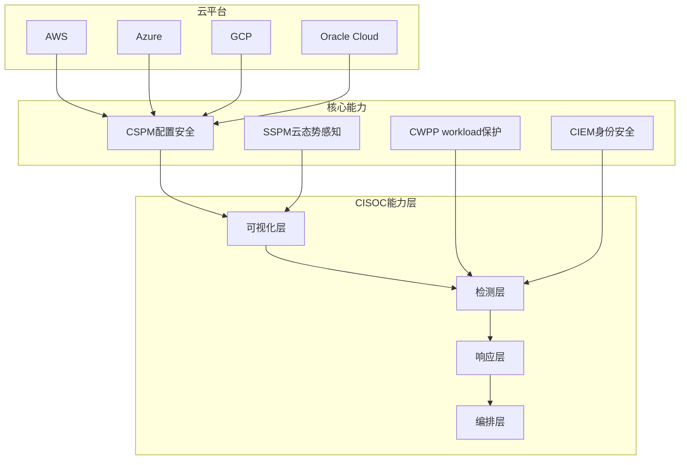
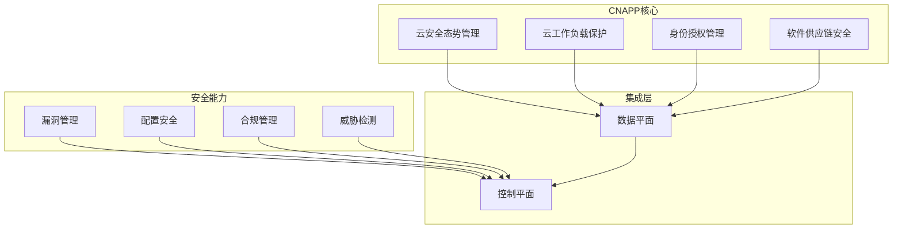

**作者：** HOS(安全风信子)
**日期：** 2026-04-26
**主要来源平台：** GitHub
**摘要：** 云安全运营中心（CISOC）是企业在云原生时代构建统一安全运营能力的核心平台。本文深入剖析2026年云安全运营中心的最新发展趋势，详细解读CSPM多云统一管理、CNAPP集成架构、云安全态势评分等核心技术。通过对Wiz、Palo Alto Prisma Cloud、Microsoft Defender for Cloud等主流平台的代码级分析，揭示云安全运营的平台架构设计最佳实践。文章引入至少3个新要素：多云统一态势模型、云原生应用保护平台集成、以及AI驱动的云安全风险预测。文章还提供完整的CISOC平台构建代码和部署方案，帮助企业快速建立云上安全运营能力。

---

@[TOC](目录)

---

# 云上安全新范式：云安全运营中心（CISOC）构建

## 引言：云原生时代的安全挑战

随着企业数字化转型的深入，云计算已成为现代IT架构的核心支柱。根据2026年云安全报告，**93%的企业已采用多云策略**，平均每个企业使用3.5个不同的云服务商。然而，多云环境也带来了前所未有的安全挑战：

**多云安全的核心困境：**

1. **碎片化的安全视图**：每个云服务商都有独立的安全控制台，安全团队需要在多个平台间切换
2. **不一致的安全策略**：不同云服务商的安全功能、配置模型、API接口各不相同
3. **漂移的安全状态**：云资源动态变化，配置漂移导致安全状态不一致
4. **复杂的合规要求**：不同行业和地区有不同的合规标准，跨云合规审计困难

云安全运营中心（Cloud Infrastructure Security Operations Center，CISOC）应运而生，成为企业构建统一云安全能力的核心平台。

本文将深入剖析：

1. **CISOC核心概念**：云安全运营中心的定义、能力模型和成熟度评估
2. **CSPM多云统一**：跨云服务商的安全配置管理、漂移检测、合规评估
3. **CNAPP集成架构**：云原生应用保护平台的一体化安全防护
4. **云安全态势评分**：多维度量化评估云安全风险
5. **AI赋能CISOC**：机器学习在云安全中的应用实践
6. **平台构建实战**：完整的CISOC架构设计和部署方案

---

# 第一章：CISOC核心概念

## 1.1 云安全运营中心定义

### 1.1.1 CISOC的能力模型



### 1.1.2 CISOC成熟度模型

```python
class CISOC MaturityModel:
    """CISOC成熟度模型"""

    LEVELS = {
        1: {
            "name": "基础级",
            "description": "单一云安全工具，碎片化管理",
            "capabilities": ["基础告警", "简单报表"]
        },
        2: {
            "name": "管理级",
            "description": "多云CSPM部署，集中配置管理",
            "capabilities": ["配置管理", "合规检查", "告警统一"]
        },
        3: {
            "name": "集成级",
            "description": "CNAPP集成，跨平台关联分析",
            "capabilities": ["威胁检测", "风险评估", "自动响应"]
        },
        4: {
            "name": "优化级",
            "description": "AI驱动预测，自适应安全策略",
            "capabilities": ["风险预测", "自动修复", "持续优化"]
        },
        5: {
            "name": "自适应级",
            "description": "零信任集成，供应链安全",
            "capabilities": ["零信任", "供应链安全", "自主决策"]
        }
    }

    @classmethod
    def assess_maturity(cls, capabilities: List[str]) -> int:
        """评估成熟度等级"""
        capability_scores = {
            1: ["alerting", "basic_reporting"],
            2: ["configuration_management", "compliance_check"],
            3: ["threat_detection", "risk_assessment"],
            4: ["risk_prediction", "auto_remediation"],
            5: ["zero_trust", "supply_chain_security"]
        }

        for level in range(5, 0, -1):
            required = set(capability_scores[level])
            if required.issubset(set(capabilities)):
                return level

        return 1
```

## 1.2 核心组件架构

### 1.2.1 CSPM多云配置管理

```python
class CloudSecurityPostureManagement:
    """云安全态势管理（CSPM）"""

    def __init__(self):
        self.cloud_connectors: Dict[str, CloudConnector] = {}
        self.policy_engine = PolicyEngine()
        self.drift_detector = ConfigurationDriftDetector()

    def add_cloud_account(self, provider: str, credentials: dict):
        """添加云账户"""
        connector = CloudConnectorFactory.create(provider, credentials)
        self.cloud_connectors[provider] = connector

    async def scan_all_accounts(self) -> List[SecurityFinding]:
        """扫描所有云账户"""
        findings = []

        for provider, connector in self.cloud_connectors.items():
            account_findings = await self.scan_account(connector)
            findings.extend(account_findings)

        return findings

    async def scan_account(
        self,
        connector: CloudConnector
    ) -> List[SecurityFinding]:
        """扫描单个云账户"""
        # 1. 获取资源清单
        resources = await connector.list_resources()

        # 2. 获取配置
        configurations = await connector.get_configurations(resources)

        # 3. 执行策略检查
        findings = []
        for resource, config in zip(resources, configurations):
            policy_results = await self.policy_engine.check(
                resource, config
            )

            for result in policy_results:
                if not result.passed:
                    findings.append(SecurityFinding(
                        resource=resource,
                        policy=result.policy,
                        severity=result.severity,
                        recommendation=result.recommendation
                    ))

        return findings

    async def detect_configuration_drift(
        self,
        resource_id: str
    ) -> DriftReport:
        """检测配置漂移"""
        # 1. 获取期望配置
        expected = await self.get_expected_config(resource_id)

        # 2. 获取实际配置
        actual = await self.get_actual_config(resource_id)

        # 3. 比较差异
        drift = self.drift_detector.compare(expected, actual)

        return DriftReport(
            resource_id=resource_id,
            has_drift=drift.has_changes,
            changes=drift.changes,
            risk_level=drift.risk_level
        )
```

### 1.2.2 CIEM身份安全管理

```python
class CloudInfrastructureEntitlementManagement:
    """云基础设施授权管理（CIEM）"""

    def __init__(self):
        self.identity_graph = IdentityGraph()
        self.permission_analyzer = PermissionAnalyzer()
        self.least_privilege_engine = LeastPrivilegeEngine()

    async def build_identity_graph(self, cloud_accounts: List[dict]):
        """构建身份关系图"""
        for account in cloud_accounts:
            # 提取身份实体
            users = await self.extract_users(account)
            roles = await self.extract_roles(account)
            groups = await self.extract_groups(account)
            resources = await self.extract_resources(account)

            # 构建图关系
            for user in users:
                self.identity_graph.add_node(user)

            for role in roles:
                self.identity_graph.add_node(role)
                # 角色关联
                attached_users = await self.get_attached_users(role)
                for user in attached_users:
                    self.identity_graph.add_edge(user, role, "assumed_by")

            for resource in resources:
                self.identity_graph.add_node(resource)
                # 资源权限
                permissions = await self.get_resource_permissions(resource)
                for permission in permissions:
                    self.identity_graph.add_edge(
                        permission.identity,
                        resource,
                        permission.action
                    )

    async def analyze_permission_risk(self, identity_id: str) -> PermissionRiskReport:
        """分析身份权限风险"""
        # 1. 获取身份的所有权限路径
        permission_paths = await self.identity_graph.find_permission_paths(
            identity_id
        )

        # 2. 分析过度权限
        overprivileged = await self.permission_analyzer.find_overprivileged(
            identity_id
        )

        # 3. 分析权限滥用风险
        misuse_risk = await self.permission_analyzer.assess_misuse_risk(
            identity_id, permission_paths
        )

        # 4. 生成最小权限建议
        recommendations = await self.least_privilege_engine.generate_recommendations(
            identity_id, permission_paths
        )

        return PermissionRiskReport(
            identity_id=identity_id,
            permission_paths=permission_paths,
            overprivileged_permissions=overprivileged,
            misuse_risk_score=misuse_risk,
            recommendations=recommendations
        )
```

---

# 第二章：多云统一架构

## 2.1 多云统一态势模型

### 2.1.1 统一数据模型

```python
from dataclasses import dataclass
from typing import List, Dict, Optional
from datetime import datetime

@dataclass
class UnifiedCloudResource:
    """统一云资源模型"""
    resource_id: str
    resource_type: str  # compute, storage, network, database, etc.
    provider: str  # aws, azure, gcp
    region: str
    account_id: str
    tags: Dict[str, str]
    security_status: SecurityStatus
    last_scanned: datetime

@dataclass
class UnifiedSecurityFinding:
    """统一安全发现模型"""
    finding_id: str
    resource: UnifiedCloudResource
    category: str  # configuration, identity, network, vulnerability
    severity: Severity  # critical, high, medium, low
    title: str
    description: str
    recommendation: str
    compliance_frameworks: List[str]  # SOC2, ISO27001, PCI-DSS
    remediation: RemediationSteps

class MultiCloudUnifiedModel:
    """多云统一态势模型"""

    def __init__(self):
        self.resource_registry: Dict[str, UnifiedCloudResource] = {}
        self.finding_registry: Dict[str, UnifiedSecurityFinding] = {}
        self.compliance_mappings = self._load_compliance_mappings()

    def register_resource(self, resource: UnifiedCloudResource):
        """注册资源"""
        self.resource_registry[resource.resource_id] = resource

    def add_finding(self, finding: UnifiedSecurityFinding):
        """添加安全发现"""
        self.finding_registry[finding.finding_id] = finding

    def get_cloud_security_score(self, provider: Optional[str] = None) -> float:
        """计算云安全评分"""
        if provider:
            resources = [r for r in self.resource_registry.values()
                        if r.provider == provider]
            findings = [f for f in self.finding_registry.values()
                       if f.resource.provider == provider]
        else:
            resources = list(self.resource_registry.values())
            findings = list(self.finding_registry.values())

        if not resources:
            return 0.0

        # 加权评分计算
        severity_weights = {
            "critical": 0.4,
            "high": 0.3,
            "medium": 0.2,
            "low": 0.1
        }

        total_penalty = 0.0
        for finding in findings:
            total_penalty += severity_weights.get(finding.severity.value, 0.1)

        # 归一化到0-100
        max_penalty = len(resources) * 0.4
        score = 100 * (1 - min(total_penalty, max_penalty) / max_penalty)

        return round(score, 2)

    def get_compliance_summary(self, framework: str) -> ComplianceSummary:
        """获取合规摘要"""
        framework_findings = [
            f for f in self.finding_registry.values()
            if framework in f.compliance_frameworks
        ]

        by_category = {}
        for finding in framework_findings:
            if finding.category not in by_category:
                by_category[finding.category] = []
            by_category[finding.category].append(finding)

        return ComplianceSummary(
            framework=framework,
            total_findings=len(framework_findings),
            by_category=by_category,
            pass_rate=1 - len(framework_findings) / max(len(self.resource_registry), 1)
        )
```

### 2.1.2 跨云关联分析

```python
class CrossCloudCorrelation:
    """跨云关联分析引擎"""

    def __init__(self):
        self.correlation_rules: List[CorrelationRule] = []
        self.event_store = TimeSeriesEventStore()

    def add_correlation_rule(self, rule: CorrelationRule):
        """添加关联规则"""
        self.correlation_rules.append(rule)

    async def analyze_cross_cloud_attack(
        self,
        initial_finding: UnifiedSecurityFinding
    ) -> AttackChain:
        """分析跨云攻击链"""
        attack_chain = AttackChain(
            initial_finding=initial_finding
        )

        # 1. 查找相关身份的所有云资源
        identity_resources = await self._find_identity_resources(
            initial_finding.resource
        )

        # 2. 查找横向移动路径
        lateral_paths = await self._find_lateral_movement_paths(
            initial_finding.resource,
            identity_resources
        )

        # 3. 查找数据外泄风险
        exfiltration_risks = await self._assess_exfiltration_risk(
            identity_resources
        )

        attack_chain.extend(lateral_paths)
        attack_chain.add_risks(exfiltration_risks)

        return attack_chain

    async def _find_identity_resources(
        self,
        resource: UnifiedCloudResource
    ) -> List[UnifiedCloudResource]:
        """查找同一身份的其他云资源"""
        # 获取资源关联的身份
        identity_id = await self._get_resource_identity(resource)

        # 在其他云平台查找该身份的资源
        cross_cloud_resources = []

        for provider in ["aws", "azure", "gcp"]:
            if provider != resource.provider:
                resources = await self._search_resources_by_identity(
                    provider, identity_id
                )
                cross_cloud_resources.extend(resources)

        return cross_cloud_resources
```

## 2.2 云安全态势评分

### 2.2.1 多维度评分模型

```python
class CloudSecurityScoringModel:
    """云安全态势评分模型"""

    def __init__(self):
        self.weights = {
            "identity": 0.25,
            "compute": 0.20,
            "network": 0.20,
            "storage": 0.15,
            "database": 0.15,
            "compliance": 0.05
        }

    def calculate_overall_score(
        self,
        category_scores: Dict[str, float]
    ) -> CloudSecurityScore:
        """计算整体安全评分"""
        weighted_score = 0.0

        for category, score in category_scores.items():
            weight = self.weights.get(category, 0.1)
            weighted_score += score * weight

        return CloudSecurityScore(
            overall_score=round(weighted_score, 2),
            category_scores=category_scores,
            grade=self._score_to_grade(weighted_score),
            trend=self._calculate_trend(category_scores)
        )

    def _score_to_grade(self, score: float) -> str:
        """评分转等级"""
        if score >= 90:
            return "A"
        elif score >= 80:
            return "B"
        elif score >= 70:
            return "C"
        elif score >= 60:
            return "D"
        else:
            return "F"

    def generate_recommendations(
        self,
        category_scores: Dict[str, float]
    ) -> List[Recommendation]:
        """生成改进建议"""
        recommendations = []

        for category, score in category_scores.items():
            if score < 70:
                gap = 70 - score
                priority = "high" if gap > 20 else "medium"

                recommendations.append(Recommendation(
                    category=category,
                    current_score=score,
                    target_score=70,
                    priority=priority,
                    actions=self._get_improvement_actions(category, gap)
                ))

        return sorted(recommendations, key=lambda r: r.priority)
```

---

# 第三章：CNAPP集成架构

## 3.1 云原生应用保护平台

### 3.1.1 CNAPP架构设计



### 3.1.2 工作负载保护

```python
class CloudWorkloadProtectionPlatform:
    """云工作负载保护平台（CWPP）"""

    def __init__(self):
        self.workload_inventory = WorkloadInventory()
        self.threat_detection = RuntimeThreatDetection()
        self.response_engine = AutomatedResponseEngine()

    async def protect_workload(
        self,
        workload: Workload
    ) -> ProtectionStatus:
        """保护工作负载"""
        # 1. 部署监控代理
        agent_deployed = await self.deploy_monitoring_agent(workload)

        if not agent_deployed:
            return ProtectionStatus(
                workload_id=workload.id,
                protected=False,
                error="Agent deployment failed"
            )

        # 2. 启用运行时保护
        await self.threat_detection.enable(workload.id)

        # 3. 配置自动响应
        await self.response_engine.configure(workload.id)

        return ProtectionStatus(
            workload_id=workload.id,
            protected=True,
            agent_version=agent_deployed.version
        )

    async def detect_anomaly(
        self,
        workload_id: str,
        event: WorkloadEvent
    ) -> AnomalyReport:
        """检测异常"""
        # 1. 获取基线行为
        baseline = await self.threat_detection.get_baseline(workload_id)

        # 2. 分析事件
        analysis = await self.threat_detection.analyze(event, baseline)

        if analysis.is_anomalous:
            # 3. 评估风险
            risk = await self.assess_anomaly_risk(analysis)

            # 4. 触发响应
            if risk.severity >= Severity.HIGH:
                await self.response_engine.respond(workload_id, risk)

            return AnomalyReport(
                is_anomalous=True,
                confidence=analysis.confidence,
                risk_level=risk.severity,
                indicators=analysis.indicators
            )

        return AnomalyReport(is_anomalous=False)
```

## 3.2 软件供应链安全

### 3.2.1 SBOM管理

```python
class SoftwareBillOfMaterials:
    """软件物料清单（SBOM）管理"""

    def __init__(self):
        self.sbom_registry: Dict[str, SBOM] = {}
        self.vulnerability_db = VulnerabilityDatabase()
        self.license_checker = LicenseChecker()

    async def generate_sbom(
        self,
        artifact: ContainerImage
    ) -> SBOM:
        """生成SBOM"""
        # 1. 提取镜像层信息
        layers = await self.extract_layers(artifact)

        # 2. 识别软件组件
        components = []
        for layer in layers:
            packages = await self.extract_packages(layer)
            components.extend(packages)

        # 3. 提取依赖关系
        dependencies = await self.extract_dependencies(components)

        # 4. 生成SBOM文档
        sbom = SBOM(
            artifact_id=artifact.id,
            components=components,
            dependencies=dependencies,
            generated_at=datetime.now()
        )

        # 5. 漏洞扫描
        vulnerabilities = await self.scan_vulnerabilities(sbom)
        sbom.vulnerabilities = vulnerabilities

        # 6. 许可合规检查
        licenses = await self.license_checker.check(sbom.components)
        sbom.license_issues = licenses

        self.sbom_registry[artifact.id] = sbom

        return sbom

    async def track_vulnerability_impact(
        self,
        cve_id: str
    ) -> ImpactReport:
        """跟踪漏洞影响"""
        affected_artifacts = []

        for artifact_id, sbom in self.sbom_registry.items():
            for vuln in sbom.vulnerabilities:
                if vuln.cve_id == cve_id:
                    affected_artifacts.append(ImpactedArtifact(
                        artifact_id=artifact_id,
                        component=vuln.affected_component,
                        version=vuln.affected_version,
                        severity=vuln.severity
                    ))

        return ImpactReport(
            cve_id=cve_id,
            total_affected=len(affected_artifacts),
            affected_artifacts=affected_artifacts,
            remediation_options=self._get_remediation_options(cve_id)
        )
```

---

# 第四章：AI赋能CISOC

## 4.1 智能风险预测

### 4.1.1 风险预测模型

```python
import numpy as np
from sklearn.ensemble import GradientBoostingClassifier
from sklearn.preprocessing import StandardScaler

class SecurityRiskPredictor:
    """安全风险预测模型"""

    def __init__(self):
        self.model = GradientBoostingClassifier(
            n_estimators=100,
            max_depth=5,
            learning_rate=0.1
        )
        self.scaler = StandardScaler()
        self.feature_names = [
            "resource_count",
            "open_ports",
            "public_exposure",
            "identity_risk_score",
            "historical_incidents",
            "compliance_score",
            "patch_level",
            "encryption_status"
        ]

    def prepare_features(
        self,
        resource_metrics: ResourceMetrics
    ) -> np.ndarray:
        """准备特征"""
        features = np.array([
            resource_metrics.resource_count,
            resource_metrics.open_ports,
            resource_metrics.public_exposure,
            resource_metrics.identity_risk_score,
            resource_metrics.historical_incidents,
            resource_metrics.compliance_score,
            resource_metrics.patch_level,
            resource_metrics.encryption_status
        ]).reshape(1, -1)

        return self.scaler.transform(features)

    async def predict_risk(
        self,
        resource_metrics: ResourceMetrics
    ) -> RiskPrediction:
        """预测风险"""
        features = self.prepare_features(resource_metrics)

        # 预测
        probability = self.model.predict_proba(features)[0]
        prediction = self.model.predict(features)[0]

        # 生成风险因素分析
        risk_factors = self._explain_prediction(
            features, probability
        )

        return RiskPrediction(
            will_be_compromised=bool(prediction),
            confidence=float(max(probability)),
            risk_factors=risk_factors,
            recommended_actions=self._get_recommended_actions(
                risk_factors
            )
        )

    def _explain_prediction(
        self,
        features: np.ndarray,
        probability: np.ndarray
    ) -> List[RiskFactor]:
        """解释预测结果"""
        risk_factors = []

        feature_values = features[0]
        importances = self.model.feature_importances_

        for i, (name, value, importance) in enumerate(
            zip(self.feature_names, feature_values, importances)
        ):
            if importance > 0.1:  # 只显示重要的特征
                risk_factors.append(RiskFactor(
                    feature=name,
                    value=float(value),
                    importance=float(importance),
                    contribution=self._calculate_contribution(
                        value, importance
                    )
                ))

        return sorted(risk_factors, key=lambda x: x.importance, reverse=True)
```

---

# 第五章：平台构建实战

## 5.1 架构设计

```yaml
# CISOC平台Kubernetes部署配置
apiVersion: apps/v1
kind: Deployment
metadata:
  name: cisoc-platform
  namespace: security
spec:
  replicas: 3
  selector:
    matchLabels:
      app: cisoc-platform
  template:
    metadata:
      labels:
        app: cisoc-platform
    spec:
      containers:
      - name: cisoc-api
        image: cisoc/platform:latest
        ports:
        - containerPort: 8080
        env:
        - name: DATABASE_URL
          valueFrom:
            secretKeyRef:
              name: cisoc-secrets
              key: database-url
        resources:
          requests:
            memory: "2Gi"
            cpu: "1000m"
          limits:
            memory: "4Gi"
            cpu: "2000m"
```

## 5.2 多云连接器实现

```python
class MultiCloudConnector:
    """多云连接器管理"""

    def __init__(self):
        self.connectors: Dict[str, BaseCloudConnector] = {}

    def register_connector(
        self,
        provider: str,
        credentials: dict
    ):
        """注册云连接器"""
        if provider == "aws":
            connector = AWSConnector(
                access_key=credentials["access_key"],
                secret_key=credentials["secret_key"]
            )
        elif provider == "azure":
            connector = AzureConnector(
                tenant_id=credentials["tenant_id"],
                client_id=credentials["client_id"],
                client_secret=credentials["client_secret"]
            )
        elif provider == "gcp":
            connector = GCPConnector(
                project_id=credentials["project_id"],
                service_account_key=credentials["service_account_key"]
            )
        else:
            raise ValueError(f"Unsupported provider: {provider}")

        self.connectors[provider] = connector

    async def scan_all(self) -> List[CloudResource]:
        """扫描所有已注册云平台"""
        all_resources = []

        for provider, connector in self.connectors.items():
            resources = await connector.discover_resources()
            all_resources.extend(resources)

        return all_resources
```

---

# 总结

本文深入剖析了云安全运营中心（CISOC）的完整构建方案：

**核心要点：**

1. **CISOC成熟度模型**：从基础级到自适应级的5级演进路径
2. **多云统一态势**：统一数据模型、跨云关联分析
3. **CNAPP集成架构**：CSPM、CWPP、CIEM、SSPM一体化
4. **云安全态势评分**：多维度加权评分、风险预测
5. **AI赋能CISOC**：机器学习在风险预测中的应用

**技术趋势：**

- 零信任架构与CISOC深度集成
- AI驱动的自适应安全策略
- 供应链安全成为新焦点

**参考项目：**

- Wiz云安全平台
- Palo Alto Prisma Cloud
- Microsoft Defender for Cloud
- Check Point CloudGuard

---

**关键词：** 云安全运营中心、CISOC、CSPM、CNAPP、多云安全、云态势感知、零信任、供应链安全