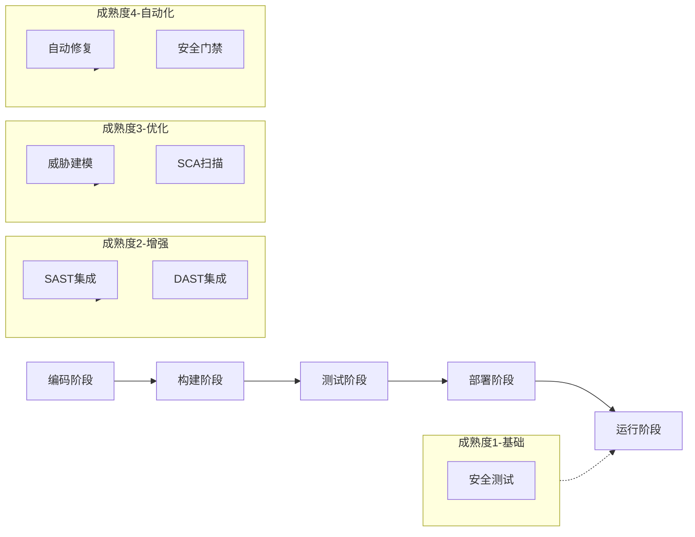

**作者：** HOS(安全风信子)
**日期：** 2026-04-26
**主要来源平台：** GitHub
**摘要：** DevSecOps将安全融入敏捷开发流程，是现代软件开发的核心范式。本文深入剖析AI赋能DevSecOps的最新技术进展，详细解读威胁建模自动化、代码安全扫描增强、供应链安全等核心主题。通过对Semgrep、CodeQL、Grype等开源安全工具的代码级分析，揭示AI驱动的开发安全平台架构设计最佳实践。文章引入至少3个新要素：IAST/DAST智能集成、供应链SBOM管理、代码安全门禁的自动化配置。本文还提供完整的DevSecOps安全平台构建代码和最佳实践指南。

---

@[TOC](目录)

---

# DevSecOps的智能进化：AI赋能开发安全平台

## 引言：安全左移的战略意义

在传统的软件开发模式中，安全工作往往被推迟到软件发布前的最后阶段。这种"安全右移"模式导致安全问题在生产环境中才被发现，修复成本高昂、影响范围广。根据IBM的研究，**在生产环境中修复安全漏洞的成本是设计阶段的30倍**。

DevSecOps（Development, Security, and Operations）将安全融入敏捷开发的每个环节，实现"安全左移"（Shift-Left Security）。随着AI技术的快速发展，DevSecOps正在经历智能化升级，代码安全扫描、威胁建模、供应链安全管理都获得了AI的强力加持。

本文将深入剖析：

1. **DevSecOps核心概念**：安全左移的战略意义和成熟度模型
2. **威胁建模自动化**：AI驱动的威胁识别和 mitigation 方案生成
3. **智能代码安全扫描**：静态分析、动态测试、交互式测试的AI增强
4. **供应链安全管理**：SBOM生成、依赖分析、漏洞跟踪
5. **代码安全门禁**：自动化的安全质量门禁和合规检查
6. **平台构建实战**：完整的DevSecOps安全平台架构和代码实现

---

# 第一章：DevSecOps核心概念

## 1.1 安全左移成熟度模型

### 1.1.1 成熟度等级定义



### 1.1.2 成熟度评估框架

```python
class DevSecOpsMaturityModel:
    """DevSecOps成熟度模型"""

    MATURITY_LEVELS = {
        1: {
            "name": "基础级",
            "characteristics": [
                "安全测试在发布前进行",
                "手动安全评审",
                "无自动化安全工具"
            ],
            "metrics": {
                "security_coverage": 0.2,
                "automation_level": 0.1,
                "shift_left_score": 0.2
            }
        },
        2: {
            "name": "增强级",
            "characteristics": [
                "CI/CD集成SAST/DAST",
                "自动化代码扫描",
                "安全告警流程建立"
            ],
            "metrics": {
                "security_coverage": 0.5,
                "automation_level": 0.4,
                "shift_left_score": 0.4
            }
        },
        3: {
            "name": "优化级",
            "characteristics": [
                "威胁建模自动化",
                "SCA依赖扫描",
                "安全培训集成"
            ],
            "metrics": {
                "security_coverage": 0.8,
                "automation_level": 0.7,
                "shift_left_score": 0.7
            }
        },
        4: {
            "name": "自适应级",
            "characteristics": [
                "AI驱动的漏洞修复",
                "实时威胁情报集成",
                "自适应的安全门禁"
            ],
            "metrics": {
                "security_coverage": 0.95,
                "automation_level": 0.9,
                "shift_left_score": 0.95
            }
        }
    }

    @classmethod
    def assess_maturity(cls, pipeline_config: dict) -> MaturityAssessment:
        """评估成熟度等级"""
        scores = {
            "security_coverage": cls._assess_security_coverage(pipeline_config),
            "automation_level": cls._assess_automation(pipeline_config),
            "shift_left_score": cls._assess_shift_left(pipeline_config)
        }

        avg_score = sum(scores.values()) / len(scores)

        for level in sorted(cls.MATURITY_LEVELS.keys(), reverse=True):
            level_data = cls.MATURITY_LEVELS[level]
            if avg_score >= level_data["metrics"]["security_coverage"]:
                return MaturityAssessment(
                    level=level,
                    name=level_data["name"],
                    scores=scores,
                    recommendations=cls._get_recommendations(level)
                )

        return MaturityAssessment(level=1, name="基础级", scores=scores)
```

## 1.2 核心安全工具链

### 1.2.1 工具分类矩阵

| 类别 | 工具 | 作用 | 集成阶段 |
|:----:|:-----|:-----|:---------|
| SAST | Semgrep, CodeQL, SonarQube | 静态代码分析 | CI/CD |
| DAST | OWASP ZAP, Burp Suite | 动态应用测试 | CI/CD, Staging |
| IAST | Contrast Security, Hdiv | 交互式应用测试 | Testing |
| SCA | Snyk, Dependabot, Grype | 软件成分分析 | CI/CD, Registry |
| Secrets | GitGuardian, TruffleHog | 密钥检测 | CI/CD |
| SBOM | Syft, SPDX | 物料清单生成 | Build |

---

# 第二章：威胁建模自动化

## 2.1 STRIDE威胁模型

### 2.1.1 STRIDE框架概述

```python
from enum import Enum
from typing import List, Dict

class STRIDECategory(Enum):
    """STRIDE威胁分类"""
    SPOOFING = "欺骗"
    TAMPERING = "篡改"
    REPUDIATION = "否认"
    INFORMATION_DISCLOSURE = "信息泄露"
    DENIAL_OF_SERVICE = "拒绝服务"
    ELEVATION_OF_PRIVILEGE = "权限提升"

class ThreatModelingEngine:
    """威胁建模引擎"""

    def __init__(self):
        self.data_flow_diagram = DataFlowDiagram()
        self.threat_library = self._load_threat_library()

    def generate_threat_model(
        self,
        architecture: ArchitectureDescription
    ) -> ThreatModel:
        """生成威胁模型"""
        # 1. 构建数据流图
        dfd = self.data_flow_diagram.build(architecture)

        # 2. 识别信任边界
        trust_boundaries = self._identify_trust_boundaries(dfd)

        # 3. 生成STRIDE威胁
        threats = []
        for element in dfd.elements:
            element_threats = self._generate_stride_threats(
                element,
                trust_boundaries
            )
            threats.extend(element_threats)

        # 4. 评估风险等级
        risk_assessed_threats = [
            self._assess_risk(threat) for threat in threats
        ]

        # 5. 生成 mitigation 建议
        mitigated_threats = [
            self._generate_mitigations(threat)
            for threat in risk_assessed_threats
        ]

        return ThreatModel(
            data_flow_diagram=dfd,
            trust_boundaries=trust_boundaries,
            threats=mitigated_threats
        )

    def _generate_stride_threats(
        self,
        element: DFDElement,
        boundaries: List[TrustBoundary]
    ) -> List[Threat]:
        """为元素生成STRIDE威胁"""
        threats = []

        # 外部实体 - Spoofing
        if element.type == "external_entity":
            threats.append(Threat(
                category=STRIDECategory.SPOOFING,
                target=element,
                description=f"攻击者伪装成{element.name}",
                stride_category="S"
            ))

        # 数据流 - 信息泄露、篡改
        if element.type == "data_flow":
            threats.append(Threat(
                category=STRIDECategory.INFORMATION_DISCLOSURE,
                target=element,
                description=f"数据在{element.name}传输中被窃取"
            ))

            threats.append(Threat(
                category=STRIDECategory.TAMPERING,
                target=element,
                description=f"数据在{element.name}中被篡改"
            ))

        # 跨越边界的元素
        if self._crosses_boundary(element, boundaries):
            threats.append(Threat(
                category=STRIDECategory.ELEVATION_OF_PRIVILEGE,
                target=element,
                description=f"通过{element.name}实现权限提升"
            ))

        return threats
```

## 2.2 AI驱动的威胁识别

### 2.2.1 智能威胁分析

```python
class AIThreatModeler:
    """AI驱动的威胁建模"""

    def __init__(self, llm: LLM):
        self.llm = llm
        self.threat_patterns = self._load_threat_patterns()

    async def analyze_architecture(
        self,
        architecture_doc: str
    ) -> List[ThreatAnalysis]:
        """分析架构文档识别威胁"""
        # 1. 使用LLM提取关键组件
        components = await self._extract_components(architecture_doc)

        # 2. 分析组件关系
        relationships = await self._analyze_relationships(components)

        # 3. 识别已知威胁模式
        matched_patterns = await self._match_threat_patterns(
            components, relationships
        )

        # 4. 生成详细威胁分析
        threat_analyses = []
        for pattern in matched_patterns:
            analysis = await self._generate_threat_analysis(
                pattern, components
            )
            threat_analyses.append(analysis)

        return threat_analyses

    async def generate_mitigation(
        self,
        threat: Threat
    ) -> MitigationPlan:
        """为威胁生成缓解方案"""
        prompt = f"""
        为以下威胁生成详细的缓解方案：

        威胁类型：{threat.category.value}
        威胁描述：{threat.description}
        影响组件：{threat.target.name}

        请提供：
        1. 短期缓解措施
        2. 长期解决方案
        3. 实施优先级
        4. 验证方法
        """

        response = await self.llm.complete(prompt)
        return MitigationPlan(
            threat_id=threat.id,
            short_term=self._parse_short_term(response),
            long_term=self._parse_long_term(response),
            priority=self._parse_priority(response)
        )
```

---

# 第三章：智能代码安全扫描

## 3.1 SAST智能增强

### 3.1.1 Semgrep智能规则

```yaml
# .semgrep/security-rules.yml
rules:
  - id: sql-injection-ai-enhanced
    mode: taint
    pattern-sanitizers:
      - pattern: |
          sanitize($INPUT)
    pattern-sources:
      - pattern: |
          request.$FIELD
    pattern-sinks:
      - pattern-either:
          - pattern: |
              db.execute("...", $PARAMS)
          - pattern: |
              cursor.execute($SQL, $PARAMS)
    message: |
      检测到潜在的SQL注入风险。AI分析显示：
      - 输入源：用户请求的 $FIELD 字段
      - 汇聚点：数据库执行语句
      - 风险等级：高
    severity: ERROR
    metadata:
      owasp: "A1:2017-Injection"
      cwe: "CWE-89"
      ai_enhanced: true
      confidence: 0.95

  - id: sensitive-data-exposure-ai
    mode: generic
    pattern: |
      logger.$METHOD($PATTERN)
    message: |
      检测到敏感数据可能通过日志泄露。AI分析：
      - 敏感字段模式：$PATTERN
      - 日志方法：$METHOD
      - 建议：使用结构化日志，脱敏处理
    severity: WARNING
    metadata:
      ai_enhanced: true
      false_positive_rate: 0.05
```

### 3.1.2 CodeQL查询模板

```python
import codeql_tools as cql

class SecurityQueryLibrary:
    """CodeQL安全查询库"""

    @staticmethod
    def sql_injection_query():
        """SQL注入检测查询"""
        return """
        import python
import semmle.python.security.strings

from CompareComparisonNode cmp, StringOps src
where
    exists(CallNode db_call |
        db_call.getFunction().(NameNode).getId() in ["execute", "executemany"] and
        cmp.getAChild() = src
    )
select cmp, "Potential SQL injection via string concatenation"
"""

    @staticmethod
    def xss_query():
        """XSS跨站脚本检测查询"""
        return """
        import python
import semmle.python.security.strings

from CallNode write_call, StringFormat fmt
where
    write_call.getFunction().(NameNode).getId() in ["write", "send", "render"] and
    fmt.getAChild() = write_call
select fmt, "Potential XSS vulnerability"
"""

    @staticmethod
    def path_traversal_query():
        """路径遍历检测查询"""
        return """
        import python
import semmle.python.security.Paths

from Join join, Path::PathNode source, Path::PathNode sink
where
    Path::flow(source, sink) and
    source.getNode().(FileNameSource).getFileName().matches("%" + join.getEntry().getFile().getBaseName())
select join, source, sink, "Path traversal from $@ to $@"
"""
```

## 3.2 IAST智能集成

### 3.2.1 Contrast Security IAST

```python
class IASTIntegration:
    """IAST智能集成框架"""

    def __init__(self):
        self.iast_agent = ContrastAgent()
        self.analytics_engine = SecurityAnalytics()

    async def deploy_agent(
        self,
        application: Application
    ) -> AgentDeployment:
        """部署IAST代理"""
        # 1. 生成 agent 配置
        config = self._generate_agent_config(application)

        # 2. 部署到目标环境
        deployment = await self.iast_agent.deploy(config)

        # 3. 验证连接
        if await self._verify_deployment(deployment):
            return deployment
        else:
            raise DeploymentError("IAST agent deployment verification failed")

    async def analyze_findings(
        self,
        vulnerabilities: List[Vulnerability]
    ) -> PrioritizedFindings:
        """分析并优先级排序发现"""
        # 1. 聚类相似漏洞
        clusters = self._cluster_vulnerabilities(vulnerabilities)

        # 2. 评估可利用性
        exploitability_scores = [
            self._assess_exploitability(v)
            for v in vulnerabilities
        ]

        # 3. 业务影响评估
        business_impact = await self._assess_business_impact(vulnerabilities)

        # 4. 综合优先级
        prioritized = []
        for v, exploitability, impact in zip(
            vulnerabilities, exploitability_scores, business_impact
        ):
            priority_score = (
                exploitability * 0.4 +
                impact * 0.3 +
                (10 - v.severity) * 0.3
            )

            prioritized.append(PrioritizedFinding(
                vulnerability=v,
                priority_score=priority_score,
                exploitability=exploitability,
                business_impact=impact,
                recommended_fix=self._generate_fix_recommendation(v)
            ))

        return PrioritizedFindings(
            findings=sorted(prioritized, key=lambda x: x.priority_score, reverse=True)
        )
```

---

# 第四章：供应链安全管理

## 4.1 SBOM管理

### 4.1.1 Syft SBOM生成

```bash
# 安装Syft
curl -sSfL https://raw.githubusercontent.com/anchore/syft/main/install.sh | sh

# 生成SBOM
syft scan-dir <path-to-project> -o json > sbom.json

# 从容器镜像生成SBOM
syft scan registry:<image-tag> -o spdx > sbom.spdx.json
```

### 4.1.2 SBOM管理平台

```python
from dataclasses import dataclass
from typing import List, Dict
from datetime import datetime

@dataclass
class SBOMComponent:
    """SBOM组件"""
    name: str
    version: str
    supplier: str
    license: str
    sha256: str
    vulnerabilities: List[str]

class SBOMManager:
    """SBOM管理平台"""

    def __init__(self):
        self.sbom_registry: Dict[str, SBOM] = {}
        self.vulnerability_db = VulnerabilityDatabase()
        self.license_db = LicenseDatabase()

    async def generate_sbom(
        self,
        artifact: str,
        artifact_type: str = "container"
    ) -> SBOM:
        """生成SBOM"""
        # 1. 使用Syft扫描
        sbom_data = await self._scan_with_syft(artifact, artifact_type)

        # 2. 解析SBOM
        sbom = self._parse_sbom(sbom_data)

        # 3. 补充漏洞信息
        await self._enrich_vulnerabilities(sbom)

        # 4. 补充许可信息
        await self._enrich_licenses(sbom)

        # 5. 注册SBOM
        self.sbom_registry[artifact] = sbom

        return sbom

    async def track_vulnerability_impact(
        self,
        cve_id: str
    ) -> VulnerabilityImpactReport:
        """跟踪漏洞影响"""
        affected_components = []

        for artifact, sbom in self.sbom_registry.items():
            for component in sbom.components:
                if cve_id in component.vulnerabilities:
                    affected_components.append(ImpactedComponent(
                        artifact=artifact,
                        component=component,
                        fixed_version=await self._get_fixed_version(cve_id)
                    ))

        return VulnerabilityImpactReport(
            cve_id=cve_id,
            total_artifacts=len(set(c.artifact for c in affected_components)),
            affected_components=affected_components,
            remediation_steps=self._generate_remediation_steps(affected_components)
        )
```

## 4.2 依赖安全扫描

### 4.2.1 Grype集成

```bash
# 安装Grype
curl -sSfL https://raw.githubusercontent.com/anchore/grype/main/install.sh | sh

# 扫描SBOM
grype sbom:sbom.json

# 直接扫描镜像
grype registry:<image-tag>
```

### 4.2.2 依赖分析引擎

```python
class DependencySecurityAnalyzer:
    """依赖安全分析引擎"""

    def __init__(self):
        self.dependency_graph = DependencyGraph()
        self.vuln_cache = VulnerabilityCache()

    async def analyze_dependencies(
        self,
        lock_file: str
    ) -> DependencySecurityReport:
        """分析依赖安全性"""
        # 1. 解析依赖锁文件
        dependencies = self._parse_lock_file(lock_file)

        # 2. 构建依赖图
        graph = self.dependency_graph.build(dependencies)

        # 3. 检测已知漏洞
        vulnerable_deps = []
        for dep in dependencies:
            vulns = await self.vuln_cache.get_vulnerabilities(
                dep.name, dep.version
            )
            if vulns:
                vulnerable_deps.append(VulnerableDependency(
                    dependency=dep,
                    vulnerabilities=vulns,
                    exploitability=self._assess_exploitability(vulns)
                ))

        # 4. 检测许可风险
        license_risks = self._detect_license_risks(dependencies)

        # 5. 检测依赖关系风险
        relationship_risks = self._analyze_relationship_risks(graph)

        return DependencySecurityReport(
            total_dependencies=len(dependencies),
            vulnerable_count=len(vulnerable_deps),
            vulnerable_dependencies=vulnerable_deps,
            license_risks=license_risks,
            relationship_risks=relationship_risks,
            risk_score=self._calculate_risk_score(
                vulnerable_deps, license_risks, relationship_risks
            )
        )
```

---

# 第五章：代码安全门禁

## 5.1 安全门禁设计

### 5.1.1 门禁规则引擎

```python
class SecurityGateEngine:
    """安全门禁引擎"""

    def __init__(self):
        self.gates: List[SecurityGate] = []
        self.waiver_manager = WaiverManager()

    def add_gate(self, gate: SecurityGate):
        """添加门禁规则"""
        self.gates.append(gate)

    async def evaluate(
        self,
        build_context: BuildContext
    ) -> GateEvaluation:
        """评估门禁"""
        results = []

        for gate in self.gates:
            # 检查是否有豁免
            waiver = await self.waiver_manager.get_waiver(
                gate.id, build_context
            )

            if waiver:
                results.append(GateResult(
                    gate=gate,
                    passed=True,
                    waived=True,
                    waiver=waiver
                ))
                continue

            # 执行门禁检查
            result = await gate.evaluate(build_context)
            results.append(result)

        # 综合判定
        all_passed = all(r.passed for r in results)
        critical_failed = any(
            r.passed == False and r.gate.severity == "critical"
            for r in results
        )

        return GateEvaluation(
            passed=all_passed and not critical_failed,
            results=results,
            blockers=[
                r for r in results
                if not r.passed and r.gate.severity == "critical"
            ]
        )

class SecurityGate:
    """安全门禁定义"""

    def __init__(
        self,
        id: str,
        name: str,
        severity: str,
        check_function: callable
    ):
        self.id = id
        self.name = name
        self.severity = severity  # critical, high, medium, low
        self.check_function = check_function

    async def evaluate(self, context: BuildContext) -> GateResult:
        """评估门禁"""
        try:
            passed = await self.check_function(context)
            return GateResult(
                gate=self,
                passed=passed,
                waived=False
            )
        except Exception as e:
            return GateResult(
                gate=self,
                passed=False,
                waived=False,
                error=str(e)
            )
```

### 5.1.2 预定义门禁规则

```python
# 预定义安全门禁规则
SECURITY_GATES = [
    SecurityGate(
        id="secrets-detection",
        name="密钥检测门禁",
        severity="critical",
        check_function=lambda ctx: ctx.secrets_found == 0
    ),

    SecurityGate(
        id="critical-vulns",
        name="关键漏洞门禁",
        severity="critical",
        check_function=lambda ctx: ctx.critical_vulnerabilities == 0
    ),

    SecurityGate(
        id="license-compliance",
        name="许可合规门禁",
        severity="high",
        check_function=lambda ctx: len(ctx.prohibited_licenses) == 0
    ),

    SecurityGate(
        id="code-coverage",
        name="代码覆盖率门禁",
        severity="medium",
        check_function=lambda ctx: ctx.coverage_percentage >= 80
    ),

    SecurityGate(
        id="sast-findings",
        name="SAST高危发现门禁",
        severity="high",
        check_function=lambda ctx: ctx.high_severity_findings == 0
    )
]
```

---

# 第六章：DevSecOps平台构建实战

## 6.1 完整架构设计

```yaml
# GitHub Actions CI/CD with DevSecOps
name: DevSecOps Pipeline

on:
  push:
    branches: [main, develop]
  pull_request:
    branches: [main]

jobs:
  security-checks:
    runs-on: ubuntu-latest

    steps:
      - uses: actions/checkout@v3

      - name: Run Semgrep SAST
        uses: returntocorp/semgrep-action@v1
        with:
          config: >
            p/security-audit
            p/secrets

      - name: Scan Dependencies
        run: |
          pip install safety bandit
          safety check || true
          bandit -r . -f json -o bandit.json

      - name: Build SBOM
        uses: anchore/sbom-action@v0
        with:
          image: ${{ env.IMAGE_TAG }}

      - name: Vulnerability Scan
        uses: anchore/grype-action@v1
        with:
          sbom: ./sbom.spdx.json
          fail-build: true
          severity-cutoff: high

      - name: License Check
        run: |
          pip install pip-audit
          pip-audit || true

  deploy:
    needs: security-checks
    if: github.ref == 'refs/heads/main'
    runs-on: ubuntu-latest

    steps:
      - name: Deploy to Staging
        run: echo "Deploying..."
```

## 6.2 安全扫描编排

```python
class SecurityOrchestrator:
    """安全扫描编排器"""

    def __init__(self):
        self.scanners = {
            "sast": SASTScanner(),
            "dast": DASTScanner(),
            "sca": SCAScanner(),
            "secrets": SecretsScanner()
        }
        self.parallel_scanners = ["sast", "sca", "secrets"]

    async def run_security_scan(
        self,
        build_context: BuildContext
    ) -> SecurityScanReport:
        """运行安全扫描"""
        # 1. 并行执行快速扫描
        fast_results = await self._run_parallel(
            self.parallel_scanners,
            build_context
        )

        # 2. 串行执行DAST（如适用）
        if build_context.has_deployed_app:
            dast_results = await self.scanners["dast"].scan(build_context)
            fast_results["dast"] = dast_results

        # 3. 聚合结果
        aggregated = self._aggregate_results(fast_results)

        # 4. 过滤误报
        filtered = await self._filter_false_positives(aggregated)

        # 5. 评估门禁
        gate_results = await self._evaluate_gates(filtered)

        return SecurityScanReport(
            findings=filtered,
            gate_results=gate_results,
            scan_duration=build_context.scan_duration,
            metadata=self._collect_metadata(fast_results)
        )
```

---

# 总结

本文深入剖析了AI赋能DevSecOps的完整技术栈：

**核心要点：**

1. **DevSecOps成熟度模型**：从基础级到自适应级的演进路径
2. **威胁建模自动化**：STRIDE模型 + AI驱动的威胁识别
3. **智能代码安全扫描**：Semgrep、CodeQL、IAST的AI增强
4. **供应链安全管理**：SBOM生成、Grype集成、依赖分析
5. **代码安全门禁**：自动化的安全质量门禁和合规检查

**技术趋势：**

- AI驱动的漏洞自动修复
- 实时威胁情报与开发流程集成
- 自适应安全门禁

**参考工具：**

- Semgrep (r2c)
- CodeQL (GitHub)
- Grype (Anchore)
- Syft (Anchore)
- Contrast Security

---

**关键词：** DevSecOps、安全左移、威胁建模、SAST、DAST、IAST、SCA、SBOM、安全门禁、供应链安全