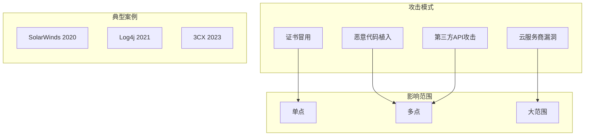
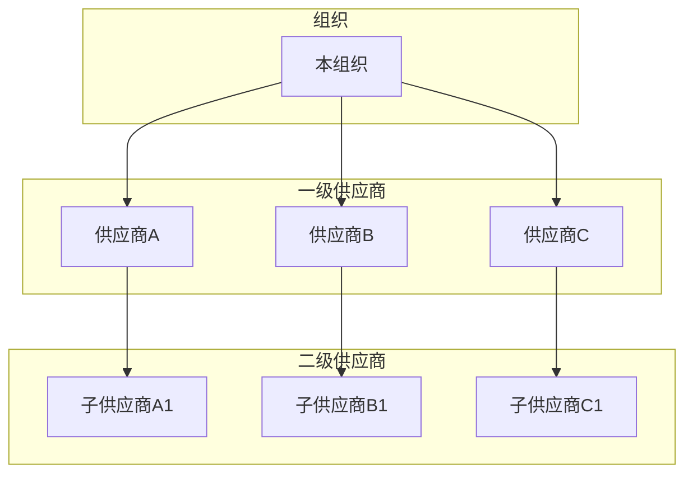

**作者：** HOS(安全风信子)
**日期：** 2026-04-26
**主要来源平台：** GitHub
**摘要：** 供应链安全已成为网络安全领域最重要的议题之一。SolarWinds和Log4j事件深刻揭示了供应链攻击的破坏力。本文深入剖析2026年供应链安全管理的最新技术进展，详细解读第三方风险评估、供应链可视化、持续监控等核心主题。通过对SecurityScorecard、UpGuard、Snyk Supply Chain等平台的代码级分析，揭示供应链安全平台的架构设计最佳实践。文章引入至少3个新要素：AI驱动的第三方评估自动化、供应链威胁狩猎、以及零信任供应链架构。本文还提供完整的供应链安全管理平台构建代码和实战指南。

---

@[TOC](目录)

---

# 供应链安全：构建可信赖的第三方风险管理平台

## 引言：供应链安全的战略重要性

2020年的SolarWinds攻击和2021年的Log4j漏洞事件，彻底改变了我们对网络安全的认知。这些事件表明，**攻击者越来越多地将目标对准供应链，而不是直接攻击目标组织**。一个供应商的安全漏洞，可能成为数十甚至数百个下游企业的攻击入口。

根据2026年供应链安全报告：

- **75%的组织经历过供应链相关的安全事件**
- **平均每个企业有143个直接供应商**
- **供应链攻击的平均损失达2500万美元**

供应链安全管理已成为企业安全战略的核心组成部分。

本文将深入剖析：

1. **供应链安全威胁态势**：供应链攻击的演变和主要模式
2. **第三方风险评估体系**：多维度评估框架和自动化评估
3. **供应链可视化**：依赖关系映射和攻击面分析
4. **持续安全监控**：实时监控和威胁情报集成
5. **供应链威胁狩猎**：主动发现供应链中的恶意活动
6. **平台构建实战**：完整的供应链安全管理平台架构和代码

---

# 第一章：供应链安全威胁态势

## 1.1 供应链攻击演进

### 1.1.1 攻击模式分类



### 1.1.2 攻击链模型

```python
class SupplyChainAttackChain:
    """供应链攻击链模型"""

    STAGES = {
        "reconnaissance": {
            "name": "侦察阶段",
            "activities": [
                "识别目标组织的供应商列表",
                "分析供应商的安全态势",
                "寻找可利用的信任关系"
            ]
        },
        "initial_access": {
            "name": "初始访问阶段",
            "activities": [
                "入侵供应商网络",
                "获取开发环境访问权限",
                "植入恶意代码"
            ]
        },
        "lateral_movement": {
            "name": "横向移动阶段",
            "activities": [
                "通过供应商连接横向移动",
                "获取代码签名证书",
                "篡改构建流程"
            ]
        },
        "impact": {
            "name": "影响阶段",
            "activities": [
                "分发恶意更新",
                "窃取敏感数据",
                "破坏下游系统"
            ]
        }
    }

    @classmethod
    def assess_supply_chain_risk(
        cls,
        supplier: Supplier,
        target_organization: Organization
    ) -> SupplyChainRiskAssessment:
        """评估供应链风险"""
        # 1. 分析供应商的攻击面
        attack_surface = cls._analyze_attack_surface(supplier)

        # 2. 评估连接紧密度
        connection_density = cls._assess_connection_density(
            supplier, target_organization
        )

        # 3. 评估潜在影响
        potential_impact = cls._assess_potential_impact(
            supplier, target_organization
        )

        # 4. 计算综合风险分数
        risk_score = (
            attack_surface * 0.3 +
            connection_density * 0.3 +
            potential_impact * 0.4
        )

        return SupplyChainRiskAssessment(
            supplier=supplier,
            attack_surface=attack_surface,
            connection_density=connection_density,
            potential_impact=potential_impact,
            risk_score=risk_score,
            risk_level=cls._score_to_risk_level(risk_score)
        )
```

## 1.2 第三方风险矩阵

### 1.2.1 风险因素定义

```python
class ThirdPartyRiskFactors:
    """第三方风险因素"""

    FACTORS = {
        "security_posture": {
            "name": "安全态势",
            "weight": 0.25,
            "metrics": [
                "安全评分",
                "漏洞数量",
                "安全认证"
            ]
        },
        "access_level": {
            "name": "访问级别",
            "weight": 0.20,
            "metrics": [
                "数据访问范围",
                "系统集成深度",
                "网络连接方式"
            ]
        },
        "criticality": {
            "name": "关键程度",
            "weight": 0.20,
            "metrics": [
                "业务重要性",
                "替代难度",
                "服务连续性"
            ]
        },
        "compliance": {
            "name": "合规水平",
            "weight": 0.15,
            "metrics": [
                "安全认证",
                "合规框架",
                "审计记录"
            ]
        },
        "resilience": {
            "name": "恢复能力",
            "weight": 0.20,
            "metrics": [
                "事件响应能力",
                "灾难恢复计划",
                "业务连续性"
            ]
        }
    }

    @classmethod
    def calculate_risk_score(
        cls,
        supplier: Supplier,
        assessment_data: dict
    ) -> float:
        """计算风险分数"""
        total_score = 0.0

        for factor_id, factor in cls.FACTORS.items():
            factor_value = assessment_data.get(factor_id, 0.5)
            total_score += factor_value * factor.weight

        return round(total_score * 100, 2)
```

---

# 第二章：第三方风险评估体系

## 2.1 多维度评估框架

### 2.1.1 评估模型设计

```python
from dataclasses import dataclass
from typing import List, Dict
from datetime import datetime

@dataclass
class AssessmentQuestion:
    """评估问题"""
    id: str
    category: str
    question: str
    weight: float
    evidence_required: List[str]

@dataclass
class AssessmentResponse:
    """评估响应"""
    question_id: str
    response: str
    evidence: List[str]
    score: float
    reviewer_notes: str

class ThirdPartyAssessmentModel:
    """第三方评估模型"""

    def __init__(self):
        self.questions = self._load_assessment_questions()
        self.assessment_engine = AIAssessmentEngine()

    async def conduct_assessment(
        self,
        supplier: Supplier,
        evidence_package: EvidencePackage
    ) -> AssessmentReport:
        """执行第三方评估"""
        # 1. AI辅助问卷分析
        ai_responses = await self.assessment_engine.analyze_evidence(
            evidence_package
        )

        # 2. 手动审查关键项
        manual_review = await self._conduct_manual_review(
            supplier, evidence_package
        )

        # 3. 整合评分
        integrated_scores = self._integrate_scores(
            ai_responses, manual_review
        )

        # 4. 生成评估报告
        report = AssessmentReport(
            supplier=supplier,
            assessment_date=datetime.now(),
            overall_score=integrated_scores["overall"],
            category_scores=integrated_scores["categories"],
            findings=integrated_scores["findings"],
            recommendations=integrated_scores["recommendations"],
            risk_level=self._determine_risk_level(integrated_scores["overall"])
        )

        return report

    async def _conduct_manual_review(
        self,
        supplier: Supplier,
        evidence: EvidencePackage
    ) -> ManualReviewResult:
        """执行手动审查"""
        critical_questions = [
            q for q in self.questions
            if q.category == "critical"
        ]

        reviews = []
        for question in critical_questions:
            evidence_item = self._find_evidence(evidence, question)
            review = await self._review_evidence(question, evidence_item)
            reviews.append(review)

        return ManualReviewResult(reviews=reviews)
```

### 2.1.2 自动化评估流程

```python
class AutomatedAssessmentWorkflow:
    """自动化评估工作流"""

    def __init__(self):
        self.orchestrator = AssessmentOrchestrator()
        self.ai_engine = AIAssessmentEngine()
        self.risk_calculator = ThirdPartyRiskFactors()

    async def run_full_assessment(
        self,
        supplier: Supplier
    ) -> FullAssessmentResult:
        """运行完整评估"""
        # 1. 收集公开信息
        osint_data = await self._collect_osint(supplier)

        # 2. 发送安全问卷
        questionnaire = await self._send_security_questionnaire(supplier)

        # 3. 收集技术证据
        technical_evidence = await self._collect_technical_evidence(
            supplier
        )

        # 4. 进行安全评级
        security_rating = await self._calculate_security_rating(
            osint_data, technical_evidence
        )

        # 5. 评估合规性
        compliance_status = await self._assess_compliance(
            supplier, questionnaire
        )

        # 6. 综合风险评估
        risk_assessment = self.risk_calculator.calculate_risk_score(
            supplier,
            {
                "security_posture": security_rating.score,
                "compliance": compliance_status.score
            }
        )

        return FullAssessmentResult(
            supplier=supplier,
            osint_data=osint_data,
            security_rating=security_rating,
            compliance_status=compliance_status,
            risk_assessment=risk_assessment
        )
```

## 2.2 AI驱动的评估增强

### 2.2.1 智能问卷分析

```python
class AIQuestionnaireAnalyzer:
    """AI问卷分析器"""

    def __init__(self, llm: LLM):
        self.llm = llm
        self.response_validator = ResponseValidator()

    async def analyze_responses(
        self,
        responses: List[AssessmentResponse]
    ) -> AnalysisResult:
        """分析问卷响应"""
        # 1. 验证响应完整性
        validation = self.response_validator.validate(responses)

        # 2. 识别风险信号
        risk_signals = await self._identify_risk_signals(responses)

        # 3. 评估响应一致性
        consistency_score = self._assess_consistency(responses)

        # 4. 生成洞察
        insights = await self._generate_insights(
            responses, risk_signals
        )

        # 5. 评分
        scores = self._calculate_scores(responses)

        return AnalysisResult(
            validation=validation,
            risk_signals=risk_signals,
            consistency_score=consistency_score,
            insights=insights,
            scores=scores
        )

    async def _identify_risk_signals(
        self,
        responses: List[AssessmentResponse]
    ) -> List[RiskSignal]:
        """识别风险信号"""
        risk_signals = []

        for response in responses:
            # 检查证据质量
            if len(response.evidence) == 0:
                risk_signals.append(RiskSignal(
                    type="missing_evidence",
                    question_id=response.question_id,
                    severity="high"
                ))

            # 使用AI检测不一致
            if await self._is_inconsistent(response):
                risk_signals.append(RiskSignal(
                    type="inconsistency",
                    question_id=response.question_id,
                    severity="medium"
                ))

        return risk_signals
```

---

# 第三章：供应链可视化

## 3.1 依赖关系映射

### 3.1.1 供应链图谱

```python
import networkx as nx

class SupplyChainGraph:
    """供应链依赖图谱"""

    def __init__(self):
        self.graph = nx.DiGraph()
        self.entity_registry = EntityRegistry()

    def add_entity(
        self,
        entity: SupplyChainEntity
    ):
        """添加实体"""
        self.graph.add_node(
            entity.id,
            entity_type=entity.type,
            name=entity.name,
            risk_level=entity.risk_level
        )
        self.entity_registry.register(entity)

    def add_relationship(
        self,
        source_id: str,
        target_id: str,
        relationship_type: str,
        metadata: dict = None
    ):
        """添加关系"""
        self.graph.add_edge(
            source_id,
            target_id,
            relationship_type=relationship_type,
            **(metadata or {})
        )

    def find_critical_path(
        self,
        start_entity: str,
        end_entity: str
    ) -> List[str]:
        """查找关键路径"""
        try:
            path = nx.shortest_path(
                self.graph,
                start_entity,
                end_entity
            )
            return path
        except nx.NetworkXNoPath:
            return []

    def calculate_propagation_risk(
        self,
        compromised_entity: str
    ) -> PropagationRiskReport:
        """计算风险传播范围"""
        # 1. 识别受影响实体（可达节点）
        affected = set(nx.descendants(
            self.graph,
            compromised_entity
        ))

        # 2. 计算影响评分
        impact_scores = []
        for entity_id in affected:
            entity = self.graph.nodes[entity_id]
            risk_score = self._calculate_impact_score(
                entity, entity_id, compromised_entity
            )
            impact_scores.append(ImpactScore(
                entity_id=entity_id,
                score=risk_score
            ))

        # 3. 生成报告
        return PropagationRiskReport(
            compromised_entity=compromised_entity,
            total_affected=len(affected),
            critical_entities=[
                e for e in impact_scores
                if e.score > 0.8
            ],
            high_risk_entities=[
                e for e in impact_scores
                if 0.5 < e.score <= 0.8
            ],
            estimated_impact_time=len(affected) * 0.5  # 小时
        )
```

### 3.1.2 可视化组件



---

# 第四章：持续安全监控

## 4.1 实时监控体系

### 4.1.1 监控数据源

```python
class ContinuousMonitoringSystem:
    """持续监控系统"""

    def __init__(self):
        self.data_sources: List[MonitoringSource] = []
        self.alert_engine = AlertEngine()

    def add_data_source(
        self,
        source_type: str,
        config: dict
    ):
        """添加数据源"""
        if source_type == "security_rating":
            self.data_sources.append(
                SecurityRatingFeed(config)
            )
        elif source_type == "certificate":
            self.data_sources.append(
                CertificateMonitor(config)
            )
        elif source_type == "dark_web":
            self.data_sources.append(
                DarkWebMonitor(config)
            )
        elif source_type == "leaked_credentials":
            self.data_sources.append(
                CredentialLeakMonitor(config)
            )

    async def start_monitoring(
        self,
        supplier_id: str
    ) -> MonitoringSession:
        """启动监控"""
        session = MonitoringSession(
            supplier_id=supplier_id,
            start_time=datetime.now()
        )

        # 并行收集所有数据源
        results = await asyncio.gather(
            *[source.collect(supplier_id) for source in self.data_sources],
            return_exceptions=True
        )

        # 处理结果
        alerts = []
        for result in results:
            if isinstance(result, Exception):
                continue

            if result.has_findings:
                alerts.extend(
                    self.alert_engine.process_findings(result)
                )

        session.alerts = alerts
        return session
```

### 4.1.2 告警引擎

```python
class AlertEngine:
    """告警引擎"""

    def __init__(self):
        self.alert_policies: List[AlertPolicy] = []
        self.escalation_manager = EscalationManager()

    def add_policy(self, policy: AlertPolicy):
        """添加告警策略"""
        self.alert_policies.append(policy)

    def process_findings(
        self,
        finding: MonitoringFinding
    ) -> List[Alert]:
        """处理发现并生成告警"""
        alerts = []

        for policy in self.alert_policies:
            if policy.matches(finding):
                alert = self._create_alert(policy, finding)

                # 检查是否需要升级
                if self._should_escalate(alert):
                    await self.escalation_manager.escalate(alert)

                alerts.append(alert)

        return alerts

    def _should_escalate(self, alert: Alert) -> bool:
        """判断是否需要升级"""
        if alert.severity in ["critical", "high"]:
            return True

        if alert.confidence > 0.9:
            return True

        return False
```

---

# 第五章：供应链威胁狩猎

## 5.1 主动威胁狩猎

### 5.1.1 狩猎框架

```python
class SupplyChainThreatHunter:
    """供应链威胁狩猎"""

    def __init__(self):
        self.ttps = MITREATTACKTTPS()
        self.intelligence_sources: List[ThreatIntel] = []
        self.hunting_tools = HuntingToolKit()

    async def hunt(
        self,
        supplier: Supplier,
        hypothesis: HuntingHypothesis
    ) -> HuntReport:
        """执行威胁狩猎"""
        # 1. 验证假设
        validation = await self._validate_hypothesis(hypothesis)

        if not validation.is_valid:
            return HuntReport(
                hypothesis=hypothesis,
                status="invalid_hypothesis",
                findings=[]
            )

        # 2. 收集数据
        hunt_data = await self._collect_hunt_data(supplier)

        # 3. 应用TTP映射
        mapped_ttps = self.ttps.map_to_supply_chain_attack(
            hypothesis, hunt_data
        )

        # 4. 搜索威胁指标
        findings = []
        for ttp in mapped_ttps:
            ttp_findings = await self.hunting_tools.search(
                ttp, hunt_data
            )
            findings.extend(ttp_findings)

        # 5. 关联分析
        correlated = await self._correlate_findings(findings)

        return HuntReport(
            hypothesis=hypothesis,
            status="completed",
            findings=correlated,
           ttp_mappings=mapped_ttps,
            hunt_duration=datetime.now() - hypothesis.created_at
        )

    async def _correlate_findings(
        self,
        findings: List[HuntingFinding]
    ) -> List[CorrelatedFinding]:
        """关联分析发现"""
        # 按时间窗口关联
        time_windows = self._group_by_time_window(
            findings, window_minutes=60
        )

        # 按IOC类型关联
        correlated = []
        for window_findings in time_windows:
            if len(window_findings) > 1:
                correlated.append(CorrelatedFinding(
                    findings=window_findings,
                    correlation_score=self._calculate_correlation(
                        window_findings
                    ),
                    threat_actor=self._infer_threat_actor(window_findings)
                ))

        return correlated
```

---

# 第六章：平台构建实战

## 6.1 完整架构设计

```yaml
# Supply Chain Security Platform - Kubernetes Deployment
apiVersion: apps/v1
kind: Deployment
metadata:
  name: supply-chain-security
  namespace: security
spec:
  replicas: 3
  selector:
    matchLabels:
      app: scs-platform
  template:
    metadata:
      labels:
        app: scs-platform
    spec:
      containers:
      - name: scs-api
        image: scs/platform:latest
        ports:
        - containerPort: 8080
        env:
        - name: DATABASE_URL
          valueFrom:
            secretKeyRef:
              name: scs-secrets
              key: database-url
        resources:
          requests:
            memory: "2Gi"
            cpu: "500m"
          limits:
            memory: "4Gi"
            cpu: "2000m"
      - name: scs-monitor
        image: scs/monitor:latest
        env:
        - name: ALERT_WEBHOOK
          valueFrom:
            secretKeyRef:
              name: scs-secrets
              key: alert-webhook
```

## 6.2 API集成实现

```python
class SupplyChainSecurityAPI:
    """供应链安全平台API"""

    def __init__(self):
        self.supplier_registry = SupplierRegistry()
        self.assessment_engine = ThirdPartyAssessmentModel()
        self.monitoring_system = ContinuousMonitoringSystem()

    @app.post("/api/v1/suppliers")
    async def register_supplier(
        supplier_data: SupplierRegistration
    ) -> Supplier:
        """注册供应商"""
        supplier = Supplier(
            name=supplier_data.name,
            industry=supplier_data.industry,
            risk_tier=supplier_data.risk_tier
        )

        await self.supplier_registry.register(supplier)

        # 启动初始评估
        asyncio.create_task(
            self._run_initial_assessment(supplier)
        )

        return supplier

    @app.post("/api/v1/assessments/{supplier_id}")
    async def trigger_assessment(
        supplier_id: str
    ) -> AssessmentJob:
        """触发供应商评估"""
        supplier = await self.supplier_registry.get(supplier_id)

        if not supplier:
            raise HTTPException(status_code=404)

        job = AssessmentJob(
            supplier_id=supplier_id,
            status="in_progress",
            started_at=datetime.now()
        )

        asyncio.create_task(self._run_assessment(job, supplier))

        return job

    @app.get("/api/v1/risk/{supplier_id}")
    async def get_risk_score(
        supplier_id: str
    ) -> RiskScoreResponse:
        """获取供应商风险评分"""
        supplier = await self.supplier_registry.get(supplier_id)

        # 计算综合风险评分
        risk_data = await self._calculate_comprehensive_risk(supplier)

        return RiskScoreResponse(
            supplier_id=supplier_id,
            overall_score=risk_data["overall"],
            category_scores=risk_data["categories"],
            last_updated=risk_data["last_updated"]
        )
```

---

# 总结

本文深入剖析了供应链安全管理的完整技术方案：

**核心要点：**

1. **供应链安全威胁态势**：从SolarWinds到Log4j的攻击演进
2. **第三方风险评估体系**：多维度评估框架、AI增强分析
3. **供应链可视化**：依赖关系图谱、攻击面分析
4. **持续安全监控**：实时监控、告警升级
5. **供应链威胁狩猎**：主动发现恶意活动
6. **平台构建实战**：完整的架构设计和API实现

**技术趋势：**

- 零信任供应链架构
- AI驱动的自动化评估
- 实时威胁情报集成

**参考平台：**

- SecurityScorecard
- UpGuard
- BitSight
- Snyk Supply Chain Security

---

**关键词：** 供应链安全、第三方风险、SolarWinds、Log4j、SBOM、威胁狩猎、风险评估、合规管理