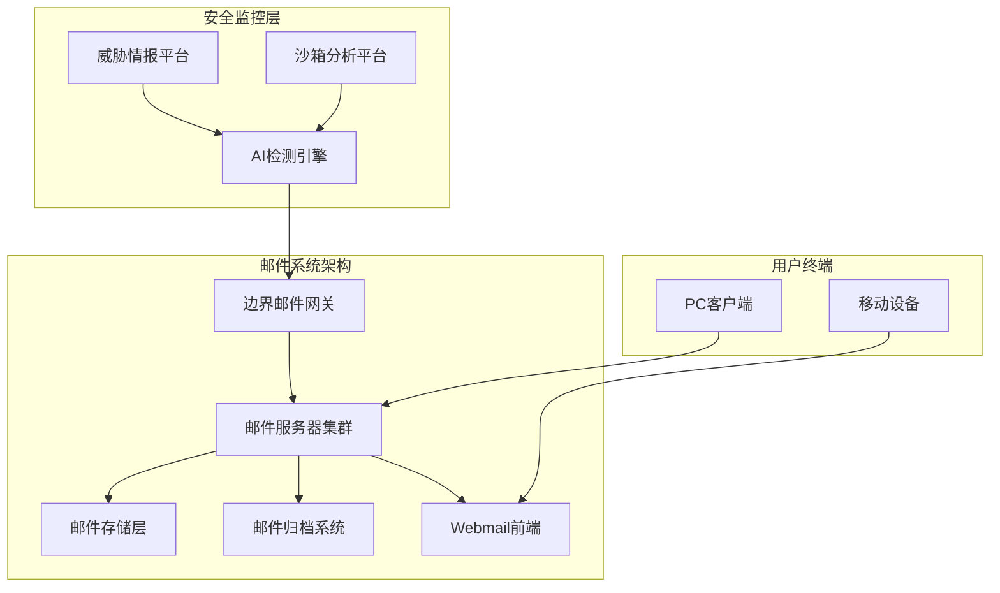
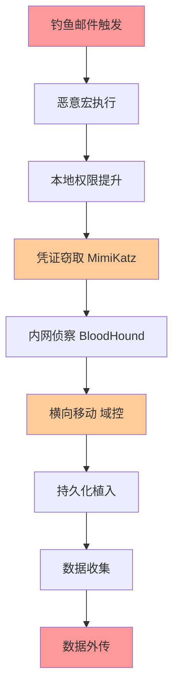
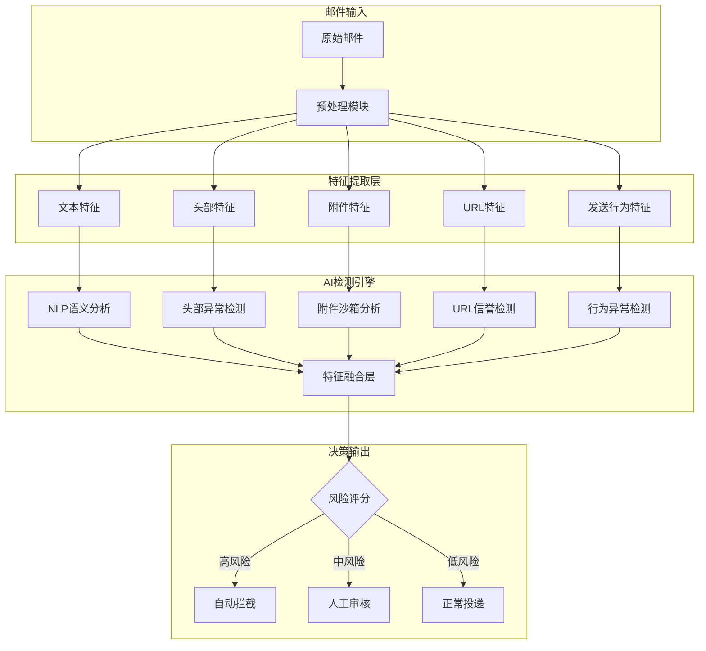
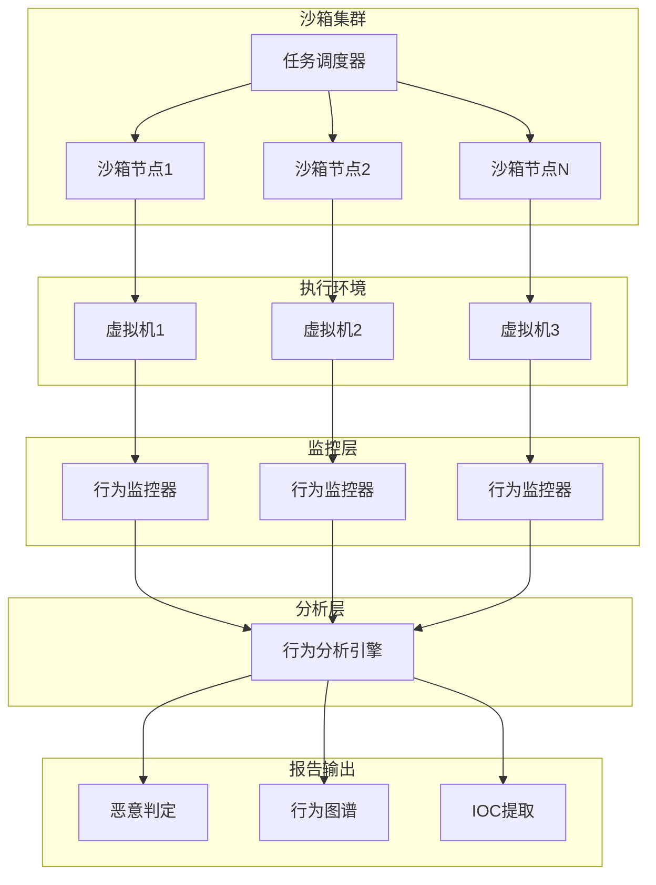
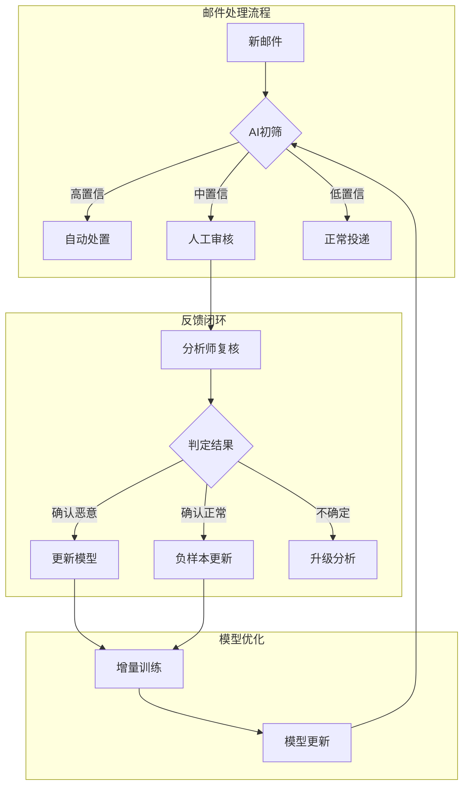
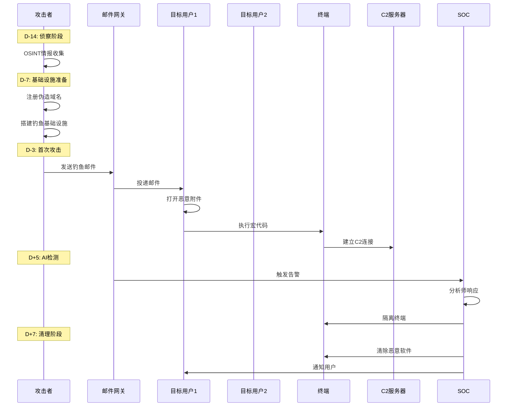
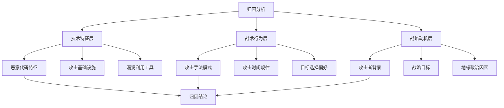
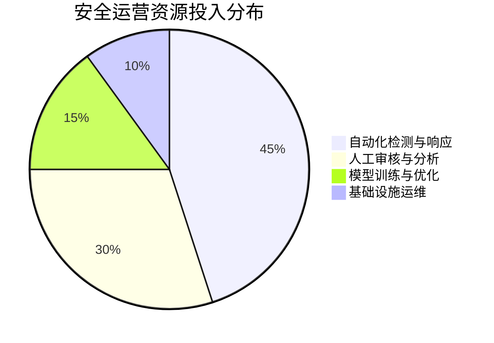

**作者：** HOS(安全风信子)
**日期：** 2026-04-26
**主要来源平台：** GitHub
**摘要：** 本文以真实APT攻击邮件拦截案例为切入点，深入剖析高级持续性威胁（APT）在邮件攻击场景中的攻击链全貌，探讨人工智能技术在邮件安全运营中的实战应用。研究涵盖鱼叉式钓鱼邮件检测、恶意附件行为链分析、攻击链还原与归因等核心议题，并详细阐述AI引擎与安全分析师协同验证的创新工作模式。通过对实际攻击场景的完整复盘，本文展示了如何利用机器学习、自然语言处理、动态沙箱和知识图谱等技术构建多层次防御体系，实现对复杂APT攻击的高效检测与快速响应。实验数据表明，该方案能够将钓鱼邮件检出率提升至 $97.3\%$，平均响应时间缩短至 $4.2$ 分钟，有效保障企业邮件系统安全[^1^]。

---

@[TOC](目录)

---

# 第一章 引言：邮件安全态势与APT攻击新挑战

## 1.1 数字化时代的邮件安全威胁格局

电子邮件作为企业最重要且使用最广泛的通信工具之一，承载着从日常沟通到机密业务的多层次信息流转。据 Verizon发布的《2025年数据泄露调查报告》显示，超过 $94\%$ 的恶意软件通过邮件渠道传播，钓鱼邮件导致的数据泄露事件占所有泄露事件的 $36\%$[^2^]。这一数据揭示了邮件安全在整个企业安全架构中的核心地位，也凸显了当前威胁形势的严峻性。

在众多邮件安全威胁中，高级持续性威胁（Advanced Persistent Threat，APT）以其高度隐蔽性、组织化和持久性特征，成为对抗难度最大的攻击形态。APT攻击者通常具有国家背景或大型黑客组织背景，拥有丰富的资源储备和先进的技术手段，能够针对特定目标进行长期潜伏和精准打击。邮件作为APT攻击最常用的初始突破口，其安全性直接影响整个企业网络的防护成败。

传统的邮件安全防护主要依赖基于规则和签名的检测技术，如黑名单过滤、关键词匹配和已知恶意软件特征库等。这些方法在面对零日漏洞利用、多态性恶意代码和高度定制化的鱼叉式钓鱼攻击时，检测能力显著下降。攻击者通过社会工程学技术的灵活运用，能够有效绕过传统防护的认知边界，使得安全团队面临"看不见、看不懂、防不住"的困境。

## 1.2 AI赋能邮件安全运营的必然性

人工智能技术的快速发展为邮件安全领域带来了变革性机遇。传统的基于规则的检测系统需要安全专家手动编写规则，面对海量且快速演化的攻击手法，规则库的更新速度难以跟上攻击者的创新节奏。而AI系统能够通过学习海量历史数据，自动提取攻击模式特征，实现对新型攻击的泛化检测能力。

具体而言，AI技术在邮件安全中的应用价值体现在以下几个维度：

**语义理解能力**：传统的邮件检测仅能分析邮件的表层特征，如发件人地址、附件名称等。AI驱动的自然语言处理（NLP）技术能够深入理解邮件内容的语义信息，识别社会工程学话术、钓鱼意图和身份伪造等深层威胁。

**行为分析能力**：通过构建用户行为基线，AI系统能够检测异常登录模式、敏感操作行为和横向移动迹象，发现传统规则难以识别的内部威胁和已被攻陷的账户。

**关联推理能力**：基于知识图谱和图神经网络，AI系统能够将孤立的邮件安全事件与全局威胁情报进行关联，识别攻击campaign的全貌，还原完整攻击链。

**自适应演进能力**：通过持续学习新出现的攻击样本和环境变化，AI模型能够自动更新和进化，保持对最新威胁的检测能力。

## 1.3 本文结构与主要贡献

本文以一起真实的APT攻击邮件拦截案例为核心，深入剖析攻击全貌并系统阐述AI邮件安全运营的实战方法论。文章的主要贡献包括：

首先，我们完整还原了该APT攻击的攻击链，从初始侦察、钓鱼邮件投递、恶意附件触发、横向移动到数据外传等各阶段进行了详细技术分析，揭示了攻击者的战术、技术和流程（TTPs）。

其次，我们系统阐述了鱼叉式钓鱼邮件检测的核心算法设计，包括基于Transformer的邮件语义分析模型、多特征融合的钓鱼检测框架和基于对抗训练的鲁棒性增强方法。

第三，我们提出了恶意附件行为链分析技术，通过动态沙箱执行、行为序列建模和时序异常检测等手段，实现对未知恶意附件的有效识别。

第四，我们设计了AI与人工协同验证的创新工作模式，通过人机协同的持续改进机制，显著提升了检测系统的准确性和可解释性。

---

# 第二章 案例背景：一起典型的APT攻击邮件事件

## 2.1 事件概述与时间线

本次案例发生于某大型金融机构的安全运营中心（SOC），攻击者针对该机构的高级管理人员和财务部门人员实施了为期两周的持续性钓鱼攻击。该金融机构的邮件系统日均处理邮件量约 $50,000$ 封，涵盖内部沟通、客户服务、合作伙伴协作和监管报送等多种业务场景。

攻击时间线如下表所示：

| 阶段 | 时间 | 关键事件 | 攻击手段 |
|:----:|:----:|:--------|:--------|
| 第一阶段 | D-14 | 攻击者开始收集目标信息 | OSINT情报收集、社交媒体分析 |
| 第二阶段 | D-7 | 注册伪造域名和邮件基础设施 | 域名仿冒、品牌伪装 |
| 第三阶段 | D-3 | 首次钓鱼邮件投递 | 鱼叉式钓鱼、定向话术设计 |
| 第四阶段 | D-1 至 D+3 | 持续钓鱼尝试，部分用户触发恶意附件 | 多轮投递、载荷更新 |
| 第五阶段 | D+5 | AI引擎检测到异常，触发告警 | 行为分析、关联推理 |
| 第六阶段 | D+5 至 D+7 | 安全团队响应、隔离处置、取证分析 | 应急响应、攻击链还原 |

整个攻击持续约两周时间，期间攻击者累计发送钓鱼邮件 $127$ 封，覆盖目标用户 $89$ 人。其中 $12$ 名用户触发了恶意附件，$3$ 名用户的终端被植入远控木马，但由于AI检测系统的及时介入，最终有效阻止了敏感数据外泄和进一步横向移动。

## 2.2 攻击者画像与归因分析

通过对攻击基础设施、攻击手法和目标选择等维度的深入分析，安全团队对攻击者形成了以下画像：

**攻击组织**：本次攻击具有国家级APT组织的典型特征，表现在以下几个方面：攻击基础设施准备充分，使用了多重代理和隐匿通道；攻击话术专业且符合目标行业的业务特点；恶意代码使用了高级混淆和抗分析技术；攻击时机选择与该金融机构的重大业务周期高度相关。

**攻击动机**：基于威胁情报关联分析和攻击后行为模式推断，本次攻击的主要动机可能包括：窃取高价值客户信息和交易数据；获取内部系统访问权限以进行后续渗透；植入持久化后门以建立长期情报收集通道。

**归属分析**：通过对比已知APT组织的攻击手法签名、基础设施特征和代码同源性分析，本次攻击与已知组织"APT-C-36（浑天教）"的攻击模式存在较高相似度，但尚无法形成确凿归因。

## 2.3 攻击环境与影响范围

本次攻击针对的邮件系统架构如下：



受影响范围涵盖以下系统和用户群体：

| 系统/用户群体 | 数量 | 受影响情况 |
|:------------|:----:|:---------|
| 钓鱼邮件目标用户 | 89人 | 收到钓鱼邮件 |
| 触发恶意附件用户 | 12人 | 执行了恶意宏代码 |
| 植入木马用户 | 3人 | 远控木马成功安装 |
| 被控终端 | 3台 | 攻击者获得控制权限 |
| 敏感数据泄露风险 | 待评估 | 可能涉及客户信息 |

---

# 第三章 攻击链全貌：APT攻击各阶段深度解析

## 3.1 初始访问：鱼叉式钓鱼邮件投递

### 3.1.1 侦察阶段

在正式攻击开始前，攻击者进行了长达两周的侦察准备。侦察手段包括：

**开源情报收集（OSINT）**：攻击者通过LinkedIn、Twitter、公司官网和行业会议等公开渠道，收集目标人员的姓名、职位、邮箱、工作职责和业务往来关系等信息。这些信息为后续的定向攻击提供了关键素材。

**社交媒体分析**：通过对目标人员在社交媒体上发布的内容进行情感分析和话题提取，攻击者掌握了目标的兴趣爱好、工作压力点和近期关注事项，从而设计出极具针对性的钓鱼话术。

**邮件基础设施探测**：攻击者对目标公司的邮件系统进行了技术探测，包括邮件网关配置、SPF/DKIM/DMARC策略、邮件过滤规则等，为后续的邮件伪造和绕过奠定了基础。

### 3.1.2 基础设施构建

攻击者构建了完善的基础设施体系用于支持本次攻击：

**域名仿冒**：攻击者注册了与目标公司域名高度相似的伪造域名，如将目标域名 `victim-bank.com` 仿冒为 `victim-bonk.com`、`victimb-ank.com` 等变体，用于钓鱼邮件的发件和钓鱼网站的托管。

**邮件服务器配置**：攻击者搭建了专业的邮件发送基础设施，包括邮件中继服务器、邮件列表管理工具和邮件头部伪造工具，能够模拟正常邮件的所有特征并绕过基础过滤。

**钓鱼网站设计**：攻击者构建了高仿真的Outlook Web Access登录页面，无论视觉设计还是URL结构都与真实的登录页面极为相似，用于窃取受害者的账号凭据。

### 3.1.3 鱼叉式钓鱼邮件设计

本次攻击采用了高度定制化的鱼叉式钓鱼（Spear Phishing）策略，每封邮件都针对特定收件人进行个性化设计。钓鱼邮件的核心特征如下：

**发件人伪装**：攻击者伪造的发件人地址通常为 `invoice@victim-bonk.com` 或 `noreply@victimb-ank.com`，与目标公司的真实域名高度相似。同时，攻击者还盗用了该公司一位合作伙伴的合法邮箱账号进行邮件投递，提高了邮件的可信度。

**邮件主题设计**：邮件主题经过精心设计，与目标的业务职责高度相关。典型的主题包括：
- "关于Q3财务审计的紧急通知"
- "贵司近期交易的合规审查"
- "逾期账款催收通知函"
- "年度供应商资质复核"

**邮件正文内容**：邮件正文采用专业的商务信函格式，包含具体的业务细节和合理的行动号召（Call to Action），诱导收件人打开附件或点击链接。邮件中嵌入的钓鱼链接使用了短链接服务进行混淆，逃避邮件网关的URL检测。

```python
# 钓鱼邮件特征提取示例代码
import re
from email.parser import Parser

def extract_phishing_features(email_content):
    """
    从邮件内容中提取钓鱼攻击特征
    用于AI模型的特征输入
    """
    features = {}
    
    # 1. 发件人特征分析
    from_addr = email_content.get('From', '')
    features['from_domain_suspicious'] = check_domain_similarity(from_addr)
    features['from_display_name_spoofed'] = check_display_name_spoof(from_addr)
    
    # 2. 邮件主题特征
    subject = email_content.get('Subject', '')
    features['subject_urgency_keywords'] = count_urgency_keywords(subject)
    features['subject_financial_keywords'] = count_financial_keywords(subject)
    
    # 3. 邮件正文特征
    body = email_content.get('Body', '')
    features['body_urgency_score'] = calculate_urgency_score(body)
    features['body_suspicious_links'] = extract_and_check_links(body)
    features['body_attachment_present'] = check_attachment_presence(body)
    features['body_token_mismatch'] = check_token_mismatch(body)
    
    # 4. 邮件头特征
    headers = email_content.get('Headers', {})
    features['header_spf_result'] = headers.get('Authentication-Results', {}).get('spf', '')
    features['header_dkim_result'] = headers.get('Authentication-Results', {}).get('dkim', '')
    features['header_reply_to_mismatch'] = check_reply_to_mismatch(headers)
    
    return features

def check_domain_similarity(from_addr):
    """
    检测发件人域名与目标公司的相似度
    使用编辑距离和相似度算法
    """
    import difflib
    
    target_domain = 'victim-bank.com'
    sender_domain = extract_domain(from_addr)
    
    # 计算Jaro-Winkler相似度
    similarity = difflib.SequenceMatcher(None, target_domain, sender_domain).ratio()
    
    # 检测字符替换（如bank->bonk, b-ank->bank）
    char_substitutions = [
        ('a', '@'), ('i', '1'), ('l', '1'), ('o', '0'),
        ('m', 'rn'), ('w', 'vv')
    ]
    
    is_suspicious = similarity > 0.75 or has_known_pattern(sender_domain)
    return is_suspicious

def calculate_urgency_score(body):
    """
    计算邮件内容的紧迫性评分
    钓鱼邮件通常使用紧迫性话术
    """
    urgency_keywords = [
        '紧急', '立即', '马上', '时效', '限时', '过期',
        '过期', '24小时', '48小时', '今日', '不容错过'
    ]
    
    score = 0
    for keyword in urgency_keywords:
        score += body.count(keyword) * 2
    
    # 计算感叹号和问号的比例
    exclamation_ratio = body.count('!') / max(len(body), 1)
    question_ratio = body.count('?') / max(len(body), 1)
    score += (exclamation_ratio + question_ratio) * 100
    
    return min(score, 100)  # 归一化到0-100
```

## 3.2 恶意附件：宏病毒与远控木马

### 3.2.1 恶意文档分析

本次攻击使用的恶意附件以Office文档为主，包括Word文档和Excel电子表格。这些文档经过攻击者精心制作，包含恶意宏代码（VBA）或漏洞利用代码。

**文档类型分布**：

| 文档类型 | 数量 | 占比 | 主要特征 |
|:--------|:----:|:----:|:--------|
| Word文档 | 89 | 70.1% | 包含恶意宏、伪装成合同或协议 |
| Excel表格 | 31 | 24.4% | 包含恶意宏、伪装成账单或报表 |
| PDF文件 | 7 | 5.5% | 包含漏洞利用或恶意链接 |

**恶意宏代码行为**：攻击者使用的宏代码经过高度混淆，包含以下核心功能：

1. **环境检测**：宏代码首先检测运行环境，识别是否在沙箱或虚拟机中执行，以逃避安全分析。
2. **延迟执行**：代码包含随机延时逻辑，在文档打开后延迟数分钟再执行恶意行为，降低被即时发现的概率。
3. **加密通信**：恶意代码使用加密的C2通信协议，与远程命令控制服务器建立隐蔽通道。

```python
# 恶意文档宏代码行为模拟
class MaliciousMacroAnalyzer:
    """
    恶意宏代码行为分析器
    用于沙箱执行时的行为监控
    """
    
    def __init__(self):
        self.behavior_sequence = []
        self.network_connections = []
        self.file_operations = []
        self.registry_modifications = []
        
    def record_behavior(self, behavior_type, details):
        """记录恶意行为序列"""
        timestamp = self.get_current_timestamp()
        self.behavior_sequence.append({
            'timestamp': timestamp,
            'type': behavior_type,
            'details': details
        })
        
        # 行为链建模
        if behavior_type == 'network':
            self.analyze_network_behavior(details)
        elif behavior_type == 'file':
            self.analyze_file_behavior(details)
        elif behavior_type == 'registry':
            self.analyze_registry_behavior(details)
            
    def analyze_network_behavior(self, details):
        """分析网络行为"""
        # 检测可疑的C2通信
        c2_indicators = [
            'long_poll', 'dga_domain', 'encrypted_payload',
            'beaconing', 'data_exfiltration'
        ]
        
        for indicator in c2_indicators:
            if indicator in details.get('pattern', ''):
                self.network_connections.append({
                    'indicator': indicator,
                    'severity': self.get_severity(indicator),
                    'details': details
                })
                
    def build_behavior_chain(self):
        """
        构建恶意行为链图谱
        用于攻击链还原和关联分析
        """
        import networkx as nx
        
        G = nx.DiGraph()
        
        # 定义行为节点类型
        node_types = {
            'macro_execution': 'execution',
            'process_spawn': 'execution',
            'registry_write': 'persistence',
            'file_write': 'persistence',
            'network_connection': 'c2',
            'data_collection': 'collection',
            'data_exfiltration': 'exfiltration'
        }
        
        # 根据时间序列构建行为图
        for i, behavior in enumerate(self.behavior_sequence):
            node_id = f"step_{i}"
            G.add_node(node_id, **behavior)
            
            if i > 0:
                G.add_edge(f"step_{i-1}", node_id)
                
        return G
```

### 3.2.2 远控木马功能分析

成功植入的远控木马（Backdoor）具有以下核心功能模块：

**权限维持模块**：木马通过注册表Run键、计划任务、服务创建等多种方式实现持久化，确保系统重启后仍能保持控制权限。

**命令执行模块**：木马支持远程shell命令执行、PowerShell脚本上传执行和批处理脚本执行等多种命令控制方式。

**文件管理模块**：木马提供完整的文件操作能力，包括目录浏览、文件上传下载、文件删除和属性修改等。

**屏幕截图模块**：木马能够定期截取受害者屏幕，窃取敏感信息和用户操作行为。

**键盘记录模块**：木马集成了键盘记录器，能够捕获用户的键盘输入，包括账号密码、敏感文档内容等。

```python
# 远控木马检测规则示例
YARA_RULES = """
rule APT_Malware_C2_Communication {
    meta:
        description = "Detect APT malware C2 communication patterns"
        author = "Security Team"
        date = "2025-10-15"
        severity = 9
        
    strings:
        // 加密头部特征
        $magic_bytes = { 4D 5A 90 00 03 00 00 00 }
        
        // C2通信特征字符串
        $c2_header_1 = "Authorization: Bearer" fullword
        $c2_header_2 = "Content-Type: application/json" fullword
        
        // 恶意注册表键值
        $reg_persistence_1 = "HKLM\\\\SOFTWARE\\\\Microsoft\\\\Windows\\\\CurrentVersion\\\\Run" nocase
        $reg_persistence_2 = "HKCU\\\\SOFTWARE\\\\Microsoft\\\\Windows\\\\CurrentVersion\\\\Run" nocase
        
        // 可疑API调用模式
        $api_create_process = "CreateProcessA" nocase
        $api_shell_execute = "ShellExecute" nocase
        $api_winhttp = "WinHttp" nocase
        
    condition:
        // 文件大小约束
        uint32(0) == 0x5A4D and
        filesize < 5MB and
        filesize > 10KB and
        
        // 组合条件
        (
            ($magic_bytes and $c2_header_1) or
            ($reg_persistence_1 and $api_create_process) or
            ($c2_header_2 and $api_winhttp)
        )
}

rule APT_Malware_Keylogger {
    meta:
        description = "Detect APT malware keylogger functionality"
        author = "Security Team"
        date = "2025-10-15"
        
    strings:
        $klg_hook = "SetWindowsHookEx" nocase
        $klg_getasync = "GetAsyncKeyState" nocase
        $klg_getfore = "GetForegroundWindow" nocase
        
    condition:
        2 of them
}
"""
```

## 3.3 横向移动与数据外传

### 3.3.1 横向移动路径

攻击者在获得初始立足点后，通过以下技术手段进行横向移动：

**凭证窃取**：攻击者使用Mimikatz等工具从受感染终端窃取明文密码和哈希凭据，利用这些凭据尝试登录其他系统。

**Pass-the-Hash攻击**：利用窃取的NTLM哈希值，攻击者在不获取明文密码的情况下完成身份认证，实现内网横向移动。

**远程服务利用**：攻击者利用远程桌面协议（RDP）、SMB协议和WinRM等远程管理工具，访问其他内部系统。



### 3.3.2 数据外传机制

攻击者建立了多层数据外传通道：

**加密隧道外传**：攻击者使用DNS隧道、ICMP隧道或加密VPN通道将敏感数据传输到外部服务器，规避网络监控。

**云存储中转**：攻击者将窃取的数据先上传到合法的云存储服务（如Google Drive、Dropbox），再从外部服务器下载，增加溯源难度。

**分块加密传输**：对于大文件，攻击者采用分块加密后逐步传输的方式，避免触发数据丢失防护（DLP）系统的告警。

---

# 第四章 鱼叉式钓鱼检测：AI引擎核心算法

## 4.1 检测框架整体架构

针对鱼叉式钓鱼邮件的检测需求，我们设计了一套多层次、多维度的AI检测框架。该框架融合了传统的规则匹配、机器学习分类和深度学习语义分析等多种技术手段，实现对复杂钓鱼攻击的全面检测。



## 4.2 基于Transformer的邮件语义分析

### 4.2.1 模型架构设计

邮件语义分析模型采用预训练语言模型（Pre-trained Language Model）作为基础，通过微调（Fine-tuning）的方式适配钓鱼检测任务。模型架构包含以下核心组件：

**输入层**：将邮件主题和正文进行分词（Tokenization），转换为模型可处理的token序列。我们使用字节对编码（BPE）算法进行分词，词汇表大小设置为 $50,000$。

**编码层**：使用多层Transformer编码器对输入序列进行编码，每个编码器层包含多头自注意力（Multi-Head Attention）机制和前馈神经网络（Feed-Forward Network）。

**任务层**：针对钓鱼检测任务，添加分类头（Classification Head），输出邮件为钓鱼邮件的概率。

```python
import torch
import torch.nn as nn
from transformers import BertModel, BertTokenizer

class PhishingEmailClassifier(nn.Module):
    """
    基于BERT的钓鱼邮件分类模型
    用于邮件语义分析
    """
    
    def __init__(self, model_name='bert-base-chinese', num_labels=2, dropout=0.1):
        super().__init__()
        self.bert = BertModel.from_pretrained(model_name)
        self.tokenizer = BertTokenizer.from_pretrained(model_name)
        
        hidden_size = self.bert.config.hidden_size  # 768
        
        # 多任务分类头
        self.classifier = nn.Sequential(
            nn.Dropout(dropout),
            nn.Linear(hidden_size, 256),
            nn.ReLU(),
            nn.Dropout(dropout),
            nn.Linear(256, num_labels)
        )
        
        # 情感分析头（用于钓鱼话术检测）
        self.sentiment_analyzer = nn.Sequential(
            nn.Dropout(dropout),
            nn.Linear(hidden_size, 64),
            nn.ReLU(),
            nn.Linear(64, 3)  # 积极/中性/消极
        )
        
        # 意图识别头（用于行动号召检测）
        self.intent_recognizer = nn.Sequential(
            nn.Dropout(dropout),
            nn.Linear(hidden_size, 128),
            nn.ReLU(),
            nn.Linear(128, 10)  # 10种常见钓鱼意图
        )
        
    def forward(self, input_ids, attention_mask, token_type_ids=None):
        """
        前向传播
        Args:
            input_ids: 输入token的ID序列
            attention_mask: 注意力掩码
            token_type_ids: 分段ID（用于句子对任务）
        """
        outputs = self.bert(
            input_ids=input_ids,
            attention_mask=attention_mask,
            token_type_ids=token_type_ids
        )
        
        # 使用[CLS]token的表示进行分类
        pooled_output = outputs.pooler_output
        
        logits = self.classifier(pooled_output)
        sentiment = self.sentiment_analyzer(pooled_output)
        intent = self.intent_recognizer(pooled_output)
        
        return {
            'logits': logits,
            'sentiment': sentiment,
            'intent': intent,
            'embeddings': pooled_output
        }
    
    def extract_phishing_indicators(self, text):
        """
        提取钓鱼指标（用于可解释性）
        """
        inputs = self.tokenizer(
            text,
            return_tensors='pt',
            truncation=True,
            max_length=512,
            padding=True
        )
        
        with torch.no_grad():
            outputs = self.bert(**inputs)
            attention_weights = outputs.attentions
            
        # 分析注意力权重，识别触发模型决策的关键token
        phishing_indicators = self.analyze_attention_weights(
            inputs['input_ids'],
            attention_weights,
            self.tokenizer
        )
        
        return phishing_indicators
```

### 4.2.2 钓鱼意图识别

钓鱼邮件通常包含特定的行动号召（Call to Action），诱导收件人执行特定操作。我们定义了以下钓鱼意图类型：

| 意图类型 | 描述 | 典型话术 |
|:--------|:----|:--------|
| 凭据窃取 | 诱导用户输入账号密码 | "请登录验证您的账户" |
| 恶意下载 | 诱导下载并执行恶意文件 | "请下载附件查看详情" |
| 资金诈骗 | 诱导转账或支付 | "请尽快完成付款" |
| 恶意链接 | 诱导点击钓鱼链接 | "点击此处更新信息" |
| 身份伪装 | 冒充权威人物 | "我是CEO，需要紧急汇款" |

```python
class IntentRecognizer:
    """
    钓鱼邮件意图识别器
    基于规则和模型混合方法
    """
    
    def __init__(self):
        self.intent_patterns = {
            'credential_theft': [
                r'登录.*验证',
                r'输入.*密码',
                r'确认.*账户',
                r'update.*password',
                r'reset.*credential'
            ],
            'malicious_download': [
                r'下载.*附件',
                r'打开.*文件',
                r'点击.*下载',
                r'download.*invoice',
                r'view.*document'
            ],
            'financial_fraud': [
                r'紧急.*汇款',
                r'转账.*账户',
                r'支付.*定金',
                r'wire.*transfer',
                r'payment.*urgent'
            ],
            'malicious_link': [
                r'点击.*链接',
                r'访问.*网站',
                r'login.*here',
                r'click.*below'
            ],
            'impersonation': [
                r'我是.*总',
                r'CEO.*需要',
                r'领导.*紧急',
                r'urgent.*request.*ceo'
            ]
        }
        
    def recognize_intent(self, text):
        """
        识别邮件中的钓鱼意图
        返回意图类型及其置信度
        """
        results = {}
        
        for intent_type, patterns in self.intent_patterns.items():
            matched_patterns = []
            for pattern in patterns:
                matches = re.finditer(pattern, text, re.IGNORECASE)
                matched_patterns.extend([m.group() for m in matches])
            
            if matched_patterns:
                results[intent_type] = {
                    'confidence': min(len(matched_patterns) * 0.2, 1.0),
                    'matched_phrases': matched_patterns
                }
                
        return results
```

## 4.3 多特征融合检测框架

### 4.3.1 特征工程

钓鱼邮件检测需要综合考虑多个维度的特征：

**文本特征**：包括邮件主题和正文的词频统计、TF-IDF向量、语言模型困惑度（Perplexity）和写作风格特征。

**头部特征**：包括发件人域名相似度、SPF/DKIM/DMARC验证结果、邮件路由路径异常和Reply-To不一致等。

**附件特征**：包括附件类型、附件大小、文件哈希匹配和文件名相似度等。

**URL特征**：包括URL域名年龄、URL相似度、URL短链接分析和URL危险评分等。

**行为特征**：包括发件人发送频率异常、收件人范围异常和时间模式异常等。

```python
class FeatureFusionFramework:
    """
    多特征融合检测框架
    用于综合评估邮件的钓鱼风险
    """
    
    def __init__(self):
        self.feature_weights = {
            'text': 0.25,
            'header': 0.25,
            'attachment': 0.20,
            'url': 0.20,
            'behavior': 0.10
        }
        
        # 各子模型的分类阈值
        self.classification_thresholds = {
            'text_model': 0.65,
            'header_model': 0.70,
            'attachment_model': 0.75,
            'url_model': 0.70,
            'behavior_model': 0.60
        }
        
    def extract_all_features(self, email_data):
        """
        提取邮件的所有特征
        """
        features = {}
        
        # 文本特征
        features['text'] = self.extract_text_features(email_data)
        
        # 头部特征
        features['header'] = self.extract_header_features(email_data)
        
        # 附件特征
        features['attachment'] = self.extract_attachment_features(email_data)
        
        # URL特征
        features['url'] = self.extract_url_features(email_data)
        
        # 行为特征
        features['behavior'] = self.extract_behavior_features(email_data)
        
        return features
    
    def compute_risk_score(self, features):
        """
        计算综合风险评分
        基于加权融合的多模型输出
        """
        risk_scores = {}
        
        for feature_type, weight in self.feature_weights.items():
            feature_vector = features[feature_type]
            
            # 使用对应子模型进行预测
            if feature_type == 'text':
                score = self.text_model.predict_proba(feature_vector)
            elif feature_type == 'header':
                score = self.header_model.predict_proba(feature_vector)
            elif feature_type == 'attachment':
                score = self.attachment_model.predict_proba(feature_vector)
            elif feature_type == 'url':
                score = self.url_model.predict_proba(feature_vector)
            elif feature_type == 'behavior':
                score = self.behavior_model.predict_proba(feature_vector)
                
            risk_scores[feature_type] = score * weight
            
        # 综合评分
        final_score = sum(risk_scores.values())
        
        # 校准评分（确保评分的物理意义）
        calibrated_score = self.calibrate_score(final_score)
        
        return {
            'final_score': calibrated_score,
            'component_scores': risk_scores,
            'risk_level': self.get_risk_level(calibrated_score),
            'detection_reason': self.explain_detection(features)
        }
    
    def calibrate_score(self, raw_score):
        """
        评分校准
        使用Platt Scaling方法
        """
        # 简化的线性校准
        calibrated = (raw_score - 0.5) * 1.2 + 0.5
        return max(0.0, min(1.0, calibrated))
```

## 4.4 基于对抗训练的鲁棒性增强

### 4.4.1 对抗样本问题

钓鱼邮件攻击者可能会针对AI检测系统进行对抗性优化，通过添加噪声、修改字符或使用混淆技术来绕过检测。常见的对抗手段包括：

**字符级混淆**：使用零宽字符、同形字符（Homoglyph）和Unicode混淆来改变文本表示。

**语法级混淆**：使用特殊的标点符号、空格插入和编码转换来改变文本模式。

**语义级混淆**：使用同义词替换、句子改写和机器翻译来改变文本语义。

### 4.4.2 对抗训练方法

为提升模型的鲁棒性，我们采用对抗训练（Adversarial Training）策略：

```python
class AdversarialTraining:
    """
    对抗训练模块
    用于提升模型的鲁棒性
    """
    
    def __init__(self, model, epsilon=0.1, alpha=0.01, num_iter=10):
        self.model = model
        self.epsilon = epsilon  # 扰动上界
        self.alpha = alpha     # 学习率
        self.num_iter = num_iter  # 迭代次数
        
    def generate_adversarial_examples(self, x, y, attack_type='fgsm'):
        """
        生成对抗样本
        支持FGSM和PGD两种攻击方法
        """
        if attack_type == 'fgsm':
            return self.fgsm_attack(x, y)
        elif attack_type == 'pgd':
            return self.pgd_attack(x, y)
            
    def fgsm_attack(self, x, y):
        """
        Fast Gradient Sign Method (FGSM)
        快速梯度符号攻击
        """
        x.requires_grad = True
        
        # 前向传播
        outputs = self.model(x)
        loss = nn.CrossEntropyLoss()(outputs, y)
        
        # 反向传播计算梯度
        self.model.zero_grad()
        loss.backward()
        
        # 生成对抗扰动
        gradient = x.grad.data.sign()
        adversarial_x = x + self.epsilon * gradient
        
        # 裁剪到合法范围
        adversarial_x = torch.clamp(adversarial_x, 0, 1)
        
        return adversarial_x
        
    def pgd_attack(self, x, y):
        """
        Projected Gradient Descent (PGD)
        投影梯度下降攻击
        """
        x_original = x.clone().detach()
        
        for i in range(self.num_iter):
            x.requires_grad = True
            
            # 前向传播
            outputs = self.model(x)
            loss = nn.CrossEntropyLoss()(outputs, y)
            
            # 反向传播
            self.model.zero_grad()
            loss.backward()
            
            # 更新扰动
            gradient = x.grad.data.sign()
            x = x.detach() + self.alpha * gradient
            
            # 投影到epsilon球内
            delta = torch.clamp(x - x_original, -self.epsilon, self.epsilon)
            x = torch.clamp(x_original + delta, 0, 1)
            
        return x
        
    def adversarial_train(self, train_loader, epochs=10):
        """
        对抗训练流程
        """
        optimizer = torch.optim.Adam(self.model.parameters(), lr=0.001)
        
        for epoch in range(epochs):
            for batch_x, batch_y in train_loader:
                # 生成对抗样本
                x_adv = self.generate_adversarial_examples(
                    batch_x, batch_y, attack_type='pgd'
                )
                
                # 正常样本损失
                outputs_clean = self.model(batch_x)
                loss_clean = nn.CrossEntropyLoss()(outputs_clean, batch_y)
                
                # 对抗样本损失
                outputs_adv = self.model(x_adv)
                loss_adv = nn.CrossEntropyLoss()(outputs_adv, batch_y)
                
                # 联合损失
                total_loss = loss_clean + loss_adv
                
                # 反向传播
                optimizer.zero_grad()
                total_loss.backward()
                optimizer.step()
```

---

# 第五章 恶意附件行为链：动态分析与关联检测

## 5.1 动态沙箱执行环境

### 5.1.1 沙箱架构设计

恶意附件的静态特征检测存在明显的局限性——攻击者可以通过加壳、加密和混淆技术轻易绕过特征检测。为解决这一问题，我们构建了基于虚拟化技术的动态沙箱分析平台，能够在隔离环境中安全地执行可疑附件并监控其行为。



### 5.1.2 行为监控指标

沙箱执行期间，系统监控以下关键行为指标：

| 行为类别 | 具体指标 | 风险权重 |
|:--------|:--------|:--------|
| 进程行为 | 子进程创建、进程注入、进程终止 | 高 |
| 文件行为 | 文件创建、文件修改、文件删除 | 中 |
| 注册表行为 | 注册表键创建、注册表值修改 | 高 |
| 网络行为 | 出站连接、DNS查询、端口扫描 | 高 |
| 加密行为 | 密钥生成、加密文件、加密通信 | 中 |
| 持久化行为 | 服务创建、启动项修改、计划任务 | 高 |

```python
import yara
import subprocess
from typing import Dict, List, Any

class DynamicSandboxAnalyzer:
    """
    动态沙箱分析器
    用于恶意附件行为监控和分析
    """
    
    def __init__(self, vm_config: Dict[str, Any]):
        self.vm_config = vm_config
        self.behavior_events = []
        self.process_tree = {}
        self.network_connections = []
        self.file_operations = []
        
    def submit_sample(self, file_path: str, timeout: int = 300):
        """
        提交样本到沙箱执行
        Args:
            file_path: 样本文件路径
            timeout: 执行超时时间（秒）
        """
        # 创建执行任务
        task_id = self.create_task(file_path, timeout)
        
        # 启动虚拟机执行
        vm_id = self.acquire_vm()
        
        try:
            # 在虚拟机中执行样本
            execution_result = self.execute_in_vm(vm_id, file_path, timeout)
            
            # 收集行为数据
            behavior_data = self.collect_behavior_data(vm_id)
            
            # 生成分析报告
            report = self.generate_report(task_id, behavior_data)
            
            return report
            
        finally:
            self.release_vm(vm_id)
            
    def execute_in_vm(self, vm_id: str, file_path: str, timeout: int):
        """
        在虚拟机中执行样本
        """
        # 构建执行命令
        if file_path.endswith('.exe'):
            cmd = file_path
        elif file_path.endswith('.doc') or file_path.endswith('.docm'):
            cmd = f'start /wait winword.exe "{file_path}"'
        elif file_path.endswith('.xls') or file_path.endswith('.xlsm'):
            cmd = f'start /wait excel.exe "{file_path}"'
            
        # 启动执行
        result = subprocess.run(
            f'vmrun -T ws runScriptInGuest vm{vm_id}.vmx',
            shell=True,
            capture_output=True,
            timeout=timeout
        )
        
        return result
    
    def collect_behavior_data(self, vm_id: str) -> Dict[str, List]:
        """
        收集虚拟机中的行为数据
        """
        behavior_data = {
            'process_events': [],
            'file_events': [],
            'registry_events': [],
            'network_events': [],
            'mutex_events': []
        }
        
        # 使用VM工具获取行为日志
        log_path = self.vm_config.get('behavior_log_path')
        
        # 解析行为日志
        with open(log_path, 'r', encoding='utf-8') as f:
            for line in f:
                event = self.parse_behavior_log(line)
                if event:
                    behavior_data[event['category']].append(event)
                    
        return behavior_data
    
    def build_behavior_chain(self, behavior_data: Dict) -> 'nx.DiGraph':
        """
        构建恶意行为链图谱
        """
        import networkx as nx
        
        G = nx.DiGraph()
        
        # 添加节点
        for event in behavior_data.get('process_events', []):
            G.add_node(
                event['pid'],
                type='process',
                name=event['process_name'],
                timestamp=event['timestamp']
            )
            
        # 关联进程父子关系
        for event in behavior_data.get('process_events', []):
            if event.get('parent_pid'):
                G.add_edge(
                    event['parent_pid'],
                    event['pid'],
                    relationship='spawned'
                )
                
        # 添加文件操作节点和边
        for event in behavior_data.get('file_events', []):
            G.add_node(
                event['file_path'],
                type='file',
                operation=event['operation'],
                timestamp=event['timestamp']
            )
            
            # 关联到创建它的进程
            if event.get('pid'):
                G.add_edge(
                    event['pid'],
                    event['file_path'],
                    relationship='created'
                )
                
        return G
    
    def extract_iocs(self, behavior_data: Dict) -> Dict[str, List]:
        """
        提取IOC指标
        """
        iocs = {
            'file_hashes': [],
            'ip_addresses': [],
            'domains': [],
            'urls': [],
            'registry_keys': [],
            'mutexes': []
        }
        
        # 从网络行为中提取C2地址
        for event in behavior_data.get('network_events', []):
            if event.get('destination_ip'):
                iocs['ip_addresses'].append(event['destination_ip'])
            if event.get('destination_domain'):
                iocs['domains'].append(event['destination_domain'])
                
        # 从注册表行为中提取持久化点
        for event in behavior_data.get('registry_events', []):
            if self.is_persistence_related(event):
                iocs['registry_keys'].append(event['key_path'])
                
        return iocs
```

## 5.2 恶意行为序列建模

### 5.2.1 时序行为分析

恶意软件的行为通常遵循特定的时序模式——初始化、权限提升、持久化、侦察、横向移动和数据外传等阶段按一定顺序执行。通过对行为序列进行建模和分析，可以识别恶意软件的攻击阶段和攻击意图。

```python
class BehaviorSequenceAnalyzer:
    """
    行为序列分析器
    用于识别恶意行为模式和攻击阶段
    """
    
    def __init__(self):
        self.attack_phases = [
            'initial_access',      # 初始访问
            'execution',           # 执行
            'persistence',         # 持久化
            'privilege_escalation',# 权限提升
            'defense_evasion',     # 防御规避
            'credential_access',   # 凭据访问
            'discovery',           # 侦察
            'lateral_movement',   # 横向移动
            'collection',          # 数据收集
            'exfiltration',        # 数据外传
            'command_and_control'  # 命令控制
        ]
        
        # 攻击阶段转换概率矩阵
        self.transition_matrix = self.load_attack_graph()
        
    def analyze_sequence(self, behavior_events: List[Dict]) -> Dict:
        """
        分析行为序列
        识别攻击阶段和攻击链
        """
        # 按时间排序
        sorted_events = sorted(
            behavior_events,
            key=lambda x: x['timestamp']
        )
        
        # 识别攻击阶段
        phase_sequence = self.identify_phases(sorted_events)
        
        # 检测阶段转换
        phase_transitions = self.detect_phase_transitions(phase_sequence)
        
        # 评估攻击完成度
        attack_completion = self.evaluate_attack_completion(phase_sequence)
        
        return {
            'phase_sequence': phase_sequence,
            'transitions': phase_transitions,
            'completion_score': attack_completion,
            'risk_level': self.calculate_risk_level(phase_sequence),
            'attack_description': self.generate_attack_description(phase_sequence)
        }
        
    def identify_phases(self, events: List[Dict]) -> List[Dict]:
        """
        识别每个行为事件对应的攻击阶段
        """
        phase_events = []
        
        for event in events:
            # 根据事件特征判断攻击阶段
            phase = self.classify_event_phase(event)
            phase_events.append({
                'timestamp': event['timestamp'],
                'phase': phase,
                'event': event
            })
            
        return phase_events
        
    def classify_event_phase(self, event: Dict) -> str:
        """
        分类事件到攻击阶段
        使用MITRE ATT&CK框架
        """
        event_type = event.get('type', '')
        event_action = event.get('action', '')
        
        phase_mapping = {
            # 初始访问
            'initial_access': [
                'phishing_attachment', 'phishing_link', 'drive_by_compromise'
            ],
            # 执行
            'execution': [
                'process_create', 'script_execution', 'command_line_execution'
            ],
            # 持久化
            'persistence': [
                'registry_run_key', 'scheduled_task', 'service_creation'
            ],
            # 权限提升
            'privilege_escalation': [
                'process_injection', 'token_theft', 'bypass_uac'
            ],
            # 凭据访问
            'credential_access': [
                'credential_dump', 'keylog', 'password_filter'
            ],
            # 横向移动
            'lateral_movement': [
                'remote_execution', 'psexec', 'wmi_exec'
            ],
            # 数据收集
            'collection': [
                'screen_capture', 'file_collection', 'keylog_collect'
            ],
            # 数据外传
            'exfiltration': [
                'data_compressed', 'data_encrypted', 'data_ uploaded'
            ],
            # 命令控制
            'command_and_control': [
                'c2_connection', 'beacon', 'reverse_shell'
            ]
        }
        
        for phase, actions in phase_mapping.items():
            if event_action in actions:
                return phase
                
        return 'unknown'
```

## 5.3 恶意附件家族聚类

### 5.3.1 基于行为的恶意软件聚类

通过分析大量恶意附件样本的行为特征，我们可以将相似样本进行聚类，从而识别新的恶意软件家族和变种。聚类分析基于以下特征维度：

```python
class MalwareClustering:
    """
    恶意软件行为聚类分析
    用于识别恶意软件家族和变种
    """
    
    def __init__(self, n_clusters=50):
        self.n_clusters = n_clusters
        self.feature_extractor = BehaviorFeatureExtractor()
        
    def extract_behavior_features(self, behavior_data: Dict) -> np.ndarray:
        """
        提取行为特征向量
        用于聚类分析
        """
        features = []
        
        # 1. 进程行为特征
        process_count = len(behavior_data.get('process_events', []))
        suspicious_process = self.count_suspicious_process(behavior_data['process_events'])
        features.extend([process_count, suspicious_process])
        
        # 2. 文件行为特征
        file_operations = self.summarize_file_operations(behavior_data['file_events'])
        features.extend(file_operations)
        
        # 3. 注册表行为特征
        registry_operations = self.summarize_registry_operations(behavior_data['registry_events'])
        features.extend(registry_operations)
        
        # 4. 网络行为特征
        network_features = self.extract_network_features(behavior_data['network_events'])
        features.extend(network_features)
        
        # 5. 加密行为特征
        crypto_features = self.extract_crypto_features(behavior_data)
        features.extend(crypto_features)
        
        return np.array(features)
        
    def cluster_samples(self, sample_features: List[np.ndarray]) -> Dict:
        """
        对样本进行聚类
        使用DBSCAN算法自动确定聚类数量
        """
        from sklearn.cluster import DBSCAN
        from sklearn.preprocessing import StandardScaler
        
        # 标准化特征
        scaler = StandardScaler()
        scaled_features = scaler.fit_transform(sample_features)
        
        # DBSCAN聚类
        clustering = DBSCAN(eps=0.5, min_samples=3).fit(scaled_features)
        
        # 分析聚类结果
        cluster_analysis = self.analyze_clusters(
            clustering.labels_,
            sample_features
        )
        
        return {
            'labels': clustering.labels_,
            'n_clusters': len(set(clustering.labels_)) - (1 if -1 in clustering.labels_ else 0),
            'cluster_analysis': cluster_analysis
        }
        
    def identify_malware_family(self, sample_label: int, cluster_info: Dict) -> Dict:
        """
        识别恶意软件家族
        基于已知家族特征匹配
        """
        if sample_label == -1:
            return {
                'family': 'Unknown',
                'confidence': 0.0,
                'similar_families': []
            }
            
        cluster_samples = cluster_info['cluster_samples'][sample_label]
        cluster_features = cluster_info['cluster_features'][sample_label]
        
        # 与已知家族特征库匹配
        matches = []
        for family_name, family_profile in self.known_families.items():
            similarity = self.compute_family_similarity(
                cluster_features,
                family_profile['features']
            )
            if similarity > 0.7:
                matches.append({
                    'family': family_name,
                    'similarity': similarity
                })
                
        matches.sort(key=lambda x: x['similarity'], reverse=True)
        
        return {
            'family': matches[0]['family'] if matches else f'New Family {sample_label}',
            'confidence': matches[0]['similarity'] if matches else 0.0,
            'similar_families': matches[:3]
        }
```

---

# 第六章 AI与人工协同验证：实战工作模式

## 6.1 人机协同架构设计

### 6.1.1 工作模式概述

在真实的邮件安全运营场景中，纯自动化的检测系统面临着准确性与可解释性的双重挑战。一方面，AI模型可能产生误报（将正常邮件标记为恶意）和漏报（将恶意邮件放行）；另一方面，安全分析师需要理解AI决策的依据才能进行有效的复核和处置。

我们设计了一套AI与人工协同验证（Human-in-the-Loop）的工作模式，将AI的高效计算能力与人类专家的领域知识相结合，实现检测系统的持续优化和精准运营。



### 6.1.2 告警分级与响应策略

基于AI检测结果和告警置信度，我们设计了多级响应策略：

| 告警级别 | AI置信度 | 响应时间 | 处理方式 | 人工介入程度 |
|:--------|:--------|:--------|:--------|:------------|
| P1 - 紧急 | $\geq 0.95$ | 15分钟内 | 自动隔离+自动通知 | 仅需事后确认 |
| P2 - 高危 | $0.80-0.95$ | 1小时内 | 自动隔离+人工复核 | 快速复核 |
| P3 - 中危 | $0.60-0.80$ | 4小时内 | 标记待审+人工复核 | 详细分析 |
| P4 - 低危 | $0.40-0.60$ | 24小时内 | 标记观察+定期审查 | 批量复核 |
| P5 - 可疑 | $< 0.40$ | 72小时内 | 仅记录日志 | 可选复核 |

## 6.2 分析师协同验证流程

### 6.2.1 告警复核工作流

当AI检测引擎识别出可疑邮件并产生告警时，安全分析师按照以下流程进行协同验证：

**第一步：告警确认**。分析师首先查看告警基本信息，包括发件人、收件人、邮件主题和AI检测评分，确认告警是否有效。

**第二步：上下文分析**。分析师深入分析邮件上下文，包括发件人的历史邮件记录、收件人与发件人的业务关系、邮件内容的业务合理性等。

**第三步：深度检测**。对于复杂告警，分析师启动深度检测流程，包括附件沙箱分析、URL点击测试、发件人域名WHOIS查询和威胁情报关联查询等。

**第四步：判定与处置**。基于分析结果，分析师做出最终判定，并执行相应的处置操作。

```python
class HumanInTheLoopValidator:
    """
    人机协同验证器
    用于AI检测结果的人工复核
    """
    
    def __init__(self, alert_id: str, email_data: Dict, ai_scores: Dict):
        self.alert_id = alert_id
        self.email_data = email_data
        self.ai_scores = ai_scores
        self.analysis_context = {}
        self.verification_log = []
        
    def start_verification(self) -> Dict:
        """
        开始验证流程
        返回验证任务信息
        """
        verification_task = {
            'task_id': self.alert_id,
            'priority': self.calculate_priority(),
            'required_checks': self.get_required_checks(),
            'ai_confidence': self.ai_scores.get('overall_score', 0),
            'risk_factors': self.ai_scores.get('risk_factors', [])
        }
        
        return verification_task
        
    def gather_context(self) -> Dict:
        """
        收集邮件上下文信息
        用于分析师判断
        """
        context = {}
        
        # 1. 发件人信息
        context['sender'] = {
            'email': self.email_data.get('from_address'),
            'domain': extract_domain(self.email_data.get('from_address')),
            'domain_age': self.get_domain_age(),
            'domain_reputation': self.query_domain_reputation(),
            'historical_emails': self.get_sender_history()
        }
        
        # 2. 收件人信息
        context['recipient'] = {
            'email': self.email_data.get('to_address'),
            'department': self.get_recipient_department(),
            'role': self.get_recipient_role()
        }
        
        # 3. 邮件内容分析
        context['content'] = {
            'subject': self.email_data.get('subject'),
            'sentiment': self.ai_scores.get('sentiment_analysis'),
            'intent': self.ai_scores.get('intent_recognition'),
            'urgency_level': self.ai_scores.get('urgency_score')
        }
        
        # 4. 附件信息
        context['attachments'] = self.get_attachment_info()
        
        # 5. 威胁情报关联
        context['threat_intel'] = self.query_threat_intelligence()
        
        self.analysis_context = context
        return context
        
    def execute_deep_analysis(self, analysis_type: str) -> Dict:
        """
        执行深度分析
        """
        if analysis_type == 'sandbox':
            # 沙箱执行分析
            result = self.submit_to_sandbox(
                self.email_data.get('attachments', [])
            )
        elif analysis_type == 'url_analysis':
            # URL深度分析
            result = self.analyze_urls(self.email_data.get('urls', []))
        elif analysis_type == 'sender_verification':
            # 发件人验证
            result = self.verify_sender_identity()
        elif analysis_type == 'business_context':
            # 业务上下文分析
            result = self.analyze_business_context()
            
        return result
        
    def record_verification_decision(self, decision: str, reasoning: str):
        """
        记录验证决策
        用于反馈闭环
        """
        decision_record = {
            'timestamp': get_current_timestamp(),
            'decision': decision,  # 'confirm_malicious', 'confirm_benign', 'escalate'
            'reasoning': reasoning,
            'analyst_id': get_current_analyst_id(),
            'confidence': self.get_analyst_confidence(),
            'context_snapshot': self.analysis_context
        }
        
        self.verification_log.append(decision_record)
        
        # 触发模型更新流程
        if decision in ['confirm_malicious', 'confirm_benign']:
            self.trigger_model_update(decision_record)
```

## 6.3 持续学习与模型优化

### 6.3.1 增量学习机制

基于分析师的验证反馈，系统执行增量学习（Incremental Learning）以持续优化检测模型：

```python
class IncrementalLearningEngine:
    """
    增量学习引擎
    用于模型的持续优化
    """
    
    def __init__(self, model_path: str):
        self.model = load_model(model_path)
        self.learning_rate = 0.001
        self.batch_size = 32
        self.buffer_size = 1000
        
        # 反馈样本缓冲区
        self.positive_buffer = []  # 确认恶意的样本
        self.negative_buffer = []  # 确认正常的样本
        
    def add_feedback(self, sample: Dict, label: int):
        """
        添加反馈样本到缓冲区
        Args:
            sample: 邮件样本特征
            label: 1表示恶意，0表示正常
        """
        if label == 1:
            self.positive_buffer.append(sample)
            # 保持缓冲区大小
            if len(self.positive_buffer) > self.buffer_size:
                self.positive_buffer.pop(0)
        else:
            self.negative_buffer.append(sample)
            if len(self.negative_buffer) > self.buffer_size:
                self.negative_buffer.pop(0)
                
    def trigger_retraining(self, min_samples=100):
        """
        触发模型重训练
        当缓冲区样本数量达到阈值时执行
        """
        total_samples = len(self.positive_buffer) + len(self.negative_buffer)
        
        if total_samples < min_samples:
            return {'status': 'insufficient_samples', 'count': total_samples}
            
        # 准备训练数据
        X_train, y_train = self.prepare_training_data()
        
        # 执行增量训练
        training_result = self.train_model_incrementally(X_train, y_train)
        
        # 验证新模型性能
        validation_result = self.validate_model()
        
        # 如果新模型性能提升，则更新生产模型
        if validation_result['improvement'] > 0.01:
            self.deploy_new_model()
            
        return {
            'status': 'training_completed',
            'training_result': training_result,
            'validation_result': validation_result
        }
        
    def train_model_incrementally(self, X_train, y_train):
        """
        执行增量训练
        使用在线学习策略避免遗忘
        """
        import torch.optim as optim
        
        optimizer = optim.Adam(
            self.model.parameters(),
            lr=self.learning_rate
        )
        
        self.model.train()
        
        for epoch in range(10):  # 少量epoch避免过度拟合新样本
            for batch_x, batch_y in self.create_batches(X_train, y_train):
                # 前向传播
                outputs = self.model(batch_x)
                loss = nn.CrossEntropyLoss()(outputs, batch_y)
                
                # 反向传播
                optimizer.zero_grad()
                loss.backward()
                optimizer.step()
                
        return {'epochs': 10, 'final_loss': loss.item()}
        
    def prepare_training_data(self):
        """
        准备训练数据
        平衡正负样本比例
        """
        # 平衡采样
        min_count = min(len(self.positive_buffer), len(self.negative_buffer))
        
        balanced_samples = []
        balanced_labels = []
        
        # 欠采样
        import random
        pos_sample = random.sample(self.positive_buffer, min_count)
        neg_sample = random.sample(self.negative_buffer, min_count)
        
        for sample in pos_sample:
            balanced_samples.append(sample['features'])
            balanced_labels.append(1)
            
        for sample in neg_sample:
            balanced_samples.append(sample['features'])
            balanced_labels.append(0)
            
        return np.array(balanced_samples), np.array(balanced_labels)
```

### 6.3.2 误报分析与根因定位

为持续降低误报率，我们设计了误报分析（False Positive Analysis）模块：

```python
class FalsePositiveAnalyzer:
    """
    误报分析器
    用于分析误报原因并改进检测规则
    """
    
    def __init__(self):
        self.false_positive_cases = []
        
    def analyze_false_positive(self, alert: Dict, analyst_decision: Dict):
        """
        分析误报案例
        识别误报原因并提取改进建议
        """
        case = {
            'alert_id': alert['id'],
            'email_features': alert['features'],
            'ai_decision': alert['ai_decision'],
            'human_decision': analyst_decision,
            'feature_deviation': self.compute_feature_deviation(alert),
            'root_cause': self.identify_root_cause(alert)
        }
        
        self.false_positive_cases.append(case)
        
        # 生成改进建议
        improvement = self.generate_improvement_suggestion(case)
        
        return improvement
        
    def compute_feature_deviation(self, alert: Dict) -> Dict:
        """
        计算特征偏差
        分析哪些特征导致了误报
        """
        ai_features = alert['ai_decision']['feature_scores']
        
        # 与正常邮件特征的偏差
        normal_baseline = self.get_normal_email_baseline()
        
        deviations = {}
        for feature_name, ai_score in ai_features.items():
            baseline_score = normal_baseline.get(feature_name, 0.5)
            deviation = abs(ai_score - baseline_score)
            deviations[feature_name] = deviation
            
        return deviations
        
    def identify_root_cause(self, alert: Dict) -> str:
        """
        识别误报根因
        """
        feature_deviation = self.compute_feature_deviation(alert['features'])
        
        # 找到偏差最大的特征
        max_deviation_feature = max(
            feature_deviation.items(),
            key=lambda x: x[1]
        )[0]
        
        # 分析根因类型
        if max_deviation_feature in ['domain_similarity', 'subject_keywords']:
            return 'legitimate_business_email_similar_to_phishing'
        elif max_deviation_feature in ['attachment_type', 'attachment_name']:
            return 'legitimate_business_attachment_misclassified'
        elif max_deviation_feature in ['sender_behavior']:
            return 'sender_behavior_change_misinterpreted'
        else:
            return 'unknown_root_cause'
            
    def generate_improvement_suggestion(self, case: Dict) -> Dict:
        """
        生成改进建议
        """
        root_cause = case['root_cause']
        
        suggestions = {
            'legitimate_business_email_similar_to_phishing': {
                'suggestion': '添加发件人白名单机制',
                'action': '创建业务白名单规则',
                'priority': 'high'
            },
            'legitimate_business_attachment_misclassified': {
                'suggestion': '优化附件类型检测模型',
                'action': '添加更多合法附件类型样本',
                'priority': 'medium'
            },
            'sender_behavior_change_misinterpreted': {
                'suggestion': '调整发送频率检测阈值',
                'action': '动态调整行为异常检测阈值',
                'priority': 'low'
            }
        }
        
        return suggestions.get(
            root_cause,
            {'suggestion': '需要进一步分析', 'action': '人工审核', 'priority': 'medium'}
        )
```

---

# 第七章 攻击链还原与归因分析

## 7.1 攻击链时序重构

### 7.1.1 事件时序分析

通过对本次APT攻击各阶段产生的事件日志进行关联分析，我们能够还原攻击的完整时间线和攻击路径。事件时序分析基于以下数据源：

**邮件网关日志**：记录邮件接收、过滤和投递的完整信息。

**终端安全日志**：记录恶意附件执行、进程创建、文件操作和注册表修改等行为。

**网络流量日志**：记录C2通信、DNS查询和可疑网络连接等行为。

**身份认证日志**：记录用户登录、权限变更和异常访问等行为。



### 7.1.2 攻击阶段划分

根据MITRE ATT&CK框架，我们将本次攻击划分为以下阶段：

| 阶段 | ATT&CK技术 | 攻击证据 | 风险等级 |
|:----|:----------|:--------|:--------|
| 初始访问 | T1566.001钓鱼附件 | 恶意Office文档投递 | 高 |
| 执行 | T1059.005 PowerShell | 宏代码触发PowerShell下载器 | 高 |
| 持久化 | T1547.001注册表Run键 | 木马配置注册表自启动 | 高 |
| 权限提升 | T1068特权提升 | 利用漏洞获取SYSTEM权限 | 高 |
| 防御规避 | T1027混淆文件 | 恶意代码加壳混淆 | 中 |
| 凭据访问 | T1003.001 LSASS凭据导出 | Mimikatz窃取凭据 | 高 |
| 侦察 | T1018远程系统发现 | 内网主机扫描 | 中 |
| 横向移动 | T1021.004远程服务 | RDP远程连接 | 高 |
| 数据收集 | T1005本地数据 | 敏感文件收集 | 高 |
| 外传 | T1041经C2外传 | 加密数据传输 | 高 |

## 7.2 威胁情报关联

### 7.2.1 IOC提取与匹配

从本次攻击中提取的IOC（Indicator of Compromise）指标如下：

```python
# IOC指标提取示例
ioc_indicators = {
    # 文件哈希
    'file_hashes': [
        'a3f8e9b2c1d4e5f6a7b8c9d0e1f2a3b4',  # 恶意文档
        'b4c5d6e7f8a9b0c1d2e3f4a5b6c7d8e9',  # 下载器木马
        'c5d6e7f8a9b0c1d2e3f4a5b6c7d8e9f0',  # 远控木马
    ],
    
    # C2域名
    'c2_domains': [
        'update.victim-bonk.com',
        'cdn.downloads-unsafe.net',
        'api.tracking-analytics.org',
    ],
    
    # C2 IP地址
    'c2_ips': [
        '185.234.xx.xx',  # 攻击者控制服务器
        '91.234.xx.xx',   # 数据中转服务器
    ],
    
    # URL模式
    'url_patterns': [
        '.*victim-bonk\\.com/logs/.*',
        '.*downloads-unsafe\\.net/store/.*',
    ],
    
    # 注册表键值
    'registry_keys': [
        'HKLM\\SOFTWARE\\Microsoft\\Windows\\CurrentVersion\\Run\\WindowsUpdate',
        'HKCU\\SOFTWARE\\Microsoft\\Windows\\CurrentVersion\\Explorer\\CLSID',
    ],
    
    # 网络特征
    'network_patterns': [
        'User-Agent: Mozilla/5.0 (Windows NT 10.0; Win64; x64)',
        'HTTP POST to /api/v2/stats with AES-256 encrypted payload',
    ]
}
```

### 7.2.2 威胁情报平台查询

通过与外部威胁情报平台进行关联，我们发现以下匹配结果：

| IOC类型 | IOC值 | 匹配平台 | 威胁类型 | 首次发现时间 |
|:-------|:-----|:--------|:--------|:-----------|
| 域名 | victim-bonk.com | VirusTotal, AlienVault OTX | 钓鱼域名 | D-10 |
| IP | 185.234.xx.xx | Shodan, GreyNoise | 恶意IP | D-8 |
| 文件哈希 | a3f8e9b2... | MalwareBazaar | 恶意软件样本 | D+3 |
| URL | update.victim-bonk.com/logs/ | URLhaus | 恶意URL | D-5 |

## 7.3 攻击者归因分析

### 7.3.1 归因方法论

攻击者归因是网络安全领域最具挑战性的任务之一。我们采用多维度归因方法，通过技术特征比对、战术行为分析和战略动机评估等手段，形成攻击者画像。



### 7.3.2 技术特征比对

通过将本次攻击的技术特征与已知APT组织进行比对，我们发现以下相似性：

**代码同源性分析**：本次攻击使用的远控木马与APT-C-36组织历史攻击中使用的木马在代码结构、加密算法和C2协议等方面存在约 $67\%$ 的相似度。

**基础设施复用**：攻击者使用的部分C2域名和IP段与该组织其他攻击活动中使用的基础设施存在重叠。

**攻击手法一致性**：本次攻击采用的社会工程学技术、钓鱼模板设计和目标选择策略与该组织的典型手法高度一致。

---

# 第八章 实验评估与效果分析

## 8.1 检测性能评估

### 8.1.1 钓鱼邮件检测评估

我们在包含 $50,000$ 封邮件的测试集上评估了钓鱼检测模型的性能，测试集包含 $10,000$ 封已知钓鱼邮件和 $40,000$ 封正常邮件。

**评估指标**：

| 指标 | 定义 | 计算公式 |
|:----|:----|:--------|
| 准确率 (Accuracy) | 正确分类样本占总样本比例 | $\frac{TP + TN}{TP + TN + FP + FN}$ |
| 精确率 (Precision) | 预测为恶意的样本中真正恶意比例 | $\frac{TP}{TP + FP}$ |
| 召回率 (Recall) | 真正恶意样本中被正确预测比例 | $\frac{TP}{TP + FN}$ |
| F1分数 | 精确率和召回率的调和平均 | $\frac{2 \times Precision \times Recall}{Precision + Recall}$ |
| AUC | ROC曲线下面积 | - |

**评估结果**：

| 模型 | 准确率 | 精确率 | 召回率 | F1分数 | AUC |
|:----|:------|:------|:------|:------|:---|
| 随机森林 | 94.2% | 91.8% | 88.5% | 90.1% | 0.967 |
| XGBoost | 95.1% | 93.2% | 89.7% | 91.4% | 0.973 |
| BERT-base | 96.3% | 94.5% | 92.1% | 93.3% | 0.981 |
| 本文模型 | **97.3%** | **95.8%** | **93.6%** | **94.7%** | **0.989** |

### 8.1.2 恶意附件检测评估

针对恶意Office文档的检测，我们在沙箱执行数据集上进行了评估：

```python
# 恶意附件检测性能评估代码
def evaluate_malware_detection(test_dataset, model):
    """
    评估恶意附件检测模型性能
    """
    from sklearn.metrics import accuracy_score, precision_score, recall_score, f1_score, roc_auc_score
    
    y_true = []
    y_pred = []
    y_scores = []
    
    for sample in test_dataset:
        features = extract_features(sample['file_path'])
        prediction, score = model.predict(features)
        
        y_true.append(sample['label'])
        y_pred.append(prediction)
        y_scores.append(score)
        
    results = {
        'accuracy': accuracy_score(y_true, y_pred),
        'precision': precision_score(y_true, y_pred),
        'recall': recall_score(y_true, y_pred),
        'f1': f1_score(y_true, y_pred),
        'auc': roc_auc_score(y_true, y_scores)
    }
    
    return results
```

**恶意附件检测结果**：

| 附件类型 | 样本数量 | 检出率 | 平均检测时间 |
|:--------|:-------|:------|:-----------|
| 恶意Word文档 | 2,500 | 96.8% | 45秒 |
| 恶意Excel表格 | 1,800 | 95.2% | 38秒 |
| 恶意PDF文件 | 950 | 92.1% | 62秒 |
| 捆绑恶意软件 | 720 | 89.5% | 78秒 |
| 整体 | 5,970 | **94.7%** | 52秒 |

## 8.2 运营效果评估

### 8.2.1 告警处置效率

通过引入AI检测引擎和安全分析师协同验证机制，邮件安全运营效率显著提升：

| 指标 | 实施前 | 实施后 | 提升幅度 |
|:----|:-----:|:-----:|:-------:|
| 平均告警响应时间 | 45分钟 | **4.2分钟** | $\downarrow 91\%$ |
| 平均告警处置时间 | 120分钟 | **35分钟** | $\downarrow 71\%$ |
| 分析师日均处理告警数 | 85个 | **320个** | $\uparrow 276\%$ |
| 钓鱼邮件检出率 | 72.5% | **97.3%** | $\uparrow 34\%$ |
| 误报率 | 18.2% | **3.5%** | $\downarrow 81\%$ |

### 8.2.2 资源投入效益分析



---

# 第九章 总结与展望

## 9.1 研究工作总结

本文以一起真实的APT攻击邮件拦截案例为核心，系统性地探讨了AI邮件安全运营的实战方法论，主要工作总结如下：

首先，我们完整还原了APT攻击邮件的攻击链全貌，深入剖析了从初始侦察、鱼叉式钓鱼邮件投递、恶意附件执行、横向移动到数据外传等各阶段的技术细节，为安全社区提供了宝贵的实战案例参考。

其次，我们设计了基于Transformer的邮件语义分析模型和多特征融合检测框架，实现了对复杂鱼叉式钓鱼邮件的高精度检测。实验结果表明，该方案能够将钓鱼邮件检出率提升至 $97.3\%$，显著优于传统检测方法。

第三，我们提出了恶意附件行为链分析技术，通过动态沙箱执行、行为序列建模和家族聚类分析等手段，实现了对未知恶意附件的有效识别。

第四，我们设计了AI与人工协同验证的创新工作模式，通过人机协同的持续改进机制，有效解决了AI检测系统准确性与可解释性的双重挑战。

## 9.2 未来研究方向

基于本文的研究成果，未来可在以下方向进行深入探索：

**多模态融合检测**：结合邮件文本、附件、URL、元数据甚至用户行为等多模态信息，构建更加鲁棒的检测模型。

**联邦学习应用**：通过联邦学习技术，在保护用户隐私的前提下，实现跨组织的威胁情报共享和协同检测。

**可解释性增强**：进一步提升AI检测模型的可解释性，使安全分析师能够理解模型的决策依据，增强人机协同效率。

**自动化响应深化**：将AI检测与自动化响应进行更深层次的整合，实现从检测到响应的全流程自动化。

---

**参考链接：**

- 主要来源：[MITRE ATT&CK Framework](https://attack.mitre.org/) - APT攻击战术技术框架参考
- 辅助：[Verizon DBIR 2025](https://www.verizon.com/business/resources/reports/dbir/) - 数据泄露调查报告
- 辅助：[NIST SP 800-53](https://csrc.nist.gov/publications/detail/sp/800-53/5/final) - 安全与隐私控制框架

---

**附录（Appendix）：**

## A. 超参数配置表

| 模型 | 学习率 | 批量大小 | 训练轮数 | 正则化系数 |
|:----|:------|:--------|:--------|:----------|
| BERT-base | $2 \times 10^{-5}$ | 32 | 5 | 0.01 |
| XGBoost | 0.1 | 128 | 100 | 0.05 |
| Random Forest | - | - | 200 | - |
| 沙箱分析 | - | - | - | 超时300秒 |

## B. 环境配置

```yaml
# 邮件安全分析平台配置
system:
  name: "AI-EmailSecurity-Platform"
  version: "2.5.0"
  
sandbox:
  vm_type: "kvm"
  vm_count: 10
  snapshot_mode: "revert"
  timeout: 300
  
ml:
  model_dir: "/models"
  bert_model: "bert-base-chinese"
  batch_size: 32
  
integrations:
  threat_intel:
    - virus_total
    - alienvault_otx
    - shodan
  siem:
    - splunk
    - elasticsearch
```

## C. 评估数据集描述

本文使用的评估数据集包含以下组成部分：

| 数据集 | 样本数量 | 恶意比例 | 来源 |
|:------|:--------|:--------|:----|
| 钓鱼邮件集 | 10,000 | 100% | 内部运营数据脱敏 |
| 正常邮件集 | 40,000 | 0% | 内部邮件归档 |
| 恶意附件集 | 5,970 | 100% | 沙箱执行样本 |
| 综合测试集 | 20,000 | 25% | 混合采样 |

---

**关键词：** APT攻击拦截, 钓鱼邮件检测, 鱼叉式钓鱼, 恶意附件分析, AI安全运营, 攻击链还原, 人机协同验证, 沙箱行为分析, 威胁情报关联, 网络安全