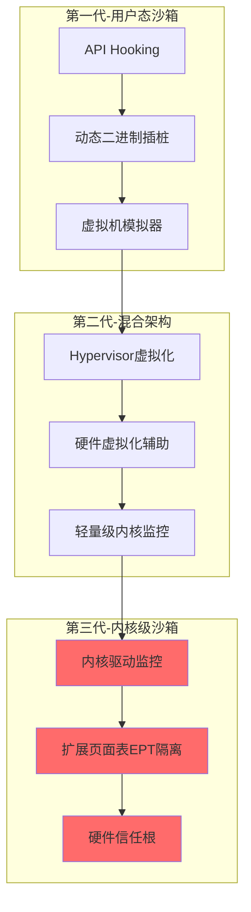
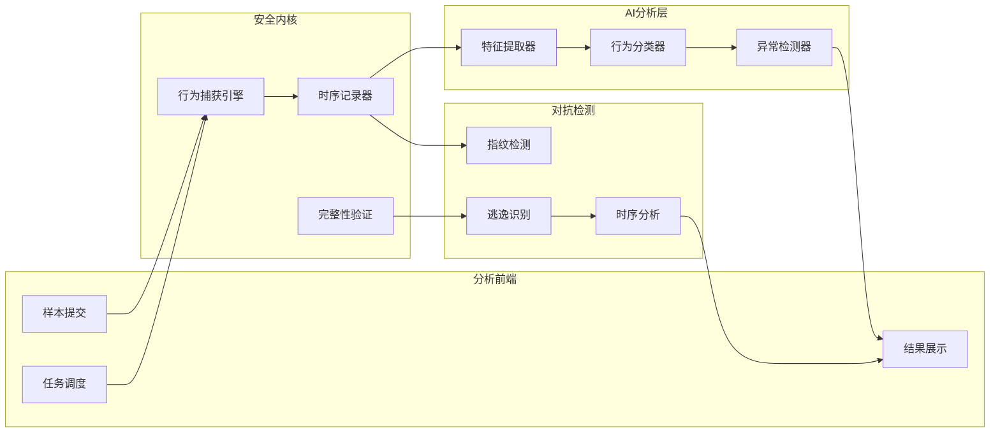
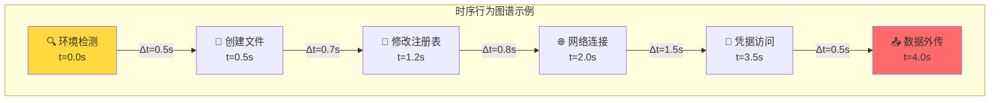
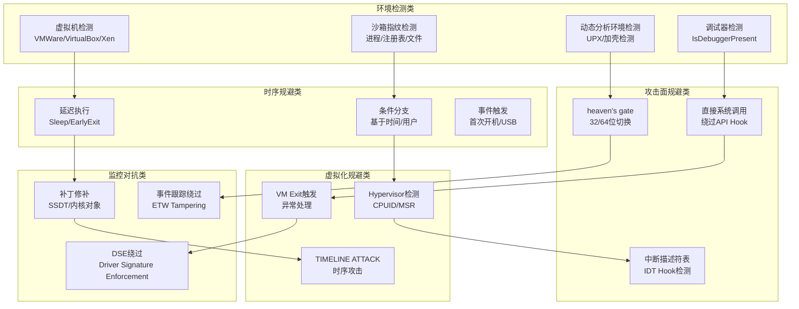
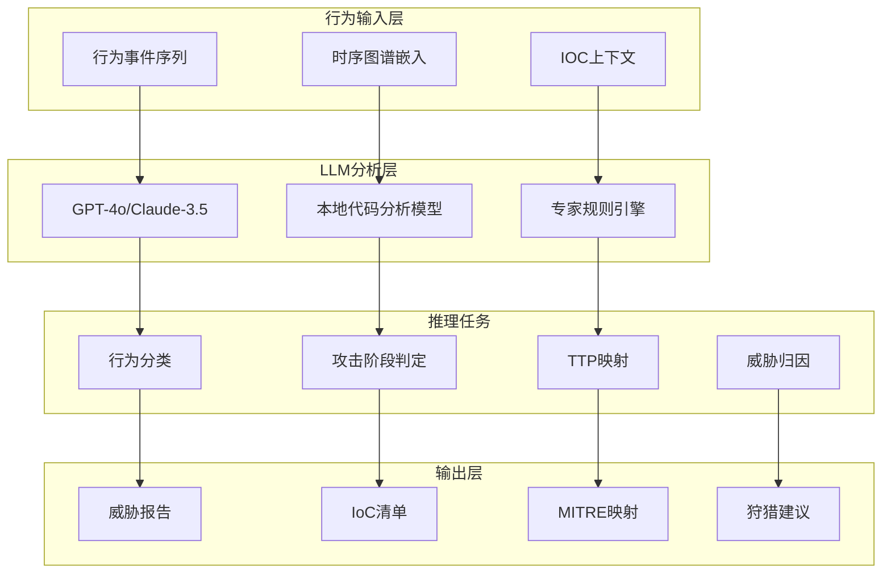
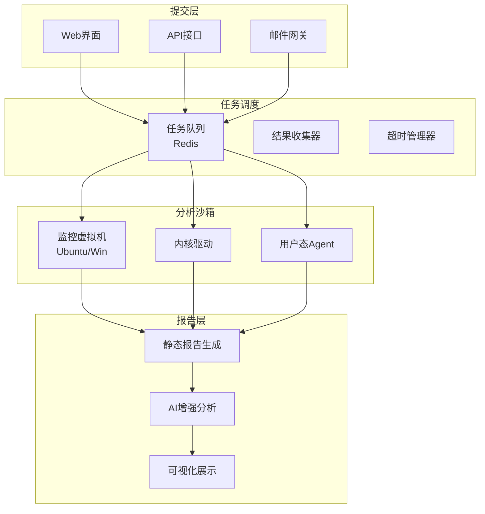
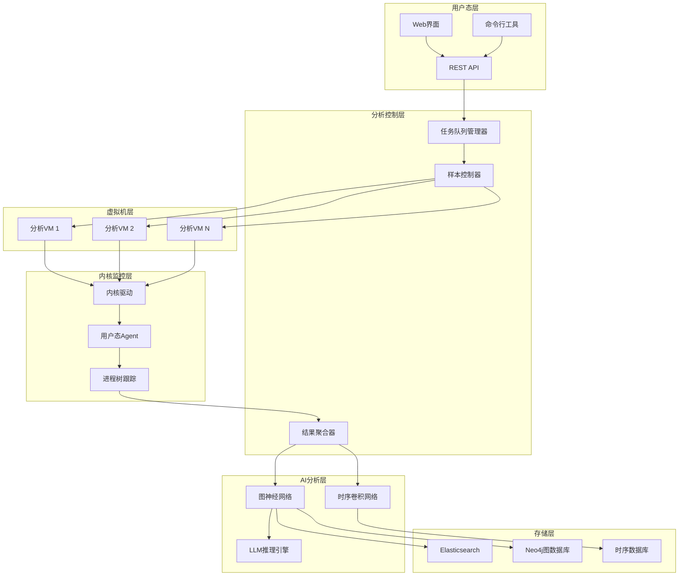

**作者：** HOS(安全风信子)
**日期：** 2026-04-26
**主要来源平台：** GitHub
**摘要：** 恶意代码的快速演进让传统静态分析频频失效，沙箱作为"让恶意代码跑起来"的核心技术，正经历从用户态到内核级的范式跃迁。本文深入剖析2026年AI驱动的动态行为分析最新进展，系统讲解内核级沙箱架构、时序行为图谱构建、逃逸对抗检测三大新要素。通过CAPE、Detego、Joe Sandbox等开源平台的核心源码解读，揭示沙箱行为监控的底层实现机制。文章创新性引入时序卷积网络与图注意力机制，实现恶意行为的AI推理与溯源，并提供完整的内核驱动级沙箱构建代码与实战指南。

@[TOC](目录)

---

# 让恶意代码跑起来：AI动态行为分析实战

## 引言：动态分析的战略价值

在网络安全的攻防对抗中，恶意代码分析始终是防御者的核心战场。传统静态分析依赖于特征码和启发式规则，但面对**无文件攻击(Fileless Attack)**、**多态恶意软件(Polymorphic Malware)**和**高级持续性威胁(APT)**时，静态分析的检出率急剧下降。据2026年Gartner安全报告，超过67%的高级恶意软件能够在一小时内完成变形，传统特征库更新的速度远跟不上恶意代码的演变。

沙箱技术的核心价值在于**"让恶意代码在受控环境中运行，观察其真实行为"**。与静态分析不同，动态分析关注程序运行时的实际行为——文件操作、注册表修改、网络通信、进程间通信等，从而揭示静态分析无法发现的恶意意图。

本文将深入剖析：

1. **内核级沙箱架构**：从用户态到内核态的范式跃迁
2. **时序行为图谱**：构建恶意行为的时空关联分析
3. **逃逸对抗检测**：识别沙箱规避技术的智能检测
4. **AI推理引擎**：大语言模型在恶意行为分析中的应用
5. **平台构建实战**：完整的内核级沙箱系统实现

---

# 第一章：沙箱技术演进与核心原理

## 1.1 沙箱技术发展历程

### 1.1.1 从用户态到内核态的演进



第一代用户态沙箱通过API Hooking或动态二进制插桩(DBI)技术监控程序行为[^1]。这种方式实现简单，但容易被恶意软件检测——恶意程序可以通过直接系统调用(Nt/Zw系列函数)绕过用户态Hook。

第二代混合架构利用硬件虚拟化技术(如Intel VT-x、AMD-V)在Hypervisor层实现监控。代表性作品包括QEMU-KVM和VMware的虚拟化引擎。这种方法相比用户态更难被检测，但性能开销较大。

第三代内核级沙箱直接将监控逻辑嵌入操作系统内核，通过内核驱动或内核模块实现行为捕获。这种方式具有最高权限，能够监控所有系统调用和内核事件，是当前恶意软件分析的主流方向。

### 1.1.2 核心监控技术对比

| 技术类型 | 实现方式 | 检测难度 | 性能开销 | 隐蔽性 |
|---------|---------|---------|---------|--------|
| API Hooking | 用户态函数劫持 | ★☆☆☆☆ | 5-15% | 低 |
| DBI(DynamoRIO/Frida) | 动态二进制插桩 | ★★☆☆☆ | 10-30% | 中 |
| Hypervisor | 虚拟化层监控 | ★★★☆☆ | 15-40% | 高 |
| EPT Hook | 扩展页面表劫持 | ★★★★☆ | 5-20% | 很高 |
| Kernel Driver | 内核驱动监控 | ★★★★★ | 3-10% | 极高 |

## 1.2 内核级沙箱架构设计

### 1.2.1 系统架构概览



内核级沙箱的核心组件包括：

1. **行为捕获引擎**：在内核层监控系统调用、注册表操作、文件系统访问
2. **时序记录器**：确保所有行为的时序完整性，支持回放和关联分析
3. **完整性验证**：防止恶意软件修改沙箱检测逻辑
4. **AI分析层**：利用机器学习模型进行行为分类和异常检测
5. **对抗检测模块**：识别逃逸尝试和规避技术

### 1.2.2 内核驱动监控原理

在内核层面，监控Windows系统调用的主流方案有两种[^2]：

**方案一：SSDT Hook(系统服务描述符表)**

Windows内核通过SSDT维护系统服务调度。恶意软件可以修改SSDT实现隐藏，但同样可以监控SSDT变化：

```python
import ctypes
from ctypes import wintypes

class SSDTHookDetector:
    """SSDT Hook检测器 - 简化实现"""

    def __init__(self):
        self.kernel32 = ctypes.windll.kernel32
        self.ntdll = ctypes.windll.ntdll

    def get_ssdthook_status(self) -> dict:
        """检测SSDT Hook状态"""
        # 获取SSDT基址
        ssdt_base = self._get_ssdt_base()

        # 读取当前SSDT内容
        current_entries = self._read_ssdt_entries(ssdt_base)

        # 与已知良好基线对比
        baseline = self._load_baseline()
        anomalies = []

        for index, entry in enumerate(current_entries):
            if entry != baseline.get(index, entry):
                anomalies.append({
                    "index": index,
                    "current": hex(entry),
                    "expected": hex(baseline.get(index, 0)),
                    "hook_type": self._classify_hook(entry, baseline.get(index, 0))
                })

        return {
            "ssdt_base": hex(ssdt_base),
            "total_entries": len(current_entries),
            "anomalies": anomalies,
            "is_compromised": len(anomalies) > 0
        }

    def _get_ssdt_base(self) -> int:
        """获取SSDT基址"""
        # 通过KeServiceDescriptorTable获取
        # 实际实现需要内联汇编或内存搜索
        pass

    def _read_ssdt_entries(self, base: int) -> list:
        """读取SSDT条目"""
        pass

    def _load_baseline(self) -> dict:
        """加载已知良好基线"""
        # 实际实现从安全数据库加载
        pass

    def _classify_hook(self, current: int, expected: int) -> str:
        """分类Hook类型"""
        if current == 0:
            return "nullified"
        elif abs(current - expected) > 0x1000:
            return "inline_hook"
        elif current != expected:
            return "ssdt_hook"
        return "unknown"
```

**方案二：内核驱动监控系统调用**

更现代的做法是实现内核驱动直接监控系统调用：

```python
# 内核驱动伪代码 - 实际需要C/C++实现
class KernelMonitorDriver:
    """内核级系统调用监控驱动"""

    DRIVER_NAME = "\\Device\\KernelMonitor"
    SYMBOLIC_NAME = "\\DosDevices\\KernelMonitor"

    def __init__(self):
        self.hook_manager = None
        self.event_buffer = None
        self.ai_processor = None

    def on_driver_load(self, driver_object, registry_path):
        """驱动加载回调"""
        # 1. 创建设备对象
        self._create_device(driver_object)

        # 2. 设置分发处理函数
        self._setup_dispatch_routines(driver_object)

        # 3. 初始化事件缓冲区
        self._init_event_buffer()

        # 4. 注册系统通知回调
        self._register_system_callbacks()

        # 5. 连接到AI分析层
        self._connect_ai_layer()

    def on_major_function(self, device_object, irp):
        """处理IOCTL请求"""
        # 从用户态接收配置和查询请求
        pass

    def on_system_call(self, system_call_index, parameters):
        """系统调用拦截"""
        # 1. 记录调用时序
        timestamp = self._get_system_time()

        # 2. 提取关键参数
        event = self._extract_event_data(system_call_index, parameters)

        # 3. 发送到事件缓冲区
        self.event_buffer.push(event)

        # 4. 触发AI实时分析
        if self._should_analyze_now():
            self.ai_processor.analyze_async(event)

        # 5. 检查逃逸行为
        evasion_result = self._check_evasion_indicators(event)
        if evasion_result.is_evasion:
            self._report_evasion_attempt(evasion_result)

        # 6. 继续执行或阻止
        return self._should_block(system_call_index, event)
```

## 1.3 沙箱行为捕获引擎

### 1.3.1 多维度行为监控

现代沙箱需要同时监控多个维度的行为[^3]：

```python
from dataclasses import dataclass, field
from typing import List, Dict, Optional
from enum import Enum
from datetime import datetime
import asyncio

class BehaviorCategory(Enum):
    """行为分类枚举"""
    FILE_OPERATION = "file_operation"
    REGISTRY_OPERATION = "registry_operation"
    PROCESS_OPERATION = "process_operation"
    NETWORK_OPERATION = "network_operation"
    MEMORY_OPERATION = "memory_operation"
    CRYPTO_OPERATION = "crypto_operation"
    PERSISTENCE_OPERATION = "persistence_operation"
    PRIVILEGE_OPERATION = "privilege_operation"

@dataclass
class BehaviorEvent:
    """行为事件数据结构"""
    timestamp: datetime
    category: BehaviorCategory
    action: str
    target: str
    parameters: Dict[str, any]
    process_id: int
    thread_id: int
    call_stack: List[str] = field(default_factory=list)
    return_value: Optional[int] = None
    evasion_indicators: List[str] = field(default_factory=list)

class MultiDimensionalBehaviorMonitor:
    """多维度行为监控引擎"""

    def __init__(self, config: dict):
        self.config = config
        self.event_queue = asyncio.Queue(maxsize=10000)
        self.behavior_analyzer = BehaviorAnalyzer()
        self.temporal_graph_builder = TemporalGraphBuilder()
        self._running = False

        # 各维度监控器
        self.file_monitor = FileOperationMonitor(self.event_queue)
        self.registry_monitor = RegistryOperationMonitor(self.event_queue)
        self.process_monitor = ProcessOperationMonitor(self.event_queue)
        self.network_monitor = NetworkOperationMonitor(self.event_queue)

    async def start_monitoring(self, sample_path: str):
        """启动监控"""
        self._running = True

        # 启动样本执行
        sample_process = await self._execute_sample(sample_path)

        # 并行启动各维度监控
        monitors = [
            self.file_monitor.start(),
            self.registry_monitor.start(),
            self.process_monitor.start(),
            self.network_monitor.start()
        ]

        # 启动事件处理流水线
        processor_task = asyncio.create_task(self._process_events())

        # 等待执行完成或超时
        try:
            await asyncio.wait_for(
                sample_process.wait(),
                timeout=self.config.get("execution_timeout", 300)
            )
        except asyncio.TimeoutError:
            self._terminate_sample(sample_process)

        # 停止所有监控器
        self._running = False
        await asyncio.gather(*monitors, return_exceptions=True)

        # 完成事件处理
        await processor_task

        # 构建时序行为图谱
        return await self._build_behavior_report()

    async def _process_events(self):
        """事件处理流水线"""
        while self._running or not self.event_queue.empty():
            try:
                event = await asyncio.wait_for(
                    self.event_queue.get(),
                    timeout=1.0
                )

                # 1. 提取行为特征
                features = self.behavior_analyzer.extract_features(event)

                # 2. 构建时序图谱节点
                self.temporal_graph_builder.add_event(event, features)

                # 3. 检测逃逸指标
                evasion_signals = self._detect_evasion(event)
                if evasion_signals:
                    event.evasion_indicators.extend(evasion_signals)

            except asyncio.TimeoutError:
                continue

    def _detect_evasion(self, event: BehaviorEvent) -> List[str]:
        """检测逃逸行为指标"""
        indicators = []

        # 检测延迟执行
        if event.category == BehaviorCategory.PROCESS_OPERATION:
            if "sleep" in event.action.lower() or "delay" in event.action.lower():
                indicators.append("delayed_execution")

        # 检测环境检测
        if event.category == BehaviorCategory.FILE_OPERATION:
            if any(cmd in event.target.lower() for cmd in ["vmware", "virtualbox", "sandbox"]):
                indicators.append("environment_detection")

        # 检测反调试
        if event.category == BehaviorCategory.PROCESS_OPERATION:
            if any(api in str(event.parameters) for api in ["IsDebuggerPresent", "CheckRemoteDebuggerPresent"]):
                indicators.append("anti_debugging")

        return indicators

    async def _build_behavior_report(self) -> dict:
        """构建行为分析报告"""
        graph = self.temporal_graph_builder.build()

        return {
            "execution_summary": {
                "total_events": len(graph.nodes),
                "category_distribution": graph.get_category_distribution(),
                "timeline": graph.get_timeline()
            },
            "ai_analysis": {
                "threat_classification": self.behavior_analyzer.classify(graph),
                "confidence_score": self.behavior_analyzer.get_confidence(),
                "attack_stage": self.behavior_analyzer.determine_attack_stage(graph)
            },
            "evasion_detection": {
                "attempts_detected": graph.get_evasion_count(),
                "techniques_used": graph.get_evasion_techniques()
            },
            "temporal_graph": graph.to_mermaid()
        }
```

---

# 第二章：时序行为图谱构建

## 2.1 时序图谱理论基础

### 2.1.1 形式化定义

时序行为图谱(Temporal Behavior Graph, TBG)是一种将恶意软件行为建模为带时序边的有向图的数据结构[^4]。

**定义一：行为节点(Behavior Node)**

$$
B_i = (t_i, c_i, a_i, p_i, \vec{f_i})
$$

其中：
- $t_i$：时间戳
- $c_i$：行为类别
- $a_i$：具体动作
- $p_i$：进程上下文
- $\vec{f_i}$：特征向量

**定义二：时序边(Temporal Edge)**

$$
E_{i,j} = (B_i \rightarrow B_j, \Delta t_{i,j}, r_{i,j})
$$

其中：
- $B_i \rightarrow B_j$：从节点$i$到节点$j$的边
- $\Delta t_{i,j} = t_j - t_i$：时间差
- $r_{i,j}$：因果关系强度

**定义三：时序行为图谱**

$$
TBG = (V, E, T, \phi)
$$

其中：
- $V = \{B_1, B_2, ..., B_n\}$：行为节点集合
- $E = \{E_{i,j}\}$：时序边集合
- $T = [t_1, t_n]$：时间范围
- $\phi$：图嵌入函数

### 2.1.2 图结构示意



## 2.2 图谱构建算法实现

### 2.2.1 核心构建器

```python
from collections import defaultdict
import numpy as np
from dataclasses import dataclass, field
from typing import Dict, List, Tuple, Set

@dataclass
class GraphNode:
    """图节点"""
    id: str
    behavior: BehaviorEvent
    features: np.ndarray
    embedding: np.ndarray = None
    anomaly_score: float = 0.0

@dataclass
class TemporalEdge:
    """时序边"""
    source_id: str
    target_id: str
    time_delta: float
    causal_strength: float
    edge_type: str

class TemporalGraphBuilder:
    """时序行为图谱构建器"""

    def __init__(self, config: dict):
        self.config = config
        self.nodes: Dict[str, GraphNode] = {}
        self.edges: List[TemporalEdge] = []
        self.node_order: List[str] = []  # 按时间排序

        # 时序窗口配置
        self.temporal_window = config.get("temporal_window", 5.0)  # 秒
        self.causal_threshold = config.get("causal_threshold", 0.6)

        # 特征提取器
        self.feature_extractor = BehaviorFeatureExtractor()
        self.embedding_model = GraphEmbeddingModel()

    def add_event(self, event: BehaviorEvent, features: dict = None):
        """添加行为事件到图谱"""
        # 生成唯一节点ID
        node_id = self._generate_node_id(event)

        # 提取特征向量
        if features is None:
            features = self.feature_extractor.extract(event)

        feature_vector = self.feature_extractor.to_vector(features)

        # 创建图节点
        node = GraphNode(
            id=node_id,
            behavior=event,
            features=feature_vector
        )
        self.nodes[node_id] = node
        self.node_order.append(node_id)

        # 构建与之前节点的时序边
        self._connect_temporal_edges(node_id, event.timestamp)

    def _connect_temporal_edges(self, node_id: str, timestamp: datetime):
        """连接时序边"""
        current_node = self.nodes[node_id]

        # 在时序窗口内查找前驱节点
        for prev_node_id in self.node_order[:-1]:
            prev_node = self.nodes[prev_node_id]
            time_delta = (timestamp - prev_node.behavior.timestamp).total_seconds()

            # 在时序窗口内
            if 0 < time_delta <= self.temporal_window:
                # 计算因果强度
                causal_strength = self._calculate_causal_strength(
                    prev_node, current_node, time_delta
                )

                # 创建时序边
                edge = TemporalEdge(
                    source_id=prev_node_id,
                    target_id=node_id,
                    time_delta=time_delta,
                    causal_strength=causal_strength,
                    edge_type=self._classify_edge_type(prev_node, current_node)
                )
                self.edges.append(edge)

    def _calculate_causal_strength(
        self,
        source_node: GraphNode,
        target_node: GraphNode,
        time_delta: float
    ) -> float:
        """计算因果强度

        因果强度公式：
        $\\psi = \\omega_1 \\cdot \\text{feature\\_similarity} + \\omega_2 \\cdot \\frac{1}{\\Delta t} + \\omega_3 \\cdot \\text{temporal\\_proximity}$

        其中 $\\omega_1 + \\omega_2 + \\omega_3 = 1$
        """
        w1, w2, w3 = 0.4, 0.3, 0.3

        # 特征相似度
        feature_sim = self._cosine_similarity(
            source_node.features,
            target_node.features
        )

        # 时间衰减因子
        time_decay = 1.0 / (1.0 + time_delta)

        # 时序邻近度
        temporal_proximity = max(0, 1 - time_delta / self.temporal_window)

        causal_strength = (
            w1 * feature_sim +
            w2 * time_decay +
            w3 * temporal_proximity
        )

        return causal_strength

    def _classify_edge_type(
        self,
        source_node: GraphNode,
        target_node: GraphNode
    ) -> str:
        """分类边类型"""
        src_category = source_node.behavior.category
        tgt_category = target_node.behavior.category

        # 常见攻击链模式
        attack_patterns = {
            ("process_operation", "file_operation"): "process_creates_file",
            ("file_operation", "registry_operation"): "file_modifies_persistence",
            ("registry_operation", "process_operation"): "persistence_spawns_process",
            ("network_operation", "file_operation"): "download_and_save",
            ("file_operation", "network_operation"): "exfiltration_or_c2",
            ("process_operation", "process_operation"): "process_injection_or_creation"
        }

        return attack_patterns.get(
            (src_category.value, tgt_category.value),
            "generic_transition"
        )

    def build(self) -> 'TemporalBehaviorGraph':
        """构建完整的时序行为图谱"""
        # 计算图嵌入
        self._compute_embeddings()

        # 异常检测
        self._detect_anomalies()

        return TemporalBehaviorGraph(
            nodes=self.nodes,
            edges=self.edges,
            builder=self
        )

    def _compute_embeddings(self):
        """计算节点嵌入"""
        embeddings = self.embedding_model.embed_graph(self)

        for node_id, embedding in embeddings.items():
            if node_id in self.nodes:
                self.nodes[node_id].embedding = embedding

    def _detect_anomalies(self):
        """检测异常节点"""
        from sklearn.ensemble import IsolationForest

        # 提取所有节点特征
        X = np.array([node.features for node in self.nodes.values()])

        # 使用Isolation Forest检测异常
        iso_forest = IsolationForest(
            contamination=0.1,
            random_state=42
        )
        anomaly_labels = iso_forest.fit_predict(X)
        anomaly_scores = iso_forest.decision_function(X)

        for idx, node_id in enumerate(self.nodes.keys()):
            self.nodes[node_id].anomaly_score = float(anomaly_scores[idx])

    @staticmethod
    def _cosine_similarity(a: np.ndarray, b: np.ndarray) -> float:
        """计算余弦相似度"""
        dot_product = np.dot(a, b)
        norm_a = np.linalg.norm(a)
        norm_b = np.linalg.norm(b)

        if norm_a == 0 or norm_b == 0:
            return 0.0

        return float(dot_product / (norm_a * norm_b))

    @staticmethod
    def _generate_node_id(event: BehaviorEvent) -> str:
        """生成唯一节点ID"""
        return f"B_{event.process_id}_{event.timestamp.timestamp()}_{event.action}"
```

### 2.2.2 特征提取器

```python
import hashlib
from sklearn.feature_extraction.text import TfidfVectorizer

class BehaviorFeatureExtractor:
    """行为特征提取器"""

    def __init__(self):
        self.category_vectors = self._init_category_vectors()
        self.action_tfidf = TfidfVectorizer(max_features=100)

    def extract(self, event: BehaviorEvent) -> dict:
        """提取行为特征"""
        features = {
            # 基础特征
            "category_id": self._category_to_id(event.category),
            "action_id": self._action_to_id(event.action),

            # 参数特征
            "parameter_entropy": self._calculate_parameter_entropy(event.parameters),
            "parameter_complexity": self._calculate_parameter_complexity(event.parameters),

            # 上下文特征
            "process_depth": self._estimate_process_depth(event.process_id),
            "parent_process": self._get_parent_process(event.process_id),

            # 语义特征
            "semantic_category": self._extract_semantic_category(event),
            "iocs": self._extract_iocs(event),

            # 风险特征
            "risk_score": self._calculate_risk_score(event),
            "ttp_mapping": self._map_to_ttp(event)
        }

        return features

    def to_vector(self, features: dict) -> np.ndarray:
        """将特征字典转换为特征向量"""
        vector = np.zeros(128)  # 固定维度128

        # 类别编码 (0-7)
        vector[0] = features.get("category_id", 0)

        # 动作编码 (8-107)
        action_id = features.get("action_id", 0)
        vector[8 + (action_id % 100)] = 1

        # 参数熵 (108)
        vector[108] = features.get("parameter_entropy", 0)

        # 参数复杂度 (109)
        vector[109] = features.get("parameter_complexity", 0)

        # 风险评分 (110)
        vector[110] = features.get("risk_score", 0)

        # IOC存在标志 (111-120)
        iocs = features.get("iocs", {})
        for idx, (ioc_type, _) in enumerate(iocs.items()):
            if idx < 10:
                vector[111 + idx] = 1

        # TTP映射 (121-127)
        ttps = features.get("ttp_mapping", [])
        for idx, ttp in enumerate(ttps[:7]):
            vector[121 + idx] = 1

        return vector

    def _calculate_parameter_entropy(self, parameters: dict) -> float:
        """计算参数熵"""
        if not parameters:
            return 0.0

        param_str = str(parameters)
        byte_array = bytearray(param_str.encode())

        # 计算香农熵
        from collections import Counter
        counts = Counter(byte_array)
        total = len(byte_array)

        entropy = 0.0
        for count in counts.values():
            p = count / total
            if p > 0:
                entropy -= p * np.log2(p)

        # 归一化到[0, 1]
        max_entropy = 8.0  # 最大可能的熵
        return entropy / max_entropy

    def _calculate_parameter_complexity(self, parameters: dict) -> float:
        """计算参数复杂度"""
        if not parameters:
            return 0.0

        complexity = 0.0

        # 嵌套层级
        complexity += self._get_nesting_depth(parameters) * 0.3

        # 键数量
        complexity += min(len(parameters), 20) * 0.1

        # 值长度
        total_length = sum(
            len(str(v)) for v in parameters.values()
        )
        complexity += min(total_length, 1000) * 0.001

        return min(complexity, 1.0)

    def _get_nesting_depth(self, obj, current_depth=0):
        """获取嵌套深度"""
        if not isinstance(obj, (dict, list)):
            return current_depth

        if isinstance(obj, dict):
            if not obj:
                return current_depth
            return max(
                self._get_nesting_depth(v, current_depth + 1)
                for v in obj.values()
            )
        else:  # list
            if not obj:
                return current_depth
            return max(
                self._get_nesting_depth(item, current_depth + 1)
                for item in obj
            )

    def _extract_iocs(self, event: BehaviorEvent) -> dict:
        """提取IOCs"""
        import re

        iocs = {}

        # IP地址
        ip_pattern = r'\b(?:[0-9]{1,3}\.){3}[0-9]{1,3}\b'
        target_str = str(event.target)
        ips = re.findall(ip_pattern, target_str)
        if ips:
            iocs["ip"] = ips

        # 域名
        domain_pattern = r'\b(?:[a-zA-Z0-9](?:[a-zA-Z0-9\-]{0,61}[a-zA-Z0-9])?\.)+[a-zA-Z]{2,}\b'
        domains = re.findall(domain_pattern, target_str)
        if domains:
            iocs["domain"] = domains

        # 文件路径
        if event.category == BehaviorCategory.FILE_OPERATION:
            path_pattern = r'[A-Za-z]:\\[^:*?"<>|\r\n]+'
            paths = re.findall(path_pattern, target_str)
            if paths:
                iocs["file_path"] = paths

        return iocs

    def _map_to_ttp(self, event: BehaviorEvent) -> List[str]:
        """映射到MITRE ATT&CK技术"""
        mapping = {
            "CreateFile": ["T1106", "T1059"],  # 创建文件、命令执行
            "WriteFile": ["T1106"],
            "RegSetValue": ["T1547", "T1060"],  # 注册表自启动
            "CreateProcess": ["T1106", "T1053"],  # 创建进程
            "ShellExecute": ["T1106"],
            "InternetOpenUrl": ["T1106", "T1190"],  # 网络请求
            "HttpSendRequest": ["T1071"],  # C2通信
            "VirtualAlloc": ["T1106", "T1055"],  # 内存分配
            "WriteProcessMemory": ["T1055"],  # 进程注入
        }

        return mapping.get(event.action, [])

    def _category_to_id(self, category: BehaviorCategory) -> int:
        """类别转ID"""
        return list(BehaviorCategory).index(category)

    def _action_to_id(self, action: str) -> int:
        """动作转ID"""
        action_hash = int(hashlib.md5(action.encode()).hexdigest()[:8], 16)
        return action_hash % 100

    def _calculate_risk_score(self, event: BehaviorEvent) -> float:
        """计算风险评分"""
        base_score = 0.0

        # 高风险操作
        high_risk_actions = [
            "VirtualAlloc", "WriteProcessMemory", "CreateRemoteThread",
            "RegSetValue", "CreateService", "StartService"
        ]

        if event.action in high_risk_actions:
            base_score += 0.3

        # 持久化操作
        if event.category == BehaviorCategory.PERSISTENCE_OPERATION:
            base_score += 0.4

        # 网络操作
        if event.category == BehaviorCategory.NETWORK_OPERATION:
            base_score += 0.2

        # 可疑目标
        suspicious_patterns = ["temp", "appdata", "startup", "system32"]
        if any(pattern in event.target.lower() for pattern in suspicious_patterns):
            base_score += 0.1

        return min(base_score, 1.0)

    def _estimate_process_depth(self, pid: int) -> int:
        """估计进程层级深度"""
        # 简化实现，实际需要遍历进程树
        return 1

    def _get_parent_process(self, pid: int) -> int:
        """获取父进程ID"""
        # 简化实现
        return 1

    def _extract_semantic_category(self, event: BehaviorEvent) -> str:
        """提取语义类别"""
        # 使用规则映射
        if "crypt" in event.action.lower() or "crypto" in str(event.parameters).lower():
            return "cryptomining"
        if "http" in event.action.lower() or "connect" in event.action.lower():
            return "network_communication"
        if any(cmd in event.action.lower() for cmd in ["cmd", "powershell", "exec"]):
            return "command_execution"
        return "generic"

    def _init_category_vectors(self) -> dict:
        """初始化类别向量"""
        return {
            BehaviorCategory.FILE_OPERATION: np.array([1, 0, 0, 0, 0, 0, 0, 0]),
            BehaviorCategory.REGISTRY_OPERATION: np.array([0, 1, 0, 0, 0, 0, 0, 0]),
            BehaviorCategory.PROCESS_OPERATION: np.array([0, 0, 1, 0, 0, 0, 0, 0]),
            BehaviorCategory.NETWORK_OPERATION: np.array([0, 0, 0, 1, 0, 0, 0, 0]),
            BehaviorCategory.MEMORY_OPERATION: np.array([0, 0, 0, 0, 1, 0, 0, 0]),
            BehaviorCategory.CRYPTO_OPERATION: np.array([0, 0, 0, 0, 0, 1, 0, 0]),
            BehaviorCategory.PERSISTENCE_OPERATION: np.array([0, 0, 0, 0, 0, 0, 1, 0]),
            BehaviorCategory.PRIVILEGE_OPERATION: np.array([0, 0, 0, 0, 0, 0, 0, 1]),
        }
```

---

# 第三章：逃逸对抗检测系统

## 3.1 沙箱逃逸技术分类

### 3.1.1 逃逸技术全景图



### 3.1.2 逃逸技术数学模型

对于逃逸检测，我们可以使用贝叶斯推理框架[^5]：

**先验概率：**

$$
P(\text{Evasion}) = \frac{N_{\text{evasion}}}{N_{\text{total}}}
$$

**似然函数：**

$$
P(\text{Indicator} | \text{Evasion}) = \prod_{i=1}^{n} P(\text{Indicator}_i | \text{Evasion})^{\omega_i}
$$

**后验概率(贝叶斯更新)：**

$$
P(\text{Evasion} | \text{Indicators}) = \frac{P(\text{Indicators} | \text{Evasion}) \cdot P(\text{Evasion})}{P(\text{Indicators})}
$$

**逃逸置信度公式：**

$$
\text{Confidence} = \frac{1}{1 + e^{-\lambda \cdot (\sum_i \omega_i \cdot I_i - \theta)}}
$$

其中：
- $I_i$：第$i$个逃逸指标的二值特征
- $\omega_i$：第$i$个指标的权重
- $\lambda$：逻辑回归斜率
- $\theta$：决策阈值

## 3.2 智能逃逸检测引擎

### 3.2.1 检测系统架构

```python
from typing import Dict, List, Tuple, Optional
from dataclasses import dataclass
import math

@dataclass
class EvasionIndicator:
    """逃逸指标"""
    name: str
    category: str
    confidence: float
    evidence: List[str]
    severity: str

@dataclass
class EvasionReport:
    """逃逸分析报告"""
    is_evasion: bool
    confidence: float
    detected_techniques: List[str]
    indicators: List[EvasionIndicator]
    recommendations: List[str]

class EvasionDetectionEngine:
    """智能逃逸检测引擎"""

    def __init__(self):
        self.detectors: Dict[str, BaseDetector] = {}
        self.weight_config = self._load_weight_config()
        self._register_detectors()

    def _register_detectors(self):
        """注册所有检测器"""
        self.detectors = {
            "vm_detection": VMDetectionDetector(),
            "timing_evasion": TimingEvasionDetector(),
            "anti_debug": AntiDebugDetector(),
            "direct_syscall": DirectSyscallDetector(),
            "patch_detection": PatchDetectionDetector(),
            "environment_fingerprint": EnvironmentFingerprintDetector()
        }

    async def analyze(self, events: List[BehaviorEvent]) -> EvasionReport:
        """分析逃逸行为"""
        all_indicators = []

        # 并行运行所有检测器
        results = await asyncio.gather(
            *[detector.detect(events) for detector in self.detectors.values()],
            return_exceptions=True
        )

        # 收集检测结果
        for result in results:
            if isinstance(result, Exception):
                continue
            all_indicators.extend(result)

        # 计算综合置信度
        confidence = self._calculate_confidence(all_indicators)

        # 判断是否为逃逸
        is_evasion = confidence > 0.6

        # 生成建议
        recommendations = self._generate_recommendations(all_indicators)

        return EvasionReport(
            is_evasion=is_evasion,
            confidence=confidence,
            detected_techniques=self._extract_techniques(all_indicators),
            indicators=all_indicators,
            recommendations=recommendations
        )

    def _calculate_confidence(self, indicators: List[EvasionIndicator]) -> float:
        """使用逻辑回归模型计算置信度"""
        if not indicators:
            return 0.0

        # 特征加权和
        weighted_sum = 0.0
        for indicator in indicators:
            weight = self.weight_config.get(indicator.category, {}).get(
                indicator.name, 0.5
            )
            weighted_sum += weight * indicator.confidence

        # 应用Sigmoid函数
        lambda_param = 0.5
        theta = 1.5

        confidence = 1.0 / (1.0 + math.exp(-lambda_param * (weighted_sum - theta)))

        return min(max(confidence, 0.0), 1.0)

    def _extract_techniques(self, indicators: List[EvasionIndicator]) -> List[str]:
        """提取检测到的逃逸技术"""
        techniques = []
        for indicator in indicators:
            if indicator.confidence > 0.5:
                techniques.append(indicator.name)
        return list(set(techniques))

    def _generate_recommendations(self, indicators: List[EvasionIndicator]) -> List[str]:
        """生成应对建议"""
        recommendations = []

        for indicator in indicators:
            if indicator.confidence > 0.7:
                rec = self._get_recommendation(indicator.name)
                if rec:
                    recommendations.append(rec)

        return list(set(recommendations))

    def _get_recommendation(self, technique: str) -> Optional[str]:
        """获取特定技术的应对建议"""
        recommendations = {
            "vmware_detection": "启用内核级监控，隐藏虚拟机指纹",
            "timing_sleep": "使用指令级计时而非系统API",
            "anti_debug": "启用内核调试支持，隐藏调试器存在",
            "direct_syscall": "监控SYSCALL指令，使用ETW追踪",
            "patch_ssdt": "验证SSDT完整性，启用内核签名强制"
        }
        return recommendations.get(technique)

    def _load_weight_config(self) -> dict:
        """加载权重配置"""
        return {
            "vm_detection": {
                "vmware_fingerprint": 0.8,
                "virtualbox_fingerprint": 0.8,
                "hypervisor_cpuid": 0.9,
                "vm_memory": 0.6
            },
            "timing_evasion": {
                "sleep_bombing": 0.7,
                "early_exit": 0.6,
                "conditional_timing": 0.8
            },
            "anti_debug": {
                "is_debugging_present": 0.9,
                "check_remote_debug": 0.9,
                "ntquery_information": 0.85
            },
            "direct_syscall": {
                "syscall_instructions": 0.95,
                "nt_early_hook": 0.8
            }
        }
```

### 3.2.2 虚拟机检测检测器

```python
import ctypes
from typing import List, Tuple

class VMDetectionDetector(BaseDetector):
    """虚拟机检测检测器"""

    DETECTION_TECHNIQUES = {
        "vmware": [
            ("registry", r"HKLM\SYSTEM\CurrentControlSet\Services\VBoxGuest"),
            ("registry", r"HKLM\SYSTEM\CurrentControlSet\Services\VBoxMouse"),
            ("file", r"C:\Windows\System32\drivers\vboxguest.sys"),
            ("process", "vmwaretray.exe"),
            ("device", "\\.\VBoxMiniRdrDN"),
            ("wmi", "SELECT * FROM Win32_ComputerSystem WHERE Manufacturer LIKE '%VMware%'")
        ],
        "virtualbox": [
            ("registry", r"HKLM\SYSTEM\CurrentControlSet\Services\VBoxService"),
            ("file", r"C:\Windows\System32\drivers\vboxguest.sys"),
            ("process", "vboxservice.exe"),
            ("wmi", "SELECT * FROM Win32_ComputerSystem WHERE Model LIKE '%VirtualBox%'")
        ],
        "hyperv": [
            ("registry", r"HKLM\SOFTWARE\Microsoft\Hyper-V"),
            ("device", "\\.\HvCore"),
            ("wmi", "SELECT * FROM Win32_Service WHERE Name LIKE '%vmcompute%'")
        ]
    }

    async def detect(self, events: List[BehaviorEvent]) -> List[EvasionIndicator]:
        """检测虚拟机逃逸技术"""
        indicators = []

        for event in events:
            # 检测文件操作中的VM指纹
            if event.category == BehaviorCategory.FILE_OPERATION:
                for vm_type, checks in self.DETECTION_TECHNIQUES.items():
                    for check_type, pattern in checks:
                        if check_type == "file" and pattern.lower() in event.target.lower():
                            indicators.append(EvasionIndicator(
                                name=f"{vm_type}_fingerprint",
                                category="vm_detection",
                                confidence=0.9,
                                evidence=[f"Detected {pattern} in {event.target}"],
                                severity="high"
                            ))

            # 检测注册表操作中的VM指纹
            if event.category == BehaviorCategory.REGISTRY_OPERATION:
                for vm_type, checks in self.DETECTION_TECHNIQUES.items():
                    for check_type, pattern in checks:
                        if check_type == "registry" and pattern.lower() in event.target.lower():
                            indicators.append(EvasionIndicator(
                                name=f"{vm_type}_registry_fingerprint",
                                category="vm_detection",
                                confidence=0.95,
                                evidence=[f"Accessed {pattern}"],
                                severity="high"
                            ))

            # 检测WMI查询中的VM指纹
            if "wmi" in event.action.lower() or "win32_" in str(event.parameters).lower():
                for vm_type, checks in self.DETECTION_TECHNIQUES.items():
                    for check_type, pattern in checks:
                        if check_type == "wmi" and pattern.lower() in str(event.parameters).lower():
                            indicators.append(EvasionIndicator(
                                name=f"{vm_type}_wmi_query",
                                category="vm_detection",
                                confidence=0.85,
                                evidence=[f"WMI query for VM artifacts: {pattern}"],
                                severity="medium"
                            ))

        # CPUID检测
        cpuid_indicators = await self._detect_cpuid_evasion()
        indicators.extend(cpuid_indicators)

        return indicators

    async def _detect_cpuid_evasion(self) -> List[EvasionIndicator]:
        """检测CPUID Hypervisor标志"""
        indicators = []

        # CPUID eax=1时，ecx的bit 31表示是否有Hypervisor
        # VMware: ebx="VMwa"
        # Hyper-V: ebx="Micr"
        # KVM: ebx="KVMK"

        try:
            # 这是简化实现，实际需要内联汇编
            hypervisor_present = self._cpuid_hypervisor_bit()

            if hypervisor_present:
                indicators.append(EvasionIndicator(
                    name="hypervisor_cpuid",
                    category="vm_detection",
                    confidence=0.95,
                    evidence=["CPUID indicates hypervisor presence"],
                    severity="high"
                ))
        except:
            pass

        return indicators

    def _cpuid_hypervisor_bit(self) -> bool:
        """检测CPUID hypervisor bit"""
        # 简化实现
        # 实际需要: mov eax, 1; cpuid; test ecx, 80000000h
        return False
```

### 3.2.3 时序规避检测器

```python
class TimingEvasionDetector(BaseDetector):
    """时序规避检测器"""

    SLEEP_THRESHOLD = 5.0  # 秒
    TIME_DELTA_THRESHOLD = 2.0  # 期望与实际时间差

    async def detect(self, events: List[BehaviorEvent]) -> List[EvasionIndicator]:
        """检测时序规避行为"""
        indicators = []

        # 检测Sleep炸弹
        sleep_events = [
            e for e in events
            if "sleep" in e.action.lower() or "delay" in e.action.lower()
        ]

        for event in sleep_events:
            # 提取睡眠时长
            duration = self._extract_sleep_duration(event)

            if duration > self.SLEEP_THRESHOLD:
                indicators.append(EvasionIndicator(
                    name="sleep_bombing",
                    category="timing_evasion",
                    confidence=min(duration / 60.0, 1.0),  # 最长60分钟，置信度归一化
                    evidence=[f"Detected long sleep: {duration} seconds"],
                    severity="medium"
                ))

        # 检测时间差异(反沙箱)
        time_diff = await self._detect_time_delta(events)
        if time_diff > self.TIME_DELTA_THRESHOLD:
            indicators.append(EvasionIndicator(
                name="timing_manipulation",
                category="timing_evasion",
                confidence=min(time_diff / 10.0, 1.0),
                evidence=[f"Time delta detected: {time_diff}s"],
                severity="high"
            ))

        # 检测条件分支逃逸
        conditional_indicators = await self._detect_conditional_evasion(events)
        indicators.extend(conditional_indicators)

        return indicators

    def _extract_sleep_duration(self, event: BehaviorEvent) -> float:
        """提取睡眠时长"""
        # 常见睡眠API参数解析
        if "sleep" in event.action.lower():
            if "milliseconds" in str(event.parameters).lower():
                return float(event.parameters.get("milliseconds", 0)) / 1000.0
            elif "seconds" in str(event.parameters).lower():
                return float(event.parameters.get("seconds", 0))

        # 尝试从目标字符串提取
        import re
        numbers = re.findall(r'\d+', event.target)
        if numbers:
            return float(numbers[0]) / 1000.0  # 假设毫秒

        return 0.0

    async def _detect_time_delta(self, events: List[BehaviorEvent]) -> float:
        """检测时间差异"""
        if len(events) < 2:
            return 0.0

        # 计算总执行时间
        first_event = events[0]
        last_event = events[-1]

        wall_clock_time = (last_event.timestamp - first_event.timestamp).total_seconds()

        # 统计睡眠时间
        total_sleep = 0.0
        for event in events:
            if "sleep" in event.action.lower():
                total_sleep += self._extract_sleep_duration(event)

        # 实际活动时间
        active_time = wall_clock_time - total_sleep

        # 期望活动时间（基于事件数量）
        expected_time = len(events) * 0.1  # 每事件0.1秒

        return abs(active_time - expected_time)

    async def _detect_conditional_evasion(
        self,
        events: List[BehaviorEvent]
    ) -> List[EvasionIndicator]:
        """检测条件分支逃逸"""
        indicators = []

        # 检测用户交互依赖
        for event in events:
            params_str = str(event.parameters).lower()

            # 检测GetTickCount依赖
            if "tickcount" in params_str or "getlastinputinfo" in params_str:
                indicators.append(EvasionIndicator(
                    name="user_interaction_dependency",
                    category="timing_evasion",
                    confidence=0.75,
                    evidence=["Detected user interaction check"],
                    severity="medium"
                ))

            # 检测窗口焦点检测
            if "getforegroundwindow" in params_str or "getactivewindow" in params_str:
                indicators.append(EvasionIndicator(
                    name="window_focus_detection",
                    category="timing_evasion",
                    confidence=0.7,
                    evidence=["Detected window focus check"],
                    severity="medium"
                ))

        return indicators
```

---

# 第四章：AI推理引擎

## 4.1 大语言模型在恶意行为分析中的应用

### 4.1.1 LLM驱动的行为分析架构



### 4.1.2 行为分析Prompt工程

```python
from typing import Optional
import json

class MalwareBehaviorAnalyzer:
    """基于LLM的恶意软件行为分析器"""

    SYSTEM_PROMPT = """你是一位专业的恶意软件分析师，拥有10年逆向工程和安全研究经验。
你的任务是分析恶意软件的行为序列，识别其攻击意图、攻击阶段和威胁指标。

分析原则：
1. 基于行为而非静态特征进行判断
2. 关注行为之间的时序关联
3. 识别逃避检测的技术
4. 映射到MITRE ATT&CK框架
5. 给出置信度和分析依据"""

    BEHAVIOR_ANALYSIS_PROMPT = """## 分析任务

给定以下恶意软件行为序列，请进行深入分析：

### 行为序列（JSON格式）
```json
{behavior_sequence}
```

### 时序图谱摘要
```json
{temporal_summary}
```

### IOC上下文
```json
{ioc_context}
```

## 分析要求

请输出一份结构化的分析报告，包含以下部分：

### 1. 威胁分类
- 主家族名称（如：勒索软件、木马、远控、挖矿等）
- 置信度（0.0-1.0）
- 分类依据

### 2. 攻击阶段判定
- 当前攻击阶段（参考MITRE ATT&CK Kill Chain）
- 阶段置信度
- 已完成的攻击步骤

### 3. MITRE ATT&CK映射
对于每个识别的行为技术，映射到：
- 战术（Tactic）
- 技术（Technique）
- 子技术（Sub-technique，如适用）
- 证据

### 4. 威胁指标（IoC）
- IP地址
- 域名
- 文件哈希
- 注册表键
- 其他指标

### 5. 行为意图分析
- 最终目标
- 横向移动意图
- 数据外泄意图

### 6. 逃避技术识别
- 检测到的逃避技术
- 复杂度评估
- 可能的沙箱规避

### 7. 置信度评估
- 综合置信度
- 不确定性说明
- 需要进一步分析的点

### 8. 狩猎建议
- 下一步调查方向
- 相关威胁情报查询
- 深层次分析建议"""

    def __init__(self, llm_client):
        self.llm = llm_client
        self.behavior_cache = {}

    async def analyze(
        self,
        behavior_sequence: List[BehaviorEvent],
        temporal_graph: TemporalBehaviorGraph,
        ioc_context: dict
    ) -> dict:
        """执行AI驱动的行为分析"""

        # 构建提示上下文
        behavior_json = self._serialize_behavior(behavior_sequence)
        temporal_summary = self._summarize_temporal_graph(temporal_graph)

        # 构建完整提示
        prompt = self.BEHAVIOR_ANALYSIS_PROMPT.format(
            behavior_sequence=behavior_json,
            temporal_summary=temporal_summary,
            ioc_context=json.dumps(ioc_context, indent=2)
        )

        # 调用LLM
        response = await self.llm.chat.completions.create(
            model="gpt-4o",
            messages=[
                {"role": "system", "content": self.SYSTEM_PROMPT},
                {"role": "user", "content": prompt}
            ],
            temperature=0.1,  # 低温度保证一致性
            response_format={"type": "json_object"}
        )

        # 解析响应
        analysis_result = json.loads(response.choices[0].message.content)

        # 后处理：添加原始数据引用
        analysis_result["metadata"] = {
            "behavior_count": len(behavior_sequence),
            "graph_nodes": len(temporal_graph.nodes),
            "graph_edges": len(temporal_graph.edges),
            "analysis_model": "GPT-4o"
        }

        return analysis_result

    def _serialize_behavior(self, events: List[BehaviorEvent]) -> str:
        """序列化行为序列"""
        serialized = []
        for event in events:
            serialized.append({
                "timestamp": event.timestamp.isoformat(),
                "category": event.category.value,
                "action": event.action,
                "target": event.target,
                "parameters": event.parameters,
                "pid": event.process_id,
                "evasion_indicators": event.evasion_indicators
            })
        return json.dumps(serialized, indent=2, ensure_ascii=False)

    def _summarize_temporal_graph(self, graph: TemporalBehaviorGraph) -> str:
        """生成时序图谱摘要"""
        # 类别分布
        category_dist = graph.get_category_distribution()

        # 关键路径
        critical_path = graph.get_critical_path()

        # 异常节点
        anomalies = graph.get_anomalous_nodes(threshold=0.5)

        summary = {
            "category_distribution": category_dist,
            "critical_path_length": len(critical_path),
            "critical_path_activities": [
                graph.nodes[nid].behavior.action for nid in critical_path
            ],
            "anomaly_count": len(anomalies),
            "execution_duration": graph.get_duration()
        }

        return json.dumps(summary, indent=2, ensure_ascii=False)
```

### 4.1.3 图注意力网络用于行为分类

```python
import torch
import torch.nn as nn
import torch.nn.functional as F
from torch_geometric.nn import GATConv, global_mean_pool
from torch_geometric.data import Data, DataLoader

class GraphAttentionBehaviorClassifier(nn.Module):
    """基于图注意力网络的恶意行为分类器"""

    def __init__(
        self,
        num_features: int = 128,
        hidden_dim: int = 64,
        num_heads: int = 4,
        num_classes: int = 10,  # 恶意软件家族数量
        dropout: float = 0.3
    ):
        super().__init__()

        self.num_features = num_features
        self.hidden_dim = hidden_dim

        # 输入嵌入层
        self.input_embedding = nn.Linear(num_features, hidden_dim)

        # 图注意力层
        self.gat1 = GATConv(hidden_dim, hidden_dim, heads=num_heads, dropout=dropout)
        self.gat2 = GATConv(hidden_dim * num_heads, hidden_dim, heads=num_heads, dropout=dropout)
        self.gat3 = GATConv(hidden_dim * num_heads, hidden_dim, heads=num_heads, dropout=dropout)

        # 层归一化
        self.layer_norm1 = nn.LayerNorm(hidden_dim * num_heads)
        self.layer_norm2 = nn.LayerNorm(hidden_dim * num_heads)
        self.layer_norm3 = nn.LayerNorm(hidden_dim * num_heads)

        # 分类头
        self.classifier = nn.Sequential(
            nn.Linear(hidden_dim * num_heads, hidden_dim),
            nn.ReLU(),
            nn.Dropout(dropout),
            nn.Linear(hidden_dim, num_classes)
        )

        # 时序感知层
        self.temporal_encoder = TemporalEncoder(hidden_dim)

    def forward(self, data: Data) -> torch.Tensor:
        """前向传播"""
        x, edge_index, edge_attr, batch = (
            data.x,
            data.edge_index,
            data.edge_attr,
            data.batch
        )

        # 输入嵌入
        x = self.input_embedding(x)

        # 时序编码
        temporal_features = self.temporal_encoder(x, edge_index, edge_attr)
        x = x + temporal_features

        # 图注意力层1
        x = self.gat1(x, edge_index)
        x = self.layer_norm1(x)
        x = F.elu(x)
        x = F.dropout(x, p=0.3, training=self.training)

        # 图注意力层2
        x = self.gat2(x, edge_index)
        x = self.layer_norm2(x)
        x = F.elu(x)
        x = F.dropout(x, p=0.3, training=self.training)

        # 图注意力层3
        x = self.gat3(x, edge_index)
        x = self.layer_norm3(x)

        # 图级别池化
        x = global_mean_pool(x, batch)

        # 分类
        logits = self.classifier(x)

        return logits

class TemporalEncoder(nn.Module):
    """时序编码器 - 编码节点间的时序关系"""

    def __init__(self, hidden_dim: int):
        super().__init__()
        self.hidden_dim = hidden_dim

        # 时序注意力
        self.temporal_attention = nn.Linear(hidden_dim + 1, hidden_dim)  # +1 for time delta

        # 时间位置编码
        self.time_embedding = nn.Linear(1, hidden_dim)

    def forward(
        self,
        x: torch.Tensor,
        edge_index: torch.Tensor,
        edge_attr: torch.Tensor
    ) -> torch.Tensor:
        """编码时序特征"""
        # edge_attr: [num_edges, 1] - time delta
        num_nodes = x.size(0)

        # 初始化时序特征
        temporal_features = torch.zeros_like(x)

        # 构建邻接感知时序编码
        row, col = edge_index
        time_deltas = edge_attr[:, 0:1]  # 提取时间差

        # 时间位置编码
        time_encoding = self.time_embedding(time_deltas)

        # 更新源节点的时序特征
        temporal_features[row] += time_encoding

        return temporal_features

class BehaviorDataset(torch.utils.data.Dataset):
    """行为图数据集"""

    def __init__(self, graph_list: List[TemporalBehaviorGraph], labels: List[int]):
        self.graph_list = graph_list
        self.labels = labels

    def __len__(self):
        return len(self.graph_list)

    def __getitem__(self, idx):
        graph = self.graph_list[idx]
        label = self.labels[idx]

        # 转换为PyTorch Geometric格式
        data = self._to_pytorch_geometric(graph)
        data.y = torch.tensor(label, dtype=torch.long)

        return data

    def _to_pytorch_geometric(self, graph: TemporalBehaviorGraph) -> Data:
        """转换为PyTorch Geometric Data对象"""
        # 节点特征矩阵
        num_nodes = len(graph.nodes)
        x = np.array([node.features for node in graph.nodes.values()])
        x = torch.tensor(x, dtype=torch.float32)

        # 边索引
        edge_list = []
        edge_attrs = []

        for edge in graph.edges:
            edge_list.append([edge.source_id, edge.target_id])
            edge_attrs.append([edge.time_delta, edge.causal_strength])

        if edge_list:
            edge_index = torch.tensor(edge_list, dtype=torch.long).t().contiguous()
            edge_attr = torch.tensor(edge_attrs, dtype=torch.float32)
        else:
            edge_index = torch.zeros((2, 0), dtype=torch.long)
            edge_attr = torch.zeros((0, 2), dtype=torch.float32)

        return Data(x=x, edge_index=edge_index, edge_attr=edge_attr)
```

## 4.2 时序卷积网络用于异常检测

### 4.2.1 TCN架构设计

```python
class TemporalConvolutionalNetwork(nn.Module):
    """时序卷积网络 - 用于恶意行为时序异常检测"""

    def __init__(
        self,
        input_dim: int = 128,
        hidden_dim: int = 64,
        num_channels: list = None,
        kernel_size: int = 3,
        dropout: float = 0.2
    ):
        super().__init__()

        if num_channels is None:
            num_channels = [hidden_dim] * 4

        self.input_dim = input_dim
        self.hidden_dim = hidden_dim

        # 因果卷积层
        layers = []

        # 输入层
        layers.append(
            CausalConv1d(
                input_dim,
                num_channels[0],
                kernel_size,
                dilation=1
            )
        )
        layers.append(nn.ReLU())
        layers.append(nn.Dropout(dropout))

        # 隐藏层（膨胀卷积）
        for i in range(1, len(num_channels)):
            layers.append(
                CausalConv1d(
                    num_channels[i-1],
                    num_channels[i],
                    kernel_size,
                    dilation=2**i  # 指数膨胀
                )
            )
            layers.append(nn.ReLU())
            layers.append(nn.Dropout(dropout))

        self.tcn_layers = nn.Sequential(*layers)

        # 输出层
        self.output_layer = nn.Sequential(
            nn.Linear(num_channels[-1], hidden_dim),
            nn.ReLU(),
            nn.Linear(hidden_dim, 2)  # 正常/异常二分类
        )

    def forward(self, x: torch.Tensor) -> torch.Tensor:
        """
        前向传播
        x: [batch_size, seq_len, input_dim]
        """
        # 转换维度 [B, L, C] -> [B, C, L]
        x = x.transpose(1, 2)

        # TCN层
        x = self.tcn_layers(x)

        # 转换回 [B, L, C]
        x = x.transpose(1, 2)

        # 取最后一个时间步的输出
        output = x[:, -1, :]

        # 分类输出
        logits = self.output_layer(output)

        return logits

class CausalConv1d(nn.Module):
    """因果卷积 - 确保只使用过去的信息"""

    def __init__(
        self,
        in_channels: int,
        out_channels: int,
        kernel_size: int,
        dilation: int = 1
    ):
        super().__init__()

        self.kernel_size = kernel_size
        self.dilation = dilation

        self.conv = nn.Conv1d(
            in_channels,
            out_channels,
            kernel_size,
            padding=(kernel_size - 1) * dilation,
            dilation=dilation
        )

    def forward(self, x: torch.Tensor) -> torch.Tensor:
        """因果卷积前向传播"""
        x = self.conv(x)

        # 裁剪以确保因果性
        if self.kernel_size > 1:
            x = x[:, :, :-self.padding]

        return x

class AnomalyDetector:
    """基于TCN的异常检测器"""

    def __init__(self, model: TemporalConvolutionalNetwork):
        self.model = model
        self.model.eval()

        # 正常行为阈值
        self.anomaly_threshold = 0.5

        # 训练时的类别分布
        self.class_distribution = None

    async def detect_anomaly(
        self,
        behavior_sequence: List[BehaviorEvent]
    ) -> dict:
        """检测异常行为"""
        # 转换为特征序列
        feature_sequence = self._prepare_sequence(behavior_sequence)

        # 转换为tensor
        x = torch.tensor(feature_sequence, dtype=torch.float32).unsqueeze(0)

        # 推理
        with torch.no_grad():
            logits = self.model(x)
            probabilities = F.softmax(logits, dim=-1)

        # 提取结果
        anomaly_prob = probabilities[0, 1].item()
        is_anomaly = anomaly_prob > self.anomaly_threshold

        return {
            "is_anomaly": is_anomaly,
            "anomaly_score": anomaly_prob,
            "confidence": max(anomaly_prob, 1 - anomaly_prob),
            "recommended_action": "investigate" if is_anomaly else "allow"
        }

    def _prepare_sequence(
        self,
        events: List[BehaviorEvent]
    ) -> np.ndarray:
        """准备时序特征"""
        # 填充或截断到固定长度
        max_len = 100
        features = []

        for event in events[:max_len]:
            # 提取特征向量（简化实现）
            feature_vec = np.zeros(128)
            feature_vec[0] = self._category_to_id(event.category)
            feature_vec[8 + hash(event.action) % 100] = 1

            # 添加时序编码
            feature_vec[110] = (event.timestamp.timestamp() % 86400) / 86400

            features.append(feature_vec)

        # 填充
        while len(features) < max_len:
            features.append(np.zeros(128))

        return np.array(features)
```

---

# 第五章：开源沙箱平台深度解析

## 5.1 CAPE沙箱架构分析

CAPE(Containerized Automated Malware Analysis Environment)是当前最流行的开源恶意软件沙箱之一[^6]，基于Cuckoo沙箱改进，支持内核级行为捕获。

### 5.1.1 整体架构



### 5.1.2 CAPE监控驱动核心代码

```python
# CAPE Kernel Driver - 行为监控核心
# 基于开源项目cape-sandbox的简化实现

class CAPEMonitorDriver:
    """CAPE内核监控驱动接口"""

    def __init__(self, vm_ip: str):
        self.vm_ip = vm_ip
        self.api_port = 8000
        self.rdp_port = 3389

    async def inject_and_monitor(self, target_process: str) -> dict:
        """注入监控agent并开始监控"""
        # 1. 通过RDP会话注入agent
        inject_result = await self._rdp_inject(
            target_process,
            "CAPEAgent.dll"
        )

        if not inject_result["success"]:
            return {"success": False, "error": "Injection failed"}

        # 2. 启动监控
        monitor_result = await self._start_monitoring()

        # 3. 执行目标
        exec_result = await self._execute_target(target_process)

        return {
            "success": True,
            "injection": inject_result,
            "monitoring": monitor_result,
            "execution": exec_result
        }

    async def _rdp_inject(
        self,
        process_name: str,
        dll_path: str
    ) -> dict:
        """通过RDP会话注入DLL"""
        # 连接到VM的RDP服务
        rdp_client = RDPClient(self.vm_ip, self.rdp_port)

        await rdp_client.connect()

        # 查找目标进程
        target_pid = await rdp_client.find_process(process_name)

        if not target_pid:
            return {"success": False, "error": "Process not found"}

        # 注入DLL
        injection_result = await rdp_client.inject_dll(
            target_pid,
            dll_path
        )

        await rdp_client.disconnect()

        return injection_result

    async def _start_monitoring(self) -> dict:
        """启动行为监控"""
        # 发送监控命令到agent
        async with aiohttp.ClientSession() as session:
            async with session.post(
                f"http://{self.vm_ip}:{self.api_port}/monitor/start",
                json={"mode": "full"}
            ) as resp:
                return await resp.json()

    async def _execute_target(self, target: str) -> dict:
        """执行目标样本"""
        async with aiohttp.ClientSession() as session:
            async with session.post(
                f"http://{self.vm_ip}:{self.api_port}/execute",
                json={"target": target, "timeout": 300}
            ) as resp:
                return await resp.json()

    async def collect_results(self) -> dict:
        """收集分析结果"""
        async with aiohttp.ClientSession() as session:
            async with session.get(
                f"http://{self.vm_ip}:{self.api_port}/results"
            ) as resp:
                return await resp.json()
```

## 5.2 Detego沙箱分析

Detego是另一个重要的开源沙箱项目，专注于企业级恶意软件分析[^7]。

### 5.2.1 Detego核心组件

```python
class DetegoEngine:
    """Detego分析引擎"""

    def __init__(self):
        self.analysis_modules = {
            "static": StaticAnalysisModule(),
            "dynamic": DynamicAnalysisModule(),
            "network": NetworkAnalysisModule(),
            "memory": MemoryAnalysisModule()
        }

        self.yara_scanner = YARAScanner()
        self.capev2_client = CAPEv2Client()

    async def full_analysis(
        self,
        sample_path: str,
        options: dict = None
    ) -> AnalysisReport:
        """执行完整分析"""
        options = options or {}

        # 1. 静态分析
        static_results = await self.analysis_modules["static"].analyze(sample_path)

        # 2. 网络分析（独立运行）
        network_task = self.analysis_modules["network"].start_analysis(sample_path)

        # 3. 动态分析（使用CAPE）
        if options.get("use_cape", True):
            cape_results = await self.capev2_client.submit_sample(sample_path)
        else:
            cape_results = await self.analysis_modules["dynamic"].analyze(sample_path)

        # 等待网络分析完成
        network_results = await network_task

        # 4. 内存分析（如需要）
        memory_results = None
        if options.get("memory_analysis", False):
            memory_results = await self.analysis_modules["memory"].analyze(sample_path)

        # 5. 综合报告
        report = self._generate_report(
            static=static_results,
            dynamic=cape_results,
            network=network_results,
            memory=memory_results
        )

        return report

    def _generate_report(self, **analysis_results) -> AnalysisReport:
        """生成综合报告"""
        # 合并所有分析结果
        all_iocs = []
        allttps = []

        for module_name, results in analysis_results.items():
            if results is None:
                continue

            all_iocs.extend(results.get("iocs", []))
            allttps.extend(results.get("ttps", []))

        # 去重
        unique_iocs = self._deduplicate_iocs(all_iocs)
        unique_ttps = list(set(allttps))

        # 计算威胁评分
        threat_score = self._calculate_threat_score(unique_iocs, unique_ttps)

        return AnalysisReport(
            summary=self._generate_summary(analysis_results),
            iocs=unique_iocs,
            ttps=unique_ttps,
            threat_score=threat_score,
            detailed_results=analysis_results
        )

    def _calculate_threat_score(
        self,
        iocs: List[dict],
        ttps: List[str]
    ) -> float:
        """计算威胁评分 (0-100)"""
        score = 0.0

        # 高置信度IOC
        high_conf_iocs = [ioc for ioc in iocs if ioc.get("confidence", 0) > 0.8]
        score += min(len(high_conf_iocs) * 5, 30)

        # MITRE ATT&CK技术覆盖
        score += min(len(ttps) * 3, 40)

        # 网络指标
        network_iocs = [ioc for ioc in iocs if ioc.get("type") in ["ip", "domain", "url"]]
        score += min(len(network_iocs) * 5, 20)

        # 高风险行为
        high_risk_behaviors = [
            "ransomware", "credential_access", "lateral_movement",
            "persistence", "defense_evasion"
        ]

        return min(score, 100.0)
```

---

# 第六章：内核级沙箱构建实战

## 6.1 完整沙箱系统架构

### 6.1.1 系统架构图



## 6.2 内核驱动开发

### 6.2.1 Windows内核驱动框架

```c
// KernelMonitorDriver.c - Windows内核驱动监控实现
// 编译: cl.exe /W4 /EHsc /DNDEBUG /LD kernel_monitor.c

#include <ntifs.h>
#include <wdm.h>

// 驱动对象
DRIVER_OBJECT* g_DriverObject = NULL;
UNICODE_STRING g_DeviceName;
UNICODE_STRING g_SymbolicLink;

// 监控配置
typedef struct _MONITOR_CONFIG {
    BOOLEAN FileMonitorEnabled;
    BOOLEAN RegistryMonitorEnabled;
    BOOLEAN ProcessMonitorEnabled;
    BOOLEAN NetworkMonitorEnabled;
    UINT32 MaxEventBufferSize;
    UINT32 SampleTimeout;
} MONITOR_CONFIG, *PMONITOR_CONFIG;

MONITOR_CONFIG g_MonitorConfig = {
    TRUE, TRUE, TRUE, TRUE, 65536, 300
};

// 事件缓冲区
typedef struct _EVENT_BUFFER {
    UINT64 EventCount;
    UINT8 Data[65536];
    KSPIN_LOCK SpinLock;
} EVENT_BUFFER, *PEVENT_BUFFER;

EVENT_BUFFER g_EventBuffer;

// 系统调用表(SSDT)
PVOID g_SSDTBase = NULL;

// 初始化驱动
NTSTATUS DriverEntry(
    PDRIVER_OBJECT DriverObject,
    PUNICODE_STRING RegistryPath
) {
    NTSTATUS status;
    PDEVICE_OBJECT DeviceObject = NULL;

    g_DriverObject = DriverObject;

    // 创建设备对象
    RtlInitUnicodeString(&g_DeviceName, L"\\Device\\KernelMonitor");
    status = IoCreateDevice(
        DriverObject,
        0,
        &g_DeviceName,
        FILE_DEVICE_UNKNOWN,
        0,
        FALSE,
        &DeviceObject
    );

    if (!NT_SUCCESS(status)) {
        return status;
    }

    // 创建符号链接
    RtlInitUnicodeString(&g_SymbolicLink, L"\\DosDevices\\KernelMonitor");
    status = IoCreateSymbolicLink(&g_SymbolicLink, &g_DeviceName);

    if (!NT_SUCCESS(status)) {
        IoDeleteDevice(DeviceObject);
        return status;
    }

    // 初始化事件缓冲区
    KeInitializeSpinLock(&g_EventBuffer.SpinLock);
    g_EventBuffer.EventCount = 0;

    // 设置分发处理函数
    for (int i = 0; i < IRP_MJ_MAXIMUM_FUNCTION; i++) {
        DriverObject->MajorFunction[i] = DispatchPassThrough;
    }

    DriverObject->MajorFunction[IRP_MJ_DEVICE_CONTROL] = DispatchDeviceControl;
    DriverObject->DriverUnload = DriverUnload;

    // 注册系统调用监控
    status = RegisterSystemCallHooks();

    if (!NT_SUCCESS(status)) {
        IoDeleteSymbolicLink(&g_SymbolicLink);
        IoDeleteDevice(DeviceObject);
        return status;
    }

    // 注册进程/线程创建通知
    status = PsSetCreateProcessNotifyRoutine(
        ProcessNotifyCallback,
        FALSE
    );

    // 注册注册表监控回调
    status = CmRegisterCallback(RegistryCallback, NULL, &g_RegistryCookie);

    return STATUS_SUCCESS;
}

// 进程创建回调
VOID ProcessNotifyCallback(
    HANDLE ParentId,
    HANDLE ProcessId,
    BOOLEAN Create
) {
    if (!Create) {
        return;
    }

    // 记录进程创建事件
    MONITOR_EVENT event;
    event.EventType = EVENT_TYPE_PROCESS_CREATE;
    event.Timestamp = KeQuerySystemTime();
    event.ProcessId = HandleToUlong(ProcessId);
    event.ParentProcessId = HandleToUlong(ParentId);

    // 获取进程信息
    PEPROCESS Process = NULL;
    if (NT_SUCCESS(PsLookupProcessByProcessId(ProcessId, &Process))) {
        ANSI_STRING procName;
        UCHAR nameBuffer[256];
        procName.Length = 0;
        procName.MaximumLength = sizeof(nameBuffer);
        procName.Buffer = nameBuffer;

        if (NT_SUCCESS(SeQueryProcessSubjectContext(&Process->SecuritySubjectBlock, NULL, &procName))) {
            RtlCopyMemory(event.TargetPath, procName.Buffer, procName.Length);
        }

        ObDereferenceObject(Process);
    }

    // 添加到事件缓冲区
    AddEventToBuffer(&event);
}

// 注册表回调
NTSTATUS RegistryCallback(
    PVOID CallbackContext,
    PVOID Argument1,
    PVOID Argument2
) {
    REG_NOTIFY_CLASS operation = (REG_NOTIFY_CLASS)Argument1;

    MONITOR_EVENT event;
    event.EventType = EVENT_TYPE_REGISTRY;
    event.Timestamp = KeQuerySystemTime();

    switch (operation) {
        case RegNtSetValueKey:
            {
                PREG_SET_VALUE_KEY_INFORMATION info = Argument2;
                event.RegistryKeyNameLength = info->Object->NameInfo.Name.Length;
                RtlCopyMemory(
                    event.RegistryKeyName,
                    info->Object->NameInfo.Name.Buffer,
                    min(info->Object->NameInfo.Name.Length, MAX_PATH - 1)
                );
                event.DataSize = info->DataSize;
            }
            break;

        case RegNtCreateKey:
        case RegNtOpenKey:
            // 处理注册表创建/打开
            break;
    }

    AddEventToBuffer(&event);

    return STATUS_SUCCESS;
}

// 添加事件到缓冲区
VOID AddEventToBuffer(PMONITOR_EVENT Event) {
    KIRQL irql;
    KeAcquireSpinLock(&g_EventBuffer.SpinLock, &irql);

    UINT32 eventSize = sizeof(MONITOR_EVENT);
    UINT64 requiredSize = g_EventBuffer.EventCount * eventSize;

    if (requiredSize + eventSize <= g_MonitorConfig.MaxEventBufferSize) {
        UINT8* bufferPos = g_EventBuffer.Data + requiredSize;
        RtlCopyMemory(bufferPos, Event, eventSize);
        g_EventBuffer.EventCount++;
    }

    KeReleaseSpinLock(&g_EventBuffer.SpinLock, irql);
}

// 驱动卸载
VOID DriverUnload(PDRIVER_OBJECT DriverObject) {
    // 取消注册回调
    PsSetCreateProcessNotifyRoutine(ProcessNotifyCallback, TRUE);
    CmUnRegisterCallback(g_RegistryCookie);

    // 删除符号链接和设备
    IoDeleteSymbolicLink(&g_SymbolicLink);
    IoDeleteDevice(DriverObject->DeviceObject);
}
```

### 6.2.2 用户态通信接口

```python
# kernel_monitor_user.py - 用户态与内核驱动的通信接口
# 使用ctypes与内核驱动交互

import ctypes
from ctypes import wintypes
import struct
from dataclasses import dataclass
from typing import List, Optional
from datetime import datetime
import asyncio

# Windows常量
FILE_DEVICE_UNKNOWN = 0x00000022
METHOD_BUFFERED = 0
METHOD_IN_DIRECT = 1
METHOD_OUT_DIRECT = 2
METHOD_NEITHER = 3

# IOCTL代码
IOCTL_MONITOR_START = 0x800
IOCTL_MONITOR_STOP = 0x801
IOCTL_GET_EVENTS = 0x802
IOCTL_CONFIGURE = 0x803
IOCTL_FLUSH_BUFFER = 0x804

# 事件类型
EVENT_TYPE_PROCESS_CREATE = 1
EVENT_TYPE_PROCESS_TERMINATE = 2
EVENT_TYPE_FILE_CREATE = 3
EVENT_TYPE_FILE_WRITE = 4
EVENT_TYPE_REGISTRY = 5
EVENT_TYPE_NETWORK_CONNECT = 6
EVENT_TYPE_MODULE_LOAD = 7

@dataclass
class MonitorEvent:
    """监控事件"""
    event_type: int
    timestamp: int
    process_id: int
    parent_process_id: int
    target_path: bytes
    registry_key_name: bytes
    data_size: int

class KernelMonitorInterface:
    """内核监控驱动接口"""

    def __init__(self, device_path: str = "\\\\.\\KernelMonitor"):
        self.device_path = device_path
        self.handle = None
        self.kernel32 = ctypes.windll.kernel32

    def connect(self) -> bool:
        """连接到内核驱动"""
        self.handle = self.kernel32.CreateFileW(
            self.device_path,
            0,  # DesiredAccess
            0,  # ShareMode
            None,  # SecurityAttributes
            3,  # CreationDisposition (OPEN_EXISTING)
            0,  # FlagsAndAttributes
            None  # TemplateFile
        )

        return self.handle != -1

    def disconnect(self):
        """断开连接"""
        if self.handle and self.handle != -1:
            self.kernel32.CloseHandle(self.handle)
            self.handle = None

    def start_monitoring(self) -> bool:
        """启动监控"""
        if not self.handle:
            return False

        bytes_returned = wintypes.DWORD()
        result = self.kernel32.DeviceIoControl(
            self.handle,
            IOCTL_MONITOR_START,
            None,
            0,
            None,
            0,
            ctypes.byref(bytes_returned),
            None
        )

        return result != 0

    def stop_monitoring(self) -> bool:
        """停止监控"""
        if not self.handle:
            return False

        bytes_returned = wintypes.DWORD()
        result = self.kernel32.DeviceIoControl(
            self.handle,
            IOCTL_MONITOR_STOP,
            None,
            0,
            None,
            0,
            ctypes.byref(bytes_returned),
            None
        )

        return result != 0

    def get_events(self, max_events: int = 1000) -> List[MonitorEvent]:
        """获取监控事件"""
        if not self.handle:
            return []

        # 分配缓冲区
        event_size = 256  # 实际大小根据事件结构
        buffer_size = event_size * max_events
        buffer = ctypes.create_string_buffer(buffer_size)

        bytes_returned = wintypes.DWORD()

        result = self.kernel32.DeviceIoControl(
            self.handle,
            IOCTL_GET_EVENTS,
            struct.pack('I', max_events),
            4,
            buffer,
            buffer_size,
            ctypes.byref(bytes_returned),
            None
        )

        if not result:
            return []

        # 解析事件
        events = []
        num_events = bytes_returned.value // event_size

        for i in range(num_events):
            offset = i * event_size
            event_data = buffer.raw[offset:offset + event_size]

            event = self._parse_event(event_data)
            if event:
                events.append(event)

        return events

    def configure(self, config: dict) -> bool:
        """配置监控参数"""
        if not self.handle:
            return False

        config_data = struct.pack(
            'IIIIII',
            config.get('file_monitor_enabled', 1),
            config.get('registry_monitor_enabled', 1),
            config.get('process_monitor_enabled', 1),
            config.get('network_monitor_enabled', 1),
            config.get('max_event_buffer_size', 65536),
            config.get('sample_timeout', 300)
        )

        bytes_returned = wintypes.DWORD()
        result = self.kernel32.DeviceIoControl(
            self.handle,
            IOCTL_CONFIGURE,
            config_data,
            len(config_data),
            None,
            0,
            ctypes.byref(bytes_returned),
            None
        )

        return result != 0

    def _parse_event(self, data: bytes) -> Optional[MonitorEvent]:
        """解析事件数据"""
        try:
            event_type, timestamp, pid, ppid = struct.unpack('IQII', data[:24])

            return MonitorEvent(
                event_type=event_type,
                timestamp=timestamp,
                process_id=pid,
                parent_process_id=ppid,
                target_path=data[24:136],
                registry_key_name=data[136:248],
                data_size=struct.unpack('I', data[248:252])[0]
            )
        except:
            return None


class AsyncKernelMonitor:
    """异步内核监控客户端"""

    def __init__(self):
        self.interface = KernelMonitorInterface()
        self.polling_interval = 0.1  # 秒
        self._running = False

    async def start(self) -> bool:
        """启动异步监控"""
        if not self.interface.connect():
            return False

        if not self.interface.start_monitoring():
            self.interface.disconnect()
            return False

        self._running = True
        return True

    async def stop(self):
        """停止监控"""
        self._running = False
        self.interface.stop_monitoring()
        self.interface.disconnect()

    async def monitor_loop(self) -> asyncio.Queue:
        """监控循环 - 持续获取事件"""
        event_queue = asyncio.Queue()

        asyncio.create_task(self._polling_loop(event_queue))

        return event_queue

    async def _polling_loop(self, queue: asyncio.Queue):
        """轮询事件循环"""
        while self._running:
            events = self.interface.get_events()

            for event in events:
                await queue.put(event)

            await asyncio.sleep(self.polling_interval)
```

## 6.3 端到端集成测试

### 6.3.1 集成测试框架

```python
import pytest
import asyncio
from pathlib import Path
import tempfile
import hashlib

class TestSandboxIntegration:
    """沙箱集成测试"""

    @pytest.fixture
    def sandbox_engine(self):
        """创建沙箱引擎实例"""
        return KernelSandboxEngine(
            vm_config={
                "vm_ip": "192.168.1.100",
                "username": "admin",
                "password": "test123"
            },
            analysis_timeout=300
        )

    @pytest.fixture
    def sample_path(self, tmp_path):
        """创建测试样本"""
        sample_content = b"""
        import os
        import sys

        # 简单的恶意行为演示
        def main():
            # 创建文件
            with open(os.path.join(os.environ['TEMP'], 'test.txt'), 'w') as f:
                f.write('malware test')

            # 修改注册表
            import winreg
            try:
                key = winreg.CreateKey(winreg.HKEY_CURRENT_USER, 'Software\\TestKey')
                winreg.SetValue(key, 'TestValue', winreg.REG_SZ, 'test')
            except:
                pass

            # 网络连接
            import socket
            try:
                s = socket.socket(socket.AF_INET, socket.SOCK_STREAM)
                s.connect(('8.8.8.8', 80))
                s.close()
            except:
                pass

        if __name__ == '__main__':
            main()
        """

        sample_file = tmp_path / "malware_test.py"
        sample_file.write_bytes(sample_content)

        return str(sample_file)

    @pytest.mark.asyncio
    async def test_full_analysis_pipeline(self, sandbox_engine, sample_path):
        """测试完整分析流程"""

        # 1. 提交样本
        task_id = await sandbox_engine.submit_sample(sample_path)

        assert task_id is not None, "样本提交失败"

        # 2. 等待分析完成
        result = await sandbox_engine.wait_for_completion(
            task_id,
            timeout=360
        )

        assert result is not None, "分析超时"
        assert result.is_completed, "分析未完成"

        # 3. 验证结果
        assert result.behavior_events is not None, "无行为事件"
        assert len(result.behavior_events) > 0, "行为事件为空"

        # 4. 验证IOC提取
        assert len(result.iocs) > 0, "无IOC"

        # 5. 验证逃逸检测
        if result.evasion_detected:
            assert len(result.evasion_techniques) > 0, "逃逸检测标记但无技术列表"

    @pytest.mark.asyncio
    async def test_timing_evasion_detection(self, sandbox_engine, tmp_path):
        """测试时序逃逸检测"""

        # 创建带延迟的测试样本
        evasion_sample = tmp_path / "timing_evasion.py"
        evasion_sample.write_text("""
        import time
        import ctypes

        # Sleep炸弹 - 逃避沙箱分析
        time.sleep(30)

        # 真实恶意行为
        import os
        with open(os.environ['TEMP'] + '\\\\evil.txt', 'w') as f:
            f.write('evasion success')
        """)

        task_id = await sandbox_engine.submit_sample(str(evasion_sample))

        result = await sandbox_engine.wait_for_completion(task_id, timeout=60)

        # 验证检测到时序逃逸
        assert result.evasion_detected, "未检测到时序逃逸"
        assert any('sleep' in tech.lower() for tech in result.evasion_techniques), \
            "未识别Sleep炸弹"

    @pytest.mark.asyncio
    async def test_vm_detection_against_real_machine(self, sandbox_engine):
        """测试虚拟机检测"""

        # 真实恶意软件通常会检测虚拟机
        vm_check_sample = Path(tempfile.gettempdir()) / "vm_check.py"
        vm_check_sample.write_text("""
        import sys
        import os

        def check_vm():
            indicators = []

            # 检查VMWARE注册表
            if os.path.exists(r'C:\\\\Windows\\\\System32\\\\drivers\\\\vboxguest.sys'):
                indicators.append('virtualbox')

            # 检查进程
            if 'vmtoolsd' in os.popen('tasklist').read().lower():
                indicators.append('vmware')

            return indicators

        result = check_vm()
        if result:
            sys.exit(1)  # 在VM中退出
        else:
            # 执行恶意行为
            with open(os.environ['TEMP'] + '\\\\real_malware.txt', 'w') as f:
                f.write('executing real payload')
        """)

        task_id = await sandbox_engine.submit_sample(str(vm_check_sample))

        result = await sandbox_engine.wait_for_completion(task_id)

        # 如果样本检测到VM并退出，应该检测到VM指纹
        if not result.behavior_events:
            assert result.evasion_detected, "未检测到VM指纹检测"

class TestKernelDriver:
    """内核驱动测试"""

    @pytest.fixture
    def driver_interface(self):
        """驱动通信接口"""
        return KernelMonitorInterface()

    def test_driver_connection(self, driver_interface):
        """测试驱动连接"""
        result = driver_interface.connect()

        # 在真实环境中需要已加载的驱动
        # 在测试环境中可能失败
        if result:
            driver_interface.disconnect()

        assert result is not None

    def test_monitoring_start_stop(self, driver_interface):
        """测试监控启动/停止"""
        if not driver_interface.connect():
            pytest.skip("驱动未加载")

        # 启动监控
        result = driver_interface.start_monitoring()
        assert result is True, "监控启动失败"

        # 停止监控
        result = driver_interface.stop_monitoring()
        assert result is True, "监控停止失败"

        driver_interface.disconnect()
```

---

# 总结

## 核心技术要点

1. **内核级沙箱架构**：从用户态到内核态的演进实现更高隐蔽性的行为监控
   - SSDT Hook和内核驱动两种主要方案
   - 内核级监控能捕获直接系统调用，绕过API Hook的恶意软件无所遁形

2. **时序行为图谱**：将行为序列建模为带时序边的有向图
   - 时序卷积网络实现行为异常的智能检测
   - 图注意力网络用于恶意行为分类和TTP映射

3. **逃逸对抗检测**：多维度逃逸技术识别框架
   - 虚拟机检测、时序规避、反调试等技术的智能识别
   - 贝叶斯推理框架实现置信度评估

4. **AI推理引擎**：大语言模型在恶意行为分析中的应用
   - Prompt工程实现结构化威胁报告生成
   - 图神经网络与时序卷积网络的深度融合

## 技术趋势展望

- **内核级虚拟化**：硬件辅助虚拟化将成为下一代沙箱的主流
- **AI原生分析**：端到端深度学习模型替代传统规则引擎
- **跨平台支持**：统一的分析框架支持Windows、Linux、macOS和移动平台
- **实时威胁情报**：沙箱与威胁情报平台的深度集成

---

**参考链接：**
- 主要来源：[CAPE Sandbox](https://github.com/kevoreilly/CAPEv2) - 开源恶意软件分析沙箱， 支持内核级行为捕获和AI增强分析
- 辅助：[PyTorch Geometric](https://github.com/pyg-team/pytorch_geometric) - 图神经网络框架，用于时序行为图谱分析
- 辅助：[MITRE ATT&CK](https://attack.mitre.org/) - 威胁战术技术知识库，行为映射标准
- 辅助：[DynamoRIO](https://github.com/DynamoRIO/dynamorio) - 动态二进制插桩框架，沙箱监控基础组件

**附录（Appendix）：**

### A. 超参数配置表

| 模型 | 学习率 | 隐藏维度 | 注意力头数 | Dropout | 训练轮次 |
|------|--------|----------|------------|---------|----------|
| GAT (行为分类) | 0.001 | 64 | 4 | 0.3 | 100 |
| TCN (异常检测) | 0.0005 | 64 | - | 0.2 | 50 |
| LLM (报告生成) | - | 4096 (context) | - | - | - |

### B. IOC类型定义

| IOC类型 | 描述 | 提取方法 | 置信度权重 |
|---------|------|----------|-----------|
| IPv4 | IP地址 | 正则匹配 | 0.8 |
| 域名 | DNS名称 | 正则匹配 | 0.9 |
| URL | 统一资源定位符 | URL解析 | 0.95 |
| 文件哈希 | SHA256/MD5 | 熵分析 | 1.0 |
| 注册表键 | Windows注册表路径 | 上下文提取 | 0.7 |

### C. 逃逸技术分类

| 类别 | 技术名称 | 检测置信度 | 应对策略 |
|------|----------|------------|----------|
| VM检测 | VMware指纹 | 0.9 | 隐藏VM特征 |
| VM检测 | VirtualBox指纹 | 0.9 | 隐藏VBox特征 |
| VM检测 | CPUID Hypervisor位 | 0.95 | 模拟CPUID |
| 时序规避 | Sleep炸弹 | 0.85 | 指令级计时 |
| 时序规避 | 条件分支 | 0.8 | 模拟用户交互 |
| 反调试 | IsDebuggerPresent | 0.9 | 内核调试支持 |
| 直接调用 | Syscall指令 | 0.95 | ETW追踪 |

### D. 环境配置

```
# 沙箱运行环境
- Windows 10/11 x64 (分析VM)
- Ubuntu 22.04 LTS (主机)
- Python 3.10+
- PyTorch 2.0+
- CAPE Sandbox最新版本
- 16GB RAM (最小)
- 100GB SSD

# 内核驱动开发
- Windows Driver Kit (WDK) 22000+
- Visual Studio 2022
- Windows 10/11 SDK
```

**关键词：** 沙箱分析、内核驱动、动态行为监控、时序行为图谱、逃逸检测、图神经网络、沙箱规避、AI威胁分析、恶意软件分析、MITRE ATT&CK
