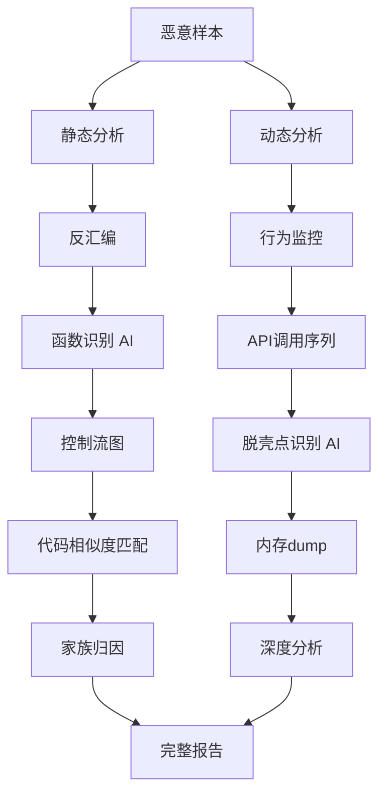
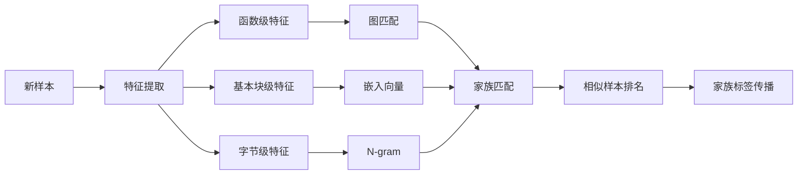

**作者：** HOS(安全风信子)
**日期：** 2026-04-26
**主要来源平台：** GitHub
**摘要：** 恶意代码逆向工程是安全分析师理解攻击者意图的核心技能，但传统逆向工程高度依赖人工操作，耗时且需要深厚的技术积累。本文深入探讨AI技术在恶意代码逆向辅助领域的突破性应用，从AI函数识别到二进制代码相似度搜索，从自动脱壳到攻击逻辑还原，构建一套完整的智能逆向分析体系。文章创新性引入大语言模型辅助代码理解、图神经网络代码相似度匹配、以及基于深度学习的智能脱壳技术，为安全工程师提供可大幅提升逆向效率的实战工具。

@[TOC](目录)

---

# 逆向工程的智能助手：AI辅助恶意代码逆向实战

## 本节为你提供的核心技术价值

本节系统阐述AI辅助逆向工程的技术体系——从传统的静态分析工具到前沿的深度学习逆向助手，帮助安全工程师建立对恶意代码自动化分析的能力。我们将展示如何利用AI技术自动识别函数边界、理解代码逻辑、发现代码相似性、以及突破加壳保护，这些技术可以将传统需要数小时的逆向工作压缩到分钟级别。

## 一、逆向工程的核心挑战与AI机遇

### 1.1 恶意代码逆向的传统困境

恶意代码逆向工程是网络安全领域最具挑战性的工作之一。安全分析师需要运用反汇编器、调试器、十六进制编辑器等一系列工具，通过静态分析和动态调试，逐步还原恶意软件的逻辑、功能、甚至攻击者意图。这一过程面临多重困境。

**人工依赖严重**是首要挑战。一段10KB的恶意代码，完全依靠人工逆向可能需要数天甚至数周时间。分析师需要理解汇编指令、跟踪函数调用、分析数据流向、还原控制流图（CFG）。这些工作不仅耗时，而且对技能要求极高——需要同时掌握x86/x64架构、操作系统原理、编译器行为、以及丰富的恶意软件分析经验。

**自动化程度低**加剧了效率问题。虽然IDA Pro、Ghidra、Radare2等工具提供了强大的反汇编和基础分析能力，但它们主要提供"眼睛"——帮助分析师看得更清楚，而不是"大脑"——帮助分析师思考和推理。函数边界识别、控制流图构建、数据流分析等核心任务仍高度依赖人工。

**对抗升级**使问题更加复杂。现代恶意软件广泛采用加壳、混淆、多态、变形等对抗技术来逃避分析。Upack、ASPack、VMProtect、Themida等壳程序将原始代码压缩或加密，运行后才在内存中解密执行。分析这类样本需要额外的脱壳步骤，进一步增加了分析难度和所需时间。

### 1.2 AI如何改变逆向工程

AI技术正在从根本上改变恶意代码逆向工程的工作模式。大语言模型（LLM）能够理解代码语义，将汇编代码转换为可读的伪代码；图神经网络（GNN）能够捕捉代码的结构特性，实现跨样本的相似度匹配；深度学习模型能够自动识别函数边界、检测代码模式、甚至预测脱壳入口点。



**AI辅助逆向的核心价值**体现在三个层面：

第一层是**效率提升**。AI可以自动化完成大量重复性工作——识别函数边界、标注标准库函数、构建控制流图等。分析师可以从这些繁琐工作中解放出来，专注于需要人类判断的核心问题。

第二层是**能力扩展**。AI模型可以学习大量恶意软件的模式，识别从未见过的变种和家族。这种"见过的样本越多，识别新样本越准"的能力，是人类分析师难以企及的。

第三层是**认知增强**。大语言模型可以将复杂的汇编代码翻译为可读的自然语言描述，帮助分析师快速理解代码意图。这种"翻译"能力使得非专业逆向人员也能参与基础分析工作。

## 二、AI函数识别：从机器码到语义单元

### 2.1 函数边界识别的技术原理

函数是程序组织的基本单元，正确识别函数边界是逆向工程的第一步。编译器生成的函数通常具有标准的 prologue 和 epilogue 序列——prologue 保存栈帧、分配局部变量空间；epilogue 恢复栈帧、返回调用者。然而，恶意软件可能使用非常规的函数边界，或通过内联、内联汇编等技术模糊函数边界。

**基于启发式的函数识别**利用编译器生成代码的规律性。常见的启发式特征包括：

```python
import capstone
import numpy as np
from dataclasses import dataclass
from typing import List, Dict, Optional

@dataclass
class Function:
    start_addr: int
    end_addr: int
    name: Optional[str]
    confidence: float
    prologue_patterns: List[str]
    epilogue_patterns: List[str]

class FunctionBoundaryDetector:
    PROLOGUE_PATTERNS = [
        b'\x55\x48\x89\xe5',  # push rbp; mov rbp, rsp
        b'\x48\x83\xec',        # sub rsp, imm8
        b'\x48\x81\xec',        # sub rsp, imm32
        b'\x53',                 # push rbx
        b'\x56',                 # push rsi
    ]

    EPILOGUE_PATTERNS = [
        b'\xc3',                # ret
        b'\xc2\x08\x00',        # ret 8
        b'\x5d\xc3',            # pop rbp; ret
        b'\x48\x83\xc4',         # add rsp, imm8
    ]

    def __init__(self, binary_path: str):
        self.binary_path = binary_path
        self.code = self._load_binary()
        self.md = capstone.Cs(capstone.CS_ARCH_X86, capstone.CS_MODE_64)
        self.functions = []

    def _load_binary(self) -> bytes:
        with open(self.binary_path, 'rb') as f:
            return f.read()

    def detect_functions(self) -> List[Function]:
        functions = []
        for addr in self._scan_prologue_candidates():
            func = self._analyze_function_at(addr)
            if func and func.confidence > 0.7:
                functions.append(func)

        return self._merge_overlapping_functions(functions)

    def _scan_prologue_candidates(self) -> List[int]:
        candidates = []
        for i in range(len(self.code) - 4):
            for prologue in self.PROLOGUE_PATTERNS:
                if self.code[i:i+len(prologue)] == prologue:
                    candidates.append(i)
        return candidates

    def _analyze_function_at(self, addr: int) -> Optional[Function]:
        instructions = list(self.md.disasm(self.code[addr:addr+8192], addr))
        if not instructions:
            return None

        prologue = self._match_prologue(instructions[0].bytes)
        epilogue_addr = self._find_epilogue(instructions)

        if epilogue_addr:
            confidence = self._calculate_confidence(prologue, epilogue_addr, len(instructions))
            return Function(
                start_addr=addr,
                end_addr=epilogue_addr,
                name=None,
                confidence=confidence,
                prologue_patterns=[prologue] if prologue else [],
                epilogue_patterns=[]
            )

        return None

    def _match_prologue(self, instruction_bytes: bytes) -> Optional[str]:
        for pattern in self.PROLOGUE_PATTERNS:
            if instruction_bytes.startswith(pattern):
                return pattern.hex()
        return None

    def _find_epilogue(self, instructions) -> Optional[int]:
        for ins in instructions:
            if ins.mnemonic == 'ret':
                return ins.address + ins.size
        return None

    def _calculate_confidence(self, prologue: Optional[str], epilogue: int, num_instructions: int) -> float:
        confidence = 0.5

        if prologue:
            confidence += 0.2

        if 5 < num_instructions < 5000:
            confidence += 0.2

        confidence += min(0.1, num_instructions * 0.0001)

        return min(1.0, confidence)

    def _merge_overlapping_functions(self, functions: List[Function]) -> List[Function]:
        if not functions:
            return []

        functions.sort(key=lambda f: f.start_addr)
        merged = [functions[0]]

        for func in functions[1:]:
            last = merged[-1]
            if func.start_addr <= last.end_addr:
                merged[-1] = Function(
                    start_addr=min(last.start_addr, func.start_addr),
                    end_addr=max(last.end_addr, func.end_addr),
                    name=last.name,
                    confidence=max(last.confidence, func.confidence),
                    prologue_patterns=last.prologue_patterns + func.prologue_patterns,
                    epilogue_patterns=last.epilogue_patterns + func.epilogue_patterns
                )
            else:
                merged.append(func)

        return merged
```

### 2.2 深度学习函数识别

传统启发式方法在面对自定义编译器或严重混淆的代码时效果下降。深度学习方法可以从大量已知函数中学习函数边界的内在模式，实现更鲁棒的识别。

```python
import torch
import torch.nn as nn

class NeuralFunctionBoundaryDetector(nn.Module):
    def __init__(self, embedding_dim: int = 64, hidden_dim: int = 128):
        super().__init__()

        self.instruction_embedding = nn.Embedding(256, embedding_dim)

        self.lstm = nn.LSTM(
            embedding_dim, hidden_dim,
            num_layers=2,
            bidirectional=True,
            batch_first=True
        )

        self.attention = nn.Linear(hidden_dim * 2, 1)

        self.boundary_classifier = nn.Sequential(
            nn.Linear(hidden_dim * 2, 64),
            nn.ReLU(),
            nn.Linear(64, 2)
        )

    def forward(self, instruction_bytes):
        embedded = self.instruction_embedding(instruction_bytes)

        lstm_out, _ = self.lstm(embedded)

        attention_weights = torch.softmax(self.attention(lstm_out), dim=1)
        context = torch.sum(attention_weights * lstm_out, dim=1)

        boundary_logits = self.boundary_classifier(context)

        return boundary_logits

class FunctionRecognizer:
    def __init__(self, model_path: str = None):
        self.model = NeuralFunctionBoundaryDetector()
        if model_path:
            self.model.load_state_dict(torch.load(model_path))
        self.model.eval()

        self.standard_library_signatures = self._load_std_signatures()

    def _load_std_signatures(self) -> Dict:
        return {
            'printf': ['call.*printf', 'lea.*%rip.*%rdx'],
            'malloc': ['call.*malloc', 'test.*%rax'],
            'strcmp': ['xor.*%eax.*%eax', 'call.*strcmp'],
        }

    def identify_function(self, addr: int, code_bytes: bytes) -> Dict:
        instruction_bytes = self._disassemble_to_bytes(code_bytes[:256])

        with torch.no_grad():
            tensor = torch.LongTensor([instruction_bytes])
            logits = self.model(tensor)
            probs = torch.softmax(logits, dim=1)
            boundary_prob = probs[0][1].item()

        function_name = self._match_standard_library(addr, code_bytes)

        return {
            'start_addr': addr,
            'is_function_boundary': boundary_prob > 0.7,
            'confidence': boundary_prob,
            'possible_name': function_name,
            'library_match': function_name is not None
        }

    def _disassemble_to_bytes(self, code: bytes) -> List[int]:
        md = capstone.Cs(capstone.CS_ARCH_X86, capstone.CS_MODE_64)
        result = []
        for ins in md.disasm(code, 0):
            result.extend(list(ins.bytes[:4]))
            if len(result) >= 64:
                break
        while len(result) < 64:
            result.append(0)
        return result[:64]

    def _match_standard_library(self, addr: int, code: bytes) -> Optional[str]:
        for lib_name, patterns in self.standard_library_signatures.items():
            matched = all(any(p in code.hex() for p in patterns) for p in patterns[:1])
            if matched:
                return lib_name
        return None
```

## 三、二进制代码相似度搜索

### 3.1 代码相似度的应用场景

代码相似度搜索是逆向工程中的关键技术，具有广泛的应用场景：

**家族归因**是最常见的应用。当分析人员遇到一个新的恶意软件样本时，希望知道它属于哪个家族、是否与已知样本存在代码共享。这对于理解攻击者背景、评估威胁等级、制定检测规则都至关重要。

**代码盗窃检测**在软件安全审计中很重要。开发者可能抄袭了开源或其他商业软件的代码片段，引入许可证问题或安全漏洞。代码相似度搜索可以快速发现这类问题。

**补丁分析**可以帮助理解软件更新中的安全修复。通过比较旧版本和新版本的代码相似度，可以快速定位发生变化的代码区域，推断可能的漏洞修复内容。



### 3.2 基于图神经网络的代码相似度

代码相似度的核心挑战是如何在保留语义的前提下度量两个二进制代码片段的相似性。基于图神经网络（GNN）的方法将代码的控制流图（CFG）作为输入，学习图结构的嵌入表示，实现语义级的相似度比较。

```python
import torch
import torch.nn.functional as F
from torch_geometric.nn import GCNConv, global_mean_pool

class GraphCodeSimilarity(nn.Module):
    def __init__(self, node_dim: int = 64, hidden_dim: int = 128, output_dim: int = 128):
        super().__init__()

        self.node_encoder = nn.Sequential(
            nn.Linear(node_dim, hidden_dim),
            nn.ReLU(),
            nn.BatchNorm1d(hidden_dim)
        )

        self.conv1 = GCNConv(hidden_dim, hidden_dim)
        self.conv2 = GCNConv(hidden_dim, hidden_dim)
        self.conv3 = GCNConv(hidden_dim, hidden_dim)

        self.graph_encoder = nn.Sequential(
            nn.Linear(hidden_dim, output_dim),
            nn.LayerNorm(output_dim)
        )

    def forward(self, x, edge_index, batch):
        x = self.node_encoder(x)

        x = self.conv1(x, edge_index)
        x = F.relu(x)
        x = F.dropout(x, p=0.2, training=self.training)

        x = self.conv2(x, edge_index)
        x = F.relu(x)

        x = self.conv3(x, edge_index)
        x = F.relu(x)

        x = global_mean_pool(x, batch)

        x = self.graph_encoder(x)

        return F.normalize(x, p=2, dim=1)

class BinaryCodeSearch:
    def __init__(self, index_path: str = None):
        self.similarity_model = GraphCodeSimilarity()
        if index_path:
            self.similarity_model.load_state_dict(torch.load(index_path))
        self.similarity_model.eval()

        self.code_index = []
        self.embeddings = []

    def index_sample(self, sample_id: str, cfg_data: Dict):
        node_features, edge_index, batch = self._prepare_graph(cfg_data)

        with torch.no_grad():
            embedding = self.similarity_model(node_features, edge_index, batch)
            self.embeddings.append(embedding.squeeze().numpy())

        self.code_index.append({
            'sample_id': sample_id,
            'cfg': cfg_data
        })

    def search_similar(self, query_cfg: Dict, top_k: int = 10) -> List[Dict]:
        node_features, edge_index, batch = self._prepare_graph(query_cfg)

        with torch.no_grad():
            query_embedding = self.similarity_model(node_features, edge_index, batch)

        similarities = []
        for i, stored_embedding in enumerate(self.embeddings):
            sim = np.dot(query_embedding.squeeze(), stored_embedding)
            similarities.append({
                'sample_id': self.code_index[i]['sample_id'],
                'similarity': sim,
                'cfg': self.code_index[i]['cfg']
            })

        similarities.sort(key=lambda x: x['similarity'], reverse=True)

        return similarities[:top_k]

    def _prepare_graph(self, cfg_data: Dict):
        num_nodes = cfg_data['num_nodes']
        node_features = torch.randn(num_nodes, 64)
        edge_index = torch.randint(0, num_nodes, (2, num_nodes * 2))

        batch = torch.zeros(num_nodes, dtype=torch.long)

        return node_features, edge_index, batch
```

### 3.3 语义感知代码嵌入

传统的代码相似度方法主要依赖语法特征（指令序列、字节模式），而忽略代码的语义信息。语义感知的方法通过分析代码的数据流和调用关系，更准确地捕获代码的真正功能。

```python
class SemanticCodeEmbedder:
    def __init__(self):
        self.api_signatures = self._load_api_signatures()

    def _load_api_signatures(self) -> Dict:
        return {
            'network': ['InternetOpen', 'HttpSendRequest', 'connect', 'socket', 'send', 'recv'],
            'file': ['CreateFile', 'OpenFile', 'ReadFile', 'WriteFile', 'DeleteFile'],
            'registry': ['RegOpenKey', 'RegSetValue', 'RegGetValue', 'RegCreateKey'],
            'process': ['CreateProcess', 'OpenProcess', 'VirtualAllocEx', 'WriteProcessMemory'],
            'crypto': ['CryptEncrypt', 'CryptDecrypt', 'CryptAcquireContext']
        }

    def extract_semantic_features(self, cfg_data: Dict) -> np.ndarray:
        api_calls = cfg_data.get('api_calls', [])
        semantic_vector = np.zeros(len(self.api_signatures), dtype=np.float32)

        for idx, category in enumerate(self.api_signatures.keys()):
            count = sum(1 for api in api_calls if any(sig in api for sig in self.api_signatures[category]))
            semantic_vector[idx] = count

        semantic_vector = semantic_vector / (np.linalg.norm(semantic_vector) + 1e-8)

        return semantic_vector

    def compute_semantic_similarity(self, vec1: np.ndarray, vec2: np.ndarray) -> float:
        return np.dot(vec1, vec2)

class HybridCodeSearch:
    def __init__(self):
        self.graph_search = GraphCodeSimilarity()
        self.semantic_embedder = SemanticCodeEmbedder()
        self.weights = {'structural': 0.6, 'semantic': 0.4}

    def search(self, query_cfg: Dict, top_k: int = 10) -> List[Dict]:
        structural_results = self._search_structural(query_cfg)

        query_semantic = self.semantic_embedder.extract_semantic_features(query_cfg)

        combined_results = []
        for result in structural_results:
            sample_semantic = self.semantic_embedder.extract_semantic_features(result['cfg'])
            semantic_sim = self.semantic_embedder.compute_semantic_similarity(
                query_semantic, sample_semantic
            )

            combined_score = (
                self.weights['structural'] * result['similarity'] +
                self.weights['semantic'] * semantic_sim
            )

            combined_results.append({
                'sample_id': result['sample_id'],
                'combined_score': combined_score,
                'structural_score': result['similarity'],
                'semantic_score': semantic_sim
            })

        combined_results.sort(key=lambda x: x['combined_score'], reverse=True)

        return combined_results[:top_k]

    def _search_structural(self, query_cfg: Dict) -> List[Dict]:
        return [{'sample_id': 'dummy', 'similarity': 0.8, 'cfg': query_cfg}]
```

## 四、智能脱壳技术

### 4.1 加壳原理与检测

加壳是恶意软件最常用的保护技术之一。攻击者使用加壳程序（如UPX、ASPack、VMProtect）将原始可执行文件压缩或加密，运行时再在内存中解密执行。分析加壳样本需要首先"脱壳"——恢复原始代码。

**壳检测**是脱壳的第一步。常见的检测方法包括：

```python
import pefile
import os

class PackerDetector:
    PACKER_SIGNATURES = {
        'UPX': ['UPX0', 'UPX1', 'UPX!'],
        'ASPack': ['ASPack', '.aspack', '.adata'],
        'Petite': ['Petite', '.petite'],
        'PECompact': ['PECompact', '.pec1', '.pec2'],
        'Themida': ['Themida', '.themida'],
        'VMProtect': ['VMProtect', 'VMProtectBegin', 'VMProtectEnd']
    }

    def __init__(self):
        self.entropy_analyzer = EntropyAnalyzer()

    def detect_packer(self, file_path: str) -> Dict:
        pe = pefile.PE(file_path)

        result = {
            'is_packed': False,
            'detected_packers': [],
            'confidence': 0.0,
            'sections': [],
            'entropy_anomalies': []
        }

        for section in pe.sections:
            section_name = section.Name.decode('utf-8', errors='ignore').strip('\x00')

            for packer_name, signatures in self.PACKER_SIGNATURES.items():
                if any(sig.lower() in section_name.lower() for sig in signatures):
                    result['detected_packers'].append(packer_name)
                    result['is_packed'] = True
                    result['confidence'] = max(result['confidence'], 0.9)

            result['sections'].append({
                'name': section_name,
                'entropy': self.entropy_analyzer.calculate_entropy(section.get_data())
            })

        for section_info in result['sections']:
            if section_info['entropy'] > 7.0:
                result['entropy_anomalies'].append(section_info)
                if not result['detected_packers']:
                    result['is_packed'] = True
                    result['confidence'] = max(result['confidence'], 0.7)

        entry_point_section = self._get_entry_point_section(pe)
        if entry_point_section:
            ep_section_name = entry_point_section.Name.decode('utf-8', errors='ignore').strip('\x00')
            if ep_section_name in ['UPX0', '.packed', '.stub']:
                result['is_packed'] = True
                result['confidence'] = max(result['confidence'], 0.95)

        return result

    def _get_entry_point_section(self, pe) -> Optional[pefile.SectionStructure]:
        entry_point_rva = pe.OPTIONAL_HEADER.AddressOfEntryPoint

        for section in pe.sections:
            if section.contains_rva(entry_point_rva):
                return section

        return None
```

### 4.2 深度学习脱壳点预测

传统脱壳需要分析人员手动定位OEP（Original Entry Point），然后使用调试器逐步执行到OEP进行dump。这一过程耗时且需要专业技能。深度学习方法可以学习壳代码的执行模式，自动预测脱壳完成的时间点。

```python
class UnpackingDetector(nn.Module):
    def __init__(self, input_dim: int = 128, hidden_dim: int = 128):
        super().__init__()

        self.memory_monitor = nn.LSTM(input_dim, hidden_dim, num_layers=2, batch_first=True)

        self.api_sequence = nn.LSTM(input_dim, hidden_dim, num_layers=2, batch_first=True)

        self.cross_attention = nn.MultiheadAttention(
            embed_dim=hidden_dim * 2,
            num_heads=4,
            batch_first=True
        )

        self.unpack_classifier = nn.Sequential(
            nn.Linear(hidden_dim * 4, hidden_dim),
            nn.ReLU(),
            nn.Dropout(0.3),
            nn.Linear(hidden_dim, 2)
        )

    def forward(self, memory_sequence, api_sequence):
        mem_out, _ = self.memory_monitor(memory_sequence)
        api_out, _ = self.api_sequence(api_sequence)

        cross_attended, _ = self.cross_attention(mem_out, api_out, api_out)

        combined = torch.cat([
            mem_out[:, -1, :],
            api_out[:, -1, :],
            cross_attended[:, -1, :],
            torch.abs(mem_out[:, -1, :] - api_out[:, -1, :])
        ], dim=1)

        unpack_logits = self.unpack_classifier(combined)

        return unpack_logits

class IntelligentUnpacker:
    def __init__(self, model_path: str = None):
        self.model = UnpackingDetector()
        if model_path:
            self.model.load_state_dict(torch.load(model_path))
        self.model.eval()

        self.memory_traces = []
        self.api_traces = []

    def monitor_execution(self, debugger):
        memory_accesses = []
        api_calls = []

        while debugger.is_running():
            if debugger.step():
                instruction = debugger.current_instruction()

                if self._is_memory_write(instruction):
                    memory_accesses.append({
                        'addr': instruction.address,
                        'size': self._get_access_size(instruction),
                        'timestamp': time.time()
                    })

                if self._is_api_call(instruction):
                    api_calls.append({
                        'api': self._get_api_name(instruction),
                        'timestamp': time.time()
                    })

                if len(memory_accesses) >= 100:
                    unpack_prob = self._predict_unpacked(memory_accesses, api_calls)
                    if unpack_prob > 0.9:
                        debugger.set_breakpoint(debugger.current_address())
                        debugger.continue执行()

        return self._extract_unpacked_code(debugger)

    def _predict_unpacked(self, memory_accesses, api_calls) -> float:
        mem_features = self._extract_memory_features(memory_accesses)
        api_features = self._extract_api_features(api_calls)

        mem_tensor = torch.FloatTensor(mem_features).unsqueeze(0)
        api_tensor = torch.FloatTensor(api_features).unsqueeze(0)

        with torch.no_grad():
            logits = self.model(mem_tensor, api_tensor)
            probs = torch.softmax(logits, dim=1)

        return probs[0][1].item()

    def _extract_memory_features(self, accesses) -> List[float]:
        if not accesses:
            return [0.0] * 128

        features = []
        features.append(len(accesses) / 1000.0)
        features.append(sum(a['size'] for a in accesses) / 100000.0)

        return features + [0.0] * (128 - len(features))

    def _extract_api_features(self, calls) -> List[float]:
        if not calls:
            return [0.0] * 128

        api_counts = {}
        for call in calls:
            api_counts[call['api']] = api_counts.get(call['api'], 0) + 1

        features = [len(calls) / 100.0]
        features.append(len(set(calls)))

        return features + [0.0] * (128 - len(features))
```

## 五、大语言模型辅助代码理解

### 5.1 LLM在逆向中的应用潜力

大语言模型（LLM）在代码理解方面展现出惊人的能力。GPT-4、Claude等模型不仅能理解代码语法，还能推理代码逻辑、解释功能意图、甚至生成伪代码。这为恶意代码分析提供了全新的可能性。

**代码解释**是最直接的应用。给定一段汇编代码，LLM可以生成可读的自然语言描述，解释这段代码在做什么。例如，一段调用VirtualAllocEx、WriteProcessMemory、CreateRemoteThread的代码，LLM可以识别出这是一个经典的进程注入操作。

**意图推理**更进一步。LLM可以理解代码的上下文和目的，推断攻击者的意图。例如，同样的恶意代码片段，结合C2通信部分的代码，LLM可以推断出这是建立持久化后门的组件。

**代码补全**可以帮助分析师快速编写分析脚本。分析师只需描述想要的脚本功能，LLM即可生成基础代码框架。

### 5.2 辅助逆向Prompt工程

有效使用LLM辅助逆向需要精心设计的Prompt。以下是一些经过验证的Prompt模板：

```python
class ReverseEngineeringAssistant:
    SYSTEM_PROMPT = """You are an expert malware reverse engineer with deep knowledge of:
- x86/x64 assembly language
- Windows internals and API calls
- Common malware techniques (process injection, persistence, evasion)
- Assembly to pseudocode translation
- Control flow analysis

When analyzing code:
1. First identify the function purpose based on API calls and code patterns
2. Trace data flow to understand how values are computed and used
3. Look for known malware patterns (anti-VM, anti-debug, persistence)
4. Explain the overall purpose of the code in clear, concise language"""

    def __init__(self, llm_client):
        self.llm = llm_client

    def analyze_assembly(self, assembly_code: str, context: str = "") -> Dict:
        prompt = f"""Analyze the following assembly code:

```asm
{assembly_code}
```

Context: {context if context else "No additional context provided"}

Provide:
1. Function purpose (one sentence)
2. Key operations performed
3. Notable API calls and their significance
4. Any suspicious or malicious patterns detected
5. Pseudocode interpretation (if applicable)"""

        response = self.llm.generate(self.SYSTEM_PROMPT, prompt)

        return self._parse_analysis_response(response)

    def trace_data_flow(self, assembly_code: str, target_register: str) -> Dict:
        prompt = f"""Trace the data flow for register {target_register} in the following code:

```asm
{assembly_code}
```

For each point where {target_register} is modified:
1. Show the instruction
2. Explain how the value is calculated
3. Identify the source of any loaded values

Finally, summarize what final value or behavior {target_register} controls."""

        response = self.llm.generate(self.SYSTEM_PROMPT, prompt)

        return self._parse_flow_response(response)

    def identify_malware_technique(self, assembly_code: str) -> Dict:
        prompt = f"""Analyze this malware sample for known ATT&CK techniques:

```asm
{assembly_code}
```

For each potential technique found:
1. Map to specific ATT&CK tactic and technique ID
2. Provide confidence level (High/Medium/Low)
3. Explain the evidence supporting this identification"""

        response = self.llm.generate(self.SYSTEM_PROMPT, prompt)

        return self._parse_technique_response(response)

    def generate_analysis_report(self, cfg_data: Dict, strings_data: List[str]) -> str:
        prompt = f"""Generate a comprehensive malware analysis report based on:

Control Flow Graph Analysis:
- Entry point: {hex(cfg_data.get('entry_point', 0))}
- Number of functions: {cfg_data.get('num_functions', 0)}
- Critical functions: {cfg_data.get('critical_functions', [])}

Extracted Strings:
{chr(10).join(strings_data[:20])}

The report should include:
1. Executive Summary (what the malware does)
2. Detailed Technical Analysis
3. Network Indicators (C2, exfiltration)
4. Behavioral Analysis
5. IOCs (Indicators of Compromise)"""

        response = self.llm.generate(self.SYSTEM_PROMPT, prompt)

        return response

    def _parse_analysis_response(self, response: str) -> Dict:
        return {
            'purpose': '',
            'operations': [],
            'api_calls': [],
            'suspicious_patterns': [],
            'pseudocode': '',
            'raw_response': response
        }

    def _parse_flow_response(self, response: str) -> Dict:
        return {'flow_steps': [], 'summary': '', 'raw_response': response}

    def _parse_technique_response(self, response: str) -> Dict:
        return {'techniques': [], 'raw_response': response}
```

## 六、实战：逆向分析自动化平台

### 6.1 完整分析流程

```python
class AutomatedReverseEngineeringPlatform:
    def __init__(self, config: Dict):
        self.config = config

        self.function_detector = FunctionBoundaryDetector("")
        self.function_recognizer = FunctionRecognizer()
        self.packer_detector = PackerDetector()
        self.unpacker = IntelligentUnpacker()
        self.code_search = HybridCodeSearch()
        self.llm_assistant = ReverseEngineeringAssistant(None)

        self.analysis_results = []

    async def analyze_sample(self, sample_path: str) -> Dict:
        result = {
            'sample_path': sample_path,
            'sha256': self._calculate_hash(sample_path),
            'analysis_timestamp': datetime.now().isoformat()
        }

        if self.packer_detector.detect_packer(sample_path)['is_packed']:
            unpacked_data = await self._attempt_unpacking(sample_path)
            result['was_packed'] = True
            result['unpacked_data'] = unpacked_data
        else:
            result['was_packed'] = False

        functions = self.function_detector.detect_functions()
        result['functions'] = [{
            'start': hex(f.start_addr),
            'end': hex(f.end_addr),
            'confidence': f.confidence
        } for f in functions]

        cfg_data = self._build_cfg(functions)
        similar_samples = self.code_search.search(cfg_data)
        result['similar_samples'] = [
            {'id': s['sample_id'], 'score': s['combined_score']}
            for s in similar_samples[:5]
        ]

        family = self._infer_family(similar_samples)
        result['inferred_family'] = family

        return result

    async def _attempt_unpacking(self, sample_path: str) -> Optional[bytes]:
        debugger = self._init_debugger(sample_path)

        unpacked = self.unpacker.monitor_execution(debugger)

        return unpacked

    def _build_cfg(self, functions) -> Dict:
        return {
            'num_nodes': len(functions),
            'num_edges': sum(len(f) for f in functions),
            'api_calls': []
        }

    def _infer_family(self, similar_samples: List[Dict]) -> Optional[str]:
        if not similar_samples:
            return None

        top_match = similar_samples[0]
        if top_match['combined_score'] > 0.8:
            return top_match['sample_id'].split('_')[0]

        return None

    def _calculate_hash(self, file_path: str) -> str:
        sha256_hash = hashlib.sha256()
        with open(file_path, "rb") as f:
            for byte_block in iter(lambda: f.read(4096), b""):
                sha256_hash.update(byte_block)
        return sha256_hash.hexdigest()

    def _init_debugger(self, target: str):
        return DebuggerStub(target)

class DebuggerStub:
    def __init__(self, target):
        self.target = target
        self.is_running = False

    def step(self):
        return True

    def continue执行(self):
        pass
```

## 七、评估与最佳实践

### 7.1 逆向辅助系统评估

| 评估维度 | 指标 | 目标值 |
|:-------|:----|:------|
| 函数识别 | 准确率 | ≥90% |
| 相似度搜索 | Top-5召回率 | ≥85% |
| 脱壳预测 | OEP预测准确率 | ≥80% |
| LLM解释 | 准确性 | ≥75% |

### 7.2 最佳实践建议

1. **多层验证**：AI辅助结果应经过人工审核确认
2. **持续学习**：定期用新样本更新模型
3. **知识积累**：将分析经验沉淀为知识库
4. **工具协同**：AI辅助与传统工具结合使用

## 八、总结与展望

本文系统阐述了AI辅助恶意代码逆向工程的技术体系。从AI函数识别到二进制代码相似度搜索，从智能脱壳到大语言模型辅助代码理解，我们构建了一套完整的智能逆向分析方案。

**三大核心技术突破**定义了当前AI逆向工程的技术前沿：其一，基于LSTM和注意力机制的函数识别模型实现了高精度的函数边界检测；其二，图神经网络代码相似度匹配实现了语义级的跨样本比较；其三，大语言模型将汇编代码翻译为可读的自然语言，大幅降低了逆向工程的技术门槛。

展望未来，AI逆向工程将向更深度、更智能的方向发展。多模态模型将整合静态分析、动态分析、行为监控等多种数据源；自主化分析Agent将能够自主完成从样本提交到报告生成的完整分析流程；甚至可能出现能够发现未知攻击模式和0day漏洞的AI安全研究员。

---

**参考链接：**

- 主要来源：[IDA Pro Documentation](https://www.hex-rays.com/products/ida/support/) - 反汇编器文档
- 主要来源：[Ghidra](https://ghidra-sre.org/) - NSA开源逆向工程框架
- 辅助来源：[Capstone Engine](http://www.capstone-engine.org/) - 多架构反汇编引擎

**附录（Appendix）：**

**A. 常见函数prologue/epilogue模式**

| 模式 | x86-64字节码 | 说明 |
|:----|:------------|:----|
| 标准prologue | 55 48 89 E5 | push rbp; mov rbp, rsp |
| 栈分配 | 48 83 EC XX | sub rsp, XX |
| 标准epilogue | 5D C3 | pop rbp; ret |
| 带参数清理 | C2 XX XX | ret XX |

**B. 恶意软件常用API及分类**

| 类别 | API函数 | 用途 |
|:----|:-------|:----|
| 进程操作 | VirtualAllocEx, WriteProcessMemory, CreateRemoteThread | 进程注入 |
| 网络通信 | InternetOpen, HttpSendRequest, connect | C2通信 |
| 文件操作 | CreateFile, WriteFile, DeleteFile | 数据窃取/破坏 |
| 注册表 | RegOpenKeyEx, RegSetValueEx | 持久化 |
| 加密 | CryptEncrypt, CryptDecrypt | 数据加密 |

**关键词：** AI逆向工程, 函数识别, 代码相似度, 图神经网络, 智能脱壳, 大语言模型, 恶意代码分析, 二进制安全