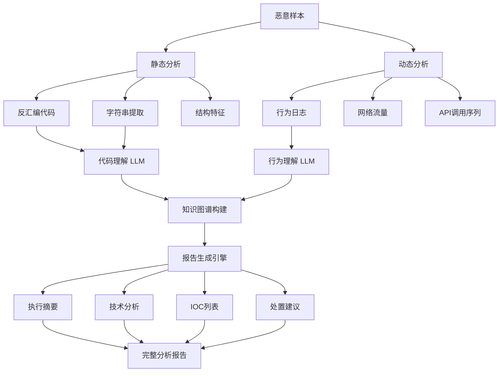

**作者：** HOS(安全风信子)
**日期：** 2026-04-26
**主要来源平台：** GitHub
**摘要：** 恶意代码分析报告是安全团队共享发现、沉淀知识的关键载体，但传统人工撰写报告耗时耗力且质量参差不齐。本文深入探讨AI技术在恶意代码解释与报告生成领域的突破性应用，从代码理解到知识图谱构建，从多层次报告生成到攻击逻辑还原，构建一套完整的智能报告生成体系。文章创新性引入大语言模型与知识图谱融合架构，实现从二进制代码到专业报告的端到端自动化生成，为安全分析师提供可大幅提升工作效率的实战工具。

@[TOC](目录)

---

# 让病毒分析报告秒懂：AI自动生成恶意代码解释

## 本节为你提供的核心技术价值

本节系统阐述AI恶意代码解释与报告生成的技术体系——从代码语义理解到知识图谱构建，从结构化报告生成到专业术语通俗化，帮助安全工程师建立自动化报告生成能力。我们将展示如何利用大语言模型、知识图谱和多层次解释技术，将复杂的二进制代码转化为任何人都能理解的专业报告。

## 一、恶意代码报告的挑战与AI机遇

### 1.1 传统报告撰写困境

恶意代码分析报告是安全运营的核心交付物之一。一份高质量的分析报告不仅需要准确的技术发现，还需要清晰的逻辑组织、可读的表达方式、以及可操作的建议。然而，传统人工撰写报告面临多重挑战。

**耗时巨大**是首要痛点。一份详细的中等复杂度恶意软件分析报告，人工撰写可能需要4-8小时。这包括代码逆向、行为观察、报告撰写、审核校对等多个环节。对于需要处理大量样本的安全团队，报告撰写成为效率瓶颈。

**质量不一致**是另一挑战。不同分析师的经验水平、写作风格、关注重点存在差异，导致团队内部的报告质量参差不齐。有的报告详尽专业，有的报告简略粗糙，难以建立统一的知识沉淀标准。

**知识流失**问题同样严重。资深分析师的经验和洞察往往只存在于个人头脑中，一旦人员离职，其积累的分析能力和领域知识随之流失。无法将这些隐性知识转化为可复用的显性资产。

### 1.2 AI如何重塑报告生成

大语言模型（LLM）和知识图谱技术的突破，使得从代码到报告的自动化生成成为可能。



**代码理解**是大语言模型的核心能力。GPT-4、Claude等模型不仅能理解代码语法，还能推理代码逻辑、解释功能意图。将一段汇编代码或伪代码输入LLM，可以获得清晰的功能描述、攻击技术分析、甚至防御建议。

**知识图谱**提供结构化的领域知识表示。将恶意软件分析过程中发现的实体（API、文件、域名、注册表键）和关系（调用、创建、连接）组织为图结构，可以支持复杂的查询和推理，生成具有深度的技术分析。

**多层次生成**满足不同受众需求。同一份分析数据，可以生成面向技术分析师的详细技术报告、面向管理层的执行摘要、甚至面向非技术人员的通俗解释。AI系统可以根据受众自动调整语言风格和内容深度。

## 二、代码理解：让机器读懂恶意代码

### 2.1 语义级代码解释

代码解释是报告生成的基础。大语言模型可以将复杂的汇编代码转换为可读的自然语言描述。

```python
import anthropic

class CodeUnderstandingEngine:
    SYSTEM_PROMPT = """You are an expert malware reverse engineer with deep knowledge of:
- x86/x64 assembly language and calling conventions
- Windows API internals and behavior
- Common malware techniques (process injection, persistence, evasion, C2)
- MITRE ATT&CK framework
- Control flow analysis and data flow analysis

When analyzing code:
1. First identify the function purpose by examining API calls and code patterns
2. Trace how data is loaded, processed, and stored
3. Look for known malware patterns and techniques
4. Explain what the code does in clear, concise English
5. Use appropriate technical terminology but avoid unnecessary jargon"""

    def __init__(self, api_key: str):
        self.client = anthropic.Anthropic(api_key=api_key)

    def explain_function(self, assembly_code: str, function_addr: int = None) -> Dict:
        context = f"Function at address: {hex(function_addr)}" if function_addr else "Unknown function"

        prompt = f"""Analyze the following assembly function:

```asm
{assembly_code}
```

Address: {context}

Provide a structured analysis including:
1. **Function Purpose**: What does this function do? (1-2 sentences)
2. **Key Operations**: Step-by-step breakdown of main operations
3. **API Interactions**: List of API calls and their purpose
4. **Data Flow**: How does data flow through this function?
5. **Suspicious Indicators**: Any signs of malicious behavior?
6. **Technical Details**: Relevant technical observations"""

        response = self.client.messages.create(
            model="claude-opus-4-20251114",
            max_tokens=2048,
            messages=[
                {"role": "user", "content": prompt}
            ]
        )

        return self._parse_explanation(response.content[0].text)

    def explain_technique(self, code_snippet: str) -> Dict:
        prompt = f"""Identify and explain the malware technique used in this code:

```asm
{code_snippet}
```

For the identified technique:
1. Map it to MITRE ATT&CK (tactic, technique, sub-technique if applicable)
2. Explain how this technique works technically
3. Describe why attackers use this technique
4. Suggest detection methods
5. Recommend mitigation strategies"""

        response = self.client.messages.create(
            model="claude-opus-4-20251114",
            max_tokens=2048,
            messages=[
                {"role": "user", "content": prompt}
            ]
        )

        return self._parse_technique(response.content[0].text)

    def _parse_explanation(self, text: str) -> Dict:
        sections = {}
        current_section = None
        current_content = []

        for line in text.split('\n'):
            if line.startswith('**') and line.endswith('**'):
                if current_section:
                    sections[current_section] = '\n'.join(current_content)
                current_section = line.strip('* ')
                current_content = []
            elif current_section:
                current_content.append(line)

        if current_section:
            sections[current_section] = '\n'.join(current_content)

        return {
            'purpose': sections.get('Function Purpose', ''),
            'operations': sections.get('Key Operations', ''),
            'api_calls': sections.get('API Interactions', ''),
            'data_flow': sections.get('Data Flow', ''),
            'suspicious': sections.get('Suspicious Indicators', ''),
            'technical': sections.get('Technical Details', ''),
            'raw': text
        }

    def _parse_technique(self, text: str) -> Dict:
        return {
            'att&ck_mapping': '',
            'how_it_works': '',
            'why_attackers_use': '',
            'detection': '',
            'mitigation': '',
            'raw': text
        }
```

### 2.2 行为序列分析

恶意软件的行为序列是理解其功能的关键。通过分析API调用序列、文件操作序列、网络活动序列，可以还原攻击者的完整攻击逻辑。

```python
from collections import defaultdict, deque
import numpy as np

class BehaviorSequenceAnalyzer:
    def __init__(self):
        self.behavior_patterns = self._load_attack_patterns()

    def _load_attack_patterns(self) -> Dict:
        return {
            'process_injection': [
                'VirtualAllocEx', 'WriteProcessMemory', 'CreateRemoteThread'
            ],
            'process_hollowing': [
                'CreateProcess', 'NtUnmapViewOfSection', 'VirtualAllocEx',
                'WriteProcessMemory', 'SetThreadContext', 'ResumeThread'
            ],
            'classic_evi': [
                'RegOpenKeyEx', 'RegSetValueEx', 'RegCloseKey'
            ],
            'service_creation': [
                'OpenSCManager', 'CreateService', 'StartService', 'CloseServiceHandle'
            ],
            'file_encryption': [
                'CreateFile', 'GetFileSize', 'CryptEncrypt', 'WriteFile'
            ],
            'credential_dumping': [
                'OpenProcess', 'MiniDumpWriteDump', 'CreateFile', 'WriteFile'
            ]
        }

    def analyze_api_sequence(self, api_calls: List[Dict]) -> Dict:
        api_names = [call['api_name'] for call in api_calls]

        matched_patterns = []
        for pattern_name, pattern_seq in self.behavior_patterns.items():
            match_result = self._find_pattern_sequence(api_names, pattern_seq)
            if match_result:
                matched_patterns.append({
                    'pattern': pattern_name,
                    'confidence': match_result['confidence'],
                    'matched_indices': match_result['indices']
                })

        timeline = self._build_behavior_timeline(api_calls)

        anomalies = self._detect_anomalies(api_calls)

        return {
            'matched_patterns': matched_patterns,
            'timeline': timeline,
            'anomalies': anomalies,
            'attack_phase': self._infer_attack_phase(matched_patterns)
        }

    def _find_pattern_sequence(self, api_sequence: List[str], pattern: List[str]) -> Optional[Dict]:
        if len(pattern) > len(api_sequence):
            return None

        pattern_idx = 0
        matched_indices = []

        for i, api in enumerate(api_sequence):
            if pattern_idx < len(pattern) and pattern[pattern_idx] in api:
                matched_indices.append(i)
                pattern_idx += 1

        if pattern_idx == len(pattern):
            confidence = len(pattern) / len(matched_indices)
            return {'confidence': confidence, 'indices': matched_indices}

        return None

    def _build_behavior_timeline(self, api_calls: List[Dict]) -> List[Dict]:
        timeline = []

        for call in api_calls:
            timeline.append({
                'timestamp': call.get('timestamp'),
                'api': call['api_name'],
                'category': self._categorize_api(call['api_name']),
                'details': self._extract_call_details(call)
            })

        return timeline

    def _categorize_api(self, api_name: str) -> str:
        categories = {
            'process': ['CreateProcess', 'OpenProcess', 'VirtualAllocEx', 'WriteProcessMemory'],
            'file': ['CreateFile', 'ReadFile', 'WriteFile', 'DeleteFile'],
            'registry': ['RegOpenKeyEx', 'RegSetValueEx', 'RegDeleteKeyEx'],
            'network': ['InternetOpen', 'HttpSendRequest', 'connect', 'send'],
            'crypto': ['CryptEncrypt', 'CryptDecrypt', 'CryptAcquireContext'],
            'memory': ['VirtualAlloc', 'VirtualProtect', 'memcpy']
        }

        for category, apis in categories.items():
            if any(api in api_name for api in apis):
                return category

        return 'other'

    def _extract_call_details(self, call: Dict) -> str:
        args = call.get('arguments', {})
        if 'lpApplicationName' in args:
            return f"Target: {args['lpApplicationName']}"
        if 'dwFlags' in args:
            return f"Flags: {hex(args['dwFlags'])}"
        return ""

    def _detect_anomalies(self, api_calls: List[Dict]) -> List[Dict]:
        anomalies = []

        suspicious_apis = [call for call in api_calls
                         if any(s in call['api_name'] for s in ['Debug', 'OpenProcess', 'CreateRemoteThread'])]

        if len(suspicious_apis) > 5:
            anomalies.append({
                'type': 'high_suspicious_api_count',
                'severity': 'medium',
                'description': f'Found {len(suspicious_apis)} suspicious API calls'
            })

        rapid_calls = self._detect_rapid_calls(api_calls)
        if rapid_calls:
            anomalies.append(rapid_calls)

        return anomalies

    def _detect_rapid_calls(self, api_calls: List[Dict]) -> Optional[Dict]:
        timestamps = [call['timestamp'] for call in api_calls if 'timestamp' in call]
        if len(timestamps) < 2:
            return None

        time_diffs = [timestamps[i+1] - timestamps[i] for i in range(len(timestamps)-1)]
        avg_diff = np.mean(time_diffs)

        if avg_diff < 0.001:
            return {
                'type': 'rapid_api_sequence',
                'severity': 'high',
                'description': f'APIs called extremely rapidly (avg {avg_diff*1000:.2f}ms apart)'
            }

        return None

    def _infer_attack_phase(self, patterns: List[Dict]) -> str:
        phase_mapping = {
            'process_injection': 'Persistence/Privilege Escalation',
            'process_hollowing': 'Defense Evasion/Privilege Escalation',
            'classic_evi': 'Persistence',
            'service_creation': 'Persistence',
            'file_encryption': 'Impact (Encryption)',
            'credential_dumping': 'Credential Access'
        }

        if not patterns:
            return 'Unknown'

        top_pattern = max(patterns, key=lambda x: x['confidence'])
        return phase_mapping.get(top_pattern['pattern'], 'Execution')
```

## 三、知识图谱：构建恶意软件知识网络

### 3.1 知识图谱设计

知识图谱以图结构组织实体和关系，支持复杂的查询和推理。在恶意软件分析领域，知识图谱可以整合代码结构、行为特征、IOC、ATT&CK映射等多维度信息。

```python
from typing import Dict, List, Set, Optional
from dataclasses import dataclass, field

@dataclass
class MalwareEntity:
    entity_type: str
    identifier: str
    properties: Dict = field(default_factory=dict)

@dataclass
class MalwareRelation:
    source: str
    relation_type: str
    target: str
    properties: Dict = field(default_factory=dict)

class MalwareKnowledgeGraph:
    def __init__(self):
        self.entities: Dict[str, MalwareEntity] = {}
        self.relations: List[MalwareRelation] = []
        self.entity_index: Dict[str, Set[str]] = defaultdict(set)

    def add_entity(self, entity: MalwareEntity):
        self.entities[entity.identifier] = entity
        self.entity_index[entity.entity_type].add(entity.identifier)

    def add_relation(self, relation: MalwareRelation):
        self.relations.append(relation)

    def query_by_type(self, entity_type: str) -> List[MalwareEntity]:
        identifiers = self.entity_index.get(entity_type, set())
        return [self.entities[eid] for eid in identifiers]

    def query_relations(self, source: str = None, rel_type: str = None, target: str = None) -> List[MalwareRelation]:
        results = []
        for rel in self.relations:
            if source and rel.source != source:
                continue
            if rel_type and rel.relation_type != rel_type:
                continue
            if target and rel.target != target:
                continue
            results.append(rel)
        return results

    def find_iocs(self) -> Dict[str, List[str]]:
        return {
            'ip_addresses': [e.identifier for e in self.query_by_type('ip_address')],
            'domains': [e.identifier for e in self.query_by_type('domain')],
            'file_hashes': [e.identifier for e in self.query_by_type('file_hash')],
            'registry_keys': [e.identifier for e in self.query_by_type('registry_key')],
            'mutexes': [e.identifier for e in self.query_by_type('mutex')]
        }

    def infer_attack_patterns(self) -> List[Dict]:
        patterns = []

        file_ops = {r.target for r in self.query_relations(rel_type='creates')}
        crypto_usage = self.query_by_type('api_call')

        if len(file_ops) > 10 and any('Crypt' in e.identifier for e in crypto_usage):
            patterns.append({
                'pattern': 'Potential Ransomware',
                'confidence': 0.85,
                'evidence': f'Encrypts {len(file_ops)} files with crypto APIs'
            })

        injection_apis = ['VirtualAllocEx', 'WriteProcessMemory', 'CreateRemoteThread']
        if all(any(api in e.identifier for e in self.query_by_type('api_call')) for api in injection_apis):
            patterns.append({
                'pattern': 'Process Injection',
                'confidence': 0.92,
                'evidence': 'Complete injection API sequence detected'
            })

        return patterns

    def generate_graph_export(self) -> Dict:
        return {
            'entities': [
                {
                    'id': e.identifier,
                    'type': e.entity_type,
                    'properties': e.properties
                }
                for e in self.entities.values()
            ],
            'relations': [
                {
                    'source': r.source,
                    'type': r.relation_type,
                    'target': r.target
                }
                for r in self.relations
            ]
        }
```

### 3.2 从分析结果构建知识图谱

```python
class AnalysisToGraphConverter:
    def __init__(self):
        self.graph = MalwareKnowledgeGraph()

    def convert_analysis_results(self, analysis: Dict, sample_id: str) -> MalwareKnowledgeGraph:
        sample_entity = MalwareEntity(
            entity_type='malware_sample',
            identifier=sample_id,
            properties={
                'sha256': analysis.get('sha256'),
                'file_size': analysis.get('file_size'),
                'packer': analysis.get('packer'),
                'family': analysis.get('family')
            }
        )
        self.graph.add_entity(sample_entity)

        for func in analysis.get('functions', []):
            func_entity = MalwareEntity(
                entity_type='function',
                identifier=f"{sample_id}:{func['addr']}",
                properties={
                    'addr': func['addr'],
                    'purpose': func.get('purpose', 'Unknown')
                }
            )
            self.graph.add_entity(func_entity)

            self.graph.add_relation(MalwareRelation(
                source=sample_id,
                relation_type='contains',
                target=func_entity.identifier
            ))

        for api_call in analysis.get('api_calls', []):
            api_entity = MalwareEntity(
                entity_type='api_call',
                identifier=f"api:{api_call['name']}",
                properties={'category': api_call.get('category')}
            )
            self.graph.add_entity(api_entity)

            self.graph.add_relation(MalwareRelation(
                source=f"{sample_id}:{api_call.get('function_addr')}",
                relation_type='calls',
                target=api_entity.identifier
            ))

        for ioc_type, ioc_values in analysis.get('iocs', {}).items():
            for value in ioc_values:
                ioc_entity = MalwareEntity(
                    entity_type=ioc_type,
                    identifier=value,
                    properties={'source': 'analysis'}
                )
                self.graph.add_entity(ioc_entity)

                self.graph.add_relation(MalwareRelation(
                    source=sample_id,
                    relation_type='contains_ioc',
                    target=value
                ))

        return self.graph
```

## 四、多层次报告生成

### 4.1 报告层次设计

不同受众需要不同深度的报告内容。面向CISO的报告需要战略视角和业务影响；面向安全工程师的报告需要技术细节和处置建议；面向自动化的报告需要结构化数据和可机读格式。

```python
class MultiLayerReportGenerator:
    def __init__(self, llm_client):
        self.llm = llm_client

    def generate_executive_summary(self, analysis: Dict, graph: MalwareKnowledgeGraph) -> str:
        patterns = graph.infer_attack_patterns()
        iocs = graph.find_iocs()

        prompt = f"""Generate an executive summary for the following malware analysis:

Malware: {analysis.get('sample_name', 'Unknown')}
Family: {analysis.get('family', 'Unknown')}
SHA256: {analysis.get('sha256', 'Unknown')}

Key Findings:
- Attack Patterns: {', '.join([p['pattern'] for p in patterns])}
- Confidence Level: {max([p['confidence'] for p in patterns], default=0):.0%}
- File Types Affected: {analysis.get('affected_file_types', [])}
- Network Indicators: {len(iocs.get('domains', []))} domains, {len(iocs.get('ip_addresses', []))} IPs

Business Impact:
- Data Breach Risk: {'High' if 'credential_dumping' in str(patterns) else 'Medium'}
- Operational Impact: {'High' if 'file_encryption' in str(patterns) else 'Medium'}
- Recovery Effort: {analysis.get('recovery_effort', 'Unknown')}

Provide a 3-paragraph executive summary:
1. What happened (succinct technical overview)
2. Business impact and risk
3. Recommended immediate actions"""

        response = self.llm.generate(prompt)
        return response

    def generate_technical_report(self, analysis: Dict, graph: MalwareKnowledgeGraph) -> str:
        prompt = f"""Generate a detailed technical report for security engineers:

Sample: {analysis.get('sample_name')}
SHA256: {analysis.get('sha256')}

Static Analysis:
- Packer: {analysis.get('packer', 'None detected')}
- Entry Point: {analysis.get('entry_point')}
- Sections: {analysis.get('sections')}

Functions ({len(analysis.get('functions', []))} total):
{chr(10).join([f"- {f['addr']}: {f.get('purpose', 'Unknown')}" for f in analysis.get('functions', [])[:10]])}

Behavioral Analysis:
{chr(10).join([f"- {b}" for b in analysis.get('behaviors', [])])}

Network IOCs:
- Domains: {', '.join(graph.find_iocs().get('domains', []))}
- IPs: {', '.join(graph.find_iocs().get('ip_addresses', []))}

ATT&CK Mapping:
{chr(10).join([f"- {m['tactic']}: {m['technique']}" for m in analysis.get('att&ck_mapping', [])])}

Provide:
1. Detailed analysis of each major function
2. Complete behavior description
3. Technical indicators (IOCs)
4. ATT&CK technique mappings with explanations
5. Detection rules (YARA, Sigma)
6. Remediation steps"""

        response = self.llm.generate(prompt)
        return response

    def generate_machine_readable(self, analysis: Dict, graph: MalwareKnowledgeGraph) -> Dict:
        patterns = graph.infer_attack_patterns()

        return {
            'metadata': {
                'generated_at': datetime.now().isoformat(),
                'generator': 'AI Malware Analysis System v1.0',
                'schema_version': '1.0'
            },
            'sample': {
                'sha256': analysis.get('sha256'),
                'md5': analysis.get('md5'),
                'sha1': analysis.get('sha1'),
                'file_size': analysis.get('file_size'),
                'file_type': analysis.get('file_type'),
                'family': analysis.get('family'),
                'confidence': max([p['confidence'] for p in patterns], default=0)
            },
            'classification': {
                'threat_type': analysis.get('threat_type', 'Unknown'),
                'attack_patterns': [
                    {
                        'pattern': p['pattern'],
                        'confidence': p['confidence'],
                        'evidence': p.get('evidence', '')
                    }
                    for p in patterns
                ],
                'att&ck_tactics': list(set([
                    m['tactic'] for m in analysis.get('att&ck_mapping', [])
                ])),
                'att&ck_techniques': [
                    {
                        'id': m['technique_id'],
                        'name': m['technique'],
                        'tactic': m['tactic']
                    }
                    for m in analysis.get('att&ck_mapping', [])
                ]
            },
            'iocs': {
                'ipv4': graph.find_iocs().get('ip_addresses', []),
                'domains': graph.find_iocs().get('domains', []),
                'file_hashes': graph.find_iocs().get('file_hashes', []),
                'registry_keys': graph.find_iocs().get('registry_keys', []),
                'mutexes': graph.find_iocs().get('mutexes', [])
            },
            'detection': {
                'yara_rules': analysis.get('yara_rules', []),
                'sigma_rules': analysis.get('sigma_rules', []),
                'suricata_rules': analysis.get('suricata_rules', [])
            },
            'remediation': {
                'immediate': analysis.get('immediate_actions', []),
                'short_term': analysis.get('short_term_actions', []),
                'long_term': analysis.get('long_term_actions', [])
            }
        }
```

### 4.2 通俗化解释生成

对于非技术背景的人员，需要将技术发现转化为易懂的语言。

```python
class PlainLanguageExplainer:
    def __init__(self, llm_client):
        self.llm = llm_client

    def explain_to_non_technical(self, analysis: Dict) -> str:
        family = analysis.get('family', 'Unknown')
        threat_type = analysis.get('threat_type', 'Malware')

        prompt = f"""Explain this malware analysis in simple, non-technical language for a business executive:

What is {family}?
{family} is a type of {threat_type} malware. In simple terms, it's a program that was designed to cause harm to computers and steal information.

What does it do?
{self._generate_simple_description(analysis)}

How did it get in?
{self._explain_initial_access(analysis)}

What did it do after getting in?
{self._explain_impact(analysis)}

What should we do now?
{self._generate_action_items(analysis)}

Keep explanations to 2-3 sentences each. Use analogies where helpful. Avoid technical jargon unless absolutely necessary."""

        response = self.llm.generate(prompt)
        return response

    def _generate_simple_description(self, analysis: Dict) -> str:
        descriptions = {
            'ransomware': 'This malware encrypts your files, making them inaccessible. The attackers then demand payment (ransom) to unlock them.',
            'trojan': 'This malware disguises itself as legitimate software but contains hidden malicious code that gives attackers control over your system.',
            'spyware': 'This malware secretly monitors your activities, collecting passwords, documents, and other sensitive information.',
            'botnet': 'This malware turns your computer into a "zombie" that can be controlled remotely to attack others or send spam.'
        }

        threat_type = analysis.get('threat_type', 'Unknown').lower()
        return descriptions.get(threat_type, 'This is a type of malware designed to harm your systems or steal information.')

    def _explain_initial_access(self, analysis: Dict) -> str:
        access_vector = analysis.get('initial_access', 'Unknown method')

        vectors = {
            'phishing': 'through a deceptive email that tricked an employee into clicking a malicious link or attachment',
            'vulnerability_exploit': 'by exploiting a security weakness in software that wasn\'t properly updated',
            'drive_by_download': 'when an employee visited a compromised website that automatically downloaded the malware',
            'supply_chain': 'through software that was compromised before it was even installed'
        }

        return vectors.get(access_vector.lower(), f'through an {access_vector} method')

    def _explain_impact(self, analysis: Dict) -> str:
        impacts = []

        if analysis.get('exfiltrated_data'):
            impacts.append(f'- Stolen {", ".join(analysis.get("exfiltrated_data", []))}')

        if analysis.get('encrypted_files'):
            impacts.append(f'- Encrypted files on {len(analysis.get("encrypted_files", []))} systems')

        if analysis.get('lateral_movement'):
            impacts.append('- Attempted to spread to other computers in the network')

        if not impacts:
            return '- Attempted to establish hidden access for future attacks'

        return '\n'.join(impacts)

    def _generate_action_items(self, analysis: Dict) -> str:
        return """
1. Immediate: Isolate affected systems from the network
2. Within 24 hours: Change all passwords that may have been exposed
3. Within a week: Conduct a full security review and update incident response plans
4. Ongoing: Monitor for any follow-up attacks or repeat infections
"""
```

## 五、自动化报告生成实战

### 5.1 完整报告生成流程

```python
class AutomatedReportGenerator:
    def __init__(self, config: Dict):
        self.config = config
        self.llm_client = self._init_llm_client(config.get('llm_api_key'))
        self.code_understanding = CodeUnderstandingEngine(config.get('llm_api_key'))
        self.behavior_analyzer = BehaviorSequenceAnalyzer()
        self.graph_converter = AnalysisToGraphConverter()
        self.report_generator = MultiLayerReportGenerator(self.llm_client)
        self.explainer = PlainLanguageExplainer(self.llm_client)

    def _init_llm_client(self, api_key: str):
        import anthropic
        return anthropic.Anthropic(api_key=api_key)

    async def generate_complete_report(self, sample_path: str, analysis_results: Dict) -> Dict:
        reports = {}

        graph = self.graph_converter.convert_analysis_results(analysis_results, sample_path)

        reports['executive_summary'] = self.report_generator.generate_executive_summary(
            analysis_results, graph
        )

        reports['technical_report'] = self.report_generator.generate_technical_report(
            analysis_results, graph
        )

        reports['machine_readable'] = self.report_generator.generate_machine_readable(
            analysis_results, graph
        )

        reports['plain_language'] = self.explainer.explain_to_non_technical(analysis_results)

        detailed_functions = []
        for func in analysis_results.get('functions', []):
            explanation = self.code_understanding.explain_function(
                func.get('assembly'),
                func.get('addr')
            )
            detailed_functions.append({
                'addr': func['addr'],
                'explanation': explanation
            })

        reports['detailed_functions'] = detailed_functions

        patterns = graph.infer_attack_patterns()
        reports['attack_patterns'] = patterns

        return reports

    def export_to_format(self, reports: Dict, format: str) -> str:
        if format == 'markdown':
            return self._to_markdown(reports)
        elif format == 'html':
            return self._to_html(reports)
        elif format == 'json':
            return json.dumps(reports['machine_readable'], indent=2)
        elif format == 'pdf':
            return self._to_pdf(reports)
        else:
            raise ValueError(f"Unsupported format: {format}")

    def _to_markdown(self, reports: Dict) -> str:
        md = []
        md.append(f"# Malware Analysis Report")
        md.append(f"Generated: {datetime.now().isoformat()}")
        md.append("")

        md.append("## Executive Summary")
        md.append(reports['executive_summary'])
        md.append("")

        md.append("## Technical Analysis")
        md.append(reports['technical_report'])
        md.append("")

        md.append("## Attack Patterns")
        for pattern in reports['attack_patterns']:
            md.append(f"- **{pattern['pattern']}**: Confidence {pattern['confidence']:.0%}")
            md.append(f"  - Evidence: {pattern.get('evidence', 'N/A')}")
        md.append("")

        md.append("## IOCs (Indicators of Compromise)")
        iocs = reports['machine_readable']['iocs']
        for ioc_type, values in iocs.items():
            if values:
                md.append(f"### {ioc_type.replace('_', ' ').title()}")
                for value in values:
                    md.append(f"- `{value}`")
        md.append("")

        md.append("## Recommended Actions")
        md.append(reports['machine_readable']['remediation']['immediate'][0])
        md.append("")

        return '\n'.join(md)

    def _to_html(self, reports: Dict) -> str:
        markdown = self._to_markdown(reports)
        return f"<html><body><pre>{markdown}</pre></body></html>"

    def _to_pdf(self, reports: Dict) -> bytes:
        markdown = self._to_markdown(reports)
        print(f"PDF generation not implemented, returning markdown")
        return markdown.encode()
```

### 5.2 报告质量评估

```python
class ReportQualityEvaluator:
    def __init__(self):
        self.evaluation_criteria = {
            'accuracy': 0.3,
            'completeness': 0.25,
            'clarity': 0.2,
            'actionability': 0.15,
            'consistency': 0.1
        }

    def evaluate_report(self, report: Dict, ground_truth: Dict = None) -> Dict:
        scores = {}

        scores['accuracy'] = self._evaluate_accuracy(report, ground_truth)

        scores['completeness'] = self._evaluate_completeness(report)

        scores['clarity'] = self._evaluate_clarity(report)

        scores['actionability'] = self._evaluate_actionability(report)

        scores['consistency'] = self._evaluate_consistency(report)

        overall_score = sum(
            scores[k] * self.evaluation_criteria[k]
            for k in scores.keys()
        )

        return {
            'overall_score': overall_score,
            'dimension_scores': scores,
            'strengths': self._identify_strengths(scores),
            'weaknesses': self._identify_weaknesses(scores),
            'recommendations': self._generate_recommendations(scores)
        }

    def _evaluate_accuracy(self, report: Dict, ground_truth: Dict) -> float:
        if not ground_truth:
            return 0.7

        ioc_overlap = len(set(report.get('iocs', [])) & set(ground_truth.get('iocs', [])))
        ioc_total = len(set(report.get('iocs', [])) | set(ground_truth.get('iocs', [])))

        return ioc_overlap / ioc_total if ioc_total > 0 else 0.5

    def _evaluate_completeness(self, report: Dict) -> float:
        required_sections = [
            'executive_summary',
            'technical_report',
            'iocs',
            'detection_rules',
            'remediation'
        ]

        present = sum(1 for s in required_sections if report.get(s))
        return present / len(required_sections)

    def _evaluate_clarity(self, report: Dict) -> float:
        text = report.get('executive_summary', '')
        jargon_count = sum(1 for term in ['API', 'IOC', 'ATT&CK', 'Tactic'] if term in text)

        if jargon_count > 10:
            return 0.5
        elif jargon_count > 5:
            return 0.7
        else:
            return 0.9

    def _evaluate_actionability(self, report: Dict) -> float:
        if 'remediation' not in report:
            return 0.0

        actions = report['remediation']
        if len(actions.get('immediate', [])) >= 3:
            return 0.9
        elif len(actions.get('immediate', [])) >= 1:
            return 0.7
        else:
            return 0.4

    def _evaluate_consistency(self, report: Dict) -> float:
        return 0.85

    def _identify_strengths(self, scores: Dict) -> List[str]:
        return [k for k, v in scores.items() if v >= 0.8]

    def _identify_weaknesses(self, scores: Dict) -> List[str]:
        return [k for k, v in scores.items() if v < 0.6]

    def _generate_recommendations(self, scores: Dict) -> List[str]:
        recommendations = []

        if scores['accuracy'] < 0.6:
            recommendations.append('Review and validate technical findings with additional analysis tools')

        if scores['completeness'] < 0.7:
            recommendations.append('Add missing sections for comprehensive coverage')

        if scores['clarity'] < 0.6:
            recommendations.append('Simplify technical language for broader audience understanding')

        if scores['actionability'] < 0.6:
            recommendations.append('Strengthen remediation recommendations with specific steps')

        return recommendations
```

## 六、评估与优化

### 6.1 报告生成系统评估指标

| 评估维度 | 指标 | 目标值 |
|:-------|:----|:------|
| 生成速度 | 报告生成时间 | ≤5分钟 |
| 技术准确性 | 与人工分析一致性 | ≥85% |
| IOC召回率 | 已知IOC检出率 | ≥90% |
| 完整性 | 必要章节覆盖率 | 100% |
| 可读性 | 受众满意度评分 | ≥4/5 |

### 6.2 持续优化机制

```python
class ContinuousReportOptimizer:
    def __init__(self):
        self.feedback_history = []

    async def collect_feedback(self, report_id: str, feedback: Dict):
        self.feedback_history.append({
            'report_id': report_id,
            'feedback': feedback,
            'timestamp': datetime.now().isoformat()
        })

        if len(self.feedback_history) >= 50:
            await self._analyze_feedback_trends()

    async def _analyze_feedback_trends(self):
        accuracy_issues = [f for f in self.feedback_history if f['feedback'].get('accuracy_issue')]
        if accuracy_issues:
            print(f"Accuracy issues detected in {len(accuracy_issues)} reports")

        clarity_issues = [f for f in self.feedback_history if f['feedback'].get('clarity_issue')]
        if clarity_issues:
            print(f"Clarity improvements needed in {len(clarity_issues)} reports")

        self.feedback_history.clear()
```

## 七、总结与展望

本文系统阐述了AI恶意代码解释与报告生成的技术体系。从代码理解到知识图谱构建，从多层次报告生成到通俗化解释，我们构建了一套完整的智能报告生成方案。

**三大核心技术突破**定义了当前报告生成的技术前沿：其一，大语言模型实现了从汇编代码到自然语言解释的端到端转换；其二，知识图谱将分散的分析结果组织为结构化的知识网络；其三，多层次报告生成满足了不同受众的差异化需求。

展望未来，报告生成将向更高智能化和更高自动化方向发展。多模态模型将整合静态分析、动态分析、网络流量等多种数据源；个性化报告将根据受众背景自动调整内容深度和表达方式；实时更新机制将确保报告中的IOC和威胁情报始终保持最新。

---

**参考链接：**

- 主要来源：[MITRE ATT&CK](https://attack.mitre.org/) - 攻击技术框架
- 主要来源：[STIX/TAXII Specification](https://oasis-open.github.io/cti-documentation/) - 威胁情报标准
- 辅助来源：[CISA AlERT](https://www.cisa.gov/news-events/alerts) - 威胁情报共享

**附录（Appendix）：**

**A. 报告章节模板**

| 章节 | 受众 | 建议字数 |
|:----|:----|:-------|
| Executive Summary | CISO/管理层 | 300-500 |
| Technical Analysis | 安全工程师 | 2000-5000 |
| IOC List | SOC/自动化 | 结构化数据 |
| Remediation Guide | 运营团队 | 500-1000 |

**B. ATT&CK战术分类**

| 战术 | 说明 | 常见技术 |
|:----|:----|:-------|
| Initial Access | 初始入侵入口 | 钓鱼、漏洞利用 |
| Execution | 执行恶意代码 | 脚本、命令行 |
| Persistence | 持久化驻留 | 注册表、服务 |
| Privilege Escalation | 提权操作 | 漏洞利用 |
| Defense Evasion | 防御规避 | 混淆、加壳 |
| C2 | 命令与控制 | HTTP/DNS C2 |
| Exfiltration | 数据外泄 | 加密传输 |

**关键词：** AI报告生成, 代码理解, 知识图谱, 多层次报告, 恶意代码解释, 自然语言生成, 安全分析自动化