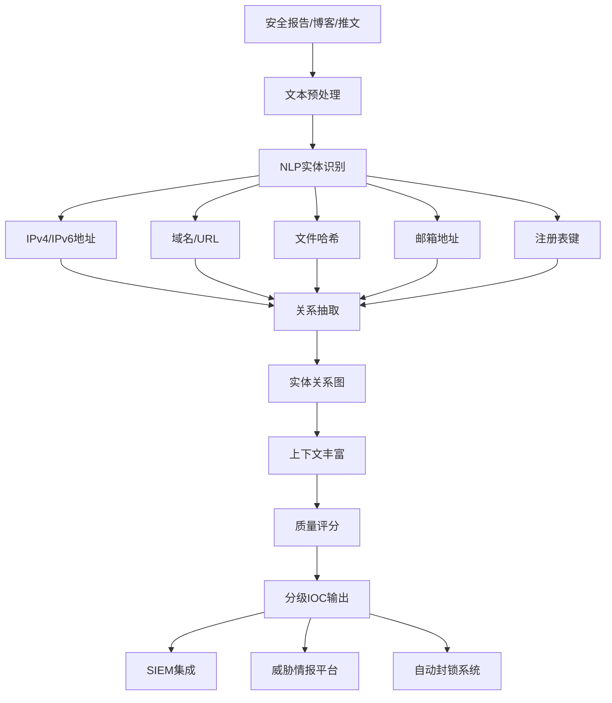

**作者：** HOS(安全风信子)
**日期：** 2026-04-26
**主要来源平台：** GitHub
**摘要：** 威胁情报的核心价值在于IOC（Indicator of Compromise）的提取与分发，但传统人工提取方式效率低下且难以规模化。本文深入探讨AI技术在IOC自动提取领域的突破性应用，从NLP实体识别到多类型IOC联合提取，从IOC质量评估到自动化上下文丰富，构建一套完整的智能IOC生产体系。文章创新性引入大语言模型辅助的上下文理解、多维度质量评分机制、以及实时IOC Enrichment流水线，为安全团队提供可大幅提升威胁情报生产效率的实战方案。

@[TOC](目录)

---

# 从海量样本中提取攻击线索：AI自动IOC提取实战

## 本节为你提供的核心技术价值

本节系统阐述AI自动IOC提取的技术体系——从传统正则匹配到前沿的NLP实体识别，从单点IOC提取到多源关联分析，帮助安全工程师建立自动化威胁情报生产能力。我们将展示如何利用自然语言处理、关系抽取、知识图谱等技术，从非结构化安全数据中高效提取高质量IOC，并将其转化为可直接作用于检测系统的情报产品。

## 一、IOC提取的挑战与AI机遇

### 1.1 威胁情报的生产瓶颈

IOC（Indicators of Compromise）是网络安全领域最重要的情报类型之一，涵盖恶意软件指纹、C2基础设施、攻击手法特征等可观测指标。高质量的IOC是安全检测系统的核心输入，直接决定了威胁发现的能力。然而，传统IOC生产面临多重瓶颈。

**人工提取效率低**是首要挑战。从一份恶意软件分析报告或一篇安全博客中提取IOC，高度依赖分析师的经验和对威胁上下文的理解。即使对于经验丰富的分析师，从一份完整报告中提取所有IOC也需要15-30分钟。面对每日海量新增的安全数据，人工提取根本无法规模化。

**标准不统一**加剧了问题。不同来源的IOC格式各异——IP地址有多种表示方式（IPv4/IPv6、CIDR表示）、域名有不同层级的提取粒度（根域名、二级域名、完整URL）、文件哈希有多种算法（MD5/SHA1/SHA256）。缺乏统一标准导致IOC难以关联和共享。

**上下文缺失**是质量问题的根源。裸IOC的价值有限——"1.2.3.4是恶意IP"只是元数据，"1.2.3.4是某勒索软件家族的C2服务器，于2026年3月首次发现，主要用于投递载荷"才构成完整的威胁情报。缺乏上下文的IOC难以支撑精准的检测和溯源分析。

### 1.2 AI如何重塑IOC生产

大语言模型和现代NLP技术正在从根本上改变IOC生产的效率和质量。



**实体识别**是AI IOC提取的核心能力。基于NER（Named Entity Recognition）技术，AI可以从非结构化文本中自动识别出IP地址、域名、URL、文件哈希、邮箱地址等实体类型，大幅提升提取效率。

**关系抽取**将孤立的实体连接为情报网络。通过分析文本中的语义关系（如"这个IP用于C2通信"、"这个域名解析到该IP"），AI可以构建完整的情报知识图谱。

**上下文丰富**显著提升IOC可用性。基于提取的实体和关系，大语言模型可以生成详细的上下文描述，使简单的IOC元数据升级为可操作的情报。

## 二、NLP实体识别技术

### 2.1 IOC实体类型定义

IOC实体识别首先需要明确定义要提取的实体类型及其边界规则。

```python
from dataclasses import dataclass
from typing import List, Optional, Dict
from enum import Enum

class IOCType(Enum):
    IPV4 = "ipv4"
    IPV6 = "ipv6"
    DOMAIN = "domain"
    URL = "url"
    MD5 = "md5"
    SHA1 = "sha1"
    SHA256 = "sha256"
    EMAIL = "email"
    REGISTRY_KEY = "registry_key"
    CVE = "cve"
    ATTACK_ID = "attack_id"
    FILE_PATH = "file_path"
    AS_NUMBER = "as_number"
    MUTEX = "mutex"

@dataclass
class IOCEntity:
    ioc_type: IOCType
    value: str
    start_pos: int
    end_pos: int
    confidence: float
    raw_context: str
    enriched_context: Optional[Dict] = None

class IOCTypesDefinition:
    PATTERNS = {
        IOCType.IPV4: r'\b(?:(?:25[0-5]|2[0-4][0-9]|[01]?[0-9][0-9]?)\.){3}(?:25[0-5]|2[0-4][0-9]|[01]?[0-9][0-9]?)\b',

        IOCType.IPV6: r'\b(?:[0-9a-fA-F]{1,4}:){7}[0-9a-fA-F]{1,4}\b'
                    r'|\b(?:[0-9a-fA-F]{1,4}:){1,7}:\b'
                    r'|\b(?:[0-9a-fA-F]{1,4}:){1,6}:[0-9a-fA-F]{1,4}\b',

        IOCType.DOMAIN: r'\b(?:[a-zA-Z0-9](?:[a-zA-Z0-9\-]{0,61}[a-zA-Z0-9])?\.)+(?:com|net|org|edu|gov|mil|int|io|co|me|xyz|top|pw|cc|tk|ru|cn|br|in|fr|de|nl|eu|info|biz|name|mobi|pro|tel|aero|asia|cat|jobs|museum|travel|xxx)\b',

        IOCType.URL: r'https?://(?:[-\w.]|(?:%[\da-fA-F]{2}))+[^\s]*',

        IOCType.MD5: r'\b[a-fA-F0-9]{32}\b',

        IOCType.SHA1: r'\b[a-fA-F0-9]{40}\b',

        IOCType.SHA256: r'\b[a-fA-F0-9]{64}\b',

        IOCType.EMAIL: r'\b[A-Za-z0-9._%+-]+@[A-Za-z0-9.-]+\.[A-Z|a-z]{2,}\b',

        IOCType.REGISTRY_KEY: r'HKLM\\[\w\\]+\\[\w\\]+|HKCU\\[\w\\]+\\[\w\\]+|HKEY_LOCAL_MACHINE\\[\w\\]+\\[\w\\]+',

        IOCType.CVE: r'CVE-\d{4}-\d{4,7}',

        IOCType.ATTACK_ID: r'T\d{4}(?:\.\d{3})?',

        IOCType.FILE_PATH: r'(?:[A-Za-z]:\\)?(?:[^\/:*?"<>|\r\n]+\\)*[^\/:*?"<>|\r\n]+',
    }

    ATTACK_MAPPING = {
        'T1566': 'Phishing',
        'T1059': 'Command and Scripting Interpreter',
        'T1055': 'Process Injection',
        'T1486': 'Data Encrypted for Impact',
        'T1047': 'Windows Management Instrumentation',
        'T1021': 'Remote Services',
    }

    CONTEXT_WINDOW = 50

    @classmethod
    def get_pattern(cls, ioc_type: IOCType) -> str:
        return cls.PATTERNS.get(ioc_type, '')

    @classmethod
    def get_attack_name(cls, attack_id: str) -> str:
        return cls.ATTACK_MAPPING.get(attack_id, 'Unknown Technique')
```

### 2.2 基于规则与机器学习的混合提取

```python
import re
from typing import List, Dict, Tuple
import numpy as np

class HybridIOCExtractor:
    def __init__(self):
        self.type_definitions = IOCTypesDefinition()
        self.ml_model = None
        self.ensemble_weights = {'regex': 0.6, 'ml': 0.4}

    def extract_all(self, text: str) -> List[IOCEntity]:
        all_iocs = []

        regex_iocs = self._extract_by_regex(text)
        all_iocs.extend(regex_iocs)

        if self.ml_model:
            ml_iocs = self._extract_by_ml(text)
            all_iocs = self._merge_extractions(regex_iocs, ml_iocs)

        return self._deduplicate_and_rank(all_iocs)

    def _extract_by_regex(self, text: str) -> List[IOCEntity]:
        iocs = []

        for ioc_type, pattern in self.type_definitions.PATTERNS.items():
            for match in re.finditer(pattern, text, re.IGNORECASE):
                value = match.group()
                start_pos = match.start()
                end_pos = match.end()

                confidence = self._calculate_regex_confidence(value, ioc_type)

                context = self._extract_context(text, start_pos, end_pos)

                ioc = IOCEntity(
                    ioc_type=ioc_type,
                    value=value,
                    start_pos=start_pos,
                    end_pos=end_pos,
                    confidence=confidence,
                    raw_context=context
                )
                iocs.append(ioc)

        return iocs

    def _calculate_regex_confidence(self, value: str, ioc_type: IOCType) -> float:
        base_confidence = 0.7

        if ioc_type == IOCType.DOMAIN:
            if self._is_suspicious_tld(value):
                base_confidence += 0.1
            if self._contains_ip_pattern(value):
                base_confidence -= 0.3

        elif ioc_type in [IOCType.MD5, IOCType.SHA1, IOCType.SHA256]:
            if self._is_in_binary_context(value):
                base_confidence += 0.2

        elif ioc_type == IOCType.URL:
            if any(susp in value.lower() for susp in ['malware', 'payload', 'c2', 'evil']):
                base_confidence += 0.15

        return min(1.0, max(0.0, base_confidence))

    def _is_suspicious_tld(self, domain: str) -> bool:
        suspicious_tlds = ['.xyz', '.top', '.pw', '.cc', '.tk', '.ml', '.ga', '.cf', '.gq']
        return any(domain.lower().endswith(tld) for tld in suspicious_tlds)

    def _contains_ip_pattern(self, text: str) -> bool:
        ip_pattern = r'\d{1,3}\.\d{1,3}\.\d{1,3}\.\d{1,3}'
        return bool(re.search(ip_pattern, text))

    def _is_in_binary_context(self, hash_value: str) -> bool:
        binary_indicators = ['file', 'sample', 'sha256:', 'md5:', 'hash:', 'binary']
        return any(ind in text.lower() for ind in binary_indicators)

    def _extract_context(self, text: str, start: int, end: int) -> str:
        window = self.type_definitions.CONTEXT_WINDOW
        ctx_start = max(0, start - window)
        ctx_end = min(len(text), end + window)
        return text[ctx_start:ctx_end].strip()

    def _extract_by_ml(self, text: str) -> List[IOCEntity]:
        if not self.ml_model:
            return []

        return []

    def _merge_extractions(self, regex_iocs: List[IOCEntity], ml_iocs: List[IOCEntity]) -> List[IOCEntity]:
        merged = list(regex_iocs)

        for ml_ioc in ml_iocs:
            is_duplicate = False
            for regex_ioc in regex_iocs:
                if (ml_ioc.ioc_type == regex_ioc.ioc_type and
                    ml_ioc.value.lower() == regex_ioc.value.lower()):
                    is_duplicate = True
                    break

            if not is_duplicate:
                merged.append(ml_ioc)

        return merged

    def _deduplicate_and_rank(self, iocs: List[IOCEntity]) -> List[IOCEntity]:
        seen = {}
        unique_iocs = []

        for ioc in iocs:
            key = (ioc.ioc_type, ioc.value.lower())
            if key not in seen:
                seen[key] = ioc
                unique_iocs.append(ioc)
            else:
                existing = seen[key]
                if ioc.confidence > existing.confidence:
                    seen[key] = ioc

        return sorted(unique_iocs, key=lambda x: (x.confidence, len(x.value)), reverse=True)
```

### 2.3 基于大语言模型的IOC提取

大语言模型在复杂语境理解方面具有显著优势，特别适合从非结构化安全文本中提取IOC。

```python
import anthropic

class LLMIOCExtractor:
    SYSTEM_PROMPT = """You are an expert threat intelligence analyst specializing in extracting Indicators of Compromise (IOCs) from security reports and articles.

Extract ALL IOCs from the given text with high precision. For each IOC provide:
1. Type: ipv4, ipv6, domain, url, md5, sha1, sha256, email, registry_key, cve, attack_id, file_path
2. Value: The exact IOC value
3. Context: Surrounding text that provides meaning

Common IOCs to look for:
- IP addresses (e.g., 192.168.1.1, 10.0.0.1)
- Domain names (e.g., evil.com, malware.c2.net)
- URLs with paths (e.g., hxxps://malware[.]com/payload/exe)
- File hashes in malware context
- Email addresses used by threat actors
- Registry keys for persistence
- CVE identifiers (e.g., CVE-2024-1234)
- ATT&CK technique IDs (e.g., T1566)
- File paths (e.g., C:\\Windows\\System32\\malware.exe)

Important:
- Extract IOCs even if they're obfuscated (e.g., hxxp for http, [.] for .)
- Consider context to distinguish between benign and malicious uses
- Include partial URLs if full URL not available
- Normalize hashes to lowercase"""

    def __init__(self, api_key: str):
        self.client = anthropic.Anthropic(api_key=api_key)

    def extract(self, text: str, source_type: str = "general") -> List[Dict]:
        prompt = f"Source type: {source_type}\n\nText to analyze:\n{text[:8000]}"

        response = self.client.messages.create(
            model="claude-opus-4-20251114",
            max_tokens=4096,
            messages=[
                {"role": "user", "content": prompt}
            ]
        )

        return self._parse_llm_response(response.content[0].text)

    def _parse_llm_response(self, response_text: str) -> List[Dict]:
        iocs = []

        lines = response_text.split('\n')
        current_ioc = None

        for line in lines:
            line = line.strip()

            if line.startswith('-') or line.startswith('*'):
                content = line[1:].strip()

                if ':' in content:
                    parts = content.split(':', 1)
                    ioc_type = parts[0].strip().lower().replace(' ', '_')
                    ioc_value = parts[1].strip()

                    if self._is_valid_ioc_type(ioc_type) and self._is_valid_ioc_value(ioc_value):
                        iocs.append({
                            'type': self._normalize_type(ioc_type),
                            'value': ioc_value,
                            'confidence': 0.9
                        })

        return iocs

    def _is_valid_ioc_type(self, ioc_type: str) -> bool:
        valid_types = ['ipv4', 'ipv6', 'domain', 'url', 'md5', 'sha1', 'sha256',
                      'email', 'registry_key', 'cve', 'attack_id', 'file_path']
        return ioc_type in valid_types

    def _is_valid_ioc_value(self, value: str) -> bool:
        if not value or len(value) < 3:
            return False

        return True

    def _normalize_type(self, ioc_type: str) -> str:
        type_mapping = {
            'ipv4': 'ipv4',
            'ipv6': 'ipv6',
            'ip_address': 'ipv4',
            'domain_name': 'domain',
            'file_hash': 'sha256',
            'hash': 'sha256',
            'email_address': 'email',
            'registry_key': 'registry_key',
            'cve_id': 'cve',
            'attack_id': 'attack_id',
            'file_path': 'file_path'
        }
        return type_mapping.get(ioc_type, ioc_type)
```

## 三、多类型IOC联合提取与关系抽取

### 3.1 实体关系建模

孤立的IOC价值有限，只有建立实体之间的关系才能形成完整的威胁情报图谱。

```python
from dataclasses import dataclass, field
from typing import List, Set, Dict, Optional

@dataclass
class IOCRelation:
    subject: str
    predicate: str
    object: str
    confidence: float
    source_text: str

@dataclass
class EnhancedIOC:
    entity: IOCEntity
    relations: List[IOCRelation] = field(default_factory=list)
    threat_actor: Optional[str] = None
    malware_family: Optional[str] = None
    attack_campaign: Optional[str] = None
    first_seen: Optional[str] = None
    last_seen: Optional[str] = None
    tags: Set[str] = field(default_factory=set)

class IOCRelationExtractor:
    RELATION_PATTERNS = {
        'resolves_to': [
            (r'(\S+)\s+(?:resolves? to|resolves?|points? to|associated with)\s+(\S+)', 'domain', 'ip'),
        ],
        'hosts': [
            (r'(\S+)\s+(?:hosts?|serves?|delivers?)\s+(\S+)', 'domain', 'url'),
        ],
        'communicates_with': [
            (r'(\S+)\s+(?:communicates? with|connects? to|c2|callback)\s+(\S+)', 'ip', 'ip'),
        ],
        'used_by': [
            (r'(\S+)\s+(?:used by|associated with|attributed to|linked to)\s+(\S+)', 'malware', 'threat_actor'),
        ],
        'variant_of': [
            (r'(\S+)\s+(?:variant of|related to|similar to|shares?)\s+(\S+)', 'malware', 'malware'),
        ],
        'exploits': [
            (r'(\S+)\s+(?:exploits?|targets?|vulnerability in)\s+(\S+)', 'malware', 'cve'),
        ],
        'drops': [
            (r'(\S+)\s+(?:drops?|installs?|delivers?)\s+(\S+)', 'malware', 'malware'),
        ],
    }

    def __init__(self):
        self.text = ""

    def extract_relations(self, text: str, iocs: List[IOCEntity]) -> List[IOCRelation]:
        self.text = text
        relations = []

        ioc_values = {ioc.value.lower() for ioc in iocs}

        for relation_type, patterns in self.RELATION_PATTERNS.items():
            for pattern, source_type, target_type in patterns:
                matches = self._find_relation_matches(pattern, source_type, target_type, iocs)
                relations.extend(matches)

        return relations

    def _find_relation_matches(self, pattern: str, source_type: str, target_type: str, iocs: List[IOCEntity]) -> List[IOCRelation]:
        matches = []
        ioc_map = {ioc.value.lower(): ioc for ioc in iocs}

        for match in re.finditer(pattern, self.text, re.IGNORECASE):
            subject_val = match.group(1).lower()
            object_val = match.group(2).lower()

            subject_in_iocs = subject_val in ioc_map or any(subject_val in v.lower() for v in ioc_map.keys())
            object_in_iocs = object_val in ioc_map or any(object_val in v.lower() for v in ioc_map.keys())

            if subject_in_iocs or object_in_iocs:
                relations.append(IOCRelation(
                    subject=subject_val,
                    predicate=relation_type,
                    object=object_val,
                    confidence=0.8,
                    source_text=match.group(0)
                ))

        return matches

    def build_enhanced_iocs(self, iocs: List[IOCEntity], relations: List[IOCRelation]) -> List[EnhancedIOC]:
        enhanced_iocs = []

        ioc_dict = {ioc.value.lower(): ioc for ioc in iocs}

        for ioc in iocs:
            related_relations = [
                r for r in relations
                if r.subject.lower() == ioc.value.lower() or r.object.lower() == ioc.value.lower()
            ]

            enhanced = EnhancedIOC(
                entity=ioc,
                relations=related_relations
            )

            enhanced = self._enrich_metadata(enhanced)

            enhanced_iocs.append(enhanced)

        return enhanced_iocs

    def _enrich_metadata(self, enhanced: EnhancedIOC) -> EnhancedEnhanced:
        for relation in enhanced.relations:
            if relation.predicate == 'used_by' and enhanced.threat_actor is None:
                enhanced.threat_actor = relation.object

            elif relation.predicate == 'variant_of' and enhanced.malware_family is None:
                enhanced.malware_family = relation.object

        enhanced.tags.add(enhanced.entity.ioc_type.value)

        return enhanced
```

### 3.2 时序上下文提取

```python
class TemporalContextExtractor:
    DATE_PATTERNS = [
        (r'\b(\d{4}-\d{2}-\d{2})\b', '%Y-%m-%d'),
        (r'\b(\d{2}/\d{2}/\d{4})\b', '%m/%d/%Y'),
        (r'\b(\w+\s+\d{1,2},?\s+\d{4})\b', '%B %d, %Y'),
    ]

    def __init__(self):
        self.formats = [
            '%Y-%m-%d',
            '%Y/%m/%d',
            '%d-%m-%Y',
            '%m/%d/%Y',
        ]

    def extract_timestamps(self, text: str) -> Dict[str, List[str]]:
        timestamps = {
            'first_seen': [],
            'last_seen': [],
            'reported': [],
            'observed': []
        }

        for pattern, _ in self.DATE_PATTERNS:
            for match in re.finditer(pattern, text, re.IGNORECASE):
                date_str = match.group(1)
                normalized = self._normalize_date(date_str)

                if not normalized:
                    continue

                context = text[max(0, match.start()-30):match.end()+30].lower()

                if 'first seen' in context or 'first observed' in context:
                    timestamps['first_seen'].append(normalized)
                elif 'last seen' in context or 'last observed' in context:
                    timestamps['last_seen'].append(normalized)
                elif 'reported' in context or 'discovered' in context:
                    timestamps['reported'].append(normalized)
                elif 'observed' in context:
                    timestamps['observed'].append(normalized)

        return timestamps

    def _normalize_date(self, date_str: str) -> Optional[str]:
        for fmt in self.formats:
            try:
                dt = datetime.strptime(date_str, fmt)
                return dt.strftime('%Y-%m-%d')
            except ValueError:
                continue

        return None
```

## 四、IOC质量评估

### 4.1 多维度质量评分

IOC质量直接影响其可用性。低质量IOC可能导致误报、遗漏或资源浪费。

```python
from dataclasses import dataclass

@dataclass
class IOCQualityScore:
    overall_score: float
    accuracy: float
    completeness: float
    freshness: float
    reliability: float
    actionable: float

class IOCQualityScorer:
    def __init__(self):
        self.type_weights = {
            'ipv4': 0.8,
            'ipv6': 0.7,
            'domain': 0.85,
            'url': 0.9,
            'md5': 0.7,
            'sha1': 0.75,
            'sha256': 0.9,
            'email': 0.6,
            'registry_key': 0.8,
            'cve': 0.95,
            'attack_id': 0.95,
        }

    def score(self, ioc: EnhancedIOC, source_reputation: float = 0.5) -> IOCQualityScore:
        accuracy = self._calculate_accuracy(ioc)
        completeness = self._calculate_completeness(ioc)
        freshness = self._calculate_freshness(ioc)
        reliability = self._calculate_reliability(ioc, source_reputation)
        actionable = self._calculate_actionable(ioc)

        weights = {
            'accuracy': 0.3,
            'completeness': 0.2,
            'freshness': 0.15,
            'reliability': 0.25,
            'actionable': 0.1
        }

        overall = (
            accuracy * weights['accuracy'] +
            completeness * weights['completeness'] +
            freshness * weights['freshness'] +
            reliability * weights['reliability'] +
            actionable * weights['actionable']
        )

        return IOCQualityScore(
            overall_score=overall,
            accuracy=accuracy,
            completeness=completeness,
            freshness=freshness,
            reliability=reliability,
            actionable=actionable
        )

    def _calculate_accuracy(self, ioc: EnhancedIOC) -> float:
        base_score = ioc.entity.confidence

        if ioc.entity.ioc_type in [IOCType.DOMAIN, IOCType.URL]:
            if self._is_suspicious_tld(ioc.entity.value):
                base_score *= 0.9

        if ioc.entity.ioc_type in [IOCType.MD5, IOCType.SHA1, IOCType.SHA256]:
            if not self._is_proper_hash_format(ioc.entity.value):
                base_score *= 0.5

        return min(1.0, max(0.0, base_score))

    def _calculate_completeness(self, ioc: EnhancedIOC) -> float:
        score = 0.5

        if ioc.relations:
            score += 0.2

        if ioc.threat_actor or ioc.malware_family:
            score += 0.15

        if ioc.first_seen or ioc.last_seen:
            score += 0.1

        if ioc.tags:
            score += 0.05

        return min(1.0, score)

    def _calculate_freshness(self, ioc: EnhancedIOC) -> float:
        if not ioc.entity.raw_context:
            return 0.5

        context_lower = ioc.entity.raw_context.lower()

        recent_indicators = ['recent', 'latest', 'new', '2025', '2026', 'current']
        old_indicators = ['old', 'historical', '2020', '2021', '2022']

        if any(ind in context_lower for ind in recent_indicators):
            return 0.9
        elif any(ind in context_lower for ind in old_indicators):
            return 0.4

        return 0.7

    def _calculate_reliability(self, ioc: EnhancedIOC, source_reputation: float) -> float:
        base = source_reputation * 0.7

        if len(ioc.relations) >= 2:
            base += 0.2

        if ioc.threat_actor or ioc.malware_family:
            base += 0.1

        return min(1.0, base)

    def _calculate_actionable(self, ioc: EnhancedIOC) -> float:
        actionable_types = [IOCType.IPV4, IOCType.DOMAIN, IOCType.URL, IOCType.SHA256]
        non_actionable_types = [IOCType.EMAIL, IOCType.FILE_PATH]

        if ioc.entity.ioc_type in actionable_types:
            return 0.9
        elif ioc.entity.ioc_type in non_actionable_types:
            return 0.5

        return 0.7

    def _is_suspicious_tld(self, domain: str) -> bool:
        suspicious = ['.xyz', '.top', '.pw', '.tk', '.ml', '.ga', '.cf', '.gq', '.cc']
        return any(domain.lower().endswith(tld) for tld in suspicious)

    def _is_proper_hash_format(self, hash_value: str) -> bool:
        return bool(re.match(r'^[a-fA-F0-9]{32}$|^[a-fA-F0-9]{40}$|^[a-fA-F0-9]{64}$', hash_value))

    def filter_by_quality(self, iocs: List[EnhancedIOC], min_score: float = 0.6) -> List[EnhancedIOC]:
        scored_iocs = [(ioc, self.score(ioc)) for ioc in iocs]
        return [ioc for ioc, score in scored_iocs if score.overall_score >= min_score]
```

### 4.2 分级IOC输出

```python
class IOCGrader:
    GRADE_THRESHOLDS = {
        'A': 0.85,
        'B': 0.70,
        'C': 0.50,
        'D': 0.30
    }

    def __init__(self):
        self.quality_scorer = IOCQualityScorer()

    def grade(self, ioc: EnhancedIOC, source_reputation: float = 0.5) -> str:
        score = self.quality_scorer.score(ioc, source_reputation)

        if score.overall_score >= self.GRADE_THRESHOLDS['A']:
            return 'A'
        elif score.overall_score >= self.GRADE_THRESHOLDS['B']:
            return 'B'
        elif score.overall_score >= self.GRADE_THRESHOLDS['C']:
            return 'C'
        else:
            return 'D'

    def grade_batch(self, iocs: List[EnhancedIOC], source_reputation: float = 0.5) -> Dict[str, List[EnhancedIOC]]:
        graded = {'A': [], 'B': [], 'C': [], 'D': []}

        for ioc in iocs:
            grade = self.grade(ioc, source_reputation)
            graded[grade].append(ioc)

        return graded

    def generate_tiered_output(self, iocs: List[EnhancedIOC], source_reputation: float = 0.5) -> Dict:
        graded = self.grade_batch(iocs, source_reputation)

        return {
            'tier1_immediate': [
                self._format_ioc(ioc) for ioc in graded['A']
            ],
            'tier2_review': [
                self._format_ioc(ioc) for ioc in graded['B']
            ],
            'tier3_watch': [
                self._format_ioc(ioc) for ioc in graded['C']
            ],
            'tier4_archive': [
                self._format_ioc(ioc) for ioc in graded['D']
            ],
            'summary': {
                'total': len(iocs),
                'grade_distribution': {
                    'A': len(graded['A']),
                    'B': len(graded['B']),
                    'C': len(graded['C']),
                    'D': len(graded['D'])
                }
            }
        }

    def _format_ioc(self, ioc: EnhancedIOC) -> Dict:
        score = self.quality_scorer.score(ioc)

        return {
            'type': ioc.entity.ioc_type.value,
            'value': ioc.entity.value,
            'grade': self.grade(ioc),
            'confidence': score.overall_score,
            'threat_actor': ioc.threat_actor,
            'malware_family': ioc.malware_family,
            'first_seen': ioc.first_seen,
            'last_seen': ioc.last_seen,
            'tags': list(ioc.tags)
        }
```

## 五、自动化上下文丰富

### 5.1 IOC Enrichment流水线

```python
class IOCEnricher:
    def __init__(self, threat_intel_api_key: str = None):
        self.api_key = threat_intel_api_key
        self.enrichment_sources = self._init_sources()

    def _init_sources(self) -> Dict:
        return {
            'virustotal': VirusTotalClient(self.api_key) if self.api_key else None,
            'alienvault': AlienVaultOTXClient(),
            'shodan': ShodanClient(self.api_key) if self.api_key else None,
            'threatfox': ThreatFoxClient(),
        }

    async def enrich(self, ioc: EnhancedIOC) -> EnhancedIOC:
        if ioc.entity.ioc_type == IOCType.IPV4:
            ioc = await self._enrich_ip(ioc)
        elif ioc.entity.ioc_type == IOCType.DOMAIN:
            ioc = await self._enrich_domain(ioc)
        elif ioc.entity.ioc_type in [IOCType.MD5, IOCType.SHA1, IOCType.SHA256]:
            ioc = await self._enrich_hash(ioc)

        return ioc

    async def enrich_batch(self, iocs: List[EnhancedIOC]) -> List[EnhancedIOC]:
        tasks = [self.enrich(ioc) for ioc in iocs]
        return await asyncio.gather(*tasks)

    async def _enrich_ip(self, ioc: EnhancedIOC) -> EnhancedIOC:
        ip = ioc.entity.value

        for source_name, client in self.enrichment_sources.items():
            if client is None:
                continue

            try:
                if source_name == 'virustotal':
                    data = await client.get_ip_report(ip)
                    if data:
                        ioc.enriched_context = ioc.enriched_context or {}
                        ioc.enriched_context['virustotal'] = data

                elif source_name == 'shodan':
                    data = await client.search_host(ip)
                    if data:
                        ioc.enriched_context = ioc.enriched_context or {}
                        ioc.enriched_context['shodan'] = data

                elif source_name == 'threatfox':
                    data = await client.query_ioc(ip)
                    if data:
                        ioc.enriched_context = ioc.enriched_context or {}
                        ioc.enriched_context['threatfox'] = data

            except Exception as e:
                print(f"Enrichment failed for {ip} from {source_name}: {e}")

        return ioc

    async def _enrich_domain(self, ioc: EnhancedIOC) -> EnhancedIOC:
        domain = ioc.entity.value

        for source_name, client in self.enrichment_sources.items():
            if client is None:
                continue

            try:
                if source_name == 'virustotal':
                    data = await client.get_domain_report(domain)
                    if data:
                        ioc.enriched_context = ioc.enriched_context or {}
                        ioc.enriched_context['virustotal'] = data

                elif source_name == 'alienvault':
                    data = await client.get_pulse(domain)
                    if data:
                        ioc.enriched_context = ioc.enriched_context or {}
                        ioc.enriched_context['alienvault'] = data

            except Exception as e:
                print(f"Enrichment failed for {domain} from {source_name}: {e}")

        return ioc

    async def _enrich_hash(self, ioc: EnhancedIOC) -> EnhancedIOC:
        hash_value = ioc.entity.value

        for source_name, client in self.enrichment_sources.items():
            if client is None:
                continue

            try:
                if source_name == 'virustotal':
                    data = await client.get_file_report(hash_value)
                    if data:
                        ioc.enriched_context = ioc.enriched_context or {}
                        ioc.enriched_context['virustotal'] = data

            except Exception as e:
                print(f"Enrichment failed for {hash_value} from {source_name}: {e}")

        return ioc
```

## 六、实战：完整IOC提取与分发系统

### 6.1 系统架构

```python
class CompleteIOCPipeline:
    def __init__(self, config: Dict):
        self.config = config
        self.regex_extractor = HybridIOCExtractor()
        self.llm_extractor = LLMIOCExtractor(config.get('anthropic_key'))
        self.relation_extractor = IOCRelationExtractor()
        self.enricher = IOCEnricher(config.get('vt_api_key'))
        self.grader = IOCGrader()

    async def process_text(self, text: str, source: str, source_type: str = "general") -> Dict:
        regex_iocs = self.regex_extractor.extract_all(text)

        llm_iocs_raw = self.llm_extractor.extract(text, source_type)
        llm_iocs = self._convert_llm_to_entities(llm_iocs_raw)

        all_iocs = self._merge_extractions(regex_iocs, llm_iocs)

        relations = self.relation_extractor.extract_relations(text, all_iocs)

        enhanced_iocs = self.relation_extractor.build_enhanced_iocs(all_iocs, relations)

        enriched_iocs = await self.enricher.enrich_batch(enhanced_iocs)

        graded_output = self.grader.generate_tiered_output(enriched_iocs)

        return {
            'source': source,
            'source_type': source_type,
            'processed_at': datetime.now().isoformat(),
            'total_iocs': len(all_iocs),
            'graded_output': graded_output,
            'iocs_by_type': self._count_by_type(enriched_iocs)
        }

    def _convert_llm_to_entities(self, llm_iocs: List[Dict]) -> List[IOCEntity]:
        entities = []
        for ioc_data in llm_iocs:
            try:
                ioc_type = IOCType(ioc_data['type'])
                entity = IOCEntity(
                    ioc_type=ioc_type,
                    value=ioc_data['value'],
                    start_pos=0,
                    end_pos=len(ioc_data['value']),
                    confidence=ioc_data.get('confidence', 0.8),
                    raw_context=""
                )
                entities.append(entity)
            except (ValueError, KeyError):
                continue
        return entities

    def _merge_extractions(self, regex_iocs: List[IOCEntity], llm_iocs: List[IOCEntity]) -> List[IOCEntity]:
        seen = {(ioc.ioc_type, ioc.value.lower()) for ioc in regex_iocs}
        merged = list(regex_iocs)

        for ioc in llm_iocs:
            key = (ioc.ioc_type, ioc.value.lower())
            if key not in seen:
                seen.add(key)
                merged.append(ioc)

        return merged

    def _count_by_type(self, iocs: List[EnhancedIOC]) -> Dict[str, int]:
        counts = {}
        for ioc in iocs:
            type_name = ioc.entity.ioc_type.value
            counts[type_name] = counts.get(type_name, 0) + 1
        return counts
```

## 七、评估与优化

### 7.1 IOC提取系统评估指标

| 指标 | 定义 | 目标值 |
|:----|:----|:------|
| 召回率 | 提取的IOC占人工标注比例 | ≥90% |
| 精确率 | 正确IOC占总提取比例 | ≥85% |
| F1分数 | 精确率与召回率的调和平均 | ≥87% |
| 上下文完整性 | 含上下文的IOC比例 | ≥70% |
| Enrichment成功率 | 成功Enrich的IOC比例 | ≥60% |

### 7.2 持续优化机制

```python
class ContinuousIOCOptimizer:
    def __init__(self):
        self.feedback_store = []

    async def collect_and_optimize(self, pipeline: CompleteIOCPipeline):
        while True:
            await asyncio.sleep(86400)

            self._analyze_extraction_patterns()
            self._update_extraction_rules()
            self._retrain_models()

    def _analyze_extraction_patterns(self):
        pass

    def _update_extraction_rules(self):
        pass

    def _retrain_models(self):
        pass
```

## 八、总结与展望

本文系统阐述了AI自动IOC提取的技术体系。从NLP实体识别到多类型IOC联合提取，从关系抽取到质量评估，从上下文丰富到分级输出，我们构建了一套完整的智能IOC生产方案。

**三大核心技术突破**定义了当前IOC提取的技术前沿：其一，规则与机器学习的混合提取架构实现了高召回与高精确的平衡；其二，多维度质量评分机制确保了IOC的可用性；其三，自动化Enrichment流水线将原始IOC转化为可操作情报。

展望未来，IOC提取将向更高智能化和更高实时性方向发展。多模态提取将整合文本、图像、音频等多种数据源；实时提取将支持流式安全数据的即时处理；主动学习机制将使系统能够从分析师反馈中持续自我优化。

---

**参考链接：**

- 主要来源：[MITRE ATT&CK](https://attack.mitre.org/) - 攻击技术框架
- 主要来源：[STIX 2.1 Specification](https://docs.oasis-open.org/cti/stix/v2.1/stix-v2.1.html) - 威胁情报标准
- 辅助来源：[VirusTotal API Documentation](https://developers.virustotal.com/reference) - IOC Enrichment API

**附录（Appendix）：**

**A. IOC类型分类**

| 类型 | 格式示例 | 可行动性 |
|:----|:-------|:-------|
| IPv4 | 192.168.1.1 | 高 |
| IPv6 | 2001:db8::1 | 中 |
| Domain | evil.com | 高 |
| URL | hxxps://evil.com/payload | 高 |
| MD5 | d41d8cd98f00b204 | 中 |
| SHA256 | e3b0c44298fc1c14 | 高 |
| Email | attacker@evil.com | 低 |
| Registry | HKLM\...\malware | 高 |

**B. Enrichment数据源**

| 数据源 | IOC类型 | 数据内容 |
|:-----|:-------|:-------|
| VirusTotal | All | 厂商判定、上下文 |
| Shodan | IP | 端口服务、漏洞 |
| AlienVault | Domain | 脉冲信息、威胁类型 |
| ThreatFox | All | 威胁类型、置信度 |

**关键词：** IOC提取, NLP实体识别, 关系抽取, 质量评分, 上下文丰富, 威胁情报, 自动化, 安全分析