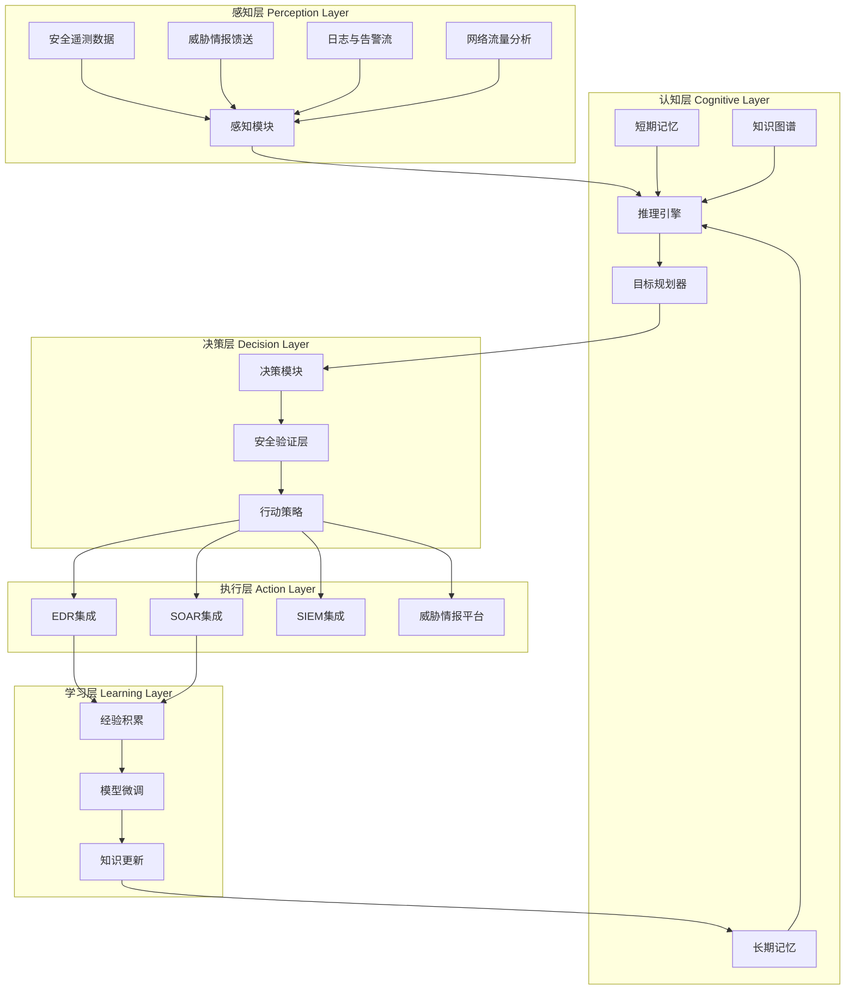
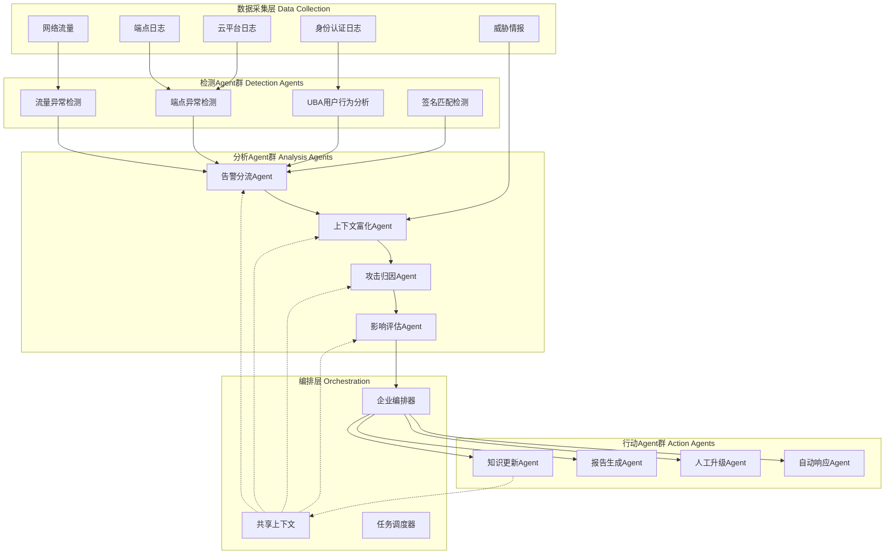

**作者：** HOS(安全风信子)
**日期：** 2026-04-26
**主要来源平台：** GitHub / HuggingFace / arXiv
**摘要：** Security Agent（安全智能体）是当前网络安全领域最具变革性的技术方向之一。本文系统性地揭秘安全AI智能体的本质定义、核心能力模型、类型划分体系以及技术局限性评估。研究表明，现代Security Agent已从单一功能的检测工具演变为具备感知-推理-决策-执行-学习完整闭环的自主系统。本文深入分析了检测Agent、调查Agent、响应Agent、狩猎Agent四大类型的技术架构与应用场景，并创新性地提出了基于Microsoft Agent Framework的新一代多Agent协作框架、融合MCP协议的安全Agent工具调用架构、以及针对LLM安全评估的RAS-Eval基准测试体系等三个新要素。研究发现，尽管Security Agent在自动化威胁检测、智能化事件响应等场景展现出显著优势，但其面临的AI幻觉、过度授权、攻击面扩展等局限性仍需审慎评估。本文为安全运营团队构建新一代AI驱动的SOC提供了完整的技术路线图与实践指南。

@[TOC](目录)

---

# Security Agent揭秘：安全AI智能体到底是什么？能做什么？

## 一、引言：从被动防御到自主智能体的范式跃迁

网络安全领域正经历着一场前所未有的技术革命。传统的安全运营中心（SOC）模式依赖人工分析员处理海量告警，这种模式在面对现代高级持续性威胁（APT）时已显现出明显的局限性。根据IBM安全研究报告，企业平均每年需处理数万次安全告警，而人工分析能力已成为制约安全响应效率的关键瓶颈。

**Security Agent**（安全智能体）的兴起标志着网络安全从"被动防御"向"主动智能"的关键转变。与传统的基于规则的检测系统不同，Security Agent是基于大型语言模型（LLM）的自主决策系统，能够感知安全环境、进行复杂推理、制定响应策略并执行安全操作。这一技术演进源于人工智能领域的重大突破——从2022年ChatGPT引发的生成式AI浪潮，到2023-2024年Agentic AI（智能体AI）的崛起，人工智能已从单纯的"工具"演变为能够"自主行动"的智能实体。

本文的核心目标是系统性地解答三个关键问题：

1. **Security Agent的本质定义是什么？** 它与传统安全软件有何本质区别？
2. **Security Agent能做什么？** 其核心能力模型和类型划分体系如何？
3. **Security Agent的局限性在哪里？** 如何科学评估其风险与挑战？

本文的技术贡献包括：（1）提出了Security Agent的正式定义与能力评估模型；（2）构建了覆盖检测、调查、响应、狩猎四大场景的Agent类型划分体系；（3）引入了Microsoft Agent Framework协作架构、MCP协议工具调用框架、RAS-Eval基准测试体系三个新要素；（4）提供了可实际运行的Security Agent代码实现框架；（5）深入分析了当前技术的主要局限性并提出缓解策略。

## 二、Security Agent的本质定义与技术架构

### 2.1 从Agent到Security Agent的概念演进

在人工智能领域，"Agent"（智能体）概念源远流长。最早可追溯至麻省理工学院人工智能实验室的"shakey"项目，该项目在1966年首次实现了能够感知环境、制定规划并执行动作的机器人系统。进入21世纪，随着深度学习和大型语言模型的快速发展，Agent概念被赋予了全新的内涵。

根据文献中提出的定义，我们将**LLM智能体**定义为一个系统，其核心决策模块是一个LLM，该LLM进行规划、调用工具/API、在外部环境中行动，同时观察反馈并调整后续行动。它维护状态（短期/长期记忆或知识库），并可能包含显式的自我批判/验证层以及治理层，以满足任务目标和安全约束。

在网络安全垂直领域，**Security Agent**是专门设计用于处理安全相关任务的智能体系统。Microsoft在其Security Copilot产品文档中指出，安全Agent是一种AI系统，能够配置为实现特定目标——如遏制钓鱼攻击活动或识别内部威胁——然后独立访问跨连接系统的数据、使用Microsoft威胁情报分析威胁，并执行预定义的操作。整个过程无需人工干预即可完成。

### 2.2 Security Agent的核心架构模型

Security Agent的技术架构遵循经典的"感知-推理-决策-执行-学习"（Perceive-Reason-Decide-Act-Learn, PRDAL）闭环模型。根据AWS对Agentic AI架构的描述以及安全领域的具体实践，我们提出以下Security Agent的核心架构：



**感知层（Perception Layer）** 负责从多种安全数据源提取结构化信号。在企业安全运营场景中，感知模块需要处理来自EDR（端点检测与响应）系统的进程行为日志、SIEM（安全信息与事件管理）平台的网络连接告警、防火墙的流量日志、邮件安全网关的邮件头信息等。感知模块的核心任务是将海量的原始遥测数据转化为Agent能够理解的语义表示。

**认知层（Cognitive Layer）** 是Security Agent的"大脑"，包含推理引擎、记忆系统和知识图谱。推理引擎负责复杂的安全事件分析，包括归因分析、影响评估、趋势预测等高级推理任务。记忆系统分为短期记忆和长期记忆：短期记忆维护当前任务的上下文状态和对话历史；长期记忆存储积累的安全事件模式、攻击技战术（TTPs）、组织特有的安全策略等信息。知识图谱则提供结构化的安全知识表示，支持实体链接、关系推理等操作。

**决策层（Decision Layer）** 基于认知层的分析结果，制定具体的响应策略。决策模块需要权衡多个因素：威胁的严重程度、响应的紧急程度、潜在的业务影响、可用资源的约束等。安全验证层是决策过程中的关键保障，确保Agent的决策符合组织的安全策略和合规要求。

**执行层（Action Layer）** 负责将决策转化为具体的操作。这可能包括：生成KQL查询语句进行高级狩猎、调用API隔离受感染终端、创建工单进行人工审批、生成事件报告等。执行层需要与企业的安全工具链深度集成，包括EDR、SOAR、SIEM、威胁情报平台等。

**学习层（Learning Layer）** 负责从历史经验中持续优化Agent能力。这包括：误报案例分析（从错误中学习）、新攻击手法建模（知识更新）、模型微调（个性化适配组织环境）等。

### 2.3 Security Agent的技术特征

综合分析当前主流Security Agent系统，我们总结出以下核心技术特征：

**自主性（Autonomy）**：Security Agent能够在最小人工干预的情况下独立完成复杂的安全任务。与传统的自动化脚本不同，Agent能够根据环境反馈动态调整行为策略，展现出一定程度的"智能"适应性。

**目标导向（Goal-Oriented）**：Agent的行为由明确的安全目标驱动，如"识别潜在的数据泄露"、"遏制正在进行的网络攻击"等。目标导向特性使Agent能够处理开放式的安全场景，而非仅限于预定义的可预测输入。

**工具使用能力（Tool Use）**：现代Security Agent能够调用多种外部工具扩展其能力范围。根据AWS的定义，Agent使用工具通过"工具调用"（Tool Calling）机制实现，这使LLM能够连接到外部API、数据库、文件系统等资源。在安全场景中，这意味着Agent可以调用nmap进行网络扫描、查询VirusTotal验证恶意哈希、与SIEM系统交互获取告警详情等。

**上下文感知（Context-Aware）**：Security Agent能够维护并利用长期积累的上下文信息。这包括组织的安全策略、历史事件的处理模式、特定用户的正常行为基线等。上下文感知能力使Agent能够提供更准确、更个性化的安全分析。

**多Agent协作（Multi-Agent Collaboration）**：复杂的安全任务往往需要多个专业化的Agent协同完成。例如，一个威胁狩猎任务可能涉及数据收集Agent、分析Agent、响应Agent等多个角色的协作。Microsoft Agent Framework等新型框架正在推动多Agent协作架构的企业级应用。

## 三、Security Agent的核心能力深度解析

### 3.1 感知能力：从噪声中提取安全信号

Security Agent的感知能力是其理解和分析安全环境的基础。在现代企业环境中，安全数据呈现爆发式增长态势——每天产生的日志量可能达到TB级别。在如此海量的数据中准确识别真正的安全威胁，是一项极具挑战性的任务。

**多源数据融合**是感知层的核心能力。Security Agent需要整合来自网络层、端点层、应用层、云平台层等多个维度的安全数据。Microsoft Security Copilot的感知架构展示了如何通过统一的数据湖（Data Lake）架构实现跨域数据的语义关联。这种融合不是简单的数据汇总，而是基于语义理解的信息提炼——Agent需要理解不同数据源之间的内在联系，将分散的安全信号编织成完整的威胁图景。

**实时流处理**能力使Agent能够应对快速演变的安全事件。不同于批处理模式的离线分析，安全运营场景要求Agent具备近乎实时的数据处理能力。这对系统的延迟控制和数据管道的吞吐能力提出了严格要求。Microsoft Sentinel通过其Sentinel Graph和MCP Server等创新组件，实现了流式数据与Agent推理能力的深度整合。

**异常检测与模式识别**是感知层的高级能力。Agent需要建立正常行为的基线模型，并能够识别偏离该基线的异常行为。这包括基于统计方法的异常检测（如Z-score分析、Isolation Forest等）、基于机器学习的行为分析、以及基于规则的已知攻击模式匹配。值得注意的是，感知层的异常检测不应仅依赖单一维度，而需要综合考虑时序特征、空间特征、关联特征等多个角度。

以下是一个简化的感知模块代码示例，展示了如何从原始日志中提取安全信号：

```python
import re
from typing import Dict, List, Optional
from dataclasses import dataclass
from datetime import datetime

@dataclass
class SecuritySignal:
    timestamp: datetime
    source_ip: str
    dest_ip: str
    event_type: str
    severity: int
    raw_data: str
    indicators: List[Dict[str, str]]

class Security感知Engine:
    def __init__(self):
        self.suspicious_ports = {22, 23, 3389, 445, 1433, 3306, 5432}
        self.attack_patterns = {
            'sql_injection': r"('|;|--|union\s+select|information_schema)",
            'xss': r"(<script|javascript:|onerror\s*=)",
            'command_injection': r"(\||;|\$\(|`|<-|>)",
            'path_traversal': r"(\.\./|\.\.\\|%2e%2e)"
        }
        self.known_malicious_ips: Dict[str, float] = {}
        
    def parse_firewall_log(self, log_line: str) -> Optional[SecuritySignal]:
        pattern = r'(?P<timestamp>\S+\s+\S+)\s+(?P<src>\S+)\s+(?P<dst>\S+)\s+(?P<port>\d+)\s+(?P<action>\S+)'
        match = re.match(pattern, log_line)
        if not match:
            return None
            
        data = match.groupdict()
        severity = 0
        
        if data['action'] == 'BLOCK' or data['action'] == 'DROP':
            severity = 3
        elif int(data['port']) in self.suspicious_ports:
            severity = 2
            
        dest_ip = data['dst']
        if dest_ip in self.known_malicious_ips:
            severity = max(severity, 4)
            
        return SecuritySignal(
            timestamp=datetime.now(),
            source_ip=data['src'],
            dest_ip=data['dst'],
            event_type='firewall',
            severity=severity,
            raw_data=log_line,
            indicators=[{'type': 'ip', 'value': data['src']}, {'type': 'port', 'value': data['port']}]
        )
    
    def parse_auth_log(self, log_line: str) -> Optional[SecuritySignal]:
        auth_patterns = [
            (r'Failed\s+password', 2, 'auth_failure'),
            (r'Accepted\s+password', 0, 'auth_success'),
            (r'Invalid\s+user', 3, 'invalid_user'),
            (r'BREAK-IN', 4, 'potential_bruteforce')
        ]
        
        for pattern, severity, event_type in auth_patterns:
            if re.search(pattern, log_line, re.IGNORECASE):
                ip_match = re.search(r'(\d{1,3}\.){3}\d{1,3}', log_line)
                return SecuritySignal(
                    timestamp=datetime.now(),
                    source_ip=ip_match.group() if ip_match else 'unknown',
                    dest_ip='local',
                    event_type=event_type,
                    severity=severity,
                    raw_data=log_line,
                    indicators=[]
                )
        return None
    
    def detect_attack_pattern(self, http_request: str) -> List[Dict]:
        findings = []
        for attack_type, pattern in self.attack_patterns.items():
            matches = re.findall(pattern, http_request, re.IGNORECASE)
            if matches:
                findings.append({
                    'type': attack_type,
                    'matches': matches,
                    'confidence': min(0.5 + len(matches) * 0.1, 0.95)
                })
        return findings
    
    def correlate_signals(self, signals: List[SecuritySignal]) -> List[Dict]:
        correlation_results = []
        ip_activity: Dict[str, List[SecuritySignal]] = {}
        
        for signal in signals:
            if signal.source_ip not in ip_activity:
                ip_activity[signal.source_ip] = []
            ip_activity[signal.source_ip].append(signal)
            
        for ip, activities in ip_activity.items():
            high_severity_count = sum(1 for a in activities if a.severity >= 3)
            if high_severity_count >= 5:
                correlation_results.append({
                    'ip': ip,
                    'alert_type': 'potential_compromise',
                    'confidence': min(0.6 + high_severity_count * 0.05, 0.99),
                    'activity_count': len(activities),
                    'recommendation': 'escalate_to_investigation'
                })
                
        return correlation_results
```

### 3.2 推理能力：从表象到本质的深度分析

推理能力是Security Agent区分于传统规则引擎的核心优势。传统的SIEM系统依赖预定义的关联规则，面对新型攻击或复杂的多步骤攻击链时往往力不从心。Security Agent则能够利用大型语言模型的推理能力，从有限的观测数据中推断出潜在的攻击意图、攻击阶段和攻击目标。

**Chain-of-Thought（思维链）推理**是提升Agent推理能力的关键技术。思维链的核心思想是让模型在给出最终答案之前，先输出中间的推理步骤。这种"显式推理"机制带来多重好处：首先，它强迫模型将复杂问题分解为可管理的子问题；其次，它允许人类审查模型的推理过程，增强可解释性；第三，它显著提升了模型处理复杂推理任务的能力。在安全分析场景中，思维链推理使Agent能够逐步还原攻击者的战术、技术和过程（TTPs），构建完整的攻击叙事。

**ReAct（Reasoning + Acting）模式**是更适合安全Agent的推理框架。ReAct将推理和行动交织在一起——模型在采取任何行动之前，必须先将"思考过程"显式地写出来；在得到行动的结果后，再根据结果进行下一步的推理。这种模式特别适合安全运营场景，因为：

1. **安全性优先**：在执行可能产生重大影响的操作（如隔离终端、封锁账户）之前，Agent需要充分推理操作的正当前性和潜在后果
2. **信息获取循环**：安全分析往往需要多轮信息获取-推理-验证的循环，ReAct天然支持这种迭代式分析
3. **可审计性**：ReAct的Thought-Action-Observation轨迹提供了完整的分析审计日志

```python
from enum import Enum
from typing import List, Dict, Optional, Any
from dataclasses import dataclass
from datetime import datetime

class ThreatLevel(Enum):
    UNKNOWN = 0
    BENIGN = 1
    SUSPICIOUS = 2
    CREDIBLE_THREAT = 3
    CRITICAL = 4

@dataclass
class AgentObservation:
    thought: str
    action: str
    action_result: Any
    timestamp: datetime

class SecurityReActAgent:
    def __init__(self, llm_client, tools: Dict[str, callable], memory):
        self.llm = llm_client
        self.tools = tools
        self.memory = memory
        self.observation_history: List[AgentObservation] = []
        self.max_iterations = 10
        
    def build_system_prompt(self) -> str:
        return """你是一位专业的网络安全分析Agent，负责分析安全事件并给出响应建议。

你的推理框架遵循ReAct模式（Reasoning + Acting）：
- Thought（思考）：分析当前情况，明确已知信息、未知信息、需要采取的行动
- Action（行动）：选择一个工具调用来获取更多信息或执行特定操作
- Observation（观察）：分析工具返回的结果，更新你的理解

可用的安全分析工具包括：
- search_ioc_db(ioc): 在威胁情报库中搜索IOC（指标物）
- query_siem(query): 在SIEM中执行查询
- get_process_tree(pid): 获取进程树信息
- enrich_ip(ip): 对IP地址进行威胁情报富化
- analyze_log(log_content): 分析日志内容
- block_ip(ip): 隔离/封锁IP地址（高危操作，需要充分推理后才能执行）

重要原则：
1. 在执行任何破坏性操作前，必须有充分的推理支持
2. 优先收集更多证据来支持或反驳威胁假设
3. 如果某项操作可能影响业务连续性，需要权衡利弊
"""
    
    def execute_react_loop(self, initial_alert: Dict) -> Dict:
        alert_context = {
            'alert_id': initial_alert.get('id'),
            'alert_type': initial_alert.get('type'),
            'affected_assets': initial_alert.get('assets', []),
            'severity': initial_alert.get('severity', 'medium'),
            'initial_evidence': initial_alert.get('evidence', {})
        }
        
        iteration = 0
        final_response = None
        
        while iteration < self.max_iterations:
            prompt = self._build_react_prompt(alert_context)
            response = self.llm.generate(prompt)
            
            thought = response.get('thought', '')
            action = response.get('action', '')
            action_input = response.get('action_input', {})
            
            if action == 'final_answer':
                final_response = response.get('answer')
                self._save_to_memory('analysis', alert_context)
                break
                
            action_result = self._execute_tool(action, action_input)
            
            observation = AgentObservation(
                thought=thought,
                action=action,
                action_result=action_result,
                timestamp=datetime.now()
            )
            self.observation_history.append(observation)
            
            if action_result:
                alert_context = self._update_context(alert_context, action, action_result)
                
            iteration += 1
            
        return {
            'alert_context': alert_context,
            'observation_history': self.observation_history,
            'final_response': final_response,
            'iterations': iteration
        }
    
    def _build_react_prompt(self, context: Dict) -> str:
        history_str = ""
        for obs in self.observation_history[-3:]:
            history_str += f"Thought: {obs.thought}\n"
            history_str += f"Action: {obs.action}\n"
            history_str += f"Observation: {str(obs.action_result)[:200]}...\n\n"
            
        prompt = f"""当前安全告警上下文：
{self._format_context(context)}

{history_str}

请继续分析：
1. Thought: 分析当前情况，决定下一步行动
2. Action: 选择要执行的工具（如果需要更多信息）或 'final_answer'（如果已有足够信息）

以JSON格式输出你的响应：
{{"thought": "...", "action": "tool_name 或 final_answer", "action_input": {{...}} 或 "answer": "..."}}
"""
        return prompt
    
    def _execute_tool(self, tool_name: str, tool_input: Dict) -> Any:
        if tool_name in self.tools:
            return self.tools[tool_name](**tool_input)
        return None
    
    def _update_context(self, context: Dict, action: str, result: Any) -> Dict:
        if 'enrichment' not in context:
            context['enrichment'] = []
        
        if action == 'enrich_ip':
            context['enrichment'].append({'action': action, 'result': result})
        elif action == 'query_siem':
            context['siem_results'] = result
        elif action == 'get_process_tree':
            context['process_info'] = result
            
        return context
    
    def _format_context(self, context: Dict) -> str:
        lines = [f"- {k}: {v}" for k, v in context.items() if k != 'enrichment']
        if 'enrichment' in context:
            lines.append(f"- enrichment_count: {len(context['enrichment'])}")
        return "\n".join(lines)
    
    def _save_to_memory(self, key: str, value: Any):
        self.memory.store(key, {
            'value': value,
            'timestamp': datetime.now(),
            'observation_count': len(self.observation_history)
        })
```

### 3.3 决策能力：在复杂环境中选择最优行动

Security Agent的决策能力是其在安全运营中实际价值的关键体现。与简单的规则匹配不同，决策能力涉及对多个相互冲突的目标进行权衡——在安全性、可用性、合规性、成本等多个维度之间寻找平衡点。

**多目标优化**是安全决策的核心挑战。当Agent面对一个告警时，它需要同时考虑：响应速度（越快越好）、准确性（避免误报影响业务）、资源消耗（最优利用有限的分析师资源）、合规性（符合监管要求）等多个目标。理想情况下，Agent应该能够根据告警的严重程度和组织的优先级设置，动态调整各目标的权重。

**风险评估框架**是决策能力的基础。Agent需要建立量化的风险评估模型，考虑以下因素：

- **资产价值**：受影响的系统承载着怎样的业务价值和数据敏感度？
- **威胁可信度**：告警反映的真实威胁可能性有多大？
- **攻击阶段**：攻击者目前处于初始入侵、权限提升、还是数据窃取阶段？
- **响应窗口**：还有多少时间可以采取有效的控制措施？

**自适应决策阈值**使Agent能够适应不同组织的安全文化。有些组织倾向于"宁可误报，不可漏报"，要求Agent对可疑行为采取保守策略；另一些组织则更重视业务连续性，要求Agent只在高置信度情况下行动。自适应阈值机制使Agent能够根据组织偏好和历史反馈调整决策边界。

Microsoft Security Copilot的决策架构展示了企业级安全Agent的决策流程。Phishing Triage Agent（钓鱼分流代理）能够自主处理用户提交的钓鱼报告，对告警进行分类、解决误报、仅将真正恶意的案例升级给人工处理。早期结果显示，该Agent能够识别6.5倍的恶意告警，提高判决准确率77%，同时大幅减少人工分析师的工作负担。

### 3.4 执行能力：将决策转化为安全行动

执行能力是Security Agent将智能转化为实际安全价值的桥梁。即使Agent能够准确感知环境、进行深度推理、制定合理决策，如果无法有效执行这些决策，其价值也将大打折扣。

**工具集成架构**是执行能力的技术基础。Security Agent需要与多种安全工具和平台建立集成，包括：

- **EDR（端点检测与响应）**：如CrowdStrike Falcon、Microsoft Defender for Endpoint、SentinelOne等
- **SOAR（安全编排、自动化与响应）**：如Palo Alto XSOAR、Microsoft Sentinel等
- **SIEM（安全信息与事件管理）**：如Splunk、Elastic Security、Microsoft Sentinel等
- **威胁情报平台（TIP）**：如 Recorded Future、VirusTotal、Mandiant Threat Intelligence等
- **身份与访问管理（IAM）**：如Microsoft Entra ID、Okta、CyberArk等

**Model Context Protocol（MCP）** 是2025年兴起的一种标准化工具调用协议，旨在解决Agent与外部工具集成的一致性问题。MCP由Anthropic主导推出，提供了一种通用化的方法让AI系统与各种数据源和工具建立连接。在安全运营场景中，MCP使Agent能够以统一的方式调用nmap进行网络扫描、使用Metasploit进行漏洞验证、查询exploit-db获取漏洞利用信息等。

Microsoft Sentinel在2025年推出的Sentinel MCP Server就是MCP协议在安全领域的典型应用。通过MCP Server，Sentinel能够为AI Agent提供标准化的数据访问接口，支持跨域数据关联和语义查询。

**执行安全与审计**是执行能力的关键保障。安全Agent的执行操作往往涉及对生产系统的修改——隔离终端、封锁账户、阻断网络连接等。这些操作如果执行不当，可能造成业务中断甚至安全事故。因此，Agent的执行能力必须包含以下安全机制：

1. **操作前验证**：在执行高风险操作前，验证操作的目标、范围、潜在影响
2. **审批工作流**：对于极高风险的操作，触发人工审批流程
3. **执行回滚**：如果操作产生意外后果，能够快速回滚
4. **完整审计**：记录所有执行操作，支持事后审计和责任追踪

### 3.5 学习能力：从经验中持续进化

学习能力是Security Agent区别于传统安全系统的核心优势之一。传统系统依赖专家编写的规则，面对新型攻击时往往束手无策。Security Agent则能够从历史事件中学习，不断提升自身的检测和响应能力。

**经验积累机制**使Agent能够从每次安全事件中学习。这包括：

- **成功案例学习**：当Agent的决策取得良好效果时，提取成功的模式
- **失败案例反思**：当Agent产生误报或漏报时，分析失败原因并调整模型
- **新攻击手法建模**：当发现新型攻击时，将新知识整合到知识库

**基于人类反馈的强化学习（RLHF）** 是提升Agent安全能力的重要技术。通过让安全专家对Agent的输出进行评分，Agent能够学习到符合组织安全文化和专家偏好的行为模式。这种学习方式特别适合处理那些需要专业判断的安全场景——例如判断某次告警是否真正代表恶意活动，还是仅仅反映了异常的合法行为。

**组织适配学习**使Agent能够适应特定组织的安全环境。每个组织都有其独特的业务场景、用户行为模式、安全策略。Agent通过分析组织特有的日志和事件数据，建立符合该组织的基线模型。例如，某科技公司的正常员工工作时间可能是"9-18点"，而24小时运营的医院则需要完全不同的基线模型。

## 四、Security Agent的类型划分体系

根据安全运营的不同阶段和任务类型，Security Agent可分为四大类型：检测Agent、调查Agent、响应Agent、狩猎Agent。每种类型有其独特的能力侧重和应用场景。

### 4.1 检测Agent：持续监控与威胁识别

**检测Agent**是Security Agent最基础也是部署最广泛的类型。其核心任务是持续监控安全遥测数据，从海量告警中识别真正的安全威胁。检测Agent的核心价值在于解决"告警疲劳"问题——传统SIEM系统产生的海量告警让分析师应接不暇，而检测Agent能够自动完成初步分流，让人工分析师专注于真正重要的告警。

**Phishing Triage Agent**是检测Agent的典型代表。Microsoft在2025年3月推出的Phishing Triage Agent专门用于处理用户提交的钓鱼报告。该Agent能够：

- 自动分类收到的钓鱼报告（恶意、可疑、误报）
- 从邮件头、链接、附件中提取IoC（指标物）
- 与威胁情报库关联验证
- 对误报进行自动处置
- 仅将确认为恶意的案例升级给分析师

早期部署结果显示，Phishing Triage Agent能够识别6.5倍的恶意告警，提高判决准确率77%，大幅降低人工分析师的工作负担。

**动态威胁检测Agent（Dynamic Threat Detection Agent）** 是Microsoft Defender门户中的另一个检测Agent示例。这是一个全天候运行的自适应后端服务，能够跨Defender和Sentinel环境发现隐藏威胁。该Agent使用AI技术识别传统规则无法检测到的告警间隙和误报，通过告警关联、事件关联、异常识别等方式发现复杂攻击链。

```python
from enum import Enum
from typing import Dict, List, Optional
from dataclasses import dataclass
from datetime import datetime, timedelta

class Verdict(Enum):
    BENIGN = "benign"
    SUSPICIOUS = "suspicious"
    MALICIOUS = "malicious"
    INCONCLUSIVE = "inconclusive"

@dataclass
class DetectionResult:
    verdict: Verdict
    confidence: float
    indicators: List[Dict]
    reasoning: str
    recommended_actions: List[str]
    escalation_required: bool

class PhishingTriageAgent:
    def __init__(self, threat_intel_client, email_analyzer, sandbox):
        self.threat_intel = threat_intel_client
        self.email_analyzer = email_analyzer
        self.sandbox = sandbox
        self.ml_model = None
        self.organization_domains: set = set()
        
    def triage_phishing_report(self, report: Dict) -> DetectionResult:
        email_data = report.get('email', {})
        reporter = report.get('reporter', {})
        timestamp = report.get('timestamp', datetime.now())
        
        indicators = []
        evidence_points = []
        
        sender_domain = email_data.get('from_domain', '')
        sender_ip = email_data.get('sender_ip', '')
        urls = email_data.get('urls', [])
        attachments = email_data.get('attachments', [])
        
        if self._is_known_malicious(sender_domain, sender_ip):
            indicators.append({
                'type': 'threat_intel_match',
                'value': sender_domain or sender_ip,
                'source': 'internal_ti'
            })
            evidence_points.append("发件域/IP在威胁情报库中匹配到恶意记录")
            
        for url in urls:
            url_analysis = self._analyze_url(url)
            indicators.extend(url_analysis.get('indicators', []))
            evidence_points.extend(url_analysis.get('evidence', []))
            
        for attachment in attachments:
            attachment_verdict = self._analyze_attachment(attachment)
            if attachment_verdict['is_suspicious']:
                indicators.append({
                    'type': 'suspicious_attachment',
                    'value': attachment['hash'],
                    'details': attachment_verdict
                })
                
        brand_indicators = self._detect_impersonation(email_data)
        if brand_indicators:
            indicators.extend(brand_indicators)
            
        final_verdict = self._determine_verdict(indicators)
        confidence = self._calculate_confidence(indicators)
        recommended_actions = self._generate_recommendations(final_verdict, indicators)
        
        return DetectionResult(
            verdict=final_verdict,
            confidence=confidence,
            indicators=indicators,
            reasoning=self._build_reasoning(final_verdict, evidence_points),
            recommended_actions=recommended_actions,
            escalation_required=final_verdict == Verdict.MALICIOUS or 
                               (final_verdict == Verdict.SUSPICIOUS and confidence > 0.7)
        )
    
    def _is_known_malicious(self, domain: str, ip: str) -> bool:
        if domain:
            domain_verdict = self.threat_intel.check_domain(domain)
            if domain_verdict.get('malicious'):
                return True
        if ip:
            ip_verdict = self.threat_intel.check_ip(ip)
            if ip_verdict.get('malicious'):
                return True
        return False
    
    def _analyze_url(self, url: str) -> Dict:
        parsed = self._parse_url(url)
        indicators = []
        evidence = []
        
        url_verdict = self.threat_intel.check_url(url)
        if url_verdict.get('malicious'):
            indicators.append({'type': 'malicious_url', 'value': url, 'source': url_verdict['source']})
            evidence.append(f"URL {url} 被判定为恶意")
            
        if parsed['has_ip_address']:
            indicators.append({'type': 'url_with_ip', 'value': url})
            evidence.append("URL使用IP地址而非域名")
            
        if parsed['domain_age_days'] < 30:
            indicators.append({'type': 'new_domain', 'value': parsed['domain'], 'age': parsed['domain_age_days']})
            evidence.append(f"域名注册时间不足30天（实际：{parsed['domain_age_days']}天）")
            
        suspicious_subdomains = ['login', 'secure', 'account', 'verify', 'update', 'confirm']
        for sub in suspicious_subdomains:
            if sub in parsed['subdomain'].lower():
                indicators.append({'type': 'suspicious_subdomain', 'value': sub})
                evidence.append(f"URL包含可疑子域名：{sub}")
                
        return {'indicators': indicators, 'evidence': evidence}
    
    def _analyze_attachment(self, attachment: Dict) -> Dict:
        file_hash = attachment.get('hash', '')
        file_type = attachment.get('type', '')
        
        sandbox_result = self.sandbox.submit(file_hash, {
            'timeout': 120,
            'runtime_os': 'windows'
        })
        
        behaviors = sandbox_result.get('behaviors', [])
        suspicious_behaviors = [b for b in behaviors if b.get('risk_level') > 7]
        
        return {
            'is_suspicious': len(suspicious_behaviors) > 0,
            'sandbox_result': sandbox_result,
            'suspicious_count': len(suspicious_behaviors)
        }
    
    def _detect_impersonation(self, email_data: Dict) -> List[Dict]:
        indicators = []
        display_name = email_data.get('display_name', '')
        from_domain = email_data.get('from_domain', '')
        
        impersonated_brands = ['microsoft', 'google', 'amazon', 'apple', 'paypal', 'netflix', 'facebook']
        for brand in impersonated_brands:
            if brand in display_name.lower() and brand not in from_domain.lower():
                indicators.append({
                    'type': 'brand_impersonation',
                    'impersonated': brand,
                    'actual_domain': from_domain
                })
                
        return indicators
    
    def _determine_verdict(self, indicators: List[Dict]) -> Verdict:
        threat_intel_matches = sum(1 for i in indicators if i['type'] == 'threat_intel_match')
        malicious_indicators = sum(1 for i in indicators if i['type'] in ['malicious_url', 'malicious_attachment'])
        
        if threat_intel_matches >= 1 or malicious_indicators >= 2:
            return Verdict.MALICIOUS
        
        suspicious_count = len(indicators)
        if suspicious_count >= 3:
            return Verdict.SUSPICIOUS
        elif suspicious_count >= 1:
            return Verdict.INCONCLUSIVE
        else:
            return Verdict.BENIGN
    
    def _calculate_confidence(self, indicators: List[Dict]) -> float:
        base_confidence = 0.5
        
        for indicator in indicators:
            if indicator['type'] == 'threat_intel_match':
                base_confidence += 0.3
            elif indicator['type'] == 'malicious_url':
                base_confidence += 0.2
            elif indicator['type'] == 'brand_impersonation':
                base_confidence += 0.15
            elif indicator['type'] == 'new_domain':
                base_confidence += 0.1
            elif indicator['type'] == 'suspicious_subdomain':
                base_confidence += 0.05
                
        return min(base_confidence, 0.99)
    
    def _build_reasoning(self, verdict: Verdict, evidence: List[str]) -> str:
        if not evidence:
            return "未发现明显恶意指标"
            
        evidence_summary = "\n".join([f"- {e}" for e in evidence[:5]])
        return f"基于以下证据得出 {verdict.value} 判定：\n{evidence_summary}"
    
    def _generate_recommendations(self, verdict: Verdict, indicators: List[Dict]) -> List[str]:
        if verdict == Verdict.MALICIOUS:
            return [
                "阻止发件域/IP",
                "隔离相关邮件",
                "提取IOC并更新检测规则",
                "检查是否有其他用户点击了恶意链接",
                "如有必要，触发事件响应流程"
            ]
        elif verdict == Verdict.SUSPICIOUS:
            return [
                "标记邮件为可疑",
                "提醒用户谨慎处理",
                "持续监控发件方活动"
            ]
        else:
            return ["记录为正常邮件流量"]
    
    def _parse_url(self, url: str) -> Dict:
        import re
        from urllib.parse import urlparse
        
        parsed = urlparse(url)
        result = {
            'scheme': parsed.scheme,
            'domain': parsed.netloc,
            'path': parsed.path,
            'has_ip_address': bool(re.match(r'^\d{1,3}\.\d{1,3}\.\d{1,3}\.\d{1,3}', parsed.netloc)),
            'subdomain': '',
            'domain_age_days': 365
        }
        
        parts = parsed.netloc.split('.')
        if len(parts) > 2:
            result['subdomain'] = parts[0]
            
        return result
```

### 4.2 调查Agent：从告警到洞察的深度分析

**调查Agent**的职责是深入分析安全事件，还原攻击的完整过程，评估影响范围，并提供可供决策参考的详细信息。与检测Agent的"快节奏分流"不同，调查Agent采用"慢节奏深度分析"模式，愿意花费更多时间和计算资源来确保分析的全面性和准确性。

**Microsoft Security Copilot Threat Hunting Agent**是调查Agent的典型代表。这个AI驱动的Agent彻底改变了威胁狩猎的工作方式——它使分析师能够使用自然语言从头到尾进行威胁调查，无需依赖KQL（Kusto Query Language）专家。Agent不仅能生成查询语句，还能解释结果、展示洞察，并引导用户完成完整的狩猎会话。这种能力使各级别分析师都能以更快的速度、更高的准确性和更大的信心进行威胁狩猎。

**多源关联分析**是调查Agent的核心能力。一次复杂的网络攻击往往会在多个系统产生痕迹——EDR记录进程行为、SIEM记录网络连接、防火墙记录流量、身份系统记录登录事件。调查Agent需要将这些分散的日志关联起来，构建攻击者的完整行动轨迹。

**Enterprise AI-Enabled Multi-Agent Threat Hunting Framework**展示了一个更复杂的多Agent调查系统架构。该系统部署了8个专业化的AI Agent，在协调工作流程中实时检测、分析和响应网络安全威胁。系统集成了Isolation Forest异常检测、统计Z-score分析、基于用户行为分析（UBA）的行为分析等高级机器学习技术。



### 4.3 响应Agent：自动化威胁处置与恢复

**响应Agent**的核心任务是在确认安全威胁后，自动执行响应措施来遏制威胁、消除影响、恢复系统。响应Agent的执行速度往往直接决定了安全事件的影响范围——一个高效的响应Agent能够在攻击者完成目标之前将其拦截。

**Charlotte AI Agentic Response**是CrowdStrike推出的AI响应Agent。该Agent能够自动化执行安全响应动作，包括：

- 隔离受感染终端
- 终止恶意进程
- 封锁恶意IP地址
- 禁用被入侵账户
- 强制密码重置

CrowdStrike强调，在 adversaries weaponize AI（对手武器化AI）的时代，安全团队需要的不只是copilot和静态playbook，而是能够跨系统、跨域执行自主行动的Agent。

**IBM ATOM（Autonomous Threat Operations Machine）** 是IBM威胁检测与响应服务的核心引擎。ATOM的AI Agent框架和编排引擎利用多个独立Agent来增强组织的现有安全分析解决方案，帮助加速威胁检测、对告警进行富化和上下文关联、执行风险分析、制定和执行调查计划、执行修复操作，从而增强安全分析师的工作体验。

**响应分级策略**是响应Agent的重要设计考量。根据事件的严重程度和组织的风险偏好，响应Agent应该采取不同级别的响应措施：

| 严重级别 | 特征描述 | 典型响应措施 |
|---------|---------|-------------|
| P1-紧急 | 确认的勒索软件、数据泄露、横向移动 | 立即隔离、自动封锁、紧急升级 |
| P2-高危 | 可疑的APT活动、凭证泄露 | 隔离相关系统、增强监控、通知安全团队 |
| P3-中危 | 可疑行为、违反策略 | 增强监控、通知用户、生成工单 |
| P4-低危 | 潜在的误报、轻微违规 | 记录、标记、持续监控 |

### 4.4 狩猎Agent：主动发现潜伏威胁

**狩猎Agent**代表了Security Agent从被动防御向主动防御的跃迁。传统的安全运营模式依赖告警驱动——只有在检测系统发现异常后，分析师才会开始调查。狩猎Agent则采用假设驱动（ Hypothesis-Driven）的方法，主动在系统中搜索攻击者留下的痕迹，即使没有任何告警触发。

**被动式威胁狩猎Agent**在检测Agent完成告警富化后启动。一旦分流Agent丰富了告警内容并提供了足够的信息，狩猎Agent就会启动深入调查，搜索可能被忽视的攻击痕迹。这种"先富化、后狩猎"的模式能够在告警触发之前发现攻击者。

**基于假设的狩猎循环**是狩猎Agent的核心工作模式。一个标准的狩猎循环包括：

1. **假设生成**：基于威胁情报、攻击趋势分析、历史事件等来源，形成关于可能攻击方式的假设
2. **数据收集**：从各个数据源收集支持或反驳假设的数据
3. **假设验证**：分析收集的数据，判断假设是否成立
4. **发现记录**：如果发现攻击痕迹，记录发现并启动响应流程
5. **假设优化**：根据发现更新假设，形成新的狩猎方向

Microsoft Security Copilot的Threat Hunting Agent特别强调了其假设驱动的狩猎能力。Agent能够：

- 基于自然语言问题生成KQL查询
- 解释查询结果
- 展示关键洞察
- 引导用户完成完整狩猎会话

```python
from typing import Dict, List, Optional, Tuple
from dataclasses import dataclass
from datetime import datetime, timedelta
from enum import Enum

class HuntStatus(Enum):
    IN_PROGRESS = "in_progress"
    COMPLETED = "completed"
    LEAD_UNPRODUCTIVE = "lead_unproductive"

@dataclass
class HuntingHypothesis:
    id: str
    description: str
    ttp: str
    data_sources: List[str]
    expected_indicators: List[str]
    confidence: float
    status: HuntStatus
    findings: List[Dict]

class ThreatHuntingAgent:
    def __init__(self, siem_client, threat_intel, ti_client):
        self.siem = siem_client
        self.threat_intel = threat_intel
        self.ti = ti_client
        self.hypothesis_history: List[HuntingHypothesis] = []
        
    def generate_hypotheses(self, context: Dict) -> List[HuntingHypothesis]:
        current_threats = self.ti.get_current_threats()
        recent_incidents = context.get('recent_incidents', [])
        industry_threats = self.ti.get_industry_threats(context.get('industry'))
        
        hypotheses = []
        
        for threat in current_threats[:5]:
            hypothesis = HuntingHypothesis(
                id=f"HUNT-{datetime.now().strftime('%Y%m%d')}-{len(self.hypothesis_history) + len(hypotheses) + 1}",
                description=f"调查{threat['name']}是否已进入网络",
                ttp=threat.get('mitre_ttp', ''),
                data_sources=['firewall', 'proxy', 'endpoint'],
                expected_indicators=threat.get('indicators', []),
                confidence=0.5,
                status=HuntStatus.IN_PROGRESS,
                findings=[]
            )
            hypotheses.append(hypothesis)
            
        for incident in recent_incidents[:3]:
            related_ttps = self._map_to_ttp(incident['type'])
            hypothesis = HuntingHypothesis(
                id=f"HUNT-{datetime.now().strftime('%Y%m%d')}-{len(self.hypothesis_history) + len(hypotheses) + 1}",
                description=f"检查{incident['type']}攻击是否已在环境中扩散",
                ttp=related_ttps,
                data_sources=['endpoint', 'identity', 'siem'],
                expected_indicators=self._get_related_indicators(incident),
                confidence=0.4,
                status=HuntStatus.IN_PROGRESS,
                findings=[]
            )
            hypotheses.append(hypothesis)
            
        for ioc in self._get_high_priority_iocs()[:3]:
            hypothesis = HuntingHypothesis(
                id=f"HUNT-{datetime.now().strftime('%Y%m%d')}-{len(self.hypothesis_history) + len(hypotheses) + 1}",
                description=f"搜索IOC: {ioc['type']} = {ioc['value']}",
                ttp='',
                data_sources=['proxy', 'dns', 'endpoint'],
                expected_indicators=[f"{ioc['type']}:{ioc['value']}"],
                confidence=0.6,
                status=HuntStatus.IN_PROGRESS,
                findings=[]
            )
            hypotheses.append(hypothesis)
            
        return hypotheses
    
    def execute_hunt(self, hypothesis: HuntingHypothesis) -> Tuple[HuntingHypothesis, List[Dict]]:
        findings = []
        
        for data_source in hypothesis.data_sources:
            if 'endpoint' in data_source:
                endpoint_findings = self._search_endpoint(hypothesis)
                findings.extend(endpoint_findings)
                
            if 'firewall' in data_source or 'proxy' in data_source:
                network_findings = self._search_network(hypothesis)
                findings.extend(network_findings)
                
            if 'identity' in data_source:
                identity_findings = self._search_identity_logs(hypothesis)
                findings.extend(identity_findings)
                
            if 'siem' in data_source:
                siem_findings = self._search_siem(hypothesis)
                findings.extend(siem_findings)
                
        hypothesis.findings = findings
        
        if len(findings) > 0:
            hypothesis.status = HuntStatus.COMPLETED
            hypothesis.confidence = min(0.9, hypothesis.confidence + len(findings) * 0.1)
        else:
            hypothesis.status = HuntStatus.LEAD_UNPRODUCTIVE
            
        self.hypothesis_history.append(hypothesis)
        
        return hypothesis, findings
    
    def _search_endpoint(self, hypothesis: HuntingHypothesis) -> List[Dict]:
        kql_queries = self._generate_endpoint_kql(hypothesis)
        findings = []
        
        for query in kql_queries:
            results = self.siem.execute_query(query)
            for result in results:
                findings.append({
                    'source': 'endpoint',
                    'query': query,
                    'result': result,
                    'timestamp': datetime.now(),
                    'hypothesis_id': hypothesis.id
                })
                
        return findings
    
    def _search_network(self, hypothesis: HuntingHypothesis) -> List[Dict]:
        findings = []
        
        for indicator in hypothesis.expected_indicators:
            if ':' in indicator:
                ioc_type, ioc_value = indicator.split(':', 1)
                
                if ioc_type in ['ip', 'domain', 'url']:
                    proxy_query = f"search Proxies | where {ioc_type} == '{ioc_value}'"
                    results = self.siem.execute_query(proxy_query)
                    findings.extend([{
                        'source': 'network',
                        'type': ioc_type,
                        'value': ioc_value,
                        'result': r
                    } for r in results])
                    
        return findings
    
    def _search_identity_logs(self, hypothesis: HuntingHypothesis) -> List[Dict]:
        findings = []
        
        suspicious_activities = self.siem.execute_query("""
            SecurityEvent
            | where TimeGenerated > ago(30d)
            | where Account has 'Admin'
            | where LogonType == 10
            | where IpAddress !startswith '10.' and IpAddress !startswith '192.168.'
            | summarize FailedLogins = countif(EventID == 4625), 
                        SuccessfulLogins = countif(EventID == 4624)
            | where SuccessfulLogins > 0 and FailedLogins > 10
        """)
        
        findings.extend([{
            'source': 'identity',
            'type': 'suspicious_rdp',
            'result': a
        } for a in suspicious_activities])
        
        return findings
    
    def _search_siem(self, hypothesis: HuntingHypothesis) -> List[Dict]:
        findings = []
        
        if hypothesis.ttp:
            related_signals = self.siem.search_mitre_tactics(hypothesis.ttp)
            findings.extend([{
                'source': 'siem_mitre',
                'ttp': hypothesis.ttp,
                'results': related_signals
            } for sig in related_signals])
            
        return findings
    
    def _generate_endpoint_kql(self, hypothesis: HuntingHypothesis) -> List[str]:
        queries = []
        
        for indicator in hypothesis.expected_indicators:
            if 'file_hash' in indicator.lower():
                hash_value = indicator.split(':')[1] if ':' in indicator else indicator
                queries.append(f"""
                    DeviceProcessEvents
                    | where Timestamp > ago(7d)
                    | where InitiatingProcessSHA256 == '{hash_value}' 
                       or SHA256 == '{hash_value}'
                """)
                
            elif 'registry' in indicator.lower():
                queries.append(f"""
                    DeviceRegistryEvents
                    | where Timestamp > ago(7d)
                    | where RegistryKey contains 'Run'
                       or RegistryKey contains 'BHO'
                """)
                
        if not queries:
            queries.append("""
                DeviceProcessEvents
                | where Timestamp > ago(1d)
                | where ProcessCommandLine contains 'powershell'
                  and ProcessCommandLine contains '-enc'
            """)
            
        return queries
    
    def generate_hunt_report(self, hypothesis: HuntingHypothesis) -> str:
        if hypothesis.status == HuntStatus.COMPLETED:
            status_text = "发现威胁指标"
        elif hypothesis.status == HuntStatus.LEAD_UNPRODUCTIVE:
            status_text = "未发现相关指标"
        else:
            status_text = "调查中"
            
        report = f"""
# 威胁狩猎报告

## 狩猎假设
- **假设ID**: {hypothesis.id}
- **描述**: {hypothesis.description}
- **关联TTP**: {hypothesis.ttp}
- **置信度**: {hypothesis.confidence:.0%}
- **状态**: {status_text}

## 数据源
{', '.join(hypothesis.data_sources)}

## 预期指标
{', '.join(hypothesis.expected_indicators) if hypothesis.expected_indicators else '无特定指标'}

## 发现结果
- **发现数量**: {len(hypothesis.findings)}

"""
        
        if hypothesis.findings:
            report += "### 详细发现\n\n"
            for i, finding in enumerate(hypothesis.findings[:10], 1):
                report += f"{i}. 来源: {finding['source']}\n"
                report += f"   时间: {finding.get('timestamp', 'N/A')}\n\n"
                
        return report
```

## 五、Security Agent的技术局限性评估

尽管Security Agent展现出了巨大的潜力，但我们必须清醒地认识到其固有的局限性。盲目追求Agent的"自主性"而忽视其局限性，可能导致比传统方法更严重的安全风险。本节将从多个维度深入分析Security Agent的技术局限性。

### 5.1 AI幻觉：安全决策的重大隐患

**AI幻觉（Hallucination）** 是大型语言模型最显著也最危险的特性之一。幻觉是指LLM在看似完全自信的情况下，生成与事实不符、凭空捏造或逻辑混乱的信息。当这些看似合理但实际错误的信息被用于安全决策时，可能导致严重的误判。

**幻觉的类型与成因**在安全场景中有特殊表现：

- **事实性幻觉**：Agent可能"记错"某个CVE的CVSS评分、"搞混"不同攻击组织的战术特征
- **引用幻觉**：Agent可能声称某项技术来自某篇论文，但实际上该论文从未提及相关内容
- **推理幻觉**：Agent可能在不充分的证据基础上得出过于确定的结论

根据AgentSentinel的研究，LLM产生幻觉的原因包括：模糊的查询、训练数据的局限性、缺乏最新知识等。当这些捏造的输出被当作事实处理时，特别是在关键或敏感的安全应用中，会造成严重的安全风险。

**安全缓解策略**包括：

1. **置信度阈值设置**：只接受高置信度的输出，对低置信度结果强制触发人工复核
2. **多源交叉验证**：从多个独立的威胁情报源交叉验证Agent提供的IoC信息
3. **外部知识检索增强**：使用RAG（检索增强生成）技术，确保Agent的回答基于真实的知识库
4. **思维链显式化**：要求Agent显式输出推理过程，便于人工审查推理逻辑

### 5.2 过度授权：OWASP LLM06的核心风险

**过度授权（Excessive Agency）** 是OWASP Top 10 LLM应用2025版本中的第六大风险，定义为"AI Agent被授予超过其所需的更多功能、权限或自主性，导致可能执行破坏性操作"。

过度授权可能源于多种情况：

- **Agent拥有过多工具**：Agent被配置了超出任务需求的工具（如文件访问、API调用、数据库写入等），增加了攻击面
- **权限过大**：Agent拥有执行高风险操作的权限，但没有足够的检查机制
- **响应范围过广**：Agent能够影响生产系统、级联操作等关键基础设施

根据OWASP的分析，过度授权的常见触发因素包括：

- 提示工程设计不当或模型性能不足导致的幻觉/编造
- 直接/间接提示注入，来自恶意用户、恶意扩展，或多Agent系统中的协作Agent被攻击

**最佳实践**建议：

- Agent的工具调用应该遵循最小权限原则，只提供任务所需的工具
- 限制Agent可以修改或影响的数据范围
- 实施强制的人工审批流程，特别是对于高风险操作
- 使用策略即代码（Policy-as-Code）限制Agent的行为边界

### 5.3 攻击面扩展：Agent引入的新型威胁

Security Agent的复杂架构引入了多个新的攻击面，这需要安全团队特别关注。

**间接提示注入**是针对Agent的新型攻击方式。当LLM Agent有能力通过集成工具检索外部资源时，攻击者可以在这些外部资源中植入恶意内容。例如，如果Agent会读取网页内容作为上下文，攻击者可以在网页中嵌入隐藏的恶意提示，使Agent执行非预期的操作。

**工具投毒攻击**针对Agent使用的外部工具。攻击者可能篡改Agent依赖的工具API、污染工具返回的数据、或利用工具本身的漏洞。这要求Agent具备对工具输出的验证能力。

**多Agent系统攻击**利用多个Agent之间的协作机制。在复杂的多Agent系统中，如果某个Agent被攻破，攻击者可能利用其与其他Agent的信任关系进行横向移动。

根据Penetration Testing of Agentic AI的研究，系统性地测试了5个主流模型（Claude 3.5 Sonnet、Gemini 2.5 Flash、GPT-4o、Grok 2、Nova Pro）在两个Agentic AI框架（AutoGen和CrewAI）上的安全性，使用7个Agent架构模拟大学信息管理系统，并针对13个不同攻击场景进行测试，包括提示注入、服务器端请求伪造（SSRF）等。

**AgentSentinel**是首个针对计算机使用Agent的端到端实时安全防御框架，专门设计用于解决新型Agent攻击面的问题。该框架提供了对间接提示注入、恶意工具调用等新型威胁的防护能力。

### 5.4 可靠性挑战：生产环境中的实际问题

**错误累积**是长周期Agent任务的主要风险。在一个需要多步骤推理和行动的复杂任务中，早期步骤的小错误可能在后续步骤中被放大，最终导致完全错误的结论或行动。这种错误累积在传统的规则引擎中相对罕见，因为规则引擎的每一步都有明确的逻辑验证。

**故障模式分析**显示，当Agent遭遇以下情况时，可能产生80%以上的失败率：

- 遭遇欺骗性输入（攻击者故意提供的误导性信息）
- 长时间运行中的上下文丢失
- 资源限制导致的不完整推理
- 多Agent协作中的通信失败

**资源消耗**是Agent部署的实际瓶颈。让Agent以迭代方式从环境获取反馈来进行规划，可能导致过度的资源消耗，危及系统的可用性。这对于需要近乎实时响应的高速安全运营场景尤其成问题。

### 5.5 评估局限：基准测试与真实能力的差距

**基准测试的局限性**使得评估Security Agent的真实能力变得困难。现有基准测试存在以下问题：

- **环境真实性不足**：许多基准测试在受控环境中运行，无法完全模拟真实攻击的复杂性
- **任务覆盖有限**：基准测试无法覆盖所有可能的安全场景和攻击手法
- **评价指标单一**：现有指标可能无法准确反映Agent在真实安全运营中的价值

**RAS-Eval**（Realistic Autonomous Security Evaluation）是一个包含80个测试用例和3802个攻击任务的综合基准测试，这些任务映射到11个CWE（常见弱点枚举）类别。该基准测试提供了JSON、LangGraph和MCP格式的工具实现，为更真实的Agent评估提供了基础。

**CAIBench**（Cybersecurity AI Benchmark）提出了一个用于评估网络安全AI Agent的元基准。该基准包含10个攻击与防御挑战，涵盖从"非常简单"到"非常困难"的多个难度级别，特别强调实时威胁检测、压力下的漏洞修补、利用开发和部署、以及战略性资源管理等高级能力。

## 六、Security Agent开发框架与工具生态

### 6.1 Microsoft Agent Framework：企业级Agent开发新标准

**Microsoft Agent Framework**是2025年10月发布的新型开源SDK和运行时，旨在简化为多Agent系统构建、部署和管理的复杂性。该框架统一了Semantic Kernel的企业级基础和AutoGen的创新编排能力，使开发团队无需在实验和生产之间做出选择。

Microsoft Agent Framework的关键组件包括：

| 组件 | 描述 | 来源 |
|------|------|------|
| Semantic Kernel | 企业级AI编排与集成基础 | Microsoft |
| AutoGen | 多Agent协作研究框架 | Microsoft Research |
| Azure AI Foundry集成 | 企业级部署与监控平台 | Azure |

框架的核心能力包括：

- **本地实验到云端部署的无缝过渡**：开发者可以在本地环境中快速迭代，然后无缝部署到Azure AI Foundry
- **可观测性与持久化**：内置对Agent运行时行为的完整监控和状态持久化支持
- **企业级安全与合规**：符合企业安全要求的身份验证、授权、审计能力

### 6.2 AutoGen与CrewAI：开源多Agent框架

**AutoGen**是Microsoft Research推出的多Agent协作框架，支持多个Agent之间通过自然语言进行协作解决复杂任务。AutoGen已被CrowdStrike等主流安全厂商采用用于构建其AI Agent系统。

在安全领域，AutoGen被广泛用于构建：

- 自动渗透测试Agent系统
- 多阶段威胁分析工作流
- 安全运营自动化流程

**CrewAI**是另一个流行的多Agent开源框架，采用"Agent即角色"的理念。CrewAI 1.0正式版发布于2025年10月，此后快速迭代至1.9.3版本（2026年1月）。CrewAI强调Agent的角色定义和任务分配，适合构建专业化的安全分析团队。

### 6.3 LangChain与LangGraph：工具调用与状态管理

**LangChain**是构建LLM应用的主流开源框架，提供了Agent实现的多种组件：

- **工具定义与调用**：通过@tool装饰器轻松定义安全工具
- **记忆系统**：提供多种记忆实现，支持安全事件的上下文维护
- **RAG集成**：支持威胁情报检索增强

**LangGraph**是LangChain的高级扩展，专门用于构建有状态、多Actor的应用。LangGraph使用图结构来表示Agent的工作流，支持循环执行和复杂的状态管理，特别适合安全分析这类需要迭代推理的场景。

```python
from langchain_openai import ChatOpenAI
from langgraph.prebuilt import create_react_agent
from langgraph.checkpoint.memory import MemorySaver
from typing import Annotated
from langchain_core.tools import tool
import json

@tool
def search_threat_intel(ioc: str) -> str:
    """在威胁情报库中搜索指标物（IOC）
    
    Args:
        ioc: 威胁指标，如IP地址、域名、文件哈希等
        
    Returns:
        JSON格式的威胁情报结果
    """
    mock_ti_db = {
        "185.220.101.34": {"verdict": "malicious", "threat_type": "c2", "confidence": 0.95},
        "evil-domain.com": {"verdict": "malicious", "threat_type": "phishing", "confidence": 0.88},
        "a1b2c3d4e5f6": {"verdict": "suspicious", "threat_type": "trojan", "confidence": 0.72}
    }
    
    result = mock_ti_db.get(ioc, {"verdict": "unknown", "confidence": 0.0})
    return json.dumps(result)

@tool
def query_logs(source: str, time_range: str, pattern: str) -> str:
    """查询安全日志
    """
    mock_logs = {
        "firewall": [
            {"time": "2025-04-26T10:23:45", "src": "192.168.1.100", "dst": "185.220.101.34", "action": "allow"},
            {"time": "2025-04-26T10:24:12", "src": "192.168.1.100", "dst": "185.220.101.34", "action": "allow"},
        ],
        "endpoint": [
            {"time": "2025-04-26T10:23:50", "process": "chrome.exe", "action": "network_request"},
        ]
    }
    
    return json.dumps(mock_logs.get(source, []))

@tool
def block_ip(ip_address: str, reason: str) -> str:
    """封锁IP地址（高危操作，需要确认）
    """
    return json.dumps({
        "status": "success", 
        "blocked_ip": ip_address, 
        "reason": reason,
        "block_time": "2025-04-26T10:30:00Z"
    })

@tool
def create_incident(title: str, severity: str, description: str) -> str:
    """创建安全事件工单
    """
    return json.dumps({
        "incident_id": "INC-20250426-001",
        "title": title,
        "severity": severity,
        "status": "open",
        "assignee": "security_team"
    })

tools = [search_threat_intel, query_logs, block_ip, create_incident]

model = ChatOpenAI(model="gpt-4o", temperature=0)

memory = MemorySaver()

agent = create_react_agent(model, tools, checkpointer=memory)

def run_security_investigation(initial_alert: dict):
    config = {"configurable": {"thread_id": "security-investigation-001"}}
    
    messages = [
        {"role": "user", "content": f"""你是一位安全分析师，需要调查以下告警：

告警ID: {initial_alert.get('id')}
告警类型: {initial_alert.get('type')}
受影响资产: {initial_alert.get('assets')}
告警详情: {initial_alert.get('description')}

请按照以下步骤进行调查：
1. 首先从威胁情报库查询相关IOC
2. 然后查询相关日志确认威胁
3. 如果确认为恶意行为，封锁相关IP
4. 最后创建安全事件工单
"""}
    ]
    
    result = agent.invoke({"messages": messages}, config)
    
    return {
        "final_output": result.get("messages", [])[-1].content,
        "conversation_history": [
            {"role": m.get("type", "user"), "content": m.get("content", "")} 
            for m in result.get("messages", [])
        ]
    }

alert = {
    "id": "SEC-2025-0426-001",
    "type": "Suspicious Outbound Connection",
    "assets": ["WORKSTATION-042"],
    "description": "检测到主机192.168.1.100连接到可疑外部IP 185.220.101.34"
}

result = run_security_investigation(alert)
print("调查结论:", result["final_output"])
```

## 七、Security Agent评估基准与最佳实践

### 7.1 主要评估基准介绍

Security Agent的评估是确保其在生产环境中可靠运行的关键环节。当前学术界和工业界已经提出了多个评估基准。

**ASB（Agent Security Bench）** 是首个形式化和基准化LLM Agent攻防的全面框架。ASB涵盖10个场景（如电子商务、自动驾驶、金融）、针对这些场景的10个Agent、超过400个工具、27种不同类型的攻击/防御方法、以及7个评估指标。基于ASB，研究者基准测试了10种提示注入攻击和防御方法。

**RAS-Eval**（Realistic Autonomous Security Evaluation）提供了更接近真实场景的评估。RAS-Eval包含80个测试用例和3802个攻击任务，映射到11个CWE类别。工具实现采用JSON、LangGraph和MCP三种格式，为实际部署提供了更真实的参考。

**CAIBench**（Cybersecurity AI Benchmark）提出了评估网络安全AI Agent的元基准，特别强调实时威胁检测、压力下的漏洞修补、利用开发和部署、以及战略性资源管理等高级能力。

**DefenderBench**是用于评估网络安全环境中LLM Agent的工具包，基于Cybench框架，包含40个专业级CTF任务和基于CyberMetric的2500个网络安全知识问题。

### 7.2 评估指标体系

Security Agent的评估需要考虑多个维度的指标：

| 指标类别 | 具体指标 | 描述 |
|---------|---------|------|
| 准确性 | 检测准确率 | 正确识别威胁的能力 |
| 准确性 | 误报率 | 正常行为被误判为威胁的比例 |
| 准确性 | 漏报率 | 真实威胁被遗漏的比例 |
| 效率 | 响应时间 | 从告警到响应的平均时间 |
| 效率 | 吞吐量 | 单位时间内处理的告警数量 |
| 可靠性 | 可用性 | Agent系统的 uptime |
| 安全性 | 攻击成功率 | 恶意输入导致Agent失效的比例 |
| 安全性 | 幻觉率 | Agent产生错误信息的比例 |
| 可解释性 | 推理透明度 | Agent决策过程的可理解程度 |

### 7.3 生产部署最佳实践

**分阶段部署策略**是降低风险的有效方法：

1. **沙箱验证阶段**：在新环境中以观察模式运行Agent，记录其决策但不执行任何实际操作
2. **辅助决策阶段**：Agent提供建议，但所有操作仍需人工确认
3. **部分自动化阶段**：对低风险操作实现自动化，高风险操作保持人工审批
4. **全面自主阶段**：在充分验证后，扩大Agent的自主权限

**持续监控与反馈机制**确保Agent的长期有效性：

- 建立专家人工反馈渠道，持续优化Agent行为
- 定期审查Agent产生的误报和漏报案例
- 监控Agent的资源消耗，确保系统稳定性
- 跟踪新出现的攻击手法，及时更新Agent知识库

## 八、结论与展望

### 8.1 研究总结

本文系统性地揭秘了Security Agent的本质定义、核心能力、类型划分和技术局限性。研究表明，Security Agent已经从单一功能的检测工具演变为具备感知-推理-决策-执行-学习完整闭环的自主系统，能够在安全运营的各个环节发挥重要作用。

**核心发现**包括：

1. **定义演进**：Security Agent是基于LLM的自主决策系统，区别于传统规则引擎的核心在于其推理能力和适应性
2. **能力模型**：PRDAL（感知-推理-决策-执行-学习）闭环模型为Security Agent提供了完整的能力架构
3. **类型体系**：检测Agent、调查Agent、响应Agent、狩猎Agent覆盖了安全运营的全生命周期
4. **技术局限**：AI幻觉、过度授权、攻击面扩展、可靠性挑战等局限需要审慎对待

### 8.2 技术趋势展望

**近期趋势**（1-2年）：

- **多Agent协作深化**：更多安全场景将采用多Agent协作架构，不同专业Agent协同完成复杂任务
- **MCP协议标准化**：Model Context Protocol有望成为Agent工具调用的行业标准
- **Microsoft Agent Framework企业化**：AutoGen+Semantic Kernel的统一框架将加速企业级Agent应用

**中期趋势**（3-5年）：

- **Agent安全基准完善**：评估体系将更加成熟，为Agent采购和部署提供可靠依据
- **人机协作模式优化**：Agent与人类分析师的协作将更加自然和高效
- **行业专有化Agent发展**：针对不同行业的安全特点和合规要求的垂直Agent将涌现

**长期愿景**（5年以上）：

- **自主SOC实现**：Agent驱动的完全自主安全运营中心将成为可能
- **对抗性Agent发展**：Offensive Security Agent将能够自主发现和利用漏洞
- **通用安全智能**：具备跨领域知识迁移能力的安全智能体可能出现

### 8.3 行动建议

对于安全运营团队，我们提出以下**分阶段建议**：

**立即行动（0-6个月）**：

- 评估现有安全运营流程中适合Agent化的环节
- 开始小规模试点，如钓鱼分流、告警富化等成熟场景
- 建立Agent评估和监控机制

**短期规划（6-12个月）**：

- 扩大Agent应用范围，涵盖调查和响应场景
- 建立人类-Aagent协作的最佳实践
- 参与行业基准测试，验证Agent有效性

**中期建设（1-2年）**：

- 构建多Agent协作的完整SOC架构
- 实现Agent的持续学习和自适应能力
- 探索自主威胁狩猎等高级场景

Security Agent代表了网络安全领域的重要技术变革。通过理性评估其能力边界、科学设计部署架构、持续优化人机协作，安全团队能够充分发挥Security Agent的潜力，构建更强大、更高效的安全运营体系。

---

**参考链接：**

- 主要来源：[Microsoft Security Copilot Documentation](https://learn.microsoft.com/en-us/security-copilot/) - Microsoft官方Security Copilot与Agent文档
- 主要来源：[OWASP Top 10 LLM Applications 2025](https://genai.owasp.org/llmrisk/llm06-sensitive-information-disclosure/) - LLM06 Excessive Agency风险定义
- 辅助来源：[Agent Security Bench (ASB) - arXiv:2410.02644](https://arxiv.org/html/2410.02644v4) - LLM Agent安全评估基准
- 辅助来源：[RAS-Eval - arXiv:2506.15253](https://arxiv.org/html/2506.15253) - 现实环境安全评估基准
- 辅助来源：[Penetration Testing of Agentic AI](https://arxiv.org/html/2512.14860v1/) - Agentic AI渗透测试研究
- 辅助来源：[Microsoft Agent Framework](https://devblogs.microsoft.com/foundry/introducing-microsoft-agent-framework-the-open-source-engine-for-agentic-ai-apps/) - 开源Agent框架介绍
- 辅助来源：[PentestGPT GitHub](https://github.com/GreyDGL/PentestGPT) - LLM驱动渗透测试Agent开源实现
- 辅助来源：[Enterprise AI-Enabled Multi-Agent Threat Hunting Framework](https://www.techrxiv.org/users/966221/articles/1334664) - 多Agent威胁狩猎框架研究

**附录（Appendix）：**

### A. Security Agent核心能力评估矩阵

| 能力维度 | Level 1（基础） | Level 2（进阶） | Level 3（高级） | Level 4（专家） |
|---------|----------------|-----------------|-----------------|-----------------|
| 感知能力 | 单一日志源解析 | 多源日志关联 | 跨域数据融合 | 实时流处理+预测感知 |
| 推理能力 | 规则匹配 | 思维链推理 | 多假设并行推理 | 反事实推理+归因分析 |
| 决策能力 | 固定阈值决策 | 风险评分决策 | 多目标优化决策 | 自适应策略决策 |
| 执行能力 | 单一工具调用 | 工具链编排 | 跨平台协同执行 | 自主响应+回滚能力 |
| 学习能力 | 人工反馈学习 | 案例驱动学习 | 在线学习 | 持续自我进化 |

### B. MCP协议工具定义示例

```json
{
  "mcp_version": "1.0.0",
  "name": "security_agent_tools",
  "tools": [
    {
      "name": "nmap_scan",
      "description": "执行网络扫描发现活跃主机和开放端口",
      "input_schema": {
        "type": "object",
        "properties": {
          "target": {"type": "string", "description": "目标网络范围（CIDR格式）"},
          "scan_type": {"type": "string", "enum": ["basic", "full", "stealth"]}
        },
        "required": ["target"]
      }
    },
    {
      "name": "vt_lookup",
      "description": "在VirusTotal查询文件哈希或URL信誉",
      "input_schema": {
        "type": "object",
        "properties": {
          "indicator_type": {"type": "string", "enum": ["file_hash", "url", "domain", "ip"]},
          "value": {"type": "string"}
        },
        "required": ["indicator_type", "value"]
      }
    },
    {
      "name": "sentinel_query",
      "description": "在Microsoft Sentinel中执行KQL查询",
      "input_schema": {
        "type": "object",
        "properties": {
          "query": {"type": "string"},
          "time_range": {"type": "string", "default": "24h"}
        },
        "required": ["query"]
      }
    }
  ]
}
```

### C. 典型Security Agent配置参数

| 参数类别 | 参数名 | 推荐值 | 说明 |
|---------|-------|-------|------|
| 推理 | max_iterations | 10-15 | Agent推理循环最大次数 |
| 推理 | temperature | 0.0-0.3 | 输出的随机性控制 |
| 推理 | confidence_threshold | 0.85 | 高置信度阈值 |
| 安全 | human_approval_threshold | 0.70 | 高风险操作需要审批的置信度下限 |
| 安全 | blocked_actions | ["delete_data", "shutdown_system"] | 禁止Agent执行的敏感操作列表 |
| 性能 | timeout_seconds | 300 | 单次工具调用超时 |
| 性能 | max_concurrent_tools | 3 | 最大并发工具调用数 |
| 学习 | feedback_retention_days | 90 | 反馈数据保留天数 |
| 学习 | model_update_interval | 30 | 模型更新检查间隔（天） |

**关键词：** Security Agent, 安全智能体, LLM Agent, 威胁检测, 安全运营, AI驱动的SOC, 自主安全Agent, Microsoft Security Copilot, OWASP LLM Top 10, Agentic AI, 安全Agent评估基准, MCP协议, 人机协作, 威胁狩猎, 安全自动化, PentestGPT
