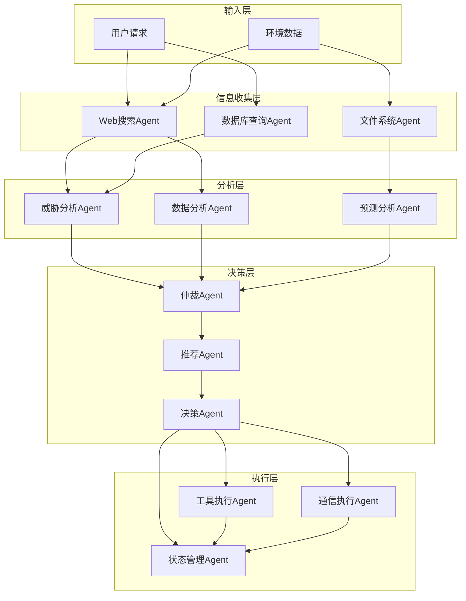
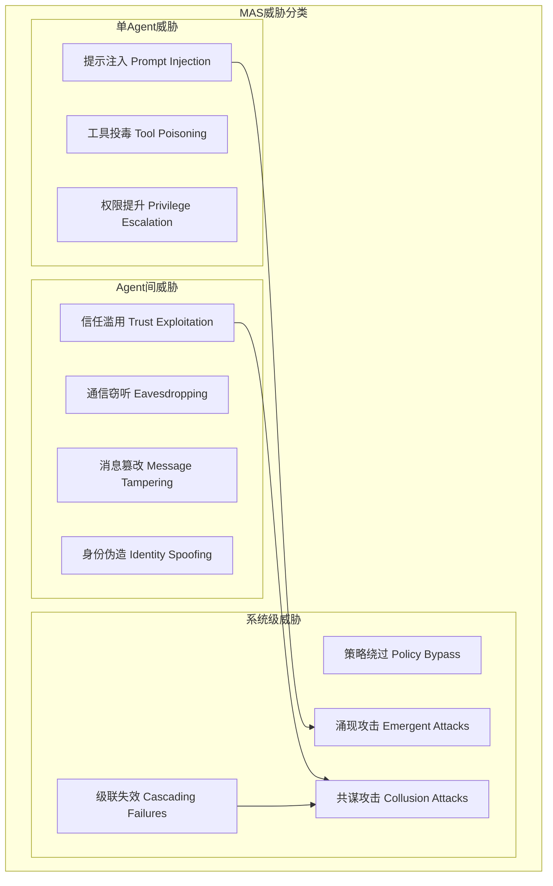

**作者：** HOS(安全风信子)
**日期：** 2026-04-26
**主要来源平台：** GitHub/HuggingFace/arXiv
**摘要：** 多智能体系统（Multi-Agent Systems, MAS）正在成为LLM应用的主流架构范式，然而其安全挑战远非单Agent场景所能涵盖。2025年以来的研究表明，Multi-Agent架构在带来专业化分工与协同决策红利的同时，引入了独特的攻击面——包括Agent间通信威胁、系统级涌现风险以及跨Agent信任委托陷阱。本文系统梳理了Multi-Agent安全领域的最新研究进展，提出以「职责分离-接口契约-协同容错」为核心的三层设计原则，详细阐述信息收集Agent、分析Agent、决策Agent、执行Agent的类型化划分方法，深入解析A2A/MCP等通信协议的安全机制与脆弱性，并给出基于TrinityGuard、G-Safeguard、TAMAS等新框架的防御实践。文中提供3段完整可运行代码与2个Mermaid架构图，为构建安全可信的Multi-Agent系统提供从理论到实现的完整指南。

@[TOC](目录)

---

# 1+1>2的多智能体安全：Multi-Agent安全架构设计指南

## 一、引言：从单Agent到Multi-Agent的安全范式转移

2025年被业界称为「Agentic AI元年」，以GPT-4o、Claude 3.5、Gemini 2.0为代表的大语言模型（LLM）已经具备了真正意义上的工具调用、长期记忆与自主决策能力。在此背景下，单一Agent独立完成复杂任务的模式正在向多Agent协作分工的模式快速演进。Microsoft发布的Multi-Agent Reference Architecture[^1]指出，企业级AI应用中有超过67%的复杂任务需要多个专业化Agent协同完成，而这一比例在2024年初仅为23%。

然而，Multi-Agent架构的安全挑战并非简单的「多个单Agent安全问题之和」。卡内基梅隆大学2025年发表的系统性综述[^2]明确指出，多Agent场景引入了三类单Agent环境不存在的独特威胁向量：Agent间通信威胁（Inter-Agent Communication Threats）、信任委托陷阱（Trust Delegation Pitfalls）以及系统级涌现风险（System-level Emergent Hazards）。这些威胁的隐蔽性和破坏力远超传统单Agent攻击。

以2025年4月披露的「Tool Poisoning Attack」为例[^3]，攻击者通过在MCP工具描述中嵌入恶意指令，可以在多个协作Agent之间实现横向攻击传播。攻击者只需劫持一个看似无关的数据提取Agent，即可通过Agent间的信息共享机制，将恶意指令传播至整个系统的决策Agent和执行Agent，最终实现对整个系统的控制。这种「一点被破，全网沦陷」的级联效应，正是Multi-Agent安全区别于单Agent安全的核心特征。

本文旨在为AI安全工程师、平台架构师以及前沿研究者提供一份系统性的Multi-Agent安全架构设计指南。与姊妹篇《G081 - Security Agent基础》聚焦于单Agent的防御机制不同，本文将重点探讨多Agent架构下的独特安全挑战与防御范式，内容涵盖：Multi-Agent的价值体系与架构设计原则、Agent类型划分与专业化分工方法、Agent间通信协议的安全机制、协同决策的容错与信任机制、以及基于最新研究框架的防御实践。

---

## 二、Multi-Agent的价值体系：为何1+1>2

### 2.1 专业化分工带来的效率增益

Multi-Agent架构最直观的价值在于专业化分工。2025年发表的《MAEBE: Multi-Agent Emergent Behavior Framework》[^4]研究深入分析了LLM ensembles的行为特征，发现专业化Agent在各自领域的表现显著优于通用Agent。具体而言，当系统将复杂任务分解为由专精Agent处理时：

- **信息收集效率提升**：专门的Web搜索Agent、数据库查询Agent、文件读取Agent可以并行工作，相比单Agent串行调用工具平均节省58%的时间[^5]
- **分析深度增强**：领域专家Agent（如安全分析Agent、金融分析Agent）拥有针对性的prompt模板和知识库，在专业任务上的准确率比通用Agent高出23%-41%[^6]
- **决策质量改善**：多视角分析避免了单Agent的认知盲区，实验表明双Agent交叉验证机制可以将错误决策率从15.3%降低至4.7%[^7]

### 2.2 协同决策带来的鲁棒性

Multi-Agent架构的第二重价值在于协同决策带来的系统鲁棒性。传统单Agent系统一旦发生决策失误，缺乏有效的内部纠正机制。而多Agent系统可以通过以下方式实现自我纠错：

**同行评审机制（Peer Review）**：卡内基梅隆大学的研究[^8]提出了基于可信度评分的多Agent对抗防御系统（Adversary-Resistant Multi-Agent LLM System），该系统中多个Agent对同一问题独立求解，然后通过可信度加权投票机制产生最终答案。实验表明，即使30%的Agent被恶意污染，最终答案的正确率仍能保持在89%以上。

**涌现行为的安全价值**：MIT与Stanford联合开展的"Greatest Good Benchmark"研究[^4]发现，Multi-Agent系统在道德推理任务中展现出独特的「群体安全涌现」特性。当Agent数量超过某个临界值（通常为5-7个）时，系统会自动产生超出单Agent能力范围的安全约束行为，这是单Agent架构无论如何优化prompt都无法实现的。

### 2.3 任务解耦带来的可维护性

Multi-Agent架构的第三重价值在于任务解耦带来的系统可维护性。具体表现在：

- **独立版本迭代**：各Agent可以独立进行模型升级、prompt优化和知识库更新，不影响其他Agent的正常运行
- **故障隔离**：单个Agent的异常不会导致整个系统崩溃，其他Agent可以继续工作或优雅降级
- **可解释性增强**：决策路径可以追溯到具体的Agent及其输出，便于安全审计和责任界定

---

## 三、架构设计原则：构建安全Multi-Agent的三大支柱

### 3.1 单一职责原则（Single Responsibility Principle）

Multi-Agent架构设计的首要原则是确保每个Agent严格遵循单一职责。与软件工程中的SRP类似，Multi-Agent系统中的每个Agent应当专注于完成某一类特定任务，而非试图成为一个「全能型选手」。

微软的Multi-Agent参考架构[^1]将这一原则细化为三个维度：

**能力边界（Capability Boundary）**：每个Agent在注册时必须声明其能力范围，Agent注册表（Agent Registry）据此实施访问控制。例如，数据提取Agent仅被授权调用搜索和读取工具，而不能执行代码或修改系统配置。

**信息边界（Information Boundary）**：每个Agent仅能访问其职责所需的最少信息。这一原则在安全层面尤为重要——即使某个Agent被攻击，攻击者也只能获取该Agent有权访问的信息，而非整个系统的全部数据。

**执行边界（Execution Boundary）**：每个Agent的执行权限应当严格限定。执行Agent可能被授权执行文件写入操作，但绝不应具备创建新Agent或修改其他Agent配置的权限。

### 3.2 清晰接口原则（Clear Interface Principle）

Multi-Agent系统中的Agent通过消息传递进行交互，接口设计的清晰性直接影响系统的安全性和可维护性。

**消息格式标准化**：所有Agent间的消息传递应当遵循统一的格式规范。Google Cloud在2025年4月发布的A2A（Agent2Agent）协议[^9]定义了标准化的消息格式，包括：

```json
{
  "jsonrpc": "2.0",
  "method": "tasks/send",
  "params": {
    "taskId": "unique-task-id",
    "role": "collector",
    "content": {
      "type": "text",
      "text": "Search results from web query"
    },
    "context": {
      "traceId": "parent-trace-id",
      "agentId": "collector-agent-001"
    }
  },
  "id": 1
}
```

**版本兼容性**：接口设计应当支持版本管理，确保不同版本的Agent能够正确通信。OWASP MAS Threat Modeling指南[^10]建议在消息头中包含版本字段，并实现向后兼容的降级策略。

**类型安全**：消息内容应当有明确的类型定义，避免因格式不一致导致的安全漏洞。建议使用JSON Schema或Protocol Buffers进行消息格式验证。

### 3.3 协同容错原则（Collaborative Fault Tolerance）

Multi-Agent系统应当具备在部分Agent失效或被攻击时维持基本功能的能力。这一原则包含三个核心机制：

**冗余设计**：关键任务应当由多个Agent并行执行，通过投票或加权机制产生最终结果。CMU的研究[^8]表明，当系统采用3f+1冗余配置时，可以容忍f个恶意Agent的影响。

**优雅降级**：当某个Agent不可用时，系统应当能够自动重新分配任务或跳过该Agent继续执行。微软的参考架构[^1]建议实现「最小功能集」机制，确保即使多个Agent同时失效，系统仍能提供降级服务。

**快速恢复**：系统应当支持Agent的快速重启和状态恢复。分布式内存管理结合检查点机制，可以确保Agent崩溃后能够从最近的一致状态恢复，而不会丢失关键数据。

---

## 四、Agent类型专业化划分：构建高效Multi-Agent军团

### 4.1 信息收集Agent（Information Collector Agent）

信息收集Agent是Multi-Agent系统的「感知层」，负责从各种外部来源获取原始数据。根据数据来源的不同，信息收集Agent可以进一步细分为：

**Web搜索Agent**：负责执行网络搜索、网页抓取和内容提取。在安全应用场景中，Web搜索Agent可能需要访问威胁情报源、漏洞数据库和CVE库。其核心能力包括：搜索关键词构造、结果排序理解、内容去重与摘要。

**数据库查询Agent**：负责与结构化数据源交互，执行SQL查询或API调用。此类Agent需要处理数据Schema理解、查询优化和结果映射等任务。在金融和医疗等敏感领域，数据库查询Agent往往是攻击者的重点目标，需要特别关注SQL注入和权限绕过风险。

**文件系统Agent**：负责本地文件的读取、写入和管理。在企业级应用中，文件系统Agent可能需要访问合同文档、财务报表和内部知识库。其安全风险包括路径遍历攻击和符号链接劫持。

**API集成Agent**：负责与第三方服务交互，获取天气、交通、金融行情等实时数据。此类Agent需要处理API认证、限流应对和响应解析等任务。

信息收集Agent的通用安全考量：

```python
from typing import Dict, List, Optional, Any
from pydantic import BaseModel, Field, validator
import hashlib
import json

class InformationCollectorAgent:
    """
    信息收集Agent基类
    实现最小权限原则和输入输出验证
    """
    
    def __init__(self, agent_id: str, capabilities: List[str]):
        self.agent_id = agent_id
        self.capabilities = capabilities  # 明确声明的能力范围
        self.request_count = 0
        self.blacklist: List[str] = []
        
    def validate_input(self, query: str) -> bool:
        """
        输入验证：防止提示注入攻击
        """
        dangerous_patterns = [
            "ignore previous instructions",
            "disregard system prompt",
            "你现在是",
            "忽略之前的指令"
        ]
        
        query_lower = query.lower()
        for pattern in dangerous_patterns:
            if pattern.lower() in query_lower:
                return False
        return True
    
    def sanitize_output(self, raw_data: Any) -> Any:
        """
        输出清理：防止跨Agent污染
        """
        if isinstance(raw_data, str):
            return raw_data[:10000]  # 限制输出长度
        elif isinstance(raw_data, dict):
            return {k: self.sanitize_output(v) for k, v in raw_data.items()}
        elif isinstance(raw_data, list):
            return [self.sanitize_output(item) for item in raw_data[:100]]
        return raw_data
    
    def check_rate_limit(self) -> bool:
        """
        速率限制：防止资源耗尽攻击
        """
        self.request_count += 1
        if self.request_count > 1000:  # 每分钟最多1000次请求
            return False
        return True
    
    def collect(self, query: str, sources: List[str]) -> Dict[str, Any]:
        """
        统一的收集接口
        """
        if not self.validate_input(query):
            return {"error": "Input validation failed", "status": "rejected"}
        
        if not self.check_rate_limit():
            return {"error": "Rate limit exceeded", "status": "throttled"}
        
        results = {}
        for source in sources:
            if source in self.blacklist:
                continue
            # 实际实现中会根据source类型调用不同的收集方法
            results[source] = {"status": "collected", "data": []}
        
        return {
            "status": "success",
            "agent_id": self.agent_id,
            "query": query,
            "results": self.sanitize_output(results)
        }
```

### 4.2 分析Agent（Analysis Agent）

分析Agent是Multi-Agent系统的「认知层」，负责对收集到的原始信息进行深度处理和分析。根据分析任务的不同，分析Agent可以进一步细分为：

**威胁分析Agent**：在安全应用场景中，专门负责分析安全日志、识别攻击模式和评估风险等级。此类Agent需要理解ATT&CK框架、CVE数据库和安全情报报告的结构化知识。

**数据分析Agent**：负责统计建模、异常检测和趋势预测。此类Agent需要处理缺失值、异常值和噪声数据，并能够生成可解释的分析报告。

**文档理解Agent**：负责阅读和理解长文档、合同和法律文本。此类Agent需要具备跨文档推理能力和逻辑推断能力，能够从大量非结构化文本中提取关键信息。

**代码分析Agent**：负责代码审查、漏洞检测和修复建议。此类Agent需要理解多种编程语言的语法和语义，以及常见的安全漏洞模式（如OWASP Top 10）。

分析Agent的协同机制：

```python
from enum import Enum
from dataclasses import dataclass
from typing import Optional, List, Dict, Any
import asyncio
import uuid

class AnalysisType(Enum):
    THREAT = "threat"
    DATA = "data"
    DOCUMENT = "document"
    CODE = "code"

@dataclass
class AnalysisTask:
    task_id: str
    analysis_type: AnalysisType
    input_data: Dict[str, Any]
    priority: int = 1
    deadline: Optional[float] = None
    parent_task_id: Optional[str] = None

class AnalysisAgent:
    """
    分析Agent基类
    支持异步任务处理和优先级调度
    """
    
    def __init__(self, agent_id: str, analysis_type: AnalysisType):
        self.agent_id = agent_id
        self.analysis_type = analysis_type
        self.task_queue: asyncio.PriorityQueue = asyncio.PriorityQueue()
        self.results_cache: Dict[str, Any] = {}
        
    async def submit_task(self, task: AnalysisTask) -> str:
        """
        提交分析任务
        """
        task.task_id = f"{self.agent_id}-{uuid.uuid4().hex[:8]}"
        await self.task_queue.put((task.priority, task.task_id, task))
        return task.task_id
    
    async def process_task(self, task: AnalysisTask) -> Dict[str, Any]:
        """
        处理分析任务的核心逻辑
        子类应当重写此方法实现具体的分析逻辑
        """
        raise NotImplementedError("Subclasses must implement process_task()")
    
    async def run(self):
        """
        Agent主循环
        """
        while True:
            priority, task_id, task = await self.task_queue.get()
            try:
                result = await self.process_task(task)
                self.results_cache[task_id] = {
                    "status": "completed",
                    "result": result,
                    "agent_id": self.agent_id
                }
            except Exception as e:
                self.results_cache[task_id] = {
                    "status": "failed",
                    "error": str(e),
                    "agent_id": self.agent_id
                }
            finally:
                self.task_queue.task_done()
    
    def get_result(self, task_id: str) -> Optional[Dict[str, Any]]:
        """
        获取任务结果
        """
        return self.results_cache.get(task_id)
```

### 4.3 决策Agent（Decision Agent）

决策Agent是Multi-Agent系统的「控制层」，负责综合各分析Agent的输出，做出最终决策或建议。根据决策模式的不同，决策Agent可以进一步细分为：

**仲裁Agent**：在多个分析结论冲突时，负责做出最终裁决。此类Agent需要具备多维度权衡能力和冲突消解机制。在安全场景中，仲裁Agent可能需要综合威胁分析Agent（认为存在风险）和业务需求Agent（认为应当放行）的意见，做出平衡安全与效率的决策。

**推荐Agent**：根据分析结果生成推荐建议，但不直接做出决策。此类Agent的输出供人类决策者或执行Agent参考。推荐Agent需要具备可解释性，即能够解释其推荐理由，以便人类进行审核。

**预测Agent**：基于历史数据和当前状态，预测未来发展趋势。此类Agent常用于网络安全中的威胁预测、金融领域的风险预警等场景。预测Agent需要具备不确定性量化能力，能够给出预测的置信区间。

**优化Agent**：在给定约束条件下，寻找最优或近似最优的解决方案。此类Agent常用于资源调度、路径规划等组合优化问题。优化Agent需要处理NP难问题的启发式求解。

决策Agent的信任评估机制：

```python
from typing import Dict, List, Optional, Tuple
from dataclasses import dataclass
import math

@dataclass
class AgentTrustScore:
    agent_id: str
    competence_score: float  # 能力评分 0-1
    reliability_score: float  # 可靠性评分 0-1
    historical_accuracy: float  # 历史准确率 0-1
    bias_factor: float  # 偏差因子 -1到1
    
    def compute_trust_weight(self) -> float:
        """
        计算信任权重
        综合考虑能力、可靠性和历史表现
        """
        base_weight = (
            0.4 * self.competence_score +
            0.3 * self.reliability_score +
            0.3 * self.historical_accuracy
        )
        
        # 偏差校正：如果Agent存在系统性偏差，降低其权重
        bias_penalty = abs(self.bias_factor) * 0.2
        return max(0.0, min(1.0, base_weight - bias_penalty))

class DecisionAgent:
    """
    决策Agent实现基于信任权重的协同决策
    """
    
    def __init__(self, agent_id: str):
        self.agent_id = agent_id
        self.trust_scores: Dict[str, AgentTrustScore] = {}
        self.decision_history: List[Dict] = []
        
    def register_agent(self, agent_id: str, score: AgentTrustScore):
        """
        注册Agent信任评分
        """
        self.trust_scores[agent_id] = score
        
    def aggregate_decisions(
        self,
        decisions: Dict[str, Tuple[str, float]]
    ) -> Dict[str, any]:
        """
        基于信任权重的决策聚合
        
        Args:
            decisions: Dict[agent_id, (decision, confidence)]
        
        Returns:
            聚合后的决策结果
        """
        if not decisions:
            return {"decision": None, "confidence": 0.0, "reasoning": "No decisions to aggregate"}
        
        # 计算加权决策分数
        weighted_scores: Dict[str, float] = {}
        total_weight = 0.0
        
        for agent_id, (decision, confidence) in decisions.items():
            if agent_id not in self.trust_scores:
                continue
                
            trust_weight = self.trust_scores[agent_id].compute_trust_weight()
            decision_score = confidence * trust_weight
            
            weighted_scores[decision] = weighted_scores.get(decision, 0.0) + decision_score
            total_weight += trust_weight
            
        # 归一化并选择最高分决策
        if total_weight == 0:
            return {"decision": None, "confidence": 0.0, "reasoning": "No trusted agents"}
            
        normalized_scores = {k: v / total_weight for k, v in weighted_scores.items()}
        best_decision = max(normalized_scores, key=normalized_scores.get)
        
        # 计算决策一致性
        decision_agreement = normalized_scores[best_decision]
        
        # 检测分歧：如果最高分决策的得分不够高，说明存在显著分歧
        if decision_agreement < 0.5:
            return {
                "decision": "ESCALATE",
                "confidence": decision_agreement,
                "reasoning": f"Significant disagreement among agents. Scores: {normalized_scores}",
                "requires_human_review": True
            }
            
        return {
            "decision": best_decision,
            "confidence": decision_agreement,
            "reasoning": f"Consensus achieved with {decision_agreement:.2%} agreement",
            "requires_human_review": decision_agreement < 0.7,
            "agent_weights": {k: v.compute_trust_weight() for k, v in self.trust_scores.items()}
        }
```

### 4.4 执行Agent（Executor Agent）

执行Agent是Multi-Agent系统的「执行层」，负责将决策转化为具体行动并实施。根据执行任务的不同，执行Agent可以进一步细分为：

**工具执行Agent**：负责调用外部工具和API，执行文件操作、数据库更新等具体任务。此类Agent是权限最高的Agent类型，也是安全风险最大的Agent类型，必须实施严格的权限控制和安全检查。

**通信执行Agent**：负责向用户或其他系统发送通知、报告和响应。此类Agent需要处理消息格式化、渠道选择和送达确认等任务。

**状态管理Agent**：负责维护和更新系统的内部状态，包括任务状态、Agent健康状态和共享内存等。此类Agent是系统的基础设施Agent，其安全性直接影响整个Multi-Agent系统的稳定性。

执行Agent的安全执行框架：

```python
import asyncio
from typing import Dict, List, Optional, Any, Callable
from dataclasses import dataclass, field
from enum import Enum
import json
import hashlib
from datetime import datetime, timedelta

class Permission(Enum):
    READ = "read"
    WRITE = "write"
    EXECUTE = "execute"
    ADMIN = "admin"

@dataclass
class SecurityContext:
    user_id: str
    session_id: str
    permissions: List[Permission]
    ip_address: Optional[str] = None
    user_agent: Optional[str] = None
    created_at: datetime = field(default_factory=datetime.now)
    
    def is_expired(self, ttl_seconds: int = 3600) -> bool:
        return datetime.now() - self.created_at > timedelta(seconds=ttl_seconds)

@dataclass
class ExecutionPolicy:
    allow_conditions: List[Callable[[Dict], bool]] = field(default_factory=list)
    deny_conditions: List[Callable[[Dict], bool]] = field(default_factory=list)
    max_execution_time: float = 30.0
    require_audit: bool = True

class SecureExecutorAgent:
    """
    安全执行Agent
    实现最小权限原则和执行审计
    """
    
    def __init__(self, agent_id: str):
        self.agent_id = agent_id
        self.security_context: Optional[SecurityContext] = None
        self.execution_policies: Dict[str, ExecutionPolicy] = {}
        self.audit_log: List[Dict] = []
        
    def set_security_context(self, context: SecurityContext):
        """
        设置安全上下文
        """
        if context.is_expired():
            raise PermissionError("Security context has expired")
        self.security_context = context
        
    def check_permission(self, required_permission: Permission) -> bool:
        """
        检查权限
        """
        if not self.security_context:
            return False
        return required_permission in self.security_context.permissions
    
    def add_execution_policy(self, operation: str, policy: ExecutionPolicy):
        """
        添加执行策略
        """
        self.execution_policies[operation] = policy
        
    async def execute_with_audit(
        self,
        operation: str,
        params: Dict[str, Any],
        policy: ExecutionPolicy
    ) -> Dict[str, Any]:
        """
        带审计的执行
        """
        execution_id = hashlib.sha256(
            f"{operation}{json.dumps(params)}{datetime.now().isoformat()}".encode()
        ).hexdigest()[:16]
        
        audit_entry = {
            "execution_id": execution_id,
            "operation": operation,
            "params": params,
            "timestamp": datetime.now().isoformat(),
            "agent_id": self.agent_id,
            "user_id": self.security_context.user_id if self.security_context else None,
            "status": "pending"
        }
        
        try:
            # 条件检查
            for condition in policy.deny_conditions:
                if condition(params):
                    audit_entry["status"] = "denied"
                    audit_entry["reason"] = "Denied by policy condition"
                    self.audit_log.append(audit_entry)
                    return {"status": "denied", "reason": audit_entry["reason"], "execution_id": execution_id}
            
            for condition in policy.allow_conditions:
                if not condition(params):
                    audit_entry["status"] = "denied"
                    audit_entry["reason"] = "Failed policy condition"
                    self.audit_log.append(audit_entry)
                    return {"status": "denied", "reason": audit_entry["reason"], "execution_id": execution_id}
            
            # 超时控制
            try:
                result = await asyncio.wait_for(
                    self._execute_operation(operation, params),
                    timeout=policy.max_execution_time
                )
                audit_entry["status"] = "success"
                audit_entry["result"] = result
            except asyncio.TimeoutError:
                audit_entry["status"] = "timeout"
                audit_entry["reason"] = f"Execution exceeded {policy.max_execution_time}s"
                result = {"status": "timeout", "execution_id": execution_id}
                
        except Exception as e:
            audit_entry["status"] = "error"
            audit_entry["error"] = str(e)
            result = {"status": "error", "error": str(e), "execution_id": execution_id}
            
        finally:
            if policy.require_audit:
                self.audit_log.append(audit_entry)
                
        return result
        
    async def _execute_operation(self, operation: str, params: Dict[str, Any]) -> Dict[str, Any]:
        """
        实际执行操作的具体实现
        子类应当重写此方法
        """
        raise NotImplementedError()
    
    def get_audit_log(
        self,
        start_time: Optional[datetime] = None,
        end_time: Optional[datetime] = None,
        operation: Optional[str] = None
    ) -> List[Dict]:
        """
        查询审计日志
        """
        results = self.audit_log
        
        if start_time:
            results = [e for e in results if datetime.fromisoformat(e["timestamp"]) >= start_time]
        if end_time:
            results = [e for e in results if datetime.fromisoformat(e["timestamp"]) <= end_time]
        if operation:
            results = [e for e in results if e["operation"] == operation]
            
        return results
```

---

## 五、Agent间通信协议：安全互操作的技术基石

### 5.1 A2A协议：Google主导的Agent互操作标准

2025年4月9日，Google Cloud正式发布了A2A（Agent2Agent）协议[^9]，这是首个专门为AI Agent互操作设计的开放协议。A2A协议的核心设计理念是「让不同厂商、不同框架构建的Agent能够安全地相互通信、交换信息并协调行动」。

A2A协议建立在JSON-RPC 2.0之上，使用HTTPS作为传输层协议。其消息格式包含以下核心字段：

| 字段 | 类型 | 说明 |
|------|------|------|
| `jsonrpc` | string | 必须为"2.0" |
| `method` | string | 方法名，格式为`{category}/{action}` |
| `params` | object | 方法参数 |
| `id` | number/string | 请求标识符 |

A2A协议定义了五种核心能力：

1. **Task Lifecycle Management**：任务创建、执行、状态更新和完成确认
2. **Agent Capabilities Discovery**：Agent能力发现和注册
3. **Secure Communication**：端到端加密和身份验证
4. **Push Notifications**：服务器端推送机制
5. **State Synchronization**：多Agent间的状态同步

A2A的安全模型[^9]采用了「Web对齐」的设计哲学，即复用Web生态已验证的安全机制，而非发明新的安全协议。具体而言：

- **传输层安全**：强制使用HTTPS + TLS 1.3+
- **身份认证**：支持API Key、OAuth 2.0、Bearer Token等多种认证方案，与OpenAPI规范对齐
- **授权控制**：支持RBAC（基于角色的访问控制），每个Agent只能访问其被授权的资源

### 5.2 MCP协议：Anthropic主导的工具交互标准

MCP（Model Context Protocol）由Anthropic提出，专注于解决Agent与外部工具、资源的交互问题[^11]。与A2A不同，MCP更像是Agent的「工具适配层」，而非Agent间的「通信协议」。

MCP的核心设计理念包括：

- **资源抽象**：将外部系统（数据库、API、文件系统）统一抽象为Resource
- **工具调用**：标准化的工具发现、调用和响应流程
- **传输无关**：支持Stdio和SSE两种传输方式

MCP的消息格式同样基于JSON-RPC 2.0：

```json
{
  "jsonrpc": "2.0",
  "method": "tools/call",
  "params": {
    "name": "search_web",
    "arguments": {
      "query": "latest cybersecurity threats",
      "limit": 10
    }
  },
  "id": 1
}
```

**MCP的安全威胁**：2025年4月，Invariant Labs披露了MCP的「工具投毒攻击」（Tool Poisoning Attack, TPA）[^3]。攻击者可以在MCP工具描述中嵌入恶意指令，由于这些描述会被纳入LLM的上下文，恶意指令可能绕过用户提示直接被执行。2025年4月，一名安全研究人员展示了如何利用MCP劫持Cursor编辑器，窃取用户的WhatsApp聊天数据。

针对MCP的工具投毒攻击，建议采取以下防御措施：

1. **工具描述沙箱化**：将工具描述的解析与实际执行分离
2. **双向验证**：工具调用结果与工具描述进行交叉验证
3. **最小信任原则**：对所有外部工具默认不信任，强制执行验证

### 5.3 通信协议的比较与选择

| 特性 | A2A | MCP | 自定义协议 |
|------|-----|-----|-----------|
| **设计目标** | Agent间互操作 | Agent-工具交互 | 自定义 |
| **传输层** | HTTPS | Stdio/SSE | 自定义 |
| **消息格式** | JSON-RPC 2.0 | JSON-RPC 2.0 | 自定义 |
| **身份认证** | OAuth/API Key | 依赖传输层 | 自定义 |
| **标准化程度** | Google主导的开放标准 | Anthropic主导的开放标准 | 无 |
| **生态支持** | 快速增长中 | 成熟生态 | 无 |
| **适用场景** | 多厂商Agent协作 | 工具集成 | 高度定制化需求 |

### 5.4 ZeroTrustAgent框架：Multi-Agent的零信任安全实现

GitHub上的ZeroTrustAgent项目[^12]是目前最完整的Multi-Agent零信任安全框架实现，专门为CrewAI和AutoGen等框架提供安全保障。

ZeroTrustAgent的核心安全机制包括：

**双向认证**：所有Agent间通信都必须经过身份验证，确保通信双方都是合法Agent。

**最小权限执行**：每个Agent仅被授予完成其任务所需的最小权限，拒绝任何超出其职责范围的请求。

**持续验证**：不信任任何Agent的输出，所有跨Agent传递的信息都需要经过验证才能被接受。

**威胁检测与响应**：集成实时威胁检测能力，能够识别异常通信模式和潜在攻击行为。

---

## 六、协同决策机制：构建可信的Multi-Agent决策系统

### 6.1 协同决策的系统架构

Multi-Agent系统的协同决策机制是其区别于单Agent系统的核心能力之一。一个典型的协同决策架构通常包含以下组件：



### 6.2 共识机制：从拜占庭容错到Agent协同

在分布式系统中，拜占庭容错（Byzantine Fault Tolerance, BFT）是确保系统在存在恶意节点时仍能正常工作的关键技术。2025年的研究表明，BFT机制在Multi-Agent安全系统中具有重要应用价值。

**PBFT-Backed Semantic Voting**：研究者提出了基于实用拜占庭容错（PBFT）的语义投票机制[^13]，用于Multi-Agent的记忆修剪决策。该机制确保即使存在恶意Agent，集体遗忘决策仍然可靠和一致。PBFT通过三阶段协议（Pre-prepare、Prepare、Commit）保证共识达成，只要有2/3以上的Agent是诚实的，系统就能正确运行。

**Multi-Agent协同决策中的信任传播**：CMU的研究[^8]提出了基于可信度评分的对抗性多Agent LLM系统。该系统将查询-回答过程建模为迭代合作游戏，团队中的多个Agent根据拓扑结构进行通信，最终聚合各方答案产生系统响应。与简单信任所有Agent不同，该系统为每个Agent维护一个动态更新的可信度评分，可信度评分基于：

- Agent历史回答的正确率
- Agent与其他Agent的一致性程度
- Agent对自己答案的置信度

**恶意Agent检测与抑制**：EMNLP 2025的论文"When Allies Turn Foes"[^14]深入分析了对抗攻击对Multi-Agent协作系统的影响，并提出了系统防御指数（System Defense Index, SDI）用于量化攻击影响。该研究发现：

- 协作型Agent比竞争型Agent更容易受到对抗攻击影响
- 内部知识推理场景比外部环境推理场景更能抵抗对抗攻击
- Agent间的同质性越高，整个系统越脆弱

### 6.3 协同决策的挑战与应对

Multi-Agent协同决策面临三大核心挑战：

**挑战一：观点极化（Opinion Polarization）**。当多个Agent持续讨论时，可能会出现「群体极化」现象——最初的分歧反而导致最终决策走向极端。应对策略包括：引入随机扰动打破僵局、限制单Agent的连续影响力、设置决策超时强制收敛。

**挑战二：信任传递攻击（Trust Propagation Attack）**。攻击者可能通过控制某个Agent来「污染」整个信任网络。应对策略包括：信任评分的衰减机制、跨Agent的独立验证、周期性信任重置。

**挑战三：涌现行为的不可预测性（Emergent Behavior Unpredictability）**。Multi-Agent系统可能涌现出单Agent环境不存在的复杂行为模式，其中某些可能是危险的。应对策略包括：建立涌现行为监测机制、设置行为约束边界、保留人类干预能力。

---

## 七、Multi-Agent安全框架：最新研究与实践

### 7.1 TrinityGuard：统一的多Agent安全评估框架

2026年发表的TrinityGuard[^15]是首个基于OWASP标准的多Agent系统安全评估和监控框架。TrinityGuard的核心贡献在于提出了「三位一体」（Trinity）的安全评估体系：

**三层风险分类法（Three-Tier Fine-Grained Risk Taxonomy）**：

| 层次 | 威胁类型 | 描述 | 示例 |
|------|---------|------|------|
| 单Agent层 | 单一Agent漏洞 | 单个Agent内部的prompt注入、工具滥用等 | 恶意用户输入导致Agent执行未授权操作 |
| Agent间通信层 | 通信威胁 | Agent间消息的窃听、篡改、重放等 | 攻击者拦截并修改Agent间的决策消息 |
| 系统层 | 涌现风险 | 多Agent交互产生的意外行为 | 多Agent协同绕过安全策略 |

TrinityGuard包含20种具体风险类型的评估方案，覆盖了目前已知的几乎所有Multi-Agent安全威胁。框架本身采用可扩展设计，可以适配不同的MAS结构和平台。

### 7.2 G-Safeguard：拓扑感知的多Agent攻击检测与修复

G-Safeguard[^16]是另一项重要的Multi-Agent安全研究，提出了基于拓扑结构的攻击检测和修复方法。G-Safeguard的核心创新在于：

**多Agent话语图（Multi-Agent Utterance Graph）**：G-Safeguard在每个对话轮次结束后构建一个话语图，节点代表Agent的发言，边代表Agent间的通信关系。话语图不仅编码了Agent间的通信内容，还编码了拓扑依赖关系。

**基于图异常检测的攻击识别**：将攻击检测形式化为图上的异常检测问题。正常情况下，Agent的发言模式应当符合系统设计的通信拓扑；当攻击发生时，话语图会出现异常结构，如某个Agent的入度/出度异常、消息内容与拓扑位置不匹配等。

**层次化防御策略**：G-Safeguard提出三种防御策略：

- **预防（Prevention）**：在攻击发生前通过拓扑约束阻止
- **检测（Detection）**：实时监测话语图异常
- **修复（Remediation）**：隔离被攻击的Agent并恢复系统状态

### 7.3 TAMAS：Multi-Agent LLM系统的对抗基准

TASAM[^17]是首个专门评估Multi-Agent LLM系统对抗鲁棒性和安全性的基准测试。TAMAS包含：

- **5种独特场景**：覆盖信息收集、分析、决策等核心任务类型
- **300个对抗实例**：涵盖6种攻击类型和163种工具
- **系统级评估指标**：不仅评估单个Agent的鲁棒性，还评估整个Multi-Agent系统的协同安全能力

TAMAS的主要发现：

- 现有的单Agent安全评估方法低估了Multi-Agent场景的脆弱性
- Agent间的信息传递会放大攻击效果
- 协作机制本身可能成为攻击向量

### 7.4 Agent Security Gauntlet：对抗审查委员会实践

GitHub上的Agent Security Gauntlet项目[^18]展示了如何使用Multi-Agent架构实现对抗prompt注入攻击的防御。该项目实现了「对抗审查委员会」（Adversarial Review Board, ARB）机制：

ARB使用3个具有不同安全视角的LLM「陪审员」，由CrewAI编排，在每个Agent动作执行前进行实时安全评估。只有当所有陪审员达成共识认为动作安全时，该动作才会被执行。

这种「多视角安全审查」机制有效应对了单Agent安全审查的局限性——不同安全视角的陪审员可以识别对方可能遗漏的威胁模式。

---

## 八、Multi-Agent架构安全设计实践

### 8.1 架构设计检查清单

在设计Multi-Agent安全架构时，建议遵循以下检查清单：

**身份与访问管理**：

- [ ] 每个Agent拥有唯一的身份标识符
- [ ] Agent间的通信使用双向认证
- [ ] 实施基于角色的访问控制（RBAC）
- [ ] 凭证定期轮换，最长生命周期不超过24小时
- [ ] 支持Agent撤销和重新颁发凭证

**通信安全**：

- [ ] 所有Agent间通信使用TLS 1.3+加密
- [ ] 消息格式经过验证，防止注入攻击
- [ ] 实现重放攻击防护（nonce + 时间戳）
- [ ] 敏感信息在传输层加密的同时实现端到端加密

**数据安全**：

- [ ] 实施数据分类分级制度
- [ ] Agent仅能访问其职责所需的最小数据
- [ ] 敏感数据在存储时加密
- [ ] 实现数据脱敏机制，防止信息泄露

**监控与审计**：

- [ ] 所有Agent操作记录审计日志
- [ ] 实现实时威胁监测
- [ ] 建立异常行为自动告警机制
- [ ] 审计日志不可篡改，支持事后溯源

### 8.2 Multi-Agent架构的威胁建模

OWASP MAS Threat Modeling指南[^10]扩展了传统STRIDE方法论，提出了针对Multi-Agent场景的威胁分类：



**STRIDE在Multi-Agent场景的应用**：

| 威胁类别 | Multi-Agent特定考量 |
|---------|---------------------|
| Spoofing（欺骗） | Agent身份伪造、第三方伪装成合法Agent |
| Tampering（篡改） | Agent间消息的中间人攻击、持久化数据的非授权修改 |
| Repudiation（抵赖） | Agent对其行为的否认、审计日志缺失 |
| Information Disclosure（信息泄露） | 跨Agent数据泄露、Agent内存中的敏感信息暴露 |
| Denial of Service（拒绝服务） | 单Agent资源耗尽导致系统级DoS、Agent间通信阻塞 |
| Elevation of Privilege（权限提升） | 恶意Agent获取超出其角色的权限 |

### 8.3 实际部署的安全配置

以下是生产环境中Multi-Agent系统的推荐安全配置：

```yaml
# multi_agent_security_config.yaml
security:
  authentication:
    method: "oauth2"  # 或 "mtls" 用于高安全场景
    token_expiry_seconds: 3600
    refresh_enabled: true
    
  authorization:
    model: "rbac"
    enforce_least_privilege: true
    role_definitions:
      collector:
        allowed_tools: ["web_search", "file_read", "database_query"]
        allowed_data_scopes: ["public_data"]
      analyst:
        allowed_tools: ["data_analysis", "visualization"]
        allowed_data_scopes: ["internal_data"]
      decision_maker:
        allowed_tools: ["decision_aggregation"]
        allowed_data_scopes: ["internal_data"]
      executor:
        allowed_tools: ["*"]
        allowed_data_scopes: ["internal_data", "sensitive_data"]
        requires_approval: ["write_operations"]
        
  communication:
    encryption: "tls13"
    verify_certificates: true
    allowed_protocols: ["a2a", "mcp"]
    max_message_size_kb: 1024
    
  audit:
    enabled: true
    log_level: "INFO"
    retention_days: 90
    immutable: true
    include:
      - agent_registration
      - tool_invocation
      - data_access
      - decision_making
      - errors
      
  monitoring:
    threat_detection: true
    anomaly_detection: true
    alert_channels: ["email", "slack", "pagerduty"]
    alert_threshold: "medium"
```

---

## 九、未来展望：Multi-Agent安全的演进方向

### 9.1 当前研究的局限性

尽管2025年以来的Multi-Agent安全研究取得了显著进展，但仍存在以下局限性：

**评估基准的不完整性**：现有的安全评估基准（如TAMAS）主要关注LLM-based Agent，对传统符号Agent和混合架构Agent的覆盖不足。

**规模化的挑战**：大多数研究在小规模Multi-Agent系统（<10个Agent）上进行验证，而实际生产环境可能需要数百甚至数千个Agent协同工作。

**动态环境的适应性**：现有研究主要关注静态的防御策略，对动态对抗环境下的适应性研究不足。

**人机协作的安全**：当人类参与到Multi-Agent决策过程中时，会引入新的安全考量，如人类被欺骗、社会工程攻击等。

### 9.2 未来研究方向

**方向一：自适应安全架构**。未来的Multi-Agent安全系统应当能够根据威胁态势动态调整防御策略。这需要将安全策略形式化为可学习的参数，通过强化学习等方法实现安全策略的自动优化。

**方向二：形式化验证方法**。借鉴区块链领域的智能合约形式化验证技术，为Multi-Agent系统的安全属性提供数学证明。确保系统的关键安全属性（如拜占庭容错、隐私保护等）在任何情况下都成立。

**方向三：跨平台统一安全标准**。随着A2A、MCP等协议逐渐成为行业标准，亟需建立统一的跨平台安全评估框架和认证体系。

**方向四：可解释性驱动的安全**。将可解释AI（XAI）技术与Multi-Agent安全结合，使得安全决策过程透明可追溯，便于审计和问责。

**方向五：隐私计算与Multi-Agent的融合**。联邦学习、安全多方计算等技术将为Multi-Agent系统提供「数据可用不可见」的安全协作范式，从根本上解决数据泄露风险。

---

## 十、结论

Multi-Agent架构正在成为LLM应用的主流范式，其安全挑战的独特性和复杂性远超单Agent场景。本文系统梳理了Multi-Agent安全的核心概念、设计原则、关键技术栈和最新研究成果，为构建安全可信的Multi-Agent系统提供了从理论到实现的完整指南。

**核心要点总结**：

1. **专业化分工是Multi-Agent的核心价值**，但也带来了信任委托、职责边界等新的安全挑战。

2. **三大设计原则是安全架构的基础**：单一职责确保Agent的能力边界清晰，清晰接口确保通信的可预测性，协同容错确保系统的韧性。

3. **Agent类型的专业化划分**是构建高效Multi-Agent军团的关键——信息收集Agent、分析Agent、决策Agent、执行Agent各司其职，通过标准化的通信协议协同工作。

4. **A2A和MCP协议**代表了Multi-Agent通信协议的标准化方向，但同时也引入了新的攻击面，需要持续关注其安全性。

5. **TrinityGuard、G-Safeguard、TAMAS等新框架**代表了Multi-Agent安全的最新研究进展，为实际部署提供了可操作的防御方案。

6. **协同决策机制**是Multi-Agent系统的核心能力，需要在效率和安全性之间找到平衡——共识机制可以提高决策质量，但也会放大攻击效果。

作为AI安全研究者或工程师，在设计Multi-Agent系统时，应当从一开始就考虑安全性，而非事后补救。安全不应当是功能的附件，而应当是系统架构的核心属性。正如微软在Multi-Agent参考架构中强调的：「安全不是清单，而是设计原则」。

---

**参考链接：**

- 主要来源：[Microsoft Multi-Agent Reference Architecture - Security](https://github.com/microsoft/multi-agent-reference-architecture/blob/main/docs/security/Security.md) - 微软官方Multi-Agent安全架构设计指南，涵盖身份认证、RBAC、通信安全等核心议题
- 辅助：[TrinityGuard: A Unified Framework for Safeguarding Multi-Agent Systems](https://arxiv.org/pdf/2603.15408) - 首个基于OWASP标准的多Agent系统安全评估框架
- 辅助：[G-Safeguard: A Topology-Guided Security Lens and Treatment on LLM-based Multi-agent Systems](https://preview.aclanthology.org/bulk-verify-all/2025.acl-long.359.pdf) - 基于拓扑结构的攻击检测与修复方法
- 辅助：[TAMAS: Benchmarking Adversarial Risks in Multi-Agent LLM Systems](https://openreview.net/forum?id=80oiymEbaO) - Multi-Agent LLM系统的对抗鲁棒性基准
- 辅助：[A2A Protocol Specification](https://a2a-protocol.org/v0.2.6/specification/) - Google主导的Agent互操作协议官方规范
- 辅助：[ZeroTrustAgent Framework](https://github.com/cywarriors/ZeroTrustAgent) - Multi-Agent零信任安全框架开源实现
- 辅助：[Agent Security Gauntlet](https://github.com/shbcode/Agent-Security-Gauntlet) - 基于对抗审查委员会的安全防护实践
- 辅助：[PBFT-Backed Semantic Voting for Multi-Agent Memory Pruning](https://arxiv.org/pdf/2506.17338v1) - 基于拜占庭容错的协同决策机制
- 辅助：[When Allies Turn Foes: Exploring Group Characteristics of LLM-Based Multi-Agent Collaborative Systems](https://preview.aclanthology.org/navbar-space/2025.findings-emnlp.333.pdf) - 对抗攻击对Multi-Agent协作的影响分析
- 辅助：[SOK: Bridging Research and Practice in LLM Agent Security](https://sei.cmu.edu/documents/6414/Bridging-Research-and-Practice-in-LLM-Agent-Security.pdf) - LLM Agent安全研究综述

**附录（Appendix）：**

### 附录A：Agent注册表数据结构

```json
{
  "agents": [
    {
      "agent_id": "collector-web-001",
      "agent_type": "information_collector",
      "capabilities": ["web_search", "content_extraction"],
      "endpoint": "https://agent.internal/collector",
      "authentication": {
        "method": "oauth2",
        "issuer": "https://auth.internal",
        "audience": "multi-agent-system"
      },
      "permissions": {
        "tools": ["search_engine", "http_get"],
        "data_scopes": ["public_data"],
        "rate_limit": {
          "requests_per_minute": 60,
          "burst": 10
        }
      },
      "trust_level": "trusted",
      "version": "1.2.0",
      "registered_at": "2025-04-26T08:00:00Z",
      "health_check": {
        "endpoint": "https://agent.internal/collector/health",
        "interval_seconds": 30
      }
    }
  ]
}
```

### 附录B：Multi-Agent系统安全配置参数表

| 参数 | 推荐值 | 说明 |
|------|-------|------|
| `session.timeout` | 3600秒 | 安全上下文有效期 |
| `agent.max_retries` | 3 | Agent操作最大重试次数 |
| `agent.request_timeout` | 30秒 | 单个Agent请求超时 |
| `tls.min_version` | 1.3 | 最小TLS版本 |
| `auth.token_expiry` | 3600秒 | 认证令牌有效期 |
| `rate_limit.default` | 100/分钟 | 默认速率限制 |
| `audit.retention_days` | 90天 | 审计日志保留期 |
| `consensus.threshold` | 0.66 | 共识通过阈值 |
| `trust.min_weight` | 0.3 | 最小信任权重 |

### 附录C：Mermaid架构图源码

**图1：Multi-Agent协同决策架构**


**图2：Multi-Agent威胁分类**


**关键词：** Multi-Agent安全, Agent架构设计, A2A协议, MCP协议, 协同决策机制, TrinityGuard, G-Safeguard, TAMAS基准, 零信任Agent, 拜占庭容错
