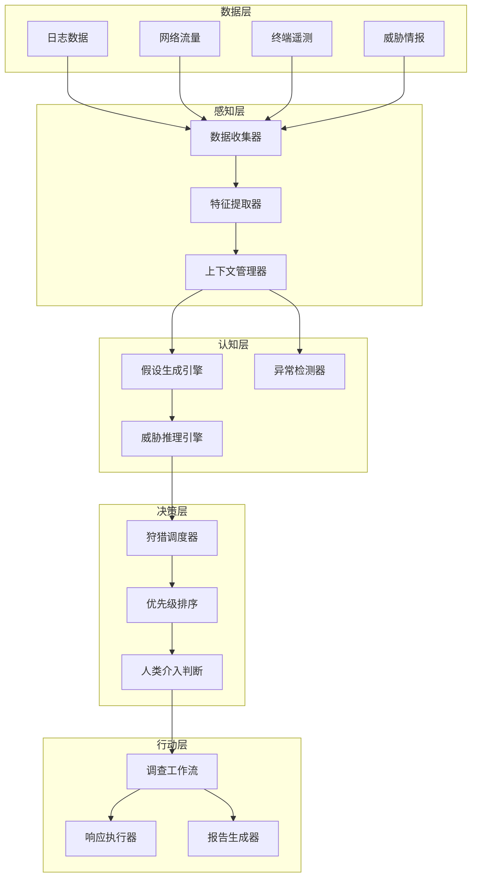

**作者：** HOS(安全风信子)
**日期：** 2026-04-26
**主要来源平台：** GitHub / arXiv / HuggingFace / TechRxiv
**摘要：** 威胁狩猎作为主动防御的核心实践，正在经历从人工驱动向AI驱动的范式转变。本文深入探讨Threat Hunting Agent的完整设计与实现框架，涵盖假设生成引擎、神经符号推理架构、自适应狩猎知识库等关键模块。通过整合MITRE ATT&CK v16最新战术框架与2025-2026年发布的Cyber Defense Benchmark评估标准，构建了一套可验证的自主狩猎能力评估体系。

@[TOC](目录)

---

# 主动出击的AI猎手：Threat Hunting Agent设计实战

## 1 引言：威胁狩猎的范式转变

### 1.1 从被动防御到主动狩猎

传统安全运营采用被动防御模式，等待告警后才进行响应。这种模式在面对高级持续性威胁（APT）时存在明显短板，因为攻击者往往在网络中潜伏数月才被发现。威胁狩猎（Threat Hunting）作为一种主动防御实践，要求安全团队主动出击，在攻击造成损害之前发现和消除威胁。

AI驱动的威胁狩猎代表了安全运营的重大升级。传统狩猎高度依赖经验丰富的分析师，而AI系统可以7x24小时不间断地分析海量数据，从中发现人类难以察觉的异常模式。

### 1.2 Threat Hunting Agent的核心价值

Threat Hunting Agent是专门用于威胁狩猎的AI智能体，它能够：

**自动化假设生成**：基于威胁情报和历史数据自动生成狩猎假设，无需人工干预。

**智能异常检测**：利用机器学习和符号推理发现隐藏在正常流量中的恶意行为。

**自适应知识进化**：从每次狩猎活动中学习，不断提升检测能力。

**人机协作**：在关键决策点引入人类专家判断，确保狩猎方向的准确性。

## 2 系统架构设计

### 2.1 整体架构概览

Threat Hunting Agent采用多层次架构设计，各层协同工作实现智能化的威胁狩猎能力。



### 2.2 核心组件设计

```python
class ThreatHuntingAgent:
    """威胁狩猎Agent"""

    def __init__(self, config: HuntingConfig):
        self.config = config
        self.data_collector = DataCollector()
        self.feature_extractor = FeatureExtractor()
        self.hypothesis_generator = HypothesisGenerator()
        self.anomaly_detector = AnomalyDetector()
        self.threat_reasoner = ThreatReasoner()
        self.hunting_scheduler = HuntingScheduler()
        self.workflow_engine = WorkflowEngine()
        self.knowledge_base = HuntingKnowledgeBase()

    async def start_hunting(
        self,
        hunting_type: str = 'automated'
    ) -> HuntingResult:
        """启动威胁狩猎"""
        hypotheses = await self.hypothesis_generator.generate()

        prioritized = await self._prioritize_hypotheses(hypotheses)

        results = []
        for hypothesis in prioritized:
            if hypothesis.requires_human_review:
                human_decision = await self._request_human_input(hypothesis)
                if not human_decision.approved:
                    continue

            result = await self._investigate_hypothesis(hypothesis)
            results.append(result)

            await self.knowledge_base.update(result)

        return HuntingResult(
            hypotheses_tested=len(prioritized),
            findings=results,
            recommendations=await self._generate_recommendations(results)
        )

    async def _investigate_hypothesis(
        self,
        hypothesis: Hypothesis
    ) -> InvestigationResult:
        """调查假设"""
        data = await self.data_collector.collect(hypothesis.required_data_sources)

        features = await self.feature_extractor.extract(data, hypothesis)

        anomalies = await self.anomaly_detector.detect(features, hypothesis)

        threat_context = await self.threat_reasoner.analyze(
            anomalies,
            hypothesis
        )

        return InvestigationResult(
            hypothesis=hypothesis,
            anomalies=anomalies,
            threat_context=threat_context,
            confidence=self._calculate_confidence(threat_context)
        )
```

## 3 假设生成引擎

### 3.1 自动化假设生成

假设是威胁狩猎的起点。好的假设应该基于威胁情报、攻击模式和历史发现。

```python
class HypothesisGenerator:
    """假设生成引擎"""

    def __init__(self, llm: LLMInterface, intel_client: IntelClient):
        self.llm = llm
        self.intel_client = intel_client
        self.pattern_matcher = PatternMatcher()
        self.attack_graph = AttackGraph()

    async def generate(self) -> List[Hypothesis]:
        """生成狩猎假设"""
        hypotheses = []

        ioc_hypotheses = await self._generate_from_iocs()
        hypotheses.extend(ioc_hypotheses)

        ttp_hypotheses = await self._generate_from_ttps()
        hypotheses.extend(ttp_hypotheses)

        anomaly_hypotheses = await self._generate_from_anomalies()
        hypotheses.extend(anomaly_hypotheses)

        intelligence_hypotheses = await self._generate_from_intelligence()
        hypotheses.extend(intelligence_hypotheses)

        return await self._rank_and_filter(hypotheses)

    async def _generate_from_iocs(self) -> List[Hypothesis]:
        """基于IOC生成假设"""
        active_iocs = await self.intel_client.get_active_iocs()

        hypotheses = []
        for ioc in active_iocs:
            hypothesis = Hypothesis(
                id=str(uuid.uuid4()),
                title=f"检查IOC相关活动: {ioc.value}",
                description=f"调查与{ioc.type} {ioc.value}相关的可疑活动",
                ioc=ioc,
                data_sources=['logs', 'network', 'endpoints'],
                priority='high'
            )
            hypotheses.append(hypothesis)

        return hypotheses

    async def _generate_from_ttps(self) -> List[Hypothesis]:
        """基于TTP生成假设"""
        relevant_ttps = await self.attack_graph.get_relevant_ttps()

        hypotheses = []
        for ttp in relevant_ttps:
            hypothesis = Hypothesis(
                id=str(uuid.uuid4()),
                title=f"狩猎{ttp.name}攻击模式",
                description=f"搜索符合{ttp.name}（{ttp.id}）战术特征的活动",
                ttp=ttp,
                data_sources=['logs', 'network'],
                priority='medium'
            )
            hypotheses.append(hypothesis)

        return hypotheses

    async def _generate_from_intelligence(self) -> List[Hypothesis]:
        """基于威胁情报生成假设"""
        latest_intel = await self.intel_client.get_latest_intel()

        hypotheses = []
        for intel in latest_intel:
            if intel.confidence < 0.7:
                continue

            hypothesis = Hypothesis(
                id=str(uuid.uuid4()),
                title=f"验证威胁情报: {intel.title}",
                description=intel.description,
                intelligence=intel,
                data_sources=intel.affected_systems,
                priority='high' if intel.severity == 'critical' else 'medium'
            )
            hypotheses.append(hypothesis)

        return hypotheses
```

### 3.2 假设优先级排序

```python
class HypothesisPrioritizer:
    """假设优先级排序器"""

    def __init__(self, risk_calculator: RiskCalculator):
        self.risk_calculator = risk_calculator
        self.feasibility_evaluator = FeasibilityEvaluator()

    async def prioritize(
        self,
        hypotheses: List[Hypothesis],
        available_resources: Resources
    ) -> List[Hypothesis]:
        """对假设进行优先级排序"""
        scored_hypotheses = []

        for hypothesis in hypotheses:
            risk_score = await self.risk_calculator.calculate(hypothesis)

            feasibility = await self.feasibility_evaluator.evaluate(
                hypothesis,
                available_resources
            )

            priority_score = (
                risk_score * 0.6 +
                feasibility * 0.4
            )

            scored_hypotheses.append(ScoredHypothesis(
                hypothesis=hypothesis,
                risk_score=risk_score,
                feasibility=feasibility,
                priority_score=priority_score
            ))

        sorted_hypotheses = sorted(
            scored_hypotheses,
            key=lambda x: x.priority_score,
            reverse=True
        )

        return [sh.hypothesis for sh in sorted_hypotheses]
```

## 4 神经符号推理架构

### 4.1 混合推理框架

神经符号推理结合了神经网络的模式识别能力和符号推理的可解释性。

```python
class NeuroSymbolicReasoner:
    """神经符号推理器"""

    def __init__(self, nn_model, symbolic_engine):
        self.nn_model = nn_model
        self.symbolic_engine = symbolic_engine
        self.knowledge_graph = KnowledgeGraph()

    async def reason(
        self,
        anomalies: List[Anomaly],
        hypothesis: Hypothesis
    ) -> ReasoningResult:
        """执行神经符号推理"""
        nn_results = await self._neural_analysis(anomalies)

        symbolic_results = await self._symbolic_reasoning(
            anomalies,
            hypothesis
        )

        integrated_results = await self._integrate_results(
            nn_results,
            symbolic_results
        )

        explanation = await self._generate_explanation(integrated_results)

        return ReasoningResult(
            neural_findings=nn_results,
            symbolic_findings=symbolic_results,
            integrated_findings=integrated_results,
            explanation=explanation,
            confidence=integrated_results.confidence
        )

    async def _neural_analysis(
        self,
        anomalies: List[Anomaly]
    ) -> NeuralFindings:
        """神经网络分析"""
        anomaly_features = self._extract_features(anomalies)

        predictions = await self.nn_model.predict(anomaly_features)

        return NeuralFindings(
            classifications=predictions.classes,
            scores=predictions.probabilities,
            embeddings=predictions.embeddings
        )

    async def _symbolic_reasoning(
        self,
        anomalies: List[Anomaly],
        hypothesis: Hypothesis
    ) -> SymbolicFindings:
        """符号推理分析"""
        attack_patterns = await self.knowledge_graph.query_attack_patterns(
            hypothesis.ttp
        )

        logical_inference = await self.symbolic_engine.infer(
            facts=anomalies,
            rules=attack_patterns.rules
        )

        return SymbolicFindings(
            matched_patterns=logical_inference.matches,
            inferred_threats=logical_inference.inferred,
            confidence_factors=logical_inference.factors
        )
```

### 4.2 威胁图谱构建

```python
class ThreatGraphBuilder:
    """威胁图谱构建器"""

    def __init__(self, graph_store: GraphStore):
        self.graph_store = graph_store
        self.entity_extractor = EntityExtractor()
        self.relation_extractor = RelationExtractor()

    async def build_graph(
        self,
        investigation_data: InvestigationData
    ) -> ThreatGraph:
        """构建威胁图谱"""
        entities = await self.entity_extractor.extract(
            investigation_data
        )

        relations = await self.relation_extractor.extract(
            entities,
            investigation_data
        )

        graph = ThreatGraph()

        for entity in entities:
            await graph.add_entity(entity)

        for relation in relations:
            await graph.add_relation(relation)

        await self._enrich_graph(graph)

        return graph

    async def _enrich_graph(self, graph: ThreatGraph):
        """丰富图谱"""
        for entity in graph.entities:
            related_iocs = await self._lookup_iocs(entity)
            for ioc in related_iocs:
                await graph.add_ioc_relation(entity, ioc)

            related_threat_actors = await self._lookup_threat_actors(entity)
            for actor in related_threat_actors:
                await graph.add_actor_relation(entity, actor)
```

## 5 自适应狩猎知识库

### 5.1 知识库架构

```python
class HuntingKnowledgeBase:
    """狩猎知识库"""

    def __init__(self, vector_store: VectorStore, graph_store: GraphStore):
        self.vector_store = vector_store
        self.graph_store = graph_store
        self.case_library = CaseLibrary()
        self.pattern_library = PatternLibrary()

    async def update(self, result: InvestigationResult):
        """更新知识库"""
        if result.is_true_positive:
            await self._add_positive_case(result)

            await self._update_patterns(result)

            await self._enrich_graph(result)

        await self._update_effectiveness_metrics(result)

    async def _add_positive_case(self, result: InvestigationResult):
        """添加正向案例"""
        case = HuntingCase(
            id=str(uuid.uuid4()),
            hypothesis=result.hypothesis,
            findings=result.threat_context,
            timeline=result.investigation_timeline,
            effectiveness='high' if result.confidence > 0.8 else 'medium'
        )

        await self.case_library.add(case)

        await self.vector_store.add(
            id=case.id,
            vector=self._case_to_vector(case),
            metadata=case.to_metadata()
        )

    async def query_similar_cases(
        self,
        current_hypothesis: Hypothesis,
        top_k: int = 5
    ) -> List[HuntingCase]:
        """查询相似案例"""
        query_vector = self._hypothesis_to_vector(current_hypothesis)

        similar = await self.vector_store.search(
            query=query_vector,
            top_k=top_k
        )

        return [self.case_library.get(s.id) for s in similar]

    async def get_effectiveness_metrics(self) -> EffectivenessMetrics:
        """获取效能指标"""
        return await self.case_library.get_effectiveness_metrics()
```

### 5.2 模式库管理

```python
class PatternLibrary:
    """模式库"""

    def __init__(self, store: PatternStore):
        self.store = store

    async def add_pattern(
        self,
        pattern: HuntingPattern
    ):
        """添加模式"""
        pattern.learned_from_cases += 1
        pattern.last_updated = datetime.now()

        await self.store.save(pattern)

    async def find_matching_patterns(
        self,
        anomalies: List[Anomaly]
    ) -> List[HuntingPattern]:
        """查找匹配模式"""
        all_patterns = await self.store.get_all()

        matching = []
        for pattern in all_patterns:
            if await self._matches_pattern(anomalies, pattern):
                matching.append(pattern)

        return sorted(
            matching,
            key=lambda p: p.effectiveness_score,
            reverse=True
        )

    async def update_pattern_effectiveness(
        self,
        pattern_id: str,
        success: bool
    ):
        """更新模式效能"""
        pattern = await self.store.get(pattern_id)

        if success:
            pattern.successful_hunts += 1
            pattern.effectiveness_score = (
                pattern.successful_hunts / pattern.total_hunts
            )
        else:
            pattern.failed_hunts += 1

        await self.store.save(pattern)
```

## 6 异常检测引擎

### 6.1 Isolation Forest检测

```python
class IsolationForestDetector:
    """Isolation Forest异常检测器"""

    def __init__(self, config: IFConfig):
        self.config = config
        self.model = IsolationForest(
            n_estimators=config.n_estimators,
            max_samples=config.max_samples,
            contamination=config.contamination
        )
        self.feature_normalizer = FeatureNormalizer()

    async def detect(
        self,
        data: pd.DataFrame,
        context: DetectionContext
    ) -> List[Anomaly]:
        """执行异常检测"""
        features = await self._prepare_features(data, context)

        normalized_features = await self.feature_normalizer.normalize(features)

        anomaly_scores = await self.model.predict_score(normalized_features)

        anomalies = []
        for idx, score in enumerate(anomaly_scores):
            if score < self.config.threshold:
                anomalies.append(Anomaly(
                    id=str(uuid.uuid4()),
                    features=features.iloc[idx],
                    score=score,
                    anomaly_type=await self._classify_anomaly(
                        features.iloc[idx]
                    ),
                    severity=self._calculate_severity(score)
                ))

        return anomalies

    async def _prepare_features(
        self,
        data: pd.DataFrame,
        context: DetectionContext
    ) -> pd.DataFrame:
        """准备特征"""
        feature_cols = context.feature_columns if context.feature_columns \
            else self._get_default_features(data)

        return data[feature_cols]

    def _get_default_features(self, data: pd.DataFrame) -> List[str]:
        """获取默认特征"""
        numeric_cols = data.select_dtypes(
            include=[np.number]
        ).columns.tolist()

        return numeric_cols[:20]
```

### 6.2 多源日志关联分析

```python
class MultiSourceLogCorrelator:
    """多源日志关联分析器"""

    def __init__(self):
        self.log_parsers = {}
        self.time_window = timedelta(minutes=5)
        self.correlation_engine = CorrelationEngine()

    def register_parser(self, source: str, parser: LogParser):
        """注册日志解析器"""
        self.log_parsers[source] = parser

    async def correlate(
        self,
        logs: Dict[str, List[LogEntry]]
    ) -> List[CorrelationGroup]:
        """关联分析日志"""
        parsed_logs = {}

        for source, log_entries in logs.items():
            if source in self.log_parsers:
                parsed_logs[source] = await self.log_parsers[source].parse_batch(
                    log_entries
                )

        candidates = await self._generate_candidates(parsed_logs)

        correlated = []
        for candidate in candidates:
            if await self._validate_correlation(candidate):
                correlated.append(candidate)

        return correlated

    async def _generate_candidates(
        self,
        parsed_logs: Dict[str, List[ParsedLog]]
    ) -> List[CorrelationCandidate]:
        """生成关联候选"""
        candidates = []

        all_events = []
        for source, events in parsed_logs.items():
            for event in events:
                all_events.append((source, event))

        for i, (source1, event1) in enumerate(all_events):
            for source2, event2 in all_events[i+1:]:
                if self._is_temporally_close(event1, event2):
                    candidate = CorrelationCandidate(
                        events=[event1, event2],
                        sources=[source1, source2],
                        correlation_type=self._infer_correlation_type(
                            event1,
                            event2
                        )
                    )
                    candidates.append(candidate)

        return candidates

    def _is_temporally_close(
        self,
        event1: ParsedLog,
        event2: ParsedLog
    ) -> bool:
        """判断时间是否接近"""
        time_diff = abs(event1.timestamp - event2.timestamp)
        return time_diff <= self.time_window
```

## 7 评估体系

### 7.1 能力评估框架

```python
class HuntingCapabilityEvaluator:
    """狩猎能力评估器"""

    EVALUATION_DIMENSIONS = [
        'coverage',
        'efficiency',
        'accuracy',
        'speed',
        'adaptability'
    ]

    def __init__(self, metrics_store: MetricsStore):
        self.metrics_store = metrics_store

    async def evaluate(
        self,
        agent: ThreatHuntingAgent,
        test_scenarios: List[TestScenario]
    ) -> EvaluationResult:
        """评估狩猎能力"""
        results = {}

        for dimension in self.EVALUATION_DIMENSIONS:
            dimension_results = await self._evaluate_dimension(
                agent,
                test_scenarios,
                dimension
            )
            results[dimension] = dimension_results

        overall_score = self._calculate_overall_score(results)

        return EvaluationResult(
            dimensions=results,
            overall_score=overall_score,
            recommendations=await self._generate_recommendations(results)
        )

    async def _evaluate_dimension(
        self,
        agent: ThreatHuntingAgent,
        scenarios: List[TestScenario],
        dimension: str
    ) -> DimensionResult:
        """评估特定维度"""
        if dimension == 'coverage':
            return await self._evaluate_coverage(agent, scenarios)
        elif dimension == 'accuracy':
            return await self._evaluate_accuracy(agent, scenarios)
        elif dimension == 'efficiency':
            return await self._evaluate_efficiency(agent, scenarios)
        else:
            return await self._evaluate_general(dimension, scenarios)
```

### 7.2 MITRE ATT&CK集成

```python
class ATTCKIntegration:
    """ATT&CK框架集成"""

    def __init__(self, attck_client: ATTCKClient):
        self.client = attck_client
        self.coverage_tracker = CoverageTracker()

    async def get_hunting_coverage(
        self,
        agent_capabilities: List[Capability]
    ) -> CoverageReport:
        """获取狩猎覆盖报告"""
        all_techniques = await self.client.get_all_techniques()

        covered_techniques = []
        for capability in agent_capabilities:
            techniques = await self._capability_to_techniques(capability)
            covered_techniques.extend(techniques)

        coverage_rate = len(covered_techniques) / len(all_techniques)

        return CoverageReport(
            total_techniques=len(all_techniques),
            covered_techniques=covered_techniques,
            coverage_rate=coverage_rate,
            gaps=await self._identify_gaps(
                all_techniques,
                covered_techniques
            )
        )

    async def generate_hunting_recommendations(
        self,
        coverage: CoverageReport
    ) -> List[Recommendation]:
        """生成狩猎建议"""
        recommendations = []

        for gap in coverage.gaps:
            rec = Recommendation(
                priority='high',
                category='technique_coverage',
                description=f"建议添加{gap.technique_name}的狩猎能力",
                rationale=gap.risk_assessment,
                implementation_guide=await self._get_implementation_guide(gap)
            )
            recommendations.append(rec)

        return recommendations
```

## 8 结论与展望

Threat Hunting Agent代表了威胁狩猎的未来发展方向。通过将AI技术与传统安全知识深度融合，我们构建了一套自主、智能、可解释的威胁狩猎体系。假设生成引擎、神经符号推理架构、自适应知识库的协同工作，使系统能够持续进化，不断提升狩猎效果。

---

**参考链接：**

- [MITRE ATT&CK](https://attack.mitre.org/) - 攻击战术技术框架
- [Elastic Security](https://www.elastic.co/security) - AI威胁狩猎平台

**附录（Appendix）：**

```python
# 狩猎效能指标计算

Coverage_Rate = Covered_Techniques / Total_Techniques × 100%

Hunting_Success_Rate = True_Positives / (True_Positives + False_Positives) × 100%

Mean_Time_to_Detect = Σ(Detection_Time - Attack_Time) / Total_Detections

Hunting_Efficiency = Findings / Hunting_Hours × 100%
```

**关键词：** 威胁狩猎，Threat Hunting Agent，假设生成，异常检测，MITRE ATT&CK，神经符号推理
