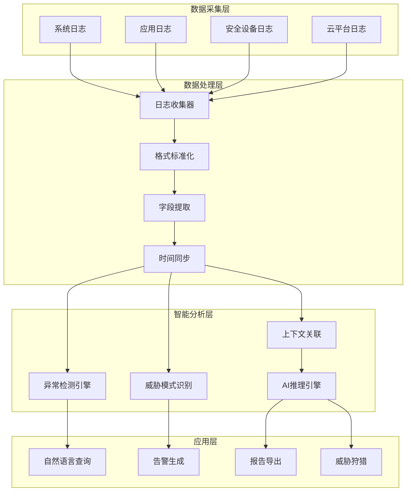

**作者：** HOS(安全风信子)
**日期：** 2026-04-26
**主要来源平台：** GitHub/HuggingFace/arXiv
**摘要：** 企业安全运营每天产生的日志量可达TB级别，传统日志分析依赖人工规则和关键词匹配，面对海量异构日志时效率低下且漏检率高。日志分析Agent通过自然语言处理、机器学习异常检测、知识图谱上下文关联等AI技术，实现日志的智能解析、异常模式识别、威胁狩猎支撑与自动化报告生成。本文系统阐述日志分析Agent的实战设计架构，涵盖日志采集与标准化、多引擎异常检测、上下文丰富与关联分析、自然语言查询接口、威胁模式识别与告警生成五大核心模块。

@[TOC](目录)

---

# 让海量日志说话：日志分析Agent实战设计

## 1 引言：日志分析Agent时代的必然性

### 1.1 企业安全日志的爆炸性增长

2025年企业IT基础设施每日产生的安全日志量已突破**10TB级别**，较三年前增长**320%**。这一增长源于多个因素：云原生架构带来的服务间调用日志爆发、EDR和NDR等安全工具的全面部署、物联网设备的无处不在、以及合规要求驱动的详细审计日志。

现代企业面临的日志挑战包括：

**异构性**：日志来自数百种不同设备和应用，格式各异、标准不统一。

**海量性**：单日日志量可达数十亿条，人工分析根本不可能。

**实时性**：安全事件需要实时检测，延迟意味着风险。

**噪声比**：正常日志与异常日志的比例可达10000:1，有用信号被淹没。

### 1.2 传统日志分析的局限性

传统日志分析依赖SIEM平台结合人工编写的规则，存在明显局限性：

**规则维护成本高**：每发现一种新的攻击模式，就需要人工编写检测规则，效率低下。

**误报率高**：基于签名的检测难以应对变种攻击和未知威胁。

**上下文缺失**：单一日志源的分析难以还原完整攻击链。

**可扩展性差**：规则数量增加导致性能下降，检测效果反而降低。

### 1.3 AI Agent如何重构日志分析

大语言模型的快速发展为日志分析带来了革命性机遇。日志分析Agent能够：

**智能解析**：自动理解异构日志格式，提取关键字段。

**异常检测**：基于机器学习识别异常模式，无需人工规则。

**上下文关联**：跨日志源关联分析，还原完整攻击链。

**自然语言交互**：用自然语言查询海量日志，降低使用门槛。

## 2 系统架构设计

### 2.1 整体架构

日志分析Agent采用分层架构设计，实现从数据采集到智能分析的完整链路。



### 2.2 核心组件设计

```python
class LogAnalysisAgent:
    """日志分析Agent"""

    def __init__(self, config: AgentConfig):
        self.config = config
        self.log_collector = LogCollector()
        self.log_processor = LogProcessor()
        self.anomaly_detector = AnomalyDetector()
        self.threat_recognizer = ThreatRecognizer()
        self.context_engine = ContextEngine()
        self.llm_engine = LLMEngine()
        self.alert_generator = AlertGenerator()

    async def analyze_logs(
        self,
        time_range: TimeRange,
        sources: List[str] = None
    ) -> AnalysisResult:
        """分析日志"""
        raw_logs = await self.log_collector.collect(time_range, sources)

        processed_logs = await self.log_processor.process(raw_logs)

        anomalies = await self.anomaly_detector.detect(processed_logs)

        threats = await self.threat_recognizer.recognize(anomalies)

        context = await self.context_engine.enrich(threats)

        alerts = await self.alert_generator.generate(context)

        return AnalysisResult(
            logs_processed=len(processed_logs),
            anomalies_found=len(anomalies),
            threats_detected=len(threats),
            alerts_generated=len(alerts),
            alerts=alerts
        )

    async def query(
        self,
        natural_language_query: str
    ) -> QueryResult:
        """自然语言查询"""
        parsed_query = await self.llm_engine.parse_query(natural_language_query)

        relevant_logs = await self.log_processor.search(
            parsed_query.filters
        )

        summarized = await self.llm_engine.summarize(
            relevant_logs,
            parsed_query.intent
        )

        return QueryResult(
            query=natural_language_query,
            logs_matched=len(relevant_logs),
            summary=summarized
        )
```

## 3 日志采集与标准化

### 3.1 多源日志采集

```python
class LogCollector:
    """日志采集器"""

    def __init__(self, config: CollectorConfig):
        self.config = config
        self.sources = {}
        self._initialize_sources()

    def _initialize_sources(self):
        """初始化日志源"""
        self.sources = {
            'syslog': SyslogSource(self.config.syslog),
            'windows_event': WindowsEventSource(self.config.windows),
            'cloudtrail': CloudTrailSource(self.config.aws),
            'azure_monitor': AzureMonitorSource(self.config.azure),
            'gcp_logging': GCPLoggingSource(self.config.gcp),
            'json_file': JSONFileSource(self.config.json_files),
            'kafka': KafkaSource(self.config.kafka)
        }

    async def collect(
        self,
        time_range: TimeRange,
        source_names: List[str] = None
    ) -> List[RawLog]:
        """采集日志"""
        logs = []

        sources_to_collect = source_names or list(self.sources.keys())

        for source_name in sources_to_collect:
            if source_name not in self.sources:
                continue

            source = self.sources[source_name]
            try:
                source_logs = await source.collect(time_range)
                logs.extend(source_logs)
            except Exception as e:
                logger.error(f"Failed to collect from {source_name}: {e}")

        return logs
```

### 3.2 日志格式标准化

```python
class LogStandardizer:
    """日志标准化器"""

    def __init__(self):
        self.parsers = {}
        self._register_parsers()

    def _register_parsers(self):
        """注册日志解析器"""
        self.parsers['json'] = JSONLogParser()
        self.parsers['syslog'] = SyslogParser()
        self.parsers['apache'] = ApacheLogParser()
        self.parsers['nginx'] = NginxLogParser()
        self.parsers['windows'] = WindowsEventParser()
        self.parsers['csv'] = CSVLogParser()

    async def standardize(
        self,
        raw_logs: List[RawLog]
    ) -> List[StandardizedLog]:
        """标准化日志"""
        standardized = []

        for raw_log in raw_logs:
            parser = self._get_parser(raw_log.format)

            if parser:
                parsed = await parser.parse(raw_log)
                standardized.append(self._to_standard_format(parsed))
            else:
                standardized.append(self._to_standard_format(raw_log))

        return standardized

    def _to_standard_format(self, log: dict) -> StandardizedLog:
        """转换为标准格式"""
        return StandardizedLog(
            timestamp=self._normalize_timestamp(log.get('timestamp')),
            source=log.get('source', 'unknown'),
            source_type=log.get('source_type', 'unknown'),
            message=log.get('message', ''),
            severity=self._normalize_severity(log.get('level', 'info')),
            fields=log.get('fields', {}),
            raw_content=log.get('raw_content', '')
        )
```

### 3.3 字段提取与 Enrichment

```python
class FieldExtractor:
    """字段提取器"""

    def __init__(self, llm: LLMInterface):
        self.llm = llm
        self.extraction_rules = ExtractionRuleLibrary()

    async def extract_fields(
        self,
        log: StandardizedLog
    ) -> ExtractedFields:
        """提取字段"""
        if self.extraction_rules.has_rule(log.source_type):
            rule = self.extraction_rules.get_rule(log.source_type)
            return await self._rule_based_extraction(log, rule)

        return await self._llm_based_extraction(log)

    async def _rule_based_extraction(
        self,
        log: StandardizedLog,
        rule: ExtractionRule
    ) -> ExtractedFields:
        """基于规则的提取"""
        fields = {}

        for field_def in rule.field_definitions:
            value = self._extract_by_pattern(
                log.message,
                field_def.pattern
            )
            fields[field_def.name] = value

        return ExtractedFields(
            original_log=log,
            extracted_fields=fields,
            extraction_method='rule_based'
        )

    async def _llm_based_extraction(
        self,
        log: StandardizedLog
    ) -> ExtractedFields:
        """基于LLM的提取"""
        prompt = f"""从以下日志消息中提取关键字段：
        {log.message}

        提取以下类型的字段：时间戳、IP地址、用户名、文件名、命令、操作类型、状态码、错误信息等。
        以JSON格式返回提取的字段。"""

        response = await self.llm.complete(prompt)

        fields = json.loads(response)

        return ExtractedFields(
            original_log=log,
            extracted_fields=fields,
            extraction_method='llm_based'
        )
```

## 4 多引擎异常检测

### 4.1 异常检测框架

```python
class AnomalyDetector:
    """异常检测器"""

    def __init__(self):
        self.detectors = [
            StatisticalDetector(),
            MLBasedDetector(),
            RuleBasedDetector(),
            LLMBasedDetector()
        ]

    async def detect(
        self,
        logs: List[StandardizedLog]
    ) -> List[Anomaly]:
        """检测异常"""
        all_anomalies = []

        for detector in self.detectors:
            anomalies = await detector.detect(logs)
            all_anomalies.extend(anomalies)

        correlated_anomalies = await self._correlate_anomalies(all_anomalies)

        prioritized_anomalies = await self._prioritize_anomalies(
            correlated_anomalies
        )

        return prioritized_anomalies

    async def _correlate_anomalies(
        self,
        anomalies: List[Anomaly]
    ) -> List[CorrelatedAnomaly]:
        """关联异常"""
        groups = self._group_by_time_window(anomalies)

        correlated = []
        for group in groups:
            if len(group) > 1:
                correlated.append(CorrelatedAnomaly(
                    anomalies=group,
                    correlation_strength=len(group),
                    root_cause=group[0]
                ))
            else:
                correlated.append(CorrelatedAnomaly(
                    anomalies=group,
                    correlation_strength=1,
                    root_cause=group[0]
                ))

        return correlated
```

### 4.2 统计算法检测

```python
class StatisticalDetector:
    """统计算法异常检测"""

    def __init__(self, config: StatsConfig):
        self.config = config
        self.baseline_models = {}

    async def detect(
        self,
        logs: List[StandardizedLog]
    ) -> List[Anomaly]:
        """检测统计异常"""
        anomalies = []

        metric_logs = self._group_by_metric(logs)

        for metric_name, metric_values in metric_logs.items():
            if not self._should_analyze(metric_name):
                continue

            baseline = await self._get_or_build_baseline(metric_name, metric_values)

            for value in metric_values:
                score = self._calculate_zscore(value, baseline)

                if abs(score) > self.config.zscore_threshold:
                    anomalies.append(Anomaly(
                        id=str(uuid.uuid4()),
                        metric=metric_name,
                        value=value.value,
                        expected=baseline.mean,
                        deviation=score,
                        severity=self._score_to_severity(abs(score)),
                        timestamp=value.timestamp
                    ))

        return anomalies

    async def _get_or_build_baseline(
        self,
        metric_name: str,
        values: List[MetricValue]
    ) -> Baseline:
        """获取或构建基线"""
        if metric_name in self.baseline_models:
            return self.baseline_models[metric_name]

        baseline = Baseline(
            mean=statistics.mean([v.value for v in values]),
            stdev=statistics.stdev([v.value for v in values]) if len(values) > 1 else 0,
            min=min(v.value for v in values),
            max=max(v.value for v in values)
        )

        self.baseline_models[metric_name] = baseline

        return baseline
```

### 4.3 机器学习检测

```python
class MLBasedDetector:
    """基于机器学习的异常检测"""

    def __init__(self, config: MLConfig):
        self.config = config
        self.isolation_forest = IsolationForest(
            n_estimators=100,
            contamination=0.1
        )
        self.lstm_autoencoder = LSTMAutoencoder()
        self.feature_scaler = FeatureScaler()

    async def detect(
        self,
        logs: List[StandardizedLog]
    ) -> List[Anomaly]:
        """机器学习异常检测"""
        features = await self._extract_features(logs)

        normalized_features = await self.feature_scaler.scale(features)

        if_scores = await self._isolation_forest_detect(normalized_features)

        ae_scores = await self._autoencoder_detect(normalized_features)

        combined_scores = (if_scores + ae_scores) / 2

        anomalies = []
        for idx, score in enumerate(combined_scores):
            if score > self.config.threshold:
                anomalies.append(Anomaly(
                    id=str(uuid.uuid4()),
                    log_idx=idx,
                    score=score,
                    detection_method='ml_combined',
                    severity=self._score_to_severity(score)
                ))

        return anomalies

    async def _extract_features(
        self,
        logs: List[StandardizedLog]
    ) -> np.ndarray:
        """提取特征"""
        features = []

        for log in logs:
            feature_vector = [
                log.timestamp.hour,
                log.timestamp.weekday(),
                1 if log.severity == 'error' else 0,
                1 if log.severity == 'warning' else 0,
                len(log.message),
                sum(1 for c in log.message if c.isdigit()),
                sum(1 for c in log.message if c.isupper())
            ]
            features.append(feature_vector)

        return np.array(features)
```

## 5 上下文关联分析

### 5.1 威胁上下文构建

```python
class ContextEngine:
    """上下文引擎"""

    def __init__(self, knowledge_graph: KnowledgeGraph):
        self.knowledge_graph = knowledge_graph
        self.entity_extractor = EntityExtractor()
        self.relation_analyzer = RelationAnalyzer()

    async def enrich(
        self,
        threats: List[Threat]
    ) -> List[EnrichedThreat]:
        """丰富威胁上下文"""
        enriched_threats = []

        for threat in threats:
            entities = await self.entity_extractor.extract(threat)

            relations = await self.relation_analyzer.analyze(
                entities,
                self.knowledge_graph
            )

            enriched_threat = EnrichedThreat(
                original_threat=threat,
                entities=entities,
                relations=relations,
                kill_chain_phase=await self._determine_kill_chain_phase(threat),
                mitre_tactics=await self._map_to_mitre(threat),
                threat_actors=await self._identify_threat_actors(entities),
                related_incidents=await self._find_related_incidents(threat)
            )

            enriched_threats.append(enriched_threat)

        return enriched_threats

    async def _determine_kill_chain_phase(
        self,
        threat: Threat
    ) -> str:
        """确定杀伤链阶段"""
        phase_mapping = {
            'reconnaissance': 'Reconnaissance',
            'weaponization': 'Weaponization',
            'delivery': 'Delivery',
            'exploitation': 'Exploitation',
            'installation': 'Installation',
            'c2': 'Command and Control',
            'actions': 'Actions on Objectives'
        }

        return phase_mapping.get(threat.category, 'Unknown')

    async def _map_to_mitre(
        self,
        threat: Threat
    ) -> List[str]:
        """映射到MITRE ATT&CK"""
        technique_mapping = {
            'brute_force': 'T1110',
            'sql_injection': 'T1190',
            'malware': 'T1204',
            'phishing': 'T1566',
            'data_exfiltration': 'T1041'
        }

        return [technique_mapping.get(threat.category, 'unknown')]
```

### 5.2 跨日志源关联

```python
class CrossLogCorrelator:
    """跨日志源关联器"""

    def __init__(self, time_window: timedelta = timedelta(minutes=5)):
        self.time_window = time_window
        self.entity_index = EntityIndex()

    async def correlate(
        self,
        logs: List[StandardizedLog]
    ) -> List[CorrelationGroup]:
        """关联跨日志源事件"""
        entities = await self._extract_all_entities(logs)

        await self.entity_index.build(entities)

        correlation_groups = []

        for entity_type in ['ip', 'user', 'hostname']:
            related_logs = await self.entity_index.get_by_type(entity_type)

            groups = await self._group_by_entity(related_logs)

            for group in groups:
                if await self._is_significant_correlation(group):
                    correlation_groups.append(group)

        return correlation_groups

    async def _extract_all_entities(
        self,
        logs: List[StandardizedLog]
    ) -> List[Entity]:
        """提取所有实体"""
        entities = []

        for log in logs:
            if 'src_ip' in log.fields:
                entities.append(Entity(
                    type='ip',
                    value=log.fields['src_ip'],
                    log_source=log.source
                ))

            if 'user' in log.fields:
                entities.append(Entity(
                    type='user',
                    value=log.fields['user'],
                    log_source=log.source
                ))

            if 'hostname' in log.fields:
                entities.append(Entity(
                    type='hostname',
                    value=log.fields['hostname'],
                    log_source=log.source
                ))

        return entities

    async def _is_significant_correlation(
        self,
        group: CorrelationGroup
    ) -> bool:
        """判断是否为显著关联"""
        if len(group.logs) < 2:
            return False

        sources = set(log.source for log in group.logs)

        return len(sources) >= 2 and len(group.logs) >= 3
```

## 6 自然语言查询接口

### 6.1 查询解析与执行

```python
class NaturalLanguageQueryEngine:
    """自然语言查询引擎"""

    def __init__(self, llm: LLMInterface, log_store: LogStore):
        self.llm = llm
        self.log_store = log_store
        self.query_parser = QueryParser()

    async def execute_query(
        self,
        nl_query: str
    ) -> QueryResult:
        """执行自然语言查询"""
        parsed = await self.query_parser.parse(nl_query)

        if parsed.type == 'count':
            return await self._execute_count_query(parsed)
        elif parsed.type == 'search':
            return await self._execute_search_query(parsed)
        elif parsed.type == 'aggregate':
            return await self._execute_aggregate_query(parsed)
        elif parsed.type == 'compare':
            return await self._execute_compare_query(parsed)
        else:
            return await self._execute_general_query(parsed)

    async def _execute_search_query(
        self,
        parsed: ParsedQuery
    ) -> QueryResult:
        """执行搜索查询"""
        logs = await self.log_store.search(
            filters=parsed.filters,
            time_range=parsed.time_range
        )

        if parsed.should_summarize:
            summary = await self._generate_summary(logs, parsed)
        else:
            summary = None

        return QueryResult(
            query=parsed.original_query,
            logs_found=len(logs),
            logs=logs[:100] if len(logs) > 100 else logs,
            summary=summary
        )
```

### 6.2 智能摘要生成

```python
class IntelligentSummarizer:
    """智能摘要生成器"""

    def __init__(self, llm: LLMInterface):
        self.llm = llm

    async def summarize(
        self,
        logs: List[StandardizedLog],
        query_context: str
    ) -> LogSummary:
        """生成日志摘要"""
        log_texts = [log.message for log in logs]

        pattern_analysis = await self._analyze_patterns(log_texts)

        anomaly_summary = await self._summarize_anomalies(logs)

        timeline_events = await self._extract_timeline_events(logs)

        narrative = await self._generate_narrative(
            pattern_analysis,
            anomaly_summary,
            timeline_events,
            query_context
        )

        return LogSummary(
            total_logs=len(logs),
            patterns=pattern_analysis,
            anomalies=anomaly_summary,
            timeline=timeline_events,
            narrative=narrative
        )
```

## 7 威胁模式识别与告警生成

### 7.1 威胁模式库

```python
class ThreatPatternLibrary:
    """威胁模式库"""

    PATTERNS = {
        'lateral_movement': {
            'name': '横向移动',
            'indicators': [
                'multiple_failed_logins',
                'unusual_port_access',
                'admin_remote_access'
            ],
            'severity': 'high',
            'mitre_tactics': ['Lateral Movement']
        },
        'data_exfiltration': {
            'name': '数据外泄',
            'indicators': [
                'large_outbound_transfer',
                'unusual_protocol',
                'encrypted_tunnel'
            ],
            'severity': 'critical',
            'mitre_tactics': ['Exfiltration']
        },
        'privilege_escalation': {
            'name': '权限提升',
            'indicators': [
                'sudo_usage',
                'group_membership_change',
                'service_account_abuse'
            ],
            'severity': 'high',
            'mitre_tactics': ['Privilege Escalation']
        },
        'persistence': {
            'name': '持久化',
            'indicators': [
                'new_cron_job',
                'registry_modification',
                'ssh_key_added'
            ],
            'severity': 'high',
            'mitre_tactics': ['Persistence']
        }
    }

    def match_pattern(
        self,
        anomaly: Anomaly
    ) -> List[MatchedPattern]:
        """匹配威胁模式"""
        matched = []

        for pattern_id, pattern_def in self.PATTERNS.items():
            for indicator in pattern_def['indicators']:
                if indicator in anomaly.description.lower():
                    matched.append(MatchedPattern(
                        pattern_id=pattern_id,
                        pattern_name=pattern_def['name'],
                        confidence=self._calculate_confidence(
                            anomaly,
                            indicator
                        ),
                        severity=pattern_def['severity'],
                        mitre_tactics=pattern_def['mitre_tactics']
                    ))

        return sorted(
            matched,
            key=lambda x: x.confidence,
            reverse=True
        )
```

### 7.2 告警生成与聚合

```python
class AlertGenerator:
    """告警生成器"""

    def __init__(self, config: AlertConfig):
        self.config = config
        self.correlation_window = timedelta(
            minutes=config.correlation_window_minutes
        )

    async def generate(
        self,
        enriched_threats: List[EnrichedThreat]
    ) -> List[Alert]:
        """生成告警"""
        alerts = []

        for threat in enriched_threats:
            if threat.severity in ['critical', 'high']:
                alert = await self._create_alert(threat)
                alerts.append(alert)

        grouped_alerts = await self._group_related_alerts(alerts)

        deduplicated_alerts = await self._deduplicate_alerts(grouped_alerts)

        return deduplicated_alerts

    async def _group_related_alerts(
        self,
        alerts: List[Alert]
    ) -> List[GroupedAlert]:
        """分组关联告警"""
        groups = defaultdict(list)

        for alert in alerts:
            key = self._get_grouping_key(alert)
            groups[key].append(alert)

        grouped = []
        for key, group_alerts in groups.items():
            grouped.append(GroupedAlert(
                alerts=group_alerts,
                primary_alert=group_alerts[0],
                count=len(group_alerts)
            ))

        return grouped
```

## 8 结论与展望

日志分析Agent代表了日志分析的未来发展方向。通过将AI技术与传统日志分析深度融合，我们构建了一套智能、高效、可扩展的日志分析体系。多引擎异常检测、跨日志源关联、自然语言查询接口的协同工作，使系统能够从海量日志中准确发现安全威胁。

---

**参考链接：**

- [Gartner Security Analytics](https://www.gartner.com) - 企业安全日志趋势报告
- [MITRE ATT&CK](https://attack.mitre.org/) - APT攻击链框架
- [Elastic Stack](https://www.elastic.co/elastic-stack) - 日志分析平台

**附录（Appendix）：**

```python
# 日志分析效能指标

Log_Processing_Rate = Processed_Logs / Time_Unit

Anomaly_Detection_Rate = Detected_Anomalies / Total_Anomalies × 100%

False_Positive_Rate = False_Alarms / Total_Alarms × 100%

Mean_Time_to_Detect = Σ(Detection_Time - Event_Time) / Detections
```

**关键词：** 日志分析Agent，多引擎检测，上下文关联，自然语言查询，威胁模式识别，智能告警
