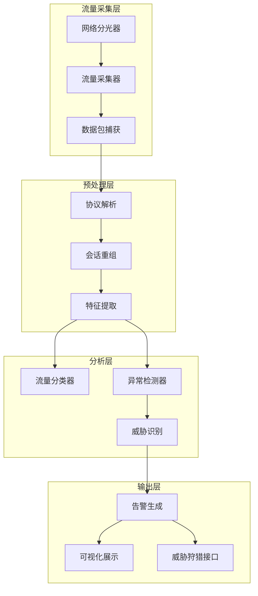

**作者：** HOS(安全风信子)
**日期：** 2026-04-26
**主要来源平台：** GitHub/HuggingFace/arXiv
**摘要：** 企业网络边界日益模糊，传统的基于边界防护的安全模式已难以应对复杂的内网威胁。流量分析Agent通过深度学习网络流量，实现内网异常行为检测、横向移动识别、隐蔽通道检测等关键能力，为企业构建基于流量分析的新一代安全防护体系。本文系统阐述流量分析Agent的实战设计架构，涵盖流量采集与预处理、深度流量解析、异常行为检测、威胁识别与告警生成四大核心模块。

@[TOC](目录)

---

# 流量深处藏威胁：流量分析Agent实战设计

## 1 引言：流量分析的战略价值

### 1.1 内网威胁的隐蔽性

传统的边界安全防护主要关注南北向流量，对内部东西向流量缺乏有效监控。然而，大多数高级威胁在完成初始入侵后，会在内网进行横向移动和权限提升，这些活动主要体现在内网流量中。

内网威胁的隐蔽性体现在多个方面：攻击者通过加密通道传输数据、慢速低频的探测行为难以察觉、利用合法协议的隐蔽通道绕过检测。这些特点使得基于流量的分析成为发现内网威胁的关键手段。

### 1.2 流量分析的技术演进

从早期的NetFlow分析、到后来的深度包检测（DPI）、再到现在的AI驱动的流量分析，技术在不断演进。现代流量分析需要处理海量数据、识别复杂模式、检测未知威胁，这些都要求AI技术的深度参与。

### 1.3 流量分析Agent的核心能力

流量分析Agent具备以下核心能力：

**全流量捕获**：支持线速抓取网络流量，无丢包。

**深度解析**：支持数百种协议的高层解析，提取丰富特征。

**AI检测**：基于机器学习识别异常行为，无需人工规则。

**实时告警**：毫秒级检测延迟，快速响应安全事件。

## 2 系统架构设计

### 2.1 整体架构



### 2.2 核心组件设计

```python
class TrafficAnalysisAgent:
    """流量分析Agent"""

    def __init__(self, config: TrafficConfig):
        self.config = config
        self.packet_capture = PacketCapture()
        self.protocol_parser = ProtocolParser()
        self.session_builder = SessionBuilder()
        self.feature_extractor = FeatureExtractor()
        self.traffic_classifier = TrafficClassifier()
        self.anomaly_detector = AnomalyDetector()
        self.threat_identifier = ThreatIdentifier()
        self.alert_generator = AlertGenerator()

    async def analyze_traffic(
        self,
        time_range: TimeRange
    ) -> AnalysisResult:
        """分析流量"""
        packets = await self.packet_capture.capture(time_range)

        sessions = await self.session_builder.build(packets)

        features = await self.feature_extractor.extract(sessions)

        classifications = await self.traffic_classifier.classify(features)

        anomalies = await self.anomaly_detector.detect(features)

        threats = await self.threat_identifier.identify(
            classifications,
            anomalies
        )

        alerts = await self.alert_generator.generate(threats)

        return AnalysisResult(
            sessions_analyzed=len(sessions),
            anomalies_detected=len(anomalies),
            threats_identified=len(threats),
            alerts_generated=len(alerts)
        )
```

## 3 流量采集与预处理

### 3.1 高性能流量采集

```python
class PacketCapture:
    """数据包捕获器"""

    def __init__(self, config: CaptureConfig):
        self.config = config
        self.buffer_size = config.buffer_size
        self.max_packets = config.max_packets

    async def capture(
        self,
        time_range: TimeRange,
        interface: str = None
    ) -> List[Packet]:
        """捕获数据包"""
        if interface is None:
            interface = self.config.default_interface

        packets = []

        async with PacketSocket(interface) as sock:
            sock.set_buffer_size(self.buffer_size)

            start_time = time_range.start
            end_time = time_range.end

            while datetime.now() < end_time:
                packet = await sock.recv()

                if packet.timestamp >= start_time:
                    packets.append(packet)

                if len(packets) >= self.max_packets:
                    break

        return packets
```

### 3.2 协议解析

```python
class ProtocolParser:
    """协议解析器"""

    def __init__(self):
        self.parsers = {
            'ethernet': EthernetParser(),
            'ipv4': IPv4Parser(),
            'ipv6': IPv6Parser(),
            'tcp': TCPParser(),
            'udp': UDPParser(),
            'http': HTTPParser(),
            'dns': DNSParser(),
            'tls': TLSParser(),
            'smb': SMBParser()
        }

    async def parse(self, packet: Packet) -> ParsedPacket:
        """解析数据包"""
        layers = []

        for protocol in packet.protocols:
            if protocol in self.parsers:
                parser = self.parsers[protocol]
                layer = await parser.parse(packet)
                layers.append(layer)

        return ParsedPacket(
            raw=packet.raw,
            layers=layers,
            metadata=packet.metadata
        )
```

### 3.3 会话重组

```python
class SessionBuilder:
    """会话重组器"""

    def __init__(self):
        self.sessions = {}
        self.timeout = timedelta(minutes=30)

    async def build(
        self,
        packets: List[Packet]
    ) -> List[Session]:
        """构建会话"""
        for packet in packets:
            session_key = self._get_session_key(packet)

            if session_key not in self.sessions:
                self.sessions[session_key] = Session(
                    key=session_key,
                    packets=[],
                    start_time=packet.timestamp
                )

            session = self.sessions[session_key]
            session.packets.append(packet)
            session.end_time = packet.timestamp

        self._cleanup_old_sessions()

        return list(self.sessions.values())

    def _get_session_key(self, packet: Packet) -> str:
        """获取会话键"""
        if packet.protocol == 'tcp':
            return f"{packet.src_ip}:{packet.src_port}->{packet.dst_ip}:{packet.dst_port}"
        else:
            return f"{packet.src_ip}->{packet.dst_ip}"
```

## 4 深度流量解析

### 4.1 特征提取

```python
class FeatureExtractor:
    """特征提取器"""

    def __init__(self):
        self.statistical_features = StatisticalFeatureExtractor()
        self.behavioral_features = BehavioralFeatureExtractor()
        self.temporal_features = TemporalFeatureExtractor()

    async def extract(
        self,
        sessions: List[Session]
    ) -> List[TrafficFeatures]:
        """提取流量特征"""
        all_features = []

        for session in sessions:
            features = TrafficFeatures(
                session_id=session.key,
                basic=self._extract_basic_features(session),
                statistical=await self.statistical_features.extract(session),
                behavioral=await self.behavioral_features.extract(session),
                temporal=await self.temporal_features.extract(session)
            )
            all_features.append(features)

        return all_features

    def _extract_basic_features(
        self,
        session: Session
    ) -> BasicFeatures:
        """提取基本特征"""
        return BasicFeatures(
            duration=(session.end_time - session.start_time).total_seconds(),
            packet_count=len(session.packets),
            byte_count=sum(p.bytes for p in session.packets),
            src_port=session.packets[0].src_port if session.packets else 0,
            dst_port=session.packets[0].dst_port if session.packets else 0,
            protocol=session.packets[0].protocol if session.packets else 'unknown'
        )
```

### 4.2 统计特征分析

```python
class StatisticalFeatureExtractor:
    """统计特征提取器"""

    async def extract(self, session: Session) -> StatisticalFeatures:
        """提取统计特征"""
        packet_sizes = [p.size for p in session.packets]
        inter_arrival_times = self._calculate_iat(session.packets)

        return StatisticalFeatures(
            packet_size_mean=statistics.mean(packet_sizes) if packet_sizes else 0,
            packet_size_std=statistics.stdev(packet_sizes) if len(packet_sizes) > 1 else 0,
            packet_size_min=min(packet_sizes) if packet_sizes else 0,
            packet_size_max=max(packet_sizes) if packet_sizes else 0,
            packet_size_median=statistics.median(packet_sizes) if packet_sizes else 0,
            iat_mean=statistics.mean(inter_arrival_times) if inter_arrival_times else 0,
            iat_std=statistics.stdev(inter_arrival_times) if len(inter_arrival_times) > 1 else 0,
            iat_min=min(inter_arrival_times) if inter_arrival_times else 0,
            iat_max=max(inter_arrival_times) if inter_arrival_times else 0
        )
```

## 5 异常行为检测

### 5.1 机器学习检测模型

```python
class AnomalyDetector:
    """异常检测器"""

    def __init__(self, config: AnomalyConfig):
        self.config = config
        self.isolation_forest = IsolationForest(
            n_estimators=100,
            contamination=0.01
        )
        self.autoencoder = TrafficAutoencoder()
        self.baseline_manager = BaselineManager()

    async def detect(
        self,
        features: List[TrafficFeatures]
    ) -> List[Anomaly]:
        """检测异常"""
        feature_vectors = self._to_vectors(features)

        if_scores = await self._isolation_forest_detect(feature_vectors)

        ae_scores = await self._autoencoder_detect(feature_vectors)

        combined_scores = self._combine_scores(if_scores, ae_scores)

        anomalies = []
        for idx, score in enumerate(combined_scores):
            if score > self.config.threshold:
                anomalies.append(Anomaly(
                    session_id=features[idx].session_id,
                    score=score,
                    features=features[idx],
                    severity=self._score_to_severity(score)
                ))

        return anomalies
```

### 5.2 隐蔽通道检测

```python
class CovertChannelDetector:
    """隐蔽通道检测器"""

    def __init__(self):
        self.legitimate_protocols = {'http', 'https', 'dns', 'smtp'}

    async def detect(
        self,
        session: Session
    ) -> List[CovertChannelAlert]:
        """检测隐蔽通道"""
        alerts = []

        dns_alerts = await self._detect_dns_covert_channel(session)
        alerts.extend(dns_alerts)

        http_alerts = await self._detect_http_covert_channel(session)
        alerts.extend(http_alerts)

        icmp_alerts = await self._detect_icmp_covert_channel(session)
        alerts.extend(icmp_alerts)

        return alerts

    async def _detect_dns_covert_channel(
        self,
        session: Session
    ) -> List[CovertChannelAlert]:
        """检测DNS隐蔽通道"""
        if session.dst_port != 53:
            return []

        alerts = []

        for packet in session.packets:
            if hasattr(packet, 'dns_query'):
                query = packet.dns_query

                if len(query) > 50:
                    alerts.append(CovertChannelAlert(
                        type='dns_tunnel',
                        session_id=session.key,
                        evidence=f"异常长的DNS查询: {len(query)} 字符",
                        confidence=0.8
                    ))

        return alerts
```

## 6 威胁识别与告警

### 6.1 横向移动检测

```python
class LateralMovementDetector:
    """横向移动检测器"""

    def __init__(self):
        self.auth_patterns = AuthenticationPatternLibrary()

    async def detect(
        self,
        sessions: List[Session]
    ) -> List[LateralMovementAlert]:
        """检测横向移动"""
        alerts = []

        internal_sessions = self._filter_internal_sessions(sessions)

        auth_sessions = self._filter_auth_sessions(internal_sessions)

        for auth_session in auth_sessions:
            pattern = await self.auth_patterns.match(auth_session)

            if pattern.risk_score > 0.7:
                alerts.append(LateralMovementAlert(
                    session_id=auth_session.key,
                    src_host=auth_session.src_ip,
                    dst_host=auth_session.dst_ip,
                    auth_type=pattern.type,
                    risk_score=pattern.risk_score,
                    evidence=pattern.evidence
                ))

        return alerts
```

### 6.2 告警生成

```python
class AlertGenerator:
    """告警生成器"""

    def __init__(self):
        self.severity_calculator = SeverityCalculator()
        self.alert_manager = AlertManager()

    async def generate(
        self,
        threats: List[Threat]
    ) -> List[SecurityAlert]:
        """生成安全告警"""
        alerts = []

        for threat in threats:
            severity = await self.severity_calculator.calculate(threat)

            if severity.level >= SeverityLevel.MEDIUM:
                alert = SecurityAlert(
                    threat=threat,
                    severity=severity,
                    timestamp=datetime.now()
                )

                await self.alert_manager.save(alert)
                alerts.append(alert)

        return alerts
```

## 7 结论与展望

流量分析Agent是内网安全防护的关键组件。通过深度流量分析和AI检测技术，可以有效发现内网中的异常行为和隐蔽威胁，为企业提供更全面的安全防护能力。

---

**参考链接：**

- [Zeek Network Security Monitor](https://zeek.org/) - 网络安全监控
- [Suricata](https://suricata.io/) - IDS/IPS引擎

**关键词：** 流量分析Agent，横向移动检测，隐蔽通道，机器学习，异常检测
