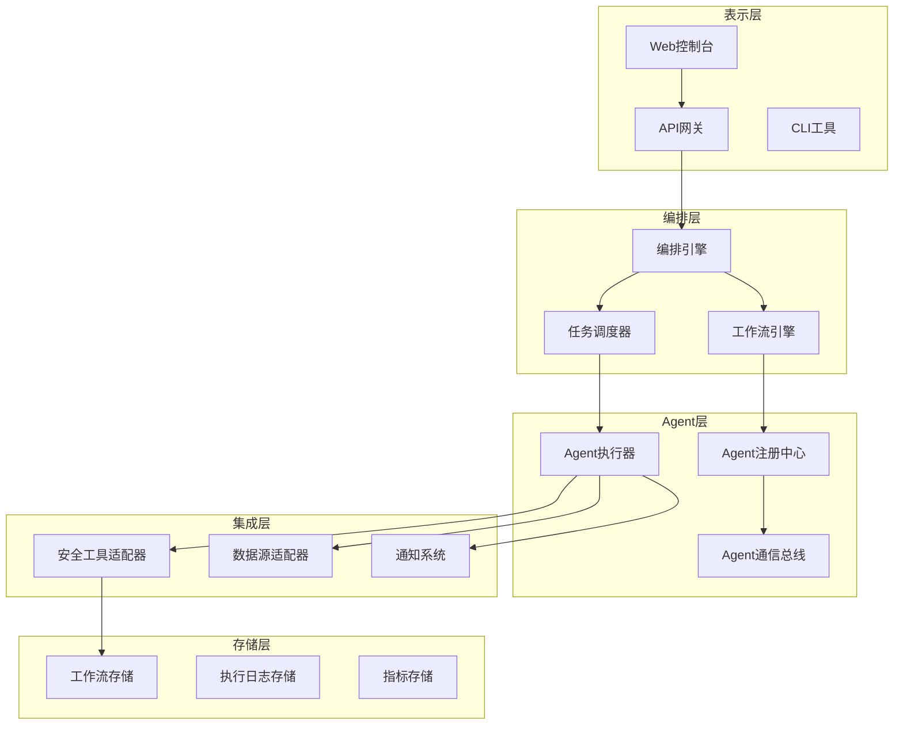

**作者：** HOS(安全风信子)
**日期：** 2026-04-26
**主要来源平台：** GitHub/HuggingFace/arXiv
**摘要：** 企业安全运营的复杂性要求多种安全工具和AI Agent协同工作。AI编排系统作为安全运营的中枢神经，通过统一的任务调度、工作流编排、多Agent协同机制，实现安全运营的自动化与智能化。本文系统阐述企业级AI编排系统的实战设计架构，涵盖编排引擎核心、工作流设计模式、Agent注册与发现、多Agent协同执行、Human-in-the-loop集成五大核心模块。

@[TOC](目录)

---

# 让安全运营自动化：企业级AI编排系统设计指南

## 1 引言：AI编排系统的必然崛起

### 1.1 安全运营自动化的需求

随着企业安全威胁日益复杂，传统手工操作的安全运营模式已无法满足需求。现代安全运营中心（SOC）每天处理成千上万的安全事件，仅靠人工分析根本无法应对。安全团队面临着告警疲劳、响应延迟、人才短缺等多重挑战。

AI编排系统通过智能化手段，将安全运营中的各个环节进行自动化编排，实现从威胁检测到响应处置的全流程自动化。这不仅是技术升级，更是安全运营模式的根本性变革。

### 1.2 编排系统的核心价值

AI编排系统的核心价值体现在以下几个维度：

**效率提升**：通过自动化流程，显著减少人工操作时间，将平均响应时间从小时级缩短到分钟级甚至秒级。

**一致性**：确保每次安全事件的处理流程标准化、规范化，避免因人员水平差异导致的处理质量不一。

**可扩展性**：支持横向扩展，能够应对突发的安全事件高峰，无需增加人力投入。

**知识积累**：将专家经验转化为自动化流程，实现安全知识的积累和复用。

### 1.3 从SOAR到AI编排

传统SOAR（安全编排、自动化与响应）平台已经在安全运营自动化方面发挥了重要作用。但传统SOAR的局限性也日益明显：

传统的SOAR平台主要依赖预定义的规则和剧本，灵活性和智能化程度有限。而AI编排系统在传统SOAR基础上，深度融合了大语言模型和机器学习技术，能够实现更智能的决策支持、更自然的人机交互、更精准的威胁分析。

## 2 AI编排系统架构设计

### 2.1 整体架构概览

AI编排系统采用分层架构设计，确保各层职责清晰、耦合度低、易于扩展。



```python
class AIOrchestrationSystem:
    """AI编排系统"""

    def __init__(self, config: OrchestrationConfig):
        self.config = config
        self.orchestration_engine = OrchestrationEngine()
        self.workflow_engine = WorkflowEngine()
        self.task_scheduler = TaskScheduler()
        self.agent_registry = AgentRegistry()
        self.execution_history = ExecutionHistory()

    async def execute_workflow(
        self,
        workflow: Workflow,
        context: ExecutionContext
    ) -> WorkflowResult:
        """执行工作流"""
        execution_id = await self._create_execution(workflow, context)

        try:
            steps = await self.workflow_engine.plan_execution(workflow)

            results = []
            for step in steps:
                result = await self._execute_step(step, context)
                results.append(result)

                if not self._should_continue(results):
                    break

            return WorkflowResult(
                execution_id=execution_id,
                status='completed',
                step_results=results
            )
        except Exception as e:
            await self._handle_execution_error(execution_id, e)
            raise

    async def _execute_step(
        self,
        step: WorkflowStep,
        context: ExecutionContext
    ) -> StepResult:
        """执行工作流步骤"""
        agent = await self.agent_registry.get_agent(step.agent_id)

        result = await agent.execute(step.action, step.parameters, context)

        await self.execution_history.record(step, result)

        return StepResult(step=step, result=result)
```

### 2.2 编排引擎核心设计

编排引擎是整个系统的核心，负责协调各个组件的工作。

```python
class OrchestrationEngine:
    """编排引擎"""

    def __init__(self):
        self.workflow_executor = WorkflowExecutor()
        self.agent_coordinator = AgentCoordinator()
        self.context_manager = ContextManager()
        self.policy_engine = PolicyEngine()

    async def orchestrate(
        self,
        objective: str,
        constraints: List[Constraint]
    ) -> OrchestrationResult:
        """编排执行"""
        plan = await self._create_execution_plan(objective, constraints)

        coordinated_execution = await self.agent_coordinator.coordinate(
            plan.agents,
            plan.sequence
        )

        result = await self.workflow_executor.execute_plan(
            coordinated_execution
        )

        optimized_result = await self._optimize_result(result)

        return OrchestrationResult(
            plan=plan,
            execution=result,
            optimized=optimized_result
        )

    async def _create_execution_plan(
        self,
        objective: str,
        constraints: List[Constraint]
    ) -> ExecutionPlan:
        """创建执行计划"""
        decomposed_tasks = await self._decompose_objective(objective)

        agent_assignments = await self._assign_agents(decomposed_tasks)

        execution_sequence = await self._sequence_tasks(agent_assignments)

        return ExecutionPlan(
            tasks=decomposed_tasks,
            agents=agent_assignments,
            sequence=execution_sequence
        )
```

### 2.3 工作流引擎设计

工作流引擎负责解析和执行安全运营工作流。

```python
class WorkflowEngine:
    """工作流引擎"""

    def __init__(self):
        self.workflow_parser = WorkflowParser()
        self.execution_engine = ExecutionEngine()
        self.state_machine = WorkflowStateMachine()

    async def execute_workflow(
        self,
        workflow: Workflow,
        initial_context: Context
    ) -> WorkflowExecution:
        """执行工作流"""
        parsed = self.workflow_parser.parse(workflow)

        execution = WorkflowExecution(
            workflow_id=workflow.id,
            state=WorkflowState.INITIAL
        )

        await self.state_machine.transition(execution, WorkflowState.RUNNING)

        try:
            for step in parsed.steps:
                if not await self._should_execute_step(step, execution):
                    continue

                result = await self.execution_engine.execute_step(
                    step,
                    execution.context
                )

                execution.add_result(step.id, result)

                await self.state_machine.update_state(execution, step)

            await self.state_machine.transition(execution, WorkflowState.COMPLETED)

        except Exception as e:
            await self.state_machine.transition(
                execution,
                WorkflowState.FAILED,
                error=str(e)
            )
            raise

        return execution

    async def _should_execute_step(
        self,
        step: WorkflowStep,
        execution: WorkflowExecution
    ) -> bool:
        """判断步骤是否应该执行"""
        if not step.condition:
            return True

        return await self._evaluate_condition(
            step.condition,
            execution.context
        )
```

## 3 工作流设计模式

### 3.1 常见设计模式

在AI编排系统中，有多种经过实践验证的设计模式。

**顺序执行模式**：按顺序执行一系列操作，适用于线性流程。

```python
class SequentialPattern:
    """顺序执行模式"""

    async def execute(
        self,
        steps: List[WorkflowStep],
        context: Context
    ) -> List[StepResult]:
        """顺序执行"""
        results = []

        for step in steps:
            result = await self._execute_step(step, context)
            results.append(result)

            if not self._is_success(result):
                break

        return results
```

**并行执行模式**：多个操作同时执行，提高效率。

```python
class ParallelPattern:
    """并行执行模式"""

    async def execute(
        self,
        steps: List[WorkflowStep],
        context: Context
    ) -> List[StepResult]:
        """并行执行"""
        tasks = [
            self._execute_step_async(step, context)
            for step in steps
        ]

        results = await asyncio.gather(*tasks, return_exceptions=True)

        return [r if not isinstance(r, Exception) else self._handle_error(r)
                for r in results]
```

**条件分支模式**：根据条件选择执行路径。

```python
class ConditionalPattern:
    """条件分支模式"""

    def __init__(self, condition_evaluator: ConditionEvaluator):
        self.evaluator = condition_evaluator

    async def execute(
        self,
        branches: Dict[str, WorkflowStep],
        condition: Condition,
        context: Context
    ) -> StepResult:
        """条件分支执行"""
        evaluated = await self.evaluator.evaluate(condition, context)

        selected_branch = self._select_branch(branches, evaluated)

        return await self._execute_step(selected_branch, context)
```

### 3.2 工作流模板库

预定义的工作流模板可以加速安全运营场景的落地。

```python
class WorkflowTemplateLibrary:
    """工作流模板库"""

    TEMPLATES = {
        'incident_response': {
            'name': '安全事件响应流程',
            'description': '标准安全事件响应工作流',
            'steps': [
                {'type': 'detection', 'agent': 'siem'},
                {'type': 'analysis', 'agent': 'ai_assistant'},
                {'type': 'containment', 'agent': 'edr'},
                {'type': 'notification', 'agent': 'notification_service'},
                {'type': 'documentation', 'agent': 'cmdb'}
            ]
        },
        'threat_hunting': {
            'name': '威胁狩猎流程',
            'description': '主动威胁狩猎工作流',
            'steps': [
                {'type': 'hypothesis', 'agent': 'ai_assistant'},
                {'type': 'data_collection', 'agent': 'data_aggregator'},
                {'type': 'analysis', 'agent': 'ml_engine'},
                {'type': 'validation', 'agent': 'analyst'},
                {'type': 'reporting', 'agent': 'report_generator'}
            ]
        },
        'vulnerability_management': {
            'name': '漏洞管理流程',
            'description': '漏洞发现到修复的完整流程',
            'steps': [
                {'type': 'scanning', 'agent': 'scanner'},
                {'type': 'prioritization', 'agent': 'ai_assistant'},
                {'type': 'remediation_planning', 'agent': 'ai_assistant'},
                {'type': 'remediation', 'agent': 'ticketing'},
                {'type': 'verification', 'agent': 'scanner'}
            ]
        }
    }

    def get_template(self, template_id: str) -> WorkflowTemplate:
        """获取模板"""
        return self.TEMPLATES.get(template_id)

    def list_templates(self) -> List[str]:
        """列出所有模板"""
        return list(self.TEMPLATES.keys())
```

## 4 Agent注册与发现

### 4.1 Agent注册中心

Agent注册中心负责管理所有可用的安全Agent。

```python
class AgentRegistry:
    """Agent注册中心"""

    def __init__(self):
        self.agents = {}
        self.capability_index = CapabilityIndex()

    def register_agent(
        self,
        agent: SecurityAgent,
        capabilities: List[Capability]
    ):
        """注册Agent"""
        self.agents[agent.id] = {
            'agent': agent,
            'capabilities': capabilities,
            'status': 'active',
            'registered_at': datetime.now()
        }

        for capability in capabilities:
            self.capability_index.add(capability, agent.id)

        logger.info(f"Registered agent: {agent.id}")

    async def find_agent(
        self,
        capability: Capability
    ) -> Optional[SecurityAgent]:
        """查找具有特定能力的Agent"""
        agent_ids = await self.capability_index.find_agents(capability)

        for agent_id in agent_ids:
            agent_info = self.agents.get(agent_id)
            if agent_info and agent_info['status'] == 'active':
                return agent_info['agent']

        return None

    async def get_agent(self, agent_id: str) -> Optional[SecurityAgent]:
        """获取指定Agent"""
        agent_info = self.agents.get(agent_id)
        if agent_info and agent_info['status'] == 'active':
            return agent_info['agent']
        return None
```

### 4.2 能力索引与匹配

```python
class CapabilityIndex:
    """能力索引"""

    def __init__(self):
        self.index = defaultdict(list)

    def add(self, capability: Capability, agent_id: str):
        """添加能力索引"""
        key = self._make_key(capability)
        if agent_id not in self.index[key]:
            self.index[key].append(agent_id)

    async def find_agents(
        self,
        capability: Capability
    ) -> List[str]:
        """查找具有能力的Agent"""
        key = self._make_key(capability)
        return self.index.get(key, [])

    def _make_key(self, capability: Capability) -> str:
        """生成索引键"""
        return f"{capability.type}:{capability.name}"
```

## 5 多Agent协同执行

### 5.1 Agent通信机制

多Agent之间需要有效的通信机制来协调工作。

```python
class AgentCommunicationBus:
    """Agent通信总线"""

    def __init__(self):
        self.message_queue = asyncio.Queue()
        self.subscribers = {}
        self.message_history = []

    async def publish(
        self,
        topic: str,
        message: AgentMessage
    ):
        """发布消息"""
        await self.message_queue.put((topic, message))
        self.message_history.append(message)

        if topic in self.subscribers:
            for subscriber in self.subscribers[topic]:
                await subscriber.receive(message)

    def subscribe(self, topic: str, subscriber: AgentSubscriber):
        """订阅主题"""
        if topic not in self.subscribers:
            self.subscribers[topic] = []
        self.subscribers[topic].append(subscriber)

    async def broadcast(self, message: AgentMessage):
        """广播消息"""
        for topic in self.subscribers:
            await self.publish(topic, message)
```

### 5.2 协同决策机制

```python
class CollaborativeDecisionMaker:
    """协同决策器"""

    def __init__(self):
        self.voting_engine = VotingEngine()
        self.consensus_builder = ConsensusBuilder()

    async def make_collaborative_decision(
        self,
        decision_context: DecisionContext,
        agents: List[SecurityAgent]
    ) -> CollaborativeDecision:
        """协同决策"""
        opinions = []

        for agent in agents:
            opinion = await agent.provide_opinion(decision_context)
            opinions.append(opinion)

        voting_result = await self.voting_engine.vote(opinions)

        consensus = await self.consensus_builder.build(
            opinions,
            voting_result
        )

        return CollaborativeDecision(
            opinions=opinions,
            voting=voting_result,
            consensus=consensus
        )

    async def resolve_conflicts(
        self,
        opinions: List[AgentOpinion]
    ) -> ResolvedConflict:
        """解决冲突"""
        conflicting_pairs = self._find_conflicts(opinions)

        resolutions = []
        for agent1, agent2 in conflicting_pairs:
            resolution = await self._mediate_conflict(agent1, agent2)
            resolutions.append(resolution)

        return ResolvedConflict(resolutions=resolutions)
```

## 6 Human-in-the-loop集成

### 6.1 人工审批节点

在关键决策点，需要人工介入审核。

```python
class HumanInTheLoopIntegration:
    """人在环集成"""

    def __init__(self, approval_workflow: ApprovalWorkflow):
        self.approval_workflow = approval_workflow
        self.notification_service = NotificationService()

    async def request_approval(
        self,
        action: SecurityAction,
        context: Context
    ) -> ApprovalResult:
        """请求审批"""
        approval_request = ApprovalRequest(
            action=action,
            context=context,
            requested_at=datetime.now(),
            status='pending'
        )

        await self.notification_service.notify_approvers(
            approval_request
        )

        result = await self.approval_workflow.wait_for_approval(
            approval_request
        )

        return result

    async def escalate_if_needed(
        self,
        pending_request: ApprovalRequest,
        timeout: timedelta
    ) -> EscalationResult:
        """必要时升级"""
        elapsed = datetime.now() - pending_request.requested_at

        if elapsed > timeout:
            higher_approver = await self._find_higher_approver(
                pending_request.current_approver
            )

            if higher_approver:
                await self._transfer_approval(
                    pending_request,
                    higher_approver
                )

                return EscalationResult(
                    escalated=True,
                    new_approver=higher_approver
                )

        return EscalationResult(escalated=False)
```

### 6.2 实时协作界面

```python
class RealTimeCollaborationInterface:
    """实时协作界面"""

    def __init__(self, websocket_manager: WebSocketManager):
        self.ws_manager = websocket_manager

    async def create_session(
        self,
        workflow_id: str,
        participants: List[str]
    ) -> CollaborationSession:
        """创建协作会话"""
        session = CollaborationSession(
            id=str(uuid.uuid4()),
            workflow_id=workflow_id,
            participants=participants,
            created_at=datetime.now()
        )

        for participant in participants:
            await self.ws_manager.connect(participant, session.id)

        return session

    async def broadcast_update(
        self,
        session_id: str,
        update: WorkflowUpdate
    ):
        """广播更新"""
        await self.ws_manager.broadcast(session_id, update)

    async def submit_feedback(
        self,
        session_id: str,
        participant_id: str,
        feedback: ParticipantFeedback
    ):
        """提交反馈"""
        await self.ws_manager.send_to_orchestrator(
            session_id,
            ParticipantFeedbackMessage(
                participant=participant_id,
                feedback=feedback
            )
        )
```

## 7 实战案例：自动化事件响应

### 7.1 钓鱼事件响应工作流

```python
class PhishingIncidentWorkflow:
    """钓鱼事件响应工作流"""

    WORKFLOW_DEFINITION = {
        'name': 'phishing_incident_response',
        'steps': [
            {
                'id': 'detect',
                'type': 'detection',
                'agent': 'email_security',
                'action': 'analyze_phishing_email',
                'parameters': {}
            },
            {
                'id': 'analyze',
                'type': 'analysis',
                'agent': 'ai_assistant',
                'action': 'analyze_phishing_characteristics',
                'parameters': {
                    'include_ioc_extraction': True
                }
            },
            {
                'id': 'contain_users',
                'type': 'containment',
                'agent': 'directory_service',
                'action': 'isolate_affected_users',
                'parameters': {}
            },
            {
                'id': 'block_iocs',
                'type': 'containment',
                'agent': 'firewall',
                'action': 'block_malicious_iocs',
                'parameters': {}
            },
            {
                'id': 'notify',
                'type': 'notification',
                'agent': 'notification_service',
                'action': 'notify_security_team',
                'parameters': {
                    'severity': 'high'
                }
            },
            {
                'id': 'document',
                'type': 'documentation',
                'agent': 'ticketing',
                'action': 'create_incident_ticket',
                'parameters': {}
            }
        ]
    }

    @classmethod
    def get_workflow(cls) -> Workflow:
        """获取工作流定义"""
        return Workflow(**cls.WORKFLOW_DEFINITION)
```

### 7.2 勒索软件响应工作流

```python
class RansomwareResponseWorkflow:
    """勒索软件响应工作流"""

    WORKFLOW_DEFINITION = {
        'name': 'ransomware_response',
        'steps': [
            {
                'id': 'detect_ransomware',
                'type': 'detection',
                'agent': 'edr',
                'action': 'detect_ransomware_indicators'
            },
            {
                'id': 'isolate_endpoint',
                'type': 'containment',
                'agent': 'edr',
                'action': 'isolate_endpoint_immediately'
            },
            {
                'id': 'block_lateral_movement',
                'type': 'containment',
                'agent': 'network_security',
                'action': 'segment_network'
            },
            {
                'id': 'analyze_ransomware',
                'type': 'analysis',
                'agent': 'sandbox',
                'action': 'analyze_ransomware_sample'
            },
            {
                'id': 'coordinate_response',
                'type': 'coordination',
                'agent': 'ai_orchestrator',
                'action': 'coordinate_cross_team_response'
            },
            {
                'id': 'forensic_collection',
                'type': 'forensics',
                'agent': 'forensics_platform',
                'action': 'collect_forensic_evidence'
            }
        ]
    }
```

## 8 系统集成与扩展

### 8.1 安全工具适配器

```python
class SecurityToolAdapter:
    """安全工具适配器"""

    def __init__(self, tool: SecurityTool):
        self.tool = tool
        self.connector = self._create_connector(tool)

    async def connect(self):
        """连接工具"""
        await self.connector.connect()
        logger.info(f"Connected to {self.tool.name}")

    async def execute_action(
        self,
        action: str,
        parameters: dict
    ) -> ActionResult:
        """执行动作"""
        return await self.connector.execute(action, parameters)

    async def get_status(self) -> ToolStatus:
        """获取工具状态"""
        return await self.connector.get_status()

    def _create_connector(self, tool: SecurityTool) -> ToolConnector:
        """创建连接器"""
        connector_map = {
            'siem': SIEMConnector,
            'edr': EDRConnector,
            'firewall': FirewallConnector,
            'ticketing': TicketingConnector
        }

        connector_class = connector_map.get(tool.type, GenericConnector)

        return connector_class(tool.config)
```

### 8.2 自定义开发扩展

```python
class OrchestrationExtension:
    """编排系统扩展"""

    def __init__(self):
        self.custom_agents = {}
        self.custom_connectors = {}
        self.custom_workflows = {}

    def register_custom_agent(
        self,
        agent_id: str,
        agent: SecurityAgent
    ):
        """注册自定义Agent"""
        self.custom_agents[agent_id] = agent
        logger.info(f"Registered custom agent: {agent_id}")

    def register_custom_connector(
        self,
        tool_type: str,
        connector_factory: ConnectorFactory
    ):
        """注册自定义连接器"""
        self.custom_connectors[tool_type] = connector_factory
        logger.info(f"Registered custom connector for: {tool_type}")

    def register_custom_workflow(
        self,
        workflow: Workflow
    ):
        """注册自定义工作流"""
        self.custom_workflows[workflow.id] = workflow
        logger.info(f"Registered custom workflow: {workflow.id}")
```

## 9 结论与展望

AI编排系统是企业安全运营智能化的核心基础设施。通过统一的编排引擎、灵活的工作流设计模式、标准化的Agent注册机制、有效的多Agent协同策略，以及必要的人工介入机制，企业可以实现安全运营的全面自动化和智能化。

未来，随着AI技术的进一步发展，编排系统将变得更加智能和自主，真正成为安全运营的中枢神经。

---

**参考链接：**

- [Palo Alto XSIAM](https://www.paloaltonetworks.com/) - XSIAM编排平台
- [Splunk SOAR](https://www.splunk.com/) - SOAR编排自动化
- [IBM Security Connect](https://www.ibm.com/security) - 安全编排

**附录（Appendix）：**

```python
# AI编排系统核心指标

# 工作流执行效率
Workflow_Efficiency = Successful_Steps / Total_Steps × 100%

# Agent利用率
Agent_Utilization = Active_Agents / Total_Registered_Agents × 100%

# 平均响应时间
Mean_Response_Time = Σ(Response_Time) / Total_Events
```

**关键词：** AI编排，SOAR，工作流自动化，多Agent协同，Human-in-the-loop，安全运营自动化
