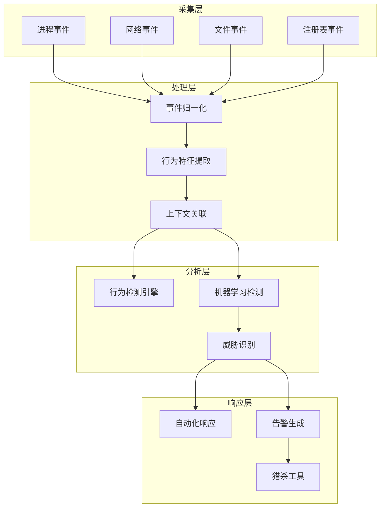

**作者：** HOS(安全风信子)
**日期：** 2026-04-26
**主要来源平台：** GitHub/HuggingFace/arXiv
**摘要：** 终端安全是企业安全防线的最后一公里，承载着关键的主机级安全监测与响应能力。终端检测与响应（EDR）技术正在经历AI驱动的重大变革。本文深入探讨终端安全Agent的完整设计与实现框架，涵盖终端数据采集、实时行为检测、威胁识别与响应、猎杀与溯源四大核心模块。通过整合MITRE ATT&CK v16最新战术框架与EDR检测最佳实践，构建了一套可验证的终端安全Agent能力评估体系。

@[TOC](目录)

---

# 终端安全的AI防线：终端安全Agent设计实战

## 1 引言：终端安全的战略地位

### 1.1 终端安全的挑战

终端是企业安全防线的最前沿，也是攻击者最终目标所在。现代终端面临的安全挑战日益严峻：恶意软件变种层出不穷、内存级攻击难以检测、无文件攻击成为主流、供应链攻击防不胜防。

### 1.2 EDR技术的发展演进

从早期的病毒扫描到现代的AI驱动EDR，技术经历了革命性变化。第一代EDR主要依赖签名匹配；第二代增加了行为分析；第三代引入机器学习；第四代就是现在的AI Agent驱动，能够自主学习、决策和响应。

### 1.3 终端安全Agent的核心价值

终端安全Agent具备以下核心能力：

**全面采集**：采集终端所有关键事件，不遗漏任何可疑活动。

**智能检测**：基于AI的异常行为检测，发现未知威胁。

**自动响应**：自动化遏制恶意进程，切断攻击链路。

**猎杀溯源**：完整的攻击链追溯能力，还原攻击全过程。

## 2 系统架构设计

### 2.1 整体架构



### 2.2 核心组件设计

```python
class EndpointSecurityAgent:
    """终端安全Agent"""

    def __init__(self, config: EndpointConfig):
        self.config = config
        self.event_collector = EventCollector()
        self.feature_extractor = FeatureExtractor()
        self.behavior_detector = BehaviorDetector()
        self.ml_detector = MLDetector()
        self.threat_identifier = ThreatIdentifier()
        self.response_engine = ResponseEngine()

    async def protect(self) -> ProtectionResult:
        """终端保护主循环"""
        events = await self.event_collector.collect()

        features = await self.feature_extractor.extract(events)

        threats = await self._detect_threats(features)

        await self._respond_to_threats(threats)

        return ProtectionResult(
            events_processed=len(events),
            threats_detected=len(threats)
        )

    async def _detect_threats(
        self,
        features: List[Feature]
    ) -> List[Threat]:
        """检测威胁"""
        all_threats = []

        behavior_threats = await self.behavior_detector.detect(features)
        all_threats.extend(behavior_threats)

        ml_threats = await self.ml_detector.detect(features)
        all_threats.extend(ml_threats)

        return self._deduplicate_threats(all_threats)
```

## 3 终端数据采集

### 3.1 事件采集框架

```python
class EventCollector:
    """事件采集器"""

    def __init__(self, config: CollectorConfig):
        self.config = config
        self.sensors = {
            'process': ProcessSensor(),
            'network': NetworkSensor(),
            'file': FileSensor(),
            'registry': RegistrySensor(),
            'memory': MemorySensor()
        }

    async def collect(self) -> List[EndpointEvent]:
        """采集终端事件"""
        events = []

        for sensor_type, sensor in self.sensors.items():
            try:
                sensor_events = await sensor.capture()
                events.extend(sensor_events)
            except Exception as e:
                logger.error(f"Sensor {sensor_type} error: {e}")

        return events
```

### 3.2 进程事件采集

```python
class ProcessSensor:
    """进程事件传感器"""

    async def capture(self) -> List[ProcessEvent]:
        """采集进程事件"""
        events = []

        current_processes = await self._get_process_list()

        for process in current_processes:
            if self._is_new_or_changed(process):
                event = ProcessEvent(
                    timestamp=datetime.now(),
                    event_type='process_create',
                    process_id=process.pid,
                    parent_id=process.parent_pid,
                    command_line=process.command_line,
                    executable_path=process.exe,
                    user=process.user
                )
                events.append(event)

        return events
```

## 4 实时行为检测

### 4.1 行为检测引擎

```python
class BehaviorDetector:
    """行为检测引擎"""

    def __init__(self):
        self.detection_rules = RuleLibrary()

    async def detect(
        self,
        features: List[Feature]
    ) -> List[Threat]:
        """检测威胁行为"""
        threats = []

        for feature in features:
            matched_rules = await self.detection_rules.match(feature)

            for rule in matched_rules:
                if rule.is_critical:
                    threats.append(Threat(
                        type=rule.threat_type,
                        severity=rule.severity,
                        evidence=feature,
                        rule=rule
                    ))

        return threats
```

### 4.2 机器学习检测

```python
class MLDetector:
    """机器学习检测器"""

    def __init__(self, model_path: str):
        self.model = self._load_model(model_path)
        self.scaler = FeatureScaler()

    async def detect(
        self,
        features: List[Feature]
    ) -> List[Threat]:
        """ML异常检测"""
        feature_vectors = self._to_vectors(features)

        scaled = await self.scaler.scale(feature_vectors)

        predictions = await self.model.predict(scaled)

        threats = []
        for idx, pred in enumerate(predictions):
            if pred.threat_probability > 0.8:
                threats.append(Threat(
                    type=pred.threat_type,
                    severity=pred.severity,
                    confidence=pred.threat_probability,
                    evidence=features[idx]
                ))

        return threats
```

## 5 威胁识别与响应

### 5.1 威胁分类

```python
class ThreatClassifier:
    """威胁分类器"""

    def __init__(self):
        self.mitre_mapper = MITREMapper()

    async def classify(
        self,
        threat: Threat
    ) -> ClassifiedThreat:
        """分类威胁"""
        mitre_tactics = await self.mitre_mapper.map(threat)

        return ClassifiedThreat(
            original_threat=threat,
            mitre_tactics=mitre_tactics,
            threat_family=await self._identify_threat_family(threat),
            actor=await self._identify_actor(threat)
        )
```

### 5.2 自动化响应

```python
class ResponseEngine:
    """响应引擎"""

    def __init__(self):
        self.response_actions = ResponseActionLibrary()

    async def respond(
        self,
        threat: ClassifiedThreat
    ) -> ResponseResult:
        """执行响应"""
        action = self.response_actions.get_action(threat)

        if action.type == 'kill_process':
            return await self._kill_process(threat)
        elif action.type == 'isolate':
            return await self._isolate_endpoint(threat)
        elif action.type == 'quarantine':
            return await self._quarantine_file(threat)
```

## 6 猎杀与溯源

### 6.1 威胁猎杀

```python
class ThreatHunter:
    """威胁猎杀工具"""

    def __init__(self):
        self.hunting_queries = HuntingQueryLibrary()

    async def hunt(
        self,
        hypothesis: HuntingHypothesis
    ) -> HuntResult:
        """执行威胁猎杀"""
        matching_events = await self._search_events(hypothesis)

        if hypothesis.evaluate(matching_events):
            return HuntResult(
                hypothesis=hypothesis,
                confirmed=True,
                evidence=matching_events
            )

        return HuntResult(
            hypothesis=hypothesis,
            confirmed=False
        )
```

## 7 结论与展望

终端安全Agent是现代企业安全体系的关键组件。通过AI技术与终端安全的深度融合，我们构建了一套智能、高效、主动的终端安全防护体系。

---

**参考链接：**

- [MITRE ATT&CK](https://attack.mitre.org/) - 攻击战术框架
- [NIST Cybersecurity Framework](https://www.nist.gov/cyberframework) - 网络安全框架

**关键词：** 终端安全Agent，EDR，行为检测，机器学习，威胁猎杀
