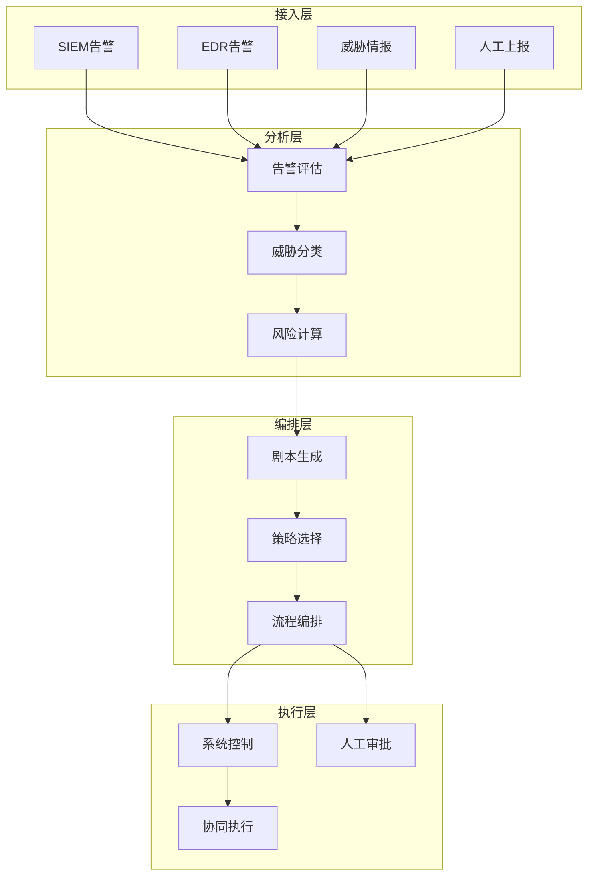

**作者：** HOS(安全风信子)
**日期：** 2026-04-26
**主要来源平台：** GitHub/HuggingFace/arXiv
**摘要：** 安全编排自动化与响应（SOAR）平台正在经历AI驱动的重大升级。传统SOAR依赖预定义剧本，而AI驱动的SOAR能够智能决策、动态编排、持续优化，实现安全响应的革命性提升。本文深入探讨AISOC Agent的完整设计与实现框架，涵盖智能剧本生成、动态响应编排、协同处置执行、持续学习优化四大核心模块。

@[TOC](目录)

---

# 智能编排自动响应：AISOC Agent设计实战

## 1 引言：SOAR的智能化升级

### 1.1 传统SOAR的局限性

传统SOAR平台在安全自动化方面发挥了重要作用，但存在明显局限：剧本依赖人工编写，无法应对新型威胁；响应流程固定，无法动态调整；缺乏学习能力，无法持续优化。

### 1.2 AI驱动的SOAR变革

AI技术为SOAR带来了革命性变化：智能剧本自动生成、动态响应策略优化、预测性防御前置、持续学习进化。AI驱动的SOAR Agent能够自主决策、自主执行、自主优化。

### 1.3 AISOC Agent的核心能力

**智能剧本生成**：基于历史事件自动生成响应剧本。

**动态响应编排**：根据威胁类型智能选择响应策略。

**协同处置执行**：多系统协同，自动执行复杂响应。

**持续学习优化**：从每次响应中学习，不断优化决策。

## 2 系统架构设计

### 2.1 整体架构



### 2.2 核心组件设计

```python
class AISOCAgent:
    """AISOC Agent"""

    def __init__(self, config: SOCConfig):
        self.config = config
        self.alert_processor = AlertProcessor()
        self.playbook_generator = PlaybookGenerator()
        self.response_orchestrator = ResponseOrchestrator()
        self.learning_engine = LearningEngine()

    async def process_alert(
        self,
        alert: SecurityAlert
    ) -> ProcessingResult:
        """处理安全告警"""
        assessment = await self.alert_processor.assess(alert)

        if assessment.requires_human_review:
            await self._request_human_review(assessment)
            return ProcessingResult(
                status='pending_review',
                assessment=assessment
            )

        playbook = await self.playbook_generator.generate(assessment)

        result = await self.response_orchestrator.execute(playbook)

        await self.learning_engine.record_result(alert, result)

        return ProcessingResult(
            status='completed',
            assessment=assessment,
            playbook=playbook,
            result=result
        )
```

## 3 智能剧本生成

### 3.1 剧本生成引擎

```python
class PlaybookGenerator:
    """剧本生成引擎"""

    def __init__(self, llm: LLMInterface, playbook_library: PlaybookLibrary):
        self.llm = llm
        self.playbook_library = playbook_library
        self.template_engine = TemplateEngine()

    async def generate(
        self,
        assessment: AlertAssessment
    ) -> Playbook:
        """生成响应剧本"""
        similar_playbooks = await self._find_similar_playbooks(assessment)

        if similar_playbooks:
            playbook = await self._adapt_playbook(
                similar_playbooks[0],
                assessment
            )
        else:
            playbook = await self._generate_new_playbook(assessment)

        optimized_playbook = await self._optimize_playbook(playbook, assessment)

        return optimized_playbook

    async def _generate_new_playbook(
        self,
        assessment: AlertAssessment
    ) -> Playbook:
        """生成新剧本"""
        prompt = self._build_generation_prompt(assessment)

        generated = await self.llm.complete(prompt)

        playbook = self._parse_playbook(generated)

        return playbook
```

### 3.2 动态策略选择

```python
class StrategySelector:
    """策略选择器"""

    def __init__(self, strategy_library: StrategyLibrary):
        self.strategy_library = strategy_library
        self.risk_calculator = RiskCalculator()

    async def select_strategy(
        self,
        threat: ThreatInfo,
        context: SOCContext
    ) -> ResponseStrategy:
        """选择响应策略"""
        candidate_strategies = await self.strategy_library.get_candidates(
            threat.type,
            context
        )

        scored_strategies = []
        for strategy in candidate_strategies:
            score = await self._evaluate_strategy(strategy, threat, context)
            scored_strategies.append((strategy, score))

        selected = max(scored_strategies, key=lambda x: x[1])

        return selected[0]
```

## 4 协同处置执行

### 4.1 执行引擎

```python
class ResponseOrchestrator:
    """响应编排器"""

    def __init__(self):
        self.executor_registry = ExecutorRegistry()
        self.human_in_loop = HumanInTheLoop()
        self.execution_tracker = ExecutionTracker()

    async def execute(
        self,
        playbook: Playbook
    ) -> ExecutionResult:
        """执行剧本"""
        execution = Execution(
            id=str(uuid.uuid4()),
            playbook=playbook,
            status='running',
            steps_completed=[],
            start_time=datetime.now()
        )

        await self.execution_tracker.start(execution)

        for step in playbook.steps:
            if await self._requires_approval(step):
                approval = await self.human_in_loop.request_approval(step)
                if not approval.granted:
                    execution.steps_completed.append(
                        StepResult(step=step, status='skipped')
                    )
                    continue

            result = await self._execute_step(step)

            execution.steps_completed.append(result)

            if result.status == 'failed':
                break

        execution.status = 'completed'
        execution.end_time = datetime.now()

        await self.execution_tracker.complete(execution)

        return ExecutionResult(execution=execution)
```

### 4.2 多系统协同

```python
class MultiSystemCoordinator:
    """多系统协同器"""

    def __init__(self):
        self.executors = {}

    def register_executor(
        self,
        system: str,
        executor: SystemExecutor
    ):
        """注册系统执行器"""
        self.executors[system] = executor

    async def coordinate(
        self,
        actions: List[ResponseAction]
    ) -> CoordinateResult:
        """协同执行"""
        parallel_actions = self._group_parallel_actions(actions)

        results = []
        for action_group in parallel_actions:
            group_results = await asyncio.gather(*[
                self._execute_action(action) for action in action_group
            ])
            results.extend(group_results)

        return CoordinateResult(results=results)
```

## 5 持续学习优化

### 5.1 反馈学习

```python
class LearningEngine:
    """学习引擎"""

    def __init__(self, feedback_store: FeedbackStore):
        self.feedback_store = feedback_store
        self.effectiveness_tracker = EffectivenessTracker()

    async def record_result(
        self,
        alert: SecurityAlert,
        result: ExecutionResult
    ):
        """记录结果用于学习"""
        feedback = ExecutionFeedback(
            alert=alert,
            playbook=result.execution.playbook,
            outcome=result,
            timestamp=datetime.now()
        )

        await self.feedback_store.save(feedback)

        await self.effectiveness_tracker.update(feedback)

    async def optimize_playbooks(self):
        """优化剧本"""
        feedback_data = await self.feedback_store.get_recent()

        for playbook_id, feedback_list in self._group_by_playbook(feedback_data):
            effectiveness = self._calculate_effectiveness(feedback_list)

            if effectiveness < 0.7:
                await self._improve_playbook(playbook_id, feedback_list)
```

## 6 结论与展望

AISOC Agent代表了安全运营自动化的未来方向。通过AI技术与SOAR平台的深度融合，实现安全响应的智能化、自动化和持续优化。

---

**参考链接：**

- [Palo Alto SOAR](https://www.paloaltonetworks.com/) - SOAR平台
- [Splunk SOAR](https://www.splunk.com/) - 安全编排自动化

**关键词：** AISOC Agent，SOAR，智能剧本，响应编排，持续学习
