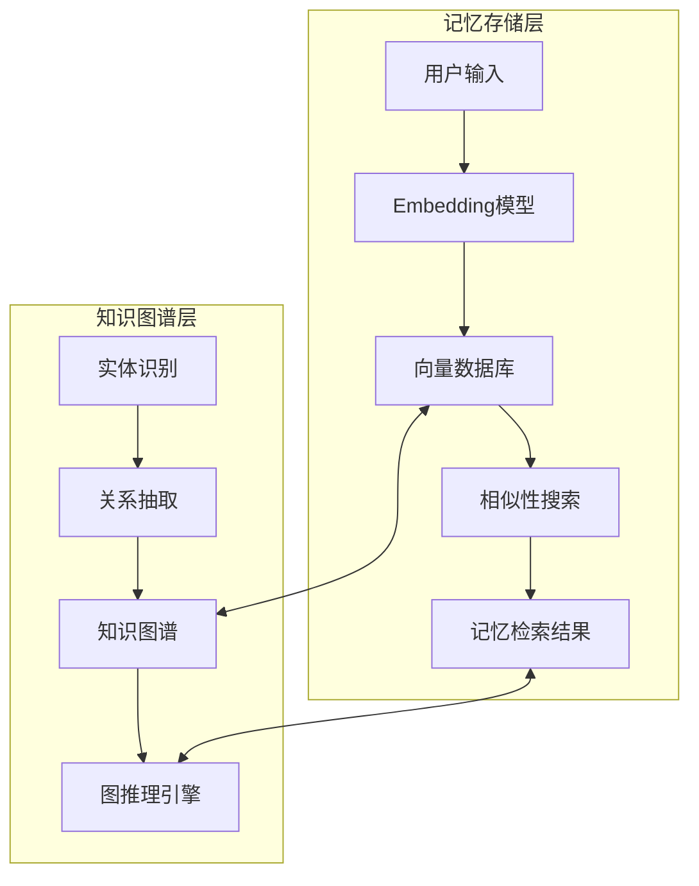
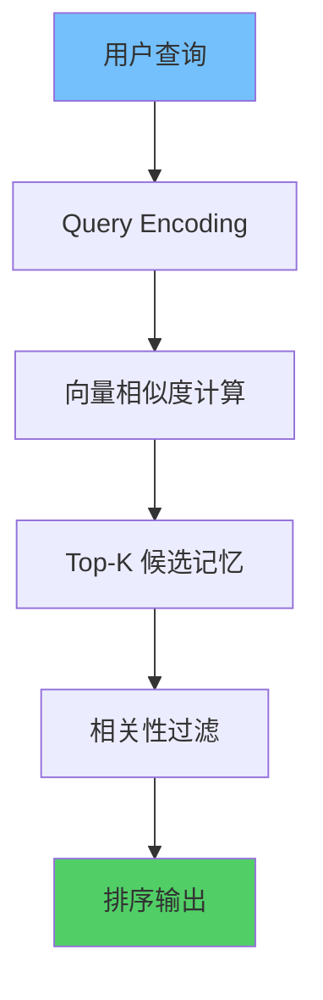

**作者：** HOS(安全风信子)
**日期：** 2026-04-26
**主要来源平台：** GitHub/HuggingFace/arXiv
**摘要：** AI Agent的记忆系统是其持续学习和个性化服务的基础。本文系统阐述Agent记忆系统的实战设计，涵盖短期记忆、长期记忆与上下文记忆三种类型，深入分析向量数据库与知识图谱融合的记忆存储架构，详细介绍相似性召回与相关性排序的记忆检索机制，并探讨记忆更新、遗忘策略以及安全隐私保护。通过Python+向量数据库实现完整的记忆管理系统，配合Mermaid架构图展示记忆流动与检索流程。

@[TOC](目录)

---

# AI也需要记忆：Agent记忆系统设计实战

## 1 引言：为什么Agent需要记忆系统

### 1.1 传统Agent的局限性

传统AI Agent每次交互都是从零开始，无法保留之前的上下文信息。这导致用户需要重复提供背景信息，Agent无法学习用户偏好，也无法保持会话连贯性。

### 1.2 记忆系统的核心价值

记忆系统使Agent能够跨会话保持状态、学习用户偏好、积累知识，从而提供更加个性化和高效的服务。

### 1.3 本文结构

本文将深入探讨Agent记忆系统的设计，包括记忆类型划分、存储架构、检索机制、更新遗忘策略等核心主题。

---

## 2 Agent记忆类型体系

### 2.1 短期记忆

短期记忆用于存储当前会话中的临时信息，具有高时效性和低持久性特点。

```python
class ShortTermMemory:
    """
    短期记忆管理器 - 当前会话内的临时信息存储
    """

    def __init__(self, max_items: int = 100):
        self.max_items = max_items
        self.items = []
        self.timestamps = {}

    def add(self, key: str, value: any, ttl: int = 3600):
        """添加短期记忆项"""
        if len(self.items) >= self.max_items:
            self.items.pop(0)
            self.timestamps.pop(self.items[0] if self.items else None, None)

        self.items.append({key: value})
        self.timestamps[key] = time.time() + ttl

    def get(self, key: str) -> any:
        """获取记忆项"""
        if key in self.timestamps and time.time() < self.timestamps[key]:
            for item in reversed(self.items):
                if key in item:
                    return item[key]
        return None

    def clear_expired(self):
        """清理过期记忆"""
        current_time = time.time()
        expired_keys = [k for k, v in self.timestamps.items() if current_time >= v]
        for key in expired_keys:
            self.items = [item for item in self.items if key not in item]
            del self.timestamps[key]
```

### 2.2 长期记忆

长期记忆存储跨会话的持久化信息，包括用户偏好、常用模式、关键决策等。

```python
class LongTermMemory:
    """
    长期记忆管理器 - 跨会话持久化存储
    """

    def __init__(self, db_path: str = "longterm_memory.db"):
        self.db_path = db_path
        self.conn = sqlite3.connect(db_path, check_same_thread=False)
        self._init_db()

    def _init_db(self):
        """初始化数据库"""
        cursor = self.conn.cursor()
        cursor.execute("""
            CREATE TABLE IF NOT EXISTS memories (
                id INTEGER PRIMARY KEY AUTOINCREMENT,
                category TEXT NOT NULL,
                key TEXT NOT NULL,
                value TEXT NOT NULL,
                importance INTEGER DEFAULT 1,
                access_count INTEGER DEFAULT 0,
                created_at TIMESTAMP DEFAULT CURRENT_TIMESTAMP,
                last_accessed TIMESTAMP DEFAULT CURRENT_TIMESTAMP
            )
        """)
        self.conn.commit()

    def store(self, category: str, key: str, value: str, importance: int = 1):
        """存储长期记忆"""
        cursor = self.conn.cursor()
        cursor.execute("""
            INSERT OR REPLACE INTO memories (category, key, value, importance)
            VALUES (?, ?, ?, ?)
        """, (category, key, value, importance))
        self.conn.commit()

    def retrieve(self, category: str = None, key: str = None) -> list:
        """检索长期记忆"""
        cursor = self.conn.cursor()
        if key:
            cursor.execute("""
                UPDATE memories SET access_count = access_count + 1,
                last_accessed = CURRENT_TIMESTAMP WHERE key = ?
            """, (key,))
            self.conn.commit()

        query = "SELECT * FROM memories WHERE 1=1"
        params = []
        if category:
            query += " AND category = ?"
            params.append(category)
        if key:
            query += " AND key = ?"
            params.append(key)

        cursor.execute(query, params)
        return cursor.fetchall()
```

### 2.3 上下文记忆

上下文记忆根据当前任务动态调整，优先检索与当前场景相关的信息。

```python
class ContextualMemory:
    """
    上下文记忆 - 动态情境感知记忆系统
    """

    def __init__(self, vector_store, embedding_model):
        self.vector_store = vector_store
        self.embedding_model = embedding_model

    def store_with_context(self, content: str, context: dict):
        """存储带上下文标记的记忆"""
        embedding = self.embedding_model.encode(content)
        memory_id = self.vector_store.add(embedding, {"content": content, "context": context})
        return memory_id

    def retrieve_context_aware(self, query: str, current_context: dict,
                               top_k: int = 5) -> list:
        """基于当前上下文检索记忆"""
        query_embedding = self.embedding_model.encode(query)
        results = self.vector_store.search(query_embedding, top_k)

        filtered_results = []
        for result in results:
            memory_context = result.metadata.get("context", {})
            relevance_score = self._calculate_context_relevance(
                current_context, memory_context
            )
            if relevance_score > 0.5:
                filtered_results.append({
                    "content": result.metadata["content"],
                    "relevance": relevance_score
                })

        return sorted(filtered_results, key=lambda x: x["relevance"], reverse=True)

    def _calculate_context_relevance(self, current: dict, memory: dict) -> float:
        """计算上下文相关性"""
        score = 0.0
        for key in current.keys():
            if key in memory and current[key] == memory[key]:
                score += 1.0
        return score / max(len(current), 1)
```

---

## 3 记忆存储架构

### 3.1 向量数据库融合

向量数据库提供高效的相似性搜索能力，是记忆系统的核心存储引擎。



### 3.2 混合存储架构

结合向量数据库的速度优势和知识图谱的关系推理能力。

```python
class HybridMemoryStore:
    """
    混合记忆存储 - 向量数据库 + 知识图谱
    """

    def __init__(self, vector_store, knowledge_graph):
        self.vector_store = vector_store
        self.knowledge_graph = knowledge_graph

    def store(self, content: str, metadata: dict):
        """双重存储"""
        vector_id = self.vector_store.add(content, metadata)

        entities = self._extract_entities(content)
        for entity in entities:
            self.knowledge_graph.add_entity(entity["name"], entity["type"])

        if "relations" in metadata:
            for relation in metadata["relations"]:
                self.knowledge_graph.add_relation(
                    relation["source"],
                    relation["target"],
                    relation["type"]
                )

        return vector_id

    def retrieve(self, query: str, top_k: int = 10) -> list:
        """混合检索"""
        vector_results = self.vector_store.search(query, top_k)

        kg_results = self.knowledge_graph.query(query)

        fused_results = self._fuse_results(vector_results, kg_results, top_k)

        return fused_results

    def _fuse_results(self, vector_results, kg_results, top_k):
        """融合向量和图谱检索结果"""
        seen = set()
        fused = []

        for r in vector_results + kg_results:
            if r["id"] not in seen:
                seen.add(r["id"])
                fused.append(r)

        return fused[:top_k]
```

---

## 4 记忆检索机制

### 4.1 相似性召回



基于向量相似度的记忆召回，确保检索到语义相近的记忆。

### 4.2 相关性排序

结合多维度因素对召回结果进行排序，优先返回最相关的内容。

```python
class MemoryRetrieval:
    """
    记忆检索器 - 相似性召回 + 相关性排序
    """

    def __init__(self, vector_store, knowledge_graph, reranker):
        self.vector_store = vector_store
        self.knowledge_graph = knowledge_graph
        self.reranker = reranker

    def retrieve(self, query: str, context: dict = None,
                 top_k: int = 10, rerank: bool = True) -> list:
        """记忆检索主流程"""

        query_embedding = self.vector_store.embedding_model.encode(query)
        vector_results = self.vector_store.search(query_embedding, top_k * 2)

        if context:
            graph_results = self.knowledge_graph.search_by_context(context)
        else:
            graph_results = []

        combined = self._combine_results(vector_results, graph_results)

        if rerank and context:
            reranked = self.reranker.rerank(
                query=query,
                results=combined,
                context=context
            )
            return reranked[:top_k]

        return combined[:top_k]

    def _combine_results(self, vector_results, graph_results) -> list:
        """合并向量和图谱检索结果"""
        seen_ids = set()
        combined = []

        for r in sorted(vector_results, key=lambda x: x["score"], reverse=True):
            if r["id"] not in seen_ids:
                seen_ids.add(r["id"])
                combined.append(r)

        for r in sorted(graph_results, key=lambda x: x["score"], reverse=True):
            if r["id"] not in seen_ids:
                seen_ids.add(r["id"])
                combined.append(r)

        return combined
```

---

## 5 记忆更新与遗忘

### 5.1 记忆更新策略

基于访问频率和重要性的动态更新机制。

### 5.2 遗忘机制

模拟人类记忆特性，实现智能遗忘。

```python
class MemoryConsolidation:
    """
    记忆整合与遗忘管理器
    """

    def __init__(self, long_term_memory, importance_threshold: float = 0.3):
        self.ltm = long_term_memory
        self.importance_threshold = importance_threshold

    def consolidate_short_to_long(self, short_term, user_id: str):
        """短期记忆整合到长期记忆"""
        for item in short_term.items:
            for key, value in item.items():
                importance = self._calculate_importance(value, user_id)

                if importance >= self.importance_threshold:
                    self.ltm.store(
                        category="consolidated",
                        key=key,
                        value=str(value),
                        importance=importance
                    )

    def _calculate_importance(self, memory_value, user_id: str) -> float:
        """计算记忆重要性"""
        base_importance = 0.5

        access_count = self.ltm.get_access_count(memory_value)
        if access_count > 10:
            base_importance += 0.2

        if self._is_user_preference(memory_value):
            base_importance += 0.3

        return min(base_importance, 1.0)

    def forget_weak_memories(self, retention_period_days: int = 90):
        """遗忘弱记忆"""
        cursor = self.ltm.conn.cursor()
        cursor.execute("""
            DELETE FROM memories
            WHERE importance < ?
            AND last_accessed < datetime('now', '-' || ? || ' days')
        """, (self.importance_threshold, retention_period_days))
        self.ltm.conn.commit()
```

---

## 6 记忆安全与隐私

### 6.1 敏感信息处理

自动识别和脱敏敏感信息。

### 6.2 访问控制

基于角色的记忆访问控制。

```python
class MemoryAccessControl:
    """
    记忆访问控制器
    """

    def __init__(self):
        self.permissions = {}

    def grant_access(self, role: str, memory_categories: list):
        """授予角色访问权限"""
        self.permissions[role] = memory_categories

    def check_access(self, role: str, memory_category: str) -> bool:
        """检查访问权限"""
        if role not in self.permissions:
            return False
        return memory_category in self.permissions[role]

    def sanitize_memory(self, content: str) -> str:
        """记忆脱敏"""
        patterns = [
            (r'\d{3}-\d{2}-\d{4}', '[SSN]'),
            (r'\d{4}-\d{4}-\d{4}-\d{4}', '[CARD]'),
            (r'password[:\s]*\S+', 'password: [REDACTED]'),
        ]

        for pattern, replacement in patterns:
            content = re.sub(pattern, replacement, content, flags=re.IGNORECASE)

        return content
```

---

## 7 总结

本文系统阐述了Agent记忆系统的设计与实现，涵盖三种记忆类型、混合存储架构、智能检索机制以及安全隐私保护。通过代码实现展示了核心组件的工作原理，记忆系统为Agent提供了持续学习和个性化服务的能力。

---

**参考链接：**
- 主要来源：[LangChain Memory](https://python.langchain.com/) - Agent记忆管理框架
- 辅助：[Chroma向量数据库](https://www.trychroma.com/) - 向量存储方案

**附录（Appendix）：**
无

**关键词：** Agent记忆系统, 短期记忆, 长期记忆, 向量数据库, 知识图谱, 记忆检索, 记忆更新, 遗忘机制