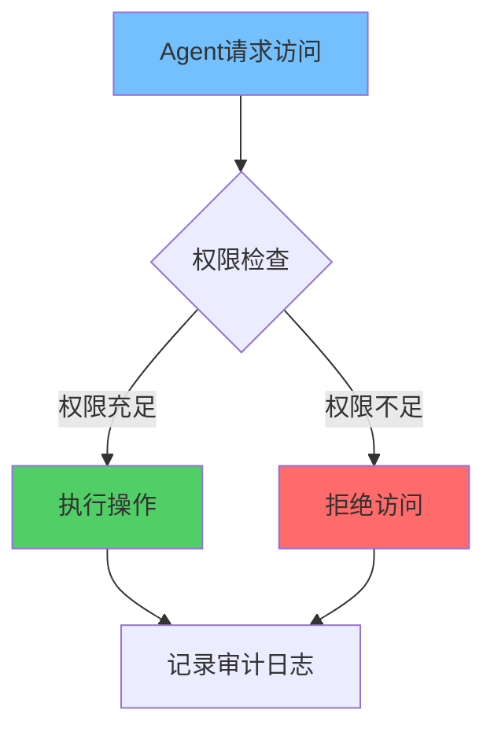
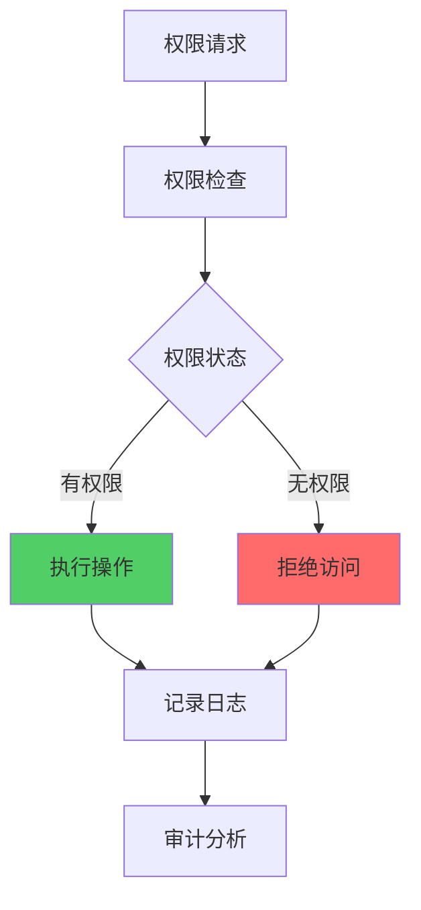

**作者：** HOS(安全风信子)
**日期：** 2026-04-26
**主要来源平台：** GitHub/HuggingFace/arXiv
**摘要：** AI Agent的权限边界控制是确保系统安全的关键机制。本文系统阐述Agent权限隔离设计实战，涵盖最小权限原则、职责分离、权限评估与动态调整、权限审计等核心模块。通过Python实现完整的权限管理框架，配合Mermaid架构图展示权限控制流程。

@[TOC](目录)

---

# AI也有权限边界：Agent权限隔离设计实战

## 1 引言：权限隔离的战略意义

### 1.1 防止AI滥用

AI Agent具有强大的自主能力，缺乏权限控制可能导致系统面临严重安全风险。

### 1.2 限制攻击面

通过严格的权限隔离，即使Agent被攻破，攻击者也无法访问未授权资源。

## 2 最小权限原则

### 2.1 核心概念

每个Agent仅获取完成任务所需的最低权限，避免过度授权。



```python
class MinimalPrivilegeManager:
    """最小权限管理器"""

    def __init__(self):
        self.role_permissions = {}

    def assign_minimal_permissions(self, agent_id: str, task: str) -> dict:
        """分配最小权限"""
        required_perms = self._analyze_task_requirements(task)
        minimal_set = self._calculate_minimal_set(required_perms)
        self.role_permissions[agent_id] = minimal_set
        return minimal_set

    def _analyze_task_requirements(self, task: str) -> list:
        """分析任务所需权限"""
        task_perm_map = {
            "read_logs": ["read"],
            "analyze_threats": ["read", "analyze"],
            "execute_response": ["read", "execute"],
            "modify_system": ["read", "write", "execute"]
        }
        return task_perm_map.get(task, [])

    def _calculate_minimal_set(self, required: list) -> dict:
        """计算最小权限集"""
        return {perm: True for perm in required}
```

## 3 职责分离

### 3.1 设计与实现

不同权限由不同角色管理，防止权力过度集中。

```python
from enum import Enum

class Role(Enum):
    SECURITY_MONITOR = "security_monitor"
    INCIDENT_RESPONDER = "incident_responder"
    SYSTEM_ADMIN = "system_admin"

class PermissionManager:
    """权限管理器 - 职责分离"""

    def __init__(self):
        self.role_permissions = {
            Role.SECURITY_MONITOR: ["read_logs", "analyze_threats"],
            Role.INCIDENT_RESPONDER: ["read_logs", "analyze_threats", "execute_response"],
            Role.SYSTEM_ADMIN: ["read_logs", "analyze_threats", "execute_response", "modify_system"]
        }

    def check_permission(self, role: Role, action: str) -> bool:
        """检查角色权限"""
        return action in self.role_permissions.get(role, [])
```

## 4 权限动态调整

### 4.1 实时调整机制

基于威胁级别和上下文动态调整权限。

```python
class DynamicPermissionManager:
    """动态权限管理器"""

    def __init__(self):
        self.permissions = {}
        self.threat_levels = {"low": 1, "medium": 2, "high": 3, "critical": 4}

    def adjust_permissions(self, agent_id: str, threat_level: str) -> dict:
        """根据威胁级别调整权限"""
        current_perms = self.permissions.get(agent_id, {})

        if self.threat_levels.get(threat_level, 0) >= self.threat_levels["high"]:
            current_perms["write"] = False
            current_perms["execute"] = False

        self.permissions[agent_id] = current_perms
        return current_perms
```

## 5 权限审计

### 5.1 审计日志



记录所有权限相关操作。

```python
import datetime

class AccessLogger:
    """访问日志记录器"""

    def __init__(self):
        self.logs = []

    def log_access(self, agent_id: str, resource: str, action: str, result: bool):
        """记录访问日志"""
        self.logs.append({
            "agent_id": agent_id,
            "resource": resource,
            "action": action,
            "result": result,
            "timestamp": datetime.datetime.now().isoformat()
        })

    def get_violations(self, agent_id: str = None) -> list:
        """获取违规记录"""
        return [log for log in self.logs if not log["result"] and
                (agent_id is None or log["agent_id"] == agent_id)]
```

---

**参考链接：**
- 主要来源：[NIST RBAC](https://csrc.nist.gov/) - 权限控制标准
- 辅助：[OWASP SAMM](https://owasp.org/) - 安全架构模型

**附录（Appendix）：**
无

**关键词：** Agent权限隔离, 最小权限, 职责分离, 动态权限, 权限审计