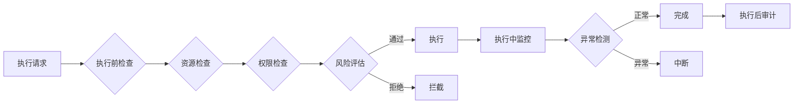
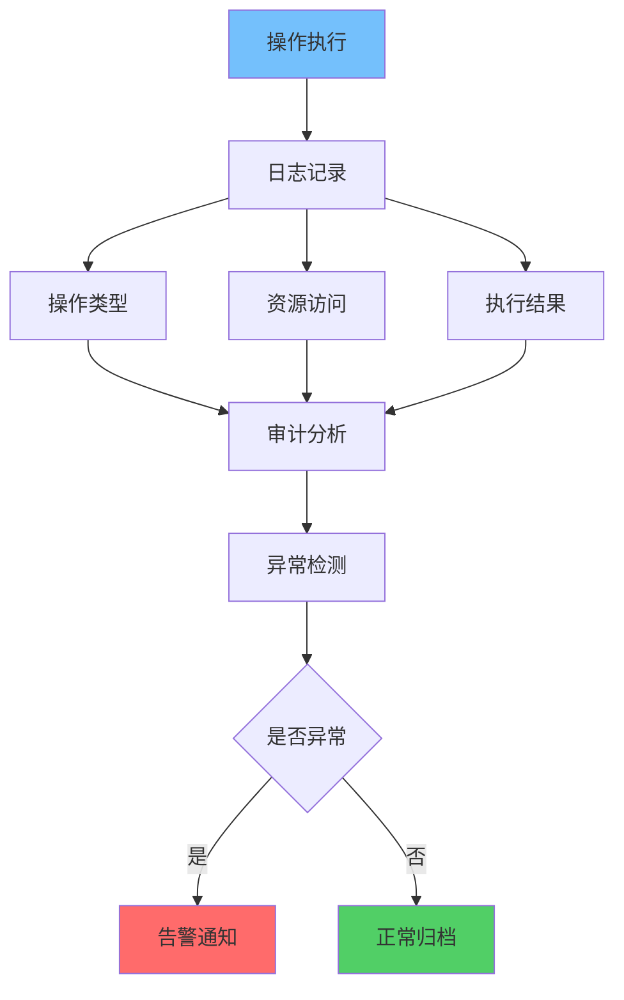

**作者：** HOS(安全风信子)
**日期：** 2026-04-26
**主要来源平台：** GitHub/HuggingFace/arXiv
**摘要：** 安全边界定义了Agent的能力上限，是防止AI越权行为的第一道防线。本文阐述Agent安全边界设计实战，涵盖策略引擎、白名单黑名单、执行前检查、执行中监控、执行后审计五大核心模块。通过Python实现完整的安全边界框架，配合Mermaid图表展示监控流程。

@[TOC](目录)

---

# 给AI画个圈：Agent安全边界设计实战

## 1 引言：为什么需要安全边界

安全边界确保Agent在可控范围内行动，防止越权操作和数据泄露。

## 2 策略引擎

### 2.1 核心架构

策略引擎是安全边界的核心决策中心。

```python
class PolicyEngine:
    """安全策略引擎"""

    def __init__(self):
        self.policies = []
        self.whitelist = set()
        self.blacklist = set()

    def add_policy(self, policy: dict):
        """添加策略规则"""
        self.policies.append(policy)

    def evaluate(self, agent_id: str, action: str, resource: str) -> bool:
        """评估动作是否允许"""
        if resource in self.blacklist:
            return False
        if resource in self.whitelist:
            return True

        for policy in self.policies:
            if self._matches_policy(agent_id, action, resource, policy):
                return policy.get("allow", False)

        return False

    def _matches_policy(self, agent_id: str, action: str, resource: str, policy: dict) -> bool:
        """检查是否匹配策略"""
        return (policy.get("agent_id") == agent_id or policy.get("agent_id") is None) and \
               (policy.get("action") == action or policy.get("action") == "*") and \
               (policy.get("resource") == resource or policy.get("resource") == "*")
```

## 3 白名单与黑名单

### 3.1 实现机制

```python
class ResourceAccessControl:
    """资源访问控制器"""

    def __init__(self):
        self.whitelist = {}
        self.blacklist = {}

    def add_to_whitelist(self, agent_id: str, resources: list):
        """添加到白名单"""
        self.whitelist[agent_id] = set(resources)

    def add_to_blacklist(self, agent_id: str, resources: list):
        """添加到黑名单"""
        self.blacklist[agent_id] = set(resources)

    def is_allowed(self, agent_id: str, resource: str) -> bool:
        """检查是否允许访问"""
        if agent_id in self.blacklist and resource in self.blacklist[agent_id]:
            return False
        if agent_id in self.whitelist and resource in self.whitelist[agent_id]:
            return True
        return True
```

## 4 执行检查机制



### 4.1 执行前检查

```python
class PreExecutionChecker:
    """执行前检查器"""

    def __init__(self, policy_engine, risk_assessor):
        self.policy_engine = policy_engine
        self.risk_assessor = risk_assessor

    def pre_check(self, agent_id: str, action: str, resource: str) -> tuple:
        """执行前检查"""
        if not self.policy_engine.evaluate(agent_id, action, resource):
            return False, "Policy denied"

        risk_level = self.risk_assessor.assess(agent_id, action, resource)
        if risk_level > 0.8:
            return False, "High risk"

        return True, "Approved"
```

## 5 执行后审计

### 5.1 审计日志设计



审计日志是安全边界的重要组成部分，用于事后分析和问题追溯。

## 6 监控与审计

```python
class ExecutionMonitor:
    """执行监控器"""

    def __init__(self):
        self.active_executions = {}
        self.execution_history = []

    def start_monitoring(self, execution_id: str, context: dict):
        """开始监控"""
        self.active_executions[execution_id] = {
            "context": context,
            "start_time": datetime.datetime.now(),
            "status": "running"
        }

    def detect_anomaly(self, execution_id: str, metric: dict) -> bool:
        """异常检测"""
        if execution_id not in self.active_executions:
            return False

        execution = self.active_executions[execution_id]
        if metric.get("cpu_usage", 0) > 90:
            return True
        if metric.get("memory_usage", 0) > 90:
            return True

        return False

    def stop_monitoring(self, execution_id: str):
        """停止监控"""
        if execution_id in self.active_executions:
            self.execution_history.append(self.active_executions[execution_id])
            del self.active_executions[execution_id]
```

---

**参考链接：**
- 主要来源：[Zero Trust Architecture](https://www.nist.gov/) - 零信任架构标准
- 辅助：[MITRE ATT&CK](https://attack.mitre.org/) - 攻击框架

**附录（Appendix）：**
无

**关键词：** Agent安全边界, 策略引擎, 白名单, 黑名单, 执行监控