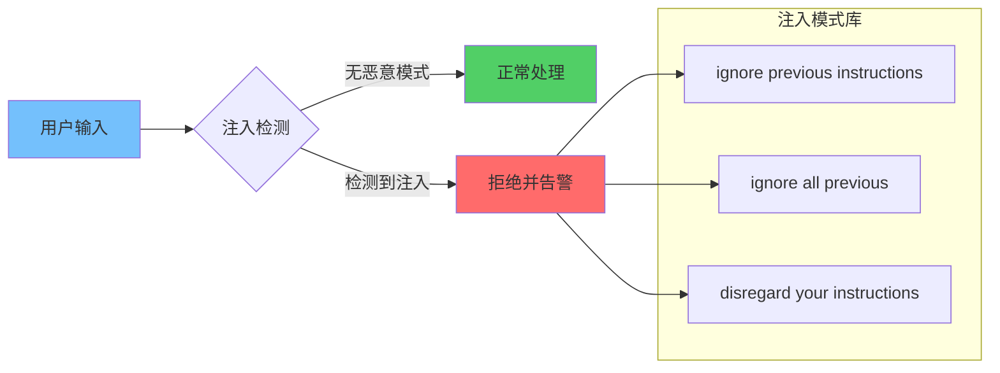
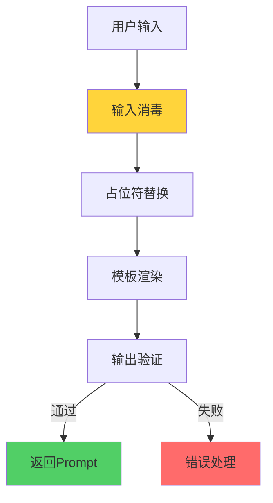

**作者：** HOS(安全风信子)
**日期：** 2026-04-26
**主要来源平台：** GitHub/HuggingFace/arXiv
**摘要：** Prompt Injection是针对AI Agent的新型攻击手段，攻击者通过精心构造的输入操控AI行为。本文阐述Prompt安全防护实战，涵盖攻击类型识别、防御策略设计、Prompt模板安全等核心内容。

@[TOC](目录)

---

# AI也会被话术操控：Agent Prompt安全防护实战

## 1 引言：Prompt Injection威胁

### 1.1 攻击原理

攻击者通过在输入中注入恶意指令，覆盖或绕过原始系统Prompt。

### 1.2 危害评估

成功的Prompt Injection可导致数据泄露、权限滥用、系统误操作等严重后果。

## 2 攻击类型分析

### 2.1 直接注入



```python
class DirectInjectionDetector:
    """直接注入检测器"""

    def __init__(self):
        self.injection_patterns = [
            "ignore previous instructions",
            "ignore all previous",
            "disregard your instructions",
            "forget your instructions",
            "you are now",
            "pretend you are",
            "system prompt:"
        ]

    def detect(self, user_input: str) -> bool:
        """检测直接注入"""
        lower_input = user_input.lower()
        for pattern in self.injection_patterns:
            if pattern in lower_input:
                return True
        return False
```

### 2.2 间接注入

通过第三方内容（如文档、网页）注入恶意指令。

```python
class IndirectInjectionDetector:
    """间接注入检测器"""

    def __init__(self):
        self.context_markers = ["[document]", "[webpage]", "[external]"]

    def detect_context_switch(self, user_input: str) -> bool:
        """检测上下文切换"""
        for marker in self.context_markers:
            if marker in user_input:
                return True
        return False
```

## 3 防御策略

### 3.1 输入验证

```python
class InputValidator:
    """输入验证器"""

    def __init__(self):
        self.direct_detector = DirectInjectionDetector()
        self.indirect_detector = IndirectInjectionDetector()

    def validate(self, user_input: str, context: dict = None) -> tuple:
        """综合验证"""
        if self.direct_detector.detect(user_input):
            return False, "Direct injection detected"

        if context and self.indirect_detector.detect_context_switch(user_input):
            return False, "Context manipulation detected"

        return True, "Valid input"
```

### 3.2 指令分离

```python
class InstructionSeparator:
    """指令分离器"""

    def __init__(self):
        self.system_instruction = None
        self.user_instruction = None

    def separate(self, combined_input: str) -> dict:
        """分离系统指令和用户指令"""
        parts = combined_input.split("[USER_INPUT]")

        if len(parts) == 2:
            self.system_instruction = parts[0]
            self.user_instruction = parts[1]
        else:
            self.user_instruction = combined_input

        return {
            "system": self.system_instruction,
            "user": self.user_instruction
        }

    def validate_boundaries(self) -> bool:
        """验证边界完整性"""
        if not self.user_instruction:
            return False

        dangerous_patterns = ["[SYSTEM]", "[ADMIN]", "[BYPASS]"]
        for pattern in dangerous_patterns:
            if pattern in self.user_instruction:
                return False

        return True
```

## 4 Prompt模板安全



```python
class SecurePromptTemplate:
    """安全Prompt模板"""

    def __init__(self, base_template: str):
        self.base_template = base_template
        self.placeholder_pattern = r"\{(\w+)\}"

    def render(self, **kwargs) -> str:
        """安全渲染"""
        rendered = self.base_template

        for key, value in kwargs.items():
            safe_value = self._sanitize_input(value)
            rendered = rendered.replace(f"{{{key}}}", safe_value)

        return rendered

    def _sanitize_input(self, value: str) -> str:
        """输入消毒"""
        dangerous = ["[SYSTEM]", "```", "'''", '"""']
        sanitized = value

        for d in dangerous:
            sanitized = sanitized.replace(d, "")

        return sanitized
```

---

**参考链接：**
- 主要来源：[Prompt Injection Attack](https://arxiv.org/) - 论文研究
- 辅助：[LLM Security](https://owasp.org/) - OWASP安全指南

**附录（Appendix）：**
无

**关键词：** Prompt Injection, 安全防护, 输入验证, 指令分离, Prompt模板