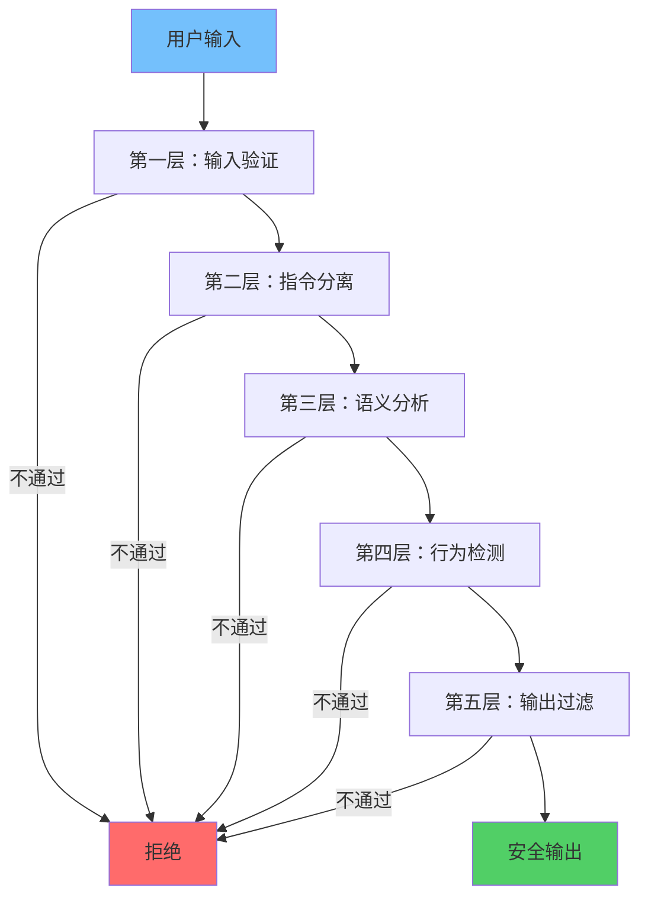
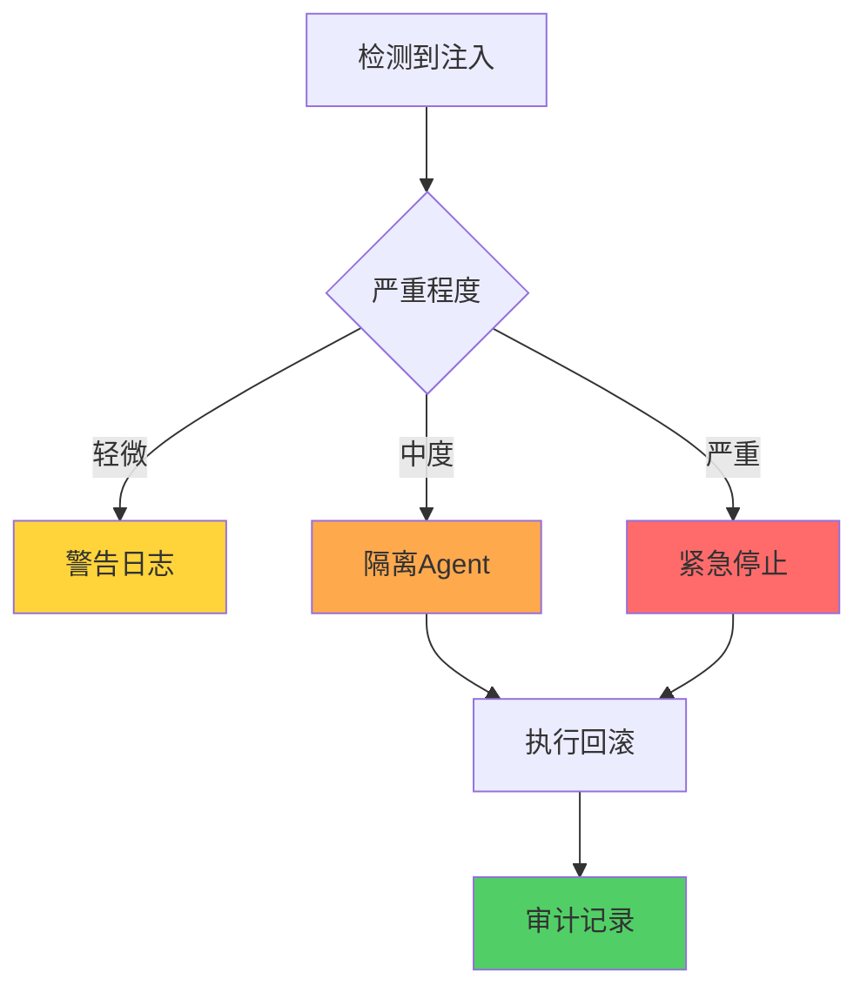

**作者：** HOS(安全风信子)
**日期：** 2026-04-26
**主要来源平台：** GitHub/HuggingFace/arXiv
**摘要：** Agent抗Prompt Injection需要多层防御机制。本文阐述抗注入技术实战，涵盖指令分离、输入规范化、语义分析、多层防御机制、注入检测与损害控制等核心内容。

@[TOC](目录)

---

# 让AI免疫话术攻击：Agent抗Prompt Injection实战

## 1 引言：为什么需要抗注入

单一防御手段容易被绕过，需要多层次防御体系。

## 2 抗注入技术

### 2.1 指令分离

```python
class InstructionSeparator:
    """指令分离器 - 核心抗注入技术"""

    def __init__(self):
        self.privileged_instructions = []
        self.untrusted_input_marker = "[UNTRUSTED]"

    def separate_privilege(self, prompt: str) -> dict:
        """特权指令分离"""
        parts = prompt.split(self.untrusted_input_marker)

        privileged = parts[0] if len(parts) > 1 else ""
        untrusted = parts[-1] if len(parts) > 1 else prompt

        return {
            "privileged": privileged,
            "untrusted": untrusted,
            "separated": True
        }

    def validate_no_privilege_escalation(self, untrusted_input: str) -> bool:
        """验证无权限提升"""
        privilege_keywords = [
            "ignore", "disregard", "forget", "system",
            "admin", "root", "sudo", "override"
        ]

        lower_input = untrusted_input.lower()
        for keyword in privilege_keywords:
            if keyword in lower_input:
                return False

        return True
```

### 2.2 输入规范化

```python
class InputNormalizer:
    """输入规范化器"""

    def __init__(self):
        self.normalization_rules = []

    def normalize(self, user_input: str) -> str:
        """规范化用户输入"""
        normalized = user_input

        normalized = self._remove_null_bytes(normalized)
        normalized = self._normalize_unicode(normalized)
        normalized = self._collapse_whitespace(normalized)
        normalized = self._escape_special_chars(normalized)

        return normalized

    def _remove_null_bytes(self, text: str) -> str:
        """移除空字节"""
        return text.replace("\x00", "")

    def _normalize_unicode(self, text: str) -> str:
        """Unicode规范化"""
        import unicodedata
        return unicodedata.normalize('NFKC', text)

    def _collapse_whitespace(self, text: str) -> str:
        """折叠空白字符"""
        import re
        return re.sub(r'\s+', ' ', text).strip()

    def _escape_special_chars(self, text: str) -> str:
        """转义特殊字符"""
        special_chars = ['[', ']', '{', '}', '<', '>']
        escaped = text

        for char in special_chars:
            if char in ['[', ']']:
                escaped = escaped.replace(char, f'\\{char}')

        return escaped
```

### 2.3 语义分析

```python
class SemanticAnalyzer:
    """语义分析器 - 检测恶意意图"""

    def __init__(self):
        self.malicious_patterns = []

    def analyze(self, text: str) -> dict:
        """语义分析"""
        score = 0.0
        detected_patterns = []

        if self._has_contradictory_instructions(text):
            score += 0.3
            detected_patterns.append("contradictory_instructions")

        if self._has_role_play_attempt(text):
            score += 0.4
            detected_patterns.append("role_play_attempt")

        if self._has_context_manipulation(text):
            score += 0.3
            detected_patterns.append("context_manipulation")

        return {
            "malicious_score": score,
            "detected_patterns": detected_patterns,
            "is_malicious": score > 0.5
        }

    def _has_contradictory_instructions(self, text: str) -> bool:
        """检测矛盾指令"""
        contradiction_pairs = [
            ("do", "don't"),
            ("yes", "no"),
            ("allowed", "not allowed")
        ]

        lower_text = text.lower()
        for pos, neg in contradiction_pairs:
            if pos in lower_text and neg in lower_text:
                return True

        return False

    def _has_role_play_attempt(self, text: str) -> bool:
        """检测角色扮演尝试"""
        role_play_patterns = [
            "pretend you are",
            "act as if you were",
            "you are now a",
            "roleplay"
        ]

        lower_text = text.lower()
        return any(pattern in lower_text for pattern in role_play_patterns)

    def _has_context_manipulation(self, text: str) -> bool:
        """检测上下文操控"""
        manipulation_patterns = [
            "previous instructions",
            "above instructions",
            "your system prompt"
        ]

        lower_text = text.lower()
        return any(pattern in lower_text for pattern in manipulation_patterns)
```

## 3 多层防御机制

### 3.1 防御层次设计



多层防御机制确保即使某一层被突破，其他层仍能提供保护。

## 4 损害控制



```python
class DamageControlManager:
    """损害控制器"""

    def __init__(self):
        self.rollback_actions = []
        self.isolation_enabled = True

    def rollback_if_needed(self, execution_id: str):
        """必要时回滚"""
        if execution_id in self.rollback_actions:
            action = self.rollback_actions[execution_id]
            if action.get("executed"):
                self._perform_rollback(action)

    def _perform_rollback(self, action: dict):
        """执行回滚"""
        action_type = action.get("type")

        if action_type == "write":
            self._rollback_write(action)
        elif action_type == "delete":
            self._rollback_delete(action)

    def _rollback_write(self, action: dict):
        """回滚写操作"""
        pass

    def _rollback_delete(self, action: dict):
        """回滚删除操作"""
        pass

    def isolate_agent(self, agent_id: str):
        """隔离受感染Agent"""
        if self.isolation_enabled:
            print(f"Isolating agent {agent_id}")
```

---

**参考链接：**
- 主要来源：[Prompt Injection Defense Research](https://arxiv.org/) - 学术研究
- 辅助：[Securing LLMs](https://cloud.google.com/) - 安全实践

**附录（Appendix）：**
无

**关键词：** 抗Prompt Injection, 指令分离, 输入规范化, 语义分析, 多层防御