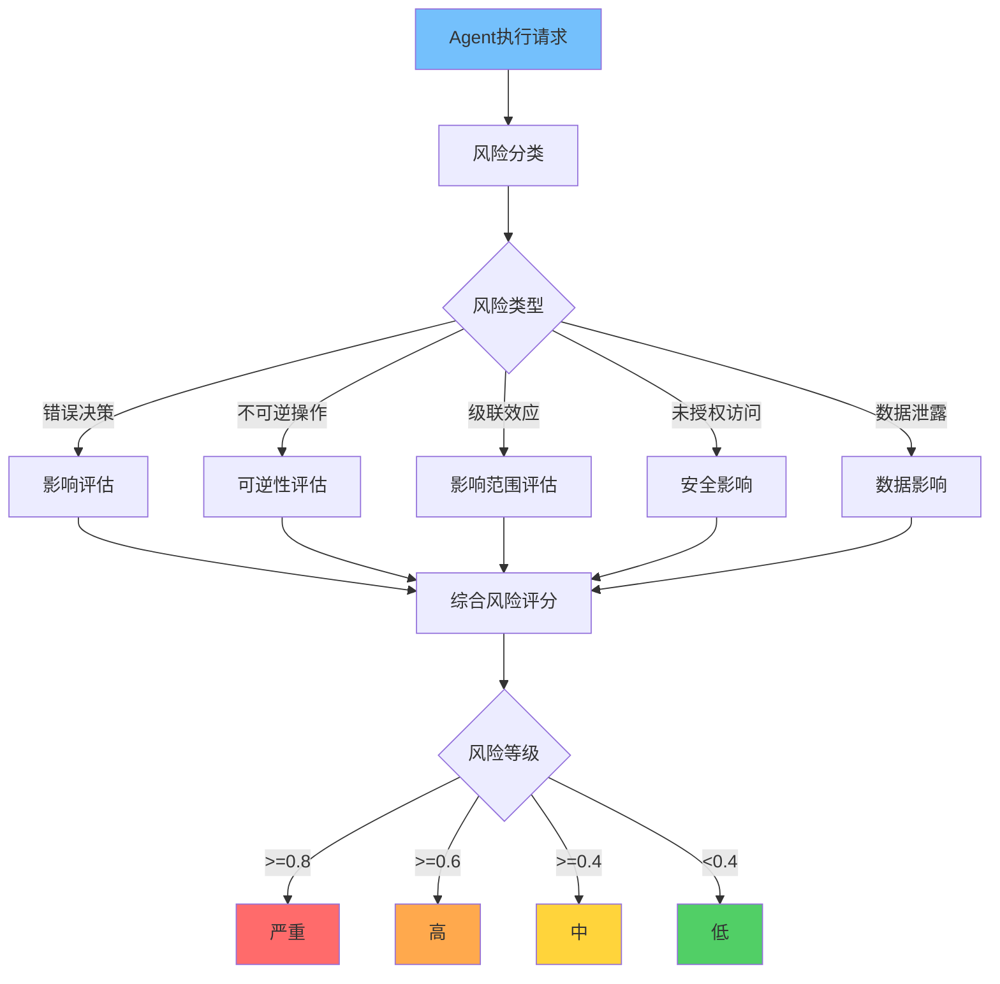
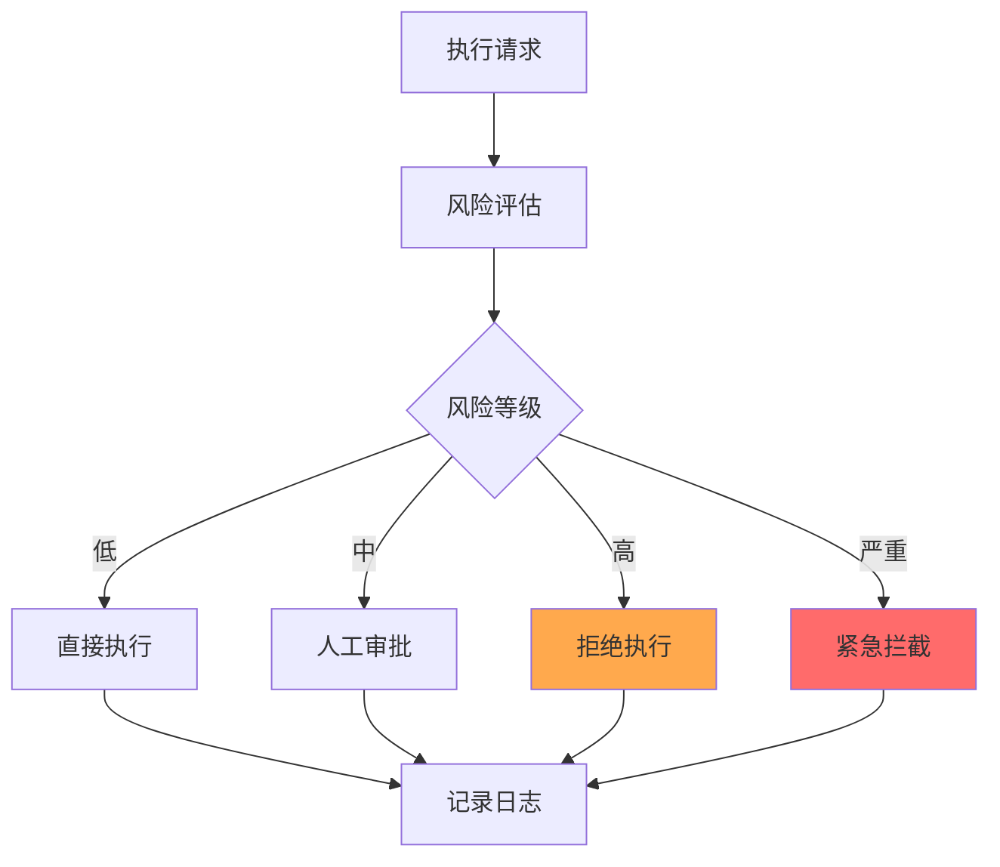

**作者：** HOS(安全风信子)
**日期：** 2026-04-26
**主要来源平台：** GitHub/HuggingFace/arXiv
**摘要：** Agent自主执行带来效率提升的同时也伴随着风险。本文阐述Agent自主执行风险控制实战，涵盖风险类型识别、风险评估模型、风险分级响应、执行验证与回滚机制等核心内容。

@[TOC](目录)

---

# AI自主行动的风险：Agent自主执行风险控制实战

## 1 引言：自主与风险的平衡

Agent自主执行能大幅提升效率，但错误的自主决策可能造成严重后果。

## 2 风险类型识别

### 2.1 风险分类

```python
class RiskType(Enum):
    """风险类型枚举"""
    ERROR_DECISION = "error_decision"
    IRREVERSIBLE_ACTION = "irreversible_action"
    CASCADE_EFFECT = "cascade_effect"
    UNAUTHORIZED_ACCESS = "unauthorized_access"
    DATA_LEAKAGE = "data_leakage"

class RiskClassifier:
    """风险分类器"""

    def __init__(self):
        self.risk_patterns = {
            RiskType.ERROR_DECISION: ["incorrect", "wrong", "mistake"],
            RiskType.IRREVERSIBLE_ACTION: ["delete", "drop", "truncate", "remove"],
            RiskType.CASCADE_EFFECT: ["cascade", "propagate", "affect"],
            RiskType.UNAUTHORIZED_ACCESS: ["unauthorized", "access", "privilege"],
            RiskType.DATA_LEAKAGE: ["export", "copy", "send", "leak"]
        }

    def classify(self, action: str, context: dict) -> list:
        """风险分类"""
        detected_risks = []
        lower_action = action.lower()

        for risk_type, patterns in self.risk_patterns.items():
            if any(pattern in lower_action for pattern in patterns):
                detected_risks.append(risk_type)

        return detected_risks
```

## 3 风险评估模型

### 3.1 多维度评估



```python
class RiskAssessor:
    """风险评估器"""

    def __init__(self):
        self.impact_weights = {
            "data_loss": 0.4,
            "security_breach": 0.3,
            "service_disruption": 0.2,
            "financial_impact": 0.1
        }

    def assess(self, action: str, context: dict) -> dict:
        """综合风险评估"""
        impact = self._assess_impact(action, context)
        likelihood = self._assess_likelihood(action, context)
        reversibility = self._assess_reversibility(action)

        risk_score = (impact * 0.5 + likelihood * 0.3 + reversibility * 0.2)

        return {
            "risk_score": risk_score,
            "impact": impact,
            "likelihood": likelihood,
            "reversibility": reversibility,
            "risk_level": self._get_risk_level(risk_score)
        }

    def _assess_impact(self, action: str, context: dict) -> float:
        """评估影响范围"""
        impact_factors = context.get("impact_factors", [])

        total_impact = 0.0
        for factor, weight in self.impact_weights.items():
            if factor in impact_factors:
                total_impact += weight

        return min(total_impact, 1.0)

    def _assess_likelihood(self, action: str, context: dict) -> float:
        """评估发生概率"""
        historical_failure = context.get("historical_failure_rate", 0.1)

        action_complexity = len(action.split()) / 20.0

        likelihood = min(historical_failure * action_complexity, 1.0)

        return likelihood

    def _assess_reversibility(self, action: str) -> float:
        """评估可逆性"""
        irreversible_keywords = ["delete", "drop", "remove", "destroy"]

        if any(kw in action.lower() for kw in irreversible_keywords):
            return 0.1

        return 0.8

    def _get_risk_level(self, score: float) -> str:
        """风险等级"""
        if score >= 0.8:
            return "critical"
        elif score >= 0.6:
            return "high"
        elif score >= 0.4:
            return "medium"
        else:
            return "low"
```

## 4 风险分级响应

### 4.1 响应策略

```python
class RiskBasedResponseManager:
    """基于风险的响应管理器"""

    def __init__(self):
        self.response_strategies = {
            "critical": ["block", "alert", "isolate"],
            "high": ["require_approval", "limit_scope", "monitor"],
            "medium": ["log", "notify"],
            "low": ["log"]
        }

    def determine_response(self, risk_level: str, context: dict) -> list:
        """确定响应策略"""
        strategies = self.response_strategies.get(risk_level, ["log"])

        if risk_level in ["critical", "high"]:
            strategies.append("require_human_review")

        return strategies

    def execute_response(self, strategies: list, execution_context: dict):
        """执行响应"""
        for strategy in strategies:
            if strategy == "block":
                self._block_execution(execution_context)
            elif strategy == "alert":
                self._send_alert(execution_context)
            elif strategy == "isolate":
                self._isolate_agent(execution_context)
            elif strategy == "require_approval":
                self._request_approval(execution_context)
```

## 5 执行验证与回滚

### 5.1 执行前验证

```python
class PreExecutionValidator:
    """执行前验证器"""

    def __init__(self, risk_assessor):
        self.risk_assessor = risk_assessor

    def validate(self, action: str, context: dict) -> tuple:
        """执行前验证"""
        risk_assessment = self.risk_assessor.assess(action, context)

        if risk_assessment["risk_level"] == "critical":
            return False, "Critical risk - blocking execution"

        if risk_assessment["risk_level"] == "high":
            return False, "High risk - requires human approval"

        return True, "Validation passed"
```

### 5.2 执行验证流程



### 5.2 回滚机制

```python
class ExecutionRollbackManager:
    """执行回滚管理器"""

    def __init__(self):
        self.checkpoints = {}
        self.execution_history = []

    def create_checkpoint(self, execution_id: str, state: dict):
        """创建检查点"""
        self.checkpoints[execution_id] = {
            "state": state.copy(),
            "timestamp": datetime.datetime.now()
        }

    def rollback(self, execution_id: str, target_state: str = None):
        """回滚到指定状态"""
        if execution_id not in self.checkpoints:
            return False

        checkpoint = self.checkpoints[execution_id]

        if target_state:
            self._restore_state(target_state)
        else:
            self._restore_state(checkpoint["state"])

        return True

    def _restore_state(self, state: dict):
        """恢复状态"""
        pass
```

---

**参考链接：**
- 主要来源：[AI Risk Management](https://arxiv.org/) - 风险研究
- 辅助：[Enterprise AI Governance](https://www.gartner.com/) - 治理框架

**附录（Appendix）：**
无

**关键词：** Agent自主执行, 风险评估, 风险分级, 执行验证, 回滚机制