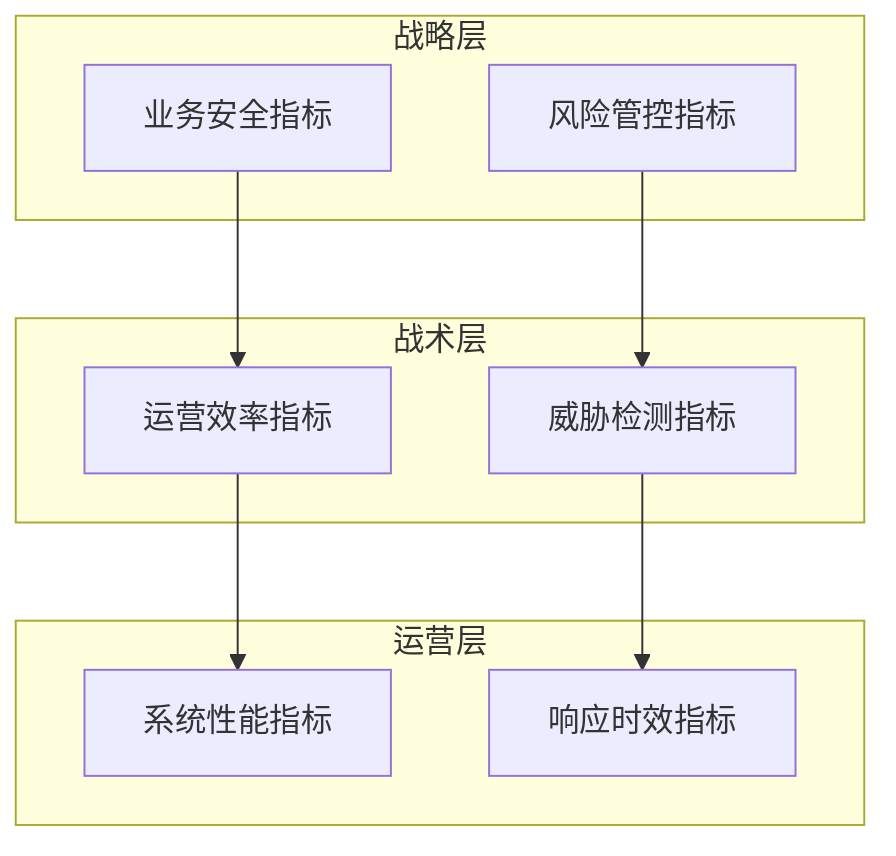
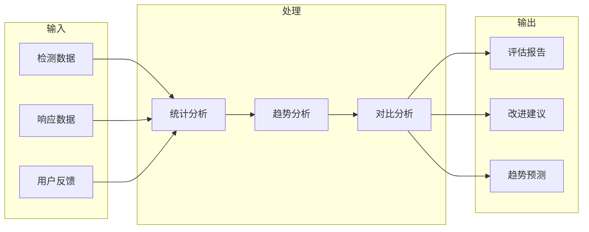

**作者：** HOS(安全风信子)
**日期：** 2026-04-26
**主要来源平台：** GitHub/HuggingFace/arXiv
**摘要：** AI安全运营体系需要持续的改进与度量来确保持续优化。本文深入探讨AI安全运营的持续改进与度量体系，涵盖指标体系建设、效果评估方法、性能优化策略、反馈闭环机制四大核心模块。通过构建科学的度量框架，企业可以量化AI安全能力，发现改进空间，推动安全运营水平的持续提升。

@[TOC](目录)

---

# 持续进化：AI安全运营的持续改进与度量体系

## 1 引言：为什么需要持续改进

### 1.1 安全运营的动态特性

网络安全威胁日新月异，攻击技术不断演进。一个静态的安全运营体系无法应对动态变化的威胁环境。AI安全运营体系必须具备持续学习和改进的能力，才能在对抗中保持优势。

持续改进不仅是技术需求，更是业务需求。企业安全环境的变化、新业务的引入、新技术的应用，都要求安全运营体系能够快速适应。

### 1.2 度量的重要性

度量是改进的基础。没有度量就无法评估当前状态，无法识别问题，无法跟踪改进效果。科学的度量体系是AI安全运营持续优化的前提。

### 1.3 持续改进框架

本文提出的持续改进框架包含四个核心环节：指标定义、数据采集、分析评估、反馈优化。四个环节形成闭环，推动安全运营水平的螺旋式上升。

## 2 指标体系建设

### 2.1 指标分层架构



指标体系分为三个层次：战略层指标反映业务安全目标；战术层指标评估安全运营效果；运营层指标监控日常运营状态。

```python
class MetricsHierarchy:
    """指标分层体系"""

    def __init__(self):
        self.strategic_metrics = StrategicMetrics()
        self.tactical_metrics = TacticalMetrics()
        self.operational_metrics = OperationalMetrics()

    def get_metric_value(self, metric_name: str) -> MetricValue:
        """获取指标值"""
        if metric_name in self.strategic_metrics:
            return self.strategic_metrics.get(metric_name)
        elif metric_name in self.tactical_metrics:
            return self.tactical_metrics.get(metric_name)
        elif metric_name in self.operational_metrics:
            return self.operational_metrics.get(metric_name)
        else:
            raise ValueError(f"Unknown metric: {metric_name}")

    def calculate_composite_score(self) -> CompositeScore:
        """计算综合评分"""
        strategic_score = self.strategic_metrics.calculate()
        tactical_score = self.tactical_metrics.calculate()
        operational_score = self.operational_metrics.calculate()

        return CompositeScore(
            strategic=strategic_score,
            tactical=tactical_score,
            operational=operational_score,
            overall=self._weighted_average(
                strategic_score,
                tactical_score,
                operational_score
            )
        )
```

### 2.2 核心指标定义

**检测能力指标**：
- 威胁检出率（Threat Detection Rate）：发现的安全事件占总安全事件的比例
- 误报率（False Positive Rate）：错误告警占总告警的比例
- 漏报率（False Negative Rate）：未发现威胁占总威胁的比例

**响应效率指标**：
- 平均检测时间（MTTD）：从威胁出现到被检测的平均时间
- 平均响应时间（MTTR）：从检测到威胁到完成响应的平均时间
- 平均恢复时间（MTTC）：从事件发生到业务恢复的平均时间

**运营效果指标**：
- 自动化率（Automation Rate）：自动化处置的事件占总事件的比例
- 运营效率提升（Efficiency Improvement）：AI辅助后效率相对之前的提升

```python
class CoreMetricsCalculator:
    """核心指标计算器"""

    def __init__(self, data_store: MetricsDataStore):
        self.data_store = data_store

    async def calculate_detection_rate(self) -> DetectionRate:
        """计算威胁检出率"""
        total_threats = await self.data_store.get_total_threats()
        detected_threats = await self.data_store.get_detected_threats()

        rate = detected_threats / total_threats if total_threats > 0 else 0

        return DetectionRate(
            rate=rate,
            total=total_threats,
            detected=detected_threats,
            timestamp=datetime.now()
        )

    async def calculate_mttd(self) -> MTTD:
        """计算平均检测时间"""
        detection_times = await self.data_store.get_detection_times()

        if not detection_times:
            return MTTD(value=0, sample_count=0)

        avg_time = statistics.mean(detection_times)

        return MTTD(
            value=avg_time,
            sample_count=len(detection_times),
            min=min(detection_times),
            max=max(detection_times),
            median=statistics.median(detection_times)
        )

    async def calculate_mttr(self) -> MTTR:
        """计算平均响应时间"""
        response_times = await self.data_store.get_response_times()

        if not response_times:
            return MTTR(value=0, sample_count=0)

        avg_time = statistics.mean(response_times)

        return MTTR(
            value=avg_time,
            sample_count=len(response_times),
            min=min(response_times),
            max=max(response_times),
            median=statistics.median(response_times)
        )
```

### 2.3 指标采集与存储

```python
class MetricsCollector:
    """指标采集器"""

    def __init__(self, config: CollectorConfig):
        self.config = config
        self.sources = self._initialize_sources()
        self.time_series_store = TimeSeriesStore()

    def _initialize_sources(self) -> Dict[str, MetricSource]:
        """初始化指标源"""
        return {
            'siem': SIEMMetricSource(),
            'edr': EDRMetricSource(),
            'soc': SOCMetricSource(),
            'threat_intel': ThreatIntelMetricSource()
        }

    async def collect_all(self) -> List[MetricDataPoint]:
        """采集所有指标"""
        all_metrics = []

        for source_name, source in self.sources.items():
            try:
                metrics = await source.collect()
                all_metrics.extend(metrics)
            except Exception as e:
                logger.error(f"Failed to collect from {source_name}: {e}")

        await self.time_series_store.store(all_metrics)

        return all_metrics
```

## 3 效果评估方法

### 3.1 多维度评估框架



```python
class EvaluationFramework:
    """评估框架"""

    def __init__(self):
        self.evaluators = {
            'detection': DetectionEvaluator(),
            'response': ResponseEvaluator(),
            'operational': OperationalEvaluator(),
            'user_satisfaction': SatisfactionEvaluator()
        }

    async def evaluate(
        self,
        time_range: TimeRange
    ) -> EvaluationResult:
        """执行多维度评估"""
        results = {}

        for dimension, evaluator in self.evaluators.items():
            results[dimension] = await evaluator.evaluate(time_range)

        return EvaluationResult(
            dimensions=results,
            overall_score=self._calculate_overall(results),
            recommendations=await self._generate_recommendations(results)
        )

    def _calculate_overall(self, results: dict) -> float:
        """计算综合评分"""
        scores = [
            r.score for r in results.values()
        ]
        return statistics.mean(scores)
```

### 3.2 检测能力评估

```python
class DetectionEvaluator:
    """检测能力评估器"""

    def __init__(self):
        self.metrics_calculator = CoreMetricsCalculator()

    async def evaluate(
        self,
        time_range: TimeRange
    ) -> DetectionEvaluationResult:
        """评估检测能力"""
        detection_rate = await self.metrics_calculator.calculate_detection_rate()

        false_positive_rate = await self._calculate_fpr()
        false_negative_rate = await self._calculate_fnr()

        detection_latency = await self._calculate_detection_latency()

        return DetectionEvaluationResult(
            detection_rate=detection_rate,
            false_positive_rate=false_positive_rate,
            false_negative_rate=false_negative_rate,
            detection_latency=detection_latency,
            score=self._calculate_detection_score(
                detection_rate,
                false_positive_rate,
                false_negative_rate
            )
        )

    async def _calculate_fpr(self) -> float:
        """计算误报率"""
        total_alerts = await get_total_alerts()
        false_alerts = await get_false_alerts()
        return false_alerts / total_alerts if total_alerts > 0 else 0

    async def _calculate_fnr(self) -> float:
        """计算漏报率"""
        total_threats = await get_total_threats()
        missed_threats = await get_missed_threats()
        return missed_threats / total_threats if total_threats > 0 else 0
```

### 3.3 响应效率评估

```python
class ResponseEvaluator:
    """响应效率评估器"""

    async def evaluate(
        self,
        time_range: TimeRange
    ) -> ResponseEvaluationResult:
        """评估响应效率"""
        mttd = await self._calculate_mttd(time_range)
        mttr = await self._calculate_mttr(time_range)
        automation_rate = await self._calculate_automation_rate(time_range)

        return ResponseEvaluationResult(
            mttd=mttd,
            mttr=mttr,
            automation_rate=automation_rate,
            score=self._calculate_response_score(mttd, mttr, automation_rate)
        )

    async def _calculate_automation_rate(
        self,
        time_range: TimeRange
    ) -> float:
        """计算自动化处置率"""
        total_incidents = await get_incidents(time_range)
        automated_incidents = await get_automated_incidents(time_range)

        return automated_incidents / total_incidents if total_incidents > 0 else 0
```

## 4 性能优化策略

### 4.1 检测模型优化

```python
class ModelOptimizer:
    """模型优化器"""

    def __init__(self, model_store: ModelStore):
        self.model_store = model_store
        self.evaluation_framework = EvaluationFramework()

    async def optimize_detection_model(
        self,
        current_model: DetectionModel,
        evaluation_result: DetectionEvaluationResult
    ) -> OptimizedModel:
        """优化检测模型"""
        if evaluation_result.score >= 0.9:
            logger.info("Model performance is satisfactory")
            return current_model

        performance_issues = self._identify_issues(evaluation_result)

        new_model_version = await self._train_improved_model(
            current_model,
            performance_issues
        )

        validated_model = await self._validate_model(new_model_version)

        return validated_model

    async def _train_improved_model(
        self,
        base_model: DetectionModel,
        issues: List[PerformanceIssue]
    ) -> DetectionModel:
        """训练改进模型"""
        training_config = TrainingConfig(
            base_model=base_model,
            focus_areas=issues,
            epochs=50,
            learning_rate=0.001
        )

        return await self.model_store.train(training_config)
```

### 4.2 流程优化

```python
class ProcessOptimizer:
    """流程优化器"""

    def __init__(self):
        self.bottleneck_detector = BottleneckDetector()
        self.optimization_engine = OptimizationEngine()

    async def optimize_workflow(
        self,
        workflow: Workflow
    ) -> OptimizedWorkflow:
        """优化工作流"""
        bottlenecks = await self.bottleneck_detector.find_bottlenecks(
            workflow
        )

        if not bottlenecks:
            return workflow

        optimizations = []
        for bottleneck in bottlenecks:
            optimization = await self.optimization_engine.optimize(bottleneck)
            optimizations.append(optimization)

        return self._apply_optimizations(workflow, optimizations)
```

## 5 反馈闭环机制

### 5.1 反馈采集

```python
class FeedbackCollector:
    """反馈采集器"""

    def __init__(self):
        self.feedback_channels = {
            'user_survey': UserSurveyChannel(),
            'analyst_feedback': AnalystFeedbackChannel(),
            'system_metrics': SystemMetricsChannel()
        }

    async def collect_feedback(self) -> List[Feedback]:
        """采集各类反馈"""
        all_feedback = []

        for channel_name, channel in self.feedback_channels.items():
            try:
                feedback = await channel.collect()
                all_feedback.extend(feedback)
            except Exception as e:
                logger.error(f"Feedback collection failed from {channel_name}: {e}")

        return all_feedback
```

### 5.2 闭环管理

```python
class ClosedLoopManager:
    """闭环管理器"""

    def __init__(self):
        self.feedback_collector = FeedbackCollector()
        self.improvement_tracker = ImprovementTracker()

    async def manage_closed_loop(self) -> ClosedLoopResult:
        """管理反馈闭环"""
        feedback = await self.feedback_collector.collect_feedback()

        processed_feedback = await self._process_feedback(feedback)

        improvements = await self._generate_improvements(processed_feedback)

        tracked_improvements = await self.improvement_tracker.track(improvements)

        return ClosedLoopResult(
            feedback_count=len(feedback),
            improvements_generated=len(improvements),
            improvements_tracked=len(tracked_improvements)
        )
```

## 6 结论与展望

持续改进与度量体系是AI安全运营的核心支撑。通过科学的指标体系、全面的效果评估、有效的优化策略、闭环的反馈机制，企业可以实现安全运营水平的持续提升。

---

**参考链接：**

- [Gartner Security Operations](https://www.gartner.com/security) - 安全运营成熟度模型
- [NIST CSF](https://www.nist.gov/cyberframework) - 网络安全框架

**附录（Appendix）：**

```python
# 核心指标计算公式

# 检出率
Detection_Rate = Detected_Threats / Total_Threats × 100%

# 误报率
FPR = False_Alerts / Total_Alerts × 100%

# MTTD
MTTD = Σ(Detection_Time - Threat_Time) / Detections

# MTTR
MTTR = Σ(Response_Time - Detection_Time) / Responses

# 综合评分
Overall_Score = Detection_Score × 0.4 + Response_Score × 0.4 + Operational_Score × 0.2
```

**关键词：** 持续改进，度量体系，效果评估，性能优化，反馈闭环
