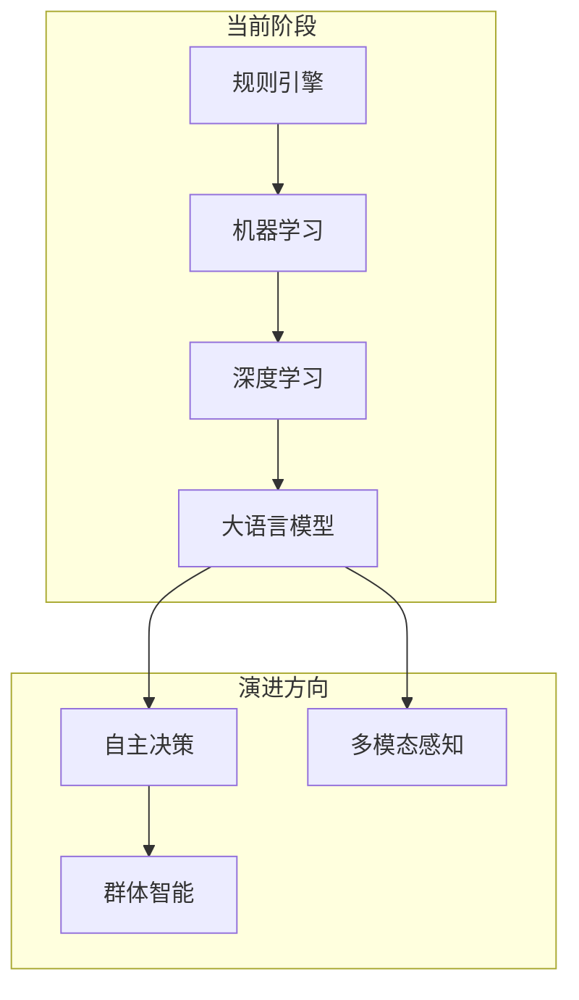
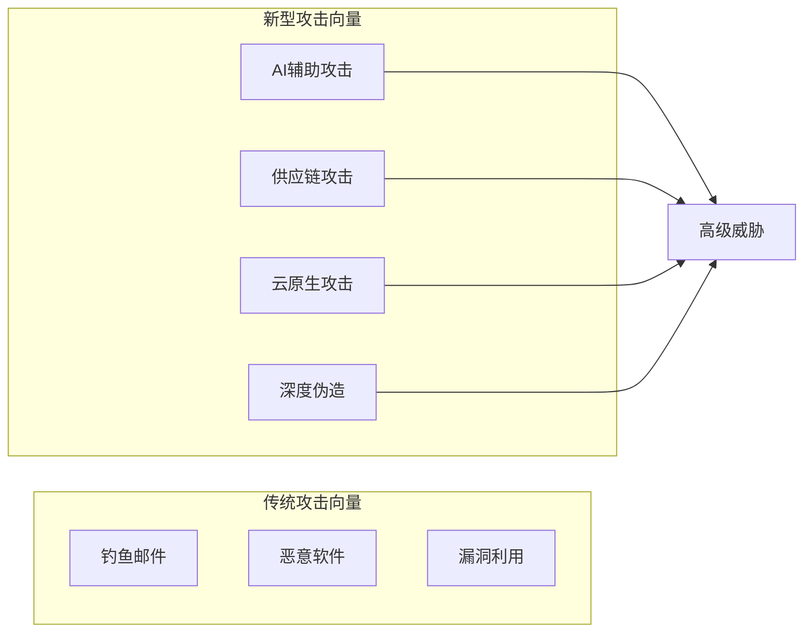
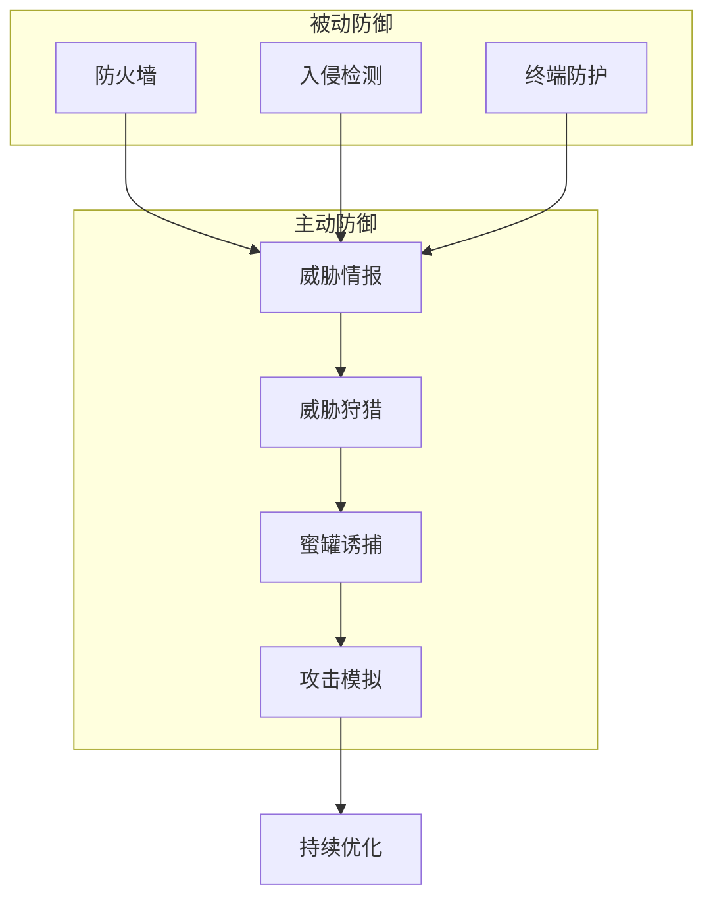

**作者：** HOS(安全风信子)
**日期：** 2026-04-26
**主要来源平台：** GitHub/HuggingFace/arXiv
**摘要：** AI安全运营正处于快速演进期，新技术、新威胁、新需求不断涌现。本文深入探讨AI安全运营的未来趋势与演进路线，涵盖AI安全技术演进方向、威胁态势演变预测、防御技术发展趋势、运营模式变革四大核心模块。通过对前沿技术的分析和对未来发展的预判，为企业制定AI安全运营战略提供参考。

@[TOC](目录)

---

# 面向未来：AI安全运营的未来趋势与演进路线

## 1 引言：站在变革的十字路口

### 1.1 AI安全运营的现状

当前AI安全运营已经实现了从人工到自动化的重要转变。AI技术在威胁检测、事件分析、响应处置等环节发挥了越来越重要的作用。然而，技术发展永无止境，未来AI安全运营将继续向更智能、更自主、更全面的方向演进。

### 1.2 变革的驱动力

推动AI安全运营变革的驱动力主要来自三个方面：攻击技术的持续进化、AI技术的快速发展、业务需求的不断变化。这三股力量共同作用，将重塑未来的安全运营形态。

### 1.3 本文的目的

本文旨在分析AI安全运营的未来发展趋势，描绘技术演进路线图，帮助企业提前布局，构建面向未来的安全运营能力。

## 2 AI安全技术演进方向

### 2.1 当前技术状态



当前AI安全运营主要依赖机器学习和深度学习技术，在特定任务上取得了良好效果。但面对复杂威胁仍需大量人工介入。

```python
class CurrentTechnologyStack:
    """当前技术栈"""

    def __init__(self):
        self.components = {
            'detection': {
                'ml_models': ['RandomForest', 'XGBoost', 'IsolationForest'],
                'dl_models': ['LSTM', 'Transformer', 'CNN'],
                'llm': ['GPT-4', 'Claude', 'Llama']
            },
            'analysis': {
                'tools': ['NLP', 'Knowledge Graph', 'Graph Neural Network'],
                'engines': ['Reasoning Engine', 'Context Analyzer']
            },
            'response': {
                'automation': ['SOAR', 'Playbook Engine', 'Workflow Orchestrator']
            }
        }
```

### 2.2 大语言模型的安全应用

大语言模型（LLM）正在revolutionize安全运营。LLM可以理解自然语言查询、生成分析报告、辅助决策支持。

```python
class LLMIntegration:
    """大语言模型集成"""

    def __init__(self, llm_config: LLMConfig):
        self.llm = self._initialize_llm(llm_config)
        self.prompt_engine = PromptEngine()

    async def analyze_threat(
        self,
        threat_description: str
    ) -> ThreatAnalysis:
        """分析威胁"""
        prompt = self.prompt_engine.build_threat_analysis_prompt(
            threat_description
        )

        response = await self.llm.complete(prompt)

        return self._parse_analysis_response(response)

    async def generate_investigation_guide(
        self,
        alert: SecurityAlert
    ) -> InvestigationGuide:
        """生成调查指南"""
        prompt = self.prompt_engine.build_investigation_prompt(alert)

        response = await self.llm.complete(prompt)

        return InvestigationGuide(
            steps=self._parse_steps(response),
            estimated_time=self._estimate_time(response),
            resources_required=self._parse_resources(response)
        )
```

### 2.3 自主决策与执行

未来AI安全运营将实现更高级别的自主决策，减少对人工干预的依赖。

```python
class AutonomousDecisionMaker:
    """自主决策器"""

    def __init__(self):
        self.decision_policy = DecisionPolicy()
        self.risk_calculator = RiskCalculator()
        self.explanation_generator = ExplanationGenerator()

    async def make_decision(
        self,
        situation: SecuritySituation
    ) -> AutonomousDecision:
        """做出自主决策"""
        available_actions = await self._get_available_actions(situation)

        action_scores = []
        for action in available_actions:
            score = await self._evaluate_action(action, situation)
            action_scores.append((action, score))

        selected_action = max(action_scores, key=lambda x: x[1])[0]

        risk = await self.risk_calculator.calculate(situation, selected_action)

        explanation = await self.explanation_generator.generate(
            situation,
            selected_action
        )

        return AutonomousDecision(
            action=selected_action,
            confidence=selected_action.score,
            risk=risk,
            explanation=explanation,
            requires_human_approval=risk > self.risk_threshold
        )
```

### 2.4 多模态安全感知

未来安全运营将整合文本、图像、音频、视频等多种模态的数据，实现全方位感知。

```python
class MultimodalSecurityPerception:
    """多模态安全感知"""

    def __init__(self):
        self.text_processor = TextProcessor()
        self.image_processor = ImageProcessor()
        self.audio_processor = AudioProcessor()
        self.fusion_engine = FusionEngine()

    async def perceive(
        self,
        data_sources: List[SecurityData]
    ) -> PerceivedSituation:
        """多模态感知"""
        modality_results = {}

        for data in data_sources:
            if data.modality == 'text':
                modality_results['text'] = await self.text_processor.process(data)
            elif data.modality == 'image':
                modality_results['image'] = await self.image_processor.process(data)
            elif data.modality == 'audio':
                modality_results['audio'] = await self.audio_processor.process(data)

        fused_situation = await self.fusion_engine.fuse(modality_results)

        return fused_situation
```

## 3 威胁态势演变预测

### 3.1 AI驱动的攻击趋势

AI正在被攻击者利用，带来新型威胁：

**AI辅助攻击**：攻击者使用AI技术辅助攻击侦察、漏洞发现、目标选择。

**自动化攻击**：AI驱动的攻击可以自主发现和利用漏洞，规模化程度前所未有。

**深度伪造**：基于AI的深度伪造技术被用于社会工程攻击。

```python
class AIAttackTrendPredictor:
    """AI攻击趋势预测器"""

    def __init__(self, historical_data: List[AttackTrend]):
        self.historical_data = historical_data
        self.predictor = TrendPredictor()

    async def predict_future_trends(
        self,
        forecast_horizon: int = 12
    ) -> List[PredictedTrend]:
        """预测未来趋势"""
        trend_data = self._prepare_trend_data()

        predictions = await self.predictor.predict(
            trend_data,
            horizon=forecast_horizon
        )

        return [self._format_prediction(p) for p in predictions]

    async def _prepare_trend_data(self) -> TimeSeriesData:
        """准备趋势数据"""
        return TimeSeriesData(
            timestamps=[t.timestamp for t in self.historical_data],
            values=[t.severity_score for t in self.historical_data]
        )
```

### 3.2 新型攻击向量



```python
class EmergingThreatAnalyzer:
    """新型威胁分析器"""

    def __init__(self):
        self.threat_intel_sources = {
            'darkweb': DarkWebIntelSource(),
            'honeypots': HoneypotIntelSource(),
            'threat_feeds': ThreatFeedIntelSource()
        }

    async def analyze_emerging_threats(
        self,
        time_window: timedelta
    ) -> List[EmergingThreat]:
        """分析新型威胁"""
        all_intel = []

        for source_name, source in self.threat_intel_sources.items():
            intel = await source.collect(time_window)
            all_intel.extend(intel)

        clustered = await self._cluster_threats(all_intel)

        analyzed = []
        for threat_cluster in clustered:
            analyzed_threat = await self._analyze_threat(threat_cluster)
            analyzed.append(analyzed_threat)

        return sorted(
            analyzed,
            key=lambda x: x.risk_score,
            reverse=True
        )
```

### 3.3 地缘政治影响

地缘政治因素对网络安全态势的影响日益显著。关键基础设施成为重点目标，网络战风险上升。

```python
class GeopoliticalRiskAssessor:
    """地缘政治风险评估器"""

    def __init__(self):
        self.risk_factors = {
            'nation_state_activity': NationStateActivityTracker(),
            'critical_infrastructure': CriticalInfraMonitor(),
            'regional_tensions': TensionMonitor()
        }

    async def assess_risks(
        self,
        regions: List[str]
    ) -> GeopoliticalRiskAssessment:
        """评估地缘政治风险"""
        risk_scores = {}

        for region in regions:
            ns_score = await self.risk_factors['nation_state_activity'].get_score(region)
            ci_score = await self.risk_factors['critical_infrastructure'].get_score(region)
            tension_score = await self.risk_factors['regional_tensions'].get_score(region)

            combined_score = (
                ns_score * 0.4 +
                ci_score * 0.3 +
                tension_score * 0.3
            )

            risk_scores[region] = combined_score

        return GeopoliticalRiskAssessment(
            regional_scores=risk_scores,
            overall_risk=self._calculate_overall_risk(risk_scores),
            recommendations=await self._generate_recommendations(risk_scores)
        )
```

## 4 防御技术发展趋势

### 4.1 主动防御技术



```python
class ProactiveDefenseSystem:
    """主动防御系统"""

    def __init__(self):
        self.threat_intel = ThreatIntelligenceEngine()
        self.hunting = ThreatHuntingEngine()
        self.deception = DeceptionEngine()
        self.assurance = AssuranceEngine()

    async def implement_proactive_defense(self) -> ProactiveDefenseResult:
        """实施主动防御"""
        intel = await self.threat_intel.collect_and_analyze()

        hunting_results = await self.hunting.hunt(intel)

        deception_results = await self.deception.deploy_and_monitor()

        assurance_results = await self.assurance.validate_effectiveness()

        return ProactiveDefenseResult(
            threat_intel=intel,
            hunting_results=hunting_results,
            deception_results=deception_results,
            assurance_results=assurance_results,
            overall_effectiveness=self._calculate_effectiveness(
                hunting_results,
                deception_results
            )
        )
```

### 4.2 AI原生安全架构

未来的安全架构将以AI为核心，实现原生的智能化安全能力。

```python
class AISecurityArchitecture:
    """AI原生安全架构"""

    def __init__(self):
        self.core_ai = CoreAISecurity()
        self.security_plugins = SecurityPluginRegistry()
        self.orchestration = AIOrchestration()

    async def process_security_event(
        self,
        event: SecurityEvent
    ) -> ProcessedEvent:
        """处理安全事件"""
        enriched = await self.core_ai.enrich_context(event)

        analyzed = await self.core_ai.analyze(enriched)

        response = await self.orchestration.coordinate_response(analyzed)

        return ProcessedEvent(
            original=event,
            analysis=analyzed,
            response=response
        )

    async def self_evolve(self):
        """自我进化"""
        performance_data = await self._collect_performance_data()

        improvements = await self.core_ai.identify_improvements(performance_data)

        await self.core_ai.apply_improvements(improvements)
```

### 4.3 零信任与AI融合

零信任架构与AI技术的深度融合将重塑安全防护理念。

```python
class ZeroTrustAIIntegration:
    """零信任与AI融合"""

    def __init__(self):
        self.identity_system = IdentitySystem()
        self.risk_engine = AIRiskEngine()
        self.policy_engine = PolicyEngine()

    async def evaluate_access(
        self,
        access_request: AccessRequest
    ) -> AccessDecision:
        """评估访问请求"""
        identity_verification = await self.identity_system.verify(
            access_request.user,
            access_request.context
        )

        risk_score = await self.risk_engine.calculate_risk(
            access_request
        )

        policy_decision = await self.policy_engine.evaluate(
            identity_verification,
            risk_score
        )

        return AccessDecision(
            allowed=policy_decision.allow,
            risk_score=risk_score,
            verification=identity_verification,
            conditions=policy_decision.conditions
        )
```

## 5 运营模式变革

### 5.1 远程与分布式运营

```python
class DistributedSOC:
    """分布式SOC运营"""

    def __init__(self):
        self.global_hubs = {}
        self.coordination_engine = CoordinationEngine()
        self.unified_view = UnifiedSecurityView()

    async def manage_distributed_operations(
        self,
        incidents: List[SecurityIncident]
    ) -> DistributedOperationResult:
        """管理分布式运营"""
        assigned_incidents = await self.coordination_engine.assign(
            incidents,
            self.global_hubs
        )

        results = await self._process_incidents(assigned_incidents)

        consolidated_view = await self.unified_view.generate(results)

        return DistributedOperationResult(
            processed=results,
            global_view=consolidated_view,
            coordination_efficiency=self._calculate_efficiency(results)
        )
```

### 5.2 人机协同新模式

```python
class HumanAICollaboration:
    """人机协同新模式"""

    def __init__(self):
        self.task_router = TaskRouter()
        self.human_pool = ExpertPool()
        self.ai_agents = AIAgentRegistry()

    async def collaborate(
        self,
        task: SecurityTask
    ) -> CollaborationResult:
        """人机协作"""
        routing = await self.task_router.route(task)

        if routing.assigned_to == 'ai':
            result = await self.ai_agents.execute(task)
            return CollaborationResult(
                executor='ai',
                result=result,
                confidence=routing.confidence
            )
        elif routing.assigned_to == 'human':
            result = await self.human_pool.assign(task)
            return CollaborationResult(
                executor='human',
                result=result,
                confidence=1.0
            )
        else:
            ai_result = await self.ai_agents.preprocess(task)
            human_result = await self.human_pool.refine(task, ai_result)
            return CollaborationResult(
                executor='hybrid',
                ai_contribution=ai_result,
                human_contribution=human_result,
                confidence=0.9
            )
```

## 6 结论与展望

AI安全运营的未来充满机遇与挑战。企业需要把握技术发展趋势，提前布局，构建面向未来的安全运营能力。

---

**参考链接：**

- [Gartner Top Security Trends](https://www.gartner.com/security) - 安全趋势报告
- [MITRE ATT&CK](https://attack.mitre.org/) - 攻击框架

**附录（Appendix）：**

```python
# 技术成熟度评估

Maturity_Level = Σ(Technology_Score × Weight) / Σ(Weight)

Technology_Score = {
    'emerging': 1,
    'developing': 2,
    'mature': 3,
    'advanced': 4
}
```

**关键词：** 未来趋势，AI安全，技术演进，主动防御，人机协同
