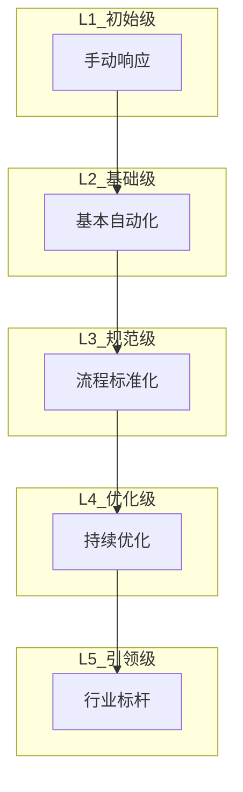
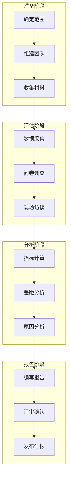
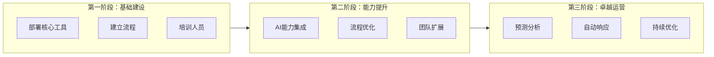

**作者：** HOS(安全风信子)
**日期：** 2026-04-26
**主要来源平台：** GitHub/HuggingFace/arXiv
**摘要：** 企业AI安全运营能力的建设是一个循序渐进的过程。本文深入探讨企业AI安全运营成熟度评估框架，涵盖成熟度模型设计、评估指标体系、评估方法论、能力建设路径四大核心模块。通过科学的成熟度评估，企业可以准确定位当前能力水平，识别改进方向，制定合理的能力建设计划。

@[TOC](目录)

---

# 度量成熟度：企业AI安全运营成熟度评估框架

## 1 引言：为什么需要成熟度评估

### 1.1 能力建设的必要性

随着网络安全威胁日益复杂，企业对AI安全运营能力的需求越来越迫切。然而，能力建设不能一蹴而就，需要科学的规划和有序的推进。成熟度评估为企业提供了一个清晰的参照系，帮助企业了解自身所处阶段，明确改进方向。

### 1.2 成熟度模型的价值

成熟度模型将复杂的能力建设过程分解为可度量的阶段，每个阶段都有明确的目标和评估标准。企业可以对照模型评估自身现状，制定切实可行的改进计划。

### 1.3 评估的应用场景

成熟度评估可以应用于多个场景：新项目启动前的现状评估、能力建设的效果评估、安全供应商的选择评估、团队绩效的考核评估等。

## 2 成熟度模型设计

### 2.1 五级成熟度模型



```python
class MaturityModel:
    """成熟度模型"""

    LEVELS = {
        1: MaturityLevel(
            level=1,
            name='初始级',
            description='手动响应，依赖人工操作',
            characteristics=[
                '安全事件由人工处理',
                '缺乏标准化流程',
                '技术工具分散',
                '人员技能参差不齐'
            ]
        ),
        2: MaturityLevel(
            level=2,
            name='基础级',
            description='基本自动化，部分流程实现自动化',
            characteristics=[
                '基础的告警自动处理',
                '初步的流程标准化',
                '核心安全工具部署',
                '基本的数据分析能力'
            ]
        ),
        3: MaturityLevel(
            level=3,
            name='规范级',
            description='流程标准化，AI辅助决策',
            characteristics=[
                '完整的流程标准化',
                'AI辅助威胁检测',
                '多源数据融合分析',
                '系统的绩效度量'
            ]
        ),
        4: MaturityLevel(
            level=4,
            name='优化级',
            description='持续优化，具备预测能力',
            characteristics=[
                '基于AI的预测分析',
                '自动化响应覆盖率高',
                '持续优化的机制',
                '成熟的团队能力'
            ]
        ),
        5: MaturityLevel(
            level=5,
            name='引领级',
            description='行业标杆，输出最佳实践',
            characteristics=[
                '行业领先的检测能力',
                '原创安全技术创新',
                '知识输出和分享',
                '生态影响力'
            ]
        )
    }

    def get_level(self, level_num: int) -> MaturityLevel:
        """获取指定级别"""
        return self.LEVELS.get(level_num)
```

### 2.2 能力维度设计

成熟度评估涵盖多个能力维度：

**技术维度**：检测能力、分析能力、响应能力、自动化能力

**流程维度**：标准化程度、覆盖完整性、优化机制

**人员维度**：技能水平、人员规模、经验积累

**治理维度**：管理规范、资源投入、持续改进

```python
class CapabilityDimension:
    """能力维度"""

    DIMENSIONS = {
        'detection': CapabilityDimension(
            name='检测能力',
            description='威胁检测的准确性和时效性',
            metrics=[
                'threat_detection_rate',
                'false_positive_rate',
                'detection_latency',
                'coverage_rate'
            ]
        ),
        'analysis': CapabilityDimension(
            name='分析能力',
            description='事件分析和归因的能力',
            metrics=[
                'mean_analysis_time',
                'root_cause_identification_rate',
                'threat_intelligence_utilization'
            ]
        ),
        'response': CapabilityDimension(
            name='响应能力',
            description='安全事件响应处置的能力',
            metrics=[
                'mean_response_time',
                'automation_rate',
                'containment_success_rate'
            ]
        ),
        'process': CapabilityDimension(
            name='流程能力',
            description='流程标准化和执行能力',
            metrics=[
                'process_coverage',
                'process_adherence_rate',
                'process_optimization_rate'
            ]
        )
    }
```

### 2.3 关键指标定义

| 指标名称 | 定义 | 计算公式 | 目标值 |
|---------|------|---------|-------|
| 威胁检出率 | 检测到的威胁占总威胁的比例 | 检测数/总威胁数 | ≥95% |
| 误报率 | 误报占总告警的比例 | 误报数/总告警数 | ≤10% |
| MTTD | 平均检测时间 | Σ(检测时间-发生时间)/检测数 | ≤30min |
| MTTR | 平均响应时间 | Σ(响应时间-检测时间)/响应数 | ≤4h |
| 自动化率 | 自动处置占总事件的比例 | 自动处置数/总事件数 | ≥80% |

```python
class MetricsDefinition:
    """指标定义库"""

    METRICS = {
        'threat_detection_rate': Metric(
            name='威胁检出率',
            description='检测到的威胁占总威胁的比例',
            calculation='detected_threats / total_threats',
            target_value=0.95,
            data_source='siem'
        ),
        'false_positive_rate': Metric(
            name='误报率',
            description='误报占总告警的比例',
            calculation='false_alerts / total_alerts',
            target_value=0.10,
            data_source='siem'
        ),
        'mttd': Metric(
            name='平均检测时间',
            description='从威胁发生到被检测的平均时间',
            calculation='mean(detection_time - occurrence_time)',
            target_value=1800,
            unit='seconds',
            data_source='soc'
        ),
        'mttr': Metric(
            name='平均响应时间',
            description='从检测到响应的平均时间',
            calculation='mean(response_time - detection_time)',
            target_value=14400,
            unit='seconds',
            data_source='soc'
        ),
        'automation_rate': Metric(
            name='自动化率',
            description='自动处置占总事件的比例',
            calculation='automated_incidents / total_incidents',
            target_value=0.80,
            data_source='soar'
        )
    }
```

## 3 评估方法论

### 3.1 评估流程



```python
class AssessmentProcess:
    """评估流程"""

    def __init__(self, assessment_config: AssessmentConfig):
        self.config = assessment_config
        self.data_collector = DataCollector()
        self.analyst = MaturityAnalyst()

    async def execute_assessment(self) -> AssessmentReport:
        """执行评估"""
        await self._prepare_phase()

        assessment_data = await self._assessment_phase()

        analysis_result = await self.analyst.analyze(assessment_data)

        report = await self._reporting_phase(analysis_result)

        return report

    async def _prepare_phase(self):
        """准备阶段"""
        scope = await self._define_scope()
        team = await self._form_team(scope)
        materials = await self._collect_materials(scope)

        self.scope = scope
        self.team = team
        self.materials = materials

    async def _assessment_phase(self) -> AssessmentData:
        """评估阶段"""
        metric_data = await self.data_collector.collect_metrics(self.scope)

        survey_data = await self._conduct_surveys()

        interview_data = await self._conduct_interviews()

        return AssessmentData(
            metrics=metric_data,
            surveys=survey_data,
            interviews=interview_data
        )
```

### 3.2 数据采集方法

```python
class DataCollector:
    """数据采集器"""

    def __init__(self):
        self.sources = {
            'automated': AutomatedDataSource(),
            'manual': ManualDataSource(),
            'external': ExternalDataSource()
        }

    async def collect_metrics(
        self,
        scope: AssessmentScope
    ) -> MetricsData:
        """采集指标数据"""
        all_metrics = {}

        for metric_name in scope.metrics:
            if metric_name in self.sources['automated']:
                value = await self.sources['automated'].get_value(metric_name)
            else:
                value = await self.sources['manual'].get_value(metric_name)

            all_metrics[metric_name] = value

        return MetricsData(
            metrics=all_metrics,
            collection_time=datetime.now(),
            data_quality=self._assess_quality(all_metrics)
        )
```

### 3.3 成熟度评分算法

```python
class MaturityScorer:
    """成熟度评分算法"""

    def __init__(self, model: MaturityModel):
        self.model = model
        self.weight_config = WeightsConfiguration()

    async def calculate_maturity_score(
        self,
        assessment_data: AssessmentData
    ) -> MaturityScore:
        """计算成熟度评分"""
        dimension_scores = {}

        for dimension_name, dimension in self.model.DIMENSIONS.items():
            dimension_score = await self._calculate_dimension_score(
                dimension,
                assessment_data
            )
            dimension_scores[dimension_name] = dimension_score

        overall_score = self._calculate_overall_score(
            dimension_scores,
            self.weight_config.get_dimension_weights()
        )

        mapped_level = self._map_score_to_level(overall_score)

        return MaturityScore(
            overall=overall_score,
            level=mapped_level,
            dimensions=dimension_scores,
            recommendations=await self._generate_recommendations(
                dimension_scores
            )
        )

    async def _calculate_dimension_score(
        self,
        dimension: CapabilityDimension,
        data: AssessmentData
    ) -> DimensionScore:
        """计算维度评分"""
        metric_scores = []

        for metric_name in dimension.metrics:
            metric_value = data.metrics.get(metric_name)
            target_value = MetricsDefinition.METRICS[metric_name].target_value

            score = min(metric_value / target_value, 1.0)
            metric_scores.append(score)

        dimension_score = statistics.mean(metric_scores)

        return DimensionScore(
            name=dimension.name,
            score=dimension_score,
            metric_scores=dict(zip(dimension.metrics, metric_scores))
        )
```

## 4 能力建设路径

### 4.1 分阶段建设规划



```python
class CapabilityBuildingRoadmap:
    """能力建设路线图"""

    def __init__(self, current_level: int, target_level: int):
        self.current_level = current_level
        self.target_level = target_level
        self.phases = self._generate_phases()

    def _generate_phases(self) -> List[BuildPhase]:
        """生成分阶段计划"""
        phases = []

        if self.target_level >= 2 and self.current_level < 2:
            phases.append(BuildPhase(
                name='基础建设',
                duration_months=6,
                objectives=[
                    '部署核心安全工具',
                    '建立基础流程',
                    '完成人员培训'
                ],
                deliverables=[
                    'SIEM部署完成',
                    '基础流程文档',
                    '培训完成报告'
                ]
            ))

        if self.target_level >= 3 and self.current_level < 3:
            phases.append(BuildPhase(
                name='能力提升',
                duration_months=12,
                objectives=[
                    '集成AI检测能力',
                    '优化运营流程',
                    '扩展团队规模'
                ],
                deliverables=[
                    'AI检测模型上线',
                    '流程优化报告',
                    '团队能力评估'
                ]
            ))

        if self.target_level >= 4 and self.current_level < 4:
            phases.append(BuildPhase(
                name='卓越运营',
                duration_months=18,
                objectives=[
                    '建立预测分析能力',
                    '扩大自动响应范围',
                    '建立持续优化机制'
                ],
                deliverables=[
                    '预测平台上线',
                    '自动化率达到80%',
                    '优化机制文档'
                ]
            ))

        return phases
```

### 4.2 资源规划

```python
class ResourcePlanning:
    """资源规划"""

    def estimate_resources(
        self,
        current_level: int,
        target_level: int
    ) -> ResourceEstimate:
        """估算资源需求"""
        phase_count = target_level - current_level

        human_resources = self._estimate_hr(phase_count)
        technology_investment = self._estimate_tech_investment(phase_count)
        operational_cost = self._estimate_operational_cost(phase_count)

        return ResourceEstimate(
            human_resources=human_resources,
            technology_investment=technology_investment,
            monthly_operational_cost=operational_cost,
            total_investment=technology_investment + (operational_cost * 24)
        )

    def _estimate_hr(self, phase_count: int) -> HumanResources:
        """估算人力资源"""
        base_fte = 5
        additional_per_phase = 3

        return HumanResources(
            analysts=base_fte + additional_per_phase * phase_count,
            engineers=2 + additional_per_phase * phase_count,
            managers=1 + (phase_count // 2)
        )
```

### 4.3 风险管理

```python
class BuildRiskManagement:
    """建设风险管理"""

    def __init__(self):
        self.risk_register = RiskRegister()

    async def identify_risks(
        self,
        roadmap: CapabilityBuildingRoadmap
    ) -> List[Risk]:
        """识别风险"""
        risks = []

        for phase in roadmap.phases:
            phase_risks = self._assess_phase_risks(phase)
            risks.extend(phase_risks)

        return risks

    def _assess_phase_risks(self, phase: BuildPhase) -> List[Risk]:
        """评估阶段风险"""
        risks = []

        if 'AI' in str(phase.objectives):
            risks.append(Risk(
                name='AI模型效果不达预期',
                likelihood='medium',
                impact='high',
                mitigation='建立明确的效果评估机制'
            ))

        if '团队' in str(phase.objectives):
            risks.append(Risk(
                name='人才招聘困难',
                likelihood='high',
                impact='medium',
                mitigation='提前规划招聘渠道'
            ))

        return risks
```

## 5 评估工具与模板

### 5.1 评估问卷设计

```python
class AssessmentQuestionnaire:
    """评估问卷"""

    SECTIONS = {
        'detection': [
            Question(
                id='D1',
                text='当前使用哪些威胁检测工具？',
                type='multiple_choice',
                options=['SIEM', 'EDR', 'NDR', '其他']
            ),
            Question(
                id='D2',
                text='平均每天处理多少条告警？',
                type='number'
            ),
            Question(
                id='D3',
                text='AI辅助检测的覆盖范围如何？',
                type='rating',
                scale=[1, 5]
            )
        ],
        'response': [
            Question(
                id='R1',
                text='是否建立了自动响应机制？',
                type='boolean'
            ),
            Question(
                id='R2',
                text='自动响应覆盖哪些场景？',
                type='multiple_choice'
            )
        ]
    }
```

### 5.2 报告模板

```python
class AssessmentReportTemplate:
    """评估报告模板"""

    TEMPLATE = """
    # {company_name} AI安全运营成熟度评估报告

    ## 执行摘要
    {executive_summary}

    ## 评估范围与方法
    {scope_and_method}

    ## 成熟度评估结果
    ### 总体评分
    总体成熟度等级：**L{overall_level} - {level_name}**
    综合评分：{overall_score}/5.0

    ### 各维度评分
    {dimension_scores}

    ## 差距分析
    ### 与目标差距
    {gap_analysis}

    ### 关键发现
    {key_findings}

    ## 改进建议
    {recommendations}

    ## 建设路线图
    {roadmap}

    ## 附录
    {appendices}
    """
```

## 6 结论与展望

成熟度评估为企业AI安全运营能力建设提供了科学的指引。通过定期的成熟度评估，企业可以持续跟踪能力演进，确保安全运营水平不断提升。

---

**参考链接：**

- [CMMI](https://cmmiinstitute.com/) - 能力成熟度模型集成
- [Gartner Maturity Model](https://www.gartner.com/) - 成熟度模型

**附录（Appendix）：**

```python
# 成熟度评分公式

Dimension_Score = Σ(Metric_Score × Metric_Weight) / Σ(Metric_Weight)

Overall_Score = Σ(Dimension_Score × Dimension_Weight) / Σ(Dimension_Weight)

Level_Mapping = {
    (0.0, 1.0): 1,
    (1.0, 2.0): 2,
    (2.0, 3.0): 3,
    (3.0, 4.0): 4,
    (4.0, 5.0): 5
}
```

**关键词：** 成熟度评估，能力建设，评估框架，路线图，安全运营
