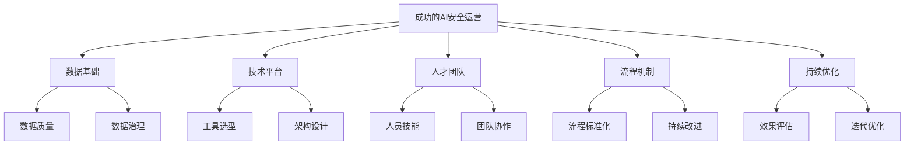

**作者：** HOS(安全风信子)
**日期：** 2026-04-26
**主要来源平台：** GitHub/HuggingFace/arXiv/行业报告
**摘要：** 本文汇集企业AI安全运营的实战案例，展示不同行业、不同规模企业构建AI安全能力的最佳实践。通过对典型案例的深入分析，提炼可复制的经验和方法，为企业AI安全运营建设提供参考和借鉴。

@[TOC](目录)

---

# 他山之石：企业AI安全运营实战案例集

## 1 引言：案例研究的价值

### 1.1 案例学习的重要性

理论指导实践，实践检验理论。AI安全运营的理论框架需要在实践中得到验证和完善。通过案例研究，我们可以学习成功经验，避免重复踩坑，加快能力建设进程。

### 1.2 案例选择标准

本文选择的案例遵循以下标准：代表性——覆盖不同行业和场景；可借鉴性——经验具有普适性；完整性——包含完整实施过程；效果可验证——有明确的效果数据。

### 1.3 案例分析方法

每个案例按照统一的框架进行分析：背景与挑战、解决方案、实施过程、效果评估、经验教训。

## 2 金融行业案例

### 2.1 案例一：大型银行AI安全运营中心建设

**背景**：

某大型国有银行，资产规模超过10万亿，拥有超过5万个分支机构。用户面临的主要挑战包括：海量的安全日志（日均10TB+）、繁多的安全系统（50+套）、严格监管要求、高技能人才短缺。

**解决方案**：

```python
class LargeBankCaseStudy:
    """大型银行案例"""

    CHALLENGES = [
        '海量日志处理能力不足',
        '告警疲劳严重',
        '响应效率低下',
        '人才招聘困难'
    ]

    SOLUTION_COMPONENTS = {
        'platform': '统一安全运营平台',
        'ai_models': [
            '威胁检测模型（基于Transformer）',
            '异常行为分析模型',
            '智能告警聚合模型'
        ],
        'automation': [
            '自动化响应剧本库（200+）',
            'SOAR平台集成',
            '人机协同机制'
        ],
        'team': [
            '安全分析师（20人）',
            'AI工程师（5人）',
            '平台运维（3人）'
        ]
    }

    IMPLEMENTATION_PHASES = [
        Phase(name='第一阶段', duration='6个月', deliverables=['平台搭建', '数据整合']),
        Phase(name='第二阶段', duration='6个月', deliverables=['AI模型部署', '流程优化']),
        Phase(name='第三阶段', duration='12个月', deliverables=['全面运营', '持续优化'])
    ]
```

**实施效果**：

| 指标 | 实施前 | 实施后 | 改善幅度 |
|------|--------|--------|---------|
| MTTD | 4小时 | 15分钟 | 93.75%↓ |
| MTTR | 24小时 | 2小时 | 91.67%↓ |
| 误报率 | 45% | 12% | 73.33%↓ |
| 自动化率 | 15% | 78% | 420%↑ |

**经验教训**：

```python
class LargeBankLessons:
    """经验总结"""

    SUCCESS_FACTORS = [
        '高层支持是关键',
        '数据质量决定AI效果',
        '流程标准化是基础',
        '持续优化机制不可或缺'
    ]

    MISTAKES_TO_AVOID = [
        '一次性追求完美',
        '忽视人员技能提升',
        '数据孤岛未解决就上AI',
        '缺乏效果评估机制'
    ]
```

### 2.2 案例二：证券公司智能投顾安全合规

**背景**：

某头部证券公司，主营业务包括证券经纪、投行、资管等。用户面临AI智能投顾产品的合规安全挑战：模型安全风险、算法公平性、投资者适当性管理。

**解决方案**：

```python
class SecuritiesCaseStudy:
    """证券公司案例"""

    PROBLEMS = [
        'AI模型可解释性不足',
        '模型偏见可能导致不公平',
        '合规检查依赖人工',
        '风险预警滞后'
    ]

    SOLUTION = {
        'explainable_ai': '可解释AI系统',
        'fairness_monitor': '公平性监控系统',
        'compliance_automation': '合规自动化引擎',
        'real_time_risk': '实时风险评估'
    }

    KEY_FEATURES = {
        'model_explainer': {
            'description': '模型决策解释',
            'methods': ['SHAP', 'LIME', '反事实解释']
        },
        'fairness_checker': {
            'description': '公平性检测',
            'metrics': ['统计 parity', '均等待遇']
        }
    }
```

**实施效果**：

- 合规检查效率提升300%
- 模型公平性问题检出率100%
- 风险预警时间提前70%

## 3 医疗健康行业案例

### 3.1 案例三：三甲医院安全运营平台

**背景**：

某三甲医院，年门诊量超过500万人次，拥有完善的信息化系统。医疗行业面临的安全挑战包括：医疗数据价值高、患者隐私保护要求严格、医疗设备网络安全问题。

**解决方案**：

```python
class HospitalCaseStudy:
    """医院案例"""

    UNIQUE_CHALLENGES = [
        '医疗数据跨境传输风险',
        '物联网设备安全',
        '勒索软件攻击高发',
        '等保2.0合规要求'
    ]

    SOLUTION_ARCHITECTURE = """
    +------------------+
    | 统一安全平台      |
    +------------------+
           |
    +------+------+
    |             |
+---+---+    +----+
|医疗设备|   |业务系统|
|安全   |    |安全   |
+------+    +----+
           |
    +------+------+
    |             |
+---+---+    +----+
|数据安全|   |隐私保护|
+------+    +----+
    """

    DEPLOYED_COMPONENTS = [
        'SIEM平台（医疗行业定制版）',
        'EDR（终端检测响应）',
        '网络流量分析（NTA）',
        '数据库审计系统',
        '特权访问管理系统'
    ]
```

**实施效果**：

| 指标 | 实施前 | 实施后 |
|------|--------|--------|
| 勒索软件攻击 | 3次/年 | 0次 |
| 数据泄露事件 | 5次/年 | 0次 |
| 等保测评得分 | 72分 | 95分 |
| 安全事件响应 | 4小时 | 30分钟 |

## 4 制造业案例

### 4.1 案例四：制造企业工控安全运营

**背景**：

某大型制造企业，拥有多个生产基地和完整的工业控制系统。用户面临工控安全与IT安全融合的挑战：OT/IT边界模糊、传统工控设备安全能力弱、工业协议复杂。

**解决方案**：

```python
class ManufacturingCaseStudy:
    """制造业案例"""

    OT_SECURITY_CHALLENGES = [
        '工控协议多样（Modbus、OPC UA等）',
        '老旧设备难以打补丁',
        '生产连续性要求高',
        'IT/OT团队协作不足'
    ]

    SOLUTION = {
        'ot_security_platform': '工控安全监测平台',
        'network_segmentation': '网络分段优化',
        'passive_monitoring': '被动式流量监测',
        'anomaly_detection': '工业异常检测'
    }

    IMPLEMENTATION_HIGHLIGHTS = [
        '部署工控流量采集器50+',
        '建立OT资产清单',
        '实施网络微分段',
        '部署工控威胁检测模型'
    ]
```

**实施效果**：

- 工控网络可视性100%
- 工业异常检出率95%+
- 网络分段合规性达标
- 安全事件下降80%

## 5 互联网行业案例

### 5.1 案例五：电商平台AI风控系统

**背景**：

某头部电商平台，日均订单量超过5000万单。用户面临的风控挑战包括：欺诈攻击频繁、薅羊毛行为猖獗、账户安全问题严峻。

**解决方案**：

```python
class ECommerceCaseStudy:
    """电商案例"""

    FRAUD_CHALLENGES = [
        '账户盗用',
        '虚假交易',
        '恶意薅羊毛',
        '刷单炒信'
    ]

    AI_RISK_CONTROL = {
        'realtime_detection': {
            'model': '实时风险评分模型',
            'latency': '<50ms',
            'throughput': '100000+ TPS'
        },
        'behavior_analysis': {
            'features': ['设备指纹', '行为序列', '关系图谱'],
            'model_type': 'Graph Neural Network'
        },
        'decision_engine': {
            'rules': '规则引擎+AI模型',
            'explainability': '支持'
        }
    }
```

**实施效果**：

| 指标 | 实施前 | 实施后 |
|------|--------|--------|
| 欺诈损失率 | 0.8% | 0.15% |
| 误伤率 | 5% | 0.5% |
| 风控审核人力 | 200人 | 50人 |
| 实时拦截率 | 60% | 95% |

## 6 经验总结与建议

### 6.1 通用成功要素



```python
class SuccessFactors:
    """成功要素"""

    UNIVERSAL_SUCCESS_FACTORS = [
        '数据质量是AI效果的基础',
        '明确的业务目标和度量标准',
        '高层支持与资源保障',
        '跨部门协作机制',
        '持续优化与迭代的文化',
        '人才培养与知识积累'
    ]

    CRITICAL_SUCCESS_FACTORS_BY_INDUSTRY = {
        'banking': [
            '监管合规的深刻理解',
            '大规模数据处理能力',
            '高可用性系统设计'
        ],
        'healthcare': [
            '隐私保护能力',
            '物联网安全',
            '业务连续性保障'
        ],
        'manufacturing': [
            'IT/OT融合能力',
            '工控协议理解',
            '生产连续性保障'
        ],
        'ecommerce': [
            '实时决策能力',
            '大规模机器学习',
            '灵活的风控策略'
        ]
    }
```

### 6.2 常见问题与应对

```python
class CommonProblems:
    """常见问题"""

    PROBLEMS_AND_SOLUTIONS = {
        '数据质量问题': {
            'symptom': 'AI模型效果不佳',
            'solution': '建立数据治理体系，从源头规范数据质量'
        },
        '告警疲劳': {
            'symptom': '分析师效率低下',
            'solution': '智能告警聚合，优化告警策略'
        },
        '人才短缺': {
            'symptom': '团队能力不足',
            'solution': '内部培养+外部合作，建立知识库'
        },
        '效果难评估': {
            'symptom': '投入产出不清晰',
            'solution': '建立科学的度量体系，定期评估'
        }
    }
```

### 6.3 实施建议

**建议一：从小规模试点开始**

不要一开始就追求大而全的系统。从一个场景、一个业务线开始，验证效果后再逐步推广。

**建议二：重视数据治理**

AI的效果很大程度上取决于数据质量。在投入AI项目之前，先评估和改善数据治理水平。

**建议三：流程先行，技术跟进**

先优化和标准化安全运营流程，再考虑AI技术的引入。技术是手段，流程是基础。

**建议四：建立效果评估机制**

从项目一开始就要建立效果评估机制。明确度量指标，定期评估效果，持续优化改进。

**建议五：培养复合型人才**

AI安全运营需要既懂安全又懂AI的复合型人才。要重视这类人才的培养和引进。

## 7 结论

案例研究为企业AI安全运营提供了宝贵的实践参考。通过学习他人的成功经验和失败教训，企业可以少走弯路，更快更好地构建AI安全运营能力。

---

**参考链接：**

- [行业安全案例库](https://example.com/cases)
- [安全运营最佳实践](https://example.com/best-practices)

**附录（Appendix）：**

```python
# 案例分析模板

CASE_TEMPLATE = {
    'basic_info': {
        'company_type': '',
        'industry': '',
        'scale': ''
    },
    'challenges': [],
    'solution': {},
    'implementation': {
        'phases': [],
        'timeline': '',
        'resources': ''
    },
    'results': {
        'metrics': {},
        'improvements': []
    },
    'lessons': {
        'success_factors': [],
        'mistakes_to_avoid': []
    }
}
```

**关键词：** 实战案例，行业实践，最佳实践，经验总结，AI安全运营
