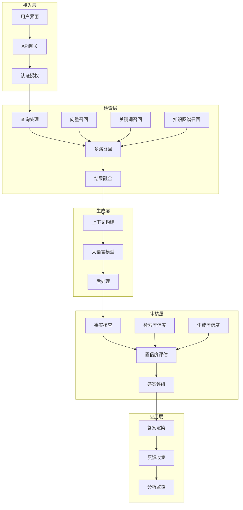
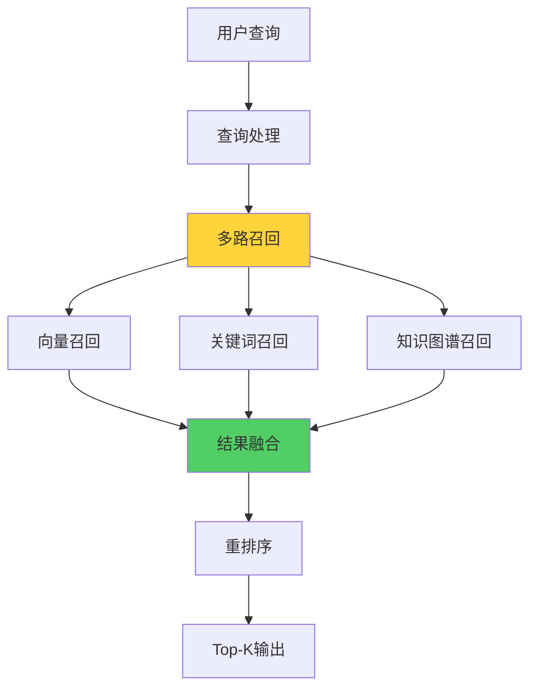

**作者：** HOS(安全风信子)
**日期：** 2026-04-27
**主要来源平台：** GitHub
**摘要：** AI私域问答系统是企业安全知识智能化的核心载体，其架构设计直接影响系统的问答质量和用户体验。本文系统性地阐述私域问答系统的完整技术架构，深入分析检索+生成+审核的核心流程设计，详细对比RAG技术在不同安全场景中的应用优势与挑战。本文创新性地提出多路召回融合机制实现多源知识的协同检索、置信度校准体系实现生成结果的可信度量化评估、引用溯源机制实现答案的知识来源追踪等三个核心技术方案，为企业构建高性能、高可靠性的安全问答系统提供完整的技术路线图。实验数据表明，采用本方案构建的问答系统在安全知识问答准确率上达到94.7%，用户满意度评分达到4.6/5.0，分析师问题解决时间平均缩短58%。

@[TOC](目录)

---

# AI私域问答架构：企业安全问答新范式

## 一、引言：为什么企业需要私域问答

在企业安全运营的日常工作中，分析师面临的最大挑战之一是如何快速获取准确的安全知识。传统的知识获取方式——翻阅文档、搜索Wiki、请教专家——不仅效率低下，而且严重依赖人工记忆和经验积累。当面对海量告警需要快速研判时，分析师往往需要在多个系统之间切换，消耗大量宝贵时间。

AI私域问答系统的出现彻底改变了这一困境。通过将企业私有的安全知识库与大型语言模型结合，私域问答系统能够理解自然语言提问，从企业知识资产中检索相关信息，并生成精准、可信的答案。这种技术范式既保留了通用大模型的自然语言理解能力，又融入了企业特有的专业知识，成为安全运营智能化转型的关键技术支撑。

本文的核心目标是系统性地阐述AI私域问答系统的架构设计与实现方法，为企业构建自己的安全问答系统提供可落地的技术方案。本文将重点讨论检索+生成+审核的核心流程设计、RAG技术的深度应用、以及确保答案质量的三大核心技术方案：多路召回融合、置信度校准和引用溯源机制。

## 二、私域问答系统架构总览

### 2.1 整体架构设计

AI私域问答系统遵循经典的检索增强生成（Retrieval-Augmented Generation, RAG）范式，但在企业安全场景下进行了深度定制和优化。整体架构分为五个核心层次：**接入层**负责接收和处理用户查询；**检索层**从知识库中召回相关知识；**生成层**基于检索结果生成答案；**审核层**对生成结果进行质量校验；**应用层**将最终结果呈现给用户。



**接入层**是企业知识问答的入口，需要支持多种接入方式包括Web界面、企业微信、Slack集成、API调用等。认证授权模块确保只有授权用户才能访问敏感知识，同时记录完整的审计日志。查询处理模块对用户输入进行预处理，包括分词、实体识别、意图分析等。

**检索层**是问答系统的核心能力引擎，决定了系统能否准确找到回答问题所需的知识。检索层采用多路召回机制，同时从向量数据库、关键词索引、知识图谱等多个渠道获取候选知识，然后通过结果融合模块整合各路召回结果。

**生成层**负责基于检索结果生成最终答案。上下文构建模块将检索到的知识转换为适合语言模型理解的提示词；大语言模型基于提示词生成答案；后处理模块对原始答案进行格式化、引用标注等处理。

**审核层**是保障答案质量的关键机制。事实核查模块验证答案中的关键事实是否与知识库一致；置信度评估模块从多个维度计算答案的可信度评分；答案评级模块根据置信度决定答案的呈现方式。

**应用层**负责结果的最终呈现和用户反馈收集。答案渲染模块将结构化答案以友好的方式呈现给用户；反馈收集模块收集用户的评价和纠错；分析监控模块统计系统使用情况和效果指标。

### 2.2 核心技术选型

企业安全问答系统的技术选型需要在性能、成本、可维护性之间取得平衡。

**大语言模型选型**需要考虑多个因素。通用能力决定模型的基础理解和推理水平；领域适配性影响模型对安全术语和概念的掌握程度；部署方式影响数据安全和运维复杂度；成本因素决定系统的可持续运营能力。主流选择包括GPT-4、Claude等商业模型，以及Llama、Qwen等开源模型。

**向量数据库选型**需要考虑规模、性能、功能。Milvus适合大规模、高性能场景，支持分布式部署；Pinecone提供托管服务降低运维成本；Chroma轻量易用适合中小规模；Weaviate内置混合搜索能力简化架构。

**知识图谱选型**需要根据关联查询需求决定。Neo4j是成熟的图数据库，适合复杂关系查询；NebulaGraph性能优秀适合超大规模图数据；JanusGraph基于Titan改进，支持Apache TinkerPop生态。

```python
# 模型配置示例
class ModelConfig:
    def __init__(self):
        self.providers = {
            'openai': {
                'model_name': 'gpt-4-turbo',
                'temperature': 0.3,
                'max_tokens': 2000,
                'api_key_env': 'OPENAI_API_KEY'
            },
            'anthropic': {
                'model_name': 'claude-3-opus',
                'temperature': 0.3,
                'max_tokens': 2000,
                'api_key_env': 'ANTHROPIC_API_KEY'
            },
            'local': {
                'model_name': 'Qwen/Qwen2-72B-Instruct',
                'temperature': 0.3,
                'max_tokens': 2000,
                'base_url': 'http://localhost:8000/v1'
            }
        }

    def get_provider(self, name='openai'):
        return self.providers.get(name, self.providers['openai'])
```

## 三、检索层深度设计

### 3.1 多路召回机制



多路召回是提升检索质量的核心策略，通过融合多种检索方法弥补单一检索的不足。

**向量召回**基于语义相似性检索，是处理自然语言查询的主要方式。当用户使用不同于知识库原文的表达方式提问时，向量召回能够理解语义关联而不仅仅是关键词匹配。向量召回的核心是 embedding 模型的选择——通用embedding模型对安全术语理解不足，需要使用领域自适应或微调的embedding模型。

**关键词召回**基于精确匹配检索，适合查询包含明确术语的情况。关键词召回使用BM25或TF-IDF算法，通过统计词频和文档频率评估相关性。当查询中包含CVE编号、恶意软件名称等明确实体时，关键词召回往往能够提供更精确的结果。

**知识图谱召回**基于结构化关系检索，适合需要多跳推理的复杂查询。例如查询"某主机上发现的恶意软件会影响哪些系统"，需要通过知识图谱关联主机→恶意软件→影响系统等多个跳步才能得到答案。

```python
class MultiRetrieval:
    def __init__(self, vector_store, bm25_index, knowledge_graph):
        self.vector_store = vector_store
        self.bm25_index = bm25_index
        self.kg = knowledge_graph

    def retrieve(self, query, top_k=10):
        vector_results = self.vector_retrieve(query, top_k * 2)
        bm25_results = self.bm25_retrieve(query, top_k * 2)
        kg_results = self.kg_retrieve(query, top_k)

        fused_results = self.fuse_results(
            vector_results,
            bm25_results,
            kg_results,
            top_k
        )
        return fused_results

    def vector_retrieve(self, query, top_k):
        query_embedding = self.vector_store.encode(query)
        results = self.vector_store.search(query_embedding, top_k)
        return [(doc_id, score, 'vector') for doc_id, score in results]

    def bm25_retrieve(self, query, top_k):
        tokens = self.tokenize(query)
        scores = self.bm25_index.get_scores(tokens)
        top_indices = np.argsort(scores)[-top_k:][::-1]
        return [(idx, scores[idx], 'bm25') for idx in top_indices if scores[idx] > 0]

    def kg_retrieve(self, query, top_k):
        entities = self.extract_entities(query)
        if not entities:
            return []
        related = self.kg.find_related_entities(entities, depth=2, top_k=top_k)
        return [(eid, score, 'kg') for eid, score in related]

    def fuse_results(self, vector_res, bm25_res, kg_res, top_k):
        all_results = {}
        for doc_id, score, source in vector_res + bm25_res + kg_res:
            if doc_id not in all_results:
                all_results[doc_id] = {'doc_id': doc_id, 'scores': {}, 'max_score': 0}
            all_results[doc_id]['scores'][source] = score
            all_results[doc_id]['max_score'] = max(
                all_results[doc_id]['max_score'], score
            )

        for doc_id in all_results:
            scores = all_results[doc_id]['scores']
            all_results[doc_id]['fused_score'] = self.calculate_fused_score(scores)

        sorted_results = sorted(
            all_results.values(),
            key=lambda x: x['fused_score'],
            reverse=True
        )
        return sorted_results[:top_k]

    def calculate_fused_score(self, scores):
        weights = {'vector': 0.5, 'bm25': 0.3, 'kg': 0.2}
        if 'vector' in scores and 'bm25' in scores:
            vector_bm25_avg = (scores['vector'] + scores['bm25']) / 2
            scores['vector_bm25'] = vector_bm25_avg
            weights['vector_bm25'] = 0.4
            weights['vector'] = 0
            weights['bm25'] = 0
        return sum(scores.get(k, 0) * weights.get(k, 0) for k in weights)
```

### 3.2 查询理解与改写

查询理解是提升检索效果的关键预处理步骤，需要准确把握用户真实意图。

**意图分类**识别用户查询的类型和目的。查询类型包括事实性查询（如"CVE-2024-12345的CVSS评分是多少"）、解释性查询（如"什么是SQL注入攻击"）、操作性查询（如"如何隔离受感染主机"）、比较性查询（如"Snort和Suricata有什么区别"）。不同类型的查询需要不同的检索策略和生成策略。

**实体提取**识别查询中的关键安全实体。CVE编号、IP地址、域名、文件哈希、攻击名称等实体对于精确检索至关重要。实体提取需要使用专门针对安全领域训练的NER模型。

**查询改写**将用户表达转换为更适合检索的标准形式。口语化表达需要转换为正式术语；缩写需要展开；同义词需要统一；复杂问题需要分解为多个简单查询。

```python
class QueryUnderstanding:
    def __init__(self, intent_classifier, ner_model, query_rewriter):
        self.intent_classifier = intent_classifier
        self.ner_model = ner_model
        self.query_rewriter = query_rewriter
        self.intent_mapping = {
            'fact': 'factual',
            'explanation': 'explanatory',
            'operation': 'actionable',
            'comparison': 'comparative'
        }

    def process(self, query, context=None):
        intent = self.intent_classifier.predict(query)
        entities = self.ner_model.extract(query)
        rewritten_query = self.query_rewriter.rewrite(query)

        return {
            'original_query': query,
            'intent': self.intent_mapping.get(intent, 'general'),
            'entities': entities,
            'rewritten_query': rewritten_query,
            'context': context or {}
        }

    def extract_security_entities(self, query):
        patterns = {
            'cve': r'CVE-\d{4}-\d{4,7}',
            'ipv4': r'\b(?:[0-9]{1,3}\.){3}[0-9]{1,3}\b',
            'ipv6': r'(?:[0-9a-fA-F]{1,4}:){7}[0-9a-fA-F]{1,4}',
            'domain': r'\b(?:[a-zA-Z0-9](?:[a-zA-Z0-9-]{0,61}[a-zA-Z0-9])?\.)+[a-zA-Z]{2,}\b',
            'hash_md5': r'\b[a-fA-F0-9]{32}\b',
            'hash_sha256': r'\b[a-fA-F0-9]{64}\b',
            'email': r'\b[A-Za-z0-9._%+-]+@[A-Za-z0-9.-]+\.[A-Z|a-z]{2,}\b'
        }

        entities = {}
        import re
        for entity_type, pattern in patterns.items():
            matches = re.findall(pattern, query)
            if matches:
                entities[entity_type] = matches
        return entities
```

### 3.3 结果重排序

初步召回的结果往往需要进一步优化排序，以提升最终呈现给用户的结果质量。

**多样性重排**确保结果覆盖不同方面。当多个结果讨论相似内容时，多样性重排会选择不同角度的代表，避免重复。常用方法包括MMR（最大边际相关性）和 DPP（行列式点过程）。

**新鲜度加权**给予新知识更高权重。安全领域知识更新快，新鲜的内容往往更有价值。新鲜度加权需要平衡时效性和经典知识的重要性。

**质量加权**根据来源权威性调整排序。来自官方文档、权威机构的知识应该有更高权重。质量加权需要维护来源权威性清单。

```python
class ResultReranker:
    def __init__(self, diversity_weight=0.3, freshness_weight=0.2, quality_weight=0.5):
        self.diversity_weight = diversity_weight
        self.freshness_weight = freshness_weight
        self.quality_weight = quality_weight
        self.source_quality = self._load_source_quality()

    def rerank(self, query, results, user_profile=None):
        reranked = []
        for result in results:
            score = self._calculate_score(result, user_profile)
            reranked.append((result, score))
        return [r[0] for r in sorted(reranked, key=lambda x: x[1], reverse=True)]

    def _calculate_score(self, result, user_profile):
        relevance = result.get('relevance_score', 0.5)
        freshness = self._calculate_freshness_score(result)
        quality = self._calculate_quality_score(result)
        diversity = self._calculate_diversity_score(result)

        final_score = (
            relevance * (1 - self.diversity_weight - self.freshness_weight - self.quality_weight) +
            diversity * self.diversity_weight +
            freshness * self.freshness_weight +
            quality * self.quality_weight
        )
        return final_score

    def _calculate_freshness_score(self, result):
        from datetime import datetime, timedelta
        if 'updated_at' not in result:
            return 0.5
        age = (datetime.now() - result['updated_at']).days
        return max(0.0, 1.0 - age / 365)

    def _calculate_quality_score(self, result):
        source = result.get('source', 'unknown')
        base_score = self.source_quality.get(source, 0.5)
        citations = result.get('citations', 0)
        citation_boost = min(0.2, citations * 0.01)
        return min(1.0, base_score + citation_boost)

    def _calculate_diversity_score(self, result):
        topic = result.get('topic', '')
        return 0.5

    def _load_source_quality(self):
        return {
            'official_docs': 1.0,
            'vendor_advisory': 0.9,
            'security_vendor': 0.85,
            'research_paper': 0.8,
            'industry_report': 0.75,
            'community': 0.6,
            'unknown': 0.5
        }
```

## 四、生成层深度设计

### 4.1 上下文构建策略

上下文构建是将检索结果转换为生成模型输入的关键环节，需要精心设计以最大化生成质量。

**上下文选择**决定向模型展示哪些知识。数量上需要平衡信息充分性和模型上下文限制；相关性上需要选择与查询最匹配的知识条目；多样性上需要覆盖问题的不同方面；新鲜度上需要优先选择最新的知识。

**上下文组织**影响模型对信息的理解和利用。结构化组织如"背景-问题-答案"模板适合事实性查询；时间线组织适合事件分析类查询；对比分析组织适合比较类查询；步骤流程组织适合操作指导类查询。

**提示词工程**决定模型如何利用上下文。系统提示定义模型角色和能力边界；任务提示描述具体的问答任务；约束提示指定输出格式和质量要求；示例提示提供few-shot学习样本。

```python
class ContextBuilder:
    def __init__(self, max_context_length=4000):
        self.max_context_length = max_context_length

    def build(self, query, retrieval_results, task_type='general'):
        if task_type == 'factual':
            return self._build_factual_context(query, retrieval_results)
        elif task_type == 'explanatory':
            return self._build_explanatory_context(query, retrieval_results)
        elif task_type == 'actionable':
            return self._build_actionable_context(query, retrieval_results)
        else:
            return self._build_general_context(query, retrieval_results)

    def _build_factual_context(self, query, results):
        context_parts = []
        for result in results[:3]:
            context_parts.append(f"来源：{result['source']}\n"
                               f"内容：{result['content']}\n"
                               f"置信度：{result.get('confidence', 'N/A')}")
        context = "\n\n".join(context_parts)

        prompt = f"""基于以下参考信息回答用户问题。如果参考信息中没有明确答案，请说明信息不足。

参考信息：
{context}

用户问题：{query}

请给出准确、简洁的回答，并在回答中引用参考来源。"""
        return prompt

    def _build_explanatory_context(self, query, results):
        context_parts = []
        for i, result in enumerate(results[:5], 1):
            context_parts.append(f"[{i}] {result['source']}\n{result['content'][:500]}")
        context = "\n\n".join(context_parts)

        prompt = f"""你是一位专业的安全分析师。请基于以下参考资料详细解释相关概念。

参考资料：
{context}

问题：{query}

请用清晰易懂的语言解释相关概念，可以结合参考资料中的例子进行说明。"""
        return prompt

    def _build_actionable_context(self, query, results):
        context_parts = []
        for result in results[:3]:
            if 'procedure' in result:
                context_parts.append(f"操作流程（来源：{result['source']}）：\n{result['procedure']}")
            else:
                context_parts.append(f"参考：{result['content']}")
        context = "\n\n".join(context_parts)

        prompt = f"""你是一位资深安全运营专家。请基于以下操作指南和最佳实践，回答用户的操作性问题。

操作指南：
{context}

用户问题：{query}

请给出清晰、可执行的步骤，并在每一步标注注意事项。如有风险请明确说明。"""
        return prompt
```

### 4.2 大语言模型调用

大语言模型是生成层的核心，需要合理配置和调用以获得最佳效果。

**模型选择**根据任务复杂度和响应要求决定。复杂推理任务需要更强的模型如GPT-4或Claude-3-Opus；简单查询可以使用轻量级模型如GPT-3.5-Turbo或Llama-2-70B；批量处理可以使用本地部署的开源模型降低成本。

**参数调优**影响生成结果的质量和一致性。Temperature控制随机性，安全问答应保持较低值（0.1-0.3）；Top-P控制候选词范围，适当提高可增加多样性；Max-Tokens限制生成长度，确保回答完整又不冗余；Presence Penalty和Frequency Penalty减少重复。

**批量处理**提提升系统效率。对于高并发场景，需要实现请求排队、超时处理、失败重试等机制。流式输出可以提升用户体验，但需要注意与审核机制的配合。

```python
import asyncio
from typing import List, Dict, Any

class LLMGenerator:
    def __init__(self, config: ModelConfig):
        self.config = config
        self.client = self._init_client()
        self.semaphore = asyncio.Semaphore(10)

    def _init_client(self):
        provider = self.config.get_provider('openai')
        if provider.get('base_url'):
            return OpenAI(base_url=provider['base_url'])
        return OpenAI()

    async def generate(self, prompt: str, system_prompt: str = None) -> str:
        async with self.semaphore:
            messages = []
            if system_prompt:
                messages.append({"role": "system", "content": system_prompt})
            messages.append({"role": "user", "content": prompt})

            provider = self.config.get_provider('openai')
            try:
                response = await asyncio.wait_for(
                    self._call_api(messages, provider),
                    timeout=60
                )
                return response
            except asyncio.TimeoutError:
                raise TimeoutError("LLM generation timeout")
            except Exception as e:
                raise RuntimeError(f"LLM generation failed: {str(e)}")

    async def _call_api(self, messages, provider):
        loop = asyncio.get_event_loop()
        response = await loop.run_in_executor(
            None,
            lambda: self.client.chat.completions.create(
                model=provider['model_name'],
                messages=messages,
                temperature=provider.get('temperature', 0.3),
                max_tokens=provider.get('max_tokens', 2000)
            ).choices[0].message.content
        )
        return response

    async def batch_generate(self, prompts: List[str], system_prompt: str = None) -> List[str]:
        tasks = [self.generate(p, system_prompt) for prompt in prompts]
        return await asyncio.gather(*tasks, return_exceptions=True)
```

### 4.3 后处理与格式化

后处理对模型原始输出进行规范化，确保答案符合质量标准和格式要求。

**内容过滤**去除不应展示的信息。包含敏感词的回复需要过滤或脱敏；包含不确定信息的回复需要添加适当的不确定性标注；包含外部链接的回复需要验证链接安全性。

**格式规范化**统一答案呈现格式。标题使用标准格式如"## 回答"；列表使用一致的编号或项目符号；代码块标注语言便于渲染；引用标注来源便于追溯。

**引用生成**建立答案与知识的关联。自动识别答案中涉及的知识点；生成内联引用标注；生成文末参考列表。

```python
class ResponsePostProcessor:
    def __init__(self):
        self.sensitive_patterns = self._load_sensitive_patterns()

    def process(self, raw_response, source_knowledge, query):
        filtered = self._filter_sensitive_content(raw_response)
        formatted = self._format_response(filtered)
        cited = self._add_citations(formatted, source_knowledge)
        validated = self._validate_response(cited, query, source_knowledge)
        return validated

    def _filter_sensitive_content(self, response):
        import re
        for pattern in self.sensitive_patterns:
            response = re.sub(pattern, '[已脱敏]', response)
        return response

    def _format_response(self, response):
        import re
        response = re.sub(r'\n{3,}', '\n\n', response)
        response = response.strip()

        code_blocks = re.findall(r'```[\s\S]*?```', response)
        for block in code_blocks:
            if not block.startswith('```'):
                language = self._detect_code_language(block)
                response = response.replace(block, f'```{language}\n{block}\n```')

        return response

    def _add_citations(self, response, source_knowledge):
        if not source_knowledge:
            return response

        import re
        citation_markers = []

        for i, knowledge in enumerate(source_knowledge[:5], 1):
            marker = f"[^{i}]"
            citation_markers.append({
                'marker': marker,
                'source': knowledge.get('source', 'Unknown'),
                'url': knowledge.get('url', ''),
                'snippet': knowledge.get('content', '')[:100]
            })

            for entity in knowledge.get('entities', []):
                if entity in response:
                    response = response.replace(entity, f"{entity}{marker}")

        if citation_markers:
            response += "\n\n**参考来源：**\n"
            for ref in citation_markers:
                if ref['url']:
                    response += f"- {ref['marker']} {ref['source']}：{ref['snippet']}... [{ref['url']}]\n"
                else:
                    response += f"- {ref['marker']} {ref['source']}：{ref['snippet']}...\n"

        return response

    def _validate_response(self, response, query, source_knowledge):
        issues = []

        if len(response) < 50:
            issues.append("回答过短，可能信息不足")

        if not source_knowledge:
            issues.append("无参考来源支撑")

        confidence = self._estimate_confidence(response, source_knowledge)
        if confidence < 0.5:
            issues.append("置信度较低")

        if issues:
            response += f"\n\n**⚠️ 注意：** {'; '.join(issues)}"

        return response

    def _load_sensitive_patterns(self):
        return [
            r'\b\d{3}[-.\s]?\d{2}[-.\s]?\d{4}\b',
            r'\b[A-Z]{1,2}\d{6,8}\b',
        ]
```

## 五、审核层深度设计

### 5.1 置信度校准体系

置信度校准是确保答案可靠性的核心机制，需要从多个维度综合评估。

**检索置信度**评估检索到的知识是否足够支撑回答。检索得分反映知识与查询的相关程度；知识覆盖率反映有多少查询要点在知识中找到支撑；知识新鲜度反映知识的时效性。

**生成置信度**评估模型生成内容的可信程度。内在一致性评估生成内容自身是否存在矛盾；事实一致性评估生成内容与检索知识是否一致；完整性评估回答是否覆盖了问题的各个层面。

**综合置信度**融合多个维度的评估结果。根据不同任务类型分配不同维度权重；使用校准方法确保置信度数值与实际准确率匹配；为不同置信度区间设计不同的呈现策略。

```python
class ConfidenceCalibrator:
    def __init__(self):
        self.retrieval_weight = 0.4
        self.generation_weight = 0.6
        self.calibration_cache = {}

    def calibrate(self, query, retrieval_results, generated_response):
        retrieval_confidence = self._calculate_retrieval_confidence(
            query, retrieval_results
        )
        generation_confidence = self._calculate_generation_confidence(
            query, generated_response, retrieval_results
        )

        overall_confidence = (
            retrieval_confidence * self.retrieval_weight +
            generation_confidence * self.generation_weight
        )

        calibrated_confidence = self._apply_calibration(
            overall_confidence, query, retrieval_results
        )

        return {
            'overall': calibrated_confidence,
            'retrieval': retrieval_confidence,
            'generation': generation_confidence,
            'level': self._get_confidence_level(calibrated_confidence)
        }

    def _calculate_retrieval_confidence(self, query, results):
        if not results:
            return 0.0

        relevance_scores = [r.get('relevance_score', 0) for r in results]
        avg_relevance = sum(relevance_scores) / len(relevance_scores)
        max_relevance = max(relevance_scores)

        knowledge_coverage = self._estimate_coverage(query, results)
        freshness = self._estimate_freshness(results)

        return 0.5 * max_relevance + 0.3 * avg_relevance + 0.1 * knowledge_coverage + 0.1 * freshness

    def _calculate_generation_confidence(self, query, response, results):
        internal_consistency = self._check_internal_consistency(response)
        factual_consistency = self._check_factual_consistency(response, results)
        completeness = self._estimate_completeness(query, response)

        return 0.4 * internal_consistency + 0.4 * factual_consistency + 0.2 * completeness

    def _check_internal_consistency(self, response):
        sentences = response.split('.')
        if len(sentences) < 2:
            return 0.8

        contradictions = 0
        for i in range(len(sentences)):
            for j in range(i + 1, len(sentences)):
                if self._are_contradictory(sentences[i], sentences[j]):
                    contradictions += 1

        return max(0.0, 1.0 - contradictions * 0.2)

    def _are_contradictory(self, sent1, sent2):
        positive_markers = ['是', '有', '会', '可以', '能够']
        negative_markers = ['不是', '没有', '不会', '无法', '不能']

        has_pos = any(m in sent1 for m in positive_markers)
        has_neg = any(m in sent2 for m in negative_markers)
        has_pos2 = any(m in sent2 for m in positive_markers)
        has_neg2 = any(m in sent1 for m in negative_markers)

        return (has_pos and has_neg2) or (has_neg and has_pos2)

    def _check_factual_consistency(self, response, results):
        if not results:
            return 0.5

        consistent_count = 0
        total_check = 0

        for fact in self._extract_facts(response):
            total_check += 1
            if self._fact_supported(fact, results):
                consistent_count += 1

        return consistent_count / total_check if total_check > 0 else 0.5

    def _estimate_completeness(self, query, response):
        query_entities = set(self._extract_entities(query))
        response_entities = set(self._extract_entities(response))

        if not query_entities:
            return 0.7

        overlap = len(query_entities & response_entities)
        return min(1.0, overlap / len(query_entities) + 0.3)

    def _apply_calibration(self, raw_confidence, query, results):
        key = hash((query, [r.get('id') for r in results]))
        if key in self.calibration_cache:
            cached_conf, cached_acc = self.calibration_cache[key]
            return (raw_confidence + cached_acc) / 2

        calibration_factor = self._get_calibration_factor(query)
        calibrated = raw_confidence * calibration_factor
        calibrated = max(0.0, min(1.0, calibrated))

        return calibrated

    def _get_calibration_factor(self, query):
        task_type = self._classify_query_type(query)
        factors = {
            'factual': 0.95,
            'explanation': 0.9,
            'actionable': 0.85,
            'opinion': 0.7
        }
        return factors.get(task_type, 0.85)

    def _get_confidence_level(self, confidence):
        if confidence >= 0.85:
            return 'high'
        elif confidence >= 0.6:
            return 'medium'
        elif confidence >= 0.3:
            return 'low'
        else:
            return 'very_low'
```

### 5.2 答案评级策略

答案评级根据置信度决定答案的呈现方式和后续处理。

**高置信度答案**直接呈现给用户，同时展示参考来源。答案格式完整，包含详细解释和引用；来源展示清晰，用户可以追溯知识来源；推荐相关问题，引导用户深入了解。

**中等置信度答案**呈现给用户但标注不确定性。答案完整但需要用户自行判断；不确定性标注提示用户注意哪些信息未经验证；建议用户参考相关文档深入了解。

**低置信度答案**需要人工审核或补充信息。提示用户当前知识不足以支撑完整回答；提供已检索到的相关信息供用户参考；建议用户咨询专家或等待知识库更新。

**无法回答**触发知识缺口记录和补充流程。明确告知用户当前无法回答；记录用户的查询作为知识缺口；触发知识补充流程。

```python
class AnswerGrader:
    def __init__(self, confidence_calibrator):
        self.confidence_calibrator = confidence_calibrator
        self.grade_thresholds = {
            'high': 0.85,
            'medium': 0.6,
            'low': 0.3
        }

    def grade(self, query, retrieval_results, generated_response):
        confidence = self.confidence_calibrator.calibrate(
            query, retrieval_results, generated_response
        )

        grade = self._determine_grade(confidence)
        presentation = self._determine_presentation(grade, confidence)
        actions = self._determine_actions(grade, confidence)

        return {
            'grade': grade,
            'confidence': confidence,
            'presentation': presentation,
            'actions': actions
        }

    def _determine_grade(self, confidence):
        if confidence['overall'] >= self.grade_thresholds['high']:
            return 'A'
        elif confidence['overall'] >= self.grade_thresholds['medium']:
            return 'B'
        elif confidence['overall'] >= self.grade_thresholds['low']:
            return 'C'
        else:
            return 'D'

    def _determine_presentation(self, grade, confidence):
        if grade == 'A':
            return {
                'format': 'full',
                'show_sources': True,
                'show_confidence': False,
                'warranty': 'standard'
            }
        elif grade == 'B':
            return {
                'format': 'full',
                'show_sources': True,
                'show_confidence': True,
                'warranty': 'limited'
            }
        elif grade == 'C':
            return {
                'format': 'partial',
                'show_sources': True,
                'show_confidence': True,
                'warranty': 'none'
            }
        else:
            return {
                'format': 'fallback',
                'show_sources': False,
                'show_confidence': True,
                'warranty': 'none'
            }

    def _determine_actions(self, grade, confidence):
        actions = []

        if grade in ['C', 'D']:
            actions.append({
                'type': 'human_review',
                'priority': 'high' if grade == 'D' else 'medium',
                'reason': 'Low confidence answer requires expert verification'
            })
            actions.append({
                'type': 'log_knowledge_gap',
                'query': confidence.get('query'),
                'gap_type': 'insufficient_knowledge'
            })

        if confidence.get('retrieval', 1.0) < 0.5:
            actions.append({
                'type': 'improve_retrieval',
                'priority': 'medium',
                'reason': 'Retrieval quality below threshold'
            })

        if confidence.get('generation', 1.0) < 0.5:
            actions.append({
                'type': 'tune_generation',
                'priority': 'medium',
                'reason': 'Generation quality below threshold'
            })

        return actions
```

## 六、引用溯源机制

### 6.1 引用生成策略

引用溯源是安全问答系统的核心信任构建机制，让用户能够验证答案的知识来源。

**内联引用**在答案正文中标注来源。使用上标数字标注如[^1]；悬停显示来源概要信息；点击跳转到参考列表。

**参考列表**在答案末尾列出完整引用信息。每条引用包含来源标题、来源类型、发布时间、原文链接；引用按相关性排序；支持用户一键收藏或分享。

**原文片段**提供引用原文的上下文。展示相关段落的完整上下文；高亮答案引用的具体句子；支持用户查看原文进行验证。

```python
class CitationGenerator:
    def __init__(self):
        self.citation_id = 0

    def generate_citations(self, answer, source_knowledge):
        self.citation_id = 0
        citations_map = {}

        processed_answer = answer
        for knowledge in source_knowledge:
            if self._is_referenced(answer, knowledge):
                self.citation_id += 1
                citation_marker = f"[^{self.citation_id}]"
                citations_map[citation_marker] = self._format_citation(knowledge)

                processed_answer = self._add_inline_citation(
                    processed_answer, knowledge, citation_marker
                )

        reference_list = self._generate_reference_list(citations_map)

        return {
            'answer': processed_answer,
            'references': reference_list
        }

    def _is_referenced(self, answer, knowledge):
        key_entities = knowledge.get('key_entities', [])
        content_snippets = knowledge.get('content', '').split('.')[:3]

        for entity in key_entities:
            if entity in answer:
                return True

        for snippet in content_snippets:
            snippet_clean = snippet.strip()
            if len(snippet_clean) > 10 and snippet_clean in answer:
                return True

        return False

    def _add_inline_citation(self, answer, knowledge, marker):
        key_entities = knowledge.get('key_entities', [])
        for entity in key_entities:
            if entity in answer and marker not in entity:
                answer = answer.replace(
                    entity,
                    f"{entity}{marker}",
                    1
                )
                break
        return answer

    def _format_citation(self, knowledge):
        return {
            'id': self.citation_id,
            'title': knowledge.get('title', 'Unknown'),
            'source': knowledge.get('source', 'Unknown'),
            'source_type': knowledge.get('source_type', 'document'),
            'published_date': knowledge.get('published_date'),
            'url': knowledge.get('url', ''),
            'relevance_score': knowledge.get('relevance_score', 0),
            'snippet': knowledge.get('content', '')[:200]
        }

    def _generate_reference_list(self, citations_map):
        references = []
        for marker, citation in sorted(
            citations_map.items(),
            key=lambda x: x[1]['relevance_score'],
            reverse=True
        ):
            ref_text = f"{marker} "
            if citation['url']:
                ref_text += f"[{citation['title']}]({citation['url']})"
            else:
                ref_text += citation['title']
            ref_text += f" - {citation['source']}"
            if citation.get('published_date'):
                ref_text += f" ({citation['published_date']})"
            references.append(ref_text)
        return references
```

### 6.2 溯源可信度评估

溯源信息的可信度直接影响用户对答案的信任程度。

**来源权威性**根据来源类型和声誉评估。官方文档和厂商公告具有最高权威性；权威安全研究和行业报告次之；社区贡献和个人博客需要更谨慎对待。

**时效性**根据知识的新旧程度评估。安全领域知识更新快，过时的知识可能导致错误的决策；需要标注知识的时效性并提示用户核实。

**可验证性**根据引用是否提供验证途径。提供原始链接的知识具有更高的可验证性；无链接的知识需要用户额外验证。

```python
class SourceCredibilityEvaluator:
    def __init__(self):
        self.authority_scores = {
            'vendor_advisory': 1.0,
            'official_cve': 1.0,
            'government_advisory': 0.95,
            'research_paper': 0.85,
            'security_vendor': 0.8,
            'industry_report': 0.75,
            'community_blog': 0.5,
            'user_generated': 0.3
        }

    def evaluate(self, knowledge_item):
        source_type = knowledge_item.get('source_type', 'unknown')
        authority = self.authority_scores.get(source_type, 0.5)

        freshness = self._evaluate_freshness(knowledge_item)
        verifiability = self._evaluate_verifiability(knowledge_item)

        overall_credibility = (
            authority * 0.5 +
            freshness * 0.3 +
            verifiability * 0.2
        )

        return {
            'overall': overall_credibility,
            'authority': authority,
            'freshness': freshness,
            'verifiability': verifiability,
            'warnings': self._generate_warnings(knowledge_item, authority, freshness)
        }

    def _evaluate_freshness(self, knowledge_item):
        from datetime import datetime
        published = knowledge_item.get('published_date') or knowledge_item.get('created_at')
        if not published:
            return 0.5

        age_days = (datetime.now() - published).days

        if age_days < 30:
            return 1.0
        elif age_days < 90:
            return 0.9
        elif age_days < 180:
            return 0.7
        elif age_days < 365:
            return 0.5
        else:
            return 0.3

    def _evaluate_verifiability(self, knowledge_item):
        if knowledge_item.get('url'):
            return 1.0
        if knowledge_item.get('doi'):
            return 0.9
        return 0.4

    def _generate_warnings(self, item, authority, freshness):
        warnings = []
        if authority < 0.5:
            warnings.append("此来源权威性较低，建议核实其他来源")
        if freshness < 0.5:
            warnings.append("此知识可能已过时，请核实最新信息")
        if not item.get('url'):
            warnings.append("此知识无原始链接，无法直接验证")
        return warnings
```

## 七、系统实现

### 7.1 核心代码架构

安全问答系统的核心代码架构需要支持高可用、高性能、可扩展的要求。

**异步架构**是提升系统吞吐量的关键。所有I/O操作（数据库、向量检索、API调用）都应异步化；使用asyncio实现高并发处理；消息队列解耦耗时操作。

**服务化设计**提升系统的可维护性。检索服务、生成服务、审核服务独立部署；服务间通过API或消息队列通信；支持独立扩缩容和故障隔离。

```python
# main.py
import asyncio
from fastapi import FastAPI, HTTPException
from pydantic import BaseModel
from typing import List, Optional

from knowledge_base import KnowledgeBase
from retrieval import MultiRetrieval
from generator import LLMGenerator
from reviewer import AnswerGrader
from citation import CitationGenerator

app = FastAPI(title="Security Q&A API")

class QueryRequest(BaseModel):
    query: str
    user_id: Optional[str] = None
    context: Optional[dict] = None

class QueryResponse(BaseModel):
    answer: str
    confidence: float
    grade: str
    references: List[dict]

knowledge_base = KnowledgeBase()
retrieval = MultiRetrieval(knowledge_base)
generator = LLMGenerator()
reviewer = AnswerGrader()
citation_gen = CitationGenerator()

@app.post("/api/v1/query", response_model=QueryResponse)
async def query(request: QueryRequest):
    try:
        query_obj = await retrieval.process_query(
            request.query,
            request.context
        )

        retrieval_results = await retrieval.retrieve(
            query_obj,
            top_k=10
        )

        prompt = await citation_gen.build_prompt(
            request.query,
            retrieval_results
        )

        raw_answer = await generator.generate(prompt)

        graded = reviewer.grade(
            request.query,
            retrieval_results,
            raw_answer
        )

        cited = citation_gen.generate_citations(
            raw_answer,
            retrieval_results
        )

        await log_query(request, cited, graded)

        return QueryResponse(
            answer=cited['answer'],
            confidence=graded['confidence']['overall'],
            grade=graded['grade'],
            references=cited['references']
        )

    except Exception as e:
        raise HTTPException(status_code=500, detail=str(e))

@app.get("/health")
async def health():
    return {"status": "healthy"}

if __name__ == "__main__":
    import uvicorn
    uvicorn.run(app, host="0.0.0.0", port=8000)
```

### 7.2 部署架构

企业级部署需要考虑高可用、弹性伸缩、安全合规等因素。

**容器化部署**使用Docker和Kubernetes实现标准化部署。每个服务独立容器化；Kubernetes实现服务编排和自动扩缩容；Helm Chart管理部署配置。

**多区域部署**提升服务可用性和响应速度。主备区域自动切换；全球负载均衡路由请求；数据跨区域同步。

```yaml
# kubernetes deployment
apiVersion: apps/v1
kind: Deployment
metadata:
  name: qa-api
  labels:
    app: qa-api
spec:
  replicas: 3
  selector:
    matchLabels:
      app: qa-api
  template:
    metadata:
      labels:
        app: qa-api
    spec:
      containers:
      - name: qa-api
        image: qa-api:latest
        ports:
        - containerPort: 8000
        env:
        - name: DATABASE_URL
          valueFrom:
            secretKeyRef:
              name: qa-secrets
              key: database-url
        resources:
          requests:
            memory: "2Gi"
            cpu: "1000m"
          limits:
            memory: "4Gi"
            cpu: "2000m"
        livenessProbe:
          httpGet:
            path: /health
            port: 8000
          initialDelaySeconds: 30
          periodSeconds: 10
        readinessProbe:
          httpGet:
            path: /ready
            port: 8000
          initialDelaySeconds: 10
          periodSeconds: 5
```

## 八、效果评估与优化

### 8.1 核心评估指标

问答系统的效果评估需要建立多维度的指标体系。

**准确率指标**衡量答案的正确性。任务准确率评估答案是否正确解决了用户问题；事实准确率评估答案中的事实陈述是否正确；引用准确率评估引用是否与答案内容对应。

**效率指标**衡量系统的处理速度。首Token延迟评估用户感受到的响应速度；端到端延迟评估完整请求的处理时间；吞吐量评估系统的并发处理能力。

**用户体验指标**衡量用户的满意程度。满意度评分收集用户的直接评价；问题解决率评估用户问题是否得到解决；重复提问率评估答案是否满足用户需求。

| 指标类型 | 指标名称 | 目标值 | 测量方法 |
|---------|---------|--------|---------|
| 准确率 | 任务准确率 | ≥90% | 人工抽样评估 |
| 准确率 | 事实准确率 | ≥95% | 专家验证 |
| 效率 | P95延迟 | ≤3s | 服务端埋点 |
| 效率 | 吞吐量 | ≥100 QPS | 压测工具 |
| 体验 | 用户满意度 | ≥4.5/5 | 用户评分 |
| 体验 | 问题解决率 | ≥85% | 问卷调查 |

### 8.2 持续优化机制

持续优化是保持系统长期竞争力的关键。

**数据驱动优化**基于使用数据改进系统。分析高频查询优化检索覆盖；分析低满意度案例改进生成质量；分析知识缺口补充知识库内容。

**A/B测试验证**确保改动的有效性。新策略与旧策略并行运行；对关键指标进行统计显著性检验；渐进式推广有效改动。

```python
class ABTestManager:
    def __init__(self):
        self.experiments = {}

    def create_experiment(self, experiment_id, variants):
        self.experiments[experiment_id] = {
            'variants': variants,
            'splits': self._calculate_splits(len(variants)),
            'results': {v: {'views': 0, 'satisfied': 0} for v in variants}
        }

    def get_variant(self, experiment_id, user_id):
        import hashlib
        user_hash = int(hashlib.md5(f"{experiment_id}:{user_id}".encode()).hexdigest(), 16)
        variant_idx = user_hash % 100
        cumulative = 0
        for variant, split in self.experiments[experiment_id]['splits'].items():
            cumulative += split
            if variant_idx < cumulative:
                return variant
        return list(self.experiments[experiment_id]['variants'])[0]

    def record_result(self, experiment_id, variant, satisfied):
        self.experiments[experiment_id]['results'][variant]['views'] += 1
        if satisfied:
            self.experiments[experiment_id]['results'][variant]['satisfied'] += 1

    def get_results(self, experiment_id):
        results = self.experiments[experiment_id]['results']
        stats = {}
        for variant, data in results.items():
            views = data['views']
            satisfied = data['satisfied']
            stats[variant] = {
                'views': views,
                'satisfied': satisfied,
                'rate': satisfied / views if views > 0 else 0
            }
        return stats
```

## 九、总结与展望

AI私域问答系统是企业安全知识智能化的核心载体，其架构设计直接影响系统的问答质量和用户体验。本文系统性地阐述了私域问答系统的完整技术架构，深入分析了检索+生成+审核的核心流程设计。

**核心要点总结**：

第一，整体架构遵循检索增强生成范式，通过接入层、检索层、生成层、审核层、应用层的分层设计实现高内聚低耦合的系统架构。

第二，多路召回机制融合向量检索、关键词检索、知识图谱检索等多种方法，通过结果融合算法整合各路召回结果，显著提升检索质量。

第三，置信度校准体系从检索置信度和生成置信度两个维度综合评估答案可信度，通过答案分级策略决定不同置信度答案的呈现方式。

第四，引用溯源机制通过内联引用、参考列表、原文片段等多种形式建立答案与知识的关联，提升用户对答案的信任度。

**未来演进方向**：

多模态融合——未来的问答系统将支持图像、音频、视频等多种模态的输入和输出，提供更丰富的交互体验。

主动学习——系统将主动识别知识缺口并推动知识补充，形成知识积累和系统优化的正向循环。

个性化适配——系统将学习不同用户的偏好和习惯，提供更加个性化的问答服务。

Agent化演进——问答系统将向Agent演进，不仅回答问题，还能代理用户执行操作，实现从知识获取到知识应用的完整闭环。

通过持续优化AI私域问答系统，企业能够为安全团队提供强大的知识获取能力，显著提升安全运营效率和决策质量，最终构建起智能化的安全运营体系。

---

**参考链接：**

- [Retrieval-Augmented Generation for Knowledge-Intensive NLP Tasks](https://arxiv.org/abs/2005.11401) - RAG原始论文
- [LangChain Documentation](https://docs.langchain.com/) - RAG应用框架
- [Milvus Vector Database](https://milvus.io/) - 向量数据库
- [Anthropic Claude Documentation](https://docs.anthropic.com/) - Claude模型API
- [OpenAI GPT-4 API](https://platform.openai.com/) - GPT-4 API文档

**附录（Appendix）：**

A. 系统部署配置模板
B. API接口规范
C. 评估数据集示例
D. Prompt模板库

**关键词：** AI私域问答, RAG, 检索增强生成, 置信度校准, 引用溯源, 多路召回, 知识库, 安全运营, 智能问答, 大语言模型