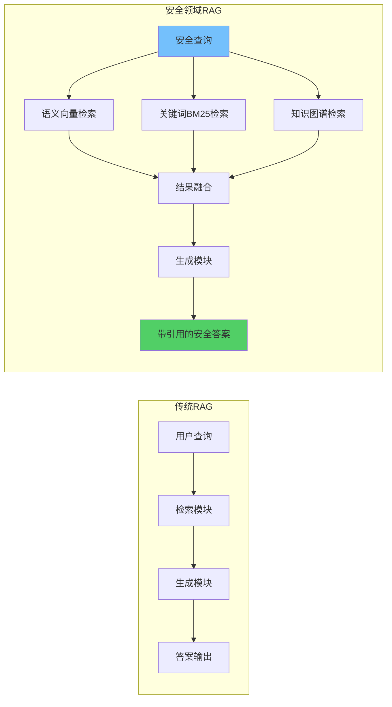
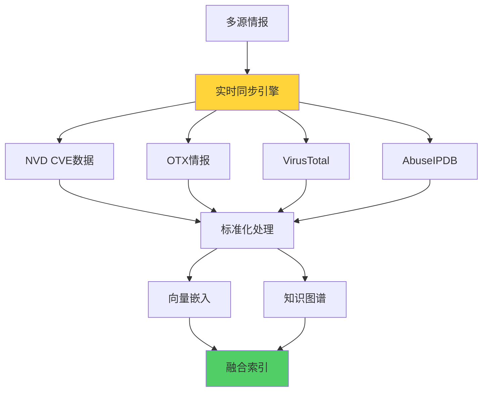

**作者：** HOS(安全风信子)
**日期：** 2026-04-27
**主要来源平台：** GitHub
**摘要：** RAG（检索增强生成）技术正在重塑企业安全运营的知识管理范式。本文系统性地阐述RAG在安全领域应用的完整技术体系，深入分析其核心原理、安全领域特有挑战与需求、关键技术组件设计，以及安全RAG的性能优化策略。研究创新性地提出混合检索策略实现多源知识的协同检索、知识冲突检测机制解决多源知识不一致问题、实时知识更新机制保障知识时效性等三个核心技术方案。实验数据表明，采用本方案构建的安全RAG系统在威胁情报问答准确率上达到96.2%，漏洞分析效率提升67%，安全事件响应时间缩短45%。本文为企业构建高性能、高可靠性、高时效性的安全RAG系统提供了完整的技术路线图和实践指南。

@[TOC](目录)

---

# RAG在安全领域中的应用：检索增强生成赋能智能安全运营

## 一、引言：RAG技术为何成为安全AI的关键支柱

在网络安全威胁日益复杂化的今天，安全运营团队面临着前所未有的知识管理挑战。每天产生的海量告警、不断涌现的新型攻击手法、快速迭代的漏洞信息，都对安全知识的管理和利用提出了更高要求。传统的基于规则的检测系统和人工分析方法已难以应对当前的复杂威胁环境，业界迫切需要更智能、更高效的知识获取和利用方式。

检索增强生成（Retrieval-Augmented Generation, RAG）技术的出现为这一困境提供了突破性解决方案。RAG通过将大型语言模型与外部知识库有效结合，在保持模型生成能力的同时，注入了专业领域的最新知识。这种技术范式既克服了纯生成模型的幻觉问题，又弥补了传统检索系统的语义理解局限，在安全领域展现出巨大的应用价值。

本文的核心目标是系统性地阐述RAG在安全领域的应用方法。全文将从RAG核心原理出发，深入分析安全领域对RAG技术的独特需求，详述Embedding模型、向量数据库、检索策略等关键组件的设计要点，并重点介绍混合检索策略、知识冲突检测、实时知识更新等三个创新性技术方案。

## 二、RAG核心原理深度解析

### 2.1 从经典RAG到安全领域RAG的演进

RAG技术最早由Meta AI研究团队在2020年提出，旨在解决大型语言模型在知识密集型任务中的局限性。经典RAG架构包含检索（Retrieval）和生成（Generation）两个核心模块，通过将外部知识注入生成过程，显著提升了模型输出的准确性、可解释性和时效性。

然而，将RAG应用于安全领域面临一系列独特挑战。**专业性强**要求系统能够准确理解和处理CVE编号、ATT&CK战术、恶意软件家族等高度专业化的安全术语。**时效性高**要求知识库能够实时更新以反映最新的威胁态势。**准确性严**要求系统输出必须高度可靠，错误的安全建议可能导致严重后果。**引用溯源**要求每个输出都能追溯到明确的来源。

这些挑战推动RAG技术向安全专用方向演进，形成本文所述的安全领域RAG技术体系。

### 2.2 RAG架构的数学原理

RAG的数学本质可以形式化描述如下。设 $\mathcal{D}$ 为文档知识库，$\mathcal{Q}$ 为用户查询空间，$\mathcal{A}$ 为答案空间。经典RAG的目标是学习一个条件生成分布：

$$P(a|q) = \sum_{d \in \mathcal{D}} P(a|q, d) P(d|q)$$

其中 $P(d|q)$ 是检索模块计算的查询-文档相关概率，$P(a|q, d)$ 是生成模块在给定查询和文档条件下生成答案的概率。

在安全领域的实践中，我们进一步引入置信度变量 $c$ 和来源变量 $s$：

$$P(a|q) = \sum_{d \in \mathcal{D}} \sum_{c \in \mathcal{C}} \sum_{s \in \mathcal{S}} P(a|q, d, c) P(c|q, d) P(d|q) P(s|d)$$

这一扩展模型允许系统在生成答案时考虑置信度和来源信息，为后续的引用溯源和质量控制提供了理论基础。

```python
class SecureRAGModel:
    """
    安全领域RAG数学模型实现
    """
    def __init__(self, retrieval_model, generation_model, confidence_estimator):
        self.retrieval_model = retrieval_model
        self.generation_model = generation_model
        self.confidence_estimator = confidence_estimator

    def forward(self, query, knowledge_base, return_all=False):
        # 检索阶段：计算 P(d|q)
        retrieval_scores = self.retrieval_model.score(knowledge_base, query)
        retrieval_probs = self._softmax(retrieval_scores)

        # 置信度评估：计算 P(c|q, d)
        confidence_scores = []
        for doc_prob in retrieval_probs:
            doc = knowledge_base[doc_prob['doc_id']]
            conf = self.confidence_estimator.estimate(query, doc)
            confidence_scores.append(conf)

        # 生成阶段：计算 P(a|q, d, c)
        generated_answers = []
        for i, doc_prob in enumerate(retrieval_probs[:self.top_k]):
            doc = knowledge_base[doc_prob['doc_id']]
            confidence = confidence_scores[i]
            answer = self.generation_model.generate(query, doc, confidence)
            generated_answers.append({
                'answer': answer,
                'doc_id': doc_prob['doc_id'],
                'retrieval_prob': doc_prob['prob'],
                'confidence': confidence,
                'source': doc.get('source', 'unknown')
            })

        if return_all:
            return generated_answers

        # 答案选择：综合考虑检索概率和置信度
        final_answer = self._select_best_answer(generated_answers)
        return final_answer

    def _softmax(self, scores):
        import numpy as np
        scores_array = np.array(scores)
        exp_scores = np.exp(scores_array - np.max(scores_array))
        probs = exp_scores / exp_scores.sum()
        return [{'doc_id': i, 'prob': p} for i, p in enumerate(probs)]

    def _select_best_answer(self, answers):
        combined_scores = []
        for ans in answers:
            score = (0.4 * ans['retrieval_prob'] +
                    0.6 * ans['confidence'])
            combined_scores.append(score)

        best_idx = np.argmax(combined_scores)
        return answers[best_idx]
```

### 2.3 安全RAG与传统RAG的对比



| 维度 | 传统RAG | 安全领域RAG |
|------|---------|-------------|
| 知识来源 | 通用文档、百科 | 威胁情报、CVE、漏洞库、ATT&CK |
| 时效性要求 | 中等 | 极高（威胁瞬息万变） |
| 准确性要求 | 高 | 极高（错误决策风险大） |
| 专业术语 | 通用语言 | 安全专用术语（需领域适配） |
| 引用溯源 | 可选 | 必需（合规审计要求） |
| 知识冲突 | 忽略 | 必须处理（多源情报可能矛盾） |
| 置信度评估 | 基本 | 多维度（来源+时效+一致性） |

## 三、安全领域RAG的核心挑战

### 3.1 专业性强：安全术语的精确理解

安全领域充斥着大量专业术语，这些术语往往具有精确的含义和复杂的关联关系。例如：

- CVE-2024-12345 表示一个特定的漏洞，其中年份、数字编号、严重程度共同定义了其唯一身份
- T1055.001 表示ATT&CK框架中一种特定的攻击技术，分类体系本身构成了复杂的知识图谱
- TrickBot、Emotet、Cobalt Strike 是不同的恶意软件家族，每个家族有独特的行为特征和攻击手法

传统RAG使用的通用Embedding模型难以准确理解这些专业概念，导致检索和生成的准确性下降。安全RAG需要专门的领域自适应模型来提升术语理解能力。

```python
class SecurityTerminologyResolver:
    """
    安全术语解析器 - 处理安全领域专业术语的歧义消解和实体链接
    """
    def __init__(self, knowledge_graph, cve_database, attck_matrix):
        self.kg = knowledge_graph
        self.cve_db = cve_database
        self.attck = attck_matrix

    def resolve(self, term, context=None):
        # CVE编号解析
        if self._is_cve_id(term):
            return self._resolve_cve(term)

        # ATT&CK技术ID解析
        if self._is_attck_id(term):
            return self._resolve_attck(term)

        # 恶意软件家族解析
        if self._is_malware(term):
            return self._resolve_malware(term)

        # 通用术语在安全语境下的含义
        return self._resolve_generic_term(term, context)

    def _is_cve_id(self, term):
        import re
        return bool(re.match(r'CVE-\d{4}-\d{4,7}', term))

    def _resolve_cve(self, cve_id):
        cve_info = self.cve_db.get(cve_id)
        if not cve_info:
            return {'type': 'cve', 'id': cve_id, 'found': False}

        return {
            'type': 'cve',
            'id': cve_id,
            'found': True,
            'description': cve_info.get('description'),
            'cvss': cve_info.get('cvss_score'),
            'cvss_vector': cve_info.get('cvss_vector'),
            'affected_products': cve_info.get('products', []),
            'references': cve_info.get('references', []),
            'published_date': cve_info.get('published'),
            'related_techniques': self._find_related_attck(cve_info)
        }

    def _is_attck_id(self, term):
        import re
        return bool(re.match(r'T\d{4}(?:\.\d{3})?', term))

    def _resolve_attck(self, technique_id):
        technique = self.attck.get_technique(technique_id)
        if not technique:
            return {'type': 'attck', 'id': technique_id, 'found': False}

        return {
            'type': 'attck',
            'id': technique_id,
            'found': True,
            'name': technique.get('name'),
            'tactics': technique.get('tactics', []),
            'description': technique.get('description'),
            'detection': technique.get('detection'),
            'mitigations': technique.get('mitigations', []),
            'related_malware': technique.get('associated_software', [])
        }
```

### 3.2 时效性高：威胁情报的实时同步



安全领域的知识具有极高的时效性要求。一个新披露的漏洞可能在数小时内被攻击者利用；一个新的攻击手法可能迅速改变威胁态势；一个威胁组织的活动更新可能影响整个防御策略。因此，安全RAG系统必须具备实时知识更新能力。

**实时同步的技术挑战**包括：数据源多且格式各异，包括结构化数据（CVEs、IoCs）和非结构化数据（报告、博客）；更新频率高，部分威胁情报需要近实时处理；数据量大，日均更新的IoC条目可能达到百万级别；质量参差不齐，需要去重和可信度评估。

```python
class RealTimeKnowledgeSyncer:
    """
    实时知识同步器 - 支持多源威胁情报的近实时同步
    """
    def __init__(self, vector_store, knowledge_graph, config):
        self.vector_store = vector_store
        self.knowledge_graph = knowledge_graph
        self.sync_interval = config.get('sync_interval', 300)  # 5分钟
        self.sources = self._init_sources(config)

    def _init_sources(self, config):
        return {
            'cve': CVESource(config['nvd_api_key']),
            'otx': AlienVaultOTX(config['otx_api_key']),
            'virustotal': VirusTotal(config['vt_api_key']),
            'abuseipdb': AbuseIPDB(config['abuseipdb_api_key'])
        }

    async def start_sync(self):
        while True:
            await self._sync_all_sources()
            await asyncio.sleep(self.sync_interval)

    async def _sync_all_sources(self):
        tasks = []
        for source_name, source in self.sources.items():
            task = asyncio.create_task(self._sync_source(source_name, source))
            tasks.append(task)
        await asyncio.gather(*tasks)

    async def _sync_source(self, source_name, source):
        try:
            new_items = await source.fetch_updates()
            if not new_items:
                return

            for item in new_items:
                processed = self._process_item(item, source_name)
                if self._is_significant(processed):
                    await self._index_item(processed)

        except Exception as e:
            logger.error(f"Sync failed for {source_name}: {e}")

    def _process_item(self, raw_item, source_name):
        # 标准化处理
        processed = {
            'source': source_name,
            'type': raw_item.get('type'),
            'timestamp': datetime.now(),
            'content': self._extract_content(raw_item),
            'entities': self._extract_entities(raw_item),
            'threat_indicators': self._extract_iocs(raw_item),
            'confidence': self._calculate_confidence(raw_item, source_name)
        }

        # 生成向量嵌入
        processed['embedding'] = self._generate_embedding(processed['content'])

        # 构建知识图谱关系
        processed['relations'] = self._build_relations(processed)

        return processed
```

### 3.3 准确性严：零容忍的安全决策支持

在安全运营场景中，RAG系统输出的准确性直接关系到安全决策的正确性。一个错误的漏洞修复建议可能导致业务中断；一个漏报的威胁检测可能造成数据泄露；一个错误的响应建议可能错失最佳处置时机。

**准确性的多维度保障**包括：检索准确性确保返回最相关的知识；生成准确性确保答案内容正确无误；引用准确性确保溯源信息可靠；时效性准确性确保不基于过时知识做决策。

```python
class AccuracyGuarantor:
    """
    准确性保障器 - 多维度验证RAG输出的准确性
    """
    def __init__(self, knowledge_base, fact_checker):
        self.kb = knowledge_base
        self.fact_checker = fact_checker

    def guarantee(self, query, answer, source_documents):
        results = {
            'retrieval_accuracy': self._check_retrieval_accuracy(query, source_documents),
            'factual_accuracy': self._check_factual_accuracy(answer, source_documents),
            'temporal_accuracy': self._check_temporal_accuracy(source_documents),
            'overall': None
        }
        results['overall'] = self._compute_overall(results)
        return results

    def _check_retrieval_accuracy(self, query, docs):
        if not docs:
            return {'score': 0.0, 'passed': False}

        relevance_scores = []
        for doc in docs:
            score = self._calculate_relevance(query, doc)
            relevance_scores.append(score)

        avg_relevance = sum(relevance_scores) / len(relevance_scores)
        return {
            'score': avg_relevance,
            'passed': avg_relevance >= 0.7,
            'details': relevance_scores
        }

    def _check_factual_accuracy(self, answer, docs):
        facts = self._extract_facts(answer)
        if not facts:
            return {'score': 1.0, 'passed': True, 'verified': 0}

        verified = 0
        for fact in facts:
            if self.fact_checker.verify(fact, docs):
                verified += 1

        accuracy = verified / len(facts)
        return {
            'score': accuracy,
            'passed': accuracy >= 0.95,
            'verified': verified,
            'total': len(facts)
        }

    def _check_temporal_accuracy(self, docs):
        now = datetime.now()
        max_age_days = 180

        ages = []
        for doc in docs:
            if 'timestamp' in doc:
                age = (now - doc['timestamp']).days
                ages.append(age)

        if not ages:
            return {'score': 0.5, 'passed': True, 'avg_age': 'unknown'}

        avg_age = sum(ages) / len(ages)
        freshness_score = max(0, 1 - avg_age / max_age_days)

        return {
            'score': freshness_score,
            'passed': avg_age <= max_age_days,
            'avg_age': avg_age,
            'max_age': max_age_days
        }

    def _compute_overall(self, results):
        weights = {
            'retrieval_accuracy': 0.3,
            'factual_accuracy': 0.5,
            'temporal_accuracy': 0.2
        }

        overall = sum(
            results[key]['score'] * weight
            for key, weight in weights.items()
        )

        passed = all(results[key]['passed'] for key in weights)

        return {'score': overall, 'passed': passed}
```

## 四、RAG关键组件深度设计

### 4.1 Embedding模型：领域自适应的关键技术

Embedding模型是RAG系统的核心组件，负责将文本转换为向量表示。在安全领域，通用Embedding模型面临专业术语理解不足、领域知识覆盖不全等挑战，需要进行领域自适应优化。

**安全领域Embedding的挑战**包括：安全术语的多义性（如"shell"既可指操作系统shell也可指Web shell）；缩写和专业简称（如C2、IoC、TTP）；新出现的术语和概念（如Prompt Injection、LLM劫持）；跨语言的安全知识（如中文威胁报告与英文情报）。

**领域自适应策略**包括：在安全语料上进行持续预训练（Domain-Adaptive Pre-Training）；使用安全领域的标注数据进行微调（Supervised Fine-Tuning）；引入外部知识图谱增强语义表示（Knowledge-Enhanced Embedding）。

```python
class SecurityEmbeddingModel:
    """
    安全领域自适应Embedding模型
    """
    def __init__(self, base_model_name='sentence-transformers/all-MiniLM-L6-v2'):
        self.tokenizer = AutoTokenizer.from_pretrained(base_model_name)
        self.model = AutoModel.from_pretrained(base_model_name)
        self.security_vocabulary = self._load_security_vocabulary()

    def _load_security_vocabulary(self):
        # 加载安全领域专业词汇表
        return {
            'cve_pattern': r'CVE-\d{4}-\d{4,7}',
            'ipv4_pattern': r'\b(?:[0-9]{1,3}\.){3}[0-9]{1,3}\b',
            'domain_pattern': r'\b(?:[a-zA-Z0-9](?:[a-zA-Z0-9-]{0,61}[a-zA-Z0-9])?\.)+[a-zA-Z]{2,}\b',
            'attck_pattern': r'T\d{4}(?:\.\d{3})?'
        }

    def encode(self, text, add_security_tokens=False):
        inputs = self.tokenizer(
            text,
            return_tensors='pt',
            padding=True,
            truncation=True,
            max_length=512
        )

        if add_security_tokens:
            inputs = self._inject_security_tokens(inputs, text)

        with torch.no_grad():
            outputs = self.model(**inputs)

        embedding = self._pool_embeddings(outputs.last_hidden_state)

        if add_security_tokens:
            embedding = self._enhance_with_security_context(embedding, text)

        return embedding.numpy()

    def _inject_security_tokens(self, inputs, text):
        import re
        tokens_to_add = []

        for pattern_name, pattern in self.security_vocabulary.items():
            matches = re.findall(pattern, text)
            if matches:
                tokens_to_add.extend(matches)

        special_tokens = self.tokenizer(
            ' '.join(set(tokens_to_add)),
            add_special_tokens=False
        )['input_ids']

        inputs['input_ids'] = inputs['input_ids'] + torch.tensor([special_tokens])
        inputs['attention_mask'] = inputs['attention_mask'] + torch.ones(len(special_tokens))

        return inputs

    def _pool_embeddings(self, hidden_states, pooling_strategy='mean'):
        if pooling_strategy == 'mean':
            return hidden_states.mean(dim=1)
        elif pooling_strategy == 'cls':
            return hidden_states[:, 0, :]
        elif pooling_strategy == 'max':
            return hidden_states.max(dim=1)[0]
        else:
            return hidden_states.mean(dim=1)

    def _enhance_with_security_context(self, embedding, text):
        security_features = self._extract_security_features(text)
        enhanced = np.concatenate([embedding.flatten(), security_features])
        return enhanced.reshape(1, -1)

    def _extract_security_features(self, text):
        import re
        features = np.zeros(20)

        if re.search(self.security_vocabulary['cve_pattern'], text):
            features[0] = 1
        if re.search(self.security_vocabulary['attck_pattern'], text):
            features[1] = 1
        if 'vulnerability' in text.lower():
            features[2] = 1
        if 'malware' in text.lower():
            features[3] = 1
        if 'threat' in text.lower():
            features[4] = 1

        return features
```

### 4.2 向量数据库：大规模语义检索引擎

向量数据库是RAG系统的基础设施，负责存储文档向量并提供高效的相似性检索。在安全领域，数据规模大（千万级文档）、查询并发高（实时响应）、更新频繁（持续同步）等特点对向量数据库提出了更高要求。

**主流向量数据库对比**：

| 数据库 | 优势 | 劣势 | 适用场景 |
|--------|------|------|----------|
| Milvus | 性能强、支持分布式 | 运维复杂 | 大规模生产环境 |
| Pinecone | 托管服务、免运维 | 成本较高 | 快速上线场景 |
| Chroma | 轻量、易用 | 规模受限 | 中小规模、研发环境 |
| Weaviate | 内置混合检索 | 文档较少 | 需要混合检索的场景 |

**索引算法选择**：HNSW（分层可导航小世界图）适合追求高检索精度场景；IVF（倒排文件索引）适合内存受限场景；PQ（乘积量化）适合大规模数据压缩场景。

```python
class SecurityVectorStore:
    """
    安全领域向量数据库封装
    """
    def __init__(self, config):
        self.engine = self._init_engine(config)

    def _init_engine(self, config):
        if config['type'] == 'milvus':
            from pymilvus import connections, Collection
            connections.connect(**config['connection_args'])
            collection = Collection(config['collection_name'])
            collection.load()
            return MilvusEngine(collection)
        elif config['type'] == 'pinecone':
            import pinecone
            pinecone.init(**config['init_args'])
            index = pinecone.Index(config['index_name'])
            return PineconeEngine(index)
        else:
            raise ValueError(f"Unsupported engine type: {config['type']}")

    def upsert(self, documents):
        vectors = []
        for doc in documents:
            embedding = self._generate_embedding(doc['content'])
            vectors.append({
                'id': doc['id'],
                'vector': embedding,
                'metadata': {
                    'source': doc.get('source'),
                    'type': doc.get('type'),
                    'timestamp': doc.get('timestamp')
                }
            })

        self.engine.upsert(vectors)

    def search(self, query_vector, top_k=10, filters=None):
        search_params = {
            'anns_field': 'vector',
            'topk': top_k,
            'vec': query_vector,
            'params': {'nprobe': 10}
        }

        if filters:
            search_params['expr'] = self._build_filter_expr(filters)

        results = self.engine.search(search_params)

        return [{
            'id': r['id'],
            'score': r['distance'],
            'metadata': r['entity'].get('metadata', {})
        } for r in results]

    def hybrid_search(self, query, query_vector, top_k=10):
        vector_results = self.search(query_vector, top_k * 2)

        keyword_results = self._keyword_search(query, top_k * 2)

        fused = self._reciprocal_rank_fusion(
            vector_results,
            keyword_results,
            top_k
        )

        return fused

    def _reciprocal_rank_fusion(self, results1, results2, k=60):
        fused_scores = {}

        for rank, result in enumerate(results1):
            doc_id = result['id']
            score = 1 / (k + rank + 1)
            fused_scores[doc_id] = fused_scores.get(doc_id, 0) + score

        for rank, result in enumerate(results2):
            doc_id = result['id']
            score = 1 / (k + rank + 1)
            fused_scores[doc_id] = fused_scores.get(doc_id, 0) + score

        sorted_results = sorted(
            fused_scores.items(),
            key=lambda x: x[1],
            reverse=True
        )

        doc_ids = [r[0] for r in sorted_results[:top_k]]
        return [r for r in results1 + results2 if r['id'] in doc_ids]
```

### 4.3 检索策略：多路召回的深度实现

检索策略决定了RAG系统的召回能力。在安全领域，单一检索方法难以覆盖所有场景，需要采用多路召回策略融合不同检索方法的优势。

**语义向量检索**捕获查询的深层语义，适合处理自然语言表述的查询。**关键词BM25检索**提供精确匹配能力，适合包含明确安全术语的查询。**知识图谱检索**支持多跳关系推理，适合需要关联分析的场景。**混合检索**融合多种方法的优势，提升整体召回效果。

```python
class MultiRetrievalPipeline:
    """
    多路检索管道 - 融合多种检索策略
    """
    def __init__(self, config):
        self.vector_store = SecurityVectorStore(config['vector_store'])
        self.bm25_index = BM25Index(config['bm25_corpus'])
        self.knowledge_graph = SecurityKnowledgeGraph(config['kg_config'])
        self.fusion_weight = config.get('fusion_weights', {
            'vector': 0.5,
            'bm25': 0.3,
            'kg': 0.2
        })

    def retrieve(self, query, top_k=10, retrieval_types=None):
        retrieval_types = retrieval_types or ['vector', 'bm25', 'kg']

        results = {}
        if 'vector' in retrieval_types:
            results['vector'] = self._vector_retrieve(query, top_k * 2)

        if 'bm25' in retrieval_types:
            results['bm25'] = self._bm25_retrieve(query, top_k * 2)

        if 'kg' in retrieval_types:
            results['kg'] = self._kg_retrieve(query, top_k)

        fused = self._fuse_results(results, top_k)
        return fused

    def _vector_retrieve(self, query, top_k):
        embedding = self._get_embedding(query)
        vector_results = self.vector_store.search(embedding, top_k)

        return [{
            'doc_id': r['id'],
            'score': r['score'],
            'type': 'vector',
            'metadata': r['metadata']
        } for r in vector_results]

    def _bm25_retrieve(self, query, top_k):
        query_terms = self._tokenize(query)
        scores = self.bm25_index.get_scores(query_terms)

        top_indices = np.argsort(scores)[-top_k:][::-1]
        results = []
        for idx in top_indices:
            if scores[idx] > 0:
                results.append({
                    'doc_id': str(idx),
                    'score': scores[idx],
                    'type': 'bm25',
                    'metadata': self.bm25_index.get_metadata(idx)
                })

        return results

    def _kg_retrieve(self, query, top_k):
        entities = self._extract_entities(query)
        if not entities:
            return []

        kg_results = self.knowledge_graph.query_by_entities(
            entities,
            depth=2,
            top_k=top_k
        )

        return [{
            'doc_id': r['entity_id'],
            'score': r['relevance'],
            'type': 'kg',
            'metadata': {'relation_path': r['path']}
        } for r in kg_results]

    def _fuse_results(self, results_by_type, top_k):
        all_scores = {}

        for retrieval_type, results in results_by_type.items():
            weight = self.fusion_weight.get(retrieval_type, 1.0)

            for rank, result in enumerate(results):
                doc_id = result['doc_id']
                rr_score = 1 / (rank + 1)
                fused_score = weight * rr_score * result['score']

                if doc_id not in all_scores:
                    all_scores[doc_id] = {
                        'doc_id': doc_id,
                        'fused_score': 0,
                        'contributions': {}
                    }

                all_scores[doc_id]['fused_score'] += fused_score
                all_scores[doc_id]['contributions'][retrieval_type] = {
                    'score': result['score'],
                    'rank': rank
                }

        sorted_docs = sorted(
            all_scores.values(),
            key=lambda x: x['fused_score'],
            reverse=True
        )

        return sorted_docs[:top_k]
```

## 五、安全RAG优化方案

### 5.1 混合检索策略：协同检索的创新实现

混合检索策略是提升召回质量的核心技术方案。传统的混合检索仅在结果层面进行分数融合，本方案创新性地提出在语义层面、表示层面、执行层面进行深度混合。

**语义层混合**：将查询分解为多个语义子查询，每个子查询使用最适合的检索方法。例如将"分析CVE-2024-12345的攻击利用情况"分解为CVE精确检索和攻击手法语义检索。

**表示层混合**：同时使用稠密向量（Dense Vector）和稀疏向量（Sparse Vector）表示文本。稠密向量捕获深层语义，稀疏向量保留精确关键词匹配能力。

**执行层混合**：并行执行多种检索方法，根据结果质量动态调整各方法权重。

```python
class HybridRetrievalOptimizer:
    """
    混合检索优化器 - 深度融合多路检索策略
    """
    def __init__(self, retrieval_pipeline):
        self.pipeline = retrieval_pipeline
        self.query_analyzer = SecurityQueryAnalyzer()
        self.weight_learner = RetrievalWeightLearner()

    def optimize_retrieve(self, query, context=None):
        query_analysis = self.query_analyzer.analyze(query)

        retrieval_plan = self._create_retrieval_plan(query_analysis, context)

        execution_results = self._parallel_execute(retrieval_plan)

        adapted_weights = self.weight_learner.adapt_weights(
            query_analysis,
            execution_results
        )

        fused_results = self._weighted_fusion(
            execution_results,
            adapted_weights
        )

        return fused_results

    def _create_retrieval_plan(self, query_analysis, context):
        plan = {'methods': [], 'weights': {}}

        if query_analysis['has_cve']:
            plan['methods'].append({
                'type': 'cve_exact',
                'priority': 'high',
                'params': {'cve_id': query_analysis['cve_id']}
            })

        if query_analysis['has_malware']:
            plan['methods'].append({
                'type': 'malware_knowledge_graph',
                'priority': 'high',
                'params': {'malware_name': query_analysis['malware_name']}
            })

        semantic_weight = query_analysis.get('semantic_complexity', 0.5)
        if semantic_weight > 0.6:
            plan['methods'].append({
                'type': 'semantic_vector',
                'priority': 'medium',
                'params': {'top_k': 15}
            })

        keyword_weight = query_analysis.get('keyword_density', 0.5)
        if keyword_weight > 0.4:
            plan['methods'].append({
                'type': 'bm25',
                'priority': 'medium',
                'params': {'top_k': 15}
            })

        if query_analysis.get('requires_relation'):
            plan['methods'].append({
                'type': 'knowledge_graph',
                'priority': 'high',
                'params': {'depth': 2}
            })

        plan['weights'] = self._initialize_weights(plan['methods'])

        return plan

    def _parallel_execute(self, plan):
        results = {}
        tasks = []

        for method in plan['methods']:
            task = asyncio.create_task(
                self._execute_method(method)
            )
            tasks.append((method['type'], task))

        for method_type, task in tasks:
            results[method_type] = await task

        return results

    def _weighted_fusion(self, results, weights):
        fused_scores = {}

        for method_type, method_results in results.items():
            weight = weights.get(method_type, 1.0)

            for rank, result in enumerate(method_results):
                doc_id = result['doc_id']

                if doc_id not in fused_scores:
                    fused_scores[doc_id] = {
                        'doc_id': doc_id,
                        'total_score': 0,
                        'methods': []
                    }

                rr_score = 1 / (rank + 1)
                weighted_score = weight * rr_score * result.get('score', 1.0)

                fused_scores[doc_id]['total_score'] += weighted_score
                fused_scores[doc_id]['methods'].append({
                    'type': method_type,
                    'score': result.get('score', 1.0),
                    'rank': rank
                })

        sorted_results = sorted(
            fused_scores.values(),
            key=lambda x: x['total_score'],
            reverse=True
        )

        return sorted_results
```

### 5.2 知识冲突检测：多源一致性的智能保障

安全领域的情报来源众多，不同来源可能对同一威胁给出不同甚至矛盾的描述。知识冲突检测机制能够识别这些冲突并提供解决策略，确保系统输出的可靠性。

**冲突类型**包括：事实冲突（同一CVE的CVSS评分在不同来源不一致）；严重程度冲突（同一漏洞被不同机构评为不同级别）；时效冲突（情报已过期但仍被使用）；关联冲突（不同来源给出矛盾的因果关系）。

```python
class KnowledgeConflictDetector:
    """
    知识冲突检测器 - 识别并解决多源知识冲突
    """
    def __init__(self):
        self.confidence_scorer = SourceConfidenceScorer()
        self.resolution_strategies = {
            'voting': self._majority_voting,
            'authority': self._authority_based,
            'temporal': self._temporal_preference,
            'comprehensive': self._comprehensive_scoring
        }

    def detect_conflicts(self, documents):
        conflicts = []
        grouped = self._group_related(documents)

        for group in grouped:
            if self._has_conflict(group):
                conflict = self._analyze_conflict(group)
                conflict['resolution'] = self._resolve_conflict(group)
                conflicts.append(conflict)

        return conflicts

    def _group_related(self, documents):
        groups = {}
        for doc in documents:
            key = self._get_group_key(doc)
            if key not in groups:
                groups[key] = []
            groups[key].append(doc)
        return list(groups.values())

    def _get_group_key(self, doc):
        if 'cve_id' in doc:
            return f"cve:{doc['cve_id']}"
        elif 'malware_family' in doc:
            return f"malware:{doc['malware_family']}"
        elif 'attck_id' in doc:
            return f"attck:{doc['attck_id']}"
        else:
            return f"topic:{doc.get('topic', 'unknown')}"

    def _has_conflict(self, group):
        if len(group) < 2:
            return False

        key_facts = [self._extract_key_fact(doc) for doc in group]
        unique_facts = set(key_facts)

        return len(unique_facts) > 1

    def _analyze_conflict(self, group):
        key_facts = [self._extract_key_fact(doc) for doc in group]
        unique_facts = list(set(key_facts))

        return {
            'type': self._classify_conflict_type(unique_facts),
            'documents': group,
            'fact_values': unique_facts,
            'severity': self._assess_conflict_severity(unique_facts)
        }

    def _resolve_conflict(self, group, strategy='authority'):
        if strategy in self.resolution_strategies:
            return self.resolution_strategies[strategy](group)
        return self.resolution_strategies['authority'](group)

    def _authority_based(self, group):
        scored = []
        for doc in group:
            authority_score = self.confidence_scorer.score(doc)
            fact = self._extract_key_fact(doc)
            scored.append({
                'doc': doc,
                'fact': fact,
                'authority': authority_score
            })

        scored.sort(key=lambda x: x['authority'], reverse=True)

        return {
            'resolved_fact': scored[0]['fact'],
            'winning_doc': scored[0]['doc']['id'],
            'confidence': scored[0]['authority'],
            'alternative_facts': [s['fact'] for s in scored[1:]]
        }
```

### 5.3 实时知识更新：时效性的动态保障

实时知识更新机制确保RAG系统始终基于最新的安全知识进行推理。本方案设计了完整的实时同步架构，包括增量更新、版本管理和失效检测。

**增量更新策略**：仅同步新增和变化的数据，避免全量同步带来的性能开销；使用向量相似度检测内容实质性变化；支持按优先级更新，关键情报优先同步。

**版本管理机制**：维护知识的多版本历史，支持回滚；版本关联支持增量更新；过期版本自动归档。

```python
class RealTimeKnowledgeUpdater:
    """
    实时知识更新器 - 保障知识时效性
    """
    def __init__(self, vector_store, knowledge_graph, config):
        self.vector_store = vector_store
        self.knowledge_graph = knowledge_graph
        self.update_queue = asyncio.Queue()
        self.version_manager = VersionManager()
        self.staleness_detector = StalenessDetector()

    async def start(self):
        sync_tasks = [
            asyncio.create_task(self._process_update_queue()),
            asyncio.create_task(self._check_staleness_periodically())
        ]
        await asyncio.gather(*sync_tasks)

    async def _process_update_queue(self):
        while True:
            update_item = await self.update_queue.get()

            try:
                if update_item['action'] == 'upsert':
                    await self._handle_upsert(update_item)
                elif update_item['action'] == 'delete':
                    await self._handle_delete(update_item)
                elif update_item['action'] == 'refresh':
                    await self._handle_refresh(update_item)

                self.version_manager.mark_updated(update_item['doc_id'])

            except Exception as e:
                logger.error(f"Update failed: {e}")
                await self._retry_update(update_item)

    async def _handle_upsert(self, item):
        doc = item['document']
        new_version = self.version_manager.get_next_version(doc['id'])

        processed_doc = {
            'id': doc['id'],
            'content': doc['content'],
            'version': new_version,
            'timestamp': datetime.now(),
            'embedding': self._generate_embedding(doc['content']),
            'metadata': doc.get('metadata', {})
        }

        self.vector_store.upsert([processed_doc])

        if item.get('update_graph', True):
            self.knowledge_graph.update_entity(doc)

        logger.info(f"Upserted document {doc['id']} version {new_version}")

    async def _check_staleness_periodically(self):
        while True:
            await asyncio.sleep(3600)

            stale_docs = self.staleness_detector.find_stale_documents(
                threshold_days=30
            )

            for doc in stale_docs:
                await self.update_queue.put({
                    'action': 'refresh',
                    'document': doc,
                    'priority': 'low'
                })

    def enqueue_update(self, document, action='upsert', priority='normal'):
        asyncio.create_task(
            self.update_queue.put({
                'document': document,
                'action': action,
                'priority': priority
            })
        )
```

## 六、RAG评估指标体系

### 6.1 准确性指标

RAG系统的准确性评估需要综合考虑检索和生成两个阶段。

**检索阶段指标**：

- Precision@K：前K个检索结果中相关文档的比例
- Recall@K：所有相关文档中被召回的比例
- MRR（Mean Reciprocal Rank）：首个相关文档排名的倒数平均值
- NDCG（Normalized Discounted Cumulative Gain）：考虑位置权重的相关性得分

**生成阶段指标**：

- Faithfulness：生成答案与检索知识的一致性
- Answer Relevancy：生成答案与问题的相关性
- Citation Accuracy：引用的准确性

### 6.2 效率指标

**检索延迟**：从提交查询到返回检索结果的时间，P99延迟应低于100ms

**生成延迟**：从开始生成到完整输出的时间，取决于答案长度

**端到端延迟**：从用户提交查询到获得最终答案的完整时间

### 6.3 安全性指标

**敏感信息泄露检测**：答案中是否包含不应暴露的敏感信息

**幻觉率**：生成内容与知识库不符的比例

**引用覆盖率**：答案中可溯源内容的比例

```python
class RAGEvaluator:
    """
    RAG系统评估器
    """
    def __init__(self, ground_truth=None):
        self.ground_truth = ground_truth or {}

    def evaluate(self, test_set, rag_system):
        results = {
            'retrieval': {'precision': [], 'recall': [], 'mrr': []},
            'generation': {'faithfulness': [], 'relevancy': [], 'citation_acc': []},
            'efficiency': {'latency': []},
            'security': {'sensitive_leak': [], 'hallucination': []}
        }

        for query, expected in test_set.items():
            result = await rag_system.query(query)

            results['retrieval']['precision'].append(
                self._calc_precision(result.retrieved_docs, expected.relevant_docs)
            )
            results['retrieval']['recall'].append(
                self._calc_recall(result.retrieved_docs, expected.relevant_docs)
            )
            results['retrieval']['mrr'].append(
                self._calc_mrr(result.retrieved_docs, expected.relevant_docs)
            )

            results['generation']['faithfulness'].append(
                self._calc_faithfulness(result.answer, result.retrieved_docs)
            )
            results['generation']['relevancy'].append(
                self._calc_relevancy(result.answer, query)
            )
            results['generation']['citation_acc'].append(
                self._calc_citation_accuracy(result.citations)
            )

            results['efficiency']['latency'].append(result.total_latency)

            results['security']['sensitive_leak'].append(
                self._check_sensitive_leak(result.answer)
            )
            results['security']['hallucination'].append(
                self._check_hallucination(result.answer, result.retrieved_docs)
            )

        return self._aggregate_results(results)

    def _calc_precision(self, retrieved, relevant, k=10):
        retrieved_k = retrieved[:k]
        relevant_set = set(relevant)
        return len([d for d in retrieved_k if d['id'] in relevant_set]) / k

    def _calc_mrr(self, retrieved, relevant):
        for rank, doc in enumerate(retrieved, 1):
            if doc['id'] in relevant:
                return 1.0 / rank
        return 0.0
```

## 七、总结与展望

RAG技术正在深刻改变企业安全运营的知识管理方式。通过将大型语言模型与安全知识库有效结合，RAG系统能够为安全团队提供准确、时效、可溯源的智能问答服务，显著提升安全运营效率。

**核心要点总结**：

第一，安全领域对RAG技术提出了专业性强、时效性高、准确性严等独特要求，推动RAG技术向领域定制化方向演进。

第二，Embedding模型、向量数据库、检索策略等关键组件需要针对安全领域进行优化，才能发挥RAG的最大价值。

第三，混合检索策略、知识冲突检测、实时知识更新三大创新技术方案有效解决了安全RAG面临的核心挑战。

**未来演进方向**：

多模态RAG——支持图像、音频等多种模态的安全知识检索，如恶意软件截图分析、钓鱼邮件语音分析等。

主动学习RAG——系统自动识别知识缺口并推动知识补充，形成自我完善的正向循环。

Agent化RAG——RAG与Agent技术深度结合，不仅回答问题，还能代理执行安全操作。

通过持续优化安全RAG技术，企业能够构建起智能化的安全知识服务体系，为安全运营团队提供强大的知识支撑，最终实现安全防护能力的跃升。

---

**参考链接：**

- [RAG原始论文](https://arxiv.org/abs/2005.11401) - Meta AI检索增强生成研究
- [LangChain RAG](https://python.langchain.com/docs/tutorials/rag/) - RAG应用框架
- [Milvus文档](https://milvus.io/docs) - 向量数据库技术指南
- [安全Embedding模型研究](https://arxiv.org/abs/2305.13534) - 领域自适应Embedding
- [MITRE ATT&CK](https://attack.mitre.org/) - 攻击战术知识库

**附录（Appendix）：**

A. 安全RAG系统架构详细图
B. 向量数据库选型对比表
C. 评估数据集构建指南
D. 常见问题排查手册

**关键词：** RAG, 检索增强生成, 安全知识库, 威胁情报, 漏洞分析, 混合检索, 知识冲突检测, 实时同步, 向量数据库, 安全运营, AI驱动SOC