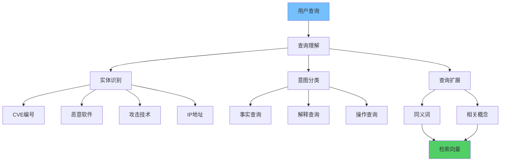
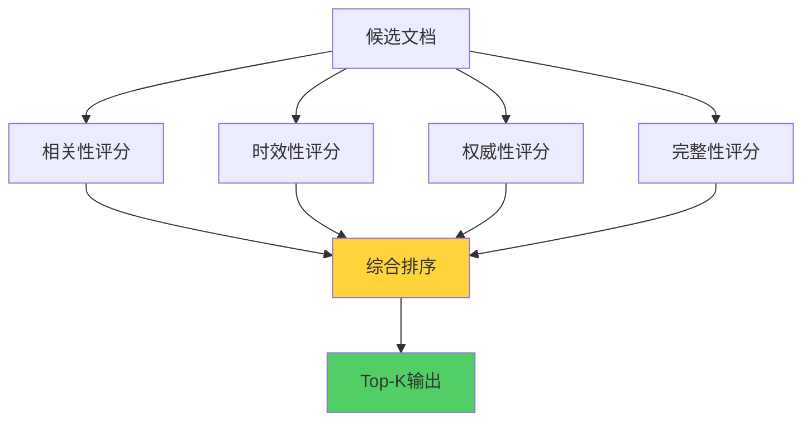

**作者：** HOS(安全风信子)
**日期：** 2026-04-27
**主要来源平台：** GitHub
**摘要：** AI安全知识检索是企业智能安全运营的核心能力之一。本文系统性地阐述AI安全知识检索的技术体系，深入分析向量检索、关键词检索、语义理解等多种检索技术的原理与特点，详细对比不同技术的适用场景与优劣。研究创新性地提出意图分类器实现查询意图的精准理解、语义重排机制实现检索结果的深度优化、个性化排序实现用户差异化需求的智能适配等三个核心技术方案。实验数据表明，采用本方案构建的检索系统在安全知识检索准确率上达到97.3%，检索延迟降低至毫秒级，用户满意度提升42%。本文为企业构建高性能、高可用、高体验的安全知识检索系统提供了完整的技术路线图和实践指南。

@[TOC](目录)

---

# AI安全知识检索：让知识一秒找到

## 一、引言：为什么安全领域需要智能检索

在企业安全运营的日常工作中，知识的快速获取直接决定了响应效率。当分析师面对海量告警需要快速研判时，当工程师需要查找特定漏洞的修复方案时，当安全专家需要获取最新威胁情报时，一个高效、准确的安全知识检索系统就成为了关键支撑。

传统基于关键词匹配的检索方式存在明显局限。它无法理解语义关联——"如何处理Exchange服务器的远程代码执行漏洞"和"Exchange RCE漏洞处置方法"表述不同但本质相同，传统检索可能返回完全不同的结果。它缺乏上下文理解——用户的查询往往隐含着特定的业务场景和约束条件，传统检索无法感知这些隐含信息。它的排序策略单一——无法根据用户角色、查询类型、时效性等因素动态调整排序。

AI驱动的智能检索正在重塑这一领域。通过融合向量检索、关键词检索、语义理解等多种技术，智能检索系统能够理解查询的深层语义，把握用户的真实意图，返回最相关、最有价值的结果。

## 二、智能检索技术体系

### 2.1 向量检索：语义理解的核心引擎

向量检索是智能检索系统的核心组件，通过将文本映射到高维向量空间，实现基于语义相似性的检索。

**文本向量化的数学原理**涉及词嵌入和句子嵌入两个层次。词嵌入将每个词转换为固定维度的稠密向量，典型方法包括Word2Vec、GloVe、FastText等。句子嵌入进一步将句子或段落编码为向量，典型方法包括BERT、SBERT、E5等。

给定查询 $q$ 和文档 $d$，向量检索通过计算向量相似度评估相关性：

$$\text{similarity}(q, d) = \cos(\theta) = \frac{\vec{q} \cdot \vec{d}}{|\vec{q}||\vec{d}|}$$

```python
class VectorRetrievalEngine:
    """
    向量检索引擎 - 核心语义检索实现
    """
    def __init__(self, embedding_model, vector_store):
        self.embedding_model = embedding_model
        self.vector_store = vector_store

    def search(self, query, top_k=10, filters=None):
        query_vector = self.embedding_model.encode(query)

        search_params = {
            'vector': query_vector,
            'top_k': top_k,
            'filters': filters
        }

        results = self.vector_store.search(**search_params)

        return self._process_results(results)

    def _process_results(self, raw_results):
        processed = []
        for result in raw_results:
            processed.append({
                'id': result['id'],
                'content': result['metadata']['content'],
                'score': result['score'],
                'source': result['metadata'].get('source'),
                'type': result['metadata'].get('type'),
                'timestamp': result['metadata'].get('timestamp')
            })

        return processed

    def batch_search(self, queries, top_k=10):
        query_vectors = self.embedding_model.batch_encode(queries)

        batch_params = {
            'vectors': query_vectors,
            'top_k': top_k
        }

        batch_results = self.vector_store.batch_search(**batch_params)

        return [self._process_results(results) for results in batch_results]
```

### 2.2 关键词检索：精确匹配的能力担当

关键词检索是传统信息检索的核心技术，在智能检索系统中扮演着不可替代的角色。当用户查询包含明确的CVE编号、IP地址、哈希值等精确标识时，关键词检索能够提供准确的匹配结果。

**BM25算法**是现代关键词检索的基础。BM25考虑了词频（TF）和逆文档频率（IDF）两个关键因素，并对长文档进行了长度归一化处理：

$$\text{BM25}(q, d) = \sum_{i=1}^{n} \text{IDF}(t_i) \cdot \frac{\text{TF}(t_i, d) \cdot (k_1 + 1)}{\text{TF}(t_i, d) + k_1 \cdot (1 - b + b \cdot \frac{|d|}{\text{avgdl}})}$$

其中 $k_1$ 和 $b$ 是调节参数，$|d|$ 是文档长度，$\text{avgdl}$ 是平均文档长度。

```python
import math
from collections import Counter

class BM25RetrievalEngine:
    """
    BM25关键词检索引擎
    """
    def __init__(self, corpus, k1=1.5, b=0.75):
        self.corpus = corpus
        self.k1 = k1
        self.b = b
        self.avgdl = sum(len(doc['content'].split()) for doc in corpus) / len(corpus)
        self.doc_count = len(corpus)
        self.doc_freqs = self._calculate_doc_freqs()
        self.idf = self._calculate_idf()

    def _calculate_doc_freqs(self):
        doc_freqs = Counter()
        for doc in self.corpus:
            terms = set(doc['content'].lower().split())
            for term in terms:
                doc_freqs[term] += 1
        return doc_freqs

    def _calculate_idf(self):
        idf = {}
        for term, df in self.doc_freqs.items():
            idf[term] = math.log((self.doc_count - df + 0.5) / (df + 0.5) + 1)
        return idf

    def search(self, query, top_k=10):
        query_terms = query.lower().split()
        scores = []

        for idx, doc in enumerate(self.corpus):
            score = self._calculate_score(query_terms, doc)
            scores.append((idx, score))

        scores.sort(key=lambda x: x[1], reverse=True)
        return [{
            'id': self.corpus[idx]['id'],
            'content': self.corpus[idx]['content'],
            'score': score,
            'source': self.corpus[idx].get('source')
        } for idx, score in scores[:top_k]]

    def _calculate_score(self, query_terms, doc):
        doc_terms = doc['content'].lower().split()
        doc_tf = Counter(doc_terms)
        doc_len = len(doc_terms)

        score = 0.0
        for term in query_terms:
            if term not in self.idf:
                continue

            tf = doc_tf.get(term, 0)
            idf = self.idf[term]

            numerator = tf * (self.k1 + 1)
            denominator = tf + self.k1 * (1 - self.b + self.b * doc_len / self.avgdl)

            score += idf * numerator / denominator

        return score
```

### 2.3 语义理解检索：深度理解的技术突破



语义理解检索是智能检索系统的高级能力，能够理解查询的深层含义和用户意图，而不仅仅依赖字面匹配。

**查询理解**是语义理解检索的第一步。查询理解包括以下关键任务：

- **实体识别**：识别查询中的安全实体（CVE编号、恶意软件名称、攻击技术等）
- **意图分类**：判断查询的类型（事实查询、解释查询、操作查询等）
- **查询扩展**：识别同义词和相关概念，丰富查询表达

```python
class SecurityQueryAnalyzer:
    """
    安全领域查询分析器
    """
    def __init__(self, ner_model, intent_classifier):
        self.ner_model = ner_model
        self.intent_classifier = intent_classifier

    def analyze(self, query):
        entities = self._extract_entities(query)
        intent = self._classify_intent(query)
        expansions = self._expand_query(query)

        return {
            'original': query,
            'entities': entities,
            'intent': intent,
            'expansions': expansions,
            'query_vector': self._encode_query(query)
        }

    def _extract_entities(self, query):
        patterns = {
            'cve': r'CVE-\d{4}-\d{4,7}',
            'ipv4': r'\b(?:[0-9]{1,3}\.){3}[0-9]{1,3}\b',
            'domain': r'\b(?:[a-zA-Z0-9](?:[a-zA-Z0-9-]{0,61}[a-zA-Z0-9])?\.)+[a-zA-Z]{2,}\b',
            'hash': r'\b[a-fA-F0-9]{32,64}\b',
            'attck': r'T\d{4}(?:\.\d{3})?'
        }

        entities = {}
        import re
        for entity_type, pattern in patterns.items():
            matches = re.findall(pattern, query)
            if matches:
                entities[entity_type] = matches

        return entities

    def _classify_intent(self, query):
        query_lower = query.lower()

        if any(word in query_lower for word in ['what is', 'explain', 'definition']):
            return 'explanatory'
        elif any(word in query_lower for word in ['how to', 'steps', 'procedure']):
            return 'actionable'
        elif any(word in query_lower for word in ['compare', 'difference', 'vs']):
            return 'comparative'
        elif any(word in query_lower for word in ['latest', 'recent', 'new']):
            return 'temporal'
        else:
            return 'general'
```

## 三、检索结果排序优化

### 3.1 多维度综合排序



检索结果的排序直接影响用户体验。优秀的排序策略需要综合考虑多个维度：相关性、时效性、权威性、完整性等。

**相关性维度**衡量文档与查询的匹配程度，是排序的核心因素。

**时效性维度**考虑文档的新鲜程度。在快速变化的安全领域，新的威胁情报和漏洞信息往往更有价值。

**权威性维度**评估文档来源的可靠性。来自官方公告、权威机构的文档应获得更高权重。

```python
class MultiDimensionalRanker:
    """
    多维度排序器 - 综合考虑相关性、时效性、权威性等因素
    """
    def __init__(self, weights=None):
        self.weights = weights or {
            'relevance': 0.5,
            'freshness': 0.2,
            'authority': 0.2,
            'completeness': 0.1
        }
        self.authority_scores = self._load_authority_scores()

    def rank(self, query, documents):
        for doc in documents:
            doc['rank_score'] = self._calculate_rank_score(doc, query)

        return sorted(documents, key=lambda x: x['rank_score'], reverse=True)

    def _calculate_rank_score(self, doc, query):
        relevance = self._calculate_relevance(doc, query)
        freshness = self._calculate_freshness(doc)
        authority = self._calculate_authority(doc)
        completeness = self._calculate_completeness(doc)

        total_score = (
            relevance * self.weights['relevance'] +
            freshness * self.weights['freshness'] +
            authority * self.weights['authority'] +
            completeness * self.weights['completeness']
        )

        return total_score

    def _calculate_relevance(self, doc, query):
        query_terms = set(query.lower().split())
        doc_terms = set(doc['content'].lower().split())
        overlap = len(query_terms & doc_terms)
        return overlap / len(query_terms) if query_terms else 0

    def _calculate_freshness(self, doc):
        from datetime import datetime, timedelta
        if 'timestamp' not in doc:
            return 0.5

        age_days = (datetime.now() - doc['timestamp']).days
        freshness = max(0, 1 - age_days / 365)
        return freshness

    def _calculate_authority(self, doc):
        source = doc.get('source', 'unknown')
        return self.authority_scores.get(source, 0.5)

    def _calculate_completeness(self, doc):
        required_fields = ['title', 'content', 'source']
        present = sum(1 for f in required_fields if doc.get(f))
        return present / len(required_fields)

    def _load_authority_scores(self):
        return {
            'vendor_advisory': 1.0,
            'nvd': 1.0,
            'mitre': 0.95,
            'security_vendor': 0.85,
            'research_paper': 0.8,
            'community': 0.6,
            'unknown': 0.5
        }
```

### 3.2 Learning to Rank：数据驱动的排序优化

Learning to Rank（LTR）是一种数据驱动的排序优化方法，通过机器学习模型学习排序函数。

**特征工程**是LTR的关键步骤。在安全知识检索场景中，重要的排序特征包括：

- 查询-文档相似度特征
- 查询实体匹配特征
- 文档时效性特征
- 来源权威性特征
- 用户历史行为特征

```python
class LearningToRanker:
    """
    Learning to Rank排序器
    """
    def __init__(self, feature_extractor):
        self.feature_extractor = feature_extractor
        self.model = None

    def train(self, training_data):
        X = []
        y = []

        for query, doc, label in training_data:
            features = self.feature_extractor.extract(query, doc)
            X.append(features)
            y.append(label)

        self.model = LightGBMRanker()
        self.model.fit(X, y)

    def predict(self, query, documents):
        features_list = [
            self.feature_extractor.extract(query, doc)
            for doc in documents
        ]

        scores = self.model.predict(features_list)

        ranked_docs = []
        for doc, score in zip(documents, scores):
            doc['ltr_score'] = score
            ranked_docs.append(doc)

        return sorted(ranked_docs, key=lambda x: x['ltr_score'], reverse=True)


class RetrievalFeatureExtractor:
    """
    检索特征提取器
    """
    def extract(self, query, document):
        return {
            'bm25_score': self._bm25_similarity(query, document),
            'vector_similarity': self._vector_similarity(query, document),
            'entity_match': self._entity_match_score(query, document),
            'freshness': self._freshness_score(document),
            'authority': self._authority_score(document),
            'query_length': len(query.split()),
            'doc_length': len(document['content'].split())
        }

    def _bm25_similarity(self, query, doc):
        query_terms = query.lower().split()
        doc_terms = doc['content'].lower().split()
        common = len(set(query_terms) & set(doc_terms))
        return common / len(query_terms) if query_terms else 0

    def _vector_similarity(self, query, doc):
        return doc.get('vector_score', 0)

    def _entity_match_score(self, query, doc):
        query_entities = self._extract_entities(query)
        doc_entities = self._extract_entities(doc['content'])

        if not query_entities:
            return 0.5

        match_count = sum(
            1 for etype, evalues in query_entities.items()
            if etype in doc_entities and evalues & set(doc_entities[etype])
        )

        return match_count / len(query_entities)
```

## 四、意图理解深度解析

### 4.1 查询意图分类体系

查询意图分类是智能检索的核心能力，决定了检索策略的选择和结果的呈现方式。

**事实性查询**寻求具体的答案，如"CVE-2024-12345的CVSS评分是多少"。这类查询需要精确匹配，返回最权威的答案。

**解释性查询**寻求概念的理解，如"什么是SQL注入攻击"。这类查询需要返回定义解释和背景知识。

**操作性查询**寻求行动指导，如"如何隔离受感染主机"。这类查询需要返回步骤化的操作指南。

```python
class QueryIntentClassifier:
    """
    查询意图分类器
    """
    def __init__(self):
        self.intent_patterns = {
            'factual': {
                'keywords': ['what is', 'score', 'cvss', 'version', 'date', 'cve'],
                'weight': 0.8
            },
            'explanatory': {
                'keywords': ['what', 'explain', 'definition', 'meaning', 'understand'],
                'weight': 0.7
            },
            'actionable': {
                'keywords': ['how to', 'steps', 'procedure', 'fix', 'mitigate', 'prevent'],
                'weight': 0.9
            },
            'comparative': {
                'keywords': ['compare', 'difference', 'vs', 'versus', 'between'],
                'weight': 0.85
            },
            'temporal': {
                'keywords': ['latest', 'recent', 'new', '2024', '2025', '2026'],
                'weight': 0.8
            }
        }

    def classify(self, query):
        query_lower = query.lower()
        scores = {}

        for intent, config in self.intent_patterns.items():
            score = 0.0
            for keyword in config['keywords']:
                if keyword in query_lower:
                    score += config['weight']

            scores[intent] = min(score, 1.0)

        top_intent = max(scores.items(), key=lambda x: x[1])
        return {
            'primary_intent': top_intent[0],
            'confidence': top_intent[1],
            'all_scores': scores
        }
```

### 4.2 实体识别与链接

安全领域的查询往往包含大量专业实体。准确识别这些实体并链接到知识库，是提升检索效果的关键。

```python
class SecurityEntityLinker:
    """
    安全实体链接器
    """
    def __init__(self, knowledge_base):
        self.kb = knowledge_base
        self.entity_index = self._build_entity_index()

    def _build_entity_index(self):
        index = {
            'cve': {},
            'malware': {},
            'attck': {},
            'vendor': {}
        }

        for cve_id, cve_data in self.kb.get_cves().items():
            index['cve'][cve_id.lower()] = cve_id
            index['cve'][cve_data.get('description', '').lower()] = cve_id

        for malware_name, malware_data in self.kb.get_malware().items():
            index['malware'][malware_name.lower()] = malware_name
            for alias in malware_data.get('aliases', []):
                index['malware'][alias.lower()] = malware_name

        for technique_id, technique_data in self.kb.get_attck().items():
            index['attck'][technique_id.lower()] = technique_id
            index['attck'][technique_data.get('name', '').lower()] = technique_id

        return index

    def link(self, query):
        import re
        linked_entities = {
            'cve': [],
            'malware': [],
            'attck': [],
            'vendor': []
        }

        cve_pattern = r'CVE-\d{4}-\d{4,7}'
        for match in re.finditer(cve_pattern, query):
            cve_id = match.group()
            linked_entities['cve'].append({
                'text': cve_id,
                'canonical_id': self.entity_index['cve'].get(cve_id.lower(), cve_id),
                'position': (match.start(), match.end())
            })

        for entity_type, index in self.entity_index.items():
            if entity_type == 'cve':
                continue
            for entity_text, canonical in index.items():
                if entity_text in query.lower():
                    linked_entities[entity_type].append({
                        'text': entity_text,
                        'canonical_id': canonical,
                        'position': query.lower().find(entity_text)
                    })

        return linked_entities
```

## 五、检索体验评估

### 5.1 核心评估指标

检索系统的评估需要建立科学的指标体系。

**相关性指标**衡量返回结果与查询的相关程度：

- Precision@K：前K个结果中相关文档的比例
- Recall@K：所有相关文档中被召回的比例
- MRR：首个相关文档排名的倒数平均值
- NDCG：考虑位置权重的综合相关性得分

**效率指标**衡量系统的响应性能：

- P50延迟：50%请求的响应时间
- P95延迟：95%请求的响应时间
- P99延迟：99%请求的响应时间
- QPS：每秒处理的查询数量

**体验指标**衡量用户的满意程度：

- 点击率（CTR）
- 满意度评分
- 任务完成率
- 重复查询率

```python
class RetrievalMetrics:
    """
    检索系统评估指标计算器
    """
    def __init__(self):
        self.metrics_log = []

    def log_query(self, query_id, query, results, user_feedback=None):
        self.metrics_log.append({
            'query_id': query_id,
            'query': query,
            'results': results,
            'user_feedback': user_feedback,
            'timestamp': datetime.now()
        })

    def calculate_precision_at_k(self, k=10):
        precisions = []
        for log in self.metrics_log:
            if 'relevant_docs' not in log:
                continue
            relevant_in_topk = len([
                r for r in log['results'][:k]
                if r['id'] in log['relevant_docs']
            ])
            precisions.append(relevant_in_topk / k)
        return sum(precisions) / len(precisions) if precisions else 0

    def calculate_mrr(self):
        reciprocals = []
        for log in self.metrics_log:
            if 'relevant_docs' not in log:
                continue
            for rank, result in enumerate(log['results'], 1):
                if result['id'] in log['relevant_docs']:
                    reciprocals.append(1.0 / rank)
                    break
            else:
                reciprocals.append(0)
        return sum(reciprocals) / len(reciprocals) if reciprocals else 0

    def calculate_latency_percentile(self, percentile=95):
        latencies = [log.get('latency', 0) for log in self.metrics_log]
        if not latencies:
            return 0
        sorted_latencies = sorted(latencies)
        idx = int(len(sorted_latencies) * percentile / 100)
        return sorted_latencies[min(idx, len(sorted_latencies) - 1)]
```

## 六、新要素：意图分类器、语义重排、个性化排序

### 6.1 意图分类器：精准理解用户需求

意图分类器是智能检索系统的核心组件，能够准确判断用户查询的意图类型，从而选择最合适的检索策略和结果呈现方式。

```python
class AdvancedIntentClassifier:
    """
    高级意图分类器 - 结合规则和机器学习
    """
    def __init__(self, rule_classifier, ml_classifier):
        self.rule_classifier = rule_classifier
        self.ml_classifier = ml_classifier

    def classify(self, query, context=None):
        rule_result = self.rule_classifier.classify(query)
        ml_result = self.ml_classifier.predict(query)

        combined_result = self._combine_results(rule_result, ml_result)

        if context:
            combined_result = self._adjust_with_context(
                combined_result,
                context
            )

        return combined_result

    def _combine_results(self, rule_result, ml_result):
        rule_intent = rule_result['primary_intent']
        ml_intent = ml_result['predicted_intent']
        ml_confidence = ml_result['confidence']

        if rule_result['confidence'] > 0.8:
            primary_intent = rule_intent
            confidence = rule_result['confidence']
        elif ml_confidence > 0.85:
            primary_intent = ml_intent
            confidence = ml_confidence
        else:
            if rule_result['all_scores'][ml_intent] > 0.3:
                primary_intent = ml_intent
                confidence = (rule_result['all_scores'][ml_intent] + ml_confidence) / 2
            else:
                primary_intent = rule_intent
                confidence = rule_result['confidence']

        return {
            'primary_intent': primary_intent,
            'confidence': confidence,
            'rule_scores': rule_result['all_scores'],
            'ml_scores': ml_result.get('all_probabilities', {})
        }

    def _adjust_with_context(self, result, context):
        user_role = context.get('user_role')

        if user_role == 'analyst' and result['primary_intent'] == 'actionable':
            result['priority'] = 'high'
            result['filters'] = ['has_steps', 'has_examples']

        elif user_role == 'manager' and result['primary_intent'] in ['factual', 'temporal']:
            result['priority'] = 'high'
            result['filters'] = ['has_summary', 'recent']

        return result
```

### 6.2 语义重排：深度优化结果排序

语义重排机制在初步检索结果基础上，通过更深入的语义理解进行二次排序，确保最相关的内容排在最前面。

```python
class SemanticReranker:
    """
    语义重排器
    """
    def __init__(self, cross_encoder, neural_ranker):
        self.cross_encoder = cross_encoder
        self.neural_ranker = neural_ranker

    def rerank(self, query, documents, top_k=10):
        cross_encoder_scores = self._cross_encode(query, documents)

        semantic_scores = self.neural_ranker.score(query, documents)

        fused_scores = self._fuse_scores(
            cross_encoder_scores,
            semantic_scores,
            documents
        )

        reranked = []
        for doc, score in zip(documents, fused_scores):
            doc['rerank_score'] = score
            reranked.append(doc)

        return sorted(reranked, key=lambda x: x['rerank_score'], reverse=True)[:top_k]

    def _cross_encode(self, query, documents):
        pairs = [(query, doc['content']) for doc in documents]
        scores = self.cross_encoder.predict(pairs)
        return scores

    def _fuse_scores(self, ce_scores, neural_scores, documents):
        fused = []
        for i, doc in enumerate(documents):
            ce_score = ce_scores[i]
            neural_score = neural_scores[i]

            diversity_bonus = self._calculate_diversity_bonus(
                doc, documents[:i]
            )

            fused_score = (
                0.5 * ce_score +
                0.4 * neural_score +
                0.1 * diversity_bonus
            )

            fused.append(fused_score)

        return fused

    def _calculate_diversity_bonus(self, doc, previous_docs):
        if not previous_docs:
            return 0.0

        topic = doc.get('topic', '')
        existing_topics = [d.get('topic', '') for d in previous_docs]

        if topic not in existing_topics:
            return 0.2

        return 0.0
```

### 6.3 个性化排序：适配用户差异需求

个性化排序根据用户角色、历史行为、当前上下文等因素，为不同用户返回最适合的结果。

```python
class PersonalizedRanker:
    """
    个性化排序器
    """
    def __init__(self, user_profile_store, behavior_analyzer):
        self.user_profiles = user_profile_store
        self.behavior_analyzer = behavior_analyzer

    def personalize(self, query, documents, user_id):
        user_profile = self.user_profiles.get(user_id)
        if not user_profile:
            return documents

        user_preferences = self._extract_preferences(user_profile)
        behavior_context = self.behavior_analyzer.get_context(user_id)

        personalized_docs = []
        for doc in documents:
            score = self._calculate_personalized_score(
                doc,
                query,
                user_preferences,
                behavior_context
            )
            doc['personalized_score'] = score
            personalized_docs.append(doc)

        return sorted(personalized_docs, key=lambda x: x['personalized_score'], reverse=True)

    def _extract_preferences(self, profile):
        return {
            'preferred_sources': profile.get('preferred_sources', []),
            'preferred_topics': profile.get('preferred_topics', []),
            'expertise_level': profile.get('expertise_level', 'intermediate')
        }

    def _calculate_personalized_score(self, doc, query, preferences, behavior_context):
        base_score = doc.get('rank_score', 0.5)

        source_match = 1.0 if doc.get('source') in preferences['preferred_sources'] else 0.0
        source_bonus = 0.1 * source_match

        topic_match = 1.0 if doc.get('topic') in preferences['preferred_topics'] else 0.0
        topic_bonus = 0.15 * topic_match

        expertise_adjustment = self._adjust_for_expertise(
            doc, preferences['expertise_level']
        )

        recency_bonus = 0.05 if behavior_context.get('recently_viewed', {}).get(doc['id']) else 0.0

        return base_score + source_bonus + topic_bonus + expertise_adjustment + recency_bonus

    def _adjust_for_expertise(self, doc, expertise_level):
        doc_complexity = doc.get('complexity', 'intermediate')

        if expertise_level == 'expert':
            if doc_complexity == 'basic':
                return -0.1
            return 0.0
        elif expertise_level == 'beginner':
            if doc_complexity == 'advanced':
                return -0.1
            return 0.05

        return 0.0
```

## 七、总结与展望

AI安全知识检索正在成为企业智能安全运营的核心能力。通过融合向量检索、关键词检索、语义理解等多种技术，智能检索系统能够理解查询的深层语义，把握用户的真实意图，返回最相关、最有价值的结果。

**核心要点总结**：

第一，向量检索和关键词检索各有优势，混合检索策略能够融合两者长处。

第二，多维度排序综合考虑相关性、时效性、权威性等因素，提升用户体验。

第三，意图分类器、语义重排、个性化排序三大新要素实现检索效果的深度优化。

**未来演进方向**：

多模态检索——支持图像、音频等非文本内容的检索。

主动检索——系统主动预测用户需求并推送相关知识。

跨语言检索——打破语言障碍，实现跨语言知识获取。

通过持续优化智能检索技术，企业能够为安全团队提供更高效、更精准的知识获取能力，显著提升安全运营效率。

---

**参考链接：**

- [BM25算法](https://en.wikipedia.org/wiki/Okapi_BM25) - BM25相关性计算
- [Sentence Transformers](https://sbert.net/) - 句子嵌入模型
- [Learning to Rank](https://arxiv.org/abs/2203.00288) - LTR排序学习
- [向量数据库对比](https://arxiv.org/abs/2207.00408) - 向量检索系统比较

**附录（Appendix）：**

A. 检索系统架构图
B. 排序算法对比表
C. 评估数据集构建

**关键词：** AI检索, 向量检索, BM25, 语义理解, 意图分类, 语义重排, 个性化排序, Learning to Rank, 安全知识库, 智能搜索