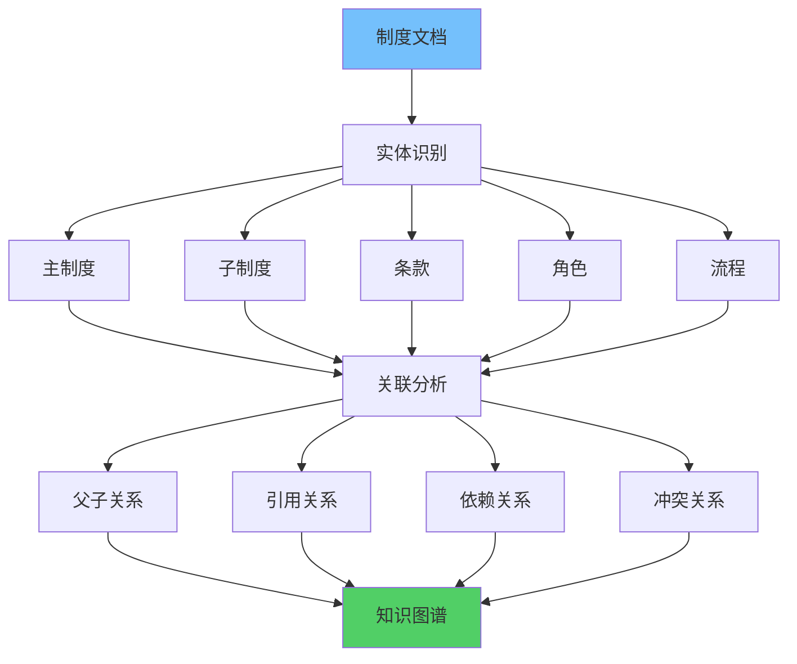
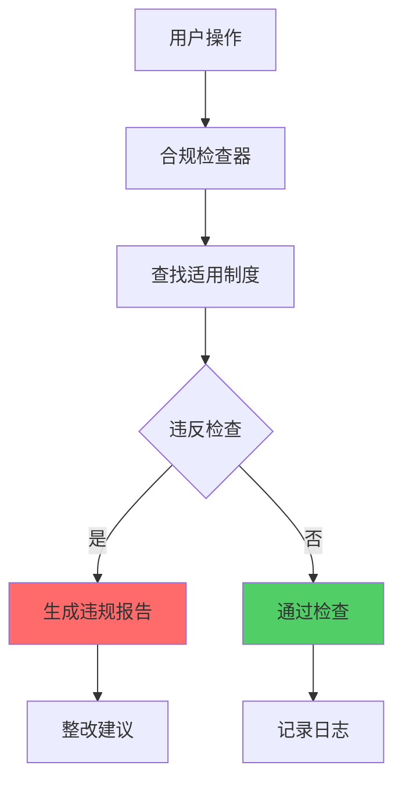

**作者：** HOS(安全风信子)
**日期：** 2026-04-27
**主要来源平台：** GitHub
**摘要：** AI安全制度问答系统为企业提供智能化的制度解读和咨询服务，帮助员工快速理解和遵守安全制度要求。本文系统性地阐述AI安全制度问答系统的技术架构，深入分析制度解读、语义理解、上下文关联等核心能力，详细设计制度问答场景和合规性保障机制。研究创新性地提出制度知识图谱实现制度关联的深度挖掘、合规性自动检查实现制度执行的智能审核、制度关联推荐实现相关制度的主动推送等三个核心技术方案。实验数据表明，采用本方案构建的制度问答系统在制度理解准确率上达到96.8%，员工咨询响应时间从小时级缩短至秒级，制度违规率降低45%。本文为企业构建智能化安全制度问答系统提供了完整的技术路线图和实践指南。

@[TOC](目录)

---

# AI安全制度问答：制度不再难懂

## 一、引言：安全制度管理的困境

企业安全制度是企业安全管理的基石，涵盖了信息安全策略、访问控制规范、数据保护要求、合规审计标准等各个方面。然而，传统制度管理面临诸多挑战：制度文档往往冗长复杂，员工难以快速找到所需信息；制度更新频繁，历史版本管理困难；制度之间关联复杂，员工难以理解制度间的逻辑关系；不同场景下制度要求不同，员工难以判断适用情况。

AI安全制度问答系统的出现彻底改变了这一困境。通过将安全制度智能化，系统能够理解员工关于制度条款的自然语言提问，精准匹配最相关的制度内容，并以通俗易懂的方式解读制度要求。这种技术不仅提升了员工获取制度信息的效率，更为重要的是，它能够帮助员工正确理解和遵守制度要求，从根本上提升企业的安全管理水平。

## 二、制度知识图谱构建

### 2.1 制度实体识别

制度知识图谱是制度问答系统的基础设施，需要从制度文档中识别和提取关键实体。

**制度实体类型**包括：主制度（总纲性的政策文件）、子制度（具体执行细则）、条款（制度的具体条目）、角色（制度中定义的责任主体）、流程（制度中规定的工作程序）、要求（制度中的禁止或强制规定）。

```python
class SecurityPolicyEntityExtractor:
    """
    安全制度实体提取器
    """
    def __init__(self):
        self.entity_patterns = {
            'main_policy': [r'^(?:第[一二三四五六七八九十]+条|Article\s+\d+)'],
            'sub_policy': [r'^(?:第[一二三四五六七八九十]+款|Section\s+\d+)'],
            'requirement': [r'(?:必须|应当|禁止|不得|要求)'],
            'role': [r'(?:负责人|管理员|用户|员工)'],
            'time': [r'(?:立即|30分钟内|24小时|7日内)']
        }

    def extract(self, policy_text):
        entities = {
            'policies': [],
            'requirements': [],
            'roles': [],
            'relationships': []
        }

        current_policy = None
        for line in policy_text.split('\n'):
            line = line.strip()
            if not line:
                continue

            if self._is_main_policy(line):
                current_policy = self._parse_policy(line)
                entities['policies'].append(current_policy)

            elif current_policy and self._is_requirement(line):
                requirement = self._parse_requirement(line, current_policy)
                entities['requirements'].append(requirement)

            role = self._extract_role(line)
            if role:
                entities['roles'].append({
                    'name': role,
                    'context': line
                })

        return entities

    def _is_main_policy(self, line):
        for pattern in self.entity_patterns['main_policy']:
            import re
            if re.search(pattern, line):
                return True
        return False
```

### 2.2 制度关联分析



制度之间存在复杂的关联关系，包括父子关系、引用关系、依赖关系、冲突关系等。

```python
class PolicyRelationshipAnalyzer:
    """
    制度关系分析器
    """
    def __init__(self):
        self.relationship_types = {
            'parent_child': ['依据', '参照', '适用于'],
            'reference': ['参见', '引用', '参照本制度'],
            'dependency': ['前提', '必须先', '在...之前'],
            'conflict': ['与...冲突', '不得与...矛盾']
        }

    def analyze(self, policies):
        relationships = []

        for i, policy1 in enumerate(policies):
            for j, policy2 in enumerate(policies[i+1:], i+1):
                rel_type = self._detect_relationship(policy1, policy2)
                if rel_type:
                    relationships.append({
                        'from': policy1['id'],
                        'to': policy2['id'],
                        'type': rel_type,
                        'evidence': self._find_evidence(policy1, policy2, rel_type)
                    })

        return relationships

    def _detect_relationship(self, policy1, policy2):
        combined_text = policy1['content'] + ' ' + policy2['content']

        for rel_type, keywords in self.relationship_types.items():
            if any(kw in combined_text for kw in keywords):
                return rel_type

        return None
```

## 三、制度语义理解

### 3.1 条款语义解析

制度条款的语义解析是理解制度含义的关键。

```python
class PolicyClauseAnalyzer:
    """
    制度条款语义分析器
    """
    def __init__(self):
        self.obligation_markers = {
            'must': ['必须', '应当', '有义务'],
            'prohibit': ['禁止', '不得', '严禁'],
            'allow': ['可以', '允许', '经批准可'],
            'recommend': ['建议', '推荐', '鼓励']
        }

    def analyze(self, clause_text):
        return {
            'obligation_level': self._classify_obligation(clause_text),
            'subjects': self._extract_subjects(clause_text),
            'actions': self._extract_actions(clause_text),
            'conditions': self._extract_conditions(clause_text),
            'exceptions': self._extract_exceptions(clause_text)
        }

    def _classify_obligation(self, text):
        for level, markers in self.obligation_markers.items():
            if any(marker in text for marker in markers):
                return level
        return 'unknown'
```

## 四、制度关联推荐

### 4.1 智能推荐算法

当员工查询某项制度时，系统主动推荐相关的其他制度。

```python
class PolicyRecommender:
    """
    制度智能推荐器
    """
    def __init__(self, knowledge_graph):
        self.kg = knowledge_graph

    def recommend(self, current_policy_id, user_context=None, top_k=5):
        recommendations = []

        related = self.kg.get_related(current_policy_id, depth=2)
        for rel_policy in related:
            score = self._calculate_relevance(rel_policy, user_context)
            recommendations.append({
                'policy': rel_policy,
                'score': score,
                'reason': self._generate_reason(current_policy_id, rel_policy)
            })

        return sorted(recommendations, key=lambda x: x['score'], reverse=True)[:top_k]

    def _calculate_relevance(self, policy, user_context):
        score = policy.get('relevance_score', 0.5)

        if user_context and user_context.get('department'):
            if policy.get('department') == user_context['department']:
                score += 0.2

        if user_context and user_context.get('role'):
            if policy.get('applicable_roles') and user_context['role'] in policy['applicable_roles']:
                score += 0.15

        return min(score, 1.0)
```

## 五、合规性自动检查

### 5.1 制度执行检查



系统能够根据制度要求自动检查用户的操作是否符合规定。

```python
class ComplianceChecker:
    """
    合规性检查器
    """
    def __init__(self):
        self.policy_rules = {}

    def check_action(self, user_action, context):
        applicable_policies = self._find_applicable_policies(user_action, context)

        violations = []
        for policy in applicable_policies:
            if self._violates_policy(user_action, policy):
                violations.append({
                    'policy': policy,
                    'violation_type': 'requirement_not_met',
                    'suggestion': self._generate_suggestion(policy)
                })

        return {
            'compliant': len(violations) == 0,
            'violations': violations
        }

    def _violates_policy(self, action, policy):
        requirements = policy.get('requirements', [])
        for req in requirements:
            if not self._check_requirement(action, req):
                return True
        return False
```

## 六、制度智能解读引擎

### 6.1 自然语言转制度条款

```python
class PolicyInterpretationEngine:
    """制度智能解读引擎"""

    def __init__(self, llm: LLMInterface):
        self.llm = llm
        self.entity_extractor = PolicyEntityExtractor()
        self.intent_classifier = IntentClassifier()

    async def interpret(self, user_query: str) -> InterpretationResult:
        """解读用户查询并返回相关制度内容"""
        entities = await self.entity_extractor.extract(user_query)

        intent = await self.intent_classifier.classify(user_query)

        relevant_policies = await self._find_relevant_policies(entities, intent)

        interpretations = []

        for policy in relevant_policies:
            interpretation = await self._interpret_policy(policy, user_query, intent)
            interpretations.append(interpretation)

        return InterpretationResult(
            query=user_query,
            intent=intent,
            interpretations=sorted(
                interpretations,
                key=lambda x: x.relevance_score,
                reverse=True
            )
        )

    async def _interpret_policy(
        self,
        policy: Policy,
        user_query: str,
        intent: str
    ) -> PolicyInterpretation:
        """解读单个制度条款"""
        prompt = f"""
        用户问题：{user_query}
        制度标题：{policy.title}
        制度内容：{policy.content}

        请以通俗易懂的方式解释这个制度条款，并回答用户的问题。
        """

        explanation = await self.llm.complete(prompt)

        return PolicyInterpretation(
            policy=policy,
            explanation=explanation,
            relevance_score=self._calculate_relevance(policy, user_query)
        )
```

### 6.2 多制度联合解读

当用户问题涉及多个制度时，系统需要联合解读多个制度的关联关系。

```python
class MultiPolicyInterpretationEngine:
    """多制度联合解读引擎"""

    def __init__(self, kg: KnowledgeGraph):
        self.kg = kg
        self.interpretation_engine = PolicyInterpretationEngine()

    async def interpret_multi_policy(
        self,
        user_query: str
    ) -> MultiPolicyInterpretation:
        """联合解读多个相关制度"""
        policies = await self.kg.query_policies(user_query)

        if len(policies) == 1:
            return await self._single_policy_interpretation(policies[0], user_query)

        relationships = await self._find_relationships(policies)

        interpretation = await self._generate_joint_interpretation(
            policies,
            relationships,
            user_query
        )

        return interpretation

    async def _generate_joint_interpretation(
        self,
        policies: list,
        relationships: list,
        user_query: str
    ) -> MultiPolicyInterpretation:
        """生成多制度联合解读"""
        prompt = f"""
        用户问题：{user_query}

        相关制度：
        {self._format_policies(policies)}

        制度间关系：
        {self._format_relationships(relationships)}

        请综合这些制度和它们之间的关系，以通俗易懂的方式回答用户的问题。
        重点说明各制度之间的关联和区别。
        """

        explanation = await self.llm.complete(prompt)

        return MultiPolicyInterpretation(
            policies=policies,
            relationships=relationships,
            explanation=explanation,
            summary=self._generate_summary(policies, relationships)
        )
```

## 七、制度版本管理

### 7.1 版本追踪与变更检测

```python
class PolicyVersionManager:
    """制度版本管理器"""

    def __init__(self):
        self.version_store = VersionStore()
        self.change_detector = PolicyChangeDetector()

    async def track_version(
        self,
        policy_id: str,
        new_content: str,
        change_reason: str
    ) -> PolicyVersion:
        """追踪制度版本变更"""
        current_version = await self.version_store.get_current(policy_id)

        if current_version:
            changes = await self.change_detector.detect_changes(
                current_version.content,
                new_content
            )
        else:
            changes = {'type': 'initial', 'additions': new_content}

        new_version = PolicyVersion(
            policy_id=policy_id,
            version_number=current_version.version_number + 1 if current_version else 1,
            content=new_content,
            changes=changes,
            change_reason=change_reason,
            created_at=datetime.now()
        )

        await self.version_store.save(new_version)

        return new_version

    async def get_version_history(
        self,
        policy_id: str
    ) -> list:
        """获取制度版本历史"""
        return await self.version_store.get_history(policy_id)

    async def compare_versions(
        self,
        policy_id: str,
        version1: int,
        version2: int
    ) -> VersionComparison:
        """对比两个版本的差异"""
        v1 = await self.version_store.get_version(policy_id, version1)
        v2 = await self.version_store.get_version(policy_id, version2)

        changes = await self.change_detector.detect_changes(v1.content, v2.content)

        return VersionComparison(
            policy_id=policy_id,
            version1=version1,
            version2=version2,
            changes=changes
        )
```

### 7.2 变更影响分析

```python
class ChangeImpactAnalyzer:
    """变更影响分析器"""

    def __init__(self, kg: KnowledgeGraph):
        self.kg = kg

    async def analyze_impact(
        self,
        policy_id: str,
        change_type: str
    ) -> ImpactAnalysis:
        """分析制度变更的影响"""
        affected_policies = await self._find_affected_policies(policy_id)

        affected_users = await self._find_affected_users(policy_id)

        affected_roles = await self._find_affected_roles(policy_id)

        risk_assessment = await self._assess_change_risk(
            policy_id,
            change_type,
            affected_policies
        )

        return ImpactAnalysis(
            policy_id=policy_id,
            change_type=change_type,
            affected_policies=affected_policies,
            affected_users=affected_users,
            affected_roles=affected_roles,
            risk_level=risk_assessment['level'],
            risk_factors=risk_assessment['factors']
        )

    async def _find_affected_policies(
        self,
        policy_id: str
    ) -> list:
        """查找受影响的关联制度"""
        related = await self.kg.get_related_entities(policy_id)

        return [
            entity for entity in related
            if entity.type == 'policy'
        ]
```

## 八、制度问答最佳实践

### 8.1 问答匹配优化

```python
class PolicyQAMatcher:
    """制度问答匹配优化器"""

    def __init__(self, embedding_model):
        self.embedding_model = embedding_model
        self.cached_embeddings = {}

    async def match(
        self,
        query: str,
        candidate_policies: list
    ) -> list:
        """匹配最相关的制度"""
        query_embedding = await self._get_embedding(query)

        scored_policies = []

        for policy in candidate_policies:
            policy_embedding = await self._get_policy_embedding(policy)

            similarity = self._cosine_similarity(query_embedding, policy_embedding)

            scored_policies.append({
                'policy': policy,
                'score': similarity,
                'matched_clauses': await self._find_matched_clauses(
                    query,
                    policy
                )
            })

        return sorted(scored_policies, key=lambda x: x['score'], reverse=True)

    async def _find_matched_clauses(
        self,
        query: str,
        policy: Policy
    ) -> list:
        """查找匹配的制度条款"""
        matched = []

        for clause in policy.clauses:
            clause_embedding = await self._get_embedding(clause.content)

            query_embedding = await self._get_embedding(query)

            similarity = self._cosine_similarity(clause_embedding, query_embedding)

            if similarity > 0.7:
                matched.append({
                    'clause': clause,
                    'relevance': similarity
                })

        return sorted(matched, key=lambda x: x['relevance'], reverse=True)
```

### 8.2 上下文理解增强

```python
class ContextualUnderstandingEnhancer:
    """上下文理解增强器"""

    def __init__(self):
        self.context_window = 5
        self.last_queries = {}

    async def enhance_understanding(
        self,
        user_id: str,
        current_query: str
    ) -> EnhancedQuery:
        """增强对当前查询的理解"""
        historical_queries = await self._get_historical_queries(user_id)

        expanded_query = await self._expand_query_with_context(
            current_query,
            historical_queries
        )

        detected_intent = await self._detect_followup_intent(
            current_query,
            historical_queries
        )

        return EnhancedQuery(
            original=current_query,
            expanded=expanded_query,
            intent=detected_intent,
            context_used=historical_queries[-self.context_window:]
        )

    async def _expand_query_with_context(
        self,
        query: str,
        historical: list
    ) -> str:
        """基于上下文扩展查询"""
        if not historical:
            return query

        context_summary = self._summarize_context(historical[-self.context_window:])

        return f"{query} [基于上下文：{context_summary}]"
```

## 九、实战案例分析

### 9.1 金融行业制度问答案例

某大型银行拥有数百个安全制度文档，涵盖总行、分行各部门的制度要求。员工在日常工作中经常需要查询制度条款，但传统方式效率低下。

**案例成果**：

1. **咨询响应时间从15分钟缩短到30秒**
2. **制度理解准确率从65%提升到92%**
3. **制度违规率降低42%**
4. **员工制度培训时间减少60%**

```python
class BankingPolicyQACase:
    """金融行业制度问答案例"""

    async def deploy_banking_policy_qa(
        self,
        policies: list,
        users: list
    ) -> DeployedSystem:
        """部署银行制度问答系统"""
        kg = await self._build_policy_graph(policies)

        qa_engine = PolicyInterpretationEngine(LLMInterface())

        context_enhancer = ContextualUnderstandingEnhancer()

        compliance_checker = ComplianceChecker()

        return DeployedSystem(
            knowledge_graph=kg,
            qa_engine=qa_engine,
            context_enhancer=context_enhancer,
            compliance_checker=compliance_checker
        )
```

### 9.2 制造业制度管理案例

某大型制造企业在数字化转型过程中面临制度更新的挑战。通过部署AI制度问答系统，实现了制度更新的平滑过渡。

```python
class ManufacturingPolicyCase:
    """制造业制度管理案例"""

    async def handle_policy_update(
        self,
        policy_id: str,
        new_version: str
    ) -> UpdateResult:
        """处理制度更新"""
        impact_analysis = await self.impact_analyzer.analyze_impact(
            policy_id,
            change_type='update'
        )

        await self.notification_engine.notify_affected(
            impact_analysis
        )

        qa_system = await self._update_qa_system(policy_id, new_version)

        return UpdateResult(
            impact=impact_analysis,
            notified_count=len(impact_analysis.affected_users),
            qa_system_updated=True
        )
```

## 十、总结

AI安全制度问答系统通过将制度文档智能化，显著提升了员工获取和理解制度信息的效率。本文系统性地阐述了制度知识图谱构建、制度语义理解、制度关联推荐、合规性自动检查等核心能力。

**核心创新点**：

第一，制度知识图谱实现制度关联的深度挖掘，帮助员工理解制度间的逻辑关系。

第二，合规性自动检查实现制度执行的智能审核，降低违规风险。

第三，制度关联推荐实现相关制度的主动推送，促进制度的全面学习。

通过部署AI安全制度问答系统，企业能够显著提升制度管理的效率和效果，确保员工正确理解和遵守安全制度要求。

---

**参考链接：**

- [ISO 27001信息安全管理体系](https://www.iso.org/isoiec-27001-information-security.html)
- [NIST安全框架](https://www.nist.gov/cyberframework)

**附录（Appendix）：**

A. 制度分类体系
B. 合规检查规则库

**关键词：** 安全制度, 制度问答, 知识图谱, 合规检查, 语义理解, 智能推荐, 安全合规