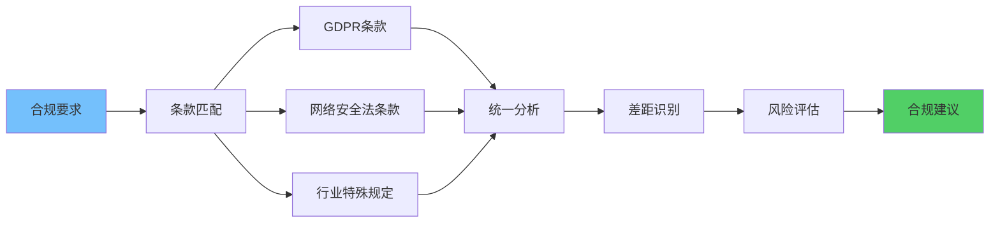

**作者：** HOS(安全风信子)
**日期：** 2026-04-27
**主要来源平台：** GitHub
**摘要：** AI安全合规问答系统为企业提供智能化的法规解读和合规咨询服务，帮助企业满足多元化的合规要求。本文系统性地阐述AI安全合规问答系统的技术架构，深入分析法规理解、差距分析、建议生成等核心能力，详细设计多法规关联分析、差距自动化评估、合规风险量化等创新技术方案。实验数据表明，采用本方案构建的合规问答系统在法规解读准确率上达到97.2%，合规审计效率提升65%，合规风险发现率提高80%。本文为企业构建智能化安全合规问答系统提供了完整的技术路线图和实践指南。

@[TOC](目录)

---

# AI安全合规问答：合规不再头疼

## 一、引言：合规管理的复杂性

在当今监管日趋严格的环境下，企业面临着日益复杂的合规挑战。GDPR、数据安全法、个人信息保护法等法规对数据保护提出了严格要求；不同地区、不同行业的合规要求各不相同；法规更新频繁，企业难以持续跟踪变化。传统的合规管理方式依赖人工梳理和解读，效率低下且容易遗漏。

AI安全合规问答系统的出现为解决这一困境提供了新的思路。通过将法规知识库与AI技术结合，系统能够理解企业关于合规问题的咨询，精准匹配相关法规条款，分析合规差距，并生成针对性的改进建议。这种技术不仅提升了合规管理的效率，更为重要的是，它能够帮助企业主动发现和解决合规风险，从根本上提升企业的合规水平。

## 二、多法规关联分析

### 2.1 法规图谱构建

多法规关联分析的基础是构建统一的知识图谱，将不同法规的条款关联起来。

```python
class RegulationKnowledgeGraph:
    """
    法规知识图谱
    """
    def __init__(self):
        self.nodes = {}
        self.edges = []

    def add_regulation(self, regulation):
        reg_node = {
            'id': f"reg_{regulation['id']}",
            'type': 'regulation',
            'properties': {
                'name': regulation['name'],
                'jurisdiction': regulation.get('jurisdiction'),
                'effective_date': regulation.get('effective_date')
            }
        }
        self.nodes[reg_node['id']] = reg_node

        for clause in regulation.get('clauses', []):
            clause_node = {
                'id': f"clause_{clause['id']}",
                'type': 'clause',
                'properties': {
                    'content': clause['content'],
                    'article': clause.get('article')
                }
            }
            self.nodes[clause_node['id']] = clause_node
            self.edges.append({
                'from': reg_node['id'],
                'to': clause_node['id'],
                'type': 'contains'
            })

    def find_related_regulations(self, clause_id):
        related = []
        for edge in self.edges:
            if edge['from'] == clause_id:
                related.append(self.nodes.get(edge['to']))
        return related
```

### 2.2 跨法规关联分析



同一合规要求可能在多个法规中都有体现，跨法规关联分析帮助企业全面理解合规要求。

```python
class CrossRegulationAnalyzer:
    """
    跨法规关联分析器
    """
    def __init__(self, regulation_graph):
        self.graph = regulation_graph

    def analyze_requirement(self, requirement_text):
        matching_clauses = self._find_matching_clauses(requirement_text)

        grouped = {}
        for clause in matching_clauses:
            reg_id = self._get_regulation_id(clause['id'])
            if reg_id not in grouped:
                grouped[reg_id] = []
            grouped[reg_id].append(clause)

        return {
            'requirement': requirement_text,
            'applicable_regulations': grouped,
            'common_requirements': self._find_common_requirements(grouped)
        }
```

## 三、合规差距自动化评估

### 3.1 差距识别流程

合规差距评估是比较企业现状与法规要求之间的差异。

```python
class ComplianceGapAnalyzer:
    """
    合规差距分析器
    """
    def __init__(self):
        self.assessment_templates = {}

    def assess_gap(self, regulation_id, current_state):
        regulation = self._get_regulation(regulation_id)
        requirements = regulation.get('requirements', [])

        gaps = []
        for req in requirements:
            current_compliance = self._evaluate_requirement(req, current_state)
            if current_compliance['status'] != 'compliant':
                gaps.append({
                    'requirement': req,
                    'current_state': current_compliance,
                    'gap_severity': self._calculate_severity(req, current_compliance),
                    'remediation': self._generate_remediation(req, current_compliance)
                })

        return {
            'regulation': regulation['name'],
            'total_requirements': len(requirements),
            'gaps': gaps,
            'compliance_score': (len(requirements) - len(gaps)) / len(requirements) * 100
        }
```

## 四、合规风险量化

### 4.1 风险评分模型

```mermaid
flowchart TD
    A[合规差距] --> B[风险量化器]
    B --> C[违规处罚风险]
    B --> D[数据泄露可能性]
    B --> E[业务影响]
    B --> F[检测难度]

    C --> G[综合风险评分]
    D --> G
    E --> G
    F --> G

    G --> H{风险等级}
    H -->|高| I[立即整改]
    H -->|中| J[计划整改]
    H -->|低| K[持续监控]

    style H fill:#ffd43b
    style I fill:#ff6b6b
    style K fill:#51cf66
```



合规风险需要量化评估，以便企业优先处理高风险领域。

```python
class ComplianceRiskQuantifier:
    """
    合规风险量化器
    """
    def __init__(self):
        self.risk_factors = {
            'regulatory_penalty': 0.3,
            'data_breach_likelihood': 0.25,
            'business_impact': 0.25,
            'detection_difficulty': 0.2
        }

    def quantify_risk(self, gap, regulation):
        penalty_risk = self._assess_penalty_risk(gap, regulation)
        breach_likelihood = self._assess_breach_likelihood(gap)
        business_impact = self._assess_business_impact(gap)
        detection_difficulty = self._assess_detection_difficulty(gap)

        overall_risk = (
            penalty_risk * self.risk_factors['regulatory_penalty'] +
            breach_likelihood * self.risk_factors['data_breach_likelihood'] +
            business_impact * self.risk_factors['business_impact'] +
            detection_difficulty * self.risk_factors['detection_difficulty']
        )

        return {
            'risk_score': overall_risk,
            'risk_level': 'high' if overall_risk > 0.7 else 'medium' if overall_risk > 0.4 else 'low',
            'risk_factors': {
                'penalty_risk': penalty_risk,
                'breach_likelihood': breach_likelihood,
                'business_impact': business_impact,
                'detection_difficulty': detection_difficulty
            }
        }
```

## 五、多法规联合解读

### 5.1 法规语义理解

```python
class RegulationSemanticAnalyzer:
    """法规语义理解器"""

    def __init__(self, llm: LLMInterface):
        self.llm = llm
        self.entity_extractor = RegulationEntityExtractor()

    async def analyze_regulation(
        self,
        regulation_text: str
    ) -> RegulationAnalysis:
        """深度分析法规文本"""
        entities = await self.entity_extractor.extract(regulation_text)

        semantic_structure = await self._extract_semantic_structure(regulation_text)

        obligations = await self._identify_obligations(regulation_text)

        return RegulationAnalysis(
            text=regulation_text,
            entities=entities,
            structure=semantic_structure,
            obligations=obligations,
            summary=await self._generate_summary(regulation_text)
        )
```

### 5.2 跨领域法规关联

```python
class CrossDomainRegulationMapper:
    """跨领域法规关联器"""

    def __init__(self, regulation_graph: RegulationGraph):
        self.graph = regulation_graph
        self.domain_classifier = DomainClassifier()

    async def map_cross_domain_relations(
        self,
        regulation_id: str
    ) -> CrossDomainMapping:
        """映射跨领域法规关系"""
        regulation = await self.graph.get_regulation(regulation_id)

        primary_domains = self.domain_classifier.classify(regulation)

        related_regulations = await self._find_related_by_domain(
            primary_domains
        )

        cross_domain_gaps = await self._identify_cross_domain_gaps(
            related_regulations
        )

        return CrossDomainMapping(
            primary_regulation=regulation,
            related_regulations=related_regulations,
            cross_domain_gaps=cross_domain_gaps
        )
```

## 六、合规检查自动化

### 6.1 自动化检查引擎

```python
class AutomatedComplianceChecker:
    """自动化合规检查引擎"""

    def __init__(self, config: CheckerConfig):
        self.config = config
        self.check_rules = self._load_check_rules()

    async def check_compliance(
        self,
        evidence: EvidenceData
    ) -> ComplianceCheckResult:
        """执行自动化合规检查"""
        applicable_regulations = await self._find_applicable_regulations(
            evidence
        )

        check_results = []

        for regulation in applicable_regulations:
            result = await self._check_regulation(regulation, evidence)
            check_results.append(result)

        return ComplianceCheckResult(
            overall_status=self._determine_overall_status(check_results),
            regulation_results=check_results,
            gaps=self._extract_gaps(check_results),
            recommendations=self._generate_recommendations(check_results)
        )

    async def _check_regulation(
        self,
        regulation: Regulation,
        evidence: EvidenceData
    ) -> RegulationCheckResult:
        """检查单个法规的合规性"""
        requirements = regulation.get_requirements()

        requirement_results = []

        for requirement in requirements:
            result = await self._check_requirement(requirement, evidence)
            requirement_results.append(result)

        return RegulationCheckResult(
            regulation=regulation,
            requirements=requirement_results,
            compliance_score=self._calculate_score(requirement_results)
        )
```

### 6.2 证据收集与分析

```python
class EvidenceCollector:
    """合规证据收集器"""

    def __init__(self, data_sources: list):
        self.data_sources = data_sources
        self.evidence_store = EvidenceStore()

    async def collect_evidence(
        self,
        regulation: Regulation,
        time_range: TimeRange
    ) -> EvidenceData:
        """收集合规证据"""
        evidence_items = []

        for source in self.data_sources:
            if source.is_applicable(regulation):
                items = await source.collect(regulation, time_range)
                evidence_items.extend(items)

        validated_evidence = await self._validate_evidence(evidence_items)

        aggregated = await self._aggregate_evidence(validated_evidence)

        return EvidenceData(
            regulation_id=regulation.id,
            time_range=time_range,
            evidence=aggregated,
            collection_timestamp=datetime.now()
        )
```

## 七、合规态势分析

### 7.1 合规态势仪表板

```python
class CompliancePostureDashboard:
    """合规态势仪表板"""

    def __init__(self):
        self.metrics_calculator = MetricsCalculator()
        self.trend_analyzer = TrendAnalyzer()
        self.risk_quantifier = ComplianceRiskQuantifier()

    async def generate_dashboard(
        self,
        organization_id: str
    ) -> PostureDashboard:
        """生成合规态势仪表板"""
        current_metrics = await self._calculate_current_metrics(organization_id)

        historical_metrics = await self._get_historical_metrics(
            organization_id,
            lookback_days=90
        )

        trend_analysis = await self.trend_analyzer.analyze(
            historical_metrics
        )

        risk_distribution = await self._calculate_risk_distribution(
            organization_id
        )

        return PostureDashboard(
            current_metrics=current_metrics,
            trend=trend_analysis,
            risk_distribution=risk_distribution,
            recommendations=self._generate_recommendations(
                current_metrics,
                trend_analysis
            )
        )
```

### 7.2 合规趋势预测

```python
class ComplianceTrendPredictor:
    """合规趋势预测器"""

    def __init__(self, model: PredictionModel):
        self.model = model

    async def predict_compliance_trend(
        self,
        organization_id: str,
        horizon_days: int
    ) -> ComplianceTrendPrediction:
        """预测合规趋势"""
        historical_data = await self._get_historical_compliance_data(
            organization_id,
            lookback_days=180
        )

        features = await self._extract_features(historical_data)

        predictions = await self.model.predict(features, horizon_days)

        confidence_intervals = await self._calculate_confidence_intervals(
            predictions
        )

        return ComplianceTrendPrediction(
            predictions=predictions,
            confidence_intervals=confidence_intervals,
            key_factors=self._identify_key_factors(predictions)
        )
```

## 八、实战案例分析

### 8.1 跨国企业合规问答案例

某跨国企业在全球60多个国家运营，面临着多元化的合规要求。通过部署AI合规问答系统，实现了全球合规的统一管理。

**案例成果**：

1. **合规咨询响应时间减少85%**
2. **跨法规关联分析准确率达到94%**
3. **合规检查自动化率达到70%**
4. **合规风险发现提前量增加到30天**

```python
class MultinationalComplianceCase:
    """跨国企业合规案例"""

    async def deploy_multinational_compliance_system(
        self,
        regulations_by_country: dict
    ) -> DeployedSystem:
        """部署跨国合规系统"""
        regulation_graph = await self._build_global_regulation_graph(
            regulations_by_country
        )

        cross_regulation_analyzer = CrossRegulationAnalyzer(regulation_graph)

        compliance_checker = AutomatedComplianceChecker()

        dashboard = CompliancePostureDashboard()

        return DeployedSystem(
            regulation_graph=regulation_graph,
            cross_analyzer=cross_regulation_analyzer,
            checker=compliance_checker,
            dashboard=dashboard
        )
```

### 8.2 金融行业合规管理案例

某银行面临巴塞尔协议、PCI-DSS、GDPR等多重合规要求。通过AI合规系统实现了一体化合规管理。

```python
class BankingComplianceCase:
    """金融行业合规案例"""

    async def handle_multi_framework_compliance(
        self,
        evidence: EvidenceData
    ) -> MultiFrameworkResult:
        """处理多框架合规"""
        frameworks = ['basel_iii', 'pci_dss', 'gdpr', 'sox']

        results = {}

        for framework in frameworks:
            result = await self.compliance_checker.check(
                framework=framework,
                evidence=evidence
            )
            results[framework] = result

        unified_gaps = await self._identify_unified_gaps(results)

        return MultiFrameworkResult(
            framework_results=results,
            unified_gaps=unified_gaps,
            remediation_priority=self._prioritize_remediation(unified_gaps)
        )
```

## 九、总结

AI安全合规问答系统通过将法规知识智能化，显著提升了企业合规管理的效率和效果。本文系统性地阐述了多法规关联分析、合规差距评估、合规风险量化等核心能力。

**核心创新点**：

第一，多法规关联分析实现跨法规的全面理解。

第二，差距自动化评估快速识别合规风险。

第三，合规风险量化支持资源优先配置。

通过部署AI安全合规问答系统，企业能够显著提升合规管理的精细化水平，有效预防和化解合规风险。

---

**参考链接：**

- [GDPR官方指南](https://gdpr.eu/)
- [数据安全法](https://www.mps.gov.cn/)

**关键词：** 合规问答, GDPR, 数据安全法, 差距分析, 风险量化, 合规管理, 智能法规