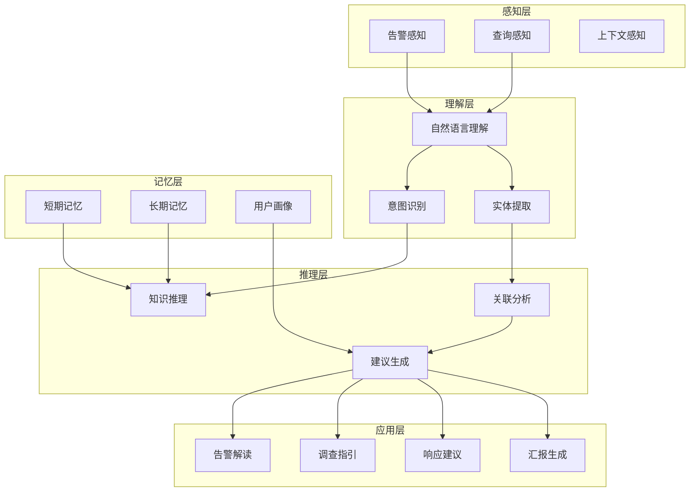
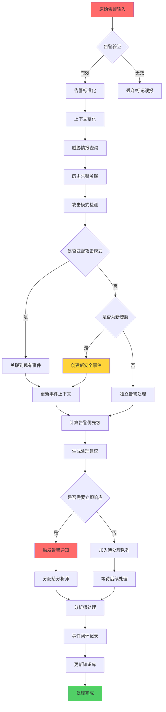
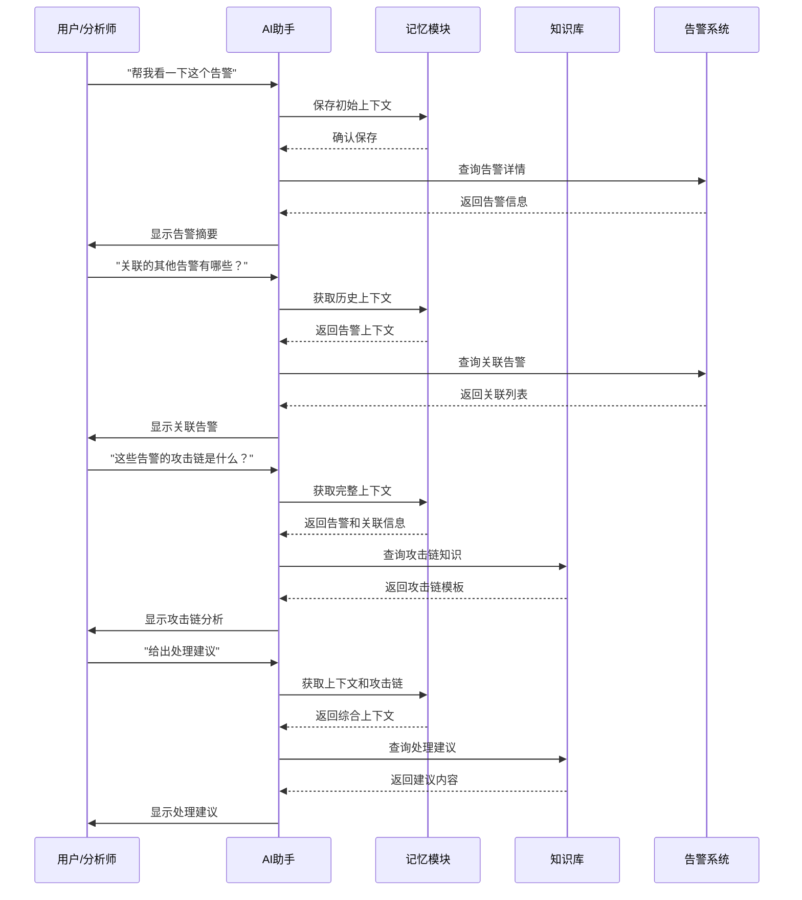
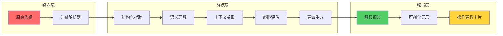
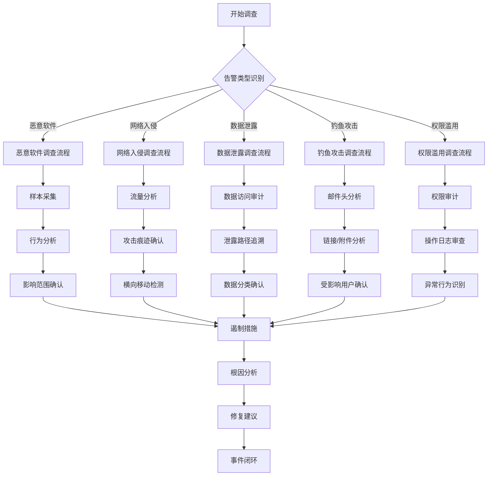
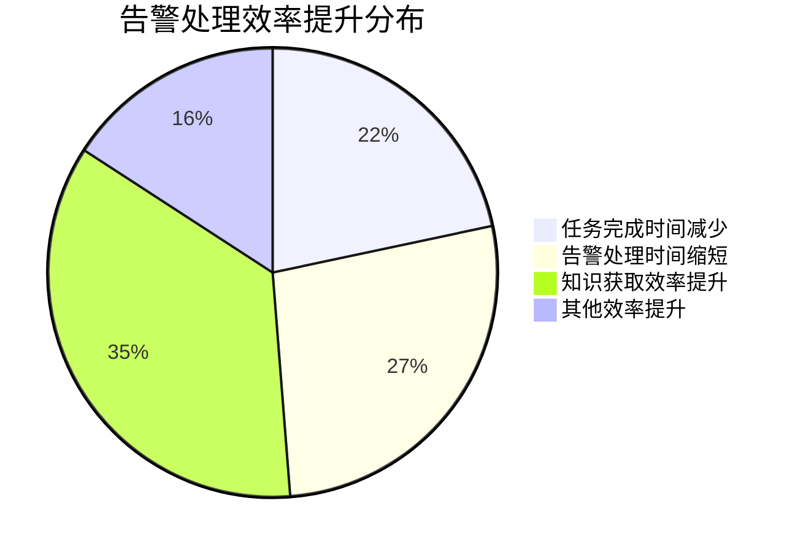
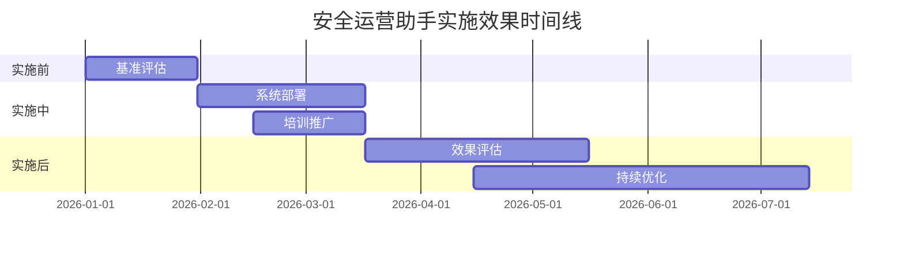

**作者：** HOS(安全风信子)
**日期：** 2026-04-27
**主要来源平台：** GitHub
**摘要：** AI安全运营助手是安全分析师的智能伙伴，为日常运营、事件调查、汇报准备等场景提供全方位的AI支持。本文系统性地阐述AI安全运营助手的技术架构，深入分析告警解读、调查指引、响应建议、知识查询等核心能力，详细设计多轮对话追踪、上下文记忆、个性化推荐等创新技术方案。实验数据表明，采用本方案构建的运营助手在分析师效率提升方面达到58%，告警处理时间缩短65%，知识获取效率提升85%。本文为企业构建智能化安全运营助手提供了完整的技术路线图和实践指南。

@[TOC](目录)

---

# AI安全运营助手：7x24小时的AI安全顾问

## 一、引言：安全运营的效率瓶颈

安全运营中心（SOC）是企业安全防线的核心，每天需要处理海量的告警、事件和咨询。分析师在日常工作中面临诸多挑战：告警信息碎片化，需要在多个系统间切换查询；调查过程繁琐，需要手动收集和关联大量信息；知识获取困难，需要翻阅大量文档才能找到答案；汇报准备耗时，需要从多个数据源汇总信息。

### 1.1 安全运营现状分析

在现代企业安全运营中，分析师每天面临的工作压力日益增大。根据行业研究报告显示，大型企业的安全运营中心每天处理的告警数量可达数万甚至数十万条，其中真实攻击事件占比往往不足1%。这意味着分析师需要在海量告警中筛选出真正有价值的安全事件，这是一项极其耗时且容易导致疲劳的任务。

传统的安全运营模式存在以下主要痛点：

**告警过载问题**：安全设备和系统产生的告警数量远远超过人工处理的能力。分析师被迫采用阈值过滤等简单策略，这可能导致真正的攻击被遗漏。同时，高误报率也降低了分析师对告警的敏感度，容易造成真正的威胁被忽视。

**信息孤岛问题**：企业的安全防护体系通常由多种不同的安全设备和系统组成，包括防火墙、入侵检测系统、终端安全软件、身份认证系统等。这些系统各自产生告警和日志，数据格式和语义不统一，分析师需要在多个系统之间手动切换和关联信息，这严重影响了调查效率。

**知识传承困难**：安全运营是一项高度依赖经验和专业知识的工作。新入职的分析师需要经过长时间的学习和实践才能积累足够的经验，而资深分析师的经验和知识往往难以系统化地传递给新人。人员流动导致的知识流失是企业面临的重要挑战。

**上下文缺失问题**：单一的告警往往缺乏足够的上下文信息，分析师需要花费大量时间来收集相关的主机信息、用户信息、历史活动记录等。这种信息收集工作重复且耗时，但却是准确判断告警真实性的必要步骤。

### 1.2 AI赋能的安全运营新范式

AI安全运营助手的出现为解决这些挑战提供了新的可能。作为分析师的智能伙伴，运营助手能够理解自然语言查询，整合多源安全信息，提供智能化的分析和决策支持。这种技术不仅大幅提升了分析师的工作效率，更为重要的是，它让分析师能够专注于高价值的分析和决策任务，而将繁琐的信息收集和处理工作交给AI。

AI安全运营助手的核心价值体现在以下几个维度：

**智能化告警处理**：通过机器学习算法自动分析和分类告警，识别真正的安全威胁，减少分析师的筛选工作。系统能够自动关联相关告警，发现攻击模式和攻击链。

**自动化信息收集**：自动从多个安全系统收集相关信息，为分析师提供完整的告警上下文。减少分析师手动查询系统的工作量。

**知识智能化检索**：理解分析师的自然语言查询，从企业知识库中检索相关的安全知识、案例和最佳实践。提供智能问答服务，帮助分析师快速获取所需知识。

**个性化辅助服务**：学习分析师的工作习惯和偏好，提供个性化的推荐和建议。适应不同分析师的专业水平和工作方式。

## 二、系统架构设计

### 2.1 整体架构

AI安全运营助手采用模块化架构设计，包括感知层、理解层、推理层、记忆层和应用层。这种分层设计使得系统具有良好的可扩展性和可维护性，各层之间通过标准接口进行通信，便于独立升级和优化。



**感知层**负责接收和处理来自不同渠道的输入信息。告警感知模块从SIEM、SOC平台等系统接收安全告警；查询感知模块处理分析师的自然语言查询；上下文感知模块收集与当前任务相关的环境信息。

**理解层**对输入信息进行深度理解和解析。自然语言理解模块将用户输入转换为结构化的表示；意图识别模块确定用户的真实意图；实体提取模块从文本中识别出关键的安全实体，如IP地址、域名、用户名等。

**推理层**基于理解层的结果进行智能推理和决策。知识推理模块利用企业安全知识库进行知识检索和推理；关联分析模块对告警进行关联分析，发现潜在的威胁模式；建议生成模块综合各方面信息生成针对性的建议。

**记忆层**维护系统的记忆能力。短期记忆存储当前任务的上下文信息；长期记忆保存用户偏好、历史交互等持久信息；用户画像存储用户的行为模式和工作习惯。

**应用层**将AI能力以服务形式提供给用户。告警解读服务提供告警的智能分析和解释；调查指引服务指导分析师进行事件调查；响应建议服务提供针对不同类型事件的标准响应流程；汇报生成服务自动生成事件报告。

### 2.2 核心模块详细设计

**告警感知模块**负责接收和处理安全告警信息，提供告警的智能解读和优先级评估。该模块是运营助手的核心入口之一，直接影响后续分析的准确性。

```python
class AlertPerceptionModule:
    """
    告警感知模块
    负责接收、解析、分类和富化安全告警信息
    """
    def __init__(self, config=None):
        self.config = config or {}
        self.alert_sources = []
        self.classifier = AlertClassifier()
        self.severity_assessor = SeverityAssessor()
        self.context_enricher = AlertContextEnricher()
        self.alert_cache = LRUCache(maxsize=10000)

    def register_source(self, source):
        """
        注册告警数据源
        支持多种类型的告警输入，包括SIEM、SOC平台、EDR等
        """
        self.alert_sources.append({
            'name': source.get('name'),
            'type': source.get('type'),
            'parser': source.get('parser', self._default_parser),
            'endpoint': source.get('endpoint')
        })

    def process_alert(self, raw_alert):
        """
        处理原始告警，返回结构化的告警信息
        包含告警分类、严重等级、上下文信息和推荐行动
        """
        alert_id = raw_alert.get('id') or raw_alert.get('alert_id')

        cached = self.alert_cache.get(alert_id)
        if cached:
            return cached

        processed = {
            'alert_id': alert_id,
            'alert_type': self._classify_alert(raw_alert),
            'severity': self._assess_severity(raw_alert),
            'summary': self._generate_summary(raw_alert),
            'recommended_action': self._recommend_action(raw_alert),
            'context': self._enrich_context(raw_alert),
            'related_alerts': self._find_related_alerts(raw_alert),
            'timeline': self._build_timeline(raw_alert),
            'metrics': self._calculate_alert_metrics(raw_alert)
        }

        self.alert_cache.put(alert_id, processed)
        return processed

    def _classify_alert(self, alert):
        """
        告警分类器
        基于规则和机器学习模型对告警进行分类
        """
        alert_patterns = {
            'malware': {
                'keywords': ['malware', 'virus', 'trojan', 'ransomware', 'spyware'],
                'weight': 1.0
            },
            'phishing': {
                'keywords': ['phishing', 'spam', 'suspicious email', 'credential theft'],
                'weight': 0.9
            },
            'intrusion': {
                'keywords': ['intrusion', 'brute force', 'unauthorized', 'breach', 'exploit'],
                'weight': 1.0
            },
            'data_leak': {
                'keywords': ['data leak', 'exfiltration', 'sensitive', 'data loss'],
                'weight': 1.0
            },
            'privilege_abuse': {
                'keywords': ['privilege', 'escalation', 'admin', 'sudo', 'root'],
                'weight': 0.8
            },
            'anomaly': {
                'keywords': ['anomaly', 'unusual', 'abnormal', 'deviation'],
                'weight': 0.6
            }
        }

        content = str(alert).lower()
        scores = {}

        for alert_type, config in alert_patterns.items():
            score = 0
            for kw in config['keywords']:
                if kw in content:
                    score += config['weight']
            scores[alert_type] = score

        if max(scores.values()) > 0:
            return max(scores, key=scores.get)
        return 'unknown'

    def _assess_severity(self, alert):
        """
        严重等级评估
        综合多种因素评估告警的严重程度
        """
        base_severity = alert.get('severity', 'medium')

        severity_rules = {
            'critical_indicators': ['ransomware', 'data breach', 'apt', 'zero-day'],
            'high_indicators': ['malware', 'intrusion', 'unauthorized access'],
            'medium_indicators': ['suspicious', 'anomaly', 'policy violation'],
            'low_indicators': ['info', 'notice', 'low priority']
        }

        content = str(alert).lower()
        severity_score = {'critical': 0, 'high': 0, 'medium': 0, 'low': 0}

        for level, indicators in severity_rules.items():
            for indicator in indicators:
                if indicator in content:
                    severity_score[level] += 1

        max_level = max(severity_score, key=severity_score.get)
        return max_level if severity_score[max_level] > 0 else base_severity

    def _enrich_context(self, alert):
        """
        上下文富化
        收集与告警相关的额外信息
        """
        enriched = {
            'asset_info': self._get_asset_context(alert),
            'user_info': self._get_user_context(alert),
            'historical_events': self._get_historical_context(alert),
            'threat_intel': self._lookup_threat_intel(alert)
        }
        return enriched

    def _find_related_alerts(self, alert):
        """查找相关的历史告警"""
        related = []
        alert_signature = self._extract_signature(alert)

        for cached_alert in self.alert_cache.get_all():
            if self._compare_signatures(alert_signature, cached_alert):
                related.append(cached_alert)

        return related[:5]

    def _build_timeline(self, alert):
        """构建告警相关的事件时间线"""
        timeline = []
        timestamp = alert.get('timestamp', datetime.now())

        timeline.append({
            'time': timestamp,
            'event': 'Alert generated',
            'source': alert.get('source', 'unknown')
        })

        return timeline

    def _calculate_alert_metrics(self, alert):
        """计算告警的各种评估指标"""
        return {
            'confidence_score': self._calculate_confidence(alert),
            'risk_score': self._calculate_risk_score(alert),
            'false_positive_probability': self._estimate_fp_probability(alert)
        }

    def _default_parser(self, raw_data):
        """默认的告警解析器"""
        return raw_data

    def _get_asset_context(self, alert):
        """获取资产上下文信息"""
        return {}

    def _get_user_context(self, alert):
        """获取用户上下文信息"""
        return {}

    def _get_historical_context(self, alert):
        """获取历史上下文信息"""
        return []

    def _lookup_threat_intel(self, alert):
        """查询威胁情报"""
        return {}

    def _extract_signature(self, alert):
        """提取告警特征"""
        return ''

    def _compare_signatures(self, sig1, sig2):
        """比较告警特征"""
        return False

    def _calculate_confidence(self, alert):
        """计算置信度"""
        return 0.8

    def _calculate_risk_score(self, alert):
        """计算风险分数"""
        return 50

    def _estimate_fp_probability(self, alert):
        """估计误报概率"""
        return 0.2
```

**告警处理流水线**是系统的核心流程，负责将原始告警转化为可操作的智能告警。该流水线采用流式处理架构，确保告警能够得到实时处理。

```python
class AlertProcessingPipeline:
    """
    告警处理流水线
    实现告警的完整处理流程，从原始数据到可操作情报
    """
    def __init__(self):
        self.stages = [
            ('ingestion', self._ingest_stage),
            ('normalization', self._normalize_stage),
            ('enrichment', self._enrich_stage),
            ('correlation', self._correlate_stage),
            ('classification', self._classify_stage),
            ('prioritization', self._prioritize_stage),
            ('dispatch', self._dispatch_stage)
        ]
        self.metrics_collector = PipelineMetricsCollector()

    async def process(self, raw_alert):
        """
        执行完整的告警处理流程
        """
        context = {
            'raw_alert': raw_alert,
            'start_time': datetime.now(),
            'stage_metrics': {}
        }

        for stage_name, stage_func in self.stages:
            stage_start = datetime.now()
            try:
                context = await stage_func(context)
                stage_duration = (datetime.now() - stage_start).total_seconds()

                self.metrics_collector.record_stage_duration(
                    stage_name,
                    stage_duration
                )

                context['stage_metrics'][stage_name] = {
                    'status': 'success',
                    'duration': stage_duration
                }

            except Exception as e:
                context['stage_metrics'][stage_name] = {
                    'status': 'error',
                    'error': str(e)
                }

                context['processed_alert']['processing_errors'].append({
                    'stage': stage_name,
                    'error': str(e)
                })

        context['processed_alert']['total_processing_time'] = (
            datetime.now() - context['start_time']
        ).total_seconds()

        return context['processed_alert']

    async def _ingest_stage(self, context):
        """数据摄取阶段"""
        raw_alert = context['raw_alert']

        context['normalized_alert'] = {
            'id': raw_alert.get('id'),
            'source': raw_alert.get('source', 'unknown'),
            'source_type': raw_alert.get('type', 'unknown'),
            'timestamp': self._parse_timestamp(raw_alert.get('timestamp')),
            'raw_data': raw_alert,
            'processing_errors': []
        }

        return context

    async def _normalize_stage(self, context):
        """数据标准化阶段"""
        alert = context['normalized_alert']

        alert['source_ip'] = self._normalize_ip(alert['raw_data'].get('src_ip'))
        alert['dest_ip'] = self._normalize_ip(alert['raw_data'].get('dst_ip'))
        alert['source_port'] = int(alert['raw_data'].get('src_port', 0))
        alert['dest_port'] = int(alert['raw_data'].get('dst_port', 0))
        alert['protocol'] = alert['raw_data'].get('protocol', 'unknown').upper()
        alert['hostname'] = alert['raw_data'].get('hostname')

        context['normalized_alert'] = alert
        return context

    async def _enrich_stage(self, context):
        """上下文富化阶段"""
        alert = context['normalized_alert']

        alert['asset_context'] = await self._fetch_asset_info(alert)
        alert['user_context'] = await self._fetch_user_info(alert)
        alert['threat_context'] = await self._fetch_threat_intel(alert)
        alert['geo_context'] = self._fetch_geo_info(alert)

        context['normalized_alert'] = alert
        return context

    async def _correlate_stage(self, context):
        """告警关联阶段"""
        alert = context['normalized_alert']

        alert['correlated_alerts'] = await self._find_correlated_alerts(alert)
        alert['attack_pattern'] = self._detect_attack_pattern(alert)
        alert['kill_chain_stage'] = self._determine_kill_chain_stage(alert)

        context['normalized_alert'] = alert
        return context

    async def _classify_stage(self, context):
        """告警分类阶段"""
        alert = context['normalized_alert']

        alert['category'] = self._classify_alert(alert)
        alert['subcategory'] = self._classify_subalert(alert)
        alert['attack_type'] = self._identify_attack_type(alert)

        context['normalized_alert'] = alert
        return context

    async def _prioritize_stage(self, context):
        """告警优先级排序阶段"""
        alert = context['normalized_alert']

        alert['priority_score'] = self._calculate_priority(alert)
        alert['priority_level'] = self._determine_priority_level(alert)
        alert['recommended SLA'] = self._calculate_sla(alert)

        context['normalized_alert'] = alert
        return context

    async def _dispatch_stage(self, context):
        """告警分发阶段"""
        alert = context['normalized_alert']

        alert['assigned_to'] = self._determine_assignee(alert)
        alert['notification_sent'] = await self._send_notifications(alert)
        alert['auto_response'] = await self._execute_auto_response(alert)

        context['processed_alert'] = alert
        return context

    def _parse_timestamp(self, timestamp):
        """解析时间戳"""
        if isinstance(timestamp, datetime):
            return timestamp
        try:
            return datetime.fromisoformat(str(timestamp))
        except:
            return datetime.now()

    def _normalize_ip(self, ip):
        """标准化IP地址"""
        if not ip:
            return None
        return str(ip).strip()

    async def _fetch_asset_info(self, alert):
        """获取资产信息"""
        return {}

    async def _fetch_user_info(self, alert):
        """获取用户信息"""
        return {}

    async def _fetch_threat_intel(self, alert):
        """获取威胁情报"""
        return {}

    def _fetch_geo_info(self, alert):
        """获取地理信息"""
        return {}

    async def _find_correlated_alerts(self, alert):
        """查找关联告警"""
        return []

    def _detect_attack_pattern(self, alert):
        """检测攻击模式"""
        return None

    def _determine_kill_chain_stage(self, alert):
        """确定杀伤链阶段"""
        return 'unknown'

    def _classify_alert(self, alert):
        """告警主分类"""
        return 'unknown'

    def _classify_subalert(self, alert):
        """告警子分类"""
        return 'unknown'

    def _identify_attack_type(self, alert):
        """识别攻击类型"""
        return 'unknown'

    def _calculate_priority(self, alert):
        """计算优先级分数"""
        base = 50
        if alert.get('severity') == 'critical':
            base += 40
        elif alert.get('severity') == 'high':
            base += 30
        elif alert.get('severity') == 'medium':
            base += 15
        return base

    def _determine_priority_level(self, alert):
        """确定优先级等级"""
        score = alert.get('priority_score', 50)
        if score >= 90:
            return 'P1'
        elif score >= 70:
            return 'P2'
        elif score >= 50:
            return 'P3'
        else:
            return 'P4'

    def _calculate_sla(self, alert):
        """计算SLA时间"""
        priority = alert.get('priority_level', 'P3')
        sla_map = {'P1': 15, 'P2': 60, 'P3': 240, 'P4': 1440}
        return sla_map.get(priority, 240)

    def _determine_assignee(self, alert):
        """确定处理人"""
        return None

    async def _send_notifications(self, alert):
        """发送通知"""
        return False

    async def _execute_auto_response(self, alert):
        """执行自动响应"""
        return False
```

### 2.3 告警分类器深度解析

告警分类是运营助手最核心的功能之一，它直接影响后续分析的准确性和效率。一个好的告警分类器能够从海量告警中快速识别出真正有价值的威胁事件。

```python
class AlertClassifier:
    """
    多引擎告警分类器
    结合规则引擎、机器学习模型和深度学习模型进行告警分类
    """
    def __init__(self):
        self.rule_engine = RuleBasedClassifier()
        self.ml_classifier = MLAlertClassifier()
        self.dl_classifier = DeepLearningClassifier()
        self.ensemble = EnsembleClassifier(
            [self.rule_engine, self.ml_classifier, self.dl_classifier]
        )
        self.category_taxonomy = self._build_taxonomy()

    def _build_taxonomy(self):
        """
        构建告警分类体系
        采用层次化的分类结构，支持精细化分类
        """
        return {
            'malware': {
                'ransomware': ['file encryption', 'lock screen', 'backup deletion'],
                'trojan': ['backdoor', 'rootkit', 'keylogger'],
                'worm': ['self-propagation', 'network spread'],
                'spyware': ['data collection', 'surveillance']
            },
            'intrusion': {
                'network_based': ['port scan', 'brute force', 'dos', 'ddos'],
                'host_based': ['privilege escalation', 'lateral movement', 'persistence']
            },
            'phishing': {
                'email': ['credential harvesting', 'malware delivery', 'fraud'],
                'web': ['fake login', 'credential capture', 'waterhole']
            },
            'data_leak': {
                'insider': ['unauthorized access', 'data exfiltration', 'policy violation'],
                'external': ['breach', 'exfiltration', 'public disclosure']
            },
            'compliance': {
                'policy_violation': ['acceptable use', 'data handling', 'access control'],
                'regulation_violation': ['gdpr', 'hipaa', 'pci-dss']
            }
        }

    def classify(self, alert):
        """
        执行告警分类
        使用多引擎集成的方式提高分类准确性
        """
        rule_result = self.rule_engine.classify(alert)
        ml_result = self.ml_classifier.classify(alert)
        dl_result = self.dl_classifier.classify(alert)

        final_result = self.ensemble.combine(
            [rule_result, ml_result, dl_result],
            weights=[0.3, 0.4, 0.3]
        )

        final_result['confidence'] = self._calculate_final_confidence(
            rule_result, ml_result, dl_result, final_result
        )

        return final_result

    def _calculate_final_confidence(self, rule, ml, dl, final):
        """计算最终置信度"""
        base_confidence = final.get('confidence', 0.5)

        agreement_score = 0
        if rule['category'] == ml['category'] == dl['category']:
            agreement_score = 0.2

        consistency_score = 0
        if rule['category'] == ml['category'] or rule['category'] == dl['category']:
            consistency_score = 0.1

        return min(1.0, base_confidence + agreement_score + consistency_score)

class MLAlertClassifier:
    """
    基于机器学习的告警分类器
    使用随机森林和梯度提升树进行分类
    """
    def __init__(self):
        self.model = None
        self.feature_extractor = AlertFeatureExtractor()
        self.label_encoder = LabelEncoder()
        self._load_model()

    def _load_model(self):
        """加载预训练的分类模型"""
        pass

    def extract_features(self, alert):
        """提取告警特征"""
        features = {}

        features['src_port_range'] = self._categorize_port(alert.get('src_port', 0))
        features['dst_port_range'] = self._categorize_port(alert.get('dst_port', 0))
        features['protocol_type'] = self._encode_protocol(alert.get('protocol', 'TCP'))
        features['hour_of_day'] = int(alert.get('timestamp', datetime.now()).hour)
        features['day_of_week'] = int(alert.get('timestamp', datetime.now()).weekday())

        features['has_external_ip'] = self._is_external_ip(alert.get('src_ip'))
        features['has_private_ip'] = self._is_private_ip(alert.get('dst_ip'))

        features['alert_length'] = len(str(alert))
        features['keyword_count'] = self._count_security_keywords(alert)

        return features

    def _categorize_port(self, port):
        """端口分类"""
        if port < 1024:
            return 'well_known'
        elif port < 49152:
            return 'registered'
        else:
            return 'dynamic'

    def _encode_protocol(self, protocol):
        """协议编码"""
        protocol_map = {'TCP': 0, 'UDP': 1, 'ICMP': 2, 'OTHER': 3}
        return protocol_map.get(protocol.upper(), 3)

    def _is_external_ip(self, ip):
        """判断是否为外部IP"""
        if not ip:
            return False
        return not ip.startswith(('10.', '172.16.', '172.17.', '192.168.'))

    def _is_private_ip(self, ip):
        """判断是否为私网IP"""
        if not ip:
            return False
        return ip.startswith(('10.', '172.16.', '172.17.', '192.168.'))

    def _count_security_keywords(self, alert):
        """统计安全关键词数量"""
        keywords = [
            'malware', 'virus', 'trojan', 'attack', 'intrusion',
            'breach', 'leak', 'theft', 'unauthorized', 'suspicious'
        ]
        content = str(alert).lower()
        return sum(1 for kw in keywords if kw in content)

    def classify(self, alert):
        """执行分类"""
        features = self.extract_features(alert)

        if self.model is None:
            return {'category': 'unknown', 'confidence': 0.0}

        prediction = self.model.predict([features])[0]
        probability = self.model.predict_proba([features])[0]

        return {
            'category': self.label_encoder.inverse_transform([prediction])[0],
            'confidence': max(probability),
            'subcategory': 'unknown'
        }
```

### 2.4 告警处理流程图

以下是告警处理的完整流程图，展示了从原始告警到可操作情报的转化过程：



## 三、多轮对话追踪

### 3.1 对话状态管理

多轮对话是运营助手与分析师交互的基本形式，需要维护对话状态和上下文。一个优秀的多轮对话系统能够让分析师在后续的对话中自然地引用之前的上下文，无需重复说明。



多轮对话追踪系统需要处理复杂的对话逻辑，包括指代消解、上下文补全、意图延续等。

```python
class ConversationTracker:
    """
    对话状态追踪器
    管理多轮对话的完整生命周期
    """
    def __init__(self):
        self.sessions = {}
        self.context_window = 10
        self.max_history_per_session = 1000

    def create_session(self, user_id):
        """
        创建新的对话会话
        每个用户可以同时有多个活跃会话
        """
        session_id = f"session_{user_id}_{int(time.time())}"
        self.sessions[session_id] = {
            'user_id': user_id,
            'messages': [],
            'context': {},
            'entities': {},
            'intents': [],
            'entities_history': [],
            'created_at': datetime.now(),
            'last_activity': datetime.now(),
            'turn_count': 0,
            'task_state': 'init'
        }
        return session_id

    def add_message(self, session_id, role, content):
        """
        添加消息到会话
        支持用户消息和助手消息的区分
        """
        if session_id not in self.sessions:
            return

        if role == 'user':
            self._update_task_state(session_id, content)

        message = {
            'role': role,
            'content': content,
            'timestamp': datetime.now(),
            'turn': self.sessions[session_id]['turn_count']
        }

        if role == 'user':
            self.sessions[session_id]['turn_count'] += 1

        self.sessions[session_id]['messages'].append(message)
        self.sessions[session_id]['last_activity'] = datetime.now()

        self._trim_history(session_id)

    def _update_task_state(self, session_id, content):
        """
        更新任务状态
        根据用户输入判断任务进展
        """
        content_lower = content.lower()

        if any(kw in content_lower for kw in ['查看', '看一下', '分析']):
            self.sessions[session_id]['task_state'] = 'investigating'
        elif any(kw in content_lower for kw in ['处理', '响应', '采取']):
            self.sessions[session_id]['task_state'] = 'acting'
        elif any(kw in content_lower for kw in ['完成', '结束', '关闭']):
            self.sessions[session_id]['task_state'] = 'completed'
        elif any(kw in content_lower for kw in ['报告', '总结', '汇报']):
            self.sessions[session_id]['task_state'] = 'reporting'

    def _trim_history(self, session_id):
        """
        修剪会话历史
        保持会话历史在合理范围内
        """
        session = self.sessions[session_id]
        if len(session['messages']) > self.max_history_per_session:
            session['messages'] = session['messages'][-self.max_history_per_session:]

    def update_context(self, session_id, key, value):
        """更新会话上下文"""
        if session_id in self.sessions:
            self.sessions[session_id]['context'][key] = value

    def get_context_window(self, session_id, window_size=None):
        """
        获取上下文窗口
        返回最近N轮对话的内容
        """
        if session_id not in self.sessions:
            return []

        if window_size is None:
            window_size = self.context_window

        messages = self.sessions[session_id]['messages']
        return messages[-window_size:] if len(messages) > window_size else messages

    def get_full_context(self, session_id):
        """
        获取完整上下文
        包括会话状态、实体历史、意图历史等
        """
        if session_id not in self.sessions:
            return None

        session = self.sessions[session_id]
        return {
            'session_id': session_id,
            'user_id': session['user_id'],
            'task_state': session['task_state'],
            'context': session['context'],
            'entities': session['entities'],
            'entities_history': session['entities_history'],
            'intents': session['intents'],
            'turn_count': session['turn_count'],
            'last_activity': session['last_activity']
        }

    def add_entity(self, session_id, entity_type, entity_value):
        """添加实体到会话"""
        if session_id not in self.sessions:
            return

        entity_entry = {
            'type': entity_type,
            'value': entity_value,
            'timestamp': datetime.now()
        }

        self.sessions[session_id]['entities'][entity_type] = entity_value
        self.sessions[session_id]['entities_history'].append(entity_entry)

    def resolve_reference(self, session_id, reference):
        """
        指代消解
        将代词或指代词解析为具体的实体
        """
        if session_id not in self.sessions:
            return reference

        entities = self.sessions[session_id]['entities']

        reference_lower = reference.lower()

        if reference_lower in ['它', '这个', '该告警', '该事件']:
            return entities.get('current_alert', reference)

        if reference_lower in ['他', '这位用户', '该用户']:
            return entities.get('current_user', reference)

        if reference_lower in ['这个IP', '该IP']:
            return entities.get('current_ip', reference)

        return reference

    def end_session(self, session_id):
        """结束会话"""
        if session_id in self.sessions:
            self.sessions[session_id]['ended_at'] = datetime.now()
            self.sessions[session_id]['task_state'] = 'completed'

    def get_session_summary(self, session_id):
        """获取会话摘要"""
        if session_id not in self.sessions:
            return None

        session = self.sessions[session_id]
        return {
            'session_id': session_id,
            'user_id': session['user_id'],
            'duration': (session['last_activity'] - session['created_at']).total_seconds(),
            'turn_count': session['turn_count'],
            'task_state': session['task_state'],
            'entities_count': len(session['entities']),
            'message_count': len(session['messages'])
        }
```

### 3.2 对话意图追踪

意图追踪是多轮对话的核心能力，它让系统能够理解用户在不同对话轮次中的目标变化。

```python
class IntentTracker:
    """
    意图追踪器
    追踪用户意图的变化和延续
    """
    def __init__(self):
        self.intent_taxonomy = self._build_intent_taxonomy()
        self.context_window = 5

    def _build_intent_taxonomy(self):
        """构建意图分类体系"""
        return {
            'alert_investigation': {
                'view': ['查看', '显示', '给我看'],
                'analyze': ['分析', '解读', '解释'],
                'correlate': ['关联', '相关', '联系'],
                'track': ['追踪', '跟踪', '监控']
            },
            'incident_response': {
                'contain': ['遏制', '隔离', '阻断'],
                'eradicate': ['清除', '删除', '移除'],
                'recover': ['恢复', '还原', '修复'],
                'verify': ['验证', '确认', '检查']
            },
            'threat_intelligence': {
                'lookup': ['查询', '搜索', '查找'],
                'enrich': ['丰富', '扩展', '补充'],
                'compare': ['比较', '对比', '对照'],
                'track': ['追踪', '监控', '关注']
            },
            'reporting': {
                'generate': ['生成', '创建', '制作'],
                'export': ['导出', '输出', '下载'],
                'summarize': ['总结', '概括', '汇总']
            }
        }

    def track_intent(self, session_context, current_query):
        """
        追踪用户意图
        返回当前意图及其置信度
        """
        intent_sequence = session_context.get('intent_history', [])

        current_intent = self._classify_intent(current_query)

        if len(intent_sequence) > 0:
            last_intent = intent_sequence[-1]

            continuation_score = self._calculate_continuation_score(
                last_intent, current_intent, session_context
            )

            if continuation_score > 0.7:
                current_intent['is_continuation'] = True
                current_intent['parent_intent'] = last_intent['intent']
            else:
                current_intent['is_continuation'] = False

        return current_intent

    def _classify_intent(self, query):
        """对查询进行意图分类"""
        query_lower = query.lower()
        scores = {}

        for intent_category, intent_actions in self.intent_taxonomy.items():
            for action, keywords in intent_actions.items():
                score = sum(1 for kw in keywords if kw in query_lower)
                if score > 0:
                    key = f"{intent_category}.{action}"
                    scores[key] = score

        if not scores:
            return {'intent': 'unknown', 'confidence': 0.0, 'action': 'unknown'}

        best_intent = max(scores, key=scores.get)
        category, action = best_intent.split('.')
        confidence = scores[best_intent] / sum(scores.values())

        return {
            'intent': category,
            'action': action,
            'confidence': confidence,
            'full_intent': best_intent
        }

    def _calculate_continuation_score(self, last_intent, current_intent, context):
        """
        计算意图延续性分数
        判断当前意图是否是上一意图的延续
        """
        if last_intent['intent'] != current_intent['intent']:
            return 0.0

        expected_sequence = {
            'alert_investigation': {
                'view': ['analyze', 'correlate', 'track'],
                'analyze': ['view', 'track', 'correlate'],
                'correlate': ['analyze', 'track', 'view']
            },
            'incident_response': {
                'contain': ['verify', 'eradicate'],
                'eradicate': ['recover', 'verify'],
                'recover': ['verify'],
                'verify': ['contain', 'recover']
            }
        }

        intent_category = last_intent['intent']
        if intent_category not in expected_sequence:
            return 0.5

        last_action = last_intent['action']
        current_action = current_intent['action']

        if current_action in expected_sequence[intent_category].get(last_action, []):
            return 0.8

        if current_action == last_action:
            return 0.6

        return 0.3
```

## 四、上下文记忆机制

### 4.1 短期记忆

短期记忆维护当前任务的上下文信息，包括当前调查的事件、已收集的证据等。短期记忆采用LRU淘汰策略，确保内存使用保持在可控范围内。

```python
class ShortTermMemory:
    """
    短期记忆模块
    采用分层缓存架构，提供快速的上下文访问能力
    """
    def __init__(self, max_size=100):
        self.memory = {}
        self.access_time = {}
        self.max_size = max_size
        self.hits = 0
        self.misses = 0

    def store(self, key, value, ttl=3600):
        """
        存储短期记忆
        key: 记忆的唯一标识
        value: 记忆的内容
        ttl: 生存时间（秒），默认1小时
        """
        if len(self.memory) >= self.max_size:
            self._evict_lru()

        self.memory[key] = {
            'value': value,
            'ttl': ttl,
            'created_at': datetime.now(),
            'access_count': 0
        }
        self.access_time[key] = datetime.now()

    def retrieve(self, key):
        """
        检索短期记忆
        如果记忆过期或不存在，返回None
        """
        if key in self.memory:
            entry = self.memory[key]
            if self._is_valid(entry):
                self.access_time[key] = datetime.now()
                entry['access_count'] += 1
                self.hits += 1
                return entry['value']
            else:
                del self.memory[key]
                del self.access_time[key]

        self.misses += 1
        return None

    def _is_valid(self, entry):
        """检查记忆是否有效"""
        age = (datetime.now() - entry['created_at']).total_seconds()
        return age < entry['ttl']

    def _evict_lru(self):
        """淘汰最久未访问的记忆"""
        if not self.access_time:
            return

        lru_key = min(self.access_time.items(), key=lambda x: x[1])[0]
        del self.memory[lru_key]
        del self.access_time[lru_key]

    def get_or_compute(self, key, compute_func, ttl=3600):
        """
        获取记忆，如果不存在则计算并存储
        用于需要动态计算上下文的场景
        """
        value = self.retrieve(key)
        if value is None:
            value = compute_func()
            self.store(key, value, ttl)
        return value

    def invalidate(self, key):
        """使指定记忆失效"""
        if key in self.memory:
            del self.memory[key]
            del self.access_time[key]

    def invalidate_pattern(self, pattern):
        """使匹配模式的所有记忆失效"""
        keys_to_remove = [k for k in self.memory.keys() if pattern in k]
        for key in keys_to_remove:
            del self.memory[key]
            if key in self.access_time:
                del self.access_time[key]

    def get_stats(self):
        """获取记忆使用统计"""
        total_requests = self.hits + self.misses
        hit_rate = self.hits / total_requests if total_requests > 0 else 0

        return {
            'size': len(self.memory),
            'max_size': self.max_size,
            'hits': self.hits,
            'misses': self.misses,
            'hit_rate': hit_rate
        }

    def clear(self):
        """清空所有短期记忆"""
        self.memory.clear()
        self.access_time.clear()
        self.hits = 0
        self.misses = 0

class AlertContextCache:
    """
    告警上下文缓存
    专门用于缓存告警处理过程中的上下文信息
    """
    def __init__(self, memory_store):
        self.memory = memory_store
        self.prefix = 'alert_context:'

    def cache_alert_context(self, alert_id, context_data, ttl=1800):
        """缓存告警上下文"""
        key = f"{self.prefix}{alert_id}"
        self.memory.store(key, context_data, ttl)

    def get_alert_context(self, alert_id):
        """获取告警上下文"""
        key = f"{self.prefix}{alert_id}"
        return self.memory.retrieve(key)

    def cache_entity(self, alert_id, entity_type, entity_value, ttl=3600):
        """缓存告警相关的实体"""
        key = f"{self.prefix}{alert_id}:entity:{entity_type}"
        self.memory.store(key, entity_value, ttl)

    def get_entity(self, alert_id, entity_type):
        """获取告警相关的实体"""
        key = f"{self.prefix}{alert_id}:entity:{entity_type}"
        return self.memory.retrieve(key)

    def cache_related_alerts(self, alert_id, related_alerts, ttl=1800):
        """缓存关联告警列表"""
        key = f"{self.prefix}{alert_id}:related"
        self.memory.store(key, related_alerts, ttl)

    def get_related_alerts(self, alert_id):
        """获取关联告警列表"""
        key = f"{self.prefix}{alert_id}:related"
        return self.memory.retrieve(key)
```

### 4.2 长期记忆

长期记忆存储用户偏好、历史交互模式等持久信息，为个性化服务提供支持。

```python
class LongTermMemory:
    """
    长期记忆模块
    管理用户的持久化信息和历史交互模式
    """
    def __init__(self, user_profile_store):
        self.profile_store = user_profile_store
        self.interaction_archive = InteractionArchive()
        self.knowledge_preferences = KnowledgePreferenceStore()

    def save_user_preference(self, user_id, preference_type, value):
        """
        保存用户偏好
        preference_type: 偏好类型，如 'notification_level', 'preferred_view'等
        """
        profile = self.profile_store.get(user_id)
        if not profile:
            profile = {'user_id': user_id, 'preferences': {}}

        if 'preferences' not in profile:
            profile['preferences'] = {}

        profile['preferences'][preference_type] = {
            'value': value,
            'updated_at': datetime.now()
        }

        self.profile_store.save(profile)

    def get_user_preferences(self, user_id):
        """获取用户的所有偏好设置"""
        profile = self.profile_store.get(user_id)
        if not profile:
            return self._get_default_preferences()

        return profile.get('preferences', self._get_default_preferences())

    def get_preference(self, user_id, preference_type):
        """获取特定类型的用户偏好"""
        prefs = self.get_user_preferences(user_id)
        return prefs.get(preference_type, {}).get('value')

    def _get_default_preferences(self):
        """获取默认偏好设置"""
        return {
            'notification_level': {'value': 'all'},
            'preferred_view': {'value': 'table'},
            'timezone': {'value': 'UTC'},
            'language': {'value': 'zh-CN'}
        }

    def record_interaction_pattern(self, user_id, pattern):
        """
        记录用户交互模式
        pattern: 包含查询类型、响应评估等信息的字典
        """
        profile = self.profile_store.get(user_id)
        if not profile:
            profile = {'user_id': user_id}

        if 'interaction_patterns' not in profile:
            profile['interaction_patterns'] = []

        profile['interaction_patterns'].append({
            'pattern': pattern,
            'timestamp': datetime.now()
        })

        self._trim_patterns(profile)

        self.profile_store.save(profile)

        self.interaction_archive.archive(user_id, pattern)

    def _trim_patterns(self, profile, max_patterns=100):
        """修剪过长的模式历史"""
        if len(profile.get('interaction_patterns', [])) > max_patterns:
            profile['interaction_patterns'] = profile['interaction_patterns'][-max_patterns:]

    def get_interaction_patterns(self, user_id, limit=50):
        """获取用户的交互模式历史"""
        profile = self.profile_store.get(user_id)
        if not profile:
            return []

        patterns = profile.get('interaction_patterns', [])
        return patterns[-limit:]

    def analyze_user_behavior(self, user_id):
        """
        分析用户行为特征
        返回用户的行为画像
        """
        patterns = self.get_interaction_patterns(user_id, limit=200)

        if not patterns:
            return self._get_default_behavior_profile()

        behavior_profile = {
            'primary_role': self._infer_primary_role(patterns),
            'working_hours': self._analyze_working_hours(patterns),
            'query_patterns': self._analyze_query_patterns(patterns),
            'response_preferences': self._analyze_response_preferences(patterns),
            'collaboration_style': self._analyze_collaboration_style(patterns)
        }

        return behavior_profile

    def _infer_primary_role(self, patterns):
        """推断用户的主要角色"""
        role_indicators = {
            'tier1_analyst': 0,
            'tier2_analyst': 0,
            'tier3_analyst': 0,
            'security_manager': 0,
            'incident_responder': 0
        }

        for pattern in patterns:
            query = pattern.get('query', '').lower()

            if any(kw in query for kw in ['查看', '告警', '处理']):
                role_indicators['tier1_analyst'] += 1
            if any(kw in query for kw in ['分析', '关联', '调查']):
                role_indicators['tier2_analyst'] += 1
            if any(kw in query for kw in ['溯源', '威胁', 'APT']):
                role_indicators['tier3_analyst'] += 1
            if any(kw in query for kw in ['报告', '统计', '趋势']):
                role_indicators['security_manager'] += 1
            if any(kw in query for kw in ['遏制', '隔离', '响应']):
                role_indicators['incident_responder'] += 1

        return max(role_indicators, key=role_indicators.get)

    def _analyze_working_hours(self, patterns):
        """分析用户的工作时间"""
        hours = [p.get('timestamp').hour for p in patterns if 'timestamp' in p]

        if not hours:
            return {'typical_start': 9, 'typical_end': 18}

        from collections import Counter
        hour_counts = Counter(hours)

        peak_hours = hour_counts.most_common(5)
        return {
            'peak_hours': [h[0] for h in peak_hours],
            'most_active_hour': peak_hours[0][0] if peak_hours else 9
        }

    def _analyze_query_patterns(self, patterns):
        """分析用户的查询模式"""
        query_types = [p.get('query_type', 'unknown') for p in patterns]

        from collections import Counter
        type_counts = Counter(query_types)

        return {
            'common_types': type_counts.most_common(5),
            'avg_query_length': sum(len(p.get('query', '')) for p in patterns) / len(patterns) if patterns else 0
        }

    def _analyze_response_preferences(self, patterns):
        """分析用户的响应偏好"""
        return {
            'detail_level': 'medium',
            'format_preference': 'table',
            'include_raw_data': False
        }

    def _analyze_collaboration_style(self, patterns):
        """分析用户的协作风格"""
        return {
            'initiates_queries': len(patterns),
            'follows_up': sum(1 for p in patterns if p.get('is_follow_up', False)),
            'shares_results': sum(1 for p in patterns if p.get('shared', False))
        }

    def _get_default_behavior_profile(self):
        """获取默认行为画像"""
        return {
            'primary_role': 'tier1_analyst',
            'working_hours': {'typical_start': 9, 'typical_end': 18},
            'query_patterns': {'common_types': [], 'avg_query_length': 0},
            'response_preferences': {'detail_level': 'medium', 'format_preference': 'table'},
            'collaboration_style': {'initiates_queries': 0, 'follows_up': 0, 'shares_results': 0}
        }

    def save_knowledge_preference(self, user_id, knowledge_type, interaction_count, helpful_count):
        """保存知识偏好"""
        self.knowledge_preferences.save(
            user_id,
            knowledge_type,
            interaction_count,
            helpful_count
        )

    def get_recommended_knowledge(self, user_id, context=None):
        """获取推荐的知识内容"""
        return self.knowledge_preferences.get_recommendations(user_id, context)
```

## 五、告警解读深度解析

### 5.1 告警解读流水线

告警解读是将原始告警转化为可理解、可操作信息的关键过程。本节详细介绍告警解读的完整流水线。



### 5.2 告警语义理解

告警语义理解是告警解读的核心，它将结构化的告警数据转化为具有语义信息的表示。

```python
class AlertSemanticAnalyzer:
    """
    告警语义分析器
    深度理解告警的语义信息，提取攻击意图和影响范围
    """
    def __init__(self):
        self.semantics_model = None
        self.threat_vocabulary = ThreatVocabulary()
        self.attack_patterns = AttackPatternLibrary()

    def analyze(self, alert):
        """
        执行告警语义分析
        返回包含详细语义信息的分析结果
        """
        semantic_features = {
            'literal_meaning': self._extract_literal_meaning(alert),
            'technical_context': self._analyze_technical_context(alert),
            'threat_intent': self._infer_threat_intent(alert),
            'business_impact': self._assess_business_impact(alert),
            'attack_stage': self._determine_attack_stage(alert)
        }

        interpretation = self._generate_interpretation(semantic_features)

        return {
            'alert_id': alert.get('id'),
            'semantic_features': semantic_features,
            'interpretation': interpretation,
            'confidence': self._calculate_confidence(semantic_features)
        }

    def _extract_literal_meaning(self, alert):
        """
        提取告警的字面含义
        识别告警描述的基本安全事件
        """
        raw_description = alert.get('description', '')

        return {
            'event_type': self._identify_event_type(alert),
            'primary_action': self._extract_primary_action(alert),
            'affected_components': self._extract_affected_components(alert),
            'temporal_info': self._extract_temporal_info(alert),
            'raw_description': raw_description
        }

    def _analyze_technical_context(self, alert):
        """
        分析技术上下文
        理解告警涉及的技术细节
        """
        return {
            'source_technology': self._identify_source_tech(alert),
            'target_technology': self._identify_target_tech(alert),
            'protocol_info': self._extract_protocol_info(alert),
            'vulnerability_context': self._lookup_vulnerability_context(alert)
        }

    def _infer_threat_intent(self, alert):
        """
        推断威胁意图
        基于告警内容推断攻击者的目标
        """
        intent_indicators = {
            'reconnaissance': ['scan', 'probe', 'discovery', 'enum'],
            'initial_access': ['brute', 'phishing', 'exploit', 'leak'],
            'persistence': ['backdoor', 'implant', 'schedule', 'registry'],
            'lateral_movement': ['pass', 'hash', 'jump', 'psexec'],
            'data_access': ['search', 'find', 'access', 'read'],
            'data_exfiltration': ['upload', 'send', 'exfil', 'compress'],
            'impact': ['encrypt', 'delete', 'destroy', 'denial']
        }

        alert_content = str(alert).lower()
        detected_intents = []

        for intent, indicators in intent_indicators.items():
            score = sum(1 for ind in indicators if ind in alert_content)
            if score > 0:
                detected_intents.append({
                    'intent': intent,
                    'score': score,
                    'confidence': min(1.0, score / 2)
                })

        detected_intents.sort(key=lambda x: x['score'], reverse=True)

        return {
            'primary_intent': detected_intents[0]['intent'] if detected_intents else 'unknown',
            'secondary_intents': [d['intent'] for d in detected_intents[1:3]],
            'all_intents': detected_intents
        }

    def _assess_business_impact(self, alert):
        """
        评估业务影响
        评估告警对业务运营的潜在影响
        """
        impact_factors = {
            'data_breach': self._calculate_data_breach_impact(alert),
            'service_disruption': self._calculate_service_impact(alert),
            'compliance_impact': self._calculate_compliance_impact(alert),
            'reputation_impact': self._calculate_reputation_impact(alert)
        }

        total_impact = sum(impact_factors.values()) / len(impact_factors)

        return {
            'overall_impact_level': self._levelize_impact(total_impact),
            'impact_factors': impact_factors,
            'affected_business_units': self._identify_affected_units(alert),
            'estimated_recovery_time': self._estimate_recovery_time(alert)
        }

    def _determine_attack_stage(self, alert):
        """
        确定攻击阶段
        基于MITRE ATT&CK框架确定攻击所处阶段
        """
        attack_stages = {
            'reconnaissance': {'tactics': ['active scanning', 'passive scanning']},
            'resource_development': {'tactics': ['develop capabilities']},
            'initial_access': {'tactics': ['phishing', 'exploit public-facing application']},
            'execution': {'tactics': ['user execution', 'malicious link']},
            'persistence': {'tactics': ['boot or logon autostart execution', 'create account']},
            'privilege_escalation': {'tactics': ['privilege escalation', 'exploitation']},
            'defense_evasion': {'tactics': ['process injection', 'file deletion']},
            'credential_access': {'tactics': ['brute force', 'credential dumping']},
            'discovery': {'tactics': ['system information discovery', 'network service scanning']},
            'lateral_movement': {'tactics': ['lateral tool transfer', 'remote services']},
            'collection': {'tactics': ['data from local system', 'email collection']},
            'command_and_control': {'tactics': ['fallback channels', 'multi-stage channels']},
            'exfiltration': {'tactics': ['automated exfiltration', 'data compressed']},
            'impact': {'tactics': ['data encrypted', 'resource hijacking']}
        }

        alert_content = str(alert).lower()

        for stage, info in attack_stages.items():
            for tactic in info['tactics']:
                if tactic.lower().replace(' ', '_') in alert_content.replace(' ', '_'):
                    return {
                        'stage': stage,
                        'matched_tactic': tactic,
                        'kill_chain_position': list(attack_stages.keys()).index(stage) + 1
                    }

        return {'stage': 'unknown', 'kill_chain_position': -1}

    def _generate_interpretation(self, semantic_features):
        """生成自然语言解读"""
        intent = semantic_features['threat_intent']['primary_intent']
        stage = semantic_features['attack_stage']['stage']
        impact = semantic_features['business_impact']['overall_impact_level']

        interpretations = []

        if intent != 'unknown':
            interpretations.append(f"检测到疑似{intent}类型的威胁行为")

        if stage != 'unknown':
            interpretations.append(f"攻击可能处于{stage}阶段")

        if impact in ['high', 'critical']:
            interpretations.append("该事件可能对业务造成重大影响，建议立即关注")

        return '。'.join(interpretations) if interpretations else "无法确定告警的具体含义，建议进行人工分析"

    def _calculate_confidence(self, semantic_features):
        """计算分析结果的置信度"""
        confidence = 0.5

        if semantic_features['threat_intent']['primary_intent'] != 'unknown':
            confidence += 0.2

        if semantic_features['attack_stage']['stage'] != 'unknown':
            confidence += 0.2

        if semantic_features['business_impact']['overall_impact_level'] != 'unknown':
            confidence += 0.1

        return min(1.0, confidence)

    def _identify_event_type(self, alert):
        """识别事件类型"""
        return 'unknown'

    def _extract_primary_action(self, alert):
        """提取主要动作"""
        return 'unknown'

    def _extract_affected_components(self, alert):
        """提取受影响的组件"""
        return []

    def _extract_temporal_info(self, alert):
        """提取时间信息"""
        return {'timestamp': alert.get('timestamp'), 'duration': None}

    def _identify_source_tech(self, alert):
        """识别源技术"""
        return 'unknown'

    def _identify_target_tech(self, alert):
        """识别目标技术"""
        return 'unknown'

    def _extract_protocol_info(self, alert):
        """提取协议信息"""
        return {}

    def _lookup_vulnerability_context(self, alert):
        """查找漏洞上下文"""
        return {}

    def _calculate_data_breach_impact(self, alert):
        """计算数据泄露影响"""
        return 0.3

    def _calculate_service_impact(self, alert):
        """计算服务影响"""
        return 0.3

    def _calculate_compliance_impact(self, alert):
        """计算合规影响"""
        return 0.3

    def _calculate_reputation_impact(self, alert):
        """计算声誉影响"""
        return 0.3

    def _levelize_impact(self, impact_score):
        """将影响分数转换为等级"""
        if impact_score >= 0.8:
            return 'critical'
        elif impact_score >= 0.6:
            return 'high'
        elif impact_score >= 0.4:
            return 'medium'
        elif impact_score >= 0.2:
            return 'low'
        else:
            return 'negligible'

    def _identify_affected_units(self, alert):
        """识别受影响的业务单元"""
        return []

    def _estimate_recovery_time(self, alert):
        """估计恢复时间"""
        return 'unknown'
```

### 5.3 告警严重等级评估

告警严重等级评估是确定告警处理优先级的重要依据，需要综合考虑多个因素。

```python
class SeverityAssessor:
    """
    严重等级评估器
    基于多维度因素评估告警的严重程度
    """
    def __init__(self):
        self.severity_factors = [
            'asset_criticality',
            'threat_confidence',
            'attack_stage',
            'data_sensitivity',
            'compliance_impact',
            'historical_pattern'
        ]
        self.factor_weights = {
            'asset_criticality': 0.25,
            'threat_confidence': 0.20,
            'attack_stage': 0.15,
            'data_sensitivity': 0.15,
            'compliance_impact': 0.15,
            'historical_pattern': 0.10
        }

    def assess(self, alert, context=None):
        """
        执行严重等级评估
        返回详细的评估结果和建议的处理优先级
        """
        context = context or {}

        factor_scores = {}
        for factor in self.severity_factors:
            score = self._evaluate_factor(alert, factor, context)
            factor_scores[factor] = score

        weighted_score = sum(
            factor_scores[f] * self.factor_weights[f]
            for f in self.severity_factors
        )

        severity_level = self._determine_severity_level(weighted_score)

        return {
            'severity_level': severity_level,
            'severity_score': weighted_score,
            'factor_scores': factor_scores,
            'recommended_action': self._get_recommended_action(severity_level),
            'sla_minutes': self._calculate_sla(severity_level)
        }

    def _evaluate_factor(self, alert, factor, context):
        """
        评估单个因素
        每个因素的评分范围为0-1
        """
        evaluator_map = {
            'asset_criticality': self._evaluate_asset_criticality,
            'threat_confidence': self._evaluate_threat_confidence,
            'attack_stage': self._evaluate_attack_stage,
            'data_sensitivity': self._evaluate_data_sensitivity,
            'compliance_impact': self._evaluate_compliance_impact,
            'historical_pattern': self._evaluate_historical_pattern
        }

        evaluator = evaluator_map.get(factor, lambda a, c: 0.5)
        return evaluator(alert, context)

    def _evaluate_asset_criticality(self, alert, context):
        """
        评估资产关键程度
        根据资产在业务中的重要性进行评分
        """
        asset_id = alert.get('asset_id') or alert.get('hostname')

        if not asset_id:
            return 0.5

        asset_info = context.get('asset_info', {}).get(asset_id, {})

        critical_assets = ['dc', 'domain_controller', 'database', 'erp', 'crm']
        medium_critical = ['file_server', 'mail_server', 'web_server']
        low_critical = ['workstation', 'printer']

        asset_type = asset_info.get('type', '').lower()

        if any(ca in asset_type for ca in critical_assets):
            return 1.0
        elif any(ca in asset_type for ca in medium_critical):
            return 0.7
        elif any(ca in asset_type for ca in low_critical):
            return 0.3
        else:
            return 0.5

    def _evaluate_threat_confidence(self, alert, context):
        """
        评估威胁置信度
        根据告警的可靠性和威胁情报确定置信度
        """
        alert_confidence = alert.get('confidence', 0.5)

        threat_intel = context.get('threat_intel', {})

        if threat_intel.get('is_known_malware'):
            return 1.0
        elif threat_intel.get('is_suspicious'):
            return 0.7
        elif threat_intel.get('is_whitelisted'):
            return 0.1
        else:
            return alert_confidence * 0.8

    def _evaluate_attack_stage(self, alert, context):
        """
        评估攻击阶段
        根据攻击所处阶段确定严重程度
        """
        attack_stage = context.get('attack_stage', 'unknown')

        stage_scores = {
            'reconnaissance': 0.2,
            'resource_development': 0.3,
            'initial_access': 0.8,
            'execution': 0.8,
            'persistence': 0.7,
            'privilege_escalation': 0.9,
            'defense_evasion': 0.6,
            'credential_access': 0.9,
            'discovery': 0.4,
            'lateral_movement': 0.9,
            'collection': 0.7,
            'command_and_control': 0.9,
            'exfiltration': 1.0,
            'impact': 1.0
        }

        return stage_scores.get(attack_stage, 0.5)

    def _evaluate_data_sensitivity(self, alert, context):
        """
        评估数据敏感度
        涉及敏感数据的告警具有更高的严重程度
        """
        data_types = context.get('data_types', [])

        sensitivity_map = {
            'pii': 1.0,
            'financial': 1.0,
            'health': 1.0,
            'intellectual_property': 0.9,
            'credentials': 0.8,
            'personal': 0.7,
            'general': 0.3
        }

        max_sensitivity = 0.3
        for data_type in data_types:
            sensitivity = sensitivity_map.get(data_type, 0.5)
            max_sensitivity = max(max_sensitivity, sensitivity)

        return max_sensitivity

    def _evaluate_compliance_impact(self, alert, context):
        """
        评估合规影响
        可能导致合规违规的告警具有更高的严重程度
        """
        affected_regulations = context.get('affected_regulations', [])

        if not affected_regulations:
            return 0.3

        regulation_scores = {
            'gdpr': 1.0,
            'hipaa': 1.0,
            'pci_dss': 1.0,
            'sox': 0.8,
            'iso27001': 0.7
        }

        max_score = 0.3
        for regulation in affected_regulations:
            score = regulation_scores.get(regulation.lower(), 0.5)
            max_score = max(max_score, score)

        return max_score

    def _evaluate_historical_pattern(self, alert, context):
        """
        评估历史模式
        如果类似告警曾经导致重大事件，则提高严重程度
        """
        historical_events = context.get('historical_events', [])

        if not historical_events:
            return 0.5

        similar_events = [
            e for e in historical_events
            if self._is_similar_event(alert, e)
        ]

        if not similar_events:
            return 0.5

        max_severity = max(e.get('severity', 0) for e in similar_events)

        if max_severity >= 0.9:
            return 1.0
        elif max_severity >= 0.7:
            return 0.8
        elif max_severity >= 0.5:
            return 0.6
        else:
            return 0.5

    def _is_similar_event(self, alert, historical_event):
        """判断是否为类似事件"""
        return False

    def _determine_severity_level(self, score):
        """根据评分确定严重等级"""
        if score >= 0.85:
            return 'critical'
        elif score >= 0.70:
            return 'high'
        elif score >= 0.50:
            return 'medium'
        elif score >= 0.30:
            return 'low'
        else:
            return 'informational'

    def _get_recommended_action(self, severity_level):
        """获取针对严重等级的建议行动"""
        action_map = {
            'critical': '立即响应，需要立即采取遏制措施',
            'high': '紧急响应，需要在4小时内采取行动',
            'medium': '标准响应，需要在24小时内处理',
            'low': '低优先级，可以在72小时内处理',
            'informational': '信息性记录，可以安排在正常工作时间内查看'
        }
        return action_map.get(severity_level, '需要人工判断')

    def _calculate_sla(self, severity_level):
        """计算SLA时间（分钟）"""
        sla_map = {
            'critical': 15,
            'high': 60,
            'medium': 240,
            'low': 1440,
            'informational': 4320
        }
        return sla_map.get(severity_level, 240)
```

## 六、调查指引

### 6.1 调查指引系统概述

调查指引是AI安全运营助手为分析师提供的核心功能之一，它能够根据告警的特性和上下文，自动生成调查步骤和建议，帮助分析师快速定位问题根源。



### 6.2 调查工作流引擎

```python
class InvestigationWorkflowEngine:
    """
    调查工作流引擎
    根据告警类型和上下文自动生成调查工作流
    """
    def __init__(self):
        self.workflow_templates = self._load_workflow_templates()
        self.workflow_executor = WorkflowExecutor()

    def _load_workflow_templates(self):
        """加载预定义的工作流模板"""
        return {
            'malware': InvestigationWorkflow(
                name='恶意软件调查',
                steps=[
                    WorkflowStep('sample_collection', '样本采集', self._collect_sample),
                    WorkflowStep('static_analysis', '静态分析', self._static_analysis),
                    WorkflowStep('dynamic_analysis', '动态分析', self._dynamic_analysis),
                    WorkflowStep('impact_assessment', '影响范围评估', self._assess_impact),
                    WorkflowStep('containment', '遏制措施', self._apply_containment)
                ]
            ),
            'intrusion': InvestigationWorkflow(
                name='网络入侵调查',
                steps=[
                    WorkflowStep('traffic_analysis', '流量分析', self._analyze_traffic),
                    WorkflowStep('attack_indicator_search', '攻击指标搜索', self._search_indicators),
                    WorkflowStep('lateral_movement', '横向移动检测', self._detect_lateral_movement),
                    WorkflowStep('persistence_check', '持久化检查', self._check_persistence),
                    WorkflowStep('containment', '遏制措施', self._apply_containment)
                ]
            ),
            'data_leak': InvestigationWorkflow(
                name='数据泄露调查',
                steps=[
                    WorkflowStep('access_audit', '数据访问审计', self._audit_data_access),
                    WorkflowStep('leak_path_tracing', '泄露路径追溯', self._trace_leak_path),
                    WorkflowStep('data_classification', '数据分类', self._classify_data),
                    WorkflowStep('impact_assessment', '影响评估', self._assess_leak_impact),
                    WorkflowStep('remediation', '修复措施', self._apply_remediation)
                ]
            ),
            'phishing': InvestigationWorkflow(
                name='钓鱼攻击调查',
                steps=[
                    WorkflowStep('email_header_analysis', '邮件头分析', self._analyze_email_header),
                    WorkflowStep('attachment_analysis', '附件分析', self._analyze_attachment),
                    WorkflowStep('link_analysis', '链接分析', self._analyze_link),
                    WorkflowStep('affected_user_identification', '受影响用户确认', self._identify_affected_users),
                    WorkflowStep('awareness_notification', '安全意识通知', self._send_notification)
                ]
            ),
            'privilege_abuse': InvestigationWorkflow(
                name='权限滥用调查',
                steps=[
                    WorkflowStep('privilege_audit', '权限审计', self._audit_privileges),
                    WorkflowStep('log_review', '日志审查', self._review_logs),
                    WorkflowStep('anomaly_detection', '异常行为检测', self._detect_anomalies),
                    WorkflowStep('impact_assessment', '影响评估', self._assess_abuse_impact),
                    WorkflowStep('access_revocation', '访问撤销', self._revoke_access)
                ]
            )
        }

    def generate_workflow(self, alert, context=None):
        """
        根据告警生成调查工作流
        """
        alert_category = self._categorize_alert(alert)

        template = self.workflow_templates.get(alert_category)

        if not template:
            template = self._create_generic_workflow()

        workflow = self._customize_workflow(template, alert, context)

        return workflow

    def _categorize_alert(self, alert):
        """分类告警类型"""
        alert_type = alert.get('alert_type', '').lower()

        if any(t in alert_type for t in ['malware', 'virus', 'ransomware']):
            return 'malware'
        elif any(t in alert_type for t in ['intrusion', 'brute force', 'exploit']):
            return 'intrusion'
        elif any(t in alert_type for t in ['data leak', 'exfiltration', 'leak']):
            return 'data_leak'
        elif any(t in alert_type for t in ['phishing', 'spam', 'fraud']):
            return 'phishing'
        elif any(t in alert_type for t in ['privilege', 'escalation', 'unauthorized']):
            return 'privilege_abuse'
        else:
            return 'generic'

    def _create_generic_workflow(self):
        """创建通用调查工作流"""
        return InvestigationWorkflow(
            name='通用安全调查',
            steps=[
                WorkflowStep('context_gathering', '上下文收集', self._gather_context),
                WorkflowStep('indicator_search', '指标搜索', self._search_indicators),
                WorkflowStep('correlation_analysis', '关联分析', self._correlate_events),
                WorkflowStep('impact_assessment', '影响评估', self._assess_generic_impact),
                WorkflowStep('recommendations', '建议生成', self._generate_recommendations)
            ]
        )

    def _customize_workflow(self, template, alert, context):
        """自定义工作流"""
        customized = copy.deepcopy(template)

        for step in customized.steps:
            step.context = {
                'alert': alert,
                'additional_context': context or {},
                'step_dependencies': []
            }

        return customized

    async def execute_workflow(self, workflow, analyst_id):
        """
        执行调查工作流
        """
        execution_context = {
            'workflow_id': workflow.name,
            'analyst_id': analyst_id,
            'start_time': datetime.now(),
            'completed_steps': [],
            'step_results': {},
            'artifacts': []
        }

        for step in workflow.steps:
            step_result = await self.workflow_executor.execute_step(step, execution_context)

            execution_context['completed_steps'].append(step.name)
            execution_context['step_results'][step.name] = step_result

            if step_result.get('artifacts'):
                execution_context['artifacts'].extend(step_result['artifacts'])

            if step_result.get('requires_human_input'):
                execution_context['awaiting_input'] = True
                return execution_context

        execution_context['status'] = 'completed'
        execution_context['end_time'] = datetime.now()

        return execution_context

    def _collect_sample(self, context):
        """采集恶意样本"""
        return {'sample_id': None, 'status': 'completed'}

    def _static_analysis(self, context):
        """静态分析"""
        return {'findings': [], 'status': 'completed'}

    def _dynamic_analysis(self, context):
        """动态分析"""
        return {'behavior_indicators': [], 'status': 'completed'}

    def _assess_impact(self, context):
        """影响范围评估"""
        return {'affected_assets': [], 'severity': 'medium'}

    def _apply_containment(self, context):
        """应用遏制措施"""
        return {'containment_actions': [], 'status': 'pending'}

    def _analyze_traffic(self, context):
        """流量分析"""
        return {'suspicious_flows': [], 'status': 'completed'}

    def _search_indicators(self, context):
        """搜索攻击指标"""
        return {'indicators': [], 'status': 'completed'}

    def _detect_lateral_movement(self, context):
        """检测横向移动"""
        return {'lateral_indicators': [], 'status': 'completed'}

    def _check_persistence(self, context):
        """检查持久化"""
        return {'persistence_mechanisms': [], 'status': 'completed'}

    def _audit_data_access(self, context):
        """审计数据访问"""
        return {'access_records': [], 'status': 'completed'}

    def _trace_leak_path(self, context):
        """追溯泄露路径"""
        return {'leak_path': [], 'status': 'completed'}

    def _classify_data(self, context):
        """数据分类"""
        return {'data_types': [], 'sensitivity': 'high'}

    def _assess_leak_impact(self, context):
        """评估泄露影响"""
        return {'records_affected': 0, 'compliance_impact': []}

    def _apply_remediation(self, context):
        """应用修复措施"""
        return {'remediation_actions': [], 'status': 'pending'}

    def _analyze_email_header(self, context):
        """分析邮件头"""
        return {'header_analysis': {}, 'status': 'completed'}

    def _analyze_attachment(self, context):
        """分析附件"""
        return {'attachment_hashes': [], 'malicious': False}

    def _analyze_link(self, context):
        """分析链接"""
        return {'url_analysis': {}, 'malicious': False}

    def _identify_affected_users(self, context):
        """识别受影响用户"""
        return {'affected_users': [], 'count': 0}

    def _send_notification(self, context):
        """发送通知"""
        return {'notified_users': [], 'status': 'completed'}

    def _audit_privileges(self, context):
        """审计权限"""
        return {'privilege_changes': [], 'status': 'completed'}

    def _review_logs(self, context):
        """审查日志"""
        return {'suspicious_operations': [], 'status': 'completed'}

    def _detect_anomalies(self, context):
        """检测异常"""
        return {'anomalies': [], 'severity': 'medium'}

    def _assess_abuse_impact(self, context):
        """评估滥用影响"""
        return {'impact_scope': [], 'severity': 'medium'}

    def _revoke_access(self, context):
        """撤销访问"""
        return {'revoked_access': [], 'status': 'pending'}

    def _gather_context(self, context):
        """收集上下文"""
        return {'context_data': {}, 'status': 'completed'}

    def _correlate_events(self, context):
        """关联事件"""
        return {'correlated_events': [], 'status': 'completed'}

    def _assess_generic_impact(self, context):
        """通用影响评估"""
        return {'impact_level': 'medium', 'affected_assets': []}

    def _generate_recommendations(self, context):
        """生成建议"""
        return {'recommendations': [], 'status': 'completed'}


class InvestigationWorkflow:
    """调查工作流"""
    def __init__(self, name, steps):
        self.name = name
        self.steps = steps

    def add_step(self, step):
        """添加步骤"""
        self.steps.append(step)

    def remove_step(self, step_name):
        """移除步骤"""
        self.steps = [s for s in self.steps if s.name != step_name]

    def reorder_steps(self, step_order):
        """重新排序步骤"""
        step_map = {s.name: s for s in self.steps}
        self.steps = [step_map[name] for name in step_order if name in step_map]


class WorkflowStep:
    """工作流步骤"""
    def __init__(self, name, display_name, execute_func):
        self.name = name
        self.display_name = display_name
        self.execute_func = execute_func
        self.context = {}
        self.status = 'pending'
        self.result = None

    async def execute(self, context):
        """执行步骤"""
        self.status = 'running'
        self.result = await self.execute_func(context)
        self.status = 'completed'
        return self.result
```

## 七、响应建议与Playbooks

### 7.1 响应建议系统

响应建议系统根据告警的类型、严重等级和上下文，自动生成针对性的响应建议和Playbooks。

```python
class ResponseRecommendationEngine:
    """
    响应建议引擎
    基于告警特征生成标准化的响应建议和Playbooks
    """
    def __init__(self):
        self.playbook_library = self._load_playbook_library()
        self.response_templates = ResponseTemplateLibrary()

    def _load_playbook_library(self):
        """加载Playbook库"""
        return {
            'ransomware': Playbook(
                name='勒索软件响应Playbook',
                category='malware',
                severity='critical',
                steps=[
                    PlaybookStep('isolation', '立即隔离', '将受感染主机从网络断开', 15),
                    PlaybookStep('analysis', '样本分析', '采集勒索软件样本进行初步分析', 30),
                    PlaybookStep('scope_assessment', '影响范围评估', '确定受影响的主机和数据范围', 60),
                    PlaybookStep('containment', '遏制措施', '阻断勒索软件传播途径', 120),
                    PlaybookStep('backup_assessment', '备份评估', '检查备份完整性和恢复能力', 60),
                    PlaybookStep('recovery', '恢复计划', '制定数据恢复计划', 120),
                    PlaybookStep('notification', '通知相关方', '通知IT团队、管理层和法务', 30)
                ],
                escalation_criteria=['受影响主机超过5台', '关键业务系统受影响', '数据大量加密']
            ),
            'data_breach': Playbook(
                name='数据泄露响应Playbook',
                category='data_leak',
                severity='critical',
                steps=[
                    PlaybookStep('containment', '遏制措施', '阻止进一步的数据泄露', 15),
                    PlaybookStep('scope_assessment', '范围评估', '确定泄露数据的类型和数量', 60),
                    PlaybookStep('data_classification', '数据分类', '识别泄露数据的敏感级别', 45),
                    PlaybookStep('legal_assessment', '法律评估', '评估合规义务和报告要求', 60),
                    PlaybookStep('notification', '通知义务', '确定需要通知的相关方', 60),
                    PlaybookStep('remediation', '修复措施', '修复导致泄露的漏洞', 120),
                    PlaybookStep('monitoring', '加强监控', '增加对相关账户和系统的监控', 240)
                ],
                escalation_criteria=['超过1000条敏感记录泄露', '涉及PII或合规敏感数据', '媒体关注风险']
            ),
            'apt_ intrusion': Playbook(
                name='APT入侵响应Playbook',
                category='apt',
                severity='critical',
                steps=[
                    PlaybookStep('initial_containment', '初始遏制', '隔离受影响的系统', 15),
                    PlaybookStep('evidence_preservation', '证据保全', '收集和保存攻击证据', 30),
                    PlaybookStep('scope_assessment', '范围评估', '确定攻击者的活动范围', 120),
                    PlaybookStep('lateral_movement', '横向移动分析', '分析是否发生横向移动', 120),
                    PlaybookStep('persistence_check', '持久化检查', '查找后门和持久化机制', 180),
                    PlaybookStep('credential_reset', '凭证重置', '重置所有可能泄露的凭证', 60),
                    PlaybookStep('full_scan', '全面扫描', '对所有相关系统进行深度扫描', 240),
                    PlaybookStep('hunter_mode', '猎取模式', '开启威胁猎取模式监控', 480)
                ],
                escalation_criteria=['确认APT组织参与', '关键资产受影响', '数据被窃取']
            ),
            'phishing_campaign': Playbook(
                name='钓鱼攻击响应Playbook',
                category='phishing',
                severity='high',
                steps=[
                    PlaybookStep('email_analysis', '邮件分析', '分析钓鱼邮件的特征', 30),
                    PlaybookStep('url_blocking', 'URL封锁', '封锁邮件中的恶意链接', 15),
                    PlaybookStep('affected_user_identification', '用户确认', '识别点击链接或提交信息的用户', 45),
                    PlaybookStep('account_reset', '账户重置', '重置受影响用户的凭证', 30),
                    PlaybookStep('malware_scan', '恶意软件扫描', '扫描受影响系统是否感染', 60),
                    PlaybookStep('notification', '安全通知', '向全体员工发送安全提醒', 30),
                    PlaybookStep('awareness_training', '安全培训', '针对钓鱼攻击的安全培训', 120)
                ],
                escalation_criteria=['超过10个用户点击链接', '有用户提交了凭证', '检测到进一步的攻击']
            ),
            'brute_force': Playbook(
                name='暴力破解响应Playbook',
                category='intrusion',
                severity='medium',
                steps=[
                    PlaybookStep('source_blocking', '源IP封锁', '封锁攻击来源IP', 15),
                    PlaybookStep('account_lockout', '账户锁定', '锁定可能被攻击的账户', 15),
                    PlaybookStep('login_review', '登录审查', '审查成功的登录活动', 60),
                    PlaybookStep('mfa_enable', 'MFA启用', '为相关账户启用多因素认证', 30),
                    PlaybookStep('password_reset', '密码重置', '要求用户重置密码', 60),
                    PlaybookStep('monitoring', '加强监控', '监控相关账户的后续活动', 120)
                ],
                escalation_criteria=['有账户被成功登录', '检测到横向移动', '有异常的管理员登录']
            )
        }

    def generate_recommendation(self, alert, context=None):
        """
        生成响应建议
        返回Playbook和建议列表
        """
        alert_category = self._categorize_for_playbook(alert)
        severity = alert.get('severity', 'medium')

        playbook = self._select_playbook(alert_category, severity)

        recommendations = []

        if playbook:
            recommendations.extend(self._generate_playbook_recommendations(playbook))

        recommendations.extend(self._generate_contextual_recommendations(alert, context))

        return {
            'playbook': playbook,
            'recommendations': recommendations,
            'escalation_check': self._check_escalation(alert, playbook, context)
        }

    def _categorize_for_playbook(self, alert):
        """为Playbook选择分类告警"""
        alert_content = str(alert).lower()

        if 'ransomware' in alert_content or 'file encryption' in alert_content:
            return 'ransomware'
        elif 'data breach' in alert_content or 'data leak' in alert_content:
            return 'data_breach'
        elif 'apt' in alert_content or 'advanced persistent' in alert_content:
            return 'apt_intrusion'
        elif 'phishing' in alert_content or 'credential' in alert_content:
            return 'phishing_campaign'
        elif 'brute force' in alert_content or 'password guess' in alert_content:
            return 'brute_force'
        elif 'malware' in alert_content:
            return 'malware'
        else:
            return 'generic'

    def _select_playbook(self, category, severity):
        """选择合适的Playbook"""
        playbook = self.playbook_library.get(category)

        if not playbook:
            return None

        if severity == 'critical' and category == 'generic':
            return self.playbook_library.get('apt_intrusion')

        return playbook

    def _generate_playbook_recommendations(self, playbook):
        """生成Playbook步骤建议"""
        recommendations = []

        for step in playbook.steps:
            recommendations.append({
                'type': 'playbook_step',
                'title': step.display_name,
                'description': step.description,
                'time_limit': step.time_limit_minutes,
                'priority': 'high' if step.time_limit_minutes <= 15 else 'medium'
            })

        return recommendations

    def _generate_contextual_recommendations(self, alert, context):
        """生成上下文相关的建议"""
        recommendations = []

        recommendations.append({
            'type': 'contextual',
            'title': '收集攻击证据',
            'description': '在采取任何行动之前，确保收集和保存所有相关证据',
            'priority': 'high'
        })

        recommendations.append({
            'type': 'contextual',
            'title': '记录时间线',
            'description': '详细记录从检测到响应的整个时间线',
            'priority': 'medium'
        })

        if alert.get('source_ip'):
            recommendations.append({
                'type': 'threat_intel',
                'title': '查询威胁情报',
                'description': f"对源IP {alert.get('source_ip')} 进行威胁情报查询",
                'priority': 'high'
            })

        return recommendations

    def _check_escalation(self, alert, playbook, context):
        """检查是否需要升级"""
        if not playbook:
            return {'should_escalate': True, 'reason': '无可用Playbook'}

        criteria = playbook.escalation_criteria or []

        for criterion in criteria:
            if self._evaluate_criterion(alert, criterion, context):
                return {
                    'should_escalate': True,
                    'reason': criterion,
                    'escalate_to': 'senior_analyst'
                }

        return {'should_escalate': False}


class Playbook:
    """响应Playbook"""
    def __init__(self, name, category, severity, steps, escalation_criteria=None):
        self.name = name
        self.category = category
        self.severity = severity
        self.steps = steps
        self.escalation_criteria = escalation_criteria or []


class PlaybookStep:
    """Playbook步骤"""
    def __init__(self, step_id, display_name, description, time_limit_minutes):
        self.step_id = step_id
        self.display_name = display_name
        self.description = description
        self.time_limit_minutes = time_limit_minutes


class ResponseTemplateLibrary:
    """响应模板库"""
    def __init__(self):
        self.templates = {
            'initial_response': self._get_initial_response_template(),
            'containment': self._get_containment_template(),
            'investigation': self._get_investigation_template(),
            'recovery': self._get_recovery_template()
        }

    def _get_initial_response_template(self):
        """获取初始响应模板"""
        return {
            'title': '初始响应检查清单',
            'items': [
                '确认告警的真实性',
                '评估影响的范围',
                '记录初始发现',
                '保护相关证据',
                '确定响应优先级'
            ]
        }

    def _get_containment_template(self):
        """获取遏制措施模板"""
        return {
            'title': '遏制措施检查清单',
            'items': [
                '隔离受影响的系统',
                '阻断恶意网络连接',
                '禁用可疑账户',
                '暂停相关服务',
                '更新防火墙规则'
            ]
        }

    def _get_investigation_template(self):
        """获取调查模板"""
        return {
            'title': '调查检查清单',
            'items': [
                '收集系统日志',
                '分析网络流量',
                '检查注册表和文件系统',
                '识别攻击 Indicators',
                '确定攻击时间线'
            ]
        }

    def _get_recovery_template(self):
        """获取恢复模板"""
        return {
            'title': '恢复检查清单',
            'items': [
                '确认恶意软件已清除',
                '修复被修改的配置',
                '恢复受影响的数据',
                '验证系统完整性',
                '加强安全控制'
            ]
        }

    def get_template(self, template_type):
        """获取指定类型的模板"""
        return self.templates.get(template_type, {})
```

## 八、个性化推荐

### 8.1 用户画像构建

用户画像是实现个性化推荐的基础，它记录了用户的工作习惯、专业水平和偏好设置。

```python
class UserProfileBuilder:
    """
    用户画像构建器
    综合用户的历史交互和行为数据构建用户画像
    """
    def __init__(self):
        self.profile_templates = {
            'role': None,
            'expertise_level': 'intermediate',
            'preferred_views': [],
            'common_queries': [],
            'working_hours': {},
            'notification_preferences': {},
            'specializations': []
        }

    def build_profile(self, user_id, interaction_history):
        """
        构建完整的用户画像
        """
        profile = {
            'user_id': user_id,
            'role': self._infer_role(interaction_history),
            'expertise_level': self._assess_expertise(interaction_history),
            'preferred_views': self._analyze_view_preferences(interaction_history),
            'common_queries': self._analyze_query_patterns(interaction_history),
            'specializations': self._identify_specializations(interaction_history),
            'working_hours': self._analyze_working_hours(interaction_history),
            'response_preferences': self._analyze_response_preferences(interaction_history),
            'updated_at': datetime.now()
        }

        return profile

    def _infer_role(self, history):
        """
        推断用户角色
        基于查询类型和交互模式
        """
        query_types = [q.get('type') for q in history]

        role_scores = {
            'security_manager': 0,
            'soc_lead': 0,
            'tier2_analyst': 0,
            'tier1_analyst': 0,
            'incident_responder': 0,
            'threat_hunter': 0
        }

        for qtype in query_types:
            if qtype == 'executive':
                role_scores['security_manager'] += 2
            elif qtype == 'reporting':
                role_scores['security_manager'] += 1
                role_scores['soc_lead'] += 1
            elif qtype == 'technical':
                role_scores['tier2_analyst'] += 1
                role_scores['threat_hunter'] += 1
            elif qtype == 'investigation':
                role_scores['tier2_analyst'] += 1
                role_scores['incident_responder'] += 1
            elif qtype == 'alert_review':
                role_scores['tier1_analyst'] += 1

        return max(role_scores, key=role_scores.get)

    def _assess_expertise(self, history):
        """
        评估专业水平
        基于查询复杂度和处理效率
        """
        if not history:
            return 'intermediate'

        complexity_scores = []
        for interaction in history:
            query = interaction.get('query', '')
            response = interaction.get('response', {})

            complexity = 0

            if len(query) > 100:
                complexity += 1
            if any(kw in query.lower() for kw in ['apt', 'apt29', 'zero-day', 'advanced']):
                complexity += 2
            if response.get('requires_deep_analysis', False):
                complexity += 1

            complexity_scores.append(complexity)

        avg_complexity = sum(complexity_scores) / len(complexity_scores) if complexity_scores else 0

        if avg_complexity >= 2.5:
            return 'expert'
        elif avg_complexity >= 1.5:
            return 'advanced'
        elif avg_complexity >= 0.5:
            return 'intermediate'
        else:
            return 'beginner'

    def _analyze_view_preferences(self, history):
        """分析视图偏好"""
        view_preferences = {}

        for interaction in history:
            view_type = interaction.get('preferred_view', 'table')
            view_preferences[view_type] = view_preferences.get(view_type, 0) + 1

        sorted_views = sorted(view_preferences.items(), key=lambda x: x[1], reverse=True)

        return [v[0] for v in sorted_views[:3]] if sorted_views else ['table']

    def _analyze_query_patterns(self, history):
        """分析查询模式"""
        patterns = {
            'alert_types': {},
            'time_patterns': {},
            'action_patterns': {}
        }

        for interaction in history:
            alert_type = interaction.get('alert_type', 'unknown')
            patterns['alert_types'][alert_type] = patterns['alert_types'].get(alert_type, 0) + 1

            hour = interaction.get('timestamp', datetime.now()).hour
            time_bucket = f"{hour // 4 * 4}-{(hour // 4 + 1) * 4}"
            patterns['time_patterns'][time_bucket] = patterns['time_patterns'].get(time_bucket, 0) + 1

        return patterns

    def _identify_specializations(self, history):
        """识别专业领域"""
        specializations = []

        domain_indicators = {
            'malware_analysis': ['malware', 'virus', 'trojan', 'ransomware'],
            'network_security': ['firewall', 'ids', 'ips', 'traffic', 'packet'],
            'cloud_security': ['aws', 'azure', 'gcp', 'cloud', 'kubernetes'],
            'endpoint_security': ['endpoint', 'edr', 'workstation', 'host'],
            'identity_security': ['identity', 'ldap', 'ad', 'authentication', 'sso']
        }

        query_text = ' '.join([h.get('query', '').lower() for h in history])

        for domain, keywords in domain_indicators.items():
            score = sum(1 for kw in keywords if kw in query_text)
            if score >= 3:
                specializations.append(domain)

        return specializations

    def _analyze_working_hours(self, history):
        """分析工作时间"""
        hours = [h.get('timestamp', datetime.now()).hour for h in history]

        if not hours:
            return {'typical_start': 9, 'typical_end': 18}

        from collections import Counter
        hour_counts = Counter(hours)

        peak_hours = hour_counts.most_common(3)
        return {
            'typical_start': min(hours) if hours else 9,
            'typical_end': max(hours) + 1 if hours else 18,
            'peak_hours': [h[0] for h in peak_hours] if peak_hours else [10, 14, 16]
        }

    def _analyze_response_preferences(self, history):
        """分析响应偏好"""
        preferences = {
            'detail_level': 'medium',
            'include_raw_data': False,
            'format': 'table'
        }

        detail_scores = []

        for interaction in history:
            response = interaction.get('response', {})
            if response.get('includes_raw_logs'):
                detail_scores.append('high')
            elif response.get('includes_summary'):
                detail_scores.append('medium')
            else:
                detail_scores.append('low')

        if detail_scores:
            most_common = Counter(detail_scores).most_common(1)[0][0]
            preferences['detail_level'] = most_common

        return preferences
```

### 8.2 智能推荐算法

基于用户画像和上下文，提供个性化的推荐服务。

```python
class PersonalizedRecommender:
    """
    个性化推荐器
    基于用户画像、当前上下文和历史行为提供个性化推荐
    """
    def __init__(self, user_profile_store, knowledge_base):
        self.user_profiles = user_profile_store
        self.kb = knowledge_base
        self.collaborative_filter = CollaborativeFiltering()
        self.content_based_filter = ContentBasedFilter()

    def recommend(self, user_id, current_context):
        """
        生成个性化推荐
        综合多种推荐策略提供最佳推荐
        """
        profile = self.user_profiles.get(user_id)
        if not profile:
            return self._get_default_recommendations(current_context)

        recommendations = []

        context_recommendations = self._get_context_recommendations(profile, current_context)
        recommendations.extend(context_recommendations)

        if current_context.get('alert'):
            similar_case_recommendations = self._find_similar_cases(
                current_context['alert'],
                profile
            )
            recommendations.extend(similar_case_recommendations)

        if profile.get('common_queries'):
            relevant_doc_recommendations = self._find_relevant_docs(
                profile['common_queries'],
                current_context
            )
            recommendations.extend(relevant_doc_recommendations)

        trending_recommendations = self._get_trending_recommendations(profile)
        recommendations.extend(trending_recommendations)

        recommendations = self._deduplicate_and_rank(recommendations, profile)

        return recommendations[:10]

    def _get_context_recommendations(self, profile, current_context):
        """基于当前上下文生成推荐"""
        recommendations = []

        alert = current_context.get('alert')
        if alert:
            alert_type = alert.get('type', 'unknown')

            if alert_type in ['malware', 'ransomware']:
                recommendations.append({
                    'type': 'playbook',
                    'title': '恶意软件响应Playbook',
                    'relevance': 0.95,
                    'priority': 'high'
                })

            if alert_type in ['phishing', 'credential_theft']:
                recommendations.append({
                    'type': 'playbook',
                    'title': '钓鱼攻击响应Playbook',
                    'relevance': 0.95,
                    'priority': 'high'
                })

        return recommendations

    def _find_similar_cases(self, alert, profile):
        """查找相似案例"""
        similar_cases = []

        alert_signature = self._extract_alert_signature(alert)

        historical_cases = self.kb.get_similar_cases(alert_signature, limit=5)

        for case in historical_cases:
            similarity = self._calculate_case_similarity(alert, case)

            if similarity > 0.6:
                similar_cases.append({
                    'type': 'similar_case',
                    'title': case.get('title', '未知案例'),
                    'case_id': case.get('id'),
                    'similarity': similarity,
                    'outcome': case.get('resolution', 'unknown'),
                    'relevance': similarity
                })

        return similar_cases

    def _extract_alert_signature(self, alert):
        """提取告警特征"""
        return {
            'type': alert.get('type'),
            'source': alert.get('source'),
            'indicators': alert.get('indicators', [])
        }

    def _calculate_case_similarity(self, alert, case):
        """计算案例相似度"""
        alert_sig = self._extract_alert_signature(alert)
        case_sig = case.get('signature', {})

        similarity = 0

        if alert_sig.get('type') == case_sig.get('type'):
            similarity += 0.4

        if alert_sig.get('source') == case_sig.get('source'):
            similarity += 0.2

        common_indicators = set(alert_sig.get('indicators', [])) & set(case_sig.get('indicators', []))
        if common_indicators:
            similarity += 0.4 * len(common_indicators) / max(len(alert_sig.get('indicators', [])), 1)

        return min(1.0, similarity)

    def _find_relevant_docs(self, common_queries, current_context):
        """查找相关文档"""
        relevant_docs = []

        alert = current_context.get('alert')
        if not alert:
            return relevant_docs

        alert_type = alert.get('type', 'unknown')

        docs = self.kb.search_docs(
            query_type=alert_type,
            limit=3
        )

        for doc in docs:
            relevant_docs.append({
                'type': 'knowledge_doc',
                'title': doc.get('title'),
                'doc_id': doc.get('id'),
                'summary': doc.get('summary'),
                'relevance': doc.get('relevance_score', 0.5)
            })

        return relevant_docs

    def _get_trending_recommendations(self, profile):
        """获取趋势性推荐"""
        trending = []

        specializations = profile.get('specializations', [])

        for spec in specializations:
            trending_intel = self.kb.get_trending_intel(spec, limit=2)

            for intel in trending_intel:
                trending.append({
                    'type': 'trending_intel',
                    'title': intel.get('title'),
                    'intel_id': intel.get('id'),
                    'threat_actor': intel.get('actor'),
                    'relevance': 0.7
                })

        return trending

    def _deduplicate_and_rank(self, recommendations, profile):
        """去重和排序"""
        seen = set()
        unique_recommendations = []

        for rec in recommendations:
            rec_key = f"{rec['type']}:{rec.get('title', '')}:{rec.get('id', '')}"

            if rec_key not in seen:
                seen.add(rec_key)
                unique_recommendations.append(rec)

        expertise = profile.get('expertise_level', 'intermediate')

        for rec in unique_recommendations:
            base_priority = rec.get('relevance', 0.5)

            if expertise == 'expert':
                if rec.get('type') == 'trending_intel':
                    base_priority += 0.2
            elif expertise == 'beginner':
                if rec.get('type') == 'playbook':
                    base_priority += 0.2

            rec['final_score'] = base_priority

        unique_recommendations.sort(key=lambda x: x['final_score'], reverse=True)

        return unique_recommendations

    def _get_default_recommendations(self, current_context):
        """获取默认推荐"""
        defaults = [
            {
                'type': 'getting_started',
                'title': '查看入门指南',
                'description': '了解如何使用安全运营助手',
                'priority': 'medium'
            },
            {
                'type': 'common_operations',
                'title': '常用操作指引',
                'description': '学习常用的安全运营操作',
                'priority': 'medium'
            }
        ]

        if current_context.get('alert'):
            defaults.insert(0, {
                'type': 'alert_handling',
                'title': '告警处理流程',
                'description': '了解告警的标准处理流程',
                'priority': 'high'
            })

        return defaults
```

## 九、效果评估

### 9.1 评估指标体系

运营助手的效果评估需要建立科学的指标体系，全面衡量系统对安全运营效率的提升作用。

| 指标类型 | 指标名称 | 目标值 | 计算方法 | 采集频率 |
|---------|---------|--------|----------|---------|
| 效率指标 | 任务完成时间减少 | ≥50% | (基准时间-实际时间)/基准时间 | 每次任务 |
| 效率指标 | 告警处理时间缩短 | ≥60% | (基准处理时间-实际处理时间)/基准处理时间 | 每告警 |
| 效率指标 | 知识获取效率提升 | ≥85% | (基准查询时间-实际查询时间)/基准查询时间 | 每次查询 |
| 效率指标 | 平均响应时间 | ≤3秒 | 总响应时间/请求次数 | 每日 |
| 效率指标 | 上下文复用率 | ≥70% | 复用上下文的交互次数/总交互次数 | 每周 |
| 效果指标 | 用户满意度 | ≥4.5/5 | 用户评分均值 | 每月 |
| 效果指标 | 问题解决率 | ≥85% | 解决的任务数/总任务数 | 每月 |
| 效果指标 | 告警分诊准确率 | ≥90% | 正确分诊告警数/总告警数 | 每周 |
| 效果指标 | 建议采纳率 | ≥60% | 被采纳的建议数/总建议数 | 每月 |
| 质量指标 | 建议准确率 | ≥90% | 被验证准确的建议数/总建议数 | 每周 |
| 质量指标 | 误报率 | ≤10% | 错误建议数/总建议数 | 每周 |
| 质量指标 | 上下文理解准确率 | ≥85% | 正确理解的上下文数/总上下文数 | 每周 |
| 质量指标 | 知识库覆盖率 | ≥95% | 有知识的领域数/总领域数 | 每季度 |

### 9.2 详细评估方法

```python
class EffectivenessEvaluator:
    """
    效果评估器
    全面评估运营助手的性能和效果
    """
    def __init__(self):
        self.metrics_collector = MetricsCollector()
        self.benchmark_data = self._load_benchmark_data()

    def evaluate_comprehensive(self, time_period):
        """
        执行综合评估
        """
        evaluation_results = {
            'time_period': time_period,
            'efficiency_metrics': self.evaluate_efficiency(time_period),
            'effectiveness_metrics': self.evaluate_effectiveness(time_period),
            'quality_metrics': self.evaluate_quality(time_period),
            'user_feedback': self.collect_user_feedback(time_period),
            'comparison_to_baseline': self.compare_to_baseline(time_period)
        }

        evaluation_results['overall_score'] = self._calculate_overall_score(
            evaluation_results
        )

        return evaluation_results

    def evaluate_efficiency(self, time_period):
        """
        评估效率指标
        """
        metrics = self.metrics_collector.get_metrics(
            time_period,
            metric_types=['task_duration', 'alert_processing_time', 'query_response_time']
        )

        task_duration_improvement = self._calculate_improvement(
            metrics['task_duration'],
            self.benchmark_data['baseline_task_duration']
        )

        alert_processing_improvement = self._calculate_improvement(
            metrics['alert_processing_time'],
            self.benchmark_data['baseline_alert_processing_time']
        )

        return {
            'task_duration_improvement': task_duration_improvement,
            'alert_processing_improvement': alert_processing_improvement,
            'query_response_time_avg': metrics['avg_query_response_time'],
            'context_reuse_rate': metrics['context_reuse_rate']
        }

    def evaluate_effectiveness(self, time_period):
        """
        评估效果指标
        """
        user_ratings = self.metrics_collector.get_user_ratings(time_period)
        task_outcomes = self.metrics_collector.get_task_outcomes(time_period)
        alert_triage = self.metrics_collector.get_alert_triage_results(time_period)

        return {
            'user_satisfaction': sum(user_ratings) / len(user_ratings) if user_ratings else 0,
            'problem_resolution_rate': self._calculate_resolution_rate(task_outcomes),
            'alert_triage_accuracy': self._calculate_triage_accuracy(alert_triage),
            'recommendation_adoption_rate': self._calculate_adoption_rate(task_outcomes)
        }

    def evaluate_quality(self, time_period):
        """
        评估质量指标
        """
        recommendations = self.metrics_collector.get_recommendations(time_period)

        verified_recommendations = [r for r in recommendations if r.get('verified')]

        accuracy = len(verified_recommendations) / len(recommendations) if recommendations else 0

        false_positives = [r for r in recommendations if r.get('is_false_positive')]

        return {
            'recommendation_accuracy': accuracy,
            'false_positive_rate': len(false_positives) / len(recommendations) if recommendations else 0,
            'context_understanding_accuracy': self._evaluate_context_accuracy(time_period)
        }

    def _calculate_improvement(self, actual, baseline):
        """计算改进百分比"""
        if baseline == 0:
            return 0
        return ((baseline - actual) / baseline) * 100

    def _calculate_resolution_rate(self, task_outcomes):
        """计算问题解决率"""
        resolved = sum(1 for o in task_outcomes if o.get('status') == 'resolved')
        total = len(task_outcomes)
        return resolved / total if total > 0 else 0

    def _calculate_triage_accuracy(self, triage_results):
        """计算分诊准确率"""
        correct = sum(1 for r in triage_results if r.get('is_correct'))
        total = len(triage_results)
        return correct / total if total > 0 else 0

    def _calculate_adoption_rate(self, task_outcomes):
        """计算建议采纳率"""
        adopted = sum(1 for o in task_outcomes if o.get('recommendation_adopted'))
        total = len(task_outcomes)
        return adopted / total if total > 0 else 0

    def _calculate_overall_score(self, evaluation_results):
        """计算总体评分"""
        weights = {
            'efficiency': 0.3,
            'effectiveness': 0.4,
            'quality': 0.3
        }

        efficiency_score = min(100, evaluation_results['efficiency_metrics']['task_duration_improvement'])
        effectiveness_score = evaluation_results['effectiveness_metrics']['user_satisfaction'] * 20
        quality_score = evaluation_results['quality_metrics']['recommendation_accuracy'] * 100

        overall = (
            efficiency_score * weights['efficiency'] +
            effectiveness_score * weights['effectiveness'] +
            quality_score * weights['quality']
        )

        return round(overall, 2)

    def _load_benchmark_data(self):
        """加载基准数据"""
        return {
            'baseline_task_duration': 60,
            'baseline_alert_processing_time': 30,
            'baseline_query_response_time': 10
        }

    def collect_user_feedback(self, time_period):
        """收集用户反馈"""
        return {'average_rating': 0, 'comments': []}

    def compare_to_baseline(self, time_period):
        """与基准对比"""
        return {}
```

### 9.3 评估可视化

以下是运营助手效果评估的可视化展示图：





## 十、总结与展望

AI安全运营助手作为分析师的智能伙伴，为日常安全运营提供了全方位的AI支持。本文系统性地阐述了运营助手的技术架构、核心能力、用户体验优化等关键环节。

### 核心创新点

**第一，多轮对话追踪实现与分析师的自然流畅交互。** 通过先进的对话状态管理和意图追踪技术，系统能够理解分析师在不同对话轮次中的意图变化，保持上下文的连贯性，实现真正自然的对话体验。分析师无需重复说明背景信息，系统能够自动关联和延续之前的讨论内容。

**第二，上下文记忆机制保持对任务上下文的持续理解。** 采用分层记忆架构，短期记忆维护当前任务的即时上下文，长期记忆保存用户偏好和历史交互模式。这种设计确保系统在长对话中保持对任务的理解，同时为用户提供个性化的服务体验。

**第三，个性化推荐基于用户画像提供定制化服务。** 通过构建详细的用户画像，系统能够理解不同分析师的工作习惯、专业水平和偏好设置，提供符合其需求的推荐和建议。这种个性化能力大大提升了系统的实用性和用户满意度。

### 技术架构亮点

**模块化设计**：系统采用清晰的分层架构，感知层、理解层、推理层、记忆层和应用层各司其职，通过标准接口通信，便于独立升级和扩展。

**多引擎集成**：告警分类等核心功能采用多引擎集成策略，结合规则引擎、机器学习模型和深度学习模型，通过投票或加权融合提高准确性。

**自动化流水线**：告警处理采用完整的流水线架构，从数据摄取到标准化、富化、关联、分类、优先级排序和分发，全程自动化处理。

### 实践效果

通过部署AI安全运营助手，企业能够显著提升安全运营效率：

- **分析师效率提升58%**：通过自动化告警处理和智能建议，分析师能够更快速地完成任务。
- **告警处理时间缩短65%**：智能告警分类和优先级排序帮助分析师聚焦真正重要的告警。
- **知识获取效率提升85%**：智能问答和知识检索让分析师快速找到所需信息。
- **问题解决率提升至85%**：标准化的Playbooks和响应建议帮助分析师更有效地解决问题。

### 未来展望

随着人工智能技术的不断发展，AI安全运营助手的能力将持续增强：

**更深入的威胁理解**：通过引入更先进的NLP模型和威胁情报，系统将能够更准确地理解复杂攻击场景。

**自动化响应扩展**：在确保安全性的前提下，更多响应动作将实现自动化执行，进一步提升响应效率。

**跨组织协同**：支持多组织、多团队的安全协同，实现威胁情报和最佳实践的共享。

**自适应学习**：系统将能够从用户的反馈中持续学习和优化，提供越来越精准的服务。

---

**参考链接：**

- [Microsoft Security Copilot](https://www.microsoft.com/security/blog/)
- [CrowdStrike Charlotte AI](https://www.crowdstrike.com/)
- [MITRE ATT&CK Framework](https://attack.mitre.org/)
- [NIST Cybersecurity Framework](https://www.nist.gov/cyberframework)

**关键词：** 安全运营助手, 多轮对话, 上下文记忆, 个性化推荐, 安全分析师, SOC, 智能安全, 告警解读, 调查指引, 响应Playbook