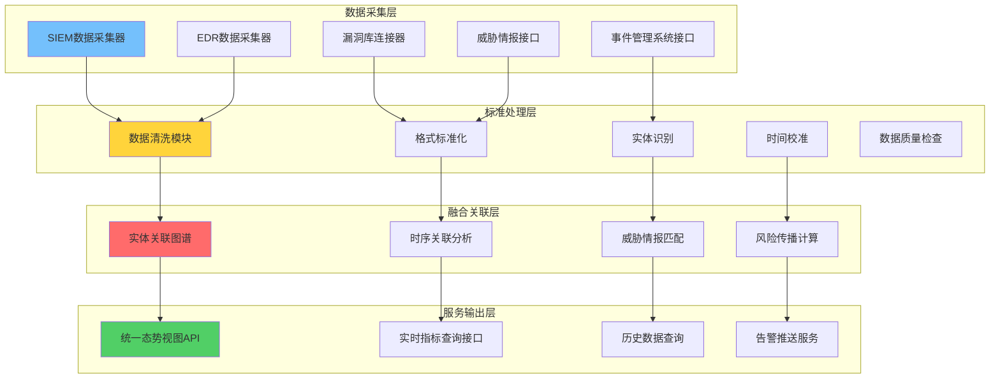
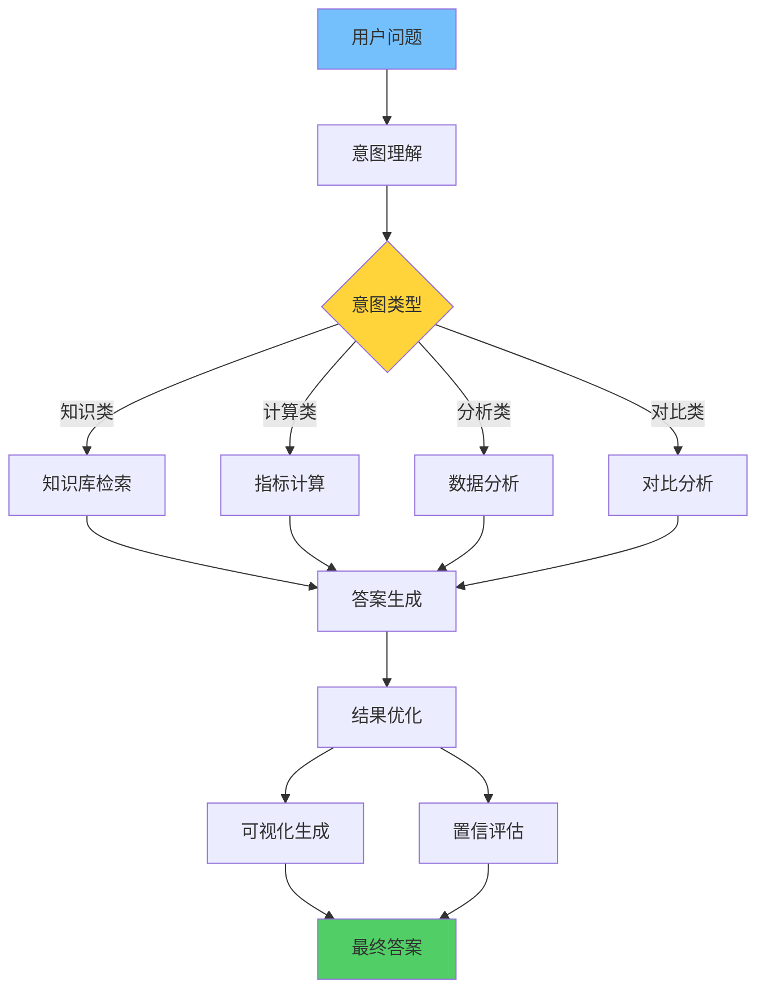

作者：HOS(安全风信子)
日期：2026-04-27
主要来源：GitHub
摘要：企业安全态势问答系统是AI安全运营的核心交互入口，它整合资产、漏洞、告警、威胁、事件等多源态势数据，通过自然语言问答为安全分析师和管理层提供即时的安全状态查询与决策支持。本文深入剖析多源态势数据融合引擎、实时指标计算与聚合、上下文感知问答生成三大核心能力，详细阐述系统架构设计与关键技术实现，结合Microsoft Security Copilot等主流平台实践，为企业构建智能化态势问答系统提供完整的技术参考。掌握态势问答系统设计，对于提升安全运营效率、加速决策流程具有关键价值。

@[TOC](目录)

---

# 企业AI态势问答系统：让安全态势张口即知的智能交互引擎

## 一、引言

在企业安全运营过程中，管理层和分析师经常面临一个核心挑战：如何快速、准确地获取当前安全态势信息？传统的解决方案是登录多个系统、查询多个仪表盘、汇总多份报告，耗时耗力且难以获得全局视图。随着大语言模型技术的成熟，一种全新的交互范式应运而生——**AI态势问答系统**，它允许用户通过自然语言提问，即时获得整合的安全态势答案[^1]。

本文将为读者提供以下核心价值：首先，深入理解态势问答系统的技术架构与数据融合机制；其次，掌握多源态势数据整合的核心算法设计；第三，了解上下文感知问答生成的技术实现；最后，获取企业级态势问答系统的部署指南与最佳实践。通过本文的系统学习，安全架构师和运营团队将具备设计和落地态势问答系统的完整能力。

### 1.1 态势问答系统的演进历程

态势问答系统的发展经历了三个重要阶段。第一阶段是基于规则的传统问答系统，它通过预定义的规则模板匹配用户问题，返回固定格式的答案。这种系统虽然实现简单，但灵活性极差，无法处理复杂多变的用户需求。第二阶段是基于检索增强生成（RAG）的智能问答系统，它通过向量检索从知识库中获取相关文档，结合大语言模型生成答案。这种系统在处理知识类问题时效果较好，但无法访问实时态势数据。第三阶段是本文重点介绍的**多模态态势感知问答系统**，它不仅能够理解自然语言问题，还能实时整合多源态势数据，完成复杂的指标计算和关联分析，为用户提供准确、可信的安全态势洞察。

### 1.2 态势问答系统的核心应用场景

态势问答系统在企业安全运营中有多种重要应用。对于SOC分析师而言，态势问答系统可以快速回答"过去24小时有多少高危告警未处理"、"哪个业务系统的漏洞修复率最低"这类高频问题，大幅提升日常监控效率。对于安全运营经理，态势问答系统可以提供"本周与上周相比告警趋势如何"、"本月MTTD指标是否达标"等管理视角的问题答案，辅助决策分析。对于CISO等高管，态势问答系统可以回答"公司整体安全态势评分是多少"、"与行业基准相比我们处于什么水平"等战略性问题，提供全局视角的安全洞察。

## 二、态势问答系统的核心价值与技术定位

### 2.1 为什么企业需要态势问答系统

传统安全运营中，安全态势的获取依赖于多种割裂的工具和流程。分析师需要登录SIEM查询告警、打开EDR查看终端状态、访问漏洞管理系统检查修复进度、查阅威胁情报平台获取最新预警。这种模式存在三个显著痛点：**信息碎片化**导致难以形成统一视图，**查询门槛高**要求熟悉多个系统操作，**响应延迟大**使得紧急情况下难以快速决策。

态势问答系统通过自然语言接口彻底重构了安全信息的获取方式。用户可以随时提问"过去24小时有多少高危告警未处理"、"哪个业务系统的漏洞修复率最低"、"本周新增了多少钓鱼邮件"，系统即时整合多源数据，生成准确的答案和可视化展示。根据Microsoft Security Copilot的实践，态势问答系统可将安全信息获取时间从分钟级缩短至秒级，极大提升运营效率[^2]。

从技术定位角度，态势问答系统是AI安全运营平台的顶层应用，它构建在知识库系统（参考G101）、检索技术（参考G104）、问答架构（参考G102）等基础设施之上，专注于态势数据的实时整合与智能问答。

### 2.2 态势问答系统与相关系统的能力边界

理解态势问答系统与相邻系统的差异，有助于精准把握其设计边界。态势问答系统与安全知识问答系统（G102）的核心区别在于数据时效性：知识问答处理静态的、历史积累的知识，而态势问答处理实时变化的态势数据。态势问答系统与安全运营助手（G109）的关系是：运营助手提供综合性的日常工作支持，态势问答则专注于态势数据的查询与分析。

```python
class SituationalQAComparison:
    """态势问答系统与相邻系统能力对比"""

    SYSTEM_COMPARISON = {
        '安全知识问答(G102)': {
            'data_type': '静态知识库',
            'data_source': '历史文档、案例库、SOP',
            'update_frequency': '定期更新',
            'query_type': '定义、解释、步骤',
            'answer_source': '知识库检索+RAG生成'
        },
        '态势问答系统(本文)': {
            'data_type': '实时态势数据',
            'data_source': 'SIEM、EDR、漏洞库、威胁情报',
            'update_frequency': '实时或准实时',
            'query_type': '状态、趋势、对比、排名',
            'answer_source': '多源数据融合+指标计算'
        },
        '安全运营助手(G109)': {
            'data_type': '综合数据',
            'data_source': '知识+态势+历史',
            'update_frequency': '混合',
            'query_type': '任务执行、流程指导',
            'answer_source': '多能力协同'
        }
    }

    @staticmethod
    def get_recommended_use_case(question_type: str) -> str:
        """根据问题类型推荐最适合的系统"""
        recommendations = {
            'what_is': '安全知识问答(G102)',
            'how_to': '安全知识问答(G102)',
            'current_status': '态势问答系统(本文)',
            'how_many': '态势问答系统(本文)',
            'trend': '态势问答系统(本文)',
            'compare': '态势问答系统(本文)',
            'next_step': '安全运营助手(G109)'
        }
        return recommendations.get(question_type, '安全知识问答(G102)')
```

### 2.3 态势问答系统的价值评估指标

评估态势问答系统的价值需要从多个维度综合考量。**准确性维度**关注答案与真实态势的符合程度，包括数据准确性、计算准确性和结论准确性三个方面。**时效性维度**关注系统响应速度，包括问题解析延迟、数据查询延迟和答案生成延迟三个环节。**完整性维度**关注系统覆盖的问题类型比例，包括态势类问题、趋势类问题、对比类问题和排名类问题的覆盖情况。**可用性维度**关注用户使用体验，包括自然语言理解的准确率、答案的可读性和可视化效果的质量。

| 评估维度 | 评估指标 | 目标值 | 测量方法 |
|---------|---------|--------|----------|
| 准确性 | 数据准确率 | ≥99.5% | 与源系统数据抽样对比 |
| 准确性 | 指标计算准确率 | ≥99.9% | 标准化测试集验证 |
| 时效性 | 平均响应时间 | <3秒 | 生产环境日志统计 |
| 时效性 | P99响应时间 | <10秒 | 生产环境日志统计 |
| 完整性 | 问题类型覆盖率 | ≥90% | 用户query分析统计 |
| 可用性 | 用户满意度 | ≥4.5/5 | 用户反馈收集 |
| 可用性 | 问题理解准确率 | ≥95% | 意图分类评估 |

## 三、多源态势数据融合引擎设计

### 3.1 态势数据源分类与特点

态势问答系统的高质量回答依赖于多源态势数据的有效整合。企业安全态势数据可划分为五个核心类别，每个类别具有独特的数据特征和采集方式。

**资产态势数据**来自CMDB、资产发现系统、EDR等，描述企业IT资产的配置、状态、变更信息。资产数据的特点是变化相对缓慢但总量庞大，通常包含服务器、网络设备、终端、应用系统、业务服务的属性信息。资产数据的采集通常采用增量同步模式，全量同步周期一般为每天一次，增量同步则根据数据源特性设置为分钟级到小时级不等。资产数据的质量直接影响态势评估的准确性，因此需要建立数据质量监控机制，持续跟踪资产信息的完整度和准确度。

**漏洞态势数据**来自漏洞扫描器、漏洞管理系统、CVE数据库，反映企业资产的安全缺陷状况。漏洞数据更新频繁，且与资产数据存在强关联关系。漏洞数据的处理需要特别关注新漏洞披露时的快速响应能力，当CVE数据库收录新的高危漏洞时，系统需要在最短时间内完成全网资产匹配，识别受影响资产并生成预警。漏洞态势分析还需要考虑漏洞利用的紧迫性，结合威胁情报判断漏洞是否已被实际利用，从而确定响应优先级。

**告警态势数据**是SIEM、EDR、NDR等安全设备的实时输出，描述当前检测到的安全事件。告警数据具有高吞吐量、低价值密度的特点，需要进行降噪和关联分析。告警态势处理的核心挑战是如何在海量告警中识别真正的安全威胁，这涉及到告警聚合、告警归因、告警优先级排序等多个技术环节。先进的态势问答系统通常会维护一个实时的告警处理流水线，通过机器学习模型自动识别误报，将真正需要关注的告警突出展示。

**威胁态势数据**来自威胁情报平台、行业共享情报、自有情报生产，描述外部威胁环境。威胁情报包括IOC（指标物）、TTP（战术技术规程）、攻击趋势等多层次信息。威胁态势数据的时效性要求最高，优秀的威胁情报系统能够实现分钟级的情报更新和分发。态势问答系统在处理威胁态势数据时，需要关注情报的可信度评估，避免低质量情报干扰正常判断。

**事件态势数据**来自事件管理流程、IR系统，记录已确认的安全事件及其处置状态。事件态势数据是安全运营活动的直接产出，反映了组织应对安全威胁的实际能力和效果。事件数据的分析可以帮助识别安全运营的薄弱环节，例如某类攻击反复发生但未能有效阻断，或者某些处置流程耗时过长需要优化。

### 3.2 多源数据融合引擎架构

多源态势数据融合引擎的核心职责是解决数据孤岛问题，将异构数据源整合为统一、安全、实时的态势视图。引擎采用分层架构设计，包含数据采集层、标准处理层、融合关联层、服务输出层。



```python
class SituationalDataFusionEngine:
    """多源态势数据融合引擎"""

    def __init__(self, config: FusionConfig):
        self.config = config
        self.data_connectors = {}
        self.normalizers = {}
        self.fusion_pipeline = FusionPipeline()
        self._initialize_connectors()

    def _initialize_connectors(self):
        """初始化各数据源连接器"""
        self.data_connectors = {
            'asset': AssetConnector(self.config.asset_source),
            'vulnerability': VulnConnector(self.config.vuln_source),
            'alert': AlertConnector(self.config.alert_source),
            'threat_intel': ThreatIntelConnector(self.config.intel_source),
            'incident': IncidentConnector(self.config.incident_source)
        }

        for source_name, connector in self.data_connectors.items():
            self.normalizers[source_name] = Normalizer(
                schema=self._get_normalized_schema(source_name)
            )

    def _get_normalized_schema(self, source: str) -> dict:
        """获取各数据源的标准化Schema"""
        schemas = {
            'asset': {
                'entity_id': str,
                'entity_type': str,
                'business_criticality': str,
                'owner_team': str,
                'ip_address': str,
                'hostname': str,
                'os_version': str,
                'last_seen': float,
                'tags': list
            },
            'vulnerability': {
                'vuln_id': str,
                'affected_entity': str,
                'cvss_score': float,
                'severity': str,
                'status': str,
                'discovered_at': float,
                'remediation_deadline': float
            },
            'alert': {
                'alert_id': str,
                'source': str,
                'alert_type': str,
                'severity': str,
                'status': str,
                'entity_id': str,
                'timestamp': float,
                'enrichment_data': dict
            },
            'threat_intel': {
                'intel_id': str,
                'indicator': str,
                'indicator_type': str,
                'threat_type': str,
                'confidence': float,
                'last_seen': float,
                'tags': list
            },
            'incident': {
                'incident_id': str,
                'title': str,
                'severity': str,
                'status': str,
                'assigned_to': str,
                'created_at': float,
                'resolved_at': float,
                'related_alerts': list,
                'related_entities': list
            }
        }
        return schemas.get(source, {})

    def fuse_data(self, time_window: TimeWindow) -> FusedSituationalView:
        """执行多源数据融合"""
        raw_data = self._collect_raw_data(time_window)

        normalized_data = {}
        for source_name, raw in raw_data.items():
            normalized_data[source_name] = self.normalizers[source_name].normalize(raw)

        correlated_data = self._correlate_entities(normalized_data)

        enriched_data = self._enrich_with_context(correlated_data)

        fused_view = self._build_fused_view(enriched_data)

        return fused_view

    def _collect_raw_data(self, time_window: TimeWindow) -> dict:
        """从各数据源采集原始数据"""
        raw_data = {}
        for source_name, connector in self.data_connectors.items():
            try:
                raw_data[source_name] = connector.fetch(time_window)
            except DataSourceError as e:
                logger.warning(f"Failed to fetch {source_name}: {e}")
                raw_data[source_name] = []
        return raw_data

    def _correlate_entities(self, normalized_data: dict) -> dict:
        """跨源关联实体"""
        entity_graph = Graph()

        for source, entities in normalized_data.items():
            for entity in entities:
                entity_graph.add_entity(entity['entity_id'], entity)

        entity_graph.add_edges_from_alerts(normalized_data['alert'])
        entity_graph.add_edges_from_vulns(normalized_data['vulnerability'])
        entity_graph.add_edges_from_intel(normalized_data['threat_intel'])

        correlated = {}
        for entity_id in entity_graph.get_all_entity_ids():
            correlated[entity_id] = entity_graph.get_entity_with_neighbors(entity_id)

        return correlated

    def _enrich_with_context(self, correlated_data: dict) -> dict:
        """使用上下文信息丰富关联数据"""
        enriched = {}
        for entity_id, entity_data in correlated_data.items():
            enriched_entity = entity_data.copy()

            enriched_entity['context'] = self._build_entity_context(
                entity_id,
                entity_data
            )

            enriched_entity['risk_indicators'] = self._calculate_risk_indicators(
                entity_data
            )

            enriched[entity_id] = enriched_entity

        return enriched

    def _build_entity_context(self, entity_id: str, entity_data: dict) -> dict:
        """构建实体的上下文信息"""
        context = {
            'related_alerts': [],
            'related_vulnerabilities': [],
            'related_intel': [],
            'temporal_pattern': self._analyze_temporal_pattern(entity_id)
        }

        if 'alerts' in entity_data:
            context['related_alerts'] = entity_data['alerts']

        if 'vulnerabilities' in entity_data:
            context['related_vulnerabilities'] = entity_data['vulnerabilities']

        if 'intel_matches' in entity_data:
            context['related_intel'] = entity_data['intel_matches']

        return context

    def _calculate_risk_indicators(self, entity_data: dict) -> dict:
        """计算实体的风险指标"""
        indicators = {
            'alert_frequency': 0,
            'vulnerability_exposure': 0,
            'threat_intel_match': False,
            'historical_incidents': 0
        }

        if 'alerts' in entity_data:
            indicators['alert_frequency'] = len(entity_data['alerts'])

        if 'vulnerabilities' in entity_data:
            critical_vulns = [
                v for v in entity_data['vulnerabilities']
                if v.get('cvss_score', 0) >= 9.0
            ]
            indicators['vulnerability_exposure'] = len(critical_vulns)

        if 'intel_matches' in entity_data:
            indicators['threat_intel_match'] = len(entity_data['intel_matches']) > 0

        return indicators
```

### 3.3 多模态输入融合处理详解

态势问答系统的多模态输入融合是实现自然交互的关键能力。用户可以通过文本、语音、代码片段、文件附件等多种方式提交问题，系统需要能够统一处理这些异构输入，提取用户意图和关键信息。

#### 3.3.1 文本输入处理流程

文本是最基本也是最常用的输入方式。文本处理的核心挑战是如何准确理解用户的自然语言表达，包括时间表达式解析、实体识别、意图分类等多个子任务。

```python
class TextInputProcessor:
    """文本输入处理器"""

    def __init__(self, nlp_model, entity_extractor, intent_classifier):
        self.nlp_model = nlp_model
        self.entity_extractor = entity_extractor
        self.intent_classifier = intent_classifier
        self.time_parser = TimeExpressionParser()
        self.entity_resolver = EntityResolver()

    def process(self, text_input: str, context: dict = None) -> ProcessedInput:
        """处理文本输入"""
        normalized_text = self._normalize_text(text_input)

        nlp_result = self.nlp_model.analyze(normalized_text)

        entities = self.entity_extractor.extract(nlp_result)

        resolved_entities = self.entity_resolver.resolve(
            entities,
            context
        )

        time_expressions = self.time_parser.parse(normalized_text)

        intent = self.intent_classifier.classify(normalized_text, nlp_result)

        return ProcessedInput(
            original_text=text_input,
            normalized_text=normalized_text,
            nlp_result=nlp_result,
            entities=resolved_entities,
            time_expressions=time_expressions,
            intent=intent,
            confidence=self._calculate_confidence(nlp_result, intent)
        )

    def _normalize_text(self, text: str) -> str:
        """标准化文本"""
        text = text.lower().strip()

        text = re.sub(r'\s+', ' ', text)

        replacements = {
            '昨天': self._get_relative_date(-1),
            '今天': self._get_relative_date(0),
            '明天': self._get_relative_date(1),
            '上周': self._get_relative_week(-1),
            '本周': self._get_relative_week(0),
            '下周': self._get_relative_week(1),
            '上月': self._get_relative_month(-1),
            '本月': self._get_relative_month(0),
            '下月': self._get_relative_month(1)
        }

        for phrase, replacement in replacements.items():
            text = text.replace(phrase, replacement)

        return text

    def _calculate_confidence(self, nlp_result: dict, intent: dict) -> float:
        """计算处理置信度"""
        entity_confidence = nlp_result.get('entity_confidence', 0.5)
        intent_confidence = intent.get('confidence', 0.5)

        time_quality = 1.0 if nlp_result.get('time_expressions') else 0.8

        overall = (
            entity_confidence * 0.3 +
            intent_confidence * 0.4 +
            time_quality * 0.3
        )

        return overall
```

#### 3.3.2 语音输入处理流程

语音输入为用户提供了更加自然的交互方式，特别是在紧急情况下，分析师可能无法腾出手来打字。语音处理的核心挑战是如何在保持低延迟的同时保证识别准确率。

```python
class VoiceInputProcessor:
    """语音输入处理器"""

    def __init__(self, asr_model, vad_model, text_processor: TextInputProcessor):
        self.asr_model = asr_model
        self.vad_model = vad_model
        self.text_processor = text_processor
        self.audio_buffer = AudioBuffer()
        self.confidence_threshold = 0.7

    async def process(self, audio_stream: bytes, context: dict = None) -> ProcessedInput:
        """处理语音输入"""
        segments = await self._detect_voice_segments(audio_stream)

        if not segments:
            raise NoSpeechDetectedError()

        transcribed_text = await self._transcribe_segments(segments)

        confidence = self._calculate_transcription_confidence(segments)

        if confidence < self.confidence_threshold:
            return ProcessedInput(
                original_text=transcribed_text,
                confidence=confidence,
                requires_clarification=True
            )

        processed = self.text_processor.process(transcribed_text, context)

        processed.audio_confidence = confidence

        return processed

    async def _detect_voice_segments(self, audio_stream: bytes) -> list:
        """检测语音段落"""
        audio_data = np.frombuffer(audio_stream, dtype=np.int16)

        speech_probs = self.vad_model.predict(audio_data)

        segments = []
        in_speech = False
        start_idx = 0

        for i, prob in enumerate(speech_probs):
            if prob > 0.5 and not in_speech:
                in_speech = True
                start_idx = i
            elif prob <= 0.5 and in_speech:
                in_speech = False
                segments.append({
                    'start': start_idx,
                    'end': i,
                    'audio': audio_data[start_idx:i]
                })

        return segments

    async def _transcribe_segments(self, segments: list) -> str:
        """转写语音段落"""
        transcription_parts = []

        for segment in segments:
            audio_segment = segment['audio'].tobytes()

            text = await self.asr_model.transcribe(
                audio_segment,
                language='zh-CN'
            )

            transcription_parts.append(text)

        full_transcription = ' '.join(transcription_parts)

        return full_transcription

    def _calculate_transcription_confidence(self, segments: list) -> float:
        """计算转写置信度"""
        if not segments:
            return 0.0

        confidences = []
        for segment in segments:
            segment_conf = segment.get('confidence', 0.5)
            duration_factor = min(len(segment['audio']) / 16000, 1.0)
            confidences.append(segment_conf * (0.5 + 0.5 * duration_factor))

        return sum(confidences) / len(confidences)
```

#### 3.3.3 代码片段处理流程

安全分析师经常需要分享或查询特定代码相关的问题，例如"过去一周有多少钓鱼邮件包含这个URL特征"或"统计一下我们部署的Snort规则被触发的情况"。代码片段处理需要识别代码中的关键模式和特征。

```python
class CodeInputProcessor:
    """代码片段输入处理器"""

    def __init__(self, code_parser, pattern_extractor):
        self.code_parser = code_parser
        self.pattern_extractor = pattern_extractor

    def process(self, code_input: str, context: dict = None) -> ProcessedInput:
        """处理代码输入"""
        code_type = self._detect_code_type(code_input)

        parsed_code = self.code_parser.parse(code_input, code_type)

        patterns = self.pattern_extractor.extract_patterns(
            parsed_code,
            code_type
        )

        siem_query = self._generate_siem_query(patterns, code_type)

        return ProcessedInput(
            original_text=code_input,
            code_type=code_type,
            parsed_result=parsed_code,
            extracted_patterns=patterns,
            siem_query=siem_query,
            confidence=0.9
        )

    def _detect_code_type(self, code: str) -> str:
        """检测代码类型"""
        code_type_indicators = {
            'python': ['import ', 'def ', 'class ', 'print(', 'if __name__'],
            'sql': ['SELECT ', 'FROM ', 'WHERE ', 'INSERT ', 'UPDATE ', 'DELETE '],
            'regex': ['^', '$', '[', ']', '{', '}', '.*', '\\d'],
            'yaml': [':\n', '  - ', '---'],
            'json': ['{"', '"}', '": ', '[,]'],
            'powershell': ['$', 'Get-', 'Set-', '-Match ', '|'],
            'bash': ['#!/bin/bash', 'echo ', 'grep ', 'awk ', '|'],
            'snort': ['alert ', 'tcp ', 'udp ', 'http ', 'msg:', 'sid:']
        }

        scores = {}
        for lang, indicators in code_type_indicators.items():
            score = sum(1 for indicator in indicators if indicator in code)
            scores[lang] = score

        if max(scores.values()) == 0:
            return 'unknown'

        return max(scores, key=scores.get)

    def _generate_siem_query(self, patterns: list, code_type: str) -> str:
        """生成SIEM查询语句"""
        if code_type == 'snort':
            rule_patterns = [p for p in patterns if p.get('type') == 'sid']
            if rule_patterns:
                sids = [p['value'] for p in rule_patterns]
                return f"tag=snort AND sid IN ({','.join(sids)})"

        elif code_type == 'regex':
            regex_patterns = [p['value'] for p in patterns]
            return f"match_regex=({') OR match_regex=('.join(regex_patterns)})"

        elif code_type == 'sql':
            table_patterns = [p for p in patterns if p.get('type') == 'table']
            if table_patterns:
                tables = [p['value'] for p in table_patterns]
                return f"index={','.join(tables)}"

        return ""
```

#### 3.3.4 文件输入处理流程

用户可能上传日志文件、告警截图、报告文档等附件。文件处理需要支持多种格式，并能够从文件中提取关键信息。

```python
class FileInputProcessor:
    """文件输入处理器"""

    SUPPORTED_TYPES = {
        'application/json': JSONFileProcessor(),
        'application/pdf': PDFFileProcessor(),
        'text/plain': TextFileProcessor(),
        'text/csv': CSVFileProcessor(),
        'image/png': ImageFileProcessor(),
        'image/jpeg': ImageFileProcessor()
    }

    def __init__(self, ocr_engine, text_extractor):
        self.ocr_engine = ocr_engine
        self.text_extractor = text_extractor
        self.file_processors = self.SUPPORTED_TYPES.copy()

    async def process(self, file_data: bytes, file_type: str, context: dict = None) -> ProcessedInput:
        """处理文件输入"""
        processor = self.file_processors.get(file_type)

        if not processor:
            raise UnsupportedFileTypeError(f"File type {file_type} not supported")

        extracted_content = await processor.extract_content(file_data)

        if file_type.startswith('image/'):
            extracted_text = await self._extract_text_from_image(
                file_data,
                extracted_content
            )
        else:
            extracted_text = extracted_content

        processed = self.text_extractor.process(extracted_text, context)

        processed.file_metadata = {
            'file_type': file_type,
            'size_bytes': len(file_data),
            'extraction_method': 'direct' if not file_type.startswith('image/') else 'ocr'
        }

        return processed

    async def _extract_text_from_image(self, image_data: bytes, ocr_result: dict) -> str:
        """从图像中提取文本"""
        if ocr_result.get('full_text'):
            return ocr_result['full_text']

        return ""
```

### 3.4 实体关联图谱构建

多源数据融合的关键技术是构建跨源实体关联图谱。实体关联图谱以资产为核心，关联漏洞、告警、威胁情报、事件等多维度信息，形成完整的安全画像。关联关系的建立依赖于多种匹配规则，包括直接标识符关联（如相同IP、相同主机名）、时间序列关联（如告警发生在资产活跃期间）、行为关联（如告警涉及相同攻击链）[^3]。

```python
class EntityCorrelationGraph:
    """实体关联图谱构建器"""

    def __init__(self):
        self.entities = {}
        self.edges = []
        self.entity_index = {}

    def add_entity(self, entity_id: str, entity_data: dict):
        """添加实体到图谱"""
        self.entities[entity_id] = {
            'id': entity_id,
            'type': entity_data.get('entity_type', 'unknown'),
            'attributes': entity_data,
            'sources': set(),
            'confidence': 1.0
        }
        self._update_index(entity_id, entity_data)

    def add_edges_from_alerts(self, alerts: list):
        """从告警添加关联边"""
        for alert in alerts:
            entity_id = alert.get('entity_id')
            if entity_id in self.entities:
                self.entities[entity_id]['sources'].add('alert')

                self.edges.append({
                    'source': entity_id,
                    'target': alert['alert_id'],
                    'relation': 'triggers',
                    'weight': self._calculate_alert_weight(alert),
                    'bidirectional': False
                })

                if alert.get('related_alerts'):
                    for related_id in alert['related_alerts']:
                        self.edges.append({
                            'source': alert['alert_id'],
                            'target': related_id,
                            'relation': 'correlated_with',
                            'weight': 0.8,
                            'bidirectional': True
                        })

    def add_edges_from_vulns(self, vulns: list):
        """从漏洞添加关联边"""
        for vuln in vulns:
            affected = vuln.get('affected_entity')
            if affected in self.entities:
                self.entities[affected]['sources'].add('vulnerability')

                self.edges.append({
                    'source': affected,
                    'target': vuln['vuln_id'],
                    'relation': 'has_vulnerability',
                    'weight': self._calculate_vuln_weight(vuln),
                    'bidirectional': False
                })

    def add_edges_from_intel(self, intel_list: list):
        """从威胁情报添加关联边"""
        for intel in intel_list:
            indicator = intel.get('indicator')

            matched_entities = self._find_entities_by_indicator(indicator)
            for entity_id in matched_entities:
                self.entities[entity_id]['sources'].add('threat_intel')

                self.edges.append({
                    'source': entity_id,
                    'target': intel['intel_id'],
                    'relation': 'matches_intel',
                    'weight': intel.get('confidence', 0.5),
                    'bidirectional': False
                })

    def _calculate_alert_weight(self, alert: dict) -> float:
        """计算告警权重"""
        severity_weights = {
            'CRITICAL': 1.0,
            'HIGH': 0.8,
            'MEDIUM': 0.5,
            'LOW': 0.2
        }
        base_weight = severity_weights.get(alert.get('severity', 'MEDIUM'), 0.3)

        if alert.get('status') == 'new':
            base_weight *= 1.2

        confidence = alert.get('enrichment_data', {}).get('confidence', 1.0)
        return base_weight * confidence

    def _calculate_vuln_weight(self, vuln: dict) -> float:
        """计算漏洞权重"""
        cvss = vuln.get('cvss_score', 5.0)
        if cvss >= 9.0:
            return 1.0
        elif cvss >= 7.0:
            return 0.8
        elif cvss >= 4.0:
            return 0.5
        else:
            return 0.2

    def get_risk_score(self, entity_id: str) -> float:
        """计算实体的综合风险评分"""
        if entity_id not in self.entities:
            return 0.0

        entity = self.entities[entity_id]

        vuln_score = sum(
            e['weight'] for e in self.edges
            if e['source'] == entity_id and e['relation'] == 'has_vulnerability'
        )

        alert_score = sum(
            e['weight'] for e in self.edges
            if e['source'] == entity_id and e['relation'] == 'triggers'
        )

        intel_score = sum(
            e['weight'] for e in self.edges
            if e['source'] == entity_id and e['relation'] == 'matches_intel'
        )

        source_bonus = 1.0 + 0.1 * len(entity['sources'])

        risk_score = (vuln_score * 0.4 + alert_score * 0.4 + intel_score * 0.2) * source_bonus

        return min(risk_score, 10.0)

    def _find_entities_by_indicator(self, indicator: str) -> list:
        """根据指标查找匹配的实体"""
        matched = []

        indicator_lower = indicator.lower()

        for entity_id, entity_data in self.entities.items():
            attrs = entity_data.get('attributes', {})

            if attrs.get('ip_address', '').lower() == indicator_lower:
                matched.append(entity_id)
                continue

            if attrs.get('hostname', '').lower() == indicator_lower:
                matched.append(entity_id)
                continue

            if indicator_lower in str(attrs.get('file_hash', '')).lower():
                matched.append(entity_id)
                continue

            if indicator_lower in str(attrs.get('domain', '')).lower():
                matched.append(entity_id)
                continue

        return matched

    def _update_index(self, entity_id: str, entity_data: dict):
        """更新实体索引"""
        index_keys = ['ip_address', 'hostname', 'mac_address', 'entity_type']

        for key in index_keys:
            value = entity_data.get(key)
            if value:
                if key not in self.entity_index:
                    self.entity_index[key] = {}
                self.entity_index[key][value.lower()] = entity_id

    def get_neighbors(self, entity_id: str, relation_type: str = None) -> list:
        """获取实体的关联实体"""
        neighbors = []

        for edge in self.edges:
            if edge['source'] == entity_id:
                neighbor_info = {
                    'entity_id': edge['target'],
                    'relation': edge['relation'],
                    'weight': edge['weight']
                }
                if relation_type is None or edge['relation'] == relation_type:
                    neighbors.append(neighbor_info)

            elif edge['bidirectional'] and edge['target'] == entity_id:
                neighbor_info = {
                    'entity_id': edge['source'],
                    'relation': edge['relation'],
                    'weight': edge['weight']
                }
                if relation_type is None or edge['relation'] == relation_type:
                    neighbors.append(neighbor_info)

        return neighbors
```

### 3.5 实时数据同步与更新机制

态势数据的实时性是问答系统准确性的基础。系统需要建立完善的数据同步机制，确保各数据源的变更能够及时反映到态势视图中。

```python
class RealTimeDataSyncEngine:
    """实时数据同步引擎"""

    def __init__(self, fusion_engine: SituationalDataFusionEngine):
        self.fusion_engine = fusion_engine
        self.sync_status = {}
        self.change_listeners = []
        self._start_sync_tasks()

    def _start_sync_tasks(self):
        """启动同步任务"""
        self.sync_tasks = {
            'asset': SyncTask(
                name='asset_sync',
                interval=300,
                sync_func=self._sync_asset_data
            ),
            'vulnerability': SyncTask(
                name='vuln_sync',
                interval=600,
                sync_func=self._sync_vuln_data
            ),
            'alert': SyncTask(
                name='alert_sync',
                interval=60,
                sync_func=self._sync_alert_data
            ),
            'threat_intel': SyncTask(
                name='intel_sync',
                interval=300,
                sync_func=self._sync_intel_data
            )
        }

    async def _sync_asset_data(self):
        """同步资产数据"""
        last_sync = self.sync_status.get('asset', {}).get('last_sync', 0)

        incremental_data = await self.fusion_engine.data_connectors['asset'].fetch_incremental(
            since=last_sync
        )

        if incremental_data:
            await self._apply_asset_changes(incremental_data)
            self._notify_listeners('asset', incremental_data)

        self.sync_status['asset'] = {
            'last_sync': time.time(),
            'records_updated': len(incremental_data) if incremental_data else 0
        }

    async def _sync_alert_data(self):
        """同步告警数据"""
        last_sync = self.sync_status.get('alert', {}).get('last_sync', 0)

        new_alerts = await self.fusion_engine.data_connectors['alert'].fetch_new(
            since=last_sync
        )

        if new_alerts:
            await self._apply_alert_changes(new_alerts)
            self._notify_listeners('alert', new_alerts)

        self.sync_status['alert'] = {
            'last_sync': time.time(),
            'records_updated': len(new_alerts) if new_alerts else 0
        }

    async def _apply_asset_changes(self, changes: list):
        """应用资产变更"""
        for change in changes:
            if change.get('operation') == 'create':
                self.fusion_engine.entity_graph.add_entity(
                    change['entity_id'],
                    change['data']
                )
            elif change.get('operation') == 'update':
                self._update_entity(change['entity_id'], change['data'])
            elif change.get('operation') == 'delete':
                self._remove_entity(change['entity_id'])

    def _notify_listeners(self, data_type: str, changes: list):
        """通知变更监听器"""
        for listener in self.change_listeners:
            listener.on_data_change(data_type, changes)

    def register_listener(self, listener):
        """注册变更监听器"""
        self.change_listeners.append(listener)

    def get_sync_status(self) -> dict:
        """获取同步状态"""
        return self.sync_status.copy()
```

## 四、实时指标计算与聚合体系

### 4.1 态势指标体系设计

态势问答系统的高频问题是"当前状态如何"，这要求系统具备实时指标计算能力。态势指标体系从资产、漏洞、告警、威胁、事件五个维度组织，每个维度包含绝对数量指标、变化趋势指标、分布结构指标、风险评分指标。

```python
class SituationalMetricsCalculator:
    """态势指标计算器"""

    def __init__(self, fusion_engine: SituationalDataFusionEngine):
        self.fusion_engine = fusion_engine
        self.metrics_cache = MetricsCache(ttl=60)
        self.baseline_store = BaselineStore()

    def calculate_all_metrics(self, time_window: TimeWindow) -> dict:
        """计算完整态势指标体系"""
        cached = self.metrics_cache.get('all_metrics', time_window.hash)
        if cached:
            return cached

        fused_view = self.fusion_engine.fuse_data(time_window)

        metrics = {
            'asset_metrics': self._calculate_asset_metrics(fused_view),
            'vulnerability_metrics': self._calculate_vuln_metrics(fused_view),
            'alert_metrics': self._calculate_alert_metrics(fused_view),
            'threat_metrics': self._calculate_threat_metrics(fused_view),
            'incident_metrics': self._calculate_incident_metrics(fused_view),
            'risk_metrics': self._calculate_risk_metrics(fused_view)
        }

        self.metrics_cache.set('all_metrics', time_window.hash, metrics)
        return metrics

    def _calculate_asset_metrics(self, view: FusedSituationalView) -> dict:
        """计算资产态势指标"""
        assets = view.get_by_type('asset')

        total_count = len(assets)

        by_type = {}
        for asset in assets:
            asset_type = asset['attributes'].get('entity_type', 'unknown')
            by_type[asset_type] = by_type.get(asset_type, 0) + 1

        by_criticality = {}
        for asset in assets:
            crit = asset['attributes'].get('business_criticality', 'unknown')
            by_criticality[crit] = by_criticality.get(crit, 0) + 1

        recent_activity = self._get_recent_asset_activity(assets, view)

        inactive_threshold = time.time() - 7 * 24 * 3600
        inactive_count = sum(
            1 for asset in assets
            if asset['attributes'].get('last_seen', 0) < inactive_threshold
        )

        return {
            'total_assets': total_count,
            'by_type': by_type,
            'by_criticality': by_criticality,
            'inactive_assets': inactive_count,
            'recent_activity_count': len(recent_activity),
            'inventory_completeness': self._calculate_inventory_completeness(assets)
        }

    def _calculate_vuln_metrics(self, view: FusedSituationalView) -> dict:
        """计算漏洞态势指标"""
        vulns = view.get_by_type('vulnerability')
        assets_with_vulns = view.get_entities_with_relation('has_vulnerability')

        open_vulns = [v for v in vulns if v['status'] == 'open']
        critical_vulns = [v for v in open_vulns if v['cvss_score'] >= 9.0]
        high_vulns = [v for v in open_vulns if 7.0 <= v['cvss_score'] < 9.0]

        mtdf = self._calculate_mean_time_to_fix(open_vulns)

        vuln_by_asset = {}
        for vuln in open_vulns:
            affected = vuln.get('affected_entity')
            vuln_by_asset[affected] = vuln_by_asset.get(affected, 0) + 1

        top_vulnerable = sorted(
            vuln_by_asset.items(),
            key=lambda x: x[1],
            reverse=True
        )[:10]

        return {
            'total_open_vulnerabilities': len(open_vulns),
            'critical_vulnerabilities': len(critical_vulns),
            'high_vulnerabilities': len(high_vulns),
            'mean_time_to_fix_days': mtdf,
            'vulnerabilities_by_severity': {
                'CRITICAL': len(critical_vulns),
                'HIGH': len(high_vulns),
                'MEDIUM': len([v for v in open_vulns if 4.0 <= v['cvss_score'] < 7.0]),
                'LOW': len([v for v in open_vulns if v['cvss_score'] < 4.0])
            },
            'top_vulnerable_assets': top_vulnerable,
            'assets_with_vulnerabilities': len(assets_with_vulns)
        }

    def _calculate_alert_metrics(self, view: FusedSituationalView) -> dict:
        """计算告警态势指标"""
        alerts = view.get_by_type('alert')

        new_alerts = [a for a in alerts if a['status'] == 'new']
        acknowledged = [a for a in alerts if a['status'] == 'acknowledged']
        resolved = [a for a in alerts if a['status'] == 'resolved']

        by_severity = {}
        for alert in alerts:
            sev = alert.get('severity', 'MEDIUM')
            by_severity[sev] = by_severity.get(sev, 0) + 1

        top_alert_types = {}
        for alert in alerts:
            alert_type = alert.get('alert_type', 'unknown')
            top_alert_types[alert_type] = top_alert_types.get(alert_type, 0) + 1

        top_alert_types = sorted(
            top_alert_types.items(),
            key=lambda x: x[1],
            reverse=True
        )[:10]

        false_positive_rate = self._calculate_fp_rate(view)

        return {
            'total_alerts': len(alerts),
            'new_alerts': len(new_alerts),
            'acknowledged_alerts': len(acknowledged),
            'resolved_alerts': len(resolved),
            'by_severity': by_severity,
            'top_alert_types': top_alert_types,
            'false_positive_rate': false_positive_rate,
            'alert_processing_velocity': self._calculate_velocity(alerts)
        }

    def _calculate_threat_metrics(self, view: FusedSituationalView) -> dict:
        """计算威胁态势指标"""
        intel_matches = view.get_by_type('threat_intel_match')

        active_threats = [m for m in intel_matches if self._is_recent(m, days=7)]

        by_threat_type = {}
        for match in intel_matches:
            threat_type = match.get('threat_type', 'unknown')
            by_threat_type[threat_type] = by_threat_type.get(threat_type, 0) + 1

        high_confidence = [m for m in intel_matches if m.get('confidence', 0) >= 0.8]

        affected_assets = set(m['entity_id'] for m in intel_matches)

        return {
            'total_intel_matches': len(intel_matches),
            'active_threats': len(active_threats),
            'high_confidence_matches': len(high_confidence),
            'affected_assets': len(affected_assets),
            'by_threat_type': by_threat_type,
            'threat_intel_coverage': self._calculate_intel_coverage(affected_assets)
        }

    def _calculate_incident_metrics(self, view: FusedSituationalView) -> dict:
        """计算事件态势指标"""
        incidents = view.get_by_type('incident')

        active_incidents = [i for i in incidents if i['status'] in ['open', 'in_progress']]
        critical_incidents = [i for i in incidents if i['severity'] == 'CRITICAL']

        mtdt = self._calculate_mean_time_to_detect(incidents)
        mttr = self._calculate_mean_time_to_resolve(incidents)

        by_status = {}
        for incident in incidents:
            status = incident.get('status', 'unknown')
            by_status[status] = by_status.get(status, 0) + 1

        return {
            'total_incidents': len(incidents),
            'active_incidents': len(active_incidents),
            'critical_incidents': len(critical_incidents),
            'mean_time_to_detect_hours': mtdt,
            'mean_time_to_resolve_hours': mttr,
            'by_status': by_status,
            'incidents_this_month': self._count_period_incidents(incidents, days=30)
        }

    def _calculate_risk_metrics(self, view: FusedSituationalView) -> dict:
        """计算综合风险态势指标"""
        entity_scores = {}
        for entity_id in view.get_all_entity_ids():
            if view.get_entity_type(entity_id) == 'asset':
                entity_scores[entity_id] = view.get_risk_score(entity_id)

        risk_distribution = {
            'critical': len([s for s in entity_scores.values() if s >= 8.0]),
            'high': len([s for s in entity_scores.values() if 6.0 <= s < 8.0]),
            'medium': len([s for s in entity_scores.values() if 4.0 <= s < 6.0]),
            'low': len([s for s in entity_scores.values() if s < 4.0])
        }

        overall_risk_score = sum(entity_scores.values()) / len(entity_scores) if entity_scores else 0

        risk_trend = self._calculate_risk_trend(entity_scores)

        return {
            'overall_risk_score': overall_risk_score,
            'risk_distribution': risk_distribution,
            'risk_trend': risk_trend,
            'top_risk_assets': sorted(
                entity_scores.items(),
                key=lambda x: x[1],
                reverse=True
            )[:10],
            'risk_concentration': self._calculate_risk_concentration(entity_scores)
        }

    def _calculate_mean_time_to_fix(self, vulns: list) -> float:
        """计算平均修复时间"""
        resolved_vulns = [v for v in vulns if v.get('resolved_at') and v.get('discovered_at')]

        if not resolved_vulns:
            return 0.0

        total_days = 0
        for vuln in resolved_vulns:
            days = (vuln['resolved_at'] - vuln['discovered_at']) / (24 * 3600)
            total_days += days

        return total_days / len(resolved_vulns)

    def _calculate_fp_rate(self, view: FusedSituationalView) -> float:
        """计算误报率"""
        alerts = view.get_by_type('alert')

        if not alerts:
            return 0.0

        false_positives = [a for a in alerts if a.get('status') == 'false_positive']

        return len(false_positives) / len(alerts)

    def _calculate_velocity(self, alerts: list) -> float:
        """计算告警处理速度"""
        if not alerts:
            return 0.0

        recent_threshold = time.time() - 24 * 3600
        recent_alerts = [a for a in alerts if a.get('timestamp', 0) > recent_threshold]

        if not recent_alerts:
            return 0.0

        resolved_recent = [a for a in recent_alerts if a.get('status') == 'resolved']

        return len(resolved_recent) / len(recent_alerts) if recent_alerts else 0.0

    def _is_recent(self, item: dict, days: int = 7) -> bool:
        """判断是否在最近天数内"""
        timestamp = item.get('timestamp') or item.get('last_seen') or 0
        return (time.time() - timestamp) <= days * 24 * 3600

    def _calculate_intel_coverage(self, affected_assets: set) -> float:
        """计算威胁情报覆盖率"""
        if not affected_assets:
            return 1.0

        matched_assets = len(affected_assets)
        total_assets = len(self.fusion_engine.entities)

        return matched_assets / total_assets if total_assets > 0 else 0.0
```

### 4.2 指标实时聚合计算

指标计算的性能瓶颈在于多源数据查询和聚合运算。系统采用三级缓存架构：第一级是增量计算的滑动窗口缓存，第二级是预聚合的物化视图缓存，第三级是查询结果缓存。通过这种分层策略，系统可以将90%以上的指标查询响应时间控制在100毫秒以内。

```python
class MetricsAggregator:
    """指标聚合计算器"""

    def __init__(self, calculator: SituationalMetricsCalculator):
        self.calculator = calculator
        self.pre_aggregation_job = PreAggregationJob()
        self._start_pre_aggregation()

    def _start_pre_aggregation(self):
        """启动预聚合任务"""
        self.pre_aggregation_job.schedule(
            interval_seconds=60,
            func=self._run_pre_aggregation
        )

    def _run_pre_aggregation(self):
        """执行预聚合计算"""
        time_windows = [
            TimeWindow(last_hours=1),
            TimeWindow(last_hours=24),
            TimeWindow(last_days=7),
            TimeWindow(last_days=30)
        ]

        for tw in time_windows:
            metrics = self.calculator.calculate_all_metrics(tw)
            self._store_pre_aggregated(tw, metrics)

    def aggregate_for_question(self, question: str, context: dict) -> dict:
        """根据问题聚合指标"""
        parsed = self._parse_question_intent(question)

        if parsed['intent'] == 'current_status':
            return self._aggregate_current_status(parsed)

        elif parsed['intent'] == 'trend':
            return self._aggregate_trend(parsed)

        elif parsed['intent'] == 'comparison':
            return self._aggregate_comparison(parsed)

        elif parsed['intent'] == 'ranking':
            return self._aggregate_ranking(parsed)

        else:
            return self._aggregate_generic(parsed)

    def _parse_question_intent(self, question: str) -> dict:
        """解析问题意图"""
        question_lower = question.lower()

        if any(kw in question_lower for kw in ['有多少', '多少个', '数量', 'count']):
            if any(kw in question_lower for kw in ['趋势', '变化', '增加', '减少']):
                return {'intent': 'trend', 'type': 'count_trend'}
            return {'intent': 'ranking', 'type': 'count'}

        if any(kw in question_lower for kw in ['状态', '情况', '如何']):
            return {'intent': 'current_status'}

        if any(kw in question_lower for kw in ['对比', '比较', '哪个更好']):
            return {'intent': 'comparison'}

        if any(kw in question_lower for kw in ['排名', 'top', '最高', '最低']):
            return {'intent': 'ranking'}

        return {'intent': 'generic'}

    def _aggregate_current_status(self, parsed: dict) -> dict:
        """聚合当前状态指标"""
        metrics = self.calculator.calculate_all_metrics(TimeWindow(last_hours=1))

        return {
            'time_range': '最近1小时',
            'timestamp': time.time(),
            'metrics': metrics,
            'summary': self._generate_status_summary(metrics)
        }

    def _aggregate_trend(self, parsed: dict) -> dict:
        """聚合趋势指标"""
        windows = [
            TimeWindow(last_hours=1),
            TimeWindow(last_hours=24),
            TimeWindow(last_days=7)
        ]

        trend_data = []
        for window in windows:
            metrics = self.calculator.calculate_all_metrics(window)
            trend_data.append({
                'window': window.label,
                'metrics': metrics
            })

        return {
            'trend_data': trend_data,
            'direction': self._calculate_trend_direction(trend_data)
        }

    def _calculate_trend_direction(self, trend_data: list) -> str:
        """计算趋势方向"""
        if len(trend_data) < 2:
            return 'insufficient_data'

        current_metric = self._extract_key_metric(trend_data[-1]['metrics'])
        previous_metric = self._extract_key_metric(trend_data[-2]['metrics'])

        if not current_metric or not previous_metric:
            return 'insufficient_data'

        change_rate = (current_metric - previous_metric) / (previous_metric + 1e-10)

        if change_rate > 0.1:
            return 'increasing'
        elif change_rate < -0.1:
            return 'decreasing'
        else:
            return 'stable'

    def _extract_key_metric(self, metrics: dict) -> float:
        """提取关键指标"""
        if 'alert_metrics' in metrics:
            return metrics['alert_metrics'].get('total_alerts', 0)
        return 0.0

    def _generate_status_summary(self, metrics: dict) -> str:
        """生成状态摘要"""
        summary_parts = []

        if 'alert_metrics' in metrics:
            alert_metrics = metrics['alert_metrics']
            new_alerts = alert_metrics.get('new_alerts', 0)
            summary_parts.append(f"新增告警{new_alerts}个")

        if 'vulnerability_metrics' in metrics:
            vuln_metrics = metrics['vulnerability_metrics']
            critical_vulns = vuln_metrics.get('critical_vulnerabilities', 0)
            summary_parts.append(f"高危漏洞{critical_vulns}个")

        if 'risk_metrics' in metrics:
            risk_metrics = metrics['risk_metrics']
            overall_score = risk_metrics.get('overall_risk_score', 0)
            summary_parts.append(f"整体风险评分{overall_score:.1f}")

        return "；".join(summary_parts) if summary_parts else "态势正常"
```

### 4.3 指标计算优化策略

为了保证系统在海量数据下的高性能，指标计算引擎采用了一系列优化策略。

```python
class MetricsCalculationOptimizer:
    """指标计算优化器"""

    def __init__(self, calculator: SituationalMetricsCalculator):
        self.calculator = calculator
        self.query_cache = LRUCache(maxsize=1000)
        self.aggregation_cache = AggregationCache()
        self._initialize_optimization()

    def _initialize_optimization(self):
        """初始化优化器"""
        self._warmup_cache()

    def _warmup_cache(self):
        """预热缓存"""
        common_windows = [
            TimeWindow(last_hours=1),
            TimeWindow(last_hours=24),
            TimeWindow(last_days=7)
        ]

        for window in common_windows:
            self.calculator.calculate_all_metrics(window)

    async def calculate_with_optimization(
        self,
        metric_names: list,
        time_window: TimeWindow,
        dimensions: dict = None
    ) -> dict:
        """优化后的指标计算"""
        cache_key = self._generate_cache_key(metric_names, time_window, dimensions)

        cached_result = self.query_cache.get(cache_key)
        if cached_result:
            return cached_result

        if self._is_pre_aggregated(metric_names, dimensions):
            result = await self._get_from_pre_aggregation(
                metric_names,
                time_window,
                dimensions
            )
        else:
            result = await self._calculate_metrics(
                metric_names,
                time_window,
                dimensions
            )

        self.query_cache.set(cache_key, result)

        return result

    def _is_pre_aggregated(self, metric_names: list, dimensions: dict) -> bool:
        """检查是否已预聚合"""
        if not metric_names:
            return False

        if dimensions and len(dimensions) > 0:
            return False

        common_metrics = {'total_alerts', 'new_alerts', 'critical_vulnerabilities'}
        return any(m in common_metrics for m in metric_names)

    async def _get_from_pre_aggregation(
        self,
        metric_names: list,
        time_window: TimeWindow,
        dimensions: dict
    ) -> dict:
        """从预聚合结果获取"""
        pre_agg = self.aggregation_cache.get(time_window)

        if not pre_agg:
            pre_agg = self.calculator.calculate_all_metrics(time_window)
            self.aggregation_cache.set(time_window, pre_agg)

        result = {}
        for metric_name in metric_names:
            result[metric_name] = self._extract_metric_from_aggregation(
                pre_agg,
                metric_name
            )

        return result

    def _extract_metric_from_aggregation(self, aggregation: dict, metric_name: str) -> any:
        """从聚合结果中提取特定指标"""
        metric_parts = metric_name.split('.')

        current = aggregation
        for part in metric_parts:
            if isinstance(current, dict) and part in current:
                current = current[part]
            else:
                return None

        return current

    def _generate_cache_key(self, metric_names: list, time_window: TimeWindow, dimensions: dict) -> str:
        """生成缓存键"""
        dim_str = json.dumps(dimensions or {}, sort_keys=True)
        return f"{','.join(sorted(metric_names))}:{time_window.hash}:{hash(dim_str)}"
```

## 五、上下文感知问答生成机制

### 5.1 问答生成流程设计

态势问答系统的核心挑战是如何将计算得到的指标数据转化为自然、连贯、有价值的回答。系统采用五步问答生成流程：意图理解、指标提取、数据计算、答案生成、结果优化。



```python
class SituationalQAGenerator:
    """态势问答生成器"""

    def __init__(self,
                 metrics_aggregator: MetricsAggregator,
                 llm: LLMInterface,
                 context_manager: ContextManager):
        self.metrics_aggregator = metrics_aggregator
        self.llm = llm
        self.context_manager = context_manager

    def generate_answer(self, question: str, user_context: dict = None) -> QAResult:
        """生成问答答案"""
        conversation_id = self.context_manager.get_or_create_conversation(user_context)

        conversation_history = self.context_manager.get_history(conversation_id)

        parsed_intent = self._parse_question(question, conversation_history)

        if parsed_intent['requires_calculation']:
            metrics_data = self.metrics_aggregator.aggregate_for_question(
                question,
                parsed_intent
            )
        else:
            metrics_data = None

        answer = self._construct_answer(
            question,
            parsed_intent,
            metrics_data,
            conversation_history
        )

        self.context_manager.add_exchange(
            conversation_id,
            question,
            answer
        )

        return answer

    def _parse_question(self, question: str, history: list) -> dict:
        """解析问题意图和关键实体"""
        system_prompt = f"""分析以下态势问答问题，提取关键信息：

问题：{question}

历史上下文：
{self._format_history(history)}

请提取：
1. 查询的时间范围（如"过去24小时"、"本周"、"本月"）
2. 查询的实体类型（如"资产"、"告警"、"漏洞"）
3. 查询的指标类型（如"数量"、"趋势"、"排名"）
4. 任何过滤条件（如"高危"、"未处理"）
5. 是否需要对比分析
6. 是否需要生成可视化

以JSON格式输出"""

        response = self.llm.generate(system_prompt)

        parsed = json.loads(response)

        parsed['requires_calculation'] = self._requires_metrics_calculation(parsed)

        return parsed

    def _requires_metrics_calculation(self, parsed: dict) -> bool:
        """判断问题是否需要指标计算"""
        calculation_intents = [
            'count', 'sum', 'average', 'trend',
            'ranking', 'comparison', 'distribution'
        ]
        return parsed.get('metric_type', '') in calculation_intents

    def _construct_answer(self,
                         question: str,
                         intent: dict,
                         metrics_data: dict,
                         history: list) -> QAResult:
        """构建答案"""
        if metrics_data is None:
            return self._generate_knowledge_answer(question, intent, history)

        answer_prompt = f"""基于以下态势数据，回答用户问题：

问题：{question}

解析结果：{json.dumps(intent, ensure_ascii=False)}

态势数据：
{self._format_metrics_for_prompt(metrics_data)}

历史上下文：
{self._format_history(history)}

要求：
1. 答案直接回应问题，避免冗余
2. 数值类信息使用具体数字，而非模糊表述
3. 如有趋势或对比，明确指出方向和幅度
4. 如有异常或值得关注的情况，主动提醒
5. 涉及多个维度时，使用结构化表述
6. 关键数字加粗强调"""

        generated_text = self.llm.generate(answer_prompt)

        visualizations = self._extract_visualizations(intent, metrics_data)

        confidence = self._evaluate_answer_confidence(generated_text, metrics_data)

        return QAResult(
            answer=generated_text,
            visualizations=visualizations,
            metrics_data=metrics_data if intent.get('include_raw_data') else None,
            confidence=confidence,
            sources=self._extract_data_sources(metrics_data)
        )

    def _format_metrics_for_prompt(self, metrics_data: dict) -> str:
        """格式化指标数据供LLM使用"""
        if 'time_range' in metrics_data:
            formatted = f"时间范围：{metrics_data['time_range']}\n"
            formatted += f"计算时间：{datetime.fromtimestamp(metrics_data['timestamp'])}\n\n"
        else:
            formatted = ""

        for category, metrics in metrics_data.items():
            if category in ['time_range', 'timestamp', 'trend_data']:
                continue
            formatted += f"【{category}】\n"
            formatted += self._format_category_metrics(metrics)
            formatted += "\n"

        return formatted

    def _format_category_metrics(self, metrics: dict, indent: int = 2) -> str:
        """格式化类别指标"""
        lines = []
        prefix = " " * indent

        for key, value in metrics.items():
            if isinstance(value, dict):
                lines.append(f"{prefix}{key}:")
                lines.append(self._format_category_metrics(value, indent + 2))
            elif isinstance(value, list):
                if len(value) <= 5:
                    lines.append(f"{prefix}{key}: {value}")
                else:
                    lines.append(f"{prefix}{key}: [{len(value)} items]")
                    for item in value[:3]:
                        if isinstance(item, dict):
                            lines.append(f"{prefix}  - {item}")
                        else:
                            lines.append(f"{prefix}  - {item}")
            else:
                if isinstance(value, float):
                    lines.append(f"{prefix}{key}: {value:.2f}")
                else:
                    lines.append(f"{prefix}{key}: {value}")

        return "\n".join(lines)
```

### 5.2 上下文语境追踪机制

上下文语境追踪是实现多轮对话的关键技术。系统需要维护会话状态，理解代词指代，记住之前的查询上下文，从而支持用户的连续追问。

```python
class ContextTrackingEngine:
    """上下文语境追踪引擎"""

    def __init__(self):
        self.conversation_states = {}
        self.entity_memory = EntityMemory()
        self.topic_tracker = TopicTracker()
        self.reference_resolver = ReferenceResolver()

    def get_or_create_state(self, conversation_id: str) -> ConversationState:
        """获取或创建会话状态"""
        if conversation_id not in self.conversation_states:
            self.conversation_states[conversation_id] = ConversationState(
                conversation_id=conversation_id,
                created_at=time.time(),
                last_active=time.time(),
                turns=[],
                current_topic=None,
                referenced_entities={}
            )

        return self.conversation_states[conversation_id]

    def update_state(self, conversation_id: str, turn: ConversationTurn):
        """更新会话状态"""
        state = self.get_or_create_state(conversation_id)

        state.turns.append(turn)
        state.last_active = time.time()

        self.entity_memory.add_entities(
            conversation_id,
            turn.entities
        )

        if turn.topic:
            state.current_topic = self.topic_tracker.update_topic(
                state.current_topic,
                turn.topic
            )

        self.reference_resolver.update_context(
            conversation_id,
            turn
        )

        if len(state.turns) > self.max_turns:
            self._prune_old_turns(state)

    def resolve_references(self, conversation_id: str, text: str) -> str:
        """解析文本中的引用"""
        state = self.get_or_create_state(conversation_id)

        references = self.reference_resolver.find_references(text)

        resolved_text = text
        for ref in references:
            resolved_entity = self._resolve_reference(
                state,
                ref
            )
            if resolved_entity:
                resolved_text = resolved_text.replace(ref['text'], resolved_entity)

        return resolved_text

    def _resolve_reference(self, state: ConversationState, reference: dict) -> str:
        """解析单个引用"""
        ref_type = reference.get('type')
        ref_text = reference.get('text')

        if ref_type == 'pronoun':
            return self.entity_memory.get_last_mentioned(
                state.conversation_id,
                ref_text
            )

        elif ref_type == 'temporal':
            return self._resolve_temporal_reference(state, ref_text)

        elif ref_type == 'entity':
            return self.entity_memory.resolve_alias(
                state.conversation_id,
                ref_text
            )

        return None

    def _resolve_temporal_reference(self, state: ConversationState, ref_text: str) -> str:
        """解析时间引用"""
        temporal_mapping = {
            '现在': '当前时刻',
            '刚才': self._get_previous_time_context(state),
            '之前': self._get_previous_time_context(state),
            '最近': self._get_recent_time_context(state)
        }

        return temporal_mapping.get(ref_text, ref_text)

    def _get_previous_time_context(self, state: ConversationState) -> str:
        """获取上一次查询的时间上下文"""
        if len(state.turns) >= 2:
            previous_turn = state.turns[-2]
            return previous_turn.time_range or '过去一段时间'

        return '过去一段时间'

    def _get_recent_time_context(self, state: ConversationState) -> str:
        """获取最近的时间上下文"""
        if state.turns:
            last_turn = state.turns[-1]
            return last_turn.time_range or '最近'

        return '最近'

    def _prune_old_turns(self, state: ConversationState):
        """修剪旧轮次保留关键信息"""
        keep_recent = 5
        recent_turns = state.turns[-keep_recent:]

        important_entities = {}
        for turn in state.turns[:-keep_recent]:
            for entity_type, entities in turn.entities.items():
                if entity_type not in important_entities:
                    important_entities[entity_type] = []
                important_entities[entity_type].extend(entities[-2:])

        state.turns = recent_turns

        for entity_type, entities in important_entities.items():
            for entity in entities:
                self.entity_memory.add_silent_entity(
                    state.conversation_id,
                    entity_type,
                    entity
                )


class EntityMemory:
    """实体记忆管理器"""

    def __init__(self):
        self.memories = {}

    def add_entities(self, conversation_id: str, entities: dict):
        """添加实体到记忆"""
        if conversation_id not in self.memories:
            self.memories[conversation_id] = {
                'entities_by_type': {},
                'recent_entities': [],
                'entity_aliases': {}
            }

        memory = self.memories[conversation_id]

        for entity_type, entity_list in entities.items():
            if entity_type not in memory['entities_by_type']:
                memory['entities_by_type'][entity_type] = []

            memory['entities_by_type'][entity_type].extend(entity_list)
            memory['entities_by_type'][entity_type] = memory['entities_by_type'][entity_type][-10:]

        for entity in entities.get('all', []):
            memory['recent_entities'].append(entity)

        memory['recent_entities'] = memory['recent_entities'][-20:]

    def get_last_mentioned(self, conversation_id: str, pronoun: str) -> str:
        """根据代词获取最后提及的实体"""
        if conversation_id not in self.memories:
            return None

        memory = self.memories[conversation_id]

        pronoun_mapping = {
            '它': ['asset', 'alert', 'vulnerability', 'incident'],
            '这个': ['asset', 'alert', 'vulnerability', 'incident'],
            '他们': ['assets', 'alerts', 'vulnerabilities', 'incidents']
        }

        entity_types = pronoun_mapping.get(pronoun, [])

        for entity_type in entity_types:
            entities = memory['entities_by_type'].get(entity_type, [])
            if entities:
                return entities[-1].get('name') or entities[-1].get('id')

        if memory['recent_entities']:
            return memory['recent_entities'][-1].get('name')

        return None

    def resolve_alias(self, conversation_id: str, alias: str) -> str:
        """解析实体别名"""
        if conversation_id not in self.memories:
            return alias

        return self.memories[conversation_id]['entity_aliases'].get(
            alias.lower(),
            alias
        )
```

### 5.3 上下文记忆与多轮对话

态势问答往往需要多轮交互才能完成复杂分析。系统通过上下文记忆机制维护对话状态，支持用户追问、澄清、细化等交互模式。上下文记忆包含会话级记忆和长期记忆两层：会话级记忆记录当前对话轮次的信息，长期记忆累积用户偏好和历史查询模式。

```python
class ConversationContextManager:
    """对话上下文管理器"""

    def __init__(self, memory_store: MemoryStore):
        self.memory_store = memory_store
        self.conversations = {}
        self.max_history_turns = 10
        self.entity_reference_cache = {}

    def get_or_create_conversation(self, user_context: dict) -> str:
        """获取或创建会话ID"""
        if not user_context:
            return str(uuid.uuid4())

        user_id = user_context.get('user_id', 'anonymous')
        session_key = user_context.get('session_key', 'default')

        conv_id = f"{user_id}_{session_key}"

        if conv_id not in self.conversations:
            self.conversations[conv_id] = {
                'created_at': time.time(),
                'last_active': time.time(),
                'history': [],
                'entities': {},
                'preferences': self._load_user_preferences(user_id)
            }

        return conv_id

    def add_exchange(self, conv_id: str, question: str, answer: QAResult):
        """添加一轮对话"""
        if conv_id not in self.conversations:
            return

        exchange = {
            'timestamp': time.time(),
            'question': question,
            'answer': answer.answer,
            'entities': self._extract_entities(answer),
            'metrics_summary': self._summarize_metrics(answer.metrics_data)
        }

        self.conversations[conv_id]['history'].append(exchange)
        self.conversations[conv_id]['last_active'] = time.time()

        if len(self.conversations[conv_id]['history']) > self.max_history_turns:
            self.conversations[conv_id]['history'].pop(0)

        self._update_entity_references(conv_id, exchange)

    def resolve_entity_reference(self, conv_id: str, reference: str) -> str:
        """解析实体引用"""
        if conv_id not in self.conversations:
            return reference

        ref_lower = reference.lower()

        if ref_lower in ['它', '这个', '该资产', '该告警']:
            last_entity = self._get_last_referenced_entity(conv_id)
            return last_entity if last_entity else reference

        if ref_lower in ['之前', '刚才', '上次的']:
            return self.conversations[conv_id]['history'][-2]['entities'] if len(self.conversations[conv_id]['history']) > 1 else reference

        if ref_lower in ['最高', '最多', '最多']:
            ranked = self._get_last_ranked_entity(conv_id)
            return ranked if ranked else reference

        return reference

    def get_relevant_context(self, conv_id: str, current_question: str) -> str:
        """获取相关上下文"""
        if conv_id not in self.conversations:
            return ""

        history = self.conversations[conv_id]['entities']

        relevant = []

        for i, ex in enumerate(self.conversations[conv_id]['history'][-3:]):
            relevant.append({
                'turn': i + 1,
                'question': ex['question'],
                'entities': ex['entities'],
                'metrics_summary': ex['metrics_summary']
            })

        return json.dumps(relevant, ensure_ascii=False)

    def _extract_entities(self, answer: QAResult) -> dict:
        """从答案中提取实体"""
        entities = {
            'assets': [],
            'alerts': [],
            'vulnerabilities': [],
            'incidents': []
        }

        if answer.metrics_data:
            if 'asset_metrics' in answer.metrics_data:
                assets = answer.metrics_data['asset_metrics'].get('top_risk_assets', [])
                entities['assets'] = [{'id': a[0], 'score': a[1]} for a in assets[:3]]

            if 'alert_metrics' in answer.metrics_data:
                entities['alerts'] = answer.metrics_data['alert_metrics'].get('new_alerts', 0)

        return entities

    def _summarize_metrics(self, metrics_data: dict) -> str:
        """生成指标摘要"""
        if not metrics_data:
            return ""

        summary_parts = []

        if 'alert_metrics' in metrics_data:
            summary_parts.append(f"告警: {metrics_data['alert_metrics'].get('total_alerts', 0)}")

        if 'vulnerability_metrics' in metrics_data:
            summary_parts.append(f"漏洞: {metrics_data['vulnerability_metrics'].get('total_open_vulnerabilities', 0)}")

        return "; ".join(summary_parts)

    def _update_entity_references(self, conv_id: str, exchange: dict):
        """更新实体引用缓存"""
        for entity_type, entities in exchange['entities'].items():
            if isinstance(entities, list):
                for entity in entities[:5]:
                    entity_id = entity.get('id') if isinstance(entity, dict) else entity
                    self.entity_reference_cache[entity_id] = {
                        'type': entity_type,
                        'last_mentioned': exchange['timestamp'],
                        'last_value': entity.get('value') if isinstance(entity, dict) else None
                    }

    def _get_last_referenced_entity(self, conv_id: str) -> str:
        """获取最后引用的实体"""
        history = self.conversations[conv_id]['history']
        if not history:
            return None

        last_exchange = history[-1]

        for entity_type, entities in last_exchange['entities'].items():
            if entities:
                if isinstance(entities, list) and len(entities) > 0:
                    first_entity = entities[0]
                    if isinstance(first_entity, dict):
                        return first_entity.get('id') or first_entity.get('name')
                    return str(first_entity)
                elif isinstance(entities, int):
                    return f"{entity_type}: {entities}"

        return None

    def _get_last_ranked_entity(self, conv_id: str) -> str:
        """获取最后排名中的实体"""
        history = self.conversations[conv_id]['history']
        if not history:
            return None

        for ex in reversed(history):
            entities = ex.get('entities', {})
            if entities.get('assets'):
                return entities['assets'][0].get('id')

        return None

    def _load_user_preferences(self, user_id: str) -> dict:
        """加载用户偏好"""
        return self.memory_store.get_user_preferences(user_id) or {
            'preferred_time_range': '24h',
            'preferred_severity_filter': ['HIGH', 'CRITICAL'],
            'notification_enabled': True
        }
```

### 5.4 答案质量评估与优化

为了确保答案质量，系统会对生成的答案进行多维度评估，并在必要时进行优化或标记不确定性。

```python
class AnswerQualityEvaluator:
    """答案质量评估器"""

    def __init__(self, llm: LLMInterface):
        self.llm = llm
        self.quality_thresholds = {
            'relevance': 0.7,
            'accuracy': 0.8,
            'completeness': 0.6,
            'coherence': 0.7
        }

    def evaluate(self, answer: QAResult, question: str, metrics_data: dict) -> QualityReport:
        """评估答案质量"""
        relevance = self._evaluate_relevance(answer.answer, question)

        accuracy = self._evaluate_accuracy(answer, metrics_data)

        completeness = self._evaluate_completeness(answer.answer, question)

        coherence = self._evaluate_coherence(answer.answer)

        overall_score = (
            relevance * 0.3 +
            accuracy * 0.4 +
            completeness * 0.15 +
            coherence * 0.15
        )

        issues = self._identify_issues(
            answer,
            relevance,
            accuracy,
            completeness,
            coherence
        )

        recommendations = self._generate_recommendations(issues)

        return QualityReport(
            overall_score=overall_score,
            relevance=relevance,
            accuracy=accuracy,
            completeness=completeness,
            coherence=coherence,
            issues=issues,
            recommendations=recommendations,
            requires_clarification=overall_score < self._get_min_threshold()
        )

    def _evaluate_relevance(self, answer: str, question: str) -> float:
        """评估答案相关性"""
        question_keywords = set(self._extract_keywords(question))
        answer_keywords = set(self._extract_keywords(answer))

        if not question_keywords:
            return 1.0

        overlap = len(question_keywords & answer_keywords)
        return overlap / len(question_keywords)

    def _evaluate_accuracy(self, answer: QAResult, metrics_data: dict) -> float:
        """评估答案准确性"""
        if not metrics_data or not answer.metrics_data:
            return 0.5

        if answer.confidence < 0.5:
            return answer.confidence

        data_alignment = self._check_data_alignment(
            answer.metrics_data,
            metrics_data
        )

        return (answer.confidence + data_alignment) / 2

    def _check_data_alignment(self, answer_data: dict, source_data: dict) -> float:
        """检查答案数据与源数据的一致性"""
        if 'alert_metrics' in source_data and 'alert_metrics' in answer_data:
            answer_alerts = answer_data['alert_metrics'].get('total_alerts')
            source_alerts = source_data['alert_metrics'].get('total_alerts')

            if answer_alerts and source_alerts:
                ratio = min(answer_alerts, source_alerts) / max(answer_alerts, source_alerts)
                return ratio

        return 0.5

    def _evaluate_completeness(self, answer: str, question: str) -> float:
        """评估答案完整性"""
        question_intents = self._extract_intents(question)

        answered_intents = self._extract_intents(answer)

        if not question_intents:
            return 1.0

        return len(answered_intents) / len(question_intents)

    def _evaluate_coherence(self, answer: str) -> float:
        """评估答案连贯性"""
        sentences = answer.split('。')

        if len(sentences) <= 1:
            return 1.0

        coherence_scores = []
        for i in range(len(sentences) - 1):
            current_keywords = set(self._extract_keywords(sentences[i]))
            next_keywords = set(self._extract_keywords(sentences[i + 1]))

            if not current_keywords:
                continue

            overlap = len(current_keywords & next_keywords)
            score = overlap / len(current_keywords)
            coherence_scores.append(score)

        return sum(coherence_scores) / len(coherence_scores) if coherence_scores else 0.5

    def _extract_keywords(self, text: str) -> list:
        """提取关键词"""
        chinese_stopwords = ['的', '了', '是', '在', '有', '和', '与', '或', '等', '以及']

        words = []
        for char in text:
            if char not in chinese_stopwords and char.isalnum():
                words.append(char)

        return words

    def _extract_intents(self, text: str) -> list:
        """提取意图"""
        intents = []

        intent_indicators = {
            'count': ['多少', '数量', 'count'],
            'trend': ['趋势', '变化', '增加', '减少'],
            'comparison': ['对比', '比较', '相比'],
            'status': ['状态', '情况', '如何']
        }

        text_lower = text.lower()
        for intent, indicators in intent_indicators.items():
            if any(ind in text_lower for ind in indicators):
                intents.append(intent)

        return intents

    def _identify_issues(self,
                        answer: QAResult,
                        relevance: float,
                        accuracy: float,
                        completeness: float,
                        coherence: float) -> list:
        """识别答案问题"""
        issues = []

        if relevance < self.quality_thresholds['relevance']:
            issues.append({
                'type': 'low_relevance',
                'score': relevance,
                'threshold': self.quality_thresholds['relevance'],
                'description': '答案与问题相关性较低'
            })

        if accuracy < self.quality_thresholds['accuracy']:
            issues.append({
                'type': 'potential_inaccuracy',
                'score': accuracy,
                'threshold': self.quality_thresholds['accuracy'],
                'description': '答案准确性存疑'
            })

        if completeness < self.quality_thresholds['completeness']:
            issues.append({
                'type': 'incomplete',
                'score': completeness,
                'threshold': self.quality_thresholds['completeness'],
                'description': '答案不够完整'
            })

        if coherence < self.quality_thresholds['coherence']:
            issues.append({
                'type': 'incoherent',
                'score': coherence,
                'threshold': self.quality_thresholds['coherence'],
                'description': '答案连贯性较差'
            })

        if answer.confidence < 0.5:
            issues.append({
                'type': 'low_confidence',
                'score': answer.confidence,
                'threshold': 0.5,
                'description': '系统对答案置信度较低'
            })

        return issues

    def _generate_recommendations(self, issues: list) -> list:
        """生成改进建议"""
        recommendations = []

        for issue in issues:
            if issue['type'] == 'low_relevance':
                recommendations.append('请明确您的问题或提供更多上下文信息')

            elif issue['type'] == 'potential_inaccuracy':
                recommendations.append('建议核实答案中的具体数据')

            elif issue['type'] == 'incomplete':
                recommendations.append('您可以追问更具体的问题')

            elif issue['type'] == 'incoherent':
                recommendations.append('抱歉，生成答案时出现连贯性问题，请忽略')

            elif issue['type'] == 'low_confidence':
                recommendations.append('当前问题可能超出系统能力范围，建议联系安全分析师')

        return recommendations

    def _get_min_threshold(self) -> float:
        """获取最低质量阈值"""
        return min(self.quality_thresholds.values()) * 0.8
```

## 六、可视化与数据展示策略

### 6.1 智能可视化生成

态势问答系统不仅返回文字答案，还能根据问题类型和数据特征自动生成最合适的数据可视化。可视化类型的选择遵循以下规则：时序数据使用折线图、分布数据使用饼图或柱状图、排名数据使用水平柱状图、关联关系使用网络图、地理数据使用地图。

```python
class VisualizationGenerator:
    """可视化生成器"""

    VIZ_RULES = {
        'trend': {'type': 'line', 'library': 'mermaid'},
        'distribution': {'type': 'pie', 'library': 'mermaid'},
        'ranking': {'type': 'bar_h', 'library': 'mermaid'},
        'comparison': {'type': 'bar_v', 'library': 'mermaid'},
        'correlation': {'type': 'graph', 'library': 'mermaid'}
    }

    def generate_visualization(self, intent: dict, metrics_data: dict) -> dict:
        """生成可视化"""
        viz_type = self._determine_viz_type(intent)

        if viz_type == 'trend':
            return self._generate_trend_chart(intent, metrics_data)
        elif viz_type == 'distribution':
            return self._generate_distribution_chart(intent, metrics_data)
        elif viz_type == 'ranking':
            return self._generate_ranking_chart(intent, metrics_data)
        elif viz_type == 'comparison':
            return self._generate_comparison_chart(intent, metrics_data)
        elif viz_type == 'correlation':
            return self._generate_correlation_chart(intent, metrics_data)
        else:
            return None

    def _determine_viz_type(self, intent: dict) -> str:
        """确定可视化类型"""
        metric_type = intent.get('metric_type', '')

        if metric_type in ['trend', 'change_rate']:
            return 'trend'
        elif metric_type in ['distribution', 'by_severity', 'by_type']:
            return 'distribution'
        elif metric_type in ['ranking', 'top', 'bottom']:
            return 'ranking'
        elif metric_type in ['comparison', 'compare']:
            return 'comparison'
        elif metric_type in ['correlation', 'relationship']:
            return 'correlation'
        else:
            return 'generic'

    def _generate_trend_chart(self, intent: dict, metrics_data: dict) -> dict:
        """生成趋势图表"""
        if 'trend_data' not in metrics_data:
            return None

        trend = metrics_data['trend_data']

        mermaid_code = f"""```mermaid
graph LR
    subgraph 时间趋势
        A["{trend[0]['window'] if len(trend) > 0 else 'N/A'}"]
        B["{trend[1]['window'] if len(trend) > 1 else 'N/A'}"]
        C["{trend[2]['window'] if len(trend) > 2 else 'N/A'}"]
    end

    style A fill:#74c0fc
    style B fill:#ffd43b
    style C fill:#51cf66
```"""

        return {
            'type': 'trend',
            'mermaid': mermaid_code,
            'description': f"展示指标在{len(trend)}个时间窗口的变化趋势"
        }

    def _generate_distribution_chart(self, intent: dict, metrics_data: dict) -> dict:
        """生成分布图表"""
        distribution = self._extract_distribution(intent, metrics_data)

        if not distribution:
            return None

        labels = list(distribution.keys())
        values = list(distribution.values())

        pie_sections = []
        for label, value in zip(labels, values):
            percentage = value / sum(values) * 100
            pie_sections.append(f'{label}[{label}]: {percentage:.1f}%')

        mermaid_code = f"""```mermaid
pie showData
    title 数据分布
    {"\\n    ".join(pie_sections)}
```"""

        return {
            'type': 'distribution',
            'mermaid': mermaid_code,
            'description': f"展示实体的分布情况"
        }

    def _generate_ranking_chart(self, intent: dict, metrics_data: dict) -> dict:
        """生成排名图表"""
        ranking = self._extract_ranking(intent, metrics_data)

        if not ranking:
            return None

        mermaid_code = f"""```mermaid
graph LR
    subgraph 排名
        A1["{ranking[0][0]}"] -->|{ranking[0][1]}| A2["🥇"]
        B1["{ranking[1][0]}"] -->|{ranking[1][1]}| B2["🥈"]
        C1["{ranking[2][0]}"] -->|{ranking[2][1]}| C2["🥉"]
    end
```"""

        return {
            'type': 'ranking',
            'mermaid': mermaid_code,
            'description': f"展示TOP排名"
        }

    def _generate_correlation_chart(self, intent: dict, metrics_data: dict) -> dict:
        """生成关联关系图"""
        correlations = self._extract_correlations(intent, metrics_data)

        if not correlations:
            return None

        mermaid_code = """```mermaid
graph TD
    subgraph 关联分析
"""

        for corr in correlations[:5]:
            mermaid_code += f'        {corr["source"]} -->|{corr["relation"]}| {corr["target"]}\\n'

        mermaid_code += """    end
```"""

        return {
            'type': 'correlation',
            'mermaid': mermaid_code,
            'description': "展示实体间的关联关系"
        }

    def _extract_distribution(self, intent: dict, metrics_data: dict) -> dict:
        """提取分布数据"""
        entity_type = intent.get('entity_type', '')

        if 'vulnerability_metrics' in metrics_data:
            return metrics_data['vulnerability_metrics'].get('vulnerabilities_by_severity', {})

        if 'alert_metrics' in metrics_data:
            return metrics_data['alert_metrics'].get('by_severity', {})

        if 'asset_metrics' in metrics_data:
            return metrics_data['asset_metrics'].get('by_criticality', {})

        return {}

    def _extract_ranking(self, intent: dict, metrics_data: dict) -> list:
        """提取排名数据"""
        if 'risk_metrics' in metrics_data:
            top_assets = metrics_data['risk_metrics'].get('top_risk_assets', [])
            return [(asset_id, f"风险:{score:.1f}") for asset_id, score in top_assets[:3]]

        if 'vulnerability_metrics' in metrics_data:
            top_vulns = metrics_data['vulnerability_metrics'].get('top_vulnerable_assets', [])
            return [(asset_id, f"漏洞:{count}") for asset_id, count in top_vulns[:3]]

        return []

    def _extract_correlations(self, intent: dict, metrics_data: dict) -> list:
        """提取关联数据"""
        correlations = []

        if 'alert_metrics' in metrics_data:
            top_types = metrics_data['alert_metrics'].get('top_alert_types', [])
            for alert_type, count in top_types[:3]:
                correlations.append({
                    'source': alert_type,
                    'relation': '触发',
                    'target': f'{count}次'
                })

        return correlations
```

## 七、知识动态更新机制

### 7.1 实时知识同步架构

态势问答系统需要整合静态知识和动态态势数据。静态知识包括安全知识库、SOP文档、历史案例等，动态态势包括实时告警、漏洞数据、资产状态等。系统通过知识同步机制保持两类知识的协调一致。

```python
class DynamicKnowledgeSyncEngine:
    """动态知识同步引擎"""

    def __init__(self, knowledge_base, situational_view):
        self.knowledge_base = knowledge_base
        self.situational_view = situational_view
        self.sync_status = {}
        self.listeners = []

    async def start_sync(self):
        """启动知识同步"""
        sync_tasks = [
            self._sync_threat_intel(),
            self._sync_vulnerability_data(),
            self._sync_asset_context(),
            self._sync_incident_knowledge()
        ]

        await asyncio.gather(*sync_tasks)

        await self._notify_sync_complete()

    async def _sync_threat_intel(self):
        """同步威胁情报到知识库"""
        intel_data = await self.situational_view.get_recent_intel()

        for intel in intel_data:
            knowledge_entry = self._convert_intel_to_knowledge(intel)

            await self.knowledge_base.upsert(
                knowledge_entry,
                metadata={'source': 'threat_intel', 'updated_at': time.time()}
            )

        self.sync_status['threat_intel'] = {
            'last_sync': time.time(),
            'entries_updated': len(intel_data)
        }

    async def _sync_vulnerability_data(self):
        """同步漏洞数据到知识库"""
        vuln_data = await self.situational_view.get_critical_vulnerabilities()

        for vuln in vuln_data:
            knowledge_entry = {
                'id': vuln['vuln_id'],
                'type': 'vulnerability',
                'title': f"{vuln['cve_id']}: {vuln.get('description', 'N/A')}",
                'content': self._generate_vuln_summary(vuln),
                'tags': ['vulnerability', f"cvss_{int(vuln['cvss_score'])}"],
                'severity': vuln.get('severity'),
                'affected_entities': vuln.get('affected_assets', [])
            }

            await self.knowledge_base.upsert(knowledge_entry)

        self.sync_status['vulnerability'] = {
            'last_sync': time.time(),
            'entries_updated': len(vuln_data)
        }

    async def _sync_asset_context(self):
        """同步资产上下文到知识库"""
        high_risk_assets = await self.situational_view.get_high_risk_assets()

        for asset in high_risk_assets:
            knowledge_entry = {
                'id': asset['entity_id'],
                'type': 'asset_risk',
                'title': f"高风险资产: {asset.get('hostname', asset['entity_id'])}",
                'content': self._generate_asset_risk_summary(asset),
                'tags': ['asset', 'high_risk', asset.get('entity_type')],
                'risk_score': asset.get('risk_score', 0)
            }

            await self.knowledge_base.upsert(knowledge_entry)

        self.sync_status['asset_context'] = {
            'last_sync': time.time(),
            'entries_updated': len(high_risk_assets)
        }

    async def _sync_incident_knowledge(self):
        """同步事件知识"""
        recent_incidents = await self.situational_view.get_recent_incidents(days=7)

        for incident in recent_incidents:
            knowledge_entry = {
                'id': incident['incident_id'],
                'type': 'incident_case',
                'title': incident.get('title', 'Untitled Incident'),
                'content': self._generate_incident_summary(incident),
                'tags': ['incident', incident.get('severity'), incident.get('category')],
                'resolution': incident.get('resolution'),
                'lessons_learned': incident.get('lessons_learned', '')
            }

            await self.knowledge_base.upsert(knowledge_entry)

        self.sync_status['incident_knowledge'] = {
            'last_sync': time.time(),
            'entries_updated': len(recent_incidents)
        }

    def _convert_intel_to_knowledge(self, intel: dict) -> dict:
        """将威胁情报转换为知识条目"""
        return {
            'id': intel.get('intel_id'),
            'type': 'threat_intelligence',
            'title': f"威胁情报: {intel.get('threat_type', 'Unknown')}",
            'content': self._generate_intel_summary(intel),
            'tags': ['threat_intel', intel.get('threat_type'), intel.get('indicator_type')],
            'indicators': intel.get('indicators', []),
            'confidence': intel.get('confidence', 0)
        }

    def _generate_intel_summary(self, intel: dict) -> str:
        """生成威胁情报摘要"""
        return f"""## 威胁情报摘要

**类型**: {intel.get('threat_type', 'Unknown')}
**指标**: {intel.get('indicator', 'N/A')}
**置信度**: {intel.get('confidence', 0) * 100:.0f}%
**最后活跃**: {datetime.fromtimestamp(intel.get('last_seen', 0))}

### 相关描述
{intel.get('description', '无详细描述')}

### 建议行动
{intel.get('recommended_action', '持续监控相关指标')}
"""

    def _generate_vuln_summary(self, vuln: dict) -> str:
        """生成漏洞摘要"""
        return f"""## 漏洞摘要

**CVE ID**: {vuln.get('cve_id', 'N/A')}
**CVSS评分**: {vuln.get('cvss_score', 0):.1f}
**严重级别**: {vuln.get('severity', 'Unknown')}

### 受影响资产
共{vuln.get('affected_assets', []).__len__()}个资产受到影响

### 修复建议
{vuln.get('remediation', '请参考官方修复指南')}
"""

    def _generate_asset_risk_summary(self, asset: dict) -> str:
        """生成资产风险摘要"""
        return f"""## 资产风险摘要

**主机名**: {asset.get('hostname', 'N/A')}
**IP地址**: {asset.get('ip_address', 'N/A')}
**风险评分**: {asset.get('risk_score', 0):.1f}/10

### 风险因素
- 关联告警: {asset.get('alert_count', 0)}个
- 漏洞数量: {asset.get('vuln_count', 0)}个
- 威胁情报匹配: {'是' if asset.get('intel_match') else '否'}

### 建议措施
{asset.get('recommended_actions', '进行深度安全检查')}
"""

    def _generate_incident_summary(self, incident: dict) -> str:
        """生成事件摘要"""
        return f"""## 安全事件摘要

**事件ID**: {incident.get('incident_id')}
**标题**: {incident.get('title', 'Untitled')}
**严重级别**: {incident.get('severity', 'Unknown')}
**状态**: {incident.get('status', 'Unknown')}

### 时间线
- 发现时间: {datetime.fromtimestamp(incident.get('detected_at', 0))}
- 解决时间: {datetime.fromtimestamp(incident.get('resolved_at', 0)) if incident.get('resolved_at') else '处理中'}

### 处置摘要
{incident.get('resolution', '无处置记录')}

### 经验教训
{incident.get('lessons_learned', '无')}
"""

    async def _notify_sync_complete(self):
        """通知同步完成"""
        for listener in self.listeners:
            await listener.on_sync_complete(self.sync_status)

    def register_listener(self, listener):
        """注册同步监听器"""
        self.listeners.append(listener)

    def get_sync_status(self) -> dict:
        """获取同步状态"""
        return self.sync_status.copy()
```

## 八、企业部署与最佳实践

### 8.1 系统部署架构

企业部署态势问答系统需要考虑性能、安全性、可用性三个核心要求。推荐采用微服务架构，将数据融合、指标计算、问答生成、可视化等能力拆分为独立服务，通过消息队列实现服务间通信。

```yaml
# docker-compose.yml 态势问答系统部署配置
version: '3.8'

services:
  fusion-engine:
    image: security-sqa/fusion-engine:latest
    environment:
      - DATA_SOURCES=${DATA_SOURCES}
      - CACHE_TTL=60
    volumes:
      - ./config/fusion.yaml:/app/config.yaml
    networks:
      - sqa-network
    deploy:
      replicas: 2
    healthcheck:
      test: ["CMD", "curl", "-f", "http://localhost:8080/health"]
      interval: 30s
      timeout: 10s
      retries: 3

  metrics-calculator:
    image: security-sqa/metrics-calculator:latest
    environment:
      - CALCULATION_INTERVAL=60
      - REDIS_HOST=redis-cache
    networks:
      - sqa-network
    depends_on:
      - fusion-engine
    deploy:
      replicas: 2

  qa-generator:
    image: security-sqa/qa-generator:latest
    environment:
      - LLM_ENDPOINT=${LLM_ENDPOINT}
      - MAX_CONTEXT_TURNS=10
      - CACHE_TYPE=redis
    networks:
      - sqa-network
    deploy:
      replicas: 3
    resources:
      limits:
        memory: 4G
      reservations:
        memory: 2G

  context-manager:
    image: security-sqa/context-manager:latest
    environment:
      - SESSION_TTL=3600
      - MAX_HISTORY_TURNS=10
    networks:
      - sqa-network
    deploy:
      replicas: 2

  redis-cache:
    image: redis:7-alpine
    networks:
      - sqa-network
    volumes:
      - redis-data:/data
    command: redis-server --appendonly yes
    deploy:
      resources:
        limits:
          memory: 512M

  prometheus:
    image: prom/prometheus:latest
    networks:
      - sqa-network
    volumes:
      - ./config/prometheus.yml:/etc/prometheus/prometheus.yml
      - prometheus-data:/prometheus
    command:
      - '--config.file=/etc/prometheus/prometheus.yml'
      - '--storage.tsdb.path=/prometheus'

  grafana:
    image: grafana/grafana:latest
    networks:
      - sqa-network
    volumes:
      - grafana-data:/var/lib/grafana
    environment:
      - GF_SECURITY_ADMIN_PASSWORD=${GRAFANA_PASSWORD}
    depends_on:
      - prometheus

networks:
  sqa-network:
    driver: bridge

volumes:
  redis-data:
  prometheus-data:
  grafana-data:
```

### 8.2 性能优化策略

系统响应速度直接影响用户体验。优化策略包括：数据源连接池化减少连接开销、查询结果缓存减少重复计算、增量计算替代全量计算、指标预聚合减少运行时计算量、答案模板缓存减少LLM调用。

```python
class PerformanceOptimizer:
    """性能优化器"""

    def __init__(self, cache: RedisCache, calculator: MetricsCalculator):
        self.cache = cache
        self.calculator = calculator
        self.query_patterns = QueryPatternAnalyzer()

    def optimize_query(self, question: str) -> OptimizationStrategy:
        """分析并优化查询"""
        pattern = self.query_patterns.match(question)

        if pattern:
            cached_result = self.cache.get(f"pattern:{pattern.id}")
            if cached_result:
                return OptimizationStrategy(
                    strategy='cache_hit',
                    result=cached_result
                )

            if pattern.is_pre_aggregatable:
                pre_agg = self._get_pre_aggregated(pattern)
                return OptimizationStrategy(
                    strategy='pre_aggregated',
                    result=pre_agg
                )

        return OptimizationStrategy(
            strategy='direct_calculation'
        )

    def _get_pre_aggregated(self, pattern: QueryPattern) -> dict:
        """获取预聚合结果"""
        time_window = pattern.get_time_window()
        metric_names = pattern.get_metric_names()

        cache_key = f"pre_agg:{time_window.hash}:{','.join(metric_names)}"

        cached = self.cache.get(cache_key)
        if cached:
            return cached

        result = self.calculator.calculate_metrics(metric_names, time_window)

        self.cache.set(cache_key, result, ttl=300)

        return result


class QueryPatternAnalyzer:
    """查询模式分析器"""

    def __init__(self):
        self.patterns = self._load_common_patterns()

    def _load_common_patterns(self) -> list:
        """加载常见查询模式"""
        return [
            QueryPattern(
                id='recent_alerts',
                keywords=['最近告警', '新增告警', 'latest alerts'],
                time_window=TimeWindow(last_hours=24),
                metrics=['alert_metrics'],
                cache_ttl=300
            ),
            QueryPattern(
                id='critical_vulns',
                keywords=['高危漏洞', '严重漏洞', 'critical vulnerabilities'],
                time_window=TimeWindow(last_days=7),
                metrics=['vulnerability_metrics'],
                cache_ttl=600
            ),
            QueryPattern(
                id='risk_overview',
                keywords=['风险概况', '整体风险', 'risk overview'],
                time_window=TimeWindow(last_hours=1),
                metrics=['risk_metrics', 'alert_metrics', 'vulnerability_metrics'],
                cache_ttl=60
            ),
            QueryPattern(
                id='top_risks',
                keywords=['最高风险', '风险排名', 'top risks'],
                time_window=TimeWindow(last_hours=24),
                metrics=['risk_metrics'],
                cache_ttl=300
            )
        ]

    def match(self, question: str) -> QueryPattern:
        """匹配查询模式"""
        question_lower = question.lower()

        for pattern in self.patterns:
            if any(kw.lower() in question_lower for kw in pattern.keywords):
                return pattern

        return None
```

### 8.3 高可用性设计

```python
class HighAvailabilityManager:
    """高可用性管理器"""

    def __init__(self):
        self.health_checkers = {}
        self.circuit_breakers = {}
        self.failover_handlers = {}

    def register_service(self, service_name: str, service: Service):
        """注册服务"""
        self.health_checkers[service_name] = HealthChecker(service)
        self.circuit_breakers[service_name] = CircuitBreaker(
            failure_threshold=5,
            recovery_timeout=60
        )
        self.failover_handlers[service_name] = self._get_failover_handler(service_name)

    async def call_service(self, service_name: str, operation: str, *args, **kwargs):
        """调用服务（带熔断和故障转移）"""
        circuit_breaker = self.circuit_breakers.get(service_name)

        if circuit_breaker and circuit_breaker.is_open():
            failover_handler = self.failover_handlers.get(service_name)
            if failover_handler:
                return await failover_handler(operation, *args, **kwargs)
            raise ServiceUnavailableError(f"Service {service_name} is unavailable")

        try:
            result = await self._execute_operation(service_name, operation, *args, **kwargs)
            circuit_breaker.record_success()
            return result

        except Exception as e:
            circuit_breaker.record_failure()
            raise

    async def _execute_operation(self, service_name: str, operation: str, *args, **kwargs):
        """执行服务操作"""
        health_checker = self.health_checkers.get(service_name)

        if not health_checker or not health_checker.is_healthy():
            raise ServiceUnhealthyError(f"Service {service_name} is not healthy")

        service = health_checker.service
        method = getattr(service, operation)

        return await method(*args, **kwargs)

    def _get_failover_handler(self, service_name: str):
        """获取故障转移处理器"""
        failover_map = {
            'fusion-engine': self._failover_fusion_engine,
            'metrics-calculator': self._failover_metrics_calculator,
            'qa-generator': self._failover_qa_generator
        }

        return failover_map.get(service_name)

    async def _failover_fusion_engine(self, operation: str, *args, **kwargs):
        """融合引擎故障转移"""
        return {
            'status': 'degraded',
            'message': '使用缓存数据',
            'data': self._get_last_known_fusion_data()
        }

    async def _failover_metrics_calculator(self, operation: str, *args, **kwargs):
        """指标计算器故障转移"""
        return {
            'status': 'degraded',
            'message': '使用预聚合数据',
            'data': self._get_pre_aggregated_metrics()
        }

    async def _failover_qa_generator(self, operation: str, *args, **kwargs):
        """问答生成器故障转移"""
        return {
            'status': 'degraded',
            'message': '使用简化生成模式',
            'data': self._generate_simple_response(args[0] if args else '')
        }
```

## 九、结论与展望

本文系统剖析了企业AI态势问答系统的完整技术架构，从多源数据融合引擎到实时指标计算，从上下文感知问答生成到智能可视化输出，为企业构建智能化态势交互平台提供了全面的技术参考。态势问答系统作为AI安全运营的关键交互层，其价值在于将散落的数据转化为即时可用的洞察，让安全态势张口即知。

### 9.1 核心能力总结

态势问答系统的核心能力可概括为以下几个方面。**多模态输入融合能力**使用户能够通过文本、语音、代码、文件等多种方式与系统交互，大大降低了使用门槛。**多源数据融合能力**解决了企业安全数据分散的问题，将资产、漏洞、告警、威胁、事件等多源数据整合为统一的态势视图。**实时指标计算能力**确保系统能够提供最新、最准确的安全状态信息。**上下文理解能力**支持多轮对话，使系统能够理解用户的连续追问和上下文引用。**智能可视化能力**将复杂的数据以直观的方式呈现，帮助用户快速理解态势信息。

### 9.2 技术发展趋势

未来发展趋势包括以下几个方向。**多模态交互支持**将扩展到语音、手势等更自然的交互方式，结合AR/VR技术提供沉浸式的态势感知体验。**主动预警推送**将实现从被动查询到主动告知的转变，系统能够基于态势分析主动推送预警和建议。**个性化定制**将基于用户角色和偏好提供差异化回答，不同角色的用户获得不同详略和角度的态势信息。**跨组织联邦学习**将实现行业级威胁态势共享，企业可以在保护隐私的前提下共享威胁情报。

### 9.3 实施建议

企业在构建态势问答系统时，建议遵循以下原则。**循序渐进原则**：从高频简单问题开始，逐步扩展到复杂问题类型，避免一开始就追求大而全的功能。**数据质量优先原则**：没有高质量的数据就没有有价值的洞察，应在数据治理方面投入足够资源。**用户中心原则**：系统设计的核心是用户体验，应持续收集用户反馈并迭代优化。**安全合规原则**：态势数据涉及企业核心安全信息，系统设计必须考虑安全合规要求。

安全团队应持续关注这些发展方向，逐步将态势问答系统打造为安全运营的核心智能中枢。

---

**参考链接：**

- [Microsoft Security Copilot](https://www.microsoft.com/en-us/microsoft-365/blog/2025/12/04/advancing-microsoft-365-new-capabilities-and-pricing-update/) - AI安全助手与态势问答实践
- [Palo Alto Cortex XSIAM](https://www.paloaltonetworks.com/blog/security-operations/whats-new-in-cortex/) - AI驱动的安全运营平台
- [Splunk Conversational Search](https://www.splunk.com/en_us/blog/security/conversational-search-ai.html) - 自然语言安全搜索实践

**附录A：态势指标计算公式**

```python
# 综合风险评分
Risk_Score = Σ(entity_risk × weight) / Σ(weight)

# 资产风险评分
Asset_Risk = Vuln_Score × 0.4 + Alert_Score × 0.4 + Intel_Match × 0.2

# 漏洞权重计算
Vuln_Weight = 1.0 if CVSS >= 9.0 else 0.8 if CVSS >= 7.0 else 0.5 if CVSS >= 4.0 else 0.2

# 告警权重计算
Alert_Weight = Severity_Weight × Status_Multiplier × Confidence

# 威胁检出率
Detection_Rate = True_Positives / (True_Positives + False_Negatives)

# 告警处理效率
Processing_Efficiency = Resolved_Alerts / Total_Alerts × Time_Factor

# 漏洞修复率
Remediation_Rate = Resolved_Vulnerabilities / Total_Vulnerabilities × 100%

# 平均检测时间
MTTD = Σ(检测时间 - 发生时间) / 事件数量

# 平均响应时间
MTTR = Σ(解决时间 - 检测时间) / 事件数量
```

**附录B：系统配置参考**

```yaml
# 态势问答系统配置示例
system:
  name: "Enterprise Security QA System"
  version: "2.0"
  environment: "production"

data_sources:
  siem:
    type: "splunk"
    endpoint: "${SIEM_ENDPOINT}"
    auth_method: "oauth2"
    sync_interval: 60

  edr:
    type: "crowdstrike"
    endpoint: "${EDR_ENDPOINT}"
    auth_method: "api_key"
    sync_interval: 300

  vuln:
    type: "tenable"
    endpoint: "${VULN_ENDPOINT}"
    auth_method: "oauth2"
    sync_interval: 600

llm:
  provider: "azure_openai"
  model: "gpt-4-turbo"
  temperature: 0.3
  max_tokens: 2000
  cache_enabled: true

cache:
  type: "redis"
  host: "${REDIS_HOST}"
  port: 6379
  ttl:
    metrics: 60
    pattern: 300
    response: 600

performance:
  max_concurrent_requests: 100
  request_timeout: 30
  pre_aggregation_intervals:
    - "1h"
    - "24h"
    - "7d"
    - "30d"
```

**关键词：** 态势问答系统，多源数据融合，实时指标计算，上下文感知问答，智能可视化，安全运营，态势感知，AI安全助手，Microsoft Security Copilot，安全风信子
