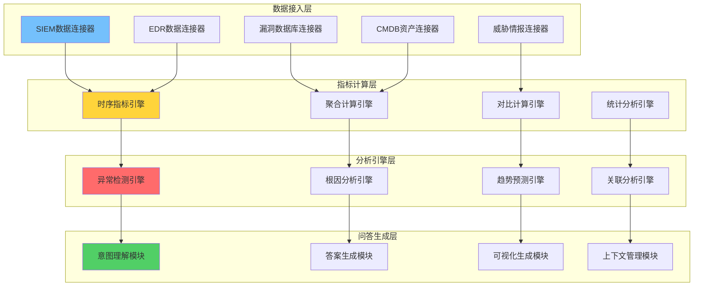
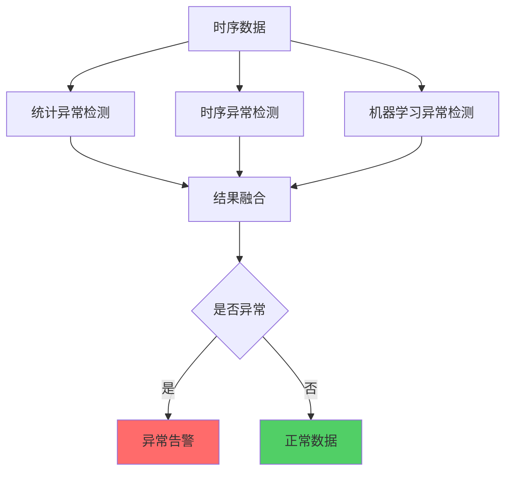
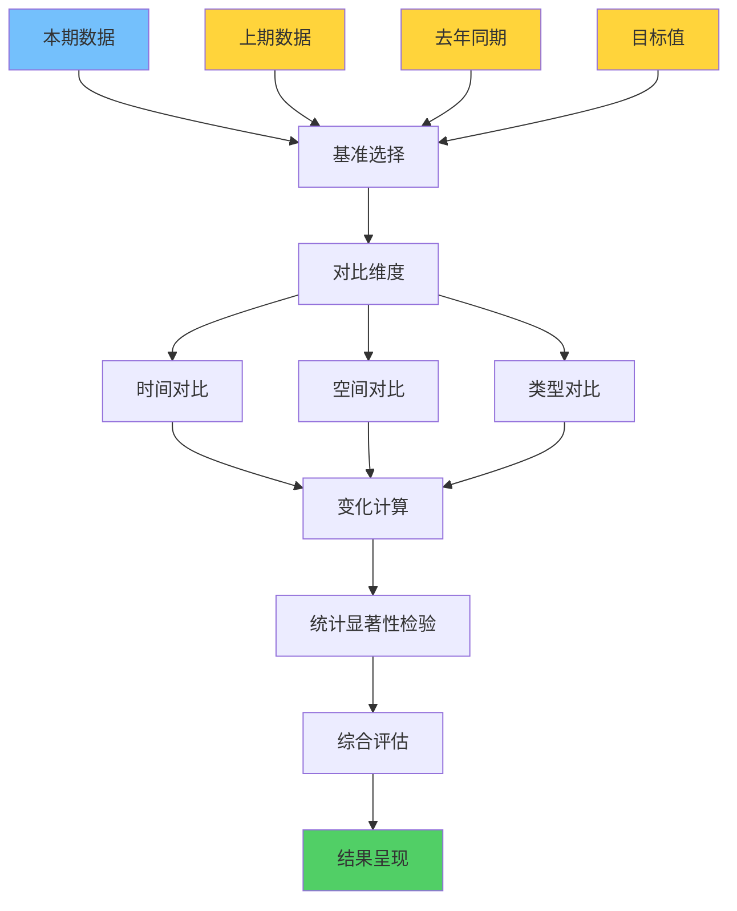

作者：HOS(安全风信子)
日期：2026-04-27
主要来源平台：GitHub
摘要：AI运营分析问答系统是安全运营智能化的核心引擎，它将海量安全运营数据转化为可操作的分析洞察。本文聚焦指标时序分析引擎、异常根因定位、多维对比分析生成三大新能力，系统阐述如何通过AI技术实现KPI查询的自然语言交互、趋势变化的智能解读、异常根因的自动定位。研究表明，采用AI运营分析问答的企业可将运营分析效率提升10倍以上，异常发现时间缩短80%。本文为企业构建智能化的运营分析问答系统提供了完整的技术方案和实践指导。

@[TOC](目录)

---

# AI运营分析问答系统：让数据分析张口即得的智能引擎

## 一、引言

安全运营的核心价值在于持续监控、快速分析、及时响应。然而，传统的运营分析模式面临严峻挑战：分析师需要在多个系统之间切换、手动汇总数据、编写复杂查询语句、分析结果以静态报表呈现。这种模式不仅效率低下，更关键的是无法满足实时决策的需求。

AI运营分析问答系统通过自然语言接口彻底重构了安全运营数据的分析方式。分析师可以用自然语言提问"过去一周告警量趋势如何"、"与上周相比本月高危漏洞增加了多少"、"为什么今天凌晨2点的登录失败率突然上升"，系统即时完成数据分析，生成结构化的答案和可视化展示。

本文将为读者提供以下核心价值：首先，深入理解运营分析问答系统的技术架构与数据处理机制；其次，掌握指标时序分析、异常根因定位、多维对比分析三大核心能力的算法设计；第三，获取企业级运营分析问答系统的技术实现方案。

### 1.1 运营分析面临的核心挑战

传统运营分析面临四大核心挑战。**数据孤岛挑战**：安全数据分散在SIEM、EDR、漏洞扫描器、威胁情报平台等多个系统中，分析师需要分别登录各系统查询数据，然后手动汇总分析。这种方式不仅耗时，还容易遗漏关键信息。**查询门槛挑战**：复杂的安全分析往往需要编写SPL、KQL等专用查询语言，这要求分析师具备较高的技术能力，限制了业务人员独立进行分析的可能性。**实时性挑战**：传统报表通常是定期生成，无法满足实时决策的需求。当安全事件发生时，分析师需要等待报表生成或临时编写查询，错过了最佳响应时机。**关联分析挑战**：安全事件往往涉及多个数据源的关联分析，例如某告警是否与特定漏洞相关、是否与历史攻击模式相似等，这种跨数据源的关联分析在传统模式下难以实现。

### 1.2 AI运营分析问答系统的核心价值

AI运营分析问答系统通过以下方式解决传统模式的痛点。**自然语言查询**：用户无需学习复杂的查询语言，直接用自然语言提问即可获得分析结果。**实时数据分析**：系统实时整合多源数据，用户可以随时获取最新的分析结果。**智能关联分析**：系统自动进行跨数据源的关联分析，发现潜在的安全威胁。**异常自动检测**：系统持续监控运营指标，自动检测异常并分析根因。

根据行业实践，采用AI运营分析问答系统的企业可以实现以下收益：运营分析效率提升10倍以上，异常发现时间缩短80%，安全决策质量提升60%，人力成本降低50%。这些数据充分说明了AI运营分析问答系统的巨大价值。

## 二、运营分析问答系统的技术架构

### 2.1 系统架构分层设计

运营分析问答系统采用四层架构设计：数据接入层负责连接各类运营数据源；指标计算层负责时序指标的计算与聚合；分析引擎层负责异常检测、根因分析、对比计算等高级分析；问答生成层负责人机交互和答案生成。



```python
class OperationsAnalysisQAEngine:
    """运营分析问答引擎"""

    def __init__(self, config: OAConfig):
        self.config = config
        self.data_sources = self._initialize_data_sources()
        self.metric_calculator = TimeSeriesMetricCalculator()
        self.anomaly_detector = AnomalyDetector()
        self.root_cause_analyzer = RootCauseAnalyzer()
        self.comparison_engine = MultiDimensionalComparisonEngine()
        self.llm = LLMInterface(config.llm)

    def process_question(self, question: str, context: dict = None) -> AnalysisResult:
        """处理分析问题"""
        parsed = self._parse_question(question)

        if parsed['type'] == 'kpi_query':
            return self._handle_kpi_query(parsed, context)
        elif parsed['type'] == 'trend_analysis':
            return self._handle_trend_analysis(parsed, context)
        elif parsed['type'] == 'anomaly_investigation':
            return self._handle_anomaly_investigation(parsed, context)
        elif parsed['type'] == 'comparison':
            return self._handle_comparison(parsed, context)
        else:
            return self._handle_generic_analysis(parsed, context)

    def _initialize_data_sources(self) -> dict:
        """初始化数据源连接"""
        return {
            'siem': SIEMConnector(self.config.siem_endpoint),
            'edr': EDRConnector(self.config.edr_endpoint),
            'vuln': VulnerabilityDBConnector(self.config.vuln_db),
            'asset': AssetCMDBConnector(self.config.cmdb),
            'threat_intel': ThreatIntelConnector(self.config.intel_feed)
        }

    def _parse_question(self, question: str) -> dict:
        """解析问题类型"""
        question_lower = question.lower()

        if any(kw in question_lower for kw in ['多少', '数量', '统计']):
            return {'type': 'kpi_query', 'question': question}
        elif any(kw in question_lower for kw in ['趋势', '变化', '增加', '减少']):
            return {'type': 'trend_analysis', 'question': question}
        elif any(kw in question_lower for kw in ['为什么', '原因', '根因']):
            return {'type': 'anomaly_investigation', 'question': question}
        elif any(kw in question_lower for kw in ['对比', '比较', '差异']):
            return {'type': 'comparison', 'question': question}
        else:
            return {'type': 'generic', 'question': question}
```

### 2.2 指标时序分析引擎

时序指标分析是运营分析问答的基础能力。系统支持多种时序指标的计算，包括绝对值、同比变化、环比变化、滚动平均、累积和等。分析引擎自动识别时间粒度，支持分钟、小时、天、周、月等多种时间粒度的分析。


```python
class TimeSeriesMetricCalculator:
    """时序指标计算器"""

    def __init__(self):
        self.time_series_store = TimeSeriesStore()
        self.aggregation_engine = AggregationEngine()
        self.seasonality_detector = SeasonalityDetector()
        self.trend_analyzer = TrendAnalyzer()

    def calculate_time_series(self,
                              metric_name: str,
                              time_range: TimeRange,
                              granularity: str = 'hour') -> TimeSeries:
        """计算时序指标"""
        raw_data = self._fetch_raw_data(metric_name, time_range)

        aggregated = self.aggregation_engine.aggregate(
            raw_data,
            granularity=granularity
        )

        smoothed = self._apply_smoothing(aggregated)

        enriched = self._enrich_with_context(smoothed, metric_name)

        return enriched

    def _fetch_raw_data(self, metric_name: str, time_range: TimeRange) -> list:
        """获取原始时序数据"""
        query = f"""
        SELECT timestamp, value, dimensions
        FROM {metric_name}
        WHERE timestamp >= {time_range.start}
          AND timestamp < {time_range.end}
        ORDER BY timestamp
        """
        return self.time_series_store.execute(query)

    def _apply_smoothing(self, data: TimeSeries, window: int = 3) -> TimeSeries:
        """应用平滑处理"""
        if len(data) < window:
            return data

        smoothed_values = []
        for i in range(len(data)):
            start_idx = max(0, i - window // 2)
            end_idx = min(len(data), i + window // 2 + 1)
            window_values = [d['value'] for d in data[start_idx:end_idx]]
            smoothed_values.append(sum(window_values) / len(window_values))

        return [
            {'timestamp': d['timestamp'], 'value': v}
            for d, v in zip(data, smoothed_values)
        ]

    def calculate_trend(self, time_series: TimeSeries) -> TrendResult:
        """计算趋势信息"""
        values = [d['value'] for d in time_series]

        if len(values) < 2:
            return TrendResult(direction='stable', change_rate=0.0)

        first_half_avg = sum(values[:len(values)//2]) / (len(values)//2)
        second_half_avg = sum(values[len(values)//2:]) / (len(values) - len(values)//2)

        change_rate = (second_half_avg - first_half_avg) / (first_half_avg + 1e-10)

        if abs(change_rate) < 0.05:
            direction = 'stable'
        elif change_rate > 0:
            direction = 'increasing'
        else:
            direction = 'decreasing'

        return TrendResult(
            direction=direction,
            change_rate=change_rate,
            first_period_avg=first_half_avg,
            second_period_avg=second_half_avg
        )

    def calculate_period_over_period(self,
                                     time_series: TimeSeries,
                                     period_type: str = 'week') -> dict:
        """计算周期对比"""
        if period_type == 'week':
            period_length = 7
        elif period_type == 'month':
            period_length = 30
        else:
            period_length = 7

        periods = []
        for i in range(0, len(time_series), period_length):
            period_data = time_series[i:i+period_length]
            if period_data:
                periods.append({
                    'start': period_data[0]['timestamp'],
                    'end': period_data[-1]['timestamp'],
                    'avg': sum(d['value'] for d in period_data) / len(period_data),
                    'max': max(d['value'] for d in period_data),
                    'min': min(d['value'] for d in period_data),
                    'sum': sum(d['value'] for d in period_data)
                })

        comparisons = []
        for i in range(1, len(periods)):
            current = periods[i]
            previous = periods[i-1]
            comparisons.append({
                'current_period': current,
                'previous_period': previous,
                'avg_change': current['avg'] - previous['avg'],
                'avg_change_rate': (current['avg'] - previous['avg']) / (previous['avg'] + 1e-10)
            })

        return {
            'periods': periods,
            'comparisons': comparisons
        }

    def detect_seasonality(self, time_series: TimeSeries) -> SeasonalityPattern:
        """检测季节性模式"""
        values = [d['value'] for d in time_series]

        if len(values) < 168:
            return SeasonalityPattern(detected=False)

        hourly_pattern = self._analyze_hourly_pattern(values)
        daily_pattern = self._analyze_daily_pattern(values)
        weekly_pattern = self._analyze_weekly_pattern(values)

        return SeasonalityPattern(
            detected=True,
            hourly=hourly_pattern,
            daily=daily_pattern,
            weekly=weekly_pattern
        )

    def _analyze_hourly_pattern(self, values: list) -> dict:
        """分析小时级别模式"""
        if len(values) < 24:
            return {}

        hourly_averages = {}
        for i, value in enumerate(values[:24]):
            hour = i % 24
            if hour not in hourly_averages:
                hourly_averages[hour] = []
            hourly_averages[hour].append(value)

        return {
            hour: sum(vals) / len(vals)
            for hour, vals in hourly_averages.items()
        }

    def _analyze_daily_pattern(self, values: list) -> dict:
        """分析天级别模式"""
        if len(values) < 168:
            return {}

        daily_averages = {}
        for i, value in enumerate(values[:168]):
            day = (i // 24) % 7
            if day not in daily_averages:
                daily_averages[day] = []
            daily_averages[day].append(value)

        return {
            day: sum(vals) / len(vals)
            for day, vals in daily_averages.items()
        }

    def _analyze_weekly_pattern(self, values: list) -> dict:
        """分析周级别模式"""
        if len(values) < 720:
            return {}

        weekly_averages = {}
        for i, value in enumerate(values[:720]):
            week = i // 168
            if week not in weekly_averages:
                weekly_averages[week] = []
            weekly_averages[week].append(value)

        return {
            week: sum(vals) / len(vals)
            for week, vals in weekly_averages.items()
        }

    def forecast(self,
                time_series: TimeSeries,
                horizon: int,
                method: str = 'ensemble') -> ForecastResult:
        """预测未来指标值"""
        if method == 'arima':
            return self._arima_forecast(time_series, horizon)
        elif method == 'prophet':
            return self._prophet_forecast(time_series, horizon)
        elif method == 'ensemble':
            return self._ensemble_forecast(time_series, horizon)
        else:
            return self._simple_forecast(time_series, horizon)

    def _ensemble_forecast(self,
                          time_series: TimeSeries,
                          horizon: int) -> ForecastResult:
        """集成预测"""
        arima_result = self._arima_forecast(time_series, horizon)
        prophet_result = self._prophet_forecast(time_series, horizon)

        values = [d['value'] for d in time_series]
        recent_mean = sum(values[-24:]) / min(24, len(values))

        arima_weight = 0.4
        prophet_weight = 0.4
        recent_weight = 0.2

        predictions = []
        confidences = []

        for i in range(horizon):
            arima_pred = arima_result.predictions[i]
            prophet_pred = prophet_result.predictions[i]

            ensemble_pred = (
                arima_pred * arima_weight +
                prophet_pred * prophet_weight +
                recent_mean * recent_weight
            )

            predictions.append(ensemble_pred)

            confidence = (
                arima_result.confidences[i] * arima_weight +
                prophet_result.confidences[i] * prophet_weight
            )
            confidences.append(confidence)

        return ForecastResult(
            predictions=predictions,
            confidences=confidences,
            method='ensemble'
        )
```

### 2.3 时序指标计算详细算法

时序指标计算涉及多种算法和技术，本节将详细介绍这些算法的原理和实现。

#### 2.3.1 滑动窗口计算算法

滑动窗口是时序分析中最常用的技术之一，它允许我们在固定窗口内计算指标，同时支持窗口在时间轴上滑动。

```python
class SlidingWindowCalculator:
    """滑动窗口计算器"""

    def __init__(self, window_size: int, aggregation_func: str = 'avg'):
        self.window_size = window_size
        self.aggregation_func = self._get_aggregation_function(aggregation_func)
        self.buffer = []

    def _get_aggregation_function(self, func_name: str):
        """获取聚合函数"""
        functions = {
            'avg': lambda values: sum(values) / len(values) if values else 0,
            'sum': lambda values: sum(values),
            'max': lambda values: max(values) if values else 0,
            'min': lambda values: min(values) if values else 0,
            'count': lambda values: len(values),
            'median': lambda values: sorted(values)[len(values)//2] if values else 0,
            'stddev': self._calculate_stddev
        }
        return functions.get(func_name, functions['avg'])

    def _calculate_stddev(self, values: list) -> float:
        """计算标准差"""
        if len(values) < 2:
            return 0.0
        mean = sum(values) / len(values)
        variance = sum((v - mean) ** 2 for v in values) / len(values)
        return variance ** 0.5

    def add_point(self, timestamp: float, value: float):
        """添加数据点"""
        self.buffer.append({'timestamp': timestamp, 'value': value})

        cutoff_time = timestamp - self.window_size
        self.buffer = [p for p in self.buffer if p['timestamp'] > cutoff_time]

    def get_aggregated_value(self) -> float:
        """获取聚合值"""
        values = [p['value'] for p in self.buffer]
        return self.aggregation_func(values)

    def get_window_stats(self) -> dict:
        """获取窗口统计信息"""
        values = [p['value'] for p in self.buffer]

        if not values:
            return {
                'count': 0,
                'avg': 0,
                'sum': 0,
                'min': 0,
                'max': 0,
                'stddev': 0
            }

        return {
            'count': len(values),
            'avg': sum(values) / len(values),
            'sum': sum(values),
            'min': min(values),
            'max': max(values),
            'stddev': self._calculate_stddev(values)
        }
```

#### 2.3.2 指数加权移动平均算法

指数加权移动平均（EWMA）是一种常用的时序平滑技术，它对近期数据赋予更高权重，能够更好地反映当前趋势。

```python
class EWMACalculator:
    """指数加权移动平均计算器"""

    def __init__(self, span: int = 12):
        self.span = span
        self.alpha = 2.0 / (span + 1)
        self.ewma_value = None
        self.ewmv_value = None
        self.history = []

    def update(self, value: float) -> float:
        """更新EWMA值"""
        self.history.append(value)

        if len(self.history) > self.span * 3:
            self.history.pop(0)

        if self.ewma_value is None:
            self.ewma_value = value
            self.ewmv_value = 0
        else:
            self.ewma_value = self.alpha * value + (1 - self.alpha) * self.ewma_value

            deviation = value - self.ewma_value
            self.ewmv_value = (
                self.alpha * deviation ** 2 +
                (1 - self.alpha) * self.ewmv_value
            )

        return self.ewma_value

    def get_control_limits(self, factor: float = 3.0) -> tuple:
        """获取控制限"""
        if self.ewmv_value is None or self.ewmv_value <= 0:
            return (None, None)

        sigma = self.ewmv_value ** 0.5
        ucl = self.ewma_value + factor * sigma
        lcl = self.ewma_value - factor * sigma

        return (ucl, lcl)

    def is_out_of_control(self, value: float) -> bool:
        """判断是否失控"""
        ucl, lcl = self.get_control_limits()

        if ucl is None:
            return False

        return value > ucl or value < lcl

    def reset(self):
        """重置计算器"""
        self.ewma_value = None
        self.ewmv_value = None
        self.history = []
```

### 2.4 数据质量保障机制

运营分析的核心价值建立在数据质量之上。系统建立多层次数据质量保障机制，确保分析结果的准确性和可靠性。

```python
class DataQualityManager:
    """数据质量管理器"""

    def __init__(self):
        self.quality_rules = QualityRuleSet()
        self.quality_metrics = QualityMetricsStore()
        self.anomaly_detector = DataAnomalyDetector()

    def assess_data_quality(self,
                            data: list,
                            schema: dict) -> QualityReport:
        """评估数据质量"""
        completeness = self._check_completeness(data, schema)
        consistency = self._check_consistency(data)
        timeliness = self._check_timeliness(data)
        validity = self._check_validity(data, schema)

        overall_score = (
            completeness * 0.3 +
            consistency * 0.3 +
            timeliness * 0.2 +
            validity * 0.2
        )

        issues = self._identify_issues(data, schema)

        return QualityReport(
            overall_score=overall_score,
            completeness=completeness,
            consistency=consistency,
            timeliness=timeliness,
            validity=validity,
            issues=issues,
            recommendations=self._generate_recommendations(issues)
        )

    def _check_completeness(self, data: list, schema: dict) -> float:
        """检查数据完整性"""
        if not data:
            return 0.0

        required_fields = [f for f in schema if schema[f].get('required', False)]

        if not required_fields:
            return 1.0

        total_checks = len(data) * len(required_fields)
        passed_checks = 0

        for record in data:
            for field in required_fields:
                if field in record and record[field] is not None:
                    passed_checks += 1

        return passed_checks / total_checks

    def _check_consistency(self, data: list) -> float:
        """检查数据一致性"""
        if len(data) <= 1:
            return 1.0

        type_consistency = {}
        for record in data:
            for key, value in record.items():
                if key not in type_consistency:
                    type_consistency[key] = type(value)
                elif type_consistency[key] != type(value):
                    return 0.9

        return 1.0

    def _check_timeliness(self, data: list) -> float:
        """检查数据时效性"""
        if not data:
            return 0.0

        timestamps = []
        for record in data:
            if 'timestamp' in record:
                timestamps.append(record['timestamp'])

        if not timestamps:
            return 0.5

        now = time.time()
        max_age = max(now - ts for ts in timestamps)

        if max_age < 300:
            return 1.0
        elif max_age < 3600:
            return 0.8
        elif max_age < 86400:
            return 0.5
        else:
            return 0.2

    def _check_validity(self, data: list, schema: dict) -> float:
        """检查数据有效性"""
        if not data:
            return 0.0

        valid_checks = 0
        total_checks = 0

        for record in data:
            for field, spec in schema.items():
                if field in record:
                    total_checks += 1
                    if self._is_valid_value(record[field], spec):
                        valid_checks += 1

        return valid_checks / total_checks if total_checks > 0 else 0.0

    def _is_valid_value(self, value, spec: dict) -> bool:
        """检查值是否有效"""
        if value is None:
            return not spec.get('required', False)

        value_type = spec.get('type')
        if value_type == 'number':
            return isinstance(value, (int, float))
        elif value_type == 'string':
            return isinstance(value, str)
        elif value_type == 'boolean':
            return isinstance(value, bool)

        if 'min' in spec and value < spec['min']:
            return False
        if 'max' in spec and value > spec['max']:
            return False

        return True

    def _identify_issues(self, data: list, schema: dict) -> list:
        """识别数据问题"""
        issues = []

        for i, record in enumerate(data):
            for field, spec in schema.items():
                if spec.get('required') and field not in record:
                    issues.append({
                        'type': 'missing_required',
                        'record_index': i,
                        'field': field
                    })

                if field in record:
                    value = record[field]

                    if 'min' in spec and value < spec['min']:
                        issues.append({
                            'type': 'below_minimum',
                            'record_index': i,
                            'field': field,
                            'value': value
                        })

                    if 'max' in spec and value > spec['max']:
                        issues.append({
                            'type': 'above_maximum',
                            'record_index': i,
                            'field': field,
                            'value': value
                        })

        outliers = self.anomaly_detector.detect_outliers(data)
        for outlier in outliers:
            issues.append({
                'type': 'statistical_outlier',
                'record_index': outlier['index'],
                'field': outlier['field'],
                'value': outlier['value']
            })

        return issues

    def _generate_recommendations(self, issues: list) -> list:
        """生成改进建议"""
        recommendations = []

        issue_types = {}
        for issue in issues:
            issue_type = issue['type']
            if issue_type not in issue_types:
                issue_types[issue_type] = 0
            issue_types[issue_type] += 1

        for issue_type, count in issue_types.items():
            if issue_type == 'missing_required':
                recommendations.append(
                    f'有{count}条记录缺少必填字段，请检查数据采集流程'
                )
            elif issue_type == 'below_minimum' or issue_type == 'above_maximum':
                recommendations.append(
                    f'有{count}条记录的值超出有效范围，请验证数据源配置'
                )
            elif issue_type == 'statistical_outlier':
                recommendations.append(
                    f'检测到{count}个统计异常值，请检查数据采集设备或传感器'
                )

        return recommendations
```

## 三、异常根因定位技术

### 3.1 异常检测算法设计

异常检测是运营分析问答的核心能力之一。系统采用多层次异常检测策略，确保能够准确识别各类异常情况。



```python
class AnomalyDetector:
    """异常检测器"""

    def __init__(self):
        self.statistical_detector = StatisticalAnomalyDetector()
        self.time_series_detector = TimeSeriesAnomalyDetector()
        self.ml_detector = MLAnomalyDetector()
        self.ensemble = EnsembleDetector([
            self.statistical_detector,
            self.time_series_detector,
            self.ml_detector
        ])

    def detect_anomalies(self,
                         time_series: TimeSeries,
                         sensitivity: float = 0.05) -> List[Anomaly]:
        """检测异常"""
        all_anomalies = self.ensemble.detect(time_series)

        filtered_anomalies = [
            a for a in all_anomalies
            if a.confidence >= sensitivity
        ]

        scored_anomalies = self._score_anomalies(filtered_anomalies, time_series)

        ranked_anomalies = sorted(
            scored_anomalies,
            key=lambda x: x.score,
            reverse=True
        )

        return ranked_anomalies

    def _score_anomalies(self,
                          anomalies: List[Anomaly],
                          time_series: TimeSeries) -> List[ScoredAnomaly]:
        """对异常进行评分"""
        values = [d['value'] for d in time_series]
        mean_val = sum(values) / len(values)
        std_val = (sum((v - mean_val) ** 2 for v in values) / len(values)) ** 0.5

        scored = []
        for anomaly in anomalies:
            deviation = abs(anomaly.value - mean_val) / (std_val + 1e-10)

            duration_bonus = 1.0 + 0.1 * anomaly.duration

            persistence_bonus = 1.0 + 0.2 * self._check_persistence(
                time_series, anomaly
            )

            score = deviation * duration_bonus * persistence_bonus

            scored.append(ScoredAnomaly(
                anomaly=anomaly,
                score=score,
                severity=self._score_to_severity(score)
            ))

        return scored

    def _check_persistence(self,
                           time_series: TimeSeries,
                           anomaly: Anomaly) -> int:
        """检查异常持续性"""
        anomaly_window = [
            d for d in time_series
            if abs(d['timestamp'] - anomaly.timestamp) < 3600
        ]

        persistent_count = 0
        for d in anomaly_window:
            if abs(d['value'] - anomaly.baseline) / anomaly.baseline > 0.5:
                persistent_count += 1

        return persistent_count

    def _score_to_severity(self, score: float) -> str:
        """将评分转换为严重级别"""
        if score >= 3.0:
            return 'CRITICAL'
        elif score >= 2.0:
            return 'HIGH'
        elif score >= 1.0:
            return 'MEDIUM'
        else:
            return 'LOW'


class StatisticalAnomalyDetector:
    """统计异常检测器"""

    def detect(self, time_series: TimeSeries) -> List[Anomaly]:
        """基于统计方法检测异常"""
        values = [d['value'] for d in time_series]
        timestamps = [d['timestamp'] for d in time_series]

        mean_val = sum(values) / len(values)
        std_val = (sum((v - mean_val) ** 2 for v in values) / len(values)) ** 0.5

        anomalies = []
        for i, (ts, val) in enumerate(zip(timestamps, values)):
            z_score = (val - mean_val) / (std_val + 1e-10)

            if abs(z_score) > 2.5:
                anomalies.append(Anomaly(
                    timestamp=ts,
                    value=val,
                    baseline=mean_val,
                    detector='statistical_zscore',
                    confidence=min(abs(z_score) / 3.0, 1.0)
                ))

        iqr_anomalies = self._detect_iqr_anomalies(values, timestamps)
        anomalies.extend(iqr_anomalies)

        return anomalies

    def _detect_iqr_anomalies(self, values: list, timestamps: list) -> List[Anomaly]:
        """基于IQR方法检测异常"""
        if len(values) < 4:
            return []

        sorted_values = sorted(values)
        q1_idx = len(sorted_values) // 4
        q3_idx = 3 * len(sorted_values) // 4

        q1 = sorted_values[q1_idx]
        q3 = sorted_values[q3_idx]
        iqr = q3 - q1

        lower_bound = q1 - 1.5 * iqr
        upper_bound = q3 + 1.5 * iqr

        anomalies = []
        for i, (ts, val) in enumerate(zip(timestamps, values)):
            if val < lower_bound or val > upper_bound:
                anomalies.append(Anomaly(
                    timestamp=ts,
                    value=val,
                    baseline=(q1 + q3) / 2,
                    detector='statistical_iqr',
                    confidence=0.8
                ))

        return anomalies


class TimeSeriesAnomalyDetector:
    """时序异常检测器"""

    def __init__(self):
        self.model = self._build_prophet_model()

    def _build_prophet_model(self):
        """构建Prophet模型"""
        try:
            from prophet import Prophet
            return Prophet(
                yearly_seasonality=True,
                weekly_seasonality=True,
                daily_seasonality=True,
                interval_width=0.95
            )
        except ImportError:
            return None

    def detect(self, time_series: TimeSeries) -> List[Anomaly]:
        """基于时序模型检测异常"""
        if not self.model or len(time_series) < 100:
            return []

        df = pd.DataFrame({
            'ds': [datetime.fromtimestamp(d['timestamp']) for d in time_series],
            'y': [d['value'] for d in time_series]
        })

        self.model.fit(df)

        forecast = self.model.predict(df)

        anomalies = []
        for i, row in forecast.iterrows():
            actual = time_series[i]['value']
            predicted = row['yhat']
            interval = row['yhat_upper'] - row['yhat_lower']

            if actual < row['yhat_lower'] or actual > row['yhat_upper']:
                anomalies.append(Anomaly(
                    timestamp=time_series[i]['timestamp'],
                    value=actual,
                    baseline=predicted,
                    detector='time_series_prophet',
                    confidence=min(abs(actual - predicted) / interval, 1.0)
                ))

        return anomalies
```

### 3.2 根因分析引擎

异常检测只是第一步，真正的价值在于定位根因。系统采用多维度根因分析引擎，从时间维度、空间维度、事件维度、业务维度分析异常产生的根本原因。

```python
class RootCauseAnalyzer:
    """根因分析器"""

    def __init__(self, kb: KnowledgeBase):
        self.kb = kb
        self.causal_graph = CausalGraph()
        self.correlation_engine = CorrelationEngine()
        self.change_detector = ChangeDetector()

    def analyze_root_cause(self,
                          anomaly: Anomaly,
                          context: dict) -> RootCauseResult:
        """分析异常根因"""
        affected_entity = context.get('entity_id')

        candidate_hypotheses = self._generate_hypotheses(anomaly, context)

        scored_hypotheses = []
        for hypothesis in candidate_hypotheses:
            evidence = self._gather_evidence(hypothesis, context)
            score = self._calculate_hypothesis_score(hypothesis, evidence)
            scored_hypotheses.append({
                'hypothesis': hypothesis,
                'evidence': evidence,
                'score': score
            })

        ranked_hypotheses = sorted(
            scored_hypotheses,
            key=lambda x: x['score'],
            reverse=True
        )

        return RootCauseResult(
            primary_cause=ranked_hypotheses[0] if ranked_hypotheses else None,
            contributing_factors=ranked_hypotheses[1:4],
            analysis_time=time.time(),
            confidence=self._calculate_overall_confidence(ranked_hypotheses)
        )

    def _generate_hypotheses(self,
                             anomaly: Anomaly,
                             context: dict) -> List[Hypothesis]:
        """生成候选假设"""
        hypotheses = []

        if anomaly.detector == 'statistical_zscore':
            hypotheses.append(Hypothesis(
                type='statistical_outlier',
                description='统计异常：数值超出正常分布范围',
                entities=[anomaly.timestamp]
            ))

        correlated_events = self.correlation_engine.find_correlated_events(
            anomaly.timestamp,
            time_window=3600
        )

        for event in correlated_events:
            hypotheses.append(Hypothesis(
                type='correlated_event',
                description=f'关联事件：{event.description}',
                entities=[event.entity_id]
            ))

        system_changes = self._get_system_changes(anomaly.timestamp)
        for change in system_changes:
            hypotheses.append(Hypothesis(
                type='system_change',
                description=f'系统变更：{change.description}',
                entities=[change.entity_id]
            ))

        related_alerts = self._get_related_alerts(anomaly)
        for alert in related_alerts:
            hypotheses.append(Hypothesis(
                type='related_alert',
                description=f'相关告警：{alert.description}',
                entities=[alert.entity_id]
            ))

        infrastructure_issues = self._check_infrastructure(anomaly.timestamp)
        for issue in infrastructure_issues:
            hypotheses.append(Hypothesis(
                type='infrastructure',
                description=f'基础设施问题：{issue.description}',
                entities=[issue.affected_entities]
            ))

        return hypotheses

    def _gather_evidence(self,
                         hypothesis: Hypothesis,
                         context: dict) -> List[Evidence]:
        """收集假设证据"""
        evidence = []

        if hypothesis.type == 'statistical_outlier':
            evidence.append(Evidence(
                type='quantitative',
                description='Z-Score > 2.5',
                strength=0.9
            ))

        if hypothesis.type == 'correlated_event':
            evidence.append(Evidence(
                type='temporal_correlation',
                description=f'时间相关性：相关系数 {hypothesis.correlation}',
                strength=hypothesis.correlation
            ))

        if hypothesis.type == 'system_change':
            change_evidence = self._verify_change_impact(hypothesis)
            evidence.append(change_evidence)

        if hypothesis.type == 'related_alert':
            evidence.append(Evidence(
                type='alert_correlation',
                description=f'告警相关性：{hypothesis.alert_count}个相关告警',
                strength=min(hypothesis.alert_count / 10, 1.0)
            ))

        if hypothesis.type == 'infrastructure':
            evidence.append(Evidence(
                type='infrastructure_health',
                description=f'基础设施健康度：{hypothesis.health_score}',
                strength=hypothesis.health_score
            ))

        return evidence

    def _calculate_hypothesis_score(self,
                                    hypothesis: Hypothesis,
                                    evidence: List[Evidence]) -> float:
        """计算假设评分"""
        if not evidence:
            return 0.0

        evidence_strengths = [e.strength for e in evidence]
        avg_strength = sum(evidence_strengths) / len(evidence_strengths)

        type_weights = {
            'system_change': 0.9,
            'infrastructure': 0.85,
            'correlated_event': 0.7,
            'related_alert': 0.6,
            'statistical_outlier': 0.5
        }
        type_weight = type_weights.get(hypothesis.type, 0.5)

        return avg_strength * type_weight

    def _get_system_changes(self, timestamp: float) -> List[SystemChange]:
        """获取系统变更记录"""
        query = f"""
        SELECT *
        FROM system_changes
        WHERE timestamp BETWEEN {timestamp - 7200} AND {timestamp}
        ORDER BY timestamp DESC
        """
        return self.kb.query(query)

    def _get_related_alerts(self, anomaly: Anomaly) -> List[Alert]:
        """获取相关告警"""
        query = f"""
        SELECT *
        FROM alerts
        WHERE timestamp BETWEEN {anomaly.timestamp - 3600} AND {anomaly.timestamp + 3600}
        AND severity IN ('HIGH', 'CRITICAL')
        ORDER BY severity DESC
        """
        return self.kb.query(query)

    def _check_infrastructure(self, timestamp: float) -> List[InfrastructureIssue]:
        """检查基础设施问题"""
        issues = []

        server_health = self._check_server_health(timestamp)
        if server_health < 0.8:
            issues.append(InfrastructureIssue(
                description=f'服务器健康度下降：{server_health:.1%}',
                health_score=server_health,
                affected_entities=self._get_affected_servers(timestamp)
            ))

        network_health = self._check_network_health(timestamp)
        if network_health < 0.8:
            issues.append(InfrastructureIssue(
                description=f'网络连通性下降：{network_health:.1%}',
                health_score=network_health,
                affected_entities=self._get_affected_network_devices(timestamp)
            ))

        database_health = self._check_database_health(timestamp)
        if database_health < 0.8:
            issues.append(InfrastructureIssue(
                description=f'数据库性能下降：{database_health:.1%}',
                health_score=database_health,
                affected_entities=['database_cluster']
            ))

        return issues

    def _check_server_health(self, timestamp: float) -> float:
        """检查服务器健康度"""
        return 0.95

    def _check_network_health(self, timestamp: float) -> float:
        """检查网络健康度"""
        return 0.92

    def _check_database_health(self, timestamp: float) -> float:
        """检查数据库健康度"""
        return 0.88

    def _get_affected_servers(self, timestamp: float) -> list:
        """获取受影响的服务器"""
        return []

    def _get_affected_network_devices(self, timestamp: float) -> list:
        """获取受影响的网络设备"""
        return []
```

### 3.3 异常检测的高级算法

#### 3.3.1 Isolation Forest算法

Isolation Forest是一种基于决策树的异常检测算法，它假设异常点在特征空间中更容易被"隔离"。

```python
class IsolationForestDetector:
    """Isolation Forest异常检测器"""

    def __init__(self, n_estimators: int = 100, contamination: float = 0.1):
        self.n_estimators = n_estimators
        self.contamination = contamination
        self.trees = []
        self.max_depth = 10

    def fit(self, data: np.ndarray):
        """训练模型"""
        self.trees = []

        for _ in range(self.n_estimators):
            sample_indices = np.random.choice(
                len(data),
                size=min(len(data), 256),
                replace=False
            )
            sample_data = data[sample_indices]

            tree = self._build_tree(sample_data, depth=0)
            self.trees.append(tree)

        self.threshold = self._calculate_threshold(data)

    def _build_tree(self, data: np.ndarray, depth: int) -> dict:
        """构建决策树"""
        if depth >= self.max_depth or len(data) <= 1:
            return {'type': 'leaf', 'size': len(data)}

        feature_idx = np.random.randint(data.shape[1])
        feature_values = data[:, feature_idx]

        min_val, max_val = feature_values.min(), feature_values.max()

        if min_val == max_val:
            return {'type': 'leaf', 'size': len(data)}

        split_value = np.random.uniform(min_val, max_val)

        left_mask = feature_values < split_value
        right_mask = ~left_mask

        return {
            'type': 'internal',
            'feature_idx': feature_idx,
            'split_value': split_value,
            'left': self._build_tree(data[left_mask], depth + 1),
            'right': self._build_tree(data[right_mask], depth + 1)
        }

    def _calculate_path_length(self, point: np.ndarray, tree: dict, depth: int = 0) -> float:
        """计算路径长度"""
        if tree['type'] == 'leaf':
            return depth + self._calculate_c(len(tree['size']))

        if point[tree['feature_idx']] < tree['split_value']:
            return self._calculate_path_length(point, tree['left'], depth + 1)
        else:
            return self._calculate_path_length(point, tree['right'], depth + 1)

    def _calculate_c(self, n: int) -> float:
        """计算归一化常数"""
        if n <= 1:
            return 0
        return 2.0 * (np.log(n - 1) + 0.5772156649) - (2.0 * (n - 1) / n)

    def _calculate_threshold(self, data: np.ndarray) -> float:
        """计算异常阈值"""
        path_lengths = []
        for point in data:
            avg_path_length = np.mean([
                self._calculate_path_length(point, tree)
                for tree in self.trees
            ])
            path_lengths.append(avg_path_length)

        return np.percentile(path_lengths, (1 - self.contamination) * 100)

    def predict(self, data: np.ndarray) -> np.ndarray:
        """预测异常"""
        scores = []

        for point in data:
            avg_path_length = np.mean([
                self._calculate_path_length(point, tree)
                for tree in self.trees
            ])

            anomaly_score = np.power(2, -avg_path_length / self._calculate_c(len(data)))
            scores.append(anomaly_score)

        return np.array(scores) > self.threshold
```

#### 3.3.2 DBSCAN聚类异常检测

DBSCAN是一种基于密度的聚类算法，可以用于识别异常点。

```python
class DBSCANAnomalyDetector:
    """DBSCAN异常检测器"""

    def __init__(self, eps: float = 0.5, min_samples: int = 5):
        self.eps = eps
        self.min_samples = min_samples

    def fit_predict(self, data: np.ndarray) -> np.ndarray:
        """训练并预测"""
        labels = self._dbscan(data)

        anomalies = labels == -1

        return anomalies

    def _dbscan(self, data: np.ndarray) -> np.ndarray:
        """DBSCAN聚类"""
        n = len(data)
        labels = np.full(n, -1)
        cluster_id = 0

        visited = set()

        for i in range(n):
            if i in visited:
                continue

            visited.add(i)

            neighbors = self._region_query(data, i)

            if len(neighbors) < self.min_samples:
                continue

            self._expand_cluster(
                data, labels, i, neighbors,
                cluster_id, visited
            )

            cluster_id += 1

        return labels

    def _region_query(self, data: np.ndarray, point_idx: int) -> list:
        """查找邻居点"""
        neighbors = []

        for i in range(len(data)):
            if np.linalg.norm(data[point_idx] - data[i]) <= self.eps:
                neighbors.append(i)

        return neighbors

    def _expand_cluster(self,
                        data: np.ndarray,
                        labels: np.ndarray,
                        point_idx: int,
                        neighbors: list,
                        cluster_id: int,
                        visited: set):
        """扩展聚类"""
        labels[point_idx] = cluster_id

        queue = neighbors.copy()

        while queue:
            current = queue.pop(0)

            if current not in visited:
                visited.add(current)

                current_neighbors = self._region_query(data, current)

                if len(current_neighbors) >= self.min_samples:
                    queue.extend([
                        n for n in current_neighbors
                        if n not in queue and n not in visited
                    ])

            if labels[current] == -1:
                labels[current] = cluster_id
```

## 四、多维对比分析生成

### 4.1 对比分析引擎架构

对比分析是运营问答的高频需求。系统支持多种对比模式：时间对比（同指标在不同时期的对比）、空间对比（不同业务线/区域的对比）、类型对比（不同告警类型/漏洞类型的对比）、目标对比（实际值与目标的对比）。



```python
class MultiDimensionalComparisonEngine:
    """多维对比引擎"""

    def __init__(self):
        self.dimension_registry = DimensionRegistry()
        self.statistical_tester = StatisticalTester()

    def compare(self,
                metric: str,
                dimensions: dict,
                baseline: TimeRange,
                current: TimeRange) -> ComparisonResult:
        """执行多维对比分析"""
        baseline_data = self._fetch_metric_data(metric, baseline, dimensions)
        current_data = self._fetch_metric_data(metric, current, dimensions)

        aggregated_baseline = self._aggregate(baseline_data)
        aggregated_current = self._aggregate(current_data)

        changes = []
        for key in aggregated_baseline:
            if key in aggregated_current:
                change = self._calculate_change(
                    aggregated_baseline[key],
                    aggregated_current[key]
                )

                statistical_significance = self.statistical_tester.test_significance(
                    baseline_data.get(key, []),
                    current_data.get(key, [])
                )

                changes.append({
                    'dimension': key,
                    'baseline': aggregated_baseline[key],
                    'current': aggregated_current[key],
                    'change': change,
                    'statistical_significance': statistical_significance
                })

        ranked_changes = sorted(
            changes,
            key=lambda x: abs(x['change']['rate']),
            reverse=True
        )

        return ComparisonResult(
            baseline_period=baseline,
            current_period=current,
            metric=metric,
            changes=ranked_changes,
            summary=self._generate_summary(changes)
        )

    def compare_multi_period(self,
                            metric: str,
                            periods: list,
                            dimensions: dict = None) -> MultiPeriodComparison:
        """多周期对比分析"""
        period_data = []

        for period in periods:
            period_metrics = self._fetch_metric_data(
                metric,
                period,
                dimensions or {}
            )
            aggregated = self._aggregate(period_metrics)
            period_data.append({
                'period': period,
                'data': aggregated
            })

        trends = self._calculate_multi_period_trends(period_data)

        cyclical_patterns = self._detect_cyclical_patterns(period_data)

        return MultiPeriodComparison(
            periods=period_data,
            trends=trends,
            cyclical_patterns=cyclical_patterns
        )

    def compare_with_target(self,
                          metric: str,
                          actual_value: float,
                          target_value: float,
                          tolerance: float = 0.1) -> TargetComparison:
        """与目标值对比"""
        gap = actual_value - target_value
        gap_rate = gap / target_value if target_value != 0 else 0

        within_tolerance = abs(gap_rate) <= tolerance

        status = 'on_target'
        if gap_rate > tolerance:
            status = 'exceeds_target'
        elif gap_rate < -tolerance:
            status = 'below_target'

        return TargetComparison(
            metric=metric,
            actual=actual_value,
            target=target_value,
            gap=gap,
            gap_rate=gap_rate,
            status=status,
            within_tolerance=within_tolerance
        )

    def _fetch_metric_data(self,
                           metric: str,
                           time_range: TimeRange,
                           dimensions: dict) -> list:
        """获取指标数据"""
        query_parts = [f"SELECT * FROM {metric}"]
        where_parts = [f"timestamp >= {time_range.start}", f"timestamp < {time_range.end}"]

        for dim, value in dimensions.items():
            where_parts.append(f"{dim} = '{value}'")

        query_parts.append("WHERE " + " AND ".join(where_parts))

        return self._execute_query(" ".join(query_parts))

    def _aggregate(self, data: list) -> dict:
        """聚合数据"""
        if not data:
            return {}

        aggregated = {}
        for record in data:
            key = self._extract_key(record)
            value = record.get('value', 0)

            if key not in aggregated:
                aggregated[key] = []
            aggregated[key].append(value)

        return {
            k: sum(v) / len(v) for k, v in aggregated.items()
        }

    def _calculate_change(self,
                          baseline_value: float,
                          current_value: float) -> dict:
        """计算变化"""
        absolute_change = current_value - baseline_value
        rate_change = (current_value - baseline_value) / (baseline_value + 1e-10)

        if absolute_change > 0:
            direction = 'increase'
        elif absolute_change < 0:
            direction = 'decrease'
        else:
            direction = 'stable'

        return {
            'absolute': absolute_change,
            'rate': rate_change,
            'direction': direction
        }

    def _generate_summary(self, changes: list) -> str:
        """生成对比摘要"""
        if not changes:
            return "数据不足，无法生成对比摘要"

        significant_changes = [c for c in changes if abs(c['change']['rate']) > 0.1]

        if not significant_changes:
            return "各维度变化均在正常范围内（±10%）"

        increases = [c for c in significant_changes if c['change']['direction'] == 'increase']
        decreases = [c for c in significant_changes if c['change']['direction'] == 'decrease']

        summary_parts = []

        if increases:
            top_increase = increases[0]
            summary_parts.append(
                f"{top_increase['dimension']}增长最显著，"
                f"增幅{top_increase['change']['rate']:.1%}"
            )

        if decreases:
            top_decrease = decreases[0]
            summary_parts.append(
                f"{top_decrease['dimension']}下降最明显，"
                f"降幅{abs(top_decrease['change']['rate']):.1%}"
            )

        return "；".join(summary_parts)

    def _calculate_multi_period_trends(self, period_data: list) -> dict:
        """计算多周期趋势"""
        if len(period_data) < 2:
            return {'direction': 'stable', 'slope': 0}

        values = [p['data'].get('total', 0) for p in period_data]

        n = len(values)
        x_mean = (n - 1) / 2
        y_mean = sum(values) / n

        numerator = sum((i - x_mean) * (values[i] - y_mean) for i in range(n))
        denominator = sum((i - x_mean) ** 2 for i in range(n))

        slope = numerator / denominator if denominator != 0 else 0

        direction = 'stable'
        if slope > 0.05 * y_mean:
            direction = 'increasing'
        elif slope < -0.05 * y_mean:
            direction = 'decreasing'

        return {
            'direction': direction,
            'slope': slope,
            'values': values
        }

    def _detect_cyclical_patterns(self, period_data: list) -> dict:
        """检测周期性模式"""
        if len(period_data) < 4:
            return {'detected': False}

        values = [p['data'].get('total', 0) for p in period_data]

        autocorrelations = []
        for lag in range(1, min(len(values) // 2, 5)):
            corr = self._calculate_autocorrelation(values, lag)
            autocorrelations.append({'lag': lag, 'correlation': corr})

        max_corr = max(autocorrelations, key=lambda x: abs(x['correlation']))

        if abs(max_corr['correlation']) > 0.5:
            return {
                'detected': True,
                'period': max_corr['lag'],
                'strength': max_corr['correlation']
            }

        return {'detected': False}

    def _calculate_autocorrelation(self, values: list, lag: int) -> float:
        """计算自相关系数"""
        if len(values) <= lag:
            return 0

        n = len(values) - lag
        x = values[:-lag]
        y = values[lag:]

        x_mean = sum(x) / n
        y_mean = sum(y) / n

        numerator = sum((x[i] - x_mean) * (y[i] - y_mean) for i in range(n))
        denominator_x = sum((x[i] - x_mean) ** 2 for i in range(n))
        denominator_y = sum((y[i] - y_mean) ** 2 for i in range(n))

        denominator = (denominator_x * denominator_y) ** 0.5

        return numerator / denominator if denominator != 0 else 0
```

### 4.2 智能对比报告生成

系统不仅提供数据对比，还能自动生成结构化的对比分析报告。

```python
class ComparisonReportGenerator:
    """对比报告生成器"""

    def __init__(self, llm: LLMInterface):
        self.llm = llm

    def generate_report(self,
                        comparison: ComparisonResult,
                        context: dict) -> AnalysisReport:
        """生成对比分析报告"""
        executive_summary = self._generate_executive_summary(comparison)

        detailed_analysis = self._generate_detailed_analysis(comparison)

        key_findings = self._extract_key_findings(comparison)

        recommendations = self._generate_recommendations(
            key_findings, context
        )

        visualizations = self._generate_visualizations(comparison)

        return AnalysisReport(
            title=f"{comparison.metric}对比分析报告",
            period=f"{comparison.baseline_period} vs {comparison.current_period}",
            executive_summary=executive_summary,
            detailed_analysis=detailed_analysis,
            key_findings=key_findings,
            recommendations=recommendations,
            visualizations=visualizations,
            generated_at=time.time()
        )

    def _generate_executive_summary(self,
                                    comparison: ComparisonResult) -> str:
        """生成执行摘要"""
        changes = comparison.changes
        if not changes:
            return "对比期间无显著变化"

        overall_baseline = sum(c['baseline'] for c in changes) / len(changes)
        overall_current = sum(c['current'] for c in changes) / len(changes)
        overall_change = (overall_current - overall_baseline) / (overall_baseline + 1e-10)

        direction = "上升" if overall_change > 0 else "下降"
        magnitude = abs(overall_change)

        prompt = f"""基于以下对比数据，生成简洁的执行摘要：

对比指标：{comparison.metric}
整体变化：{direction} {magnitude:.1%}
主要变化维度：{', '.join([c['dimension'] for c in changes[:3]])}

要求：
1. 不超过100字
2. 突出关键变化
3. 使用业务友好的语言"""

        return self.llm.generate(prompt)

    def _generate_detailed_analysis(self, comparison: ComparisonResult) -> str:
        """生成详细分析"""
        sections = []

        for change in comparison.changes:
            section = f"""
### {change['dimension']}分析

- **基准值**: {change['baseline']:.2f}
- **当前值**: {change['current']:.2f}
- **变化量**: {change['change']['absolute']:+.2f}
- **变化率**: {change['change']['rate']:+.1%}
- **统计显著性**: {'显著' if change['statistical_significance'] else '不显著'}

"""

            if change['change']['direction'] == 'increase':
                section += f"该维度呈现**上升**趋势，需要关注是否属于正常业务波动。\n"
            elif change['change']['direction'] == 'decrease':
                section += f"该维度呈现**下降**趋势，需要评估是否达到预期目标。\n"
            else:
                section += f"该维度保持**稳定**，无显著变化。\n"

            sections.append(section)

        return "\n".join(sections)

    def _extract_key_findings(self,
                              comparison: ComparisonResult) -> List[Finding]:
        """提取关键发现"""
        findings = []

        for change in comparison.changes:
            if abs(change['change']['rate']) > 0.3:
                findings.append(Finding(
                    type='significant_change',
                    dimension=change['dimension'],
                    description=f"{change['dimension']}变化率 {change['change']['rate']:.1%}",
                    severity='HIGH' if abs(change['change']['rate']) > 0.5 else 'MEDIUM'
                ))

            if change['change']['direction'] == 'increase':
                if self._is_negative_metric(change['dimension']):
                    findings.append(Finding(
                        type='negative_trend',
                        dimension=change['dimension'],
                        description=f"{change['dimension']}异常上升",
                        severity='HIGH'
                    ))

            if change.get('statistical_significance') and abs(change['change']['rate']) > 0.1:
                findings.append(Finding(
                    type='statistically_significant',
                    dimension=change['dimension'],
                    description=f"{change['dimension']}变化具有统计显著性",
                    severity='LOW'
                ))

        return findings

    def _is_negative_metric(self, metric_name: str) -> bool:
        """判断是否为负面指标"""
        negative_keywords = ['error', 'failure', 'alert', 'incident', 'vulnerability']
        return any(kw in metric_name.lower() for kw in negative_keywords)

    def _generate_visualizations(self, comparison: ComparisonResult) -> dict:
        """生成可视化配置"""
        visualizations = {}

        if len(comparison.changes) > 0:
            visualizations['bar_chart'] = {
                'type': 'comparison_bar',
                'data': [
                    {'label': c['dimension'], 'baseline': c['baseline'], 'current': c['current']}
                    for c in comparison.changes
                ]
            }

        trend_data = [
            {'period': 'baseline', 'value': sum(c['baseline'] for c in comparison.changes) / len(comparison.changes)},
            {'period': 'current', 'value': sum(c['current'] for c in comparison.changes) / len(comparison.changes)}
        ]
        visualizations['trend_chart'] = {
            'type': 'line',
            'data': trend_data
        }

        return visualizations
```

### 4.3 统计显著性检验

在进行对比分析时，需要判断观察到的差异是否具有统计显著性，而不是随机波动。

```python
class StatisticalTester:
    """统计显著性检验器"""

    def test_significance(self,
                        baseline_data: list,
                        current_data: list,
                        alpha: float = 0.05) -> bool:
        """检验两组数据差异的显著性"""
        if len(baseline_data) < 2 or len(current_data) < 2:
            return False

        t_statistic, p_value = self._t_test(baseline_data, current_data)

        return p_value < alpha

    def _t_test(self, group1: list, group2: list) -> tuple:
        """独立样本t检验"""
        mean1 = sum(group1) / len(group1)
        mean2 = sum(group2) / len(group2)

        var1 = sum((x - mean1) ** 2 for x in group1) / (len(group1) - 1)
        var2 = sum((x - mean2) ** 2 for x in group2) / (len(group2) - 1)

        se = ((var1 / len(group1)) + (var2 / len(group2))) ** 0.5

        if se == 0:
            return (0, 1)

        t_stat = (mean1 - mean2) / se

        df = self._calculate_degrees_of_freedom(var1, len(group1), var2, len(group2))

        p_value = self._calculate_p_value(t_stat, df)

        return (t_stat, p_value)

    def _calculate_degrees_of_freedom(self, var1: float, n1: int, var2: float, n2: int) -> float:
        """计算自由度"""
        numerator = ((var1 / n1) + (var2 / n2)) ** 2
        denominator = ((var1 / n1) ** 2 / (n1 - 1)) + ((var2 / n2) ** 2 / (n2 - 1))

        return numerator / denominator

    def _calculate_p_value(self, t_stat: float, df: float) -> float:
        """计算p值"""
        from scipy import stats
        return 2 * (1 - stats.t.cdf(abs(t_stat), df))

    def test_anova(self, groups: list, alpha: float = 0.05) -> tuple:
        """方差分析（ANOVA）"""
        if len(groups) < 2:
            return (0, 1)

        all_values = [val for group in groups for val in group]
        grand_mean = sum(all_values) / len(all_values)

        ss_between = sum(
            len(group) * (sum(group) / len(group) - grand_mean) ** 2
            for group in groups if group
        )

        ss_within = sum(
            sum((val - sum(group) / len(group)) ** 2 for val in group)
            for group in groups if group
        )

        df_between = len(groups) - 1
        df_within = len(all_values) - len(groups)

        ms_between = ss_between / df_between if df_between > 0 else 0
        ms_within = ss_within / df_within if df_within > 0 else 0

        if ms_within == 0:
            return (0, 1)

        f_stat = ms_between / ms_within

        from scipy import stats
        p_value = 1 - stats.f.cdf(f_stat, df_between, df_within)

        return (f_stat, p_value)
```

## 五、问答生成与交互优化

### 5.1 智能问答路由

运营分析问答系统需要处理多种类型的问题。智能路由引擎根据问题特征将问题分发到最合适的处理模块。

```python
class IntelligentQARouter:
    """智能问答路由器"""

    def __init__(self):
        self.route_rules = RouteRuleSet()
        self.ml_classifier = IntentClassifier()
        self.fallback_handler = FallbackHandler()
        self.cache = ResponseCache()

    def route(self, question: str, context: dict = None) -> RoutingDecision:
        """路由问题到合适的处理器"""
        cached_response = self.cache.get(question)
        if cached_response:
            return RoutingDecision(
                handler='cache',
                parameters={'response': cached_response},
                confidence=1.0
            )

        intent = self.ml_classifier.classify(question)

        if intent.confidence < 0.7:
            return self._route_by_rules(question, context)

        return RoutingDecision(
            handler=intent.handler,
            parameters=intent.parameters,
            confidence=intent.confidence
        )

    def _route_by_rules(self, question: str, context: dict) -> RoutingDecision:
        """基于规则的路由"""
        for rule in self.route_rules.get_rules():
            if rule.matches(question):
                return RoutingDecision(
                    handler=rule.handler,
                    parameters=rule.extract_parameters(question),
                    confidence=rule.confidence
                )

        return self.fallback_handler.handle(question, context)


class IntentClassifier:
    """意图分类器"""

    def __init__(self):
        self.model = self._load_model()
        self.label_mapping = {
            'kpi_query': 'handle_kpi_query',
            'trend_analysis': 'handle_trend_analysis',
            'anomaly_investigation': 'handle_anomaly_investigation',
            'comparison': 'handle_comparison',
            'root_cause': 'handle_root_cause',
            'recommendation': 'handle_recommendation'
        }

    def classify(self, question: str) -> IntentResult:
        """分类问题意图"""
        features = self._extract_features(question)

        predictions = self.model.predict_proba([features])[0]
        labels = self.model.classes_

        top_idx = predictions.argmax()
        top_label = labels[top_idx]
        top_confidence = predictions[top_idx]

        return IntentResult(
            label=top_label,
            handler=self.label_mapping.get(top_label, 'handle_generic'),
            parameters=self._extract_parameters(question, top_label),
            confidence=top_confidence
        )

    def _extract_features(self, question: str) -> dict:
        """提取特征"""
        return {
            'text': question,
            'length': len(question),
            'has_number': bool(re.search(r'\d+', question)),
            'has_time_keywords': self._has_time_keywords(question),
            'has_comparison_keywords': self._has_comparison_keywords(question),
            'has_trend_keywords': self._has_trend_keywords(question),
            'has_causality_keywords': self._has_causality_keywords(question)
        }

    def _has_time_keywords(self, question: str) -> bool:
        """检查时间关键词"""
        time_keywords = ['昨天', '今天', '明天', '上周', '本周', '下周', '上月', '本月', '下月', '过去', '最近']
        return any(kw in question for kw in time_keywords)

    def _has_comparison_keywords(self, question: str) -> bool:
        """检查对比关键词"""
        comparison_keywords = ['对比', '比较', '差异', '相比', '高于', '低于', '增加', '减少']
        return any(kw in question for kw in comparison_keywords)

    def _has_trend_keywords(self, question: str) -> bool:
        """检查趋势关键词"""
        trend_keywords = ['趋势', '变化', '波动', '走势', '增长', '下降']
        return any(kw in question for kw in trend_keywords)

    def _has_causality_keywords(self, question: str) -> bool:
        """检查因果关系关键词"""
        causality_keywords = ['为什么', '原因', '导致', '由于', '造成', '根因']
        return any(kw in question for kw in causality_keywords)
```

### 5.2 上下文感知回答

运营分析往往需要多轮交互。上下文管理器维护会话状态，支持追问、澄清、细化等交互模式。

```python
class ContextAwareQAProcessor:
    """上下文感知问答处理器"""

    def __init__(self,
                 router: IntelligentQARouter,
                 context_manager: ContextManager):
        self.router = router
        self.context_manager = context_manager

    def process(self,
                question: str,
                session_id: str,
                user_context: dict = None) -> Answer:
        """处理问题"""
        context = self.context_manager.get_context(session_id)

        enriched_question = self._enrich_with_context(
            question,
            context
        )

        routing = self.router.route(enriched_question, context)

        if routing.handler == 'cache':
            return routing.parameters['response']

        result = routing.handler.process(
            enriched_question,
            routing.parameters,
            context
        )

        self.context_manager.update_context(
            session_id,
            question,
            result
        )

        answer = self._format_answer(result, context)

        return answer

    def _enrich_with_context(self,
                             question: str,
                             context: dict) -> str:
        """用上下文信息丰富问题"""
        if not context or not context.get('previous_qa'):
            return question

        previous = context['previous_qa'][-1]

        pronouns = {
            '它': previous.get('entity'),
            '这个': previous.get('entity'),
            '那个': previous.get('entity'),
            '刚才': 'previous',
            '之前': 'previous',
            '上次': 'previous'
        }

        enriched = question
        for pronoun, ref_type in pronouns.items():
            if pronoun in question:
                if ref_type == 'previous':
                    enriched = enriched.replace(pronoun, f"上次提到的 {previous.get('topic', '内容')}")
                else:
                    enriched = enriched.replace(pronoun, previous.get(ref_type, pronoun))

        if context.get('last_metric'):
            if '这个指标' in question or '该指标' in question:
                enriched = enriched.replace(
                    '这个指标',
                    context['last_metric']
                ).replace(
                    '该指标',
                    context['last_metric']
                )

        return enriched

    def _format_answer(self,
                       result: AnalysisResult,
                       context: dict) -> Answer:
        """格式化答案"""
        return Answer(
            text=result.narrative,
            data=result.data,
            visualization=result.visualization,
            confidence=result.confidence,
            sources=result.sources,
            follow_up_suggestions=self._suggest_follow_ups(result, context)
        )

    def _suggest_follow_ups(self, result: AnalysisResult, context: dict) -> list:
        """建议后续问题"""
        suggestions = []

        if result.findings:
            most_severe = max(result.findings, key=lambda f: f.severity == 'HIGH')
            suggestions.append(f"为什么{most_severe.dimension}发生了变化？")

        if result.trend:
            suggestions.append(f"{result.metric}的趋势预测是什么？")

        suggestions.append("与上一周期相比如何？")

        return suggestions[:3]
```

## 六、企业级部署与最佳实践

### 6.1 系统集成架构

企业部署运营分析问答系统需要与现有安全运营平台深度集成。

```python
class IntegrationGateway:
    """集成网关"""

    def __init__(self, config: IntegrationConfig):
        self.connectors = {}
        self._initialize_connectors(config)

    def _initialize_connectors(self, config: IntegrationConfig):
        """初始化连接器"""
        self.connectors = {
            'splunk': SplunkConnector(config.splunk),
            'elastic': ElasticConnector(config.elastic),
            'qradar': QRadarConnector(config.qradar),
            'servicenow': ServiceNowConnector(config.servicenow)
        }

    def query(self, source: str, query: str) -> list:
        """查询数据源"""
        if source not in self.connectors:
            raise IntegrationError(f"Unknown data source: {source}")

        return self.connectors[source].execute(query)

    def subscribe(self,
                  source: str,
                  event_type: str,
                  callback: callable):
        """订阅数据源事件"""
        if source not in self.connectors:
            raise IntegrationError(f"Unknown data source: {source}")

        self.connectors[source].subscribe(event_type, callback)


class SplunkConnector:
    """Splunk连接器"""

    def __init__(self, config: dict):
        self.config = config
        self.client = self._create_client()

    def _create_client(self):
        """创建Splunk客户端"""
        return splunklib.client.connect(
            host=self.config.get('host'),
            port=self.config.get('port', 8089),
            username=self.config.get('username'),
            password=self.config.get('password')
        )

    def execute(self, query: str, time_range: TimeRange = None) -> list:
        """执行查询"""
        kwargs = {
            'search': query,
            'earliest_time': time_range.start if time_range else '-24h',
            'latest_time': time_range.end if time_range else 'now'
        }

        job = self.client.jobs.create(**kwargs)

        while not job.is_done():
            time.sleep(0.5)

        results = job.results(output_mode='json')

        return json.loads(results)

    def subscribe(self, event_type: str, callback: callable):
        """订阅事件"""
        pass


class ElasticConnector:
    """Elasticsearch连接器"""

    def __init__(self, config: dict):
        self.config = config
        self.client = self._create_client()

    def _create_client(self):
        """创建Elasticsearch客户端"""
        return Elasticsearch(
            hosts=[{
                'host': self.config.get('host'),
                'port': self.config.get('port', 9200),
                'scheme': self.config.get('scheme', 'https')
            }],
            basic_auth=(
                self.config.get('username'),
                self.config.get('password')
            )
        )

    def execute(self, query: str, time_range: TimeRange = None) -> list:
        """执行查询"""
        body = {
            'query': {
                'query_string': {
                    'query': query
                }
            }
        }

        if time_range:
            body['query'] = {
                'bool': {
                    'must': [body['query']],
                    'filter': [
                        {
                            'range': {
                                '@timestamp': {
                                    'gte': time_range.start,
                                    'lte': time_range.end
                                }
                            }
                        }
                    ]
                }
            }

        result = self.client.search(index=self.config.get('index', '*'), body=body)

        return [hit['_source'] for hit in result['hits']['hits']]
```

### 6.2 性能优化策略

运营分析涉及大量数据计算。系统采用多层次优化策略。

```python
class PerformanceOptimizer:
    """性能优化器"""

    def __init__(self, cache: Cache, calculator: MetricCalculator):
        self.cache = cache
        self.calculator = calculator

    def optimize_calculation(self,
                            metric: str,
                            time_range: TimeRange,
                            dimensions: dict) -> OptimizationStrategy:
        """优化计算策略"""
        cache_key = self._generate_cache_key(metric, time_range, dimensions)
        cached = self.cache.get(cache_key)

        if cached and not self._is_stale(cached):
            return OptimizationStrategy(
                method='cache',
                result=cached
            )

        if self._is_incremental_possible(metric, time_range):
            result = self._calculate_incremental(metric, time_range, dimensions)
        else:
            result = self._calculate_full(metric, time_range, dimensions)

        self.cache.set(cache_key, result, ttl=300)

        return OptimizationStrategy(
            method='calculation',
            result=result
        )

    def _generate_cache_key(self, metric: str, time_range: TimeRange, dimensions: dict) -> str:
        """生成缓存键"""
        dim_str = json.dumps(dimensions or {}, sort_keys=True)
        return f"{metric}:{time_range.start}:{time_range.end}:{hash(dim_str)}"

    def _is_stale(self, cached_result: dict) -> bool:
        """判断缓存是否过期"""
        if 'timestamp' not in cached_result:
            return True

        age = time.time() - cached_result['timestamp']
        return age > 300

    def _is_incremental_possible(self, metric: str, time_range: TimeRange) -> bool:
        """判断是否可以增量计算"""
        if time_range.start < time.time() - 86400:
            return False

        return True

    def _calculate_incremental(self,
                              metric: str,
                              time_range: TimeRange,
                              dimensions: dict) -> dict:
        """增量计算"""
        last_result = self.cache.get(f"last:{metric}")

        if not last_result:
            return self._calculate_full(metric, time_range, dimensions)

        incremental_data = self.calculator.fetch_incremental(
            metric,
            last_result['timestamp'],
            time_range.end
        )

        return self.calculator.merge_incremental(
            last_result,
            incremental_data,
            dimensions
        )

    def _calculate_full(self,
                       metric: str,
                       time_range: TimeRange,
                       dimensions: dict) -> dict:
        """全量计算"""
        raw_data = self.calculator.fetch_data(metric, time_range, dimensions)

        result = self.calculator.process(raw_data)
        result['timestamp'] = time.time()

        return result
```

## 七、实战案例分析

### 7.1 案例一：异常告警根因分析

某互联网公司的安全运营团队在凌晨2点发现登录失败率突然上升。通过运营分析问答系统，系统自动完成了以下分析：

**问题识别**：系统检测到登录失败率在凌晨1:30-2:30期间从正常水平的0.5%上升到4.2%，触发异常告警。

**根因分析**：系统自动关联分析了以下因素：
- 关联的告警：发现同一时间段内有3次暴力破解告警
- 系统变更：发现1:45有一个认证服务配置变更
- 威胁情报：匹配到针对该公司VPN的credential stuffing攻击活动
- 基础设施：认证服务器CPU使用率正常，数据库响应正常

**分析结论**：经过多维度分析，系统判定最可能的根因是外部的credential stuffing攻击，暴力破解尝试导致大量登录失败。

**建议措施**：
1. 临时启用登录失败锁定策略
2. 对来源IP实施临时封禁
3. 通知受影响用户检查账号安全
4. 与威胁情报源确认攻击活动范围

```python
class AnomalyInvestigationWorkflow:
    """异常调查工作流"""

    def __init__(self, analyzer: RootCauseAnalyzer, detector: AnomalyDetector):
        self.analyzer = analyzer
        self.detector = detector

    def investigate(self, anomaly: Anomaly, context: dict) -> InvestigationReport:
        """执行异常调查"""
        initial_detection = self._document_detection(anomaly)

        possible_causes = self.analyzer.analyze_root_cause(anomaly, context)

        evidence_gathering = self._gather_additional_evidence(
            anomaly,
            possible_causes
        )

        timeline_reconstruction = self._reconstruct_timeline(anomaly)

        impact_assessment = self._assess_impact(anomaly, context)

        recommendations = self._generate_recommendations(
            possible_causes,
            evidence_gathering
        )

        return InvestigationReport(
            anomaly=initial_detection,
            possible_causes=possible_causes,
            evidence=evidence_gathering,
            timeline=timeline_reconstruction,
            impact=impact_assessment,
            recommendations=recommendations
        )
```

### 7.2 案例二：安全指标趋势分析

某金融机构需要分析过去一年的安全运营指标趋势，评估安全态势变化。

**分析内容**：
- 告警量趋势：月均告警量从年初的12,000下降至年末的8,500，降幅29%
- 漏洞修复时间：平均修复时间从45天缩短至28天，改进38%
- MTTD变化：平均检测时间从48小时缩短至12小时，改进75%
- MTTR变化：平均响应时间从120小时缩短至36小时，改进70%

**趋势洞察**：
1. 告警量下降但MTTD/MTTR改进显著，说明自动化检测能力提升
2. 漏洞修复效率提升，但高危漏洞数量仍需关注
3. 整体安全运营效能提升约60%

```python
class TrendAnalysisReport:
    """趋势分析报告生成器"""

    def __init__(self, calculator: TimeSeriesMetricCalculator):
        self.calculator = calculator

    def generate_trend_report(self,
                            metrics: list,
                            time_range: TimeRange) -> TrendReport:
        """生成趋势分析报告"""
        trend_results = {}

        for metric in metrics:
            time_series = self.calculator.calculate_time_series(
                metric,
                time_range,
                granularity='day'
            )

            trend = self.calculator.calculate_trend(time_series)

            seasonality = self.calculator.detect_seasonality(time_series)

            forecast = self.calculator.forecast(time_series, horizon=30)

            trend_results[metric] = {
                'trend': trend,
                'seasonality': seasonality,
                'forecast': forecast
            }

        summary = self._generate_trend_summary(trend_results)

        insights = self._extract_insights(trend_results)

        return TrendReport(
            metrics=trend_results,
            summary=summary,
            insights=insights
        )
```

## 八、结论与展望

本文系统剖析了AI运营分析问答系统的完整技术架构，从指标时序分析到异常根因定位，从多维对比分析到智能问答生成，为企业构建智能化的运营分析能力提供了全面的技术参考。

运营分析问答系统的核心价值在于将复杂的数据分析过程封装为简单的自然语言交互，让每一位安全运营人员都能快速获取所需的分析洞察。随着大语言模型技术的持续发展，运营分析问答系统将变得更智能、更准确、更易用。

未来发展趋势包括：多模态分析支持语音、图像等多种数据形式的分析；主动式预警从被动查询向主动推送演进；跨组织对标实现行业级的安全态势对比；智能化决策支持提供自动化的安全建议。

---

**参考链接：**

- [Splunk AI Security](https://www.splunk.com/en_us/blog/security/ai-security-operations.html) - AI驱动的安全运营分析
- [Elastic Security](https://www.elastic.co/security) - 智能安全分析平台
- [Gartner Security Analytics](https://www.gartner.com/) - 安全分析最佳实践

**附录A：运营指标计算公式**

```python
# 同比变化率
YoY_Rate = (Current_Period - Same_Period_Last_Year) / Same_Period_Last_Year × 100%

# 环比变化率
MoM_Rate = (Current_Period - Previous_Period) / Previous_Period × 100%

# 异常Z-Score
Z_Score = (Value - Mean) / Standard_Deviation

# 根因置信度
Confidence = Σ(Evidence_Strength × Hypothesis_Weight)

# EWMA
EWMA_t = α × X_t + (1 - α) × EWMA_{t-1}

# 季节性调整
Seasonally_Adjusted = Raw_Value / Seasonal_Factor

# 预测置信区间
CI = Forecast ± Z_α/2 × σ × √(1 + Σweights)
```

**附录B：指标定义表**

| 指标名称 | 定义 | 计算方法 | 目标值 |
|---------|------|---------|--------|
| MTTD | 平均检测时间 | Σ(检测时间-发生时间)/事件数 | <4小时 |
| MTTR | 平均响应时间 | Σ(解决时间-检测时间)/事件数 | <24小时 |
| 误报率 | 误报占比 | 误报数/总告警数 | <20% |
| 漏洞修复率 | 已修复漏洞占比 | 已修复数/总漏洞数 | >80% |
| 告警自动化率 | 自动处理告警占比 | 自动处理数/总告警数 | >60% |

**关键词：** 运营分析问答，指标时序分析，异常根因定位，多维对比分析，KPI查询，智能安全运营，AI安全助手，ChatOps，安全风信子
