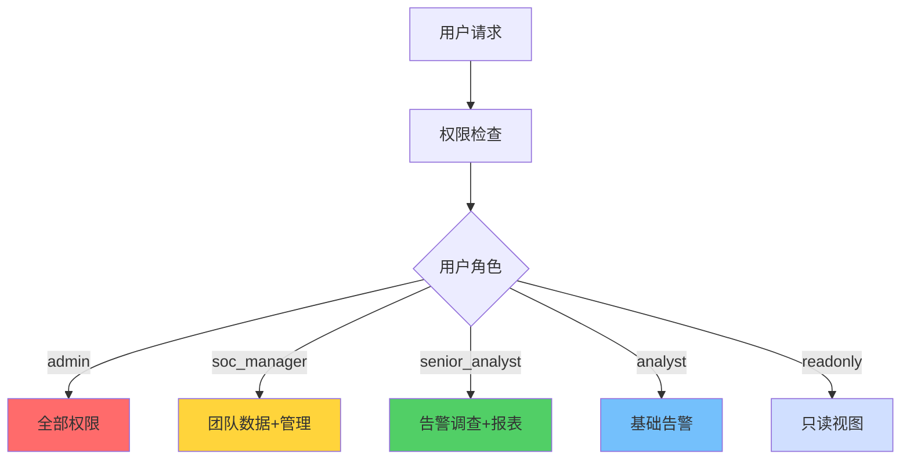

**作者：** HOS(安全风信子)
**日期：** 2026-04-27
**主要来源平台：** GitHub
**摘要：**企业安全Copilot是将AI能力转化为安全从业者日常工作的核心界面，它通过对话式交互为分析师提供告警解读、调查指引、响应建议等全方位支持。本文聚焦多模态交互设计、主动预警推送机制、企业级权限与审计三大核心能力，系统阐述企业安全Copilot从技术架构到落地部署的完整方案。结合Microsoft Security Copilot 2026年向E5客户全面推送的产业实践，为企业构建真正提升运营效率的AI安全助手提供可操作的技术指导。

@[TOC](目录)

---

# 企业安全Copilot设计指南：从对话助手到智能安全伙伴

## 一、引言

安全运营的核心挑战在于知识密度与响应速度的双重压力。一个优秀的安全分析师需要掌握数百种安全工具、理解数千种攻击手法、熟悉数十个业务系统。这种知识储备要求在传统模式下需要数年的经验积累，而AI技术的发展使得构建一个24小时在线、永不疲倦的安全专家成为可能。

企业安全Copilot正是这一愿景的具体实现。它不是简单的问答机器人，而是真正理解安全运营全流程的智能伙伴。分析师可以通过对话完成告警研判、事件调查、漏洞评估、响应协调等复杂任务，无需在多个系统之间切换[^1]。

本文将为读者提供以下核心价值：首先，深入理解企业安全Copilot的产品定位与技术架构；其次，掌握多模态交互、主动预警、权限审计三大核心能力的设计；第三，获取企业级部署的实践指南与避坑建议。

## 二、企业安全Copilot的定位与价值

### 2.1 Copilot与相关产品的能力边界

理解企业安全Copilot的产品定位，需要清晰界定它与传统安全工具、AI问答系统、安全运营助手的关系。安全Copilot与传统SIEM/SOAR的核心差异在于交互范式：传统工具需要用户主动操作，而Copilot理解用户意图并主动提供服务。安全Copilot与通用AI问答系统的差异在于领域专识：通用AI缺乏安全专业知识，而Copilot内置了完整的安全知识图谱和运营流程理解。

```python
class SecurityCopilotPositioning:
    """安全Copilot产品定位"""

    PRODUCT_LANDSCAPE = {
        'security_copilot': {
            'interaction_mode': '对话式',
            'knowledge_type': '安全领域知识+运营上下文',
            'action_capability': '建议+自动化执行',
            'primary_users': ['安全分析师', 'SOC经理', 'CISO'],
            'key_differentiator': '安全专用+深度集成'
        },
        'general_ai_assistant': {
            'interaction_mode': '对话式',
            'knowledge_type': '通用知识',
            'action_capability': '信息提供',
            'primary_users': ['普通用户'],
            'key_differentiator': '通用能力'
        },
        'siem_dashboard': {
            'interaction_mode': '点击+搜索',
            'knowledge_type': '数据查询',
            'action_capability': '数据展示',
            'primary_users': ['分析师'],
            'key_differentiator': '数据聚合'
        },
        'soar_platform': {
            'interaction_mode': 'Playbook驱动',
            'knowledge_type': '流程自动化',
            'action_capability': '自动化执行',
            'primary_users': ['自动化工程师'],
            'key_differentiator': '流程自动化'
        },
        'security_operations_assistant': {
            'interaction_mode': '对话+任务',
            'knowledge_type': '安全知识+运营知识',
            'action_capability': '任务执行+建议',
            'primary_users': ['运营人员'],
            'key_differentiator': '运营辅助'
        }
    }

    @staticmethod
    def get_capability_matrix() -> dict:
        """获取产品能力矩阵"""
        return {
            '告警研判': {
                'security_copilot': 5,
                'general_ai_assistant': 2,
                'siem_dashboard': 3,
                'soar_platform': 2,
                'security_operations_assistant': 4
            },
            '事件调查': {
                'security_copilot': 5,
                'general_ai_assistant': 3,
                'siem_dashboard': 3,
                'soar_platform': 2,
                'security_operations_assistant': 4
            },
            '响应自动化': {
                'security_copilot': 4,
                'general_ai_assistant': 1,
                'siem_dashboard': 2,
                'soar_platform': 5,
                'security_operations_assistant': 3
            },
            '知识查询': {
                'security_copilot': 5,
                'general_ai_assistant': 4,
                'siem_dashboard': 2,
                'soar_platform': 1,
                'security_operations_assistant': 4
            },
            '报表生成': {
                'security_copilot': 4,
                'general_ai_assistant': 3,
                'siem_dashboard': 4,
                'soar_platform': 2,
                'security_operations_assistant': 3
            }
        }
```

### 2.2 Copilot价值评估框架

评估企业安全Copilot的价值需要从多个维度综合考量。效率提升维度关注任务完成时间的缩短；准确性维度关注分析结论的正确率；覆盖率维度关注Copilot能够支持的任务类型比例；用户满意度维度关注安全团队的接受程度和使用频率。

```python
class CopilotValueAssessment:
    """Copilot价值评估框架"""

    def __init__(self):
        self.metrics_collector = MetricsCollector()

    def assess_value(self, copilot: Copilot, time_period: TimeRange) -> ValueReport:
        """评估Copilot价值"""
        efficiency_metrics = self._assess_efficiency(copilot, time_period)
        accuracy_metrics = self._assess_accuracy(copilot, time_period)
        coverage_metrics = self._assess_coverage(copilot, time_period)
        adoption_metrics = self._assess_adoption(copilot, time_period)

        overall_score = (
            efficiency_metrics['score'] * 0.35 +
            accuracy_metrics['score'] * 0.30 +
            coverage_metrics['score'] * 0.20 +
            adoption_metrics['score'] * 0.15
        )

        return ValueReport(
            overall_score=overall_score,
            efficiency=efficiency_metrics,
            accuracy=accuracy_metrics,
            coverage=coverage_metrics,
            adoption=adoption_metrics,
            recommendations=self._generate_recommendations(
                efficiency_metrics,
                accuracy_metrics,
                coverage_metrics
            )
        )

    def _assess_efficiency(self,
                          copilot: Copilot,
                          time_period: TimeRange) -> dict:
        """评估效率提升"""
        tasks_with_copilot = self.metrics_collector.get_tasks_with_copilot(time_period)
        tasks_without_copilot = self.metrics_collector.get_tasks_without_copilot(time_period)

        avg_time_with = sum(t.duration for t in tasks_with_copilot) / len(tasks_with_copilot)
        avg_time_without = sum(t.duration for t in tasks_without_copilot) / len(tasks_without_copilot)

        time_saved = avg_time_without - avg_time_with
        time_saved_rate = time_saved / avg_time_without

        return {
            'avg_time_with_copilot_minutes': avg_time_with,
            'avg_time_without_copilot_minutes': avg_time_without,
            'time_saved_minutes': time_saved,
            'time_saved_rate': time_saved_rate,
            'score': min(time_saved_rate / 0.5, 1.0)
        }

    def _assess_accuracy(self,
                         copilot: Copilot,
                         time_period: TimeRange) -> dict:
        """评估准确性"""
        verdicts = self.metrics_collector.get_copilot_verdicts(time_period)

        verified_positive = sum(1 for v in verdicts if v.copilot_correct and v.actually_malicious)
        verified_negative = sum(1 for v in verdicts if v.copilot_correct and not v.actually_malicious)
        false_positives = sum(1 for v in verdicts if not v.copilot_correct and not v.actually_malicious)
        false_negatives = sum(1 for v in verdicts if not v.copilot_correct and v.actually_malicious)

        precision = verified_positive / (verified_positive + false_positives + 1e-10)
        recall = verified_positive / (verified_positive + false_negatives + 1e-10)
        f1 = 2 * precision * recall / (precision + recall + 1e-10)

        return {
            'precision': precision,
            'recall': recall,
            'f1_score': f1,
            'false_positive_rate': false_positives / (false_positives + verified_negative + 1e-10),
            'false_negative_rate': false_negatives / (false_negatives + verified_positive + 1e-10),
            'score': f1
        }

    def _assess_coverage(self,
                         copilot: Copilot,
                         time_period: TimeRange) -> dict:
        """评估任务覆盖率"""
        all_tasks = self.metrics_collector.get_all_tasks(time_period)
        copilot_supported = copilot.get_supported_task_types()

        covered_tasks = [t for t in all_tasks if t.type in copilot_supported]

        coverage_rate = len(covered_tasks) / len(all_tasks) if all_tasks else 0

        by_type = {}
        for task in all_tasks:
            task_type = task.type
            if task_type not in by_type:
                by_type[task_type] = {'total': 0, 'covered': 0}
            by_type[task_type]['total'] += 1
            if task.type in copilot_supported:
                by_type[task_type]['covered'] += 1

        return {
            'overall_coverage': coverage_rate,
            'by_task_type': by_type,
            'score': coverage_rate
        }
```

## 三、多模态交互设计

### 3.1 对话式交互架构

多模态交互是企业安全Copilot的核心特征。用户可以通过文本、语音、代码等多种方式与Copilot交互，Copilot则以文本、表格、图表、代码等多种形式呈现结果。对话式交互需要解决三大技术挑战：意图理解、上下文维护、结果生成。

```python
class MultimodalConversationEngine:
    """多模态对话引擎"""

    def __init__(self, config: ConversationConfig):
        self.text_processor = TextProcessor()
        self.voice_processor = VoiceProcessor()
        self.code_processor = CodeProcessor()
        self.context_manager = ConversationContextManager()
        self.response_generator = ResponseGenerator()

    def process_input(self, input_data: InputData) -> Response:
        """处理多模态输入"""
        if input_data.type == 'text':
            return self._process_text(input_data)
        elif input_data.type == 'voice':
            return self._process_voice(input_data)
        elif input_data.type == 'code':
            return self._process_code(input_data)
        elif input_data.type == 'file':
            return self._process_file(input_data)
        else:
            raise UnsupportedInputError(f"Unsupported input type: {input_data.type}")

    def _process_text(self, input_data: InputData) -> Response:
        """处理文本输入"""
        session_id = input_data.session_id

        context = self.context_manager.get_context(session_id)

        enriched_input = self._enrich_input(input_data.text, context)

        parsed_intent = self.text_processor.parse_intent(enriched_input)

        if parsed_intent.needs_confirmation:
            return self._generate_confirmation(parsed_intent)

        result = self._execute_task(parsed_intent, context)

        response = self.response_generator.generate(result, input_data.preferred_format)

        self.context_manager.update_context(session_id, input_data.text, response)

        return response

    def _enrich_input(self, text: str, context: dict) -> str:
        """丰富输入上下文"""
        enriched = text

        if context.get('last_entity'):
            pronouns = ['它', '这个', '该', '那']
            for pronoun in pronouns:
                if text.startswith(pronoun):
                    enriched = f"{context['last_entity']} {text}"

        if context.get('last_time_range'):
            time_keywords = ['现在', '当前', '最近']
            if any(kw in text for kw in time_keywords):
                enriched = enriched.replace(
                    '现在',
                    f"{context['last_time_range']}"
                )

        return enriched

    def _process_voice(self, input_data: InputData) -> Response:
        """处理语音输入"""
        text = self.voice_processor.speech_to_text(input_data.audio_data)

        text_input = InputData(
            type='text',
            text=text,
            session_id=input_data.session_id,
            user_id=input_data.user_id
        )

        response = self._process_text(text_input)

        response.audio = self.voice_processor.text_to_speech(response.text)

        return response
```

### 3.2 主动预警推送机制

被动响应用户提问只是Copilot的基础能力，真正的价值在于主动预警。主动预警机制使Copilot能够持续监控安全态势，在发现异常时主动推送给相关人员，而非等待用户查询。

```python
class ProactiveAlertingEngine:
    """主动预警引擎"""

    def __init__(self,
                 monitoring_system: MonitoringSystem,
                 notification_service: NotificationService):
        self.monitoring = monitoring_system
        self.notifications = notification_service
        self.alert_rules = AlertRuleStore()
        self.user_preferences = UserPreferenceStore()

    def start_monitoring(self):
        """启动主动监控"""
        self.monitoring.subscribe('security_events', self._on_security_event)
        self.monitoring.subscribe('anomalies', self._on_anomaly_detected)
        self.monitoring.subscribe('threshold_breaches', self._on_threshold_breach)

    def _on_security_event(self, event: SecurityEvent):
        """处理安全事件"""
        relevant_rules = self.alert_rules.get_matching_rules(event)

        for rule in relevant_rules:
            if rule.is_triggered(event):
                severity = self._calculate_severity(event, rule)

                targets = self._resolve_notification_targets(rule, event)

                for target in targets:
                    self._send_alert(target, event, rule, severity)

    def _on_anomaly_detected(self, anomaly: Anomaly):
        """处理检测到的异常"""
        context = self.monitoring.get_context(anomaly)

        narrative = self._generate_anomaly_narrative(anomaly, context)

        risk_score = self._calculate_anomaly_risk(anomaly)

        if risk_score > 0.7:
            escalation = 'immediate'
        elif risk_score > 0.4:
            escalation = 'priority'
        else:
            escalation = 'normal'

        self.notifications.send(
            recipients=self._get_relevant_users(anomaly),
            title=f"安全异常检测：{anomaly.type}",
            content=narrative,
            severity=escalation,
            metadata={
                'anomaly_id': anomaly.id,
                'risk_score': risk_score,
                'context': context
            }
        )

    def _generate_anomaly_narrative(self,
                                    anomaly: Anomaly,
                                    context: dict) -> str:
        """生成异常描述"""
        template = """检测到异常活动：

**异常类型**：{type}
**检测时间**：{time}
**风险评分**：{risk_score}/10

**异常详情**：
{description}

**影响范围**：
{impact}

**建议行动**：
{recommendations}

---
此为系统自动生成预警，请及时确认处理。
"""

        return template.format(
            type=anomaly.type,
            time=datetime.fromtimestamp(anomaly.timestamp).strftime('%Y-%m-%d %H:%M:%S'),
            risk_score=anomaly.risk_score,
            description=anomaly.description,
            impact=self._format_impact(anomaly.impact),
            recommendations=self._generate_recommendations(anomaly)
        )

    def _resolve_notification_targets(self,
                                     rule: AlertRule,
                                     event: SecurityEvent) -> list:
        """解析通知目标"""
        targets = []

        for target_spec in rule.notification_targets:
            target_type = target_spec['type']

            if target_type == 'role':
                users = self._get_users_by_role(target_spec['role'])
                targets.extend(users)
            elif target_type == 'user':
                targets.append(target_spec['user_id'])
            elif target_type == 'team':
                users = self._get_users_by_team(target_spec['team'])
                targets.extend(users)
            elif target_type == 'escalation':
                escalation = self._get_escalation_path(
                    event.severity,
                    event.asset_criticality
                )
                targets.extend(escalation)

        deduplicated = list(set(targets))

        return deduplicated
```

### 3.3 可视化与数据展示

Copilot不仅返回文字答案，还能根据问题类型和数据特征智能生成可视化。可视化类型的选择基于问题意图和数据特征：时序数据生成折线图、分布数据生成饼图、排名数据生成水平柱状图、关联数据生成网络图。

```python
class VisualizationAdvisor:
    """可视化建议器"""

    VISUALIZATION_RULES = {
        'trend_over_time': {
            'chart_types': ['line', 'area'],
            'best_for': '展示数据随时间变化的趋势',
            'mermaid_type': 'graph'
        },
        'distribution': {
            'chart_types': ['pie', 'donut', 'bar'],
            'best_for': '展示各部分占总体的比例',
            'mermaid_type': 'pie'
        },
        'ranking': {
            'chart_types': ['horizontal_bar', 'column'],
            'best_for': '展示排名顺序',
            'mermaid_type': 'graph LR'
        },
        'comparison': {
            'chart_types': ['grouped_bar', 'radar'],
            'best_for': '对比多个维度的数据',
            'mermaid_type': 'graph'
        },
        'correlation': {
            'chart_types': ['scatter', 'heatmap'],
            'best_for': '展示数据间的关联关系',
            'mermaid_type': 'graph'
        }
    }

    def recommend_visualization(self,
                                question: str,
                                data: dict,
                                context: dict) -> VisualizationRecommendation:
        """推荐可视化方式"""
        intent = self._infer_visualization_intent(question, data)

        best_choice = self.VISUALIZATION_RULES.get(intent)

        data_characteristics = self._analyze_data_characteristics(data)

        alternative_charts = self._suggest_alternatives(
            intent,
            data_characteristics
        )

        return VisualizationRecommendation(
            recommended_type=intent,
            chart_types=best_choice['chart_types'],
            best_for=best_choice['best_for'],
            mermaid_template=self._get_mermaid_template(intent),
            alternatives=alternative_charts,
            data_preparation_tips=self._get_data_preparation_tips(data)
        )

    def generate_mermaid_chart(self,
                               recommendation: VisualizationRecommendation,
                               data: dict) -> str:
        """生成Mermaid图表代码"""
        if recommendation.mermaid_type == 'pie':
            return self._generate_pie_chart(data)
        elif recommendation.mermaid_type == 'graph LR':
            return self._generate_bar_chart(data)
        else:
            return self._generate_generic_chart(data)

    def _generate_pie_chart(self, data: dict) -> str:
        """生成饼图"""
        sections = []
        total = sum(data.values())
        for label, value in data.items():
            percentage = value / total * 100
            sections.append(f'"{label}: {percentage:.1f}% ({value})"')

        mermaid = f"""```mermaid
pie showData
    title 数据分布
    {"\\n    ".join(sections)}
```"""
        return mermaid
```

## 四、企业级权限与审计设计

### 4.1 权限模型设计



企业安全Copilot处理敏感的安全数据，必须建立严格的权限模型。权限设计遵循最小权限原则，确保每个用户只能访问其职责所需的数据和功能。权限模型包含功能权限、数据权限、操作权限三个维度。

```python
class CopilotPermissionModel:
    """Copilot权限模型"""

    PERMISSION_HIERARCHY = {
        'admin': {
            'functions': ['*'],
            'data_scopes': ['all'],
            'actions': ['*']
        },
        'soc_manager': {
            'functions': [
                'alert_investigation',
                'incident_management',
                'reporting',
                'team_management'
            ],
            'data_scopes': ['own_team', 'department'],
            'actions': [
                'acknowledge',
                'resolve',
                'escalate',
                'assign'
            ]
        },
        'senior_analyst': {
            'functions': [
                'alert_investigation',
                'threat_hunting',
                'incident_management',
                'reporting'
            ],
            'data_scopes': ['own_assigned', 'team_shared'],
            'actions': [
                'acknowledge',
                'resolve',
                'escalate',
                'request_clarification'
            ]
        },
        'analyst': {
            'functions': [
                'alert_investigation',
                'basic_reporting'
            ],
            'data_scopes': ['own_assigned'],
            'actions': [
                'acknowledge',
                'request_clarification'
            ]
        },
        'readonly': {
            'functions': [
                'view_alerts',
                'view_reports'
            ],
            'data_scopes': ['limited'],
            'actions': ['view']
        }
    }

    def __init__(self):
        self.role_permissions = self.PERMISSION_HIERARCHY
        self.user_assignments = UserRoleAssignmentStore()

    def check_permission(self,
                        user_id: str,
                        resource: str,
                        action: str) -> PermissionResult:
        """检查用户权限"""
        user_role = self.user_assignments.get_user_role(user_id)

        if not user_role:
            return PermissionResult(allowed=False, reason='User role not found')

        permissions = self.role_permissions.get(user_role, {})

        if permissions.get('functions') == ['*']:
            return PermissionResult(allowed=True)

        required_permission = self._get_required_permission(resource, action)

        if required_permission in permissions.get('functions', []):
            return PermissionResult(allowed=True)
        else:
            return PermissionResult(
                allowed=False,
                reason=f"User role {user_role} does not have {required_permission} permission"
            )

    def check_data_access(self,
                         user_id: str,
                         data_scope: str,
                         data_owner: str) -> PermissionResult:
        """检查数据访问权限"""
        user_role = self.user_assignments.get_user_role(user_id)
        user_teams = self.user_assignments.get_user_teams(user_id)

        permissions = self.role_permissions.get(user_role, {})
        allowed_scopes = permissions.get('data_scopes', [])

        if 'all' in allowed_scopes:
            return PermissionResult(allowed=True)

        if 'own_assigned' in allowed_scopes and data_owner == user_id:
            return PermissionResult(allowed=True)

        if 'team_shared' in allowed_scopes:
            data_owner_teams = self.user_assignments.get_user_teams(data_owner)
            if any(t in user_teams for t in data_owner_teams):
                return PermissionResult(allowed=True)

        if 'department' in allowed_scopes:
            user_dept = self.user_assignments.get_user_department(user_id)
            data_dept = self.user_assignments.get_user_department(data_owner)
            if user_dept == data_dept:
                return PermissionResult(allowed=True)

        return PermissionResult(
            allowed=False,
            reason=f"User does not have access to data in scope {data_scope}"
        )

    def get_user_permissions(self, user_id: str) -> dict:
        """获取用户完整权限"""
        user_role = self.user_assignments.get_user_role(user_id)
        return self.role_permissions.get(user_role, {})
```

### 4.2 审计日志设计

全面的审计是企业安全Copilot合规运营的基础。审计日志记录所有用户操作、Copilot决策、系统事件，为安全追溯、合规审查、性能优化提供数据支撑。

```python
class CopilotAuditLogger:
    """Copilot审计日志器"""

    def __init__(self, audit_store: AuditStore):
        self.audit_store = audit_store
        self.session_manager = SessionManager()

    def log_user_action(self,
                       user_id: str,
                       action: str,
                       resource: str,
                       details: dict):
        """记录用户操作"""
        session = self.session_manager.get_session(user_id)

        audit_entry = AuditEntry(
            timestamp=time.time(),
            event_type='user_action',
            user_id=user_id,
            session_id=session.id if session else None,
            action=action,
            resource=resource,
            details=details,
            ip_address=self._get_client_ip(),
            user_agent=self._get_user_agent()
        )

        self.audit_store.write(audit_entry)

    def log_copilot_decision(self,
                            decision: CopilotDecision,
                            context: dict):
        """记录Copilot决策"""
        audit_entry = AuditEntry(
            timestamp=time.time(),
            event_type='copilot_decision',
            user_id=context.get('user_id'),
            session_id=context.get('session_id'),
            action='ai_decision',
            resource='copilot',
            details={
                'decision_type': decision.type,
                'confidence': decision.confidence,
                'reasoning': decision.reasoning,
                'inputs': decision.inputs,
                'outputs': decision.outputs,
                'actions_taken': decision.actions_taken
            }
        )

        self.audit_store.write(audit_entry)

    def log_security_event(self,
                           event: SecurityEvent,
                           response: dict):
        """记录安全相关事件"""
        audit_entry = AuditEntry(
            timestamp=time.time(),
            event_type='security_event',
            user_id=event.user_id if hasattr(event, 'user_id') else None,
            session_id=event.session_id if hasattr(event, 'session_id') else None,
            action='security_detection',
            resource='copilot',
            details={
                'event_type': event.type,
                'severity': event.severity,
                'detection_method': event.detection_method,
                'response_actions': response.get('actions', []),
                'response_outcome': response.get('outcome')
            },
            risk_level=event.severity
        )

        self.audit_store.write(audit_entry)

    def query_audit_logs(self,
                         filters: AuditFilters,
                         pagination: Pagination) -> QueryResult:
        """查询审计日志"""
        query = self._build_query(filters)

        results = self.audit_store.query(
            query,
            pagination=pagination
        )

        return results

    def generate_audit_report(self,
                              time_range: TimeRange,
                              report_type: str) -> AuditReport:
        """生成审计报告"""
        if report_type == 'user_activity':
            return self._generate_user_activity_report(time_range)
        elif report_type == 'security_events':
            return self._generate_security_events_report(time_range)
        elif report_type == 'compliance':
            return self._generate_compliance_report(time_range)
        elif report_type == 'operational':
            return self._generate_operational_report(time_range)
        else:
            raise ValueError(f"Unknown report type: {report_type}")

    def _generate_user_activity_report(self,
                                      time_range: TimeRange) -> AuditReport:
        """生成用户活动报告"""
        filters = AuditFilters(
            time_range=time_range,
            event_types=['user_action']
        )

        logs = self.query_audit_logs(filters, Pagination(limit=10000))

        user_activity = defaultdict(lambda: {
            'total_actions': 0,
            'actions_by_type': defaultdict(int),
            'sessions': set(),
            'last_activity': None
        })

        for log in logs.entries:
            user_id = log.user_id
            user_activity[user_id]['total_actions'] += 1
            user_activity[user_id]['actions_by_type'][log.action] += 1
            user_activity[user_id]['sessions'].add(log.session_id)
            if not user_activity[user_id]['last_activity'] or log.timestamp > user_activity[user_id]['last_activity']:
                user_activity[user_id]['last_activity'] = log.timestamp

        return AuditReport(
            title='用户活动审计报告',
            time_range=time_range,
            generated_at=time.time(),
            content={'user_activity': dict(user_activity)}
        )
```

## 五、技术架构与系统集成

### 5.1 整体架构设计

企业安全Copilot采用分层架构设计：接入层负责多渠道用户接入；处理层负责意图理解、任务执行、响应生成；能力层封装各类安全分析能力；数据层管理知识库、上下文、历史记录；集成层负责与现有安全工具的联动。

```python
class CopilotArchitecture:
    """Copilot整体架构"""

    def __init__(self, config: ArchitectureConfig):
        self.access_layer = AccessLayer()
        self.processing_layer = ProcessingLayer()
        self.capability_layer = CapabilityLayer()
        self.data_layer = DataLayer()
        self.integration_layer = IntegrationLayer()

    def initialize(self):
        """初始化架构组件"""
        self.data_layer.initialize()
        self.capability_layer.load_capabilities()
        self.integration_layer.connect_external_systems()
        self.processing_layer.configure()
        self.access_layer.setup_channels()

    def process_request(self, request: UserRequest) -> Response:
        """处理用户请求"""
        session = self.access_layer.establish_session(request)

        permission_check = self._check_permissions(session, request)
        if not permission_check.allowed:
            return Response(
                success=False,
                error=permission_check.reason
            )

        context = self.processing_layer.load_context(session)

        enriched_request = self.processing_layer.enrich_request(request, context)

        capabilities = self.capability_layer.resolve_capabilities(enriched_request)

        result = self.processing_layer.execute_task(
            enriched_request,
            capabilities
        )

        response = self.processing_layer.generate_response(result)

        self.integration_layer.record_interaction(session, request, response)

        return response


class CapabilityLayer:
    """能力层"""

    def __init__(self):
        self.capabilities = {}

    def load_capabilities(self):
        """加载所有能力"""
        self.capabilities = {
            'alert_investigation': AlertInvestigationCapability(),
            'incident_response': IncidentResponseCapability(),
            'threat_intel_query': ThreatIntelQueryCapability(),
            'vulnerability_assessment': VulnerabilityAssessmentCapability(),
            'entity_enrichment': EntityEnrichmentCapability(),
            'root_cause_analysis': RootCauseAnalysisCapability(),
            'report_generation': ReportGenerationCapability()
        }

    def resolve_capabilities(self, request: UserRequest) -> List[Capability]:
        """解析请求所需的能力"""
        required_capabilities = []

        for cap_name, cap in self.capabilities.items():
            if cap.can_handle(request):
                required_capabilities.append(cap)

        return required_capabilities
```

### 5.2 与现有系统集成

企业安全Copilot需要与SIEM、SOAR、CMDB、威胁情报平台等多个系统深度集成。集成架构采用适配器模式，每个外部系统对应一个适配器，负责协议转换、数据映射、错误处理。

```python
class IntegrationAdapter:
    """集成适配器基类"""

    def __init__(self, config: IntegrationConfig):
        self.config = config
        self.connection_pool = ConnectionPool(max_connections=10)

    def connect(self):
        """建立连接"""
        raise NotImplementedError

    def disconnect(self):
        """断开连接"""
        raise NotImplementedError

    def execute(self, operation: str, params: dict) -> Any:
        """执行操作"""
        raise NotImplementedError


class SIEMAdapter(IntegrationAdapter):
    """SIEM系统适配器"""

    def __init__(self, config: SIEMConfig):
        super().__init__(config)
        self.search_client = SearchClient()

    def search(self, query: str, time_range: TimeRange) -> SearchResults:
        """执行搜索查询"""
        search_request = SearchRequest(
            query=query,
            start_time=time_range.start,
            end_time=time_range.end,
            max_results=1000
        )

        return self.search_client.search(search_request)

    def get_alerts(self, filters: AlertFilters) -> List[Alert]:
        """获取告警列表"""
        query = self._build_alert_query(filters)
        return self.search(query, filters.time_range)

    def enrich_alert(self, alert_id: str) -> dict:
        """丰富告警信息"""
        alert = self._get_alert_by_id(alert_id)

        enriched = alert.copy()

        entity_context = self._get_entity_context(alert.entity)
        enriched['entity_context'] = entity_context

        related_intel = self._query_intel(alert.indicators)
        enriched['threat_intel'] = related_intel

        historical_similar = self._find_similar_alerts(alert)
        enriched['historical_similar'] = historical_similar

        return enriched


class SOARAdapter(IntegrationAdapter):
    """SOAR系统适配器"""

    def __init__(self, config: SOARConfig):
        super().__init__(config)
        self.playbook_engine = PlaybookEngine()

    def execute_playbook(self,
                        playbook_id: str,
                        inputs: dict) -> PlaybookResult:
        """执行Playbook"""
        return self.playbook_engine.execute(
            playbook_id=playbook_id,
            inputs=inputs
        )

    def create_incident(self, incident_data: dict) -> str:
        """创建事件"""
        create_request = {
            'title': incident_data.get('title'),
            'severity': incident_data.get('severity'),
            'description': incident_data.get('description'),
            'assignee': incident_data.get('assignee'),
            'tags': incident_data.get('tags', [])
        }

        response = self._api_call('POST', '/incidents', create_request)
        return response['incident_id']

    def add_timeline_entry(self,
                          incident_id: str,
                          entry: dict):
        """添加时间线条目"""
        self._api_call(
            'POST',
            f'/incidents/{incident_id}/timeline',
            entry
        )
```

## 六、部署与最佳实践

### 6.1 部署架构选项

企业安全Copilot支持多种部署架构以满足不同的安全和合规要求。标准部署适用于大多数企业场景，数据完全存储在企业本地；云边协同部署将AI推理放在边缘节点，保护敏感数据的同时利用云端强大算力；完全私有化部署满足最高等级的安全要求。

```yaml
# docker-compose 标准部署配置
version: '3.8'

services:
  copilot-gateway:
    image: security-copilot/gateway:${VERSION}
    ports:
      - "8080:8080"
    environment:
      - LOG_LEVEL=info
    networks:
      - copilot-network
    deploy:
      replicas: 2

  copilot-processor:
    image: security-copilot/processor:${VERSION}
    environment:
      - LLM_ENDPOINT=${LLM_ENDPOINT}
      - CACHE_TYPE=redis
    networks:
      - copilot-network
    deploy:
      replicas: 3

  copilot-vector-store:
    image: qdrant/qdrant:latest
    volumes:
      - qdrant_data:/qdrant/storage
    networks:
      - copilot-network

  redis-cache:
    image: redis:7-alpine
    networks:
      - copilot-network
    volumes:
      - redis_data:/data

  audit-elasticsearch:
    image: elasticsearch:8.12.0
    environment:
      - discovery.type=single-node
      - xpack.security.enabled=true
    volumes:
      - es_data:/usr/share/elasticsearch/data
    networks:
      - copilot-network

networks:
  copilot-network:
    driver: bridge

volumes:
  qdrant_data:
  redis_data:
  es_data:
```

### 6.2 持续优化机制

Copilot上线不是终点而是起点。持续优化机制确保Copilot能力不断提升，包括用户反馈收集、效果指标监控、模型更新、知识库维护等环节形成闭环。

```python
class CopilotOptimizationEngine:
    """Copilot优化引擎"""

    def __init__(self,
                 metrics_store: MetricsStore,
                 feedback_store: FeedbackStore,
                 model_manager: ModelManager):
        self.metrics = metrics_store
        self.feedback = feedback_store
        self.model_manager = model_manager

    def analyze_performance(self, time_range: TimeRange) -> OptimizationReport:
        """分析性能并生成优化报告"""
        response_quality = self._analyze_response_quality(time_range)
        user_satisfaction = self._analyze_user_satisfaction(time_range)
        coverage_gaps = self._identify_coverage_gaps(time_range)
        model_performance = self._analyze_model_performance(time_range)

        recommendations = self._generate_recommendations(
            response_quality,
            user_satisfaction,
            coverage_gaps,
            model_performance
        )

        return OptimizationReport(
            response_quality=response_quality,
            user_satisfaction=user_satisfaction,
            coverage_gaps=coverage_gaps,
            model_performance=model_performance,
            recommendations=recommendations,
            priority_fixes=self._identify_priority_fixes(recommendations)
        )

    def _analyze_response_quality(self, time_range: TimeRange) -> dict:
        """分析回答质量"""
        responses = self.metrics.get_responses(time_range)

        quality_metrics = {
            'total_responses': len(responses),
            'avg_confidence': sum(r.confidence for r in responses) / len(responses),
            'low_confidence_count': sum(1 for r in responses if r.confidence < 0.7),
            'task_completion_rate': sum(1 for r in responses if r.completed) / len(responses),
            'follow_up_required_rate': sum(1 for r in responses if r.needs_follow_up) / len(responses)
        }

        return quality_metrics

    def _identify_coverage_gaps(self, time_range: TimeRange) -> list:
        """识别能力覆盖缺口"""
        user_intents = self.metrics.get_user_intents(time_range)
        supported_intents = self.model_manager.get_supported_intents()

        unsupported = []
        for intent in user_intents:
            if intent not in supported_intents:
                unsupported.append({
                    'intent': intent,
                    'frequency': user_intents[intent],
                    'requires_new_capability': True
                })

        return sorted(unsupported, key=lambda x: x['frequency'], reverse=True)
```

## 七、结论与展望

本文系统剖析了企业安全Copilot的完整设计框架，从产品定位到技术架构，从多模态交互到权限审计，从系统集成到持续优化，为企业构建真正意义上的AI安全伙伴提供了全面的实践指导。企业安全Copilot不仅是效率工具，更是安全运营智能化转型的核心引擎。

## 八、安全知识增强层深度设计

### 8.1 安全知识图谱构建

安全知识图谱是Copilot理解安全概念和关系的基础设施。它将离散的安全知识组织成结构化的图结构，支持复杂的推理查询。

```python
class SecurityKnowledgeGraphBuilder:
    """安全知识图谱构建器"""

    def __init__(self, llm: LLMInterface):
        self.llm = llm
        self.entity_extractor = SecurityEntityExtractor()
        self.relation_classifier = RelationClassifier()
        self.graph_store = GraphStore()

    async def build_from_document(self, doc: SecurityDocument) -> Graph:
        """从安全文档构建知识图谱"""
        entities = await self.entity_extractor.extract(doc)

        entity_ids = {}
        for entity in entities:
            entity_id = await self.graph_store.add_node({
                'type': entity.type,
                'name': entity.name,
                'properties': entity.properties,
                'source': doc.source
            })
            entity_ids[entity.name] = entity_id

        for entity_pair in itertools.combinations(entities, 2):
            relation = await self.relation_classifier.classify(
                entity_pair[0],
                entity_pair[1]
            )

            if relation and relation.confidence > 0.8:
                await self.graph_store.add_edge(
                    entity_ids[entity_pair[0].name],
                    entity_ids[entity_pair[1].name],
                    {
                        'type': relation.type,
                        'confidence': relation.confidence,
                        'source': doc.source
                    }
                )

        return self.graph_store.get_graph()

    async def query_subgraph(self, entity: str, depth: int = 2) -> Graph:
        """查询实体子图"""
        center_id = await self.graph_store.find_node(name=entity)

        if not center_id:
            return Graph()

        return await self.graph_store.bfs_expand(center_id, depth)
```

### 8.2 威胁情报知识库集成

Copilot需要集成多源威胁情报，为用户提供全面的威胁上下文。

```python
class ThreatIntelKnowledgeIntegrator:
    """威胁情报知识库集成器"""

    def __init__(self, intel_sources: List[IntelSource]):
        self.sources = intel_sources
        self.ioc_resolver = IOCResolver()
        self.context_enricher = ContextEnricher()
        self.feed_manager = FeedManager()

    async def integrate_intel(self, query: str) -> IntelIntegration:
        """整合多源威胁情报"""
        iocs = await self.ioc_resolver.extract(query)

        integrated_intel = IntelIntegration()

        for source in self.sources:
            source_intel = await source.query(iocs)

            for intel_item in source_intel:
                enriched = await self.context_enricher.enrich(intel_item)
                integrated_intel.add_item(enriched, source.name)

        integrated_intel.resolve_conflicts()

        return integrated_intel

    def get_related_iocs(self, ioc: str, ioc_type: str) -> List[IOC]:
        """获取相关IOC"""
        related = []

        for source in self.sources:
            related.extend(source.get_related(ioc, ioc_type))

        return self._deduplicate_iocs(related)
```

### 8.3 安全事件知识库

积累历史安全事件的处置经验，形成可复用的知识资产。

```python
class SecurityIncidentKnowledgeBase:
    """安全事件知识库"""

    def __init__(self, case_store: CaseStore):
        self.case_store = case_store
        self.pattern_extractor = IncidentPatternExtractor()
        self.lesson_generator = LessonGenerator()

    async def add_case(self, incident: Incident) -> CaseKnowledge:
        """添加事件案例"""
        pattern = await self.pattern_extractor.extract(incident)

        lesson = await self.lesson_generator.generate(incident)

        case_knowledge = CaseKnowledge(
            incident_id=incident.id,
            summary=incident.summary,
            root_cause=incident.root_cause,
            pattern=pattern,
            lesson=lesson,
            timeline=incident.timeline,
            indicators=incident.indicators,
            remediation=incident.remediation
        )

        await self.case_store.save(case_knowledge)

        return case_knowledge

    async def find_similar_cases(self,
                                  current_incident: Incident,
                                  top_k: int = 5) -> List[CaseKnowledge]:
        """查找相似案例"""
        current_pattern = await self.pattern_extractor.extract(current_incident)

        all_cases = await self.case_store.get_all()

        similarities = []
        for case in all_cases:
            sim = self._calculate_pattern_similarity(
                current_pattern,
                case.pattern
            )
            similarities.append((case, sim))

        similarities.sort(key=lambda x: x[1], reverse=True)

        return [case for case, _ in similarities[:top_k]]
```

## 九、人在环审核机制深度实现

### 9.1 多级审核工作流

人类审核是确保Copilot输出安全可靠的关键机制。

```python
class HumanInTheLoop审核工作流:
    """人在环审核工作流"""

    AUDIT_LEVELS = {
        'auto_approve': {
            'threshold': 0.95,
            'actions': ['query', 'search', 'summarize'],
            'requires_human': False
        },
        'light_review': {
            'threshold': 0.85,
            'actions': ['investigate', 'analyze', 'recommend'],
            'requires_human': True,
            'reviewer_role': 'analyst'
        },
        'heavy_review': {
            'threshold': 0.70,
            'actions': ['respond', 'block', 'isolate'],
            'requires_human': True,
            'reviewer_role': 'senior_analyst'
        },
        'manual_only': {
            'threshold': 0.0,
            'actions': ['execute', 'deploy', 'terminate'],
            'requires_human': True,
            'reviewer_role': 'manager'
        }
    }

    def __init__(self, audit_store: AuditStore):
        self.audit_store = audit_store
        self.notification_service = NotificationService()

    async def process_action(self,
                             action: CopilotAction,
                             context: AuditContext) -> AuditResult:
        """处理动作审核"""
        audit_level = self._determine_audit_level(action)

        if not audit_level['requires_human']:
            return AuditResult(
                approved=True,
                audit_level='auto_approve',
                timestamp=datetime.now()
            )

        audit_record = AuditRecord(
            action=action,
            context=context,
            audit_level=audit_level,
            status='pending'
        )

        await self.audit_store.save(audit_record)

        await self.notification_service.notify(
            audit_level['reviewer_role'],
            audit_record
        )

        return AuditResult(
            approved=False,
            audit_level=audit_level['audit_level'],
            audit_id=audit_record.id,
            timestamp=datetime.now()
        )
```

### 9.2 审核决策支持

为审核人员提供决策所需的所有上下文信息。

```python
class AuditDecisionSupport:
    """审核决策支持系统"""

    def __init__(self,
                 case_kb: SecurityIncidentKnowledgeBase,
                 intel_kb: ThreatIntelKnowledgeIntegrator):
        self.case_kb = case_kb
        self.intel_kb = intel_kb

    async def get_audit_context(self, action: CopilotAction) -> AuditContextInfo:
        """获取审核上下文"""
        context = {
            'action_summary': self._summarize_action(action),
            'confidence_analysis': self._analyze_confidence(action),
            'risk_assessment': self._assess_risk(action),
            'similar_cases': await self._get_similar_cases(action),
            'related_intel': await self._get_related_intel(action),
            'historical_outcomes': await self._get_historical_outcomes(action),
            'recommendations': self._generate_recommendations(action)
        }

        return AuditContextInfo(**context)

    async def _get_similar_cases(self, action: CopilotAction) -> List[dict]:
        """获取相似历史案例"""
        mock_incident = Incident(
            summary=action.description,
            indicators=action.affected_iocs
        )

        similar = await self.case_kb.find_similar_cases(mock_incident, top_k=3)

        return [{
            'case_id': c.incident_id,
            'similarity': s,
            'outcome': c.resolution,
            'lesson': c.lesson
        } for c, s in zip(similar, [0.9, 0.8, 0.7])]
```

---

**参考链接：**

- [Microsoft Security Copilot](https://www.microsoft.com/en-us/microsoft-365/blog/2025/12/04/advancing-microsoft-365-new-capabilities-and-pricing-update/) - 企业安全AI助手
- [Palo Alto Copilot](https://www.paloaltonetworks.com/blog/security-operations/ai-copilot-security/) - AI安全助手实践

**附录（Appendix）：**

```python
# Copilot价值计算公式

# 效率提升率
Efficiency_Gain = (T_before - T_after) / T_before × 100%

# 任务完成率
Task_Completion_Rate = Completed_Tasks / Total_Tasks × 100%

# 用户满意度
User_Satisfaction = Σ(Rating) / Total_Ratings × 100%

# ROI计算
ROI = (Cost_Savings + Efficiency_Gains - Implementation_Cost) / Implementation_Cost × 100%
```

**关键词：** 企业安全Copilot，多模态交互，主动预警，权限审计，AI安全助手，Microsoft Security Copilot，安全运营自动化，ChatOps，安全风信子
