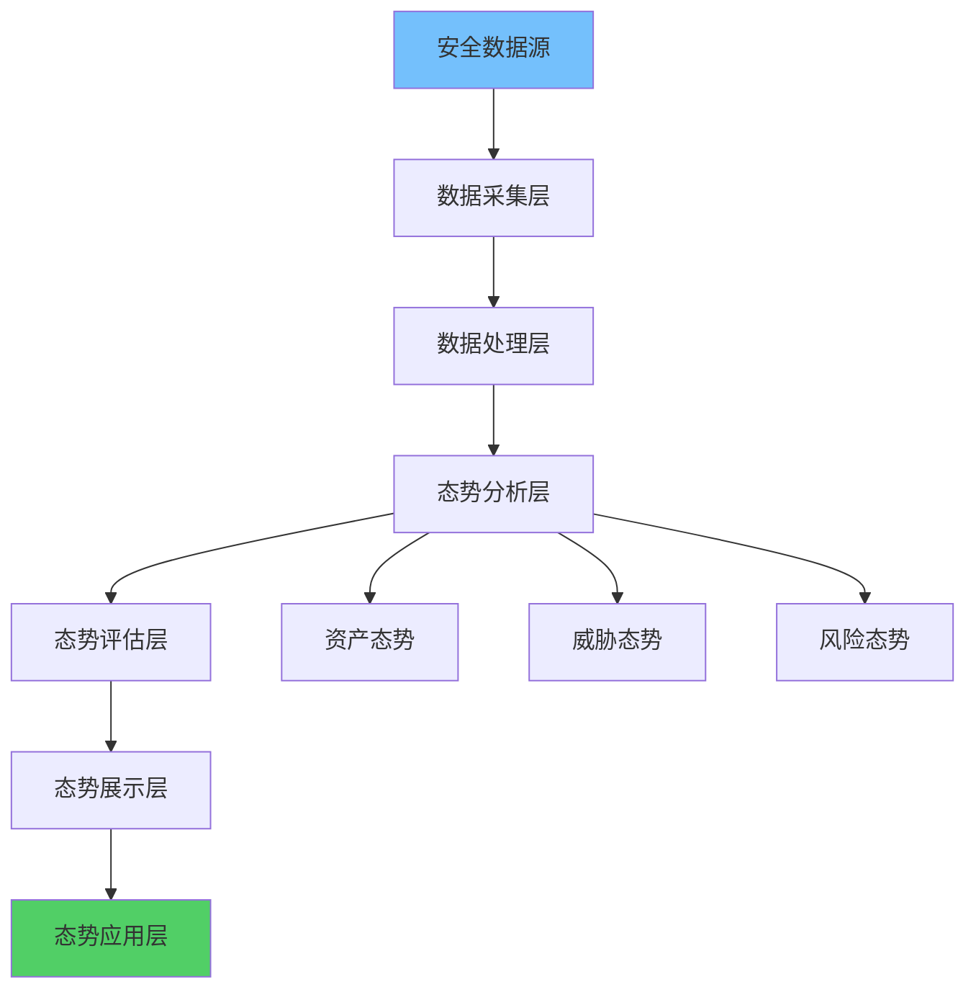
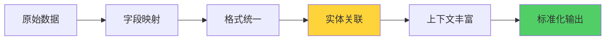

**作者：** HOS(安全风信子)
**日期：** 2026-04-27
**主要来源平台：** GitHub
**摘要：**AI态势感知体系是企业安全运营智能化的核心基础设施，它通过多源数据融合、实时威胁评估、态势预测等技术手段，实现对安全态势的全局可见与主动防御。本文聚焦资产-威胁-风险三维态势融合、实时威胁评估引擎、态势预测与模拟推演三大核心能力，系统阐述态势感知体系从数据采集到智能决策的完整技术架构。结合Palo Alto XSIAM等主流平台实践，为企业构建全面、智能、主动的态势感知能力提供可落地技术方案。

@[TOC](目录)

---

# AI态势感知体系：企业安全的全局可见与主动防御引擎

## 一、引言

企业安全运营面临的核心挑战是信息过载与决策延迟。每天产生的海量安全数据（告警、日志、漏洞、威胁情报）分散在数十个安全工具中，安全分析师难以形成统一的安全态势视图，更无法及时发现和响应安全威胁。

AI态势感知体系通过人工智能技术重新定义安全运营的感知能力。它不是简单的数据聚合，而是具备理解、推理、预测能力的智能系统。态势感知让安全团队能够“站在高山之巅”俯瞰全局，在复杂局面中快速定位关键风险[^1]。

本文将为读者提供以下核心价值：首先，深入理解态势感知体系的技术架构与核心能力；其次，掌握资产-威胁-风险三维态势融合、实时威胁评估、态势预测与模拟推演三大关键技术的算法设计；第三，获取企业级态势感知体系的部署指南与最佳实践。

## 二、态势感知体系技术架构

### 2.1 架构分层设计



态势感知体系采用六层架构设计：数据采集层负责从各类安全工具收集原始数据；数据处理层负责数据标准化、清洗、 enrichment；态势分析层负责多维度态势计算；态势评估层负责风险评分与威胁判定；态势展示层负责可视化呈现；态势应用层负责决策支持与自动化响应。

```python
class SituationalAwarenessArchitecture:
    """态势感知体系架构"""

    def __init__(self, config: ArchitectureConfig):
        self.data_collection = DataCollectionLayer(config.collection)
        self.data_processing = DataProcessingLayer(config.processing)
        self.situation_analysis = SituationAnalysisLayer(config.analysis)
        self.situation_assessment = SituationAssessmentLayer(config.assessment)
        self.situation_presentation = PresentationLayer(config.presentation)
        self.situation_application = ApplicationLayer(config.application)

    def process_security_data(self, raw_data: list) -> SituationView:
        """处理安全数据生成态势视图"""
        standardized = self.data_processing.standardize(raw_data)

        enriched = self.data_processing.enrich(standardized)

        analyzed = self.situation_analysis.analyze(enriched)

        assessed = self.situation_assessment.evaluate(analyzed)

        view = self.situation_presentation.build_view(assessed)

        return view


class DataCollectionLayer:
    """数据采集层"""

    def __init__(self, config):
        self.collectors = {
            'siem': SIEMCollector(config.siem),
            'edr': EDRCollector(config.edr),
            'ids_ips': IDSIPSColector(config.ids),
            'firewall': FirewallCollector(config.firewall),
            'vulnerability': VulnCollector(config.vuln),
            'threat_intel': IntelCollector(config.intel)
        }

    def collect_all(self, time_range: TimeRange) -> list:
        """全量数据采集"""
        all_data = []
        for name, collector in self.collectors.items():
            try:
                data = collector.collect(time_range)
                for item in data:
                    item['source'] = name
                all_data.extend(data)
            except CollectionError as e:
                logger.error(f"Failed to collect from {name}: {e}")
        return all_data


class SituationAnalysisLayer:
    """态势分析层"""

    def __init__(self, config):
        self.analyzers = {
            'asset': AssetAnalyzer(),
            'threat': ThreatAnalyzer(),
            'risk': RiskAnalyzer(),
            'vulnerability': VulnAnalyzer()
        }

    def analyze(self, data: list) -> AnalysisResult:
        """多维度态势分析"""
        asset_situation = self.analyzers['asset'].analyze(data)
        threat_situation = self.analyzers['threat'].analyze(data)
        risk_situation = self.analyzers['risk'].analyze(data)
        vuln_situation = self.analyzers['vulnerability'].analyze(data)

        return AnalysisResult(
            asset=asset_situation,
            threat=threat_situation,
            risk=risk_situation,
            vulnerability=vuln_situation
        )
```

### 2.2 数据标准化与 Enrichment



多源数据融合的前提是数据标准化。不同安全工具的数据格式、字段命名、时间格式各异，需要统一映射到标准数据模型。同时，通过实体关联和上下文丰富，提升数据的分析价值。

```python
class DataStandardization:
    """数据标准化"""

    STANDARD_SCHEMA = {
        'entity': {
            'entity_id': str,
            'entity_type': str,
            'name': str,
            'ip_address': str,
            'hostname': str,
            'criticality': str,
            'owner': str,
            'tags': list
        },
        'alert': {
            'alert_id': str,
            'timestamp': float,
            'source': str,
            'severity': str,
            'category': str,
            'description': str,
            'entity_id': str,
            'indicators': list,
            'raw_data': dict
        },
        'vulnerability': {
            'vuln_id': str,
            'cve_id': str,
            'cvss_score': float,
            'affected_entity': str,
            'status': str,
            'discovered_at': float,
            'remediation_deadline': float
        }
    }

    def standardize(self, raw_data: list, source_type: str) -> list:
        """标准化数据"""
        mapping = self._get_mapping(source_type)
        standardized = []

        for item in raw_data:
            std_item = {}
            for std_field, source_field in mapping.items():
                std_item[std_field] = self._extract_value(item, source_field)

            std_item['source_type'] = source_type
            std_item['standardized_at'] = time.time()

            standardized.append(std_item)

        return standardized

    def _get_mapping(self, source_type: str) -> dict:
        """获取字段映射"""
        mappings = {
            'splunk': {
                'alert_id': 'result.sid',
                'timestamp': 'result.time',
                'severity': 'result.severity',
                'description': 'result.message'
            },
            'crowdstrike': {
                'alert_id': 'event.SimpleServiceEvent.event_id',
                'timestamp': 'event.SimpleServiceEvent.timestamp',
                'severity': 'event.SimpleServiceEvent.severity',
                'entity_id': 'event.SimpleServiceEvent.computer_name'
            }
        }
        return mappings.get(source_type, {})


class DataEnrichment:
    """数据富化"""

    def __init__(self):
        self.enrichers = {
            'asset': AssetEnricher(),
            'threat_intel': ThreatIntelEnricher(),
            'geo': GeoEnricher()
        }

    def enrich(self, standardized_data: list) -> list:
        """数据富化"""
        enriched = []

        asset_context = self._build_asset_context(standardized_data)

        for item in standardized_data:
            enriched_item = item.copy()

            if item['entity_id']:
                enriched_item['asset_context'] = asset_context.get(
                    item['entity_id'], {}
                )

            if item.get('indicators'):
                enriched_item['intel_matches'] = self._check_intel(
                    item['indicators']
                )

            enriched.append(enriched_item)

        return enriched

    def _build_asset_context(self, data: list) -> dict:
        """构建资产上下文"""
        assets = {}
        for item in data:
            entity_id = item.get('entity_id')
            if entity_id and entity_id not in assets:
                assets[entity_id] = {
                    'hostname': item.get('hostname'),
                    'ip_address': item.get('ip_address'),
                    'criticality': item.get('criticality'),
                    'vuln_count': self._count_vulnerabilities(data, entity_id),
                    'alert_count': self._count_alerts(data, entity_id),
                    'risk_score': self._calculate_asset_risk(data, entity_id)
                }
        return assets
```

## 三、资产-威胁-风险三维态势融合

### 3.1 三维态势模型设计

资产、威胁、风险是安全态势的三个核心维度。资产维度关注“保护什么”，威胁维度关注“面临什么风险”，风险维度关注“综合评估如何”。三维态势融合建立三个维度之间的关联关系，形成统一的安全视图。

```python
class ThreeDimensionalSituationModel:
    """三维态势模型"""

    def __init__(self):
        self.asset_dimension = AssetDimension()
        self.threat_dimension = ThreatDimension()
        self.risk_dimension = RiskDimension()
        self.correlation_engine = CorrelationEngine()

    def fuse_situation(self, data: list) -> FusedSituation:
        """融合三维态势"""
        asset_view = self.asset_dimension.analyze(data)
        threat_view = self.threat_dimension.analyze(data)
        risk_view = self.risk_dimension.analyze(data)

        correlations = self.correlation_engine.correlate_three_dimensions(
            asset_view,
            threat_view,
            risk_view
        )

        fused = FusedSituation(
            asset_view=asset_view,
            threat_view=threat_view,
            risk_view=risk_view,
            correlations=correlations,
            overall_score=self._calculate_overall_score(
                asset_view,
                threat_view,
                risk_view
            ),
            timestamp=time.time()
        )

        return fused

    def _calculate_overall_score(self,
                                 asset: AssetView,
                                 threat: ThreatView,
                                 risk: RiskView) -> float:
        """计算综合态势评分"""
        weights = {
            'asset': 0.25,
            'threat': 0.35,
            'risk': 0.40
        }

        score = (
            asset.score * weights['asset'] +
            threat.score * weights['threat'] +
            risk.score * weights['risk']
        )

        return min(max(score, 0), 100)


class AssetDimension:
    """资产维度分析"""

    def analyze(self, data: list) -> AssetView:
        """分析资产态势"""
        assets = self._extract_assets(data)

        by_type = self._group_by_type(assets)
        by_criticality = self._group_by_criticality(assets)
        by_status = self._group_by_status(assets)

        health_scores = self._calculate_health_scores(assets)

        return AssetView(
            total_count=len(assets),
            by_type=by_type,
            by_criticality=by_criticality,
            by_status=by_status,
            health_scores=health_scores,
            score=self._calculate_asset_score(health_scores, by_criticality)
        )

    def _calculate_health_scores(self, assets: list) -> dict:
        """计算资产健康度"""
        scores = {}
        for asset in assets:
            entity_id = asset['entity_id']

            vuln_score = self._calculate_vuln_score(asset)
            alert_score = self._calculate_alert_score(asset)
            patch_score = self._calculate_patch_score(asset)

            health = 100 - (vuln_score * 0.4 + alert_score * 0.4 + patch_score * 0.2)

            scores[entity_id] = max(0, min(100, health))

        return scores


class ThreatDimension:
    """威胁维度分析"""

    def analyze(self, data: list) -> ThreatView:
        """分析威胁态势"""
        active_threats = self._identify_active_threats(data)
        threat_actors = self._identify_threat_actors(data)
        attack_patterns = self._identify_attack_patterns(data)

        threat_level = self._calculate_threat_level(
            active_threats,
            threat_actors,
            attack_patterns
        )

        return ThreatView(
            active_threat_count=len(active_threats),
            threat_actors=threat_actors,
            attack_patterns=attack_patterns,
            threat_level=threat_level,
            score=self._calculate_threat_score(threat_level)
        )
```

### 3.2 关联分析引擎

三维态势的融合核心是关联分析。资产与威胁的关联、漏洞与风险的关联、告警与事件的关联，形成完整的安全事件链。

```python
class CorrelationEngine:
    """关联分析引擎"""

    def __init__(self):
        self.correlation_rules = self._load_correlation_rules()
        self.graph_store = GraphStore()

    def correlate_three_dimensions(self,
                                   asset_view: AssetView,
                                   threat_view: ThreatView,
                                   risk_view: RiskView) -> dict:
        """三维态势关联"""
        correlations = {
            'asset_threat': self._correlate_asset_threat(
                asset_view,
                threat_view
            ),
            'threat_risk': self._correlate_threat_risk(
                threat_view,
                risk_view
            ),
            'asset_risk': self._correlate_asset_risk(
                asset_view,
                risk_view
            ),
            'attack_chain': self._reconstruct_attack_chain(
                asset_view,
                threat_view
            )
        }

        return correlations

    def _correlate_asset_threat(self,
                                asset_view: AssetView,
                                threat_view: ThreatView) -> list:
        """资产与威胁关联"""
        correlations = []

        for threat in threat_view.active_threats:
            affected_assets = self._find_affected_assets(
                threat,
                asset_view.assets
            )

            for asset in affected_assets:
                correlations.append({
                    'type': 'asset_threat',
                    'asset_id': asset['entity_id'],
                    'threat_id': threat['threat_id'],
                    'severity': min(
                        threat['severity'],
                        asset['criticality']
                    ),
                    'relation': threat.get('attack_vector')
                })

        return correlations

    def _reconstruct_attack_chain(self,
                                 asset_view: AssetView,
                                 threat_view: ThreatView) -> list:
        """重构攻击链"""
        attack_chains = []

        for pattern in threat_view.attack_patterns:
            chain = self._build_attack_path(
                pattern,
                asset_view.assets
            )

            if chain:
                attack_chains.append(chain)

        return attack_chains

    def _build_attack_path(self,
                          pattern: AttackPattern,
                          assets: list) -> AttackChain:
        """构建攻击路径"""
        path = []

        current_stage = pattern.initial_access
        while current_stage:
            matching_assets = [
                a for a in assets
                if self._is_vulnerable_to(a, current_stage)
            ]

            if matching_assets:
                path.append({
                    'stage': current_stage,
                    'affected_assets': [a['entity_id'] for a in matching_assets]
                })

            current_stage = pattern.get_next_stage(current_stage)

        return AttackChain(
            pattern_id=pattern.id,
            path=path,
            confidence=pattern.confidence
        )
```

## 四、实时威胁评估引擎

### 4.1 威胁评估算法设计

实时威胁评估是态势感知的核心能力。评估引擎综合考虑威胁的紧迫性、严重性、可控性三个因素，计算威胁的综合评分。评估结果用于告警优先级排序、响应资源调配、态势综合评分计算。

```python
class RealTimeThreatAssessmentEngine:
    """实时威胁评估引擎"""

    def __init__(self):
        self.assessment_models = {
            'severity': SeverityAssessmentModel(),
            'urgency': UrgencyAssessmentModel(),
            'controllability': ControllabilityAssessmentModel()
        }
        self.ml_model = self._load_ml_model()

    def assess_threat(self,
                     threat_data: dict,
                     context: dict) -> ThreatAssessment:
        """评估威胁"""
        severity = self.assessment_models['severity'].assess(
            threat_data,
            context
        )

        urgency = self.assessment_models['urgency'].assess(
            threat_data,
            context
        )

        controllability = self.assessment_models['controllability'].assess(
            threat_data,
            context
        )

        ml_score = self.ml_model.predict(threat_data, context)

        final_score = self._calculate_final_score(
            severity,
            urgency,
            controllability,
            ml_score
        )

        priority = self._determine_priority(final_score)

        recommended_actions = self._get_recommended_actions(
            final_score,
            threat_data
        )

        return ThreatAssessment(
            threat_id=threat_data['threat_id'],
            severity=severity,
            urgency=urgency,
            controllability=controllability,
            ml_score=ml_score,
            final_score=final_score,
            priority=priority,
            recommended_actions=recommended_actions,
            assessed_at=time.time()
        )

    def _calculate_final_score(self,
                              severity: float,
                              urgency: float,
                              controllability: float,
                              ml_score: float) -> float:
        """计算综合威胁评分"""
        rule_based_score = (
            severity * 0.35 +
            urgency * 0.35 +
            controllability * 0.30
        )

        final = rule_based_score * 0.6 + ml_score * 0.4

        return min(max(final, 0), 100)


class SeverityAssessmentModel:
    """严重性评估模型"""

    def assess(self, threat_data: dict, context: dict) -> float:
        """评估严重性"""
        base_severity = threat_data.get('base_severity', 5.0)

        impact_multiplier = self._calculate_impact_multiplier(
            threat_data,
            context
        )

        reachability = self._calculate_reachability(
            threat_data,
            context
        )

        severity = base_severity * impact_multiplier * reachability

        return min(max(severity, 0), 10)

    def _calculate_impact_multiplier(self,
                                    threat_data: dict,
                                    context: dict) -> float:
        """计算影响乘数"""
        affected_critical_assets = self._count_critical_assets(
            threat_data,
            context
        )

        data_sensitivity = threat_data.get('data_sensitivity', 'medium')

        sensitivity_weights = {
            'critical': 1.5,
            'high': 1.3,
            'medium': 1.0,
            'low': 0.7
        }

        return (
            sensitivity_weights.get(data_sensitivity, 1.0) *
            (1 + 0.1 * affected_critical_assets)
        )

    def _calculate_reachability(self,
                                threat_data: dict,
                                context: dict) -> float:
        """计算可达性"""
        if threat_data.get('is_external', False):
            return 1.0

        network_segments = context.get('network_segments', [])
        affected_segments = threat_data.get('affected_segments', [])

        if any(s in network_segments for s in affected_segments):
            return 0.8

        return 0.5
```

### 4.2 威胁评分校准

机器学习模型的威胁评分可能存在偏差，需要通过校准确保评分的可靠性。系统采用Platt Scaling和温度 scaling两种校准方法，持续优化评分准确性。

```python
class ThreatScoreCalibrator:
    """威胁评分校准器"""

    def __init__(self):
        self.calibration_method = 'platt_scaling'
        self.calibration_data = []
        self.calibrated_model = None

    def calibrate(self,
                 predicted_scores: list,
                 true_labels: list) -> CalibratedModel:
        """校准威胁评分"""
        if self.calibration_method == 'platt_scaling':
            return self._platt_scaling_calibrate(
                predicted_scores,
                true_labels
            )
        elif self.calibration_method == 'temperature':
            return self._temperature_calibrate(
                predicted_scores,
                true_labels
            )

    def _platt_scaling_calibrate(self,
                                 predictions: list,
                                 labels: list) -> CalibratedModel:
        """Platt Scaling校准"""
        from sklearn.linear_model import LogisticRegression

        X = [[p] for p in predictions]
        y = labels

        lr = LogisticRegression()
        lr.fit(X, y)

        return CalibratedModel(
            method='platt_scaling',
            coefficients={'a': lr.coef_[0][0], 'b': lr.intercept_[0]}
        )

    def _temperature_calibrate(self,
                               predictions: list,
                               labels: list) -> CalibratedModel:
        """温度Scaling校准"""
        from scipy.optimize import minimize

        def calibration_loss(T):
            calibrated = [p / T for p in predictions]
            loss = sum((c - y) ** 2 for c, y in zip(calibrated, labels))
            return loss

        result = minimize(calibration_loss, x0=[1.0])

        return CalibratedModel(
            method='temperature_scaling',
            temperature=result.x[0]
        )

    def apply_calibration(self,
                         raw_score: float,
                         model: CalibratedModel) -> float:
        """应用校准"""
        if model.method == 'platt_scaling':
            a = model.coefficients['a']
            b = model.coefficients['b']
            calibrated = 1 / (1 + math.exp(-(a * raw_score + b)))

        elif model.method == 'temperature_scaling':
            calibrated = raw_score / model.temperature

        return min(max(calibrated, 0), 1)
```

## 五、态势预测与模拟推演

### 5.1 态势预测模型

态势感知不仅要反映当前状态，还要预测未来趋势。预测模型综合历史态势数据、威胁情报、外部环境因素，预测未来一段时间的安全态势走向，为主动防御提供决策依据。

```python
class SituationPredictionEngine:
    """态势预测引擎"""

    def __init__(self):
        self.time_series_model = ARIMAModel()
        self.ml_model = LSTMModel()
        self.ensemble_model = EnsemblePredictor([
            self.time_series_model,
            self.ml_model
        ])
        self.external_factors = ExternalFactorStore()

    def predict_situation(self,
                          historical_data: list,
                          prediction_horizon: int,
                          external_factors: dict = None) -> PredictionResult:
        """预测态势"""
        prepared_data = self._prepare_time_series(historical_data)

        time_series_pred = self.time_series_model.predict(
            prepared_data,
            horizon=prediction_horizon
        )

        ml_pred = self.ml_model.predict(
            prepared_data,
            horizon=prediction_horizon
        )

        if external_factors:
            external_effects = self._calculate_external_effects(
                external_factors,
                prediction_horizon
            )
        else:
            external_effects = [0] * prediction_horizon

        ensemble_pred = self.ensemble_model.combine([
            time_series_pred,
            ml_pred
        ])

        adjusted_pred = [
            p + e for p, e in zip(ensemble_pred, external_effects)
        ]

        confidence_intervals = self._calculate_confidence_intervals(
            historical_data,
            adjusted_pred
        )

        return PredictionResult(
            predictions=adjusted_pred,
            confidence_intervals=confidence_intervals,
            prediction_horizon=prediction_horizon,
            model_weights=self.ensemble_model.weights,
            predicted_trends=self._identify_trends(adjusted_pred)
        )

    def _calculate_external_effects(self,
                                   factors: dict,
                                   horizon: int) -> list:
        """计算外部因素影响"""
        effects = []

        for i in range(horizon):
            effect = 0

            if 'threat_intel_spike' in factors:
                intel_weight = factors['threat_intel_spike'].get('weight', 0)
                decay = math.exp(-i / 7)
                effect += intel_weight * decay

            if 'industry_attack_trend' in factors:
                trend_weight = factors['industry_attack_trend'].get('weight', 0)
                effect += trend_weight * (1 + i / horizon)

            effects.append(effect)

        return effects


class LSTMModel:
    """LSTM预测模型"""

    def __init__(self):
        self.sequence_length = 30
        self.hidden_size = 64
        self.model = self._build_model()

    def _build_model(self):
        """构建LSTM模型"""
        model = Sequential([
            LSTM(self.hidden_size, return_sequences=True,
                 input_shape=(self.sequence_length, 10)),
            LSTM(self.hidden_size, return_sequences=False),
            Dense(32, activation='relu'),
            Dense(1)
        ])
        model.compile(optimizer='adam', loss='mse')
        return model

    def predict(self, data: list, horizon: int) -> list:
        """预测"""
        sequences = self._create_sequences(data)

        predictions = self.model.predict(sequences)

        return [p[0] for p in predictions[-horizon:]]
```

### 5.2 模拟推演引擎

模拟推演是态势感知的高级能力，它允许安全团队假设不同的攻击场景，评估防御措施的有效性，验证安全策略的健壮性。

```python
class SimulationEngine:
    """模拟推演引擎"""

    def __init__(self):
        self.scenario_generator = ScenarioGenerator()
        self.simulation_model = AttackSimulationModel()
        self.defense_evaluator = DefenseEvaluator()

    def simulate_attack_scenario(self,
                                  scenario: AttackScenario,
                                  defenses: list) -> SimulationResult:
        """模拟攻击场景"""
        attack_path = self.simulation_model.simulate_attack_path(
            scenario,
            defenses
        )

        effectiveness = self._calculate_effectiveness(
            attack_path,
            defenses
        )

        weaknesses = self._identify_weaknesses(
            attack_path,
            defenses
        )

        recommendations = self._generate_recommendations(
            weaknesses
        )

        return SimulationResult(
            scenario_id=scenario.id,
            attack_path=attack_path,
            overall_effectiveness=effectiveness,
            weaknesses=weaknesses,
            recommendations=recommendations,
            simulated_at=time.time()
        )

    def run_defense_drill(self,
                         initial_state: SecurityState,
                         defense_changes: list) -> DrillResult:
        """防御演练"""
        baseline_result = self.simulate_attack_scenario(
            self.scenario_generator.get_baseline_scenario(),
            initial_state.defenses
        )

        modified_state = self._apply_defense_changes(
            initial_state,
            defense_changes
        )

        modified_result = self.simulate_attack_scenario(
            self.scenario_generator.get_baseline_scenario(),
            modified_state.defenses
        )

        improvement = (
            (baseline_result.overall_effectiveness -
             modified_result.overall_effectiveness) /
            baseline_result.overall_effectiveness
        )

        return DrillResult(
            baseline_effectiveness=baseline_result.overall_effectiveness,
            modified_effectiveness=modified_result.overall_effectiveness,
            improvement_ratio=improvement,
            defense_changes=defense_changes
        )


class AttackSimulationModel:
    """攻击模拟模型"""

    def __init__(self):
        self.attack_graph = AttackGraph()
        self.probability_calculator = ProbabilityCalculator()

    def simulate_attack_path(self,
                            scenario: AttackScenario,
                            defenses: list) -> AttackPath:
        """模拟攻击路径"""
        path = []
        current_node = scenario.initial_node

        while current_node and not current_node.is_goal:
            next_nodes = self.attack_graph.get_possible_next_nodes(
                current_node,
                scenario
            )

            probabilities = [
                self.probability_calculator.calculate(
                    current_node,
                    next_node,
                    defenses
                )
                for next_node in next_nodes
            ]

            selected_node = self._select_next_node(
                next_nodes,
                probabilities
            )

            path.append({
                'from': current_node.id,
                'to': selected_node.id,
                'probability': probabilities[next_nodes.index(selected_node)],
                'defense_bypass': self._check_defense_bypass(
                    current_node,
                    selected_node,
                    defenses
                )
            })

            current_node = selected_node

        return AttackPath(
            nodes=path,
            success_probability=self._calculate_success_probability(path),
            expected_damage=self._estimate_damage(path)
        )
```

## 六、态势可视化与展示

### 6.1 态势大屏设计

态势大屏是态势感知体系的核心展示界面，它将复杂的安全态势以直观、可交互的方式呈现给安全运营团队和管理层。

```python
class SituationDashboard:
    """态势大屏"""

    def __init__(self):
        self.components = {}
        self.refresh_interval = 5

    def render(self, situation: FusedSituation) -> DashboardView:
        """渲染态势大屏"""
        components = {
            'overall_score': self._render_overall_score(
                situation.overall_score
            ),
            'threat_map': self._render_threat_map(
                situation.threat_view
            ),
            'asset_status': self._render_asset_status(
                situation.asset_view
            ),
            'risk_distribution': self._render_risk_distribution(
                situation.risk_view
            ),
            'recent_alerts': self._render_recent_alerts(
                situation.alerts
            ),
            'trend_chart': self._render_trend_chart(
                situation.historical_trend
            )
        }

        return DashboardView(
            components=components,
            last_updated=situation.timestamp,
            refresh_interval=self.refresh_interval
        )

    def _render_overall_score(self, score: float) -> dict:
        """渲染总体评分"""
        if score >= 80:
            status = 'excellent'
            color = '#00ff00'
        elif score >= 60:
            status = 'good'
            color = '#ffff00'
        elif score >= 40:
            status = 'warning'
            color = '#ff9900'
        else:
            status = 'critical'
            color = '#ff0000'

        return {
            'type': 'gauge',
            'value': score,
            'status': status,
            'color': color,
            'label': '安全态势评分'
        }

    def _render_threat_map(self, threat_view: ThreatView) -> dict:
        """渲染威胁地图"""
        return {
            'type': 'geo_map',
            'data': [
                {
                    'location': threat.geo_location,
                    'severity': threat.severity,
                    'count': threat.count
                }
                for threat in threat_view.active_threats
            ]
        }
```

## 八、态势预测与预警系统

### 8.1 时序预测模型

态势预测是态势感知体系的高级能力，它基于历史数据预测未来安全态势演变趋势。

```python
class SituationForecastingModel:
    """态势预测模型"""

    def __init__(self, model_config: ForecastingConfig):
        self.model_type = model_config.type
        self.look_ahead = model_config.look_ahead
        self.confidence_level = model_config.confidence_level

        if model_type == 'transformer':
            self.model = TransformerForecaster(model_config)
        elif model_type == 'lstm':
            self.model = LSTMForecaster(model_config)
        elif model_type == 'prophet':
            self.model = ProphetForecaster(model_config)

    def forecast(self,
                 historical_data: TimeSeriesData,
                 horizon: int) -> ForecastResult:
        """预测未来态势"""
        processed_data = self._preprocess(historical_data)

        predictions = self.model.predict(processed_data, horizon)

        confidence_intervals = self._calculate_confidence_intervals(
            predictions,
            self.confidence_level
        )

        anomalies = self._detect_prediction_anomalies(predictions)

        return ForecastResult(
            point_predictions=predictions,
            confidence_intervals=confidence_intervals,
            anomalies=anomalies,
            model_confidence=self._assess_model_confidence(predictions)
        )
```

### 8.2 异常检测与预警

基于统计学习和机器学习的异常检测技术用于识别偏离正常模式的安全事件。

```python
class SituationAnomalyDetector:
    """态势异常检测器"""

    def __init__(self, detector_config: AnomalyConfig):
        self.baseline_model = BaselineModel(detector_config.baseline)
        self.detectors = [
            StatisticalDetector(),
            MLDetector(detector_config.ml_model),
            IsolationForestDetector()
        ]

    def detect_anomalies(self,
                         current_situation: SituationView,
                         historical_baseline: Baseline) -> List[Anomaly]:
        """检测态势异常"""
        detected_anomalies = []

        for detector in self.detectors:
            anomalies = detector.detect(
                current_situation,
                historical_baseline
            )
            detected_anomalies.extend(anomalies)

        correlated_anomalies = self._correlate_anomalies(detected_anomalies)

        prioritized_anomalies = self._prioritize_anomalies(correlated_anomalies)

        return prioritized_anomalies

    def _correlate_anomalies(self,
                             anomalies: List[Anomaly]) -> List[AnomalyGroup]:
        """关联相关异常"""
        groups = []
        used = set()

        for i, anomaly in enumerate(anomalies):
            if i in used:
                continue

            group_anomalies = [anomaly]
            used.add(i)

            for j, other in enumerate(anomalies[i+1:], start=i+1):
                if j in used:
                    continue

                if self._are_correlated(anomaly, other):
                    group_anomalies.append(other)
                    used.add(j)

            groups.append(AnomalyGroup(
                anomalies=group_anomalies,
                root_cause=self._identify_root_cause(group_anomalies)
            ))

        return groups
```

### 8.3 预警策略与分发

预警策略定义何时、如何触发预警，以及预警的分发机制。

```python
class AlertStrategy:
    """预警策略"""

    def __init__(self, strategy_config: StrategyConfig):
        self.severity_levels = strategy_config.severity_levels
        self.notification_channels = strategy_config.channels
        self.escalation_rules = strategy_config.escalation

    async def evaluate_and_alert(self,
                                  situation: SituationView,
                                  predictions: ForecastResult) -> List[Alert]:
        """评估态势并生成预警"""
        alerts = []

        current_alerts = await self._check_current_thresholds(situation)
        alerts.extend(current_alerts)

        predicted_alerts = await self._check_prediction_thresholds(predictions)
        alerts.extend(predicted_alerts)

        trend_alerts = await self._check_trend_anomalies(situation)
        alerts.extend(trend_alerts)

        for alert in alerts:
            await self._dispatch_alert(alert)

        return alerts

    async def _dispatch_alert(self, alert: Alert):
        """分发预警"""
        channels = self._get_notification_channels(alert.severity)

        for channel in channels:
            if channel == 'email':
                await self._send_email_alert(alert)
            elif channel == 'sms':
                await self._send_sms_alert(alert)
            elif channel == 'slack':
                await self._send_slack_alert(alert)
            elif channel == 'webhook':
                await self._send_webhook_alert(alert)
```

## 九、态势感知系统集成

### 9.1 与SIEM系统集成

态势感知体系需要与SIEM系统深度集成，获取丰富的日志和告警数据。

```python
class SIEMIntegration:
    """SIEM系统集成"""

    def __init__(self, siem_config: SIEMConfig):
        self.siem_client = SIEMClient(siem_config)
        self.query_builder = SIEMQueryBuilder()
        self.data_transformer = SIEMDataTransformer()

    async def fetch_alerts(self,
                           time_range: TimeRange,
                           filters: AlertFilters) -> List[Alert]:
        """从SIEM获取告警"""
        query = self.query_builder.build_alert_query(time_range, filters)

        raw_alerts = await self.siem_client.execute_query(query)

        transformed_alerts = [
            self.data_transformer.transform_alert(raw)
            for raw in raw_alerts
        ]

        return transformed_alerts

    async def fetch_logs(self,
                         time_range: TimeRange,
                         entity: str) -> List[LogEntry]:
        """从SIEM获取日志"""
        query = self.query_builder.build_log_query(time_range, entity)

        raw_logs = await self.siem_client.execute_query(query)

        return [
            self.data_transformer.transform_log(raw)
            for raw in raw_logs
        ]
```

### 9.2 与SOAR平台集成

态势感知与SOAR平台集成实现自动化的威胁响应。

```python
class SOARIntegration:
    """SOAR平台集成"""

    def __init__(self, soar_config: SOARConfig):
        self.soar_client = SOARClient(soar_config)
        self.playbook_mapper = PlaybookMapper()

    async def trigger_response(self,
                               threat: ThreatInfo,
                               response_type: str) -> ResponseResult:
        """触发自动化响应"""
        playbook = self.playbook_mapper.get_playbook(threat, response_type)

        if not playbook:
            return ResponseResult(
                success=False,
                message=f"No playbook found for {response_type}"
            )

        result = await self.soar_client.execute_playbook(
            playbook_id=playbook.id,
            inputs=threat.to_playbook_inputs()
        )

        return result
```

## 十、结论

本文系统剖析了AI态势感知体系的完整技术架构，从数据采集到态势融合，从实时评估到预测推演，为企业构建全面、智能、主动的态势感知能力提供了全面的技术参考。态势感知体系让安全团队能够真正做到"知己知彼"，在复杂的安全环境中保持全局可见性。

---

**参考链接：**

- [Palo Alto XSIAM](https://www.paloaltonetworks.com/blog/security-operations/whats-new-in-cortex/) - AI驱动的态势感知平台

**附录（Appendix）：**

```python
# 态势评分计算公式

# 综合态势评分
Overall_Score = Asset_Score × 0.25 + Threat_Score × 0.35 + Risk_Score × 0.40

# 资产健康度
Asset_Health = 100 - (Vuln_Score × 0.4 + Alert_Score × 0.4 + Patch_Score × 0.2)

# 威胁等级
Threat_Level = Severity × Urgency × Controllability
```

**关键词：** AI态势感知，三维态势融合，实时威胁评估，态势预测，模拟推演，安全运营，Palo Alto XSIAM，安全风信子
