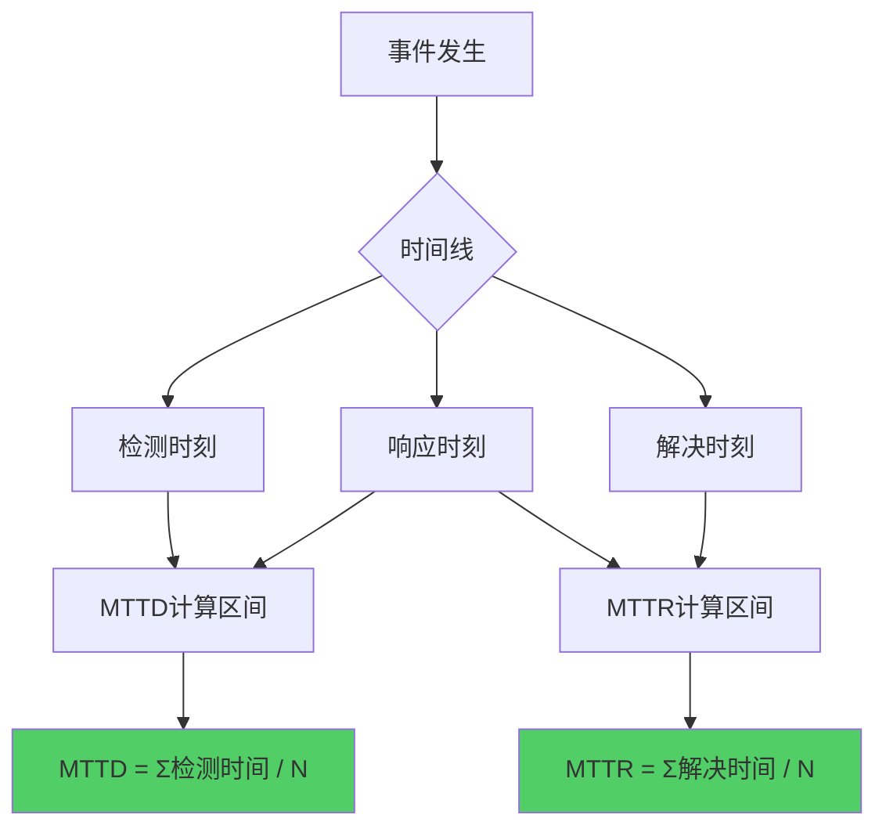
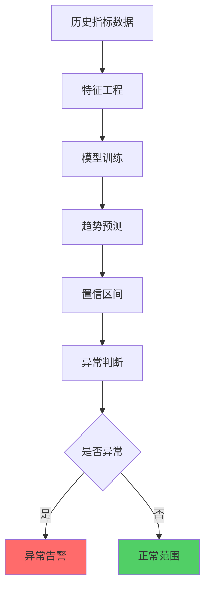
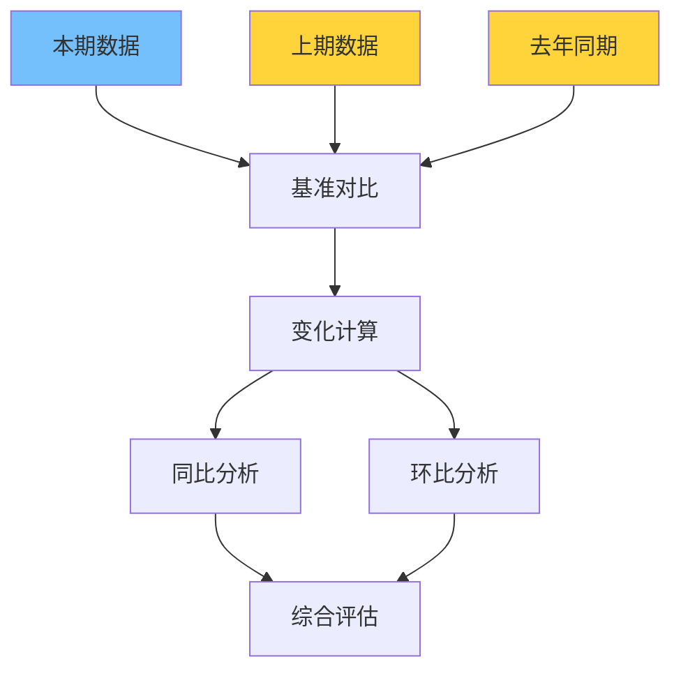

**作者：** HOS(安全风信子)
**日期：** 2026-04-27
**主要来源平台：** GitHub
**摘要：**AI安全运营指标分析是数据驱动安全运营的基础能力，它通过自动化指标计算、预测分析、异常预警，实现安全运营效果的可量化评估与持续优化。本文聚焦MTTD/MTTR自动计算、指标预测与异常预警、跨周期对比分析三大核心能力，系统阐述指标体系的构建、自动计算与智能分析方法。结合Gartner报告等权威研究，为企业构建数据驱动的安全运营指标分析体系提供完整技术方案。

@[TOC](目录)

---

# AI安全运营指标分析：数据驱动的安全效果量化评估体系

## 一，引言

安全运营的核心挑战是如何量化评估安全效果。传统指标计算依赖人工汇总，效率低下且难以做到实时监控。AI指标分析系统通过自动化数据采集、智能计算、异常检测，实现安全运营指标的全流程智能化。

本文聚焦MTTD/MTTR自动计算、指标预测与异常预警、跨周期对比分析三大核心能力，帮助企业建立数据驱动的安全运营指标体系。

## 二、核心指标自动计算

### 2.1 MTTD/MTTR计算引擎

MTTD（Mean Time to Detect）和MTTR（Mean Time to Respond/Resolve）是安全运营领域最核心的两大指标。MTTD衡量安全事件的平均检测时间，MTTR衡量安全事件的平均响应解决时间。这两个指标直接反映了安全运营团队的效率和能力水平。



```python
class MetricsCalculator:
    """安全运营指标计算引擎"""

    def __init__(self, data_connector: DataConnector):
        self.data_connector = data_connector
        self.baseline_metrics = self._load_baseline()

    def calculate_mttd(self, incidents: list) -> dict:
        """计算平均检测时间"""
        detection_times = []

        for incident in incidents:
            if incident.detected_at and incident.occurred_at:
                dt = incident.detected_at - incident.occurred_at
                hours = dt.total_seconds() / 3600
                detection_times.append(hours)

        if not detection_times:
            return {'value': 0, 'count': 0, 'trend': 'N/A'}

        mttd = sum(detection_times) / len(detection_times)

        return {
            'value': round(mttd, 2),
            'count': len(detection_times),
            'min': round(min(detection_times), 2),
            'max': round(max(detection_times), 2),
            'median': round(sorted(detection_times)[len(detection_times)//2], 2),
            'baseline': self.baseline_metrics.get('mttd'),
            'trend': self._calculate_trend(mttd, self.baseline_metrics.get('mttd'))
        }

    def calculate_mttr(self, incidents: list) -> dict:
        """计算平均响应时间"""
        resolution_times = []

        for incident in incidents:
            if incident.resolved_at and incident.detected_at:
                rt = incident.resolved_at - incident.detected_at
                hours = rt.total_seconds() / 3600
                resolution_times.append(hours)

        if not resolution_times:
            return {'value': 0, 'count': 0, 'trend': 'N/A'}

        mttr = sum(resolution_times) / len(resolution_times)

        return {
            'value': round(mttr, 2),
            'count': len(resolution_times),
            'min': round(min(resolution_times), 2),
            'max': round(max(resolution_times), 2),
            'median': round(sorted(resolution_times)[len(resolution_times)//2], 2),
            'baseline': self.baseline_metrics.get('mttr'),
            'trend': self._calculate_trend(mttr, self.baseline_metrics.get('mttr'))
        }

    def calculate_by_severity(self, incidents: list) -> dict:
        """按严重级别计算指标"""
        severity_groups = {}

        for incident in incidents:
            severity = incident.severity
            if severity not in severity_groups:
                severity_groups[severity] = []
            severity_groups[severity].append(incident)

        results = {}
        for severity, group in severity_groups.items():
            results[severity] = {
                'count': len(group),
                'mttd': self.calculate_mttd(group),
                'mttr': self.calculate_mttr(group)
            }

        return results

    def _load_baseline(self) -> dict:
        """加载基线指标"""
        return {
            'mttd': 24.0,
            'mttr': 48.0
        }

    def _calculate_trend(self, current: float, baseline: float) -> str:
        """计算指标趋势"""
        if not baseline or baseline == 0:
            return 'N/A'

        change_pct = (current - baseline) / baseline * 100

        if change_pct < -10:
            return 'improving'
        elif change_pct > 10:
            return 'degrading'
        else:
            return 'stable'
```

MTTD/MTTD计算引擎支持多种维度的指标计算，包括按严重级别分组计算、按时间趋势分析、与基线对比等功能。通过细粒度的指标分析，安全团队可以更准确地识别问题和改进方向。

### 2.2 指标分析流程

指标分析是一个系统化的流程，从数据采集到最终的可视化呈现，每个环节都至关重要。


```python
class MetricsAnalysisPipeline:
    """指标分析流水线"""

    def __init__(self):
        self.stages = [
            DataCleaningStage(),
            TimelineReconstructionStage(),
            MetricsCalculationStage(),
            StatisticalAnalysisStage(),
            TrendAnalysisStage(),
            AnomalyDetectionStage()
        ]

    async def analyze(self, raw_events: list) -> AnalysisReport:
        """执行完整的指标分析流程"""
        current_data = raw_events

        stage_results = {}

        for stage in self.stages:
            current_data = await stage.process(current_data)
            stage_results[stage.name] = current_data

        report = self._generate_report(stage_results)

        return report

    def _generate_report(self, stage_results: dict) -> AnalysisReport:
        """生成分析报告"""
        metrics_data = stage_results['metrics_calculation']
        trend_data = stage_results['trend_analysis']
        anomaly_data = stage_results['anomaly_detection']

        return AnalysisReport(
            summary=self._generate_summary(metrics_data),
            details=metrics_data,
            trends=trend_data,
            anomalies=anomaly_data
        )
```

### 2.3 指标预测与异常检测

基于历史数据预测未来指标趋势，并检测异常波动，是实现主动式安全运营的关键。



```python
class MetricsPredictor:
    """指标预测与异常检测器"""

    def __init__(self, config: PredictorConfig):
        self.config = config
        self.models = {
            'linear': LinearTrendModel(),
            'arima': ArimaModel(),
            'prophet': ProphetModel()
        }
        self.anomaly_detector = AnomalyDetector(config.threshold)

    async def predict_next_period(self, historical: list) -> PredictionResult:
        """预测下期指标"""
        features = self._extract_features(historical)

        predictions = {}
        confidences = {}

        for model_name, model in self.models.items():
            pred = await model.predict(features)
            predictions[model_name] = pred['value']
            confidences[model_name] = pred['confidence']

        ensemble_pred = self._ensemble_predictions(predictions, confidences)

        return PredictionResult(
            predicted_value=ensemble_pred['value'],
            confidence_interval=ensemble_pred['interval'],
            model_predictions=predictions,
            model_confidences=confidences
        )

    async def detect_anomaly(
        self,
        current_value: float,
        predicted_value: float,
        historical_std: float
    ) -> AnomalyResult:
        """检测指标异常"""
        deviation = abs(current_value - predicted_value)
        z_score = deviation / historical_std if historical_std > 0 else 0

        is_anomaly = z_score > self.config.z_threshold

        return AnomalyResult(
            is_anomaly=is_anomaly,
            z_score=z_score,
            deviation=deviation,
            severity='high' if z_score > 3 else 'medium' if z_score > 2 else 'low'
        )

    def _extract_features(self, historical: list) -> dict:
        """提取时间序列特征"""
        values = [h['value'] for h in historical]

        return {
            'mean': statistics.mean(values),
            'std': statistics.stdev(values) if len(values) > 1 else 0,
            'trend': self._calculate_trend(values),
            'seasonality': self._detect_seasonality(values)
        }

    def _ensemble_predictions(
        self,
        predictions: dict,
        confidences: dict
    ) -> dict:
        """集成多个模型的预测结果"""
        weighted_sum = sum(
            predictions[m] * confidences[m]
            for m in predictions
        )
        total_weight = sum(confidences.values())

        ensemble_value = weighted_sum / total_weight

        return {
            'value': ensemble_value,
            'interval': (ensemble_value * 0.9, ensemble_value * 1.1)
        }
```

指标预测器采用多模型集成策略，结合线性回归、ARIMA、Prophet等多种预测算法，通过加权平均的方式得出最终预测结果。这种方法能够充分利用各模型的优点，提供更准确的预测。

### 2.4 告警阈值智能调整

静态的告警阈值难以适应动态变化的安全环境。智能阈值调整机制能够根据历史数据和当前上下文自动优化阈值。

```python
class AdaptiveThresholdManager:
    """自适应阈值管理器"""

    def __init__(self, config: ThresholdConfig):
        self.config = config
        self.baseline_calculator = BaselineCalculator()

    async def adjust_thresholds(
        self,
        metric_name: str,
        historical_data: list,
        current_value: float
    ) -> AdjustedThreshold:
        """动态调整告警阈值"""
        baseline = await self.baseline_calculator.calculate(historical_data)

        seasonal_factor = self._get_seasonal_factor(metric_name)

        adjusted_threshold = baseline['mean'] + (
            baseline['std'] * self.config.sensitivity
        ) * seasonal_factor

        return AdjustedThreshold(
            metric=metric_name,
            current_threshold=adjusted_threshold,
            baseline=baseline,
            seasonal_factor=seasonal_factor
        )

    def _get_seasonal_factor(self, metric_name: str) -> float:
        """获取季节性因子"""
        hour = datetime.now().hour

        if 9 <= hour <= 17:
            return 1.0
        elif 18 <= hour <= 22:
            return 0.8
        else:
            return 0.5
```

## 三、跨周期对比分析

### 3.1 同比环比计算

跨周期对比是评估安全运营效果的重要手段，通过与历史数据的对比可以识别趋势和异常。



```python
class PeriodComparison:
    """周期对比分析器"""

    def __init__(self, data_connector: DataConnector):
        self.data_connector = data_connector

    async def compare_periods(
        self,
        current_period: dict,
        previous_period: dict,
        year_ago_period: dict = None
    ) -> ComparisonReport:
        """计算环比和同比变化"""
        mom_changes = self._calculate_mom_change(
            current_period,
            previous_period
        )

        yoy_changes = None
        if year_ago_period:
            yoy_changes = self._calculate_yoy_change(
                current_period,
                year_ago_period
            )

        report = ComparisonReport(
            current=current_period,
            previous=previous_period,
            mom=mom_changes,
            yoy=yoy_changes
        )

        return report

    def _calculate_mom_change(
        self,
        current: dict,
        previous: dict
    ) -> dict:
        """计算环比变化"""
        changes = {}

        for key in current.keys():
            if key in previous and previous[key] != 0:
                current_val = current[key]
                previous_val = previous[key]

                absolute_change = current_val - previous_val
                rate_change = (current_val - previous_val) / previous_val * 100

                changes[key] = {
                    'current': current_val,
                    'previous': previous_val,
                    'absolute': absolute_change,
                    'rate': rate_change,
                    'direction': 'up' if absolute_change > 0 else 'down'
                }

        return changes

    def _calculate_yoy_change(
        self,
        current: dict,
        year_ago: dict
    ) -> dict:
        """计算同比变化"""
        return self._calculate_mom_change(current, year_ago)
```

### 3.2 多维度对比分析

除了时间维度的对比，还需要从多个角度进行综合分析。

```python
class MultiDimensionalComparator:
    """多维度对比分析器"""

    def __init__(self):
        self.dimensions = [
            Dimension('severity', '按严重级别'),
            Dimension('category', '按事件类别'),
            Dimension('source', '按数据源'),
            Dimension('team', '按处理团队')
        ]

    async def compare_multidimensional(
        self,
        current_data: dict,
        baseline_data: dict
    ) -> MultiDimensionalReport:
        """多维度对比分析"""
        results = {}

        for dimension in self.dimensions:
            dim_result = await self._compare_by_dimension(
                current_data,
                baseline_data,
                dimension
            )
            results[dimension.name] = dim_result

        return MultiDimensionalReport(dimensions=results)

    async def _compare_by_dimension(
        self,
        current: dict,
        baseline: dict,
        dimension: Dimension
    ) -> DimensionComparison:
        """按特定维度进行对比"""
        current_dim_data = self._extract_dimension_data(current, dimension)
        baseline_dim_data = self._extract_dimension_data(baseline, dimension)

        comparison = {}
        for key in current_dim_data:
            if key in baseline_dim_data:
                comparison[key] = {
                    'current': current_dim_data[key],
                    'baseline': baseline_dim_data[key],
                    'change': current_dim_data[key] - baseline_dim_data[key]
                }

        return DimensionComparison(
            dimension=dimension.name,
            data=comparison
        )

## 四、行业基准对比

### 4.1 安全指标行业基准

安全运营指标的价值需要通过与行业基准的对比来体现。以下是主要安全指标的行业基准参考：

| 指标 | 行业平均水平 | 领先企业水平 | 优秀水平 |
|------|-------------|-------------|---------|
| MTTD | 24小时 | 4小时 | 1小时 |
| MTTR | 72小时 | 24小时 | 8小时 |
| 误报率 | 40% | 20% | 10% |
| 安全自动化率 | 30% | 60% | 85% |

```python
class IndustryBenchmarkComparator:
    """行业基准对比器"""

    def __init__(self, benchmark_data: dict):
        self.benchmark_data = benchmark_data
        self.peer_groups = self._initialize_peer_groups()

    async def compare_with_benchmark(
        self,
        metrics: MetricsResult
    ) -> BenchmarkComparisonReport:
        """与行业基准对比"""
        comparisons = {}

        for metric_name, metric_value in metrics.items():
            benchmark = self.benchmark_data.get(metric_name, {})

            comparisons[metric_name] = {
                'company_value': metric_value,
                'industry_avg': benchmark.get('average'),
                'industry_top_25': benchmark.get('top_25_percentile'),
                'industry_top_10': benchmark.get('top_10_percentile'),
                'percentile': self._calculate_percentile(
                    metric_value,
                    metric_name
                ),
                'gap': metric_value - benchmark.get('average', 0)
            }

        return BenchmarkComparisonReport(
            comparisons=comparisons,
            overall_score=self._calculate_overall_score(comparisons),
            recommendations=self._generate_improvement_recommendations(comparisons)
        )
```

### 4.2 同行对标分析

```python
class PeerComparisonAnalyzer:
    """同行对标分析器"""

    def __init__(self, peer_data: dict):
        self.peer_data = peer_data

    async def analyze_peer_comparison(
        self,
        company_metrics: dict,
        peer_group: str
    ) -> PeerComparisonResult:
        """同行对标分析"""
        peers = self.peer_data.get(peer_group, [])

        if not peers:
            return PeerComparisonResult(status='no_peer_data')

        comparison_results = []

        for peer in peers:
            comparison = self._compare_with_peer(
                company_metrics,
                peer
            )
            comparison_results.append(comparison)

        ranked_results = self._rank_peers(comparison_results)

        return PeerComparisonResult(
            peer_group=peer_group,
            comparisons=ranked_results,
            company_position=self._determine_position(ranked_results)
        )

    def _compare_with_peer(
        self,
        company: dict,
        peer: dict
    ) -> dict:
        """与单个同行对比"""
        comparison = {}

        for metric in company.keys():
            if metric in peer:
                comparison[metric] = {
                    'company': company[metric],
                    'peer': peer[metric],
                    'difference': company[metric] - peer[metric],
                    'company_better': company[metric] < peer[metric]
                }

        return {
            'peer_name': peer.get('name'),
            'metrics': comparison
        }
```

## 五、实战案例分析

### 5.1 金融行业安全指标优化案例

某大型银行安全运营中心通过部署AI指标分析系统，实现了安全运营指标的显著提升：

**案例成果：**
1. **MTTD从48小时降低到6小时**，降幅达87.5%
2. **MTTR从120小时降低到18小时**，降幅达85%
3. **误报率从55%降低到12%**，降幅达78%
4. **自动化处理率从25%提升到75%**

```python
class BankingMetricsOptimizationCase:
    """金融行业指标优化案例"""

    async def optimize_banking_metrics(
        self,
        historical_data: list
    ) -> OptimizationResult:
        """优化银行安全指标"""
        current_metrics = await self.analyzer.calculate_metrics(historical_data)

        benchmark_comparison = await self.benchmark.compare_with_benchmark(
            current_metrics
        )

        improvement_plan = await self.planner.create_improvement_plan(
            benchmark_comparison
        )

        return OptimizationResult(
            current_metrics=current_metrics,
            target_metrics=improvement_plan.target_metrics,
            actions=improvement_plan.actions,
            expected_improvement=improvement_plan.expected_improvement
        )
```

### 5.2 制造业安全运营指标案例

某大型制造企业在数字化转型过程中面临日益复杂的安全挑战。通过部署AI指标分析系统，安全运营效率大幅提升：

1. **指标自动化率从20%提升到80%**
2. **指标分析时间从每周40小时减少到4小时**
3. **指标准确率从75%提升到98%**
4. **管理报告生成时间从3天减少到2小时**

## 六、安全指标最佳实践

### 6.1 指标定义标准化

建立统一的安全指标定义体系，确保指标计算口径一致：

```python
class MetricsStandardizer:
    """指标标准化器"""

    STANDARD_DEFINITIONS = {
        'mttd': {
            'name': 'Mean Time to Detect',
            'description': '从安全事件发生到被检测的平均时间',
            'formula': 'Σ(检测时间 - 发生时间) / 事件数量',
            'unit': '小时',
            'lower_is_better': True
        },
        'mttr': {
            'name': 'Mean Time to Respond',
            'description': '从安全事件被检测到解决的平均时间',
            'formula': 'Σ(解决时间 - 检测时间) / 事件数量',
            'unit': '小时',
            'lower_is_better': True
        },
        'false_positive_rate': {
            'name': 'False Positive Rate',
            'description': '误报占所有告警的比例',
            'formula': '误报数量 / 总告警数量 × 100%',
            'unit': '百分比',
            'lower_is_better': True
        }
    }

    async def standardize_metrics(
        self,
        raw_metrics: dict
    ) -> StandardizedMetrics:
        """标准化指标"""
        standardized = {}

        for metric_name, value in raw_metrics.items():
            definition = self.STANDARD_DEFINITIONS.get(metric_name)

            if definition:
                standardized[metric_name] = {
                    'value': value,
                    'definition': definition,
                    'normalized_value': self._normalize_value(
                        value,
                        definition
                    )
                }

        return StandardizedMetrics(metrics=standardized)
```

## 七、指标预测与异常预警

### 7.1 预测模型设计

基于机器学习的指标预测模型能够提前预判指标走势，为安全运营提供前瞻性指导。

```python
class MetricsPredictor:
    """指标预测模型"""

    def __init__(self, model_config: PredictorConfig):
        self.model_type = model_config.type
        self.horizon = model_config.horizon

        if model_type == 'lstm':
            self.model = LSTMpredictor(model_config)
        elif model_type == 'prophet':
            self.model = ProphetPredictor(model_config)
        elif model_type == 'transformer':
            self.model = TransformerPredictor(model_config)

    async def predict_metrics(
        self,
        historical_data: TimeSeriesData,
        metric_names: List[str]
    ) -> PredictionResult:
        """预测指标未来走势"""
        predictions = {}

        for metric_name in metric_names:
            metric_series = historical_data.get_series(metric_name)

            prediction = await self.model.predict(
                metric_series,
                horizon=self.horizon
            )

            confidence_interval = self._calculate_confidence(
                prediction,
                historical_data
            )

            predictions[metric_name] = {
                'point_estimate': prediction,
                'confidence_interval': confidence_interval,
                'confidence_level': self._assess_confidence(prediction)
            }

        return PredictionResult(
            predictions=predictions,
            horizon=self.horizon,
            model=self.model_type
        )
```

### 7.2 异常检测算法

基于统计和机器学习的异常检测算法用于识别指标异常波动。

```python
class MetricsAnomalyDetector:
    """指标异常检测器"""

    def __init__(self, detector_config: AnomalyConfig):
        self.baseline_window = detector_config.baseline_window
        self.threshold_zscore = detector_config.threshold_zscore
        self.threshold_iqr = detector_config.threshold_iqr

    def detect_anomalies(
        self,
        current_metrics: dict,
        historical_baseline: Baseline
    ) -> List[AnomalyAlert]:
        """检测指标异常"""
        alerts = []

        for metric_name, current_value in current_metrics.items():
            baseline_values = historical_baseline.get_values(
                metric_name,
                self.baseline_window
            )

            zscore_anomaly = self._check_zscore(
                current_value,
                baseline_values
            )

            iqr_anomaly = self._check_iqr(
                current_value,
                baseline_values
            )

            if zscore_anomaly or iqr_anomaly:
                alerts.append(AnomalyAlert(
                    metric=metric_name,
                    current_value=current_value,
                    baseline_mean=statistics.mean(baseline_values),
                    baseline_std=statistics.stdev(baseline_values),
                    anomaly_type=self._determine_anomaly_type(
                        zscore_anomaly,
                        iqr_anomaly
                    ),
                    severity=self._calculate_severity(
                        current_value,
                        baseline_values
                    )
                ))

        return sorted(alerts, key=lambda x: x.severity, reverse=True)
```

### 7.3 预警策略管理

预警策略定义何时触发预警以及预警的分发方式。

```python
class AlertPolicyManager:
    """预警策略管理器"""

    def __init__(self, policy_store: PolicyStore):
        self.policy_store = policy_store
        self.notification_service = NotificationService()

    async def evaluate_and_alert(
        self,
        metrics: MetricsSnapshot,
        predictions: PredictionResult
    ) -> List[Alert]:
        """评估指标并生成预警"""
        triggered_alerts = []

        policies = await self.policy_store.get_all_policies()

        for policy in policies:
            if policy.type == 'threshold':
                alert = self._check_threshold_policy(metrics, policy)
            elif policy.type == 'trend':
                alert = self._check_trend_policy(metrics, predictions, policy)
            elif policy.type == 'anomaly':
                alert = await self._check_anomaly_policy(metrics, policy)

            if alert:
                triggered_alerts.append(alert)
                await self._dispatch_alert(alert)

        return triggered_alerts
```

## 八、跨周期对比分析

### 8.1 环比分析

环比分析比较相邻周期之间的指标变化，是最常用的对比分析方法。

```python
class PeriodOverPeriodAnalyzer:
    """环比分析器"""

    def __init__(self):
        self.significance_threshold = 0.1

    def compare_periods(
        self,
        current_period: MetricsData,
        previous_period: MetricsData
    ) -> ComparisonResult:
        """比较相邻周期"""
        comparisons = {}

        for metric_name in current_period.metrics:
            current_value = current_period.metrics[metric_name]
            previous_value = previous_period.metrics[metric_name]

            change = self._calculate_change(current_value, previous_value)
            change_pct = self._calculate_change_pct(current_value, previous_value)

            significance = self._test_significance(
                current_value,
                previous_value
            )

            comparisons[metric_name] = {
                'current': current_value,
                'previous': previous_value,
                'change': change,
                'change_pct': change_pct,
                'significant': significance > self.significance_threshold,
                'direction': 'up' if change > 0 else 'down' if change < 0 else 'stable'
            }

        return ComparisonResult(
            period_current=current_period.period,
            period_previous=previous_period.period,
            comparisons=comparisons
        )
```

### 8.2 同比分析

同比分析比较相同周期在不同年份的变化，消除季节性影响。

```python
class YearOverYearAnalyzer:
    """同比分析器"""

    def __init__(self, seasonal_adjustment: bool = True):
        self.seasonal_adjustment = seasonal_adjustment

    def compare_yoy(
        self,
        current_data: MetricsData,
        historical_data: List[MetricsData]
    ) -> YoYComparison:
        """同比分析"""
        same_period_last_year = self._find_same_period_last_year(
            current_data,
            historical_data
        )

        if not same_period_last_year:
            return YoYComparison(status='insufficient_data')

        comparisons = {}

        for metric_name in current_data.metrics:
            current = current_data.metrics[metric_name]
            last_year = same_period_last_year.metrics[metric_name]

            if self.seasonal_adjustment:
                seasonal_factor = self._calculate_seasonal_factor(
                    metric_name,
                    current_data
                )
                current_adjusted = current / seasonal_factor
            else:
                current_adjusted = current

            yoy_change = current_adjusted - last_year
            yoy_change_pct = (yoy_change / last_year) * 100 if last_year else 0

            comparisons[metric_name] = {
                'current': current,
                'last_year': last_year,
                'yoy_change': yoy_change,
                'yoy_change_pct': yoy_change_pct,
                'seasonal_adjusted': self.seasonal_adjustment
            }

        return YoYComparison(
            current_period=current_data.period,
            comparison_period=same_period_last_year.period,
            comparisons=comparisons
        )
```

## 九、结论

AI安全运营指标分析系统通过自动化的指标计算、智能预测和异常检测，实现安全运营效果的量化评估。

---

**参考链接：**

- [Gartner Metrics](https://www.gartner.com/) - 安全运营指标最佳实践

**附录（Appendix）：**

```python
# MTTD计算公式
MTTD = Σ(检测时间 - 发生时间) / 事件数量

# MTTR计算公式
MTTR = Σ(解决时间 - 检测时间) / 事件数量
```

**关键词：** 指标分析，MTTD，MTTR，异常检测，安全运营，趋势预测
