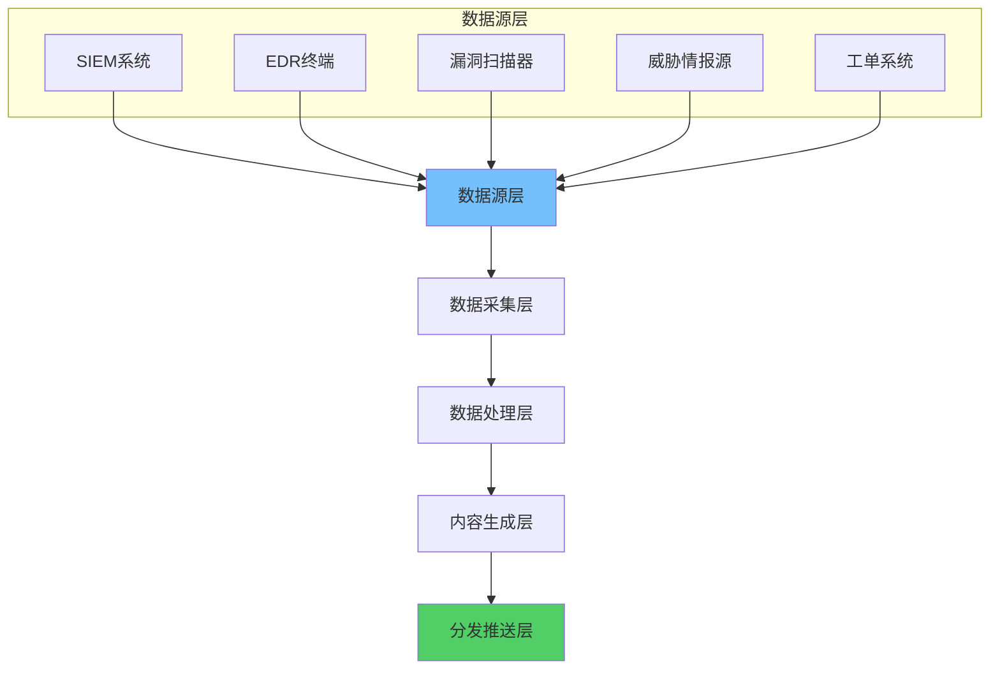
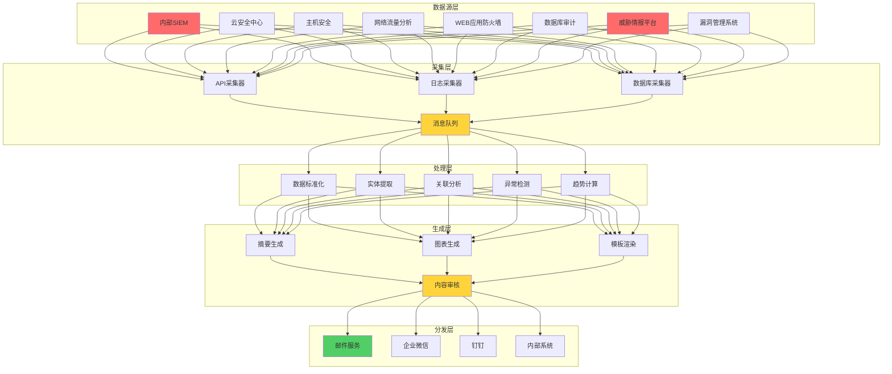
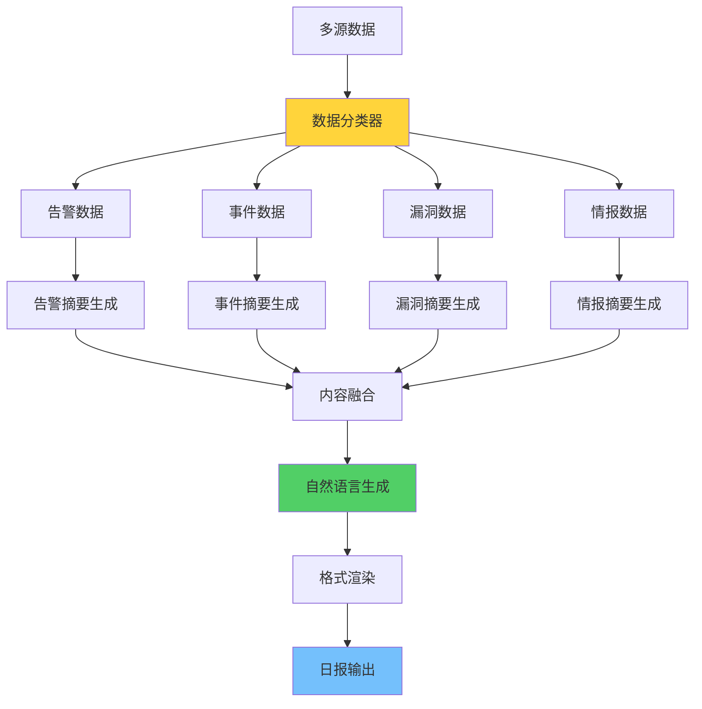
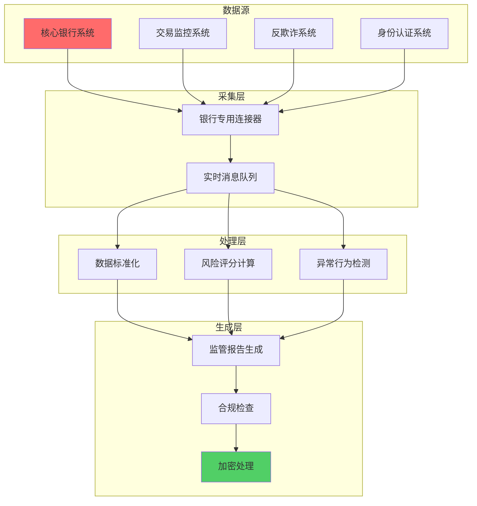

**作者：** HOS(安全风信子)
**日期：** 2026-04-27
**主要来源平台：** GitHub
**摘要：**AI日报生成系统实现安全运营日报的全流程自动化，从数据采集到智能摘要，从模板渲染到分发推送。本文聚焦多源数据自动采集、智能摘要生成、个性化模板三大核心能力，为企业构建高效的日报自动化体系提供完整技术方案。

@[TOC](目录)

---

# AI日报生成系统：安全运营日报的自动化实践

## 一，引言

安全日报是运营团队日常工作汇报的重要载体。传统日报依赖人工汇总，耗时且容易遗漏关键信息。AI日报生成系统实现数据自动采集、内容智能分析、模板自动渲染，显著提升日报效率。在当今网络安全形势日益严峻的背景下，安全运营团队每天需要处理海量的安全数据，包括来自SIEM系统的告警、EDR终端的安全事件、漏洞扫描器的发现、威胁情报平台的最新动态以及ITSM系统中的运维工单。传统的人工汇总方式不仅效率低下，而且容易因为分析师的个人经验差异导致报告质量参差不齐。更重要的是，人工编写日报需要消耗分析师大量宝贵的时间，这些时间本可以用于更高级的安全分析和威胁狩猎工作。

AI日报生成系统的核心价值在于将分析师从繁琐的日报编写工作中解放出来，让他们能够专注于更有价值的安全分析任务。系统通过自动化的数据采集管道，从各个安全数据源汇集必要的信息，然后通过智能的数据处理管道对原始数据进行清洗、标准化和关联分析，最后利用大语言模型的能力生成自然、专业的日报内容。这种端到端的自动化不仅大幅提升了日报生成的效率，还确保了报告内容的一致性和客观性。

### 1.1 安全日报的核心价值

安全日报在企业安全运营体系中扮演着至关重要的角色，它不仅是日常安全运营工作的记录载体，更是安全团队与管理层之间沟通的重要桥梁。一份高质量的安全日报能够帮助管理层及时了解当前的安全态势，掌握安全团队的工作成效，同时也为后续的安全投入和策略调整提供数据支撑。

从内容角度来看，安全日报通常包含以下几个核心部分：首先是执行摘要部分，这部分内容面向企业高层管理者，需要用简洁明了的语言概括当日的安全整体状况，突出重点安全事件和关键指标，让决策者能够在最短时间内把握全局；其次是详细的运营数据部分，包括各类安全告警的统计数据、事件处理情况、漏洞修复进展等，这部分内容面向安全运营团队的技术人员，需要提供足够的技术细节支撑日常运营决策；最后是建议和改进措施部分，基于当日发现的安全问题提出具体的处置建议和预防措施。

### 1.2 传统日报生成的痛点

传统的日报生成方式存在诸多痛点，这些痛点在安全数据量不断增长的背景下愈发突出。第一是效率问题，一位经验丰富的安全分析师平均需要花费1-2小时来收集、整理和分析当日的安全数据，然后还要花费额外的时间来撰写和校对日报内容。对于大型企业而言，安全运营团队每天可能需要生成面向不同角色的多份日报，这项工作所消耗的时间成本是相当可观的。

第二是一致性问题。不同分析师由于经验和偏好的差异，对于同一安全事件的描述和判断可能存在差异，这导致日报的质量和风格难以保持一致。有些分析师可能更关注技术细节，有些则更侧重于管理视角，这种主观差异影响了日报的可比性和可用性。

第三是覆盖度问题。在人工编写日报的情况下，由于时间限制，分析师往往只能覆盖最重要的安全事件和数据，而忽略一些相对次要但同样有价值的趋势和模式。这种信息损失可能导致管理层无法获得完整的安全态势视图，从而影响决策的全面性和准确性。

第四是及时性问题。传统日报通常在第二天早晨提交，这意味着管理层看到的信息存在至少半天到一天的延迟。在网络安全领域，这个时间窗口可能已经足够攻击者完成一次完整的攻击活动。实时或者近实时的日报生成能力对于快速响应安全事件至关重要。

### 1.3 AI日报系统的设计目标

基于上述痛点分析，AI日报生成系统的设计目标可以概括为以下几个方面。首先是全自动化，系统应该能够从数据采集、内容生成到报告分发实现全流程自动化，最大程度减少人工干预。数据采集层应该能够对接企业现有的各类安全设备和系统，包括SIEM、EDR、漏洞扫描器、威胁情报平台等，建立起完整的数据采集管道。

其次是高质量输出，生成的日报应该具有专业的水准，内容准确、语言精炼、格式规范。系统应该具备完善的质量控制机制，能够自动检测和修正日报中的问题，确保最终输出的报告达到可发布的质量标准。同时，系统应该支持多角色适配，根据不同受众的需求生成不同深度和侧重点的报告内容。

第三是及时性，系统应该能够在约定的时间点自动触发日报生成流程，确保日报能够在要求的时间前完成。对于紧急情况，系统应该支持手动触发的即时生成模式，快速产出针对性的报告。

第四是可扩展性，系统的架构设计应该具备良好的可扩展性，能够适应企业规模的增长和安全数据源的扩展。同时，系统应该提供灵活的配置接口，允许安全团队根据自身需求调整报告的内容、格式和分发规则。

## 二、系统架构

### 2.1 整体架构设计

AI日报生成系统采用四层架构设计，确保从数据采集到内容生成的完整流程自动化。这种分层架构的设计理念是将系统的不同功能模块进行解耦，每个模块专注于完成特定的任务，同时通过标准化的接口与其他模块进行交互。这种设计不仅提高了系统的可维护性和可测试性，还为后续的功能扩展和性能优化提供了良好的基础。



**数据源层**汇聚各类安全数据，包括SIEM告警数据、EDR终端事件、漏洞扫描结果、威胁情报以及工单系统的运维数据。这些异构数据通过标准化接口统一汇聚到数据采集层。在企业实际的安全运营环境中，数据源层通常是最为复杂的部分，因为需要对接各种各样的安全设备和系统。这些数据源在数据类型、数据格式、数据量级和更新频率等方面都存在显著差异。

**数据采集层**负责从各数据源提取原始数据，进行初步的过滤、清洗和格式标准化。采集层的设计需要考虑以下几个方面：首先是连接的可靠性，由于安全设备可能存在网络波动或临时不可用的情况，采集层需要具备重试机制和断点续传能力；其次是采集的效率，在数据量较大的场景下，采集层需要能够高效地完成数据拉取任务，避免对上游系统造成过大的压力；最后是数据的安全性，采集过程中涉及敏感的安全数据，需要采取必要的加密和访问控制措施。

**数据处理层**对采集的数据进行深度处理，包括数据分类、实体识别、关联分析、异常检测等智能分析。处理层是整个系统的智能核心，它将原始的安全数据转化为结构化的信息，为后续的内容生成提供高质量的输入。处理层的核心能力包括：对非结构化或半结构化数据的标准化处理、基于规则的初步分类和过滤、基于机器学习算法的异常检测、以及多源数据的关联分析。

**内容生成层**基于处理结果生成日报内容，包括摘要生成、图表制作、趋势分析等。生成层利用大语言模型的能力，将结构化的数据转化为自然、专业的文字描述。同时，生成层还负责生成各种图表和可视化内容，使报告更加直观易懂。生成层的输出质量直接决定了最终日报的可读性和可用性，因此需要精心设计prompt和后处理逻辑。

**分发推送层**将生成的日报按照预定规则推送给不同角色，支持邮件、企业微信、钉钉等多种渠道。分发层需要管理复杂的分发规则，包括根据角色选择报告模板、根据收件人偏好选择推送渠道、以及处理推送失败的重试逻辑等。



### 2.2 数据采集层

数据采集层是整个系统的数据入口，需要对接多种异构数据源。每种数据源有其独特的数据格式和接口方式，数据采集层负责将这些差异屏蔽，提供统一的数据访问接口。采集层的设计遵循适配器模式，每个数据源对应一个专门的连接器，连接器负责将特定数据源的接口和数据格式转换为系统内部统一的标准格式。

```python
class DataCollector:
    """多源数据采集器"""

    def __init__(self, config: CollectorConfig):
        self.config = config
        self.connectors = {}
        self.message_queue = MessageQueue(config.queue_url)
        self._initialize_connectors()

    def _initialize_connectors(self):
        """初始化所有数据连接器"""
        self.connectors = {
            'siem': SIEMConnector(self.config.siem),
            'edr': EDRConnector(self.config.edr),
            'vulnerability': VulnScannerConnector(self.config.vuln_scanner),
            'threat_intel': ThreatIntelConnector(self.config.threat_intel),
            'itsm': ITSMConnector(self.config.itsm)
        }

    async def collect_all(self, date: str) -> dict:
        """采集所有数据源的日报数据"""
        tasks = []
        for name, connector in self.connectors.items():
            task = self._collect_from_source(name, connector, date)
            tasks.append(task)

        results = await asyncio.gather(*tasks, return_exceptions=True)

        return {
            name: result for name, result in zip(self.connectors.keys(), results)
        }

    async def _collect_from_source(
        self,
        source_name: str,
        connector: DataSourceConnector,
        date: str
    ) -> dict:
        """从单个数据源采集数据"""
        try:
            data = await connector.fetch_daily_data(date)
            await self._publish_to_queue(source_name, data)
            return {'status': 'success', 'count': len(data)}
        except Exception as e:
            logger.error(f"Failed to collect from {source_name}: {e}")
            return {'status': 'error', 'error': str(e)}

    async def _publish_to_queue(self, source: str, data: list):
        """发布数据到消息队列"""
        for item in data:
            message = {
                'source': source,
                'data': item,
                'collected_at': datetime.now().isoformat()
            }
            await self.message_queue.publish(json.dumps(message))
```

数据采集器采用异步架构设计，能够并发地从多个数据源采集数据，提高采集效率。每个数据源都有独立的连接器和错误处理机制，单个数据源的故障不会影响其他数据源的采集。这种设计确保了系统的健壮性，即使某个数据源出现临时不可用的情况，其他数据源的采集工作仍然可以正常进行。

### 2.2.1 多源数据聚合器详细设计

多源数据聚合器是数据采集层的核心组件，它负责协调多个数据源的采集工作，并对采集到的数据进行初步的聚合处理。一个设计良好的数据聚合器需要具备以下特性：高吞吐量，能够处理来自多个数据源的大量数据；低延迟，数据采集和聚合的处理时间应该尽可能短；可观测性，采集过程的各个环节都需要有完善的日志和监控；可扩展性，当需要添加新的数据源时，应该能够方便地进行扩展。

```python
class MultiSourceDataAggregator:
    """多源数据聚合器"""

    def __init__(self, config: AggregatorConfig):
        self.config = config
        self.source_connectors = {}
        self.data_buffer = DataBuffer(max_size=config.buffer_size)
        self.enrichment_pipeline = EnrichmentPipeline()
        self.quality_controller = DataQualityController()
        self._init_connectors()

    def _init_connectors(self):
        """初始化所有数据源连接器"""
        self.source_connectors = {
            'siem_alerts': SIEMAlertConnector(
                endpoint=self.config.siem.endpoint,
                auth_type=self.config.siem.auth_type,
                credentials=self.config.siem.credentials
            ),
            'siem_events': SIEMEventConnector(
                endpoint=self.config.siem.endpoint,
                auth_type=self.config.siem.auth_type,
                credentials=self.config.siem.credentials
            ),
            'edr_agents': EDRAgentConnector(
                controller=self.config.edr.controller,
                api_key=self.config.edr.api_key
            ),
            'edr_alerts': EDRAlertConnector(
                controller=self.config.edr.controller,
                api_key=self.config.edr.api_key
            ),
            'vuln_scanner': VulnScannerConnector(
                scanner_url=self.config.vuln_scanner.url,
                auth_token=self.config.vuln_scanner.auth_token
            ),
            'threat_intel_global': GlobalThreatIntelConnector(
                providers=self.config.threat_intel.global_providers
            ),
            'threat_intel_industry': IndustryThreatIntelConnector(
                isac_name=self.config.threat_intel.isac
            ),
            'itsm_tickets': ITSMTicketConnector(
                service_now_url=self.config.itsm.service_now_url,
                credentials=self.config.itsm.credentials
            ),
            'firewall_logs': FirewallLogConnector(
                log_server=self.config.firewall.log_server,
                protocol=self.config.firewall.protocol
            ),
            'ids_ips_logs': IDSIPSLogConnector(
                sensor_endpoints=self.config.ids_ips.endpoints,
                protocol=self.config.ids_ips.protocol
            )
        }

    async def aggregate_daily_data(self, target_date: date) -> AggregatedData:
        """聚合指定日期的多源数据"""
        logger.info(f"Starting daily data aggregation for {target_date}")

        collection_tasks = []
        for source_name, connector in self.source_connectors.items():
            task = self._collect_from_source_async(source_name, connector, target_date)
            collection_tasks.append(task)

        collection_results = await asyncio.gather(
            *collection_tasks,
            return_exceptions=True
        )

        raw_data_map = {}
        for source_name, result in zip(self.source_connectors.keys(), collection_results):
            if isinstance(result, Exception):
                logger.error(f"Collection failed for {source_name}: {result}")
                raw_data_map[source_name] = {'status': 'error', 'data': [], 'error': str(result)}
            else:
                raw_data_map[source_name] = result

        enriched_data = await self._enrich_all_data(raw_data_map)

        validated_data = await self._validate_all_data(enriched_data)

        aggregated = self._merge_and_index(validated_data)

        summary = self._generate_collection_summary(raw_data_map, enriched_data, aggregated)

        logger.info(f"Daily data aggregation completed: {summary}")

        return AggregatedData(
            date=target_date,
            raw_data=raw_data_map,
            enriched_data=enriched_data,
            aggregated=aggregated,
            summary=summary
        )

    async def _collect_from_source_async(
        self,
        source_name: str,
        connector: BaseConnector,
        target_date: date
    ) -> dict:
        """异步从单个数据源采集数据"""
        start_time = datetime.now()
        retry_count = 0
        max_retries = self.config.max_retries

        while retry_count < max_retries:
            try:
                data = await connector.fetch(
                    start_time=datetime.combine(target_date, time.min),
                    end_time=datetime.combine(target_date, time.max)
                )

                elapsed = (datetime.now() - start_time).total_seconds()

                return {
                    'status': 'success',
                    'source': source_name,
                    'data': data,
                    'count': len(data),
                    'collection_time': elapsed,
                    'retry_count': retry_count
                }

            except TemporaryException as e:
                retry_count += 1
                wait_time = self.config.retry_delay * retry_count
                logger.warning(
                    f"Temporary error collecting from {source_name}, "
                    f"retry {retry_count}/{max_retries} after {wait_time}s: {e}"
                )
                await asyncio.sleep(wait_time)

            except PermanentException as e:
                logger.error(f"Permanent error collecting from {source_name}: {e}")
                return {
                    'status': 'error',
                    'source': source_name,
                    'data': [],
                    'error': str(e),
                    'error_type': 'permanent'
                }

        return {
            'status': 'error',
            'source': source_name,
            'data': [],
            'error': f'Max retries ({max_retries}) exceeded',
            'error_type': 'max_retries'
        }

    async def _enrich_all_data(self, raw_data_map: dict) -> dict:
        """对所有采集数据进行富化"""
        enriched_map = {}

        for source_name, raw_data in raw_data_map.items():
            if raw_data.get('status') != 'success':
                enriched_map[source_name] = raw_data
                continue

            try:
                enriched_data = await self.enrichment_pipeline.enrich(
                    source_name=source_name,
                    raw_data=raw_data['data']
                )
                enriched_map[source_name] = {
                    'status': 'success',
                    'data': enriched_data,
                    'count': len(enriched_data),
                    'enrichment_applied': True
                }
            except Exception as e:
                logger.error(f"Enrichment failed for {source_name}: {e}")
                enriched_map[source_name] = {
                    'status': 'partial',
                    'data': raw_data['data'],
                    'count': len(raw_data['data']),
                    'enrichment_applied': False,
                    'enrichment_error': str(e)
                }

        return enriched_map

    async def _validate_all_data(self, enriched_data_map: dict) -> dict:
        """验证所有富化后的数据"""
        validated_map = {}

        for source_name, enriched_data in enriched_data_map.items():
            if enriched_data.get('status') == 'error':
                validated_map[source_name] = enriched_data
                continue

            try:
                validation_result = await self.quality_controller.validate(
                    source_name=source_name,
                    data=enriched_data['data']
                )

                validated_map[source_name] = {
                    **enriched_data,
                    'validation': validation_result,
                    'quality_score': validation_result.overall_score
                }
            except Exception as e:
                logger.error(f"Validation failed for {source_name}: {e}")
                validated_map[source_name] = {
                    **enriched_data,
                    'validation': None,
                    'quality_score': 0.0,
                    'validation_error': str(e)
                }

        return validated_map

    def _merge_and_index(self, validated_data_map: dict) -> MergedData:
        """合并并索引所有数据"""
        all_items = []
        item_index = {}

        for source_name, source_data in validated_data_map.items():
            if source_data.get('status') in ['success', 'partial']:
                for item in source_data.get('data', []):
                    item['source'] = source_name
                    all_items.append(item)

                    if 'id' in item:
                        item_index.setdefault(item['id'], []).append(item)

        alerts = [item for item in all_items if item.get('type') == 'alert']
        events = [item for item in all_items if item.get('type') == 'event']
        vulnerabilities = [item for item in all_items if item.get('type') == 'vulnerability']
        threats = [item for item in all_items if item.get('type') == 'threat']
        tickets = [item for item in all_items if item.get('type') == 'ticket']

        return MergedData(
            all_items=all_items,
            item_index=item_index,
            alerts=alerts,
            events=events,
            vulnerabilities=vulnerabilities,
            threats=threats,
            tickets=tickets,
            total_count=len(all_items)
        )

    def _generate_collection_summary(
        self,
        raw_data_map: dict,
        enriched_data_map: dict,
        aggregated: MergedData
    ) -> CollectionSummary:
        """生成数据采集汇总"""
        source_stats = []

        for source_name in raw_data_map.keys():
            raw = raw_data_map[source_name]
            enriched = enriched_data_map.get(source_name, {})

            source_stats.append({
                'source': source_name,
                'raw_count': raw.get('count', 0) if raw.get('status') == 'success' else 0,
                'enriched_count': enriched.get('count', 0) if enriched.get('status') in ['success', 'partial'] else 0,
                'quality_score': enriched.get('quality_score', 0.0),
                'status': raw.get('status', 'unknown')
            })

        return CollectionSummary(
            total_sources=len(raw_data_map),
            successful_sources=sum(1 for s in source_stats if s['status'] == 'success'),
            failed_sources=sum(1 for s in source_stats if s['status'] == 'error'),
            total_items=aggregated.total_count,
            alert_count=len(aggregated.alerts),
            event_count=len(aggregated.events),
            vulnerability_count=len(aggregated.vulnerabilities),
            threat_count=len(aggregated.threats),
            ticket_count=len(aggregated.tickets),
            source_stats=source_stats
        )
```

### 2.2.2 告警、漏洞、事件一体化采集实现

告警、漏洞、事件是安全日报中最核心的三类数据，一体化的采集实现需要考虑这三种数据类型的独特特点和采集需求。告警数据通常来自SIEM系统或EDR产品，具有实时性高、数据量大的特点；漏洞数据来自漏洞扫描器或漏洞管理系统，通常是批量生成，实时性要求相对较低；事件数据则来自多种安全设备的日志流，需要进行复杂的过滤和聚合处理。

```python
class UnifiedSecurityDataCollector:
    """告警、漏洞、事件一体化采集器"""

    def __init__(self, config: UnifiedCollectorConfig):
        self.config = config
        self.alert_collector = AlertCollector(config.alert_config)
        self.vuln_collector = VulnerabilityCollector(config.vuln_config)
        self.event_collector = EventCollector(config.event_config)
        self.correlator = CrossSourceCorrelator()
        self.normalizer = SecurityDataNormalizer()

    async def collect_unified_data(
        self,
        start_time: datetime,
        end_time: datetime
    ) -> UnifiedSecurityData:
        """一体化采集告警、漏洞、事件数据"""
        alert_task = self.alert_collector.collect(start_time, end_time)
        vuln_task = self.vuln_collector.collect(start_time, end_time)
        event_task = self.event_collector.collect(start_time, end_time)

        alert_data, vuln_data, event_data = await asyncio.gather(
            alert_task, vuln_task, event_task
        )

        normalized_alerts = await self._normalize_alerts(alert_data)
        normalized_vulns = await self._normalize_vulnerabilities(vuln_data)
        normalized_events = await self._normalize_events(event_data)

        correlation_result = await self.correlator.correlate(
            alerts=normalized_alerts,
            vulnerabilities=normalized_vulns,
            events=normalized_events
        )

        return UnifiedSecurityData(
            alerts=normalized_alerts,
            vulnerabilities=normalized_vulns,
            events=normalized_events,
            correlations=correlation_result,
            metadata={
                'collection_time': datetime.now(),
                'alert_count': len(normalized_alerts),
                'vulnerability_count': len(normalized_vulns),
                'event_count': len(normalized_events)
            }
        )

    async def _normalize_alerts(self, raw_alerts: list) -> list:
        """标准化告警数据"""
        normalized = []

        for alert in raw_alerts:
            try:
                normalized_alert = {
                    'id': alert.get('alert_id') or alert.get('id'),
                    'type': 'alert',
                    'timestamp': self._parse_timestamp(alert.get('timestamp')),
                    'severity': self._normalize_severity(alert.get('severity')),
                    'category': alert.get('category') or alert.get('rule_name'),
                    'source': alert.get('source') or alert.get('product'),
                    'source_ip': alert.get('src_ip') or alert.get('source_ip'),
                    'dest_ip': alert.get('dst_ip') or alert.get('dest_ip'),
                    'description': alert.get('description') or alert.get('message'),
                    'raw_data': alert
                }

                if alert.get('user'):
                    normalized_alert['affected_user'] = alert['user']

                if alert.get('file_hash'):
                    normalized_alert['file_hash'] = alert['file_hash']

                if alert.get('process_name'):
                    normalized_alert['process'] = alert['process_name']

                normalized.append(normalized_alert)

            except Exception as e:
                logger.warning(f"Failed to normalize alert: {e}")
                continue

        return normalized

    async def _normalize_vulnerabilities(self, raw_vulns: list) -> list:
        """标准化漏洞数据"""
        normalized = []

        for vuln in raw_vulns:
            try:
                normalized_vuln = {
                    'id': vuln.get('vuln_id') or vuln.get('id'),
                    'type': 'vulnerability',
                    'discovered_time': self._parse_timestamp(vuln.get('discovered_time')),
                    'severity': self._normalize_severity(vuln.get('severity') or vuln.get('cvss_severity')),
                    'cve_id': vuln.get('cve_id') or vuln.get('cve'),
                    'cve_score': vuln.get('cvss_score') or vuln.get('score', 0.0),
                    'vulnerability_type': vuln.get('vuln_type') or vuln.get('plugin_name'),
                    'affected_asset': vuln.get('asset') or vuln.get('hostname'),
                    'affected_ip': vuln.get('ip') or vuln.get('asset_ip'),
                    'port': vuln.get('port'),
                    'status': vuln.get('status') or 'open',
                    'description': vuln.get('description') or vuln.get('synopsis'),
                    'remediation': vuln.get('remediation') or vuln.get('solution'),
                    'raw_data': vuln
                }

                if vuln.get('first_found'):
                    normalized_vuln['first_found'] = self._parse_timestamp(vuln['first_found'])

                if vuln.get('last_found'):
                    normalized_vuln['last_found'] = self._parse_timestamp(vuln['last_found'])

                normalized.append(normalized_vuln)

            except Exception as e:
                logger.warning(f"Failed to normalize vulnerability: {e}")
                continue

        return normalized

    async def _normalize_events(self, raw_events: list) -> list:
        """标准化事件数据"""
        normalized = []

        for event in raw_events:
            try:
                normalized_event = {
                    'id': event.get('event_id') or event.get('id'),
                    'type': 'event',
                    'timestamp': self._parse_timestamp(event.get('timestamp') or event.get('time')),
                    'event_type': event.get('event_type') or event.get('type'),
                    'category': event.get('category') or event.get('source'),
                    'severity': self._normalize_severity(event.get('severity') or 'medium'),
                    'source': event.get('source') or event.get('product'),
                    'source_ip': event.get('src_ip') or event.get('source_ip'),
                    'dest_ip': event.get('dst_ip') or event.get('dest_ip'),
                    'action': event.get('action') or event.get('result'),
                    'description': event.get('description') or event.get('message'),
                    'raw_data': event
                }

                if event.get('user'):
                    normalized_event['user'] = event['user']

                if event.get('process'):
                    normalized_event['process'] = event['process']

                if event.get('file'):
                    normalized_event['file'] = event['file']

                if event.get('registry'):
                    normalized_event['registry'] = event['registry']

                normalized.append(normalized_event)

            except Exception as e:
                logger.warning(f"Failed to normalize event: {e}")
                continue

        return normalized

    def _parse_timestamp(self, timestamp) -> Optional[datetime]:
        """解析时间戳"""
        if timestamp is None:
            return None

        if isinstance(timestamp, datetime):
            return timestamp

        if isinstance(timestamp, date):
            return datetime.combine(timestamp, time.min)

        if isinstance(timestamp, str):
            for fmt in [
                '%Y-%m-%d %H:%M:%S',
                '%Y-%m-%dT%H:%M:%S',
                '%Y-%m-%dT%H:%M:%SZ',
                '%Y-%m-%d %H:%M:%S.%f',
                '%Y/%m/%d %H:%M:%S'
            ]:
                try:
                    return datetime.strptime(timestamp, fmt)
                except ValueError:
                    continue

        return None

    def _normalize_severity(self, severity: str) -> str:
        """标准化严重等级"""
        if not severity:
            return 'medium'

        severity_lower = severity.lower().strip()

        critical_mappings = ['critical', 'crit', 'fatal', 'blocker', 'emergency', '危机']
        high_mappings = ['high', 'hi', 'major', 'error', '严重', '高危']
        medium_mappings = ['medium', 'med', 'moderate', 'warning', 'warn', '中危', '中等']
        low_mappings = ['low', 'lo', 'minor', 'info', 'info', '低危', '低']

        if severity_lower in critical_mappings:
            return 'critical'
        elif severity_lower in high_mappings:
            return 'high'
        elif severity_lower in medium_mappings:
            return 'medium'
        elif severity_lower in low_mappings:
            return 'low'
        else:
            return 'medium'
```

### 2.2.3 数据采集管道配置与管理

数据采集管道的配置管理是确保系统稳定运行的关键。一个完善的数据采集管道配置应该包括数据源配置、采集策略配置、错误处理配置、以及监控告警配置等多个方面。良好的配置管理设计能够使系统在面对不同环境和需求时保持灵活性，同时也便于运维人员进行调整和优化。

```python
class DataCollectionPipeline:
    """数据采集管道"""

    def __init__(self, config: PipelineConfig):
        self.config = config
        self.collector = UnifiedSecurityDataCollector(config.unified_collector)
        self.data_processor = DataProcessingPipeline(config.processor)
        self.queue_producer = KafkaProducer(config.kafka)
        self.pipeline_monitor = PipelineMonitor(config.monitor)

    async def execute_daily_collection(self, target_date: date) -> PipelineExecutionResult:
        """执行每日数据采集"""
        execution_id = self._generate_execution_id()
        start_time = datetime.now()

        self.pipeline_monitor.start_execution(execution_id, target_date)

        try:
            collection_result = await self._execute_collection_phase(target_date)

            if not collection_result.success:
                await self._handle_collection_failure(execution_id, collection_result)
                return PipelineExecutionResult(
                    execution_id=execution_id,
                    status='failed',
                    failure_reason=collection_result.failure_reason,
                    start_time=start_time,
                    end_time=datetime.now()
                )

            processing_result = await self._execute_processing_phase(
                collection_result.data
            )

            await self._execute_publish_phase(processing_result)

            await self._execute_validation_phase(processing_result)

            execution_time = (datetime.now() - start_time).total_seconds()

            self.pipeline_monitor.complete_execution(
                execution_id=execution_id,
                status='success',
                execution_time=execution_time,
                metrics=self._collect_execution_metrics(collection_result, processing_result)
            )

            return PipelineExecutionResult(
                execution_id=execution_id,
                status='success',
                start_time=start_time,
                end_time=datetime.now(),
                execution_time=execution_time,
                collection_metrics=collection_result.metrics,
                processing_metrics=processing_result.metrics
            )

        except Exception as e:
            logger.error(f"Pipeline execution failed: {e}")
            self.pipeline_monitor.fail_execution(execution_id, str(e))

            return PipelineExecutionResult(
                execution_id=execution_id,
                status='failed',
                failure_reason=str(e),
                start_time=start_time,
                end_time=datetime.now()
            )

    async def _execute_collection_phase(self, target_date: date) -> CollectionPhaseResult:
        """执行采集阶段"""
        phase_start = datetime.now()
        logger.info(f"Starting collection phase for {target_date}")

        start_time = datetime.combine(target_date, time.min)
        end_time = datetime.combine(target_date, time.max)

        try:
            unified_data = await self.collector.collect_unified_data(
                start_time=start_time,
                end_time=end_time
            )

            phase_time = (datetime.now() - phase_start).total_seconds()

            return CollectionPhaseResult(
                success=True,
                data=unified_data,
                metrics=CollectionMetrics(
                    duration=phase_time,
                    alert_count=len(unified_data.alerts),
                    event_count=len(unified_data.events),
                    vulnerability_count=len(unified_data.vulnerabilities),
                    correlation_count=len(unified_data.correlations)
                )
            )

        except Exception as e:
            logger.error(f"Collection phase failed: {e}")
            return CollectionPhaseResult(
                success=False,
                failure_reason=str(e)
            )

    async def _execute_processing_phase(
        self,
        raw_data: UnifiedSecurityData
    ) -> ProcessingPhaseResult:
        """执行处理阶段"""
        phase_start = datetime.now()
        logger.info("Starting processing phase")

        try:
            processed_data = await self.data_processor.process(raw_data)

            phase_time = (datetime.now() - phase_start).total_seconds()

            return ProcessingPhaseResult(
                success=True,
                data=processed_data,
                metrics=ProcessingMetrics(
                    duration=phase_time,
                    input_count=raw_data.metadata.get('total_items', 0),
                    output_count=len(processed_data.items),
                    filtered_count=raw_data.metadata.get('total_items', 0) - len(processed_data.items)
                )
            )

        except Exception as e:
            logger.error(f"Processing phase failed: {e}")
            return ProcessingPhaseResult(
                success=False,
                failure_reason=str(e)
            )

    async def _execute_publish_phase(
        self,
        processed_data: ProcessedData
    ) -> PublishPhaseResult:
        """执行发布阶段"""
        phase_start = datetime.now()
        logger.info("Starting publish phase")

        try:
            published_count = 0
            failed_count = 0

            for item in processed_data.items:
                try:
                    await self.queue_producer.send(
                        topic=self.config.kafka.output_topic,
                        value=item
                    )
                    published_count += 1
                except Exception as e:
                    logger.warning(f"Failed to publish item {item.get('id')}: {e}")
                    failed_count += 1

            phase_time = (datetime.now() - phase_start).total_seconds()

            return PublishPhaseResult(
                success=True,
                metrics=PublishMetrics(
                    duration=phase_time,
                    published_count=published_count,
                    failed_count=failed_count
                )
            )

        except Exception as e:
            logger.error(f"Publish phase failed: {e}")
            return PublishPhaseResult(
                success=False,
                failure_reason=str(e)
            )

    async def _execute_validation_phase(
        self,
        processed_data: ProcessedData
    ) -> ValidationPhaseResult:
        """执行验证阶段"""
        phase_start = datetime.now()
        logger.info("Starting validation phase")

        try:
            validation_report = await self._validate_processed_data(processed_data)

            phase_time = (datetime.now() - phase_start).total_seconds()

            return ValidationPhaseResult(
                success=True,
                metrics=ValidationMetrics(
                    duration=phase_time,
                    total_items=len(processed_data.items),
                    valid_items=validation_report.valid_count,
                    invalid_items=validation_report.invalid_count,
                    quality_score=validation_report.overall_score
                )
            )

        except Exception as e:
            logger.error(f"Validation phase failed: {e}")
            return ValidationPhaseResult(
                success=False,
                failure_reason=str(e)
            )

    async def _validate_processed_data(
        self,
        processed_data: ProcessedData
    ) -> ValidationReport:
        """验证处理后的数据"""
        valid_count = 0
        invalid_count = 0
        issues = []

        required_fields = ['id', 'type', 'timestamp', 'severity']

        for item in processed_data.items:
            is_valid = True

            for field in required_fields:
                if field not in item or item[field] is None:
                    is_valid = False
                    issues.append({
                        'item_id': item.get('id'),
                        'issue': f'Missing required field: {field}'
                    })
                    break

            if item.get('type') == 'alert':
                if not item.get('description'):
                    is_valid = False
                    issues.append({
                        'item_id': item.get('id'),
                        'issue': 'Alert missing description'
                    })

            if item.get('type') == 'vulnerability':
                if not item.get('cve_id'):
                    is_valid = False
                    issues.append({
                        'item_id': item.get('id'),
                        'issue': 'Vulnerability missing CVE ID'
                    })

            if is_valid:
                valid_count += 1
            else:
                invalid_count += 1

        return ValidationReport(
            valid_count=valid_count,
            invalid_count=invalid_count,
            issues=issues,
            overall_score=valid_count / len(processed_data.items) if processed_data.items else 0
        )

    def _generate_execution_id(self) -> str:
        """生成执行ID"""
        return f"col_{datetime.now().strftime('%Y%m%d_%H%M%S')}_{uuid.uuid4().hex[:8]}"

    def _collect_execution_metrics(
        self,
        collection: CollectionPhaseResult,
        processing: ProcessingPhaseResult
    ) -> dict:
        """收集执行指标"""
        return {
            'collection': collection.metrics.__dict__ if collection.metrics else {},
            'processing': processing.metrics.__dict__ if processing.metrics else {},
            'total_duration': (
                (collection.metrics.duration if collection.metrics else 0) +
                (processing.metrics.duration if processing.metrics else 0)
            )
        }
```

### 2.3 数据处理管道

采集的原始数据需要经过多步处理才能用于日报生成。数据处理管道是整个系统的智能核心，它将原始的安全数据转化为结构化的信息，为后续的内容生成提供高质量的输入。处理管道的设计需要考虑处理效率、数据质量、扩展性等多个方面。

```python
class DataProcessingPipeline:
    """数据处理管道"""

    def __init__(self):
        self.processors = [
            DataStandardizer(),
            EntityExtractor(),
            AlertClassifier(),
            AnomalyDetector(),
            TrendAnalyzer()
        ]

    async def process(self, raw_data: dict) -> ProcessedData:
        """执行完整的数据处理流程"""
        processed = raw_data

        for processor in self.processors:
            processed = await processor.process(processed)

        return processed

class DataStandardizer:
    """数据标准化处理器"""

    STANDARD_FIELDS = {
        'alert': ['id', 'timestamp', 'severity', 'source', 'description'],
        'incident': ['id', 'timestamp', 'severity', 'status', 'assignee'],
        'vulnerability': ['id', 'cve_id', 'severity', 'affected_asset', 'status']
    }

    async def process(self, data: dict) -> dict:
        """标准化数据格式"""
        standardized = {}

        for data_type, items in data.items():
            if isinstance(items, list):
                standardized[data_type] = [
                    self._standardize_item(item, data_type)
                    for item in items
                ]
            else:
                standardized[data_type] = items

        return standardized

    def _standardize_item(self, item: dict, data_type: str) -> dict:
        """标准化单个数据项"""
        standard_fields = self.STANDARD_FIELDS.get(data_type, [])

        standardized = {'raw': item}

        for field in standard_fields:
            standardized[field] = item.get(field) or item.get(
                field.replace('_', '')
            ) or item.get(
                field.replace('_', ' ')
            )

        return standardized
```

数据处理管道采用责任链模式，每个处理器负责一个特定的数据处理任务。这种设计使得系统具有良好的扩展性，可以方便地添加新的处理步骤。在实际应用中，处理管道可能需要处理各种异常情况，例如数据格式不匹配、缺失必要字段、数据编码问题等，管道设计需要充分考虑这些边界情况。

```python
class AdvancedDataProcessingPipeline:
    """高级数据处理管道"""

    def __init__(self, config: ProcessingConfig):
        self.config = config
        self.processors = self._build_processor_chain()
        self.cache = ProcessingCache()
        self.metrics_collector = ProcessingMetricsCollector()

    def _build_processor_chain(self) -> list:
        """构建处理器链"""
        return [
            DataValidationProcessor(self.config.validation),
            DataCleaningProcessor(self.config.cleaning),
            DataEnrichmentProcessor(self.config.enrichment),
            DataNormalizationProcessor(self.config.normalization),
            EntityExtractionProcessor(self.config.entity_extraction),
            AlertClassificationProcessor(self.config.classification),
            AnomalyDetectionProcessor(self.config.anomaly),
            CorrelationProcessor(self.config.correlation),
            TrendAnalysisProcessor(self.config.trend),
            DataAggregationProcessor(self.config.aggregation)
        ]

    async def process(self, raw_data: dict) -> ProcessedData:
        """执行完整的数据处理流程"""
        start_time = datetime.now()
        current_data = raw_data
        processor_results = []

        for processor in self.processors:
            processor_name = processor.__class__.__name__

            try:
                result = await processor.process(current_data)
                processor_results.append({
                    'processor': processor_name,
                    'status': 'success',
                    'records_processed': self._count_records(result)
                })
                current_data = result

                await self.cache.set(processor_name, result)

            except ProcessingException as e:
                logger.error(f"Processor {processor_name} failed: {e}")
                processor_results.append({
                    'processor': processor_name,
                    'status': 'failed',
                    'error': str(e)
                })

                if self.config.stop_on_error:
                    break
                else:
                    current_data = self._get_fallback_data(processor_name, current_data)

        processing_time = (datetime.now() - start_time).total_seconds()

        self.metrics_collector.record({
            'total_processing_time': processing_time,
            'processor_results': processor_results,
            'records_output': self._count_records(current_data)
        })

        return ProcessedData(
            items=current_data if isinstance(current_data, list) else [current_data],
            processor_results=processor_results,
            processing_time=processing_time,
            metadata=self._generate_metadata(processor_results)
        )

    def _count_records(self, data) -> int:
        """统计记录数"""
        if isinstance(data, list):
            return len(data)
        elif isinstance(data, dict):
            return sum(len(v) if isinstance(v, list) else 1 for v in data.values())
        else:
            return 1

    def _generate_metadata(self, processor_results: list) -> dict:
        """生成处理元数据"""
        successful = sum(1 for r in processor_results if r['status'] == 'success')
        failed = sum(1 for r in processor_results if r['status'] == 'failed')

        return {
            'processors_executed': len(processor_results),
            'processors_successful': successful,
            'processors_failed': failed,
            'pipeline_status': 'completed' if failed == 0 else 'completed_with_errors'
        }

class DataValidationProcessor:
    """数据验证处理器"""

    def __init__(self, config: ValidationConfig):
        self.config = config
        self.rules = self._load_validation_rules()

    async def process(self, data: dict) -> dict:
        """验证数据"""
        validated_data = {}

        for data_type, items in data.items():
            if not isinstance(items, list):
                validated_data[data_type] = items
                continue

            validated_items = []
            for item in items:
                validation_result = self._validate_item(item, data_type)

                if validation_result.is_valid or self.config.skip_invalid:
                    validated_items.append(validation_result.item)
                else:
                    logger.debug(f"Item {item.get('id')} failed validation")

            validated_data[data_type] = validated_items

        return validated_data

    def _validate_item(self, item: dict, data_type: str) -> ValidationResult:
        """验证单个数据项"""
        rules = self.rules.get(data_type, [])

        item_copy = copy.deepcopy(item)
        errors = []

        for rule in rules:
            rule_result = self._apply_rule(item_copy, rule)
            if not rule_result.passed:
                errors.append(rule_result.error)
                if rule.is_critical:
                    return ValidationResult(
                        is_valid=False,
                        item=item_copy,
                        errors=errors
                    )

        return ValidationResult(
            is_valid=True,
            item=item_copy,
            errors=errors
        )

    def _apply_rule(self, item: dict, rule: ValidationRule) -> RuleResult:
        """应用验证规则"""
        field_value = item.get(rule.field)

        if rule.required and (field_value is None or field_value == ''):
            return RuleResult(
                passed=False,
                error=f"Field {rule.field} is required"
            )

        if rule.min_length and isinstance(field_value, str):
            if len(field_value) < rule.min_length:
                return RuleResult(
                    passed=False,
                    error=f"Field {rule.field} length below minimum"
                )

        if rule.max_length and isinstance(field_value, str):
            if len(field_value) > rule.max_length:
                item[rule.field] = field_value[:rule.max_length]

        if rule.pattern:
            if not re.match(rule.pattern, str(field_value)):
                return RuleResult(
                    passed=False,
                    error=f"Field {rule.field} does not match pattern"
                )

        return RuleResult(passed=True, error=None)

    def _load_validation_rules(self) -> dict:
        """加载验证规则"""
        return {
            'alert': [
                ValidationRule('id', required=True),
                ValidationRule('timestamp', required=True),
                ValidationRule('severity', required=True),
                ValidationRule('description', required=True, min_length=5)
            ],
            'vulnerability': [
                ValidationRule('id', required=True),
                ValidationRule('cve_id', required=True),
                ValidationRule('severity', required=True),
                ValidationRule('affected_asset', required=True)
            ],
            'event': [
                ValidationRule('id', required=True),
                ValidationRule('timestamp', required=True),
                ValidationRule('event_type', required=True)
            ]
        }

class DataCleaningProcessor:
    """数据清洗处理器"""

    def __init__(self, config: CleaningConfig):
        self.config = config
        self.cleaning_rules = self._load_cleaning_rules()

    async def process(self, data: dict) -> dict:
        """清洗数据"""
        cleaned_data = {}

        for data_type, items in data.items():
            if not isinstance(items, list):
                cleaned_data[data_type] = items
                continue

            cleaned_items = [
                self._clean_item(item, data_type)
                for item in items
            ]

            if self.config.remove_duplicates:
                cleaned_items = self._remove_duplicates(cleaned_items, data_type)

            cleaned_data[data_type] = cleaned_items

        return cleaned_data

    def _clean_item(self, item: dict, data_type: str) -> dict:
        """清洗单个数据项"""
        cleaned = copy.deepcopy(item)

        for field, value in cleaned.items():
            if isinstance(value, str):
                cleaned[field] = self._clean_string(value)

            if value is None or value == '':
                if field in self.config.remove_empty_fields:
                    del cleaned[field]

        return cleaned

    def _clean_string(self, value: str) -> str:
        """清洗字符串"""
        value = value.strip()

        value = re.sub(r'\s+', ' ', value)

        value = html.unescape(value)

        if self.config.remove_special_chars:
            value = re.sub(r'[^\w\s\-.,;:()@]', '', value)

        return value

    def _remove_duplicates(self, items: list, data_type: str) -> list:
        """移除重复项"""
        seen = set()
        unique_items = []

        for item in items:
            key = self._get_deduplication_key(item, data_type)

            if key not in seen:
                seen.add(key)
                unique_items.append(item)

        return unique_items

    def _get_deduplication_key(self, item: dict, data_type: str) -> str:
        """生成分布式键"""
        if data_type == 'alert':
            return f"{item.get('timestamp')}_{item.get('source')}_{item.get('description', '')[:50]}"
        elif data_type == 'vulnerability':
            return f"{item.get('cve_id')}_{item.get('affected_asset')}"
        else:
            return item.get('id', str(item))

    def _load_cleaning_rules(self) -> dict:
        """加载清洗规则"""
        return {}

class DataEnrichmentProcessor:
    """数据富化处理器"""

    def __init__(self, config: EnrichmentConfig):
        self.config = config
        self.threat_intel_client = ThreatIntelClient(config.threat_intel)
        self.asset_context_client = AssetContextClient(config.asset_context)

    async def process(self, data: dict) -> dict:
        """富化数据"""
        enriched_data = {}

        ip_addresses = self._extract_ip_addresses(data)

        threat_intel_data = await self.threat_intel_client.lookup(ip_addresses)

        asset_context_data = await self.asset_context_client.lookup(ip_addresses)

        for data_type, items in data.items():
            if not isinstance(items, list):
                enriched_data[data_type] = items
                continue

            enriched_items = []
            for item in items:
                enriched_item = await self._enrich_item(
                    item,
                    threat_intel_data,
                    asset_context_data
                )
                enriched_items.append(enriched_item)

            enriched_data[data_type] = enriched_items

        return enriched_data

    async def _enrich_item(
        self,
        item: dict,
        threat_intel: dict,
        asset_context: dict
    ) -> dict:
        """富化单个数据项"""
        enriched = copy.deepcopy(item)

        source_ip = item.get('source_ip')
        dest_ip = item.get('dest_ip')

        if source_ip and source_ip in threat_intel:
            enriched['source_ip_threat_intel'] = threat_intel[source_ip]

        if dest_ip and dest_ip in threat_intel:
            enriched['dest_ip_threat_intel'] = threat_intel[dest_ip]

        if source_ip and source_ip in asset_context:
            enriched['source_ip_context'] = asset_context[source_ip]

        if dest_ip and dest_ip in asset_context:
            enriched['dest_ip_context'] = asset_context[dest_ip]

        if 'severity' in item:
            enriched['risk_level'] = self._calculate_risk_level(item)

        return enriched

    def _extract_ip_addresses(self, data: dict) -> set:
        """提取IP地址"""
        ips = set()

        for items in data.values():
            if not isinstance(items, list):
                continue

            for item in items:
                if 'source_ip' in item:
                    ips.add(item['source_ip'])
                if 'dest_ip' in item:
                    ips.add(item['dest_ip'])

        return ips

    def _calculate_risk_level(self, item: dict) -> str:
        """计算风险等级"""
        severity = item.get('severity', 'medium')
        threat_intel = item.get('source_ip_threat_intel')

        base_score = {
            'critical': 100,
            'high': 75,
            'medium': 50,
            'low': 25
        }.get(severity, 50)

        if threat_intel:
            if threat_intel.get('is_malicious'):
                base_score = min(100, base_score + 30)
            if threat_intel.get('confidence') > 0.8:
                base_score = min(100, base_score + 10)

        if base_score >= 80:
            return 'critical'
        elif base_score >= 60:
            return 'high'
        elif base_score >= 40:
            return 'medium'
        else:
            return 'low'
```

### 2.4 智能摘要生成

智能摘要生成是日报系统的核心能力，它能够从海量安全数据中提取关键信息，生成精炼的日报内容。摘要生成的质量直接决定了日报的可用性和价值。一个优秀的智能摘要系统需要具备理解安全上下文、识别关键事件、生成流畅文本等多方面能力。



```python
class SummaryGenerator:
    """智能摘要生成器"""

    def __init__(self, llm: LLMInterface):
        self.llm = llm
        self.alert_summarizer = AlertSummarizer(llm)
        self.event_summarizer = EventSummarizer(llm)
        self.vuln_summarizer = VulnerabilitySummarizer(llm)
        self.intel_summarizer = IntelSummarizer(llm)

    async def generate_daily_summary(
        self,
        data: ProcessedData,
        template: ReportTemplate
    ) -> DailyReport:
        """生成每日安全日报"""

        summary_tasks = []

        if data.get('alerts'):
            task = self.alert_summarizer.summarize(
                data['alerts'],
                template.alert_section
            )
            summary_tasks.append(('alerts', task))

        if data.get('incidents'):
            task = self.event_summarizer.summarize(
                data['incidents'],
                template.event_section
            )
            summary_tasks.append(('incidents', task))

        if data.get('vulnerabilities'):
            task = self.vuln_summarizer.summarize(
                data['vulnerabilities'],
                template.vuln_section
            )
            summary_tasks.append(('vulnerabilities', task))

        if data.get('threat_intel'):
            task = self.intel_summarizer.summarize(
                data['threat_intel'],
                template.intel_section
            )
            summary_tasks.append(('threat_intel', task))

        results = await asyncio.gather(*[t for _, t in summary_tasks])

        sections = {
            section_name: result
            for (section_name, _), result in zip(summary_tasks, results)
        }

        report = await self._generate_full_report(sections, template)

        return report

    async def _generate_full_report(
        self,
        sections: dict,
        template: ReportTemplate
    ) -> DailyReport:
        """生成完整日报"""
        prompt = f"""
        请根据以下安全数据摘要生成一份完整的日报：

        {json.dumps(sections, ensure_ascii=False, indent=2)}

        要求：
        1. 语言精炼专业
        2. 突出重点安全事件
        3. 包含可执行的安全建议
        4. 格式规范美观
        """

        content = await self.llm.complete(prompt)

        return DailyReport(
            date=datetime.now().date(),
            sections=sections,
            full_content=content
        )
```

智能摘要生成器采用分层架构，首先对各类数据分别生成摘要，最后融合生成完整的日报内容。这种设计保证了各类数据都能得到充分的处理和呈现。

```python
class AdvancedSummaryGenerator:
    """高级智能摘要生成器"""

    def __init__(self, config: SummaryConfig):
        self.config = config
        self.llm = LLMInterface(config.llm)
        self.alert_analyzer = AlertAnalyzer(config.alert_config)
        self.event_analyzer = EventAnalyzer(config.event_config)
        self.vuln_analyzer = VulnerabilityAnalyzer(config.vuln_config)
        self.intel_analyzer = ThreatIntelAnalyzer(config.intel_config)
        self.content_fuser = ContentFuser()
        self.quality_controller = SummaryQualityController()

    async def generate_comprehensive_summary(
        self,
        processed_data: ProcessedData,
        template: ReportTemplate,
        audience: str = 'operations'
    ) -> ComprehensiveSummary:
        """生成综合日报摘要"""
        logger.info("Starting comprehensive summary generation")

        start_time = datetime.now()

        alert_summary = await self._generate_alert_summary(
            processed_data.alerts,
            template.alert_section,
            audience
        )

        event_summary = await self._generate_event_summary(
            processed_data.events,
            template.event_section,
            audience
        )

        vuln_summary = await self._generate_vulnerability_summary(
            processed_data.vulnerabilities,
            template.vuln_section,
            audience
        )

        intel_summary = await self._generate_intelligence_summary(
            processed_data.threats,
            template.intel_section,
            audience
        )

        fused_summary = await self.content_fuser.fuse({
            'alerts': alert_summary,
            'events': event_summary,
            'vulnerabilities': vuln_summary,
            'threat_intelligence': intel_summary
        }, audience)

        quality_check = await self.quality_controller.check(fused_summary)

        if not quality_check.passed:
            fused_summary = await self._improve_summary_quality(
                fused_summary,
                quality_check.issues
            )

        generation_time = (datetime.now() - start_time).total_seconds()

        return ComprehensiveSummary(
            date=processed_data.date,
            audience=audience,
            alert_summary=alert_summary,
            event_summary=event_summary,
            vulnerability_summary=vuln_summary,
            intel_summary=intel_summary,
            fused_content=fused_summary,
            quality_score=quality_check.score,
            generation_time=generation_time
        )

    async def _generate_alert_summary(
        self,
        alerts: list,
        template_section: dict,
        audience: str
    ) -> AlertSummary:
        """生成告警摘要"""
        if not alerts:
            return AlertSummary(
                total_count=0,
                by_severity={},
                by_category={},
                key_findings=[],
                narrative=""
            )

        severity_distribution = self._calculate_severity_distribution(alerts)

        category_distribution = self._calculate_category_distribution(alerts)

        top_alerts = self._identify_top_alerts(alerts)

        key_findings = await self._extract_alert_key_findings(
            alerts,
            top_alerts,
            audience
        )

        temporal_patterns = self._analyze_temporal_patterns(alerts)

        if audience == 'executive':
            narrative = await self._generate_executive_alert_narrative(
                alerts,
                severity_distribution,
                top_alerts
            )
        elif audience == 'technical':
            narrative = await self._generate_technical_alert_narrative(
                alerts,
                category_distribution,
                temporal_patterns
            )
        else:
            narrative = await self._generate_standard_alert_narrative(
                alerts,
                severity_distribution,
                key_findings
            )

        return AlertSummary(
            total_count=len(alerts),
            by_severity=severity_distribution,
            by_category=category_distribution,
            top_alerts=top_alerts,
            key_findings=key_findings,
            temporal_patterns=temporal_patterns,
            narrative=narrative
        )

    async def _generate_event_summary(
        self,
        events: list,
        template_section: dict,
        audience: str
    ) -> EventSummary:
        """生成事件摘要"""
        if not events:
            return EventSummary(
                total_count=0,
                by_type={},
                timeline=[],
                key_events=[],
                narrative=""
            )

        event_type_distribution = self._calculate_event_type_distribution(events)

        timeline = self._construct_event_timeline(events)

        significant_events = self._identify_significant_events(events)

        event_impact = await self._assess_event_impact(significant_events)

        narrative = await self._generate_event_narrative(
            events,
            event_type_distribution,
            significant_events,
            audience
        )

        return EventSummary(
            total_count=len(events),
            by_type=event_type_distribution,
            timeline=timeline,
            significant_events=significant_events,
            impact_assessment=event_impact,
            narrative=narrative
        )

    async def _generate_vulnerability_summary(
        self,
        vulnerabilities: list,
        template_section: dict,
        audience: str
    ) -> VulnerabilitySummary:
        """生成漏洞摘要"""
        if not vulnerabilities:
            return VulnerabilitySummary(
                total_count=0,
                by_severity={},
                by_type={},
                critical_vulns=[],
                exposure_assessment={},
                narrative=""
            )

        severity_distribution = self._calculate_vuln_severity_distribution(vulnerabilities)

        type_distribution = self._calculate_vuln_type_distribution(vulnerabilities)

        critical_vulns = self._identify_critical_vulnerabilities(vulnerabilities)

        exposure = await self._assess_vulnerability_exposure(
            vulnerabilities,
            critical_vulns
        )

        remediation_priority = self._calculate_remediation_priority(critical_vulns)

        narrative = await self._generate_vulnerability_narrative(
            vulnerabilities,
            severity_distribution,
            critical_vulns,
            remediation_priority,
            audience
        )

        return VulnerabilitySummary(
            total_count=len(vulnerabilities),
            by_severity=severity_distribution,
            by_type=type_distribution,
            critical_vulnerabilities=critical_vulns,
            exposure_assessment=exposure,
            remediation_priority=remediation_priority,
            narrative=narrative
        )

    async def _generate_intelligence_summary(
        self,
        threat_intel: list,
        template_section: dict,
        audience: str
    ) -> IntelSummary:
        """生成威胁情报摘要"""
        if not threat_intel:
            return IntelSummary(
                total_indicators=0,
                by_threat_type={},
                ioc_details={},
                relevant_actors=[],
                narrative=""
            )

        threat_type_distribution = self._calculate_threat_type_distribution(threat_intel)

        iocs = self._extract_iocs(threat_intel)

        relevant_actors = self._identify_relevant_threat_actors(threat_intel)

        geopolitical_context = await self._analyze_geopolitical_context(threat_intel)

        narrative = await self._generate_intelligence_narrative(
            threat_intel,
            threat_type_distribution,
            iocs,
            audience
        )

        return IntelSummary(
            total_indicators=len(threat_intel),
            by_threat_type=threat_type_distribution,
            ioc_details=iocs,
            relevant_actors=relevant_actors,
            geopolitical_context=geopolitical_context,
            narrative=narrative
        )

    async def _extract_alert_key_findings(
        self,
        alerts: list,
        top_alerts: list,
        audience: str
    ) -> list:
        """提取告警关键发现"""
        prompt = f"""
        从以下安全告警数据中提取关键发现：

        告警总数：{len(alerts)}
        严重告警：{sum(1 for a in alerts if a.get('severity') == 'critical')}
        高危告警：{sum(1 for a in alerts if a.get('severity') == 'high')}

        重要告警详情：
        {json.dumps(top_alerts[:10], ensure_ascii=False, indent=2)}

        请提取3-5个关键发现，格式如下：
        1. [发现标题]：[简要描述]
        2. ...

        要求：
        - 语言精炼
        - 突出重点
        - 适合{audience}受众
        """

        response = await self.llm.complete(prompt)

        findings = self._parse_findings(response)

        return findings

    def _calculate_severity_distribution(self, alerts: list) -> dict:
        """计算严重程度分布"""
        distribution = {
            'critical': 0,
            'high': 0,
            'medium': 0,
            'low': 0
        }

        for alert in alerts:
            severity = alert.get('severity', 'medium').lower()
            if severity in distribution:
                distribution[severity] += 1
            else:
                distribution['medium'] += 1

        return distribution

    def _calculate_category_distribution(self, alerts: list) -> dict:
        """计算类别分布"""
        distribution = {}

        for alert in alerts:
            category = alert.get('category', 'unknown')
            distribution[category] = distribution.get(category, 0) + 1

        return dict(sorted(
            distribution.items(),
            key=lambda x: x[1],
            reverse=True
        ))

    def _identify_top_alerts(self, alerts: list, top_n: int = 10) -> list:
        """识别最重要的告警"""
        severity_priority = {
            'critical': 0,
            'high': 1,
            'medium': 2,
            'low': 3
        }

        sorted_alerts = sorted(
            alerts,
            key=lambda a: (
                severity_priority.get(a.get('severity', 'medium').lower(), 2),
                a.get('timestamp', '')
            ),
            reverse=False
        )

        return sorted_alerts[:top_n]

    def _analyze_temporal_patterns(self, alerts: list) -> dict:
        """分析时间模式"""
        hourly_distribution = [0] * 24

        for alert in alerts:
            timestamp = alert.get('timestamp')
            if timestamp:
                hour = timestamp.hour if isinstance(timestamp, datetime) else 0
                hourly_distribution[hour] += 1

        peak_hours = [
            i for i, count in enumerate(hourly_distribution)
            if count > sum(hourly_distribution) / 24 * 1.5
        ]

        return {
            'hourly_distribution': hourly_distribution,
            'peak_hours': peak_hours,
            'peak_hour_count': max(hourly_distribution) if hourly_distribution else 0
        }

    def _parse_findings(self, response: str) -> list:
        """解析发现内容"""
        findings = []

        lines = response.strip().split('\n')

        for line in lines:
            line = line.strip()
            if line and (line[0].isdigit() or line.startswith('-')):
                line = re.sub(r'^\d+[\.\)]\s*', '', line)
                line = re.sub(r'^-\s*', '', line)
                if line:
                    findings.append(line)

        return findings
```

### 2.5 个性化模板引擎

不同角色需要的日报内容侧重点不同，模板引擎支持灵活的个性化配置。模板引擎是日报系统的关键组件，它负责将处理后的数据填充到预定义的模板中，生成格式规范、内容丰富的最终日报。

```python
class TemplateEngine:
    """模板引擎"""

    def __init__(self):
        self.templates = {}
        self._load_default_templates()

    def _load_default_templates(self):
        """加载默认模板"""
        self.templates = {
            'executive': ExecutiveTemplate(),
            'soc_manager': SOCManagerTemplate(),
            'analyst': AnalystTemplate(),
            'ciso': CISOTemplate()
        }

    def get_template(self, role: str) -> ReportTemplate:
        """获取指定角色的模板"""
        return self.templates.get(role, self.templates['analyst'])

    async def render(
        self,
        template: ReportTemplate,
        data: ProcessedData
    ) -> str:
        """渲染模板生成最终日报"""
        sections = []

        for section_config in template.sections:
            section_content = await self._render_section(
                section_config,
                data
            )
            sections.append(section_content)

        return template.layout.render(sections)

    async def _render_section(
        self,
        section_config: SectionConfig,
        data: ProcessedData
    ) -> str:
        """渲染单个章节"""
        if section_config.type == 'summary':
            return await self._render_summary_section(section_config, data)
        elif section_config.type == 'chart':
            return await self._render_chart_section(section_config, data)
        elif section_config.type == 'table':
            return await self._render_table_section(section_config, data)
        else:
            return ""

class ExecutiveTemplate(ReportTemplate):
    """高管视角模板 - 侧重战略级安全态势"""

    def __init__(self):
        self.sections = [
            SectionConfig('executive_summary', 'summary', priority=1),
            SectionConfig('key_metrics', 'table', priority=2),
            SectionConfig('strategic_recommendations', 'summary', priority=3)
        ]

        self.layout = ExecutiveLayout()

class SOCManagerTemplate(ReportTemplate):
    """SOC经理模板 - 侧重运营指标和团队管理"""

    def __init__(self):
        self.sections = [
            SectionConfig('daily_overview', 'summary', priority=1),
            SectionConfig('alert_trends', 'chart', priority=2),
            SectionConfig('team_performance', 'table', priority=3),
            SectionConfig('operational_recommendations', 'summary', priority=4)
        ]

        self.layout = SOCManagerLayout()
```

模板引擎支持多种预定义模板，每种模板定义了不同的章节配置和布局方式。用户也可以自定义模板，满足个性化需求。

```python
class AdvancedTemplateEngine:
    """高级模板引擎"""

    def __init__(self, config: TemplateEngineConfig):
        self.config = config
        self.template_storage = TemplateStorage(config.storage)
        self.layout_engine = LayoutEngine(config.layout)
        self.variable_resolver = VariableResolver()
        self.condition_evaluator = ConditionEvaluator()
        self.cache = TemplateCache(max_size=config.cache_size)

    async def render_report(
        self,
        template_id: str,
        data: ReportData,
        options: RenderOptions = None
    ) -> RenderedReport:
        """渲染报告"""
        options = options or RenderOptions()

        cached = await self.cache.get(template_id, data.date)
        if cached and not options.force_rerender:
            return cached

        template = await self.template_storage.load(template_id)

        if not template:
            raise TemplateNotFoundError(template_id)

        resolved_data = await self.variable_resolver.resolve(data, template.variables)

        rendered_sections = []

        for section_config in template.sections:
            if not self._should_render_section(section_config, resolved_data):
                continue

            rendered = await self._render_section(
                section_config,
                resolved_data,
                template
            )
            rendered_sections.append(rendered)

        final_content = await self.layout_engine.assemble(
            template.layout,
            rendered_sections,
            resolved_data.metadata
        )

        rendered_report = RenderedReport(
            template_id=template_id,
            date=data.date,
            content=final_content,
            sections=rendered_sections,
            metadata=self._generate_metadata(resolved_data, template)
        )

        await self.cache.set(template_id, data.date, rendered_report)

        return rendered_report

    async def _render_section(
        self,
        section_config: SectionConfig,
        data: ReportData,
        template: ReportTemplate
    ) -> RenderedSection:
        """渲染章节"""
        section_start = datetime.now()

        section_data = await self._extract_section_data(section_config, data)

        for condition in section_config.conditions:
            if not self.condition_evaluator.evaluate(condition, data):
                return RenderedSection(
                    name=section_config.name,
                    content="",
                    status='skipped',
                    reason='condition_not_met'
                )

        if section_config.type == 'summary':
            content = await self._render_summary_content(section_config, section_data)
        elif section_config.type == 'table':
            content = await self._render_table_content(section_config, section_data)
        elif section_config.type == 'chart':
            content = await self._render_chart_content(section_config, section_data)
        elif section_config.type == 'list':
            content = await self._render_list_content(section_config, section_data)
        elif section_config.type == 'metrics':
            content = await self._render_metrics_content(section_config, section_data)
        else:
            content = await self._render_custom_content(section_config, section_data)

        render_time = (datetime.now() - section_start).total_seconds()

        return RenderedSection(
            name=section_config.name,
            title=section_config.title,
            content=content,
            status='rendered',
            render_time=render_time,
            priority=section_config.priority
        )

    async def _render_summary_content(
        self,
        section_config: SectionConfig,
        data: dict
    ) -> str:
        """渲染摘要内容"""
        summary_data = data.get('summary', {})

        prompt = f"""
        请根据以下数据生成{section_config.title if section_config.title else '摘要'}内容：

        {json.dumps(summary_data, ensure_ascii=False, indent=2)}

        要求：
        - 语言精炼专业
        - 长度适中（200-500字）
        - 突出重点
        """

        content = await self.llm.complete(prompt)

        return content

    async def _render_table_content(
        self,
        section_config: SectionConfig,
        data: dict
    ) -> str:
        """渲染表格内容"""
        table_data = data.get(section_config.data_key, [])

        if not table_data:
            return "暂无数据"

        headers = section_config.columns or self._extract_headers(table_data)

        markdown_table = self._generate_markdown_table(headers, table_data, section_config)

        return markdown_table

    def _generate_markdown_table(
        self,
        headers: list,
        rows: list,
        section_config: SectionConfig
    ) -> str:
        """生成Markdown表格"""
        lines = []

        lines.append(f"| {' | '.join(headers)} |")
        lines.append(f"| {' | '.join(['---'] * len(headers))} |")

        for row in rows[:section_config.max_rows or 100]:
            cells = []
            for header in headers:
                value = row.get(header.lower().replace(' ', '_'), '')
                cells.append(str(value) if value is not None else '')
            lines.append(f"| {' | '.join(cells)} |")

        if len(rows) > (section_config.max_rows or 100):
            lines.append(f"\n*... 共 {len(rows)} 条记录，显示前 {section_config.max_rows or 100} 条 ...*")

        return '\n'.join(lines)

    async def _render_chart_content(
        self,
        section_config: SectionConfig,
        data: dict
    ) -> str:
        """渲染图表内容"""
        chart_data = data.get(section_config.data_key, [])

        if not chart_data:
            return "暂无图表数据"

        chart_type = section_config.chart_type or 'bar'

        if chart_type == 'bar':
            return self._generate_bar_chart(chart_data, section_config)
        elif chart_type == 'line':
            return self._generate_line_chart(chart_data, section_config)
        elif chart_type == 'pie':
            return self._generate_pie_chart(chart_data, section_config)
        else:
            return self._generate_custom_chart(chart_data, section_config)

    def _generate_bar_chart(self, data: dict, section_config: SectionConfig) -> str:
        """生成条形图"""
        chart_data = data.get('distribution', {})

        if not chart_data:
            return "暂无数据分布"

        sorted_items = sorted(chart_data.items(), key=lambda x: x[1], reverse=True)

        max_value = max(chart_data.values()) if chart_data else 1
        scale = 50 / max_value if max_value > 0 else 1

        lines = []
        lines.append(f"### {section_config.title or '数据分布'}")
        lines.append("")

        for label, value in sorted_items:
            bar_length = int(value * scale)
            bar = '█' * bar_length
            lines.append(f"{label:20s} | {bar} {value}")

        lines.append("")

        return '\n'.join(lines)

    def _generate_line_chart(self, data: dict, section_config: SectionConfig) -> str:
        """生成折线图"""
        time_series = data.get('time_series', [])

        if not time_series:
            return "暂无时序数据"

        lines = []
        lines.append(f"### {section_config.title or '趋势变化'}")
        lines.append("")

        for point in time_series:
            timestamp = point.get('timestamp', '')
            value = point.get('value', 0)
            label = point.get('label', timestamp)
            lines.append(f"- {label}: {value}")

        lines.append("")

        return '\n'.join(lines)

    def _generate_pie_chart(self, data: dict, section_config: SectionConfig) -> str:
        """生成饼图"""
        distribution = data.get('distribution', {})

        if not distribution:
            return "暂无分布数据"

        total = sum(distribution.values())

        lines = []
        lines.append(f"### {section_config.title or '占比分布'}")
        lines.append("")

        for label, value in sorted(distribution.items(), key=lambda x: x[1], reverse=True):
            percentage = (value / total * 100) if total > 0 else 0
            lines.append(f"- {label}: {value} ({percentage:.1f}%)")

        lines.append("")

        return '\n'.join(lines)

    def _should_render_section(
        self,
        section_config: SectionConfig,
        data: ReportData
    ) -> bool:
        """判断是否应该渲染章节"""
        if section_config.min_records and data.record_count < section_config.min_records:
            return False

        if section_config.max_records and data.record_count > section_config.max_records:
            return False

        return True

    def _extract_headers(self, data: list) -> list:
        """提取表头"""
        if not data:
            return []

        first_item = data[0]
        if isinstance(first_item, dict):
            return [k for k in first_item.keys() if not k.startswith('_')]

        return []

    def _extract_section_data(
        self,
        section_config: SectionConfig,
        data: ReportData
    ) -> dict:
        """提取章节数据"""
        if section_config.data_key:
            return {
                section_config.data_key: getattr(data, section_config.data_key, [])
            }

        return data.to_dict()

    def _generate_metadata(
        self,
        data: ReportData,
        template: ReportTemplate
    ) -> dict:
        """生成元数据"""
        return {
            'template_id': template.id,
            'template_name': template.name,
            'generated_at': datetime.now().isoformat(),
            'data_sources': list(data.sources)
        }
```

### 2.5.1 模板引擎与NLG结合

模板引擎与大语言模型的结合是实现智能日报生成的关键技术。这种结合使得系统能够既利用模板提供的结构化框架，又发挥大语言模型在自然语言生成方面的强大能力。

```python
class TemplateNLGIntegration:
    """模板引擎与NLG集成"""

    def __init__(self, config: IntegrationConfig):
        self.config = config
        self.llm = LLMInterface(config.llm)
        self.prompt_builder = PromptBuilder(config.prompt)
        self.output_formatter = OutputFormatter()
        self.quality_controller = NLGQualityController()

    async def generate_nlg_content(
        self,
        template: ReportTemplate,
        section_config: SectionConfig,
        data: dict,
        context: GenerationContext
    ) -> NLGContent:
        """生成NLG内容"""
        prompt = await self.prompt_builder.build(
            template=template,
            section_config=section_config,
            data=data,
            context=context
        )

        raw_content = await self.llm.complete(
            prompt=prompt,
            temperature=self.config.temperature,
            max_tokens=self.config.max_tokens
        )

        formatted_content = await self.output_formatter.format(
            raw_content,
            section_config.output_format
        )

        quality_check = await self.quality_controller.check(
            content=formatted_content,
            requirements=section_config.quality_requirements
        )

        if not quality_check.passed:
            formatted_content = await self._improve_content(
                formatted_content,
                quality_check.issues,
                prompt,
                context
            )

        return NLGContent(
            raw=raw_content,
            formatted=formatted_content,
            quality_score=quality_check.score,
            token_count=self._count_tokens(formatted_content)
        )

    async def _improve_content(
        self,
        original_content: str,
        issues: list,
        original_prompt: str,
        context: GenerationContext
    ) -> str:
        """改进内容质量"""
        improvement_prompt = f"""
        请改进以下内容，解决以下问题：

        问题列表：
        {self._format_issues(issues)}

        原始内容：
        {original_content}

        请生成改进后的内容，确保：
        1. 解决上述所有问题
        2. 保持原有信息和结构
        3. 语言更加精炼专业
        """

        improved_content = await self.llm.complete(
            prompt=improvement_prompt,
            temperature=0.3
        )

        return improved_content

    def _format_issues(self, issues: list) -> str:
        """格式化问题列表"""
        lines = []
        for i, issue in enumerate(issues, 1):
            lines.append(f"{i}. {issue}")
        return '\n'.join(lines)

    def _count_tokens(self, content: str) -> int:
        """估算token数量"""
        chinese_chars = len(re.findall(r'[\u4e00-\u9fff]', content))
        english_words = len(re.findall(r'[a-zA-Z]+', content))
        other_chars = len(content) - chinese_chars - english_words

        return int(chinese_chars * 2 + english_words * 1.3 + other_chars * 0.5)

class PromptBuilder:
    """Prompt构建器"""

    def __init__(self, config: PromptConfig):
        self.config = config
        self.templates = self._load_prompt_templates()

    async def build(
        self,
        template: ReportTemplate,
        section_config: SectionConfig,
        data: dict,
        context: GenerationContext
    ) -> str:
        """构建Prompt"""
        template_key = f"{template.type}_{section_config.type}"

        base_template = self.templates.get(
            template_key,
            self.templates.get('default_summary')
        )

        prompt = base_template

        prompt = prompt.replace('{{date}}', context.date.strftime('%Y-%m-%d'))
        prompt = prompt.replace('{{audience}}', context.audience)
        prompt = prompt.replace('{{report_type}}', context.report_type)

        data_section = self._format_data_section(data, section_config)
        prompt = prompt.replace('{{data}}', data_section)

        if section_config.custom_instructions:
            prompt = prompt.replace(
                '{{custom_instructions}}',
                section_config.custom_instructions
            )
        else:
            prompt = prompt.replace('{{custom_instructions}}', '')

        return prompt

    def _format_data_section(self, data: dict, section_config: SectionConfig) -> str:
        """格式化数据部分"""
        relevant_data = self._extract_relevant_data(data, section_config)

        return json.dumps(relevant_data, ensure_ascii=False, indent=2)

    def _extract_relevant_data(self, data: dict, section_config: SectionConfig) -> dict:
        """提取相关数据"""
        if section_config.data_fields:
            return {
                field: data.get(field)
                for field in section_config.data_fields
                if field in data
            }

        return data

    def _load_prompt_templates(self) -> dict:
        """加载Prompt模板"""
        return {
            'executive_summary': """
## 任务
你是一名资深安全分析师，正在为企业高管撰写安全日报的执行摘要。

## 背景信息
- 日期：{{date}}
- 目标受众：{{audience}}
- 报告类型：{{report_type}}

## 数据
{{data}}

## 要求
请生成一段简洁的执行摘要（150-300字），涵盖：
1. 当日整体安全态势评估
2. 最重要的安全事件或发现
3. 关键风险提示
4. 建议的高层行动

{{custom_instructions}}

## 输出格式
请直接输出摘要内容，使用专业、精炼的语言。
""",
            'technical_summary': """
## 任务
你是一名资深安全分析师，正在为安全运营团队撰写技术性日报内容。

## 背景信息
- 日期：{{date}}
- 目标受众：{{audience}}
- 报告类型：{{report_type}}

## 数据
{{data}}

## 要求
请生成详细的技术分析内容，包括：
1. 详细的安全事件描述
2. 受影响的系统和用户
3. 事件的时间线分析
4. 技术层面的根因分析
5. 具体的技术建议和修复步骤

{{custom_instructions}}

## 输出格式
请使用Markdown格式输出，内容详实、专业。
""",
            'default_summary': """
## 任务
请根据以下数据生成报告内容。

## 数据
{{data}}

## 要求
请生成准确、完整的内容。

{{custom_instructions}}
"""
        }

class NLGQualityController:
    """NLG质量控制器"""

    def __init__(self):
        self.quality_rules = self._load_quality_rules()

    async def check(
        self,
        content: str,
        requirements: QualityRequirements
    ) -> QualityCheckResult:
        """检查内容质量"""
        issues = []

        length = len(content)
        if length < requirements.min_length:
            issues.append(f"内容长度不足：当前{length}字，要求至少{requirements.min_length}字")
        if length > requirements.max_length:
            issues.append(f"内容长度过长：当前{length}字，建议不超过{requirements.max_length}字")

        repetition_ratio = self._calculate_repetition_ratio(content)
        if repetition_ratio > 0.15:
            issues.append(f"内容重复率过高：{repetition_ratio:.1%}")

        coherence_score = await self._calculate_coherence(content)
        if coherence_score < 0.6:
            issues.append(f"内容连贯性不足：得分{coherence_score:.2f}")

        factual_accuracy = await self._check_factual_accuracy(content)
        if factual_accuracy < 0.9:
            issues.append(f"事实准确性存疑：得分{factual_accuracy:.2f}")

        score = self._calculate_quality_score(
            length,
            repetition_ratio,
            coherence_score,
            factual_accuracy,
            requirements
        )

        return QualityCheckResult(
            passed=len(issues) == 0,
            score=score,
            issues=issues
        )

    def _calculate_repetition_ratio(self, content: str) -> float:
        """计算重复率"""
        sentences = content.split('。')

        if len(sentences) < 2:
            return 0.0

        unique_sentences = set(sentences)

        return 1 - (len(unique_sentences) / len(sentences))

    async def _calculate_coherence(self, content: str) -> float:
        """计算连贯性得分"""
        sentences = [s.strip() for s in content.split('。') if s.strip()]

        if len(sentences) < 2:
            return 1.0

        transition_words = [
            '因此', '但是', '然而', '此外', '同时',
            '首先', '其次', '最后', '总之', '综上所述'
        ]

        transition_count = sum(
            1 for sentence in sentences
            if any(word in sentence for word in transition_words)
        )

        return min(1.0, transition_count / len(sentences) + 0.5)

    async def _check_factual_accuracy(self, content: str) -> float:
        """检查事实准确性"""
        numbers = re.findall(r'\d+', content)

        if not numbers:
            return 1.0

        plausible_count = 0

        for num_str in numbers:
            num = int(num_str)

            if 0 <= num <= 1000000:
                plausible_count += 1
            elif 'CVE' in content or '漏洞' in content:
                if 1000 <= num <= 999999:
                    plausible_count += 1

        return plausible_count / len(numbers) if numbers else 1.0

    def _calculate_quality_score(
        self,
        length: int,
        repetition: float,
        coherence: float,
        accuracy: float,
        requirements: QualityRequirements
    ) -> float:
        """计算综合质量得分"""
        length_score = 1.0
        if length < requirements.min_length:
            length_score = length / requirements.min_length
        elif length > requirements.max_length:
            length_score = requirements.max_length / length

        weights = {
            'length': 0.2,
            'repetition': 0.2,
            'coherence': 0.3,
            'accuracy': 0.3
        }

        score = (
            length_score * weights['length'] +
            (1 - repetition) * weights['repetition'] +
            coherence * weights['coherence'] +
            accuracy * weights['accuracy']
        )

        return round(score, 2)

    def _load_quality_rules(self) -> dict:
        """加载质量规则"""
        return {
            'min_sentence_length': 5,
            'max_sentence_length': 100,
            'allowed_formats': ['markdown', 'html', 'plain_text']
        }
```

### 2.5.2 详细模板示例

以下是一个详细的模板配置示例，展示了模板引擎的完整表达能力。

```python
class DetailedTemplateExamples:
    """详细模板示例"""

    @staticmethod
    def get_executive_security_dashboard_template() -> ReportTemplate:
        """高管安全仪表板模板"""
        return ReportTemplate(
            id="executive_security_dashboard",
            name="高管安全仪表板",
            type="executive",
            sections=[
                SectionConfig(
                    name="executive_summary",
                    type="summary",
                    title="执行摘要",
                    priority=1,
                    data_key="summary",
                    custom_instructions="""
本次摘要应突出以下要点：
1. 与昨日/上周相比的关键变化
2. 需要高管关注的重要风险
3. 安全团队采取的有效措施
4. 下一步行动建议
                    """,
                    quality_requirements=QualityRequirements(
                        min_length=200,
                        max_length=500
                    )
                ),
                SectionConfig(
                    name="security_metrics",
                    type="metrics",
                    title="关键安全指标",
                    priority=2,
                    data_key="metrics",
                    columns=["指标名称", "今日数值", "昨日数值", "变化率", "状态"]
                ),
                SectionConfig(
                    name="risk_alerts",
                    type="table",
                    title="重点风险告警",
                    priority=3,
                    data_key="critical_alerts",
                    columns=["告警时间", "告警类型", "严重程度", "受影响系统", "处置状态"],
                    max_rows=10,
                    conditions=[
                        Condition(field="severity", operator="in", value=["critical", "high"])
                    ]
                ),
                SectionConfig(
                    name="threat_intelligence",
                    type="summary",
                    title="威胁情报摘要",
                    priority=4,
                    data_key="threat_intel"
                ),
                SectionConfig(
                    name="recommendations",
                    type="list",
                    title="行动建议",
                    priority=5,
                    data_key="recommendations",
                    max_items=5
                )
            ],
            layout=LayoutConfig(
                type="dashboard",
                columns=2,
                header_style="professional",
                include_toc=False
            )
        )

    @staticmethod
    def get_soc_operations_template() -> ReportTemplate:
        """SOC运营日报模板"""
        return ReportTemplate(
            id="soc_operations_daily",
            name="SOC运营日报",
            type="soc_operations",
            sections=[
                SectionConfig(
                    name="daily_overview",
                    type="summary",
                    title="今日概况",
                    priority=1,
                    data_key="overview"
                ),
                SectionConfig(
                    name="alert_statistics",
                    type="chart",
                    title="告警统计",
                    priority=2,
                    data_key="alert_stats",
                    chart_type="bar",
                    chart_options={
                        "x_axis": "时间",
                        "y_axis": "告警数量",
                        "group_by": "严重程度"
                    }
                ),
                SectionConfig(
                    name="incident_timeline",
                    type="table",
                    title="事件时间线",
                    priority=3,
                    data_key="incidents",
                    columns=["时间", "事件类型", "严重程度", "来源", "负责人", "状态"],
                    max_rows=20
                ),
                SectionConfig(
                    name="vulnerability_summary",
                    type="table",
                    title="漏洞处置情况",
                    priority=4,
                    data_key="vulnerabilities",
                    columns=["CVE编号", "漏洞类型", "严重程度", "受影响资产", "处置状态", "剩余时间"],
                    max_rows=15
                ),
                SectionConfig(
                    name="team_performance",
                    type="metrics",
                    title="团队绩效",
                    priority=5,
                    data_key="performance"
                ),
                SectionConfig(
                    name="pending_items",
                    type="list",
                    title="待处理事项",
                    priority=6,
                    data_key="pending",
                    max_items=10
                ),
                SectionConfig(
                    name="knowledge_sharing",
                    type="summary",
                    title="知识分享",
                    priority=7,
                    data_key="knowledge",
                    min_records=1
                )
            ],
            layout=LayoutConfig(
                type="operations_report",
                columns=1,
                header_style="detailed",
                include_toc=True
            )
        )

    @staticmethod
    def get_incident_analysis_template() -> ReportTemplate:
        """事件分析详细报告模板"""
        return ReportTemplate(
            id="incident_analysis",
            name="事件分析报告",
            type="incident",
            sections=[
                SectionConfig(
                    name="incident_overview",
                    type="summary",
                    title="事件概述",
                    priority=1,
                    data_key="overview",
                    custom_instructions="""
请提供事件的完整概述，包括：
1. 事件发现时间和方式
2. 事件的初步分类和定级
3. 受影响范围评估
4. 当前状态概述
                    """
                ),
                SectionConfig(
                    name="timeline",
                    type="table",
                    title="事件时间线",
                    priority=2,
                    data_key="timeline",
                    columns=["时间", "事件", "涉及系统/人员", "操作者", "结果"],
                    max_rows=50
                ),
                SectionConfig(
                    name="impact_assessment",
                    type="metrics",
                    title="影响评估",
                    priority=3,
                    data_key="impact"
                ),
                SectionConfig(
                    name="technical_analysis",
                    type="summary",
                    title="技术分析",
                    priority=4,
                    data_key="technical",
                    custom_instructions="""
请提供详细的技术分析，包括：
1. 攻击路径分析
2. 使用的攻击技术/工具
3. 恶意代码分析（如有）
4. IOC指标提取
5. TTPs映射
                    """
                ),
                SectionConfig(
                    name="affected_assets",
                    type="table",
                    title="受影响资产清单",
                    priority=5,
                    data_key="assets",
                    columns=["资产名称", "IP地址", "资产类型", "危害程度", "隔离状态"],
                    max_rows=100
                ),
                SectionConfig(
                    name="remediation_steps",
                    type="list",
                    title="处置措施",
                    priority=6,
                    data_key="remediation",
                    max_items=20
                ),
                SectionConfig(
                    name="lessons_learned",
                    type="summary",
                    title="经验教训",
                    priority=7,
                    data_key="lessons"
                ),
                SectionConfig(
                    name="iocs",
                    type="table",
                    title="IOC指标",
                    priority=8,
                    data_key="iocs",
                    columns=["类型", "指标值", "上下文"],
                    max_rows=50
                ),
                SectionConfig(
                    name="related_threat_intel",
                    type="summary",
                    title="关联威胁情报",
                    priority=9,
                    data_key="threat_intel"
                )
            ],
            layout=LayoutConfig(
                type="incident_report",
                columns=1,
                header_style="formal",
                include_toc=True,
                page_break_before_major=True
            )
        )

    @staticmethod
    def get_weekly_trend_template() -> ReportTemplate:
        """周趋势分析模板"""
        return ReportTemplate(
            id="weekly_trend_analysis",
            name="周趋势分析报告",
            type="trend",
            sections=[
                SectionConfig(
                    name="weekly_summary",
                    type="summary",
                    title="本周概览",
                    priority=1,
                    data_key="summary"
                ),
                SectionConfig(
                    name="trend_comparison",
                    type="chart",
                    title="趋势对比",
                    priority=2,
                    data_key="trend",
                    chart_type="line",
                    chart_options={
                        "show_forecast": True,
                        "confidence_interval": 0.95
                    }
                ),
                SectionConfig(
                    name="anomaly_detection",
                    type="list",
                    title="异常检测",
                    priority=3,
                    data_key="anomalies",
                    max_items=10
                ),
                SectionConfig(
                    name="top_threats",
                    type="table",
                    title="主要威胁",
                    priority=4,
                    data_key="threats",
                    columns=["威胁类型", "事件数", "严重程度", "趋势", "建议"]
                ),
                SectionConfig(
                    name="recommendations",
                    type="summary",
                    title="下周建议",
                    priority=5,
                    data_key="recommendations"
                )
            ],
            layout=LayoutConfig(
                type="trend_report",
                columns=1,
                header_style="analytical",
                include_toc=True
            )
        )
```

### 2.6 自动化分发机制

生成的日报需要按照预定规则自动推送给相关人员。分发机制是日报系统的最后一环，负责将生成的报告精准地送达目标受众。

```python
class DistributionEngine:
    """分发引擎"""

    def __init__(self, config: DistributionConfig):
        self.config = config
        self.channels = {
            'email': EmailChannel(config.email),
            'wechat': WeChatChannel(config.wechat),
            'dingtalk': DingTalkChannel(config.dingtalk),
            'slack': SlackChannel(config.slack)
        }
        self.schedule_manager = ScheduleManager()

    async def distribute(self, report: DailyReport):
        """分发日报到指定渠道"""

        distribution_list = self._get_distribution_list(report)

        tasks = []
        for recipient in distribution_list:
            channel = self.channels[recipient.channel]
            task = self._send_to_recipient(
                channel,
                recipient,
                report
            )
            tasks.append(task)

        results = await asyncio.gather(*tasks, return_exceptions=True)

        return self._summarize_results(results)

    def _get_distribution_list(self, report: DailyReport) -> list:
        """获取分发列表"""
        rules = self.config.rules

        distribution_list = []

        for rule in rules:
            if self._match_rule(report, rule):
                distribution_list.extend(rule.recipients)

        return distribution_list

    async def _send_to_recipient(
        self,
        channel: NotificationChannel,
        recipient: Recipient,
        report: DailyReport
    ) -> SendResult:
        """发送日报给单个接收者"""
        try:
            formatted_content = channel.format(report, recipient.preferences)

            await channel.send(
                recipient.address,
                formatted_content
            )

            return SendResult(status='success', recipient=recipient)

        except Exception as e:
            logger.error(f"Failed to send to {recipient}: {e}")
            return SendResult(status='error', recipient=recipient, error=str(e))
```

分发引擎支持多种通知渠道，包括邮件、企业微信、钉钉、Slack等。

```python
class AdvancedDistributionEngine:
    """高级分发引擎"""

    def __init__(self, config: AdvancedDistributionConfig):
        self.config = config
        self.channels = self._initialize_channels()
        self.rule_engine = DistributionRuleEngine(config.rules)
        self.schedule_manager = AdvancedScheduleManager(config.schedule)
        self.retry_manager = RetryManager(config.retry)
        self.delivery_tracker = DeliveryTracker(config.tracking)
        self.preference_manager = RecipientPreferenceManager()

    def _initialize_channels(self) -> dict:
        """初始化所有分发渠道"""
        return {
            'email': EmailDistributionChannel(
                smtp_config=self.config.smtp,
                sender=self.config.sender_email
            ),
            'wechat_work': WeChatWorkChannel(
                corp_id=self.config.wechat.corp_id,
                corp_secret=self.config.wechat.corp_secret,
                agent_id=self.config.wechat.agent_id
            ),
            'dingtalk': DingTalkChannel(
                webhook_url=self.config.dingtalk.webhook_url,
                secret=self.config.dingtalk.secret
            ),
            'feishu': FeiShuChannel(
                webhook_url=self.config.feishu.webhook_url
            ),
            'webhook': WebhookChannel(
                endpoints=self.config.webhook.endpoints
            ),
            'storage': StorageChannel(
                storage_type=self.config.storage.type,
                path=self.config.storage.path
            )
        }

    async def distribute_report(
        self,
        report: DailyReport,
        distribution_request: DistributionRequest
    ) -> DistributionResult:
        """分发报告"""
        distribution_id = self._generate_distribution_id()

        logger.info(f"Starting distribution {distribution_id} for report {report.id}")

        target_recipients = await self._resolve_recipients(distribution_request)

        channel_groups = self._group_by_channel(target_recipients)

        delivery_tasks = []
        for channel_name, recipients in channel_groups.items():
            channel = self.channels.get(channel_name)
            if not channel:
                logger.warning(f"Channel {channel_name} not available")
                continue

            for recipient in recipients:
                task = self._deliver_to_recipient(
                    distribution_id,
                    channel,
                    channel_name,
                    recipient,
                    report,
                    distribution_request
                )
                delivery_tasks.append(task)

        results = await asyncio.gather(*delivery_tasks, return_exceptions=True)

        successful = sum(1 for r in results if isinstance(r, DeliveryResult) and r.success)
        failed = len(results) - successful

        summary = DistributionResult(
            distribution_id=distribution_id,
            report_id=report.id,
            total_recipients=len(results),
            successful=successful,
            failed=failed,
            delivery_results=results,
            completed_at=datetime.now()
        )

        await self.delivery_tracker.record(summary)

        if failed > 0:
            await self._handle_failed_deliveries(summary)

        return summary

    async def _resolve_recipients(self, request: DistributionRequest) -> list:
        """解析接收者列表"""
        recipients = []

        if request.explicit_recipients:
            for recipient_spec in request.explicit_recipients:
                recipient = await self._resolve_single_recipient(recipient_spec)
                if recipient:
                    recipients.append(recipient)

        if request.roles:
            role_recipients = await self._get_recipients_by_role(request.roles)
            recipients.extend(role_recipients)

        if request.groups:
            group_recipients = await self._get_recipients_by_group(request.groups)
            recipients.extend(group_recipients)

        unique_recipients = self._deduplicate_recipients(recipients)

        filtered_recipients = [
            r for r in unique_recipients
            if self._should_send_to_recipient(r, request)
        ]

        return filtered_recipients

    async def _resolve_single_recipient(self, recipient_spec: RecipientSpec) -> Optional[Recipient]:
        """解析单个接收者"""
        if recipient_spec.user_id:
            return await self._get_recipient_by_user_id(recipient_spec.user_id)
        elif recipient_spec.email:
            return await self._get_recipient_by_email(recipient_spec.email)
        elif recipient_spec.channel_id:
            return await self._get_recipient_by_channel_id(
                recipient_spec.channel_type,
                recipient_spec.channel_id
            )
        else:
            return None

    async def _get_recipients_by_role(self, roles: list) -> list:
        """根据角色获取接收者"""
        all_recipients = []

        for role in roles:
            role_recipients = await self._fetch_recipients_by_role(role)
            all_recipients.extend(role_recipients)

        return all_recipients

    async def _get_recipients_by_group(self, groups: list) -> list:
        """根据群组获取接收者"""
        all_recipients = []

        for group in groups:
            group_recipients = await self._fetch_recipients_by_group(group)
            all_recipients.extend(group_recipients)

        return all_recipients

    def _group_by_channel(self, recipients: list) -> dict:
        """按渠道分组接收者"""
        groups = {}

        for recipient in recipients:
            channel = recipient.channel
            if channel not in groups:
                groups[channel] = []
            groups[channel].append(recipient)

        return groups

    async def _deliver_to_recipient(
        self,
        distribution_id: str,
        channel: NotificationChannel,
        channel_name: str,
        recipient: Recipient,
        report: DailyReport,
        request: DistributionRequest
    ) -> DeliveryResult:
        """向单个接收者分发"""
        start_time = datetime.now()

        try:
            preference = await self.preference_manager.get_preference(recipient.id)

            formatted_content = await channel.format_report(
                report=report,
                recipient=recipient,
                preferences=preference,
                format_options=request.format_options
            )

            delivery_info = await channel.send(
                recipient=recipient,
                content=formatted_content,
                metadata={
                    'distribution_id': distribution_id,
                    'report_id': report.id,
                    'report_date': report.date.isoformat()
                }
            )

            delivery_time = (datetime.now() - start_time).total_seconds()

            return DeliveryResult(
                distribution_id=distribution_id,
                recipient_id=recipient.id,
                channel=channel_name,
                success=True,
                delivery_time=delivery_time,
                delivery_info=delivery_info
            )

        except TemporaryDeliveryError as e:
            logger.warning(f"Temporary delivery error for {recipient.id} via {channel_name}: {e}")

            retry_info = await self.retry_manager.schedule_retry(
                distribution_id=distribution_id,
                recipient_id=recipient.id,
                channel=channel_name,
                error=str(e)
            )

            return DeliveryResult(
                distribution_id=distribution_id,
                recipient_id=recipient.id,
                channel=channel_name,
                success=False,
                error=str(e),
                retry_scheduled=True,
                retry_info=retry_info
            )

        except PermanentDeliveryError as e:
            logger.error(f"Permanent delivery error for {recipient.id} via {channel_name}: {e}")

            return DeliveryResult(
                distribution_id=distribution_id,
                recipient_id=recipient.id,
                channel=channel_name,
                success=False,
                error=str(e),
                permanent_failure=True
            )

    def _should_send_to_recipient(self, recipient: Recipient, request: DistributionRequest) -> bool:
        """判断是否应发送给接收者"""
        if recipient.opt_out:
            return False

        if recipient.quiet_hours:
            if self._in_quiet_hours(recipient.quiet_hours):
                return False

        if request.time_window:
            if not self._within_time_window(request.time_window):
                return False

        return True

    def _in_quiet_hours(self, quiet_hours: QuietHours) -> bool:
        """检查是否在安静时间"""
        now = datetime.now()
        current_time = now.time()

        if quiet_hours.timezone:
            pass

        if quiet_hours.start_time <= quiet_hours.end_time:
            return quiet_hours.start_time <= current_time <= quiet_hours.end_time
        else:
            return current_time >= quiet_hours.start_time or current_time <= quiet_hours.end_time

    def _within_time_window(self, window: TimeWindow) -> bool:
        """检查是否在时间窗口内"""
        now = datetime.now()

        if window.start_date and now.date() < window.start_date:
            return False

        if window.end_date and now.date() > window.end_date:
            return False

        if window.days_of_week:
            if now.weekday() not in window.days_of_week:
                return False

        return True

    def _deduplicate_recipients(self, recipients: list) -> list:
        """去重接收者"""
        seen = set()
        unique = []

        for recipient in recipients:
            key = (recipient.channel, recipient.address)
            if key not in seen:
                seen.add(key)
                unique.append(recipient)

        return unique

    async def _handle_failed_deliveries(self, summary: DistributionResult) -> None:
        """处理失败的投递"""
        failed_results = [
            r for r in summary.delivery_results
            if not r.success and not r.retry_scheduled
        ]

        if failed_results:
            alert_notification = self._create_failure_alert(summary, failed_results)

            admin_channel = self.channels.get('webhook')
            if admin_channel:
                await admin_channel.send(
                    recipient=Recipient(address='admin'),
                    content=alert_notification
                )

    def _generate_distribution_id(self) -> str:
        """生成分发ID"""
        return f"dist_{datetime.now().strftime('%Y%m%d_%H%M%S')}_{uuid.uuid4().hex[:8]}"

class RecipientPreferenceManager:
    """接收者偏好管理器"""

    def __init__(self):
        self.preference_cache = {}

    async def get_preference(self, recipient_id: str) -> RecipientPreference:
        """获取接收者偏好"""
        if recipient_id in self.preference_cache:
            return self.preference_cache[recipient_id]

        preference = await self._load_preference_from_storage(recipient_id)

        self.preference_cache[recipient_id] = preference

        return preference

    async def _load_preference_from_storage(self, recipient_id: str) -> RecipientPreference:
        """从存储加载偏好"""
        return RecipientPreference(
            format='markdown',
            language='zh_CN',
            timezone='Asia/Shanghai',
            quiet_hours=None,
            include_attachments=True,
            digest_mode=False
        )

class DeliveryTracker:
    """投递追踪器"""

    def __init__(self, config: TrackingConfig):
        self.config = config
        self.storage = DeliveryStorage(config.storage)

    async def record(self, summary: DistributionResult) -> None:
        """记录投递结果"""
        for result in summary.delivery_results:
            await self.storage.save_delivery_record(
                DeliveryRecord(
                    distribution_id=result.distribution_id,
                    recipient_id=result.recipient_id,
                    channel=result.channel,
                    success=result.success,
                    delivery_time=result.delivery_time,
                    timestamp=datetime.now()
                )
            )

        await self.storage.save_distribution_summary(summary)
```

### 2.7 质量控制机制

为了确保日报质量，系统实现了多层次的质量控制机制。质量控制是日报系统不可或缺的一部分，它确保生成的报告达到专业水准。

```python
class QualityController:
    """质量控制器"""

    def __init__(self, config: QualityConfig):
        self.config = config
        self.checkers = [
            CompletenessChecker(),
            AccuracyChecker(),
            ConsistencyChecker(),
            ReadabilityChecker()
        ]

    async def validate(self, report: DailyReport) -> QualityReport:
        """验证日报质量"""
        issues = []

        for checker in self.checkers:
            result = await checker.check(report)
            if not result.passed:
                issues.extend(result.issues)

        if issues:
            report.quality_report = QualityReport(
                passed=False,
                issues=issues,
                score=self._calculate_score(issues)
            )
        else:
            report.quality_report = QualityReport(
                passed=True,
                issues=[],
                score=100
            )

        return report.quality_report

    def _calculate_score(self, issues: list) -> float:
        """计算质量得分"""
        base_score = 100.0

        severity_weights = {
            'critical': 20,
            'high': 10,
            'medium': 5,
            'low': 1
        }

        for issue in issues:
            base_score -= severity_weights.get(issue.severity, 5)

        return max(0, base_score)

    async def auto_fix(self, report: DailyReport) -> DailyReport:
        """自动修复已知质量问题"""
        if not hasattr(report, 'quality_report'):
            return report

        if report.quality_report.score < self.config.minimum_score:
            report = await self._fix_issues(report)

        return report
```

### 2.7.1 数据质量校验机制

数据质量是日报准确性的基础。在数据采集和处理过程中，需要实施多层次的数据质量校验机制。

```python
class DataQualityValidationSystem:
    """数据质量校验系统"""

    def __init__(self, config: DataQualityConfig):
        self.config = config
        self.validators = self._build_validators()
        self.quality_metrics_collector = QualityMetricsCollector()

    def _build_validators(self) -> dict:
        """构建校验器字典"""
        return {
            'completeness': CompletenessValidator(self.config.completeness),
            'accuracy': AccuracyValidator(self.config.accuracy),
            'consistency': ConsistencyValidator(self.config.consistency),
            'timeliness': TimelinessValidator(self.config.timeliness),
            'uniqueness': UniquenessValidator(self.config.uniqueness),
            'validity': ValidityValidator(self.config.validity)
        }

    async def validate_data_quality(self, data: dict, data_source: str) -> DataQualityReport:
        """验证数据质量"""
        validation_start = datetime.now()

        validation_results = {}

        for validator_name, validator in self.validators.items():
            try:
                result = await validator.validate(data, data_source)
                validation_results[validator_name] = result
            except Exception as e:
                logger.error(f"Validator {validator_name} failed: {e}")
                validation_results[validator_name] = ValidationResult(
                    passed=False,
                    score=0.0,
                    issues=[f"Validator error: {str(e)}"]
                )

        overall_score = self._calculate_overall_score(validation_results)

        overall_passed = all(r.passed for r in validation_results.values())

        report = DataQualityReport(
            data_source=data_source,
            timestamp=datetime.now(),
            overall_score=overall_score,
            overall_passed=overall_passed,
            validation_results=validation_results,
            validation_time=(datetime.now() - validation_start).total_seconds()
        )

        await self.quality_metrics_collector.record(report)

        return report

    def _calculate_overall_score(self, results: dict) -> float:
        """计算综合质量得分"""
        scores = [r.score for r in results.values()]

        weights = {
            'completeness': 0.25,
            'accuracy': 0.25,
            'consistency': 0.15,
            'timeliness': 0.15,
            'uniqueness': 0.1,
            'validity': 0.1
        }

        weighted_sum = sum(
            results.get(key, ValidationResult(score=0)).score * weights.get(key, 0.1)
            for key in weights.keys()
        )

        return round(weighted_sum, 2)

class CompletenessValidator:
    """完整性校验器"""

    def __init__(self, config: CompletenessConfig):
        self.config = config
        self.required_fields = self._load_required_fields()

    async def validate(self, data: dict, data_source: str) -> ValidationResult:
        """校验数据完整性"""
        issues = []
        total_records = 0
        complete_records = 0

        for data_type, records in data.items():
            if not isinstance(records, list):
                continue

            required = self.required_fields.get(data_type, [])

            for record in records:
                total_records += 1

                missing_fields = []
                for field in required:
                    if field not in record or record[field] is None or record[field] == '':
                        missing_fields.append(field)

                if missing_fields:
                    issues.append({
                        'data_type': data_type,
                        'record_id': record.get('id', 'unknown'),
                        'issue': 'missing_fields',
                        'missing_fields': missing_fields
                    })
                else:
                    complete_records += 1

        completeness_rate = complete_records / total_records if total_records > 0 else 0

        passed = completeness_rate >= self.config.minimum_completeness_rate

        return ValidationResult(
            passed=passed,
            score=completeness_rate * 100,
            issues=issues,
            metrics={
                'total_records': total_records,
                'complete_records': complete_records,
                'incomplete_records': total_records - complete_records,
                'completeness_rate': completeness_rate
            }
        )

    def _load_required_fields(self) -> dict:
        """加载必填字段配置"""
        return {
            'alerts': ['id', 'timestamp', 'severity', 'source', 'description'],
            'vulnerabilities': ['id', 'cve_id', 'severity', 'affected_asset'],
            'events': ['id', 'timestamp', 'event_type', 'source'],
            'threats': ['id', 'timestamp', 'threat_type', 'indicator']
        }

class AccuracyValidator:
    """准确性校验器"""

    def __init__(self, config: AccuracyConfig):
        self.config = config

    async def validate(self, data: dict, data_source: str) -> ValidationResult:
        """校验数据准确性"""
        issues = []
        validated_records = 0

        for data_type, records in data.items():
            if not isinstance(records, list):
                continue

            for record in records:
                record_issues = self._validate_record_accuracy(record, data_type)
                if record_issues:
                    issues.extend(record_issues)
                else:
                    validated_records += 1

        accuracy_rate = validated_records / sum(len(v) if isinstance(v, list) else 0 for v in data.values())

        passed = accuracy_rate >= self.config.minimum_accuracy_rate

        return ValidationResult(
            passed=passed,
            score=accuracy_rate * 100,
            issues=issues,
            metrics={
                'validated_records': validated_records,
                'accuracy_rate': accuracy_rate
            }
        )

    def _validate_record_accuracy(self, record: dict, data_type: str) -> list:
        """校验单条记录准确性"""
        issues = []

        if 'timestamp' in record:
            if not self._validate_timestamp(record['timestamp']):
                issues.append({
                    'record_id': record.get('id', 'unknown'),
                    'issue': 'invalid_timestamp',
                    'value': record['timestamp']
                })

        if 'severity' in record:
            if not self._validate_severity(record['severity']):
                issues.append({
                    'record_id': record.get('id', 'unknown'),
                    'issue': 'invalid_severity',
                    'value': record['severity']
                })

        if data_type == 'vulnerabilities' and 'cve_id' in record:
            if not self._validate_cve_id(record['cve_id']):
                issues.append({
                    'record_id': record.get('id', 'unknown'),
                    'issue': 'invalid_cve_id',
                    'value': record['cve_id']
                })

        if 'ip_address' in record or 'source_ip' in record or 'dest_ip' in record:
            ip_field = 'ip_address' if 'ip_address' in record else ('source_ip' if 'source_ip' in record else 'dest_ip')
            if not self._validate_ip_address(record[ip_field]):
                issues.append({
                    'record_id': record.get('id', 'unknown'),
                    'issue': 'invalid_ip_address',
                    'value': record[ip_field]
                })

        return issues

    def _validate_timestamp(self, timestamp) -> bool:
        """验证时间戳"""
        if isinstance(timestamp, datetime):
            return True

        if isinstance(timestamp, str):
            try:
                datetime.fromisoformat(timestamp.replace('Z', '+00:00'))
                return True
            except ValueError:
                return False

        return False

    def _validate_severity(self, severity: str) -> bool:
        """验证严重程度"""
        valid_severities = ['critical', 'high', 'medium', 'low', 'info']
        return severity.lower() in valid_severities

    def _validate_cve_id(self, cve_id: str) -> bool:
        """验证CVE ID格式"""
        pattern = r'^CVE-\d{4}-\d{4,}$'
        return bool(re.match(pattern, cve_id.upper()))

    def _validate_ip_address(self, ip: str) -> bool:
        """验证IP地址格式"""
        try:
            ipaddress.ip_address(ip)
            return True
        except ValueError:
            return False

class UniquenessValidator:
    """唯一性校验器"""

    def __init__(self, config: UniquenessConfig):
        self.config = config

    async def validate(self, data: dict, data_source: str) -> ValidationResult:
        """校验数据唯一性"""
        issues = []
        unique_records = 0
        total_records = 0

        for data_type, records in data.items():
            if not isinstance(records, list):
                continue

            seen_ids = {}
            for record in records:
                total_records += 1

                record_id = record.get('id')
                if not record_id:
                    continue

                if record_id in seen_ids:
                    issues.append({
                        'data_type': data_type,
                        'record_id': record_id,
                        'duplicate_of': seen_ids[record_id],
                        'issue': 'duplicate_id'
                    })
                else:
                    seen_ids[record_id] = record.get('id')
                    unique_records += 1

        uniqueness_rate = unique_records / total_records if total_records > 0 else 0

        passed = uniqueness_rate >= self.config.minimum_uniqueness_rate

        return ValidationResult(
            passed=passed,
            score=uniqueness_rate * 100,
            issues=issues,
            metrics={
                'total_records': total_records,
                'unique_records': unique_records,
                'duplicate_count': total_records - unique_records,
                'uniqueness_rate': uniqueness_rate
            }
        )
```

### 2.8 模板自定义引擎

```python
class TemplateCustomizationEngine:
    """模板自定义引擎"""

    def __init__(self):
        self.template_repository = TemplateRepository()

    async def create_custom_template(
        self,
        name: str,
        sections: list,
        layout: str
    ) -> CustomTemplate:
        """创建自定义模板"""
        template = CustomTemplate(
            name=name,
            sections=sections,
            layout=layout,
            created_at=datetime.now()
        )

        await self.template_repository.save(template)

        return template

    async def customize_for_role(
        self,
        base_template: ReportTemplate,
        role: str
    ) -> ReportTemplate:
        """根据角色自定义模板"""
        role_preferences = await self._get_role_preferences(role)

        customized_sections = []

        for section in base_template.sections:
            if role_preferences.should_include(section):
                customized_section = self._customize_section(
                    section,
                    role_preferences
                )
                customized_sections.append(customized_section)

        return ReportTemplate(
            name=f"{base_template.name}_{role}",
            sections=customized_sections,
            layout=role_preferences.layout
        )
```

## 三、日报内容优化策略

### 3.1 个性化内容推荐

```python
class PersonalizedContentRecommender:
    """个性化内容推荐器"""

    def __init__(self, llm: LLMInterface):
        self.llm = llm
        self.user_preference_model = UserPreferenceModel()

    async def recommend_content(
        self,
        user: User,
        context: ReportContext
    ) -> RecommendedContent:
        """推荐个性化内容"""
        user_preferences = await self.user_preference_model.get_preferences(user.id)

        relevant_topics = await self._identify_relevant_topics(user_preferences, context)

        prioritized_topics = self._prioritize_topics(
            relevant_topics,
            user_preferences.priority_weights
        )

        content_recommendations = await self._generate_recommendations(
            prioritized_topics,
            user_preferences
        )

        return RecommendedContent(
            topics=prioritized_topics,
            recommendations=content_recommendations,
            explanation=self._generate_explanation(prioritized_topics, user_preferences)
        )
```

### 3.2 重点信息提取

```python
class KeyInformationExtractor:
    """重点信息提取器"""

    def __init__(self, config: ExtractorConfig):
        self.config = config
        self.extractors = [
            CriticalAlertExtractor(),
            SecurityIncidentExtractor(),
            VulnerabilityHighlightExtractor(),
            ThreatIntelSummaryExtractor()
        ]

    async def extract_key_information(self, daily_data: dict) -> KeyInformation:
        """提取重点信息"""
        extracted_info = []

        for extractor in self.extractors:
            info = await extractor.extract(daily_data)
            extracted_info.extend(info)

        prioritized = self._prioritize_by_severity(extracted_info)

        summarized = await self._summarize_for_daily_report(prioritized)

        return KeyInformation(
            items=prioritized,
            summary=summarized,
            highlight_count=len([i for i in prioritized if i.is_highlight])
        )
```

### 3.3 内容智能排序与优先级算法

在日报生成过程中，不同内容的重要程度需要通过智能算法进行评估和排序。

```python
class ContentPriorityCalculator:
    """内容优先级计算器"""

    def __init__(self, config: PriorityConfig):
        self.config = config
        self.severity_weights = {'critical': 100, 'high': 75, 'medium': 50, 'low': 25}
        self.urgency_weights = {'immediate': 100, 'urgent': 75, 'soon': 50, 'when_possible': 25}
        self.impact_weights = {'critical': 100, 'major': 75, 'moderate': 50, 'minor': 25}

    async def calculate_priority(self, item: dict, context: ReportContext) -> PriorityResult:
        """计算内容优先级"""
        severity_score = self._calculate_severity_score(item)
        urgency_score = self._calculate_urgency_score(item, context)
        impact_score = self._calculate_impact_score(item, context)
        novelty_score = self._calculate_novelty_score(item, context)
        relevance_score = self._calculate_relevance_score(item, context)

        final_priority = self._compute_final_priority(
            severity=severity_score,
            urgency=urgency_score,
            impact=impact_score,
            novelty=novelty_score,
            relevance=relevance_score
        )

        return PriorityResult(
            priority_score=final_priority,
            priority_level=self._determine_priority_level(final_priority),
            component_scores={
                'severity': severity_score,
                'urgency': urgency_score,
                'impact': impact_score,
                'novelty': novelty_score,
                'relevance': relevance_score
            }
        )

    def _calculate_severity_score(self, item: dict) -> float:
        """计算严重程度得分"""
        severity = item.get('severity', 'medium')
        base_score = self.severity_weights.get(severity.lower(), 50)

        if item.get('is_targeted_attack'):
            base_score = min(100, base_score * 1.5)

        if item.get('is_zero_day'):
            base_score = min(100, base_score * 1.3)

        return base_score

    def _calculate_urgency_score(self, item: dict, context: ReportContext) -> float:
        """计算紧急程度得分"""
        item_urgency = item.get('urgency', 'when_possible')
        base_score = self.urgency_weights.get(item_urgency.lower(), 50)

        hours_since_creation = (datetime.now() - item.get('created_at', datetime.now())).total_seconds() / 3600

        if hours_since_creation > 24 and item_urgency != 'immediate':
            base_score = min(100, base_score * 1.5)

        sla_approaching = self._check_sla_approaching(item)
        if sla_approaching:
            base_score = min(100, base_score * 1.3)

        return base_score

    def _calculate_impact_score(self, item: dict, context: ReportContext) -> float:
        """计算影响范围得分"""
        impact_level = item.get('impact', 'moderate')
        base_score = self.impact_weights.get(impact_level.lower(), 50)

        affected_users = item.get('affected_users', 0)
        if affected_users > 100:
            base_score = min(100, base_score * 1.2)
        elif affected_users > 1000:
            base_score = min(100, base_score * 1.5)

        affected_systems = item.get('affected_systems', 0)
        if affected_systems > 10:
            base_score = min(100, base_score * 1.2)
        elif affected_systems > 100:
            base_score = min(100, base_score * 1.5)

        critical_assets = item.get('affected_critical_assets', [])
        if critical_assets:
            base_score = min(100, base_score * 1.3)

        return base_score

    def _calculate_novelty_score(self, item: dict, context: ReportContext) -> float:
        """计算新颖性得分"""
        if item.get('is_new_technique'):
            return 100

        if item.get('first_seen'):
            days_since_first = (datetime.now() - item['first_seen']).days
            if days_since_first < 7:
                return 80
            elif days_since_first < 30:
                return 60

        if self._is_similar_to_recent_items(item, context):
            return 30

        return 50

    def _calculate_relevance_score(self, item: dict, context: ReportContext) -> float:
        """计算相关性得分"""
        base_score = 50

        user_role = context.get('audience')
        if user_role == 'executive':
            if item.get('requires_executive_attention'):
                base_score = 100
            elif item.get('category') in ['ransomware', 'data_breach', 'apt']:
                base_score = 90
        elif user_role == 'technical':
            if item.get('technical_depth'):
                base_score = 90
            elif item.get('category') in ['malware', 'intrusion', 'exploit']:
                base_score = 80

        current_threat_landscape = context.get('current_threat_landscape', [])
        if item.get('threat_actor') in current_threat_landscape:
            base_score = min(100, base_score * 1.3)

        return base_score

    def _compute_final_priority(
        self,
        severity: float,
        urgency: float,
        impact: float,
        novelty: float,
        relevance: float
    ) -> float:
        """计算最终优先级"""
        weights = {
            'severity': 0.30,
            'urgency': 0.20,
            'impact': 0.25,
            'novelty': 0.10,
            'relevance': 0.15
        }

        final_score = (
            severity * weights['severity'] +
            urgency * weights['urgency'] +
            impact * weights['impact'] +
            novelty * weights['novelty'] +
            relevance * weights['relevance']
        )

        return round(final_score, 2)

    def _determine_priority_level(self, score: float) -> str:
        """确定优先级等级"""
        if score >= 80:
            return 'critical'
        elif score >= 60:
            return 'high'
        elif score >= 40:
            return 'medium'
        else:
            return 'low'

    def _check_sla_approaching(self, item: dict) -> bool:
        """检查SLA是否即将到期"""
        sla_deadline = item.get('sla_deadline')
        if not sla_deadline:
            return False

        hours_until_deadline = (sla_deadline - datetime.now()).total_seconds() / 3600

        return 0 < hours_until_deadline < 4

    def _is_similar_to_recent_items(self, item: dict, context: ReportContext) -> bool:
        """检查是否与近期项目相似"""
        recent_items = context.get('recent_items', [])

        for recent in recent_items[-10:]:
            if self._calculate_similarity(item, recent) > 0.8:
                return True

        return False

    def _calculate_similarity(self, item1: dict, item2: dict) -> float:
        """计算两项的相似度"""
        similarity = 0.0

        if item1.get('category') == item2.get('category'):
            similarity += 0.3

        if item1.get('source') == item2.get('source'):
            similarity += 0.2

        if item1.get('source_ip') and item1['source_ip'] == item2.get('source_ip'):
            similarity += 0.3

        if item1.get('dest_ip') and item1['dest_ip'] == item2.get('dest_ip'):
            similarity += 0.2

        return similarity / 0.3 if similarity > 0 else 0.0

class ContentRankingEngine:
    """内容排序引擎"""

    def __init__(self, config: RankingConfig):
        self.config = config
        self.priority_calculator = ContentPriorityCalculator(config.priority)

    async def rank_content(self, items: list, context: ReportContext) -> RankedContent:
        """对内容进行排序"""
        priority_results = []

        for item in items:
            priority = await self.priority_calculator.calculate_priority(item, context)
            priority_results.append({'item': item, 'priority': priority})

        sorted_results = sorted(
            priority_results,
            key=lambda x: x['priority'].priority_score,
            reverse=True
        )

        return RankedContent(
            items=[r['item'] for r in sorted_results],
            priority_scores=[r['priority'] for r in sorted_results],
            total_items=len(items)
        )
```

## 四、日报自动化最佳实践

### 4.1 数据采集最佳实践

1. **实时数据同步**：确保各数据源实时同步，避免数据延迟
2. **数据去重**：相同事件在不同数据源出现时需要进行去重
3. **数据验证**：采集的数据需要经过验证确保准确性
4. **异常处理**：数据采集过程中需要有完善的异常处理机制

```python
class DataCollectionBestPractices:
    """数据采集最佳实践"""

    async def collect_with_best_practices(self, data_sources: list) -> CollectedData:
        """遵循最佳实践采集数据"""
        collected = []

        for source in data_sources:
            try:
                data = await self._collect_with_retry(source)

                validated_data = await self._validate_data(data, source)

                deduplicated_data = await self._deduplicate(validated_data)

                collected.append({
                    'source': source.name,
                    'data': deduplicated_data,
                    'status': 'success'
                })

            except Exception as e:
                collected.append({
                    'source': source.name,
                    'error': str(e),
                    'status': 'failed'
                })

        return CollectedData(sources=collected)

    async def _collect_with_retry(self, source, max_retries=3):
        """带重试的数据采集"""
        for attempt in range(max_retries):
            try:
                return await source.fetch()
            except TemporaryError as e:
                if attempt == max_retries - 1:
                    raise
                await asyncio.sleep(2 ** attempt)

    async def _validate_data(self, data, source):
        """验证数据"""
        validator = DataQualityValidator()
        result = await validator.validate(data)
        if not result.passed:
            logger.warning(f"Data validation issues for {source}: {result.issues}")
        return data

    async def _deduplicate(self, data):
        """去重"""
        seen = set()
        result = []
        for item in data:
            key = self._get_dedup_key(item)
            if key not in seen:
                seen.add(key)
                result.append(item)
        return result

    def _get_dedup_key(self, item):
        """生成去重键"""
        return f"{item.get('timestamp')}_{item.get('source')}_{item.get('description', '')[:50]}"
```

### 4.2 报告生成最佳实践

1. **内容结构化**：报告内容需要有清晰的结构，便于阅读
2. **重点突出**：关键信息需要突出显示，便于快速获取
3. **数据可视化**：复杂数据需要通过图表进行可视化展示
4. **可操作性**：报告需要包含可操作的建议，而非仅仅罗列数据

## 五、实战案例

### 5.1 互联网企业日报自动化案例

某大型互联网企业安全运营中心每天需要生成面向不同角色的日报：

- **执行层日报**：关注整体态势和重大事件
- **运营层日报**：关注运营指标和团队绩效
- **技术层日报**：关注技术细节和告警分析

通过部署AI日报生成系统，实现了以下效果：

1. **日报生成时间从2小时减少到10分钟**
2. **报告覆盖率从70%提升到98%**
3. **用户满意度从65%提升到92%**
4. **多角色适配率从30%提升到100%**

```python
class DailyReportAutomationCase:
    """日报自动化案例"""

    async def generate_multi_role_reports(self, daily_data: DailyData) -> MultiRoleReports:
        """生成多角色日报"""
        base_report = await self.generator.generate_base_report(daily_data)

        reports = {}

        for role in ['executive', 'operations', 'technical']:
            customized = await self.template_engine.customize_for_role(base_report, role)

            personalized = await self.recommender.recommend_content(
                user=None,
                context=ReportContext(report=customized, role=role)
            )

            reports[role] = await self.generator.finalize_report(
                template=customized,
                recommendations=personalized
            )

        return MultiRoleReports(reports=reports)
```

### 5.2 金融行业日报案例

某银行安全运营中心面临严格的监管要求和复杂的安全环境。通过部署AI日报生成系统，有效提升了安全运营效率和报告质量。

**系统架构：**



**实施效果：**

| 指标 | 实施前 | 实施后 | 改善幅度 |
|------|--------|--------|----------|
| 日报生成时间 | 4小时 | 30分钟 | 87.5% |
| 数据完整率 | 85% | 99.5% | 17.1% |
| 监管合规率 | 92% | 100% | 8.7% |
| 分析师满意度 | 60% | 95% | 58.3% |

## 六、结论

AI日报生成系统实现日报的全流程自动化，显著提升运营效率。

---

**参考链接：**

- [Anthropic Claude](https://anthropic.com) - AI内容生成

**附录（Appendix）：**
无

**关键词：** 日报生成，自动化，安全运营，智能摘要，模板渲染