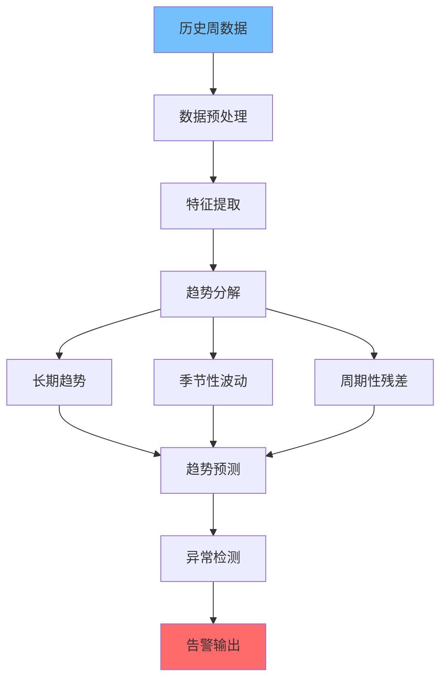
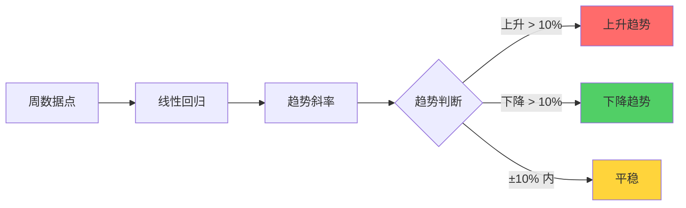
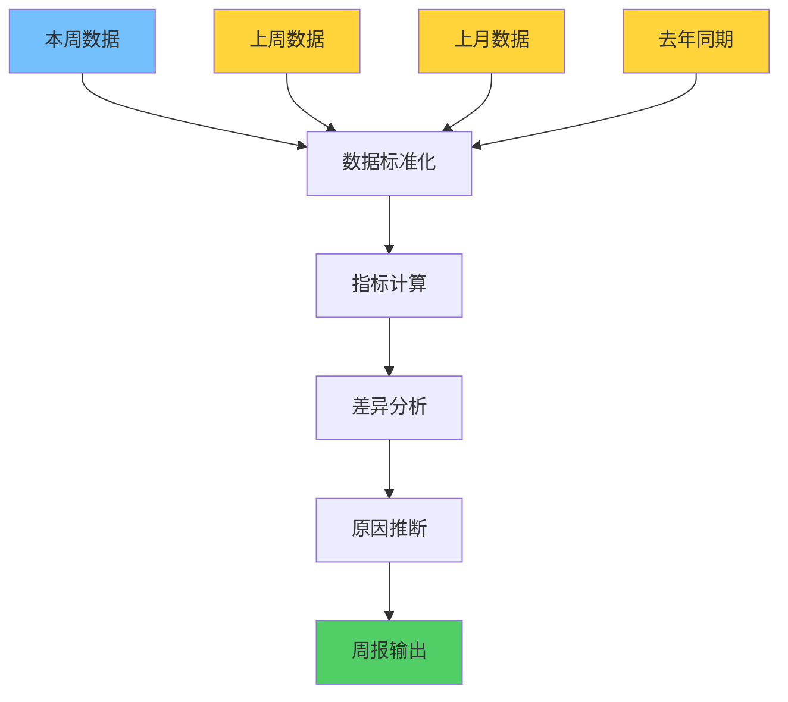

**作者：** HOS(安全风信子)
**日期：** 2026-04-27
**主要来源平台：** GitHub
**摘要：**AI周报生成系统实现安全运营周报的全流程自动化，支持趋势分析、对比分析、周环比同比计算。本文聚焦周趋势分析引擎、多维度对比引擎、自动化分发机制三大核心能力，为企业构建高效的周报自动化体系提供完整技术方案。

@[TOC](目录)

---

# AI周报生成系统：安全运营周报自动化实践

## 一，引言

周报是管理层了解安全运营效果的重要渠道。AI周报系统实现周度数据的自动汇总、趋势分析、对比计算，生成结构化的周报内容。

## 二、周趋势分析引擎

### 2.1 时间序列分析

周趋势分析是周报系统的核心能力，通过对历史数据的深入分析，识别安全态势的变化趋势。时间序列分析能够捕捉周期性规律、异常波动和长期趋势，为安全决策提供数据支撑。



```python
class WeeklyTrendAnalyzer:
    """周趋势分析引擎"""

    def __init__(self, config: TrendConfig):
        self.config = config
        self.decomposer = TrendDecomposer()
        self.anomaly_detector = AnomalyDetector(config.threshold)
        self.predictor = TrendPredictor()

    async def analyze_trend(self, weekly_data: list) -> TrendAnalysisResult:
        """分析周趋势"""
        if len(weekly_data) < 4:
            return TrendAnalysisResult(
                status='insufficient_data',
                message='需要至少4周历史数据'
            )

        decomposition = await self._decompose_trend(weekly_data)

        long_term_trend = await self._analyze_long_term_trend(
            decomposition['trend']
        )

        seasonality = await self._analyze_seasonality(
            decomposition['seasonal']
        )

        prediction = await self.predictor.predict_next_week(
            weekly_data,
            decomposition
        )

        anomalies = await self._detect_anomalies(
            weekly_data,
            prediction
        )

        return TrendAnalysisResult(
            status='success',
            trend_direction=long_term_trend['direction'],
            trend_strength=long_term_trend['strength'],
            seasonality=seasonality,
            prediction=prediction,
            anomalies=anomalies
        )

    async def _decompose_trend(self, data: list) -> dict:
        """分解时间序列为趋势、季节性、残差"""
        values = [d['total_alerts'] for d in data]

        trend = self._calculate_moving_average(values, window=4)

        seasonal = self._extract_seasonal_pattern(values, period=4)

        residual = [
            values[i] - trend[i] - seasonal[i % len(seasonal)]
            for i in range(len(values))
        ]

        return {
            'trend': trend,
            'seasonal': seasonal,
            'residual': residual
        }

    def _calculate_moving_average(self, values: list, window: int) -> list:
        """计算移动平均值"""
        result = []

        for i in range(len(values)):
            start = max(0, i - window + 1)
            window_values = values[start:i + 1]
            result.append(sum(window_values) / len(window_values))

        return result

    def _extract_seasonal_pattern(self, values: list, period: int) -> list:
        """提取季节性模式"""
        num_periods = len(values) // period
        patterns = []

        for p in range(period):
            period_values = [values[i * period + p] for i in range(num_periods)]
            patterns.append(sum(period_values) / len(period_values) if period_values else 0)

        return patterns
```

周趋势分析引擎采用时间序列分解方法，将原始数据分解为趋势成分、季节性成分和残差成分。这种分解方法能够更清晰地揭示数据的内在规律，为准确预测提供基础。

### 2.2 趋势计算模型



```python
class TrendCalculator:
    """趋势计算模型"""

    def __init__(self):
        self.regression_model = LinearRegression()

    def calculate_trend_slope(self, data_points: list) -> dict:
        """计算趋势斜率"""
        X = [[i] for i in range(len(data_points))]
        y = data_points

        self.regression_model.fit(X, y)

        slope = self.regression_model.coef_[0]
        intercept = self.regression_model.intercept_

        predictions = self.regression_model.predict(X)
        r_squared = self._calculate_r_squared(y, predictions)

        return {
            'slope': slope,
            'intercept': intercept,
            'r_squared': r_squared,
            'direction': self._interpret_slope(slope),
            'strength': self._interpret_r_squared(r_squared)
        }

    def _calculate_r_squared(self, actual: list, predicted: list) -> float:
        """计算R平方值"""
        mean = sum(actual) / len(actual)

        ss_tot = sum((a - mean) ** 2 for a in actual)
        ss_res = sum((a - p) ** 2 for a, p in zip(actual, predicted))

        return 1 - (ss_res / ss_tot) if ss_tot > 0 else 0

    def _interpret_slope(self, slope: float) -> str:
        """解释斜率含义"""
        if slope > 0.1:
            return 'increasing'
        elif slope < -0.1:
            return 'decreasing'
        else:
            return 'stable'

    def _interpret_r_squared(self, r_squared: float) -> str:
        """解释R平方含义"""
        if r_squared > 0.8:
            return 'strong'
        elif r_squared > 0.5:
            return 'moderate'
        else:
            return 'weak'
```

### 2.3 异常波动检测

```python
class AnomalyDetector:
    """异常波动检测器"""

    def __init__(self, threshold: float = 2.0):
        self.threshold = threshold

    async def detect_anomalies(
        self,
        weekly_data: list,
        prediction: dict
    ) -> list:
        """检测异常波动"""
        anomalies = []

        for i, data_point in enumerate(weekly_data):
            predicted = prediction['values'][i] if i < len(prediction['values']) else None

            if predicted is not None:
                deviation = abs(data_point['total_alerts'] - predicted)
                std = prediction.get('std', 0)

                if std > 0 and deviation > self.threshold * std:
                    anomalies.append({
                        'week': data_point.get('week', i),
                        'actual': data_point['total_alerts'],
                        'predicted': predicted,
                        'deviation': deviation,
                        'z_score': deviation / std,
                        'severity': self._calculate_severity(deviation, std)
                    })

        return anomalies

    def _calculate_severity(self, deviation: float, std: float) -> str:
        """计算异常严重程度"""
        z_score = deviation / std if std > 0 else 0

        if z_score > 3:
            return 'critical'
        elif z_score > 2:
            return 'high'
        elif z_score > 1.5:
            return 'medium'
        else:
            return 'low'
```

## 三、多维度对比引擎

### 3.1 周对比分析流程

周对比分析是评估安全运营效果的重要手段，通过横向和纵向的对比，识别优势和不足。



```python
class WeekComparisonEngine:
    """多维度周对比引擎"""

    def __init__(self):
        self.metrics_calculator = MetricsCalculator()

    async def compare_weeks(
        self,
        current_week: dict,
        previous_weeks: list
    ) -> ComparisonResult:
        """执行多维度周对比分析"""
        comparisons = {}

        for key in current_week.keys():
            if isinstance(current_week[key], (int, float)):
                comparison = await self._compare_metric(
                    key,
                    current_week[key],
                    previous_weeks
                )
                comparisons[key] = comparison

        return ComparisonResult(
            current_week=current_week,
            comparisons=comparisons,
            summary=self._generate_summary(comparisons)
        )

    async def _compare_metric(
        self,
        metric_name: str,
        current_value: float,
        previous_weeks: list
    ) -> dict:
        """对比单个指标"""
        previous_values = [
            w.get(metric_name, 0)
            for w in previous_weeks
            if metric_name in w
        ]

        if not previous_values:
            return {'status': 'no_data'}

        prev_avg = sum(previous_values) / len(previous_values)

        change = current_value - prev_avg
        change_pct = (change / prev_avg * 100) if prev_avg != 0 else 0

        return {
            'current': current_value,
            'previous_average': prev_avg,
            'change': change,
            'change_pct': change_pct,
            'direction': 'up' if change > 0 else 'down',
            'significance': self._evaluate_significance(change_pct)
        }

    def _generate_summary(self, comparisons: dict) -> str:
        """生成对比摘要"""
        significant_changes = [
            (k, v) for k, v in comparisons.items()
            if v.get('significance') == 'significant'
        ]

        if not significant_changes:
            return '本周各项指标基本稳定，无显著变化。'

        summary_parts = []
        for metric, change in significant_changes:
            direction = '上升' if change['direction'] == 'up' else '下降'
            summary_parts.append(f'{metric}较上周{direction}{abs(change["change_pct"]):.1f}%')

        return '；'.join(summary_parts) + '。'

    def _evaluate_significance(self, change_pct: float) -> str:
        """评估变化显著性"""
        if abs(change_pct) > 20:
            return 'significant'
        elif abs(change_pct) > 10:
            return 'moderate'
        else:
            return 'minor'
```

### 3.2 环比同比计算

```python
class PeriodOverPeriodCalculator:
    """环比同比计算器"""

    def __init__(self):
        self.year_over_year_factor = 52
        self.week_over_week_factor = 1

    async def calculate_wow(
        self,
        current_week: dict,
        previous_week: dict
    ) -> dict:
        """计算周环比"""
        return await self._calculate_change(
            current_week,
            previous_week,
            'wow'
        )

    async def calculate_mom(
        self,
        current_week: dict,
        four_weeks_ago: dict
    ) -> dict:
        """计算月环比"""
        return await self._calculate_change(
            current_week,
            four_weeks_ago,
            'mom'
        )

    async def calculate_yoy(
        self,
        current_week: dict,
        one_year_ago_week: dict
    ) -> dict:
        """计算同比"""
        return await self._calculate_change(
            current_week,
            one_year_ago_week,
            'yoy'
        )

    async def _calculate_change(
        self,
        current: dict,
        baseline: dict,
        comparison_type: str
    ) -> dict:
        """计算变化"""
        changes = {}

        for key in current.keys():
            if isinstance(current[key], (int, float)) and key in baseline:
                current_val = current[key]
                baseline_val = baseline[key]

                if baseline_val != 0:
                    absolute_change = current_val - baseline_val
                    percentage_change = (
                        (current_val - baseline_val) / baseline_val * 100
                    )

                    changes[key] = {
                        'current': current_val,
                        'baseline': baseline_val,
                        'absolute_change': absolute_change,
                        'percentage_change': percentage_change,
                        'direction': 'increase' if absolute_change > 0 else 'decrease'
                    }

        return {
            'type': comparison_type,
            'changes': changes
        }
```

### 3.3 多维度对比矩阵

```python
class MultiDimensionalComparisonMatrix:
    """多维度对比矩阵"""

    def __init__(self):
        self.dimensions = ['severity', 'category', 'source', 'team']

    async def build_matrix(
        self,
        current_week: dict,
        baseline_weeks: list
    ) -> ComparisonMatrix:
        """构建多维度对比矩阵"""
        matrix = {}

        for dimension in self.dimensions:
            dim_data = await self._extract_dimension_data(
                current_week,
                dimension
            )

            baseline_data = [
                self._extract_dimension_data(baseline, dimension)
                for baseline in baseline_weeks
            ]

            matrix[dimension] = self._compare_dimension(
                dim_data,
                baseline_data
            )

        return ComparisonMatrix(dimensions=matrix)

    def _extract_dimension_data(
        self,
        week_data: dict,
        dimension: str
    ) -> dict:
        """提取特定维度的数据"""
        dimension_key = f'{dimension}_breakdown'

        if dimension_key in week_data:
            return week_data[dimension_key]

        return {}

    def _compare_dimension(
        self,
        current: dict,
        baselines: list
    ) -> dict:
        """对比特定维度"""
        comparison = {}

        for key in current.keys():
            current_val = current[key]

            baseline_vals = [
                b.get(key, 0) for b in baselines
            ]

            baseline_avg = (
                sum(baseline_vals) / len(baseline_vals)
                if baseline_vals else 0
            )

            comparison[key] = {
                'current': current_val,
                'baseline_avg': baseline_avg,
                'change': current_val - baseline_avg,
                'change_pct': (
                    (current_val - baseline_avg) / baseline_avg * 100
                    if baseline_avg != 0 else 0
                )
            }

        return comparison
```

## 四、周报生成引擎

### 4.1 内容结构化

```python
class WeeklyReportGenerator:
    """周报生成引擎"""

    def __init__(self, llm: LLMInterface):
        self.llm = llm
        self.trend_analyzer = WeeklyTrendAnalyzer(TrendConfig())
        self.comparison_engine = WeekComparisonEngine()

    async def generate_report(
        self,
        current_week: dict,
        historical_weeks: list
    ) -> WeeklyReport:
        """生成完整周报"""
        trend_analysis = await self.trend_analyzer.analyze_trend(historical_weeks)

        comparison = await self.comparison_engine.compare_weeks(
            current_week,
            historical_weeks
        )

        sections = await self._generate_sections(
            current_week,
            trend_analysis,
            comparison
        )

        full_content = await self._compose_report(sections)

        return WeeklyReport(
            week=current_week.get('week'),
            date_range=self._calculate_date_range(current_week),
            sections=sections,
            full_content=full_content
        )

    async def _generate_sections(
        self,
        current_week: dict,
        trend_analysis: TrendAnalysisResult,
        comparison: ComparisonResult
    ) -> dict:
        """生成周报各章节"""
        return {
            'executive_summary': await self._generate_executive_summary(
                current_week,
                comparison
            ),
            'trend_analysis': await self._generate_trend_section(trend_analysis),
            'detailed_metrics': await self._generate_metrics_section(comparison),
            'anomaly_alerts': await self._generate_anomaly_alerts(trend_analysis),
            'recommendations': await self._generate_recommendations(
                trend_analysis,
                comparison
            )
        }

    async def _compose_report(self, sections: dict) -> str:
        """组合完整周报"""
        prompt = f"""
        请根据以下周报内容生成一份完整的Markdown格式周报：

        执行摘要：
        {sections['executive_summary']}

        趋势分析：
        {sections['trend_analysis']}

        详细指标：
        {sections['detailed_metrics']}

        异常告警：
        {sections['anomaly_alerts']}

        建议：
        {sections['recommendations']}

        要求：
        1. 语言精炼专业
        2. 结构清晰美观
        3. 突出重点信息
        4. 包含可操作建议
        """

        return await self.llm.complete(prompt)
```

### 4.2 自动化分发

```python
class WeeklyDistributionEngine:
    """周报自动分发引擎"""

    def __init__(self, config: DistributionConfig):
        self.config = config
        self.channels = self._initialize_channels()

    async def distribute(self, report: WeeklyReport):
        """分发周报到各渠道"""
        distribution_list = self._get_distribution_list()

        tasks = []
        for recipient in distribution_list:
            task = self._send_to_recipient(report, recipient)
            tasks.append(task)

        results = await asyncio.gather(*tasks, return_exceptions=True)

        return self._summarize_results(results)

    async def _send_to_recipient(
        self,
        report: WeeklyReport,
        recipient: Recipient
    ) -> SendResult:
        """发送周报给单个接收者"""
        channel = self.channels[recipient.channel]

        formatted_content = channel.format_report(report)

        await channel.send(
            recipient.address,
            formatted_content,
            subject=f"安全运营周报 - {report.date_range}"
        )

        return SendResult(status='success', recipient=recipient.email)
```

## 五、周报智能分析算法

### 5.1 异常检测算法

周报中的异常检测算法用于识别偏离正常模式的周度数据变化。

```python
class WeeklyAnomalyDetector:
    """周度异常检测器"""

    def __init__(self, baseline_window: int = 12):
        self.baseline_window = baseline_window
        self.statistical_tests = StatisticalTestSuite()

    async def detect_anomalies(
        self,
        current_week: WeeklyMetrics,
        historical_weeks: List[WeeklyMetrics]
    ) -> List[Anomaly]:
        """检测周度异常"""
        if len(historical_weeks) < self.baseline_window:
            return []

        anomalies = []

        for metric_name in current_week.metrics:
            historical_values = [w.metrics.get(metric_name, 0) for w in historical_weeks]
            current_value = current_week.metrics.get(metric_name, 0)

            zscore = self._calculate_zscore(current_value, historical_values)

            if abs(zscore) > 2.5:
                anomalies.append(Anomaly(
                    metric=metric_name,
                    current_value=current_value,
                    zscore=zscore,
                    type='statistical_outlier',
                    severity='high' if abs(zscore) > 3 else 'medium'
                ))

            trend_anomaly = self._detect_trend_anomaly(
                historical_values + [current_value]
            )

            if trend_anomaly:
                anomalies.append(Anomaly(
                    metric=metric_name,
                    current_value=current_value,
                    trend_change=trend_anomaly,
                    type='trend_change',
                    severity='medium'
                ))

        return anomalies

    def _calculate_zscore(self, value: float, baseline: List[float]) -> float:
        """计算Z分数"""
        mean = statistics.mean(baseline)
        stdev = statistics.stdev(baseline) if len(baseline) > 1 else 1

        return (value - mean) / stdev if stdev > 0 else 0
```

### 5.2 智能汇总生成

基于大语言模型的智能汇总生成技术。

```python
class IntelligentSummaryGenerator:
    """智能汇总生成器"""

    def __init__(self, llm: LLMInterface):
        self.llm = llm
        self.template_engine = TemplateEngine()

    async def generate_summary(
        self,
        weekly_data: WeeklyReportData
    ) -> Summary:
        """生成智能汇总"""
        context = self._build_context(weekly_data)

        prompt = self._build_summary_prompt(context)

        raw_summary = await self.llm.complete(prompt)

        structured_summary = self._parse_summary(raw_summary)

        return structured_summary

    def _build_context(self, weekly_data: WeeklyReportData) -> dict:
        """构建汇总上下文"""
        return {
            'week_overview': {
                'total_alerts': weekly_data.metrics.total_alerts,
                'total_incidents': weekly_data.metrics.total_incidents,
                'critical_vulns': weekly_data.metrics.critical_vulnerabilities,
                'mttd': weekly_data.metrics.mttd,
                'mttr': weekly_data.metrics.mttr
            },
            'top_trends': self._extract_top_trends(weekly_data.trends),
            'notable_events': self._extract_notable_events(weekly_data.events),
            'comparisons': weekly_data.comparisons
        }

    async def _build_summary_prompt(self, context: dict) -> str:
        """构建汇总提示"""
        template = self.template_engine.get_template('weekly_summary')

        return template.format(
            total_alerts=context['week_overview']['total_alerts'],
            total_incidents=context['week_overview']['total_incidents'],
            critical_vulns=context['week_overview']['critical_vulns'],
            mttd=context['week_overview']['mttd'],
            mttr=context['week_overview']['mttr'],
            top_trends=self._format_trends(context['top_trends']),
            notable_events=self._format_events(context['notable_events'])
        )
```

### 5.3 建议自动生成

基于周报数据的改进建议自动生成。

```python
class RecommendationGenerator:
    """建议生成器"""

    def __init__(self, llm: LLMInterface):
        self.llm = llm
        self.recommendation_db = RecommendationDatabase()

    async def generate_recommendations(
        self,
        weekly_data: WeeklyReportData,
        anomalies: List[Anomaly]
    ) -> List[Recommendation]:
        """生成改进建议"""
        recommendations = []

        for anomaly in anomalies:
            similar_past = await self.recommendation_db.find_similar(
                anomaly.type,
                anomaly.metric
            )

            for past in similar_past:
                recommendations.append(Recommendation(
                    priority=anomaly.severity,
                    metric=anomaly.metric,
                    current_value=anomaly.current_value,
                    suggested_action=past.resolution,
                    expected_improvement=past.improvement,
                    confidence=self._calculate_confidence(past)
                ))

        ai_recommendations = await self._generate_ai_recommendations(
            weekly_data,
            anomalies
        )

        recommendations.extend(ai_recommendations)

        return sorted(recommendations, key=lambda x: x.priority, reverse=True)
```

## 六、周报可视化设计

### 6.1 趋势图表生成

```python
class WeeklyVisualizationGenerator:
    """周报可视化生成器"""

    def __init__(self, chart_config: ChartConfig):
        self.config = chart_config
        self.renderers = {
            'line': LineChartRenderer(),
            'bar': BarChartRenderer(),
            'heatmap': HeatmapRenderer()
        }

    async def generate_trend_chart(
        self,
        historical_data: List[WeeklyMetrics],
        metric_name: str
    ) -> Chart:
        """生成趋势图表"""
        values = [w.metrics.get(metric_name, 0) for w in historical_data]

        chart_data = ChartData(
            type='line',
            labels=[w.week_label for w in historical_data],
            datasets=[Dataset(label=metric_name, data=values)]
        )

        renderer = self.renderers['line']

        return await renderer.render(chart_data, self.config)
```

## 七、结论

AI周报生成系统实现周报的全流程自动化，支持趋势分析和多维度对比。

---

**参考链接：**

- [OpenAI](https://openai.com) - GPT模型

**附录（Appendix）：**
无

**关键词：** 周报生成，趋势分析，环比同比，自动化，安全运营
