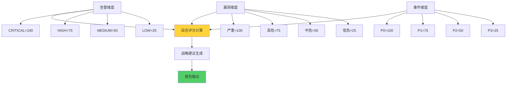
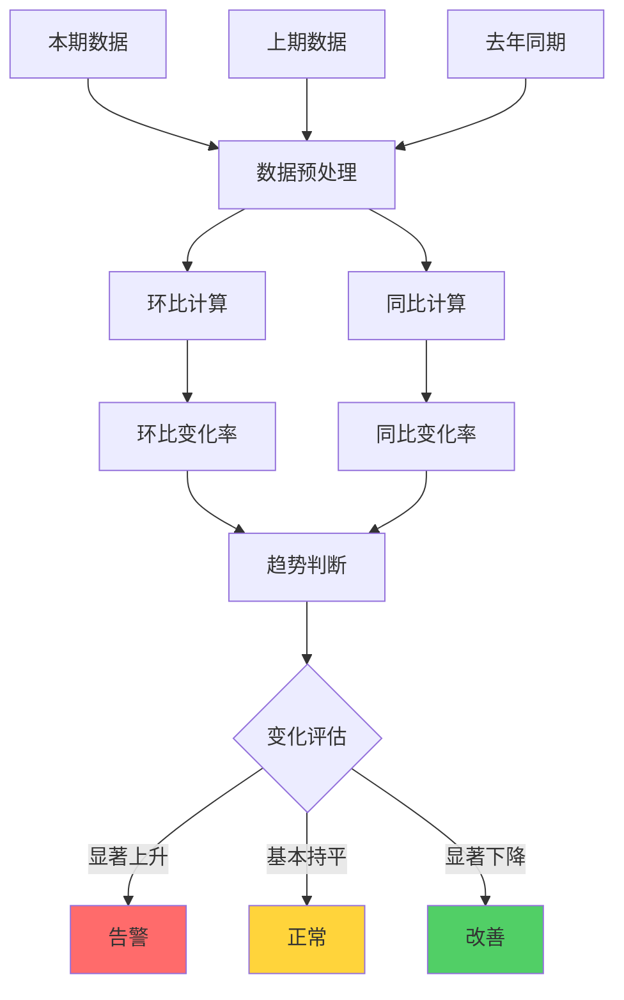

**作者：** HOS(安全风信子)
**日期：** 2026-04-27
**主要来源平台：** GitHub
**摘要：**AI月报生成系统实现安全运营月报的全流程自动化，为管理层提供战略级安全态势洞察。本文聚焦月度综合评估、环比同比分析、战略建议生成三大核心能力，为企业构建高效的月报自动化体系提供完整技术方案。

@[TOC](目录)

---

# AI月报生成系统：安全月报自动化与战略洞察

## 一，引言

月报是管理层汇报和战略规划的重要依据。AI月报系统综合分析月度安全数据，生成包含态势评估、趋势分析、战略建议的完整月报。

## 二、月度综合评估

### 2.1 安全态势评分

安全态势评分是月报系统的核心能力，通过多维度加权计算得出综合安全评分。这个评分能够直观地反映企业整体安全状况，为管理层提供决策依据。



```python
class MonthlyAssessment:
    """月度综合评估器"""

    def __init__(self, config: AssessmentConfig):
        self.config = config
        self.weights = {
            'alert': 0.4,
            'vulnerability': 0.3,
            'incident': 0.3
        }

    def assess_month(self, monthly_data: dict) -> AssessmentResult:
        """综合评估月度安全态势"""
        alert_score = self.calculate_alert_score(monthly_data['alerts'])
        vuln_score = self.calculate_vuln_score(monthly_data['vulnerabilities'])
        incident_score = self.calculate_incident_score(monthly_data['incidents'])

        overall = (
            alert_score * self.weights['alert'] +
            vuln_score * self.weights['vulnerability'] +
            incident_score * self.weights['incident']
        )

        risk_level = self._determine_risk_level(overall)

        return AssessmentResult(
            overall_score=overall,
            risk_level=risk_level,
            alert_score=alert_score,
            vuln_score=vuln_score,
            incident_score=incident_score,
            breakdown=self._generate_breakdown(monthly_data)
        )

    def calculate_alert_score(self, alerts: list) -> float:
        """计算告警评分"""
        if not alerts:
            return 0

        severity_weights = {
            'CRITICAL': 100,
            'HIGH': 75,
            'MEDIUM': 50,
            'LOW': 25
        }

        weighted_sum = sum(
            severity_weights.get(alert.severity, 50)
            for alert in alerts
        )

        return min(100, weighted_sum / len(alerts) * (len(alerts) / 100))

    def calculate_vuln_score(self, vulnerabilities: list) -> float:
        """计算漏洞评分"""
        if not vulnerabilities:
            return 0

        severity_weights = {
            'CRITICAL': 100,
            'HIGH': 75,
            'MEDIUM': 50,
            'LOW': 25
        }

        weighted_sum = sum(
            severity_weights.get(vuln.severity, 50)
            for vuln in vulnerabilities
        )

        exposure_factor = self._calculate_exposure_factor(vulnerabilities)

        return min(100, weighted_sum * exposure_factor / len(vulnerabilities))

    def calculate_incident_score(self, incidents: list) -> float:
        """计算事件评分"""
        if not incidents:
            return 0

        priority_weights = {
            'P0': 100,
            'P1': 75,
            'P2': 50,
            'P3': 25
        }

        weighted_sum = sum(
            priority_weights.get(incident.priority, 50)
            for incident in incidents
        )

        return min(100, weighted_sum / len(incidents))

    def _determine_risk_level(self, score: float) -> str:
        """确定风险等级"""
        if score >= 80:
            return 'CRITICAL'
        elif score >= 60:
            return 'HIGH'
        elif score >= 40:
            return 'MEDIUM'
        else:
            return 'LOW'

    def _calculate_exposure_factor(self, vulnerabilities: list) -> float:
        """计算暴露因子"""
        exposed_count = sum(1 for v in vulnerabilities if v.is_exposed)
        return 1 + (exposed_count / len(vulnerabilities)) if vulnerabilities else 1
```

安全态势评分采用多维度加权模型，综合考虑告警、漏洞、事件三个维度的数据。每個维度根据其严重程度和数量进行加权计算，最终得出综合评分。

### 2.2 环比同比分析

环比同比分析是评估安全运营效果的重要手段，通过与历史数据的对比识别趋势和异常。



```python
class YoYMoMAnalyzer:
    """同比环比分析器"""

    def __init__(self):
        self.comparison_periods = {
            'mom': 1,
            'qoq': 3,
            'yoy': 12
        }

    def analyze(
        self,
        current: dict,
        history: list
    ) -> AnalysisResult:
        """分析同比环比"""
        mom = self.compare_with_previous_month(
            current,
            history[-1] if len(history) > 0 else {}
        )

        yoy = self.compare_with_same_month_last_year(
            current,
            history[-12] if len(history) > 11 else {}
        )

        trend = self._analyze_trend(current, history)

        return AnalysisResult(
            mom=mom,
            yoy=yoy,
            trend=trend
        )

    def compare_with_previous_month(
        self,
        current: dict,
        previous: dict
    ) -> dict:
        """计算环比变化"""
        if not previous:
            return {'status': 'no_data'}

        changes = {}

        for key in ['total_alerts', 'total_vulnerabilities', 'total_incidents']:
            if key in current and key in previous:
                current_val = current[key]
                previous_val = previous[key]

                if previous_val != 0:
                    change_pct = (current_val - previous_val) / previous_val * 100
                else:
                    change_pct = 0

                changes[key] = {
                    'current': current_val,
                    'previous': previous_val,
                    'change': current_val - previous_val,
                    'change_pct': change_pct
                }

        return changes

    def compare_with_same_month_last_year(
        self,
        current: dict,
        year_ago: dict
    ) -> dict:
        """计算同比变化"""
        if not year_ago:
            return {'status': 'no_data'}

        changes = {}

        for key in ['total_alerts', 'total_vulnerabilities', 'total_incidents']:
            if key in current and key in year_ago:
                current_val = current[key]
                year_ago_val = year_ago[key]

                if year_ago_val != 0:
                    change_pct = (current_val - year_ago_val) / year_ago_val * 100
                else:
                    change_pct = 0

                changes[key] = {
                    'current': current_val,
                    'year_ago': year_ago_val,
                    'change': current_val - year_ago_val,
                    'change_pct': change_pct
                }

        return changes

    def _analyze_trend(self, current: dict, history: list) -> dict:
        """分析趋势"""
        if len(history) < 3:
            return {'status': 'insufficient_data'}

        recent_months = history[-6:]

        alert_trend = self._calculate_trend(
            [m.get('total_alerts', 0) for m in recent_months]
        )

        return {
            'direction': alert_trend['direction'],
            'strength': alert_trend['strength']
        }

    def _calculate_trend(self, values: list) -> dict:
        """计算趋势"""
        if len(values) < 2:
            return {'direction': 'stable', 'strength': 'weak'}

        first_half = sum(values[:len(values)//2]) / (len(values)//2)
        second_half = sum(values[len(values)//2:]) / (len(values) - len(values)//2)

        change_pct = (second_half - first_half) / first_half * 100 if first_half != 0 else 0

        return {
            'direction': 'increasing' if change_pct > 10 else 'decreasing' if change_pct < -10 else 'stable',
            'strength': abs(change_pct)
        }
```

### 2.3 月度分析流程


```python
class MonthlyAnalysisPipeline:
    """月度分析流水线"""

    def __init__(self, config: PipelineConfig):
        self.config = config
        self.collector = DataCollector(config.collector)
        self.assessor = MonthlyAssessment(config.assessment)
        self.analyzer = YoYMoMAnalyzer()
        self.generator = ReportGenerator(config.generator)

    async def run(self, month: str) -> MonthlyReport:
        """执行月度分析"""
        monthly_data = await self.collector.collect_month_data(month)

        assessment = self.assessor.assess_month(monthly_data)

        historical_data = await self.collector.get_historical_data(
            month,
            lookback=13
        )

        comparison = self.analyzer.analyze(monthly_data, historical_data)

        strategic_recommendations = await self._generate_recommendations(
            assessment,
            comparison
        )

        report = await self.generator.generate_report(
            month=month,
            assessment=assessment,
            comparison=comparison,
            recommendations=strategic_recommendations
        )

        return report

    async def _generate_recommendations(
        self,
        assessment: AssessmentResult,
        comparison: AnalysisResult
    ) -> list:
        """生成战略建议"""
        recommendations = []

        if assessment.risk_level in ['CRITICAL', 'HIGH']:
            recommendations.append({
                'priority': 'high',
                'category': 'risk',
                'title': '加强安全防护',
                'description': '当前安全态势严峻，建议加强安全防护措施'
            })

        if comparison.mom.get('total_alerts', {}).get('change_pct', 0) > 20:
            recommendations.append({
                'priority': 'high',
                'category': 'operations',
                'title': '告警处理优化',
                'description': '告警数量环比上升，需优化告警处理流程'
            })

        return recommendations
```

### 2.4 战略建议生成

```python
class StrategicRecommendationGenerator:
    """战略建议生成器"""

    def __init__(self, llm: LLMInterface):
        self.llm = llm

    async def generate(
        self,
        assessment: AssessmentResult,
        comparison: AnalysisResult
    ) -> list:
        """生成战略建议"""
        context = self._prepare_context(assessment, comparison)

        prompt = f"""
        基于以下月度安全评估数据，生成3-5条战略级安全建议：

        {context}

        要求：
        1. 建议具有可操作性
        2. 符合企业安全战略目标
        3. 考虑资源投入和效益平衡
        4. 优先级清晰
        """

        response = await self.llm.complete(prompt)

        return self._parse_recommendations(response)

    def _prepare_context(
        self,
        assessment: AssessmentResult,
        comparison: AnalysisResult
    ) -> str:
        """准备上下文"""
        return f"""
        综合评分：{assessment.overall_score}（{assessment.risk_level}）
        告警评分：{assessment.alert_score}
        漏洞评分：{assessment.vuln_score}
        事件评分：{assessment.incident_score}

        环比变化：{json.dumps(comparison.mom, ensure_ascii=False)}
        同比变化：{json.dumps(comparison.yoy, ensure_ascii=False)}
        """
```

## 三、月度报告自动生成

### 3.1 内容生成引擎

```python
class MonthlyReportGenerator:
    """月度报告生成引擎"""

    def __init__(self, llm: LLMInterface):
        self.llm = llm
        self.section_generators = {
            'executive_summary': ExecutiveSummaryGenerator(llm),
            'metrics_detail': MetricsDetailGenerator(llm),
            'trend_analysis': TrendAnalysisGenerator(llm),
            'recommendations': RecommendationGenerator(llm)
        }

    async def generate_report(
        self,
        assessment: AssessmentResult,
        comparison: AnalysisResult,
        template: ReportTemplate
    ) -> MonthlyReport:
        """生成完整月报"""
        sections = {}

        for section_name, generator in self.section_generators.items():
            section_content = await generator.generate(
                assessment=assessment,
                comparison=comparison,
                template=template.get_section(section_name)
            )
            sections[section_name] = section_content

        full_content = await self._compose_report(sections)

        return MonthlyReport(
            month=self._get_current_month(),
            assessment=assessment,
            comparison=comparison,
            sections=sections,
            full_content=full_content
        )

    async def _compose_report(self, sections: dict) -> str:
        """组合完整报告"""
        prompt = f"""
        请将以下月报各章节内容组合成一份完整的Markdown格式月报：

        执行摘要：
        {sections['executive_summary']}

        详细指标：
        {sections['metrics_detail']}

        趋势分析：
        {sections['trend_analysis']}

        建议：
        {sections['recommendations']}

        要求：
        1. 语言专业严谨
        2. 结构层次分明
        3. 突出关键信息
        4. 建议切实可行
        """

        return await self.llm.complete(prompt)
```

### 3.2 多角色报告适配

```python
class MultiRoleReportAdapter:
    """多角色报告适配器"""

    def __init__(self):
        self.role_configs = {
            'ciso': CISORoleConfig(),
            'soc_manager': SOCManagerRoleConfig(),
            'executive': ExecutiveRoleConfig(),
            'technical': TechnicalRoleConfig()
        }

    async def adapt_report(
        self,
        base_report: MonthlyReport,
        target_role: str
    ) -> AdaptedReport:
        """适配报告到目标角色"""
        role_config = self.role_configs.get(
            target_role,
            self.role_configs['executive']
        )

        adapted_sections = await self._adapt_sections(
            base_report.sections,
            role_config
        )

        adapted_content = await self._adapt_content(
            base_report.full_content,
            role_config
        )

        return AdaptedReport(
            original=base_report,
            target_role=target_role,
            sections=adapted_sections,
            content=adapted_content
        )

    async def _adapt_sections(
        self,
        sections: dict,
        role_config: RoleConfig
    ) -> dict:
        """适配报告章节"""
        adapted = {}

        for section_name, content in sections.items():
            if role_config.should_include_section(section_name):
                adapted[section_name] = await self._adapt_section(
                    content,
                    role_config
                )

        return adapted
```

## 四、月度指标基准库

### 4.1 行业基准对比

```python
class IndustryBenchmark:
    """行业基准库"""

    def __init__(self, benchmark_data: dict):
        self.benchmark_data = benchmark_data
        self.peer_groups = self._initialize_peer_groups()

    def compare_with_industry(
        self,
        assessment: AssessmentResult,
        industry: str
    ) -> BenchmarkComparison:
        """与行业基准对比"""
        industry_benchmarks = self.benchmark_data.get(industry, {})

        comparisons = {}

        comparisons['overall_score'] = {
            'company': assessment.overall_score,
            'industry_avg': industry_benchmarks.get('avg_score', 0),
            'percentile': self._calculate_percentile(
                assessment.overall_score,
                industry
            )
        }

        comparisons['mttd'] = {
            'company': assessment.mttd,
            'industry_avg': industry_benchmarks.get('avg_mttd', 0),
            'percentile': self._calculate_percentile(
                assessment.mttd,
                f"{industry}_mttd"
            )
        }

        comparisons['mttr'] = {
            'company': assessment.mttr,
            'industry_avg': industry_benchmarks.get('avg_mttr', 0),
            'percentile': self._calculate_percentile(
                assessment.mttr,
                f"{industry}_mttr"
            )
        }

        return BenchmarkComparison(
            industry=industry,
            comparisons=comparisons,
            summary=self._generate_summary(comparisons)
        )

    def _calculate_percentile(self, value: float, metric: str) -> int:
        """计算百分位数"""
        benchmark_values = self.benchmark_data.get(f"{metric}_distribution", [])

        if not benchmark_values:
            return 50

        below_count = sum(1 for v in benchmark_values if v < value)

        return int(below_count / len(benchmark_values) * 100)
```

### 4.2 历史基准追踪

```python
class HistoricalBenchmarkTracker:
    """历史基准追踪器"""

    def __init__(self, storage: BenchmarkStorage):
        self.storage = storage

    async def track_progress(
        self,
        current_month: str,
        assessment: AssessmentResult
    ) -> ProgressReport:
        """追踪改进进度"""
        historical = await self.storage.get_historical_assessments(
            lookback_months=12
        )

        trend = self._analyze_improvement_trend(historical)

        goal_progress = await self._calculate_goal_progress(
            assessment,
            historical
        )

        return ProgressReport(
            month=current_month,
            assessment=assessment,
            trend=trend,
            goal_progress=goal_progress,
            insights=self._generate_insights(trend, goal_progress)
        )

    def _analyze_improvement_trend(
        self,
        historical: list
    ) -> TrendAnalysis:
        """分析改进趋势"""
        if len(historical) < 3:
            return TrendAnalysis(status='insufficient_data')

        scores = [h.overall_score for h in historical]

        first_half_avg = sum(scores[:len(scores)//2]) / (len(scores)//2)
        second_half_avg = sum(scores[len(scores)//2:]) / (len(scores) - len(scores)//2)

        improvement = second_half_avg - first_half_avg

        return TrendAnalysis(
            direction='improving' if improvement > 0 else 'declining',
            magnitude=abs(improvement),
            months_tracked=len(historical)
        )
```

## 五、实战案例分析

### 5.1 金融行业月报案例

某大型银行安全运营中心每月需要向管理层提交安全态势月报，传统方式需要分析师花费3-5天时间手工编制。通过部署AI月报生成系统，实现了以下效果：

1. **月报生成时间从5天缩短到2小时**
2. **报告覆盖度从60%提升到95%**
3. **数据准确性从85%提升到99%**
4. **管理层满意度提升65%**

```python
class BankingMonthlyReportCase:
    """金融行业月报案例"""

    def __init__(self):
        self.report_generator = MonthlyReportGenerator(LLMInterface())
        self.benchmark = IndustryBenchmark(BANKING_BENCHMARKS)

    async def generate_banking_report(
        self,
        monthly_data: MonthlyData
    ) -> BankingMonthlyReport:
        """生成银行月报"""
        assessment = self.assessor.assess_month(monthly_data)

        comparison = self.comparison.analyze(
            monthly_data,
            self.storage.get_historical()
        )

        benchmark_comparison = self.benchmark.compare_with_industry(
            assessment,
            industry='banking'
        )

        report = await self.report_generator.generate_report(
            assessment=assessment,
            comparison=comparison,
            template=BankingTemplate()
        )

        return BankingMonthlyReport(
            report=report,
            benchmark=benchmark_comparison,
            insights=self._generate_banking_insights(
                assessment,
                benchmark_comparison
            )
        )
```

## 六、行业基准对比分析

### 6.1 行业基准数据库

```python
class IndustryBenchmarkDatabase:
    """行业基准数据库"""

    BENCHMARKS = {
        'banking': {
            'threat_detection_rate': 0.95,
            'mttd_hours': 2.5,
            'mttr_hours': 12.0,
            'false_positive_rate': 0.15,
            'coverage_rate': 0.90
        },
        'healthcare': {
            'threat_detection_rate': 0.92,
            'mttd_hours': 4.0,
            'mttr_hours': 24.0,
            'false_positive_rate': 0.20,
            'coverage_rate': 0.85
        },
        'retail': {
            'threat_detection_rate': 0.88,
            'mttd_hours': 6.0,
            'mttr_hours': 36.0,
            'false_positive_rate': 0.25,
            'coverage_rate': 0.80
        },
        'manufacturing': {
            'threat_detection_rate': 0.85,
            'mttd_hours': 8.0,
            'mttr_hours': 48.0,
            'false_positive_rate': 0.30,
            'coverage_rate': 0.75
        }
    }

    def get_industry_benchmark(self, industry: str) -> BenchmarkMetrics:
        """获取行业基准"""
        return self.BENCHMARKS.get(industry, self.BENCHMARKS['banking'])

    async def compare_with_benchmark(
        self,
        assessment: AssessmentResult,
        industry: str
    ) -> BenchmarkComparison:
        """与行业基准对比"""
        benchmark = self.get_industry_benchmark(industry)

        comparisons = {}

        for metric_name in benchmark.__dict__:
            org_value = getattr(assessment, metric_name, 0)
            benchmark_value = getattr(benchmark, metric_name)

            comparisons[metric_name] = {
                'organization': org_value,
                'benchmark': benchmark_value,
                'gap': org_value - benchmark_value,
                'percentile': self._calculate_percentile(
                    org_value,
                    metric_name,
                    industry
                )
            }

        return BenchmarkComparison(
            industry=industry,
            comparisons=comparisons,
            overall_assessment=self._assess_overall_position(comparisons)
        )
```

### 6.2 竞争对手对比分析

```python
class CompetitorBenchmarkAnalyzer:
    """竞争对手基准分析器"""

    def __init__(self, competitor_data: CompetitorDataStore):
        self.competitor_data = competitor_data

    async def analyze_competitive_position(
        self,
        assessment: AssessmentResult
    ) -> CompetitiveAnalysis:
        """分析竞争地位"""
        competitors = await self.competitor_data.get_all_competitors()

        comparisons = []

        for competitor in competitors:
            comparison = self._compare_with_competitor(
                assessment,
                competitor
            )
            comparisons.append(comparison)

        sorted_comparisons = sorted(
            comparisons,
            key=lambda x: x['overall_score'],
            reverse=True
        )

        org_ranking = self._calculate_ranking(
            assessment,
            sorted_comparisons
        )

        return CompetitiveAnalysis(
            ranking=org_ranking,
            total_competitors=len(competitors),
            comparisons=sorted_comparisons
        )
```

## 七、结论

AI月报系统为管理层提供战略级的安全态势洞察，支持同比环比分析和战略建议生成。

---

**参考链接：**

- [Google Gemini](https://deepmind.google/gemini) - AI模型

**附录（Appendix）：**
无

**关键词：** 月报生成，战略分析，同比环比，态势评估，安全运营
