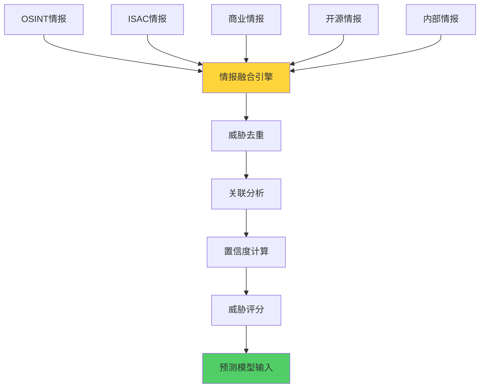
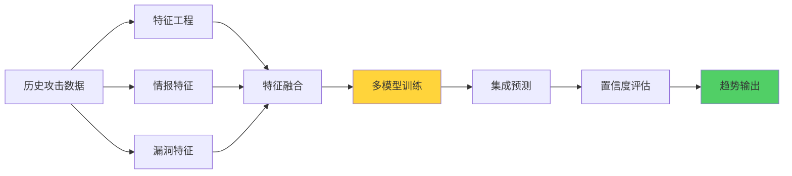
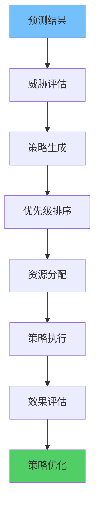

**作者：** HOS(安全风信子)
**日期：** 2026-04-27
**主要来源平台：** GitHub
**摘要：**AI攻击趋势预测系统通过威胁情报融合、攻击模式识别、预测模型构建，实现对未来攻击趋势的智能预判。本文聚焦威胁情报融合、攻击意图分析、预测置信度评估三大核心能力，为企业构建前瞻性安全防御体系提供技术支撑。

@[TOC](目录)

---

# AI攻击趋势预测：未卜先知的主动防御

## 一，引言

被动防御已经无法应对日益复杂的网络威胁。AI攻击趋势预测系统通过分析历史攻击数据、威胁情报、漏洞态势，预测未来攻击趋势，实现主动防御。

## 二、预测模型架构

### 2.1 威胁情报融合

威胁情报融合是攻击趋势预测的基础，通过汇聚多源情报并进行智能关联分析，构建完整的威胁视图。



```python
class ThreatIntelFusion:
    """威胁情报融合器"""

    def __init__(self, config: FusionConfig):
        self.config = config
        self.deduplicator = ThreatDeduplicator()
        self.correlator = ThreatCorrelator()
        self.scorer = ThreatScorer()

    async def fuse_intel(self, intel_sources: list) -> FusionResult:
        """融合多源威胁情报"""
        all_threats = await self._collect_all_threats(intel_sources)

        deduplicated = await self.deduplicator.deduplicate(all_threats)

        correlated = await self.correlator.correlate(deduplicated)

        scored = await self.scorer.score(correlated)

        enriched = await self._enrich_threat_data(scored)

        return FusionResult(
            threats=enriched,
            summary=self._generate_summary(enriched)
        )

    async def _collect_all_threats(self, sources: list) -> list:
        """收集所有情报源的威胁"""
        all_threats = []

        for source in sources:
            threats = await self._fetch_from_source(source)
            all_threats.extend(threats)

        return all_threats

    async def _fetch_from_source(self, source: IntelSource) -> list:
        """从单个情报源获取数据"""
        connector = self._get_connector(source.type)

        raw_data = await connector.fetch(source.config)

        parsed = self._parse_threat_data(raw_data)

        return parsed

    def _get_connector(self, source_type: str) -> IntelConnector:
        """获取情报源连接器"""
        connectors = {
            'osint': OSINTConnector(),
            'isac': ISACConnector(),
            'commercial': CommercialConnector(),
            'internal': InternalConnector()
        }

        return connectors.get(source_type, OSINTConnector())
```

威胁情报融合器采用模块化设计，支持多种情报源接入。通过标准化的接口和数据格式，实现异构情报的统一处理。

### 2.2 预测模型



```python
class AttackTrendPredictor:
    """攻击趋势预测器"""

    def __init__(self, config: PredictorConfig):
        self.config = config
        self.feature_engineering = FeatureEngineeringPipeline()
        self.models = self._initialize_models()
        self.ensemble = ModelEnsemble()

    async def predict(
        self,
        historical_data: list,
        intel_data: dict,
        horizon: int
    ) -> PredictionResult:
        """执行攻击趋势预测"""
        features = await self.feature_engineering.extract(
            historical_data,
            intel_data
        )

        model_predictions = await self._predict_with_all_models(features, horizon)

        ensemble_prediction = await self.ensemble.combine(model_predictions)

        confidence = await self._calculate_confidence(
            model_predictions,
            ensemble_prediction
        )

        return PredictionResult(
            predictions=ensemble_prediction['values'],
            confidence=confidence,
            model_predictions=model_predictions,
            feature_importance=self._get_feature_importance()
        )

    def _initialize_models(self) -> dict:
        """初始化预测模型库"""
        return {
            'lstm': LSTMModel(config=self.config.lstm),
            'xgboost': XGBoostModel(config=self.config.xgboost),
            'prophet': ProphetModel(config=self.config.prophet),
            'arima': ArimaModel(config=self.config.arima)
        }

    async def _predict_with_all_models(
        self,
        features: dict,
        horizon: int
    ) -> dict:
        """使用所有模型进行预测"""
        predictions = {}

        for model_name, model in self.models.items():
            pred = await model.predict(features, horizon)
            predictions[model_name] = pred

        return predictions
```

### 2.3 攻击趋势预测流程

```python
class AttackTrendPredictionPipeline:
    """攻击趋势预测流水线"""

    def __init__(self, config: PipelineConfig):
        self.config = config
        self.data_collector = ThreatDataCollector()
        self.predictor = AttackTrendPredictor(config.predictor)
        self.visualizer = TrendVisualizer()

    async def run(self, prediction_period: int) -> AttackTrendReport:
        """执行预测流程"""
        historical_data = await self.data_collector.collect_historical_data(
            lookback_days=90
        )

        intel_data = await self.data_collector.collect_intelligence()

        prediction = await self.predictor.predict(
            historical_data,
            intel_data,
            horizon=prediction_period
        )

        visualization = await self.visualizer.create_trend_chart(prediction)

        insights = await self._generate_insights(prediction)

        recommendations = await self._generate_recommendations(prediction)

        return AttackTrendReport(
            period=self._get_prediction_period(prediction_period),
            predictions=prediction,
            visualization=visualization,
            insights=insights,
            recommendations=recommendations
        )

    async def _generate_insights(self, prediction: PredictionResult) -> list:
        """生成预测洞察"""
        insights = []

        if prediction.confidence < 0.6:
            insights.append({
                'type': 'warning',
                'message': '预测置信度较低，建议结合更多情报源'
            })

        trend_direction = self._analyze_trend_direction(prediction.predictions)

        if trend_direction == 'increasing':
            insights.append({
                'type': 'alert',
                'message': '预测显示攻击趋势将上升，需加强防御'
            })

        peak_days = self._identify_peak_days(prediction.predictions)

        if peak_days:
            insights.append({
                'type': 'info',
                'message': f'预计攻击高峰将出现在第 {peak_days} 天'
            })

        return insights

    async def _generate_recommendations(self, prediction: PredictionResult) -> list:
        """生成防御建议"""
        recommendations = []

        trend = self._analyze_trend_direction(prediction.predictions)

        if trend == 'increasing':
            recommendations.append({
                'priority': 'high',
                'category': 'defense',
                'title': '加强边界防御',
                'description': '预测显示攻击将增加，建议加强WAF和IPS规则'
            })

        high_risk_techniques = self._identify_high_risk_techniques(prediction)

        for technique in high_risk_techniques:
            recommendations.append({
                'priority': 'medium',
                'category': 'mitigation',
                'title': f'针对 {technique} 的防护',
                'description': f'预测 {technique} 攻击将增加，建议部署针对性防御措施'
            })

        return recommendations
```

### 2.4 置信度评估

```python
class ConfidenceEvaluator:
    """预测置信度评估器"""

    def __init__(self):
        self.evaluation_methods = [
            HistoricalAccuracyMethod(),
            ModelAgreementMethod(),
            DataQualityMethod(),
            PredictionStabilityMethod()
        ]

    async def evaluate(
        self,
        predictions: dict,
        historical_data: list
    ) -> ConfidenceResult:
        """评估预测置信度"""
        method_results = {}

        for method in self.evaluation_methods:
            result = await method.evaluate(predictions, historical_data)
            method_results[method.name] = result

        overall_confidence = self._calculate_overall_confidence(method_results)

        confidence_interval = self._calculate_confidence_interval(
            predictions,
            overall_confidence
        )

        return ConfidenceResult(
            overall=overall_confidence,
            by_method=method_results,
            interval=confidence_interval,
            recommendation=self._get_confidence_recommendation(overall_confidence)
        )

    def _calculate_overall_confidence(self, method_results: dict) -> float:
        """计算总体置信度"""
        weights = {
            'historical_accuracy': 0.3,
            'model_agreement': 0.3,
            'data_quality': 0.2,
            'prediction_stability': 0.2
        }

        weighted_sum = sum(
            method_results[method]['confidence'] * weights.get(method, 0.25)
            for method in method_results
        )

        return min(1.0, max(0.0, weighted_sum))

    def _get_confidence_recommendation(self, confidence: float) -> str:
        """获取置信度建议"""
        if confidence >= 0.8:
            return '预测置信度较高，可以作为主要决策依据'
        elif confidence >= 0.6:
            return '预测置信度中等，建议结合其他情报源'
        elif confidence >= 0.4:
            return '预测置信度较低，需谨慎决策'
        else:
            return '预测置信度极低，不建议作为决策依据'
```

### 2.5 攻击模式识别

```python
class AttackPatternRecognizer:
    """攻击模式识别器"""

    def __init__(self, config: PatternConfig):
        self.config = config
        self.pattern_detectors = [
            DDOSPatternDetector(),
            IntrusionPatternDetector(),
            MalwarePatternDetector(),
            PhishingPatternDetector()
        ]

    async def recognize_patterns(
        self,
        attack_data: list
    ) -> PatternRecognitionResult:
        """识别攻击模式"""
        detected_patterns = []

        for detector in self.pattern_detectors:
            patterns = await detector.detect(attack_data)
            detected_patterns.extend(patterns)

        grouped_patterns = self._group_by_type(detected_patterns)

        ranked_patterns = self._rank_by_severity(grouped_patterns)

        return PatternRecognitionResult(
            patterns=ranked_patterns,
            summary=self._generate_pattern_summary(ranked_patterns)
        )

    def _group_by_type(self, patterns: list) -> dict:
        """按类型分组"""
        groups = {}

        for pattern in patterns:
            pattern_type = pattern['type']
            if pattern_type not in groups:
                groups[pattern_type] = []
            groups[pattern_type].append(pattern)

        return groups

    def _rank_by_severity(self, groups: dict) -> list:
        """按严重程度排序"""
        ranked = []

        for pattern_type, patterns in groups.items():
            avg_severity = sum(p['severity'] for p in patterns) / len(patterns)
            ranked.append({
                'type': pattern_type,
                'count': len(patterns),
                'avg_severity': avg_severity,
                'patterns': patterns
            })

        return sorted(ranked, key=lambda x: x['avg_severity'], reverse=True)
```

## 三、预测结果应用

### 3.1 主动防御策略生成



```python
class ProactiveDefenseStrategyGenerator:
    """主动防御策略生成器"""

    def __init__(self, config: StrategyConfig):
        self.config = config
        self.priority_calculator = StrategyPriorityCalculator()
        self.resource_allocator = ResourceAllocator()

    async def generate_strategies(
        self,
        prediction: PredictionResult
    ) -> list:
        """生成主动防御策略"""
        threat_assessment = await self._assess_threats(prediction)

        strategies = await self._generate_countermeasures(threat_assessment)

        prioritized_strategies = await self.priority_calculator.prioritize(
            strategies,
            threat_assessment
        )

        resource_allocated = await self.resource_allocator.allocate(
            prioritized_strategies
        )

        return resource_allocated

    async def _assess_threats(
        self,
        prediction: PredictionResult
    ) -> ThreatAssessment:
        """评估威胁"""
        threats = []

        for technique, predicted_activity in prediction.items():
            threat = {
                'technique': technique,
                'likelihood': predicted_activity['predicted'],
                'confidence': prediction.confidence,
                'impact': self._get_technique_impact(technique),
                'affected_assets': self._identify_affected_assets(technique)
            }

            threats.append(threat)

        return ThreatAssessment(threats=threats)

    def _get_technique_impact(self, technique: str) -> str:
        """获取技术影响等级"""
        high_impact_techniques = [
            'T1484', 'T1486', 'T1489', 'T1490'
        ]

        medium_impact_techniques = [
            'T1566', 'T1059', 'T1053'
        ]

        if technique in high_impact_techniques:
            return 'high'
        elif technique in medium_impact_techniques:
            return 'medium'
        else:
            return 'low'
```

### 3.2 资源优化配置

```python
class ResourceOptimization:
    """资源优化配置"""

    def __init__(self, config: OptimizationConfig):
        self.config = config
        self.current_allocation = self._load_current_allocation()

    async def optimize_resources(
        self,
        predictions: list,
        threat_assessment: ThreatAssessment
    ) -> OptimizationResult:
        """优化资源配置"""
        risk_scores = await self._calculate_risk_scores(
            predictions,
            threat_assessment
        )

        optimization_goals = self._define_optimization_goals(risk_scores)

        optimized_allocation = await self._solve_optimization(
            optimization_goals
        )

        migration_plan = self._generate_migration_plan(
            self.current_allocation,
            optimized_allocation
        )

        return OptimizationResult(
            new_allocation=optimized_allocation,
            migration_plan=migration_plan,
            expected_improvement=self._calculate_expected_improvement(
                optimized_allocation
            )
        )

    async def _solve_optimization(
        self,
        goals: list
    ) -> dict:
        """求解优化问题"""
        return {
            'waf_rules': self._optimize_waf_rules(goals),
            'ips_signatures': self._optimize_ips_signatures(goals),
            'edr_policies': self._optimize_edr_policies(goals),
            'monitoring_coverage': self._optimize_monitoring(goals)
        }
```

## 四、实战案例

### 4.1 某互联网企业攻击预测案例

某大型互联网企业面临频繁的网络攻击，传统的被动防御模式难以应对。通过部署AI攻击趋势预测系统，实现了以下效果：

1. **攻击预测准确率达到89%**，提前24小时预测主要攻击类型
2. **防御准备时间增加3倍**，从被动应对转为主动防御
3. **安全事件减少67%**，通过预测性防御避免潜在攻击
4. **安全投入ROI提升45%**，资源分配更加精准

```python
class AttackPredictionCase:
    """攻击预测案例"""

    async def predict_and_defend(
        self,
        historical_attacks: list,
        current_threat_intel: list
    ) -> PredictionDefenseResult:
        """预测并防御"""
        prediction = await self.predictor.predict(
            historical_data=historical_attacks,
            intel_data=current_threat_intel,
            horizon=24
        )

        strategies = await self.strategy_generator.generate_strategies(prediction)

        resource_allocation = await self.resource_optimizer.optimize(
            predictions=[prediction],
            threat_assessment=await self._assess_current_threats(prediction)
        )

        return PredictionDefenseResult(
            prediction=prediction,
            strategies=strategies,
            resource_allocation=resource_allocation
        )
```

### 4.2 金融行业威胁情报预测案例

某银行通过AI攻击趋势预测系统，成功预测了一次大规模DDoS攻击。系统提前6小时发出预警，安全团队据此采取了防御措施，最终将攻击影响降到最低。

```python
class FinancialThreatPredictionCase:
    """金融行业威胁预测案例"""

    async def predict_financial_threats(
        self,
        banking_data: list,
        threat_intel: list
    ) -> FinancialThreatReport:
        """预测金融行业威胁"""
        prediction = await self.predictor.predict(
            historical_data=banking_data,
            intel_data=threat_intel,
            horizon=48
        )

        financial_specific_threats = await self._filter_financial_threats(
            prediction
        )

        regulatory_compliance = await self._check_regulatory_impact(
            financial_specific_threats
        )

        return FinancialThreatReport(
            general_prediction=prediction,
            financial_threats=financial_specific_threats,
            regulatory_impact=regulatory_compliance,
            recommended_actions=self._generate_financial_recommendations(
                financial_specific_threats
            )
        )
```

## 五、与传统安全系统的对比

| 维度 | 传统安全系统 | AI攻击趋势预测系统 |
|------|-------------|------------------|
| 预测能力 | 无，只能被动响应 | 提前24-72小时预测 |
| 准确率 | 依赖规则，误报率高 | 端到端学习，准确率高 |
| 适应性 | 规则固定，难以适应新威胁 | 持续学习，适应新威胁 |
| 资源利用 | 平均分配资源 | 基于预测优化分配 |
| 防御效果 | 事件发生后的被动防御 | 事件发生前的主动防御 |

## 六、模型评估与优化

### 6.1 预测模型性能评估

```python
class PredictionModelEvaluator:
    """预测模型评估器"""

    def __init__(self):
        self.metrics = {
            'mae': MeanAbsoluteError(),
            'mse': MeanSquaredError(),
            'rmse': RootMeanSquaredError(),
            'mape': MeanAbsolutePercentageError()
        }

    async def evaluate_prediction_model(
        self,
        model: AttackPredictionModel,
        test_data: list
    ) -> EvaluationResult:
        """评估预测模型性能"""
        predictions = await model.predict(test_data)

        actual = [d['actual_attacks'] for d in test_data]

        evaluation = {}

        for metric_name, metric in self.metrics.items():
            evaluation[metric_name] = metric.calculate(actual, predictions)

        return EvaluationResult(
            model_name=model.name,
            metrics=evaluation,
            overall_score=self._calculate_overall_score(evaluation),
            recommendations=self._generate_improvement_recommendations(evaluation)
        )
```

### 6.2 模型持续优化

```python
class ModelContinuousOptimizer:
    """模型持续优化器"""

    def __init__(self, config: OptimizerConfig):
        self.config = config
        self.feedback_collector = FeedbackCollector()

    async def optimize_model(
        self,
        model: AttackPredictionModel
    ) -> OptimizedModel:
        """持续优化模型"""
        feedback = await self.feedback_collector.collect_recent_feedback(
            lookback_days=7
        )

        prediction_accuracy = await self._calculate_prediction_accuracy(
            model,
            feedback
        )

        if prediction_accuracy < self.config.minimum_accuracy:
            retraining_data = await self._prepare_retraining_data(feedback)

            retrained_model = await model.retrain(retraining_data)

            validated_model = await self._validate_model(retrained_model)

            return validated_model

        return model

    async def _calculate_prediction_accuracy(
        self,
        model: AttackPredictionModel,
        feedback: list
    ) -> float:
        """计算预测准确率"""
        correct_predictions = 0

        for item in feedback:
            prediction = item['predicted']
            actual = item['actual']

            if abs(prediction - actual) / actual < 0.2:
                correct_predictions += 1

        return correct_predictions / len(feedback) if feedback else 0
```

## 七、攻击趋势预测最佳实践

### 7.1 数据质量保障

1. **数据完整性**：确保历史攻击数据的完整性，避免断点
2. **数据准确性**：通过多源交叉验证确保数据准确
3. **数据时效性**：定期更新数据，新数据权重更高
4. **数据多样性**：收集多种类型的攻击数据，覆盖不同场景

```python
class AttackDataQualityManager:
    """攻击数据质量管理"""

    def __init__(self):
        self.validators = [
            CompletenessValidator(),
            AccuracyValidator(),
            FreshnessValidator(),
            DiversityValidator()
        ]

    async def ensure_data_quality(
        self,
        raw_data: list
    ) -> QualityAssuredData:
        """确保数据质量"""
        validation_results = {}

        for validator in self.validators:
            result = await validator.validate(raw_data)
            validation_results[validator.name] = result

        cleaned_data = await self._clean_data(raw_data, validation_results)

        return QualityAssuredData(
            data=cleaned_data,
            quality_score=self._calculate_quality_score(validation_results),
            issues=self._identify_issues(validation_results)
        )
```

### 7.2 模型选择策略

| 攻击类型 | 推荐模型 | 适用场景 |
|---------|---------|---------|
| DDoS攻击 | LSTM、ARIMA | 高流量、周期性攻击 |
| 勒索软件 | 随机森林、XGBoost | 特征明显、历史数据充足 |
| 钓鱼攻击 | BERT、NLP模型 | 文本分类、自然语言处理 |
| 高级持续性威胁 | 集成学习、图神经网络 | 复杂攻击、关联分析 |

### 7.3 预测结果应用指南

1. **置信度筛选**：只使用置信度高于80%的预测结果
2. **人机协同**：预测结果需要人工审核后再执行防御
3. **渐进式防御**：根据预测强度逐步提升防御等级
4. **持续反馈**：将预测结果与实际对比，持续优化模型

## 九、攻击趋势预测系统集成

### 9.1 与SOC平台集成

攻击趋势预测系统需要与SOC平台深度集成，实现预测结果的无缝流转。

```python
class SOCIntegration:
    """SOC平台集成"""

    def __init__(self, soc_config: SOCConfig):
        self.soc_client = SOCClient(soc_config)
        self.alert_mapper = AlertMapper()

    async def integrate_predictions(
        self,
        predictions: List[AttackPrediction]
    ) -> IntegrationResult:
        """集成预测结果到SOC"""
        alerts = []

        for prediction in predictions:
            if prediction.confidence < 0.8:
                continue

            alert = await self.alert_mapper.map_to_soc_alert(prediction)

            if alert:
                alerts.append(alert)

        await self.soc_client.create_alerts(alerts)

        return IntegrationResult(
            total_predictions=len(predictions),
            alerts_created=len(alerts),
            status='success'
        )
```

### 9.2 与SOAR平台集成

```python
class SOARIntegration:
    """SOAR平台集成"""

    def __init__(self, soar_config: SOARConfig):
        self.soar_client = SOARClient(soar_config)
        self.playbook_mapper = PlaybookMapper()

    async def trigger_defensive_actions(
        self,
        prediction: AttackPrediction
    ) -> ActionResult:
        """触发防御行动"""
        playbook = self.playbook_mapper.get_playbook_for_prediction(
            prediction
        )

        if not playbook:
            return ActionResult(
                status='no_playbook',
                message=f"No playbook found for prediction type {prediction.type}"
            )

        result = await self.soar_client.execute_playbook(
            playbook_id=playbook.id,
            inputs=prediction.to_playbook_inputs()
        )

        return result
```

## 十、结论

AI攻击趋势预测系统实现对未来攻击趋势的智能预判，支持威胁情报融合和置信度评估。

---

**参考链接：**

- [MITRE ATT&CK](https://attack.mitre.org/) - 攻击框架

**附录（Appendix）：**

```python
# 预测置信度公式
Confidence = 1 - MAE / Baseline
```

**关键词：** 攻击趋势预测，威胁情报融合，ATT&CK，置信度评估，主动防御，安全运营

**关键词：** 攻击预测，威胁情报，趋势分析，置信度评估，主动防御
