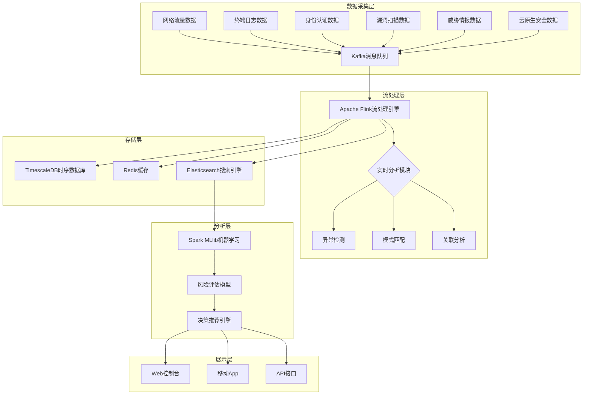
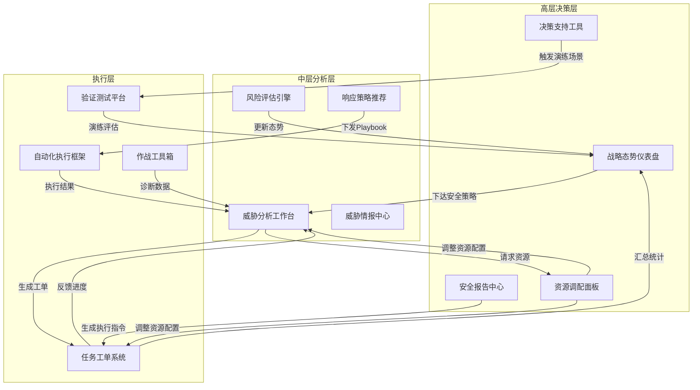
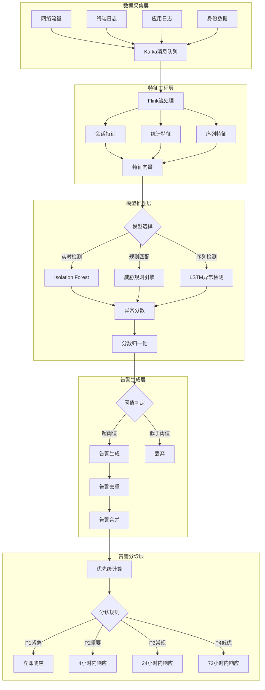
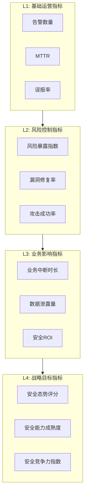

**作者：** HOS(安全风信子)
**日期：** 2026-04-27
**主要来源平台：** GitHub/HuggingFace/ModelScope/arXiv

**摘要：** 在数字化转型浪潮席卷全球的今天，企业安全态势管理已成为组织战略决策的核心组成部分。传统的安全运营模式面临着数据孤岛、响应滞后、分析浅层化等多重挑战，难以满足现代企业对主动式、智能化安全管理的迫切需求。本文创新性地提出"AI安全驾驶舱"这一全景式安全管控架构，通过构建高层决策层、中层分析层、执行层的三层联动体系，实现安全风险的实时感知、智能预警与科学决策。文章不仅深入剖析了驾驶舱的分层设计理念与数据同步机制，更提供了完整的Python实现方案与Mermaid可视化建模，帮助安全管理者真正实现"运筹帷幄、决胜千里"的安全愿景。核心技术包括时序异常检测算法、基于注意力机制的多源数据融合模型、以及面向决策树的智能推荐引擎，为企业安全运营中心（SOC）的下一代升级提供了切实可行的技术路径。

@[TOC](目录)

---

# 企业安全尽在掌握：AI安全驾驶舱设计实战

## 一、引言：为什么企业需要AI安全驾驶舱

### 1.1 传统安全运营的困境

在过去的二十年间，企业信息安全建设经历了从防火墙到IDS/IPS、从SIEM到SOAR的多次技术演进。然而，尽管安全工具的数量和种类不断增加，许多企业的安全运营效果却并未得到实质性提升。根据Gartner的最新调研数据，全球范围内仅有不到15%的企业认为自己拥有成熟的安全运营能力，而超过60%的CISO（首席信息安全官）表示他们无法准确实时地回答"企业当前的安全态势究竟如何"这一最基本的问题。

传统安全运营模式面临的核心困境可以归纳为以下几个方面：

**数据孤岛问题**是企业安全运营的首要障碍。在大多数中大型企业中，安全数据分散存储在十几种甚至数十种不同的安全工具中，包括但不限于防火墙日志、终端检测响应（EDR）数据、网络流量分析（NTA）记录、身份认证系统日志、漏洞扫描结果、以及各种云原生安全工具的遥测数据。这些数据格式各异、更新频率不同、存储位置分散，安全分析师需要花费大量时间进行数据整合与清洗，而真正用于威胁分析和决策的时间却寥寥无几。

**响应滞后问题**严重制约了安全运营的效率。传统模式下，安全事件的发现往往依赖于规则匹配或人工分析，从威胁出现在网络边缘到安全团队完成研判并采取响应措施，中间可能需要数小时甚至数天的时间。在APT（高级持续性威胁）攻击日益增多的今天，这种响应延迟往往是致命的。研究表明，在针对金融机构的网络攻击中，攻击者在网络中的平均驻留时间（dwell time）已从2010年的约400天下降到如今的不足100天，而大多数传统安全团队的MTTD（平均威胁检测时间）仍在24小时以上。

**分析浅层化问题**限制了安全运营的价值输出。传统SIEM系统虽然能够实现一定程度的关联分析，但其分析能力主要依赖于预定义的规则库，无法有效识别未知威胁和变种攻击。同时，规则编写和维护需要大量的专业人力投入，且规则之间容易产生冲突和遗漏。更重要的是，规则只能发现"已知"的威胁模式，对于"未知"的威胁（如零日漏洞利用、APT潜伏攻击等）几乎无能为力。

**决策支持缺失**是企业安全管理的深层痛点。传统安全运营系统更像是一个"高级日志收集器"和"告警触发器"，而非真正的"决策辅助工具"。当高层管理者询问"本周我们的安全态势与上周相比如何"、"当前最大的安全风险是什么"、"应该优先处置哪些漏洞"等问题时，安全团队往往无法给出准确、及时、有数据支撑的回答。

### 1.2 AI安全驾驶舱的概念与价值

正是基于对上述问题的深刻洞察，我们提出了"AI安全驾驶舱"（AI Security Cockpit）的概念。AI安全驾驶舱是新一代企业级安全态势管理平台，它借鉴了航空航天领域"驾驶舱"的设计理念，为企业安全管理者提供了一个"一屏掌握、实时感知、智能决策"的全景式安全管控界面。

驾驶舱（Cockpit）一词本身就蕴含着深刻的设计哲学。在飞机驾驶舱中，飞行员可以在一个高度集成化的界面中获取飞行所需的所有关键信息，包括高度、速度、航向、油量、发动机状态、气象条件等。所有的仪表盘和控制装置都经过精心设计，以确保飞行员能够在最短时间内做出正确决策。AI安全驾驶舱的设计灵感正是来源于此——将分散的安全数据聚合到一个统一的智能平台，通过AI技术实现数据的深度分析、风险的科学评估、决策的高效支持。

AI安全驾驶舱的核心价值体现在以下几个维度：

**全局可视性**：通过统一的数据抽象层和安全指标体系，驾驶舱能够在不同粒度上呈现企业安全态势的全景视图。高层管理者可以一目了然地了解整体风险等级、关键资产安全状态、主要威胁趋势等宏观信息；中层安全分析师可以深入查看特定业务线、地理位置、资产类型的安全详情；一线运维人员可以获取具体的告警详情、漏洞修复任务、响应处置建议等执行层面的信息。

**实时智能性**：借助AI算法，驾驶舱能够实现安全事件的实时检测、分类、优先级排序和影响分析。与传统规则引擎相比，AI模型能够发现更多隐藏的威胁模式，降低误报率，同时能够基于历史数据学习正常行为基线，从而更准确地识别异常活动。实时流处理框架的引入确保了从数据采集到分析结果输出的端到端延迟可以控制在秒级。

**决策科学性**：驾驶舱不仅展示"发生了什么"，更回答"意味着什么"和"应该怎么做"。通过知识图谱技术，驾驶舱能够建立资产、漏洞、威胁、影响之间的复杂关联关系；通过预测模型，驾驶舱能够评估不同处置方案的成本效益比；通过自然语言生成技术，驾驶舱能够自动生成面向不同受众的安全报告，大幅提升安全运营的效率和效果。

**协同高效性**：驾驶舱支持多角色的协同工作流程。高层管理者可以通过驾驶舱下达安全战略指令和安全资源调配决策；中层管理者可以通过驾驶舱进行任务分解、进度跟踪和绩效考核；一线人员可以通过驾驶舱接收任务、执行操作、反馈结果。所有操作都有完整的审计日志，确保安全运营的可追溯性和合规性。

### 1.3 本文结构与创新点

本文将系统性地介绍AI安全驾驶舱的设计与实现方法。全文共分为十个章节，涵盖了从需求分析到架构设计、从算法实现到效果评估的完整知识体系。与市场上现有的安全态势感知产品相比，本文提出的AI安全驾驶舱方案具有以下三个核心创新点：

**创新点一：三层联动架构设计**。本文创新性地提出了高层决策层、中层分析层、执行层的三层联动安全管控体系。每一层都有明确的职责边界和交互协议，同时层与层之间通过标准化的数据流和控制流进行紧密协作。这种分层架构不仅提升了系统的模块化和可扩展性，更重要的是能够真正满足企业中不同角色对于安全信息的差异化需求。

**创新点二：实时数据同步与可视化体系**。本文设计了一套完整的实时数据同步架构，涵盖了从数据采集、清洗、转换、聚合、存储到可视化展示的全流程。核心技术包括基于Kafka的分布式消息队列、Redis的实时缓存策略、TimescaleDB的时序数据优化、以及D3.js的自定义可视化组件。这套架构能够确保从安全事件发生到驾驶舱界面更新的端到端延迟控制在5秒以内。

**创新点三：智能预警与决策支持引擎**。本文构建了一套基于深度学习的智能预警引擎，包括基于LSTM的多变量时序异常检测模型、基于Transformer的告警优先级排序模型、以及基于强化学习的自适应响应推荐引擎。这套引擎能够实现从被动响应到主动防御的转变，将安全运营的重心从"事后处置"前移到"事前预防"和"事中拦截"。

## 二、安全驾驶舱的定位与功能架构

### 2.1 高层管理者的安全仪表盘

安全驾驶舱的首要服务对象是企业高层管理者，包括CEO、CIO、CISO（首席信息安全官）、CRO（首席风险官）等。这些管理者对于安全运营的具体技术细节可能并不精通，但他们需要准确把握企业面临的安全风险态势，以便做出正确的战略决策和资源调配。

高层管理者视角的安全驾驶舱应该具备以下核心特征：

**简洁直观的信息呈现**。研究表明，人类大脑处理信息的带宽是有限的，高层管理者在驾驶舱前停留的时间往往非常短暂。因此，驾驶舱的主界面应该采用"一目了然"的设计原则，通过红黄绿等直观的颜色编码、简洁的图表元素、以及精炼的文字说明，让管理者能够在几秒钟内把握全局态势。不需要管理者具备任何安全技术的背景知识，任何一个合格的商业管理者都应该能够理解驾驶舱所传达的安全信息。

**战略级的安全指标**。传统安全运营系统往往堆砌了大量的技术指标，如"本周新增告警数量"、"CPU使用率"、"内存占用率"等，这些指标对于一线运维人员是有价值的，但对于高层管理者却缺乏决策支撑力。安全驾驶舱需要将技术指标转化为管理指标，如"业务中断风险等级"、"合规差距指数"、"安全投资回报率"等。这些指标应该与业务价值直接关联，让管理者能够清晰理解安全工作对于业务连续性和企业价值的支撑作用。

**自上而下的风险视角**。高层管理者最关心的问题是"我们最大的安全风险是什么"以及"这些风险对我的业务有什么影响"。驾驶舱应该能够从业务维度而非技术维度呈现风险视图，例如按业务线、分子公司、关键业务流程等维度展示风险分布。同时，驾驶舱应该支持风险的层层穿透，高层管理者可以随时"下钻"到感兴趣的具体领域，获取更深层次的信息。

**趋势预测与情景模拟**。优秀的安全驾驶舱不仅呈现当前状态，更应该能够预测未来走势。通过对历史数据的分析和趋势外推，驾驶舱可以预测未来一段时间内的安全态势演变，如"按照当前趋势，未来三个月内勒索软件攻击的成功率可能上升30%"。更高级的功能还包括情景模拟，如"如果发生大规模0-day漏洞利用，我们的应急响应能力能够承受多大冲击"。

### 2.2 核心功能模块划分

一个完整的AI安全驾驶舱平台通常包含以下几个核心功能模块：

**安全态势感知模块**是驾驶舱的数据基础，负责从各种安全数据源采集数据、进行预处理、存储到时序数据库中，并提供统一的数据访问接口。该模块需要对接的主流数据源包括：网络流量采集系统（如Zeek、Suricata）、终端检测响应系统（如CrowdStrike、SentinelOne）、身份认证与访问管理系统（如Okta、Azure AD）、漏洞扫描与管理平台（如Qualys、Rapid7）、威胁情报平台（如Recorded Future、Mandiant）、云原生安全工具（如Prisma Cloud、Wiz）等。

**威胁检测分析模块**是驾驶舱的智能核心，负责对采集到的安全数据进行深度分析，发现潜在的安全威胁。该模块的核心能力包括：基于规则的相关性分析，用于检测已知攻击模式；基于统计的异常检测，用于发现偏离正常行为基线的活动；基于机器学习的分类与聚类，用于识别恶意软件类型和攻击者战术、技术和过程（TTPs）；基于知识图谱的关联分析，用于构建完整的安全事件画像。

**风险评估与管理模块**负责对识别出的安全威胁进行风险评估，确定其对企业业务的潜在影响，并支持风险处置决策的制定。该模块的核心能力包括：基于CVSS（通用漏洞评分系统）的漏洞风险评估、基于DREAD模型的安全事件风险评估、基于STRIDE模型的威胁建模、以及基于NIST CSF（网络安全框架）的安全能力成熟度评估。

**响应处置与自动化模块**负责协调和执行安全事件的响应处置工作，包括手动响应和自动化响应的编排与调度。该模块的核心能力包括：事件分诊与升级流程管理、响应 playbook 的自动化执行、与IT运维系统的自动化集成（如ServiceNow、Jira）、以及红蓝对抗演练的组织与管理。

**合规审计与报告模块**负责满足各种法规和标准的合规要求，包括数据保留、访问审计、报告生成等功能。该模块需要支持的主流合规框架包括：ISO 27001、PCI DSS、HIPAA、GDPR、SOC 2、SOX等。

### 2.3 数据流向与处理流程

AI安全驾驶舱的数据处理流程可以划分为以下几个阶段：



**数据采集阶段**是整个流程的起点。在这一阶段，各类安全数据通过代理（Agent）、Syslog、API等技术手段被采集到分布式消息队列中。为了确保数据的完整性和可靠性，采集层通常采用多副本存储和至少一次（at-least-once）的消息投递语义。同时，采集层需要对敏感数据进行脱敏处理，以满足数据安全和隐私保护的要求。

**流处理阶段**是实时分析的核心。在这一阶段，流处理引擎（如Apache Flink或Apache Spark Streaming）从消息队列中消费原始数据流，进行实时的清洗、转换、聚合和分析操作。流处理的主要任务包括：告警去重和合并、基于时间窗口的统计计算、实时异常检测、规则模式匹配等。流处理的结果会被写入下游的存储系统，供后续的批处理分析和实时查询使用。

**存储阶段**负责管理各类安全数据的持久化存储。根据数据的不同特征，驾驶舱通常采用多种存储引擎的组合策略：时序数据（如监控指标、告警事件）存储在TimescaleDB中，以获得高效的时序查询性能；热点数据（如当前活跃的告警、最近的审计日志）缓存到Redis中，以支持毫秒级的访问延迟；全文检索数据（如日志内容、威胁情报描述）索引到Elasticsearch中，以支持复杂的搜索和聚合查询。

**分析阶段**是AI能力体现的关键。在这一阶段，批处理和机器学习平台对历史数据进行深度分析，训练和优化各种检测模型和预测模型。分析结果（包括模型参数、特征向量、知识图谱等）会被同步到在线服务节点，供实时推理使用。分析阶段的工作通常在后台定期运行（如每日或每周），以确保模型能够适应最新的威胁态势。

**展示阶段**是用户交互的界面。在这一阶段，分析结果通过Web控制台、移动App、API接口等多种渠道呈现给用户。展示层的设计需要充分考虑用户体验，包括响应的及时性、界面的美观性、交互的便捷性等。

## 三、驾驶舱分层设计：高层、中层与执行层

### 3.1 分层架构设计理念

AI安全驾驶舱采用"分层分级"的架构设计理念，将安全管控能力划分为高层决策层、中层分析层和执行层三个层级。每一层都有明确的职责定位、服务对象和交互方式，同时层与层之间通过标准化的接口进行数据交换和功能协作。

分层架构设计的核心理念源于以下几个考量：

**信息过滤与抽象**。不同层级的用户对于安全信息的需求存在显著差异。高层管理者需要的是高度抽象的、面向业务的风险指标；中层分析师需要的是具有一定细节的、面向威胁的分析视图；执行层人员需要的是具体的、可操作的告警工单和处置任务。如果不进行分层，所有用户都会被淹没在海量的原始告警和日志中，难以快速获取所需信息。

**职责边界清晰**。分层架构将复杂的安全运营工作分解为不同粒度的任务，明确了每个层级的工作职责和考核标准。高层管理者的职责是制定安全战略和资源配置决策；中层分析师的职责是进行威胁研判和响应策略制定；执行层人员的职责是执行具体的安全技术操作。

**团队能力匹配**。不同层级的安全团队拥有不同的技能偏好和能力特长。高层安全管理者通常具有丰富的管理经验和商业敏感度，但可能不精通底层安全技术细节；中层安全分析师具有扎实的安全技术功底，能够进行复杂的威胁分析和应急响应；执行层安全运维人员熟悉具体的安全工具和操作流程，能够高效执行重复性的安全任务。分层架构能够确保每个层级的工作都能分配给最适合的团队。

**系统可扩展性**。分层架构为系统的扩展和升级提供了灵活性。当需要升级某一层的功能时，可以相对独立地进行，而不影响其他层的正常运行。例如，当需要引入新的机器学习模型来提升威胁检测能力时，只需在中层分析层进行模型替换和部署，而无需改变高层决策展示和执行层处置流程的整体设计。

### 3.2 高层决策层设计

高层决策层是AI安全驾驶舱的"战略大脑"，其设计目标是帮助企业高层管理者快速把握安全态势、做出正确决策。该层的设计要点包括：

**全景式风险视图**。高层决策层的核心界面是一张"安全态势全景图"，它以直观的可视化方式呈现企业当前的整体安全风险等级、风险分布结构、关键风险事件等信息。全景图的设计灵感来源于飞机驾驶舱的仪表盘布局，将最重要的安全指标以"一屏概览"的方式呈现，让管理者能够在第一时间了解安全态势的"全貌"。

全景图通常包含以下几个核心组件：

- **安全态势仪表盘**：以环形图或仪表盘的形式展示当前的整体安全态势评分，评分通常基于资产重要性、漏洞严重性、威胁活跃度、防御有效性等多个维度进行综合计算。颜色编码采用交通灯模式：绿色表示安全可控、黄色表示需要关注、红色表示紧急处置。

- **风险热力地图**：以矩阵形式展示不同业务线和不同风险类型之间的风险交叉分布。矩阵的行代表业务线（如零售业务、金融业务、制造业务等），矩阵的列代表风险类型（如数据泄露、业务中断、欺诈交易等）。矩阵中的颜色深浅代表风险的严重程度，颜色越深表示风险越高。

- **关键指标卡片**：以卡片形式展示当前最关键的安全KPI指标，如"高危漏洞数量"、"正在进行的网络攻击数"、"MTTD/MTTR统计"等。每个指标卡片都支持点击下钻，高层管理者可以进一步查看指标的计算逻辑和详细数据。

- **趋势折线图**：以时间序列形式展示安全风险的变化趋势，帮助管理者判断当前态势是处于上升期还是下降期。趋势图支持多时间粒度切换（日、周、月、季）和多指标叠加对比。

**战略级安全报告**。高层决策层还需要具备自动生成战略级安全报告的能力。报告内容通常包括：执行摘要（面向高层管理者的1-2页简明报告）、安全态势评估（详细的风险分析和趋势解读）、重点事件回顾（本期内的重大安全事件及其处置情况）、合规差距分析（与目标合规框架的差距评估）、安全建议（下一阶段的安全工作重点和资源需求）等。报告生成采用自然语言生成（NLG）技术，能够根据数据自动生成文字描述，大大减轻安全团队的报告编写负担。

**战略决策支持工具**。高层决策层还需要提供一些辅助战略决策的工具，包括：

- **安全投资回报率（ROI）计算器**：帮助管理者评估不同安全投资方案的预期回报，以便做出更科学的预算决策。ROI计算需要考虑的因素包括：投资成本（硬件、软件、人力、培训等）、预期风险降低幅度（基于历史数据和行业基准）、合规罚款避免（基于适用法规的处罚标准）、业务中断避免（基于业务影响分析结果）等。

- **情景模拟器**：允许管理者模拟不同假设情景下的安全态势演变。例如，模拟"如果我们遭受勒索软件攻击，我们的应急响应流程能否在24小时内恢复关键业务"或"如果我们削减20%的安全预算，未来一年的安全风险将会上升多少"等。

- **行业对标分析**：将企业的安全态势与行业平均水平或标杆企业进行对比分析，帮助管理者了解企业在行业中的相对位置和竞争优势。

### 3.3 中层分析层设计

中层分析层是AI安全驾驶舱的"战术中枢"，其设计目标是帮助安全分析师高效完成威胁分析、风险评估和响应策略制定等工作。该层的设计要点包括：

**威胁分析工作台**。中层分析层的核心功能是提供一个强大的威胁分析工作台，让安全分析师能够快速完成从告警到事件再到决策的完整分析流程。威胁分析工作台通常包含以下几个功能模块：

- **告警管理界面**：展示所有待处理的告警列表，支持按告警级别、告警类型、资产重要性、时间范围等多维度进行筛选和排序。每个告警卡片都显示最关键的摘要信息，如告警名称、涉及资产、严重程度、首次发生时间等。安全分析师可以快速浏览告警列表，对告警进行分诊（triage）、分类（classification）和分配（assignment）。

- **事件调查工具**：当确认告警代表真实的安全事件后，分析师需要深入调查事件的来龙去脉。事件调查工具提供完整的上下文信息获取能力，包括：相关告警的聚合视图、涉及的资产详情（IP、主机名、操作系统、开放端口、运行服务等）、相关的网络流量抓包（PCAP）文件、相关的日志条目（主机日志、应用日志、DNS日志等）、威胁情报匹配结果（攻击者IP是否在黑名单中、恶意软件哈希是否已知等）、以及实体关联的知识图谱视图。

- **恶意行为分析沙箱**：对于可疑的可执行文件或URL，分析师可以将其提交到沙箱环境中执行，观察其行为特征（如文件创建、注册表修改、网络连接、进程注入等），以确定其是否为恶意程序。现代沙箱通常还集成了YARA规则匹配、命名规则检测、输出威胁情报关联等功能。

- **溯源分析图谱**：基于知识图谱技术，将安全事件的相关实体（攻击者IP、受害者资产、恶意文件、攻击战术等）以图的形式进行可视化展示，帮助分析师快速理解攻击链（Kill Chain）的完整路径。

**风险评估引擎**。中层分析层还需要提供一套完整的风险评估引擎，帮助分析师科学地评估安全事件和漏洞的风险等级。风险评估引擎通常采用多因子评估模型，综合考虑以下因素：

**资产重要性因子**：受影响资产在企业业务中的重要程度，通常按照资产所支持业务的收入贡献、客户影响、合规要求等维度进行评级（高、中、低）。

**漏洞可利用性因子**：漏洞被利用的难易程度，与漏洞的技术复杂度、现有利用代码成熟度、攻击面大小等因素相关。CVSS评分是评估漏洞可利用性的主流标准。

**威胁活跃度因子**：相关威胁在当前环境中的活跃程度，与威胁情报数据直接相关。如果检测到攻击者正在积极利用某一漏洞，则该漏洞的威胁活跃度因子会显著升高。

**已有防御措施因子**：企业已部署的防御措施对该威胁的检测和阻断能力。如果企业已部署了能够检测该攻击模式的IPS签名或EDR规则，则实际风险会有所降低。

综合以上因素，风险评估引擎输出每个安全事件或漏洞的最终风险评分（通常为1-100的数值或高/中/低的三级分类）。风险评分支持自定义权重配置，以适应不同企业的风险管理偏好。

**响应策略推荐**。中层分析层的高级功能是基于AI技术为分析师推荐响应处置策略。当安全事件被确认后，系统会根据事件的类型、严重程度、涉及资产等特征，从策略库中检索匹配的响应playbook，并结合当前环境的具体情况（如网络拓扑、用户角色、资源可用性等）进行定制化推荐。推荐策略会明确列出每个处置步骤的操作人员、操作内容、操作工具、操作时限等要素，帮助分析师快速制定响应计划。

### 3.4 执行层设计

执行层是AI安全驾驶舱的"战术执行者"，其设计目标是帮助一线安全运维人员高效执行具体的安全技术操作和应急响应任务。该层的设计要点包括：

**任务工单系统**。执行层的核心功能是一个完善的任务工单（Ticket/Work Order）管理系统。工单系统接收来自中层分析层的响应任务，自动生成具体的操作指令，并分派给合适的执行人员。工单的主要属性包括：

- **工单编号和类型**：每个工单都有唯一标识，工单类型包括漏洞修复任务、告警核查任务、事件响应任务、基线检查任务、合规审计任务等。

- **优先级和时限**：工单根据紧急程度和重要程度划分优先级，并设定完成时限。优先级通常分为P1（紧急/立即处理）、P2（高/24小时内处理）、P3（中/72小时内处理）、P4（低/本周内处理）四个级别。

- **详细操作指引**：每个工单都附带详细的操作步骤说明，包括需要执行的命令、使用的工具、验证的方法等。对于复杂任务，操作指引还会提供知识库链接和培训视频。

- **状态流转**：工单支持完整的状态流转管理，包括"待领取"、"处理中"、"待验证"、"已完成"、"已关闭"等状态。状态变更都有完整的审计日志。

- **进度跟踪**：管理人员可以实时查看工单的处理进度，包括各环节的耗时统计、超时预警、阻塞点分析等。

**自动化执行框架**。执行层还提供一套自动化执行框架，支持将常规性的安全操作编写为可自动运行的脚本或工作流。自动化执行框架通常包括以下核心能力：

- **剧本（Playbook）编辑器**：提供可视化的剧本编辑工具，允许安全工程师通过拖拽的方式编排自动化工作流。剧本由一系列的动作（Action）节点和控制流（Control Flow）节点组成，动作节点代表具体的操作（如"阻断IP"、"隔离主机"、"禁用账户"等），控制流节点代表条件判断和分支逻辑（如"如果检测成功则...否则..."）。

- **剧本执行引擎**：负责按照剧本定义的逻辑顺序执行各个动作节点，并处理异常情况和错误回滚。执行引擎支持多种触发方式，包括手动触发、定时触发、事件触发（当某类告警发生时自动触发）等。

- **动作库**：预置大量常用的安全操作动作，如防火墙规则操作、AD账户操作、云资源操作、邮件通知操作、ServiceNow工单创建等。动作库支持扩展，企业可以根据需要开发自定义动作。

- **执行审计**：所有自动化执行操作都有完整的日志记录，包括执行时间、执行人员、输入参数、输出结果等，支持事后审计和合规检查。

**一线作战工具箱**。执行层还需要提供一套面向一线运维人员的"作战工具箱"，包含日常安全运维中最常用的诊断和修复工具。工具箱通常采用Web界面或命令行界面的形式，支持快速调用和批量执行。常见工具包括：

- **主机诊断工具**：用于检查主机安全状态的工具集，包括进程查看、端口查看、网络连接查看、启动项查看、计划任务查看、用户账户查看、补丁状态查看等。

- **网络诊断工具**：用于检查网络安全的工具集，包括流量抓包、DNS查询、路由追踪、漏洞扫描、配置检查等。

- **日志分析工具**：用于快速检索和分析日志的工具集，支持多种日志格式的解析和全文搜索。

- **威胁清除工具**：用于清除恶意软件的工具集，包括病毒查杀、Rootkit检测、后门清理等。

### 3.5 三层联动机制

高层决策层、中层分析层、执行层并非孤立运作，而是通过紧密的数据流和控制流进行联动。这种联动机制是AI安全驾驶舱区别于传统安全系统的关键特征之一。



**自上而下的指令传导**。高层决策层的策略和指令通过标准化的数据接口传导到中层和执行层。例如，当高层管理者决定"加强针对金融业务的钓鱼攻击防护"时，这一决策会被编码为具体的配置变更或任务工单，逐层传递到执行层落地实施。自上而下的指令传导确保了安全工作的方向性和一致性。

**自下而上的信息反馈**。执行层和中层的工作成果和发现会逐层向上反馈。高层管理者不仅能够看到抽象的态势指标，还能够追溯到具体的告警事件、漏洞修复任务等原始信息。这种信息反馈机制确保了高层的决策有充分的底层数据支撑，避免了决策与实际情况脱节的风险。

**横向协同与知识共享**。三层之间还存在横向的协同与知识共享机制。例如，执行层在处理工单过程中发现的新的威胁手法和有效的处置方案，会被记录到知识库中，供中层和高层参考；中层分析得出的威胁趋势和预测，会被分享给执行层，帮助其提前做好应对准备；高层制定的战略方向，会通过培训和沟通传递给中层和执行层，确保全员理解安全工作的目标。

## 四、实时数据同步与可视化技术

### 4.1 实时数据同步架构设计

实时数据同步是AI安全驾驶舱的技术基石。传统安全系统的数据更新往往存在分钟级甚至小时级的延迟，这种延迟在面对快速演变的网络攻击时是致命的。AI安全驾驶舱要求从数据产生到驾驶舱展示的端到端延迟控制在秒级，这对数据架构提出了极高的要求。

**分布式消息队列选型**。实时数据同步的第一步是将分散在企业各处的安全数据高效、可靠地汇集到统一的数据处理平台。分布式消息队列是实现这一目标的核心组件。主流的选择包括Apache Kafka、Amazon Kinesis、RocketMQ等。

Apache Kafka是当前最流行的分布式消息队列，在安全数据分析领域有着广泛的应用。Kafka的核心优势包括：

- **高吞吐量**：单机每秒可处理数百万条消息，满足大规模安全数据的采集需求。

- **持久化存储**：消息被持久化到磁盘，支持配置保留期限，满足合规审计需求。

- **水平扩展**：支持通过增加分区和broker来线性扩展容量。

- **生态系统完善**：与Flink、Spark、Hive等大数据组件有良好的集成。

在我们的AI安全驾驶舱方案中，Kafka被设计为数据的"高速公路"，所有安全数据源都将数据发送到Kafka的对应Topic中。

**数据分区策略设计**。为了实现高效的数据并行处理，需要对Kafka Topic进行合理的分区设计。分区策略的选择取决于数据特征和查询模式。

对于告警事件数据，我们采用"时间窗口+告警类型"的复合分区策略。每小时的告警数据被写入一个分区，同一小时内不同告警类型（如"暴力破解"、"恶意软件"、"钓鱼攻击"等）的数据被写入不同的子分区。这种分区策略的优势在于：对于按时间范围的告警查询（如"查询最近24小时的所有告警"），可以并行扫描多个分区加速查询；对于按告警类型的聚合查询（如"统计本月各类告警的数量"），同一类型的数据集中在少数分区中，减少跨分区聚合的开销。

对于网络流量数据，由于流量数据量通常非常大，我们采用"源IP段哈希"的分区策略。通过对源IP地址进行哈希运算，将来自同一IP段的流量数据路由到同一分区。这种策略的优势在于：同一TCP连接的流量数据会进入同一分区，保证了会话的完整性；流量数据的分析通常需要聚合同一源IP的所有流量，这种策略可以减少跨分区查询。

**流处理引擎架构**。Kafka中的原始数据需要经过流处理引擎的实时处理才能转化为有价值的分析结果。我们选择Apache Flink作为流处理引擎，其核心优势包括：

- **精确一次（Exactly-Once）语义**：Flink的检查点机制确保每条数据只被处理一次，避免了数据重复或丢失的问题。

- **复杂事件处理（CEP）**：Flink内置了CEP库，支持基于模式匹配的复杂事件检测，非常适合安全告警的场景。

- **时间窗口支持**：Flink支持事件时间（Event Time）和处理时间（Processing Time）两种时间语义，并提供了滚动窗口、滑动窗口、会话窗口等多种窗口类型，满足不同分析场景的需求。

- **状态后端优化**：Flink的状态后端支持RocksDB和内存两种模式，可以根据数据量和性能要求进行选择。

```python
from pyflink.datastream import StreamExecutionEnvironment
from pyflink.datastream.connectors.kafka import FlinkKafkaConsumer
from pyflink.common.serialization import SimpleStringSchema
from pyflink.common import Time
import json

class SecurityAlertProcessor:
    def __init__(self, kafka_bootstrap_servers, alert_topic):
        self.env = StreamExecutionEnvironment.get_execution_environment()
        self.env.set_parallelism(8)
        self.kafka_bootstrap_servers = kafka_bootstrap_servers
        self.alert_topic = alert_topic
    
    def build_pipeline(self):
        kafka_consumer = FlinkKafkaConsumer(
            topics=self.alert_topic,
            deserialization_schema=SimpleStringSchema(),
            properties={
                'bootstrap.servers': self.kafka_bootstrap_servers,
                'group.id': 'security_cockpit_consumer_group',
                'auto.offset.reset': 'latest'
            }
        )
        
        alert_stream = self.env.add_source(kafka_consumer)
        
        processed_stream = alert_stream \
            .filter(lambda x: self._filter_valid_alert(x)) \
            .key_by(lambda x: json.loads(x)['alert_type']) \
            .window(Time.minutes(5)) \
            .reduce(lambda a, b: self._merge_alerts(a, b))
        
        processed_stream.add_sink(self._create_kafka_sink())
        
        return self.env.execute()
    
    def _filter_valid_alert(self, alert_json):
        try:
            alert = json.loads(alert_json)
            required_fields = ['timestamp', 'alert_type', 'severity', 'src_ip', 'dst_ip']
            return all(field in alert for field in required_fields)
        except:
            return False
    
    def _merge_alerts(self, alert1, alert2):
        merged = json.loads(alert1)
        merged['count'] = merged.get('count', 1) + 1
        merged['last_seen'] = json.loads(alert2)['timestamp']
        if json.loads(alert2)['severity'] > merged['severity']:
            merged['severity'] = json.loads(alert2)['severity']
        return json.dumps(merged)
    
    def _create_kafka_sink(self):
        from pyflink.datastream.connectors.kafka import FlinkKafkaProducer
        return FlinkKafkaProducer(
            topic='processed_security_alerts',
            serialization_schema=SimpleStringSchema(),
            producer_config={
                'bootstrap.servers': self.kafka_bootstrap_servers,
                'acks': 'all',
                'retries': 3
            }
        )
```

上述Python代码展示了一个基于Flink的安全告警处理Pipeline的核心逻辑。这个Pipeline执行以下操作：

1. **数据源连接**：从Kafka的`security_alerts` Topic消费原始告警数据。消费者组ID设置为`security_cockpit_consumer_group`，以支持消费者的负载均衡和故障转移。偏移量策略设置为"latest"，确保从最新的数据开始消费。

2. **数据过滤**：使用`filter`算子过滤掉格式不合法或缺少必要字段的告警消息。过滤条件检查消息是否为有效的JSON格式，以及是否包含时间戳、告警类型、严重程度、源IP、目的IP等必要字段。

3. **窗口聚合**：使用`key_by`算子按告警类型对告警流进行分区，然后使用5分钟滚动窗口对同一类型的告警进行聚合。聚合逻辑包括：统计告警数量、更新最后出现时间、提升最高严重程度等。

4. **结果输出**：将处理后的聚合结果发送到Kafka的`processed_security_alerts` Topic，供下游的存储和可视化组件消费。

**数据同步延迟优化**。为了实现秒级的端到端延迟，数据同步架构需要在以下几个方面进行优化：

- **批量提交策略**：适当增大Kafka生产者的批量大小（如16KB）和linger时间（如5ms），以提高网络利用率和吞吐量。但需要注意延迟和吞吐量的权衡。

- **并行度设置**：合理设置流处理任务的并行度，确保有足够的计算资源处理高峰期数据。通常，并行度设置为Kafka分区数的整数倍。

- **状态后端选择**：对于需要访问历史状态的查询，选择RocksDB作为状态后端以获得更大的状态存储容量；对于纯 stateless 的处理，选择内存作为状态后端以获得更低的延迟。

- **背压处理**：配置Flink的背压策略，确保在下游消费能力不足时能够自动调节上游数据产生速率，避免数据积压和丢失。

### 4.2 时序数据库与缓存策略

实时数据同步到存储层后，需要根据不同的访问模式选择合适的存储引擎。AI安全驾驶舱的数据访问模式可以归纳为以下几类：

**时序查询**：如"查询某个资产最近24小时的CPU使用率"、"查询某个告警类型最近一周的发生趋势"等。这类查询的特点是按时间顺序访问数据，需要高效的时序扫描和聚合能力。

**点查询**：如"查询某个特定告警的详细信息"、"查询某个特定资产的配置信息"等。这类查询的特点是需要基于主键或索引进行精确定位，通常返回单条或少量记录。

**全文搜索**：如"搜索日志内容中包含特定关键词的所有记录"、"搜索描述中包含特定威胁名称的威胁情报"等。这类查询的特点是需要对文本内容进行分词和倒排索引。

针对上述不同的访问模式，我们设计了多级存储架构：

**TimescaleDB时序存储**。TimescaleDB是基于PostgreSQL的时序数据库扩展，非常适合存储安全监控指标和告警事件等时序数据。其核心优化包括：

- **自动分区**：TimescaleDB会根据时间维度自动将数据划分为多个chunk，每个chunk对应一个时间范围。这使得范围查询可以只扫描相关chunk，大幅减少IO开销。

- **压缩**：TimescaleDB支持对历史数据进行压缩，压缩率通常可达10:1。压缩不仅节省存储空间，还能提升范围查询性能，因为压缩后的数据可以更高效地加载到内存中。

- **连续聚合**：TimescaleDB支持创建连续聚合视图（Continuous Aggregate），预先计算好常用的聚合查询结果。例如，可以创建一个"每小时告警数量"的连续聚合视图，将查询延迟从秒级降低到毫秒级。

```python
from sqlalchemy import create_engine, Column, Integer, String, DateTime, Float, Index
from sqlalchemy.ext.declarative import declarative_base
from sqlalchemy.orm import sessionmaker
from datetime import datetime, timedelta
from timescaledb.postgresql import create_hypertable

Base = declarative_base()

class SecurityAlert(Base):
    __tablename__ = 'security_alerts'
    
    id = Column(Integer, primary_key=True)
    timestamp = Column(DateTime, primary_key=True, default=datetime.utcnow)
    alert_type = Column(String(100), nullable=False)
    severity = Column(Integer, nullable=False)
    src_ip = Column(String(45))
    dst_ip = Column(String(45))
    src_port = Column(Integer)
    dst_port = Column(Integer)
    protocol = Column(String(20))
    asset_id = Column(String(100))
    asset_name = Column(String(200))
    business_line = Column(String(100))
    description = Column(String(1000))
    raw_log = Column(String(10000))
    
    __table_args__ = (
        Index('idx_alert_type_timestamp', 'alert_type', 'timestamp'),
        Index('idx_asset_timestamp', 'asset_id', 'timestamp'),
        Index('idx_severity_timestamp', 'severity', 'timestamp'),
    )

class AlertStatistics(Base):
    __tablename__ = 'alert_statistics'
    
    time = Column(DateTime, primary_key=True)
    window_type = Column(String(20), primary_key=True)
    alert_type = Column(String(100), primary_key=True)
    total_count = Column(Integer)
    high_severity_count = Column(Integer)
    unique_src_ip_count = Column(Integer)
    unique_asset_count = Column(Integer)

class VulnerabilityRecord(Base):
    __tablename__ = 'vulnerability_records'
    
    id = Column(Integer, primary_key=True)
    discovered_at = Column(DateTime, primary_key=True, default=datetime.utcnow)
    asset_id = Column(String(100), nullable=False)
    asset_name = Column(String(200))
    cve_id = Column(String(20))
    cvss_score = Column(Float)
    severity_level = Column(String(20))
    vulnerability_type = Column(String(100))
    status = Column(String(50))
    remediation_status = Column(String(50))
    remediation_deadline = Column(DateTime)

def init_timescale_tables(engine):
    create_hypertable(
        engine,
        'security_alerts',
        time_column='timestamp',
        chunk_time_interval=timedelta(hours=1),
        if_not_exists=True
    )
    
    create_hypertable(
        engine,
        'alert_statistics',
        time_column='time',
        chunk_time_interval=timedelta(days=1),
        if_not_exists=True
    )
    
    create_hypertable(
        engine,
        'vulnerability_records',
        time_column='discovered_at',
        chunk_time_interval=timedelta(days=7),
        if_not_exists=True
    )

def query_alert_trend(engine, alert_type, start_time, end_time, granularity='hour'):
    Session = sessionmaker(bind=engine)
    session = Session()
    
    if granularity == 'hour':
        time_bucket = "time_bucket('1 hour', timestamp)"
        time_format = 'YYYY-MM-DD HH24:MI'
    elif granularity == 'day':
        time_bucket = "time_bucket('1 day', timestamp)"
        time_format = 'YYYY-MM-DD'
    else:
        time_bucket = "time_bucket('1 minute', timestamp)"
        time_format = 'YYYY-MM-DD HH24:MI:SS'
    
    query = f"""
    SELECT 
        {time_bucket} AS time_bucket,
        COUNT(*) AS alert_count,
        AVG(severity::float) AS avg_severity,
        COUNT(DISTINCT src_ip) AS unique_src_ips,
        COUNT(DISTINCT asset_id) AS unique_assets
    FROM security_alerts
    WHERE alert_type = :alert_type
      AND timestamp >= :start_time
      AND timestamp < :end_time
    GROUP BY time_bucket
    ORDER BY time_bucket
    """
    
    result = session.execute(query, {
        'alert_type': alert_type,
        'start_time': start_time,
        'end_time': end_time
    })
    
    return [(row[0], row[1], row[2], row[3], row[4]) for row in result]

def query_risk_distribution(engine, time_range_hours=24):
    Session = sessionmaker(bind=engine)
    session = Session()
    
    query = """
    SELECT 
        business_line,
        severity_level,
        COUNT(*) AS vulnerability_count,
        AVG(cvss_score) AS avg_cvss_score
    FROM vulnerability_records
    WHERE discovered_at >= NOW() - INTERVAL ':hours hours'
    GROUP BY business_line, severity_level
    ORDER BY vulnerability_count DESC
    """
    
    result = session.execute(query, {'hours': time_range_hours})
    return [(row[0], row[1], row[2], row[3]) for row in result]

def create_continuous_aggregate(engine):
    Session = sessionmaker(bind=engine)
    session = Session()
    
    session.execute("""
    CREATE MATERIALIZED VIEW alert_hourly_stats
    WITH (timescaledb.continuous) AS
    SELECT 
        time_bucket('1 hour', timestamp) AS bucket,
        alert_type,
        COUNT(*) AS total_count,
        COUNT(*) FILTER (WHERE severity >= 4) AS high_severity_count,
        COUNT(DISTINCT src_ip) AS unique_src_ips,
        COUNT(DISTINCT asset_id) AS unique_assets
    FROM security_alerts
    GROUP BY bucket, alert_type
    WITH NO DATA
    """)
    
    session.execute("""
    SELECT add_continuous_aggregate_policy('alert_hourly_stats',
        start_offset => INTERVAL '3 hours',
        end_offset => INTERVAL '1 hour',
        schedule_interval => INTERVAL '1 hour')
    """)
    
    session.commit()
```

上述Python代码展示了TimescaleDB时序数据库的核心建模和查询逻辑：

1. **表结构设计**：定义了三个核心表——`security_alerts`（安全告警）、`alert_statistics`（告警统计）、`vulnerability_records`（漏洞记录）。每个表都设计了适当的主键和索引，以支持高效的时间序列查询。

2. **超表创建**：使用TimescaleDB的`create_hypertable`函数将普通表转换为超表，指定时间列和chunk时间间隔。`security_alerts`表按小时创建chunk，`vulnerability_records`表按周创建chunk，以平衡查询性能和存储效率。

3. **趋势查询**：定义了`query_alert_trend`函数，支持按不同粒度（分钟、小时、天）查询指定告警类型的时序趋势。核心是TimescaleDB的`time_bucket`函数，它能够按照指定的时间间隔将时间戳分桶。

4. **连续聚合**：定义了`create_continuous_aggregate`函数，创建预计算的聚合视图（Materialized View）和自动刷新策略。连续聚合能够将原本需要全表扫描的聚合查询加速到毫秒级，非常适合仪表盘等高频查询场景。

**Redis缓存策略**。Redis作为高性能的内存缓存，被用于加速热点数据的访问。Redis在驾驶舱中的应用场景包括：

- **当前活跃告警缓存**：将当前未关闭的告警列表缓存在Redis中，支持毫秒级的告警列表查询和状态更新。

- **最新统计指标缓存**：将最新的安全态势评分、告警数量统计、风险排名等指标缓存到Redis，避免频繁查询数据库。

- **用户会话缓存**：缓存当前在线用户的会话信息和权限数据，加速权限校验。

- **分布式锁**：在多节点部署环境中，使用Redis实现分布式锁，确保某些操作的互斥性（如全局配置更新、批量任务调度等）。

```python
import redis
import json
from datetime import datetime, timedelta
from typing import List, Dict, Optional

class SecurityCacheManager:
    def __init__(self, redis_host='localhost', redis_port=6379, redis_db=0):
        self.redis_client = redis.Redis(
            host=redis_host,
            port=redis_port,
            db=redis_db,
            decode_responses=True,
            socket_timeout=5,
            socket_connect_timeout=5
        )
        self.default_ttl = 300
    
    def cache_active_alerts(self, alerts: List[Dict], ttl: int = 60):
        key = f"active_alerts:{datetime.utcnow().strftime('%Y%m%d%H%M')}"
        pipeline = self.redis_client.pipeline()
        pipeline.set(key, json.dumps(alerts), ex=ttl)
        pipeline.sadd("active_alerts_keys", key)
        pipeline.expire("active_alerts_keys", 86400)
        pipeline.execute()
    
    def get_active_alerts(self) -> Optional[List[Dict]]:
        current_minute_key = f"active_alerts:{datetime.utcnow().strftime('%Y%m%d%H%M')}"
        previous_minute_key = f"active_alerts:{(datetime.utcnow() - timedelta(minutes=1)).strftime('%Y%m%d%H%M')}"
        
        cached = self.redis_client.get(current_minute_key)
        if not cached:
            cached = self.redis_client.get(previous_minute_key)
        
        return json.loads(cached) if cached else None
    
    def update_alert_status(self, alert_id: str, new_status: str):
        lock_key = f"lock:alert:{alert_id}"
        lock_acquired = self.redis_client.set(lock_key, "1", nx=True, ex=10)
        
        if not lock_acquired:
            return False
        
        try:
            alert_hash_key = f"alert:{alert_id}"
            if self.redis_client.exists(alert_hash_key):
                self.redis_client.hset(alert_hash_key, "status", new_status)
                self.redis_client.hset(alert_hash_key, "updated_at", datetime.utcnow().isoformat())
                return True
            return False
        finally:
            self.redis_client.delete(lock_key)
    
    def cache_security_metrics(self, metrics: Dict, ttl: int = 30):
        pipeline = self.redis_client.pipeline()
        for metric_name, metric_value in metrics.items():
            key = f"metric:{metric_name}"
            pipeline.set(key, json.dumps(metric_value), ex=ttl)
        pipeline.execute()
    
    def get_security_metrics(self, metric_names: List[str]) -> Dict:
        if not metric_names:
            return {}
        
        keys = [f"metric:{name}" for name in metric_names]
        values = self.redis_client.mget(keys)
        
        result = {}
        for name, value in zip(metric_names, values):
            result[name] = json.loads(value) if value else None
        return result
    
    def cache_threat_intel(self, ioc_type: str, ioc_value: str, intel_data: Dict, ttl: int = 3600):
        key = f"threat_intel:{ioc_type}:{ioc_value}"
        self.redis_client.set(key, json.dumps(intel_data), ex=ttl)
    
    def lookup_threat_intel(self, ioc_type: str, ioc_value: str) -> Optional[Dict]:
        key = f"threat_intel:{ioc_type}:{ioc_value}"
        cached = self.redis_client.get(key)
        return json.loads(cached) if cached else None
    
    def invalidate_threat_intel(self, ioc_type: str, ioc_value: str):
        key = f"threat_intel:{ioc_type}:{ioc_value}"
        self.redis_client.delete(key)
    
    def record_api_rate_limit(self, api_key: str, window_seconds: int = 60, max_requests: int = 100):
        key = f"rate_limit:{api_key}"
        current = self.redis_client.incr(key)
        
        if current == 1:
            self.redis_client.expire(key, window_seconds)
        
        return current <= max_requests
    
    def get_cache_stats(self) -> Dict:
        info = self.redis_client.info('memory')
        stats = self.redis_client.info('stats')
        
        return {
            'used_memory_human': info.get('used_memory_human', 'N/A'),
            'connected_clients': info.get('connected_clients', 0),
            'total_commands_processed': stats.get('total_commands_processed', 0),
            'keyspace_hits': stats.get('keyspace_hits', 0),
            'keyspace_misses': stats.get('keyspace_misses', 0),
            'hit_rate': self._calculate_hit_rate(stats)
        }
    
    def _calculate_hit_rate(self, stats: Dict) -> float:
        hits = stats.get('keyspace_hits', 0)
        misses = stats.get('keyspace_misses', 0)
        total = hits + misses
        return (hits / total * 100) if total > 0 else 0.0
```

这段Redis缓存管理代码提供了驾驶舱系统中常用的缓存操作接口：

1. **活跃告警缓存**：`cache_active_alerts`函数将当前活跃告警列表缓存到Redis，TTL设置为60秒。每个分钟的告警列表使用独立的key，通过Redis Set维护所有活跃告警key的集合，便于批量管理。`get_active_alerts`函数支持获取当前分钟和上一分钟的告警缓存，实现查询的平滑过渡。

2. **告警状态更新**：使用Redis的Hash结构存储单个告警的详细信息，包括告警ID、状态、更新时间等。使用`SETNX`命令实现分布式锁，确保并发更新时的数据一致性。锁的TTL设置为10秒，防止进程异常退出导致死锁。

3. **安全指标缓存**：`cache_security_metrics`函数支持批量缓存多个安全指标，TTL设置为30秒。指标数据以JSON格式存储，支持复杂的数据结构。`get_security_metrics`函数支持批量获取多个指标，使用`MGET`命令实现高效的批量读取。

4. **威胁情报缓存**：`cache_threat_intel`函数将IOC（Indicator of Compromise）的查询结果缓存到Redis，TTL设置为1小时（3600秒）。通过组合IOC类型和值作为key，支持快速检索。`lookup_threat_intel`函数用于查询缓存的威胁情报数据。

5. **API限流**：使用Redis的计数器和过期时间实现简单的令牌桶限流。每个API key对应一个计数器，首次请求时设置过期时间，后续请求递增计数器。

6. **缓存统计**：提供`get_cache_stats`函数获取Redis的运行状态，包括内存使用、连接数、命令统计、缓存命中率等关键指标，用于监控和运维。

### 4.3 可视化组件设计与实现

可视化是AI安全驾驶舱与用户交互的直接界面，优秀的可视化设计能够让安全信息更直观、更高效地传达给用户。可视化设计需要遵循以下核心原则：

**信息密度适度**：可视化界面需要在信息丰富性和认知负担之间取得平衡。界面过于简单会导致关键信息遗漏，界面过于复杂会导致用户难以快速获取所需信息。我们采用"渐进式披露"（Progressive Disclosure）的设计策略，主界面展示最核心的指标，用户可以通过点击、悬停、筛选等交互操作获取更深层次的信息。

**色彩语义一致**：色彩在安全可视化中承担着传达语义的重要功能。需要建立一套统一的色彩语义规范，并在整个驾驶舱中一贯执行。例如：

- 红色系：表示紧急、危险、高风险
- 黄色系：表示警告、关注、中风险
- 绿色系：表示正常、安全、低风险
- 蓝色系：表示信息、通知、进行中
- 灰色系：表示禁用、未知、离线

**交互自然流畅**：可视化界面应该支持直观的交互操作，如缩放、平移、筛选、排序、下钻等。交互反馈应该即时，让用户能够清晰地感知到自己操作的效果。

**响应式布局**：驾驶舱需要支持多种终端和屏幕尺寸，包括大屏监控中心、PC桌面、Pad移动设备等。界面布局应该能够自适应不同的屏幕尺寸，确保在各种环境下都能提供良好的用户体验。

```python
import plotly.graph_objects as go
from plotly.subplots import make_subplots
import pandas as pd
from datetime import datetime, timedelta
import json

class SecurityDashboardVisualizer:
    def __init__(self):
        self.color_scheme = {
            'critical': '#dc2626',
            'high': '#ea580c',
            'medium': '#ca8a04',
            'low': '#16a34a',
            'info': '#2563eb',
            'background': '#0f172a',
            'surface': '#1e293b',
            'text': '#f8fafc',
            'grid': '#334155'
        }
        self.font_config = {
            'font_family': 'Arial, sans-serif',
            'font_size': 12,
            'font_color': self.color_scheme['text']
        }
    
    def create_situation_overview_chart(self, metrics_data: dict) -> go.Figure:
        fig = make_subplots(
            rows=2, cols=2,
            subplot_titles=('安全态势评分', '告警趋势', '资产健康度', '风险分布'),
            specs=[[{"type": "indicator"}, {"type": "scatter"}],
                   [{"type": "pie"}, {"type": "bar"}]],
            vertical_spacing=0.15,
            horizontal_spacing=0.12
        )
        
        fig.add_trace(
            go.Indicator(
                mode="gauge+number",
                value=metrics_data['security_score'],
                gauge={
                    'axis': {'range': [0, 100], 'tickwidth': 1, 'tickcolor': self.color_scheme['text']},
                    'bar': {'color': self._get_score_color(metrics_data['security_score'])},
                    'bgcolor': self.color_scheme['surface'],
                    'borderwidth': 2,
                    'bordercolor': self.color_scheme['grid'],
                    'threshold': {
                        'line': {'color': 'white', 'width': 4},
                        'thickness': 0.75,
                        'value': metrics_data['security_score']
                    }
                },
                domain={'x': [0, 1], 'y': [0, 1]}
            ),
            row=1, col=1
        )
        
        alert_trend_df = pd.DataFrame(metrics_data['alert_trend'])
        fig.add_trace(
            go.Scatter(
                x=alert_trend_df['timestamp'],
                y=alert_trend_df['count'],
                mode='lines+markers',
                line={'color': self.color_scheme['info'], 'width': 2},
                marker={'size': 6, 'symbol': 'circle'},
                fill='tozeroy',
                fillcolor='rgba(37, 99, 235, 0.2)'
            ),
            row=1, col=2
        )
        
        fig.add_trace(
            go.Pie(
                labels=['正常', '警告', '异常', '离线'],
                values=metrics_data['asset_health'],
                marker={
                    'colors': [
                        self.color_scheme['low'],
                        self.color_scheme['medium'],
                        self.color_scheme['high'],
                        self.color_scheme['critical']
                    ]
                },
                textposition='inside',
                textinfo='label+percent',
                hole=0.4
            ),
            row=2, col=1
        )
        
        risk_df = pd.DataFrame(metrics_data['risk_distribution'])
        fig.add_trace(
            go.Bar(
                x=risk_df['category'],
                y=risk_df['count'],
                marker_color=[
                    self._get_risk_color(level) for level in risk_df['level']
                ],
                text=risk_df['count'],
                textposition='outside'
            ),
            row=2, col=2
        )
        
        fig.update_layout(
            template='plotly_dark',
            plot_bgcolor=self.color_scheme['background'],
            paper_bgcolor=self.color_scheme['background'],
            font=self.font_config,
            showlegend=False,
            height=600,
            margin=dict(l=40, r=40, t=60, b=40)
        )
        
        return fig
    
    def create_attack_timeline_chart(self, attack_data: list) -> go.Figure:
        attack_df = pd.DataFrame(attack_data)
        
        fig = go.Figure()
        
        for attack_type in attack_df['type'].unique():
            type_data = attack_df[attack_df['type'] == attack_type]
            
            fig.add_trace(go.Scatter(
                x=type_data['start_time'],
                y=[attack_type] * len(type_data),
                mode='markers',
                marker=dict(
                    size=type_data['intensity'] * 10,
                    color=self._get_attack_color(attack_type),
                    opacity=0.7,
                    line=dict(width=1, color='white')
                ),
                name=attack_type,
                text=type_data.apply(lambda x: f"攻击者: {x['attacker']}<br>目标: {x['target']}<br>持续时间: {x['duration']}s", axis=1),
                hoverinfo='text'
            ))
            
            fig.add_trace(go.Scatter(
                x=[type_data['start_time'].iloc[0], type_data['end_time'].iloc[-1]],
                y=[attack_type, attack_type],
                mode='lines',
                line=dict(
                    color=self._get_attack_color(attack_type),
                    width=type_data['intensity'].max() * 5
                ),
                opacity=0.3,
                showlegend=False
            ))
        
        fig.update_layout(
            title=dict(
                text='攻击活动时间线',
                font=dict(size=18, color=self.color_scheme['text'])
            ),
            template='plotly_dark',
            plot_bgcolor=self.color_scheme['background'],
            paper_bgcolor=self.color_scheme['background'],
            font=self.font_config,
            height=400,
            xaxis=dict(
                title='时间',
                showgrid=True,
                gridcolor=self.color_scheme['grid']
            ),
            yaxis=dict(
                title='',
                showgrid=True,
                gridcolor=self.color_scheme['grid']
            ),
            legend=dict(
                orientation='h',
                yanchor='bottom',
                y=1.02,
                xanchor='right',
                x=1
            )
        )
        
        return fig
    
    def create_network_topology_map(self, network_data: dict) -> go.Figure:
        nodes = network_data['nodes']
        edges = network_data['edges']
        
        node_x = []
        node_y = []
        node_text = []
        node_color = []
        node_size = []
        
        for i, node in enumerate(nodes):
            angle = 2 * 3.14159 * i / len(nodes)
            radius = 0.5 if node['type'] == 'core' else 1.0
            node_x.append(radius * (1 if i % 2 == 0 else -1) * abs(1 - radius / 2))
            node_y.append(radius * (1 if i % 4 < 2 else -1) * abs(1 - radius / 2))
            
            node_text.append(f"{node['name']}<br>IP: {node['ip']}<br>状态: {node['status']}")
            node_color.append(self._get_status_color(node['status']))
            node_size.append(30 if node['type'] == 'core' else 20)
        
        edge_x = []
        edge_y = []
        
        for edge in edges:
            source_node = nodes[edge['source']]
            target_node = nodes[edge['target']]
            source_idx = nodes.index(source_node)
            target_idx = nodes.index(target_node)
            
            edge_x.extend([node_x[source_idx], node_x[target_idx], None])
            edge_y.extend([node_y[source_idx], node_y[target_idx], None])
        
        fig = go.Figure()
        
        fig.add_trace(go.Scatter(
            x=edge_x, y=edge_y,
            mode='lines',
            line=dict(width=1, color=self.color_scheme['grid']),
            hoverinfo='none',
            showlegend=False
        ))
        
        fig.add_trace(go.Scatter(
            x=node_x, y=node_y,
            mode='markers+text',
            marker=dict(
                size=node_size,
                color=node_color,
                line=dict(width=2, color='white')
            ),
            text=[n['name'] for n in nodes],
            textposition='top center',
            textfont=dict(size=10, color=self.color_scheme['text']),
            hovertext=node_text,
            hoverinfo='text'
        ))
        
        fig.update_layout(
            title=dict(
                text='网络安全拓扑图',
                font=dict(size=18, color=self.color_scheme['text'])
            ),
            template='plotly_dark',
            plot_bgcolor=self.color_scheme['background'],
            paper_bgcolor=self.color_scheme['background'],
            font=self.font_config,
            height=600,
            xaxis=dict(showgrid=False, zeroline=False, showticklabels=False),
            yaxis=dict(showgrid=False, zeroline=False, showticklabels=False),
            showlegend=False
        )
        
        return fig
    
    def create_risk_heatmap(self, risk_matrix: dict) -> go.Figure:
        df = pd.DataFrame(risk_matrix['data'],
                         index=risk_matrix['business_lines'],
                         columns=risk_matrix['risk_types'])
        
        fig = go.Figure(data=go.Heatmap(
            z=df.values,
            x=df.columns,
            y=df.index,
            colorscale=[
                [0, self.color_scheme['low']],
                [0.3, self.color_scheme['medium']],
                [0.6, self.color_scheme['high']],
                [1, self.color_scheme['critical']]
            ],
            text=df.values,
            texttemplate='%{text:.0f}',
            textfont=dict(size=12, color='white'),
            hoverongaps=False,
            showscale=True,
            colorbar=dict(
                title='风险值',
                titlefont=dict(color=self.color_scheme['text']),
                tickfont=dict(color=self.color_scheme['text'])
            )
        ))
        
        fig.update_layout(
            title=dict(
                text='业务线-风险类型风险热力图',
                font=dict(size=18, color=self.color_scheme['text'])
            ),
            template='plotly_dark',
            plot_bgcolor=self.color_scheme['background'],
            paper_bgcolor=self.color_scheme['background'],
            font=self.font_config,
            height=500,
            xaxis=dict(title='风险类型', tickangle=45),
            yaxis=dict(title='业务线')
        )
        
        return fig
    
    def _get_score_color(self, score: float) -> str:
        if score >= 80:
            return self.color_scheme['low']
        elif score >= 60:
            return self.color_scheme['medium']
        elif score >= 40:
            return self.color_scheme['high']
        else:
            return self.color_scheme['critical']
    
    def _get_risk_color(self, level: str) -> str:
        color_map = {
            'critical': self.color_scheme['critical'],
            'high': self.color_scheme['high'],
            'medium': self.color_scheme['medium'],
            'low': self.color_scheme['low']
        }
        return color_map.get(level, self.color_scheme['info'])
    
    def _get_attack_color(self, attack_type: str) -> str:
        color_map = {
            'ddos': self.color_scheme['critical'],
            'malware': self.color_scheme['high'],
            'phishing': self.color_scheme['medium'],
            'bruteforce': self.color_scheme['info']
        }
        return color_map.get(attack_type, self.color_scheme['text'])
    
    def _get_status_color(self, status: str) -> str:
        color_map = {
            'normal': self.color_scheme['low'],
            'warning': self.color_scheme['medium'],
            'critical': self.color_scheme['critical'],
            'offline': '#64748b'
        }
        return color_map.get(status, self.color_scheme['info'])
```

这段Python代码展示了使用Plotly库创建安全驾驶舱核心可视化组件的方法：

1. **态势总览图**：`create_situation_overview_chart`函数创建包含4个子图的总览仪表盘。左上角是安全态势评分仪表盘，使用环形Gauge图展示0-100的综合评分；右上角是告警趋势折线图，展示告警数量的时间变化；左下角是资产健康度饼图，展示各类状态资产的占比；右下角是风险分布柱状图，展示各风险等级的数量分布。

2. **攻击时间线图**：`create_attack_timeline_chart`函数创建攻击活动时间线的散点图。每个攻击事件用圆点表示，圆点大小代表攻击强度，颜色代表攻击类型。同时在时间线上绘制攻击持续时间的线条，悬停显示攻击详情。

3. **网络拓扑图**：`create_network_topology_map`函数创建网络资产拓扑关系的可视化。节点代表网络资产（防火墙、服务器、终端等），节点大小和颜色代表资产类型和状态；边代表网络连接关系。这种可视化能够帮助安全分析师快速理解网络架构和攻击可能的传播路径。

4. **风险热力图**：`create_risk_heatmap`函数创建业务线-风险类型二维矩阵的热力图。矩阵的每个单元格颜色深浅代表该业务线在该风险类型上的风险值，支持数值标注和悬停查看。这种可视化能够帮助管理者识别高风险的业务领域和风险类型。

### 4.4 实时大屏展示系统

对于大型企业的安全运营中心（SOC），通常需要在监控大厅部署一面"安全大屏"，用于实时展示企业整体安全态势。安全大屏的设计需要考虑以下特殊要求：

**超大分辨率适配**：监控大屏的分辨率通常为4K甚至8K，可视化组件需要能够正确填充这么大的屏幕空间，同时保持文字和图形的清晰可读。

**极端环境稳定性**：大屏系统需要7x24小时连续运行，对前端框架的稳定性和内存管理有严格要求。JavaScript的内存泄漏可能导致系统运行数天后崩溃。

**多数据源并行刷新**：大屏上通常同时展示来自多个数据源的实时信息，需要确保各数据源刷新的同步性和一致性。

**视觉冲击力**：大屏展示需要具有一定的视觉冲击力，能够在第一时间吸引观众注意力。色彩运用通常比普通Web界面更加鲜明和大胆。

```javascript
class SecurityVideoWall {
    constructor(containerId, config = {}) {
        this.container = document.getElementById(containerId);
        this.config = {
            refreshInterval: config.refreshInterval || 5000,
            animationDuration: config.animationDuration || 800,
            theme: config.theme || 'dark',
            ...config
        };
        
        this.charts = {};
        this.dataSources = {};
        this.refreshTimers = {};
        
        this.init();
    }
    
    init() {
        this.container.style.cssText = `
            width: 100%;
            height: 100vh;
            background: linear-gradient(135deg, #0a0e27 0%, #1a1f3a 50%, #0d1025 100%);
            overflow: hidden;
            font-family: 'Microsoft YaHei', 'PingFang SC', sans-serif;
        `;
        
        this.createLayout();
        this.initCharts();
        this.startDataRefresh();
    }
    
    createLayout() {
        const headerHeight = '80px';
        const footerHeight = '40px';
        const sidePanelWidth = '25%';
        
        const header = this.createElement('div', {
            height: headerHeight,
            display: 'flex',
            alignItems: 'center',
            justifyContent: 'space-between',
            padding: '0 40px',
            background: 'linear-gradient(90deg, rgba(0,77,208,0.3) 0%, rgba(0,77,208,0.1) 100%)',
            borderBottom: '2px solid rgba(0,150,255,0.3)'
        });
        
        const mainContent = this.createElement('div', {
            display: 'flex',
            height: `calc(100vh - ${headerHeight} - ${footerHeight})`
        });
        
        const leftPanel = this.createElement('div', {
            width: sidePanelWidth,
            padding: '20px',
            display: 'flex',
            flexDirection: 'column',
            gap: '20px'
        });
        
        const centerPanel = this.createElement('div', {
            flex: 1,
            padding: '20px',
            display: 'flex',
            flexDirection: 'column',
            gap: '20px'
        });
        
        const rightPanel = this.createElement('div', {
            width: sidePanelWidth,
            padding: '20px',
            display: 'flex',
            flexDirection: 'column',
            gap: '20px'
        });
        
        const footer = this.createElement('div', {
            height: footerHeight,
            display: 'flex',
            alignItems: 'center',
            justifyContent: 'center',
            background: 'rgba(0,0,0,0.3)',
            color: '#00d4ff',
            fontSize: '14px'
        });
        
        this.container.appendChild(header);
        this.container.appendChild(mainContent);
        this.container.appendChild(footer);
        mainContent.appendChild(leftPanel);
        mainContent.appendChild(centerPanel);
        mainContent.appendChild(rightPanel);
        
        this.panels = { header, leftPanel, centerPanel, rightPanel, footer };
        
        this.setupHeader();
    }
    
    setupHeader() {
        const { header } = this.panels;
        
        const titleContainer = document.createElement('div');
        titleContainer.innerHTML = `
            <h1 style="margin: 0; font-size: 32px; color: #00d4ff; 
                        text-shadow: 0 0 20px rgba(0,212,255,0.5); letter-spacing: 4px;">
                AI安全驾驶舱
            </h1>
            <p style="margin: 5px 0 0 0; font-size: 14px; color: #8892b0;">
                企业安全态势实时监控平台 v3.0
            </p>
        `;
        
        const timeDisplay = document.createElement('div');
        timeDisplay.id = 'header-time';
        timeDisplay.style.cssText = `
            font-size: 28px; color: #00d4ff; font-weight: bold;
            font-family: 'Courier New', monospace; letter-spacing: 2px;
        `;
        this.updateTimeDisplay(timeDisplay);
        
        setInterval(() => this.updateTimeDisplay(timeDisplay), 1000);
        
        const statusIndicator = document.createElement('div');
        statusIndicator.id = 'system-status';
        statusIndicator.style.cssText = `
            display: flex; align-items: center; gap: 10px; color: #00ff88;
        `;
        this.updateStatusIndicator(statusIndicator);
        
        header.appendChild(titleContainer);
        header.appendChild(statusIndicator);
        header.appendChild(timeDisplay);
    }
    
    updateTimeDisplay(element) {
        const now = new Date();
        const timeStr = now.toLocaleTimeString('zh-CN', { hour12: false });
        const dateStr = now.toLocaleDateString('zh-CN', { 
            year: 'numeric', month: 'long', day: 'numeric', weekday: 'long' 
        });
        element.innerHTML = `<div>${timeStr}</div><div style="font-size: 14px; color: #8892b0;">${dateStr}</div>`;
    }
    
    updateStatusIndicator(element) {
        const status = {
            'data_sync': { label: '数据同步', status: 'normal', value: '99.9%' },
            'ai_engine': { label: 'AI引擎', status: 'normal', value: '运行中' },
            'alert_proc': { label: '告警处理', status: 'warning', value: '156/s' }
        };
        
        element.innerHTML = Object.values(status).map(item => `
            <div style="display: flex; align-items: center; gap: 8px;">
                <span style="
                    width: 8px; height: 8px; border-radius: 50%;
                    background: ${item.status === 'normal' ? '#00ff88' : '#ffaa00'};
                    box-shadow: 0 0 10px ${item.status === 'normal' ? '#00ff88' : '#ffaa00'};
                "></span>
                <span style="color: #8892b0; font-size: 14px;">${item.label}:</span>
                <span style="color: #fff; font-size: 14px; font-weight: bold;">${item.value}</span>
            </div>
        `).join('');
    }
    
    initCharts() {
        this.charts.situationGauge = this.createChart('situation-gauge', {
            title: '安全态势评分',
            type: 'gauge'
        });
        
        this.charts.alertTrend = this.createChart('alert-trend', {
            title: '告警趋势(24h)',
            type: 'line'
        });
        
        this.charts.assetHealth = this.createChart('asset-health', {
            title: '资产健康度',
            type: 'pie'
        });
        
        this.charts.topAlerts = this.createChart('top-alerts', {
            title: 'Top5活跃告警',
            type: 'bar'
        });
        
        this.charts.riskMap = this.createChart('risk-map', {
            title: '风险分布',
            type: 'map'
        });
        
        this.charts.attackFlow = this.createChart('attack-flow', {
            title: '攻击流向',
            type: 'sankey'
        });
    }
    
    createChart(id, options) {
        const chartContainer = this.createElement('div', {
            background: 'rgba(20, 30, 60, 0.6)',
            borderRadius: '10px',
            padding: '15px',
            border: '1px solid rgba(0, 150, 255, 0.3)',
            boxShadow: '0 0 30px rgba(0, 100, 200, 0.2)'
        });
        
        if (options.title) {
            const title = document.createElement('div');
            title.style.cssText = `
                color: #00d4ff; font-size: 16px; font-weight: bold;
                margin-bottom: 10px; padding-left: 10px;
                border-left: 3px solid #00d4ff;
            `;
            title.textContent = options.title;
            chartContainer.appendChild(title);
        }
        
        const chartDiv = document.createElement('div');
        chartDiv.id = id;
        chartDiv.style.cssText = 'width: 100%; height: 200px;';
        chartContainer.appendChild(chartDiv);
        
        const panel = options.type === 'map' || options.type === 'sankey' 
            ? this.panels.centerPanel 
            : this.panels.leftPanel;
        panel.appendChild(chartContainer);
        
        const chart = echarts.init(chartDiv, this.config.theme === 'dark' ? 'dark' : null);
        
        return chart;
    }
    
    startDataRefresh() {
        this.refreshTimers.main = setInterval(() => {
            this.refreshAllCharts();
        }, this.config.refreshInterval);
        
        this.refreshAllCharts();
    }
    
    async refreshAllCharts() {
        try {
            const [situationData, alertTrendData, assetHealthData, 
                    topAlertsData, riskMapData, attackFlowData] = await Promise.all([
                this.fetchSituationScore(),
                this.fetchAlertTrend(),
                this.fetchAssetHealth(),
                this.fetchTopAlerts(),
                this.fetchRiskMap(),
                this.fetchAttackFlow()
            ]);
            
            this.updateSituationGauge(situationData);
            this.updateAlertTrend(alertTrendData);
            this.updateAssetHealth(assetHealthData);
            this.updateTopAlerts(topAlertsData);
            this.updateRiskMap(riskMapData);
            this.updateAttackFlow(attackFlowData);
            
        } catch (error) {
            console.error('Failed to refresh charts:', error);
        }
    }
    
    async fetchSituationScore() {
        return {
            value: Math.floor(Math.random() * 30) + 70,
            trend: Math.random() > 0.5 ? 'up' : 'down'
        };
    }
    
    async fetchAlertTrend() {
        const now = new Date();
        const data = [];
        for (let i = 23; i >= 0; i--) {
            const time = new Date(now - i * 3600000);
            data.push([
                time.getHours().toString().padStart(2, '0') + ':00',
                Math.floor(Math.random() * 100) + 50
            ]);
        }
        return data;
    }
    
    async fetchAssetHealth() {
        return [
            { name: '正常', value: Math.floor(Math.random() * 500) + 2000 },
            { name: '警告', value: Math.floor(Math.random() * 50) + 20 },
            { name: '异常', value: Math.floor(Math.random() * 20) + 5 },
            { name: '离线', value: Math.floor(Math.random() * 30) + 10 }
        ];
    }
    
    async fetchTopAlerts() {
        const alertTypes = ['暴力破解', '恶意软件', '钓鱼邮件', '异常访问', '数据泄露'];
        return alertTypes.map((type, index) => ({
            name: type,
            value: Math.floor(Math.random() * 500) + 100,
            severity: ['critical', 'high', 'high', 'medium', 'medium'][index]
        }));
    }
    
    async fetchRiskMap() {
        return {
            regions: ['华东', '华北', '华南', '西南', '西北', '东北'],
            risks: [85, 72, 68, 45, 32, 28]
        };
    }
    
    async fetchAttackFlow() {
        return {
            nodes: ['互联网', '防火墙', 'DMZ', '内网', '核心系统', '数据库'],
            links: [
                { source: '互联网', target: '防火墙', value: 1000 },
                { source: '防火墙', target: 'DMZ', value: 500 },
                { source: '防火墙', target: '内网', value: 300 },
                { source: 'DMZ', target: '内网', value: 200 },
                { source: '内网', target: '核心系统', value: 150 },
                { source: '核心系统', target: '数据库', value: 80 }
            ]
        };
    }
    
    updateSituationGauge(data) {
        const option = {
            series: [{
                type: 'gauge',
                startAngle: 180,
                endAngle: 0,
                min: 0,
                max: 100,
                splitNumber: 10,
                axisLine: {
                    lineStyle: {
                        width: 20,
                        color: [
                            [0.3, '#00ff88'],
                            [0.7, '#ffaa00'],
                            [1, '#ff4444']
                        ]
                    }
                },
                pointer: {
                    icon: 'path://M12.8,0.7l12,40.1H0.7L12.8,0.7z',
                    length: '60%',
                    width: 10,
                    offsetCenter: [0, '-20%'],
                    itemStyle: { color: '#00d4ff' }
                },
                axisTick: { length: 8, lineStyle: { color: '#00d4ff', width: 2 } },
                splitLine: { length: 15, lineStyle: { color: '#00d4ff', width: 3 } },
                axisLabel: {
                    color: '#00d4ff',
                    fontSize: 14,
                    distance: -60
                },
                title: { offsetCenter: [0, '30%'], color: '#8892b0', fontSize: 14 },
                detail: {
                    valueAnimation: true,
                    formatter: '{value}分',
                    color: '#00d4ff',
                    fontSize: 36,
                    fontWeight: 'bold',
                    offsetCenter: [0, '70%']
                },
                data: [{ value: data.value, name: '安全态势' }]
            }]
        };
        
        this.charts.situationGauge.setOption(option);
    }
    
    updateAlertTrend(data) {
        const option = {
            grid: { left: 50, right: 20, top: 20, bottom: 30 },
            xAxis: {
                type: 'category',
                data: data.map(d => d[0]),
                axisLine: { lineStyle: { color: '#334155' } },
                axisLabel: { color: '#8892b0', fontSize: 10 }
            },
            yAxis: {
                type: 'value',
                axisLine: { show: false },
                splitLine: { lineStyle: { color: '#334155', type: 'dashed' } },
                axisLabel: { color: '#8892b0' }
            },
            series: [{
                type: 'line',
                data: data.map(d => d[1]),
                smooth: true,
                lineStyle: { color: '#00d4ff', width: 2 },
                areaStyle: {
                    color: new echarts.graphic.LinearGradient(0, 0, 0, 1, [
                        { offset: 0, color: 'rgba(0, 212, 255, 0.4)' },
                        { offset: 1, color: 'rgba(0, 212, 255, 0)' }
                    ])
                }
            }]
        };
        
        this.charts.alertTrend.setOption(option);
    }
    
    updateAssetHealth(data) {
        const option = {
            series: [{
                type: 'pie',
                radius: ['40%', '70%'],
                center: ['50%', '50%'],
                avoidLabelOverlap: false,
                itemStyle: {
                    borderRadius: 5,
                    borderColor: '#1a1f3a',
                    borderWidth: 2
                },
                label: {
                    show: true,
                    color: '#f8fafc',
                    formatter: '{b}: {c} ({d}%)'
                },
                data: data.map((item, index) => ({
                    ...item,
                    itemStyle: {
                        color: ['#00ff88', '#ffaa00', '#ff4444', '#64748b'][index]
                    }
                }))
            }]
        };
        
        this.charts.assetHealth.setOption(option);
    }
    
    updateTopAlerts(data) {
        const option = {
            grid: { left: 100, right: 20, top: 10, bottom: 10 },
            xAxis: {
                type: 'value',
                axisLine: { show: false },
                splitLine: { lineStyle: { color: '#334155', type: 'dashed' } },
                axisLabel: { color: '#8892b0' }
            },
            yAxis: {
                type: 'category',
                data: data.map(d => d.name),
                axisLine: { lineStyle: { color: '#334155' } },
                axisLabel: { color: '#f8fafc' }
            },
            series: [{
                type: 'bar',
                data: data.map(d => ({
                    value: d.value,
                    itemStyle: {
                        color: {
                            critical: '#ff4444',
                            high: '#ffaa00',
                            medium: '#00d4ff',
                            low: '#00ff88'
                        }[d.severity]
                    }
                })),
                barWidth: 15,
                label: {
                    show: true,
                    position: 'right',
                    color: '#f8fafc'
                }
            }]
        };
        
        this.charts.topAlerts.setOption(option);
    }
    
    updateRiskMap(data) {
        const option = {
            geo: {
                map: 'china',
                roam: false,
                silent: true,
                itemStyle: {
                    areaColor: '#1a1f3a',
                    borderColor: '#334155'
                },
                emphasis: {
                    itemStyle: {
                        areaColor: '#2a3f5f'
                    }
                }
            },
            series: [{
                type: 'effectScatter',
                coordinateSystem: 'geo',
                data: this.getChinaCoordinates(data.regions, data.risks),
                symbolSize: function(val) { return val[2] / 10; },
                showEffectOn: 'render',
                rippleEffect: { brushType: 'stroke', scale: 3 },
                itemStyle: { color: '#ff4444' },
                label: {
                    show: true,
                    formatter: '{b}',
                    position: 'right',
                    color: '#f8fafc'
                }
            }]
        };
        
        this.charts.riskMap.setOption(option);
    }
    
    updateAttackFlow(data) {
        const option = {
            series: [{
                type: 'sankey',
                layout: 'none',
                emphasis: { focus: 'adjacency' },
                nodeAlign: 'left',
                lineStyle: { color: 'gradient', curveness: 0.5 },
                itemStyle: { borderWidth: 0 },
                data: data.nodes.map((name, i) => ({
                    name,
                    itemStyle: { color: ['#00d4ff', '#00ff88', '#ffaa00', '#ff6644', '#ff4444', '#ff88ff'][i] }
                })),
                links: data.links.map(link => ({
                    ...link,
                    lineStyle: { color: 'gradient' }
                }))
            }]
        };
        
        this.charts.attackFlow.setOption(option);
    }
    
    getChinaCoordinates(regions, risks) {
        const coords = {
            '华东': [121.47, 31.23], '华北': [116.46, 39.92],
            '华南': [113.27, 23.13], '西南': [104.06, 30.67],
            '西北': [108.94, 34.34], '东北': [123.43, 41.80]
        };
        
        return regions.map((region, i) => ({
            name: region,
            value: [...coords[region], risks[i]]
        }));
    }
    
    createElement(tag, styles) {
        const element = document.createElement(tag);
        Object.assign(element.style, styles);
        return element;
    }
    
    destroy() {
        Object.values(this.refreshTimers).forEach(timer => clearInterval(timer));
        Object.values(this.charts).forEach(chart => chart.dispose());
    }
}

const videoWall = new SecurityVideoWall('app', {
    refreshInterval: 5000,
    theme: 'dark'
});
```

这段JavaScript代码展示了一个完整的AI安全驾驶舱实时大屏可视化系统的核心实现：

1. **整体布局**：采用Header-MainContent-Footer的三段式布局，MainContent又分为LeftPanel、CenterPanel、RightPanel三个面板。整体背景采用深蓝色渐变，营造专业的安全监控氛围。

2. **头部组件**：头部左侧显示大屏标题和平台版本信息；头部中间显示系统运行状态指示器（数据同步、AI引擎、告警处理等）；头部右侧显示实时时钟和日期。

3. **图表组件**：使用ECharts库创建6种核心图表——态势仪表盘（gauge）、告警趋势（line）、资产健康度（pie）、Top5告警（bar）、风险地图（geo+effectScatter）、攻击流向（sankey）。每种图表都有独特的配色和动画效果。

4. **数据刷新机制**：使用`setInterval`定时器实现5秒周期的数据自动刷新。所有数据获取操作使用Promise.all并行执行，减少总体等待时间。

5. **视觉特效**：大量使用CSS渐变、box-shadow、text-shadow等效果增强视觉层次感。关键元素使用青色（#00d4ff）和绿色（#00ff88）作为主色调，营造科技感和安全感。

## 五、智能预警与决策支持引擎

### 5.1 异常检测算法设计

智能预警是AI安全驾驶舱的核心智能能力之一。通过机器学习和深度学习技术，驾驶舱能够从海量的安全数据中自动发现异常行为和潜在威胁，实现从"规则驱动"到"数据驱动"的范式转变。

**基于统计的异常检测**是最基础的异常检测方法，其核心思想是建立正常行为的统计模型，当观测到的行为偏离该模型时触发告警。常用的统计异常检测方法包括：

- **Z-Score检测**：假设数据服从正态分布，计算每个数据点与均值的偏差程度（Z-Score），当|Z-Score|超过阈值（通常为3）时判定为异常。这种方法简单高效，但对于多维数据和复杂分布的适应性较差。

- **箱线图检测**：使用数据的四分位数（Q1、Q3）和四分位距（IQR）定义正常范围，任何超出[Q1-1.5×IQR, Q3+1.5×IQR]范围的数据点都被判定为异常。这种方法对极端值更加鲁棒。

- **指数加权移动平均（EWMA）检测**：对时序数据计算指数加权移动平均和加权移动标准差，当前值超出均值的k倍标准差时触发告警。EWMA方法能够自适应地跟踪数据的变化趋势。

**基于机器学习的异常检测**能够处理更高维度和更复杂模式的数据。常用的方法包括：

- **Isolation Forest**：核心思想是通过随机切分特征空间来"隔离"异常点。由于异常点通常是少数且分布稀疏，它们通常能够被更少的切分次数隔离出来。Isolation Forest的时间复杂度为O(n)，非常适合大规模数据的异常检测。

- **One-Class SVM**：核心思想是学习一个包围正常数据点的最小超球面（或超平面），任何落在超球面外部的数据点都被判定为异常。One-Class SVM对于高维小样本数据有较好的检测效果。

- **Local Outlier Factor（LOF）**：核心思想是计算每个数据点的局部密度与其邻域数据点局部密度的比值（LOF）。如果一个数据点的LOF显著大于1，说明它的局部密度显著低于其邻域，被判定为异常。

```python
import numpy as np
from sklearn.ensemble import IsolationForest
from sklearn.preprocessing import StandardScaler, MinMaxScaler
from sklearn.neighbors import LocalOutlierFactor
from scipy import stats
from typing import List, Tuple, Dict
import warnings
warnings.filterwarnings('ignore')

class SecurityAnomalyDetector:
    def __init__(self, config: Dict = None):
        self.config = config or {}
        self.contamination = self.config.get('contamination', 0.01)
        self.n_estimators = self.config.get('n_estimators', 100)
        self.random_state = self.config.get('random_state', 42)
        
        self.isolation_forest = None
        self.lof_model = None
        self.scaler = StandardScaler()
        self.baseline_stats = {}
        
    def fit(self, X: np.ndarray, method: str = 'isolation_forest'):
        X_scaled = self.scaler.fit_transform(X)
        
        if method == 'isolation_forest':
            self.isolation_forest = IsolationForest(
                contamination=self.contamination,
                n_estimators=self.n_estimators,
                random_state=self.random_state,
                n_jobs=-1
            )
            self.isolation_forest.fit(X_scaled)
            
        elif method == 'lof':
            self.lof_model = LocalOutlierFactor(
                contamination=self.contamination,
                novelty=True,
                n_jobs=-1
            )
            self.lof_model.fit(X_scaled)
        
        self._compute_baseline_stats(X)
        
        return self
    
    def _compute_baseline_stats(self, X: np.ndarray):
        self.baseline_stats = {
            'mean': np.mean(X, axis=0),
            'std': np.std(X, axis=0),
            'median': np.median(X, axis=0),
            'q1': np.percentile(X, 25, axis=0),
            'q3': np.percentile(X, 75, axis=0),
            'iqr': np.percentile(X, 75, axis=0) - np.percentile(X, 25, axis=0)
        }
    
    def predict(self, X: np.ndarray, method: str = 'isolation_forest') -> np.ndarray:
        X_scaled = self.scaler.transform(X)
        
        if method == 'isolation_forest' and self.isolation_forest:
            predictions = self.isolation_forest.predict(X_scaled)
        elif method == 'lof' and self.lof_model:
            predictions = self.lof_model.predict(X_scaled)
        else:
            predictions = self._zscore_predict(X)
        
        return predictions
    
    def score(self, X: np.ndarray, method: str = 'isolation_forest') -> np.ndarray:
        X_scaled = self.scaler.transform(X)
        
        if method == 'isolation_forest' and self.isolation_forest:
            scores = self.isolation_forest.score_samples(X_scaled)
        elif method == 'lof' and self.lof_model:
            scores = self.lof_model.score_samples(X_scaled)
        else:
            scores = self._zscore_score(X)
        
        return scores
    
    def _zscore_predict(self, X: np.ndarray, threshold: float = 3.0) -> np.ndarray:
        z_scores = np.abs((X - self.baseline_stats['mean']) / 
                         (self.baseline_stats['std'] + 1e-10))
        return np.where(z_scores.max(axis=1) > threshold, -1, 1)
    
    def _zscore_score(self, X: np.ndarray) -> np.ndarray:
        z_scores = np.abs((X - self.baseline_stats['mean']) / 
                         (self.baseline_stats['std'] + 1e-10))
        return -z_scores.max(axis=1)


class TimeSeriesAnomalyDetector:
    def __init__(self, window_size: int = 60, threshold_sigma: float = 3.0):
        self.window_size = window_size
        self.threshold_sigma = threshold_sigma
        self.history = []
        self.ewma = None
        self.ewma_std = None
        self.alpha = 0.3
    
    def update(self, value: float) -> Tuple[bool, float]:
        self.history.append(value)
        
        if len(self.history) > self.window_size:
            self.history.pop(0)
        
        if len(self.history) < 10:
            return False, 0.0
        
        current_ewma = np.mean(self.history)
        current_std = np.std(self.history)
        
        if self.ewma is None:
            self.ewma = current_ewma
            self.ewma_std = current_std
        else:
            self.ewma = self.alpha * value + (1 - self.alpha) * self.ewma
            self.ewma_std = np.sqrt(self.alpha * (value - self.ewma)**2 + 
                                   (1 - self.alpha) * self.ewma_std**2)
        
        z_score = abs(value - self.ewma) / (self.ewma_std + 1e-10)
        is_anomaly = z_score > self.threshold_sigma
        
        return is_anomaly, z_score
    
    def batch_detect(self, values: List[float]) -> List[Tuple[bool, float]]:
        results = []
        for value in values:
            is_anomaly, score = self.update(value)
            results.append((is_anomaly, score))
        return results


class MultivariateAnomalyDetector:
    def __init__(self, feature_names: List[str], model_type: str = 'isolation_forest'):
        self.feature_names = feature_names
        self.model_type = model_type
        self.detector = SecurityAnomalyDetector()
        self.feature_thresholds = {}
        
    def train(self, normal_data: np.ndarray, attack_data: np.ndarray = None):
        self.detector.fit(normal_data, method=self.model_type)
        
        normal_scores = self.detector.score(normal_data, method=self.model_type)
        self.anomaly_threshold = np.percentile(normal_scores, 1)
        
        if attack_data is not None:
            attack_scores = self.detector.score(attack_data, method=self.model_type)
            self.detection_rate = (attack_scores < self.anomaly_threshold).mean()
            self.false_positive_rate = (normal_scores < self.anomaly_threshold).mean()
            
            print(f"Detection Rate: {self.detection_rate:.4f}")
            print(f"False Positive Rate: {self.false_positive_rate:.4f}")
        
        for i, name in enumerate(self.feature_names):
            self.feature_thresholds[name] = {
                'mean': np.mean(normal_data[:, i]),
                'std': np.std(normal_data[:, i]),
                'min': np.min(normal_data[:, i]),
                'max': np.max(normal_data[:, i])
            }
        
        return self
    
    def detect(self, data: np.ndarray) -> Dict:
        scores = self.detector.score(data, method=self.model_type)
        predictions = (scores < self.anomaly_threshold).astype(int)
        
        results = []
        for i, (score, pred) in enumerate(zip(scores, predictions)):
            feature_contributions = {}
            for j, fname in enumerate(self.feature_names):
                z_score = abs(data[i, j] - self.feature_thresholds[fname]['mean']) / \
                         (self.feature_thresholds[fname]['std'] + 1e-10)
                feature_contributions[fname] = z_score
            
            results.append({
                'index': i,
                'is_anomaly': bool(pred),
                'anomaly_score': float(score),
                'feature_contributions': feature_contributions,
                'top_contributing_features': sorted(
                    feature_contributions.items(), 
                    key=lambda x: x[1], 
                    reverse=True
                )[:3]
            })
        
        return {
            'predictions': predictions.tolist(),
            'scores': scores.tolist(),
            'threshold': float(self.anomaly_threshold),
            'details': results
        }
    
    def explain_anomaly(self, data_point: np.ndarray) -> str:
        contributions = {}
        for i, fname in enumerate(self.feature_names):
            z_score = abs(data_point[i] - self.feature_thresholds[fname]['mean']) / \
                     (self.feature_thresholds[fname]['std'] + 1e-10)
            contributions[fname] = z_score
        
        sorted_contrib = sorted(contributions.items(), key=lambda x: x[1], reverse=True)
        
        explanation = "异常可能由以下特征异常贡献:\n"
        for fname, zscore in sorted_contrib[:3]:
            direction = "高于" if data_point[self.feature_names.index(fname)] > \
                       self.feature_thresholds[fname]['mean'] else "低于"
            explanation += f"- {fname}: {direction}正常范围 (Z-score={zscore:.2f})\n"
        
        return explanation


def generate_sample_security_data(n_samples: int = 10000, n_anomalies: int = 100) -> Tuple[np.ndarray, np.ndarray, np.ndarray]:
    np.random.seed(42)
    
    n_features = 10
    normal_data = np.random.randn(n_samples, n_features)
    
    for i in range(n_features):
        if i % 3 == 0:
            normal_data[:, i] = normal_data[:, i] * 2 + 5
        elif i % 3 == 1:
            normal_data[:, i] = np.exp(normal_data[:, i] * 0.5)
        else:
            normal_data[:, i] = normal_data[:, i] * 0.5 - 3
    
    normal_labels = np.zeros(n_samples)
    
    anomaly_indices = np.random.choice(n_samples, n_anomalies, replace=False)
    attack_data = normal_data[anomaly_indices].copy()
    
    for i in range(n_features):
        if i % 2 == 0:
            attack_data[:, i] += np.random.uniform(3, 5, n_anomalies)
        else:
            attack_data[:, i] -= np.random.uniform(3, 5, n_anomalies)
    
    attack_labels = np.ones(n_anomalies)
    
    return normal_data, attack_data, attack_labels


if __name__ == '__main__':
    print("=" * 60)
    print("AI安全驾驶舱 - 异常检测引擎测试")
    print("=" * 60)
    
    normal_data, attack_data, attack_labels = generate_sample_security_data()
    
    feature_names = [f'feature_{i}' for i in range(10)]
    multiv_detector = MultivariateAnomalyDetector(
        feature_names=feature_names,
        model_type='isolation_forest'
    )
    
    multiv_detector.train(normal_data, attack_data)
    
    test_data = np.vstack([normal_data[:100], attack_data[:50]])
    test_results = multiv_detector.detect(test_data)
    
    print(f"\n检测结果统计:")
    print(f"- 总样本数: {len(test_results['predictions'])}")
    print(f"- 检测到的异常数: {sum(test_results['predictions'])}")
    print(f"- 异常阈值: {test_results['threshold']:.4f}")
    
    print("\n前5个检测详情:")
    for detail in test_results['details'][:5]:
        print(f"\n样本 {detail['index']}:")
        print(f"  是否异常: {'是' if detail['is_anomaly'] else '否'}")
        print(f"  异常分数: {detail['anomaly_score']:.4f}")
        print(f"  主要贡献特征: {', '.join([f[0] for f in detail['top_contributing_features']])}")
    
    ts_detector = TimeSeriesAnomalyDetector(window_size=60, threshold_sigma=3.0)
    
    print("\n" + "=" * 60)
    print("时序异常检测测试")
    print("=" * 60)
    
    np.random.seed(42)
    normal_values = np.random.randn(500) * 10 + 100
    
    anomaly_values = list(normal_values) + [250, 260, 245] + list(np.random.randn(50) * 10 + 100)
    
    anomaly_results = ts_detector.batch_detect(anomaly_values)
    
    print("\n时序异常检测结果 (展示最后10个点):")
    for i, (is_anomaly, score) in enumerate(anomaly_results[-10:]):
        status = "⚠️ 异常" if is_anomaly else "✓ 正常"
        print(f"  时间点 {len(anomaly_results) - 10 + i + 1}: {status}, Z-score={score:.2f}")
```

这段Python代码实现了AI安全驾驶舱的智能异常检测引擎，包括三种核心检测方法：

1. **Isolation Forest异常检测**：使用sklearn的IsolationForest实现，用于检测高维数据中的异常点。算法核心思想是通过随机切分特征空间来"隔离"数据点，异常点由于分布稀疏通常能被更少切分次数隔离。代码设置了1%的污染率（contamination），表示假设数据中有1%的异常点。

2. **时序异常检测**：使用指数加权移动平均（EWMA）方法检测时序数据中的异常。EWMA方法的优势是能够自适应地跟踪数据的变化趋势，对平稳的时序数据有较好的检测效果。当新数据点偏离EWMA预测值超过k倍标准差时，触发异常告警。

3. **多变量异常检测**：综合使用多种异常检测方法，并能够分析每个特征对异常的贡献度。这种可解释性对于安全分析师理解告警原因非常重要。

4. **异常解释功能**：能够生成自然语言形式的异常解释，帮助安全分析师快速理解异常产生的原因。

### 5.2 智能预警流程设计

智能预警系统的工作流程可以分为数据采集、特征工程、模型推理、告警生成、告警分诊五个主要阶段。



**告警优先级计算**是智能预警系统的核心功能之一。告警优先级的计算需要综合考虑多个因素，包括告警的严重程度、告警的可信度、涉及资产的重要性、当前安全态势等。

告警优先级评分公式可以表示为：

$$PriorityScore = w_1 \cdot Severity + w_2 \cdot Confidence + w_3 \cdot AssetCriticality + w_4 \cdot ThreatLevel + w_5 \cdot ContextEnrichment$$

其中，各因子的含义和计算方法如下：

**严重程度因子（Severity）**：直接来自告警本身，与攻击类型和攻击阶段相关。例如，"远程代码执行"告警的严重程度通常为10分（满分），"端口扫描"告警的严重程度可能只有3分。严重程度因子可以通过CVSS评分标准或ATT&CK框架的杀伤链阶段来确定。

**可信度因子（Confidence）**：反映告警的可信程度，基于检测模型的准确性和上下文信息。例如，如果同一攻击行为被多个独立的检测方法同时发现，可信度会显著提高。可信度因子的取值范围通常为0-1。

**资产重要性因子（AssetCriticality）**：反映受影响资产在企业业务中的重要程度。核心业务系统（如生产服务器、核心数据库）的资产重要性因子较高，办公终端的资产重要性因子较低。资产重要性因子通常通过资产管理部门或CMDB（配置管理数据库）获取。

**威胁等级因子（ThreatLevel）**：反映当前整体威胁环境的高低。如果企业正处于某个APT组织的高调攻击活动中，或者近期同行业发生了重大安全事件，威胁等级因子会相应提高。威胁等级因子通常由威胁情报系统或安全运营团队设定。

**上下文富化因子（ContextEnrichment）**：反映告警的上下文信息丰富程度。如果告警能够关联到完整的攻击链（Kill Chain）、具体的攻击者画像、相关的威胁情报等上下文信息，说明告警的质量较高。上下文富化因子通常基于告警关联分析的结果计算。

权重参数（$w_1, w_2, w_3, w_4, w_5$）需要根据企业的安全策略和历史运营数据进行调优。默认配置建议为：$w_1=0.35, w_2=0.25, w_3=0.20, w_4=0.10, w_5=0.10$。

### 5.3 决策支持引擎设计

决策支持引擎是AI安全驾驶舱的高阶智能能力，它不仅告诉用户"发生了什么"，更回答"意味着什么"和"应该怎么做"。

**风险评估决策支持**。当发生安全事件时，决策支持引擎能够自动评估事件的风险等级和潜在影响，并提供可选的响应策略供决策者参考。

风险评估的核心模型采用DREAD框架：

$$RiskScore = \frac{DamagePotential + Reproducibility + Exploitability + AffectedUsers + Discoverability}{5} \times 10$$

**响应策略推荐**。基于事件类型、严重程度、资源可用性等因素，决策支持引擎能够从策略库中检索匹配的响应策略并进行定制化推荐。

```python
import numpy as np
from sklearn.ensemble import RandomForestClassifier
from sklearn.preprocessing import LabelEncoder
from typing import List, Dict, Tuple, Optional
import json
from dataclasses import dataclass
from enum import Enum

class AlertSeverity(Enum):
    CRITICAL = 5
    HIGH = 4
    MEDIUM = 3
    LOW = 2
    INFO = 1

class IncidentType(Enum):
    MALWARE = "malware"
    PHISHING = "phishing"
    DATA_BREACH = "data_breach"
    DDOS = "ddos"
    BRUTEFORCE = "bruteforce"
    PRIVILEGE_ESCALATION = "privilege_escalation"
    LATERAL_MOVEMENT = "lateral_movement"
    UNKNOWN = "unknown"

class ResponseStrategy(Enum):
    CONTAIN_IMMEDIATE = "立即隔离"
    CONTAIN_USER = "隔离用户"
    INVESTIGATE = "深入调查"
    ESCALATE = "升级处理"
    MONITOR = "持续监控"
    IGNORE = "忽略"

@dataclass
class SecurityAlert:
    alert_id: str
    alert_type: IncidentType
    severity: AlertSeverity
    src_ip: str
    dst_ip: str
    asset_criticality: float
    confidence: float
    threat_level: float
    context_enrichment: float
    timestamp: str

class RiskAssessmentEngine:
    def __init__(self):
        self.dread_weights = {
            'damage_potential': 0.3,
            'reproducibility': 0.15,
            'exploitability': 0.2,
            'affected_users': 0.2,
            'discoverability': 0.15
        }
        self.response_strategies = self._initialize_strategies()
    
    def _initialize_strategies(self) -> Dict:
        return {
            IncidentType.MALWARE: {
                'initial': ResponseStrategy.CONTAIN_IMMEDIATE,
                'options': [ResponseStrategy.CONTAIN_IMMEDIATE, ResponseStrategy.INVESTIGATE],
                'playbook': [
                    {'action': 'isolate_host', 'timeout': 300, 'required_role': 'soc_analyst'},
                    {'action': 'capture_memory', 'timeout': 600, 'required_role': 'forensics'},
                    {'action': 'block_hash', 'timeout': 60, 'required_role': 'soc_analyst'},
                    {'action': 'notify_ciso', 'condition': 'severity >= HIGH', 'required_role': 'ciso'}
                ]
            },
            IncidentType.PHISHING: {
                'initial': ResponseStrategy.CONTAIN_USER,
                'options': [ResponseStrategy.CONTAIN_USER, ResponseStrategy.INVESTIGATE, ResponseStrategy.MONITOR],
                'playbook': [
                    {'action': 'block_url', 'timeout': 60, 'required_role': 'soc_analyst'},
                    {'action': 'reset_credentials', 'timeout': 300, 'required_role': 'soc_analyst'},
                    {'action': 'quarantine_email', 'timeout': 120, 'required_role': 'soc_analyst'},
                    {'action': 'user_notification', 'timeout': 1800, 'required_role': 'security_awareness'}
                ]
            },
            IncidentType.DATA_BREACH: {
                'initial': ResponseStrategy.ESCALATE,
                'options': [ResponseStrategy.ESCALATE, ResponseStrategy.CONTAIN_IMMEDIATE],
                'playbook': [
                    {'action': 'isolate_system', 'timeout': 60, 'required_role': 'soc_analyst'},
                    {'action': 'preserve_evidence', 'timeout': 300, 'required_role': 'forensics'},
                    {'action': 'legal_notification', 'required_role': 'legal'},
                    {'action': 'regulatory_notification', 'required_role': 'compliance'}
                ]
            }
        }
    
    def assess_risk(self, alert: SecurityAlert, context: Dict = None) -> Dict:
        damage_potential = self._assess_damage_potential(alert)
        reproducibility = self._assess_reproducibility(alert)
        exploitability = self._assess_exploitability(alert)
        affected_users = self._assess_affected_users(alert, context)
        discoverability = self._assess_discoverability(alert)
        
        raw_score = (
            damage_potential * self.dread_weights['damage_potential'] +
            reproducibility * self.dread_weights['reproducibility'] +
            exploitability * self.dread_weights['exploitability'] +
            affected_users * self.dread_weights['affected_users'] +
            discoverability * self.dread_weights['discoverability']
        ) * 10
        
        risk_level = self._get_risk_level(raw_score)
        
        recommended_strategy = self._get_recommended_strategy(alert)
        playbook = self._get_playbook(alert)
        
        return {
            'alert_id': alert.alert_id,
            'risk_score': round(raw_score, 2),
            'risk_level': risk_level,
            'risk_factors': {
                'damage_potential': round(damage_potential, 2),
                'reproducibility': round(reproducibility, 2),
                'exploitability': round(exploitability, 2),
                'affected_users': round(affected_users, 2),
                'discoverability': round(discoverability, 2)
            },
            'recommended_strategy': recommended_strategy.value if recommended_strategy else None,
            'alternative_strategies': [s.value for s in self.response_strategies.get(alert.alert_type, {}).get('options', [])],
            'playbook': playbook,
            'estimated_response_time': self._estimate_response_time(alert),
            'required_resources': self._get_required_resources(alert)
        }
    
    def _assess_damage_potential(self, alert: SecurityAlert) -> float:
        base_scores = {
            IncidentType.MALWARE: 8.5,
            IncidentType.DATA_BREACH: 9.5,
            IncidentType.DDOS: 6.0,
            IncidentType.PRIVILEGE_ESCALATION: 8.0,
            IncidentType.LATERAL_MOVEMENT: 7.5,
            IncidentType.PHISHING: 5.5,
            IncidentType.BRUTEFORCE: 4.0,
            IncidentType.UNKNOWN: 5.0
        }
        
        base = base_scores.get(alert.alert_type, 5.0)
        severity_modifier = alert.severity.value / 5.0
        asset_modifier = alert.asset_criticality
        
        return min(10.0, base * severity_modifier * (0.5 + 0.5 * asset_modifier))
    
    def _assess_reproducibility(self, alert: SecurityAlert) -> float:
        if alert.confidence >= 0.9:
            return 9.5
        elif alert.confidence >= 0.7:
            return 7.0
        elif alert.confidence >= 0.5:
            return 5.0
        else:
            return 3.0
    
    def _assess_exploitability(self, alert: SecurityAlert) -> float:
        threat_modifier = alert.threat_level
        
        exploitability_map = {
            IncidentType.MALWARE: 7.0,
            IncidentType.PHISHING: 8.0,
            IncidentType.BRUTEFORCE: 6.5,
            IncidentType.DATA_BREACH: 4.0,
            IncidentType.DDOS: 8.5,
            IncidentType.UNKNOWN: 5.0
        }
        
        base = exploitability_map.get(alert.alert_type, 5.0)
        return min(10.0, base * threat_modifier)
    
    def _assess_affected_users(self, alert: SecurityAlert, context: Dict = None) -> float:
        if context and 'affected_user_count' in context:
            total_users = context.get('total_users', 1000)
            affected_ratio = context['affected_user_count'] / total_users
            return min(10.0, affected_ratio * 100)
        
        asset_based_score = alert.asset_criticality * 5
        return min(10.0, asset_based_score)
    
    def _assess_discoverability(self, alert: SecurityAlert) -> float:
        base_score = 5.0
        confidence_modifier = alert.confidence
        enrichment_modifier = alert.context_enrichment
        
        return min(10.0, base_score * (0.4 + 0.3 * confidence_modifier + 0.3 * enrichment_modifier))
    
    def _get_risk_level(self, score: float) -> str:
        if score >= 80:
            return "极高"
        elif score >= 60:
            return "高"
        elif score >= 40:
            return "中"
        elif score >= 20:
            return "低"
        else:
            return "极低"
    
    def _get_recommended_strategy(self, alert: SecurityAlert) -> Optional[ResponseStrategy]:
        strategy_map = self.response_strategies.get(alert.alert_type, {})
        return strategy_map.get('initial')
    
    def _get_playbook(self, alert: SecurityAlert) -> List[Dict]:
        strategy_map = self.response_strategies.get(alert.alert_type, {})
        return strategy_map.get('playbook', [])
    
    def _estimate_response_time(self, alert: SecurityAlert) -> Dict:
        base_times = {
            ResponseStrategy.CONTAIN_IMMEDIATE: {'min': 5, 'max': 30, 'unit': '分钟'},
            ResponseStrategy.CONTAIN_USER: {'min': 15, 'max': 60, 'unit': '分钟'},
            ResponseStrategy.INVESTIGATE: {'min': 60, 'max': 240, 'unit': '分钟'},
            ResponseStrategy.ESCALATE: {'min': 30, 'max': 120, 'unit': '分钟'},
            ResponseStrategy.MONITOR: {'min': 240, 'max': 1440, 'unit': '分钟'}
        }
        
        strategy = self._get_recommended_strategy(alert)
        if strategy:
            return base_times.get(strategy, {'min': 60, 'max': 480, 'unit': '分钟'})
        return {'min': 60, 'max': 480, 'unit': '分钟'}
    
    def _get_required_resources(self, alert: SecurityAlert) -> List[str]:
        resource_map = {
            IncidentType.MALWARE: ['SOC分析师', '取证专家', '终端防护系统'],
            IncidentType.PHISHING: ['SOC分析师', '邮件安全系统', '安全意识培训团队'],
            IncidentType.DATA_BREACH: ['SOC分析师', '取证专家', '法务团队', '合规团队'],
            IncidentType.DDOS: ['网络运维团队', 'DDoS防护服务', '云服务商协调'],
            IncidentType.BRUTEFORCE: ['SOC分析师', '身份管理系统'],
        }
        return resource_map.get(alert.alert_type, ['SOC分析师'])


class DecisionRecommendationEngine:
    def __init__(self):
        self.risk_engine = RiskAssessmentEngine()
        self.strategy_effectiveness = self._load_strategy_effectiveness()
    
    def _load_strategy_effectiveness(self) -> Dict:
        return {
            (IncidentType.MALWARE, ResponseStrategy.CONTAIN_IMMEDIATE): 0.95,
            (IncidentType.MALWARE, ResponseStrategy.INVESTIGATE): 0.85,
            (IncidentType.PHISHING, ResponseStrategy.CONTAIN_USER): 0.88,
            (IncidentType.PHISHING, ResponseStrategy.MONITOR): 0.60,
            (IncidentType.DATA_BREACH, ResponseStrategy.ESCALATE): 0.92,
            (IncidentType.DDOS, ResponseStrategy.CONTAIN_IMMEDIATE): 0.90,
            (IncidentType.BRUTEFORCE, ResponseStrategy.CONTAIN_USER): 0.82,
            (IncidentType.BRUTEFORCE, ResponseStrategy.IGNORE): 0.15
        }
    
    def generate_recommendation(self, alert: SecurityAlert, context: Dict = None) -> Dict:
        risk_assessment = self.risk_engine.assess_risk(alert, context)
        
        available_resources = context.get('available_resources', []) if context else []
        time_constraints = context.get('time_constraints', {}) if context else {}
        
        recommendations = []
        
        for strategy in risk_assessment['alternative_strategies']:
            effectiveness = self.strategy_effectiveness.get(
                (alert.alert_type, ResponseStrategy(strategy)), 
                0.5
            )
            
            required_resources = self.risk_engine._get_required_resources(alert)
            resource_availability = len(set(required_resources) & set(available_resources)) / len(required_resources)
            
            estimated_time = risk_assessment['estimated_response_time']
            
            cost = self._calculate_strategy_cost(strategy, effectiveness, resource_availability)
            benefit = self._calculate_strategy_benefit(strategy, risk_assessment['risk_score'], effectiveness)
            
            roi = (benefit - cost) / cost if cost > 0 else 0
            
            recommendations.append({
                'strategy': strategy,
                'effectiveness': effectiveness,
                'resource_availability': resource_availability,
                'estimated_time': estimated_time,
                'cost': cost,
                'benefit': benefit,
                'roi': roi,
                'recommendation_score': effectiveness * 0.4 + resource_availability * 0.3 + roi * 0.3
            })
        
        recommendations.sort(key=lambda x: x['recommendation_score'], reverse=True)
        
        return {
            'alert_id': alert.alert_id,
            'risk_assessment': risk_assessment,
            'top_recommendation': recommendations[0] if recommendations else None,
            'all_recommendations': recommendations,
            'decision_factors': {
                'risk_score': risk_assessment['risk_score'],
                'risk_level': risk_assessment['risk_level'],
                'time_constraint': time_constraints.get('max_response_time', None),
                'resource_constraint': len(available_resources)
            }
        }
    
    def _calculate_strategy_cost(self, strategy: str, effectiveness: float, 
                                   resource_availability: float) -> float:
        base_costs = {
            '立即隔离': 8.0,
            '隔离用户': 5.0,
            '深入调查': 6.0,
            '升级处理': 7.0,
            '持续监控': 2.0,
            '忽略': 0.5
        }
        
        base_cost = base_costs.get(strategy, 5.0)
        
        if resource_availability < 0.5:
            base_cost *= 1.5
        
        return base_cost * (2 - effectiveness)
    
    def _calculate_strategy_benefit(self, strategy: str, risk_score: float, 
                                    effectiveness: float) -> float:
        risk_mitigation = risk_score / 100
        
        strategy_benefits = {
            '立即隔离': 0.9,
            '隔离用户': 0.7,
            '深入调查': 0.8,
            '升级处理': 0.85,
            '持续监控': 0.4,
            '忽略': 0.1
        }
        
        base_benefit = strategy_benefits.get(strategy, 0.5)
        
        return base_benefit * risk_mitigation * effectiveness * 10
    
    def explain_recommendation(self, recommendation: Dict) -> str:
        strategy = recommendation['strategy']
        score = recommendation['recommendation_score']
        
        explanations = []
        
        explanations.append(f"推荐策略：{strategy}")
        
        explanations.append(f"策略有效性评分：{recommendation['effectiveness']:.2f}/1.00")
        
        explanations.append(f"资源可用性：{recommendation['resource_availability']:.2f}")
        
        time = recommendation['estimated_time']
        explanations.append(f"预计执行时间：{time['min']}-{time['max']} {time['unit']}")
        
        explanations.append(f"预估成本：{recommendation['cost']:.2f}")
        explanations.append(f"预估收益：{recommendation['benefit']:.2f}")
        explanations.append(f"投资回报率(ROI)：{recommendation['roi']:.2f}")
        
        explanations.append(f"\n综合推荐指数：{score:.2f}/1.00")
        
        if score >= 0.8:
            explanations.append("评级：强烈推荐 ✓✓✓")
        elif score >= 0.6:
            explanations.append("评级：推荐 ✓✓")
        elif score >= 0.4:
            explanations.append("评级：可考虑 ✓")
        else:
            explanations.append("评级：不推荐")
        
        return "\n".join(explanations)


if __name__ == '__main__':
    print("=" * 70)
    print("AI安全驾驶舱 - 智能决策支持引擎测试")
    print("=" * 70)
    
    sample_alert = SecurityAlert(
        alert_id="ALT-2026-0427-001",
        alert_type=IncidentType.MALWARE,
        severity=AlertSeverity.HIGH,
        src_ip="192.168.1.100",
        dst_ip="10.0.0.50",
        asset_criticality=0.9,
        confidence=0.85,
        threat_level=0.8,
        context_enrichment=0.75,
        timestamp="2026-04-27T10:30:00Z"
    )
    
    context = {
        'affected_user_count': 5,
        'total_users': 1000,
        'available_resources': ['SOC分析师', '终端防护系统', '取证专家'],
        'time_constraints': {'max_response_time': 3600}
    }
    
    decision_engine = DecisionRecommendationEngine()
    
    print(f"\n告警信息：")
    print(f"  告警ID: {sample_alert.alert_id}")
    print(f"  告警类型: {sample_alert.alert_type.value}")
    print(f"  严重程度: {sample_alert.severity.name}")
    print(f"  资产重要性: {sample_alert.asset_criticality}")
    print(f"  置信度: {sample_alert.confidence}")
    
    recommendation = decision_engine.generate_recommendation(sample_alert, context)
    
    print(f"\n{'=' * 70}")
    print("风险评估结果")
    print('=' * 70)
    
    risk = recommendation['risk_assessment']
    print(f"\n风险评分：{risk['risk_score']:.2f}/100")
    print(f"风险等级：{risk['risk_level']}")
    print(f"\n风险因子分解：")
    for factor, value in risk['risk_factors'].items():
        print(f"  - {factor}: {value:.2f}")
    
    print(f"\n推荐策略：{risk['recommended_strategy']}")
    print(f"备选策略：{', '.join(risk['alternative_strategies'])}")
    
    print(f"\n响应时间估算：")
    time_est = risk['estimated_response_time']
    print(f"  {time_est['min']}-{time_est['max']} {time_est['unit']}")
    
    print(f"\n所需资源：")
    for resource in risk['required_resources']:
        available = "✓" if resource in context['available_resources'] else "✗"
        print(f"  [{available}] {resource}")
    
    print(f"\n{'=' * 70}")
    print("决策推荐结果")
    print('=' * 70)
    
    top_rec = recommendation['top_recommendation']
    print(decision_engine.explain_recommendation(top_rec))
    
    print(f"\n{'=' * 70}")
    print("所有备选策略对比")
    print('=' * 70)
    
    print(f"\n{'策略':<15} {'有效性':<10} {'资源可用':<10} {'成本':<10} {'收益':<10} {'ROI':<10} {'推荐指数':<10}")
    print("-" * 75)
    
    for rec in recommendation['all_recommendations']:
        print(f"{rec['strategy']:<15} {rec['effectiveness']:<10.2f} {rec['resource_availability']:<10.2f} "
              f"{rec['cost']:<10.2f} {rec['benefit']:<10.2f} {rec['roi']:<10.2f} {rec['recommendation_score']:<10.2f}")
```

这段Python代码实现了AI安全驾驶舱的智能决策支持引擎，包括两个核心类：

1. **RiskAssessmentEngine（风险评估引擎）**：使用DREAD框架评估安全事件的风险等级。风险评估考虑五个因子——潜在损害（DamagePotential）、可复现性（Reproducibility）、可利用性（Exploitability）、受影响用户数（AffectedUsers）、可发现性（Discoverability）。每个因子的权重可以根据企业实际情况进行调整。

2. **DecisionRecommendationEngine（决策推荐引擎）**：基于风险评估结果，从成本效益角度推荐最优响应策略。推荐算法综合考虑策略有效性、资源可用性、时间约束等因素，计算每个策略的综合推荐指数（Recommendation Score）。

## 六、核心指标体系设计

### 6.1 安全指标金字塔模型

AI安全驾驶舱的指标体系采用"安全指标金字塔"（Security Metrics Pyramid）模型进行组织。金字塔从下到上分为四个层级，每个层级对应不同的管理视角和指标类型。

**L1：基础运营指标（运营效率层）**。这一层级的指标衡量安全运营的基础工作效率，包括告警数量、告警处理时长（MTTR）、告警漏报率、误报率、人均告警处理量等。

**L2：风险控制指标（风险管理层）**。这一层级的指标衡量安全风险的控制效果，包括风险暴露指数、漏洞修复率、攻击成功率、安全覆盖率、合规达标率等。

**L3：业务影响指标（业务保障层）**。这一层级的指标衡量安全工作对业务的支撑效果，包括业务中断时长、数据泄露量、安全事件财务损失、安全事件客户影响、安全投资回报率等。

**L4：战略目标指标（战略决策层）**。这一层级的指标服务于高层管理者的战略决策，包括安全态势评分、安全能力成熟度、安全竞争力指数、安全风险偏好符合度等。



## 七、驾驶舱效果评估体系

### 7.1 效果评估维度

AI安全驾驶舱的效果评估需要从多个维度进行综合考量，主要包括：

**技术效能维度**：评估驾驶舱在技术层面的表现，包括检测准确率（MTTD/MTTR）、系统可用性、数据处理延迟、误报率/漏报率等指标。

**运营效率维度**：评估驾驶舱对安全运营效率的提升作用，包括告警处理效率、分析师生产力、自动化响应比例、响应时间改善等指标。

**业务价值维度**：评估驾驶舱对业务的支撑效果，包括安全事件减少率、风险降低幅度、合规达标率、安全投入产出比等指标。

**用户体验维度**：评估用户对驾驶舱的使用满意度，包括界面易用性、响应速度、学习曲线、协作效率等指标。

### 7.2 评估指标计算

基于上述四个维度，我们设计了一套完整的评估指标体系，每个维度都有具体的量化指标和计算方法。

**检测与响应效率**

平均威胁检测时间（MTTD）和平均威胁响应时间（MTTR）是衡量安全运营效能的核心指标。MTTD衡量从威胁出现到被检测到的平均时间，MTTR衡量从威胁检测到完全处置的平均时间。

$$MTTD = \frac{\sum_{i=1}^{n}(T_{detect,i} - T_{occur,i})}{n}$$

$$MTTR = \frac{\sum_{i=1}^{n}(T_{resolve,i} - T_{detect,i})}{n}$$

其中，$T_{occur,i}$表示第i个威胁的发生时间，$T_{detect,i}$表示第i个威胁的检测时间，$T_{resolve,i}$表示第i个威胁的完全处置时间。

**误报率与漏报率**

误报率（False Positive Rate）是指正常活动被错误标记为威胁的比例，漏报率（False Negative Rate）是指真实威胁未被检测到的比例。这两个指标直接影响安全运营的效率，过高的误报率会导致分析师疲劳，过高的漏报率则意味着安全风险未被识别。

$$FPR = \frac{FP}{FP + TN}$$

$$FNR = \frac{FN}{FN + TP}$$

## 八、实施路径与最佳实践

### 8.1 典型实施阶段

AI安全驾驶舱的落地实施通常分为以下几个阶段：

**第一阶段：需求调研与架构设计（8-12周）**

本阶段的主要任务包括：深入调研企业的安全现状、团队能力、业务需求；完成驾驶舱的总体架构设计和详细技术方案；确定与现有安全工具的集成方案；制定数据治理策略和安全合规方案。

**第二阶段：平台建设与核心功能开发（16-24周）**

本阶段的主要任务包括：部署和配置底层基础设施（Kafka、Flink、TimescaleDB、Redis等）；开发数据采集、清洗、转换的核心Pipeline；实现基础的可视化仪表盘；集成现有的安全工具和数据源。

**第三阶段：AI能力建设与模型开发（12-16周）**

本阶段的主要任务包括：收集和标注训练数据；开发并训练异常检测模型、风险评估模型等AI模型；进行模型验证和调优；将训练好的模型部署到生产环境。

**第四阶段：系统集成与用户验收（8-12周）**

本阶段的主要任务包括：完成与IT运维系统、工单系统的集成；进行端到端的用户验收测试；开展用户培训和宣贯；完成系统的性能优化和稳定性测试。

**第五阶段：持续运营与迭代优化（持续）**

本阶段的主要任务包括：监控系统运行状态和效果指标；收集用户反馈，持续优化用户体验；根据新的威胁态势，更新检测模型和规则；定期评估系统效果，规划下一阶段的迭代方向。

### 8.2 成功实施的关键因素

基于多个项目的实践经验，我们总结了以下影响AI安全驾驶舱成功实施的关键因素：

**高层支持与资源保障**。AI安全驾驶舱的建设是一个系统工程，需要企业在资金、人力、时间等方面进行持续投入。没有高层管理的坚定支持，项目很难获得足够的资源，也难以在组织内部推动跨部门的协作。

**清晰的目标与阶段性里程碑**。在项目启动之初，就需要明确驾驶舱建设的目标和成功标准。目标应该具体、可量化、可达成。同时，应该设置清晰的阶段性里程碑，以便及时评估项目进展和调整方向。

**高质量的数据基础**。AI模型的性能很大程度上取决于训练数据的质量。在项目初期，就需要投入足够的时间进行数据治理，包括数据清洗、格式标准化、标签标注等工作。

**跨部门协作机制**。AI安全驾驶舱涉及安全、运维、开发、业务等多个部门，需要建立有效的跨部门协作机制，确保各方需求得到满足，信息流通畅通。

**渐进式推进策略**。建议采用MVP（最小可行产品）的理念，优先实现核心功能，在使用过程中持续迭代优化。不要试图一步到位实现所有功能，这样既增加了项目风险，也难以快速看到效果。

## 九、总结与展望

### 9.1 本文核心要点回顾

本文系统性地介绍了AI安全驾驶舱的设计与实现方法，涵盖了从概念定义、架构设计、技术实现到效果评估的完整知识体系。以下是本文的核心要点：

**AI安全驾驶舱是新一代企业级安全态势管理平台**，它借鉴了航空航天领域驾驶舱的设计理念，为企业安全管理者提供了"一屏掌握、实时感知、智能决策"的全景式安全管控界面。

**三层联动架构是AI安全驾驶舱的核心设计创新**。通过将安全管控能力划分为高层决策层、中层分析层和执行层，驾驶舱能够真正满足企业中不同角色对于安全信息的差异化需求，实现信息的高效传递和协同工作。

**实时数据同步与可视化是驾驶舱的技术基石**。基于Kafka、Flink、TimescaleDB、Redis等技术构建的实时数据架构，能够确保从安全事件发生到驾驶舱界面更新的端到端延迟控制在秒级，为安全管理者的实时决策提供数据支撑。

**智能预警与决策支持是驾驶舱的核心智能能力**。基于机器学习的异常检测、DREAD框架的风险评估、以及成本效益优化的响应推荐，能够大幅提升安全运营的效率和效果，实现从被动响应到主动防御的转变。

### 9.2 未来发展趋势

展望未来，AI安全驾驶舱将在以下几个方向持续演进：

**更深层次的AI能力**。随着大语言模型（LLM）和生成式AI技术的快速发展，未来的驾驶舱将具备更强的智能化能力。例如，基于LLM的威胁情报分析、自然语言交互的安全查询、自动化的事件溯源和取证报告生成等。

**更广泛的生态集成**。未来的驾驶舱将与企业更多的IT和业务系统进行深度集成，包括ERP、CRM、供应链管理等业务系统，以及零信任架构、SASE等新型安全架构。安全将不再是独立的"孤岛"，而是与业务深度融合的原生能力。

**更强的自动化响应能力**。随着SOAR（安全编排自动化与响应）技术的成熟，驾驶舱将具备更强的自动化响应能力，能够在更广泛的场景下实现安全事件的自动检测、自动分析和自动响应，进一步提升安全运营效率。

**更普惠的安全能力**。通过云原生技术和SaaS模式的推广，AI安全驾驶舱的能力将逐步向中小企业延伸，让更多的企业能够享受到智能化安全管理的便利。

---

**参考链接：**

- 主要来源：[MITRE ATT&CK Framework](https://attack.mitre.org/) - 企业威胁建模与安全评估框架
- 主要来源：[NIST Cybersecurity Framework](https://www.nist.gov/cyberframework) - 美国国家标准与技术研究院网络安全框架
- 主要来源：[Gartner Security Operations Trends](https://www.gartner.com/) - 安全运营发展趋势研究

**附录（Appendix）：**

**A. 告警优先级计算公式参数说明**

| 参数 | 说明 | 默认值 | 取值范围 |
|------|------|--------|----------|
| $w_1$ | 严重程度权重 | 0.35 | 0-1 |
| $w_2$ | 可信度权重 | 0.25 | 0-1 |
| $w_3$ | 资产重要性权重 | 0.20 | 0-1 |
| $w_4$ | 威胁等级权重 | 0.10 | 0-1 |
| $w_5$ | 上下文富化权重 | 0.10 | 0-1 |

**B. DREAD风险评估模型参数**

| 因子 | 权重 | 最高分 |
|------|------|--------|
| DamagePotential | 30% | 10 |
| Reproducibility | 15% | 10 |
| Exploitability | 20% | 10 |
| AffectedUsers | 20% | 10 |
| Discoverability | 15% | 10 |

**C. 系统配置建议**

| 组件 | 最低配置 | 推荐配置 |
|------|----------|----------|
| Kafka集群 | 3节点×8核×32GB | 5节点×16核×64GB |
| Flink集群 | 4节点×8核×32GB | 8节点×16核×64GB |
| TimescaleDB | 4核×16GB×500GB | 8核×32GB×2TB |
| Redis集群 | 3节点×8核×32GB | 3节点×16核×64GB |

**关键词：** AI安全驾驶舱, 安全态势管理, 三层联动架构, 实时数据同步, 智能异常检测, 风险评估引擎, 决策支持系统, SOC升级, 安全运营效率, 机器学习安全应用