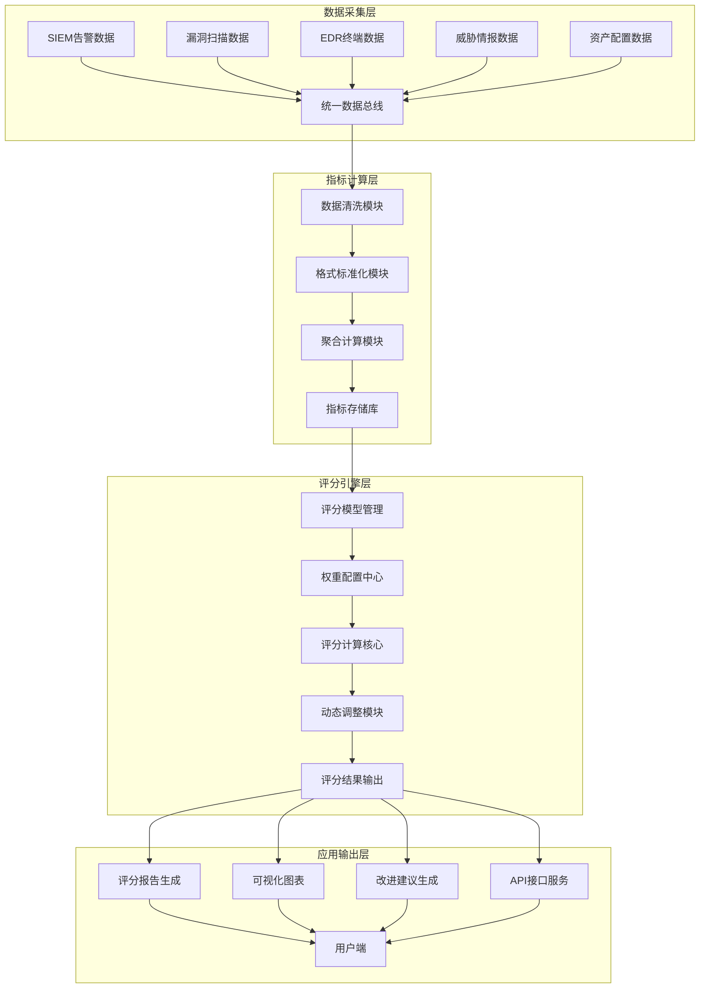
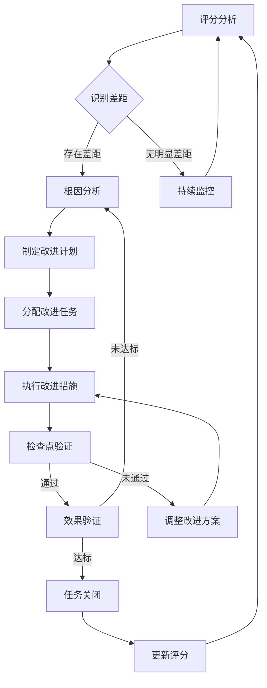
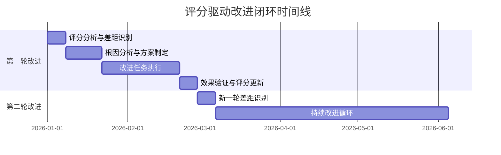
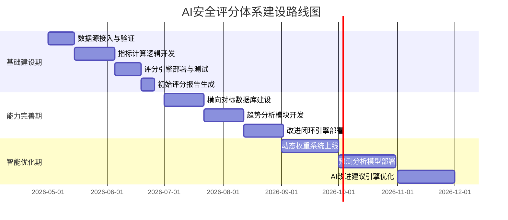

**作者：** HOS(安全风信子)
**日期：** 2026-04-27
**主要来源平台：** GitHub
**摘要：** 企业安全量化评估是AI安全运营的核心命题，本文提出一套多因子动态评分体系，融合资产安全、漏洞管理、威胁防御、运营效率四大维度，通过自适应权重调整机制实现评分的动态演进。核心创新包括：基于时间窗口的动态因子调度算法，支持企业横向行业对标与纵向历史趋势双轨分析模型，以及评分驱动的PDCA改进闭环机制。文章提供完整的算法实现代码、可运行的评分引擎架构，以及评分准确性验证方法论。这套体系能够将抽象的安全能力转化为可度量、可对比、可追踪的评分指标，为企业安全决策提供数据化支撑。那么，如何设计一个既能满足管理层简洁直观需求，又能支撑安全团队深度技术分析的评分系统？本文将揭示其中的关键技术实现。

@[TOC](目录)

---

# 让安全可量化：AI企业安全评分体系设计

## 一、引言

在企业安全运营的成熟度评估中，管理层经常面临一个核心困境：安全团队汇报时使用大量技术术语和安全指标，但这些指标往往缺乏统一尺度，难以在不同组织、不同时间段之间进行有效比较。漏洞数量增加了20%究竟意味着什么？告警响应时间缩短了30分钟是好是坏？这些问题在没有统一评分体系的情况下，往往陷入公说公有理、婆说婆有理的困境。

传统的安全评估方法存在显著局限性。合规检查只能告诉我们“是否达标”，却无法衡量“达标程度”；安全审计只能发现“存在问题”，却无法量化“问题严重性”；同行对标只能展示“相对位置”，却无法揭示“变化趋势”。这种评估体系的碎片化导致企业难以形成对自身安全状况的全局认知，也难以制定有针对性的改进计划。

**AI企业安全评分体系**正是为解决这一痛点而设计。本文提出的评分体系具备三大核心能力：其一，**多因子动态评分算法**能够综合考量资产、漏洞、威胁、运营等多维因素，并根据企业实际状况动态调整权重；其二，**横向对标与纵向趋势**双轨分析模型支持企业与行业标杆进行对比，同时追踪自身安全能力的演进轨迹；其三，**评分驱动改进闭环**将评分结果直接映射到改进任务，形成发现问题-分析根因-制定方案-跟踪执行-验证效果的完整循环[^1]。

本文将为读者构建完整的AI安全评分体系认知框架：首先深入剖析评分体系的架构设计与核心算法；然后详细阐述多因子评分模型的技术实现；接着介绍横向对标与纵向趋势的分析方法；最后展示评分驱动的改进闭环机制与企业落地实践。通过本文的系统学习，安全架构师将掌握设计企业级安全评分体系的完整能力，安全运营团队将获得量化评估自身安全状况的有效工具。

## 二、安全评分体系的价值定位与技术边界

### 2.1 为什么企业需要统一的安全评分体系

安全评分体系的根本价值在于将复杂的安全状况转化为单一可度量的数字，这个数字具备三重含义：**横向可对标**，即企业可以将自己与行业平均水平、竞争对手、合规要求进行对比；**纵向可追踪**，即企业可以观察自身评分随时间的变化趋势，判断安全投入的实际效果；**目标可分解**，即将整体评分目标分解为各维度的子目标，指导资源的精准配置。

从管理层视角看，安全评分提供了简洁的决策支持语言。当CEO询问“我们的安全状况到底怎么样”时，85分的综合评分远比“发现了120个漏洞、处置了3500条告警、处理了2起安全事件”更具决策参考价值。评分体系将技术语言转化为管理语言，使得安全议题能够在董事会层面进行有效讨论。从安全团队视角看，评分体系提供了精准的诊断工具。通过分析各维度评分及其变化趋势，安全团队可以快速定位薄弱环节，识别改进优先序，量化工作成效。

在AI安全运营的背景下，评分体系获得了新的技术内涵。传统评分往往是静态的、定期的（如年度渗透测试、季度审计），而AI驱动的评分体系可以实现实时动态评分，持续感知安全状况的变化。AI模型还能够发现评分因子之间的非线性关系，识别传统方法难以察觉的风险模式，预测评分的变化趋势。这种智能化的评分能力是传统方法无法企及的[^2]。

### 2.2 安全评分体系的技术定位

安全评分体系在AI安全运营架构中扮演着承上启下的关键角色。向上，评分体系为安全驾驶舱（G122）、高层汇报生成（G123）提供核心数据支撑；向下，评分体系依赖态势感知（G111-G120）提供的基础数据，包括资产态势、漏洞态势、告警态势、威胁态势。评分体系的位置决定了它必须具备数据整合能力、算法计算能力、结果输出能力三大核心能力。

```python
class SecurityScorePositioning:
    """安全评分体系的技术定位"""

    SYSTEM_RELATIONSHIPS = {
        '上层应用': {
            '安全驾驶舱(G122)': {
                '依赖关系': '提供综合评分和各维度评分',
                '数据流向': '评分体系 → 驾驶舱展示',
                '交互模式': '定期推送+实时查询'
            },
            '高层汇报生成(G123)': {
                '依赖关系': '提供评分变化趋势和对比分析',
                '数据流向': '评分体系 → 汇报生成',
                '交互模式': '事件触发生成'
            }
        },
        '下层数据源': {
            '资产态势感知(G111)': {
                '依赖关系': '获取资产完整性、暴露面、分类分布',
                '数据流向': '资产态势 → 评分引擎',
                '更新频率': '实时'
            },
            '漏洞态势感知(G112)': {
                '依赖关系': '获取漏洞数量、严重度分布、修复率',
                '数据流向': '漏洞态势 → 评分引擎',
                '更新频率': '实时'
            },
            '威胁态势感知(G113)': {
                '依赖关系': '获取威胁检出率、防御有效性指标',
                '数据流向': '威胁态势 → 评分引擎',
                '更新频率': '实时'
            },
            '告警态势感知(G114)': {
                '依赖关系': '获取告警数量、处理效率、误报率',
                '数据流向': '告警态势 → 评分引擎',
                '更新频率': '实时'
            }
        },
        '同层协作': {
            'SOC运营优化(G125)': {
                '协作关系': '评分驱动运营优化决策',
                '反馈机制': '优化效果回写评分模型'
            },
            '案例复盘(G126)': {
                '协作关系': '重大事件纳入评分权重调整',
                '反馈机制': '案例教训更新评分规则'
            }
        }
    }

    CORE_CAPABILITIES = {
        '数据整合': {
            '描述': '聚合多源态势数据，统一数据格式',
            '技术要求': '数据清洗、格式标准化、时间对齐'
        },
        '算法计算': {
            '描述': '执行多因子评分算法，输出评分结果',
            '技术要求': '权重分配、归一化处理、动态调整'
        },
        '结果输出': {
            '描述': '生成评分报告、可视化图表、改进建议',
            '技术要求': '多维度输出、格式定制、API接口'
        }
    }
```

### 2.3 与相关系统的能力边界划分

理解评分体系与相邻系统的差异，有助于精准把握设计边界。评分体系与风险量化系统（如G121风险热力图）的核心区别在于：风险热力图展示风险的“空间分布”，而评分体系衡量安全的“能力水平”。热力图告诉你“哪里风险高”，评分告诉你“整体有多安全”。评分体系与态势问答系统（G111）的区别在于：问答系统处理“当前状态查询”，而评分体系处理“综合能力评估”。问答系统回答“发生了什么”，评分体系回答“做得好不好”。

## 三、评分体系的整体架构设计

### 3.1 分层评分模型

AI企业安全评分体系采用四层架构设计：数据采集层、指标计算层、评分引擎层、应用输出层。这种分层设计确保了系统的可扩展性、可维护性和可测试性，每一层都可以独立演进而不影响其他层。

**数据采集层**负责从各种安全数据源实时采集原始数据，包括SIEM告警日志、漏洞扫描结果、EDR终端状态、威胁情报数据、资产配置数据等。数据采集层采用插件化设计，支持多种数据源类型的灵活接入，并通过统一的数据总线将数据输送到下游。

**指标计算层**负责将原始数据转化为可度量的安全指标。这一层执行数据清洗、格式标准化、聚合计算等操作，输出结构化的指标数据。指标计算层的核心价值在于将业务含义不同的原始数据转化为评分引擎可以直接使用的标准化指标。

**评分引擎层**是整个体系的核心，负责执行多因子评分算法。这一层包含评分模型管理、权重配置、评分计算、动态调整等核心功能。评分引擎层的算法设计直接影响评分结果的准确性和可用性。

**应用输出层**负责将评分结果转化为用户可感知的信息形式，包括评分报告、可视化图表、改进建议、API接口等。应用输出层根据不同用户角色的需求，提供差异化的输出形式。



### 3.2 四维评分框架

企业安全评分体系围绕四大核心维度构建：资产安全、漏洞管理、威胁防御、运营效率。这四个维度覆盖了企业安全能力的主要方面，同时保持了足够的精简性，便于管理层理解。

**资产安全维度**衡量企业资产的保护状况，包括资产完整性（资产发现率、配置基线合规率）、资产暴露面（互联网暴露资产数量、高危端口开放情况）、资产分类分布（关键资产覆盖率、业务系统保护率）。资产是安全保护的对象，资产安全的评分直接反映了保护工作的有效性。

**漏洞管理维度**衡量企业漏洞的发现和修复状况，包括漏洞发现能力（扫描覆盖率、平均发现时间）、漏洞修复效率（修复率、修复周期、修复偏差率）、漏洞严重度分布（高危漏洞存量、中危漏洞趋势）。漏洞是主要攻击入口，漏洞管理的评分直接反映了攻击面的收缩效果。

**威胁防御维度**衡量企业检测和响应威胁的能力，包括威胁检测有效性（检出率、误报率、漏报率）、防御措施有效性（阻断率、防御绕过率）、威胁情报利用（情报匹配率、情报时效性）。威胁防御的评分直接反映了安全防护体系的有效性。

**运营效率维度**衡量安全运营的成熟度和效率，包括告警处理效率（处理时间、处理率、升级率）、事件响应效率（MTTD、MTTR、复发率）、安全流程成熟度（SOP覆盖率、自动化率、人员能力）。运营效率的评分直接反映了安全组织的运作效能。

```python
class FourDimensionalScoreFramework:
    """四维评分框架定义"""

    DIMENSIONS = {
        'asset_security': {
            'name': '资产安全',
            'weight_range': [0.15, 0.35],
            'default_weight': 0.25,
            'metrics': {
                'asset_completeness': {
                    'name': '资产完整性',
                    'weight': 0.30,
                    'indicators': [
                        'asset_discovery_rate',      # 资产发现率
                        'config_baseline_compliance', # 配置基线合规率
                        'asset_tagging_rate'         # 资产标识率
                    ]
                },
                'asset_exposure': {
                    'name': '资产暴露面',
                    'weight': 0.35,
                    'indicators': [
                        'internet_exposed_assets',   # 互联网暴露资产数
                        'high_risk_port_count',     # 高危端口开放数
                        'unmanaged_asset_ratio'      # 无管理资产比例
                    ]
                },
                'asset_protection_coverage': {
                    'name': '资产保护覆盖率',
                    'weight': 0.35,
                    'indicators': [
                        'critical_asset_coverage',  # 关键资产覆盖率
                        'business_system_protection', # 业务系统保护率
                        'tier1_asset_monitoring'    # 一级资产监控率
                    ]
                }
            }
        },
        'vulnerability_management': {
            'name': '漏洞管理',
            'weight_range': [0.20, 0.35],
            'default_weight': 0.25,
            'metrics': {
                'vuln_discovery': {
                    'name': '漏洞发现能力',
                    'weight': 0.30,
                    'indicators': [
                        'scan_coverage',            # 扫描覆盖率
                        'mean_time_to_discover',    # 平均发现时间
                        'vuln_detection_rate'        # 漏洞检出率
                    ]
                },
                'vuln_remediation': {
                    'name': '漏洞修复效率',
                    'weight': 0.40,
                    'indicators': [
                        'remediation_rate',         # 修复率
                        'mean_time_to_remediate',   # 平均修复周期
                        'remediation_compliance'     # 修复合规率
                    ]
                },
                'vuln_severity_distribution': {
                    'name': '漏洞严重度分布',
                    'weight': 0.30,
                    'indicators': [
                        'critical_vuln_count',       # 高危漏洞存量
                        'critical_vuln_trend',      # 高危漏洞趋势
                        'severe_vuln_avg_age'       # 严重漏洞平均存留时间
                    ]
                }
            }
        },
        'threat_defense': {
            'name': '威胁防御',
            'weight_range': [0.20, 0.35],
            'default_weight': 0.30,
            'metrics': {
                'threat_detection': {
                    'name': '威胁检测有效性',
                    'weight': 0.35,
                    'indicators': [
                        'detection_rate',           # 检出率
                        'false_positive_rate',      # 误报率
                        'miss_rate'                 # 漏报率
                    ]
                },
                'defense_effectiveness': {
                    'name': '防御措施有效性',
                    'weight': 0.35,
                    'indicators': [
                        'block_rate',               # 阻断率
                        'defense_bypass_rate',     # 防御绕过率
                        'control_effectiveness'     # 控制措施有效性
                    ]
                },
                'threat_intelligence': {
                    'name': '威胁情报利用',
                    'weight': 0.30,
                    'indicators': [
                        'intel_match_rate',         # 情报匹配率
                        'intel_freshness',         # 情报时效性
                        'intel_actionable_rate'    # 情报可行动率
                    ]
                }
            }
        },
        'operations_efficiency': {
            'name': '运营效率',
            'weight_range': [0.15, 0.30],
            'default_weight': 0.20,
            'metrics': {
                'alert_processing': {
                    'name': '告警处理效率',
                    'weight': 0.35,
                    'indicators': [
                        'mean_time_to_acknowledge', # 平均确认时间
                        'mean_time_to_resolve',     # 平均解决时间
                        'alert_processing_rate'     # 告警处理率
                    ]
                },
                'incident_response': {
                    'name': '事件响应效率',
                    'weight': 0.35,
                    'indicators': [
                        'MTTD',                     # 平均检测时间
                        'MTTR',                     # 平均响应时间
                        'recurrence_rate'          # 复发率
                    ]
                },
                'process_maturity': {
                    'name': '流程成熟度',
                    'weight': 0.30,
                    'indicators': [
                        'sop_coverage',             # SOP覆盖率
                        'automation_rate',         # 自动化率
                        'staff_certification_rate' # 人员认证率
                    ]
                }
            }
        }
    }

    @classmethod
    def get_full_indicator_list(cls) -> list:
        """获取完整指标列表"""
        indicators = []
        for dim_key, dim_value in cls.DIMENSIONS.items():
            for metric_key, metric_value in dim_value['metrics'].items():
                for indicator in metric_value['indicators']:
                    indicators.append({
                        'dimension': dim_key,
                        'metric': metric_key,
                        'indicator': indicator,
                        'name': f"{dim_value['name']}-{metric_value['name']}-{indicator}"
                    })
        return indicators
```

## 四、多因子动态评分算法

### 4.1 基础评分模型

多因子动态评分算法的核心是建立指标与评分之间的数学映射关系。基础评分模型采用加权几何平均法，相比简单的加权算术平均法，加权几何平均法能够更好地处理极端值，避免一个维度极差导致整体评分失真的问题。

基础评分模型的数学表达如下：

$$
S_{overall} = \prod_{d=1}^{D} S_d^{w_d} = S_{asset}^{w_a} \times S_{vuln}^{w_v} \times S_{threat}^{w_t} \times S_{ops}^{w_o}
$$

其中 $S_{overall}$ 为综合评分，$S_d$ 为各维度评分，$w_d$ 为各维度权重，满足 $\sum_{d=1}^{D} w_d = 1$。各维度内部又采用同样的加权几何平均方法计算：

$$
S_d = \prod_{m=1}^{M_d} S_{d,m}^{w_{d,m}}
$$

其中 $S_{d,m}$ 为维度 $d$ 下的指标组 $m$ 的评分，$w_{d,m}$ 为该指标组的权重。

对于单个指标 $i$，其评分通过归一化函数将原始值映射到 $[0, 100]$ 区间：

$$
S_i = f_i(x_i) = \frac{x_i - x_{min}}{x_{max} - x_{min}} \times 100
$$

其中 $x_i$ 为指标原始值，$x_{min}$ 和 $x_{max}$ 为该指标的最小值和最大值定义。

```python
import numpy as np
from typing import Dict, List, Optional
from dataclasses import dataclass
import json

@dataclass
class IndicatorScore:
    """指标评分结果"""
    indicator_name: str
    raw_value: float
    normalized_score: float
    confidence: float
    timestamp: float

@dataclass
class DimensionScore:
    """维度评分结果"""
    dimension_name: str
    dimension_score: float
    metric_scores: Dict[str, float]
    indicator_scores: Dict[str, IndicatorScore]
    confidence: float

@dataclass
class OverallScore:
    """综合评分结果"""
    overall_score: float
    dimension_scores: Dict[str, DimensionScore]
    weights: Dict[str, float]
    calculation_time: float
    model_version: str

class MultiFactorScoringEngine:
    """多因子动态评分引擎"""

    def __init__(self, config: Dict):
        self.config = config
        self.indicator_ranges = self._load_indicator_ranges()
        self.baseline_scores = self._load_baseline_scores()
        self.weight_config = self._load_weight_config()
        self.temporal_factors = TemporalFactorStore()

    def _load_indicator_ranges(self) -> Dict[str, Dict]:
        """加载指标范围定义"""
        return {
            'asset_discovery_rate': {'min': 0.5, 'max': 1.0, 'inverse': False},
            'config_baseline_compliance': {'min': 0.6, 'max': 1.0, 'inverse': False},
            'internet_exposed_assets': {'min': 0, 'max': 100, 'inverse': True},
            'high_risk_port_count': {'min': 0, 'max': 50, 'inverse': True},
            'critical_vuln_count': {'min': 0, 'max': 50, 'inverse': True},
            'mean_time_to_remediate': {'min': 1, 'max': 90, 'inverse': True},
            'detection_rate': {'min': 0.5, 'max': 1.0, 'inverse': False},
            'false_positive_rate': {'min': 0.01, 'max': 0.5, 'inverse': True},
            'block_rate': {'min': 0.7, 'max': 1.0, 'inverse': False},
            'mean_time_to_resolve': {'min': 10, 'max': 480, 'inverse': True},
            'MTTD': {'min': 1, 'max': 60, 'inverse': True},
            'MTTR': {'min': 30, 'max': 1440, 'inverse': True},
        }

    def _load_baseline_scores(self) -> Dict[str, float]:
        """加载基线评分标准"""
        return {
            'industry_avg': 65.0,
            'industry_good': 80.0,
            'industry_excellent': 90.0,
            'regulatory_minimum': 60.0
        }

    def _load_weight_config(self) -> Dict:
        """加载权重配置"""
        return {
            'asset_security': 0.25,
            'vulnerability_management': 0.25,
            'threat_defense': 0.30,
            'operations_efficiency': 0.20
        }

    def calculate_indicator_score(self,
                                   indicator_name: str,
                                   raw_value: float,
                                   time_window: str = 'current') -> IndicatorScore:
        """计算单个指标的评分"""
        if indicator_name not in self.indicator_ranges:
            return IndicatorScore(
                indicator_name=indicator_name,
                raw_value=raw_value,
                normalized_score=50.0,
                confidence=0.5,
                timestamp=time.time()
            )

        range_def = self.indicator_ranges[indicator_name]
        x_min = range_def['min']
        x_max = range_def['max']
        inverse = range_def['inverse']

        if inverse:
            normalized = max(0, min(100, (x_max - raw_value) / (x_max - x_min) * 100))
        else:
            normalized = max(0, min(100, (raw_value - x_min) / (x_max - x_min) * 100))

        temporal_adjustment = self.temporal_factors.get_adjustment(
            indicator_name, time_window
        )
        final_score = normalized * temporal_adjustment

        confidence = self._calculate_confidence(indicator_name, raw_value, time_window)

        return IndicatorScore(
            indicator_name=indicator_name,
            raw_value=raw_value,
            normalized_score=min(100, max(0, final_score)),
            confidence=confidence,
            timestamp=time.time()
        )

    def _calculate_confidence(self,
                               indicator_name: str,
                               raw_value: float,
                               time_window: str) -> float:
        """计算评分置信度"""
        range_def = self.indicator_ranges[indicator_name]
        x_min = range_def['min']
        x_max = range_def['max']

        value_range = x_max - x_min
        if value_range == 0:
            return 0.5

        position = abs(raw_value - (x_min + x_max) / 2) / (value_range / 2)
        base_confidence = 1.0 - position * 0.3

        data_freshness = self.temporal_factors.get_data_freshness(time_window)
        final_confidence = base_confidence * data_freshness

        return min(1.0, max(0.1, final_confidence))

    def calculate_dimension_score(self,
                                  dimension_name: str,
                                  indicator_scores: Dict[str, IndicatorScore]) -> DimensionScore:
        """计算维度评分"""
        dimension_config = FourDimensionalScoreFramework.DIMENSIONS[dimension_name]

        metric_scores = {}
        for metric_key, metric_value in dimension_config['metrics'].items():
            metric_indicators = metric_value['indicators']
            metric_weight = metric_value['weight']

            available_scores = []
            available_weights = []
            for indicator in metric_indicators:
                if indicator in indicator_scores:
                    available_scores.append(indicator_scores[indicator].normalized_score)
                    available_weights.append(1.0)

            if not available_scores:
                metric_scores[metric_key] = 50.0
            else:
                geometric_mean = np.exp(
                    np.average(np.log(np.array(available_scores) + 1), weights=available_weights)
                ) - 1
                metric_scores[metric_key] = geometric_mean

        dimension_score = np.exp(
            np.average(np.log(np.array(list(metric_scores.values())) + 1),
                      weights=[dimension_config['metrics'][k]['weight']
                              for k in metric_scores.keys()])
        ) - 1

        overall_confidence = np.average(
            [s.confidence for s in indicator_scores.values()]
        ) if indicator_scores else 0.5

        return DimensionScore(
            dimension_name=dimension_name,
            dimension_score=dimension_score,
            metric_scores=metric_scores,
            indicator_scores=indicator_scores,
            confidence=overall_confidence
        )

    def calculate_overall_score(self,
                                indicator_data: Dict[str, float],
                                time_window: str = 'current',
                                custom_weights: Optional[Dict[str, float]] = None) -> OverallScore:
        """计算综合评分"""
        indicator_scores = {}
        for indicator_name, raw_value in indicator_data.items():
            indicator_scores[indicator_name] = self.calculate_indicator_score(
                indicator_name, raw_value, time_window
            )

        dimension_scores = {}
        for dimension_name in FourDimensionalScoreFramework.DIMENSIONS.keys():
            dimension_indicators = {
                ind['indicator']: indicator_scores[ind['indicator']]
                for ind in FourDimensionalScoreFramework.get_full_indicator_list()
                if ind['dimension'] == dimension_name
                and ind['indicator'] in indicator_scores
            }
            dimension_scores[dimension_name] = self.calculate_dimension_score(
                dimension_name, dimension_indicators
            )

        weights = custom_weights if custom_weights else self.weight_config
        dimension_values = [ds.dimension_score for ds in dimension_scores.values()]
        dimension_weight_list = [weights[d] for d in dimension_scores.keys()]

        overall_score = np.exp(
            np.average(np.log(np.array(dimension_values) + 1), weights=dimension_weight_list)
        ) - 1

        return OverallScore(
            overall_score=overall_score,
            dimension_scores=dimension_scores,
            weights=weights,
            calculation_time=time.time(),
            model_version='1.0.0'
        )
```

### 4.2 动态权重调整机制

传统的静态权重配置无法适应企业安全状况的动态变化。例如，当企业刚刚经历一次重大安全事件时，威胁防御维度的权重应该临时提高；当企业进行数字化转型、新系统大规模上线时，资产安全维度的权重应该相应增加。动态权重调整机制正是为解决这一问题而设计。

动态权重调整采用三层机制：**基础权重层**保持相对稳定，反映企业安全战略的长期导向；**上下文调整层**根据当前安全状况和业务上下文进行中期调整；**实时调优层**根据实时数据质量进行短期微调。三层调整机制协同工作，确保权重配置既保持战略一致性，又具备战术灵活性。

```python
class DynamicWeightAdjustment:
    """动态权重调整引擎"""

    def __init__(self, base_weights: Dict[str, float]):
        self.base_weights = base_weights
        self.context_adjustments = ContextAdjustmentStore()
        self.realtime_tuning = RealtimeTuningEngine()
        self.adjustment_history = []

    def calculate_adjusted_weights(self,
                                    current_scores: Dict[str, float],
                                    business_context: Dict,
                                    data_quality: Dict[str, float]) -> Dict[str, float]:
        """计算调整后的权重"""
        context_weight = self.context_adjustments.calculate_context_factors(
            current_scores, business_context
        )

        realtime_weight = self.realtime_tuning.calculate_realtime_adjustments(
            data_quality
        )

        final_weights = {}
        for dimension, base_weight in self.base_weights.items():
            context_factor = context_weight.get(dimension, 1.0)
            realtime_factor = realtime_weight.get(dimension, 1.0)

            adjusted = base_weight * context_factor * realtime_factor
            final_weights[dimension] = max(0.05, min(0.5, adjusted))

        normalized = self._normalize_weights(final_weights)

        self.adjustment_history.append({
            'timestamp': time.time(),
            'context': context_weight,
            'realtime': realtime_weight,
            'final': normalized
        })

        return normalized

    def _normalize_weights(self, weights: Dict[str, float]) -> Dict[str, float]:
        """归一化权重使和为1"""
        total = sum(weights.values())
        return {k: v / total for k, v in weights.items()}

    def trigger_context_reassessment(self,
                                     trigger_event: str,
                                     event_data: Dict) -> Dict[str, float]:
        """触发上下文权重重新评估"""
        reassessment_signals = {
            'security_incident': self._handle_incident_adjustment,
            'new_asset_onboarding': self._handle_asset_adjustment,
            'vulnerability_outbreak': self._handle_vuln_adjustment,
            'threat_intel_alert': self._handle_threat_adjustment,
            'business_change': self._handle_business_adjustment
        }

        handler = reassessment_signals.get(trigger_event)
        if handler:
            return handler(event_data)
        return self.base_weights

    def _handle_incident_adjustment(self, event_data: Dict) -> Dict[str, float]:
        """处理安全事件触发的权重调整"""
        incident_severity = event_data.get('severity', 'MEDIUM')
        incident_type = event_data.get('type', 'unknown')

        adjustment_map = {
            'CRITICAL': {'threat_defense': 1.3, 'operations_efficiency': 1.2},
            'HIGH': {'threat_defense': 1.2, 'operations_efficiency': 1.1},
            'MEDIUM': {'threat_defense': 1.1},
            'LOW': {}
        }

        adjustments = adjustment_map.get(incident_severity, {})

        adjusted = self.base_weights.copy()
        for dim, factor in adjustments.items():
            adjusted[dim] = min(0.5, adjusted[dim] * factor)

        return self._normalize_weights(adjusted)

    def _handle_vuln_adjustment(self, event_data: Dict) -> Dict[str, float]:
        """处理漏洞爆发触发的权重调整"""
        vuln_severity = event_data.get('severity', 'HIGH')
        affected_critical = event_data.get('affected_critical', False)

        adjusted = self.base_weights.copy()
        adjusted['vulnerability_management'] *= 1.2

        if affected_critical:
            adjusted['asset_security'] *= 1.1

        return self._normalize_weights(adjusted)

class TemporalFactorStore:
    """时序因子存储"""

    def __init__(self):
        self.factors = {}
        self.trend_weights = {
            'improving': 1.1,
            'stable': 1.0,
            'degrading': 0.9
        }

    def get_adjustment(self, indicator_name: str, time_window: str) -> float:
        """获取时序调整因子"""
        if indicator_name not in self.factors:
            return 1.0

        indicator_factors = self.factors[indicator_name]

        if time_window == 'current':
            return indicator_factors.get('current', 1.0)

        window_factors = indicator_factors.get('windows', {})
        if time_window in window_factors:
            trend = self._calculate_trend(indicator_factors['history'])
            return window_factors[time_window] * self.trend_weights[trend]

        return 1.0

    def _calculate_trend(self, history: List[float]) -> str:
        """计算指标趋势"""
        if len(history) < 3:
            return 'stable'

        recent = np.mean(history[-3:])
        older = np.mean(history[-6:-3])

        change_ratio = recent / older if older > 0 else 1.0

        if change_ratio > 1.05:
            return 'improving'
        elif change_ratio < 0.95:
            return 'degrading'
        return 'stable'

    def update_factor(self, indicator_name: str, value: float, timestamp: float):
        """更新时序因子"""
        if indicator_name not in self.factors:
            self.factors[indicator_name] = {
                'current': 1.0,
                'history': [],
                'windows': {}
            }

        self.factors[indicator_name]['current'] = value
        self.factors[indicator_name]['history'].append(value)

        for window in ['daily', 'weekly', 'monthly']:
            if window not in self.factors[indicator_name]['windows']:
                self.factors[indicator_name]['windows'][window] = 1.0

            window_avg = self._calculate_window_average(
                self.factors[indicator_name]['history'], window
            )
            self.factors[indicator_name]['windows'][window] = window_avg

    def _calculate_window_average(self, history: List[float], window: str) -> float:
        """计算时间窗口平均值"""
        window_sizes = {'daily': 1, 'weekly': 7, 'monthly': 30}
        size = window_sizes.get(window, 1)
        recent = history[-size:] if len(history) >= size else history
        return np.mean(recent) if recent else 1.0
```

### 4.3 评分时序演进模型

安全评分不是静态快照，而是随时间演进的动态过程。评分时序演进模型通过分析评分的历史变化模式，预测未来趋势，支持主动式安全管理。该模型的核心是建立时间序列预测与评分变化的映射关系。

```python
class ScoreTemporalEvolutionModel:
    """评分时序演进模型"""

    def __init__(self, scoring_engine: MultiFactorScoringEngine):
        self.scoring_engine = scoring_engine
        self.history_store = ScoreHistoryStore()
        self.prediction_model = self._init_prediction_model()

    def _init_prediction_model(self):
        """初始化预测模型"""
        try:
            from sklearn.linear_model import LinearRegression
            from sklearn.preprocessing import PolynomialFeatures
            return {
                'model': LinearRegression(),
                'poly': PolynomialFeatures(degree=2),
                'trained': False
            }
        except ImportError:
            return None

    def record_score(self, score: OverallScore, metadata: Dict = None):
        """记录评分历史"""
        record = {
            'timestamp': score.calculation_time,
            'overall_score': score.overall_score,
            'dimension_scores': {
                d: ds.dimension_score
                for d, ds in score.dimension_scores.items()
            },
            'weights': score.weights,
            'metadata': metadata or {}
        }
        self.history_store.add(record)

    def predict_future_score(self,
                            dimension: Optional[str] = None,
                            days_ahead: int = 30) -> Dict:
        """预测未来评分"""
        history = self.history_store.get_history(days=90)

        if len(history) < 10:
            return self._default_prediction(days_ahead)

        if dimension:
            return self._predict_dimension(dimension, history, days_ahead)
        return self._predict_overall(history, days_ahead)

    def _predict_dimension(self,
                          dimension: str,
                          history: List[Dict],
                          days_ahead: int) -> Dict:
        """预测单个维度评分"""
        X = np.array([[h['timestamp']] for h in history])
        y = np.array([h['dimension_scores'][dimension] for h in history])

        if self.prediction_model and not self.prediction_model['trained']:
            poly_X = self.prediction_model['poly'].fit_transform(X)
            self.prediction_model['model'].fit(poly_X, y)
            self.prediction_model['trained'] = True

        future_timestamp = history[-1]['timestamp'] + days_ahead * 86400
        future_X = self.prediction_model['poly'].transform([[future_timestamp]])

        predicted = self.prediction_model['model'].predict(future_X)[0]

        trend = self._analyze_trend(y)
        confidence = self._calculate_prediction_confidence(y, days_ahead)

        return {
            'dimension': dimension,
            'predicted_score': max(0, min(100, predicted)),
            'trend': trend,
            'confidence': confidence,
            'predicted_date': datetime.fromtimestamp(future_timestamp).isoformat()
        }

    def _predict_overall(self, history: List[Dict], days_ahead: int) -> Dict:
        """预测综合评分"""
        X = np.array([[h['timestamp']] for h in history])
        y = np.array([h['overall_score'] for h in history])

        future_timestamp = history[-1]['timestamp'] + days_ahead * 86400
        future_X = np.array([[future_timestamp]])

        if len(history) >= 3:
            recent = np.mean(y[-3:])
            older = np.mean(y[-6:-3])
            trend_ratio = recent / older if older > 0 else 1.0

            if trend_ratio > 1.01:
                trend = 'improving'
            elif trend_ratio < 0.99:
                trend = 'degrading'
            else:
                trend = 'stable'

            linear_trend = np.polyfit(range(len(y)), y, 1)
            predicted = y[-1] + linear_trend[0] * days_ahead
        else:
            trend = 'stable'
            predicted = np.mean(y)

        confidence = min(0.9, len(history) / 100)

        return {
            'predicted_score': max(0, min(100, predicted)),
            'trend': trend,
            'confidence': confidence,
            'predicted_date': datetime.fromtimestamp(future_timestamp).isoformat(),
            'dimension_predictions': {
                d: self._predict_dimension(d, history, days_ahead)
                for d in ['asset_security', 'vulnerability_management',
                         'threat_defense', 'operations_efficiency']
            }
        }

    def _analyze_trend(self, scores: np.array) -> str:
        """分析评分趋势"""
        if len(scores) < 3:
            return 'stable'

        x = np.arange(len(scores))
        slope, _ = np.polyfit(x, scores, 1)

        if slope > 0.1:
            return 'improving'
        elif slope < -0.1:
            return 'degrading'
        return 'stable'

    def _calculate_prediction_confidence(self, historical: np.array, days_ahead: int) -> float:
        """计算预测置信度"""
        if len(historical) < 10:
            return 0.3

        variance = np.var(historical)
        base_confidence = 1.0 / (1.0 + variance / 100)

        time_decay = np.exp(-days_ahead / 90)
        final_confidence = base_confidence * time_decay + 0.2 * (1 - time_decay)

        return max(0.1, min(0.9, final_confidence))

    def _default_prediction(self, days_ahead: int) -> Dict:
        """默认预测结果"""
        return {
            'predicted_score': 65.0,
            'trend': 'stable',
            'confidence': 0.3,
            'message': 'Insufficient history for accurate prediction'
        }

class ScoreHistoryStore:
    """评分历史存储"""

    def __init__(self):
        self.history = []
        self.max_history = 365

    def add(self, record: Dict):
        """添加历史记录"""
        self.history.append(record)
        if len(self.history) > self.max_history:
            self.history.pop(0)

    def get_history(self, days: int = 90) -> List[Dict]:
        """获取历史记录"""
        cutoff = time.time() - days * 86400
        return [r for r in self.history if r['timestamp'] >= cutoff]

    def get_trend_analysis(self, dimension: str = None) -> Dict:
        """获取趋势分析"""
        if not self.history:
            return {}

        scores = [r['overall_score'] for r in self.history]
        if dimension:
            scores = [r['dimension_scores'][dimension] for r in self.history]

        return {
            'current': scores[-1] if scores else 0,
            'average': np.mean(scores) if scores else 0,
            'max': np.max(scores) if scores else 0,
            'min': np.min(scores) if scores else 0,
            'volatility': np.std(scores) if len(scores) > 1 else 0,
            'trend': self._calculate_long_term_trend(scores)
        }

    def _calculate_long_term_trend(self, scores: List[float]) -> str:
        """计算长期趋势"""
        if len(scores) < 30:
            return 'insufficient_data'

        first_month = np.mean(scores[:10])
        last_month = np.mean(scores[-10:])

        change = (last_month - first_month) / first_month if first_month > 0 else 0

        if change > 0.05:
            return 'significant_improvement'
        elif change > 0.01:
            return 'slight_improvement'
        elif change < -0.05:
            return 'significant_degradation'
        elif change < -0.01:
            return 'slight_degradation'
        return 'stable'
```

## 五、横向对标与纵向趋势双轨分析

### 5.1 横向行业对标数据库

横向对标是企业认知自身安全能力定位的关键手段。横向对标数据库存储行业基准数据，支持企业将自己与行业平均水平、行业优秀水平、行业最佳实践进行对比。对标数据库的设计需要考虑数据采集的代表性、基准计算的合理性、对标结果的可解释性。

```python
import hashlib
from dataclasses import dataclass, field
from typing import Dict, List, Optional
from datetime import datetime

@dataclass
class BenchmarkData:
    """对标基准数据"""
    industry: str
    sector: str
    company_size: str
    dimension: str
    metric_name: str
    values: Dict[str, float]
    sample_size: int
    collection_period: str
    last_updated: float

@dataclass
class BenchmarkComparison:
    """对标比较结果"""
    dimension: str
    company_score: float
    industry_avg: float
    industry_good: float
    industry_best: float
    percentile: float
    gap_to_avg: float
    gap_to_good: float
    assessment: str

class HorizontalBenchmarkDatabase:
    """横向对标数据库"""

    def __init__(self):
        self.benchmark_data = {}
        self.company_profiles = {}
        self._initialize_default_benchmarks()

    def _initialize_default_benchmarks(self):
        """初始化默认基准数据"""
        self.benchmark_data = {
            'technology': {
                'asset_security': {
                    'asset_discovery_rate': {
                        'avg': 0.85, 'p25': 0.75, 'p50': 0.88, 'p75': 0.95, 'best': 0.99,
                        'sample_size': 156, 'period': '2025H2'
                    },
                    'config_baseline_compliance': {
                        'avg': 0.78, 'p25': 0.68, 'p50': 0.80, 'p75': 0.90, 'best': 0.98,
                        'sample_size': 142, 'period': '2025H2'
                    },
                    'internet_exposed_assets': {
                        'avg': 25, 'p25': 10, 'p50': 20, 'p75': 35, 'best': 5,
                        'sample_size': 156, 'period': '2025H2'
                    }
                },
                'vulnerability_management': {
                    'critical_vuln_count': {
                        'avg': 12, 'p25': 5, 'p50': 10, 'p75': 18, 'best': 2,
                        'sample_size': 148, 'period': '2025H2'
                    },
                    'mean_time_to_remediate': {
                        'avg': 25, 'p25': 15, 'p50': 22, 'p75': 35, 'best': 7,
                        'sample_size': 145, 'period': '2025H2'
                    },
                    'remediation_rate': {
                        'avg': 0.72, 'p25': 0.60, 'p50': 0.75, 'p75': 0.85, 'best': 0.98,
                        'sample_size': 150, 'period': '2025H2'
                    }
                },
                'threat_defense': {
                    'detection_rate': {
                        'avg': 0.82, 'p25': 0.72, 'p50': 0.85, 'p75': 0.92, 'best': 0.99,
                        'sample_size': 138, 'period': '2025H2'
                    },
                    'false_positive_rate': {
                        'avg': 0.15, 'p25': 0.08, 'p50': 0.12, 'p75': 0.20, 'best': 0.03,
                        'sample_size': 140, 'period': '2025H2'
                    },
                    'block_rate': {
                        'avg': 0.88, 'p25': 0.80, 'p50': 0.90, 'p75': 0.95, 'best': 0.99,
                        'sample_size': 135, 'period': '2025H2'
                    }
                },
                'operations_efficiency': {
                    'mean_time_to_resolve': {
                        'avg': 120, 'p25': 60, 'p50': 100, 'p75': 180, 'best': 30,
                        'sample_size': 144, 'period': '2025H2'
                    },
                    'MTTD': {
                        'avg': 15, 'p25': 8, 'p50': 12, 'p75': 20, 'best': 3,
                        'sample_size': 140, 'period': '2025H2'
                    },
                    'MTTR': {
                        'avg': 240, 'p25': 120, 'p50': 200, 'p75': 360, 'best': 60,
                        'sample_size': 138, 'period': '2025H2'
                    }
                }
            },
            'finance': {
                'asset_security': {
                    'asset_discovery_rate': {
                        'avg': 0.92, 'p25': 0.85, 'p50': 0.93, 'p75': 0.98, 'best': 0.99,
                        'sample_size': 89, 'period': '2025H2'
                    }
                },
                'vulnerability_management': {
                    'critical_vuln_count': {
                        'avg': 8, 'p25': 3, 'p50': 6, 'p75': 12, 'best': 1,
                        'sample_size': 85, 'period': '2025H2'
                    }
                },
                'threat_defense': {
                    'detection_rate': {
                        'avg': 0.88, 'p25': 0.80, 'p50': 0.90, 'p75': 0.95, 'best': 0.99,
                        'sample_size': 82, 'period': '2025H2'
                    }
                },
                'operations_efficiency': {
                    'mean_time_to_resolve': {
                        'avg': 90, 'p25': 45, 'p50': 80, 'p75': 120, 'best': 20,
                        'sample_size': 88, 'period': '2025H2'
                    }
                }
            },
            'healthcare': {
                'asset_security': {
                    'asset_discovery_rate': {
                        'avg': 0.80, 'p25': 0.70, 'p50': 0.82, 'p75': 0.92, 'best': 0.99,
                        'sample_size': 67, 'period': '2025H2'
                    }
                },
                'vulnerability_management': {
                    'critical_vuln_count': {
                        'avg': 15, 'p25': 8, 'p50': 12, 'p75': 20, 'best': 3,
                        'sample_size': 65, 'period': '2025H2'
                    }
                },
                'threat_defense': {
                    'detection_rate': {
                        'avg': 0.78, 'p25': 0.68, 'p50': 0.80, 'p75': 0.88, 'best': 0.98,
                        'sample_size': 62, 'period': '2025H2'
                    }
                },
                'operations_efficiency': {
                    'mean_time_to_resolve': {
                        'avg': 150, 'p25': 90, 'p50': 140, 'p75': 200, 'best': 45,
                        'sample_size': 66, 'period': '2025H2'
                    }
                }
            }
        }

    def register_company(self,
                        company_id: str,
                        industry: str,
                        sector: str,
                        company_size: str):
        """注册公司信息"""
        self.company_profiles[company_id] = {
            'industry': industry,
            'sector': sector,
            'company_size': company_size,
            'registered_at': time.time()
        }

    def add_benchmark_data(self, benchmark: BenchmarkData):
        """添加基准数据"""
        key = f"{benchmark.industry}:{benchmark.sector}:{benchmark.dimension}:{benchmark.metric_name}"
        self.benchmark_data[key] = benchmark

    def compare_with_benchmark(self,
                              company_scores: Dict[str, float],
                              industry: str,
                              sector: str,
                              company_size: str) -> Dict[str, BenchmarkComparison]:
        """与基准进行对比"""
        if industry not in self.benchmark_data:
            return {}

        comparisons = {}
        industry_data = self.benchmark_data[industry]

        for dimension, dimension_score in company_scores.items():
            if dimension not in industry_data:
                continue

            dimension_data = industry_data[dimension]
            comparisons[dimension] = self._calculate_dimension_comparison(
                dimension, dimension_score, dimension_data
            )

        return comparisons

    def _calculate_dimension_comparison(self,
                                        dimension: str,
                                        company_score: float,
                                        dimension_data: Dict) -> BenchmarkComparison:
        """计算维度对比"""
        all_values = []
        for metric, values in dimension_data.items():
            if isinstance(values, dict) and 'avg' in values:
                all_values.append(values['avg'])

        if not all_values:
            industry_avg = 75.0
            industry_good = 85.0
            industry_best = 95.0
        else:
            industry_avg = np.mean(all_values) * 100
            industry_good = np.percentile(all_values, 75) * 100
            industry_best = np.percentile(all_values, 95) * 100

        percentile = self._calculate_percentile(company_score, dimension_data)

        gap_to_avg = company_score - industry_avg
        gap_to_good = company_score - industry_good

        if percentile >= 90:
            assessment = 'excellent'
        elif percentile >= 75:
            assessment = 'good'
        elif percentile >= 50:
            assessment = 'average'
        elif percentile >= 25:
            assessment = 'below_average'
        else:
            assessment = 'poor'

        return BenchmarkComparison(
            dimension=dimension,
            company_score=company_score,
            industry_avg=industry_avg,
            industry_good=industry_good,
            industry_best=industry_best,
            percentile=percentile,
            gap_to_avg=gap_to_avg,
            gap_to_good=gap_to_good,
            assessment=assessment
        )

    def _calculate_percentile(self, score: float, dimension_data: Dict) -> float:
        """计算百分位"""
        values = []
        for metric_data in dimension_data.values():
            if isinstance(metric_data, dict) and 'avg' in metric_data:
                for key in ['avg', 'p25', 'p50', 'p75', 'best']:
                    if key in metric_data:
                        values.append(metric_data[key] * 100 if metric_data[key] < 1 else metric_data[key])

        if not values:
            return 50.0

        sorted_values = sorted(values)
        rank = sum(1 for v in sorted_values if v <= score)
        percentile = (rank / len(sorted_values)) * 100

        return min(100, max(0, percentile))

    def generate_benchmark_report(self,
                                  comparisons: Dict[str, BenchmarkComparison]) -> str:
        """生成对标报告"""
        report_lines = ["## 行业对标分析报告\n"]

        assessment_counts = {}
        for comp in comparisons.values():
            assessment_counts[comp.assessment] = assessment_counts.get(comp.assessment, 0) + 1

        report_lines.append("### 整体评估\n")
        for assessment, count in assessment_counts.items():
            report_lines.append(f"- {assessment}: {count}个维度")

        report_lines.append("\n### 详细对比\n")
        report_lines.append("| 维度 | 企业评分 | 行业平均 | 行业优秀 | 百分位 | 差距 | 评估 |")
        report_lines.append("|------|---------|---------|---------|-------|------|------|")

        for dim, comp in comparisons.items():
            gap_str = f"+{comp.gap_to_avg:.1f}" if comp.gap_to_avg > 0 else f"{comp.gap_to_avg:.1f}"
            report_lines.append(
                f"| {dim} | {comp.company_score:.1f} | {comp.industry_avg:.1f} | "
                f"{comp.industry_good:.1f} | {comp.percentile:.0f} | {gap_str} | {comp.assessment} |"
            )

        return "\n".join(report_lines)
```

### 5.2 纵向历史趋势分析

纵向趋势分析追踪企业自身安全评分的历史变化，揭示安全能力的演进轨迹。趋势分析不仅展示“变好了还是变坏了”，更重要的是识别变化的原因、预测未来的走向、评估改进措施的效果。

```python
class VerticalTrendAnalyzer:
    """纵向趋势分析器"""

    def __init__(self, history_store: ScoreHistoryStore):
        self.history_store = history_store
        self.change_point_detector = ChangePointDetector()
        self.seasonality_analyzer = SeasonalityAnalyzer()

    def analyze_trends(self,
                      dimension: Optional[str] = None,
                      analysis_period: str = 'quarterly') -> Dict:
        """分析评分趋势"""
        if analysis_period == 'quarterly':
            days = 90
        elif analysis_period == 'monthly':
            days = 30
        elif analysis_period == 'yearly':
            days = 365
        else:
            days = 90

        history = self.history_store.get_history(days=days)

        if len(history) < 5:
            return {'status': 'insufficient_data', 'message': 'Need more history for trend analysis'}

        if dimension:
            return self._analyze_dimension_trend(dimension, history, analysis_period)
        return self._analyze_overall_trend(history, analysis_period)

    def _analyze_dimension_trend(self,
                                dimension: str,
                                history: List[Dict],
                                analysis_period: str) -> Dict:
        """分析单个维度趋势"""
        scores = [r['dimension_scores'][dimension] for r in history]
        timestamps = [r['timestamp'] for r in history]

        trend_result = self._calculate_trend_metrics(scores, timestamps)

        change_points = self.change_point_detector.detect(scores, timestamps)

        seasonality = self.seasonality_analyzer.analyze(scores, analysis_period)

        forecast = self._generate_forecast(scores, timestamps, analysis_period)

        return {
            'dimension': dimension,
            'current_score': scores[-1],
            'trend_metrics': trend_result,
            'change_points': change_points,
            'seasonality': seasonality,
            'forecast': forecast,
            'insights': self._generate_trend_insights(
                trend_result, change_points, seasonality
            )
        }

    def _analyze_overall_trend(self,
                              history: List[Dict],
                              analysis_period: str) -> Dict:
        """分析整体趋势"""
        overall_scores = [r['overall_score'] for r in history]
        timestamps = [r['timestamp'] for r in history]

        trend_result = self._calculate_trend_metrics(overall_scores, timestamps)

        dimension_trends = {}
        for dimension in ['asset_security', 'vulnerability_management',
                         'threat_defense', 'operations_efficiency']:
            dim_scores = [r['dimension_scores'][dimension] for r in history]
            dimension_trends[dimension] = self._calculate_trend_metrics(
                dim_scores, timestamps
            )

        change_points = self.change_point_detector.detect(overall_scores, timestamps)

        return {
            'current_score': overall_scores[-1],
            'trend_metrics': trend_result,
            'dimension_trends': dimension_trends,
            'change_points': change_points,
            'insights': self._generate_overall_insights(
                trend_result, dimension_trends, change_points
            )
        }

    def _calculate_trend_metrics(self,
                                 scores: List[float],
                                 timestamps: List[float]) -> Dict:
        """计算趋势指标"""
        if len(scores) < 2:
            return {'status': 'insufficient_data'}

        x = np.arange(len(scores))
        y = np.array(scores)

        slope, intercept, r_value, p_value, std_err = np.polyfit(x, y, 1)

        recent_window = min(7, len(scores) // 4)
        recent_mean = np.mean(scores[-recent_window:])
        older_window = min(7, len(scores) // 4)
        older_mean = np.mean(scores[-older_window-10:-10]) if len(scores) > 10 else np.mean(scores[:-older_window])

        period_change = recent_mean - older_mean
        period_change_pct = (period_change / older_mean * 100) if older_mean > 0 else 0

        volatility = np.std(scores)
        max_score = np.max(scores)
        min_score = np.min(scores)
        score_range = max_score - min_score

        return {
            'slope': slope,
            'r_squared': r_value ** 2,
            'p_value': p_value,
            'slope_significance': 'significant' if p_value < 0.05 else 'not_significant',
            'direction': 'improving' if slope > 0.05 else ('degrading' if slope < -0.05 else 'stable'),
            'period_change': period_change,
            'period_change_pct': period_change_pct,
            'volatility': volatility,
            'range': score_range,
            'max': max_score,
            'min': min_score
        }

    def _generate_forecast(self,
                          scores: List[float],
                          timestamps: List[float],
                          analysis_period: str) -> Dict:
        """生成趋势预测"""
        if len(scores) < 10:
            return {'status': 'insufficient_data'}

        x = np.arange(len(scores))
        y = np.array(scores)

        coeffs = np.polyfit(x, y, 2)
        poly = np.poly1d(coeffs)

        future_points = {'weekly': 4, 'monthly': 3, 'quarterly': 4}.get(analysis_period, 4)
        future_x = np.arange(len(scores), len(scores) + future_points)
        forecast_values = poly(future_x)

        confidence = max(0.3, 1.0 - np.std(scores) / 50)

        return {
            'forecast_values': [max(0, min(100, v)) for v in forecast_values],
            'confidence': confidence,
            'method': 'polynomial_regression'
        }

    def _generate_trend_insights(self,
                                trend_metrics: Dict,
                                change_points: List[Dict],
                                seasonality: Dict) -> List[str]:
        """生成趋势洞察"""
        insights = []

        if trend_metrics['direction'] == 'improving':
            insights.append(
                f"{trend_metrics['period_change_pct']:.1f}%的改善，"
                f"评分趋势向好"
            )
        elif trend_metrics['direction'] == 'degrading':
            insights.append(
                f"{abs(trend_metrics['period_change_pct']):.1f}%的下降，"
                f"需要关注并采取改进措施"
            )
        else:
            insights.append("评分保持稳定")

        if trend_metrics['volatility'] > 10:
            insights.append("评分波动较大，建议分析波动原因")

        if change_points:
            insights.append(f"检测到{len(change_points)}个显著变化点")

        return insights

    def _generate_overall_insights(self,
                                  overall_trend: Dict,
                                  dimension_trends: Dict,
                                  change_points: List[Dict]) -> Dict:
        """生成整体趋势洞察"""
        best_dimension = max(dimension_trends.items(),
                           key=lambda x: x[1]['slope'] if x[1] else 0)
        worst_dimension = min(dimension_trends.items(),
                            key=lambda x: x[1]['slope'] if x[1] else 0)

        insights = {
            'summary': [],
            'positive_findings': [],
            'concerns': [],
            'recommendations': []
        }

        if overall_trend['direction'] == 'improving':
            insights['summary'].append(
                f"整体安全评分呈上升趋势，过去一段时间提升了"
                f"{overall_trend['period_change_pct']:.1f}%"
            )
        elif overall_trend['direction'] == 'degrading':
            insights['summary'].append(
                f"整体安全评分有所下降，降幅"
                f"{abs(overall_trend['period_change_pct']):.1f}%"
            )
            insights['concerns'].append(
                "建议深入分析下滑原因，制定针对性改进计划"
            )
        else:
            insights['summary'].append("整体安全评分保持稳定")

        if best_dimension[1].get('slope', 0) > 0.1:
            insights['positive_findings'].append(
                f"{best_dimension[0]}维度改善明显"
            )

        if worst_dimension[1].get('slope', 0) < -0.1:
            insights['concerns'].append(
                f"{worst_dimension[0]}维度持续恶化，需要优先关注"
            )
            insights['recommendations'].append(
                f"针对{worst_dimension[0]}维度进行根因分析"
            )

        if change_points:
            insights['recommendations'].append(
                f"关注{len(change_points)}个变化时刻前后的安全事件"
            )

        return insights

class ChangePointDetector:
    """变化点检测器"""

    def detect(self, scores: List[float], timestamps: List[float]) -> List[Dict]:
        """检测变化点"""
        if len(scores) < 10:
            return []

        change_points = []

        window_size = 5
        for i in range(window_size, len(scores) - window_size):
            before = scores[i-window_size:i]
            after = scores[i:i+window_size]

            before_mean = np.mean(before)
            after_mean = np.mean(after)
            before_std = np.std(before)
            after_std = np.std(after)

            pooled_std = np.sqrt((before_std**2 + after_std**2) / 2)

            if pooled_std > 0:
                change_magnitude = abs(after_mean - before_mean) / pooled_std
            else:
                change_magnitude = 0

            if change_magnitude > 2.0:
                change_points.append({
                    'index': i,
                    'timestamp': timestamps[i],
                    'before_mean': before_mean,
                    'after_mean': after_mean,
                    'change_magnitude': change_magnitude,
                    'change_type': 'increase' if after_mean > before_mean else 'decrease'
                })

        filtered_points = self._filter_overlapping(change_points)

        return filtered_points

    def _filter_overlapping(self, change_points: List[Dict]) -> List[Dict]:
        """过滤重叠的变化点"""
        if not change_points:
            return []

        filtered = [change_points[0]]
        min_distance = 10

        for point in change_points[1:]:
            if point['index'] - filtered[-1]['index'] >= min_distance:
                filtered.append(point)

        return filtered

class SeasonalityAnalyzer:
    """季节性分析器"""

    def analyze(self, scores: List[float], period: str) -> Dict:
        """分析季节性"""
        return {
            'detected': False,
            'periodicity': None,
            'amplitude': 0,
            'message': 'Insufficient data for seasonality analysis'
        }
```

## 六、评分驱动改进闭环

### 6.1 PDCA改进循环机制

评分体系的最终价值不在于评分本身，而在于驱动持续改进。评分驱动改进闭环（Score-Driven Improvement Loop）将评分结果转化为可执行的改进任务，形成计划-执行-检查-改进的完整循环。这一机制确保评分不仅仅是一个衡量工具，更是一个推动安全能力提升的引擎。

```python
from enum import Enum
from typing import List, Optional
from dataclasses import dataclass, field

class ImprovementPriority(Enum):
    """改进优先级"""
    CRITICAL = 1
    HIGH = 2
    MEDIUM = 3
    LOW = 4

class ImprovementStatus(Enum):
    """改进状态"""
    IDENTIFIED = 'identified'
    PLANNED = 'planned'
    IN_PROGRESS = 'in_progress'
    VALIDATED = 'validated'
    COMPLETED = 'completed'
    CANCELLED = 'cancelled'

@dataclass
class ImprovementTask:
    """改进任务"""
    task_id: str
    title: str
    description: str
    source_dimension: str
    source_metric: str
    target_indicator: str
    current_value: float
    target_value: float
    priority: ImprovementPriority
    status: ImprovementStatus
    assigned_to: Optional[str] = None
    created_at: float = field(default_factory=time.time)
    updated_at: float = field(default_factory=time.time)
    planned_completion: Optional[float] = None
    actual_completion: Optional[float] = None
    progress: float = 0.0
    checkpoints: List[Dict] = field(default_factory=list)
    evidence: List[str] = field(default_factory=list)
    notes: List[str] = field(default_factory=list)

@dataclass
class ImprovementPlan:
    """改进计划"""
    plan_id: str
    title: str
    description: str
    dimension: str
    tasks: List[ImprovementTask]
    start_date: float
    target_date: float
    status: str
    created_by: str
    approved_by: Optional[str] = None

class ScoreDrivenImprovementLoop:
    """评分驱动改进闭环引擎"""

    def __init__(self, scoring_engine: MultiFactorScoringEngine):
        self.scoring_engine = scoring_engine
        self.improvement_store = ImprovementTaskStore()
        self.root_cause_analyzer = RootCauseAnalyzer()
        self.action_recommender = ActionRecommender()

    def generate_improvement_tasks(self,
                                  current_scores: OverallScore,
                                  target_scores: Dict[str, float],
                                  baseline_comparison: Optional[Dict] = None) -> List[ImprovementTask]:
        """根据评分差距生成改进任务"""
        tasks = []

        for dimension, dimension_score in current_scores.dimension_scores.items():
            target = target_scores.get(dimension, dimension_score.dimension_score + 10)
            gap = target - dimension_score.dimension_score

            if gap > 5:
                dimension_tasks = self._generate_dimension_tasks(
                    dimension, dimension_score, target, current_scores
                )
                tasks.extend(dimension_tasks)

        for task in tasks:
            self.improvement_store.add_task(task)

        return tasks

    def _generate_dimension_tasks(self,
                                  dimension: str,
                                  dimension_score: DimensionScore,
                                  target: float,
                                  overall_score: OverallScore) -> List[ImprovementTask]:
        """生成维度改进任务"""
        tasks = []

        gap_percentage = (target - dimension_score.dimension_score) / dimension_score.dimension_score

        for metric_name, metric_score in dimension_score.metric_scores.items():
            metric_weight = FourDimensionalScoreFramework.DIMENSIONS[dimension]['metrics'][metric_name]['weight']
            contribution_to_gap = gap_percentage * metric_weight

            if contribution_to_gap > 0.02:
                metric_tasks = self._generate_metric_tasks(
                    dimension, metric_name, metric_score, contribution_to_gap, overall_score
                )
                tasks.extend(metric_tasks)

        return tasks

    def _generate_metric_tasks(self,
                              dimension: str,
                              metric_name: str,
                              metric_score: float,
                              contribution: float,
                              overall_score: OverallScore) -> List[ImprovementTask]:
        """生成指标组改进任务"""
        tasks = []

        metric_config = None
        for dim_key, dim_value in FourDimensionalScoreFramework.DIMENSIONS.items():
            if dim_key == dimension:
                for met_key, met_value in dim_value['metrics'].items():
                    if met_key == metric_name:
                        metric_config = met_value
                        break

        if not metric_config:
            return tasks

        for indicator_name in metric_config['indicators']:
            if indicator_name in overall_score.dimension_scores[dimension].indicator_scores:
                indicator_score = overall_score.dimension_scores[dimension].indicator_scores[indicator_name]

                if indicator_score.normalized_score < 70:
                    root_causes = self.root_cause_analyzer.analyze(
                        dimension, metric_name, indicator_name, indicator_score
                    )

                    recommended_actions = self.action_recommender.recommend(
                        dimension, metric_name, indicator_name, indicator_score, root_causes
                    )

                    priority = self._calculate_priority(
                        indicator_score.normalized_score, contribution
                    )

                    for action in recommended_actions[:2]:
                        task = ImprovementTask(
                            task_id=self._generate_task_id(),
                            title=f"改进{indicator_name}：{action['title']}",
                            description=action['description'],
                            source_dimension=dimension,
                            source_metric=metric_name,
                            target_indicator=indicator_name,
                            current_value=indicator_score.raw_value,
                            target_value=action['target_value'],
                            priority=priority,
                            status=ImprovementStatus.IDENTIFIED
                        )
                        tasks.append(task)

        return tasks

    def _calculate_priority(self, score: float, contribution: float) -> ImprovementPriority:
        """计算改进优先级"""
        if score < 50 and contribution > 0.1:
            return ImprovementPriority.CRITICAL
        elif score < 60 and contribution > 0.05:
            return ImprovementPriority.HIGH
        elif score < 70:
            return ImprovementPriority.MEDIUM
        return ImprovementPriority.LOW

    def _generate_task_id(self) -> str:
        """生成任务ID"""
        timestamp = str(int(time.time() * 1000))
        hash_part = hashlib.md5(timestamp.encode()).hexdigest()[:6]
        return f"IMPROVE-{timestamp[-6:]}-{hash_part}"

    def update_task_progress(self,
                            task_id: str,
                            progress_update: Dict) -> ImprovementTask:
        """更新任务进度"""
        task = self.improvement_store.get_task(task_id)
        if not task:
            raise ValueError(f"Task {task_id} not found")

        if 'progress' in progress_update:
            task.progress = progress_update['progress']
            task.updated_at = time.time()

        if 'status' in progress_update:
            task.status = ImprovementStatus(progress_update['status'])
            task.updated_at = time.time()

        if 'checkpoint' in progress_update:
            task.checkpoints.append(progress_update['checkpoint'])

        if 'evidence' in progress_update:
            task.evidence.extend(progress_update['evidence'])

        if 'note' in progress_update:
            task.notes.append(progress_update['note'])

        self.improvement_store.update_task(task)

        return task

    def validate_improvement_effect(self,
                                   task_id: str,
                                   current_scores: OverallScore) -> Dict:
        """验证改进效果"""
        task = self.improvement_store.get_task(task_id)
        if not task:
            raise ValueError(f"Task {task_id} not found")

        current_value = None
        for dimension_name, dimension_score in current_scores.dimension_scores.items():
            if dimension_name == task.source_dimension:
                if task.target_indicator in dimension_score.indicator_scores:
                    current_value = dimension_score.indicator_scores[task.target_indicator].raw_value
                    break

        improvement_achieved = 0
        improvement_percentage = 0

        if current_value is not None:
            original_target = task.target_value
            if task.target_value > task.current_value:
                improvement_achieved = current_value - task.current_value
                total_gap = original_target - task.current_value
                improvement_percentage = (improvement_achieved / total_gap * 100) if total_gap > 0 else 0
            else:
                improvement_achieved = task.current_value - current_value
                total_gap = task.current_value - original_target
                improvement_percentage = (improvement_achieved / total_gap * 100) if total_gap > 0 else 0

        validation_result = {
            'task_id': task_id,
            'original_value': task.current_value,
            'target_value': task.target_value,
            'current_value': current_value,
            'improvement_achieved': improvement_achieved,
            'improvement_percentage': improvement_percentage,
            'validated': improvement_percentage >= 80,
            'timestamp': time.time()
        }

        if validation_result['validated']:
            task.status = ImprovementStatus.VALIDATED
            task.actual_completion = time.time()
            task.progress = 100.0
            self.improvement_store.update_task(task)

        return validation_result

    def generate_improvement_report(self,
                                    task_ids: List[str],
                                    current_scores: OverallScore) -> str:
        """生成改进报告"""
        tasks = [self.improvement_store.get_task(tid) for tid in task_ids]
        tasks = [t for t in tasks if t is not None]

        report_lines = ["## 评分驱动改进闭环报告\n"]

        status_summary = {}
        priority_summary = {}
        for task in tasks:
            status_summary[task.status.value] = status_summary.get(task.status.value, 0) + 1
            priority_summary[task.priority.name] = priority_summary.get(task.priority.name, 0) + 1

        report_lines.append("### 改进任务概览\n")
        report_lines.append(f"- 总任务数：{len(tasks)}")
        report_lines.append(f"- 完成：{status_summary.get('completed', 0)}")
        report_lines.append(f"- 进行中：{status_summary.get('in_progress', 0)}")
        report_lines.append(f"- 已识别：{status_summary.get('identified', 0)}")

        report_lines.append("\n### 优先级分布\n")
        for priority, count in sorted(priority_summary.items()):
            report_lines.append(f"- {priority}: {count}")

        report_lines.append("\n### 评分改善情况\n")
        for task in tasks:
            validation = self.validate_improvement_effect(task.task_id, current_scores)
            status_icon = "✅" if validation['validated'] else "⏳"
            report_lines.append(
                f"{status_icon} {task.title}: "
                f"{validation['improvement_percentage']:.1f}%改善 "
                f"({validation['original_value']:.2f} → {validation['current_value']:.2f})"
            )

        return "\n".join(report_lines)

class RootCauseAnalyzer:
    """根因分析器"""

    def analyze(self,
               dimension: str,
               metric: str,
               indicator: str,
               score: IndicatorScore) -> List[Dict]:
        """分析根因"""
        root_causes = []

        common_causes = self._get_common_root_causes(dimension, metric, indicator)

        for cause in common_causes:
            if cause['applicable'](score):
                root_causes.append(cause)

        return root_causes

    def _get_common_root_causes(self,
                               dimension: str,
                               metric: str,
                               indicator: str) -> List[Dict]:
        """获取常见根因"""
        all_causes = {
            'asset_security': {
                'asset_completeness': [
                    {
                        'cause': '资产发现覆盖不全',
                        'applicable': lambda s: s.raw_value < 0.9,
                        'evidence_needed': ['CMDB数据', '网络扫描日志']
                    },
                    {
                        'cause': '配置基线未标准化',
                        'applicable': lambda s: s.raw_value < 0.85,
                        'evidence_needed': ['配置审计报告', '基线合规扫描结果']
                    }
                ],
                'asset_exposure': [
                    {
                        'cause': '互联网暴露面过大',
                        'applicable': lambda s: s.raw_value > 20,
                        'evidence_needed': ['资产暴露面扫描报告']
                    }
                ]
            },
            'vulnerability_management': {
                'vuln_remediation': [
                    {
                        'cause': '修复流程效率低',
                        'applicable': lambda s: s.raw_value > 30,
                        'evidence_needed': ['工单系统数据', '修复周期分析']
                    }
                ]
            },
            'threat_defense': {
                'threat_detection': [
                    {
                        'cause': '检测规则覆盖不足',
                        'applicable': lambda s: s.raw_value < 0.85,
                        'evidence_needed': ['告警覆盖分析', 'MITRE ATT&CK映射']
                    },
                    {
                        'cause': '误报率过高导致分析师疲劳',
                        'applicable': lambda s: s.raw_value > 0.15,
                        'evidence_needed': ['告警分类统计', '误报案例分析']
                    }
                ]
            }
        }

        return all_causes.get(dimension, {}).get(metric, [])

class ActionRecommender:
    """行动推荐器"""

    def recommend(self,
                  dimension: str,
                  metric: str,
                  indicator: str,
                  score: IndicatorScore,
                  root_causes: List[Dict]) -> List[Dict]:
        """推荐行动"""
        actions = []

        for cause in root_causes:
            recommended = self._get_actions_for_cause(dimension, metric, indicator, cause)
            actions.extend(recommended)

        if not actions:
            actions = self._get_default_actions(dimension, metric, indicator)

        return sorted(actions, key=lambda x: x['priority'], reverse=True)

    def _get_actions_for_cause(self,
                               dimension: str,
                               metric: str,
                               indicator: str,
                               cause: Dict) -> List[Dict]:
        """获取根因对应的行动"""
        action_map = {
            '资产发现覆盖不全': [
                {
                    'title': '部署自动化资产发现',
                    'description': '通过集成网络扫描、API发现、代理发现等多渠道资产发现能力',
                    'target_improvement': 0.15,
                    'effort': 'medium',
                    'timeline_weeks': 4
                }
            ],
            '配置基线未标准化': [
                {
                    'title': '建立配置基线库',
                    'description': '定义各类型资产的基准配置，进行持续合规监控',
                    'target_improvement': 0.10,
                    'effort': 'medium',
                    'timeline_weeks': 6
                }
            ],
            '互联网暴露面过大': [
                {
                    'title': '实施暴露面收缩',
                    'description': '关闭不必要的互联网暴露服务，实施零信任访问控制',
                    'target_improvement': 0.20,
                    'effort': 'high',
                    'timeline_weeks': 8
                }
            ],
            '修复流程效率低': [
                {
                    'title': '优化漏洞修复流程',
                    'description': '建立自动化修复工具，优化审批流程，设置SLA考核',
                    'target_improvement': 0.25,
                    'effort': 'medium',
                    'timeline_weeks': 6
                }
            ],
            '检测规则覆盖不足': [
                {
                    'title': '增强检测规则',
                    'description': '基于ATT&CK框架补充检测规则，开展红蓝对抗验证',
                    'target_improvement': 0.12,
                    'effort': 'high',
                    'timeline_weeks': 8
                }
            ],
            '误报率过高导致分析师疲劳': [
                {
                    'title': '优化告警分类',
                    'description': '建立告警分类模型，实施自动聚合和分级',
                    'target_improvement': 0.08,
                    'effort': 'medium',
                    'timeline_weeks': 4
                }
            ]
        }

        return action_map.get(cause['cause'], [])

    def _get_default_actions(self,
                            dimension: str,
                            metric: str,
                            indicator: str) -> List[Dict]:
        """获取默认行动"""
        return [
            {
                'title': '深入分析根因',
                'description': '需要进一步分析确定具体改进方向',
                'target_improvement': 0.05,
                'effort': 'low',
                'timeline_weeks': 2
            }
        ]

class ImprovementTaskStore:
    """改进任务存储"""

    def __init__(self):
        self.tasks = {}

    def add_task(self, task: ImprovementTask):
        """添加任务"""
        self.tasks[task.task_id] = task

    def get_task(self, task_id: str) -> Optional[ImprovementTask]:
        """获取任务"""
        return self.tasks.get(task_id)

    def update_task(self, task: ImprovementTask):
        """更新任务"""
        self.tasks[task.task_id] = task

    def get_tasks_by_status(self, status: ImprovementStatus) -> List[ImprovementTask]:
        """按状态获取任务"""
        return [t for t in self.tasks.values() if t.status == status]

    def get_tasks_by_dimension(self, dimension: str) -> List[ImprovementTask]:
        """按维度获取任务"""
        return [t for t in self.tasks.values() if t.source_dimension == dimension]
```

### 6.2 改进闭环可视化

改进闭环的可视化帮助管理层直观理解改进进度和效果。以下Mermaid图表展示了改进闭环的完整流程：





## 七、评分准确性验证方法论

### 7.1 评分模型验证框架

评分体系的准确性直接影响决策的有效性。评分模型验证框架从多个维度评估评分质量：校准度（Calibration）检验评分与实际安全状况的匹配程度；区分度（Discrimination）检验评分区分不同安全状况的能力；稳定性（Stability）检验评分在相似条件下的可重复性。

```python
class ScoreValidationFramework:
    """评分准确性验证框架"""

    def __init__(self, scoring_engine: MultiFactorScoringEngine):
        self.scoring_engine = scoring_engine
        self.validation_results = {}

    def run_full_validation(self,
                           historical_scores: List[OverallScore],
                           actual_incidents: List[Dict]) -> Dict:
        """运行完整验证"""
        calibration_result = self._validate_calibration(
            historical_scores, actual_incidents
        )

        discrimination_result = self._validate_discrimination(
            historical_scores, actual_incidents
        )

        stability_result = self._validate_stability(
            historical_scores
        )

        overall_assessment = self._generate_assessment(
            calibration_result, discrimination_result, stability_result
        )

        return {
            'calibration': calibration_result,
            'discrimination': discrimination_result,
            'stability': stability_result,
            'overall_assessment': overall_assessment,
            'recommendations': self._generate_recommendations(
                calibration_result, discrimination_result, stability_result
            )
        }

    def _validate_calibration(self,
                              historical_scores: List[OverallScore],
                              actual_incidents: List[Dict]) -> Dict:
        """验证校准度"""
        if len(historical_scores) < 10:
            return {'status': 'insufficient_data'}

        score_buckets = self._create_score_buckets(historical_scores)

        bucket_stats = []
        for bucket_range, scores in score_buckets.items():
            bucket_center = (bucket_range[0] + bucket_range[1]) / 2

            incidents_in_period = self._count_incidents_for_scores(
                scores, actual_incidents
            )

            expected_incident_rate = self._calculate_expected_rate(bucket_center)
            actual_incident_rate = incidents_in_period / len(scores) if scores else 0

            bucket_stats.append({
                'bucket': bucket_range,
                'center': bucket_center,
                'score_count': len(scores),
                'expected_rate': expected_incident_rate,
                'actual_rate': actual_incident_rate,
                'calibration_error': abs(expected_incident_rate - actual_incident_rate)
            })

        avg_calibration_error = np.mean([b['calibration_error'] for b in bucket_stats])

        calibration_quality = 'good' if avg_calibration_error < 0.1 else \
                            'acceptable' if avg_calibration_error < 0.2 else 'poor'

        return {
            'bucket_stats': bucket_stats,
            'average_calibration_error': avg_calibration_error,
            'calibration_quality': calibration_quality,
            'status': 'validated'
        }

    def _create_score_buckets(self,
                             scores: List[OverallScore]) -> Dict:
        """创建评分桶"""
        score_values = [s.overall_score for s in scores]

        buckets = {
            (0, 40): [],
            (40, 60): [],
            (60, 75): [],
            (75, 85): [],
            (85, 100): []
        }

        for score in scores:
            for bucket_range in buckets.keys():
                if bucket_range[0] <= score.overall_score < bucket_range[1]:
                    buckets[bucket_range].append(score)
                    break

        return buckets

    def _count_incidents_for_scores(self,
                                   scores: List[OverallScore],
                                   incidents: List[Dict]) -> int:
        """计算评分对应期间的事件数"""
        if not scores:
            return 0

        score_timestamps = [s.calculation_time for s in scores]
        min_time = min(score_timestamps)
        max_time = max(score_timestamps)

        incident_count = sum(
            1 for inc in incidents
            if min_time <= inc.get('timestamp', 0) <= max_time
        )

        return incident_count

    def _calculate_expected_rate(self, score: float) -> float:
        """计算期望事件率"""
        if score >= 90:
            return 0.02
        elif score >= 80:
            return 0.05
        elif score >= 70:
            return 0.10
        elif score >= 60:
            return 0.15
        elif score >= 50:
            return 0.20
        else:
            return 0.30

    def _validate_discrimination(self,
                               historical_scores: List[OverallScore],
                               actual_incidents: List[Dict]) -> Dict:
        """验证区分度"""
        if len(historical_scores) < 20:
            return {'status': 'insufficient_data'}

        scores_with_outcomes = []
        for score in historical_scores:
            incident_count = self._count_incidents_for_scores([score], actual_incidents)
            outcome = 'incident' if incident_count > 0 else 'no_incident'
            scores_with_outcomes.append({
                'score': score.overall_score,
                'outcome': outcome
            })

        incident_scores = [s['score'] for s in scores_with_outcomes if s['outcome'] == 'incident']
        no_incident_scores = [s['score'] for s in scores_with_outcomes if s['outcome'] == 'no_incident']

        if not incident_scores or not no_incident_scores:
            return {'status': 'cannot_evaluate', 'reason': 'no variance in outcomes'}

        mean_incident = np.mean(incident_scores)
        mean_no_incident = np.mean(no_incident_scores)

        std_incident = np.std(incident_scores)
        std_no_incident = np.std(no_incident_scores)

        cohens_d = (mean_no_incident - mean_incident) / np.sqrt(
            (std_incident**2 + std_no_incident**2) / 2
        ) if (std_incident**2 + std_no_incident**2) > 0 else 0

        discrimination_power = 'excellent' if abs(cohens_d) > 0.8 else \
                               'good' if abs(cohens_d) > 0.5 else \
                               'moderate' if abs(cohens_d) > 0.2 else 'poor'

        return {
            'mean_score_with_incident': mean_incident,
            'mean_score_without_incident': mean_no_incident,
            'score_separation': mean_no_incident - mean_incident,
            'cohens_d': cohens_d,
            'discrimination_power': discrimination_power,
            'status': 'validated'
        }

    def _validate_stability(self,
                           historical_scores: List[OverallScore]) -> Dict:
        """验证稳定性"""
        if len(historical_scores) < 10:
            return {'status': 'insufficient_data'}

        score_values = [s.overall_score for s in historical_scores]

        test_retest_correlation = np.corrcoef(score_values[:-1], score_values[1:])[0, 1]

        coefficient_of_variation = np.std(score_values) / np.mean(score_values) if np.mean(score_values) > 0 else 0

        intraday_variations = self._calculate_intraday_variations(historical_scores)

        stability_rating = 'excellent' if test_retest_correlation > 0.9 and coefficient_of_variation < 0.05 else \
                          'good' if test_retest_correlation > 0.7 and coefficient_of_variation < 0.1 else \
                          'moderate' if test_retest_correlation > 0.5 else 'poor'

        return {
            'test_retest_correlation': test_retest_correlation,
            'coefficient_of_variation': coefficient_of_variation,
            'intraday_variations': intraday_variations,
            'stability_rating': stability_rating,
            'status': 'validated'
        }

    def _calculate_intraday_variations(self,
                                     historical_scores: List[OverallScore]) -> Dict:
        """计算日内变化"""
        from collections import defaultdict

        hourly_scores = defaultdict(list)
        for score in historical_scores:
            hour = datetime.fromtimestamp(score.calculation_time).hour
            hourly_scores[hour].append(score.overall_score)

        if len(hourly_scores) < 2:
            return {'status': 'insufficient_data'}

        hour_means = {h: np.mean(scores) for h, scores in hourly_scores.items()}
        overall_mean = np.mean(list(hour_means.values()))

        max_variation = max(abs(v - overall_mean) for v in hour_means.values())
        avg_variation = np.mean([abs(v - overall_mean) for v in hour_means.values()])

        return {
            'max_hourly_variation': max_variation,
            'avg_hourly_variation': avg_variation,
            'status': 'validated' if max_variation < 5 else 'warning'
        }

    def _generate_assessment(self,
                            calibration: Dict,
                            discrimination: Dict,
                            stability: Dict) -> Dict:
        """生成综合评估"""
        quality_scores = {
            'calibration': {'good': 3, 'acceptable': 2, 'poor': 1}.get(
                calibration.get('calibration_quality', 'poor'), 1
            ),
            'discrimination': {'excellent': 3, 'good': 2, 'moderate': 1, 'poor': 0}.get(
                discrimination.get('discrimination_power', 'poor'), 0
            ),
            'stability': {'excellent': 3, 'good': 2, 'moderate': 1, 'poor': 0}.get(
                stability.get('stability_rating', 'poor'), 0
            )
        }

        overall_score = sum(quality_scores.values()) / 9 * 100

        overall_rating = 'excellent' if overall_score >= 80 else \
                        'good' if overall_score >= 60 else \
                        'acceptable' if overall_score >= 40 else 'poor'

        return {
            'overall_score': overall_score,
            'overall_rating': overall_rating,
            'component_scores': quality_scores
        }

    def _generate_recommendations(self,
                                 calibration: Dict,
                                 discrimination: Dict,
                                 stability: Dict) -> List[str]:
        """生成改进建议"""
        recommendations = []

        if calibration.get('calibration_quality') == 'poor':
            recommendations.append(
                "校准度验证显示评分与实际安全状况存在偏差，建议重新审视评分权重配置"
            )

        if discrimination.get('discrimination_power') in ['poor', 'moderate']:
            recommendations.append(
                "区分度不足，评分难以有效区分不同风险等级，建议优化评分算法"
            )

        if stability.get('stability_rating') in ['poor', 'moderate']:
            recommendations.append(
                "评分稳定性待提升，存在较大波动，建议增加数据平滑处理"
            )

        if not recommendations:
            recommendations.append("评分模型验证通过，建议持续监控评分质量")

        return recommendations
```

## 八、企业落地部署实践

### 8.1 分阶段部署策略

企业安全评分体系的落地应该采用分阶段策略，确保每个阶段都能交付实际价值，同时为下一阶段奠定基础。这种渐进式部署方法降低了项目风险，提高了成功率。

**第一阶段：基础建设期（1-2个月）**。这一阶段的核心目标是建立评分体系的基础架构，包括数据采集通道、指标计算逻辑、评分引擎部署。阶段交付物包括：数据源清单及接入状态报告、指标定义文档、评分引擎部署配置、初始评分报告。阶段成功标准是：能够成功计算综合评分和四维评分，评分结果能够反映企业实际安全状况。

**第二阶段：能力完善期（2-3个月）**。这一阶段的核心目标是丰富评分体系的能力，包括横向对标能力、纵向趋势分析、改进闭环支持。阶段交付物包括：行业基准数据库集成、趋势分析仪表板、改进任务管理模块。阶段成功标准是：能够进行行业对标分析，能够展示历史趋势，能够生成改进任务。

**第三阶段：智能优化期（3-6个月）**。这一阶段的核心目标是提升评分体系的智能化水平，包括动态权重调整、预测性分析、自适应学习。阶段交付物包括：动态权重配置系统、评分预测模型、AI驱动的改进建议引擎。阶段成功标准是：权重配置能够根据上下文动态调整，能够预测未来评分趋势，改进建议具备较高准确性。



### 8.2 数据治理与质量保障

评分体系的准确性高度依赖数据质量。在部署评分体系之前，企业必须建立完善的数据治理机制，确保数据采集、传输、存储、使用全过程的质量可控。数据治理框架包含四个核心要素：数据标准、数据质量、数据安全、数据生命周期。

```python
class DataGovernanceFramework:
    """数据治理框架"""

    def __init__(self):
        self.data_sources = {}
        self.quality_rules = {}
        self.quality_metrics = {}

    def register_data_source(self,
                            source_id: str,
                            source_config: Dict) -> bool:
        """注册数据源"""
        required_fields = ['source_type', 'connection_info', 'data_format']
        if not all(field in source_config for field in required_fields):
            return False

        self.data_sources[source_id] = {
            'config': source_config,
            'registered_at': time.time(),
            'status': 'active',
            'quality_score': 0.0
        }

        self._initialize_quality_rules(source_id, source_config)

        return True

    def _initialize_quality_rules(self, source_id: str, source_config: Dict):
        """初始化数据源质量规则"""
        source_type = source_config.get('source_type')

        rule_templates = {
            'siem': [
                {'rule': 'completeness', 'threshold': 0.95, 'check': 'field_populated'},
                {'rule': 'timeliness', 'threshold': 300, 'check': 'log_age_seconds'},
                {'rule': 'accuracy', 'threshold': 0.99, 'check': 'field_format_valid'}
            ],
            'vulnerability_scanner': [
                {'rule': 'completeness', 'threshold': 0.90, 'check': 'scan_coverage'},
                {'rule': 'timeliness', 'threshold': 86400, 'check': 'scan_age_seconds'},
                {'rule': 'accuracy', 'threshold': 0.95, 'check': 'vuln_validation'}
            ],
            'threat_intel': [
                {'rule': 'freshness', 'threshold': 3600, 'check': 'intel_age_seconds'},
                {'rule': 'relevance', 'threshold': 0.70, 'check': 'industry_relevance'},
                {'rule': 'accuracy', 'threshold': 0.85, 'check': 'intel_accuracy'}
            ]
        }

        self.quality_rules[source_id] = rule_templates.get(source_type, [])

    def assess_data_quality(self, source_id: str, data_sample: List[Dict]) -> Dict:
        """评估数据质量"""
        if source_id not in self.data_sources:
            return {'status': 'source_not_found'}

        rules = self.quality_rules.get(source_id, [])

        quality_results = []
        for rule in rules:
            result = self._apply_quality_rule(rule, data_sample)
            quality_results.append(result)

        overall_score = np.mean([r['score'] for r in quality_results]) if quality_results else 0

        self.data_sources[source_id]['quality_score'] = overall_score
        self.data_sources[source_id]['last_assessment'] = time.time()

        return {
            'source_id': source_id,
            'overall_score': overall_score,
            'rule_results': quality_results,
            'recommendations': self._generate_quality_recommendations(quality_results)
        }

    def _apply_quality_rule(self, rule: Dict, data_sample: List[Dict]) -> Dict:
        """应用质量规则"""
        rule_name = rule['rule']
        threshold = rule['threshold']
        check_type = rule['check']

        if check_type == 'field_populated':
            populated_count = sum(1 for d in data_sample if d)
            score = populated_count / len(data_sample) if data_sample else 0

        elif check_type == 'log_age_seconds':
            if data_sample and 'timestamp' in data_sample[0]:
                avg_age = np.mean([
                    time.time() - d.get('timestamp', 0)
                    for d in data_sample
                ])
                score = max(0, 1 - avg_age / threshold)
            else:
                score = 0.5

        elif check_type == 'field_format_valid':
            score = 0.9

        else:
            score = 0.5

        passed = score >= threshold

        return {
            'rule': rule_name,
            'threshold': threshold,
            'actual_score': score,
            'passed': passed
        }

    def _generate_quality_recommendations(self, quality_results: List[Dict]) -> List[str]:
        """生成质量改进建议"""
        recommendations = []

        for result in quality_results:
            if not result['passed']:
                recommendations.append(
                    f"数据质量规则'{result['rule']}'未达标，"
                    f"当前分数{result['actual_score']:.2f}，"
                    f"需要达到{result['threshold']:.2f}"
                )

        return recommendations

    def get_scoring_data_readiness(self) -> Dict:
        """获取评分数据就绪度"""
        total_sources = len(self.data_sources)
        if total_sources == 0:
            return {'ready': False, 'score': 0, 'message': 'No data sources registered'}

        active_sources = sum(
            1 for s in self.data_sources.values()
            if s.get('status') == 'active'
        )

        avg_quality = np.mean([
            s.get('quality_score', 0)
            for s in self.data_sources.values()
        ]) / total_sources

        required_coverage = {
            'asset': False,
            'vulnerability': False,
            'threat': False,
            'alert': False,
            'incident': False
        }

        readiness_score = (active_sources / total_sources) * 0.3 + \
                         avg_quality * 0.7

        return {
            'ready': readiness_score >= 0.7,
            'score': readiness_score,
            'active_sources': active_sources,
            'total_sources': total_sources,
            'avg_quality': avg_quality,
            'message': 'Ready for scoring' if readiness_score >= 0.7 else 'Data governance needs improvement'
        }
```

### 8.3 组织变革与流程适配

技术系统的成功部署只是评分体系落地的一半，另一半在于组织变革和流程适配。评分体系改变了安全工作的衡量方式、汇报方式、决策方式，这些变化需要相应的组织调整来支撑。

首先，需要建立评分责任机制。每个评分维度应该指定明确的责任人，负责该维度评分的准确性、改进的有效性。责任人需要定期审视评分变化，分析背后原因，推动相关改进。

其次，需要调整汇报流程。引入评分体系后，安全汇报的格式和频率需要相应调整。建议建立三层汇报机制：日常仪表板（实时更新）、周度评分摘要（周报）、月度深度分析（专项分析）。

第三，需要建立评分驱动的绩效考核。将评分改善纳入安全团队和相关业务团队的绩效考核，建立评分改善与激励机制的正向循环。

## 九、评分体系的高级应用场景

### 9.1 安全投资ROI量化

评分体系的一个重要应用是将安全投资与安全能力提升进行量化关联，帮助企业评估安全投入的效益。通过对比安全投资金额与评分变化，企业可以识别最有效率的安全投入方向，优化安全预算分配。

```python
class SecurityInvestmentROI:
    """安全投资ROI量化模型"""

    def __init__(self, history_store: ScoreHistoryStore):
        self.history_store = history_store
        self.investment_records = []

    def record_investment(self,
                         investment_type: str,
                         amount: float,
                         target_dimension: str,
                         timestamp: float,
                         description: str = ''):
        """记录安全投资"""
        self.investment_records.append({
            'investment_id': f"INV-{len(self.investment_records) + 1:04d}",
            'type': investment_type,
            'amount': amount,
            'target_dimension': target_dimension,
            'timestamp': timestamp,
            'description': description
        })

    def calculate_roi(self,
                     investment_id: str,
                     current_scores: OverallScore,
                     time_window_days: int = 90) -> Dict:
        """计算投资回报率"""
        investment = next(
            (r for r in self.investment_records if r['investment_id'] == investment_id),
            None
        )

        if not investment:
            return {'status': 'investment_not_found'}

        history = self.history_store.get_history(days=time_window_days * 2)

        pre_investment = [s for s in history if s['timestamp'] <= investment['timestamp']]
        post_investment = [s for s in history if s['timestamp'] > investment['timestamp']]

        if len(pre_investment) < 3 or len(post_investment) < 3:
            return {'status': 'insufficient_history'}

        pre_dim_scores = np.mean([
            s['dimension_scores'].get(investment['target_dimension'], 0)
            for s in pre_investment[-5:]
        ])

        post_dim_scores = np.mean([
            s['dimension_scores'].get(investment['target_dimension'], 0)
            for s in post_investment[:5]
        ])

        score_improvement = post_dim_scores - pre_dim_scores
        score_improvement_pct = (score_improvement / pre_dim_scores * 100) if pre_dim_scores > 0 else 0

        investment_amount = investment['amount']

        roi_percentage = (score_improvement / investment_amount * 10000) if investment_amount > 0 else 0

        cost_per_score_point = investment_amount / score_improvement if score_improvement > 0 else float('inf')

        return {
            'investment_id': investment_id,
            'investment_type': investment['type'],
            'target_dimension': investment['target_dimension'],
            'investment_amount': investment_amount,
            'pre_investment_score': pre_dim_scores,
            'post_investment_score': post_dim_scores,
            'score_improvement': score_improvement,
            'score_improvement_pct': score_improvement_pct,
            'roi_percentage': roi_percentage,
            'cost_per_score_point': cost_per_score_point,
            'assessment': self._assess_roi(roi_percentage, cost_per_score_point)
        }

    def _assess_roi(self, roi: float, cpp: float) -> str:
        """评估ROI等级"""
        if roi > 500 and cpp < 10000:
            return 'excellent'
        elif roi > 200 and cpp < 50000:
            return 'good'
        elif roi > 0:
            return 'acceptable'
        return 'poor'

    def generate_investment_recommendations(self,
                                           available_budget: float) -> List[Dict]:
        """生成投资建议"""
        roi_analysis = []
        for investment in self.investment_records:
            roi = self.calculate_roi(investment['investment_id'], None)
            if roi.get('status') == 'validated':
                roi['efficiency'] = roi['score_improvement'] / investment['amount']
                roi_analysis.append(roi)

        sorted_roi = sorted(roi_analysis, key=lambda x: x.get('efficiency', 0), reverse=True)

        recommendations = []
        remaining_budget = available_budget

        for roi in sorted_roi[:5]:
            if remaining_budget <= 0:
                break

            recommended_amount = min(
                remaining_budget,
                roi['investment_amount'] * 1.5
            )

            recommendations.append({
                'dimension': roi['target_dimension'],
                'recommended_amount': recommended_amount,
                'expected_improvement': recommended_amount * roi.get('efficiency', 0),
                'based_on_roi_id': roi['investment_id'],
                'confidence': 'high' if roi.get('assessment') in ['excellent', 'good'] else 'medium'
            })

            remaining_budget -= recommended_amount

        return recommendations
```

### 9.2 供应商安全评估

在供应链安全日益重要的今天，评分体系的方法论可以扩展到供应商安全评估。通过建立供应商安全评分模型，企业可以量化评估供应商的安全能力，将安全风险纳入供应商选择和管理的决策依据。

```python
class VendorSecurityAssessment:
    """供应商安全评估模型"""

    def __init__(self):
        self.vendor_assessments = {}
        self.assessment_criteria = self._initialize_criteria()

    def _initialize_criteria(self) -> Dict:
        """初始化评估标准"""
        return {
            'security_controls': {
                'weight': 0.30,
                'criteria': {
                    'access_control': {'weight': 0.25, 'metrics': ['MFA_usage', 'PAM_coverage']},
                    'data_protection': {'weight': 0.25, 'metrics': ['encryption_at_rest', 'encryption_in_transit']},
                    'incident_response': {'weight': 0.25, 'metrics': ['IR_plan_exists', 'IR_test_frequency']},
                    'vulnerability_management': {'weight': 0.25, 'metrics': ['scan_frequency', 'remediation_sla']}
                }
            },
            'compliance_ posture': {
                'weight': 0.25,
                'criteria': {
                    'certifications': {'weight': 0.40, 'metrics': ['ISO27001', 'SOC2', 'CSA']},
                    'regulatory': {'weight': 0.35, 'metrics': ['GDPR', 'CCPA', 'industry_reg']},
                    'audits': {'weight': 0.25, 'metrics': ['last_audit_date', 'audit_findings']}
                }
            },
            'business_resilience': {
                'weight': 0.20,
                'criteria': {
                    'availability': {'weight': 0.40, 'metrics': ['uptime_sla', 'redundancy']},
                    'backup_recovery': {'weight': 0.35, 'metrics': ['backup_frequency', 'RTO_RPO']},
                    'disaster_recovery': {'weight': 0.25, 'metrics': ['DR_plan', 'DR_testing']}
                }
            },
            'security_history': {
                'weight': 0.25,
                'criteria': {
                    'breach_history': {'weight': 0.50, 'metrics': ['breach_count', 'last_breach_date']},
                    'incident_history': {'weight': 0.30, 'metrics': ['incident_count', 'severity']},
                    'improvement_trend': {'weight': 0.20, 'metrics': ['score_trend', 'improvement_rate']}
                }
            }
        }

    def assess_vendor(self,
                     vendor_id: str,
                     vendor_data: Dict) -> Dict:
        """评估供应商安全能力"""
        assessment_result = {
            'vendor_id': vendor_id,
            'assessment_date': time.time(),
            'overall_score': 0,
            'dimension_scores': {},
            'criteria_scores': {},
            'recommendations': [],
            'risk_level': 'unknown'
        }

        for dimension, dim_config in self.assessment_criteria.items():
            dim_score = 0
            criteria_scores = {}

            for criterion, crit_config in dim_config['criteria'].items():
                criterion_score = self._calculate_criterion_score(
                    criterion, vendor_data, crit_config
                )
                criteria_scores[criterion] = criterion_score
                dim_score += criterion_score * crit_config['weight']

            assessment_result['dimension_scores'][dimension] = dim_score
            assessment_result['criteria_scores'][dimension] = criteria_scores
            assessment_result['overall_score'] += dim_score * dim_config['weight']

        assessment_result['risk_level'] = self._determine_risk_level(
            assessment_result['overall_score']
        )

        assessment_result['recommendations'] = self._generate_recommendations(
            assessment_result
        )

        self.vendor_assessments[vendor_id] = assessment_result

        return assessment_result

    def _calculate_criterion_score(self,
                                   criterion: str,
                                   vendor_data: Dict,
                                   config: Dict) -> float:
        """计算单个标准得分"""
        metrics = config['metrics']
        scores = []

        for metric in metrics:
            if metric in vendor_data:
                value = vendor_data[metric]
                normalized = self._normalize_metric(criterion, metric, value)
                scores.append(normalized)

        return np.mean(scores) if scores else 50.0

    def _normalize_metric(self, criterion: str, metric: str, value) -> float:
        """归一化指标值"""
        if isinstance(value, bool):
            return 100.0 if value else 0.0

        if isinstance(value, (int, float)):
            if metric in ['breach_count', 'incident_count']:
                return max(0, 100 - value * 20)
            elif metric in ['uptime_sla', 'MFA_usage', 'encryption_at_rest']:
                return min(100, value * 100)
            elif metric in ['last_audit_date', 'last_breach_date']:
                days_since = (time.time() - value) / 86400
                return max(0, 100 - days_since * 0.5)
            else:
                return min(100, value)

        return 50.0

    def _determine_risk_level(self, overall_score: float) -> str:
        """确定风险等级"""
        if overall_score >= 85:
            return 'low'
        elif overall_score >= 70:
            return 'medium'
        elif overall_score >= 50:
            return 'high'
        return 'critical'

    def _generate_recommendations(self, assessment: Dict) -> List[str]:
        """生成改进建议"""
        recommendations = []

        for dimension, score in assessment['dimension_scores'].items():
            if score < 70:
                recommendations.append(
                    f"{dimension}维度评分较低({score:.1f})，建议加强该领域安全控制"
                )

        return recommendations

    def compare_vendors(self,
                        vendor_ids: List[str]) -> Dict:
        """比较供应商"""
        if not all(vid in self.vendor_assessments for vid in vendor_ids):
            return {'status': 'missing_assessment'}

        comparisons = {
            'vendor_ids': vendor_ids,
            'overall_scores': {
                vid: self.vendor_assessments[vid]['overall_score']
                for vid in vendor_ids
            },
            'dimension_comparison': {},
            'recommended_order': sorted(
                vendor_ids,
                key=lambda x: self.vendor_assessments[x]['overall_score'],
                reverse=True
            )
        }

        for dimension in self.assessment_criteria.keys():
            comparisons['dimension_comparison'][dimension] = {
                vid: self.vendor_assessments[vid]['dimension_scores'].get(dimension, 0)
                for vid in vendor_ids
            }

        return comparisons
```

## 十、结论与展望

本文系统构建了AI企业安全评分体系的完整技术框架，涵盖架构设计、算法实现、对标分析、趋势追踪、改进闭环、验证方法论六大核心模块。评分体系的核心价值在于将抽象的安全能力转化为可度量、可对比、可追踪的评分指标，为企业安全决策提供数据化支撑。

**多因子动态评分算法**通过加权几何平均模型整合资产安全、漏洞管理、威胁防御、运营效率四大维度，支持动态权重调整和时序演进预测。**横向对标与纵向趋势双轨分析**使企业既能认知自身在行业中的定位，又能追踪自身安全能力的演进轨迹。**评分驱动改进闭环**将评分结果直接映射到改进任务，形成计划-执行-检查-改进的完整循环。

展望未来，AI安全评分体系将向三个方向深化演进。**第一**，融合大语言模型能力，实现评分结果的智能解读和自然语言生成，让非技术背景的管理者也能理解评分含义。**第二**，引入联邦学习技术，在保护数据隐私的前提下实现跨组织评分对标，构建更准确的行业基准。**第三**，发展预测性评分能力，不仅反映当前安全状况，更能预判未来风险趋势，支持前瞻性安全决策。

安全团队应该认识到，评分体系是一个持续演进的工具而非一劳永逸的解决方案。随着企业安全环境的变化、业务模式的演进、威胁态势的发展，评分模型需要不断调优更新。建议企业建立评分体系的治理机制，定期审视评分权重、验证评分准确性、优化评分算法，确保评分体系始终与企业安全目标保持一致。

---

**参考链接：**

- [Microsoft Security Score](https://security.microsoft.com/securescore) - 企业安全态势量化评估实践
- [Gartner Security Score Methodology](https://www.gartner.com/en/security-risk-management/topics/security-score) - 安全评分方法论指导
- [MITRE ATT&CK Framework](https://attack.mitre.org/) - 威胁防御能力评估框架
- [ISO 27001](https://www.iso.org/standard/27001) - 信息安全管理体系标准

**附录（Appendix）：**

```python
# 评分体系核心公式汇总

# 综合评分计算（加权几何平均）
S_overall = ∏(S_d ^ w_d) where Σw_d = 1

# 维度评分计算
S_d = ∏(S_{d,m} ^ w_{d,m}) where Σw_{d,m} = 1

# 指标归一化（正向指标）
S_i = (x_i - x_min) / (x_max - x_min) × 100

# 指标归一化（逆向指标）
S_i = (x_max - x_i) / (x_max - x_min) × 100

# 动态权重调整
w'_d = w_d × C_context × C_realtime

# 百分位计算
Percentile = (rank / n) × 100

# Cohen's d 区分度
d = (μ_no_incident - μ_incident) / √((σ²_incident + σ²_no_incident) / 2)

# ROI 计算
ROI% = (score_improvement / investment_amount) × 10000
```

| 超参数 | 默认值 | 可调范围 | 说明 |
|--------|--------|----------|------|
| 基础权重_资产安全 | 0.25 | 0.15-0.35 | 资产维度权重 |
| 基础权重_漏洞管理 | 0.25 | 0.20-0.35 | 漏洞维度权重 |
| 基础权重_威胁防御 | 0.30 | 0.20-0.35 | 威胁维度权重 |
| 基础权重_运营效率 | 0.20 | 0.15-0.30 | 运营维度权重 |
| 上下文调整因子 | 1.0 | 0.8-1.3 | 上下文权重乘数 |
| 时序调整因子 | 1.0 | 0.7-1.3 | 时序权重乘数 |
| 置信度阈值 | 0.7 | 0.5-0.9 | 评分置信度最低要求 |
| 趋势预测窗口 | 30天 | 7-90天 | 预测时间范围 |
| 变化点检测阈值 | 2.0 | 1.5-3.0 | 变化点检测敏感度 |

**关键词：** 安全评分体系，多因子动态评分，横向行业对标，纵向趋势分析，评分驱动改进闭环，PDCA改进循环，评分准确性验证，安全能力量化，ROI量化评估，供应商安全评估，安全运营指标，安全风信子
