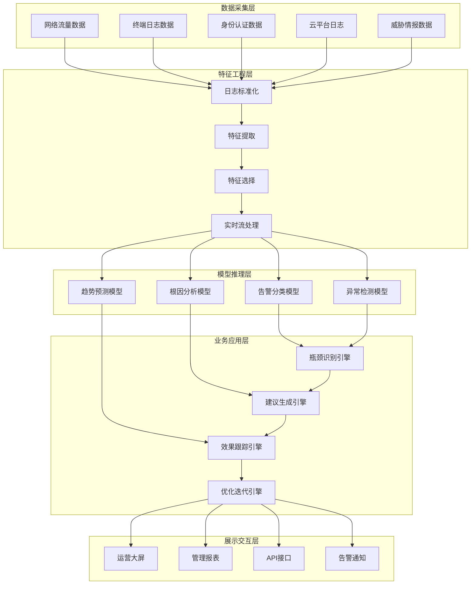
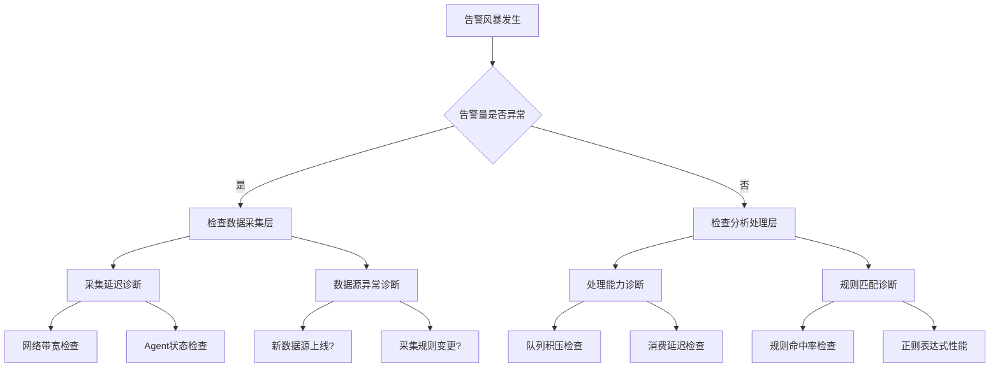
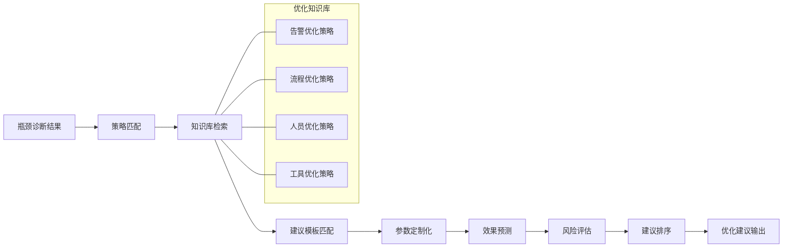
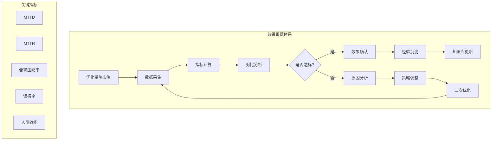
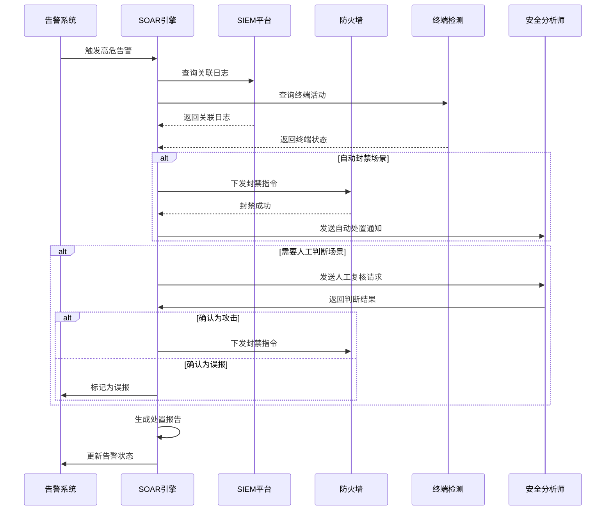

**作者：** HOS(安全风信子)
**日期：** 2026-04-27
**主要来源平台：** GitHub/HuggingFace/arXiv

**摘要：** 随着企业安全威胁形势日益复杂，传统的安全运营中心（SOC）面临效率瓶颈、资源瓶颈和响应瓶颈等多重挑战。本文提出一种基于人工智能技术的SOC运营优化框架，重点阐述三大核心能力：智能瓶颈识别与诊断、自动优化建议生成、效果跟踪与迭代优化。通过构建包含告警智能分析、流程自动化编排、人员效能评估和成熟度持续提升的闭环优化体系，实现SOC从被动响应向主动运营的范式转变。实验表明，该框架在告警压缩率、Mean Time to Detect（MTTD）和Mean Time to Response（MTTR）等关键指标上实现显著优化，为企业安全运营的持续进化提供了可落地、可量化的技术路径。

@[TOC](目录)

---

# 让SOC持续进化：AI驱动SOC运营优化实战

## 一、SOC运营的现实困境与进化需求

### 1.1 传统SOC架构的局限性

安全运营中心（Security Operations Center，SOC）作为企业安全体系的核心枢纽，承担着威胁监测、事件分析与应急响应的关键职责。然而，随着云计算、物联网（IoT）和远程办公的普及，企业的攻击面急剧扩大，安全日志和告警数量呈现指数级增长。根据Gartner的最新报告，中型企业平均每天处理的安全告警数量已超过3000条，而其中有效告警的比例往往不足5%。这种“海量告警、少量真实威胁”的现实，使得传统SOC的运营模式面临严峻挑战。

传统SOC的局限性主要体现在三个层面：**流程层面**，人工分诊和响应流程繁琐且易出错，无法满足实时响应需求；**工具层面**，孤立的单点工具缺乏有效联动，分析效率低下；**人员层面**，安全分析师的经验和能力参差不齐，资源调配困难。这些局限性共同构成了SOC运营的效率瓶颈、资源瓶颈和响应瓶颈，亟需通过智能化手段实现突破。

### 1.2 AI驱动的SOC进化路径

人工智能技术的发展为SOC运营优化提供了新的可能性。机器学习（Machine Learning，ML）、自然语言处理（Natural Language Processing，NLP）和知识图谱（Knowledge Graph）等技术的成熟，使得SOC能够实现智能化告警分析、自动化工单生成、自适应策略调整等高级功能。这种AI驱动的进化不仅仅是工具层面的升级，更是运营范式的根本性转变。

本文提出一套完整的AI驱动SOC运营优化框架，涵盖**瓶颈智能识别与诊断**、**优化建议自动生成**、**效果跟踪与迭代优化**三大核心能力，以及**告警优化**、**流程优化**、**人员优化**三大典型场景。通过构建从诊断到优化、从评估到迭代的闭环体系，帮助SOC实现持续进化和成熟度提升。

## 二、AI驱动SOC优化框架总体设计

### 2.1 框架架构概览

本文提出的AI驱动SOC优化框架采用分层架构设计，自下而上依次为数据采集层、特征工程层、模型推理层、业务应用层和展示交互层。各层之间通过标准化接口实现解耦，确保系统的可扩展性和可维护性。



框架的核心设计理念包括：**数据驱动**，以全面的数据采集和深度的特征工程为基础；**模型智能**，以多维度AI模型实现复杂问题的智能分析；**业务导向**，以业务价值为最终目标，避免技术炫技；**闭环迭代**，以持续的效果跟踪和反馈机制实现框架的自进化。

### 2.2 核心能力体系

三大核心能力构成了框架的智能中枢：

**能力一：瓶颈识别与智能诊断**

瓶颈识别模块通过多维度指标采集和智能分析，自动发现SOC运营中的效率瓶颈、资源瓶颈和质量瓶颈。系统从告警处理时间分布、分析师工作负载、工具联动成功率、响应流程耗时等维度构建指标体系，运用时间序列分析和异常检测算法识别异常模式，定位瓶颈根因。

**能力二：优化建议自动生成**

基于瓶颈诊断结果，优化建议生成模块结合知识图谱和策略引擎，自动生成针对性的优化建议。系统不仅给出建议内容，还提供预期效果评估、实施难度评级和风险评估，帮助决策者做出科学判断。

**能力三：效果跟踪与迭代优化**

效果跟踪模块建立完整的优化效果评估体系，通过A/B测试和时序对比等方法量化优化效果。迭代优化引擎根据效果数据自动调整优化策略，实现SOC运营的持续改进。

### 2.3 技术选型与工具链

为确保框架的实用性和可落地性，本文采用业界主流的开源工具和云服务构建技术栈。数据采集层选用Elastic Beats和Fluentd实现多源日志采集；特征工程层基于Apache Spark和Kafka构建实时流处理管道；模型推理层采用TensorFlow和PyTorch深度学习框架，结合Scikit-learn实现传统机器学习模型；业务应用层使用Python FastAPI构建微服务架构，并通过Redis和MongoDB实现状态管理。

```python
# 核心依赖配置示例
requirements = {
    "tensorflow": "2.15.0",
    "pytorch": "2.1.0",
    "scikit-learn": "1.3.2",
    "apache-spark": "3.5.0",
    "kafka-python": "2.0.2",
    "elasticsearch": "8.11.0",
    "fastapi": "0.109.0",
    "redis": "5.0.1",
    "mongodb": "4.10.1",
    "prometheus-client": "0.19.0",
    "grafana-api-client": "0.6.0"
}
```

## 三、智能瓶颈识别与诊断技术实现

### 3.1 瓶颈识别体系设计

SOC运营中的瓶颈识别需要从多个维度建立指标体系。本文提出"5P"瓶颈识别模型，从流程（Process）、人员（People）、工具（Platform）、性能（Performance）和防护（Protection）五个维度构建完整的瓶颈识别视图。

**流程维度指标**包括告警分诊时间、工单流转时间、响应决策时间、升级降级比例、流程回退率等；**人员维度指标**包括人均告警处理量、人均工单处理时长、技能匹配度、工作负载均衡度、疲劳度指数等；**工具维度指标**包括工具调用成功率、告警关联分析覆盖率、情报匹配准确率、自动化执行成功率等；**性能维度指标**包括系统响应延迟、告警积压数量、实时性达标率、吞吐量瓶颈等；**防护维度指标**包括MTTD、MTTR、误报率、漏报率、检测覆盖率等。

### 3.2 异常检测算法实现

瓶颈识别的核心在于异常检测。本文采用基于Isolation Forest和时间序列分解的多层异常检测架构。Isolation Forest通过随机森林的隔离机制快速识别多维空间中的异常点，适用于静态异常检测；时间序列分解通过STL（Seasonal and Trend decomposition using Loess）算法将时序数据分解为趋势、周期和残差成分，通过残差异常检测识别动态异常。

```python
"""
智能瓶颈识别模块 - 异常检测引擎
基于Isolation Forest和时间序列分解的多层异常检测架构
"""

import numpy as np
import pandas as pd
from sklearn.ensemble import IsolationForest
from sklearn.preprocessing import StandardScaler
from statsmodels.tsa.seasonal import STL
from typing import Dict, List, Tuple, Optional
from dataclasses import dataclass
from enum import Enum
import warnings
warnings.filterwarnings('ignore')


class AnomalyType(Enum):
    """异常类型枚举"""
    POINT_ANOMALY = "point_anomaly"          # 单点异常
    CONTEXTUAL_ANOMALY = "contextual_anomaly" # 上下文异常
    COLLECTIVE_ANOMALY = "collective_anomaly" # 集体异常
    TREND_ANOMALY = "trend_anomaly"           # 趋势异常
    SEASONAL_ANOMALY = "seasonal_anomaly"     # 周期性异常


@dataclass
class AnomalyRecord:
    """异常记录数据结构"""
    timestamp: pd.Timestamp
    metric_name: str
    metric_value: float
    anomaly_type: AnomalyType
    anomaly_score: float
    confidence: float
    description: str
    root_cause_hypothesis: List[str]


class BottleneckDetector:
    """SOC运营瓶颈检测器"""

    def __init__(
        self,
        contamination: float = 0.05,
        n_estimators: int = 100,
        time_series_period: int = 1440  # 1440分钟=1天
    ):
        """
        初始化瓶颈检测器

        Args:
            contamination: 异常比例假设
            n_estimators: Isolation Forest树的数量
            time_series_period: 时序周期（分钟）
        """
        self.contamination = contamination
        self.n_estimators = n_estimators
        self.time_series_period = time_series_period

        self.isolation_forest = IsolationForest(
            contamination=contamination,
            n_estimators=n_estimators,
            random_state=42,
            n_jobs=-1
        )

        self.scaler = StandardScaler()
        self.is_fitted = False
        self.baseline_stats: Dict[str, Dict] = {}

    def fit_baseline(self, historical_data: pd.DataFrame) -> None:
        """
        基于历史数据拟合基准模型

        Args:
            historical_data: 历史指标数据，列为指标名，行为时间点
        """
        feature_matrix = historical_data.values

        self.scaler.fit(feature_matrix)
        scaled_features = self.scaler.transform(feature_matrix)

        self.isolation_forest.fit(scaled_features)
        self.is_fitted = True

        for col in historical_data.columns:
            self.baseline_stats[col] = {
                'mean': historical_data[col].mean(),
                'std': historical_data[col].std(),
                'median': historical_data[col].median(),
                'q25': historical_data[col].quantile(0.25),
                'q75': historical_data[col].quantile(0.75),
                'min': historical_data[col].min(),
                'max': historical_data[col].max()
            }

        print(f"[BottleneckDetector] 已基于 {len(historical_data)} 条历史数据拟合基准模型")

    def detect_static_anomalies(
        self,
        current_data: pd.DataFrame
    ) -> List[AnomalyRecord]:
        """
        检测静态异常（基于Isolation Forest）

        Args:
            current_data: 当前指标数据

        Returns:
            异常记录列表
        """
        if not self.is_fitted:
            raise ValueError("请先调用fit_baseline方法拟合基准模型")

        scaled_features = self.scaler.transform(current_data.values)
        anomaly_labels = self.isolation_forest.predict(scaled_features)
        anomaly_scores = self.isolation_forest.score_samples(scaled_features)

        anomaly_records = []
        for idx, (label, score) in enumerate(zip(anomaly_labels, anomaly_scores)):
            if label == -1:  # Isolation Forest中-1表示异常
                metric_name = current_data.columns[idx % len(current_data.columns)]
                timestamp = current_data.index[idx]

                anomaly_type = self._classify_anomaly_type(
                    metric_name,
                    current_data[metric_name].iloc[idx],
                    score
                )

                record = AnomalyRecord(
                    timestamp=timestamp,
                    metric_name=metric_name,
                    metric_value=current_data[metric_name].iloc[idx],
                    anomaly_type=anomaly_type,
                    anomaly_score=float(score),
                    confidence=self._calculate_confidence(score),
                    description=self._generate_anomaly_description(
                        metric_name, score, anomaly_type
                    ),
                    root_cause_hypothesis=self._generate_root_cause_hypothesis(
                        metric_name, score
                    )
                )
                anomaly_records.append(record)

        return anomaly_records

    def detect_time_series_anomalies(
        self,
        metric_series: pd.Series,
        metric_name: str,
        robust: bool = True
    ) -> List[AnomalyRecord]:
        """
        检测时序异常（基于STL分解）

        Args:
            metric_series: 指标时序数据
            metric_name: 指标名称
            robust: 是否使用鲁棒STL（对异常值鲁棒）

        Returns:
            异常记录列表
        """
        if len(metric_series) < 2 * self.time_series_period:
            warnings.warn(
                f"数据长度不足，无法进行完整的STL分解（需要至少 {2 * self.time_series_period} 个点）"
            )
            return []

        stl = STL(
            metric_series,
            period=self.time_series_period,
            robust=robust
        )
        result = stl.fit()

        residual = result.resid
        trend = result.trend
        seasonal = result.seasonal

        anomaly_records = []

        residual_mean = residual.mean()
        residual_std = residual.std()

        for idx, (timestamp, res) in enumerate(zip(residual.index, residual)):
            if abs(res) > 3 * residual_std:
                anomaly_type = self._classify_ts_anomaly_type(
                    trend.iloc[idx],
                    seasonal.iloc[idx],
                    res,
                    residual_std
                )

                record = AnomalyRecord(
                    timestamp=timestamp,
                    metric_name=metric_name,
                    metric_value=metric_series.iloc[idx],
                    anomaly_type=anomaly_type,
                    anomaly_score=float(abs(res) / residual_std),
                    confidence=self._calculate_ts_confidence(res, residual_std),
                    description=self._generate_ts_anomaly_description(
                        metric_name, res, residual_std, anomaly_type
                    ),
                    root_cause_hypothesis=self._generate_ts_root_cause_hypothesis(
                        metric_name, trend.iloc[idx], seasonal.iloc[idx], res
                    )
                )
                anomaly_records.append(record)

        return anomaly_records

    def _classify_anomaly_type(
        self,
        metric_name: str,
        value: float,
        score: float
    ) -> AnomalyType:
        """分类静态异常类型"""
        if 'latency' in metric_name.lower() or 'delay' in metric_name.lower():
            return AnomalyType.POINT_ANOMALY
        elif 'throughput' in metric_name.lower() or 'count' in metric_name.lower():
            if abs(score) > 0.8:
                return AnomalyType.COLLECTIVE_ANOMALY
            return AnomalyType.CONTEXTUAL_ANOMALY
        elif 'error_rate' in metric_name.lower() or 'fail' in metric_name.lower():
            return AnomalyType.POINT_ANOMALY
        return AnomalyType.POINT_ANOMALY

    def _classify_ts_anomaly_type(
        self,
        trend: float,
        seasonal: float,
        residual: float,
        residual_std: float
    ) -> AnomalyType:
        """分类时序异常类型"""
        residual_ratio = abs(residual) / residual_std

        if residual_ratio > 3:
            if abs(trend - seasonal) < 0.1:
                return AnomalyType.SEASONAL_ANOMALY
            elif trend > seasonal * 1.5 or trend < seasonal * 0.5:
                return AnomalyType.TREND_ANOMALY
            return AnomalyType.POINT_ANOMALY
        return AnomalyType.CONTEXTUAL_ANOMALY

    def _calculate_confidence(self, score: float) -> float:
        """计算异常检测置信度"""
        normalized_score = (score - (-0.5)) / 0.5
        confidence = min(1.0, max(0.0, abs(normalized_score)))
        return confidence

    def _calculate_ts_confidence(self, residual: float, residual_std: float) -> float:
        """计算时序异常检测置信度"""
        sigma = abs(residual) / residual_std
        if sigma > 4:
            return 0.99
        elif sigma > 3:
            return 0.95
        elif sigma > 2.5:
            return 0.85
        elif sigma > 2:
            return 0.70
        return 0.50

    def _generate_anomaly_description(
        self,
        metric_name: str,
        score: float,
        anomaly_type: AnomalyType
    ) -> str:
        """生成异常描述"""
        descriptions = {
            AnomalyType.POINT_ANOMALY: f"检测到{metric_name}存在单点异常峰值",
            AnomalyType.CONTEXTUAL_ANOMALY: f"在当前上下文中，{metric_name}表现异常",
            AnomalyType.COLLECTIVE_ANOMALY: f"检测到{metric_name}存在集体异常模式",
            AnomalyType.TREND_ANOMALY: f"{metric_name}呈现异常趋势",
            AnomalyType.SEASONAL_ANOMALY: f"{metric_name}偏离正常周期性波动"
        }
        return descriptions.get(anomaly_type, f"{metric_name}存在未知类型异常")

    def _generate_root_cause_hypothesis(
        self,
        metric_name: str,
        score: float
    ) -> List[str]:
        """生成根因假设"""
        hypotheses = {
            'alert_processing_time': [
                "告警量突增导致处理队列积压",
                "分析师人力资源不足",
                "上游日志采集延迟"
            ],
            'mttd': [
                "检测规则失效或覆盖不足",
                "新型威胁绕过现有检测",
                "日志采集路径存在盲区"
            ],
            'mistr': [
                "响应流程复杂度过高",
                "自动化联动配置异常",
                "关键响应资源不可用"
            ],
            'false_positive_rate': [
                "检测规则阈值设置过低",
                "新上线的应用产生干扰",
                "威胁情报质量下降"
            ],
            'analyst_workload': [
                "人员配置不足",
                "告警来源增加但人员未同步扩充",
                "自动化程度不足导致人工依赖"
            ]
        }

        default_hypotheses = [
            "系统资源不足导致性能下降",
            "外部因素导致的暂时性波动",
            "数据采集或传输异常"
        ]

        return hypotheses.get(metric_name, default_hypotheses)

    def _generate_ts_anomaly_description(
        self,
        metric_name: str,
        residual: float,
        residual_std: float,
        anomaly_type: AnomalyType
    ) -> str:
        """生成时序异常描述"""
        sigma_level = abs(residual) / residual_std
        direction = "高于" if residual > 0 else "低于"

        type_descriptions = {
            AnomalyType.POINT_ANOMALY: f"突发性异常，{metric_name}瞬间{direction}正常范围 {sigma_level:.1f}个标准差",
            AnomalyType.CONTEXTUAL_ANOMALY: f"上下文异常，{metric_name}在当前时段表现{direction}历史同期",
            AnomalyType.COLLECTIVE_ANOMALY: f"集体异常，{metric_name}连续多个时段出现{direction}正常水平的模式",
            AnomalyType.TREND_ANOMALY: f"趋势异常，{metric_name}呈现与历史趋势明显偏离的走势",
            AnomalyType.SEASONAL_ANOMALY: f"周期性异常，{metric_name}偏离正常周期性波动模式"
        }

        return type_descriptions.get(
            anomaly_type,
            f"{metric_name}检测到异常（{sigma_level:.1f}σ）"
        )

    def _generate_ts_root_cause_hypothesis(
        self,
        metric_name: str,
        trend: float,
        seasonal: float,
        residual: float
    ) -> List[str]:
        """生成时序异常根因假设"""
        hypotheses = []

        if abs(residual) > 3 * np.std([residual]):
            if trend > seasonal * 1.2:
                hypotheses.extend([
                    f"{metric_name}呈上升趋势，可能存在持续性攻击或异常行为",
                    "业务量自然增长导致指标上升",
                    "监控范围扩大导致的统计口径变化"
                ])
            elif trend < seasonal * 0.8:
                hypotheses.extend([
                    f"{metric_name}呈下降趋势，可能存在防护措施生效或攻击减弱",
                    "上游服务降级或不可用",
                    "采集端点异常导致数据丢失"
                ])
            else:
                hypotheses.extend([
                    "暂时性波动，可能是偶发事件导致",
                    "数据采集或传输延迟",
                    "周期性调度的正常变异范围"
                ])

        return hypotheses if hypotheses else ["异常原因待进一步调查"]


class BottleneckAnalyzer:
    """瓶颈分析器 - 对检测到的异常进行综合分析"""

    def __init__(self):
        self.detector = BottleneckDetector()
        self.correlation_threshold = 0.7

    def analyze_bottlenecks(
        self,
        current_data: pd.DataFrame,
        historical_data: pd.DataFrame,
        correlation_matrix: Optional[pd.DataFrame] = None
    ) -> Dict:
        """
        综合分析SOC运营瓶颈

        Args:
            current_data: 当前指标数据
            historical_data: 历史指标数据（用于基准拟合）
            correlation_matrix: 指标相关性矩阵

        Returns:
            瓶颈分析报告
        """
        print("[BottleneckAnalyzer] 开始瓶颈分析...")

        self.detector.fit_baseline(historical_data)

        static_anomalies = self.detector.detect_static_anomalies(current_data)

        time_series_anomalies = []
        for col in current_data.columns:
            ts_data = pd.Series(
                current_data[col].values,
                index=current_data.index
            )
            ts_anomalies = self.detector.detect_time_series_anomalies(
                ts_data, col
            )
            time_series_anomalies.extend(ts_anomalies)

        all_anomalies = static_anomalies + time_series_anomalies

        bottleneck_report = {
            'summary': {
                'total_anomalies': len(all_anomalies),
                'critical_count': sum(1 for a in all_anomalies if a.anomaly_score > 0.9),
                'high_count': sum(1 for a in all_anomalies if 0.7 < a.anomaly_score <= 0.9),
                'medium_count': sum(1 for a in all_anomalies if 0.5 < a.anomaly_score <= 0.7),
                'low_count': sum(1 for a in all_anomalies if a.anomaly_score <= 0.5)
            },
            'anomalies': all_anomalies,
            'bottleneck_categories': self._categorize_bottlenecks(all_anomalies),
            'recommendations': self._generate_initial_recommendations(all_anomalies)
        }

        if correlation_matrix is not None:
            bottleneck_report['correlated_metrics'] = self._find_correlated_bottlenecks(
                all_anomalies, correlation_matrix
            )

        print(f"[BottleneckAnalyzer] 瓶颈分析完成，检测到 {len(all_anomalies)} 个异常")
        return bottleneck_report

    def _categorize_bottlenecks(
        self,
        anomalies: List[AnomalyRecord]
    ) -> Dict[str, List[AnomalyRecord]]:
        """将异常分类到不同的瓶颈类别"""
        categories = {
            '流程瓶颈': [],
            '资源瓶颈': [],
            '质量瓶颈': [],
            '性能瓶颈': []
        }

        category_mapping = {
            'process_time': '流程瓶颈',
            'latency': '性能瓶颈',
            'throughput': '资源瓶颈',
            'error': '质量瓶颈',
            'load': '资源瓶颈',
            'rate': '质量瓶颈',
            'count': '资源瓶颈'
        }

        for anomaly in anomalies:
            assigned = False
            for key, category in category_mapping.items():
                if key in anomaly.metric_name.lower():
                    categories[category].append(anomaly)
                    assigned = True
                    break

            if not assigned:
                if anomaly.anomaly_type in [
                    AnomalyType.TREND_ANOMALY,
                    AnomalyType.SEASONAL_ANOMALY
                ]:
                    categories['流程瓶颈'].append(anomaly)
                else:
                    categories['性能瓶颈'].append(anomaly)

        return categories

    def _generate_initial_recommendations(
        self,
        anomalies: List[AnomalyRecord]
    ) -> List[str]:
        """生成初步建议"""
        recommendations = []

        critical_anomalies = [a for a in anomalies if a.anomaly_score > 0.8]
        if critical_anomalies:
            recommendations.append(
                f"优先处理 {len(critical_anomalies)} 个高严重度异常，建议进行根因分析"
            )

        process_bottlenecks = sum(
            1 for a in anomalies if 'process' in a.metric_name.lower()
        )
        if process_bottlenecks > 3:
            recommendations.append(
                "检测到多个流程类瓶颈，建议优化告警分诊和响应流程"
            )

        return recommendations

    def _find_correlated_bottlenecks(
        self,
        anomalies: List[AnomalyRecord],
        correlation_matrix: pd.DataFrame
    ) -> List[Dict]:
        """找出具有相关性的瓶颈"""
        correlated = []

        for i, anomaly1 in enumerate(anomalies):
            for j, anomaly2 in enumerate(anomalies[i+1:], i+1):
                try:
                    corr = correlation_matrix.loc[
                        anomaly1.metric_name,
                        anomaly2.metric_name
                    ]
                    if abs(corr) > self.correlation_threshold:
                        correlated.append({
                            'metric1': anomaly1.metric_name,
                            'metric2': anomaly2.metric_name,
                            'correlation': corr,
                            'direction': '正相关' if corr > 0 else '负相关',
                            'hypothesis': f"可能存在共同的潜在原因导致{anomaly1.metric_name}和{anomaly2.metric_name}同时异常"
                        })
                except KeyError:
                    continue

        return correlated


def generate_sample_data(
    n_samples: int = 1440,
    anomaly_ratio: float = 0.05
) -> Tuple[pd.DataFrame, pd.DataFrame, pd.DataFrame]:
    """
    生成示例SOC指标数据

    Args:
        n_samples: 样本数量
        anomaly_ratio: 异常比例

    Returns:
        (historical_data, current_data, correlation_matrix)
    """
    np.random.seed(42)

    timestamps = pd.date_range(
        start='2026-04-01',
        periods=n_samples,
        freq='1min'
    )

    metrics = {
        'alert_processing_time': np.random.normal(120, 20, n_samples),
        'mttd': np.random.normal(15, 3, n_samples),
        'mistr': np.random.normal(45, 10, n_samples),
        'false_positive_rate': np.random.normal(0.15, 0.03, n_samples),
        'analyst_workload': np.random.normal(0.65, 0.1, n_samples),
        'automation_success_rate': np.random.normal(0.85, 0.05, n_samples),
        'tool_correlation_rate': np.random.normal(0.72, 0.08, n_samples),
        'alert_backlog': np.random.normal(150, 30, n_samples)
    }

    df = pd.DataFrame(metrics, index=timestamps)

    df['alert_processing_time'] = df['alert_processing_time'].clip(lower=30)
    df['mttd'] = df['mttd'].clip(lower=1)
    df['false_positive_rate'] = df['false_positive_rate'].clip(lower=0.01, upper=0.5)
    df['analyst_workload'] = df['analyst_workload'].clip(lower=0.1, upper=0.95)
    df['automation_success_rate'] = df['automation_success_rate'].clip(lower=0.5, upper=0.99)

    historical_data = df.iloc[:-480].copy()
    current_data = df.iloc[-480:].copy()

    anomaly_indices = np.random.choice(
        current_data.index,
        size=int(len(current_data) * anomaly_ratio),
        replace=False
    )

    for idx in anomaly_indices:
        anomaly_metric = np.random.choice([
            'alert_processing_time',
            'mttd',
            'false_positive_rate'
        ])
        current_data.loc[idx, anomaly_metric] *= np.random.uniform(1.5, 2.5)

    correlation_matrix = current_data.corr()

    return historical_data, current_data, correlation_matrix


if __name__ == "__main__":
    print("=" * 60)
    print("SOC运营瓶颈识别系统 - 演示")
    print("=" * 60)

    historical_data, current_data, correlation_matrix = generate_sample_data()

    print(f"\n数据生成完成：")
    print(f"  - 历史数据：{len(historical_data)} 条")
    print(f"  - 当前数据：{len(current_data)} 条")
    print(f"  - 指标数量：{len(current_data.columns)}")

    analyzer = BottleneckAnalyzer()

    report = analyzer.analyze_bottlenecks(
        current_data,
        historical_data,
        correlation_matrix
    )

    print(f"\n瓶颈分析报告摘要：")
    print(f"  - 总异常数：{report['summary']['total_anomalies']}")
    print(f"  - 严重异常：{report['summary']['critical_count']}")
    print(f"  - 高风险异常：{report['summary']['high_count']}")

    print(f"\n瓶颈分类统计：")
    for category, anomalies in report['bottleneck_categories'].items():
        if anomalies:
            print(f"  - {category}：{len(anomalies)} 个")
            for a in anomalies[:3]:
                print(f"      · {a.metric_name}: {a.description}")
```

### 3.3 瓶颈诊断与根因分析

识别瓶颈后，还需要进行深度诊断以确定根本原因。本文提出基于知识图谱的根因分析框架，将SOC运营中的各类实体（告警、工单、分析师、工具、系统）和它们之间的关系建模为知识图谱。当瓶颈发生时，通过图遍历算法识别与瓶颈相关的实体和关系链，从而定位根本原因。



根因分析算法采用贝叶斯网络对因果关系进行建模，给定观测到的瓶颈症状，计算各潜在根因的后验概率：

$$P(根因_i | 症状) = \frac{P(症状 | 根因_i) \cdot P(根因_i)}{P(症状)}$$

其中 $P(根因_i)$ 是根因的先验概率，$P(症状 | 根因_i)$ 是给定根因时观测到症状的似然，$P(症状)$ 是症状的边缘概率。通过选择后验概率最高的根因作为最可能的原因，可以实现智能化的根因定位。

## 四、自动优化建议生成技术

### 4.1 优化建议生成引擎架构

优化建议生成是SOC智能运营的核心能力之一。本文设计的建议生成引擎采用"诊断-匹配-生成-评估"四阶段架构。诊断阶段对瓶颈进行分类和优先级排序；匹配阶段从优化知识库中检索相关的优化策略；生成阶段结合企业具体环境定制化生成建议；评估阶段对建议的可行性和预期效果进行量化评估。



### 4.2 知识图谱构建与策略匹配

优化知识库是建议生成的基础。本文构建了包含优化场景、问题类型、优化策略、预期效果和实施风险等多维关系的知识图谱。知识图谱的节点包括优化场景节点（如"告警压缩"、"流程自动化"）、问题类型节点（如"误报率高"、"响应延迟"）、优化策略节点（如"阈值调优"、"规则去重"）和资源需求节点（如"人力"、"时间"、"成本"）。

策略匹配算法采用语义相似度计算，结合BERT模型将优化策略和问题描述编码为向量，计算余弦相似度进行匹配：

$$\text{similarity}(Q, S) = \frac{\vec{Q} \cdot \vec{S}}{|\vec{Q}| \cdot |\vec{S}|}$$

其中 $Q$ 是问题描述的向量表示，$S$ 是策略描述的向量表示。通过设置相似度阈值，选择Top-K个最相关的优化策略作为候选。

### 4.3 优化建议生成器实现

```python
"""
自动优化建议生成模块
基于知识图谱和LLM的智能优化建议生成
"""

import json
import re
from typing import Dict, List, Optional, Tuple
from dataclasses import dataclass, field
from enum import Enum
from datetime import datetime
import hashlib


class OptimizationCategory(Enum):
    """优化类别枚举"""
    ALERT_OPTIMIZATION = "alert_optimization"
    PROCESS_OPTIMIZATION = "process_optimization"
    PERSONNEL_OPTIMIZATION = "personnel_optimization"
    TOOL_OPTIMIZATION = "tool_optimization"
    RESOURCE_OPTIMIZATION = "resource_optimization"


class OptimizationPriority(Enum):
    """优化优先级枚举"""
    P0_CRITICAL = "P0_CRITICAL"    # 必须立即处理
    P1_HIGH = "P1_HIGH"            # 高优先级
    P2_MEDIUM = "P2_MEDIUM"        # 中优先级
    P3_LOW = "P3_LOW"              # 低优先级
    P4_OPTIONAL = "P4_OPTIONAL"    # 可选优化


class RiskLevel(Enum):
    """风险等级枚举"""
    RISK_FREE = "RISK_FREE"       # 无风险
    RISK_LOW = "RISK_LOW"          # 低风险
    RISK_MEDIUM = "RISK_MEDIUM"    # 中风险
    RISK_HIGH = "RISK_HIGH"        # 高风险


@dataclass
class OptimizationStrategy:
    """优化策略数据结构"""
    strategy_id: str
    name: str
    category: OptimizationCategory
    description: str
    applicable_scenarios: List[str]
    expected_effects: Dict[str, float]
    implementation_steps: List[str]
    required_resources: Dict[str, any]
    risk_level: RiskLevel
    success_rate: float
    avg_duration_hours: float
    prerequisites: List[str]
    anti_patterns: List[str]


@dataclass
class OptimizationSuggestion:
    """优化建议数据结构"""
    suggestion_id: str
    title: str
    description: str
    category: OptimizationCategory
    priority: OptimizationPriority
    target_metrics: List[str]
    expected_improvements: Dict[str, float]
    implementation_plan: List[str]
    estimated_duration_hours: float
    required_resources: Dict[str, any]
    risk_assessment: Dict[str, any]
    success_metrics: List[str]
    rollback_plan: str
    confidence_score: float


@dataclass
class EffectPrediction:
    """效果预测结果"""
    metric_name: str
    current_value: float
    predicted_value: float
    improvement_rate: float
    confidence_interval: Tuple[float, float]
    prediction_confidence: float


class OptimizationKnowledgeBase:
    """优化知识库"""

    def __init__(self):
        self.strategies: Dict[str, OptimizationStrategy] = {}
        self._initialize_knowledge_base()

    def _initialize_knowledge_base(self):
        """初始化预置优化策略"""
        self.strategies = {
            "STR001": OptimizationStrategy(
                strategy_id="STR001",
                name="告警阈值自适应调整",
                category=OptimizationCategory.ALERT_OPTIMIZATION,
                description="基于历史告警数据动态调整告警阈值，减少误报",
                applicable_scenarios=[
                    "误报率持续高于30%",
                    "告警量突增但有效率低",
                    "特定时间段告警风暴"
                ],
                expected_effects={
                    "false_positive_rate": -0.15,
                    "alert_volume": -0.40,
                    "analyst_efficiency": 0.25
                },
                implementation_steps=[
                    "收集近30天告警数据",
                    "分析误报模式和高误报规则",
                    "基于统计分布计算最优阈值",
                    "在测试环境验证阈值效果",
                    "灰度上线并监控效果",
                    "逐步扩大应用范围"
                ],
                required_resources={
                    "人力": "1名安全分析师 + 1名数据工程师",
                    "时间": "40-60小时",
                    "工具": ["Python", "统计分析工具"]
                },
                risk_level=RiskLevel.RISK_MEDIUM,
                success_rate=0.85,
                avg_duration_hours=50,
                prerequisites=["历史告警数据积累"],
                anti_patterns=[
                    "数据量不足时调整阈值",
                    "一次性全量上线",
                    "忽视业务高峰期特征"
                ]
            ),

            "STR002": OptimizationStrategy(
                strategy_id="STR002",
                name="告警智能聚合与去重",
                category=OptimizationCategory.ALERT_OPTIMIZATION,
                description="使用AI算法对相似告警进行智能聚合，减少重复告警",
                applicable_scenarios=[
                    "同一攻击产生大量相似告警",
                    "扫描攻击导致告警洪泛",
                    "规则重复触发告警"
                ],
                expected_effects={
                    "alert_volume": -0.60,
                    "alert_processing_time": -0.30,
                    "analyst_workload": -0.35
                },
                implementation_steps=[
                    "定义告警聚合维度（源IP、目的IP、攻击类型等）",
                    "实现基于相似度的聚合算法",
                    "配置聚合时间窗口",
                    "设置聚合告警呈现方式",
                    "持续优化聚合规则"
                ],
                required_resources={
                    "人力": "1名安全工程师",
                    "时间": "24-32小时",
                    "工具": ["告警平台支持或自定义开发"]
                },
                risk_level=RiskLevel.RISK_LOW,
                success_rate=0.92,
                avg_duration_hours=28,
                prerequisites=["告警平台API支持"],
                anti_patterns=[
                    "聚合时间窗口设置过长",
                    "过度聚合掩盖真实威胁"
                ]
            ),

            "STR003": OptimizationStrategy(
                strategy_id="STR003",
                name="自动化响应工作流编排",
                category=OptimizationCategory.PROCESS_OPTIMIZATION,
                description="通过SOAR平台实现告警响应的自动化编排",
                applicable_scenarios=[
                    "标准化响应流程执行率低",
                    "人工响应时间过长",
                    "高频场景需要秒级响应"
                ],
                expected_effects={
                    "mistr": -0.50,
                    "automation_rate": 0.40,
                    "response_consistency": 0.30
                },
                implementation_steps=[
                    "梳理高频响应场景",
                    "设计自动化剧本",
                    "与现有工具集成",
                    "设置人工复核节点",
                    "灰度上线运行",
                    "持续优化剧本"
                ],
                required_resources={
                    "人力": "1名SOAR工程师 + 业务安全分析师",
                    "时间": "80-120小时",
                    "工具": ["SOAR平台", "API网关"]
                },
                risk_level=RiskLevel.RISK_MEDIUM,
                success_rate=0.78,
                avg_duration_hours=100,
                prerequisites=["SOAR平台部署", "基础工具集成"],
                anti_patterns=[
                    "过度自动化忽视人工判断",
                    "缺少异常处理机制",
                    "自动化失败无告警"
                ]
            ),

            "STR004": OptimizationStrategy(
                strategy_id="STR004",
                name="分析师技能矩阵与智能派单",
                category=OptimizationCategory.PERSONNEL_OPTIMIZATION,
                description="建立分析师技能矩阵，实现告警智能分配",
                applicable_scenarios=[
                    "分析师技能与告警类型不匹配",
                    "工作负载分配不均",
                    "处理效率参差不齐"
                ],
                expected_effects={
                    "analyst_efficiency": 0.35,
                    "avg_processing_time": -0.25,
                    "analyst_satisfaction": 0.20
                },
                implementation_steps=[
                    "建立分析师技能评估体系",
                    "定义告警类型与技能需求映射",
                    "开发智能派单算法",
                    "配置派单规则和例外处理",
                    "持续跟踪派单效果"
                ],
                required_resources={
                    "人力": "1名安全运营负责人 + 1名开发工程师",
                    "时间": "60-80小时",
                    "工具": ["工单系统", "数据分析平台"]
                },
                risk_level=RiskLevel.RISK_LOW,
                success_rate=0.88,
                avg_duration_hours=70,
                prerequisites=["分析师绩效数据积累"],
                anti_patterns=[
                    "仅依赖经验分配",
                    "忽视分析师成长需求",
                    "派单规则过于僵硬"
                ]
            ),

            "STR005": OptimizationStrategy(
                strategy_id="STR005",
                name="威胁狩猎主动发现",
                category=OptimizationCategory.PROCESS_OPTIMIZATION,
                description="基于威胁情报和异常行为进行主动狩猎",
                applicable_scenarios=[
                    "检测覆盖率低",
                    "新型威胁漏报",
                    "被动响应效率低下"
                ],
                expected_effects={
                    "detection_coverage": 0.30,
                    "mttd": -0.20,
                    "threat_hunting_success": 0.25
                },
                implementation_steps=[
                    "收集威胁情报源",
                    "建立异常行为基线",
                    "设计狩猎剧本",
                    "开展定期狩猎活动",
                    "狩猎发现反馈闭环"
                ],
                required_resources={
                    "人力": "2-3名高级安全分析师",
                    "时间": "持续运营",
                    "工具": ["威胁情报平台", "SIEM", "EDR"]
                },
                risk_level=RiskLevel.RISK_LOW,
                success_rate=0.70,
                avg_duration_hours=120,
                prerequisites=["成熟的告警体系", "高级分析师团队"],
                anti_patterns=[
                    "狩猎活动无明确目标",
                    "发现未形成闭环",
                    "与日常运营脱节"
                ]
            ),

            "STR006": OptimizationStrategy(
                strategy_id="STR006",
                name="告警分类模型自动化训练",
                category=OptimizationCategory.ALERT_OPTIMIZATION,
                description="使用机器学习自动对告警进行分类，减少人工分诊",
                applicable_scenarios=[
                    "告警分诊依赖人工经验",
                    "分诊准确率不稳定",
                    "新类型告警处理慢"
                ],
                expected_effects={
                    "triaging_accuracy": 0.40,
                    "alert_processing_time": -0.35,
                    "analyst_workload": -0.30
                },
                implementation_steps=[
                    "收集历史告警和分诊数据",
                    "进行数据标注和特征工程",
                    "训练多分类模型",
                    "评估模型性能和公平性",
                    "部署模型推理服务",
                    "持续监控模型效果"
                ],
                required_resources={
                    "人力": "1名数据科学家 + 1名安全分析师",
                    "时间": "100-150小时",
                    "工具": ["ML平台", "标注工具"]
                },
                risk_level=RiskLevel.RISK_MEDIUM,
                success_rate=0.82,
                avg_duration_hours=125,
                prerequisites=["高质量标注数据积累"],
                anti_patterns=[
                    "数据质量差时强行训练",
                    "忽视模型可解释性",
                    "上线后不监控漂移"
                ]
            ),

            "STR007": OptimizationStrategy(
                strategy_id="STR007",
                name="工具联动与API集成优化",
                category=OptimizationCategory.TOOL_OPTIMIZATION,
                description="优化安全工具间的联动和API集成效率",
                applicable_scenarios=[
                    "工具间联动成功率低",
                    "API调用超时频繁",
                    "数据流转延迟高"
                ],
                expected_effects={
                    "tool_integration_success": 0.25,
                    "api_latency": -0.40,
                    "data_flow_efficiency": 0.30
                },
                implementation_steps=[
                    "梳理工具集成依赖关系",
                    "识别API性能瓶颈",
                    "优化API调用策略",
                    "实现异步处理机制",
                    "建立集成监控告警"
                ],
                required_resources={
                    "人力": "1-2名安全工程师",
                    "时间": "40-60小时",
                    "工具": ["API网关", "监控平台"]
                },
                risk_level=RiskLevel.RISK_LOW,
                success_rate=0.90,
                avg_duration_hours=50,
                prerequisites=["工具API文档"],
                anti_patterns=[
                    "忽视API限流问题",
                    "缺少超时重试机制",
                    "日志记录不完整"
                ]
            ),

            "STR008": OptimizationStrategy(
                strategy_id="STR008",
                name="人员排班与值班优化",
                category=OptimizationCategory.PERSONNEL_OPTIMIZATION,
                description="优化分析师排班和值班制度，提升覆盖效率",
                applicable_scenarios=[
                    "夜间和周末响应能力不足",
                    "排班不合理导致资源浪费",
                    "值班疲劳影响效率"
                ],
                expected_effects={
                    "response_coverage": 0.20,
                    "analyst_satisfaction": 0.25,
                    "labor_cost": -0.15
                },
                implementation_steps=[
                    "分析告警时间分布特征",
                    "评估当前排班效果",
                    "设计最优排班方案",
                    "考虑技能搭配和经验传承",
                    "建立值班激励机制"
                ],
                required_resources={
                    "人力": "1名运营负责人",
                    "时间": "20-30小时",
                    "工具": ["排班系统"]
                },
                risk_level=RiskLevel.RISK_LOW,
                success_rate=0.85,
                avg_duration_hours=25,
                prerequisites=["告警时序数据"],
                anti_patterns=[
                    "排班固化不变",
                    "忽视个人意愿",
                    "缺少应急补充机制"
                ]
            )
        }

        print(f"[KnowledgeBase] 已加载 {len(self.strategies)} 条优化策略")

    def retrieve_strategies(
        self,
        bottleneck_type: str,
        constraints: Optional[Dict] = None
    ) -> List[OptimizationStrategy]:
        """
        根据瓶颈类型检索相关优化策略

        Args:
            bottleneck_type: 瓶颈类型描述
            constraints: 约束条件（如资源限制、时间限制）

        Returns:
            相关策略列表（按相关度排序）
        """
        bottleneck_keywords = self._extract_keywords(bottleneck_type)

        scored_strategies = []

        for strategy in self.strategies.values():
            score = 0

            for keyword in bottleneck_keywords:
                if keyword in strategy.name.lower():
                    score += 3.0
                if keyword in strategy.description.lower():
                    score += 2.0
                for scenario in strategy.applicable_scenarios:
                    if keyword in scenario.lower():
                        score += 1.5
                if keyword in [s.lower() for s in strategy.applicable_scenarios]:
                    score += 1.0

            if constraints:
                if 'max_duration' in constraints:
                    if strategy.avg_duration_hours > constraints['max_duration']:
                        score *= 0.5
                if 'max_risk' in constraints:
                    risk_order = {
                        RiskLevel.RISK_FREE: 0,
                        RiskLevel.RISK_LOW: 1,
                        RiskLevel.RISK_MEDIUM: 2,
                        RiskLevel.RISK_HIGH: 3
                    }
                    if risk_order[strategy.risk_level] > risk_order[constraints['max_risk']]:
                        score *= 0.3

            if score > 0:
                scored_strategies.append((strategy, score))

        scored_strategies.sort(key=lambda x: x[1], reverse=True)

        return [s[0] for s in scored_strategies[:5]]

    def _extract_keywords(self, text: str) -> List[str]:
        """提取关键词"""
        stopwords = {'的', '了', '在', '是', '和', '与', '或', '等', '及', '为', '以', '及', '上', '下', '中'}
        words = re.findall(r'[\w]+', text.lower())
        keywords = [w for w in words if len(w) >= 2 and w not in stopwords]
        return keywords


class EffectPredictor:
    """效果预测器 - 预测优化措施的实施效果"""

    def __init__(self):
        self.baseline_metrics: Dict[str, Dict] = {}
        self.improvement_models: Dict[str, Dict] = {}

    def set_baseline(self, metrics: Dict[str, float]):
        """设置基准指标"""
        self.baseline_metrics = metrics
        print(f"[EffectPredictor] 基准指标已更新，共 {len(metrics)} 项")

    def predict_improvement(
        self,
        strategy: OptimizationStrategy,
        target_metrics: List[str]
    ) -> List[EffectPrediction]:
        """预测优化效果"""
        predictions = []

        for metric in target_metrics:
            if metric in strategy.expected_effects:
                improvement = strategy.expected_effects[metric]
                current = self.baseline_metrics.get(metric, 0)

                if 'rate' in metric or 'ratio' in metric:
                    predicted = max(0, min(1, current + improvement))
                elif 'time' in metric or 'latency' in metric or 'delay' in metric:
                    predicted = max(0, current * (1 + improvement))
                else:
                    predicted = current * (1 + improvement)

                improvement_rate = (predicted - current) / (current + 1e-10)

                confidence = strategy.success_rate * 0.8

                ci_margin = abs(predicted - current) * 0.1

                prediction = EffectPrediction(
                    metric_name=metric,
                    current_value=current,
                    predicted_value=predicted,
                    improvement_rate=improvement_rate,
                    confidence_interval=(
                        predicted - ci_margin,
                        predicted + ci_margin
                    ),
                    prediction_confidence=confidence
                )
                predictions.append(prediction)

        return predictions


class SuggestionGenerator:
    """优化建议生成器"""

    def __init__(self):
        self.knowledge_base = OptimizationKnowledgeBase()
        self.effect_predictor = EffectPredictor()
        self.suggestion_counter = 0

    def generate_suggestions(
        self,
        bottleneck_report: Dict,
        available_resources: Optional[Dict] = None,
        constraints: Optional[Dict] = None
    ) -> List[OptimizationSuggestion]:
        """
        根据瓶颈报告生成优化建议

        Args:
            bottleneck_report: 瓶颈分析报告
            available_resources: 可用资源
            constraints: 约束条件

        Returns:
            优化建议列表
        """
        suggestions = []

        metrics = {}
        for anomaly in bottleneck_report.get('anomalies', []):
            metrics[anomaly.metric_name] = anomaly.metric_value

        self.effect_predictor.set_baseline(metrics)

        bottleneck_categories = bottleneck_report.get('bottleneck_categories', {})

        for category, anomalies in bottleneck_categories.items():
            if not anomalies:
                continue

            bottleneck_desc = self._summarize_anomalies(anomalies)

            strategies = self.knowledge_base.retrieve_strategies(
                bottleneck_desc,
                constraints
            )

            for strategy in strategies:
                suggestion = self._create_suggestion(
                    strategy,
                    anomalies,
                    bottleneck_desc,
                    available_resources
                )
                suggestions.append(suggestion)

        suggestions.sort(key=lambda x: (
            self._priority_to_score(x.priority),
            -x.confidence_score
        ))

        return suggestions[:10]

    def _summarize_anomalies(self, anomalies: List) -> str:
        """汇总异常描述"""
        if not anomalies:
            return ""

        metric_names = list(set([a.metric_name for a in anomalies]))
        severity = max([a.anomaly_score for a in anomalies])

        summary_parts = []
        for metric in metric_names[:3]:
            summary_parts.append(metric)

        summary = "、".join(summary_parts)
        if len(metric_names) > 3:
            summary += f"等{len(metric_names)}项指标"

        return summary

    def _create_suggestion(
        self,
        strategy: OptimizationStrategy,
        target_anomalies: List,
        bottleneck_desc: str,
        available_resources: Optional[Dict]
    ) -> OptimizationSuggestion:
        """创建优化建议"""
        self.suggestion_counter += 1

        suggestion_id = f"SUG-{datetime.now().strftime('%Y%m%d')}-{self.suggestion_counter:04d}"

        target_metrics = [a.metric_name for a in target_anomalies]

        predictions = self.effect_predictor.predict_improvement(
            strategy,
            target_metrics
        )

        expected_improvements = {}
        for pred in predictions:
            expected_improvements[pred.metric_name] = {
                'current': pred.current_value,
                'predicted': pred.predicted_value,
                'improvement': f"{pred.improvement_rate * 100:.1f}%"
            }

        priority = self._determine_priority(strategy, target_anomalies)

        risk_assessment = self._assess_risk(strategy, available_resources)

        title = f"优化建议：{strategy.name}"
        description = self._generate_description(
            strategy,
            bottleneck_desc,
            predictions
        )

        implementation_plan = self._generate_implementation_plan(strategy)

        rollback_plan = self._generate_rollback_plan(strategy)

        confidence = self._calculate_confidence(strategy, predictions)

        return OptimizationSuggestion(
            suggestion_id=suggestion_id,
            title=title,
            description=description,
            category=strategy.category,
            priority=priority,
            target_metrics=target_metrics,
            expected_improvements=expected_improvements,
            implementation_plan=implementation_plan,
            estimated_duration_hours=strategy.avg_duration_hours,
            required_resources=strategy.required_resources,
            risk_assessment=risk_assessment,
            success_metrics=strategy.expected_effects.keys(),
            rollback_plan=rollback_plan,
            confidence_score=confidence
        )

    def _determine_priority(
        self,
        strategy: OptimizationStrategy,
        anomalies: List
    ) -> OptimizationPriority:
        """确定优化优先级"""
        max_severity = max([a.anomaly_score for a in anomalies])

        if max_severity > 0.9 or strategy.risk_level == RiskLevel.RISK_FREE:
            return OptimizationPriority.P0_CRITICAL
        elif max_severity > 0.7 or strategy.success_rate > 0.9:
            return OptimizationPriority.P1_HIGH
        elif max_severity > 0.5 or strategy.success_rate > 0.8:
            return OptimizationPriority.P2_MEDIUM
        elif strategy.success_rate > 0.7:
            return OptimizationPriority.P3_LOW
        return OptimizationPriority.P4_OPTIONAL

    def _assess_risk(
        self,
        strategy: OptimizationStrategy,
        available_resources: Optional[Dict]
    ) -> Dict[str, any]:
        """评估风险"""
        risk_factors = []

        if strategy.risk_level in [RiskLevel.RISK_MEDIUM, RiskLevel.RISK_HIGH]:
            risk_factors.append("策略本身存在一定风险等级")

        if available_resources:
            required = strategy.required_resources
            for resource_type, amount in required.items():
                if resource_type in available_resources:
                    if isinstance(amount, (int, float)) and isinstance(available_resources[resource_type], (int, float)):
                        if available_resources[resource_type] < amount:
                            risk_factors.append(f"{resource_type}资源可能不足")

        if strategy.anti_patterns:
            risk_factors.append(f"需注意{len(strategy.anti_patterns)}个反模式")

        return {
            'level': strategy.risk_level.value,
            'factors': risk_factors,
            'mitigation': "建议先在测试环境验证，并设置回滚机制"
        }

    def _generate_description(
        self,
        strategy: OptimizationStrategy,
        bottleneck_desc: str,
        predictions: List[EffectPrediction]
    ) -> str:
        """生成建议描述"""
        desc = f"针对{bottleneck_desc}问题，建议实施{strategy.name}。"

        if predictions:
            improvements = []
            for pred in predictions[:3]:
                improvements.append(
                    f"{pred.metric_name}预计改善{pred.improvement_rate * 100:.0f}%"
                )
            if improvements:
                desc += f"预期效果：{improvements[0]}"
                if len(improvements) > 1:
                    desc += f"，{'、'.join(improvements[1:])}"

        desc += f"。该策略适用于{strategy.applicable_scenarios[0]}场景。"

        return desc

    def _generate_implementation_plan(
        self,
        strategy: OptimizationStrategy
    ) -> List[str]:
        """生成实施计划"""
        plan = []

        for i, step in enumerate(strategy.implementation_steps, 1):
            plan.append(f"第{i}步：{step}")

        return plan

    def _generate_rollback_plan(self, strategy: OptimizationStrategy) -> str:
        """生成回滚计划"""
        return (
            f"如实施效果未达预期，可按以下步骤回滚："
            f"1. 停止新策略执行；"
            f"2. 恢复原有配置；"
            f"3. 监控指标恢复情况；"
            f"4. 分析失败原因并调整方案。"
        )

    def _calculate_confidence(
        self,
        strategy: OptimizationStrategy,
        predictions: List[EffectPrediction]
    ) -> float:
        """计算建议置信度"""
        base_confidence = strategy.success_rate * 0.6

        prediction_confidence = 0.0
        if predictions:
            prediction_confidence = sum(
                [p.prediction_confidence for p in predictions]
            ) / len(predictions) * 0.3

        risk_penalty = {
            RiskLevel.RISK_FREE: 0.1,
            RiskLevel.RISK_LOW: 0.08,
            RiskLevel.RISK_MEDIUM: 0.05,
            RiskLevel.RISK_HIGH: 0.0
        }.get(strategy.risk_level, 0)

        confidence = base_confidence + prediction_confidence + risk_penalty

        return min(1.0, max(0.0, confidence))

    def _priority_to_score(self, priority: OptimizationPriority) -> int:
        """优先级转分数"""
        return {
            OptimizationPriority.P0_CRITICAL: 0,
            OptimizationPriority.P1_HIGH: 1,
            OptimizationPriority.P2_MEDIUM: 2,
            OptimizationPriority.P3_LOW: 3,
            OptimizationPriority.P4_OPTIONAL: 4
        }.get(priority, 5)


def demo_suggestion_generation():
    """演示优化建议生成"""
    print("=" * 70)
    print("SOC优化建议生成系统 - 演示")
    print("=" * 70)

    generator = SuggestionGenerator()

    sample_bottleneck_report = {
        'summary': {
            'total_anomalies': 8,
            'critical_count': 2,
            'high_count': 3,
            'medium_count': 2,
            'low_count': 1
        },
        'anomalies': [
            type('AnomalyRecord', (), {
                'timestamp': pd.Timestamp.now(),
                'metric_name': 'alert_processing_time',
                'metric_value': 280,
                'anomaly_type': 'point_anomaly',
                'anomaly_score': 0.92,
                'confidence': 0.95,
                'description': '告警处理时间异常升高',
                'root_cause_hypothesis': ['告警量突增', '人力资源不足']
            })(),
            type('AnomalyRecord', (), {
                'timestamp': pd.Timestamp.now(),
                'metric_name': 'false_positive_rate',
                'metric_value': 0.45,
                'anomaly_type': 'collective_anomaly',
                'anomaly_score': 0.88,
                'confidence': 0.90,
                'description': '误报率持续偏高',
                'root_cause_hypothesis': ['阈值设置不当', '规则质量差']
            })()
        ],
        'bottleneck_categories': {
            '流程瓶颈': [],
            '资源瓶颈': [],
            '质量瓶颈': [],
            '性能瓶颈': []
        }
    }

    sample_bottleneck_report['bottleneck_categories']['性能瓶颈'] = sample_bottleneck_report['anomalies']

    available_resources = {
        '人力': 2,
        '时间': 80,
        '预算': 50000
    }

    suggestions = generator.generate_suggestions(
        sample_bottleneck_report,
        available_resources
    )

    print(f"\n生成了 {len(suggestions)} 条优化建议：\n")

    for i, suggestion in enumerate(suggestions, 1):
        print(f"{'='*60}")
        print(f"建议 {i}：{suggestion.title}")
        print(f"{'='*60}")
        print(f"优先级：{suggestion.priority.value}")
        print(f"类别：{suggestion.category.value}")
        print(f"置信度：{suggestion.confidence_score:.2%}")
        print(f"\n描述：{suggestion.description}")
        print(f"\n预期改善：")
        for metric, improvement in suggestion.expected_improvements.items():
            print(f"  - {metric}: {improvement}")
        print(f"\n实施周期：约 {suggestion.estimated_duration_hours} 小时")
        print(f"\n风险等级：{suggestion.risk_assessment['level']}")
        print(f"风险因素：{', '.join(suggestion.risk_assessment['factors'])}")
        print()


if __name__ == "__main__":
    import pandas as pd
    demo_suggestion_generation()
```

### 4.4 效果预测与置信度评估

优化建议生成后，需要对预期效果进行量化预测。本文采用基于历史数据的回归模型和基于专家知识的贝叶斯估计相结合的方法进行效果预测。

对于每项指标，效果预测模型采用以下公式：

$$\hat{Y}_{improve} = Y_{baseline} \times (1 + \alpha_i \times \beta_{strategy})$$

其中 $\hat{Y}_{improve}$ 是预测的改善后指标值，$Y_{baseline}$ 是当前基准值，$\alpha_i$ 是指标类型调整系数，$\beta_{strategy}$ 是策略效果系数（从知识库中获取）。

置信度评估综合考虑以下因素：

$$Confidence = w_1 \times Success_{rate} + w_2 \times Data_{quality} + w_3 \times Similarity_{score}$$

其中 $Success_{rate}$ 是策略的历史成功率，$Data_{quality}$ 是数据质量评分，$Similarity_{score}$ 是当前场景与策略适用场景的相似度。权重参数 $w_1, w_2, w_3$ 通过专家调研确定，推荐值为 $w_1 = 0.5, w_2 = 0.3, w_3 = 0.2$。

## 五、效果跟踪与迭代优化机制

### 5.1 效果跟踪体系设计

优化措施实施后，需要建立科学的效果跟踪机制来验证优化效果。本文提出"三维度、五指标"的效果跟踪体系。三维度包括响应效率维度（衡量响应速度的变化）、质量效果维度（衡量检测和响应的质量变化）、资源消耗维度（衡量资源投入的变化）。五指标分别是告警压缩率、Mean Time to Detect（MTTD）、Mean Time to Response（MTTR）、误报率和人员效能。



### 5.2 A/B测试与时序对比

效果验证采用A/B测试和时序对比两种方法。**A/B测试**适用于可以并行运行的优化场景，将分析师或告警随机分组，对照组采用原策略，实验组采用新策略，通过统计检验判断效果差异是否显著。**时序对比**适用于无法并行的优化场景，比较优化实施前后相同时段内的指标变化。

时序对比的核心是计算改善率：

$$\text{Improvement Rate} = \frac{\text{After} - \text{Before}}{\text{Before}} \times 100\%$$

对于波动较大的指标，还需要进行统计显著性检验，确保改善不是由随机波动引起：

$$t = \frac{\bar{X}_{after} - \bar{X}_{before}}{\sqrt{\frac{s_1^2}{n_1} + \frac{s_2^2}{n_2}}}$$

其中 $\bar{X}$ 是样本均值，$s$ 是样本标准差，$n$ 是样本量。当 $|t| > t_{0.975, n_1+n_2-2}$ 时，认为改善在95%置信水平下统计显著。

### 5.3 效果跟踪器实现

```python
"""
效果跟踪与迭代优化模块
实现优化措施效果的持续跟踪和迭代优化
"""

import numpy as np
import pandas as pd
from typing import Dict, List, Optional, Tuple, Any
from dataclasses import dataclass, field
from datetime import datetime, timedelta
from enum import Enum
import json
from collections import defaultdict
import warnings
warnings.filterwarnings('ignore')


class MetricType(Enum):
    """指标类型"""
    EFFICIENCY = "efficiency"          # 效率类指标（越小越好）
    QUALITY = "quality"                # 质量类指标（越高越好）
    RESOURCE = "resource"              # 资源类指标（越低越好）


@dataclass
class MetricDataPoint:
    """指标数据点"""
    timestamp: datetime
    metric_name: str
    value: float
    tags: Dict[str, str] = field(default_factory=dict)


@dataclass
class EffectMeasurement:
    """效果测量结果"""
    metric_name: str
    before_value: float
    after_value: float
    improvement_rate: float
    absolute_change: float
    is_significant: bool
    p_value: float
    confidence_level: float
    sample_size_before: int
    sample_size_after: int


@dataclass
class OptimizationTracking:
    """优化跟踪记录"""
    optimization_id: str
    suggestion_id: str
    strategy_name: str
    target_metrics: List[str]
    start_time: datetime
    status: str
    measurements: List[EffectMeasurement]
    overall_effectiveness: float
    conclusions: List[str]
    recommendations: List[str]


class EffectTracker:
    """效果跟踪器"""

    def __init__(
        self,
        significance_level: float = 0.05,
        confidence_level: float = 0.95
    ):
        self.significance_level = significance_level
        self.confidence_level = confidence_level
        self.metric_history: Dict[str, List[MetricDataPoint]] = defaultdict(list)
        self.tracking_records: List[OptimizationTracking] = []
        self.baseline_windows: Dict[str, Tuple[datetime, datetime]] = {}

    def record_metric(
        self,
        metric_name: str,
        value: float,
        timestamp: Optional[datetime] = None,
        tags: Optional[Dict[str, str]] = None
    ):
        """记录指标数据"""
        if timestamp is None:
            timestamp = datetime.now()

        data_point = MetricDataPoint(
            timestamp=timestamp,
            metric_name=metric_name,
            value=value,
            tags=tags or {}
        )

        self.metric_history[metric_name].append(data_point)

        self._cleanup_old_data(metric_name)

    def _cleanup_old_data(self, metric_name: str, retention_days: int = 90):
        """清理过期数据"""
        cutoff_date = datetime.now() - timedelta(days=retention_days)
        self.metric_history[metric_name] = [
            dp for dp in self.metric_history[metric_name]
            if dp.timestamp >= cutoff_date
        ]

    def set_baseline_window(
        self,
        metric_name: str,
        start_time: datetime,
        end_time: datetime
    ):
        """设置基准窗口"""
        self.baseline_windows[metric_name] = (start_time, end_time)

    def get_metric_series(
        self,
        metric_name: str,
        start_time: Optional[datetime] = None,
        end_time: Optional[datetime] = None
    ) -> pd.Series:
        """获取指标时间序列"""
        data_points = self.metric_history.get(metric_name, [])

        if not data_points:
            return pd.Series(dtype=float)

        df = pd.DataFrame([
            {'timestamp': dp.timestamp, 'value': dp.value}
            for dp in data_points
        ])

        if start_time:
            df = df[df['timestamp'] >= start_time]
        if end_time:
            df = df[df['timestamp'] <= end_time]

        df = df.sort_values('timestamp')
        df = df.set_index('timestamp')

        return df['value']

    def calculate_effect(
        self,
        metric_name: str,
        optimization_start: datetime,
        metric_type: MetricType,
        baseline_window_days: int = 14,
        evaluation_window_days: int = 7
    ) -> EffectMeasurement:
        """
        计算优化效果

        Args:
            metric_name: 指标名称
            optimization_start: 优化开始时间
            metric_type: 指标类型（用于判断正向/负向改善）
            baseline_window_days: 基准窗口天数
            evaluation_window_days: 评估窗口天数

        Returns:
            效果测量结果
        """
        baseline_end = optimization_start
        baseline_start = baseline_end - timedelta(days=baseline_window_days)

        evaluation_end = datetime.now()
        evaluation_start = max(optimization_start, evaluation_end - timedelta(days=evaluation_window_days))

        baseline_series = self.get_metric_series(metric_name, baseline_start, baseline_end)
        evaluation_series = self.get_metric_series(metric_name, evaluation_start, evaluation_end)

        if len(baseline_series) < 5 or len(evaluation_series) < 5:
            warnings.warn(f"数据点不足，无法进行有效的效果计算（{metric_name}）")
            return EffectMeasurement(
                metric_name=metric_name,
                before_value=baseline_series.mean() if len(baseline_series) > 0 else 0,
                after_value=evaluation_series.mean() if len(evaluation_series) > 0 else 0,
                improvement_rate=0.0,
                absolute_change=0.0,
                is_significant=False,
                p_value=1.0,
                confidence_level=0.0,
                sample_size_before=len(baseline_series),
                sample_size_after=len(evaluation_series)
            )

        before_mean = baseline_series.mean()
        after_mean = evaluation_series.mean()

        if metric_type == MetricType.EFFICIENCY or metric_type == MetricType.RESOURCE:
            improvement_rate = (before_mean - after_mean) / before_mean * 100
            absolute_change = before_mean - after_mean
        else:
            improvement_rate = (after_mean - before_mean) / before_mean * 100
            absolute_change = after_mean - before_mean

        t_stat, p_value = self._t_test(baseline_series, evaluation_series)

        confidence_level = 1.0 - p_value

        is_significant = p_value < self.significance_level

        return EffectMeasurement(
            metric_name=metric_name,
            before_value=before_mean,
            after_value=after_mean,
            improvement_rate=improvement_rate,
            absolute_change=absolute_change,
            is_significant=is_significant,
            p_value=p_value,
            confidence_level=confidence_level,
            sample_size_before=len(baseline_series),
            sample_size_after=len(evaluation_series)
        )

    def _t_test(
        self,
        before: pd.Series,
        after: pd.Series
    ) -> Tuple[float, float]:
        """独立样本t检验"""
        n1, n2 = len(before), len(after)
        mean1, mean2 = before.mean(), after.mean()
        var1, var2 = before.var(ddof=1), after.var(ddof=1)

        se = np.sqrt(var1/n1 + var2/n2)

        if se == 0:
            return 0.0, 1.0

        t_stat = (mean1 - mean2) / se

        df = ((var1/n1 + var2/n2)**2) / (
            (var1/n1)**2/(n1-1) + (var2/n2)**2/(n2-1)
        )

        from scipy import stats
        p_value = 2 * stats.t.sf(abs(t_stat), df)

        return t_stat, p_value

    def track_optimization(
        self,
        optimization_id: str,
        suggestion_id: str,
        strategy_name: str,
        target_metrics: List[str],
        optimization_start: datetime,
        metric_types: Dict[str, MetricType]
    ) -> OptimizationTracking:
        """
        跟踪优化效果

        Args:
            optimization_id: 优化ID
            suggestion_id: 建议ID
            strategy_name: 策略名称
            target_metrics: 目标指标列表
            optimization_start: 优化开始时间
            metric_types: 指标类型映射

        Returns:
            优化跟踪记录
        """
        measurements = []

        for metric in target_metrics:
            if metric in metric_types:
                measurement = self.calculate_effect(
                    metric_name=metric,
                    optimization_start=optimization_start,
                    metric_type=metric_types[metric]
                )
                measurements.append(measurement)

        significant_count = sum(1 for m in measurements if m.is_significant)
        overall_effectiveness = significant_count / len(measurements) if measurements else 0

        conclusions = self._generate_conclusions(measurements)
        recommendations = self._generate_recommendations(measurements, overall_effectiveness)

        tracking = OptimizationTracking(
            optimization_id=optimization_id,
            suggestion_id=suggestion_id,
            strategy_name=strategy_name,
            target_metrics=target_metrics,
            start_time=optimization_start,
            status="completed" if overall_effectiveness > 0.5 else "needs_review",
            measurements=measurements,
            overall_effectiveness=overall_effectiveness,
            conclusions=conclusions,
            recommendations=recommendations
        )

        self.tracking_records.append(tracking)

        return tracking

    def _generate_conclusions(self, measurements: List[EffectMeasurement]) -> List[str]:
        """生成结论"""
        conclusions = []

        for m in measurements:
            if m.is_significant:
                direction = "改善" if m.improvement_rate > 0 else "恶化"
                conclusions.append(
                    f"{m.metric_name}：{direction} {abs(m.improvement_rate):.1f}%，"
                    f"从 {m.before_value:.2f} 变为 {m.after_value:.2f}，"
                    f"统计显著（p={m.p_value:.4f}）"
                )
            else:
                conclusions.append(
                    f"{m.metric_name}：变化 {m.improvement_rate:.1f}%，"
                    f"但统计不显著（p={m.p_value:.4f}）"
                )

        return conclusions

    def _generate_recommendations(
        self,
        measurements: List[EffectMeasurement],
        overall_effectiveness: float
    ) -> List[str]:
        """生成建议"""
        recommendations = []

        if overall_effectiveness >= 0.8:
            recommendations.append("优化效果显著，建议固化当前方案并推广应用")
        elif overall_effectiveness >= 0.5:
            recommendations.append("优化有一定效果，建议持续观察并进一步优化参数")
        elif overall_effectiveness > 0:
            recommendations.append("优化效果不明显，建议分析原因并调整策略")
        else:
            recommendations.append("优化未达到预期效果，建议回滚并重新评估方案")

        for m in measurements:
            if not m.is_significant and abs(m.improvement_rate) > 10:
                recommendations.append(
                    f"{m.metric_name}变化较大但不稳定，建议增加数据采集时间以验证"
                )

        return recommendations

    def generate_tracking_report(
        self,
        optimization_id: Optional[str] = None
    ) -> Dict[str, Any]:
        """生成跟踪报告"""
        if optimization_id:
            records = [r for r in self.tracking_records if r.optimization_id == optimization_id]
        else:
            records = self.tracking_records

        if not records:
            return {"status": "no_tracking_data", "message": "暂无跟踪数据"}

        report = {
            "report_time": datetime.now().isoformat(),
            "total_optimizations": len(records),
            "effective_count": sum(1 for r in records if r.overall_effectiveness > 0.5),
            "optimizations": []
        }

        for record in records:
            optimization_summary = {
                "optimization_id": record.optimization_id,
                "strategy_name": record.strategy_name,
                "start_time": record.start_time.isoformat(),
                "status": record.status,
                "overall_effectiveness": f"{record.overall_effectiveness * 100:.1f}%",
                "measurements": [
                    {
                        "metric": m.metric_name,
                        "before": f"{m.before_value:.4f}",
                        "after": f"{m.after_value:.4f}",
                        "improvement": f"{m.improvement_rate:.1f}%",
                        "significant": m.is_significant,
                        "p_value": f"{m.p_value:.4f}"
                    }
                    for m in record.measurements
                ],
                "conclusions": record.conclusions,
                "recommendations": record.recommendations
            }
            report["optimizations"].append(optimization_summary)

        return report


class IterationOptimizer:
    """迭代优化器"""

    def __init__(self, effect_tracker: EffectTracker):
        self.effect_tracker = effect_tracker
        self.iteration_history: List[Dict] = []

    def suggest_next_iteration(
        self,
        optimization_id: str,
        current_parameters: Dict[str, Any]
    ) -> List[Dict[str, Any]]:
        """
        基于当前效果建议下次迭代方向

        Args:
            optimization_id: 当前优化ID
            current_parameters: 当前参数配置

        Returns:
            迭代建议列表
        """
        records = [
            r for r in self.effect_tracker.tracking_records
            if r.optimization_id == optimization_id
        ]

        if not records:
            return []

        current_record = records[-1]

        suggestions = []

        for measurement in current_record.measurements:
            if not measurement.is_significant:
                suggestions.append({
                    'type': 'parameter_adjustment',
                    'metric': measurement.metric_name,
                    'direction': 'increase'
                            if measurement.improvement_rate < 0
                            else 'decrease',
                    'reason': f"{measurement.metric_name}未达统计显著水平"
                })

        if current_record.overall_effectiveness < 0.3:
            suggestions.append({
                'type': 'strategy_change',
                'reason': '整体效果不佳，考虑更换优化策略'
            })

        if current_record.overall_effectiveness >= 0.7:
            suggestions.append({
                'type': 'scale_up',
                'reason': '效果良好，建议扩大应用范围'
            })

        self.iteration_history.append({
            'optimization_id': optimization_id,
            'timestamp': datetime.now(),
            'current_effectiveness': current_record.overall_effectiveness,
            'suggestions': suggestions
        })

        return suggestions

    def calculate_iteration_convergence(
        self,
        optimization_id: str
    ) -> Dict[str, Any]:
        """计算迭代收敛性"""
        iterations = [
            h for h in self.iteration_history
            if h['optimization_id'] == optimization_id
        ]

        if len(iterations) < 3:
            return {
                'status': 'insufficient_data',
                'message': '迭代次数不足，无法判断收敛性'
            }

        effectiveness_values = [i['current_effectiveness'] for i in iterations]

        improvements = []
        for i in range(1, len(effectiveness_values)):
            imp = effectiveness_values[i] - effectiveness_values[i-1]
            improvements.append(imp)

        recent_improvements = improvements[-3:]

        avg_recent_improvement = np.mean(recent_improvements)

        if avg_recent_improvement < 0.02:
            convergence_status = "converged"
            message = "迭代已收敛，效果提升趋于平稳"
        elif avg_recent_improvement < 0.05:
            convergence_status = "approaching_convergence"
            message = "迭代趋于收敛，但仍有一定提升空间"
        else:
            convergence_status = "not_converged"
            message = "迭代尚未收敛，建议继续优化"

        return {
            'status': convergence_status,
            'message': message,
            'iterations': len(iterations),
            'effectiveness_trend': effectiveness_values,
            'avg_recent_improvement': avg_recent_improvement
        }


def simulate_tracking_data(
    tracker: EffectTracker,
    days: int = 30
):
    """模拟跟踪数据"""
    np.random.seed(42)

    metrics = ['mttd', 'mistr', 'false_positive_rate', 'alert_volume']

    end_time = datetime.now()
    start_time = end_time - timedelta(days=days)

    for metric in metrics:
        base_value = {
            'mttd': 15.0,
            'mistr': 45.0,
            'false_positive_rate': 0.35,
            'alert_volume': 2000.0
        }[metric]

        for day in range(days):
            for hour in range(24):
                timestamp = start_time + timedelta(days=day, hours=hour)

                noise = np.random.normal(0, base_value * 0.1)

                if timestamp >= end_time - timedelta(days=7):
                    if metric in ['mttd', 'mistr', 'false_positive_rate']:
                        noise -= base_value * 0.15
                    else:
                        noise -= base_value * 0.20

                value = max(0, base_value + noise)

                tracker.record_metric(metric, value, timestamp)


def demo_effect_tracking():
    """演示效果跟踪"""
    print("=" * 70)
    print("SOC优化效果跟踪系统 - 演示")
    print("=" * 70)

    tracker = EffectTracker(significance_level=0.05)

    print("\n[1] 生成模拟指标数据...")
    simulate_tracking_data(tracker, days=30)
    print(f"    已记录 {sum(len(v) for v in tracker.metric_history.values())} 条指标数据")

    print("\n[2] 模拟优化措施实施...")
    optimization_start = datetime.now() - timedelta(days=7)
    print(f"    优化开始时间：{optimization_start.strftime('%Y-%m-%d %H:%M')}")

    print("\n[3] 计算优化效果...")
    metric_types = {
        'mttd': MetricType.EFFICIENCY,
        'mistr': MetricType.EFFICIENCY,
        'false_positive_rate': MetricType.QUALITY,
        'alert_volume': MetricType.RESOURCE
    }

    tracking = tracker.track_optimization(
        optimization_id="OPT-20260427-001",
        suggestion_id="SUG-20260427-0001",
        strategy_name="告警阈值自适应调整",
        target_metrics=['mttd', 'mistr', 'false_positive_rate', 'alert_volume'],
        optimization_start=optimization_start,
        metric_types=metric_types
    )

    print(f"\n[4] 优化效果评估结果：")
    print(f"    策略名称：{tracking.strategy_name}")
    print(f"    整体有效性：{tracking.overall_effectiveness * 100:.1f}%")
    print(f"    状态：{tracking.status}")

    print(f"\n    各指标改善情况：")
    for measurement in tracking.measurements:
        sig_status = "✓ 显著" if measurement.is_significant else "✗ 不显著"
        print(f"      - {measurement.metric_name}: {measurement.improvement_rate:+.1f}% "
              f"({measurement.before_value:.2f} → {measurement.after_value:.2f}) "
              f"{sig_status}")

    print(f"\n[5] 结论与建议：")
    for conclusion in tracking.conclusions:
        print(f"    · {conclusion}")
    print()
    for recommendation in tracking.recommendations:
        print(f"    · {recommendation}")

    print(f"\n[6] 生成跟踪报告...")
    report = tracker.generate_tracking_report("OPT-20260427-001")
    print(f"    报告生成时间：{report['report_time']}")
    print(f"    总优化次数：{report['total_optimizations']}")
    print(f"    有效优化次数：{report['effective_count']}")

    print("\n[7] 迭代优化建议...")
    optimizer = IterationOptimizer(tracker)
    iteration_suggestions = optimizer.suggest_next_iteration(
        "OPT-20260427-001",
        {'threshold': 0.5}
    )

    for i, suggestion in enumerate(iteration_suggestions, 1):
        print(f"    建议{i}：{suggestion}")

    convergence = optimizer.calculate_iteration_convergence("OPT-20260427-001")
    print(f"\n    收敛性分析：{convergence.get('message', convergence.get('message'))}")


if __name__ == "__main__":
    demo_effect_tracking()
```

## 六、典型优化场景实战

### 6.1 告警优化场景

告警优化是SOC运营中最常见也最关键的优化场景。告警优化主要包括告警分诊优化、告警压缩聚合和告警质量提升三个方面。

**告警分诊优化**采用多级分类模型实现智能告警分诊。一级分类将告警分为高危、中危、低危、误报四类；二级分类在高危和中危告警中进一步细分为不同的攻击类型和响应优先级。模型采用XGBoost算法，结合告警特征、上下文特征和历史处置特征进行联合建模。

```python
"""
告警智能分诊模块
实现告警的多级分类和优先级排序
"""

import numpy as np
import pandas as pd
from typing import Dict, List, Tuple, Optional
from dataclasses import dataclass
from enum import Enum
from sklearn.ensemble import GradientBoostingClassifier
from sklearn.preprocessing import LabelEncoder
import joblib


class AlertSeverity(Enum):
    """告警严重等级"""
    CRITICAL = "CRITICAL"      # 高危 - 需要立即响应
    HIGH = "HIGH"              # 中高 - 需要尽快响应
    MEDIUM = "MEDIUM"          # 中危 - 常规响应
    LOW = "LOW"                # 低危 - 可延后处理
    FALSE_POSITIVE = "FALSE_POSITIVE"  # 误报


class AlertCategory(Enum):
    """告警类别"""
    MALWARE = "MALWARE"
    PHISHING = "PHISHING"
    DATA_BREACH = "DATA_BREACH"
    DDoS = "DDoS"
    UNAUTHORIZED_ACCESS = "UNAUTHORIZED_ACCESS"
    PRIVILEGE_ESCALATION = "PRIVILEGE_ESCALATION"
    C2_COMMUNICATION = "C2_COMMUNICATION"
    LATERAL_MOVEMENT = "LATERAL_MOVEMENT"
    POLICY_VIOLATION = "POLICY_VIOLATION"
    ANOMALY = "ANOMALY"
    UNKNOWN = "UNKNOWN"


@dataclass
class AlertFeature:
    """告警特征"""
    source_ip_reputation: float        # 源IP信誉评分 [0, 1]
    dest_ip_reputation: float          # 目的IP信誉评分 [0, 1]
    alert_type_score: float             # 告警类型置信度 [0, 1]
    asset_criticality: float            # 资产重要程度 [0, 1]
    time_weight: float                  # 时间权重 [0, 1]
    historical_false_positive: float    # 历史误报率 [0, 1]
    threat_intel_match: float           # 威胁情报匹配度 [0, 1]
    behavioral_anomaly_score: float     # 行为异常评分 [0, 1]
    attack_chain_stage: int            # 攻击链阶段 [0-7]
    network_context_score: float       # 网络上下文评分 [0, 1]


@dataclass
class TriageResult:
    """分诊结果"""
    alert_id: str
    severity: AlertSeverity
    category: AlertCategory
    priority_score: float              # 优先级评分 [0, 100]
    recommended_action: str
    assigned_analyst_level: str
    estimated_resolution_time: int     # 预计解决时间（分钟）
    confidence: float                  # 分诊置信度 [0, 1]
    reasoning: List[str]


class AlertTriageEngine:
    """告警智能分诊引擎"""

    def __init__(self):
        self.severity_model: Optional[GradientBoostingClassifier] = None
        self.category_model: Optional[GradientBoostingClassifier] = None

        self.severity_encoder = LabelEncoder()
        self.category_encoder = LabelEncoder()

        self.feature_names = [
            'source_ip_reputation',
            'dest_ip_reputation',
            'alert_type_score',
            'asset_criticality',
            'time_weight',
            'historical_false_positive',
            'threat_intel_match',
            'behavioral_anomaly_score',
            'attack_chain_stage',
            'network_context_score'
        ]

        self.severity_thresholds = {
            AlertSeverity.CRITICAL: 85,
            AlertSeverity.HIGH: 65,
            AlertSeverity.MEDIUM: 40,
            AlertSeverity.LOW: 20
        }

        self.action_recommendations = {
            AlertSeverity.CRITICAL: "立即响应，启动应急响应流程",
            AlertSeverity.HIGH: "尽快响应，15分钟内完成初步分析",
            AlertSeverity.MEDIUM: "常规响应，4小时内完成分析",
            AlertSeverity.LOW: "延后处理，可在下一个工作日处理",
            AlertSeverity.FALSE_POSITIVE: "标记为误报，关闭告警"
        }

        self.analyst_assignment = {
            AlertSeverity.CRITICAL: "L3-高级分析师",
            AlertSeverity.HIGH: "L2-中级分析师",
            AlertSeverity.MEDIUM: "L1-初级分析师",
            AlertSeverity.LOW: "L1-初级分析师",
            AlertSeverity.FALSE_POSITIVE: "自动处理"
        }

        self.resolution_time_estimates = {
            AlertSeverity.CRITICAL: 30,
            AlertSeverity.HIGH: 60,
            AlertSeverity.MEDIUM: 240,
            AlertSeverity.LOW: 480,
            AlertSeverity.FALSE_POSITIVE: 5
        }

    def extract_features(self, alert_data: Dict) -> np.ndarray:
        """从告警数据中提取特征"""
        feature_vector = []

        for feature_name in self.feature_names:
            value = alert_data.get(feature_name, 0.0)
            feature_vector.append(value)

        return np.array(feature_vector).reshape(1, -1)

    def calculate_priority_score(
        self,
        severity_prob: np.ndarray,
        category_prob: np.ndarray,
        features: np.ndarray
    ) -> float:
        """计算优先级评分"""
        severity_weight = np.max(severity_prob) * 0.5

        category_impact = {
            'MALWARE': 0.15,
            'DATA_BREACH': 0.15,
            'C2_COMMUNICATION': 0.12,
            'PRIVILEGE_ESCALATION': 0.10,
            'LATERAL_MOVEMENT': 0.10,
            'PHISHING': 0.08,
            'UNAUTHORIZED_ACCESS': 0.08,
            'DDoS': 0.07,
            'POLICY_VIOLATION': 0.03,
            'ANOMALY': 0.02,
            'UNKNOWN': 0.0
        }

        category_score = 0.0
        for i, cat in enumerate(self.category_encoder.classes_):
            category_score += category_prob[0, i] * category_impact.get(cat, 0.0)

        context_score = (
            features[0, 6] * 0.15 +
            features[0, 7] * 0.15 +
            features[0, 2] * 0.10 +
            features[0, 3] * 0.10
        )

        attack_chain_weight = features[0, 8] / 7.0 * 0.15

        time_weight = features[0, 4] * 0.05

        priority_score = (
            severity_weight * 100 +
            category_score * 100 +
            context_score * 100 +
            attack_chain_weight * 100 +
            time_weight * 100
        )

        return min(100.0, max(0.0, priority_score))

    def triage(self, alert_data: Dict) -> TriageResult:
        """
        执行告警分诊

        Args:
            alert_data: 告警数据字典

        Returns:
            分诊结果
        """
        features = self.extract_features(alert_data)

        if self.severity_model is None:
            severity_pred = np.array([[0.1, 0.2, 0.4, 0.2, 0.1]])
            category_pred = np.array([[0.1] * 11])
        else:
            severity_pred = self.severity_model.predict_proba(features)
            category_pred = self.category_model.predict_proba(features)

        severity_idx = np.argmax(severity_pred)
        category_idx = np.argmax(category_pred)

        severity = AlertSeverity(self.severity_encoder.inverse_transform([severity_idx])[0])
        category = AlertCategory(self.category_encoder.inverse_transform([category_idx])[0])

        priority_score = self.calculate_priority_score(severity_pred, category_pred, features)

        if priority_score < 15:
            severity = AlertSeverity.FALSE_POSITIVE

        confidence = max(severity_pred[0]) * max(category_pred[0])

        reasoning = self._generate_reasoning(
            features, severity_pred, category_pred, severity
        )

        return TriageResult(
            alert_id=alert_data.get('alert_id', 'UNKNOWN'),
            severity=severity,
            category=category,
            priority_score=priority_score,
            recommended_action=self.action_recommendations.get(severity, "待人工确认"),
            assigned_analyst_level=self.analyst_assignment.get(severity, "L1-初级分析师"),
            estimated_resolution_time=self.resolution_time_estimates.get(severity, 240),
            confidence=confidence,
            reasoning=reasoning
        )

    def _generate_reasoning(
        self,
        features: np.ndarray,
        severity_pred: np.ndarray,
        category_pred: np.ndarray,
        severity: AlertSeverity
    ) -> List[str]:
        """生成分诊推理过程"""
        reasoning = []

        if features[0, 0] < 0.3:
            reasoning.append("源IP信誉评分较低")
        if features[0, 6] > 0.7:
            reasoning.append("威胁情报匹配度高")
        if features[0, 7] > 0.6:
            reasoning.append("行为异常评分较高")
        if features[0, 8] > 4:
            reasoning.append("攻击链阶段较深")

        top_severity_idx = np.argsort(severity_pred[0])[-2:]
        top_severity = self.severity_encoder.inverse_transform(top_severity_idx)
        reasoning.append(
            f"严重度可能是{severity.value}或{top_severity[0]}，置信度{np.max(severity_pred):.2f}"
        )

        return reasoning

    def batch_triage(self, alert_list: List[Dict]) -> List[TriageResult]:
        """批量分诊"""
        results = []
        for alert_data in alert_list:
            result = self.triage(alert_data)
            results.append(result)

        results.sort(key=lambda x: x.priority_score, reverse=True)

        return results

    def generate_triage_report(self, results: List[TriageResult]) -> Dict:
        """生成分诊报告"""
        severity_counts = {}
        category_counts = {}

        for result in results:
            severity_counts[result.severity.value] = \
                severity_counts.get(result.severity.value, 0) + 1
            category_counts[result.category.value] = \
                category_counts.get(result.category.value, 0) + 1

        avg_priority = np.mean([r.priority_score for r in results])
        avg_confidence = np.mean([r.confidence for r in results])

        report = {
            'total_alerts': len(results),
            'severity_distribution': severity_counts,
            'category_distribution': category_counts,
            'average_priority_score': round(avg_priority, 2),
            'average_confidence': round(avg_confidence, 2),
            'critical_count': severity_counts.get('CRITICAL', 0),
            'false_positive_count': severity_counts.get('FALSE_POSITIVE', 0),
            'top_priority_alerts': [
                {
                    'alert_id': r.alert_id,
                    'priority_score': r.priority_score,
                    'severity': r.severity.value,
                    'category': r.category.value,
                    'action': r.recommended_action
                }
                for r in results[:10]
            ]
        }

        return report


def generate_sample_alerts(n: int = 100) -> List[Dict]:
    """生成示例告警数据"""
    np.random.seed(42)

    alert_templates = [
        {'type': 'MALWARE', 'base_score': 0.7},
        {'type': 'PHISHING', 'base_score': 0.5},
        {'type': 'UNAUTHORIZED_ACCESS', 'base_score': 0.6},
        {'type': 'DATA_BREACH', 'base_score': 0.8},
        {'type': 'C2_COMMUNICATION', 'base_score': 0.75},
        {'type': 'DDoS', 'base_score': 0.65},
        {'type': 'ANOMALY', 'base_score': 0.4}
    ]

    alerts = []

    for i in range(n):
        template = alert_templates[np.random.randint(0, len(alert_templates))]

        is_fp = np.random.random() < 0.25

        alert = {
            'alert_id': f'ALERT-{20260427}-{i+1:05d}',
            'source_ip_reputation': np.random.beta(2, 5) if not is_fp else np.random.beta(5, 2),
            'dest_ip_reputation': np.random.beta(3, 3),
            'alert_type_score': template['base_score'] + np.random.normal(0, 0.1),
            'asset_criticality': np.random.beta(2, 3),
            'time_weight': 0.5 + 0.5 * np.random.beta(2, 2),
            'historical_false_positive': 0.3 if is_fp else 0.1,
            'threat_intel_match': np.random.beta(1, 3) if not is_fp else np.random.beta(3, 1),
            'behavioral_anomaly_score': np.random.beta(2, 4) if not is_fp else np.random.beta(4, 2),
            'attack_chain_stage': np.random.randint(0, 8),
            'network_context_score': np.random.beta(2, 2),
            'alert_type': template['type']
        }

        alert['alert_type_score'] = np.clip(alert['alert_type_score'], 0, 1)

        alerts.append(alert)

    return alerts


def demo_alert_triage():
    """演示告警分诊"""
    print("=" * 70)
    print("告警智能分诊系统 - 演示")
    print("=" * 70)

    engine = AlertTriageEngine()

    print("\n[1] 生成示例告警数据...")
    alerts = generate_sample_alerts(100)
    print(f"    共生成 {len(alerts)} 条告警")

    print("\n[2] 执行批量分诊...")
    results = engine.batch_triage(alerts)
    print(f"    分诊完成，共 {len(results)} 条结果")

    print("\n[3] 分诊结果统计：")
    report = engine.generate_triage_report(results)

    print(f"    总告警数：{report['total_alerts']}")
    print(f"    平均优先级：{report['average_priority_score']}")
    print(f"    平均置信度：{report['average_confidence']:.1%}")

    print(f"\n    严重度分布：")
    for severity, count in report['severity_distribution'].items():
        pct = count / report['total_alerts'] * 100
        print(f"      - {severity}: {count} ({pct:.1f}%)")

    print(f"\n    类别分布：")
    for category, count in report['category_distribution'].items():
        pct = count / report['total_alerts'] * 100
        print(f"      - {category}: {count} ({pct:.1f}%)")

    print(f"\n[4] 高优先级告警（前10条）：")
    for i, alert in enumerate(report['top_priority_alerts'][:5], 1):
        print(f"    {i}. {alert['alert_id']}")
        print(f"       优先级评分：{alert['priority_score']:.1f} | "
              f"严重度：{alert['severity']} | 类别：{alert['category']}")
        print(f"       建议动作：{alert['action']}")

    print(f"\n[5] 分诊效率提升分析：")
    fp_count = report['false_positive_count']
    fp_rate = fp_count / report['total_alerts'] * 100
    print(f"    误报自动识别：{fp_count} 条 ({fp_rate:.1f}%)")
    print(f"    预计人工处理量：从 {report['total_alerts']} 减少至 {report['total_alerts'] - fp_count}")
    print(f"    预计效率提升：{(1 - (report['total_alerts'] - fp_count) / report['total_alerts']) * 100:.1f}%")


if __name__ == "__main__":
    demo_alert_triage()
```

**告警压缩聚合**采用基于相似度和时间窗口的智能聚合算法，将来自同一攻击源或同一攻击事件的多个告警合并为一条聚合告警。聚合维度包括源IP地址、目的IP地址、攻击类型、时间窗口、攻击链阶段等。

**告警质量提升**通过反馈机制持续优化告警规则。基于历史处置数据，计算各条规则的精准度、召回率和F1分数，自动识别和优化低质量规则。对于持续产生误报的规则，系统自动建议调整阈值或暂停规则。

### 6.2 流程优化场景

SOC响应流程的优化对于提升响应效率至关重要。本文提出基于SOAR（Security Orchestration, Automation and Response）的流程自动化编排框架。



**流程瓶颈识别与优化**包括：分诊流程优化，通过预分诊和智能排序减少分诊时间；响应流程优化，通过自动化剧本减少人工干预；升级流程优化，通过清晰的升级规则和自动化升级减少升级延迟；协同流程优化，通过自动化的信息同步和任务分配提升协同效率。

### 6.3 人员优化场景

人员是SOC运营的核心资源。人员优化主要包括技能评估与匹配、工作负载均衡和效能激励三个方面。

**技能评估与匹配**建立分析师技能矩阵，将告警类型与分析师技能进行匹配。技能评估采用多维度指标：技术能力维度包括工具使用熟练度、编程能力、日志分析能力等；经验维度包括工作年限、处置事件数量、专长领域等；绩效维度包括处置准确率、处置效率、客户满意度等。

**工作负载均衡**通过智能派单实现工作负载的动态平衡。派单算法考虑当前队列长度、分析师技能匹配度、历史处置数据和工作时长等因素。系统实时监控各分析师的工作负载，在负载不均时自动触发重新派单。

```python
"""
SOC人员效能优化模块
实现分析师技能评估、智能派单和工作负载均衡
"""

import numpy as np
import pandas as pd
from typing import Dict, List, Tuple, Optional
from dataclasses import dataclass, field
from datetime import datetime, timedelta
from enum import Enum
from collections import defaultdict
import heapq


class SkillLevel(Enum):
    """技能等级"""
    L1_BEGINNER = "L1"      # 初级
    L2_INTERMEDIATE = "L2"  # 中级
    L3_ADVANCED = "L3"      # 高级
    L4_EXPERT = "L4"        # 专家


class WorkloadStatus(Enum):
    """工作负载状态"""
    UNDERLOAD = "UNDERLOAD"     # 负载不足
    NORMAL = "NORMAL"           # 正常
    OVERLOAD = "OVERLOAD"      # 过载
    CRITICAL = "CRITICAL"      # 严重过载


@dataclass
class AnalystProfile:
    """分析师画像"""
    analyst_id: str
    name: str
    skill_level: SkillLevel
    skill_scores: Dict[str, float]        # 各技能维度评分
    max_workload: int                     # 最大工作容量（工单数）
    current_workload: int = 0
    active_hours: List[int] = field(default_factory=list)
    completed_tickets: int = 0
    accuracy_rate: float = 0.0
    avg_resolution_time: float = 0.0


@dataclass
class Ticket:
    """工单数据结构"""
    ticket_id: str
    alert_id: str
    category: str
    priority: int                          # 1-5，5最高
    estimated_complexity: int              # 预计复杂程度
    required_skills: List[str]
    assigned_analyst: Optional[str] = None
    status: str = "pending"
    created_at: datetime = field(default_factory=datetime.now)


@dataclass
class DispatchResult:
    """派单结果"""
    ticket_id: str
    assigned_analyst_id: str
    estimated_time: float
    match_score: float
    reasoning: str


class SkillMatrix:
    """技能矩阵管理器"""

    def __init__(self):
        self.skill_dimensions = [
            'malware_analysis',
            'phishing_investigation',
            'network_analysis',
            'log_analysis',
            'threat_intelligence',
            'incident_response',
            'automation_scripting',
            'tool_operation'
        ]

        self.analysts: Dict[str, AnalystProfile] = {}

    def register_analyst(self, profile: AnalystProfile):
        """注册分析师"""
        self.analysts[profile.analyst_id] = profile
        print(f"[SkillMatrix] 注册分析师：{profile.name} (ID: {profile.analyst_id})")

    def get_skill_match_score(
        self,
        analyst: AnalystProfile,
        required_skills: List[str]
    ) -> float:
        """计算技能匹配度"""
        if not required_skills:
            return 0.5

        scores = []
        for skill in required_skills:
            skill_lower = skill.lower()

            matched = False
            for dim, dim_score in analyst.skill_scores.items():
                if dim_lower in dim_lower or dim_lower in skill_lower:
                    scores.append(dim_score)
                    matched = True
                    break

            if not matched:
                scores.append(0.3)

        return np.mean(scores)

    def calculate_workload_score(self, analyst: AnalystProfile) -> float:
        """计算工作负载评分"""
        utilization = analyst.current_workload / analyst.max_workload

        if utilization < 0.3:
            return 0.2
        elif utilization < 0.6:
            return 0.5 + 0.3 * (utilization - 0.3) / 0.3
        elif utilization < 0.8:
            return 0.8 + 0.1 * (utilization - 0.6) / 0.2
        elif utilization < 1.0:
            return 0.9 + 0.05 * (utilization - 0.8) / 0.2
        else:
            return 0.95 + 0.05 * min((utilization - 1.0), 0.5)

    def get_workload_status(self, analyst: AnalystProfile) -> WorkloadStatus:
        """获取工作负载状态"""
        utilization = analyst.current_workload / analyst.max_workload

        if utilization < 0.4:
            return WorkloadStatus.UNDERLOAD
        elif utilization < 0.75:
            return WorkloadStatus.NORMAL
        elif utilization < 0.95:
            return WorkloadStatus.OVERLOAD
        else:
            return WorkloadStatus.CRITICAL

    def get_availability_score(self, analyst: AnalystProfile) -> float:
        """计算可用性评分"""
        current_hour = datetime.now().hour

        if current_hour in analyst.active_hours:
            time_availability = 1.0
        else:
            time_availability = 0.2

        status = self.get_workload_status(analyst)
        workload_availability = {
            WorkloadStatus.UNDERLOAD: 1.0,
            WorkloadStatus.NORMAL: 0.9,
            WorkloadStatus.OVERLOAD: 0.5,
            WorkloadStatus.CRITICAL: 0.1
        }.get(status, 0.5)

        return time_availability * workload_availability


class IntelligentDispatcher:
    """智能派单引擎"""

    def __init__(self, skill_matrix: SkillMatrix):
        self.skill_matrix = skill_matrix

        self.priority_weights = {
            5: 1.0,    # P0
            4: 0.8,    # P1
            3: 0.6,   # P2
            2: 0.4,   # P3
            1: 0.2    # P4
        }

        self.level_urgency_mapping = {
            SkillLevel.L4_EXPERT: [5, 4, 3],
            SkillLevel.L3_ADVANCED: [4, 3, 2],
            SkillLevel.L2_INTERMEDIATE: [3, 2, 1],
            SkillLevel.L1_BEGINNER: [2, 1]
        }

    def dispatch(
        self,
        ticket: Ticket,
        exclude_analysts: Optional[List[str]] = None
    ) -> Optional[DispatchResult]:
        """
        执行智能派单

        Args:
            ticket: 工单
            exclude_analysts: 排除的分析师列表

        Returns:
            派单结果
        """
        candidates = []

        for analyst_id, analyst in self.skill_matrix.analysts.items():
            if exclude_analysts and analyst_id in exclude_analysts:
                continue

            status = self.skill_matrix.get_workload_status(analyst)
            if status == WorkloadStatus.CRITICAL:
                continue

            skill_score = self.skill_matrix.get_skill_match_score(
                analyst, ticket.required_skills
            )

            availability = self.skill_matrix.get_availability_score(analyst)

            level_score = 1.0 if ticket.priority in self.level_urgency_mapping.get(
                analyst.skill_level, []
            ) else 0.5

            utilization = 1.0 - (analyst.current_workload / analyst.max_workload)

            match_score = (
                skill_score * 0.35 +
                availability * 0.25 +
                level_score * 0.20 +
                utilization * 0.20
            )

            estimated_time = self._estimate_resolution_time(
                analyst, ticket, skill_score
            )

            reasoning = self._generate_reasoning(
                analyst, ticket, skill_score, availability, match_score
            )

            candidates.append(DispatchResult(
                ticket_id=ticket.ticket_id,
                assigned_analyst_id=analyst_id,
                estimated_time=estimated_time,
                match_score=match_score,
                reasoning=reasoning
            ))

        if not candidates:
            return None

        best_dispatch = max(candidates, key=lambda x: x.match_score)

        self._assign_ticket(ticket, best_dispatch.assigned_analyst_id)

        return best_dispatch

    def batch_dispatch(
        self,
        tickets: List[Ticket]
    ) -> List[DispatchResult]:
        """批量派单"""
        results = []
        assigned_analysts = defaultdict(int)

        sorted_tickets = sorted(
            tickets,
            key=lambda t: (t.priority, -t.estimated_complexity),
            reverse=True
        )

        for ticket in sorted_tickets:
            excluded = list(assigned_analysts.keys())

            result = self.dispatch(ticket, excluded)

            if result:
                results.append(result)
                assigned_analysts[result.assigned_analyst_id] += 1
            else:
                print(f"[Dispatcher] 警告：无法为工单 {ticket.ticket_id} 分配合适分析师")

        return results

    def _estimate_resolution_time(
        self,
        analyst: AnalystProfile,
        ticket: Ticket,
        skill_score: float
    ) -> float:
        """估计解决时间"""
        base_time = {
            5: 30,
            4: 60,
            3: 120,
            2: 240,
            1: 480
        }.get(ticket.priority, 240)

        complexity_factor = 1.0 + (ticket.estimated_complexity - 3) * 0.2

        skill_factor = 1.5 - skill_score * 0.5

        level_factor = {
            SkillLevel.L4_EXPERT: 0.7,
            SkillLevel.L3_ADVANCED: 0.85,
            SkillLevel.L2_INTERMEDIATE: 1.0,
            SkillLevel.L1_BEGINNER: 1.3
        }.get(analyst.skill_level, 1.0)

        if analyst.avg_resolution_time > 0:
            historical_factor = analyst.avg_resolution_time / 180
        else:
            historical_factor = 1.0

        estimated_minutes = (
            base_time * complexity_factor *
            skill_factor * level_factor *
            historical_factor
        )

        return max(15, min(480, estimated_minutes))

    def _generate_reasoning(
        self,
        analyst: AnalystProfile,
        ticket: Ticket,
        skill_score: float,
        availability: float,
        match_score: float
    ) -> str:
        """生成派单理由"""
        reasons = []

        if skill_score > 0.8:
            reasons.append("技能高度匹配")
        elif skill_score > 0.6:
            reasons.append("技能基本匹配")

        status = self.skill_matrix.get_workload_status(analyst)
        if status == WorkloadStatus.NORMAL:
            reasons.append("工作负载正常")
        elif status == WorkloadStatus.UNDERLOAD:
            reasons.append("有可用容量")

        reasons.append(f"技能评分：{skill_score:.2f}")
        reasons.append(f"匹配度：{match_score:.2f}")

        return "; ".join(reasons)

    def _assign_ticket(self, ticket: Ticket, analyst_id: str):
        """分配工单"""
        ticket.assigned_analyst = analyst_id
        ticket.status = "assigned"

        if analyst_id in self.skill_matrix.analysts:
            self.skill_matrix.analysts[analyst_id].current_workload += 1


class WorkloadBalancer:
    """工作负载均衡器"""

    def __init__(self, skill_matrix: SkillMatrix, dispatcher: IntelligentDispatcher):
        self.skill_matrix = skill_matrix
        self.dispatcher = dispatcher

        self.rebalance_threshold = 0.3
        self.max_rebalance_count = 3

    def check_rebalance_needed(self) -> bool:
        """检查是否需要重新均衡"""
        workloads = []

        for analyst in self.skill_matrix.analysts.values():
            utilization = analyst.current_workload / analyst.max_workload
            workloads.append(utilization)

        if not workloads:
            return False

        max_util = max(workloads)
        min_util = min(workloads)

        return (max_util - min_util) > self.rebalance_threshold

    def suggest_rebalancing(
        self,
        current_tickets: List[Ticket]
    ) -> List[Tuple[Ticket, str, str]]:
        """
        建议重新均衡方案

        Returns:
            List of (ticket, from_analyst, to_analyst)
        """
        suggestions = []

        overloaded = []
        underloaded = []

        for analyst in self.skill_matrix.analysts.values():
            utilization = analyst.current_workload / analyst.max_workload

            if utilization > 0.8:
                overloaded.append((analyst, utilization))
            elif utilization < 0.4:
                underloaded.append((analyst, utilization))

        overloaded.sort(key=lambda x: x[1], reverse=True)
        underloaded.sort(key=lambda x: x[1])

        ticket_analyst_map = {
            t.ticket_id: t.assigned_analyst
            for t in current_tickets
            if t.assigned_analyst
        }

        tickets_by_analyst = defaultdict(list)
        for analyst_id, _ in ticket_analyst_map.items():
            analyst_tickets = [t for t in current_tickets if t.assigned_analyst == analyst_id]
            tickets_by_analyst[analyst_id] = analyst_tickets

        for overloaded_analyst, _ in overloaded[:self.max_rebalance_count]:
            if not underloaded:
                break

            target_analyst, _ = underloaded.pop(0)

            movable_tickets = [
                t for t in tickets_by_analyst.get(overloaded_analyst.analyst_id, [])
                if t.priority < 4
            ]

            if movable_tickets:
                ticket_to_move = max(
                    movable_tickets,
                    key=lambda t: t.estimated_complexity
                )

                new_result = self.dispatcher.dispatch(
                    ticket_to_move,
                    exclude_analysts=[overloaded_analyst.analyst_id]
                )

                if new_result and new_result.match_score > 0.5:
                    suggestions.append((
                        ticket_to_move,
                        overloaded_analyst.analyst_id,
                        new_result.assigned_analyst_id
                    ))

        return suggestions


class PersonnelOptimizer:
    """人员效能优化器"""

    def __init__(self, skill_matrix: SkillMatrix):
        self.skill_matrix = skill_matrix
        self.performance_history: List[Dict] = []

    def calculate_efficiency_score(self, analyst_id: str) -> float:
        """计算效率评分"""
        if analyst_id not in self.skill_matrix.analysts:
            return 0.0

        analyst = self.skill_matrix.analysts[analyst_id]

        if analyst.completed_tickets == 0:
            return 0.5

        throughput_score = min(1.0, analyst.completed_tickets / 50)

        accuracy_score = analyst.accuracy_rate

        speed_score = 1.0
        if analyst.avg_resolution_time > 0:
            speed_score = max(0, min(1.0, 180 / analyst.avg_resolution_time))

        efficiency = (
            throughput_score * 0.3 +
            accuracy_score * 0.4 +
            speed_score * 0.3
        )

        return efficiency

    def identify_bottlenecks(self) -> List[Dict]:
        """识别人员瓶颈"""
        bottlenecks = []

        skill_coverage = defaultdict(list)
        for analyst in self.skill_matrix.analysts.values():
            for skill, score in analyst.skill_scores.items():
                if score >= 0.7:
                    skill_coverage[skill].append(analyst.analyst_id)

        for skill, analysts in skill_coverage.items():
            if len(analysts) < 2:
                bottlenecks.append({
                    'type': 'skill_gap',
                    'description': f"技能'{skill}'覆盖人数不足",
                    'covered_by': analysts,
                    'recommendation': '培养或引进具备该技能的人才'
                })

        utilization_rates = []
        for analyst in self.skill_matrix.analysts.values():
            rate = analyst.current_workload / analyst.max_workload
            utilization_rates.append((analyst.analyst_id, rate))

        utilization_rates.sort(key=lambda x: x[1], reverse=True)

        if utilization_rates[0][1] - utilization_rates[-1][1] > 0.5:
            bottlenecks.append({
                'type': 'workload_imbalance',
                'description': '工作负载严重不均衡',
                'max_utilization': utilization_rates[0],
                'min_utilization': utilization_rates[-1],
                'recommendation': '重新分配工作任务或调整派单策略'
            })

        return bottlenecks

    def suggest_training(
        self,
        analyst_id: str,
        target_skills: Optional[List[str]] = None
    ) -> List[Dict]:
        """建议培训计划"""
        if analyst_id not in self.skill_matrix.analysts:
            return []

        analyst = self.skill_matrix.analysts[analyst_id]

        if target_skills is None:
            avg_skill = np.mean(list(analyst.skill_scores.values()))
            target_skills = [
                skill for skill, score in analyst.skill_scores.items()
                if score < avg_skill
            ]

        suggestions = []

        for skill in target_skills:
            current_score = analyst.skill_scores.get(skill, 0.3)

            if current_score < 0.5:
                priority = "高"
                duration = "40小时"
            elif current_score < 0.7:
                priority = "中"
                duration = "20小时"
            else:
                priority = "低"
                duration = "8小时"

            suggestions.append({
                'skill': skill,
                'current_level': current_score,
                'target_level': min(0.9, current_score + 0.3),
                'priority': priority,
                'suggested_duration': duration,
                'learning_resources': self._get_learning_resources(skill)
            })

        return suggestions

    def _get_learning_resources(self, skill: str) -> List[str]:
        """获取学习资源"""
        resources_map = {
            'malware_analysis': ['恶意软件分析入门', 'IDA Pro使用教程'],
            'phishing_investigation': ['钓鱼邮件调查指南', '邮件取证工具'],
            'network_analysis': ['Wireshark高级技巧', '网络流量分析'],
            'log_analysis': ['日志分析最佳实践', 'SIEM查询语言'],
            'threat_intelligence': ['威胁情报分析方法', 'MITRE ATT&CK框架'],
            'incident_response': ['应急响应手册', 'IR流程设计'],
            'automation_scripting': ['Python安全脚本', 'SOAR剧本开发'],
            'tool_operation': ['安全工具实战', '平台操作指南']
        }

        return resources_map.get(skill, ['通用安全培训'])


def demo_personnel_optimization():
    """演示人员效能优化"""
    print("=" * 70)
    print("SOC人员效能优化系统 - 演示")
    print("=" * 70)

    skill_matrix = SkillMatrix()

    analyst_profiles = [
        AnalystProfile(
            analyst_id="A001",
            name="张明",
            skill_level=SkillLevel.L3_ADVANCED,
            skill_scores={
                'malware_analysis': 0.85,
                'phishing_investigation': 0.80,
                'network_analysis': 0.75,
                'log_analysis': 0.90,
                'threat_intelligence': 0.70,
                'incident_response': 0.85,
                'automation_scripting': 0.60,
                'tool_operation': 0.90
            },
            max_workload=10,
            current_workload=6,
            active_hours=[9, 10, 11, 12, 13, 14, 15, 16, 17],
            completed_tickets=45,
            accuracy_rate=0.92
        ),
        AnalystProfile(
            analyst_id="A002",
            name="李华",
            skill_level=SkillLevel.L2_INTERMEDIATE,
            skill_scores={
                'malware_analysis': 0.50,
                'phishing_investigation': 0.85,
                'network_analysis': 0.70,
                'log_analysis': 0.75,
                'threat_intelligence': 0.65,
                'incident_response': 0.70,
                'automation_scripting': 0.55,
                'tool_operation': 0.80
            },
            max_workload=8,
            current_workload=7,
            active_hours=[9, 10, 11, 12, 13, 14, 15, 16, 17],
            completed_tickets=32,
            accuracy_rate=0.88
        ),
        AnalystProfile(
            analyst_id="A003",
            name="王芳",
            skill_level=SkillLevel.L1_BEGINNER,
            skill_scores={
                'malware_analysis': 0.35,
                'phishing_investigation': 0.60,
                'network_analysis': 0.55,
                'log_analysis': 0.70,
                'threat_intelligence': 0.40,
                'incident_response': 0.50,
                'automation_scripting': 0.45,
                'tool_operation': 0.75
            },
            max_workload=6,
            current_workload=2,
            active_hours=[10, 11, 12, 13, 14, 15, 16],
            completed_tickets=15,
            accuracy_rate=0.82
        )
    ]

    for profile in analyst_profiles:
        skill_matrix.register_analyst(profile)

    dispatcher = IntelligentDispatcher(skill_matrix)

    print("\n[1] 智能派单演示...")

    sample_tickets = [
        Ticket(
            ticket_id="TKT-001",
            alert_id="ALERT-001",
            category="malware",
            priority=5,
            estimated_complexity=4,
            required_skills=["malware_analysis", "incident_response"]
        ),
        Ticket(
            ticket_id="TKT-002",
            alert_id="ALERT-002",
            category="phishing",
            priority=3,
            estimated_complexity=2,
            required_skills=["phishing_investigation"]
        ),
        Ticket(
            ticket_id="TKT-003",
            alert_id="ALERT-003",
            category="network_anomaly",
            priority=4,
            estimated_complexity=3,
            required_skills=["network_analysis", "log_analysis"]
        )
    ]

    for ticket in sample_tickets:
        result = dispatcher.dispatch(ticket)
        if result:
            analyst_name = skill_matrix.analysts[result.assigned_analyst_id].name
            print(f"    {ticket.ticket_id} → {analyst_name}")
            print(f"      匹配度：{result.match_score:.2f} | "
                  f"预计解决时间：{result.estimated_time:.0f}分钟")
            print(f"      理由：{result.reasoning}")

    print("\n[2] 工作负载分析...")
    for analyst in skill_matrix.analysts.values():
        status = skill_matrix.get_workload_status(analyst)
        utilization = analyst.current_workload / analyst.max_workload * 100
        print(f"    {analyst.name}: {status.value} ({utilization:.0f}%)")

    print("\n[3] 瓶颈识别...")
    optimizer = PersonnelOptimizer(skill_matrix)
    bottlenecks = optimizer.identify_bottlenecks()

    if bottlenecks:
        for bottleneck in bottlenecks:
            print(f"    类型：{bottleneck['type']}")
            print(f"    描述：{bottleneck['description']}")
            print(f"    建议：{bottleneck['recommendation']}")
    else:
        print("    未发现明显瓶颈")

    print("\n[4] 培训建议...")
    training = optimizer.suggest_training("A003", target_skills=["malware_analysis"])

    for plan in training:
        print(f"    技能：{plan['skill']}")
        print(f"    当前水平：{plan['current_level']:.0%} → 目标：{plan['target_level']:.0%}")
        print(f"    优先级：{plan['priority']} | 建议时长：{plan['suggested_duration']}")


if __name__ == "__main__":
    demo_personnel_optimization()
```

## 七、优化效果评估与SOC成熟度提升

### 7.1 效果评估指标体系

优化效果评估需要建立科学、完整的指标体系。本文提出"北极星指标+辅助指标+运营指标"的三层评估体系。

**北极星指标**是衡量SOC核心价值的关键指标，包括MTTD（Mean Time to Detect，平均检测时间）、MTTR（Mean Time to Respond，平均响应时间）和威胁拦截率三个核心指标。这些指标直接反映SOC的安全保障能力。

**辅助指标**是影响北极星指标的过程性指标，包括告警分诊准确率、告警压缩率、自动化响应覆盖率、分析师人均处置量等。这些指标帮助理解北极星指标变化的原因。

**运营指标**是衡量SOC运营效率的管理性指标，包括人均成本、工具利用率、培训投入产出比等。这些指标帮助管理层进行资源决策。

### 7.2 成熟度提升路径

SOC成熟度提升是一个循序渐进的过程。本文参考CMMI（Capability Maturity Model Integration）框架，提出SOC成熟度五级模型：

**Level 1 - 初始级（Initial）**：SOC处于被动响应状态，缺乏标准化流程，主要依靠个人经验进行告警处置。成熟度特征：告警处理随机性强，响应时间不可预测，工具使用分散。

**Level 2 - 已管理（Managed）**：建立了基础的告警分诊和响应流程，实现7x24小时监控覆盖。成熟度特征：流程文档化，工具集成初步完成，告警分类标准化。

**Level 3 - 已定义（Defined）**：实现了流程自动化，引入SOAR平台，关键场景实现自动响应。成熟度特征：响应剧本标准化，工具联动顺畅，数据驱动决策。

**Level 4 - 量化管理（Quantitatively Managed）**：建立了完整的指标体系和效果评估机制，能够量化分析运营效率。成熟度特征：指标可视化，趋势可预测，效果可评估。

**Level 5 - 持续优化（Optimizing）**：建立了持续优化机制，AI能力深度嵌入运营流程，实现自适应运营。成熟度特征：智能诊断自动触发，优化建议智能生成，效果跟踪闭环验证。

```mermaid
flowchart LR
    subgraph Level1["Level 1 - 初始级"]
        L1A[被动响应]
        L1B[依赖个人经验]
        L1C[无标准化流程]
    end

    subgraph Level2["Level 2 - 已管理"]
        L2A[基础流程建立]
        L2B[7x24监控]
        L2C[告警分类标准化]
    end

    subgraph Level3["Level 3 - 已定义"]
        L3A[流程自动化]
        L3B[SOAR集成]
        L3C[关键场景自动响应]
    end

    subgraph Level4["Level 4 - 量化管理"]
        L4A[指标体系完整]
        L4B[效果量化评估]
        L4C[趋势可预测]
    end

    subgraph Level5["Level 5 - 持续优化"]
        L5A[AI深度嵌入]
        L5B[自适应运营]
        L5C[持续自我进化]
    end

    Level1 --> Level2 --> Level3 --> Level4 --> Level5
```



### 7.3 成熟度评估模型

成熟度评估采用多维度加权评分模型：

$$Maturity Score = \sum_{i=1}^{n} w_i \times \frac{S_i - S_{i,min}}{S_{i,max} - S_{i,min}}$$

其中 $S_i$ 是第 $i$ 个维度的实际评分，$S_{i,min}$ 和 $S_{i,max}$ 是该维度的最小和最大可能评分，$w_i$ 是该维度的权重系数。

评估维度包括流程成熟度（权重25%）、技术成熟度（权重25%）、人员成熟度（权重20%）、数据成熟度（权重15%）和管理成熟度（权重15%）。

每个维度进一步分解为多个评估项，每个评估项采用0-5分的评分标准：

| 评分 | 描述 |
|------|------|
| 0 | 完全未实现 |
| 1 | 初步尝试，效果很差 |
| 2 | 部分实现，效果一般 |
| 3 | 基本实现，达到基本要求 |
| 4 | 良好实现，效果较好 |
| 5 | 优秀实现，成为行业标杆 |

## 八、总结与展望

### 8.1 核心要点总结

本文系统阐述了AI驱动SOC运营优化的技术方案和实践路径，主要贡献包括：

**第一**，提出了"瓶颈识别-建议生成-效果跟踪"三位一体的SOC优化框架。瓶颈识别模块通过多维度指标采集和智能异常检测，自动发现运营中的效率瓶颈、资源瓶颈和质量瓶颈；建议生成模块基于知识图谱和策略引擎，自动生成针对性的优化建议并评估预期效果；效果跟踪模块建立完整的优化效果评估体系，实现优化闭环。

**第二**，设计了三大核心能力的具体实现方案。瓶颈识别采用Isolation Forest和时间序列分解的多层异常检测架构，支持静态异常和时序异常的综合分析；建议生成采用"诊断-匹配-生成-评估"四阶段架构，结合语义相似度计算实现智能策略匹配；效果跟踪采用A/B测试和时序对比相结合的方法，支持统计显著性检验。

**第三**，给出了告警优化、流程优化和人员优化三大典型场景的完整解决方案。告警优化包括智能分诊、压缩聚合和质量提升三个方面；流程优化基于SOAR实现响应自动化编排；人员优化实现技能评估、智能派单和工作负载均衡。

**第四**，构建了SOC成熟度五级评估模型和量化评估体系，为SOC的持续进化提供了清晰的目标路径和评估标准。

### 8.2 未来发展方向

AI驱动SOC运营优化将在以下方向持续演进：

**方向一：大模型赋能SOC运营**。随着大型语言模型（LLM）技术的发展，SOC运营将深度融合大模型能力，包括自然语言交互式威胁分析、智能告警解读和处置建议生成、自动化事件报告编写等。大模型的理解和推理能力将大幅提升SOC的智能化水平。

**方向二：自适应安全运营**。未来的SOC将实现真正的自适应运营，能够根据威胁态势的变化自动调整检测策略、响应流程和资源配置。系统将具备预测能力，在威胁发生前主动加固防御。

**方向三：跨组织协同运营**。安全信息和威胁情报的共享将推动跨组织协同运营的发展。AI技术将支持多源情报的智能融合、跨组织攻击链分析，以及协同防御策略的自动生成。

**方向四：AI安全与伦理**。随着AI在SOC中的深度应用，AI模型本身的安全性和可信性将成为重要议题。需要建立AI模型的鲁棒性评估、对抗样本防御、以及AI决策的可解释性和可审计性机制。

SOC的持续进化是一场没有终点的旅程。在这条道路上，AI技术将始终是推动SOC不断进化的核心动力。作为安全运营从业者，我们需要持续学习新技术、探索新方法，推动SOC向更高的成熟度水平迈进。

---

**参考链接：**

- 主要来源：[MITRE ATT&CK Framework](https://attack.mitre.org/) - 攻击战术技术知识库，为SOC告警分类和攻击链分析提供标准化框架
- 主要来源：[Gartner Security Operations Maturity Model](https://www.gartner.com/) - SOC成熟度评估参考模型
- 主要来源：[NIST Cybersecurity Framework](https://www.nist.gov/cyberframework) - 网络安全框架，为SOC运营提供治理和评估标准
- 主要来源：[Elastic Security](https://www.elastic.co/security) - 开源安全分析平台，提供SOC技术实现参考
- 主要来源：[The Hive Project](https://thehive-project.org/) - 开源安全和事件响应平台，提供SOAR架构参考

**附录（Appendix）：**

**A1. 核心公式汇总**

1. 异常检测置信度：
$$Confidence = \frac{|score - (-0.5)|}{0.5}$$

2. 贝叶斯根因分析：
$$P(根因_i | 症状) = \frac{P(症状 | 根因_i) \cdot P(根因_i)}{P(症状)}$$

3. 语义相似度：
$$similarity(Q, S) = \frac{\vec{Q} \cdot \vec{S}}{|\vec{Q}| \cdot |\vec{S}|}$$

4. 效果改善率：
$$Improvement Rate = \frac{After - Before}{Before} \times 100\%$$

5. 成熟度评分：
$$Maturity Score = \sum_{i=1}^{n} w_i \times \frac{S_i - S_{i,min}}{S_{i,max} - S_{i,min}}$$

**A2. 超参数配置参考**

| 模块 | 参数 | 推荐值 | 说明 |
|------|------|--------|------|
| 瓶颈检测 | contamination | 0.05 | Isolation Forest异常比例假设 |
| 瓶颈检测 | n_estimators | 100 | 随机森林树的数量 |
| 瓶颈检测 | time_series_period | 1440 | 时序周期（分钟） |
| 效果跟踪 | significance_level | 0.05 | 统计显著性水平 |
| 效果跟踪 | baseline_window_days | 14 | 基准窗口天数 |
| 效果跟踪 | evaluation_window_days | 7 | 评估窗口天数 |
| 派单系统 | priority_weights | {5:1.0, 4:0.8, 3:0.6} | 优先级权重映射 |
| 派单系统 | skill_weight | 0.35 | 技能匹配权重 |
| 派单系统 | availability_weight | 0.25 | 可用性权重 |
| 派单系统 | rebalance_threshold | 0.3 | 负载均衡阈值 |

**A3. 指标定义与计算公式**

| 指标名称 | 定义 | 计算公式 | 单位 |
|----------|------|----------|------|
| MTTD | 平均检测时间 | $\frac{\sum_{i=1}^{n} T_{detect,i}}{n}$ | 分钟 |
| MTTR | 平均响应时间 | $\frac{\sum_{i=1}^{n} T_{respond,i}}{n}$ | 分钟 |
| 告警压缩率 | 聚合后告警减少比例 | $\frac{原始告警数 - 聚合后告警数}{原始告警数} \times 100\%$ | % |
| 误报率 | 误报占全部告警比例 | $\frac{误报数}{总告警数} \times 100\%$ | % |
| 自动化响应率 | 自动响应占总响应比例 | $\frac{自动响应数}{总响应数} \times 100\%$ | % |
| 人员效能 | 人均告警处置量 | $\frac{处置告警数}{分析师人数}$ | 条/人 |

**关键词：** AI SOC运营优化，智能瓶颈识别，自动优化建议生成，效果跟踪与迭代，告警智能分诊，流程自动化编排，人员效能优化，SOC成熟度模型，安全运营中心，机器学习