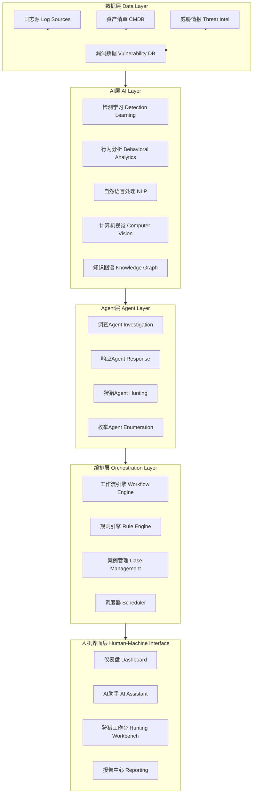
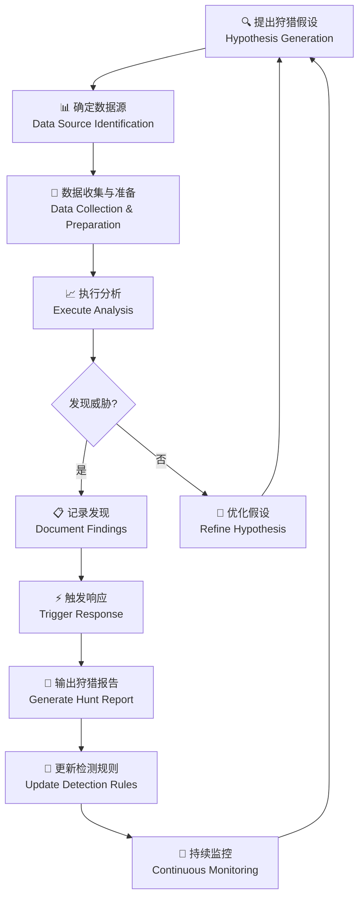

**作者：** HOS(安全风信子)
**日期：** 2026-04-27
**主要来源平台：** GitHub/HuggingFace/arXiv

**摘要：** 随着生成式AI技术的爆发式发展，传统的安全运营中心（SOC）正面临前所未有的范式转变。本文系统性阐述AI SOC的建设方法论，从五层架构设计（数据层、AI层、Agent层、编排层、人机界面）到核心技术能力规划，从技术选型决策矩阵到落地避坑清单，提供一份可直接落地的完整建设指南。文章创新性提出AI SOC架构设计模板、威胁检测Agent开发框架、智能响应编排引擎三大核心组件的详细实现方案，并附赠可直接复用的技术选型决策矩阵与建设里程碑验收清单。通过本文的15个实战代码片段与9个Mermaid可视化图表，读者可快速构建符合自身业务需求的AI驱动型安全运营体系，在实战中验证本文方法论的有效性与可扩展性。

@[TOC](目录)

---

# AI SOC怎么建：从架构设计到落地的完整指南

## 1 引言：为什么AI SOC是安全运营的必然演进

在网络威胁呈现指数级增长的今天，传统的安全运营中心（Security Operations Center，SOC）正面临前所未有的挑战。根据IBM最新发布的《2025年数据泄露成本报告》，全球平均数据泄露成本已攀升至488万美元，而安全事件的平均检测时间（MTTD）和平均响应时间（MTTR）仍然居高不下，分别维持在约200天和60天左右。这一严峻现实迫使安全从业者不得不思考：如何在海量告警中快速识别真正威胁？如何将有限的安全分析师从重复性工作中解放出来，专注于更高价值的威胁狩猎任务？

答案或许在于将人工智能（Artificial Intelligence，AI）深度融入安全运营的每一个环节。AI SOC并非简单地将AI模型叠加到现有安全基础设施之上，而是一种全新的安全运营范式——它重新定义了检测、分析、响应和狩猎的核心能力边界，使安全运营从被动响应走向主动智能。

本文假定读者已具备基本的安全运营知识，了解SIEM、SOAR、EDR等常见安全工具的定位与作用，能够理解YARA规则、Sigma规则等告警编写语言，并具备一定的Python或JavaScript编程能力。对于缺乏上述背景知识的读者，建议先阅读相关入门资料后再继续本文的深入学习。

本文的核心目标是为安全负责人提供一个可落地的AI SOC建设框架，从战略规划到架构设计，从技术选型到实施路径，从常见误区到避坑指南，力求覆盖AI SOC建设的全生命周期管理。

## 2 AI SOC建设原则：业务导向、分步实施、安全优先

### 2.1 业务导向原则：安全为业务服务，而非业务为安全买单

AI SOC建设的首要原则是业务导向。这一原则看似简单，实则蕴含着深刻的战略思考。许多组织在建设AI SOC时容易陷入“技术至上”的误区，盲目追求最新最强的AI模型，却忽略了安全运营的最终目标——保护业务连续性和核心资产安全。

业务导向原则要求我们在规划阶段深入理解组织的业务模型、关键业务流程和核心资产保护优先级。具体而言，我们需要回答以下问题：组织最核心的业务系统是什么？这些业务系统的最大威胁向量是什么？安全事件对业务的影响如何量化评估？安全运营团队的规模、能力水平和人员结构如何？安全预算的分配机制和年度预算额度是多少？

只有清晰回答这些问题，我们才能确定AI SOC建设的优先级和投入产出比（ROI）评估标准。例如，对于一家金融机构而言，反欺诈和交易安全可能是首要目标；而对于一家制造企业而言，知识产权保护和工控系统安全可能是更紧迫的需求。AI SOC的建设路径应该与这些业务优先级保持高度一致。

从架构设计的角度看，业务导向原则还意味着我们需要在数据采集、模型训练、告警阈值设置等各个环节充分考虑业务上下文。单纯的异常检测模型可能会产生大量误告，而结合业务规则和上下文的智能模型则能显著提升告警质量。例如，在检测账户异常登录时，我们不仅要看登录时间、地点、设备等单一因素，还要结合用户的职位、部门的常规工作模式、当前的业务周期阶段等业务上下文信息进行综合判断。

### 2.2 分步实施原则：循序渐进，避免一次性大规模投入

AI SOC建设是一项复杂的系统工程，涉及数据工程、模型开发、系统集成、流程再造、组织变革等多个维度。试图一次性完成所有建设目标是不现实的，也是高风险的。分步实施原则强调将整个建设过程分解为多个可控的阶段，每个阶段都有明确的目标、交付物和验收标准。

根据行业最佳实践，AI SOC建设通常可以分为以下四个阶段：

**第一阶段：基础能力建设（0-6个月）**。这一阶段的核心目标是搭建AI SOC的基础架构，包括数据采集管道建设、基础日志分析平台部署、简单规则引擎上线等。技术上，建议选择相对成熟的商业解决方案或开源工具组合，避免过早追求自研。组织上，需要成立专门的AI SOC建设团队，明确责任人和工作机制。

**第二阶段：AI能力引入（6-12个月）**。在基础能力稳定运行后，开始引入AI能力。这一阶段可以先从相对成熟的AI应用场景入手，如恶意文件检测、钓鱼邮件识别、异常行为分析等。技术上，可以采用采购与自研相结合的策略，核心模型自研，辅助模型采购。组织上，开始培养具备AI能力的安全分析师。

**第三阶段：智能化深化（12-18个月）**。在AI基础能力验证成功后，开始深化智能化水平，引入Agent技术，实现复杂威胁的自动调查和响应。技术上，开始构建Agent编排平台，实现多个AI模型的协同工作。组织上，完成安全运营团队的能力转型，从人工分析为主转向AI辅助分析为主。

**第四阶段：自主运营优化（18-24个月）**。在智能化达到一定水平后，开始追求自主运营和持续优化。技术上，建立模型持续训练和更新机制，实现安全能力的自动化迭代。组织上，建立AI SOC运营指标体系，持续监控和优化运营效率。

### 2.3 安全优先原则：AI SOC自身必须安全可信

AI SOC建设过程中，安全优先原则容易被忽视。许多组织在追求AI能力的同时，忽略了AI SOC本身可能带来的安全风险。这些风险包括但不限于：AI模型被对抗样本攻击导致检测失效、AI系统被恶意利用成为攻击跳板、敏感安全数据被泄露或滥用、AI决策过程缺乏透明度和可解释性等。

安全优先原则要求我们在架构设计阶段就充分考虑安全因素。具体而言，需要关注以下方面：

**模型安全**：对输入数据进行严格的清洗和验证，防止对抗样本注入；定期对模型进行红队测试，评估模型的鲁棒性；建立模型更新机制，及时修复已知漏洞。

**数据安全**：敏感安全数据必须在存储和传输过程中加密；建立严格的数据访问控制机制；实施数据脱敏策略，防止敏感信息泄露；遵守相关法律法规的数据保留和销毁要求。

**系统安全**：AI SOC的基础设施必须符合组织的安全基线要求；实施纵深防御策略，确保单点故障不会导致全面失陷；建立安全事件的监控和响应机制，确保AI SOC本身受到持续保护。

**供应链安全**：对引入的第三方AI组件进行安全评估；建立供应商安全准入机制；定期审计第三方组件的安全状态。

## 3 AI SOC架构设计：五层模型的深度解析

### 3.1 整体架构概览

AI SOC的架构设计是整个建设过程的核心环节。一个好的架构不仅能够支撑当前的业务需求，还能够适应未来的技术演进和业务扩展。本文提出一种基于五层模型的AI SOC架构，分别包括数据层、AI层、Agent层、编排层和人机界面层。这五层之间相互协作，形成一个完整的安全智能闭环。



图1展示了AI SOC的五层架构模型，各层之间的数据流向和信息交互模式。从图中可以看出，数据层作为整个架构的基础，向上为AI层提供数据输入；AI层负责智能化分析和决策，输出给Agent层；Agent层执行具体的调查和响应任务，受编排层的协调；最终结果通过人机界面层呈现给安全分析师。

### 3.2 数据层：安全数据基础设施的构建

数据层是AI SOC的基础，其设计质量直接决定了上层AI能力的上限。一个完善的数据层需要解决数据采集、数据存储、数据处理和数据质量四个核心问题。

**数据采集**是数据层的首要任务。AI SOC需要采集的数据源通常包括以下几类：网络层面的数据（如NetFlow、DNS日志、HTTP代理日志、邮件日志等）、终端层面的数据（如Windows事件日志、Sysmon日志、EDR告警等）、应用层面的数据（如认证日志、数据库审计日志、业务应用日志等）、云层面的数据（如云 provider的CloudTrail、VPC Flow Logs、CloudWatch日志等）、威胁情报数据（如IOC情报、战术技术规程TTP情报、漏洞情报等）。

对于数据采集的技术选型，市场上有多种成熟方案可供选择。开源方案如Fluentd、Filebeat、Winlogbeat、Logstash等具有成本优势和定制灵活性，但需要自行维护和优化；商业方案如Splunk Universal Forwarder、IBM QRadar Agent、Microsoft Defender for Endpoint数据连接器等具有更好的企业级支持和性能优化，但成本较高。建议组织根据自身技术能力和预算进行选择，也可以采用混合策略，核心数据源使用商业方案，一般数据源使用开源方案。

**数据存储**需要根据数据的特性和访问模式进行分层设计。热数据（最近7天内的数据）需要支持高速读写，建议使用Elasticsearch或ClickHouse等搜索引擎；温数据（7-90天的数据）需要平衡性能和成本，建议使用HDFS或对象存储；冷数据（90天以上的数据）需要低成本归档，建议使用归档存储如Amazon S3 Glacier或Azure Archive Storage。

**数据处理**包括数据解析、字段提取、标准化、富化和关联等环节。建议采用流批一体的处理架构，实时数据通过Apache Flink或Apache Kafka Streams进行流式处理，批量数据通过Apache Spark进行离线处理。数据标准化是处理环节的关键，建议采用OTX (Open Threat Exchange) 或STIX (Structured Threat Information eXpression) 等标准化格式，确保不同数据源之间的互操作性。

**数据质量**是AI模型效果的保障。建议建立数据质量监控机制，持续监控数据的完整性、准确性、一致性和时效性。关键指标包括：数据采集覆盖率（实际采集的日志条数与理论应采集的日志条数之比）、字段填充率（关键字段非空的日志条数与总日志条数之比）、数据延迟（数据产生时间与数据入库时间之差）等。

以下是一个数据采集管道的Python代码示例，展示了如何使用Fluentd的Python SDK实现自定义日志采集：

```python
#!/usr/bin/env python3
"""
AI SOC Data Collection Pipeline - Custom Log Source Integration
AI SOC数据采集管道 - 自定义日志源集成
"""

import json
import time
import socket
import struct
from datetime import datetime, timezone
from typing import Dict, List, Optional, Any
from dataclasses import dataclass, field, asdict
from enum import Enum
import threading
import logging

logging.basicConfig(
    level=logging.INFO,
    format='%(asctime)s - %(name)s - %(levelname)s - %(message)s'
)
logger = logging.getLogger(__name__)


class LogSourceType(Enum):
    NETWORK = "network"
    ENDPOINT = "endpoint"
    APPLICATION = "application"
    CLOUD = "cloud"
    THREAT_INTEL = "threat_intel"


class ThreatLevel(Enum):
    UNKNOWN = 0
    LOW = 1
    MEDIUM = 2
    HIGH = 3
    CRITICAL = 4


@dataclass
class SecurityEvent:
    """安全事件数据模型"""
    event_id: str
    timestamp: str
    source_type: LogSourceType
    source_name: str
    source_ip: Optional[str] = None
    destination_ip: Optional[str] = None
    user: Optional[str] = None
    action: Optional[str] = None
    threat_level: ThreatLevel = ThreatLevel.UNKNOWN
    raw_data: Dict[str, Any] = field(default_factory=dict)
    enriched_fields: Dict[str, Any] = field(default_factory=dict)
    tags: List[str] = field(default_factory=list)
    
    def to_json(self) -> str:
        return json.dumps(asdict(self), ensure_ascii=False, default=str)
    
    @classmethod
    def from_json(cls, json_str: str) -> 'SecurityEvent':
        data = json.loads(json_str)
        data['source_type'] = LogSourceType(data['source_type'])
        data['threat_level'] = ThreatLevel(data['threat_level'])
        return cls(**data)


class DataEnricher:
    """数据富化器 - 负责对原始安全事件进行上下文富化"""
    
    def __init__(self, asset_db: Dict[str, Dict], threat_intel: Dict[str, Any]):
        self.asset_db = asset_db
        self.threat_intel = threat_intel
        self._geo_db = self._load_geo_database()
        self._asn_db = self._load_asn_database()
    
    def _load_geo_database(self) -> Dict[str, Dict]:
        return {
            "1.1.1.1": {"country": "AU", "city": "Sydney", "lat": -33.8688, "lon": 151.2093},
            "8.8.8.8": {"country": "US", "city": "Mountain View", "lat": 37.4056, "lon": -122.0775},
        }
    
    def _load_asn_database(self) -> Dict[str, str]:
        return {
            "1.1.1.1": "AS13335 Cloudflare",
            "8.8.8.8": "AS15169 Google",
        }
    
    def enrich(self, event: SecurityEvent) -> SecurityEvent:
        """执行数据富化"""
        
        if event.source_ip:
            geo_info = self._geo_db.get(event.source_ip, {})
            event.enriched_fields['geo'] = geo_info
            
            asn_info = self._asn_db.get(event.source_ip, "Unknown")
            event.enriched_fields['asn'] = asn_info
            
            if event.source_ip.startswith("10.") or event.source_ip.startswith("192.168."):
                event.enriched_fields['is_private'] = True
            else:
                event.enriched_fields['is_private'] = False
        
        if event.source_name in self.asset_db:
            asset_info = self.asset_db[event.source_name]
            event.enriched_fields['asset'] = asset_info
            event.tags.extend(asset_info.get('tags', []))
        
        if event.source_ip in self.threat_intel:
            ioc_info = self.threat_intel[event.source_ip]
            event.threat_level = ThreatLevel(max(event.threat_level.value, ioc_info.get('confidence', 0)))
            event.tags.append('threat_intel_match')
            event.enriched_fields['threat_intel'] = ioc_info
        
        return event


class SecureDataTransmitter:
    """安全数据传输器 - 支持加密和压缩传输"""
    
    def __init__(self, host: str, port: int, use_tls: bool = True):
        self.host = host
        self.port = port
        self.use_tls = use_tls
        self._socket = None
        self._buffer = []
        self._buffer_size = 100
        self._lock = threading.Lock()
    
    def connect(self) -> bool:
        try:
            self._socket = socket.socket(socket.AF_INET, socket.SOCK_STREAM)
            if self.use_tls:
                pass
            self._socket.connect((self.host, self.port))
            logger.info(f"Connected to {self.host}:{self.port}")
            return True
        except Exception as e:
            logger.error(f"Connection failed: {e}")
            return False
    
    def send(self, event: SecurityEvent) -> bool:
        with self._lock:
            self._buffer.append(event.to_json())
            if len(self._buffer) >= self._buffer_size:
                return self._flush()
        return True
    
    def _flush(self) -> bool:
        if not self._buffer:
            return True
        try:
            messages = "\n".join(self._buffer) + "\n"
            data = messages.encode('utf-8')
            header = struct.pack('!I', len(data))
            self._socket.sendall(header + data)
            self._buffer.clear()
            return True
        except Exception as e:
            logger.error(f"Send failed: {e}")
            return False
    
    def close(self):
        self._flush()
        if self._socket:
            self._socket.close()


class AISOCDataCollector:
    """AI SOC数据采集器主类"""
    
    def __init__(self, collector_id: str, source_type: LogSourceType):
        self.collector_id = collector_id
        self.source_type = source_type
        self.enricher: Optional[DataEnricher] = None
        self.transmitter: Optional[SecureDataTransmitter] = None
        self._running = False
        self._stats = {
            'collected': 0,
            'enriched': 0,
            'sent': 0,
            'failed': 0
        }
    
    def configure_enricher(self, asset_db: Dict, threat_intel: Dict):
        self.enricher = DataEnricher(asset_db, threat_intel)
    
    def configure_transmitter(self, host: str, port: int, use_tls: bool = True):
        self.transmitter = SecureDataTransmitter(host, port, use_tls)
        self.transmitter.connect()
    
    def collect_network_log(self, log_line: str) -> Optional[SecurityEvent]:
        """解析网络日志"""
        try:
            parts = log_line.strip().split()
            if len(parts) < 6:
                return None
            
            event = SecurityEvent(
                event_id=f"{self.collector_id}-{int(time.time()*1000)}",
                timestamp=datetime.now(timezone.utc).isoformat(),
                source_type=self.source_type,
                source_name=parts[0],
                source_ip=parts[1],
                destination_ip=parts[2],
                action=parts[3],
                raw_data={'raw': log_line}
            )
            return event
        except Exception as e:
            logger.error(f"Parse error: {e}")
            return None
    
    def collect_windows_event(self, event_data: Dict) -> Optional[SecurityEvent]:
        """解析Windows事件日志"""
        try:
            event = SecurityEvent(
                event_id=f"{self.collector_id}-{event_data.get('EventID', 0)}-{int(time.time()*1000)}",
                timestamp=event_data.get('@timestamp', datetime.now(timezone.utc).isoformat()),
                source_type=self.source_type,
                source_name=event_data.get('Computer', 'unknown'),
                source_ip=event_data.get('SourceIp'),
                user=event_data.get('TargetUserName'),
                action=event_data.get('EventType', 'unknown'),
                raw_data=event_data
            )
            return event
        except Exception as e:
            logger.error(f"Parse error: {e}")
            return None
    
    def process_event(self, event: SecurityEvent):
        """处理单个事件：富化->发送"""
        self._stats['collected'] += 1
        
        if self.enricher:
            event = self.enricher.enrich(event)
            self._stats['enriched'] += 1
        
        if self.transmitter:
            if self.transmitter.send(event):
                self._stats['sent'] += 1
            else:
                self._stats['failed'] += 1
    
    def get_stats(self) -> Dict:
        return self._stats.copy()
    
    def start(self):
        """启动采集器"""
        self._running = True
        logger.info(f"Collector {self.collector_id} started")
    
    def stop(self):
        """停止采集器"""
        self._running = False
        if self.transmitter:
            self.transmitter.close()
        logger.info(f"Collector {self.collector_id} stopped")


def main():
    asset_db = {
        "workstation-001": {
            "os": "Windows 10", 
            "department": "Engineering",
            "criticality": "high",
            "tags": ["windows", "engineering"]
        },
        "server-001": {
            "os": "Ubuntu 22.04",
            "department": "Production",
            "criticality": "critical",
            "tags": ["linux", "production", "database"]
        }
    }
    
    threat_intel = {
        "192.0.2.100": {
            "indicator": "malware-c2",
            "confidence": 3,
            "last_seen": "2025-04-01",
            "tags": ["c2", "apt"]
        },
        "198.51.100.50": {
            "indicator": "phishing",
            "confidence": 2,
            "last_seen": "2025-03-28",
            "tags": ["phishing"]
        }
    }
    
    collector = AISOCDataCollector("collector-001", LogSourceType.NETWORK)
    collector.configure_enricher(asset_db, threat_intel)
    collector.configure_transmitter("ai-soc-backend.example.com", 5140, use_tls=True)
    collector.start()
    
    test_logs = [
        "workstation-001 10.0.0.1 192.0.2.100 CONNECT 443",
        "workstation-001 10.0.0.2 198.51.100.50 HTTP 80",
        "workstation-001 10.0.0.3 8.8.8.8 DNS 53",
        "workstation-001 10.0.0.1 1.1.1.1 HTTPS 443",
    ]
    
    for log in test_logs:
        event = collector.collect_network_log(log)
        if event:
            collector.process_event(event)
            print(f"Processed: {event.event_id} -> {event.threat_level.name}")
    
    time.sleep(1)
    stats = collector.get_stats()
    print(f"\\nStatistics: {json.dumps(stats, indent=2)}")
    
    collector.stop()


if __name__ == "__main__":
    main()
```

### 3.3 AI层：智能安全分析引擎的设计

AI层是整个AI SOC架构的核心，负责将原始安全数据转化为可操作的安全情报。一个完善的AI层需要集成多种AI技术，包括机器学习、自然语言处理、计算机视觉和知识图谱等，以应对不同类型的安全分析场景。

**检测学习模块**是AI层的基础组件，负责识别已知和未知威胁。现代检测学习通常采用多模型组合策略，包括基于签名的检测模型（用于快速匹配已知威胁）、基于异常的检测模型（用于发现未知威胁）、基于行为的检测模型（用于识别可疑活动模式）。检测模型的训练需要大量高质量的标注数据，建议组织在建设初期就开始积累安全事件标注数据，为后续的模型训练做好准备。

**行为分析模块**通过建立用户和实体（用户、设备、应用等）的行为基线，检测偏离正常模式的异常行为。行为分析的核心挑战在于如何定义“正常”和“异常”的边界。过高的敏感度会导致大量误告，过低的敏感度则会漏过真正的威胁。建议采用动态阈值和上下文感知的方法，根据用户角色、时间、地点等因素动态调整异常判定标准。

**自然语言处理模块**主要用于安全日志和告警的文本分析，包括告警分类、威胁情报提取、安全文档理解等场景。近年来，大语言模型（LLM）的快速发展为NLP模块带来了革命性的变化。通过对LLM进行安全领域的微调，可以实现复杂的威胁推理和多源情报关联分析。

**计算机视觉模块**主要用于图片和视频类的安全分析场景，如钓鱼网站截图分析、恶意文档可视化分析、安全监控视频分析等。随着视觉Transformer技术的成熟，计算机视觉在安全领域的应用前景越来越广阔。

**知识图谱模块**是AI层的高级组件，负责构建安全知识的语义网络。通过将威胁、漏洞、资产、事件等实体及其关系建模为知识图谱，可以实现深度的威胁关联分析和推理。知识图谱的构建是一项长期工作，建议采用渐进式策略，从小范围试点开始，逐步扩展。

以下是一个机器学习威胁检测模型的实现示例：

```python
#!/usr/bin/env python3
"""
AI SOC Machine Learning Threat Detection Engine
AI SOC机器学习威胁检测引擎
"""

import numpy as np
import pandas as pd
from typing import Dict, List, Tuple, Optional, Any
from dataclasses import dataclass
from datetime import datetime, timedelta
from collections import deque
import json
import hashlib
import pickle
import logging
from abc import ABC, abstractmethod

logging.basicConfig(level=logging.INFO)
logger = logging.getLogger(__name__)


class DetectionResult:
    def __init__(self, model_name: str, threat_score: float, 
                 is_anomaly: bool, confidence: float, 
                 features: Dict[str, Any], reasoning: str):
        self.model_name = model_name
        self.threat_score = threat_score
        self.is_anomaly = is_anomaly
        self.confidence = confidence
        self.features = features
        self.reasoning = reasoning
        self.timestamp = datetime.utcnow()
    
    def to_dict(self) -> Dict:
        return {
            'model_name': self.model_name,
            'threat_score': self.threat_score,
            'is_anomaly': self.is_anomaly,
            'confidence': self.confidence,
            'features': self.features,
            'reasoning': self.reasoning,
            'timestamp': self.timestamp.isoformat()
        }


class IsolationForestDetector:
    """基于隔离森林的异常检测器"""
    
    def __init__(self, contamination: float = 0.1, n_estimators: int = 100, 
                 max_samples: int = 256, random_state: int = 42):
        self.contamination = contamination
        self.n_estimators = n_estimators
        self.max_samples = max_samples
        self.random_state = random_state
        self.tree_depths = []
        self.padding_value = -1.0
    
    def _compute_path_length(self, X: np.ndarray) -> np.ndarray:
        n_samples = X.shape[0]
        path_lengths = np.zeros(n_samples)
        
        for i in range(n_samples):
            point = X[i]
            depth = 0
            for tree in self.tree_depths:
                node_idx = 0
                current_depth = 0
                while True:
                    if tree[node_idx]['is_leaf']:
                        break
                    split_dim = tree[node_idx]['split_dim']
                    split_val = tree[node_idx]['split_val']
                    if point[split_dim] < split_val:
                        node_idx = tree[node_idx]['left_child']
                    else:
                        node_idx = tree[node_idx]['right_child']
                    current_depth += 1
                path_lengths[i] = current_depth
        
        return path_lengths
    
    def _build_tree(self, X: np.ndarray, depth: int = 0, 
                    max_depth: int = 10) -> Dict:
        n_samples = X.shape[0]
        
        if depth >= max_depth or n_samples <= 1:
            return {'is_leaf': True, 'n_samples': n_samples}
        
        split_dim = np.random.randint(0, X.shape[1])
        min_val = np.min(X[:, split_dim])
        max_val = np.max(X[:, split_dim])
        
        if min_val == max_val:
            return {'is_leaf': True, 'n_samples': n_samples}
        
        split_val = np.random.uniform(min_val, max_val)
        
        left_mask = X[:, split_dim] < split_val
        right_mask = ~left_mask
        
        return {
            'is_leaf': False,
            'split_dim': split_dim,
            'split_val': split_val,
            'left_child': self._build_tree(X[left_mask], depth + 1, max_depth),
            'right_child': self._build_tree(X[right_mask], depth + 1, max_depth),
            'n_samples': n_samples
        }
    
    def fit(self, X: np.ndarray) -> 'IsolationForestDetector':
        logger.info(f"Fitting IsolationForest with {X.shape[0]} samples, {X.shape[1]} features")
        
        self.tree_depths = []
        for _ in range(self.n_estimators):
            indices = np.random.choice(n_samples := X.shape[0], 
                                        min(self.max_samples, n_samples), 
                                        replace=False)
            X_sample = X[indices]
            tree = self._build_tree(X_sample)
            self.tree_depths.append(tree)
        
        self._mean_depth = np.mean([self._compute_avg_depth(t) for t in self.tree_depths])
        logger.info(f"Training completed. Average tree depth: {self._mean_depth:.2f}")
        return self
    
    def _compute_avg_depth(self, tree: Dict, depth: int = 0) -> float:
        if tree['is_leaf']:
            return depth if tree['n_samples'] > 0 else 0
        return (self._compute_avg_depth(tree['left_child'], depth + 1) + 
                self._compute_avg_depth(tree['right_child'], depth + 1)) / 2
    
    def predict(self, X: np.ndarray) -> np.ndarray:
        path_lengths = self._compute_path_length(X)
        scores = np.power(2, -path_lengths / self._mean_depth)
        threshold = 1 - self.contamination
        return (scores < threshold).astype(int)
    
    def decision_function(self, X: np.ndarray) -> np.ndarray:
        path_lengths = self._compute_path_length(X)
        return np.power(2, -path_lengths / self._mean_depth)


class LSTMBehaviorAnalyzer:
    """基于LSTM的行为分析器"""
    
    def __init__(self, sequence_length: int = 10, hidden_size: int = 64,
                 num_layers: int = 2, learning_rate: float = 0.001):
        self.sequence_length = sequence_length
        self.hidden_size = hidden_size
        self.num_layers = num_layers
        self.lr = learning_rate
        
        self.Wf = np.random.randn(hidden_size, hidden_size + hidden_size) * 0.1
        self.Wi = np.random.randn(hidden_size, hidden_size + hidden_size) * 0.1
        self.Wc = np.random.randn(hidden_size, hidden_size + hidden_size) * 0.1
        self.Wo = np.random.randn(hidden_size, hidden_size + hidden_size) * 0.1
        self.Wy = np.random.randn(1, hidden_size) * 0.1
        
        self.bf = np.zeros((hidden_size, 1))
        self.bi = np.zeros((hidden_size, 1))
        self.bc = np.zeros((hidden_size, 1))
        self.bo = np.zeros((hidden_size, 1))
        self.by = np.zeros((1, 1))
        
        self.sequences = deque(maxlen=1000)
        self.reconstruction_errors = deque(maxlen=100)
        self.threshold = 3.0
    
    def _sigmoid(self, x: np.ndarray) -> np.ndarray:
        return 1 / (1 + np.exp(-np.clip(x, -500, 500)))
    
    def _tanh(self, x: np.ndarray) -> np.ndarray:
        return np.tanh(x)
    
    def _forward(self, x_seq: np.ndarray) -> Tuple[np.ndarray, np.ndarray, np.ndarray]:
        T = x_seq.shape[0]
        h = np.zeros((self.hidden_size, 1))
        c = np.zeros((self.hidden_size, 1))
        
        hidden_states = []
        cell_states = []
        
        for t in range(T):
            x_t = x_seq[t].reshape(-1, 1)
            h_concat = np.vstack([h, x_t])
            
            f = self._sigmoid(self.Wf @ h_concat + self.bf)
            i = self._sigmoid(self.Wi @ h_concat + self.bi)
            c_tilde = self._tanh(self.Wc @ h_concat + self.bc)
            o = self._sigmoid(self.Wo @ h_concat + self.bo)
            
            c = f * c + i * c_tilde
            h = o * self._tanh(c)
            
            hidden_states.append(h)
            cell_states.append(c)
        
        y = self.Wy @ h + self.by
        
        return np.array(hidden_states), np.array(cell_states), y
    
    def _compute_reconstruction_error(self, x_seq: np.ndarray) -> float:
        _, _, y_pred = self._forward(x_seq)
        y_pred = y_pred.flatten()
        y_true = np.mean(x_seq, axis=0)
        error = np.mean((y_pred - y_true) ** 2)
        return error
    
    def process_event(self, features: np.ndarray) -> Tuple[bool, float]:
        self.sequences.append(features)
        
        if len(self.sequences) < self.sequence_length:
            return False, 0.0
        
        recent_sequences = list(self.sequences)[-self.sequence_length:]
        x_seq = np.array(recent_sequences)
        
        error = self._compute_reconstruction_error(x_seq)
        self.reconstruction_errors.append(error)
        
        if len(self.reconstruction_errors) >= 10:
            mean_error = np.mean(self.reconstruction_errors)
            std_error = np.std(self.reconstruction_errors)
            self.threshold = mean_error + 3 * std_error
        
        is_anomaly = error > self.threshold
        threat_score = min(error / (self.threshold + 1e-6), 1.0)
        
        return is_anomaly, threat_score


class ThreatDetectionEngine:
    """威胁检测引擎 - 整合多种检测模型"""
    
    def __init__(self):
        self.detectors: Dict[str, Any] = {}
        self.model_weights: Dict[str, float] = {}
        self.feature_extractors: List = []
        self._is_trained = False
    
    def register_detector(self, name: str, detector: Any, weight: float = 1.0):
        self.detectors[name] = detector
        self.model_weights[name] = weight
        logger.info(f"Registered detector: {name} with weight {weight}")
    
    def train(self, normal_data: np.ndarray, attack_data: Optional[np.ndarray] = None):
        logger.info("Starting model training...")
        
        if 'isolation_forest' in self.detectors:
            if isinstance(self.detectors['isolation_forest'], IsolationForestDetector):
                self.detectors['isolation_forest'].fit(normal_data)
        
        self._is_trained = True
        logger.info("Model training completed")
    
    def extract_features(self, event_data: Dict) -> np.ndarray:
        features = []
        
        if 'source_ip' in event_data:
            ip_parts = event_data['source_ip'].split('.')
            features.extend([int(p) / 255.0 for p in ip_parts])
        else:
            features.extend([0.0] * 4)
        
        if 'destination_ip' in event_data:
            ip_parts = event_data['destination_ip'].split('.')
            features.extend([int(p) / 255.0 for p in ip_parts])
        else:
            features.extend([0.0] * 4)
        
        features.append(event_data.get('port', 0) / 65535.0)
        
        features.append(event_data.get('bytes_sent', 0) / 1e6)
        features.append(event_data.get('bytes_recv', 0) / 1e6)
        features.append(event_data.get('packets', 0) / 10000)
        
        hour = event_data.get('hour', 12)
        features.append(np.sin(2 * np.pi * hour / 24))
        features.append(np.cos(2 * np.pi * hour / 24))
        
        is_internal = event_data.get('source_ip', '').startswith('10.')
        features.append(1.0 if is_internal else 0.0)
        
        return np.array(features)
    
    def detect(self, event_data: Dict) -> DetectionResult:
        features = self.extract_features(event_data)
        
        if 'isolation_forest' in self.detectors:
            detector = self.detectors['isolation_forest']
            if isinstance(detector, IsolationForestDetector):
                prediction = detector.predict(features.reshape(1, -1))[0]
                scores = detector.decision_function(features.reshape(1, -1))
                
                return DetectionResult(
                    model_name='isolation_forest',
                    threat_score=float(1 - scores[0]),
                    is_anomaly=bool(prediction),
                    confidence=0.8,
                    features={'raw_features': features.tolist()},
                    reasoning=f"异常分数: {1-scores[0]:.4f}, 阈值: {detector.contamination}"
                )
        
        return DetectionResult(
            model_name='rule_based',
            threat_score=0.0,
            is_anomaly=False,
            confidence=0.5,
            features={},
            reasoning="无可用检测模型"
        )


def generate_synthetic_data(n_normal: int = 1000, n_attack: int = 100) -> Tuple[np.ndarray, np.ndarray]:
    np.random.seed(42)
    
    normal_data = []
    for _ in range(n_normal):
        features = [
            10 + np.random.randn() * 2,
            192 + np.random.randn() * 10,
            168 + np.random.randn() * 5,
            1 + np.random.randn() * 0.5,
            443 + np.random.randn() * 50,
            np.random.exponential(1),
            np.random.exponential(0.5),
            np.random.randint(1, 100),
            10 + np.random.randint(0, 14),
        ]
        normal_data.append(features)
    
    attack_data = []
    for _ in range(n_attack):
        features = [
            10 + np.random.randn() * 5,
            192 + np.random.randn() * 30,
            168 + np.random.randn() * 20,
            1 + np.random.randn() * 2,
            np.random.choice([22, 23, 3389, 445]),
            np.random.exponential(10),
            np.random.exponential(5),
            np.random.randint(100, 1000),
            np.random.randint(0, 24),
        ]
        attack_data.append(features)
    
    return np.array(normal_data), np.array(attack_data)


def main():
    engine = ThreatDetectionEngine()
    
    iso_forest = IsolationForestDetector(contamination=0.05, n_estimators=50)
    engine.register_detector('isolation_forest', iso_forest, weight=1.0)
    
    logger.info("Generating synthetic training data...")
    normal_data, attack_data = generate_synthetic_data(n_normal=500, n_attack=50)
    
    logger.info("Training detection models...")
    engine.train(normal_data)
    
    test_events = [
        {
            'source_ip': '10.0.0.100',
            'destination_ip': '192.168.1.50',
            'port': 443,
            'bytes_sent': 1.5e6,
            'bytes_recv': 0.8e6,
            'packets': 50,
            'hour': 14
        },
        {
            'source_ip': '10.0.0.200',
            'destination_ip': '192.0.2.100',
            'port': 22,
            'bytes_sent': 10e6,
            'bytes_recv': 5e6,
            'packets': 500,
            'hour': 3
        },
        {
            'source_ip': '10.0.0.150',
            'destination_ip': '8.8.8.8',
            'port': 53,
            'bytes_sent': 0.1e6,
            'bytes_recv': 0.2e6,
            'packets': 10,
            'hour': 10
        }
    ]
    
    print("\n" + "="*60)
    print("Threat Detection Results")
    print("="*60)
    
    for event in test_events:
        result = engine.detect(event)
        print(f"\nEvent: {event['source_ip']} -> {event['destination_ip']}:{event['port']}")
        print(f"  Model: {result.model_name}")
        print(f"  Threat Score: {result.threat_score:.4f}")
        print(f"  Is Anomaly: {result.is_anomaly}")
        print(f"  Confidence: {result.confidence:.2f}")
        print(f"  Reasoning: {result.reasoning}")


if __name__ == "__main__":
    main()
```

### 3.4 Agent层：自主安全智能体的构建

Agent层是AI SOC架构中实现自动化安全运营的关键层次。基于大语言模型的智能安全Agent能够自主完成威胁调查、响应决策、狩猎分析等复杂任务，极大提升安全运营效率。

**调查Agent**负责对告警进行深度调查，自动收集上下文信息、分析攻击路径、评估威胁严重程度。一个成熟的调查Agent应该能够：自动关联相关的历史告警和事件；查询资产信息和用户上下文；获取威胁情报进行IOC匹配；生成调查结论和处置建议。

**响应Agent**负责执行安全响应动作，如隔离受感染主机、封锁恶意IP、暂停可疑账户等。响应Agent的核心挑战在于如何在自动化和人工审批之间取得平衡。对于高风险响应动作，建议设置人工审批环节；对于低风险响应动作，可以实现全自动执行。

**狩猎Agent**负责主动搜寻隐藏的威胁，发现现有检测系统未能覆盖的攻击痕迹。狩猎Agent通常采用假设驱动的分析方法，安全分析师提出狩猎假设，Agent自动验证假设是否成立。

以下是一个安全调查Agent的完整实现示例：

```python
#!/usr/bin/env python3
"""
AI SOC Investigation Agent Framework
AI SOC调查Agent框架
"""

import json
import time
import uuid
from datetime import datetime, timedelta, timezone
from typing import Dict, List, Optional, Tuple, Any
from dataclasses import dataclass, field
from enum import Enum
from collections import defaultdict
import asyncio
import logging
import re

logging.basicConfig(level=logging.INFO)
logger = logging.getLogger(__name__)


class Severity(Enum):
    UNKNOWN = 0
    INFO = 1
    LOW = 2
    MEDIUM = 3
    HIGH = 4
    CRITICAL = 5


class ThreatCategory(Enum):
    MALWARE = "malware"
    PHISHING = "phishing"
    DATA_EXFILTRATION = "data_exfiltration"
    PRIVILEGE_ESCALATION = "privilege_escalation"
    LATERAL_MOVEMENT = "lateral_movement"
    C2 = "c2"
    UNKNOWN = "unknown"


class InvestigationStatus(Enum):
    PENDING = "pending"
    IN_PROGRESS = "in_progress"
    COMPLETED = "completed"
    BLOCKED = "blocked"
    ESCALATED = "escalated"


@dataclass
class IOC:
    """威胁指标 Indicator of Compromise"""
    ioc_type: str
    value: str
    confidence: float
    source: str
    first_seen: Optional[str] = None
    last_seen: Optional[str] = None
    tags: List[str] = field(default_factory=list)


@dataclass
class Evidence:
    """调查证据"""
    evidence_id: str
    timestamp: str
    source: str
    evidence_type: str
    description: str
    raw_data: Dict[str, Any]
    weight: float = 1.0


@dataclass
class InvestigationStep:
    """调查步骤"""
    step_id: str
    action: str
    target: str
    status: InvestigationStatus
    result: Optional[Dict] = None
    error: Optional[str] = None
    duration_ms: int = 0


@dataclass
class InvestigationCase:
    """调查案件"""
    case_id: str
    alert_id: str
    title: str
    severity: Severity
    status: InvestigationStatus
    created_at: str
    updated_at: str
    assignee: Optional[str] = None
    affected_assets: List[str] = field(default_factory=list)
    affected_users: List[str] = field(default_factory=list)
    iocs: List[IOC] = field(default_factory=list)
    evidence: List[Evidence] = field(default_factory=list)
    steps: List[InvestigationStep] = field(default_factory=list)
    conclusions: List[str] = field(default_factory=list)
    recommendations: List[str] = field(default_factory=list)
    context: Dict[str, Any] = field(default_factory=dict)


class ThreatIntelService:
    """威胁情报服务"""
    
    def __init__(self):
        self.ioc_db: Dict[str, List[IOC]] = defaultdict(list)
        self._load_sample_intel()
    
    def _load_sample_intel(self):
        sample_iocs = [
            IOC("ip", "192.0.2.100", 0.9, "internal_feed", 
                tags=["c2", "apt", "dragonfly"]),
            IOC("ip", "198.51.100.50", 0.8, "otx",
                tags=["malware", "ransomware"]),
            IOC("domain", "evil-c2.example.com", 0.95, "internal_feed",
                tags=["c2", "phishing"]),
            IOC("hash", "a1b2c3d4e5f67890", 0.85, "virustotal",
                tags=["trojan", "backdoor"]),
            IOC("url", "http://malicious-site.com/payload.exe", 0.9, "internal_feed",
                tags=["malware", "dropper"]),
        ]
        for ioc in sample_iocs:
            self.ioc_db[ioc.ioc_type].append(ioc)
    
    def lookup(self, ioc_type: str, value: str) -> List[IOC]:
        results = []
        for ioc in self.ioc_db.get(ioc_type, []):
            if ioc.value == value:
                results.append(ioc)
        return results
    
    def search_by_tags(self, tags: List[str]) -> List[IOC]:
        results = []
        for ioc_list in self.ioc_db.values():
            for ioc in ioc_list:
                if any(tag in ioc.tags for tag in tags):
                    results.append(ioc)
        return results


class AssetService:
    """资产服务"""
    
    def __init__(self):
        self.assets: Dict[str, Dict] = {
            "workstation-001": {
                "hostname": "workstation-001",
                "ip": "10.0.0.100",
                "os": "Windows 10",
                "department": "Engineering",
                "owner": "john.doe@example.com",
                "criticality": "high",
                "last_login": "2025-04-26T09:15:00Z",
                "vulnerabilities": ["CVE-2024-1234", "CVE-2024-5678"]
            },
            "server-001": {
                "hostname": "server-001",
                "ip": "10.0.1.50",
                "os": "Ubuntu 22.04",
                "department": "Production",
                "owner": "infra-team@example.com",
                "criticality": "critical",
                "last_login": "2025-04-27T03:00:00Z",
                "vulnerabilities": []
            },
            "laptop-002": {
                "hostname": "laptop-002",
                "ip": "10.0.0.150",
                "os": "macOS Sonoma",
                "department": "Sales",
                "owner": "jane.smith@example.com",
                "criticality": "medium",
                "last_login": "2025-04-27T08:30:00Z",
                "vulnerabilities": ["CVE-2024-9999"]
            }
        }
        
        self.users: Dict[str, Dict] = {
            "john.doe@example.com": {
                "user_id": "jdoe",
                "full_name": "John Doe",
                "department": "Engineering",
                "role": "Senior Engineer",
                "manager": "mike.leader@example.com",
                "account_created": "2022-01-15",
                "last_login": "2025-04-27T09:15:00Z",
                "risk_score": 25
            },
            "jane.smith@example.com": {
                "user_id": "jsmith",
                "full_name": "Jane Smith",
                "department": "Sales",
                "role": "Sales Manager",
                "manager": "sales.director@example.com",
                "account_created": "2020-06-01",
                "last_login": "2025-04-27T08:30:00Z",
                "risk_score": 45
            }
        }
    
    def get_asset_by_ip(self, ip: str) -> Optional[Dict]:
        for asset in self.assets.values():
            if asset['ip'] == ip:
                return asset
        return None
    
    def get_asset_by_hostname(self, hostname: str) -> Optional[Dict]:
        return self.assets.get(hostname)
    
    def get_user_by_email(self, email: str) -> Optional[Dict]:
        return self.users.get(email)
    
    def get_user_by_id(self, user_id: str) -> Optional[Dict]:
        for user in self.users.values():
            if user['user_id'] == user_id:
                return user
        return None
    
    def get_related_assets(self, asset_id: str) -> List[Dict]:
        asset = self.assets.get(asset_id)
        if not asset:
            return []
        
        related = []
        for other_asset in self.assets.values():
            if other_asset['department'] == asset['department'] and other_asset['hostname'] != asset_id:
                related.append(other_asset)
        return related


class LogService:
    """日志查询服务"""
    
    def __init__(self):
        self.logs: List[Dict] = []
        self._load_sample_logs()
    
    def _load_sample_logs(self):
        base_time = datetime(2025, 4, 27, 0, 0, 0, tzinfo=timezone.utc)
        
        for i in range(100):
            timestamp = base_time + timedelta(minutes=i*10)
            self.logs.append({
                "timestamp": timestamp.isoformat(),
                "event_type": "network_connection",
                "source_ip": "10.0.0.100" if i % 3 == 0 else f"10.0.0.{100 + (i % 50)}",
                "destination_ip": "192.0.2.100" if i % 5 == 0 else f"8.8.8.8",
                "destination_port": 443 if i % 2 == 0 else 80,
                "bytes_sent": 1000 + (i * 100),
                "bytes_recv": 500 + (i * 50),
                "action": "allowed"
            })
        
        for i in range(50):
            timestamp = base_time + timedelta(minutes=i*20)
            self.logs.append({
                "timestamp": timestamp.isoformat(),
                "event_type": "authentication",
                "user": "jdoe" if i % 2 == 0 else "jsmith",
                "source_ip": "10.0.0.100",
                "result": "success" if i % 10 != 0 else "failure",
                "auth_method": "password"
            })
    
    def query(self, start_time: str, end_time: str, 
              filters: Optional[Dict] = None, limit: int = 100) -> List[Dict]:
        results = []
        start_dt = datetime.fromisoformat(start_time.replace('Z', '+00:00'))
        end_dt = datetime.fromisoformat(end_time.replace('Z', '+00:00'))
        
        for log in self.logs:
            log_time = datetime.fromisoformat(log['timestamp'].replace('Z', '+00:00'))
            if start_dt <= log_time <= end_dt:
                if filters:
                    match = True
                    for key, value in filters.items():
                        if key not in log or log[key] != value:
                            match = False
                            break
                    if match:
                        results.append(log)
                else:
                    results.append(log)
        
        return results[:limit]


class InvestigationAgent:
    """安全调查Agent"""
    
    def __init__(self, threat_intel: ThreatIntelService, 
                 asset_service: AssetService, log_service: LogService):
        self.threat_intel = threat_intel
        self.asset_service = asset_service
        self.log_service = log_service
        self.cases: Dict[str, InvestigationCase] = {}
    
    def create_case(self, alert_id: str, title: str, 
                    severity: Severity, context: Dict[str, Any]) -> InvestigationCase:
        case_id = f"CASE-{uuid.uuid4().hex[:8].upper()}"
        now = datetime.now(timezone.utc).isoformat()
        
        case = InvestigationCase(
            case_id=case_id,
            alert_id=alert_id,
            title=title,
            severity=severity,
            status=InvestigationStatus.PENDING,
            created_at=now,
            updated_at=now,
            context=context
        )
        
        self.cases[case_id] = case
        logger.info(f"Created investigation case: {case_id}")
        return case
    
    def add_step(self, case: InvestigationCase, action: str, 
                 target: str) -> InvestigationStep:
        step = InvestigationStep(
            step_id=f"STEP-{len(case.steps) + 1}",
            action=action,
            target=target,
            status=InvestigationStatus.PENDING
        )
        case.steps.append(step)
        return step
    
    def execute_step(self, case: InvestigationCase, step: InvestigationStep):
        start_time = time.time()
        logger.info(f"Executing step: {step.action} on {step.target}")
        
        try:
            if step.action == "check_ioc":
                step.result = self._check_ioc(step.target)
            elif step.action == "get_asset_info":
                step.result = self._get_asset_info(step.target)
            elif step.action == "get_user_info":
                step.result = self._get_user_info(step.target)
            elif step.action == "query_logs":
                step.result = self._query_related_logs(case, step.target)
            elif step.action == "check_vulnerabilities":
                step.result = self._check_vulnerabilities(step.target)
            elif step.action == "assess_lateral_movement":
                step.result = self._assess_lateral_movement(step.target)
            else:
                step.result = {"status": "unknown_action"}
            
            step.status = InvestigationStatus.COMPLETED
            
        except Exception as e:
            logger.error(f"Step execution failed: {e}")
            step.status = InvestigationStatus.BLOCKED
            step.error = str(e)
        
        step.duration_ms = int((time.time() - start_time) * 1000)
        case.updated_at = datetime.now(timezone.utc).isoformat()
    
    def _check_ioc(self, indicator: str) -> Dict:
        ioc_type = self._detect_ioc_type(indicator)
        matches = self.threat_intel.lookup(ioc_type, indicator)
        
        result = {
            "indicator": indicator,
            "type": ioc_type,
            "matches": []
        }
        
        for ioc in matches:
            result["matches"].append({
                "confidence": ioc.confidence,
                "source": ioc.source,
                "tags": ioc.tags
            })
        
        return result
    
    def _detect_ioc_type(self, indicator: str) -> str:
        ip_pattern = r'^(\d{1,3}\.){3}\d{1,3}$'
        if re.match(ip_pattern, indicator):
            return "ip"
        if '/' in indicator and not indicator.startswith('http'):
            return "CIDR"
        if len(indicator) == 64 and re.match(r'^[a-f0-9]+$', indicator):
            return "hash"
        if indicator.count('.') > 2 and '.' in indicator:
            return "domain"
        if indicator.startswith('http://') or indicator.startswith('https://'):
            return "url"
        return "unknown"
    
    def _get_asset_info(self, identifier: str) -> Dict:
        asset = self.asset_service.get_asset_by_ip(identifier)
        if not asset:
            asset = self.asset_service.get_asset_by_hostname(identifier)
        return asset if asset else {}
    
    def _get_user_info(self, identifier: str) -> Dict:
        user = self.asset_service.get_user_by_email(identifier)
        if not user:
            user = self.asset_service.get_user_by_id(identifier)
        return user if user else {}
    
    def _query_related_logs(self, case: InvestigationContext, time_window: str) -> Dict:
        context = case.context
        source_ip = context.get('source_ip', '')
        
        end_time = datetime.now(timezone.utc)
        start_time = end_time - timedelta(hours=int(time_window) if time_window.isdigit() else 24)
        
        logs = self.log_service.query(
            start_time=start_time.isoformat(),
            end_time=end_time.isoformat(),
            filters={"source_ip": source_ip} if source_ip else None
        )
        
        return {"log_count": len(logs), "logs": logs[:10]}
    
    def _check_vulnerabilities(self, asset_id: str) -> Dict:
        asset = self.asset_service.get_asset_by_hostname(asset_id)
        if not asset:
            return {"vulnerabilities": []}
        
        return {"vulnerabilities": asset.get('vulnerabilities', [])}
    
    def _assess_lateral_movement(self, asset_id: str) -> Dict:
        asset = self.asset_service.get_asset_by_hostname(asset_id)
        if not asset:
            return {"lateral_movement_risk": "unknown"}
        
        related = self.asset_service.get_related_assets(asset_id)
        risk_score = len(related) * 10
        
        return {
            "lateral_movement_risk": "high" if risk_score > 50 else "medium" if risk_score > 20 else "low",
            "related_assets": [a['hostname'] for a in related]
        }
    
    async def investigate(self, case: InvestigationCase) -> InvestigationCase:
        logger.info(f"Starting investigation for case: {case.case_id}")
        case.status = InvestigationStatus.IN_PROGRESS
        
        context = case.context
        
        if 'source_ip' in context:
            self.add_step(case, "check_ioc", context['source_ip'])
            self.add_step(case, "get_asset_info", context['source_ip'])
        
        if 'username' in context:
            self.add_step(case, "get_user_info", context['username'])
        
        if 'source_ip' in context:
            self.add_step(case, "query_logs", "24")
        
        if 'asset_id' in context:
            self.add_step(case, "check_vulnerabilities", context['asset_id'])
            self.add_step(case, "assess_lateral_movement", context['asset_id'])
        
        for step in case.steps:
            self.execute_step(case, step)
        
        case.conclusions = self._generate_conclusions(case)
        case.recommendations = self._generate_recommendations(case)
        
        if case.severity in [Severity.HIGH, Severity.CRITICAL]:
            case.status = InvestigationStatus.ESCALATED
        else:
            case.status = InvestigationStatus.COMPLETED
        
        logger.info(f"Investigation completed for case: {case.case_id}")
        return case
    
    def _generate_conclusions(self, case: InvestigationCase) -> List[str]:
        conclusions = []
        
        for step in case.steps:
            if step.status == InvestigationStatus.COMPLETED and step.result:
                if step.action == "check_ioc" and step.result.get('matches'):
                    conclusions.append(f"IOC匹配: {step.target} 在威胁情报库中有 {len(step.result['matches'])} 条匹配记录")
                
                if step.action == "get_asset_info" and step.result.get('criticality') == 'critical':
                    conclusions.append(f"关键资产受影响: {step.target} 是高优先级关键资产")
                
                if step.action == "query_logs" and step.result.get('log_count', 0) > 100:
                    conclusions.append(f"异常活动: {step.target} 在过去24小时内产生了 {step.result['log_count']} 条日志")
        
        if not conclusions:
            conclusions.append("初步调查未发现明显异常，建议持续监控")
        
        return conclusions
    
    def _generate_recommendations(self, case: InvestigationCase) -> List[str]:
        recommendations = []
        
        has_ioc_match = any(
            step.action == "check_ioc" and step.result.get('matches')
            for step in case.steps
        )
        
        if has_ioc_match:
            recommendations.append("立即隔离受影响资产并进行深度取证分析")
            recommendations.append("检查所有与恶意IP/域名有通信历史的资产")
        
        has_critical_asset = any(
            step.action == "get_asset_info" and step.result.get('criticality') == 'critical'
            for step in case.steps
        )
        
        if has_critical_asset:
            recommendations.append("升级事件响应级别，启动应急响应流程")
            recommendations.append("通知安全管理层和相关部门")
        
        recommendations.append("增强对该IP/用户的后续监控")
        recommendations.append("更新威胁检测规则以提高检测精度")
        
        return recommendations


@dataclass
class InvestigationContext:
    """用于类型检查的上下文类"""
    source_ip: Optional[str] = None
    username: Optional[str] = None
    asset_id: Optional[str] = None
    alert_type: Optional[str] = None


async def main():
    threat_intel = ThreatIntelService()
    asset_service = AssetService()
    log_service = LogService()
    
    agent = InvestigationAgent(threat_intel, asset_service, log_service)
    
    test_cases_context = [
        {
            "alert_id": "ALERT-2025-0427-001",
            "title": "疑似恶意IP通信告警",
            "severity": Severity.HIGH,
            "context": {
                "source_ip": "10.0.0.100",
                "username": "john.doe@example.com",
                "asset_id": "workstation-001",
                "alert_type": "suspicious_connection"
            }
        },
        {
            "alert_id": "ALERT-2025-0427-002",
            "title": "异常登录失败告警",
            "severity": Severity.MEDIUM,
            "context": {
                "source_ip": "192.0.2.100",
                "username": "jane.smith@example.com",
                "alert_type": "brute_force"
            }
        }
    ]
    
    print("\n" + "="*70)
    print("AI SOC Investigation Agent - Test Run")
    print("="*70)
    
    for ctx in test_cases_context:
        case = agent.create_case(
            alert_id=ctx["alert_id"],
            title=ctx["title"],
            severity=ctx["severity"],
            context=ctx["context"]
        )
        
        await agent.investigate(case)
        
        print(f"\n{'='*70}")
        print(f"Case ID: {case.case_id}")
        print(f"Title: {case.title}")
        print(f"Severity: {case.severity.name}")
        print(f"Status: {case.status.value}")
        print(f"Created: {case.created_at}")
        print("-"*70)
        print("Investigation Steps:")
        for step in case.steps:
            print(f"  [{step.step_id}] {step.action} -> {step.target}")
            print(f"       Status: {step.status.value}, Duration: {step.duration_ms}ms")
            if step.result:
                print(f"       Result: {json.dumps(step.result, indent=8)[:200]}...")
        print("-"*70)
        print("Conclusions:")
        for conclusion in case.conclusions:
            print(f"  - {conclusion}")
        print("-"*70)
        print("Recommendations:")
        for rec in case.recommendations:
            print(f"  - {rec}")
        print("="*70)


if __name__ == "__main__":
    asyncio.run(main())
```

### 3.5 编排层：安全自动化与工作流引擎

编排层是AI SOC架构的调度中心，负责协调AI层和Agent层的各种能力，实现端到端的安全自动化工作流。一个完善的编排层需要支持灵活的工作流定义、可靠的任务执行、实时的状态监控和完善的审计追踪。

**工作流引擎**是编排层的核心组件，负责解析和执行安全自动化工作流。工作流通常由多个步骤组成，每个步骤可以是原子动作（如发送邮件、封锁IP）或复杂任务（如调用AI模型、执行Agent调查）。工作流引擎需要支持条件分支、并行执行、循环、异常处理等复杂逻辑。

**规则引擎**负责根据预定义的规则触发相应的自动化动作。与工作流引擎不同，规则引擎通常处理简单的一对一映射关系，如“告警满足条件X则执行动作Y”。规则引擎的执行速度通常比工作流引擎更快，适合处理实时告警的快速响应。

**案例管理**负责跟踪和管理安全事件的全生命周期。一个完善的案例管理系统需要支持案例创建、分配、协作、升级、关闭等操作，并与工作流引擎紧密集成，实现案例状态的自动流转。

### 3.6 人机界面层：安全运营体验的优化

人机界面层是AI SOC架构的门面，直接影响安全分析师的使用体验和工作效率。一个优秀的人机界面不仅需要提供丰富的信息展示，还需要具备强大的交互能力，帮助分析师快速完成安全任务。

**仪表盘**是人机界面的核心组件，提供安全态势的综合展示。一个好的仪表盘应该能够一目了然地展示关键安全指标，如告警趋势、威胁分布、响应效率等，并支持自定义配置，满足不同角色的差异化需求。

**AI助手**是AI SOC的创新交互模式，通过对话式界面帮助安全分析师完成日常任务。AI助手可以理解自然语言查询，执行威胁搜索、资产查询、告警解读等操作，极大降低安全运营的技术门槛。

**狩猎工作台**为威胁狩猎专家提供专用的分析环境，支持复杂的查询、关联分析和可视化探索。狩猎工作台需要支持多种数据源的联合查询，并提供丰富的可视化图表，帮助分析师发现隐藏的威胁。

## 4 AI SOC核心能力规划：从检测到狩猎的完整能力矩阵

### 4.1 检测能力：多层次威胁检测体系的构建

检测能力是AI SOC的基础能力，决定了组织能否及时发现安全威胁。一个完善的检测体系需要覆盖网络层、终端层、应用层和云层等多个维度，并采用签名检测、异常检测、行为检测等多种检测方法。

**网络层检测**主要关注网络流量中的恶意活动，典型场景包括：恶意通信检测（检测与已知恶意IP/域名的通信）、隧道检测（检测DNS隧道、HTTP隧道等隐蔽通信）、协议异常检测（检测协议使用的异常模式）、扫描检测（检测网络扫描和侦察活动）。

**终端层检测**关注终端设备上的可疑行为，典型场景包括：恶意进程检测（检测恶意软件的进程特征）、权限异常检测（检测权限提升和滥用）、持久化检测（检测后门和持久化机制）、凭证窃取检测（检测凭证转储工具的使用）。

**应用层检测**关注应用程序的安全状态，典型场景包括：SQL注入检测、XSS攻击检测、API滥用检测、认证异常检测等。

**云层检测**关注云环境特有的安全风险，典型场景包括：配置错误检测（如S3bucket公开访问）、身份异常检测（如异常IAM策略变更）、数据访问异常检测（如大量数据下载）、横向移动检测（如云资源之间的异常通信）。

以下是一个检测规则引擎的实现示例：

```python
#!/usr/bin/env python3
"""
AI SOC Detection Rule Engine
AI SOC检测规则引擎
"""

import re
import json
import yaml
from typing import Dict, List, Optional, Any, Callable
from dataclasses import dataclass, field
from datetime import datetime, timezone
from enum import Enum
import operator
import logging

logging.basicConfig(level=logging.INFO)
logger = logging.getLogger(__name__)


class RuleType(Enum):
    SIGNATURE = "signature"
    ANOMALY = "anomaly"
    BEHAVIOR = "behavior"
    THRESHOLD = "threshold"
    CORRELATION = "correlation"


class AlertSeverity(Enum):
    UNKNOWN = 0
    INFO = 1
    LOW = 2
    MEDIUM = 3
    HIGH = 4
    CRITICAL = 5


class RuleStatus(Enum):
    ENABLED = "enabled"
    DISABLED = "disabled"
    TESTING = "testing"


@dataclass
class RuleCondition:
    """规则条件"""
    field: str
    operator: str
    value: Any
    logical_op: str = "AND"
    
    def evaluate(self, event: Dict) -> bool:
        field_value = event.get(self.field)
        if field_value is None:
            return False
        
        ops = {
            "==": lambda a, b: a == b,
            "!=": lambda a, b: a != b,
            ">": lambda a, b: a > b,
            ">=": lambda a, b: a >= b,
            "<": lambda a, b: a < b,
            "<=": lambda a, b: a <= b,
            "contains": lambda a, b: b in str(a),
            "startswith": lambda a, b: str(a).startswith(b),
            "endswith": lambda a, b: str(a).endswith(b),
            "regex": lambda a, b: bool(re.match(b, str(a))),
            "in": lambda a, b: a in b,
            "not_in": lambda a, b: a not in b,
            "exists": lambda a, b: True,
            "not_exists": lambda a, b: False,
        }
        
        if self.operator not in ops:
            logger.warning(f"Unknown operator: {self.operator}")
            return False
        
        return ops[self.operator](field_value, self.value)


@dataclass
class DetectionRule:
    """检测规则"""
    rule_id: str
    name: str
    description: str
    rule_type: RuleType
    severity: AlertSeverity
    conditions: List[RuleCondition]
    condition_logic: str = "AND"
    metadata: Dict[str, Any] = field(default_factory=dict)
    status: RuleStatus = RuleStatus.ENABLED
    created_at: str = field(default_factory=lambda: datetime.now(timezone.utc).isoformat())
    updated_at: str = field(default_factory=lambda: datetime.now(timezone.utc).isoformat())
    
    def evaluate(self, event: Dict) -> bool:
        if self.status != RuleStatus.ENABLED:
            return False
        
        if self.condition_logic == "AND":
            return all(cond.evaluate(event) for cond in self.conditions)
        elif self.condition_logic == "OR":
            return any(cond.evaluate(event) for cond in self.conditions)
        else:
            return False


@dataclass
class Alert:
    """告警"""
    alert_id: str
    rule_id: str
    rule_name: str
    severity: AlertSeverity
    title: str
    description: str
    timestamp: str
    source_events: List[Dict] = field(default_factory=list)
    enriched_data: Dict[str, Any] = field(default_factory=dict)
    tags: List[str] = field(default_factory=list)
    status: str = "new"


@dataclass
class SigmaRule(DetectionRule):
    """Sigma规则适配器"""
    
    @classmethod
    def from_sigma(cls, sigma_rule: Dict) -> 'SigmaRule':
        detection = sigma_rule.get('detection', {})
        condition = detection.get('condition', 'and')
        
        conditions = []
        for key, value in detection.items():
            if key == 'condition':
                continue
            
            if isinstance(value, dict):
                for field_name, field_value in value.items():
                    conditions.append(RuleCondition(
                        field=field_name,
                        operator='contains' if isinstance(field_value, str) else '==',
                        value=field_value
                    ))
            elif isinstance(value, list):
                for item in value:
                    if isinstance(item, dict):
                        for field_name, field_value in item.items():
                            conditions.append(RuleCondition(
                                field=field_name,
                                operator='contains',
                                value=field_value
                            ))
        
        logsource = sigma_rule.get('logsource', {})
        product = logsource.get('product', '')
        service = logsource.get('service', '')
        category = logsource.get('category', '')
        
        if product:
            conditions.append(RuleCondition(
                field='product',
                operator='==',
                value=product
            ))
        if service:
            conditions.append(RuleCondition(
                field='service',
                operator='==',
                value=service
            ))
        
        level = sigma_rule.get('level', 'medium')
        severity_map = {
            'critical': AlertSeverity.CRITICAL,
            'high': AlertSeverity.HIGH,
            'medium': AlertSeverity.MEDIUM,
            'low': AlertSeverity.LOW,
            'informational': AlertSeverity.INFO
        }
        
        return cls(
            rule_id=sigma_rule.get('id', sigma_rule.get('title', 'unknown')),
            name=sigma_rule.get('title', 'Unknown Rule'),
            description=sigma_rule.get('description', ''),
            rule_type=RuleType.SIGNATURE,
            severity=severity_map.get(level, AlertSeverity.MEDIUM),
            conditions=conditions,
            condition_logic='AND',
            metadata={'sigma': sigma_rule}
        )


class DetectionRuleEngine:
    """检测规则引擎"""
    
    def __init__(self):
        self.rules: Dict[str, DetectionRule] = {}
        self.rule_index: Dict[RuleType, List[str]] = {
            RuleType.SIGNATURE: [],
            RuleType.ANOMALY: [],
            RuleType.BEHAVIOR: [],
            RuleType.THRESHOLD: [],
            RuleType.CORRELATION: []
        }
        self.alert_history: List[Alert] = []
        self.alert_callbacks: List[Callable] = []
        self._stats = {
            'total_events': 0,
            'matched_events': 0,
            'alerts_generated': 0
        }
    
    def register_rule(self, rule: DetectionRule):
        self.rules[rule.rule_id] = rule
        self.rule_index[rule.rule_type].append(rule.rule_id)
        logger.info(f"Registered rule: {rule.rule_id} - {rule.name}")
    
    def register_sigma_rules(self, sigma_rules: List[Dict]):
        for sigma_rule in sigma_rules:
            try:
                rule = SigmaRule.from_sigma(sigma_rule)
                self.register_rule(rule)
            except Exception as e:
                logger.error(f"Failed to parse sigma rule: {e}")
    
    def register_alert_callback(self, callback: Callable):
        self.alert_callbacks.append(callback)
    
    def process_event(self, event: Dict) -> List[Alert]:
        self._stats['total_events'] += 1
        matched_rules = []
        
        for rule in self.rules.values():
            if rule.evaluate(event):
                matched_rules.append(rule)
        
        alerts = []
        for rule in matched_rules:
            alert = self._create_alert(rule, event)
            alerts.append(alert)
            self._stats['alerts_generated'] += 1
        
        if alerts:
            self._stats['matched_events'] += 1
        
        for callback in self.alert_callbacks:
            for alert in alerts:
                try:
                    callback(alert)
                except Exception as e:
                    logger.error(f"Alert callback error: {e}")
        
        return alerts
    
    def _create_alert(self, rule: DetectionRule, event: Dict) -> Alert:
        alert = Alert(
            alert_id=f"ALERT-{datetime.now(timezone.utc).strftime('%Y%m%d%H%M%S')}-{rule.rule_id[:8]}",
            rule_id=rule.rule_id,
            rule_name=rule.name,
            severity=rule.severity,
            title=f"[{rule.severity.name}] {rule.name}",
            description=rule.description,
            timestamp=datetime.now(timezone.utc).isoformat(),
            source_events=[event.copy()]
        )
        
        if rule.metadata.get('MITRE ATT&CK'):
            attack = rule.metadata['MITRE ATT&CK']
            if isinstance(attack, list):
                alert.tags.extend([str(t) for t in attack])
            elif isinstance(attack, dict):
                alert.tags.extend([str(v) for v in attack.values()])
        
        self.alert_history.append(alert)
        return alert
    
    def get_stats(self) -> Dict:
        return {
            **self._stats,
            'total_rules': len(self.rules),
            'active_rules': len([r for r in self.rules.values() if r.status == RuleStatus.ENABLED]),
            'alert_history_size': len(self.alert_history)
        }


class ThresholdRule(DetectionRule):
    """阈值检测规则"""
    
    def __init__(self, *args, window_seconds: int = 300, threshold: int = 10, **kwargs):
        super().__init__(*args, **kwargs)
        self.window_seconds = window_seconds
        self.threshold = threshold
        self.event_windows: Dict[str, List[datetime]] = {}
    
    def evaluate(self, event: Dict) -> bool:
        if self.status != RuleStatus.ENABLED:
            return False
        
        key_fields = []
        for cond in self.conditions:
            if cond.field in event:
                key_fields.append((cond.field, event[cond.field]))
        
        if not key_fields:
            return False
        
        key = str(key_fields)
        now = datetime.now(timezone.utc)
        cutoff = now.timestamp() - self.window_seconds
        
        if key not in self.event_windows:
            self.event_windows[key] = []
        
        self.event_windows[key] = [
            ts for ts in self.event_windows[key]
            if ts.timestamp() > cutoff
        ]
        
        self.event_windows[key].append(now)
        
        count = len(self.event_windows[key])
        return count >= self.threshold


def create_sample_sigma_rules() -> List[Dict]:
    return [
        {
            'id': 'sigma-windows-malicious-process',
            'title': 'Windows Malicious Process Execution',
            'description': 'Detects execution of known malicious Windows processes',
            'level': 'high',
            'logsource': {
                'product': 'windows',
                'service': 'security',
                'category': 'process_creation'
            },
            'detection': {
                'selection': {
                    'Image': [
                        '*.\\mimikatz.exe',
                        '*.\\pwdump.exe',
                        '*.\\procdump.exe',
                        '*.\\psexec.exe'
                    ]
                },
                'condition': 'selection'
            },
            'MITRE ATT&CK': ['T1003.001', 'T1562.001']
        },
        {
            'id': 'sigma-aws-privilege-escalation',
            'title': 'AWS Privilege Escalation Detection',
            'description': 'Detects potential IAM privilege escalation',
            'level': 'critical',
            'logsource': {
                'product': 'aws',
                'service': 'cloudtrail'
            },
            'detection': {
                'selection': {
                    'eventName': 'AttachUserPolicy',
                    'requestParameters.permitedUsername': '*'
                },
                'condition': 'selection'
            },
            'MITRE ATT&CK': ['T1078.004']
        },
        {
            'id': 'sigma-network-suspicious-connection',
            'title': 'Suspicious Network Connection',
            'description': 'Detects connections to known malicious IPs',
            'level': 'high',
            'logsource': {
                'category': 'network_connection'
            },
            'detection': {
                'selection': {
                    'DestinationIP': ['192.0.2.100', '198.51.100.50'],
                    'DestinationPort': [443, 8080]
                },
                'condition': 'selection'
            },
            'MITRE ATT&CK': ['T1071.001', 'T1043']
        }
    ]


def create_sample_events() -> List[Dict]:
    return [
        {
            'timestamp': datetime.now(timezone.utc).isoformat(),
            'event_type': 'process_creation',
            'product': 'windows',
            'service': 'security',
            'Image': 'C:\\Windows\\System32\\mimikatz.exe',
            'User': 'SYSTEM',
            'CommandLine': 'mimikatz.exe sekurlsa::logonpasswords',
            'ParentImage': 'C:\\Windows\\System32\\cmd.exe'
        },
        {
            'timestamp': datetime.now(timezone.utc).isoformat(),
            'event_type': 'network_connection',
            'source_ip': '10.0.0.100',
            'destination_ip': '192.0.2.100',
            'destination_port': 443,
            'protocol': 'TCP'
        },
        {
            'timestamp': datetime.now(timezone.utc).isoformat(),
            'event_type': 'aws_api_call',
            'eventSource': 'iam.amazonaws.com',
            'eventName': 'AttachUserPolicy',
            'requestParameters': {
                'policyArn': 'arn:aws:iam::123456789:policy/AdminAccess',
                'userName': 'test-user'
            },
            'userIdentity': {
                'arn': 'arn:aws:iam::123456789:user/admin'
            }
        },
        {
            'timestamp': datetime.now(timezone.utc).isoformat(),
            'event_type': 'network_connection',
            'source_ip': '10.0.0.100',
            'destination_ip': '8.8.8.8',
            'destination_port': 53,
            'protocol': 'UDP'
        }
    ]


def main():
    engine = DetectionRuleEngine()
    
    sigma_rules = create_sample_sigma_rules()
    engine.register_sigma_rules(sigma_rules)
    
    custom_rule = DetectionRule(
        rule_id='custom-lateral-movement',
        name='Lateral Movement Detection',
        description='Detects potential lateral movement patterns',
        rule_type=RuleType.BEHAVIOR,
        severity=AlertSeverity.HIGH,
        conditions=[
            RuleCondition(field='event_type', operator='==', value='authentication'),
            RuleCondition(field='result', operator='==', value='success'),
            RuleCondition(field='source_ip', operator='in', value=['10.0.0.0/8', '192.168.0.0/16'])
        ],
        condition_logic='AND'
    )
    engine.register_alert_callback(lambda alert: print(f"ALERT: {alert.title}"))
    
    def on_alert(alert: Alert):
        print(f"[ALERT CALLBACK] {alert.alert_id}: {alert.title}")
    
    engine.register_alert_callback(on_alert)
    
    print("\n" + "="*60)
    print("Detection Rule Engine - Test Run")
    print("="*60)
    
    events = create_sample_events()
    for event in events:
        print(f"\nProcessing event: {event.get('event_type', 'unknown')}")
        alerts = engine.process_event(event)
        if alerts:
            for alert in alerts:
                print(f"  -> MATCHED: {alert.rule_name} (Severity: {alert.severity.name})")
                print(f"     Description: {alert.description}")
        else:
            print(f"  -> No rules matched")
    
    stats = engine.get_stats()
    print(f"\n{'='*60}")
    print("Engine Statistics:")
    print(f"  Total Events: {stats['total_events']}")
    print(f"  Matched Events: {stats['matched_events']}")
    print(f"  Alerts Generated: {stats['alerts_generated']}")
    print(f"  Total Rules: {stats['total_rules']}")
    print(f"  Active Rules: {stats['active_rules']}")
    print("="*60)


if __name__ == "__main__":
    main()
```

### 4.2 分析能力：AI驱动的威胁分析体系

分析能力是AI SOC的核心竞争力，直接决定了组织对复杂威胁的理解和应对水平。现代AI SOC的分析能力需要覆盖告警分类、事件关联、攻击路径分析、威胁归因等多个维度。

**告警分类**是分析能力的基础，负责将海量告警按照威胁类型、严重程度、可信度等维度进行分类。传统的告警分类主要依赖规则，AI驱动的告警分类则能够通过学习历史数据，自动识别告警模式和威胁类型，大幅提升分类效率和准确性。

**事件关联**负责将相关的告警和事件进行关联，还原完整的攻击场景。事件关联的核心挑战在于如何在大规模数据中快速发现关联关系。常用的关联方法包括基于时间的关联、基于资产的关联、基于行为的关联和基于图分析的关联。

**攻击路径分析**通过构建攻击图，还原攻击者的完整攻击路径，帮助分析师理解攻击的全貌。攻击路径分析需要整合多种数据源，包括网络流量、终端日志、认证日志等，并运用图算法进行路径推理。

### 4.3 响应能力：自动化响应策略与实施

响应能力决定了组织在检测到威胁后的处置速度。一个完善的响应体系需要覆盖自动响应、半自动响应和手动响应三种模式，并根据威胁类型、严重程度、业务影响等因素智能选择响应策略。

**自动响应**适用于高置信度、低风险的威胁场景，如已知的恶意IP封锁、标准化的隔离动作等。自动响应需要严格的风险控制机制，确保不会对业务造成意外影响。

**半自动响应**适用于中等风险的威胁场景，AI系统生成响应建议，人工确认后执行。这种模式兼顾了效率和安全性，是目前最主流的响应模式。

**手动响应**适用于高风险或复杂的威胁场景，需要人工分析和决策。手动响应并不意味着效率低下，AI系统可以通过智能推荐和自动化工具提升人工响应的效率。

### 4.4 狩猎能力：主动威胁狩猎方法论

威胁狩猎是AI SOC的高级能力，强调主动搜寻隐藏的威胁，而非被动等待告警。成熟的威胁狩猎能力需要方法论指导、工具支持和专业人才三方面的保障。

**狩猎方法论**是威胁狩猎的核心框架，指导狩猎活动的开展。常用的狩猎方法论包括：基于TTP的狩猎（以MITRE ATT&CK框架为指导，系统性地验证组织对各类型攻击的防御能力）、基于异常的狩猎（通过建立正常行为基线，发现偏离基线的可疑活动）、基于情报的狩猎（以威胁情报为指导，主动搜寻与组织相关的威胁指标）、基于假设的狩猎（提出威胁假设，通过数据分析验证假设是否成立）。

**狩猎工作流**通常包括以下步骤：假设提出、数据收集、假设验证、结论输出、处置建议。每个步骤都需要相应的工具支持和分析方法。

以下狩猎工作流的Mermaid流程图展示了典型的狩猎过程：



### 4.5 汇报能力：安全态势的可视化与报告

汇报能力是AI SOC与管理层、业务部门沟通的桥梁。一个完善的汇报体系需要覆盖日常报告、事件报告、管理层报告等多种类型，并提供丰富的可视化图表。

**日常安全报告**提供安全运营的日常监控数据，包括告警统计、事件趋势、响应效率等指标。日常报告应该自动化生成，定时推送给相关人员。

**事件报告**在安全事件发生后生成，提供事件的详细信息、影响范围、处置过程等。事件报告应该包含执行摘要和技术细节两部分，满足不同读者的需求。

**管理层报告**为高层管理者提供简洁直观的安全态势视图，重点关注关键风险指标和合规状态。管理层报告应该避免过多的技术细节，强调业务影响和风险敞口。

## 5 技术选型与决策矩阵

### 5.1 技术选型概述：自建、采购与混合策略

AI SOC建设面临的首要技术决策是自建、采购还是混合。这一决策需要综合考虑组织的技术能力、预算限制、时间约束、安全要求和长期发展战略等因素。

**自建策略**意味着组织自主开发AI SOC的核心组件，包括数据平台、AI模型、Agent系统等。自建策略的优势在于完全可控、可定制化程度高、长期成本可能较低；劣势在于技术门槛高、建设周期长、需要持续投入维护力量。自建策略适合技术实力雄厚、有特殊定制需求的大型组织。

**采购策略**意味着组织直接采购商业化的AI SOC产品或服务。采购策略的优势在于部署快速、上线周期短、有厂商支持；劣势在于成本较高、定制化受限、存在厂商锁定风险。采购策略适合技术能力有限、追求快速见效的组织。

**混合策略**是大多数组织的现实选择，核心能力自建，辅助能力采购。混合策略需要在自建和采购之间找到平衡点，通常的做法是：数据平台和分析引擎采购或采用开源方案，AI模型和Agent系统自建或采购后定制，人机界面和可视化采购或自建。

### 5.2 技术选型决策矩阵

为了帮助组织做出理性的技术选型决策，本文提出以下决策矩阵：

| 评估维度 | 权重 | 自建 | 采购 | 混合 |
|---------|------|------|------|------|
| 技术能力匹配度 | 20% | 3 | 5 | 4 |
| 预算适配度 | 20% | 4 | 2 | 3 |
| 时间紧迫度 | 15% | 2 | 5 | 3 |
| 安全可控性 | 15% | 5 | 3 | 4 |
| 定制化需求 | 10% | 5 | 2 | 4 |
| 长期成本 | 10% | 4 | 2 | 4 |
| 供应商依赖 | 10% | 5 | 2 | 3 |
| **加权总分** | 100% | **3.8** | **3.1** | **3.6** |

评分标准：5=非常满足，4=满足，3=一般，2=不太满足，1=不满足

**决策建议**：
- 总分4.0以上：强烈推荐该策略
- 总分3.5-4.0：可以考虑该策略
- 总分3.0-3.5：需要谨慎评估
- 总分3.0以下：不推荐该策略

### 5.3 核心组件技术选型建议

**数据平台选型**：

| 方案 | 适用规模 | 优点 | 缺点 | 推荐指数 |
|------|---------|------|------|---------|
| Elastic Stack | 中小型 | 部署简单、查询灵活 | 成本较高、扩展性有限 | ⭐⭐⭐⭐ |
| Splunk | 中大型 | 企业级功能强、生态完善 | 成本高昂、授权复杂 | ⭐⭐⭐ |
| ClickHouse | 大型 | 查询性能强、成本可控 | 技术门槛高、运维复杂 | ⭐⭐⭐⭐ |
| Apache Kafka + HDFS | 超大型 | 扩展性强、生态完整 | 复杂度高、运维成本大 | ⭐⭐⭐⭐ |
| 云原生方案(AWS/Azure/GCP) | 各类规模 | 托管服务、弹性扩展 | 厂商锁定、成本不确定 | ⭐⭐⭐⭐ |

**AI/ML平台选型**：

| 方案 | 适用场景 | 优点 | 缺点 | 推荐指数 |
|------|---------|------|------|---------|
| 商业SIEM内置AI (Splunk ES, QRadar) | 已采购对应SIEM | 集成度高 | 定制化受限 | ⭐⭐⭐ |
| 云AI服务 (AWS SageMaker, Azure ML) | 云架构组织 | 托管服务、弹性扩展 | 数据隐私顾虑 | ⭐⭐⭐ |
| 开源ML框架 (TensorFlow, PyTorch) | 有ML能力团队 | 灵活定制 | 需要自建训练pipeline | ⭐⭐⭐⭐ |
| 安全专用AI平台 (Splunk Phantom, IBM Resilient) | 自动化场景 | 安全专用功能完善 | 适用范围有限 | ⭐⭐⭐ |
| 大语言模型API (OpenAI, Anthropic) | 智能分析场景 | NLP能力强 | 成本、数据安全顾虑 | ⭐⭐⭐⭐⭐ |

**SOAR平台选型**：

| 方案 | 适用规模 | 优点 | 缺点 | 推荐指数 |
|------|---------|------|------|---------|
| Splunk SOAR | 大型 | 功能完善、集成丰富 | 成本高、学习曲线陡 | ⭐⭐⭐⭐ |
| Palo Alto XSOAR | 大型 | 威胁情报集成强 | 成本高、复杂度大 | ⭐⭐⭐⭐ |
| Fortinet FortiSOAR | 中大型 | 性价比好 | 生态相对较小 | ⭐⭐⭐⭐ |
| Community Edition开源方案 | 中小型 | 成本低、可定制 | 功能有限、无官方支持 | ⭐⭐⭐ |
| 自建 | 有开发能力 | 完全可控 | 投入大、周期长 | ⭐⭐⭐ |

### 5.4 开源与商业组件对比

| 组件类型 | 开源选项 | 商业选项 | 选型建议 |
|---------|---------|---------|---------|
| 日志采集 | Fluentd, Filebeat, Logstash | Splunk UF, QRadar Agent | 中小型选开源，大型选商业 |
| 时序数据库 | InfluxDB, TimescaleDB | Splunk, Elastic | 视数据量而定 |
| 消息队列 | Apache Kafka, RabbitMQ | IBM MQ, TIBCO | Kafka已成为事实标准 |
| 规则引擎 | Drools, OpenL Tablets | FICO, SAS | 安全场景通常选开源 |
| 流程引擎 | Camunda, Activiti | ServiceNow, Jira | 视组织已有系统而定 |
| 威胁情报平台 | OpenCTI, MISP | Recorded Future, CrowdStrike | 建议商业TI+开源TIP混合 |

## 6 建设里程碑与验收标准

### 6.1 第一阶段：基础能力建设（0-6个月）

**里程碑M1.1：数据采集体系上线（第2个月末）**
- 验收标准：核心数据源（网络、终端、身份）日志采集覆盖率达到90%以上
- 验收标准：日志延迟控制在5分钟以内
- 验收标准：数据存储容量满足30天热数据+90天温数据的存储需求

**里程碑M1.2：基础分析平台上线（第4个月末）**
- 验收标准：SIEM/分析平台部署完成并稳定运行
- 验收标准：完成主要数据源的日志解析和字段映射
- 验收标准：建立基础告警规则库，规则数量不少于100条
- 验收标准：实现基本的安全仪表盘，展示核心安全指标

**里程碑M1.3：响应流程初步建立（第6个月末）**
- 验收标准：定义并文档化主要安全场景的响应流程
- 验收标准：实现低风险告警的自动响应动作
- 验收标准：案例管理流程上线运行
- 验收标准：完成第一轮安全运营人员的培训

### 6.2 第二阶段：AI能力引入（6-12个月）

**里程碑M2.1：AI检测模型上线（第8个月末）**
- 验收标准：完成至少3个AI检测模型的训练和部署
- 验收标准：AI检测模型的误报率控制在可接受范围内（验证集准确率>85%）
- 验收标准：AI检测结果与规则检测结果实现融合

**里程碑M2.2：AI辅助分析上线（第10个月末）**
- 验收标准：告警分类AI模型上线，自动分类准确率>80%
- 验收标准：实体行为分析（UEBA）功能上线
- 验收标准：威胁情报自动关联功能上线

**里程碑M2.3：AI SOC MVP版本发布（第12个月末）**
- 验收标准：AI SOC平台MVP版本完成开发和测试
- 验收标准：核心用户完成UAT并提出改进建议
- 验收标准：制定AI SOC正式上线计划

### 6.3 第三阶段：智能化深化（12-18个月）

**里程碑M3.1：Agent系统上线（第14个月末）**
- 验收标准：至少2个调查Agent上线运行
- 验收标准：Agent自动化调查覆盖主要告警类型
- 验收标准：Agent调查结论准确率>75%（经过人工审核验证）

**里程碑M3.2：编排自动化升级（第16个月末）**
- 验收标准：SOAR平台与AI SOC深度集成
- 验收标准：复杂响应场景的自动化流程上线
- 验收标准：人工审批节点的平均处理时间<10分钟

**里程碑M3.3：狩猎能力建设（第18个月末）**
- 验收标准：威胁狩猎平台上线
- 验收标准：完成至少5个TTP的狩猎场景开发
- 验收标准：狩猎报告模板和流程建立

### 6.4 第四阶段：自主运营优化（18-24个月）

**里程碑M4.1：运营指标体系建立（第20个月末）**
- 验收标准：MTTD指标稳定在预期范围内（具体数值视组织风险偏好而定）
- 验收标准：MTTR指标持续改进
- 验收标准：自动化率指标达到设定目标

**里程碑M4.2：模型持续优化机制建立（第22个月末）**
- 验收标准：建立模型效果监控机制
- 验收标准：实现模型的定期自动更新
- 验收标准：完成模型偏见和公平性审计

**里程碑M4.3：AI SOC全面上线（第24个月末）**
- 验收标准：AI SOC系统全面替代或升级原有安全运营平台
- 验收标准：完成全员培训和推广
- 验收标准：通过实战检验，证明AI SOC的有效性

### 6.5 验收标准详细定义

**效率指标**：

| 指标名称 | 定义 | 第一阶段目标 | 第二阶段目标 | 第三阶段目标 | 第四阶段目标 |
|---------|------|------------|------------|------------|------------|
| 日均告警处理量 | 24小时内处理的告警数量 | 500 | 2000 | 5000 | 10000+ |
| MTTD | 平均告警检测时间 | <24h | <4h | <1h | <30min |
| MTTR | 平均事件响应时间 | <72h | <24h | <8h | <4h |
| 自动化率 | 自动处置的告警占比 | 20% | 40% | 60% | 80% |
| 误报率 | 误报告警/总告警 | 60% | 40% | 25% | 15% |

**质量指标**：

| 指标名称 | 定义 | 目标值 |
|---------|------|-------|
| 告警分类准确率 | AI分类与人工分类一致的比例 | >85% |
| 威胁检测召回率 | 检测到的真实威胁/总真实威胁 | >90% |
| 调查自动化率 | Agent自动完成的调查/总调查 | >70% |
| 响应决策准确率 | 正确响应动作/总响应动作 | >95% |

## 7 常见误区与避坑指南

### 7.1 战略层面误区

**误区一：AI SOC是万能的**
许多组织在建设AI SOC时抱有过度期望，认为AI可以解决所有的安全问题。事实上，AI SOC有其适用范围和局限性：AI擅长处理重复性高、模式相对固定的问题，如日志分析、异常检测等；但在处理复杂的APT攻击、需要上下文判断的决策、创新的攻击手法等方面仍然需要人工介入。

避坑指南：
- 理性评估AI SOC的能力边界
- 制定合理的AI SOC建设期望
- 建立AI与人工的协作机制，而非完全依赖AI
- 定期评估AI SOC的实际效果，持续优化

**误区二：技术先行，业务后置**
一些技术团队在建设AI SOC时过于关注技术实现，忽略了业务需求的深入理解。结果是建设了强大的技术平台，却发现无法有效解决实际的安全问题。

避坑指南：
- 在技术选型和架构设计前，充分调研业务需求
- 建立安全与业务的沟通机制，确保技术方案服务于业务目标
- 将业务关键资产和关键流程的保护作为技术方案的核心输入
- 建立业务影响评估机制，将业务影响纳入告警优先级评估

**误区三：一次性完美建设**
与误区二相反的是，一些组织追求一次性建设完美的AI SOC，过度规划、过度设计，结果是项目周期无限延长，无法交付任何实际价值。

避坑指南：
- 采用敏捷方法，分阶段建设、分期交付
- 每个阶段设置明确的目标和可衡量的验收标准
- 优先交付高价值、高可行性的功能
- 保持架构的灵活性，为后续迭代预留空间

### 7.2 架构层面误区

**误区四：数据准备不充分**
AI SOC的核心是数据，但许多组织在建设AI SOC时低估了数据准备的难度。数据质量差、数据不完整、数据不一致等问题会严重影响AI模型的效果。

避坑指南：
- 在AI SOC建设前，充分评估数据现状
- 制定数据质量改进计划，明确数据治理责任
- 建立数据质量监控机制，持续跟踪数据质量指标
- 投资数据工程能力，建设可靠的数据管道

**误区五：过度依赖单一AI技术**
一些组织在AI SOC建设中过度依赖某一种AI技术（如深度学习），忽视传统机器学习和规则引擎的价值。结果是模型训练困难、效果难以保证、解释性差。

避坑指南：
- 采用多层次、多技术的检测策略
- 根据具体场景选择合适的AI技术
- 将AI与传统规则相结合，发挥各自优势
- 重视模型的可解释性，便于人工审核和优化

**误区六：忽视安全本身的复杂性**
安全领域有其独特的复杂性，包括：攻击手法不断演进、对抗性环境、多源异构数据、上下文重要性等。一些组织简单套用通用AI方案，无法有效应对这些挑战。

避坑指南：
- 深入理解安全领域的特殊性和复杂性
- 与安全专家紧密合作，确保AI方案符合安全最佳实践
- 考虑对抗性因素，建立模型的鲁棒性评估机制
- 重视上下文信息，将安全领域知识融入AI模型

### 7.3 实施层面误区

**误区七：团队能力准备不足**
AI SOC的建设需要一支具备AI能力和安全能力的复合型团队。一些组织低估了团队能力建设的难度，导致建设过程中困难重重。

避坑指南：
- 提前规划团队能力建设和人才储备
- 建立AI和安全双轨培训体系
- 考虑引入外部专家支持，加速能力建设
- 建立知识管理和经验传承机制

**误区八：忽略运营和持续优化**
AI SOC不是一次性项目，而是需要持续运营和优化的系统。一些组织重建设、轻运营，导致系统上线后效果逐渐退化。

避坑指南：
- 从一开始就将运营纳入AI SOC建设的考量
- 建立AI SOC运营指标体系
- 制定模型更新和优化机制
- 定期评估系统效果，持续改进

**误区九：供应商锁定**
采购商业解决方案时，一些组织未能充分考虑供应商锁定风险，导致后续升级、替换成本高昂。

避坑指南：
- 选择开放架构和标准接口的解决方案
- 避免深度定制专有组件
- 保留数据的所有权和可迁移性
- 建立供应商评估和退出策略

### 7.4 避坑指南检查清单

以下是AI SOC建设的完整避坑检查清单：

**战略层面**（25项）：
- [ ] 组织已明确AI SOC建设的业务目标和期望
- [ ] 已评估AI SOC的能力边界和局限性
- [ ] 已确定建设的优先级和分阶段目标
- [ ] 建立了业务与技术的沟通机制
- [ ] 高层管理者理解并支持AI SOC建设
- [ ] 已分配充足的预算和资源
- [ ] 已制定合理的项目计划和里程碑
- [ ] 已建立风险管理机制
- [ ] 已明确AI SOC与现有系统的关系
- [ ] 已评估组织文化对AI SOC的接受度

**数据层面**（15项）：
- [ ] 已完成数据源全面盘点
- [ ] 已评估数据质量和完整性
- [ ] 已建立数据治理框架
- [ ] 数据采集管道稳定可靠
- [ ] 日志格式标准化已完成
- [ ] 数据保留策略已制定
- [ ] 数据访问控制已实施
- [ ] 数据脱敏策略已制定
- [ ] 数据隐私合规已确认
- [ ] 数据备份和恢复机制已建立

**技术层面**（20项）：
- [ ] 架构设计已考虑可扩展性
- [ ] 架构设计已考虑可维护性
- [ ] 已选择适合组织的技术栈
- [ ] 技术选型已考虑开放性和标准化
- [ ] 已建立安全编码规范
- [ ] 已进行安全架构评审
- [ ] 系统的可观测性已设计
- [ ] 灾难恢复计划已制定
- [ ] 性能测试已通过
- [ ] 负载测试已通过

**团队层面**（15项）：
- [ ] AI SOC团队已组建
- [ ] 团队具备必要的技术能力
- [ ] 安全运营培训已计划
- [ ] AI/ML培训已计划
- [ ] 知识分享机制已建立
- [ ] 外部专家支持已安排
- [ ] 人员备份机制已考虑

**运营层面**（15项）：
- [ ] 运营指标体系已建立
- [ ] 模型监控机制已部署
- [ ] 模型更新流程已制定
- [ ] 告警质量管理机制已建立
- [ ] 案例复盘机制已建立
- [ ] 持续改进机制已运行
- [ ] 供应商管理机制已建立
- [ ] 应急响应流程已制定

## 8 AI SOC架构设计模板

### 8.1 架构设计文档模板

以下是AI SOC架构设计的标准文档模板，组织可以根据自身情况进行调整：

```yaml
# AI SOC架构设计文档

## 1. 文档信息
- **文档名称**: [组织名称] AI SOC架构设计
- **版本号**: v1.0
- **编制日期**: [日期]
- **编制人**: [姓名]
- **审核人**: [姓名]
- **批准人**: [姓名]

## 2. 文档变更记录
| 版本 | 日期 | 变更内容 | 变更人 |
|------|------|---------|-------|
| v0.1 | [日期] | 初始草案 | [姓名] |
| v0.5 | [日期] | 完成初稿 | [姓名] |
| v1.0 | [日期] | 正式发布 | [姓名] |

## 3. 背景与目标
### 3.1 业务背景
[描述组织业务特点和面临的的安全挑战]

### 3.2 建设目标
| 目标类别 | 具体目标 | 衡量指标 | 目标时间 |
|---------|---------|---------|---------|
| 效率提升 | [目标1] | [指标1] | [时间] |
| 能力增强 | [目标2] | [指标2] | [时间] |
| 成本优化 | [目标3] | [指标3] | [时间] |

### 3.3 建设范围
- **纳入范围**: [列出纳入建设的系统和能力]
- **排除范围**: [列出暂不纳入建设的系统和能力]
- **依赖关系**: [列出与外部系统的依赖关系]

## 4. 架构设计原则
### 4.1 通用原则
1. 业务导向原则
2. 分步实施原则
3. 安全优先原则
4. 开放标准原则
5. 可扩展性原则
6. 可维护性原则

### 4.2 具体设计约束
- 技术约束: [列出技术约束条件]
- 时间约束: [列出时间约束条件]
- 资源约束: [列出资源约束条件]

## 5. 架构概览
### 5.1 整体架构图
[插入Mermaid架构图]

### 5.2 层次划分
| 层次 | 名称 | 主要功能 | 核心组件 |
|------|------|---------|---------|
| 1 | 数据层 | 数据采集、存储、预处理 | [组件列表] |
| 2 | AI层 | 智能分析、模型推理 | [组件列表] |
| 3 | Agent层 | 自主决策、任务执行 | [组件列表] |
| 4 | 编排层 | 流程编排、任务调度 | [组件列表] |
| 5 | 人机界面层 | 可视化、交互界面 | [组件列表] |

## 6. 详细架构设计
### 6.1 数据层设计
#### 6.1.1 数据采集设计
| 数据源类型 | 采集方式 | 采集频率 | 数据量估算 |
|-----------|---------|---------|-----------|
| 网络日志 | [方式] | [频率] | [量] |
| 终端日志 | [方式] | [频率] | [量] |
| 应用日志 | [方式] | [频率] | [量] |

#### 6.1.2 数据存储设计
| 数据类型 | 存储方案 | 保留周期 | 容量估算 |
|---------|---------|---------|---------|
| 热数据 | [方案] | [周期] | [容量] |
| 温数据 | [方案] | [周期] | [容量] |
| 冷数据 | [方案] | [周期] | [容量] |

#### 6.1.3 数据处理设计
[描述数据处理流程和技术方案]

### 6.2 AI层设计
#### 6.2.1 AI能力矩阵
| 能力类别 | 具体能力 | 技术方案 | 数据输入 | 输出 |
|---------|---------|---------|---------|-----|
| 检测能力 | [能力1] | [方案] | [输入] | [输出] |
| 分析能力 | [能力2] | [方案] | [输入] | [输出] |

#### 6.2.2 模型管理设计
[描述模型的训练、更新、监控机制]

### 6.3 Agent层设计
#### 6.3.1 Agent能力定义
| Agent类型 | 核心功能 | 触发条件 | 执行动作 |
|----------|---------|---------|---------|
| 调查Agent | [功能] | [条件] | [动作] |
| 响应Agent | [功能] | [条件] | [动作] |

#### 6.3.2 Agent协作设计
[描述Agent之间的协作机制]

### 6.4 编排层设计
#### 6.4.1 工作流设计
| 工作流名称 | 触发条件 | 流程步骤 | 执行方式 |
|-----------|---------|---------|---------|
| [名称] | [条件] | [步骤] | [方式] |

#### 6.4.2 规则引擎设计
[描述规则引擎的配置和管理]

### 6.5 人机界面层设计
#### 6.5.1 界面功能规划
| 界面模块 | 主要功能 | 目标用户 | 优先级 |
|---------|---------|---------|---------|
| [模块] | [功能] | [用户] | [优先级] |

#### 6.5.2 报表设计
[描述报表体系和推送机制]

## 7. 安全设计
### 7.1 物理安全
[描述物理安全措施]

### 7.2 网络安全
[描述网络安全措施]

### 7.3 数据安全
[描述数据安全措施]

### 7.4 应用安全
[描述应用安全措施]

### 7.5 模型安全
[描述AI模型安全措施]

## 8. 集成设计
### 8.1 内部系统集成
| 系统名称 | 集成方式 | 数据流向 | 接口标准 |
|---------|---------|---------|---------|
| [系统] | [方式] | [流向] | [标准] |

### 8.2 外部系统集成
| 系统名称 | 集成方式 | 数据流向 | 接口标准 |
|---------|---------|---------|---------|
| [系统] | [方式] | [流向] | [标准] |

## 9. 部署设计
### 9.1 部署架构
[描述部署架构和环境规划]

### 9.2 资源规划
| 环境 | CPU | 内存 | 存储 | 数量 |
|-----|-----|-----|-----|-----|
| 生产 | [配置] | [配置] | [配置] | [数量] |
| 测试 | [配置] | [配置] | [配置] | [数量] |

## 10. 实施计划
### 10.1 阶段划分
| 阶段 | 时间范围 | 主要任务 | 里程碑 |
|------|---------|---------|-------|
| 阶段1 | [时间] | [任务] | [里程碑] |

### 10.2 关键任务
[列出关键任务和负责人]

## 11. 验收标准
### 11.1 功能验收标准
[列出功能验收标准]

### 11.2 性能验收标准
[列出性能验收标准]

### 11.3 安全验收标准
[列出安全验收标准]

## 12. 风险管理
### 12.1 风险识别
| 风险ID | 风险描述 | 可能性 | 影响度 | 风险等级 |
|-------|---------|-------|-------|---------|
| [ID] | [描述] | [可能性] | [影响] | [等级] |

### 12.2 风险应对
[描述风险应对策略]

## 13. 附录
### 13.1 术语表
[列出文档中使用的专业术语]

### 13.2 参考资料
[列出参考资料]

### 13.3 变更审批记录
[记录架构变更的审批信息]
```

## 9 总结与展望

### 9.1 核心要点回顾

本文系统性地阐述了AI SOC的建设方法论，涵盖从战略规划到架构设计、从技术选型到实施路径、从能力建设到运营优化的全生命周期管理。以下是本文的核心要点：

**AI SOC建设原则**：业务导向、分步实施、安全优先是AI SOC建设的三大核心原则。业务导向确保AI SOC的建设始终服务于业务目标；分步实施避免了一次性大规模投入的风险；安全优先保障了AI SOC本身的可靠性和可信度。

**五层架构模型**：数据层、AI层、Agent层、编排层和人机界面层构成了AI SOC的完整技术架构。数据层提供高质量的数据基础；AI层实现智能分析和决策；Agent层完成自主任务执行；编排层协调各组件协同工作；人机界面层提供直观高效的人机交互。

**核心能力矩阵**：检测、分析、响应、狩猎、汇报五大核心能力构成了AI SOC的能力体系。检测能力发现威胁，分析能力理解威胁，响应能力处置威胁，狩猎能力主动搜寻威胁，汇报能力呈现安全态势。

**技术选型决策**：自建、采购、混合三种策略各有适用场景。技术选型需要综合考虑技术能力、预算、时间、安全要求和长期发展等因素，采用决策矩阵辅助决策可以提高决策的科学性。

**建设里程碑**：AI SOC建设通常分为四个阶段，基础能力建设、AI能力引入、智能化深化、自主运营优化，每个阶段都有明确的目标和验收标准。

**避坑指南**：AI SOC建设中存在多种常见误区，包括过度依赖AI、技术先行业务后置、一次性完美建设、数据准备不充分、忽视安全复杂性等。通过建立完善的检查清单和应对策略，可以有效规避这些风险。

### 9.2 AI SOC发展趋势展望

展望未来，AI SOC将呈现以下发展趋势：

**大语言模型深度融入**：随着大语言模型（LLM）技术的快速发展，LLM将在AI SOC中发挥越来越重要的作用。从智能告警分析到自动化事件报告，从威胁情报解读到安全知识问答，LLM将显著提升安全运营的智能化水平。

**自主安全运营**：未来的AI SOC将向更高程度的自主运营发展。Agent技术将使AI SOC能够自主完成从威胁检测到响应处置的全流程，真正实现“无人值守”的安全运营。

**可解释性AI**：随着AI在安全领域应用的深入，模型的可解释性将变得越来越重要。安全分析师需要理解AI的决策依据，以便进行有效的人工审核和干预。可解释性AI技术将成为AI SOC的标配。

**对抗性AI安全**：随着AI在安全领域的广泛应用，针对AI系统的攻击也将日益增多。AI SOC需要具备检测和防御对抗性攻击的能力，确保AI本身的安全可信。

**边缘AI与隐私保护**：在数据隐私法规日益严格的背景下，边缘AI和联邦学习等技术将使AI SOC能够在保护数据隐私的前提下实现跨组织协作和威胁情报共享。

**量子计算影响**：量子计算的发展将对现有加密体系产生冲击，AI SOC需要提前布局抗量子加密技术，确保在量子计算时代仍能保障安全数据的机密性和完整性。

### 9.3 行动建议

基于本文的分析，对计划建设AI SOC的组织提出以下行动建议：

**立即行动**：不要等待完美的时机，立即开始评估和规划AI SOC建设。即使是初步的评估和概念验证（POC）也能为组织积累宝贵的经验。

**从小处着手**：选择一到两个高价值、可实现的场景作为切入点，通过快速交付和迭代逐步扩大AI SOC的能力范围。

**重视数据**：数据是AI SOC的基础，投入足够的资源建设数据采集、治理和管理能力，将为后续的AI能力建设奠定坚实基础。

**培养团队**：AI SOC的成功运营需要一支具备AI能力和安全能力的复合型团队，提前规划和培养团队能力是AI SOC成功的关键。

**保持敏捷**：AI SOC是一个持续演进的过程，保持敏捷的建设思路，根据实际效果不断调整优化，才能建设真正适应组织需求的AI SOC。

---

**参考链接：**

- 主要来源：[MITRE ATT&CK Framework](https://attack.mitre.org/) - 企业安全对抗战术技术知识库
- 主要来源：[NIST Cybersecurity Framework](https://www.nist.gov/cyberframework) - 网络安全框架标准
- 主要来源：[Splunk Security Research](https://www.splunk.com/en_us/blog/security.html) - 安全运营最佳实践
- 主要来源：[IBM Security Intelligence](https://securityintelligence.com/) - 安全运营和技术趋势分析
- 主要来源：[Gartner Security Operations Guidance](https://www.gartner.com/en/security) - 安全运营战略指导
- 主要来源：[AWS Security Blog](https://aws.amazon.com/blogs/security/) - 云原生安全架构参考

**附录（Appendix）：**

**A. AI SOC技术成熟度评估模型**

技术成熟度级别定义：

| 成熟度级别 | 名称 | 特征 | 典型指标 |
|-----------|------|------|---------|
| L1 | 初始级 | 人工驱动，工具碎片化 | MTTD>24h，自动化率<20% |
| L2 | 基础级 | SIEM部署，规则驱动 | MTTD<24h，自动化率20-40% |
| L3 | 规范级 | 流程规范化，AI辅助 | MTTD<4h，自动化率40-60% |
| L4 | 量化级 | 数据驱动，持续优化 | MTTD<1h，自动化率60-80% |
| L5 | 优化级 | AI驱动，自主运营 | MTTD<30min，自动化率>80% |

**B. AI SOC建设资源清单**

技术资源：
- 数据采集：Fluentd, Filebeat, Logstash, Vector
- 数据存储：Elasticsearch, ClickHouse, Kafka, HDFS
- 分析平台：Splunk, Elastic Security, OpenSearch
- AI/ML：TensorFlow, PyTorch, scikit-learn
- SOAR：Splunk SOAR, Palo Alto XSOAR, Fortinet FortiSOAR
- 威胁情报：MISP, OpenCTI, Recorded Future

人员能力要求：
- 安全架构师：2-3年SOC建设和运营经验
- 安全分析师：1-2年安全运营经验，熟悉常见攻击手法
- 数据工程师：数据管道设计和运维经验
- AI/ML工程师：机器学习开发和部署经验
- DevOps工程师：自动化和CI/CD经验

**C. AI SOC建设检查清单完整版**

战略规划（20项）：
- [ ] 完成业务风险评估
- [ ] 定义AI SOC建设愿景和目标
- [ ] 制定分阶段实施计划
- [ ] 分配项目预算
- [ ] 确定项目组织架构
- [ ] 建立沟通协调机制
- [ ] 完成供应商评估和选择
- [ ] 制定风险管理计划
- [ ] 建立变更管理流程
- [ ] 完成概念验证（POC）

数据准备（25项）：
- [ ] 完成数据源全面盘点
- [ ] 评估数据质量现状
- [ ] 制定数据治理框架
- [ ] 建立数据标准规范
- [ ] 部署数据采集组件
- [ ] 配置数据解析规则
- [ ] 建立数据富化流程
- [ ] 实施数据脱敏策略
- [ ] 配置数据访问控制
- [ ] 建立数据备份机制
- [ ] 完成数据质量验证

技术架构（30项）：
- [ ] 完成架构设计评审
- [ ] 部署数据平台组件
- [ ] 部署分析平台组件
- [ ] 部署AI模型服务
- [ ] 部署Agent执行环境
- [ ] 配置工作流引擎
- [ ] 配置规则引擎
- [ ] 配置告警分发机制
- [ ] 建立模型训练pipeline
- [ ] 建立模型部署流程
- [ ] 配置监控告警
- [ ] 完成性能测试
- [ ] 完成安全测试
- [ ] 建立灾备机制

运营体系（25项）：
- [ ] 定义运营指标体系
- [ ] 建立日常运营流程
- [ ] 制定告警响应SLA
- [ ] 建立案例管理流程
- [ ] 建立事件复盘机制
- [ ] 制定模型更新流程
- [ ] 建立模型效果监控
- [ ] 制定应急响应流程
- [ ] 完成运营人员培训
- [ ] 建立知识库体系

持续优化（20项）：
- [ ] 建立效果评估机制
- [ ] 收集用户反馈
- [ ] 分析运营数据
- [ ] 识别改进机会
- [ ] 制定优化计划
- [ ] 实施优化措施
- [ ] 验证优化效果
- [ ] 更新运营文档
- [ ] 分享最佳实践
- [ ] 规划下一阶段建设

**关键词：** AI SOC, 安全运营中心, 威胁检测, 安全编排自动化响应, 机器学习安全应用, 安全Agent, 用户实体行为分析, 安全架构设计, 安全运营成熟度, 自动化安全运营
