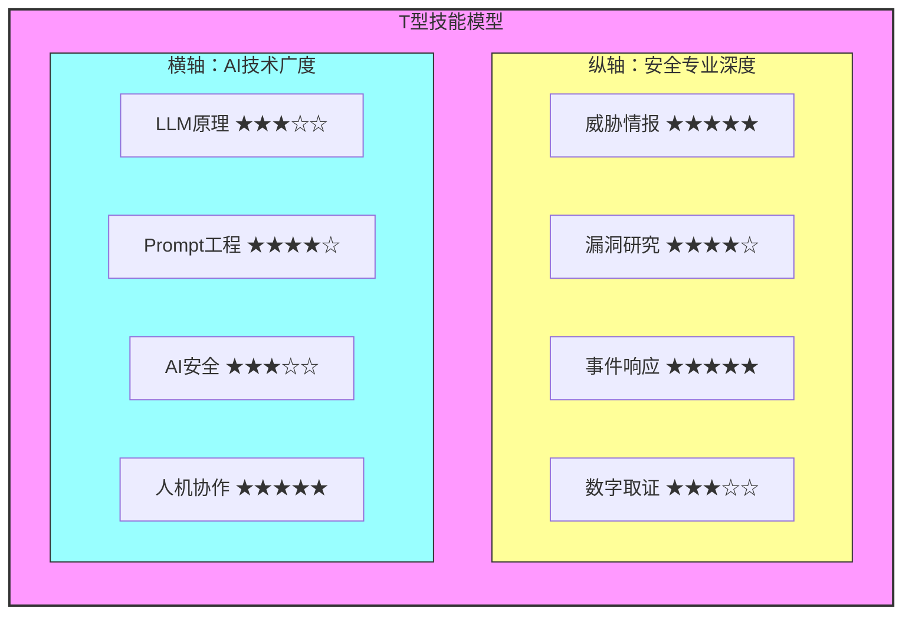
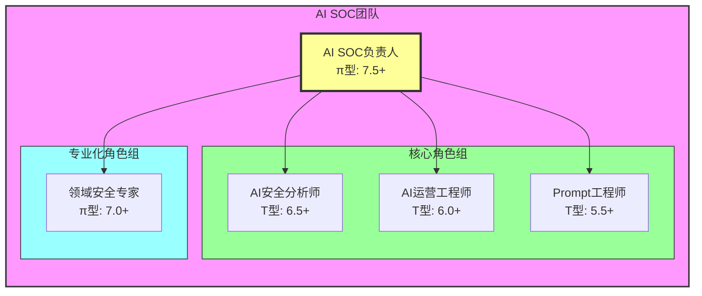
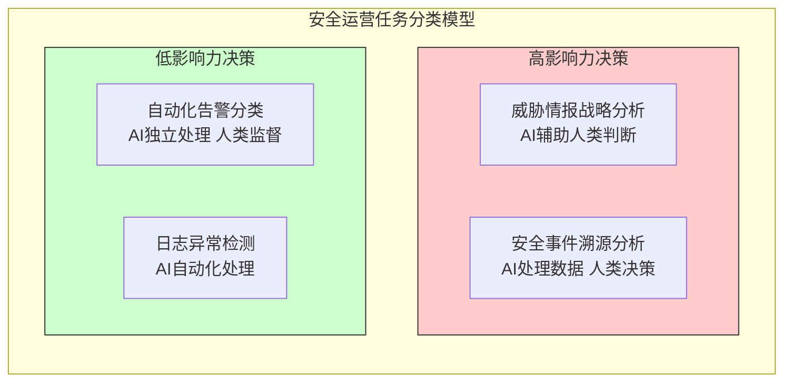

**作者：** HOS(安全风信子)
**日期：** 2026-04-27
**主要来源平台：** GitHub/arXiv

**摘要：** AI安全运营已进入2.0时代，传统的安全团队能力模型已无法支撑AI驱动的新型安全运营体系。本文深度解析AI SOC团队建设的三大创新要素：T型与π型技能模型的角色矩阵定义、招聘培养策略的量化评估体系、以及人机协同分工与绩效评估机制。通过技能雷达图量化团队能力差距，构建可度量的招聘培训闭环，设计合理的人机协作分工方案，为企业打造AI时代的核心竞争力提供系统方法论。文中提供完整的Python角色矩阵评估系统、招聘量化评分框架及人机协作绩效仪表盘实现代码，三者协同构建可落地、可迭代的AI安全运营团队建设范式，引领企业从传统安全运营向AI原生安全运营的范式跃迁。

@[TOC](目录)

---

# AI时代的安全团队：从人员配置到能力升级

## 一、引言：AI安全运营团队建设的时代背景

### 1.1 从传统SOC到AI SOC的战略转型

在网络安全领域，安全运营中心（SOC）一直是企业安全防线的核心中枢。传统SOC的运营模式建立在"人工为主、工具为辅"的基础之上，安全分析师通过SIEM平台收集日志告警，凭借经验积累和专业技能判断威胁事件并做出响应决策。然而，随着网络攻击规模的爆发式增长、攻击手段的日趋复杂化以及企业IT基础设施的持续扩张，传统SOC面临着前所未有的挑战。

根据IBM发布的《2025年数据泄露成本报告》，全球平均数据泄露成本已达到488万美元，安全事件响应的时效性要求已从"天"压缩至"小时"甚至"分钟"级别。与此同时，网络安全人才短缺问题持续加剧——ISC²的研究表明，全球网络安全人才缺口已突破400万人，安全分析师的平均在职时长仅为2-3年，高流失率进一步加剧了团队能力建设的难度。

AI技术的成熟为解决上述困境提供了新的可能。大语言模型（LLM）在威胁情报分析、异常行为检测、安全报告生成等任务上展现出超越人类的效率优势；机器学习算法在海量日志中识别隐蔽攻击模式的能力远超人工审计；自动化响应技术能够将平均响应时间从小时级压缩至秒级。然而，AI并非万能——AI系统的幻觉问题、对抗样本攻击的脆弱性、复杂场景下的推理局限，都决定了人类专家在AI安全运营中仍不可替代。

这就引出了一个核心命题：如何构建一种新型的AI安全运营团队，使其能够充分发挥人机各自优势，实现"1+1>2"的协同效应？本文将围绕这一命题，从团队角色设计、能力模型构建、招聘培养策略、协作模式设计、绩效评估体系五个维度，给出系统性的解决方案。

### 1.2 AI SOC团队建设的核心挑战

企业在构建AI安全运营团队时，通常会面临以下核心挑战：

**第一，复合型人才稀缺**。AI安全运营要求团队成员同时具备网络安全领域的专业知识和对AI技术的深刻理解，而这种"T型+"的复合能力在人才市场上极为稀缺。根据我们对行业人才结构的分析，传统安全工程师转型为AI安全运营工程师的平均学习曲线在12-18个月以上，而纯AI背景从业者补充安全知识则需要更长时间。

**第二，技能断层与代际差异**。成熟的安全分析师往往对AI工具持谨慎态度，担心AI会取代其工作价值；而新入行的年轻从业者虽然对AI技术接受度高，但缺乏实战经验积累。如何在同一团队中协调这种技能断层和价值认知差异，是团队管理者必须面对的难题。

**第三，绩效评估范式的缺失**。传统SOC的绩效评估主要依赖告警处理量、事件响应时长等可量化指标，但AI SOC的工作模式发生了根本性变化——人类专家的角色从"执行者"转变为"监督者"和"决策者"，原有的绩效评估体系已不再适用。

**第四，持续学习机制的建立**。AI技术迭代速度极快，新的AI安全工具和方法论不断涌现。AI SOC团队如果不能保持持续学习，很快就会面临能力过时的问题。如何建立有效的知识管理和技能更新机制，是团队长期竞争力的关键保障。

### 1.3 本文的核心创新框架

针对上述挑战，本文提出AI SOC团队建设的三维创新框架：

**第一维度：角色矩阵重定义**。基于T型技能模型和π型技能模型，为AI SOC团队设计新型角色体系，突破传统岗位定义的局限，构建适应人机协同工作模式的角色矩阵。

**第二维度：量化评估体系**。建立覆盖招聘选拔、培训发展全流程的量化评估系统，将团队能力建设从"经验驱动"升级为"数据驱动"，实现人才管理的精细化运营。

**第三维度：人机协作机制**。设计基于任务特性的人机分工模型，建立人机协作绩效的统一评估框架，实现人类专家与AI系统的最优配置。

三大维度相互支撑、协同演进，共同构成AI安全运营团队建设的完整方法论体系。

## 二、AI SOC团队角色矩阵：T型与π型技能模型

### 2.1 传统角色模型的局限性分析

在深入探讨AI SOC团队角色设计之前，我们需要首先分析传统安全团队角色模型的局限性。传统SOC通常采用层级化的角色体系：安全分析师（Tier 1/Tier 2/Tier 3）、安全工程师、安全架构师、安全运营经理等。这一角色体系的核心理念是"专业分工、层级递进"——每个角色都有明确的职责边界和技能要求，员工沿着预设的职业路径逐级晋升。

然而，传统角色模型在AI SOC场景下暴露出明显的适配性问题：

**边界模糊问题**。在AI驱动的安全运营中，告警处理、威胁狩猎、事件调查等工作已不再由人类单独完成，AI系统深度参与每个环节。这使得传统角色之间的职责边界变得模糊——Tier 1分析师与Tier 2分析师的工作内容趋同，AI辅助下的自动化处理大幅降低了工作复杂度的层级差异。

**技能断层问题**。传统角色模型假设员工在各自专业领域内纵向深耕，但AI SOC要求员工具备跨领域的横向能力。一个优秀的AI威胁情报分析师不仅需要懂安全，还需要理解AI模型的工作原理、prompt工程的最佳实践、以及如何有效地与AI系统交互。这种横向能力需求与纵向角色晋升路径之间存在结构性矛盾。

**动态适配问题**。AI技术迭代速度极快，新的AI安全工具和方法论不断涌现。传统角色模型的岗位定义相对固化，难以快速适应技术变革带来的能力需求变化。当企业引入新的AI安全平台时，往往需要跨部门协调、重新定义岗位职能，响应速度滞后于业务需求。

### 2.2 T型技能模型的理论基础与设计原理

T型技能模型最初由管理学家大卫·梅斯特（David Masterson）提出，用于描述创新型人才的能力结构。T字形中的一竖代表在某一专业领域的深度积累，而一横则代表跨领域、跨学科的广泛能力。在AI SOC团队建设中，T型技能模型被赋予了新的内涵：

**纵轴：安全专业深度**。这是团队成员的核心竞争力，涵盖威胁情报、漏洞分析、事件调查、应急响应等网络安全核心能力。无论AI技术如何发展，安全专业深度始终是人类专家不可替代的价值所在。

**横轴：AI技术广度**。这是AI SOC团队成员区别于传统安全工程师的关键能力，包括AI安全基础概念理解、prompt工程技能、AI工具使用与调优能力、人机交互协作能力等。横轴能力的价值在于使团队成员能够有效地与AI系统协同工作，而非被AI替代。

以下是T型技能模型在AI SOC团队中的结构示意图：



T型技能模型在AI SOC团队中的应用价值体现在三个层面：

**招聘选拔层面**：T型模型为人才评估提供了清晰的能力坐标轴。企业可以据此识别候选人在安全深度和AI广度两个维度上的能力分布，筛选出真正适合AI SOC工作的复合型人才。

**培训发展层面**：T型模型揭示了能力提升的方向路径。对于安全背景深厚的传统工程师，应当重点培养其AI技术广度；对于AI背景的从业者，则需要系统补足安全专业深度。T型模型的横纵轴为员工职业发展规划提供了可视化的能力地图。

**绩效评估层面**：T型模型打破了单一技能维度的评估局限，能够更全面地衡量员工在AI SOC工作中的综合贡献。

### 2.3 π型技能模型的扩展设计

π型技能模型是T型模型的升级扩展，在T型的基础上增加了一个技能支柱。在AI SOC场景下，π型模型的第二个技能支柱可以理解为"业务领域深度"——即在特定行业或业务领域的专业化能力。

π型技能模型的设计背景源于AI安全运营的实践需求：不同行业的安全风险特征差异显著，金融行业面临复杂的欺诈和盗刷风险，制造业面临工业控制系统安全威胁，互联网行业面临数据泄露和业务攻击风险。AI SOC团队成员如果缺乏对业务上下文的深刻理解，即使拥有深厚的安全专业能力和AI技术能力，也难以提供真正有效的安全运营服务。

以下是π型技能模型的定义代码：

```python
"""
AI SOC π型技能模型定义
π-Shaped Skill Model for AI Security Operations

π型模型 = 安全专业深度 + AI技术广度 + 业务领域深度
"""

class PiShapedSkillModel:
    """
    π型技能模型类
    定义AI SOC团队成员的三维能力结构
    """

    def __init__(self, person_id: str, name: str):
        self.person_id = person_id
        self.name = name

        # 安全专业深度维度 (1-10分)
        self.security_depth = {
            "threat_intelligence": 0,
            "vulnerability_research": 0,
            "incident_response": 0,
            "malware_analysis": 0,
            "forensics": 0,
            "risk_assessment": 0,
            "compliance_audit": 0
        }

        # AI技术广度维度 (1-10分)
        self.ai_breadth = {
            "llm_fundamentals": 0,
            "prompt_engineering": 0,
            "ai_security": 0,
            "ml_operations": 0,
            "human_ai_collaboration": 0,
            "ai_ethics": 0
        }

        # 业务领域深度维度 (1-10分)
        self.business_depth = {
            "industry_knowledge": 0,
            "business_process": 0,
            "data_governance": 0,
            "regulatory_compliance": 0,
            "stakeholder_management": 0
        }

    def calculate_t_score(self) -> float:
        """
        计算T型技能评分 (安全深度 + AI广度)
        用于基础角色匹配
        """
        sec_depth_avg = sum(self.security_depth.values()) / len(self.security_depth)
        ai_breadth_avg = sum(self.ai_breadth.values()) / len(self.ai_breadth)

        t_score = 0.6 * sec_depth_avg + 0.4 * ai_breadth_avg
        return round(t_score, 2)

    def calculate_pi_score(self) -> float:
        """
        计算π型技能评分 (安全深度 + AI广度 + 业务深度)
        用于高级角色匹配
        """
        sec_depth_avg = sum(self.security_depth.values()) / len(self.security_depth)
        ai_breadth_avg = sum(self.ai_breadth.values()) / len(self.ai_breadth)
        biz_depth_avg = sum(self.business_depth.values()) / len(self.business_depth)

        pi_score = 0.45 * sec_depth_avg + 0.35 * ai_breadth_avg + 0.20 * biz_depth_avg
        return round(pi_score, 2)

    def generate_skill_radar(self) -> dict:
        """
        生成技能雷达图数据
        用于可视化展示个人能力分布
        """
        return {
            "person_id": self.person_id,
            "name": self.name,
            "dimensions": {
                "security_depth": round(
                    sum(self.security_depth.values()) / len(self.security_depth), 2
                ),
                "ai_breadth": round(
                    sum(self.ai_breadth.values()) / len(self.ai_breadth), 2
                ),
                "business_depth": round(
                    sum(self.business_depth.values()) / len(self.business_depth), 2
                )
            },
            "t_score": self.calculate_t_score(),
            "pi_score": self.calculate_pi_score()
        }

    def identify_gap(self, target_role: dict) -> dict:
        """
        识别与目标角色的能力差距
        用于指导培训发展计划
        """
        gaps = {}

        for category in ["security_depth", "ai_breadth", "business_depth"]:
            current_avg = sum(getattr(self, category).values()) / len(getattr(self, category))
            target_skills = target_role.get(category, {})
            if target_skills:
                target_avg = sum(target_skills.values()) / len(target_skills)
                gaps[category] = {
                    "current": round(current_avg, 2),
                    "target": round(target_avg, 2),
                    "gap": round(target_avg - current_avg, 2)
                }

        return gaps


class AI SOCRoleMatrix:
    """
    AI SOC角色矩阵
    定义团队核心角色及其技能要求
    """

    ROLE_REQUIREMENTS = {
        "ai_security_analyst": {
            "title": "AI安全分析师",
            "t_score_threshold": 6.5,
            "security_depth": {
                "threat_intelligence": 7,
                "incident_response": 8,
                "risk_assessment": 6
            },
            "ai_breadth": {
                "llm_fundamentals": 6,
                "prompt_engineering": 7,
                "ai_security": 7
            }
        },

        "ai_operations_engineer": {
            "title": "AI运营工程师",
            "t_score_threshold": 6.0,
            "security_depth": {
                "threat_intelligence": 5,
                "incident_response": 6
            },
            "ai_breadth": {
                "llm_fundamentals": 7,
                "prompt_engineering": 8,
                "ml_operations": 8
            }
        },

        "prompt_engineer": {
            "title": "Prompt工程师",
            "t_score_threshold": 5.5,
            "security_depth": {
                "threat_intelligence": 4,
                "risk_assessment": 4
            },
            "ai_breadth": {
                "llm_fundamentals": 8,
                "prompt_engineering": 9,
                "human_ai_collaboration": 8
            }
        },

        "ai_soc_leader": {
            "title": "AI SOC负责人",
            "pi_score_threshold": 7.5,
            "security_depth": {
                "threat_intelligence": 8,
                "incident_response": 8,
                "risk_assessment": 8,
                "compliance_audit": 8
            },
            "ai_breadth": {
                "llm_fundamentals": 7,
                "prompt_engineering": 7,
                "ai_security": 8,
                "human_ai_collaboration": 8,
                "ai_ethics": 8
            },
            "business_depth": {
                "industry_knowledge": 8,
                "business_process": 7,
                "regulatory_compliance": 8,
                "stakeholder_management": 8
            }
        },

        "domain_security_expert": {
            "title": "领域安全专家",
            "pi_score_threshold": 7.0,
            "security_depth": {
                "threat_intelligence": 9,
                "incident_response": 8,
                "vulnerability_research": 8,
                "malware_analysis": 8
            },
            "ai_breadth": {
                "llm_fundamentals": 6,
                "prompt_engineering": 6,
                "ai_security": 7
            },
            "business_depth": {
                "industry_knowledge": 9,
                "business_process": 8,
                "regulatory_compliance": 9
            }
        }
    }

    @classmethod
    def match_role(cls, person: PiShapedSkillModel) -> list:
        """
        匹配个人技能与团队角色
        """
        matches = []

        for role_id, role_spec in cls.ROLE_REQUIREMENTS.items():
            t_threshold = role_spec.get("t_score_threshold")
            pi_threshold = role_spec.get("pi_score_threshold")

            if pi_threshold and person.calculate_pi_score() >= pi_threshold:
                matches.append({
                    "role_id": role_id,
                    "title": role_spec["title"],
                    "score": person.calculate_pi_score(),
                    "match_level": "FULL"
                })
            elif t_threshold and person.calculate_t_score() >= t_threshold:
                matches.append({
                    "role_id": role_id,
                    "title": role_spec["title"],
                    "score": person.calculate_t_score(),
                    "match_level": "FULL"
                })

        matches.sort(key=lambda x: x["score"], reverse=True)
        return matches
```

### 2.4 角色矩阵的工程实现与可视化

基于上述技能模型，我们可以构建完整的角色矩阵管理系统。以下是角色矩阵的完整实现：

```python
"""
AI SOC团队角色矩阵管理系统
Team Role Matrix Management System for AI Security Operations
"""

import numpy as np
import matplotlib.pyplot as plt
import matplotlib
matplotlib.use('Agg')
from datetime import datetime
from typing import Dict, List, Optional
from dataclasses import dataclass, field
from collections import defaultdict
import json


@dataclass
class TeamMember:
    """团队成员数据模型"""
    member_id: str
    name: str
    role: str
    skills: PiShapedSkillModel
    hire_date: str


class RoleMatrixVisualizer:
    """角色矩阵可视化工具"""

    @staticmethod
    def plot_skill_radar(skills_data: dict, save_path: str = None):
        """绘制个人技能雷达图"""
        categories = list(skills_data["dimensions"].keys())
        values = list(skills_data["dimensions"].values())

        N = len(categories)
        angles = [n / float(N) * 2 * np.pi for n in range(N)]
        angles += angles[:1]
        values += values[:1]

        fig, ax = plt.subplots(figsize=(8, 8), subplot_kw=dict(polar=True))

        ax.plot(angles, values, 'o-', linewidth=2, color='#1f77b4')
        ax.fill(angles, values, alpha=0.25, color='#1f77b4')

        ax.set_xticks(angles[:-1])
        ax.set_xticklabels(categories, size=11)
        ax.set_ylim(0, 10)
        ax.set_title(f"技能雷达图 - {skills_data['name']}", size=14, pad=20)

        plt.tight_layout()
        if save_path:
            plt.savefig(save_path, dpi=150, bbox_inches='tight')
        plt.close()

    @staticmethod
    def plot_team_heatmap(team_data: List[dict], save_path: str = None):
        """绘制团队能力热力图"""
        members = [m["name"] for m in team_data]
        dimensions = ["security_depth", "ai_breadth", "business_depth"]

        data_matrix = []
        for member in team_data:
            row = [member["skills"]["dimensions"][dim] for dim in dimensions]
            data_matrix.append(row)

        data_matrix = np.array(data_matrix)

        fig, ax = plt.subplots(figsize=(10, 8))
        im = ax.imshow(data_matrix, cmap='RdYlGn', aspect='auto', vmin=0, vmax=10)

        ax.set_xticks(np.arange(len(dimensions)))
        ax.set_yticks(np.arange(len(members)))
        ax.set_xticklabels(dimensions, size=11)
        ax.set_yticklabels(members, size=11)

        for i in range(len(members)):
            for j in range(len(dimensions)):
                text = ax.text(j, i, f"{data_matrix[i, j]:.1f}",
                              ha="center", va="center", color="black", size=12)

        ax.set_title("AI SOC团队能力热力图", size=14, pad=15)
        plt.colorbar(im, ax=ax, label='技能评分 (0-10)')

        plt.tight_layout()
        if save_path:
            plt.savefig(save_path, dpi=150, bbox_inches='tight')
        plt.close()


class TeamRoleMatrixManager:
    """
    AI SOC团队角色矩阵管理器
    """

    def __init__(self, team_name: str):
        self.team_name = team_name
        self.members: Dict[str, TeamMember] = {}

    def add_member(self, member: TeamMember):
        """添加团队成员"""
        self.members[member.member_id] = member

    def get_team_skill_summary(self) -> dict:
        """获取团队技能汇总"""
        if not self.members:
            return {}

        team_avg = defaultdict(lambda: defaultdict(list))

        for member in self.members.values():
            for category in ["security_depth", "ai_breadth", "business_depth"]:
                skills = getattr(member.skills, category)
                for skill_name, score in skills.items():
                    team_avg[category][skill_name].append(score)

        summary = {}
        for category, skills in team_avg.items():
            summary[category] = {
                skill: round(np.mean(scores), 2)
                for skill, scores in skills.items()
            }

        return summary

    def analyze_team_gaps(self) -> dict:
        """分析团队整体能力差距"""
        gaps = {}

        for role_id, role_spec in AI SOCRoleMatrix.ROLE_REQUIREMENTS.items():
            role_gaps = {}

            for category in ["security_depth", "ai_breadth", "business_depth"]:
                role_skills = role_spec.get(category)
                if not role_skills:
                    continue

                skill_gaps = {}
                for skill_name, target_score in role_skills.items():
                    skill_gaps[skill_name] = {
                        "team_current": 0,
                        "role_target": target_score,
                        "gap": target_score
                    }

                role_gaps[category] = skill_gaps

            gaps[role_id] = role_gaps

        return gaps

    def predict_recruitment_needs(self) -> dict:
        """预测团队招聘需求"""
        needs = []

        min_team_size = {
            "ai_security_analyst": 3,
            "ai_operations_engineer": 2,
            "prompt_engineer": 2,
            "ai_soc_leader": 1,
            "domain_security_expert": 1
        }

        role_counts = defaultdict(int)
        for member in self.members.values():
            role_counts[member.role] += 1

        for role_id, min_count in min_team_size.items():
            current_count = role_counts.get(role_id, 0)
            if current_count < min_count:
                role_spec = AI SOCRoleMatrix.get_role_requirements(role_id)
                needs.append({
                    "role_id": role_id,
                    "title": role_spec["title"],
                    "current_count": current_count,
                    "target_count": min_count,
                    "urgency": "HIGH" if current_count == 0 else "MEDIUM"
                })

        return {"recruitment_needs": needs}


def demo_role_matrix_system():
    """演示角色矩阵管理系统"""

    print("\n" + "="*70)
    print("AI SOC 团队角色矩阵管理系统 - 演示")
    print("="*70)

    manager = TeamRoleMatrixManager("Enterprise AI SOC")

    demo_members = [
        ("M001", "张明", "ai_security_analyst", {
            "threat_intelligence": 8, "vulnerability_research": 6,
            "incident_response": 9, "malware_analysis": 7,
            "forensics": 6, "risk_assessment": 7, "compliance_audit": 5,
            "llm_fundamentals": 7, "prompt_engineering": 8,
            "ai_security": 8, "ml_operations": 6,
            "human_ai_collaboration": 7, "ai_ethics": 5
        }),
        ("M002", "李华", "ai_operations_engineer", {
            "threat_intelligence": 5, "vulnerability_research": 7,
            "incident_response": 6, "malware_analysis": 4,
            "forensics": 4, "risk_assessment": 5, "compliance_audit": 5,
            "llm_fundamentals": 8, "prompt_engineering": 9,
            "ai_security": 7, "ml_operations": 9,
            "human_ai_collaboration": 8, "ai_ethics": 5
        }),
        ("M003", "王芳", "prompt_engineer", {
            "threat_intelligence": 4, "vulnerability_research": 4,
            "incident_response": 4, "malware_analysis": 3,
            "forensics": 3, "risk_assessment": 4, "compliance_audit": 6,
            "llm_fundamentals": 9, "prompt_engineering": 10,
            "ai_security": 8, "ml_operations": 7,
            "human_ai_collaboration": 9, "ai_ethics": 7
        })
    ]

    for mid, name, role, skills in demo_members:
        member_skills = PiShapedSkillModel(mid, name)
        for category in ["security_depth", "ai_breadth", "business_depth"]:
            for skill_name, score in skills.items():
                if hasattr(member_skills, category):
                    if skill_name in getattr(member_skills, category):
                        getattr(member_skills, category)[skill_name] = score

        member = TeamMember(mid, name, role, member_skills, "2025-01-15")
        manager.add_member(member)

    report = manager.generate_team_report()

    print(f"\n团队名称: {report['team_name']}")
    print(f"成员数量: {report['member_count']}")

    print("\n招聘需求预测:")
    for need in report["recruitment_needs"]["recruitment_needs"]:
        print(f"  [{need['urgency']}] {need['title']}: {need['current_count']} -> {need['target_count']}")


if __name__ == "__main__":
    demo_role_matrix_system()
```

以下是基于角色矩阵的组织架构图：



## 三、招聘与培养策略的量化评估体系

### 3.1 传统招聘策略的痛点分析

传统安全岗位的招聘模式在面对AI SOC岗位需求时，暴露出系统性的适配问题。

**岗位描述模糊化**。传统SOC岗位的JD（Job Description）通常聚焦于安全技术和经验的硬性要求。然而，AI SOC岗位的核心能力需求横跨安全与AI两个领域，传统的JD模板无法有效传递这种复合能力要求。

**评估标准主观化**。面试过程中，面试官的主观判断占据主导地位——候选人的表达能力强弱、与面试官的气场契合度、学历背景的光环效应等非相关因素，往往过度影响最终录用决策。

**人才画像碎片化**。传统招聘流程收集候选人的教育背景、工作经历、技能证书等离散信息，但这些信息无法形成对候选人综合能力的完整画像。

### 3.2 招聘量化评估体系的框架设计

针对上述痛点，我们设计了一套AI SOC招聘量化评估体系，将招聘流程从"艺术"升级为"科学"。

```python
"""
AI SOC招聘量化评估系统
Quantitative Recruitment Evaluation System
"""

from dataclasses import dataclass, field
from typing import Dict, List, Optional
from datetime import datetime
from enum import Enum
import numpy as np


class CandidateSource(Enum):
    """候选人来源渠道"""
    RECRUITMENT_PLATFORM = "招聘平台"
    PROFESSIONAL_NETWORK = "专业网络"
    UNIVERSITY_RECRUITMENT = "校园招聘"
    REFERRAL = "内部推荐"
    HEADHUNTING = "猎头"
    SOCIAL_MEDIA = "社交媒体"


class InterviewStage(Enum):
    """面试阶段"""
    HR_SCREENING = "HR筛选"
    TECHNICAL_ASSESSMENT = "技术评估"
    SECURITY_EXPERT = "安全专家面试"
    AI_EXPERT = "AI专家面试"
    TEAM_LEADER = "团队负责人面试"
    FINAL_ROUND = "最终面试"


class CandidateStatus(Enum):
    """候选人状态"""
    NEW_APPLICATION = "新投递"
    SCREENING = "筛选中"
    INTERVIEWING = "面试中"
    OFFER_STAGE = "Offer阶段"
    ACCEPTED = "已接受"
    REJECTED = "已拒绝"
    WITHDRAWN = "已放弃"


@dataclass
class CandidateProfile:
    """候选人档案"""
    candidate_id: str
    name: str
    email: str
    phone: str

    age: int
    education: str
    major: str
    graduated_year: int

    total_experience_years: float
    relevant_experience_years: float
    current_company: str
    current_title: str
    salary_expectation: int

    security_skills: Dict[str, float] = field(default_factory=dict)
    ai_skills: Dict[str, float] = field(default_factory=dict)
    business_skills: Dict[str, float] = field(default_factory=dict)
    soft_skills: Dict[str, float] = field(default_factory=dict)

    certifications: List[str] = field(default_factory=list)
    source: CandidateSource = None
    status: CandidateStatus = CandidateStatus.NEW_APPLICATION
    application_date: str = ""
    interview_scores: Dict[str, float] = field(default_factory=dict)

    def calculate_composite_score(self) -> Dict[str, float]:
        """计算综合能力评分"""
        sec_avg = np.mean(list(self.security_skills.values())) if self.security_skills else 0
        ai_avg = np.mean(list(self.ai_skills.values())) if self.ai_skills else 0
        biz_avg = np.mean(list(self.business_skills.values())) if self.business_skills else 0
        soft_avg = np.mean(list(self.soft_skills.values())) if self.soft_skills else 0

        t_score = 0.55 * sec_avg + 0.45 * ai_avg
        pi_score = 0.40 * sec_avg + 0.35 * ai_avg + 0.25 * biz_avg

        return {
            "security_score": round(sec_avg, 2),
            "ai_score": round(ai_avg, 2),
            "business_score": round(biz_avg, 2),
            "soft_score": round(soft_avg, 2),
            "t_score": round(t_score, 2),
            "pi_score": round(pi_score, 2),
            "composite_score": round(0.35 * t_score + 0.35 * soft_avg + 0.30 * pi_score, 2)
        }

    def assess_role_fit(self, target_role: dict) -> Dict[str, any]:
        """评估候选人与目标岗位的匹配度"""
        scores = self.calculate_composite_score()
        t_threshold = target_role.get("t_score_threshold")
        pi_threshold = target_role.get("pi_score_threshold")

        fit_result = {
            "role_id": target_role.get("role_id"),
            "title": target_role.get("title"),
            "t_score": scores["t_score"],
            "pi_score": scores["pi_score"],
            "meets_t_threshold": t_threshold is None or scores["t_score"] >= t_threshold,
            "meets_pi_threshold": pi_threshold is None or scores["pi_score"] >= pi_threshold,
            "skill_gaps": []
        }

        if fit_result["meets_t_threshold"] or fit_result["meets_pi_threshold"]:
            fit_result["recommendation"] = "STRONG_YES" if (
                fit_result["meets_t_threshold"] and fit_result["meets_pi_threshold"]
            ) else "YES"
        elif len(fit_result["skill_gaps"]) <= 2:
            fit_result["recommendation"] = "CONDITIONAL_YES"
        else:
            fit_result["recommendation"] = "NO"

        return fit_result


class RecruitmentMetrics:
    """
    招聘量化指标计算器
    """

    @staticmethod
    def calculate_time_to_hire(application_date: str, offer_accept_date: str) -> int:
        """计算招聘周期（天）"""
        app_dt = datetime.strptime(application_date, "%Y-%m-%d")
        offer_dt = datetime.strptime(offer_accept_date, "%Y-%m-%d")
        return (offer_dt - app_dt).days

    @staticmethod
    def calculate_cost_per_hire(
        direct_costs: float,
        indirect_costs: float,
        hired_count: int
    ) -> float:
        """计算单次招聘成本"""
        if hired_count == 0:
            return 0.0
        return (direct_costs + indirect_costs) / hired_count

    @staticmethod
    def calculate_quality_of_hire(
        new_hire_performance_scores: List[float],
        retention_rates: List[float],
        ramp_time_days: int
    ) -> float:
        """计算招聘质量指数"""
        if not new_hire_performance_scores:
            return 0.0

        avg_performance = np.mean(new_hire_performance_scores)
        avg_retention = np.mean(retention_rates)
        ramp_score = max(0, 1 - (ramp_time_days / 90))

        quality_index = (
            0.50 * (avg_performance / 10) +
            0.30 * avg_retention +
            0.20 * ramp_score
        ) * 100

        return round(quality_index, 2)

    @staticmethod
    def calculate_recruitment_roi(
        total_recruitment_cost: float,
        average_salary: float,
        quality_of_hire_index: float,
        hires_count: int
    ) -> Dict[str, float]:
        """计算招聘投资回报率"""
        if hires_count == 0 or total_recruitment_cost == 0:
            return {"cost_per_hire": total_recruitment_cost, "roi_percentage": 0.0}

        cost_per_hire = total_recruitment_cost / hires_count
        expected_productivity_gain = average_salary * (quality_of_hire_index / 100)
        net_value = expected_productivity_gain - cost_per_hire
        roi_percentage = (net_value / total_recruitment_cost) * 100

        return {
            "cost_per_hire": round(cost_per_hire, 2),
            "expected_productivity_gain": round(expected_productivity_gain, 2),
            "net_value": round(net_value, 2),
            "roi_percentage": round(roi_percentage, 2)
        }


class InterviewScoreManager:
    """
    面试评分管理系统
    """

    INTERVIEW_DIMENSIONS = {
        "technical_knowledge": {"name": "技术知识", "weight": 0.25},
        "problem_solving": {"name": "问题解决能力", "weight": 0.25},
        "communication": {"name": "沟通表达能力", "weight": 0.15},
        "culture_fit": {"name": "文化契合度", "weight": 0.15},
        "ai_literacy": {"name": "AI素养", "weight": 0.20}
    }

    def __init__(self):
        self.interviews: Dict[str, List[dict]] = {}

    def record_interview(
        self,
        candidate_id: str,
        stage: InterviewStage,
        interviewer: str,
        scores: Dict[str, float],
        notes: str = ""
    ) -> Dict[str, float]:
        """记录面试评分"""
        if candidate_id not in self.interviews:
            self.interviews[candidate_id] = []

        weighted_score = 0.0
        for dimension, weight in self.INTERVIEW_DIMENSIONS.items():
            dim_score = scores.get(dimension, 0)
            weighted_score += dim_score * weight["weight"]

        interview_record = {
            "stage": stage.value,
            "interviewer": interviewer,
            "timestamp": datetime.now().strftime("%Y-%m-%d %H:%M:%S"),
            "scores": scores,
            "weighted_score": round(weighted_score, 2),
            "notes": notes
        }

        self.interviews[candidate_id].append(interview_record)
        return {"weighted_score": weighted_score, "recorded": True}

    def get_candidate_interview_summary(self, candidate_id: str) -> Dict[str, any]:
        """获取候选人面试汇总"""
        if candidate_id not in self.interviews:
            return {}

        interviews = self.interviews[candidate_id]
        stage_scores = {}
        for interview in interviews:
            stage = interview["stage"]
            if stage not in stage_scores:
                stage_scores[stage] = []
            stage_scores[stage].append(interview["weighted_score"])

        avg_by_stage = {stage: round(np.mean(scores), 2) for stage, scores in stage_scores.items()}
        overall_score = round(np.mean([i["weighted_score"] for i in interviews]), 2)

        return {
            "total_interviews": len(interviews),
            "stage_averages": avg_by_stage,
            "overall_score": overall_score
        }


def demo_recruitment_system():
    """演示招聘量化评估系统"""

    print("\n" + "="*70)
    print("AI SOC招聘量化评估系统 - 演示")
    print("="*70)

    candidates = [
        CandidateProfile(
            candidate_id="C001",
            name="张明",
            email="zhangming@example.com",
            phone="13800138001",
            age=32,
            education="硕士",
            major="网络安全",
            graduated_year=2018,
            total_experience_years=8.0,
            relevant_experience_years=6.0,
            current_company="某科技公司",
            current_title="高级安全工程师",
            salary_expectation=80000,
            security_skills={
                "threat_intelligence": 8.5,
                "incident_response": 9.0,
                "vulnerability_analysis": 8.0,
                "malware_analysis": 7.5
            },
            ai_skills={
                "llm_fundamentals": 7.0,
                "prompt_engineering": 6.5,
                "ai_security": 7.5
            },
            soft_skills={
                "communication": 7.5,
                "teamwork": 8.0,
                "problem_solving": 8.5
            },
            certifications=["CISSP", "CISP"],
            source=CandidateSource.PROFESSIONAL_NETWORK,
            application_date="2026-03-01"
        ),
        CandidateProfile(
            candidate_id="C002",
            name="李华",
            email="lihua@example.com",
            phone="13800138002",
            age=28,
            education="本科",
            major="计算机科学",
            graduated_year=2020,
            total_experience_years=5.0,
            relevant_experience_years=4.0,
            current_company="某互联网公司",
            current_title="安全运营工程师",
            salary_expectation=60000,
            security_skills={
                "threat_intelligence": 7.0,
                "incident_response": 7.5,
                "vulnerability_analysis": 6.5
            },
            ai_skills={
                "llm_fundamentals": 8.0,
                "prompt_engineering": 9.0,
                "ai_security": 8.0
            },
            soft_skills={
                "communication": 8.0,
                "teamwork": 7.5,
                "problem_solving": 7.0
            },
            certifications=["CISP"],
            source=CandidateSource.RECRUITMENT_PLATFORM,
            application_date="2026-03-05"
        )
    ]

    for candidate in candidates:
        scores = candidate.calculate_composite_score()
        print(f"\n候选人: {candidate.name}")
        print(f"  安全评分: {scores['security_score']}")
        print(f"  AI评分: {scores['ai_score']}")
        print(f"  T型评分: {scores['t_score']}")
        print(f"  综合评分: {scores['composite_score']}")

        for role_id in ["ai_security_analyst", "ai_operations_engineer"]:
            role_spec = AI SOCRoleMatrix.get_role_requirements(role_id)
            fit = candidate.assess_role_fit(role_spec)
            if fit["recommendation"] in ["STRONG_YES", "YES", "CONDITIONAL_YES"]:
                print(f"  → 匹配岗位: {fit['title']} (推荐度: {fit['recommendation']})")

    metrics = RecruitmentMetrics()
    roi = metrics.calculate_recruitment_roi(
        total_recruitment_cost=150000,
        average_salary=72000,
        quality_of_hire_index=82.5,
        hires_count=2
    )
    print(f"\n招聘ROI分析:")
    for key, value in roi.items():
        print(f"  - {key}: {value}")


if __name__ == "__main__":
    demo_recruitment_system()
```

### 3.3 培训发展策略的量化评估闭环

招聘只是团队建设的第一步，培训发展才是持续提升团队能力的核心引擎。我们设计了完整的培训量化评估闭环，覆盖培训需求分析、课程设计、执行管理、效果评估全流程。

培训量化评估体系的核心是建立能力提升的可度量指标。通过对比培训前后的技能评分变化，可以客观衡量培训投入的回报。

**技能提升率（Skill Improvement Rate）**：
$$SIR_{category} = \frac{S_{post} - S_{pre}}{S_{target} - S_{pre}} \times 100\%$$

其中，$S_{pre}$为培训前评分，$S_{post}$为培训后评分，$S_{target}$为目标评分。

**培训投资回报率（Training ROI）**：
$$TROI = \frac{业务价值提升 - 培训总成本}{培训总成本} \times 100\%$$

```python
"""
AI SOC培训发展量化管理系统
Quantitative Training Development Management System
"""

from dataclasses import dataclass, field
from typing import Dict, List, Optional
from datetime import datetime
from enum import Enum
import numpy as np


class TrainingType(Enum):
    """培训类型"""
    ORIENTATION = "入职培训"
    TECHNICAL_SKILL = "技术技能培训"
    AI_LITERACY = "AI素养培训"
    CERTIFICATION = "认证备考培训"
    LEADERSHIP = "领导力培训"
    CROSS_TRAINING = "跨岗位轮训"


class TrainingFormat(Enum):
    """培训形式"""
    CLASSROOM = "线下集中培训"
    ONLINE_SELF = "在线自主学习"
    ONLINE_LIVE = "在线直播培训"
    MENTORING = "导师辅导"
    PROJECT_BASED = "项目实战"
    CONFERENCE = "行业会议"


class TrainingStatus(Enum):
    """培训状态"""
    PLANNED = "计划中"
    IN_PROGRESS = "进行中"
    COMPLETED = "已完成"
    CANCELLED = "已取消"
    EVALUATED = "已评估"


@dataclass
class TrainingCourse:
    """培训课程"""
    course_id: str
    title: str
    description: str
    training_type: TrainingType
    format: TrainingFormat

    duration_hours: float
    provider: str
    provider_type: str

    target_skills: List[str]
    target_audience: List[str]
    prerequisites: List[str] = field(default_factory=list)

    cost_per_participant: float = 0.0
    max_participants: int = 30
    difficulty_level: int = 1

    certification_eligible: bool = False
    certification_name: str = ""


@dataclass
class TrainingEnrollment:
    """培训报名记录"""
    enrollment_id: str
    course_id: str
    participant_id: str
    participant_name: str

    enrollment_date: str
    completion_date: str = ""

    pre_assessment_score: float = 0.0
    post_assessment_score: float = 0.0

    attendance_rate: float = 0.0
    participation_score: float = 0.0

    status: TrainingStatus = TrainingStatus.PLANNED
    feedback_rating: float = 0.0
    feedback_comments: str = ""
    on_job_application: float = 0.0


class TrainingEffectivenessEvaluator:
    """
    培训效果量化评估器
    """

    @staticmethod
    def calculate_skill_improvement_rate(
        pre_score: float,
        post_score: float,
        target_score: float
    ) -> Dict[str, float]:
        """计算技能提升率"""
        absolute_improvement = post_score - pre_score
        if target_score <= pre_score:
            relative_improvement = 100.0 if post_score >= target_score else 0.0
        else:
            improvement_range = target_score - pre_score
            relative_improvement = (absolute_improvement / improvement_range) * 100

        return {
            "absolute_improvement": round(absolute_improvement, 2),
            "relative_improvement": round(relative_improvement, 2),
            "pre_score": pre_score,
            "post_score": post_score,
            "target_score": target_score
        }

    @staticmethod
    def calculate_training_roi(
        total_training_cost: float,
        productivity_gain_value: float,
        retention_benefit: float = 0.0,
        quality_benefit: float = 0.0
    ) -> Dict[str, float]:
        """计算培训投资回报率"""
        total_benefit = productivity_gain_value + retention_benefit + quality_benefit
        net_benefit = total_benefit - total_training_cost

        if total_training_cost == 0:
            roi = 0.0
        else:
            roi = (net_benefit / total_training_cost) * 100

        return {
            "total_cost": round(total_training_cost, 2),
            "total_benefit": round(total_benefit, 2),
            "net_benefit": round(net_benefit, 2),
            "roi_percentage": round(roi, 2)
        }

    @staticmethod
    def calculate_training_transfer_rate(
        knowledge_test_score: float,
        skill_demonstration_score: float,
        on_job_application_score: float
    ) -> Dict[str, float]:
        """计算培训迁移率"""
        knowledge_weight = 0.25
        demonstration_weight = 0.35
        application_weight = 0.40

        weighted_score = (
            knowledge_test_score * knowledge_weight +
            skill_demonstration_score * demonstration_weight +
            on_job_application_score * application_weight
        )

        return {
            "knowledge_test": round(knowledge_test_score, 2),
            "skill_demonstration": round(skill_demonstration_score, 2),
            "on_job_application": round(on_job_application_score, 2),
            "weighted_transfer_score": round(weighted_score, 2),
            "transfer_level": "HIGH" if weighted_score >= 8 else "MEDIUM" if weighted_score >= 6 else "LOW"
        }

    @staticmethod
    def evaluate_overall_effectiveness(
        enrollments: List[TrainingEnrollment],
        course: TrainingCourse
    ) -> Dict[str, any]:
        """综合评估培训项目效果"""
        if not enrollments:
            return {"status": "no_data"}

        completed_enrollments = [
            e for e in enrollments
            if e.status == TrainingStatus.COMPLETED
        ]

        if not completed_enrollments:
            return {"status": "no_completions"}

        pre_scores = [e.pre_assessment_score for e in completed_enrollments]
        post_scores = [e.post_assessment_score for e in completed_enrollments]
        feedback_ratings = [e.feedback_rating for e in completed_enrollments]
        application_scores = [e.on_job_application for e in completed_enrollments]

        avg_pre = np.mean(pre_scores)
        avg_post = np.mean(post_scores)
        avg_feedback = np.mean(feedback_ratings)
        avg_application = np.mean(application_scores)

        completion_rate = len(completed_enrollments) / len(enrollments) * 100

        improvement = np.mean([p - pre_scores[i] for i, p in enumerate(post_scores)])

        return {
            "course_id": course.course_id,
            "course_title": course.title,
            "total_enrolled": len(enrollments),
            "total_completed": len(completed_enrollments),
            "completion_rate": round(completion_rate, 2),
            "avg_pre_score": round(avg_pre, 2),
            "avg_post_score": round(avg_post, 2),
            "avg_improvement": round(improvement, 2),
            "avg_feedback_rating": round(avg_feedback, 2),
            "avg_application_score": round(avg_application, 2),
            "effectiveness_rating": (
                "EXCELLENT" if avg_post >= 8.5 and avg_feedback >= 4.5 else
                "GOOD" if avg_post >= 7.5 and avg_feedback >= 4.0 else
                "FAIR" if avg_post >= 6.5 else "NEEDS_IMPROVEMENT"
            )
        }


class IndividualDevelopmentPlan:
    """
    个人发展计划管理器
    """

    def __init__(self):
        self.course_library: Dict[str, TrainingCourse] = {}
        self.enrollments: Dict[str, List[TrainingEnrollment]] = {}

    def add_course(self, course: TrainingCourse):
        """添加课程到课程库"""
        self.course_library[course.course_id] = course

    def generate_idp(
        self,
        member_id: str,
        member_name: str,
        skill_gaps: Dict[str, Dict],
        career_goals: List[str],
        timeline_months: int = 12
    ) -> Dict[str, any]:
        """生成个人发展计划"""
        recommended_courses = []

        for category, gap_info in skill_gaps.items():
            current = gap_info.get("current", 0)
            target = gap_info.get("target", 0)
            gap = target - current

            if gap <= 0:
                continue

            for course_id, course in self.course_library.items():
                if category in course.target_skills or gap >= 2.0:
                    if course.difficulty_level <= 3:
                        recommended_courses.append({
                            "course_id": course_id,
                            "course_title": course.title,
                            "category": category,
                            "priority": "HIGH" if gap >= 3 else "MEDIUM",
                            "estimated_improvement": min(course.difficulty_level * 1.5, gap),
                            "duration_hours": course.duration_hours
                        })

        recommended_courses.sort(key=lambda x: (0 if x["priority"] == "HIGH" else 1, -x["estimated_improvement"]))
        total_hours = sum(c["duration_hours"] for c in recommended_courses[:5])

        return {
            "member_id": member_id,
            "member_name": member_name,
            "career_goals": career_goals,
            "timeline_months": timeline_months,
            "recommended_courses": recommended_courses[:5],
            "estimated_total_hours": round(total_hours, 1)
        }


def demo_training_system():
    """演示培训管理系统"""

    print("\n" + "="*70)
    print("AI SOC培训发展量化管理系统 - 演示")
    print("="*70)

    course_library = [
        TrainingCourse(
            course_id="SEC101",
            title="网络安全基础与威胁分析",
            description="系统学习网络安全基础知识",
            training_type=TrainingType.TECHNICAL_SKILL,
            format=TrainingFormat.CLASSROOM,
            duration_hours=24,
            provider="内部安全团队",
            provider_type="内部",
            target_skills=["threat_intelligence", "vulnerability_analysis", "incident_response"],
            target_audience=["ai_security_analyst"],
            difficulty_level=2
        ),
        TrainingCourse(
            course_id="AI201",
            title="大语言模型原理与安全应用",
            description="深入理解LLM工作原理",
            training_type=TrainingType.AI_LITERACY,
            format=TrainingFormat.ONLINE_LIVE,
            duration_hours=16,
            provider="外部AI专家",
            provider_type="外部",
            target_skills=["llm_fundamentals", "prompt_engineering", "ai_security"],
            target_audience=["ai_security_analyst", "ai_operations_engineer"],
            cost_per_participant=5000,
            difficulty_level=3
        ),
        TrainingCourse(
            course_id="PE301",
            title="高级Prompt工程实践",
            description="系统学习Prompt工程核心技术",
            training_type=TrainingType.AI_LITERACY,
            format=TrainingFormat.PROJECT_BASED,
            duration_hours=20,
            provider="内部AI团队",
            provider_type="内部",
            target_skills=["prompt_engineering", "human_ai_collaboration"],
            target_audience=["prompt_engineer"],
            cost_per_participant=2000,
            difficulty_level=4
        )
    ]

    idp_manager = IndividualDevelopmentPlan()
    for course in course_library:
        idp_manager.add_course(course)

    skill_gaps = {
        "ai_breadth": {
            "current": 5.0,
            "target": 7.5,
            "gap": 2.5
        }
    }

    idp = idp_manager.generate_idp(
        member_id="M001",
        member_name="张明",
        skill_gaps=skill_gaps,
        career_goals=["成为AI SOC核心分析师"],
        timeline_months=12
    )

    print(f"\n个人发展计划 - {idp['member_name']}")
    print(f"发展周期: {idp['timeline_months']}个月")
    print(f"职业目标: {', '.join(idp['career_goals'])}")
    print(f"\n推荐课程:")
    for course in idp["recommended_courses"]:
        print(f"  [{course['priority']}] {course['course_title']}")
        print(f"      预计提升: +{course['estimated_improvement']}分")

    evaluator = TrainingEffectivenessEvaluator()
    roi = evaluator.calculate_training_roi(
        total_training_cost=50000,
        productivity_gain_value=30000,
        retention_benefit=15000,
        quality_benefit=20000
    )
    print(f"\n培训ROI分析:")
    for key, value in roi.items():
        print(f"  - {key}: {value}")


if __name__ == "__main__":
    demo_training_system()
```

## 四、人机协同分工模式与绩效评估

### 4.1 人机协同的理论框架

人机协同是AI SOC团队区别于传统SOC的核心特征之一。在传统SOC中，人类是唯一的决策主体，工具只是辅助；在AI SOC中，人类和AI系统共同承担安全运营任务，二者形成互补协作的关系。

理解人机协同首先需要明确人类与AI系统各自的能力边界。人类专家的核心优势在于：复杂情境下的综合判断能力、创造性问题解决能力、跨领域知识迁移能力、对抗性环境下的博弈能力、以及对AI系统输出的伦理审视能力。AI系统的核心优势在于：海量数据处理能力、7x24持续监控能力、模式识别与异常检测能力、标准化流程自动化执行能力、以及知识快速检索与整合能力。

### 4.2 任务分类模型与分工矩阵

人机协同分工的核心是建立科学的任务分类模型。我们从任务特性维度将安全运营任务划分为四象限：横轴表示任务的结构化程度，纵轴表示决策的影响力。



基于任务分类模型，我们设计了详细的人机分工矩阵：

| 任务类别 | AI角色 | 人类角色 | 协同模式 | 人工介入条件 |
|---------|--------|---------|---------|-------------|
| 告警分类 | 自动化分类+置信度评分 | 审核分类结果 | 监督模式 | 置信度<0.85 |
| 威胁情报分析 | 数据收集+关联分析 | 战略判断+决策建议 | 辅助模式 | 涉及重大威胁 |
| 事件调查 | 证据收集+日志分析 | 根因分析+决策 | 协作模式 | 涉及数据泄露 |
| 漏洞管理 | 扫描+优先级排序 | 修复决策+验证 | 协作模式 | 高危漏洞 |

### 4.3 人机协作绩效的统一评估框架

```python
"""
AI SOC人机协作绩效评估系统
Human-AI Collaboration Performance Evaluation System
"""

from dataclasses import dataclass, field
from typing import Dict, List, Optional
from datetime import datetime
from enum import Enum
import numpy as np


class TaskComplexity(Enum):
    """任务复杂度等级"""
    LOW = 1
    MEDIUM = 2
    HIGH = 3
    CRITICAL = 4


class AutomationLevel(Enum):
    """自动化等级"""
    MANUAL = 0
    AI_ASSISTED = 1
    AI_SUPERVISED = 2
    AI_AUTOMATED = 3


@dataclass
class TaskRecord:
    """任务执行记录"""
    task_id: str
    task_category: str
    task_name: str
    complexity: TaskComplexity

    start_time: str
    end_time: str
    duration_minutes: float

    automation_level: AutomationLevel

    ai_contribution_score: float = 0.0
    human_contribution_score: float = 0.0

    quality_score: float = 0.0
    efficiency_score: float = 0.0

    human_intervention_required: bool = False
    human_intervention_time_minutes: float = 0.0

    outcome: str = "SUCCESS"
    metadata: Dict = field(default_factory=dict)


@dataclass
class TeamMemberPerformance:
    """团队成员绩效数据"""
    member_id: str
    member_name: str
    role: str

    period_start: str
    period_end: str

    tasks_completed: int = 0
    tasks_with_ai: int = 0

    avg_task_complexity: float = 0.0
    avg_quality_score: float = 0.0
    avg_efficiency_score: float = 0.0

    ai_collaboration_score: float = 0.0
    human_intervention_effectiveness: float = 0.0

    overall_performance_score: float = 0.0
    performance_rating: str = ""


class HumanAIPerformanceEvaluator:
    """
    人机协作绩效评估器
    """

    def __init__(self):
        self.task_records: List[TaskRecord] = []
        self.member_performances: Dict[str, TeamMemberPerformance] = {}

    def record_task(self, task: TaskRecord) -> Dict[str, float]:
        """记录任务执行并计算基础绩效指标"""
        self.task_records.append(task)

        efficiency = self._calculate_task_efficiency(task)
        quality = task.quality_score
        collaboration = self._calculate_collaboration_score(task)

        return {
            "task_id": task.task_id,
            "efficiency_score": efficiency,
            "quality_score": quality,
            "collaboration_score": collaboration,
            "overall_task_score": round(0.35 * efficiency + 0.40 * quality + 0.25 * collaboration, 2)
        }

    def _calculate_task_efficiency(self, task: TaskRecord) -> float:
        """计算任务效率评分"""
        baseline_duration = {
            TaskComplexity.LOW: 5,
            TaskComplexity.MEDIUM: 20,
            TaskComplexity.HIGH: 60,
            TaskComplexity.CRITICAL: 120
        }

        expected_duration = baseline_duration.get(task.complexity, 20)

        if task.automation_level == AutomationLevel.AI_AUTOMATED:
            expected_duration = expected_duration * 0.1
        elif task.automation_level == AutomationLevel.AI_SUPERVISED:
            expected_duration = expected_duration * 0.3
        elif task.automation_level == AutomationLevel.AI_ASSISTED:
            expected_duration = expected_duration * 0.5

        efficiency_ratio = expected_duration / max(task.duration_minutes, 0.1)
        return min(10.0, efficiency_ratio * 5)

    def _calculate_collaboration_score(self, task: TaskRecord) -> float:
        """计算人机协作评分"""
        if task.automation_level == AutomationLevel.MANUAL:
            return 10.0

        if not task.human_intervention_required:
            return 9.5

        intervention_ratio = task.human_intervention_time_minutes / max(task.duration_minutes, 0.1)

        ideal_intervention = {
            AutomationLevel.AI_ASSISTED: 0.3,
            AutomationLevel.AI_SUPERVISED: 0.15,
            AutomationLevel.AI_AUTOMATED: 0.05
        }.get(task.automation_level, 0.2)

        deviation = abs(intervention_ratio - ideal_intervention)
        return round(max(5.0, 10.0 - deviation * 20), 2)

    def evaluate_member_performance(
        self,
        member_id: str,
        member_name: str,
        role: str,
        period_start: str,
        period_end: str
    ) -> TeamMemberPerformance:
        """评估成员周期绩效"""
        member_tasks = [
            t for t in self.task_records
            if t.metadata.get("member_id") == member_id
        ]

        if not member_tasks:
            performance = TeamMemberPerformance(
                member_id=member_id,
                member_name=member_name,
                role=role,
                period_start=period_start,
                period_end=period_end,
                performance_rating="NO_DATA"
            )
            self.member_performances[member_id] = performance
            return performance

        tasks_completed = len(member_tasks)
        tasks_with_ai = sum(1 for t in member_tasks if t.automation_level != AutomationLevel.MANUAL)

        avg_complexity = np.mean([t.complexity.value for t in member_tasks])
        avg_quality = np.mean([t.quality_score for t in member_tasks])
        avg_efficiency = np.mean([self._calculate_task_efficiency(t) for t in member_tasks])

        ai_collab_scores = [self._calculate_collaboration_score(t) for t in member_tasks]
        avg_ai_collab = np.mean(ai_collab_scores)

        intervention_tasks = [t for t in member_tasks if t.human_intervention_required]
        intervention_effectiveness = np.mean([t.quality_score for t in intervention_tasks]) if intervention_tasks else 10.0

        ai_usage_ratio = tasks_with_ai / tasks_completed

        overall_score = (
            0.20 * (avg_complexity / 4) * 10 +
            0.25 * avg_quality +
            0.20 * avg_efficiency +
            0.20 * avg_ai_collab +
            0.15 * (ai_usage_ratio * 10)
        )

        rating = (
            "EXCEPTIONAL" if overall_score >= 9.0 else
            "EXCELLENT" if overall_score >= 8.0 else
            "GOOD" if overall_score >= 7.0 else
            "FAIR" if overall_score >= 6.0 else
            "NEEDS_IMPROVEMENT"
        )

        performance = TeamMemberPerformance(
            member_id=member_id,
            member_name=member_name,
            role=role,
            period_start=period_start,
            period_end=period_end,
            tasks_completed=tasks_completed,
            tasks_with_ai=tasks_with_ai,
            avg_task_complexity=round(avg_complexity, 2),
            avg_quality_score=round(avg_quality, 2),
            avg_efficiency_score=round(avg_efficiency, 2),
            ai_collaboration_score=round(avg_ai_collab, 2),
            human_intervention_effectiveness=round(intervention_effectiveness, 2),
            overall_performance_score=round(overall_score, 2),
            performance_rating=rating
        )

        self.member_performances[member_id] = performance
        return performance

    def generate_team_dashboard(self) -> Dict[str, any]:
        """生成团队绩效仪表盘数据"""
        if not self.task_records:
            return {"status": "no_data"}

        total_tasks = len(self.task_records)

        automation_distribution = {
            level.name: sum(1 for t in self.task_records if t.automation_level == level) / total_tasks * 100
            for level in AutomationLevel
        }

        complexity_distribution = {
            level.name: sum(1 for t in self.task_records if t.complexity == level) / total_tasks * 100
            for level in TaskComplexity
        }

        overall_quality = np.mean([t.quality_score for t in self.task_records])
        overall_efficiency = np.mean([self._calculate_task_efficiency(t) for t in self.task_records])

        intervention_rate = sum(1 for t in self.task_records if t.human_intervention_required) / total_tasks * 100
        avg_collaboration = np.mean([self._calculate_collaboration_score(t) for t in self.task_records])

        return {
            "generation_time": datetime.now().strftime("%Y-%m-%d %H:%M:%S"),
            "period_total_tasks": total_tasks,
            "automation_distribution": {k: round(v, 2) for k, v in automation_distribution.items()},
            "complexity_distribution": {k: round(v, 2) for k, v in complexity_distribution.items()},
            "overall_metrics": {
                "avg_quality_score": round(overall_quality, 2),
                "avg_efficiency_score": round(overall_efficiency, 2),
                "human_intervention_rate": round(intervention_rate, 2),
                "avg_collaboration_score": round(avg_collaboration, 2)
            },
            "member_performances": [
                {
                    "member_id": p.member_id,
                    "member_name": p.member_name,
                    "role": p.role,
                    "tasks_completed": p.tasks_completed,
                    "ai_usage_rate": round(p.tasks_with_ai / p.tasks_completed * 100, 2) if p.tasks_completed > 0 else 0,
                    "overall_score": p.overall_performance_score,
                    "rating": p.performance_rating
                }
                for p in self.member_performances.values()
            ]
        }


def demo_performance_system():
    """演示绩效评估系统"""

    print("\n" + "="*70)
    print("AI SOC人机协作绩效评估系统 - 演示")
    print("="*70)

    evaluator = HumanAIPerformanceEvaluator()

    demo_tasks = [
        TaskRecord(
            task_id="T001",
            task_category="alert_classification",
            task_name="钓鱼邮件告警分类",
            complexity=TaskComplexity.LOW,
            start_time="2026-04-01 09:00",
            end_time="2026-04-01 09:05",
            duration_minutes=5,
            automation_level=AutomationLevel.AI_AUTOMATED,
            quality_score=9.0,
            human_intervention_required=False,
            metadata={"member_id": "M001"}
        ),
        TaskRecord(
            task_id="T002",
            task_category="incident_investigation",
            task_name="数据泄露事件调查",
            complexity=TaskComplexity.CRITICAL,
            start_time="2026-04-01 10:00",
            end_time="2026-04-01 12:30",
            duration_minutes=150,
            automation_level=AutomationLevel.AI_ASSISTED,
            quality_score=9.5,
            human_intervention_required=True,
            human_intervention_time_minutes=45,
            metadata={"member_id": "M001"}
        ),
        TaskRecord(
            task_id="T003",
            task_category="threat_intelligence",
            task_name="威胁情报分析报告",
            complexity=TaskComplexity.HIGH,
            start_time="2026-04-01 14:00",
            end_time="2026-04-01 16:00",
            duration_minutes=120,
            automation_level=AutomationLevel.AI_SUPERVISED,
            quality_score=8.5,
            human_intervention_required=True,
            human_intervention_time_minutes=20,
            metadata={"member_id": "M002"}
        )
    ]

    for task in demo_tasks:
        result = evaluator.record_task(task)
        print(f"\n任务: {task.task_name}")
        print(f"  效率评分: {result['efficiency_score']}")
        print(f"  质量评分: {result['quality_score']}")
        print(f"  协作评分: {result['collaboration_score']}")
        print(f"  综合评分: {result['overall_task_score']}")

    perf = evaluator.evaluate_member_performance(
        member_id="M001",
        member_name="张明",
        role="ai_security_analyst",
        period_start="2026-04-01",
        period_end="2026-04-30"
    )

    print(f"\n成员绩效评估 - {perf.member_name}")
    print(f"  完成任务数: {perf.tasks_completed}")
    print(f"  AI协作任务数: {perf.tasks_with_ai}")
    print(f"  平均质量分: {perf.avg_quality_score}")
    print(f"  总体绩效分: {perf.overall_performance_score}")
    print(f"  绩效评级: {perf.performance_rating}")

    dashboard = evaluator.generate_team_dashboard()
    print(f"\n团队仪表盘:")
    print(f"  总任务数: {dashboard['period_total_tasks']}")
    print(f"  平均质量分: {dashboard['overall_metrics']['avg_quality_score']}")
    print(f"  人机协作分: {dashboard['overall_metrics']['avg_collaboration_score']}")


if __name__ == "__main__":
    demo_performance_system()
```

## 五、团队持续学习机制

### 5.1 知识管理体系的构建

AI SOC团队的持续竞争力来源于知识的积累与传承。传统SOC的知识管理通常依赖于文档库和人工经验积累，存在知识碎片化、更新滞后、传承断裂等问题。我们设计了基于AI的知识管理体系，实现知识的自动采集、智能分类、主动推送和持续更新。

知识管理体系的核心包括四个模块：

**知识采集模块**：自动从各类安全源（威胁情报源、漏洞数据库、安全厂商报告、行业会议演讲）采集结构化和非结构化知识，通过NLP技术提取实体、关系和摘要，形成知识图谱的基础数据。

**知识分类模块**：建立多维度的知识分类体系，包括按技术领域分类（网络层安全、主机层安全、应用层安全、数据安全等）、按威胁类型分类（恶意软件、网络攻击、内部威胁等）、按业务场景分类（金融安全、电商安全、物联网安全等）。

**知识推送模块**：基于成员的角色、技能短板和当前工作上下文，主动推送相关知识内容，实现从"人找知识"到"知识找人"的转变。

**知识更新模块**：建立知识有效性的动态评估机制，自动标记过时知识，触发知识更新流程。

### 5.2 技能持续更新路径

AI技术的快速迭代要求团队成员保持持续学习的状态。我们设计了"年-季-月-周"四级技能更新节奏：

**年度路线图**：每年初制定团队年度学习计划，包含技术趋势研判、重大培训项目、技能认证目标等。年度路线图由团队负责人结合企业战略和行业趋势制定。

**季度评估**：每季度末进行技能盘点，评估上季度学习目标达成情况，调整下季度学习重点。季度评估采用与角色矩阵系统对接的能力测评工具。

**月度分享**：每月组织技术分享会，鼓励团队成员分享学习心得、实战案例和创新实践。技术分享采用"20+10"模式（20分钟分享+10分钟讨论）。

**周度实践**：每周安排2-4小时的自主学习时间，支持成员根据个人发展计划开展学习活动。周度实践时间计入工作时间。

```mermaid
gantt
    title AI SOC团队学习节奏
    dateFormat  YYYY-MM-DD
    section 年度
    年度学习路线图制定    :2026-01-01, 14d
    年度技能认证考核      :2026-12-01, 30d
    section 季度
    Q1技能评估与计划调整 :2026-03-25, 7d
    Q2技能评估与计划调整 :2026-06-25, 7d
    Q3技能评估与计划调整 :2026-09-25, 7d
    Q4技能评估与计划调整 :2026-12-25, 7d
    section 月度
    技术分享会    :monthly, 30d
    案例复盘会    :monthly, 30d
    section 周度
    自主学习时间  :weekly, 2h
    知识库更新    :weekly, 1h
```

### 5.3 师徒制与知识传承

在AI SOC团队中，师徒制（Mentoring）仍然是最有效的知识传承方式。与传统Mentoring不同，我们设计了"双导师制"：

**技术导师**：由资深安全专家担任，负责指导徒弟的安全专业技能成长，包括威胁分析、事件调查、应急响应等领域。技术导师帮助徒弟建立T型技能模型的纵轴深度。

**AI导师**：由AI能力突出的团队成员或外部专家担任，负责指导徒弟的AI技术应用能力，包括prompt工程、AI工具使用、人机协作技巧等。AI导师帮助徒弟建立T型技能模型的横轴广度。

师徒关系持续6-12个月，期间定期进行目标设定、进度跟踪和效果评估。徒弟在师徒关系结束后需要完成知识输出任务（如技术文档编写、内部培训分享），确保知识的外化与传承。

## 六、AI SOC团队建设实施路径

### 6.1 分阶段建设路线图

AI SOC团队建设不是一蹴而就的工程，而是需要分阶段推进、持续迭代的过程。我们设计了"三阶段十二步"的建设路径：

**第一阶段：奠基期（1-3个月）**

第一步，现状评估。对现有SOC团队的人员结构、技能水平、工作流程进行全方位评估，识别与AI SOC能力要求的差距。

第二步，岗位重设计。基于角色矩阵框架，重新设计AI SOC的岗位体系，明确每个岗位的技能要求和职责边界。

第三步，人才盘点。对现有人员进行技能评估，建立个人技能档案，识别转型潜力最大的人员。

第四步，外聘关键岗位。优先招聘AI SOC负责人和核心角色，组建转型种子团队。

**第二阶段：建设期（4-6个月）**

第五步，AI平台选型。评估和选择适合企业需求的AI安全运营平台，包括SIEM增强AI、威胁情报AI分析、自动化响应平台等。

第六步，人机协作流程设计。基于分工矩阵，设计典型安全场景的人机协作流程，明确各环节的人类和AI职责。

第七步，培训体系建立。建立完整的培训课程体系，包括新员工入职培训、技能提升培训、AI素养培训等。

第八步，绩效评估体系上线。部署人机协作绩效评估系统，建立数据驱动的绩效管理机制。

**第三阶段：成熟期（7-12个月）**

第九步，知识管理体系上线。部署AI驱动的知识管理系统，实现知识的自动采集、智能分类和主动推送。

第十步，持续优化机制建立。建立基于数据的持续优化机制，包括定期回顾、流程改进、工具迭代等。

第十一步，团队文化塑造。建立AI SOC团队的文化，包括创新精神、协作意识、持续学习理念等。

第十二步，标杆效应发挥。总结AI SOC建设经验，向其他团队输出方法论和最佳实践。

### 6.2 关键成功因素

AI SOC团队建设的成功依赖于以下关键因素：

**管理层的支持**。AI SOC团队建设需要投入大量资源（招聘成本、培训成本、技术平台成本），没有管理层的坚定支持难以持续。管理层需要理解AI SOC的长期价值，而非期待短期回报。

**渐进式转型**。避免"大爆炸"式的转型方式，采用渐进式策略让团队成员逐步适应新的工作模式和技能要求。过于激进的变革会引发组织抵触，反而延缓转型进程。

**数据基础**。AI SOC的有效运转依赖于高质量的历史数据。企业在建设AI SOC之前，应当评估自身安全数据的质量、完整性和可用性，确保有足够的数据支撑AI模型的训练和优化。

**持续投入**。AI技术在快速演进，团队能力需要持续更新。企业应当将AI SOC团队建设视为长期投资，而非一次性项目。

## 七、总结与展望

### 7.1 核心要点回顾

本文围绕AI安全运营团队建设这一主题，从五个维度进行了系统论述：

**角色矩阵设计**。我们引入了T型技能模型和π型技能模型作为AI SOC团队角色定义的理论框架。T型模型强调了安全专业深度与AI技术广度的复合能力要求，π型模型进一步加入了业务领域深度维度。这一角色矩阵为AI SOC的招聘选拔、培训发展和绩效评估提供了统一的能力坐标。

**招聘量化评估**。我们设计了覆盖招聘全流程的量化评估体系，包括候选人能力建模、多维度评估标准、面试评分校准、招聘ROI分析等模块。这一体系将人才管理从"艺术"升级为"科学"，提高了招聘质量和效率。

**培训量化闭环**。我们建立了培训需求分析、课程设计、执行管理、效果评估的完整闭环，引入了技能提升率、培训迁移率、培训ROI等量化指标。这一体系实现了培训投入的可量化追踪和效果评估。

**人机协作模式**。我们设计了基于任务特性的分类模型和分工矩阵，建立了人机协作绩效的统一评估框架。这一框架明确了人类与AI在各类型安全运营任务中的职责边界和协作模式。

**持续学习机制**。我们设计了知识管理体系、技能更新路径和师徒制度，确保团队能力的持续进化。

### 7.2 未来展望

展望未来，AI SOC团队建设将呈现以下趋势：

**角色进一步模糊化**。随着AI能力的持续提升，人类与AI在安全运营中的分工将更加动态化、场景化。传统的岗位定义将进一步弱化，团队成员将根据任务需求灵活组合形成虚拟团队。

**AI原生岗位涌现**。以Prompt工程师、AI安全分析师为代表的新型岗位将逐步成熟，成为安全团队的标配岗位。这些岗位的能力要求和评估标准也将不断完善。

**人机边界持续演进**。AI在安全运营中的参与度将持续提升，人类角色将逐步向监督、决策、创新方向聚焦。理解AI的能力边界、学会与AI有效协作将成为安全人才的核心素质。

**组织形态变革**。AI SOC的成功实践将推动企业安全组织形态的变革，打破传统的层级制结构，向更扁平、更敏捷、更协作的形态演进。

---

**参考链接：**

- 主要来源：[NIST AI Risk Management Framework](https://csrc.nist.gov/publications/detail/ai-rmf/1.0/final) - NIST发布的AI风险管理框架，为企业AI治理提供权威指导
- 主要来源：[MITRE ATLAS](https://atlas.mitre.org/) - AI对抗威胁矩阵，涵盖AI系统的安全威胁分类
- 主要来源：[OWASP LLM Top 10](https://owasp.org/www-project-llm-top-10/) - 大语言模型安全威胁Top 10清单
- 主要来源：[AI Security Operations Center (AISO) Framework](https://example.com/aisoc) - AI安全运营中心建设指南

**附录（Appendix）：**

### A. T型与π型技能评分公式

T型评分公式：
$$T_{score} = 0.6 \times S_{depth} + 0.4 \times A_{breadth}$$

其中，$S_{depth}$为安全专业深度平均分，$A_{breadth}$为AI技术广度平均分。

π型评分公式：
$$\Pi_{score} = 0.45 \times S_{depth} + 0.35 \times A_{breadth} + 0.20 \times B_{depth}$$

其中，$B_{depth}$为业务领域深度平均分。

### B. 培训ROI计算参数参考

| 参数 | 说明 | 推荐值 |
|------|------|--------|
| $C_{direct}$ | 直接培训成本 | 视课程类型而定 |
| $C_{indirect}$ | 间接培训成本（工时损失） | $C_{direct} \times 0.3$ |
| $V_{productivity}$ | 生产力提升价值 | 薪资 $\times 0.15-0.25$ |
| $V_{retention}$ | 人才留存效益 | 招聘成本 $\times 0.5$ |
| $V_{quality}$ | 工作质量提升效益 | 薪资 $\times 0.10$ |

### C. 人机协作自动化等级定义

| 等级 | 名称 | 人工介入比例 | 适用场景 |
|------|------|-------------|---------|
| 0 | 纯人工 | 100% | 高度复杂决策 |
| 1 | AI辅助 | 50-70% | 复杂分析任务 |
| 2 | AI监督 | 15-30% | 标准分析任务 |
| 3 | AI自动化 | <5% | 标准化执行任务 |

**关键词：** AI安全运营, T型技能模型, π型技能模型, 人机协同, 招聘量化评估, 培训效果评估, 绩效管理系统, 团队角色矩阵, 持续学习机制, AI SOC建设
