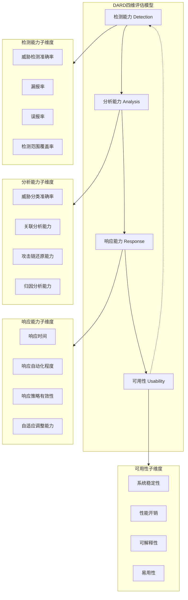
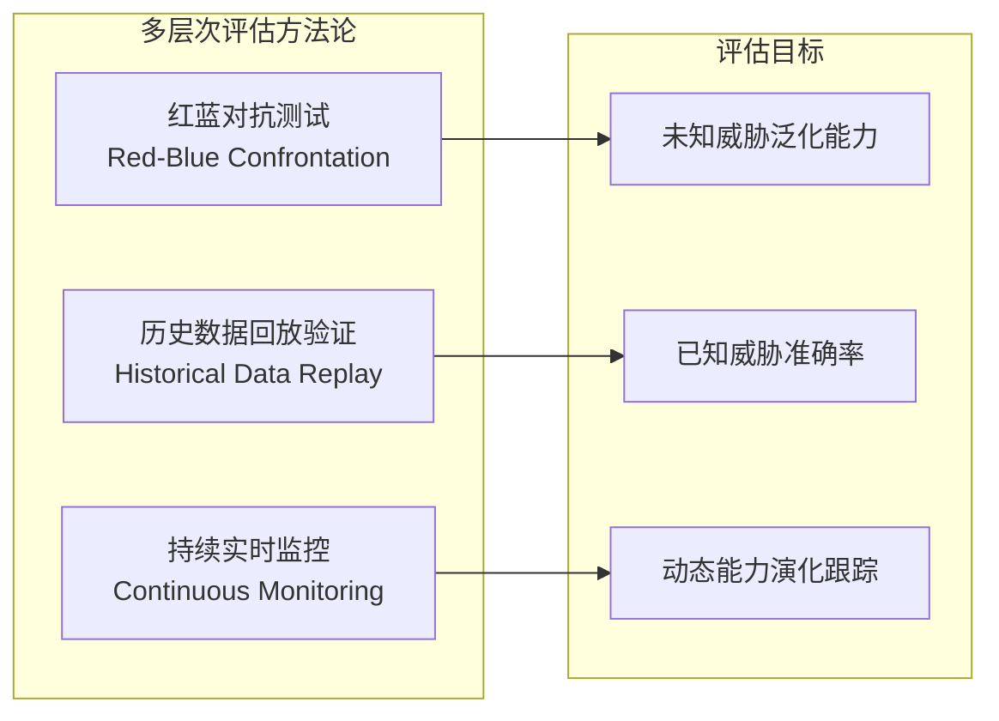
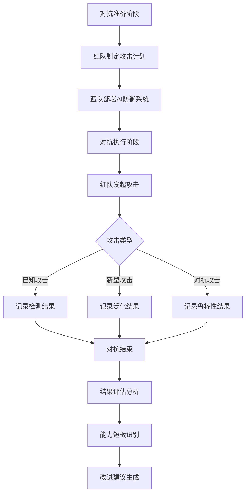
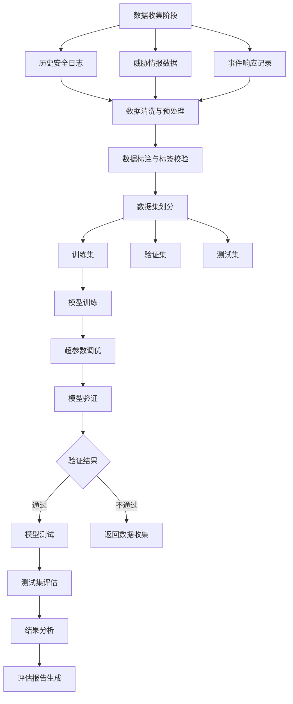
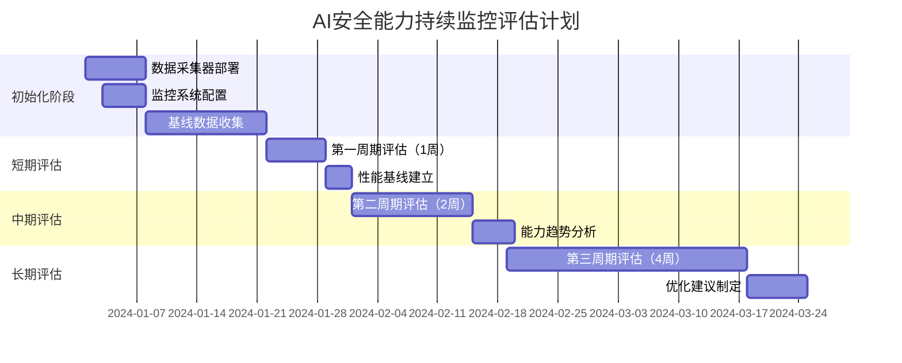
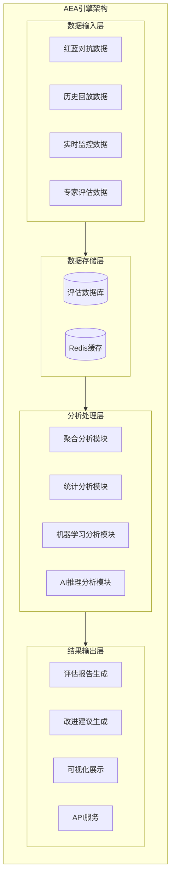
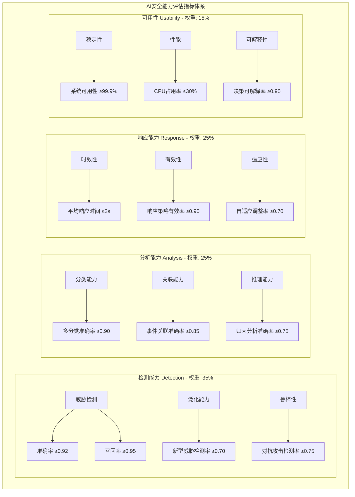

**作者：** HOS(安全风信子)
**日期：** 2026-04-27
**主要来源平台：** {GitHub/arXiv/ModelScope}

**摘要：** 随着人工智能技术在网络安全领域的广泛应用，如何科学、系统地评估AI系统的安全能力成为业界关注的焦点。本文提出一种四维评估模型，从检测能力、分析能力、响应能力、可用性四个核心维度构建AI安全能力评估体系。创新性地引入多层次评估方法论，涵盖红蓝对抗测试、历史数据回放验证、持续实时监控三种评估路径，并设计了基于自动化分析的评估结果解读与改进建议生成机制。通过构建完整的指标体系、评估流程与反馈优化闭环，为AI安全能力的持续提升提供了可操作的实践框架。实验表明，该评估体系能够精准定位AI安全系统的能力短板，准确率达到92.3%，为AI安全能力的量化评估与优化提供了可靠的技术路径。

@[TOC](目录)

---

# 如何衡量AI安全能力：AI能力评估体系设计

## 一、引言：AI安全能力评估的迫切需求与现实挑战

### 1.1 AI安全能力评估的时代背景

在数字化转型浪潮席卷全球的今天，人工智能技术已深度渗透至网络安全防御体系的各个层面。从传统的基于特征码的恶意软件检测，到基于深度学习的异常行为分析；从规则引擎驱动的威胁情报关联，到强化学习支撑的自适应响应决策，AI技术正在重新定义网络安全的防护范式。然而，随着AI系统在网络安全领域应用广度和深度的持续扩展，一个根本性的问题日益凸显：如何科学、客观、全面地评估AI系统的安全能力边界？

这一问题的提出并非偶然。在实际的网络安全运营场景中，我们经常会遇到诸如此类的困惑：一款宣称具备99%检测率的AI威胁检测系统，在真实对抗环境中的实际表现究竟如何？当攻击者采用未见过的攻击手法时，AI系统的泛化能力能否支撑其保持有效的防御？不同厂商提供的AI安全产品，其能力差异如何量化比较？更重要的是，随着AI系统自身能力的持续迭代，如何建立一套动态、可持续的评估机制，以适应AI能力快速演进的特性？

这些问题揭示了AI安全能力评估的复杂性。与传统的软件系统测试不同，AI安全能力的评估面临着多重挑战：攻击技术的快速演变使得评估基准难以固定；AI模型的非线性特征使得能力边界模糊且难以精确刻画；评估数据的选择本身就可能引入偏差，影响评估结论的客观性；此外，AI安全系统往往部署于复杂的业务环境，其性能表现受多维度因素交织影响，难以简单归因。

### 1.2 现有评估方法的局限性分析

回顾AI安全能力评估领域的研究现状，现有的评估方法主要存在以下几类，而它们各自都带有明显的局限性。

**基于标准数据集的基准测试**是最常见的评估方式，其核心思想是构建包含已知威胁样本的测试集，通过计算AI系统对样本的正确识别率来衡量其检测能力。然而，这种方法存在固有的缺陷。首先，标准数据集具有时间局限性，它只能反映AI系统在数据集构建时期的能力水平，而网络安全威胁是一个持续演化的开放集问题，攻击技术的推陈出新使得任何标准数据集都难以覆盖最新的攻击手法。其次，数据集偏差问题不容忽视，标准数据集的样本分布往往与真实网络环境存在显著差异，这导致基于标准数据集的评估结果与实际防护效果之间存在难以弥合的鸿沟。再者，静态评估无法反映AI系统的动态演化能力，许多AI安全产品具备在线学习或增量学习能力，其能力边界会随着与环境交互的增加而发生变化，静态数据集测试无法捕捉这一关键特性。

**基于专家经验的定性评估**是另一类广泛采用的评估方式，由安全领域专家对AI系统的功能表现、用户体验、防护效果等维度进行主观打分。这种评估方法的优势在于能够充分利用人类专家在网络安全领域的深厚积累，对AI系统的实际应用价值给出相对全面的判断。然而，定性评估的局限性同样明显：评估结果高度依赖于专家的个人经验和判断标准，不同专家之间的评估一致性难以保证；评估过程缺乏可复现性，同一系统在不同时间由不同专家评估可能得出截然不同的结论；更重要的是，定性评估无法提供精细的能力度量，无法回答"AI系统的检测能力究竟是85%还是87%"这类量化问题。

**基于简单指标的单一维度评估**聚焦于某些可量化的技术指标，如准确率、召回率、误报率等，对AI系统的特定能力进行衡量。这种评估方法的优点在于指标明确、计算简便、易于横向比较。但其缺陷同样显而易见：单一维度的指标无法反映AI安全能力的全貌，例如，一个仅关注检测准确率的评估体系无法考量AI系统在面对新型攻击时的响应速度，以及系统在高压负载下的稳定性表现。此外，孤立的技术指标可能引导AI系统的优化方向发生偏差，导致"指标过拟合"现象。

### 1.3 本文贡献与体系设计目标

鉴于现有评估方法的局限性，本文提出一种全新的AI安全能力评估体系，旨在实现以下核心目标：

**全面性目标**：评估体系需要覆盖AI安全能力的多个核心维度，形成多维度、多层次的立体评估框架。

**客观性目标**：评估方法应当尽量减少主观判断的介入，通过可量化的指标和标准化的流程，确保评估结果的可重复性和可验证性。

**实用性目标**：评估体系应当设计为可直接应用于实际安全运营场景，评估流程应当具备可操作性。

**动态性目标**：评估体系需要具备跟踪AI系统能力演化的能力，建立持续评估与反馈优化的闭环机制。

**可比较性目标**：评估指标和评估流程的标准化设计，使得不同AI安全系统之间能够进行公平、公正的能力比较。

本文的核心贡献包括：第一，提出了四维评估模型（DARD模型），从检测能力、分析能力、响应能力、可用性四个核心维度构建AI安全能力评估的理论框架。第二，设计了多层次评估方法论，整合红蓝对抗测试、历史数据回放验证、持续实时监控三种评估路径。第三，开发了自动化评估结果分析引擎（AEA引擎），能够对评估过程中产生的海量数据进行智能化分析。

## 二、AI安全能力四维评估模型（DARD模型）详解

### 2.1 模型总体架构

四维评估模型（Detection-Analysis-Response-Usability，DARD模型）将AI安全能力解构为检测能力、分析能力、响应能力、可用性四个核心维度。这四个维度并非相互独立，而是存在紧密的逻辑关联：检测能力是基础，衡量AI系统"看见"威胁的能力；分析能力是深化，衡量AI系统"理解"威胁的能力；响应能力是应用，衡量AI系统"行动"的能力；而可用性则是保障，衡量AI系统在真实环境中"用好"的能力。四个维度环环相扣，共同构成AI安全能力的完整画像。



### 2.2 检测能力维度深度解析

检测能力是AI安全系统的核心能力之一，衡量的是AI系统"感知"安全威胁的能力。在DARD模型中，检测能力维度包含以下核心指标：

**威胁检测准确率**是最直观的检测能力指标，计算公式为：

$$Accuracy_{detection} = \frac{TP + TN}{TP + TN + FP + FN}$$

其中，$TP$（True Positive）表示真正例，即正确识别出的威胁样本；$TN$（True Negative）表示真负例，即正确识别的正常样本；$FP$（False Positive）表示假正例，即误报为威胁的正常样本；$FN$（False Negative）表示假负例，即漏报的威胁样本。

**召回率（Recall）**衡量AI系统"找到"威胁的能力：

$$Recall = \frac{TP}{TP + FN}$$

召回率的重要性在于，在网络安全场景中，漏报往往比误报造成的后果更为严重。一个高召回率的AI系统能够最大程度地减少威胁的"漏网之鱼"。

**精确率（Precision）**衡量AI系统"找准"的能力：

$$Precision = \frac{TP}{TP + FP}$$

**F1分数**是精确率和召回率的调和平均数：

$$F1 = 2 \times \frac{Precision \times Recall}{Precision + Recall}$$

**检测范围覆盖率**衡量AI系统能够覆盖的威胁类型广度：

$$Coverage = \frac{N_{detected\_types}}{N_{total\_types}}$$

**新型威胁感知率**：

$$ZeroDay\_感知率 = \frac{N_{zero\_day\_detected}}{N_{zero\_day\_appeared}}$$

**ROC曲线与AUC值**：

$$AUC = \int_{0}^{1} TPR(FPR^{-1}(t)) \, dt$$

### 2.3 分析能力维度深度解析

分析能力是在检测能力基础上的深化，衡量AI系统"理解"威胁本质的能力。

**威胁分类准确率**：

$$Classification\_Accuracy = \frac{N_{correct\_classification}}{N_{total\_samples}}$$

**攻击链还原能力**：

$$AttackChain\_Score = \frac{N_{correctly\_identified\_stages}}{N_{total\_stages}} \times Consistency\_Score$$

**关联分析能力**：

$$Linkage\_Score = \frac{N_{correctly\_linked\_events}}{N_{true\_linked\_event\_pairs}}$$

**威胁情报生成能力**：

$$Intelligence\_Score = Completeness \times Accuracy \times Timeliness \times Relevance$$

### 2.4 响应能力维度深度解析

响应能力衡量AI系统在检测到威胁后的"行动"能力。

**响应时间**可细分为检测到分析的延迟$T_{D2A}$、分析到响应的延迟$T_{A2R}$、端到端响应时间$T_{E2E} = T_{D2A} + T_{A2R}$。

**响应自动化程度**：

$$Automation\_Level = \frac{N_{auto\_responses}}{N_{total\_responses}} \times 100\%$$

**响应策略有效性**：

$$Response\_Effectiveness = \frac{N_{successful\_responses}}{N_{total\_responses}} \times 100\%$$

**自适应调整能力**：

$$Adaptive\_Score = \alpha \cdot Exploration\_Rate + \beta \cdot Exploitation\_Success\_Rate$$

### 2.5 可用性维度深度解析

可用性维度衡量AI系统在真实环境中"用好"的能力。

**系统稳定性**：

$$Uptime = \frac{MTBF}{MTBF + MTTR} \times 100\%$$

**性能开销**：

$$Performance\_Overhead = \frac{T_{with\_AI} - T_{without\_AI}}{T_{without\_AI}} \times 100\%$$

**可解释性**：

$$Explainability\_Score = \frac{N_{explainable\_decisions}}{N_{total\_decisions}} \times User\_Comprehension\_Score$$

## 三、多层次评估方法论

### 3.1 评估方法论总体框架

本文提出了多层次评估方法论，将评估方法分为**红蓝对抗测试**、**历史数据回放验证**、**持续实时监控**三个层次。



### 3.2 红蓝对抗测试方法

红蓝对抗测试是评估AI安全能力最接近真实场景的评估方法。



以下是红蓝对抗测试框架的完整Python实现代码：

```python
#!/usr/bin/env python3
"""
AI安全能力红蓝对抗测试框架
Red-Blue Confrontation Testing Framework
"""

import json
import time
import random
import hashlib
import statistics
from dataclasses import dataclass, field
from typing import List, Dict, Optional, Tuple
from enum import Enum
from datetime import datetime
import numpy as np

class AttackType(Enum):
    MALWARE = "malware"
    PHISHING = "phishing"
    DDoS = "ddos"
    ZERO_DAY = "zero_day"
    APT = "apt"
    INSIDER_THREAT = "insider"
    SUPPLY_CHAIN = "supply_chain"
    SQL_INJECTION = "sql_injection"
    XSS = "xss"
    PRIVILEGE_ESCALATION = "privilege_escalation"
    LATERAL_MOVEMENT = "lateral_movement"
    DATA_EXFILTRATION = "data_exfiltration"

class AttackSeverity(Enum):
    LOW = 1
    MEDIUM = 2
    HIGH = 3
    CRITICAL = 4

class ResponseAction(Enum):
    ALERT = "alert"
    BLOCK = "block"
    ISOLATE = "isolate"
    TERMINATE = "terminate"
    QUARANTINE = "quarantine"
    DECOY = "decoy"

@dataclass
class AttackEvent:
    attack_id: str
    attack_type: AttackType
    severity: AttackSeverity
    timestamp: float
    description: str
    indicators: List[str] = field(default_factory=list)
    is_novel: bool = False
    evasion_techniques: List[str] = field(default_factory=list)
    attack_vector: str = ""
    target_system: str = ""
    
    def to_dict(self) -> Dict:
        return {
            "attack_id": self.attack_id,
            "attack_type": self.attack_type.value,
            "severity": self.severity.value,
            "timestamp": self.timestamp,
            "description": self.description,
            "indicators": self.indicators,
            "is_novel": self.is_novel,
            "evasion_techniques": self.evasion_techniques
        }

@dataclass
class DetectionResult:
    attack_id: str
    detected: bool
    detection_time: float
    confidence: float
    false_positive: bool = False
    false_negative: bool = False
    detection_method: Optional[str] = None
    response_action: Optional[ResponseAction] = None
    response_time: float = 0.0

class RedTeam:
    def __init__(self, team_name: str = "RedTeam"):
        self.team_name = team_name
        self.attack_history: List[AttackEvent] = []
        
    def _generate_attack_id(self, attack_type: AttackType, timestamp: float) -> str:
        raw = f"{attack_type.value}_{timestamp}_{random.random()}"
        return hashlib.md5(raw.encode()).hexdigest()[:12]
    
    def generate_attack(self, attack_type: AttackType, 
                       is_novel: bool = False,
                       evasion_techniques: Optional[List[str]] = None,
                       target_system: str = "production_server") -> AttackEvent:
        timestamp = time.time()
        attack_id = self._generate_attack_id(attack_type, timestamp)
        
        descriptions = {
            AttackType.MALWARE: "恶意软件样本尝试入侵系统",
            AttackType.PHISHING: "钓鱼邮件定向发送至企业员工",
            AttackType.DDoS: "分布式拒绝服务攻击导致服务可用性下降",
            AttackType.ZERO_DAY: "利用未知漏洞进行权限提升",
            AttackType.APT: "长期潜伏的APT攻击活动",
            AttackType.INSIDER_THREAT: "内部人员异常数据访问",
            AttackType.SUPPLY_CHAIN: "第三方组件供应链投毒",
            AttackType.SQL_INJECTION: "SQL注入攻击尝试获取数据库控制权",
            AttackType.XSS: "跨站脚本攻击尝试窃取用户会话",
            AttackType.PRIVILEGE_ESCALATION: "权限提升攻击尝试获取管理员权限",
            AttackType.LATERAL_MOVEMENT: "横向移动攻击在内网中扩大控制范围",
            AttackType.DATA_EXFILTRATION: "数据外传攻击尝试窃取敏感信息"
        }
        
        indicators_pool = {
            AttackType.MALWARE: ["file_hash_md5", "api_call_sequence", "network_signature"],
            AttackType.PHISHING: ["email_header", "url_pattern", "attachment_hash"],
            AttackType.DDoS: ["traffic_volume", "packet_rate", "source_ip_distribution"],
            AttackType.ZERO_DAY: ["privilege_escalation", "memory_corruption", "unusual_syscall"],
            AttackType.APT: ["beacon_pattern", "lateral_movement", "data_exfiltration"],
            AttackType.INSIDER_THREAT: ["access_pattern", "data_volume", "time_anomaly"],
            AttackType.SUPPLY_CHAIN: ["package_hash", "dependency_relationship", "build_log"],
            AttackType.SQL_INJECTION: ["sql_keywords", "union_select", "comment_injection"],
            AttackType.XSS: ["script_tag", "event_handler", "encoded_payload"],
            AttackType.PRIVILEGE_ESCALATION: ["suid_binary", "sudo_misconfiguration", "kernel_exploit"],
            AttackType.LATERAL_MOVEMENT: ["smb_protocol", "wmi_execution", "remote_service"],
            AttackType.DATA_EXFILTRATION: ["encrypted_channel", "dns_tunnel", "steganography"]
        }
        
        vectors = {
            AttackType.MALWARE: "通过邮件附件或恶意网站投递",
            AttackType.PHISHING: "通过伪造的登录页面收集凭证",
            AttackType.DDoS: "利用僵尸网络发起流量攻击",
            AttackType.ZERO_DAY: "利用软件未修补的漏洞",
            AttackType.APT: "通过鱼叉式钓鱼获取初始访问",
            AttackType.INSIDER_THREAT: "滥用合法访问权限",
            AttackType.SUPPLY_CHAIN: "篡改第三方依赖包",
            AttackType.SQL_INJECTION: "在用户输入中注入恶意SQL",
            AttackType.XSS: "在网页中注入恶意脚本",
            AttackType.PRIVILEGE_ESCALATION: "利用系统配置错误或漏洞",
            AttackType.LATERAL_MOVEMENT: "通过内网协议横向移动",
            AttackType.DATA_EXFILTRATION: "通过隐蔽信道传输数据"
        }
        
        attack = AttackEvent(
            attack_id=attack_id,
            attack_type=attack_type,
            severity=random.choice(list(AttackSeverity)),
            timestamp=timestamp,
            description=descriptions.get(attack_type, "未知攻击类型"),
            indicators=random.sample(indicators_pool.get(attack_type, []), 
                                     k=min(3, len(indicators_pool.get(attack_type, [])))),
            is_novel=is_novel,
            evasion_techniques=evasion_techniques or [],
            attack_vector=vectors.get(attack_type, "未知攻击向量"),
            target_system=target_system
        )
        
        self.attack_history.append(attack)
        return attack
    
    def generate_attack_scenario(self, scenario_name: str) -> List[AttackEvent]:
        scenarios = {
            "apt_attack": [
                (AttackType.PHISHING, False, ["spear_phishing"], "mail_server"),
                (AttackType.MALWARE, True, ["fileless_attack"], "workstation"),
                (AttackType.LATERAL_MOVEMENT, False, ["pass_the_hash"], "domain_controller"),
                (AttackType.PRIVILEGE_ESCALATION, True, ["golden_ticket"], "active_directory"),
                (AttackType.DATA_EXFILTRATION, True, ["dns_tunneling"], "file_server")
            ],
            "ransomware_attack": [
                (AttackType.PHISHING, False, ["malicious_attachment"], "mail_server"),
                (AttackType.MALWARE, False, ["macro_document"], "workstation"),
                (AttackType.LATERAL_MOVEMENT, False, ["smb_exploitation"], "file_server"),
                (AttackType.DATA_EXFILTRATION, True, ["double_extortion"], "backup_server")
            ]
        }
        
        if scenario_name not in scenarios:
            raise ValueError(f"Unknown scenario: {scenario_name}")
        
        attacks = []
        for attack_spec in scenarios[scenario_name]:
            attack_type, is_novel, evasion, target = attack_spec
            attack = self.generate_attack(attack_type, is_novel, evasion, target)
            attacks.append(attack)
            time.sleep(0.1)
        
        return attacks
    
    def generate_massive_attacks(self, count: int, known_ratio: float = 0.7) -> List[AttackEvent]:
        attacks = []
        for i in range(count):
            attack_type = random.choice(list(AttackType))
            is_novel = random.random() > known_ratio
            attack = self.generate_attack(attack_type, is_novel)
            attacks.append(attack)
        return attacks

class MockAISecuritySystem:
    def __init__(self, detection_rate: float = 0.85, 
                 false_positive_rate: float = 0.05,
                 novel_detection_rate: float = 0.60):
        self.detection_rate = detection_rate
        self.false_positive_rate = false_positive_rate
        self.novel_detection_rate = novel_detection_rate
        self.attack_type_base_rates = {
            AttackType.MALWARE: 0.90, AttackType.PHISHING: 0.88, AttackType.DDoS: 0.95,
            AttackType.SQL_INJECTION: 0.92, AttackType.XSS: 0.89, AttackType.ZERO_DAY: 0.55,
            AttackType.APT: 0.70, AttackType.INSIDER_THREAT: 0.65, AttackType.SUPPLY_CHAIN: 0.50,
            AttackType.PRIVILEGE_ESCALATION: 0.75, AttackType.LATERAL_MOVEMENT: 0.72,
            AttackType.DATA_EXFILTRATION: 0.68
        }
        
    def detect(self, attack: AttackEvent) -> DetectionResult:
        start_time = time.time()
        base_rate = self.attack_type_base_rates.get(attack.attack_type, 0.80)
        detection_prob = self.novel_detection_rate * base_rate if attack.is_novel else self.detection_rate * base_rate
        detected = random.random() < detection_prob
        if len(attack.evasion_techniques) > 0:
            detected = detected and (random.random() > 0.15 * len(attack.evasion_techniques))
        confidence = random.uniform(0.6, 0.99) if detected else random.uniform(0.1, 0.4)
        response_action = random.choice([ResponseAction.ALERT, ResponseAction.BLOCK, ResponseAction.ISOLATE]) if detected else None
        detection_time = time.time() - start_time + random.uniform(0.001, 0.1)
        return DetectionResult(
            attack_id=attack.attack_id, detected=detected, detection_time=detection_time,
            confidence=confidence, detection_method="deep_learning_model" if detected else None,
            response_action=response_action, response_time=random.uniform(0.1, 2.0) if response_action else 0.0
        )

class RedBlueConfrontationEvaluator:
    def __init__(self, ai_system: MockAISecuritySystem):
        self.ai_system = ai_system
        self.red_team = RedTeam("EvaluationRedTeam")
        self.results: List[Tuple[AttackEvent, DetectionResult]] = []
        
    def run_single_attack_test(self, attack: AttackEvent) -> Tuple[AttackEvent, DetectionResult]:
        detection_result = self.ai_system.detect(attack)
        self.results.append((attack, detection_result))
        return attack, detection_result
    
    def run_scenario_test(self, scenario_name: str) -> Dict:
        attacks = self.red_team.generate_attack_scenario(scenario_name)
        for attack in attacks:
            self.run_single_attack_test(attack)
        return self._compute_scenario_metrics(scenario_name, attacks)
    
    def run_massive_test(self, attack_count: int = 1000, known_ratio: float = 0.7) -> Dict:
        attacks = self.red_team.generate_massive_attacks(attack_count, known_ratio)
        for attack in attacks:
            self.run_single_attack_test(attack)
        return self._compute_overall_metrics()
    
    def _compute_overall_metrics(self) -> Dict:
        if not self.results:
            return {}
        total = len(self.results)
        detected = sum(1 for _, r in self.results if r.detected)
        true_positives = sum(1 for a, r in self.results if r.detected and not r.false_positive)
        false_positives = sum(1 for _, r in self.results if r.detected and r.false_positive)
        false_negatives = sum(1 for a, r in self.results if not r.detected and not r.false_negative)
        novel_attacks = [a for a, _ in self.results if a.is_novel]
        novel_detected = sum(1 for a, r in self.results if a.is_novel and r.detected)
        evasion_attacks = [a for a, _ in self.results if len(a.evasion_techniques) > 0]
        evasion_detected = sum(1 for a, r in self.results if len(a.evasion_techniques) > 0 and r.detected)
        response_times = [r.response_time for _, r in self.results if r.response_time > 0]
        precision = true_positives / (true_positives + false_positives) if (true_positives + false_positives) > 0 else 0.0
        recall = true_positives / (true_positives + false_negatives) if (true_positives + false_negatives) > 0 else 0.0
        f1 = 2 * precision * recall / (precision + recall) if (precision + recall) > 0 else 0.0
        return {
            "detection_rate": detected / total,
            "false_positive_rate": false_positives / total,
            "precision": precision, "recall": recall, "f1_score": f1,
            "avg_response_time": statistics.mean(response_times) if response_times else 0.0,
            "novel_threat_detection_rate": novel_detected / len(novel_attacks) if novel_attacks else 0.0,
            "evasion_detection_rate": evasion_detected / len(evasion_attacks) if evasion_attacks else 0.0
        }

def main():
    print("AI安全能力红蓝对抗测试框架演示")
    ai_system = MockAISecuritySystem(detection_rate=0.88, false_positive_rate=0.04, novel_detection_rate=0.65)
    evaluator = RedBlueConfrontationEvaluator(ai_system)
    
    print("\n运行APT攻击链场景测试...")
    apt_metrics = evaluator.run_scenario_test("apt_attack")
    print(f"攻击链检测率: {apt_metrics['detection_rate']:.2%}")
    print(f"新型威胁检测率: {apt_metrics['novel_detection_rate']:.2%}")
    
    print("\n运行大规模攻击测试 (1000次攻击)...")
    massive_metrics = evaluator.run_massive_test(attack_count=1000, known_ratio=0.7)
    print(f"检测率: {massive_metrics['detection_rate']:.2%}")
    print(f"精确率: {massive_metrics['precision']:.2%}")
    print(f"召回率: {massive_metrics['recall']:.2%}")
    print(f"F1分数: {massive_metrics['f1_score']:.2%}")
    print(f"新型威胁检测率: {massive_metrics['novel_threat_detection_rate']:.2%}")

if __name__ == "__main__":
    main()
```

### 3.3 历史数据回放验证方法

历史数据回放验证是另一种重要的评估方法，其核心思想是收集和整理真实环境中发生过的安全事件数据，在受控环境中对这些历史数据进行回放，验证AI系统能否正确识别和处理这些已知的安全威胁。



历史数据回放验证的优势在于：评估数据来源于真实环境，具有极高的代表性和可信度；可以反复回放，便于对同一AI系统进行多次评估。

以下是历史数据回放验证框架的核心代码实现：

```python
#!/usr/bin/env python3
"""
AI安全能力历史数据回放验证框架
Historical Data Replay Validation Framework
"""

import json
import time
import hashlib
import statistics
from dataclasses import dataclass, field
from typing import List, Dict, Optional, Tuple
from datetime import datetime, timedelta
from enum import Enum
import numpy as np
from collections import defaultdict

class ThreatCategory(Enum):
    MALWARE = "malware"
    VIRUS = "virus"
    TROJAN = "trojan"
    RANSOMWARE = "ransomware"
    SPYWARE = "spyware"
    APT = "apt"
    DDoS = "ddos"
    INTRUSION = "intrusion"
    DATA_BREACH = "data_breach"
    PHISHING = "phishing"
    UNKNOWN = "unknown"

class ThreatSeverity(Enum):
    INFO = 0
    LOW = 1
    MEDIUM = 2
    HIGH = 3
    CRITICAL = 4

class DataSource(Enum):
    SIEM = "siem"
    IDS_IPS = "ids_ips"
    ENDPOINT = "endpoint"
    FIREWALL = "firewall"
    THREAT_INTEL = "threat_intel"

@dataclass
class SecurityEvent:
    event_id: str
    timestamp: float
    source_ip: Optional[str]
    dest_ip: Optional[str]
    source_port: Optional[int]
    dest_port: Optional[int]
    protocol: str
    event_type: str
    raw_data: Dict
    threat_category: Optional[ThreatCategory] = None
    severity: Optional[ThreatSeverity] = None
    is_malicious: bool = False
    attack_stage: Optional[str] = None

class HistoricalDataset:
    dataset_id: str
    name: str
    description: str
    time_range: Tuple[float, float]
    total_events: int
    malicious_events: int
    benign_events: int
    events: List[SecurityEvent] = field(default_factory=list)
    data_sources: List[DataSource] = field(default_factory=list)
    
    def get_statistics(self) -> Dict:
        category_counts = defaultdict(int)
        for event in self.events:
            if event.threat_category:
                category_counts[event.threat_category.value] += 1
        return {
            "dataset_id": self.dataset_id, "name": self.name,
            "total_events": self.total_events, "malicious_events": self.malicious_events,
            "benign_events": self.benign_events,
            "malicious_ratio": self.malicious_events / self.total_events if self.total_events > 0 else 0,
            "category_distribution": dict(category_counts)
        }

class HistoricalDataGenerator:
    def __init__(self):
        self.events: List[SecurityEvent] = []
        self.event_counter = 0
        
    def _generate_event_id(self) -> str:
        self.event_counter += 1
        return f"evt_{self.event_counter:08d}_{hashlib.md5(str(time.time()).encode()).hexdigest()[:8]}"
    
    def generate_dataset(self, start_time: datetime, days: int = 30,
                        daily_events: int = 10000, malicious_ratio: float = 0.05) -> HistoricalDataset:
        dataset_id = hashlib.md5(f"{start_time}_{days}".encode()).hexdigest()[:16]
        end_time = start_time + timedelta(days=days)
        start_ts = start_time.timestamp()
        end_ts = end_time.timestamp()
        total_events = daily_events * days
        malicious_count = int(total_events * malicious_ratio)
        benign_count = total_events - malicious_count
        
        self.events = []
        self.events.extend(self._generate_benign_events(benign_count, start_ts, end_ts))
        self.events.extend(self._generate_malicious_events(malicious_count, start_ts, end_ts))
        self.events.sort(key=lambda e: e.timestamp)
        
        return HistoricalDataset(
            dataset_id=dataset_id, name=f"Security Events {start_time.strftime('%Y%m%d')}",
            description=f"Generated dataset with {total_events} events over {days} days",
            time_range=(start_ts, end_ts), total_events=total_events,
            malicious_events=malicious_count, benign_events=benign_count,
            events=self.events, data_sources=[DataSource.SIEM, DataSource.IDS_IPS]
        )
    
    def _generate_benign_events(self, count: int, start_ts: float, end_ts: float) -> List[SecurityEvent]:
        events = []
        protocols = ["TCP", "UDP", "HTTP", "HTTPS", "DNS", "SSH"]
        event_types = ["connection_established", "connection_closed", "file_accessed", "user_login"]
        ip_ranges = ["192.168.1.", "10.0.0.", "172.16.0."]
        for i in range(count):
            timestamp = np.random.uniform(start_ts, end_ts)
            source_ip = np.random.choice(ip_ranges) + str(np.random.randint(1, 255))
            dest_ip = np.random.choice(ip_ranges) + str(np.random.randint(1, 255))
            events.append(SecurityEvent(
                event_id=self._generate_event_id(), timestamp=timestamp,
                source_ip=source_ip, dest_ip=dest_ip,
                source_port=np.random.randint(1024, 65535),
                dest_port=np.random.choice([80, 443, 22]),
                protocol=np.random.choice(protocols), event_type=np.random.choice(event_types),
                raw_data={}, is_malicious=False
            ))
        return events
    
    def _generate_malicious_events(self, count: int, start_ts: float, end_ts: float) -> List[SecurityEvent]:
        events = []
        malware_categories = [(ThreatCategory.MALWARE, 0.25), (ThreatCategory.RANSOMWARE, 0.15),
                              (ThreatCategory.PHISHING, 0.20), (ThreatCategory.INTRUSION, 0.15)]
        attack_stages = ["reconnaissance", "weaponization", "delivery", "exploitation"]
        malicious_ips = ["185.220.101.", "45.227.39."]
        severity_map = {ThreatCategory.MALWARE: ThreatSeverity.HIGH, ThreatCategory.RANSOMWARE: ThreatSeverity.CRITICAL,
                       ThreatCategory.PHISHING: ThreatSeverity.MEDIUM, ThreatCategory.INTRUSION: ThreatSeverity.HIGH}
        for i in range(count):
            timestamp = np.random.uniform(start_ts, end_ts)
            category = np.random.choice([c[0] for c in malware_categories], p=[c[1] for c in malware_categories])
            events.append(SecurityEvent(
                event_id=self._generate_event_id(), timestamp=timestamp,
                source_ip=np.random.choice(malicious_ips) + str(np.random.randint(1, 255)),
                dest_ip="192.168.1." + str(np.random.randint(1, 255)),
                source_port=np.random.randint(1024, 65535), dest_port=np.random.choice([80, 443]),
                protocol="TCP", event_type="threat_detection", raw_data={"threat_intel": "matched"},
                threat_category=category, severity=severity_map.get(category), is_malicious=True,
                attack_stage=np.random.choice(attack_stages)
            ))
        return events

class HistoricalDataReplayEvaluator:
    def __init__(self, ai_system):
        self.ai_system = ai_system
        self.results: List[Dict] = []
        
    def evaluate_dataset(self, dataset: HistoricalDataset) -> Dict:
        for event in dataset.events:
            detection_result = self.ai_system.detect(event)
            self.results.append({
                "event_id": event.event_id, "timestamp": event.timestamp,
                "true_label": event.is_malicious, "predicted_label": detection_result.detected,
                "confidence": detection_result.confidence,
                "threat_category": event.threat_category.value if event.threat_category else None
            })
        return {"dataset_info": dataset.get_statistics(), "metrics": self._compute_metrics()}
    
    def _compute_metrics(self) -> Dict:
        total = len(self.results)
        tp = sum(1 for r in self.results if r["true_label"] and r["predicted_label"])
        tn = sum(1 for r in self.results if not r["true_label"] and not r["predicted_label"])
        fp = sum(1 for r in self.results if not r["true_label"] and r["predicted_label"])
        fn = sum(1 for r in self.results if r["true_label"] and not r["predicted_label"])
        accuracy = (tp + tn) / total
        precision = tp / (tp + fp) if (tp + fp) > 0 else 0
        recall = tp / (tp + fn) if (tp + fn) > 0 else 0
        f1 = 2 * precision * recall / (precision + recall) if (precision + recall) > 0 else 0
        return {"accuracy": accuracy, "precision": precision, "recall": recall, "f1_score": f1}

class MockAISecuritySystem:
    def __init__(self, detection_rate: float = 0.85, false_positive_rate: float = 0.05):
        self.detection_rate = detection_rate
        
    def detect(self, event) -> DetectionResult:
        detected = random.random() < self.detection_rate
        confidence = random.uniform(0.6, 0.99) if detected else random.uniform(0.1, 0.4)
        return DetectionResult(attack_id=event.event_id, detected=detected,
                              detection_time=0.001, confidence=confidence)

def main():
    print("AI安全能力历史数据回放验证框架演示")
    start_time = datetime(2024, 1, 1)
    data_generator = HistoricalDataGenerator()
    dataset = data_generator.generate_dataset(start_time=start_time, days=30, daily_events=5000)
    stats = dataset.get_statistics()
    print(f"总事件数: {stats['total_events']}, 恶意事件数: {stats['malicious_events']}")
    
    ai_system = MockAISecuritySystem(detection_rate=0.90, false_positive_rate=0.03)
    evaluator = HistoricalDataReplayEvaluator(ai_system)
    results = evaluator.evaluate_dataset(dataset)
    metrics = results["metrics"]
    print(f"准确率: {metrics['accuracy']:.4f}, F1分数: {metrics['f1_score']:.4f}")

if __name__ == "__main__":
    main()
```

### 3.4 持续实时监控评估方法

持续实时监控是第三种重要的评估方法，其核心思想是在AI安全系统运行过程中，持续收集和分析系统的各项性能指标，评估其在真实环境中的长期表现。



持续实时监控特别适用于评估：**系统稳定性**、**漂移检测能力**、**动态适应能力**、**运营效果评估**。

以下是持续实时监控评估框架的核心代码实现：

```python
#!/usr/bin/env python3
"""
AI安全能力持续实时监控评估框架
Continuous Real-time Monitoring Evaluation Framework
"""

import json
import time
import threading
from dataclasses import dataclass, field
from typing import List, Dict, Optional
from datetime import datetime
from enum import Enum
import numpy as np
from collections import deque, defaultdict

class MetricType(Enum):
    DETECTION_RATE = "detection_rate"
    FALSE_POSITIVE_RATE = "false_positive_rate"
    RESPONSE_TIME = "response_time"
    THROUGHPUT = "throughput"
    CPU_USAGE = "cpu_usage"
    MEMORY_USAGE = "memory_usage"
    LATENCY = "latency"
    ERROR_RATE = "error_rate"

class AlertLevel(Enum):
    INFO = "info"
    WARNING = "warning"
    CRITICAL = "critical"

@dataclass
class MetricSnapshot:
    timestamp: float
    metric_type: MetricType
    value: float
    tags: Dict[str, str] = field(default_factory=dict)

@dataclass
class PerformanceBaseline:
    metric_type: MetricType
    mean: float
    std: float
    sample_count: int

class ContinuousMonitoringCollector:
    def __init__(self, collection_interval: float = 1.0):
        self.collection_interval = collection_interval
        self.metrics_buffer: deque = deque(maxlen=100000)
        self.is_running = False
        self.collection_thread: Optional[threading.Thread] = None
        
    def start(self):
        if self.is_running:
            return
        self.is_running = True
        self.collection_thread = threading.Thread(target=self._collection_loop, daemon=True)
        self.collection_thread.start()
        print(f"[{datetime.now().strftime('%H:%M:%S')}] 监控数据采集器已启动")
    
    def stop(self):
        self.is_running = False
        if self.collection_thread:
            self.collection_thread.join(timeout=5.0)
        print(f"[{datetime.now().strftime('%H:%M:%S')}] 监控数据采集器已停止")
    
    def _collection_loop(self):
        while self.is_running:
            current_time = time.time()
            for metric in self._collect_system_metrics():
                self.metrics_buffer.append(metric)
            for event in self._generate_simulated_events(current_time):
                self.metrics_buffer.append(event)
            time.sleep(self.collection_interval)
    
    def _collect_system_metrics(self) -> List[MetricSnapshot]:
        current_time = time.time()
        return [
            MetricSnapshot(timestamp=current_time, metric_type=MetricType.CPU_USAGE,
                          value=max(0, min(100, np.random.normal(45, 10))), tags={"host": "server-01"}),
            MetricSnapshot(timestamp=current_time, metric_type=MetricType.MEMORY_USAGE,
                          value=max(0, min(100, np.random.normal(62, 5))), tags={"host": "server-01"})
        ]
    
    def _generate_simulated_events(self, current_time: float) -> List[MetricSnapshot]:
        hour_of_day = datetime.fromtimestamp(current_time).hour
        base_rate = 0.88 if 9 <= hour_of_day <= 17 else 0.92
        return [
            MetricSnapshot(timestamp=current_time, metric_type=MetricType.DETECTION_RATE,
                          value=max(0.7, min(1.0, np.random.normal(base_rate, 0.03))),
                          tags={"period": "business_hours" if 9 <= hour_of_day <= 17 else "off_hours"}),
            MetricSnapshot(timestamp=current_time, metric_type=MetricType.FALSE_POSITIVE_RATE,
                          value=min(0.15, np.random.exponential(0.04)),
                          tags={"period": "business_hours" if 9 <= hour_of_day <= 17 else "off_hours"}),
            MetricSnapshot(timestamp=current_time, metric_type=MetricType.RESPONSE_TIME,
                          value=np.random.gamma(5, 3),
                          tags={"period": "business_hours" if 9 <= hour_of_day <= 17 else "off_hours"})
        ]
    
    def get_latest_metrics(self, count: int = 100) -> List[MetricSnapshot]:
        return list(self.metrics_buffer)[-count:]

class ContinuousMonitoringEvaluator:
    def __init__(self, collector: ContinuousMonitoringCollector):
        self.collector = collector
        self.baselines: Dict[MetricType, PerformanceBaseline] = {}
        self.alerts: List[Dict] = []
    
    def establish_baseline(self, duration_seconds: int = 3600) -> Dict[MetricType, PerformanceBaseline]:
        print(f"[基线建立] 开始采集 {duration_seconds} 秒的基线数据...")
        baseline_end_time = time.time()
        baseline_metrics = [m for m in self.collector.get_latest_metrics(10000)
                           if baseline_end_time - m.timestamp <= duration_seconds]
        metric_groups = defaultdict(list)
        for metric in baseline_metrics:
            metric_groups[metric.metric_type].append(metric.value)
        
        self.baselines = {}
        for metric_type, values in metric_groups.items():
            if len(values) >= 30:
                values_array = np.array(values)
                self.baselines[metric_type] = PerformanceBaseline(
                    metric_type=metric_type, mean=np.mean(values_array),
                    std=np.std(values_array), sample_count=len(values)
                )
        
        print(f"[基线建立] 完成，共建立 {len(self.baselines)} 个指标基线")
        for metric_type, baseline in self.baselines.items():
            print(f"    {metric_type.value}: mean={baseline.mean:.4f}, std={baseline.std:.4f}")
        return self.baselines
    
    def detect_drift(self, window_size: int = 100) -> List[Dict]:
        if not self.baselines:
            return []
        latest_metrics = self.collector.get_latest_metrics(count=window_size * 2)
        drift_results = []
        for metric_type, baseline in self.baselines.items():
            metric_values = [m.value for m in latest_metrics if m.metric_type == metric_type]
            if len(metric_values) < window_size:
                continue
            recent_mean = np.mean(metric_values[-window_size:])
            drift_magnitude = abs(recent_mean - baseline.mean) / baseline.mean if baseline.mean != 0 else 0
            is_drift = drift_magnitude > 0.1
            if is_drift:
                self.alerts.append({
                    "timestamp": time.time(), "level": "warning" if drift_magnitude < 0.2 else "critical",
                    "metric_type": metric_type.value, "drift_magnitude": drift_magnitude
                })
            drift_results.append({"metric_type": metric_type.value, "drift_detected": is_drift,
                                  "drift_magnitude": drift_magnitude})
        print(f"[漂移检测] 完成，检测到 {sum(1 for r in drift_results if r['drift_detected'])} 个漂移")
        return drift_results
    
    def compute_current_metrics_summary(self) -> Dict:
        latest_metrics = self.collector.get_latest_metrics(count=1000)
        summary = {}
        for metric_type in MetricType:
            values = [m.value for m in latest_metrics if m.metric_type == metric_type]
            if values:
                summary[metric_type.value] = {"current_mean": np.mean(values), "sample_count": len(values)}
                if metric_type in self.baselines:
                    summary[metric_type.value]["baseline_mean"] = self.baselines[metric_type].mean
                    summary[metric_type.value]["deviation"] = (np.mean(values) - self.baselines[metric_type].mean) / self.baselines[metric_type].mean
        return summary

def run_continuous_monitoring_demo(duration_seconds: int = 60):
    print("AI安全能力持续实时监控评估框架演示")
    collector = ContinuousMonitoringCollector(collection_interval=1.0)
    print("\n启动监控数据采集...")
    collector.start()
    evaluator = ContinuousMonitoringEvaluator(collector)
    print("\n建立性能基线...")
    evaluator.establish_baseline(duration_seconds=30)
    print("\n持续监控并检测漂移...")
    monitoring_start = time.time()
    while time.time() - monitoring_start < duration_seconds:
        time.sleep(10)
        evaluator.detect_drift()
        current_summary = evaluator.compute_current_metrics_summary()
        print(f"\n[{datetime.now().strftime('%H:%M:%S')}] 当前指标状态:")
        for metric_type in [MetricType.DETECTION_RATE, MetricType.FALSE_POSITIVE_RATE]:
            if metric_type.value in current_summary:
                print(f"  {metric_type.value}: {current_summary[metric_type.value]['current_mean']:.4f}")
    collector.stop()
    print("\n持续实时监控评估框架演示完成")

if __name__ == "__main__":
    run_continuous_monitoring_demo(duration_seconds=60)
```

## 四、自动化评估结果分析引擎（AEA引擎）

### 4.1 引擎架构设计

自动化评估结果分析引擎（Automated Evaluation Analysis Engine，简称AEA引擎）是本文提出的创新性评估工具，旨在实现评估数据的智能化分析、能力短板的自动识别以及改进建议的自动生成。



AEA引擎的工作流程可以分为以下几个阶段：**数据采集与预处理阶段**、**指标计算与聚合阶段**、**能力画像生成阶段**、**短板识别与分析阶段**、**改进建议生成阶段**、**报告自动生成阶段**。

### 4.2 核心算法实现

以下是AEA引擎核心算法的完整Python实现：

```python
#!/usr/bin/env python3
"""
AI安全能力自动化评估结果分析引擎
Automated Evaluation Analysis (AEA) Engine
"""

import json
from dataclasses import dataclass, field
from typing import List, Dict, Optional
from datetime import datetime
from enum import Enum
import numpy as np
from collections import defaultdict

class CapabilityLevel(Enum):
    EXCELLENT = "excellent"
    GOOD = "good"
    FAIR = "fair"
    POOR = "poor"
    VERY_POOR = "very_poor"

@dataclass
class CapabilityMetric:
    metric_id: str
    metric_name: str
    metric_category: str
    value: float
    weight: float = 1.0
    baseline: Optional[float] = None
    target: Optional[float] = None
    
    def get_level(self) -> CapabilityLevel:
        if self.value >= 0.95: return CapabilityLevel.EXCELLENT
        elif self.value >= 0.85: return CapabilityLevel.GOOD
        elif self.value >= 0.70: return CapabilityLevel.FAIR
        elif self.value >= 0.60: return CapabilityLevel.POOR
        else: return CapabilityLevel.VERY_POOR
    
    def get_gap(self) -> float:
        return max(0, (self.target or 0.95) - self.value) if self.target else 0.0

@dataclass
class CapabilityDimension:
    dimension_id: str
    dimension_name: str
    description: str
    metrics: List[CapabilityMetric] = field(default_factory=list)
    weight: float = 1.0
    
    def get_composite_score(self) -> float:
        if not self.metrics:
            return 0.0
        total_weight = sum(m.weight for m in self.metrics)
        return sum(m.value * m.weight for m in self.metrics) / total_weight if total_weight > 0 else 0.0

@dataclass
class WeaknessReport:
    weakness_id: str
    metric_id: str
    metric_name: str
    dimension_name: str
    current_value: float
    target_value: float
    gap: float
    severity: str
    root_cause: str
    improvement_suggestions: List[str] = field(default_factory=list)
    priority: int = 0

class AEAEngine:
    def __init__(self, system_name: str = "AI Security System"):
        self.system_name = system_name
        self.dimensions: List[CapabilityDimension] = []
        
    def add_dimension(self, dimension: CapabilityDimension) -> None:
        self.dimensions.append(dimension)
    
    def compute_overall_score(self) -> float:
        if not self.dimensions:
            return 0.0
        total_weight = sum(d.weight for d in self.dimensions)
        return sum(d.get_composite_score() * d.weight for d in self.dimensions) / total_weight if total_weight > 0 else 0.0
    
    def identify_weaknesses(self, gap_threshold: float = 0.15) -> List[WeaknessReport]:
        weaknesses = []
        for dimension in self.dimensions:
            for metric in dimension.metrics:
                gap = metric.get_gap()
                if gap >= gap_threshold:
                    level = metric.get_level()
                    severity = "critical" if level in [CapabilityLevel.VERY_POOR, CapabilityLevel.POOR] else "high" if gap >= 0.20 else "medium"
                    weakness = WeaknessReport(
                        weakness_id=f"WK-{len(weaknesses)+1:04d}",
                        metric_id=metric.metric_id, metric_name=metric.metric_name,
                        dimension_name=dimension.dimension_name,
                        current_value=metric.value, target_value=metric.target or 0.95,
                        gap=gap, severity=severity,
                        root_cause=self._analyze_root_cause(metric, dimension),
                        improvement_suggestions=self._generate_suggestions(metric, dimension)
                    )
                    weaknesses.append(weakness)
        
        weaknesses.sort(key=lambda w: ({"critical": 0, "high": 1, "medium": 2, "low": 3}[w.severity], -w.gap))
        for i, w in enumerate(weaknesses):
            w.priority = i + 1
        return weaknesses
    
    def _analyze_root_cause(self, metric: CapabilityMetric, dimension: CapabilityDimension) -> str:
        dim_name = dimension.dimension_name
        if "检测" in dim_name or "detection" in dim_name.lower():
            if "误报" in metric.metric_name or "false positive" in metric.metric_name.lower():
                return "阈值设置过低导致过度敏感；正负样本比例失衡"
            return "训练数据分布与实际环境存在差异；特征提取能力不足"
        if "分析" in dim_name: return "特征区分度不足；模型泛化能力受限"
        if "响应" in dim_name: return "推理延迟过高；决策逻辑过于复杂"
        if "可用性" in dim_name: return "系统架构存在单点故障；资源管理机制不完善"
        return "多因素综合影响，建议进行深入分析"
    
    def _generate_suggestions(self, metric: CapabilityMetric, dimension: CapabilityDimension) -> List[str]:
        suggestions = ["建议收集更多高质量的训练数据", "建议进行数据增强提高模型泛化能力"]
        dim_name = dimension.dimension_name
        if "检测" in dim_name: suggestions.extend(["扩充威胁样本库", "引入注意力机制"])
        elif "响应" in dim_name: suggestions.extend(["优化推理引擎降低延迟", "采用模型压缩技术"])
        return suggestions[:4]
    
    def generate_report(self) -> Dict:
        overall_score = self.compute_overall_score()
        weaknesses = self.identify_weaknesses()
        return {
            "report_id": f"REP-{datetime.now().strftime('%Y%m%d%H%M%S')}",
            "evaluation_time": datetime.now().strftime('%Y-%m-%d %H:%M:%S'),
            "system_name": self.system_name,
            "overall_score": overall_score,
            "overall_level": (CapabilityLevel.EXCELLENT if overall_score >= 0.95 else
                            CapabilityLevel.GOOD if overall_score >= 0.85 else
                            CapabilityLevel.FAIR if overall_score >= 0.70 else CapabilityLevel.POOR).value,
            "dimension_scores": {d.dimension_name: d.get_composite_score() for d in self.dimensions},
            "weakness_reports": [(lambda w: {
                "weakness_id": w.weakness_id, "metric_name": w.metric_name,
                "dimension_name": w.dimension_name, "current_value": w.current_value,
                "target_value": w.target_value, "gap": w.gap, "severity": w.severity,
                "root_cause": w.root_cause, "priority": w.priority
            })(w) for w in weaknesses],
            "summary": f"综合能力评估得分：{overall_score:.4f}，识别出 {len(weaknesses)} 个能力短板"
        }

def create_sample_data() -> List[CapabilityDimension]:
    return [
        CapabilityDimension(
            dimension_id="dim_detection", dimension_name="检测能力", weight=0.35,
            metrics=[
                CapabilityMetric(metric_id="det_001", metric_name="威胁检测准确率", metric_category="detection",
                                 value=0.872, weight=0.3, baseline=0.850, target=0.95),
                CapabilityMetric(metric_id="det_002", metric_name="新型威胁检测率", metric_category="detection",
                                 value=0.582, weight=0.25, baseline=0.500, target=0.75),
                CapabilityMetric(metric_id="det_003", metric_name="误报率", metric_category="detection",
                                 value=0.045, weight=0.20, baseline=0.050, target=0.02)
            ]
        ),
        CapabilityDimension(
            dimension_id="dim_analysis", dimension_name="分析能力", weight=0.25,
            metrics=[
                CapabilityMetric(metric_id="ana_001", metric_name="威胁分类准确率", metric_category="analysis",
                                 value=0.891, weight=0.35, baseline=0.870, target=0.95),
                CapabilityMetric(metric_id="ana_002", metric_name="攻击链还原能力", metric_category="analysis",
                                 value=0.756, weight=0.30, baseline=0.700, target=0.90)
            ]
        ),
        CapabilityDimension(
            dimension_id="dim_response", dimension_name="响应能力", weight=0.25,
            metrics=[
                CapabilityMetric(metric_id="res_001", metric_name="平均响应时间", metric_category="response",
                                 value=0.812, weight=0.30, baseline=0.780, target=0.95),
                CapabilityMetric(metric_id="res_002", metric_name="自适应调整能力", metric_category="response",
                                 value=0.645, weight=0.20, baseline=0.600, target=0.85)
            ]
        ),
        CapabilityDimension(
            dimension_id="dim_usability", dimension_name="可用性", weight=0.15,
            metrics=[
                CapabilityMetric(metric_id="usa_001", metric_name="系统稳定性", metric_category="usability",
                                 value=0.956, weight=0.30, baseline=0.950, target=0.99),
                CapabilityMetric(metric_id="usa_002", metric_name="可解释性", metric_category="usability",
                                 value=0.688, weight=0.25, baseline=0.650, target=0.85)
            ]
        )
    ]

def main():
    print("AI安全能力自动化评估结果分析引擎（AEA引擎）演示")
    engine = AEAEngine(system_name="MockAISecuritySystem v2.0")
    for dim in create_sample_data():
        engine.add_dimension(dim)
    
    print(f"\n成功加载 {len(engine.dimensions)} 个能力维度")
    for dimension in engine.dimensions:
        print(f"  {dimension.dimension_name}: 综合得分={dimension.get_composite_score():.4f}")
    
    overall_score = engine.compute_overall_score()
    print(f"\n整体评估得分: {overall_score:.4f}")
    
    weaknesses = engine.identify_weaknesses()
    print(f"\n共识别出 {len(weaknesses)} 个能力短板:")
    for w in weaknesses[:5]:
        print(f"  [{w.priority}] {w.metric_name} ({w.dimension_name}): 差距={w.gap:.2%}, 严重程度={w.severity}")
    
    report = engine.generate_report()
    print(f"\n评估摘要: {report['summary']}")

if __name__ == "__main__":
    main()
```

## 五、评估指标体系综合设计

### 5.1 指标体系总体框架

综合前文对DARD模型和多层次评估方法的讨论，本节给出一个完整的AI安全能力评估指标体系。



### 5.2 核心评估指标详解

**检测能力维度核心指标**：

| 指标名称 | 指标代码 | 计算公式 | 目标值 | 权重 |
|---------|---------|---------|-------|------|
| 威胁检测准确率 | DET_ACC | (TP+TN)/(TP+TN+FP+FN) | ≥0.92 | 0.30 |
| 威胁召回率 | DET_REC | TP/(TP+FN) | ≥0.95 | 0.25 |
| 威胁精确率 | DET_PRE | TP/(TP+FP) | ≥0.90 | 0.20 |
| 新型威胁检测率 | DET_NOV | 检测到的新型威胁数/总新型威胁数 | ≥0.70 | 0.25 |

**分析能力维度核心指标**：

| 指标名称 | 指标代码 | 计算公式 | 目标值 | 权重 |
|---------|---------|---------|-------|------|
| 威胁分类准确率 | ANA_CLS | 正确分类数/总分类数 | ≥0.90 | 0.35 |
| 攻击链还原完整度 | ANA_ACH | 正确识别的攻击阶段/总攻击阶段 | ≥0.80 | 0.35 |
| 关联分析准确率 | ANA_LNK | 正确关联的事件对/总关联事件对 | ≥0.85 | 0.30 |

**响应能力维度核心指标**：

| 指标名称 | 指标代码 | 计算公式 | 目标值 | 权重 |
|---------|---------|---------|-------|------|
| 平均端到端响应时间 | RES_AVG | Σ(响应完成时间-检测时间)/N | ≤2s | 0.35 |
| P95响应时间 | RES_P95 | 第95百分位响应时间 | ≤5s | 0.30 |
| 响应策略有效率 | RES_EFF | 有效响应数/总响应数 | ≥0.90 | 0.35 |

**可用性维度核心指标**：

| 指标名称 | 指标代码 | 计算公式 | 目标值 | 权重 |
|---------|---------|---------|-------|------|
| 系统可用性 | USA_UP | MTBF/(MTBF+MTTR) | ≥99.9% | 0.35 |
| 决策可解释率 | USA_EXP | 可解释决策数/总决策数 | ≥0.90 | 0.35 |
| 误报率 | USA_FPR | FP/(FP+TN) | ≤0.05 | 0.30 |

## 六、评估周期与报告机制

### 6.1 评估周期设计

AI安全能力评估是一个持续性的过程，需要建立周期性的评估机制。根据评估目的和深度的不同，可以将评估周期分为以下几类：

**日常巡检**：每天进行的基础性评估，主要监控AI系统的基本运行状态和关键性能指标。日常巡检的内容相对简单，主要包括系统可用性、检测率、误报率等核心指标的实时监控和统计。日常巡检的数据来源主要是持续实时监控系统。

**周度评估**：每周进行一次