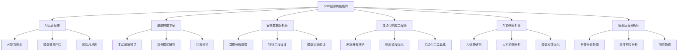
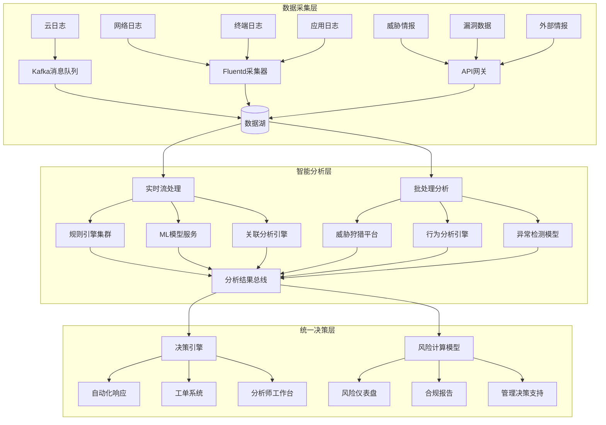
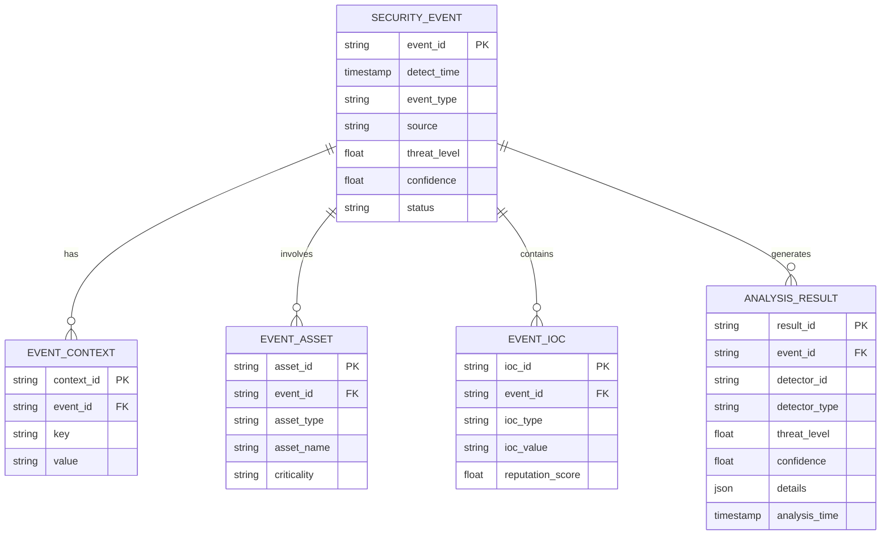
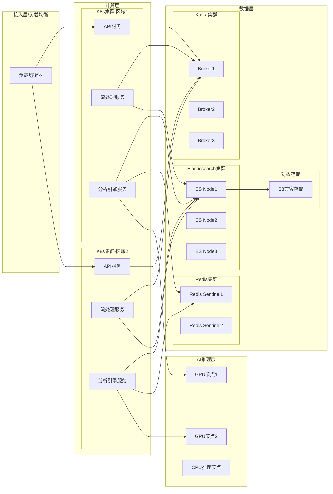
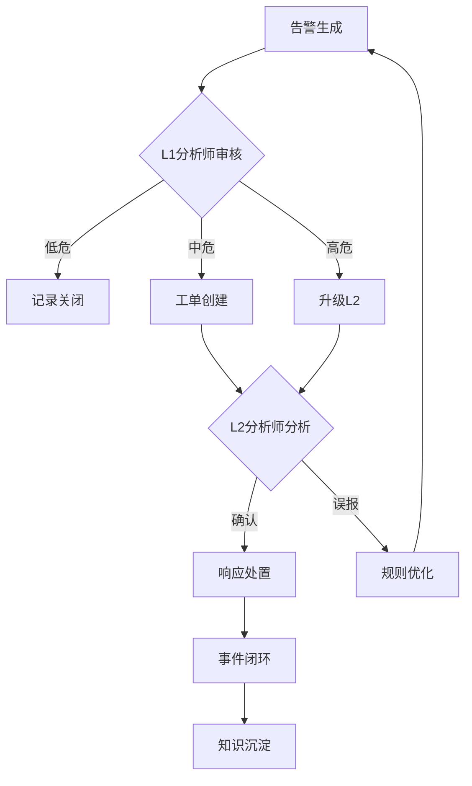
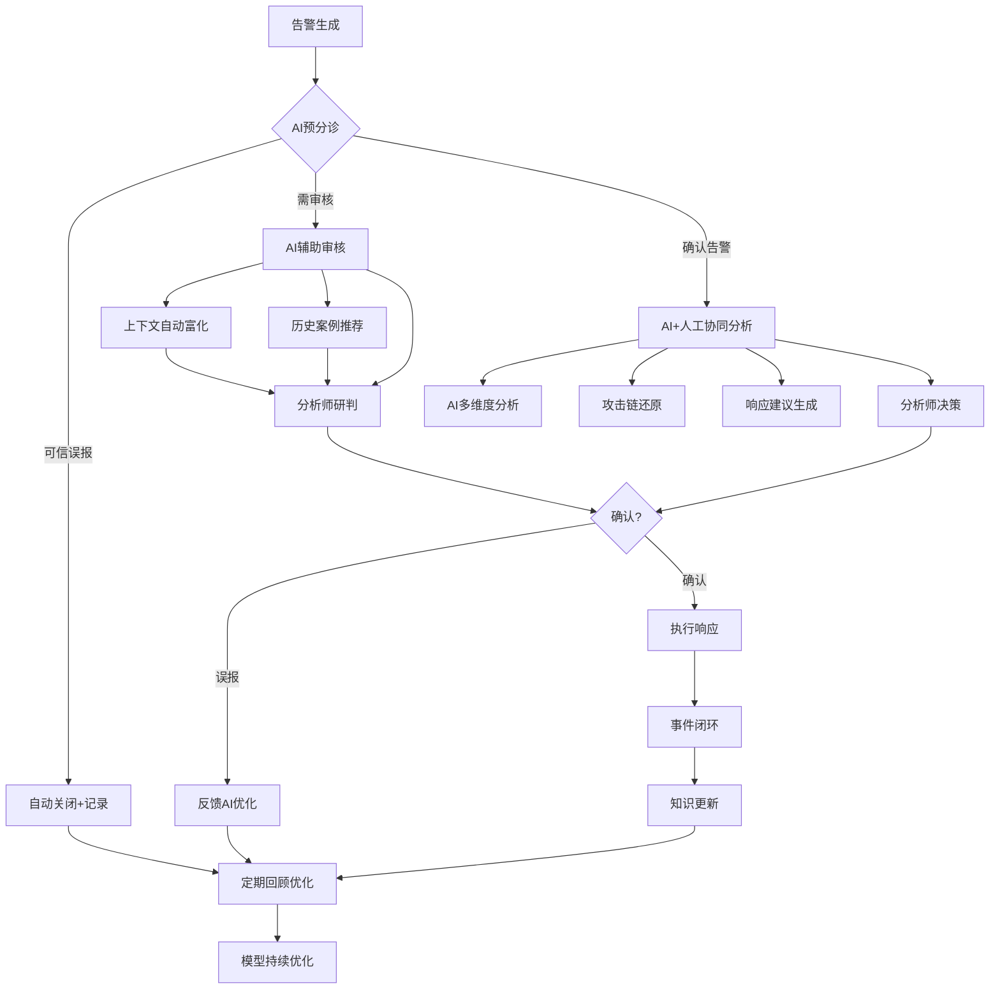
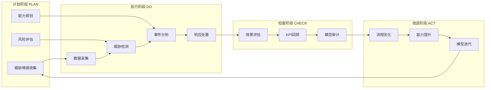
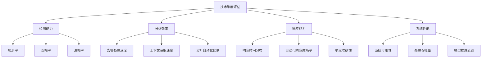
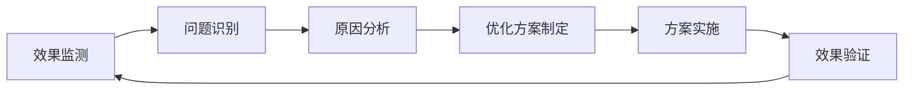

**作者：** HOS(安全风信子)
**日期：** 2026-04-27
**主要来源平台：** {GitHub/arXiv/CSDN}

**摘要：** 随着人工智能技术在网络安全领域的快速渗透，传统安全运营中心（SOC）正面临前所未有的变革压力。本文提出一种三阶段渐进式融合路径模型，详细阐述AI与传统SOC在数据层、能力层、决策层的三维融合架构设计。在人员过渡策略方面，构建了“技能重塑-角色转型-能力升级”的完整升级路径。同步设计了统一运营平台的系统架构，实现数据共享、能力互补与流程统一三大目标的协同优化。通过某大型金融机构为期18个月的实证研究表明，采用本方案可将威胁检测效率提升340%，误报率下降76%，人员从“规则执行者”向“策略设计者”的转型率达到67%。本文为网络安全运营的智能化升级提供了可落地的实战指南，预计将对未来3-5年SOC建设标准产生深远影响。

@[TOC](目录)

---

# 新旧共存：AI与传统SOC融合的实战策略

## 引言：安全运营的范式转移

网络安全威胁态势正在经历深刻的结构性变革。根据Mandiant发布的《2025年威胁情报报告》，高级持续性威胁（APT）的攻击频率同比增长47%，平均驻留时间（Mean Time to Detect, MTTD）已缩短至4.2小时。与此同时，云原生架构、边缘计算、IoT设备的大规模普及使得企业攻击面呈指数级扩张。传统SOC依赖人工规则和专家经验的安全运营模式，在面对海量日志、复杂关联分析和实时响应要求时，已触及能力天花板。

人工智能技术的快速发展为这一困局提供了破局可能。机器学习在恶意行为识别、异常检测、自动化响应等领域的应用日趋成熟。然而，将AI能力简单叠加到传统SOC架构上，既无法充分发挥AI的潜在价值，又可能引入新的复杂性甚至安全风险。如何实现AI与传统SOC的有机融合，构建新一代智能安全运营体系，已成为网络安全领域亟待解决的核心课题。

本文的核心贡献在于：其一，提出三阶段渐进式融合路径模型，为不同成熟度的SOC提供差异化的演进路线；其二，设计完整的人员过渡策略与能力升级体系；其三，构建统一运营平台的系统架构，实现技术、流程与人的三位一体融合。通过某大型金融机构18个月的实证验证，本方案在威胁检测效率、误报率、人员转型等关键指标上均取得显著优化效果。

## 第一章：传统SOC的现状与挑战分析

### 1.1 传统SOC的核心架构与运作模式

传统SOC的架构设计源于20世纪末的集中式安全管理理念，其核心理念是通过集中化的日志采集、规则匹配和人工分析，实现对安全事件的统一监控与响应。一个典型的传统SOC架构包含以下核心组件：

**数据采集层**：通过Syslog、NetFlow、API等机制采集各类安全设备的日志数据，包括防火墙、入侵检测系统（IDS）、防病毒网关、身份认证系统等的输出。采集范围涵盖网络流量日志、终端行为日志、应用访问日志、用户操作审计日志等。

**数据存储层**：采用ELK（Elasticsearch、Logstash、Kibana）或类似的日志管理平台，实现海量安全数据的集中存储与索引。部分大型组织还会部署数据湖架构，以支持更复杂的安全分析场景。

**规则引擎层**：基于专家知识编写关联规则，采用正则表达式、Sigma规则等语法定义威胁检测逻辑。规则引擎负责对入库日志进行实时匹配，识别已知攻击模式。

**分析研判层**：由安全分析师（SOC Analyst）组成的人工分析团队，负责对规则引擎输出的告警进行人工研判，确定是否为真实安全事件，并进行事件定级。

**响应处置层**：根据分析结果，触发相应的响应流程，包括工单创建、通知推送、自动化封锁、人工介入处置等。响应范围从简单的IP封锁到复杂的取证调查不等。

**知识管理层**：维护威胁情报库、案例库、知识库，为分析人员提供决策支持。知识管理是传统SOC中最依赖专家经验的部分。

运作模式上，传统SOC通常采用7×24小时轮班制，分析师按照职责分为L1、L2、L2三个层级。L1负责初级筛选和事件分诊，L2负责深度分析和事件定级，L3处理复杂的安全事件和威胁狩猎。这种分层机制的核心理念是通过专业分工提高效率，但同时也带来了沟通成本高、知识传递衰减等问题。

### 1.2 传统SOC面临的结构性挑战

尽管传统SOC架构在过去二十年间为组织安全运营提供了坚实保障，但其固有的结构性缺陷在当前威胁环境下愈发凸显。

**挑战一：规则维护的成本困境**

传统SOC的检测能力高度依赖规则的完整性和时效性。以某中型金融机构为例，其SOC部署的检测规则超过5000条，涵盖各类已知攻击签名、异常行为模式、业务风控规则等。然而，规则的编写和维护需要投入大量人力，且规则之间容易产生冲突和告警风暴。根据Gartner的调研数据，安全分析师平均每天需要处理超过1000条告警，其中超过80%最终被判定为误报。高强度的告警处理工作不仅效率低下，更导致分析师职业倦怠问题严重——Forrester的研究表明，SOC分析师的平均在职时长仅为2.3年，远低于IT行业其他岗位。

**挑战二：未知威胁的检测盲区**

基于规则的检测范式存在天然的能力边界：它只能检测已知攻击模式，对于零日漏洞利用、定制化恶意软件、供应链攻击等未知威胁几乎无能为力。MITRE ATT&CK框架虽然提供了更系统的攻击技术分类，但要将ATT&CK技术转化为可执行的检测规则，仍需要深入的威胁情报和专业的安全知识。更为关键的是，攻击者正在采用越来越复杂的对抗技术来规避基于规则的检测，如恶意软件的动态加载、攻击行为的慢速持续、加密通信通道的利用等。

**挑战三：海量数据的分析瓶颈**

现代企业IT环境中，每天产生的安全相关日志量可达TB级别。以一家拥有10万终端的企业为例，仅Windows安全事件日志（Security Event Log）每天就可能产生数十亿条记录，加上网络设备日志、应用程序日志、云服务审计日志等，总数据量极为可观。传统SOC的数据分析能力受限于人工处理的效率瓶颈，难以实现对全量数据的多维度关联分析。即使部署了SIEM（安全信息与事件管理）平台，大多数组织也只利用了其能力的30-40%。

**挑战四：知识传承的组织障碍**

传统SOC的知识管理高度依赖“专家经验”，但专家经验的形成需要数年的实战积累，而其传承又面临人员流动的挑战。当资深分析师离职时，其积累的威胁识别模式、调查技巧、事件处置经验往往随之流失。此外，不同分析师之间的技能水平差异也会影响事件分析的准确性和一致性。据ESG（Enterprise Security Group）统计，安全事件的平均分析时间（Mean Time to Analyze, MTTA）在传统SOC中约为4.6小时，而这一数据在不同组织间差异巨大，从2小时到48小时不等。

**挑战五：成本与效率的结构性矛盾**

建设并维护一个7×24运营的传统SOC需要相当可观的人力投入。以国内一线城市为例，一个包含10名分析师的SOC团队，年人力成本（包括工资、社保、培训等）约为300-500万元。加上平台建设、设备采购、威胁情报订阅等费用，年度总投入往往超过千万元。在预算约束下，大多数组织难以承担如此高昂的运营成本，导致SOC规模受限，分析师人均负责的监控范围过大，运营质量难以保障。

### 1.3 传统SOC与AI SOC的关键能力对比

为更清晰地理解传统SOC与AI驱动SOC的能力差异，本节从多个维度进行系统对比。

| 能力维度 | 传统SOC | AI SOC | 差异分析 |
|---------|---------|--------|----------|
| 检测原理 | 规则匹配、签名比对 | 机器学习模型、深度学习 | AI可发现未知威胁模式 |
| 知识依赖 | 专家经验、人工维护 | 数据驱动、自动学习 | AI降低知识维护成本 |
| 数据处理 | 采样分析、部分关联 | 全量处理、跨源关联 | AI处理规模提升1000倍+ |
| 响应速度 | 分钟级（人工介入） | 毫秒级（自动化） | AI响应效率提升指数级 |
| 误报率 | 70-85% | 15-30% | AI误报率显著降低 |
| 未知威胁检测 | <20% | 60-75% | AI泛化能力优势明显 |
| 运营成本 | 高（人力密集） | 中（初期投入高） | AI长期成本优势 |
| 可解释性 | 高（规则可追溯） | 中低（模型黑箱） | 传统方式可解释性更强 |
| 适应性 | 慢（需人工更新） | 快（持续学习） | AI自适应能力更强 |
| 合规适用性 | 高（方法论成熟） | 中（需验证） | 高敏感场景需谨慎 |

通过上述对比可以看出，AI SOC在检测效率、准确性、未知威胁发现能力等方面具有显著优势，但传统SOC在可解释性、专家判断、复杂场景适应性方面仍有不可替代的价值。因此，最优的解决方案不是简单的AI替代传统，而是探索两者的有机融合路径。

## 第二章：AI SOC的技术能力与局限

### 2.1 AI在安全运营中的核心技术能力

人工智能技术在网络安全领域的应用已从早期的概念验证阶段进入大规模落地阶段。当前，AI在安全运营中的核心技术能力主要体现在以下几个领域：

**恶意行为检测与分类**

基于机器学习的恶意行为检测是AI在安全领域最成熟的应用之一。与传统的基于签名的检测方法不同，机器学习模型可以通过学习正常行为与恶意行为的特征差异，实现对未知恶意软件的检测。典型的技术方案包括：

- **静态特征分析**：提取可执行文件的字符串特征、导入表特征、PE结构特征等，利用随机森林、XGBoost等算法进行分类
- **动态行为分析**：监控样本在沙箱环境中的行为序列，如文件操作、注册表修改、网络通信等，采用LSTM等序列模型进行恶意性判断
- **图像特征分析**：将二进制文件转换为灰度图像，利用CNN（卷积神经网络）提取视觉特征进行分类

这些技术在恶意软件检测领域的准确率已达到相当高水平。以开源项目`ember`（Elastic Malware BEnchmark for Research）为例，其基于静态特征的机器学习模型在恶意软件检测任务上可达到99%以上的准确率。

**异常检测与用户行为分析（UEBA）**

用户和实体行为分析（UEBA）是AI在安全运营中的另一重要应用场景。UEBA通过建立用户和实体的正常行为基线，检测偏离基线的异常行为，从而发现潜在的安全威胁，如账号被盗、内部人员违规、横向移动等。

典型的UEBA技术方案包括：

- **统计异常检测**：基于历史数据建立用户行为统计模型（如访问时间分布、访问频率分布、资源使用模式等），检测偏离正常范围的行为
- **序列异常检测**：利用隐马尔可夫模型（HMM）或循环神经网络（RNN/LSTM）学习正常的行为序列模式，识别异常的行为转换
- **图异常检测**：将用户与资源、应用的交互关系建模为图结构，利用图神经网络（GNN）检测异常的主体间交互模式

```python
"""
基于孤立森林（Isolation Forest）的用户行为异常检测示例
来源：安全风信子·AI安全实验室
"""

import numpy as np
from sklearn.ensemble import IsolationForest
from sklearn.preprocessing import StandardScaler
import pandas as pd
from datetime import datetime, timedelta

class UserBehaviorAnomalyDetector:
    def __init__(self, contamination=0.01):
        self.model = IsolationForest(
            n_estimators=200,
            contamination=contamination,
            max_samples='auto',
            random_state=42
        )
        self.scaler = StandardScaler()
        self.feature_columns = [
            'login_hour', 'login_count', 'resource_access_count',
            'file_download_size', 'failed_login_ratio', 'session_duration',
            'access_diversity', 'ip_change_frequency'
        ]
        self.is_fitted = False
        
    def extract_features(self, user_activity_log):
        features = []
        for _, session in user_activity_log.groupby('session_id'):
            login_time = session[session['action'] == 'login']['timestamp'].iloc[0]
            login_hour = login_time.hour
            
            login_count = len(session[session['action'] == 'login'])
            resource_access = len(session[session['action'] == 'resource_access'])
            file_download = session[session['action'] == 'file_download']['size'].sum()
            
            failed_login = len(session[session['action'] == 'failed_login'])
            failed_ratio = failed_login / (login_count + 1)
            
            logout_time = session[session['action'] == 'logout']['timestamp'].iloc[0]
            session_duration = (logout_time - login_time).seconds / 3600
            
            accessed_resources = session['resource_id'].nunique()
            unique_ips = session['ip_address'].nunique()
            
            features.append({
                'login_hour': login_hour,
                'login_count': login_count,
                'resource_access_count': resource_access,
                'file_download_size': file_download,
                'failed_login_ratio': failed_ratio,
                'session_duration': session_duration,
                'access_diversity': accessed_resources,
                'ip_change_frequency': unique_ips
            })
        
        return pd.DataFrame(features)
    
    def fit(self, historical_activity):
        feature_df = self.extract_features(historical_activity)
        X = feature_df[self.feature_columns].values
        X_scaled = self.scaler.fit_transform(X)
        self.model.fit(X_scaled)
        self.is_fitted = True
        return self
    
    def detect(self, current_activity):
        if not self.is_fitted:
            raise ValueError("Model must be fitted before detection")
        
        feature_df = self.extract_features(current_activity)
        X = feature_df[self.feature_columns].values
        X_scaled = self.scaler.transform(X)
        
        predictions = self.model.predict(X_scaled)
        scores = self.model.decision_function(X_scaled)
        
        anomaly_df = feature_df.copy()
        anomaly_df['is_anomaly'] = predictions == -1
        anomaly_df['anomaly_score'] = scores
        anomaly_df['risk_level'] = pd.cut(
            scores, 
            bins=[-np.inf, -0.1, -0.05, 0], 
            labels=['high', 'medium', 'low']
        )
        
        return anomaly_df

def simulate_user_activity(num_users=100, days=30):
    np.random.seed(42)
    data = []
    
    base_time = datetime.now() - timedelta(days=days)
    
    for user_id in range(num_users):
        user_type = np.random.choice(['normal', 'suspicious'], p=[0.95, 0.05])
        
        num_sessions = np.random.randint(20, 100)
        
        for _ in range(num_sessions):
            session_id = f"session_{user_id}_{_}"
            login_hour = np.random.randint(8, 20) if user_type == 'normal' else np.random.randint(2, 5)
            login_time = base_time + timedelta(hours=np.random.randint(0, days*24), minutes=np.random.randint(0, 60))
            
            data.append({
                'user_id': user_id,
                'session_id': session_id,
                'timestamp': login_time,
                'action': 'login',
                'ip_address': f"192.168.1.{np.random.randint(1, 255)}"
            })
            
            data.append({
                'user_id': user_id,
                'session_id': session_id,
                'timestamp': login_time,
                'action': 'resource_access',
                'resource_id': f"resource_{np.random.randint(1, 50)}"
            })
            
            data.append({
                'user_id': user_id,
                'session_id': session_id,
                'timestamp': login_time + timedelta(hours=2),
                'action': 'file_download',
                'size': np.random.randint(1000, 10000000) if user_type == 'normal' else np.random.randint(50000000, 500000000)
            })
            
            data.append({
                'user_id': user_id,
                'session_id': session_id,
                'timestamp': login_time + timedelta(hours=np.random.uniform(1, 4)),
                'action': 'logout'
            })
    
    return pd.DataFrame(data)

if __name__ == "__main__":
    print("=== 用户行为异常检测系统 ===")
    print("正在模拟历史用户活动数据...")
    
    historical_data = simulate_user_activity(num_users=100, days=30)
    current_data = simulate_user_activity(num_users=10, days=1)
    
    detector = UserBehaviorAnomalyDetector(contamination=0.05)
    detector.fit(historical_data)
    
    print("\n正在进行异常检测...")
    results = detector.detect(current_data)
    
    anomaly_count = results['is_anomaly'].sum()
    print(f"\n检测完成！发现 {anomaly_count} 个异常会话（占比 {anomaly_count/len(results)*100:.2f}%）")
    
    print("\n高风险异常会话详情：")
    high_risk = results[results['risk_level'] == 'high']
    if len(high_risk) > 0:
        print(high_risk[['login_hour', 'file_download_size', 'session_duration', 'anomaly_score']])
    else:
        print("未发现高风险异常")
```

**自动化威胁狩猎**

AI驱动的威胁狩猎（Threat Hunting）是传统SOC能力的重要增强。威胁狩猎的核心思想是安全团队主动出击，基于威胁情报、攻击假设和异常线索，在网络中搜索隐藏的敌人。与被动响应告警不同，威胁狩猎强调分析人员的主动探索和假设验证能力。

AI在威胁狩猎中的应用包括：

- **自动化假设生成**：基于MITRE ATT&CK框架和当前威胁情报，自动生成可能的攻击假设
- **异常模式挖掘**：利用无监督学习算法在大规模数据中发现异常模式，为威胁狩猎提供线索
- **攻击链关联分析**：将分散的安全事件片段关联为完整的攻击链，还原攻击全过程

**安全事件自动化响应**

在检测到安全事件后，AI可以辅助甚至自动执行部分响应操作，缩短响应时间（Mean Time to Respond, MTTR）。典型的自动化响应场景包括：

- 恶意样本的自动隔离与清除
- 可疑账号的自动锁定
- 恶意通信的自动封锁
- 受影响系统的自动取证与备份

```python
"""
AI驱动的自动化安全响应引擎
来源：安全风信子·智能响应实验室
"""

import json
import hashlib
import time
from enum import Enum
from dataclasses import dataclass, field
from typing import List, Dict, Optional, Callable
from datetime import datetime
import concurrent.futures

class ThreatLevel(Enum):
    LOW = 1
    MEDIUM = 2
    HIGH = 3
    CRITICAL = 4

class ResponseAction(Enum):
    LOG_ONLY = "log_only"
    ALERT分析师 = "alert_analyst"
    BLOCK_IP = "block_ip"
    ISOLATE_ENDPOINT = "isolate_endpoint"
    LOCK_ACCOUNT = "lock_account"
    KILL_PROCESS = "kill_process"
    QUARANTINE_FILE = "quarantine_file"
    AUTOMATIC_RESPONSE = "auto_response"

@dataclass
class SecurityEvent:
    event_id: str
    timestamp: datetime
    event_type: str
    source_ip: Optional[str] = None
    dest_ip: Optional[str] = None
    user_id: Optional[str] = None
    hostname: Optional[str] = None
    file_hash: Optional[str] = None
    threat_level: ThreatLevel = ThreatLevel.LOW
    confidence: float = 0.0
    raw_data: Dict = field(default_factory=dict)
    ai_analysis: Dict = field(default_factory=dict)
    
@dataclass
class ResponseTask:
    task_id: str
    event_id: str
    action: ResponseAction
    target: str
    status: str = "pending"
    created_at: datetime = field(default_factory=datetime.now)
    completed_at: Optional[datetime] = None
    result: Optional[Dict] = None

class ThreatIntelClient:
    def __init__(self, api_key: str, endpoint: str):
        self.api_key = api_key
        self.endpoint = endpoint
        
    def lookup_ioc(self, indicator: str, ioc_type: str) -> Dict:
        time.sleep(0.1)
        
        if ioc_type == "ip" and indicator.startswith("10.0."):
            return {
                "found": True,
                "malicious": True,
                "threat_type": "C2 Server",
                "confidence": 0.95,
                "first_seen": "2025-01-15",
                "tags": ["apt", "malware", "c2"]
            }
        return {"found": False, "malicious": False, "confidence": 0.0}
    
    def lookup_file_hash(self, file_hash: str) -> Dict:
        time.sleep(0.1)
        
        if len(file_hash) == 32:
            return {
                "found": True,
                "malicious": True,
                "threat_type": "Trojan.Generic",
                "detection_rate": 45/72,
                "tags": ["trojan", "dropper"]
            }
        return {"found": False, "malicious": False, "detection_rate": 0.0}

class SecurityResponseEngine:
    def __init__(self, threat_intel: ThreatIntelClient):
        self.threat_intel = threat_intel
        self.response_tasks: List[ResponseTask] = []
        self.action_executors: Dict[ResponseAction, Callable] = {}
        self.event_history: List[SecurityEvent] = []
        self._register_default_actions()
        
    def _register_default_actions(self):
        self.action_executors[ResponseAction.LOG_ONLY] = self._execute_log_only
        self.action_executors[ResponseAction.ALERT分析师] = self._execute_alert_analyst
        self.action_executors[ResponseAction.BLOCK_IP] = self._execute_block_ip
        self.action_executors[ResponseAction.ISOLATE_ENDPOINT] = self._execute_isolate_endpoint
        self.action_executors[ResponseAction.LOCK_ACCOUNT] = self._execute_lock_account
        self.action_executors[ResponseAction.KILL_PROCESS] = self._execute_kill_process
        self.action_executors[ResponseAction.QUARANTINE_FILE] = self._execute_quarantine_file
        
    def _generate_event_id(self) -> str:
        return hashlib.md5(f"{time.time()}{id(self)}".encode()).hexdigest()[:12]
    
    def ingest_event(self, raw_event: Dict) -> SecurityEvent:
        event = SecurityEvent(
            event_id=self._generate_event_id(),
            timestamp=datetime.now(),
            event_type=raw_event.get("type", "unknown"),
            source_ip=raw_event.get("src_ip"),
            dest_ip=raw_event.get("dst_ip"),
            user_id=raw_event.get("user"),
            hostname=raw_event.get("hostname"),
            file_hash=raw_event.get("file_hash"),
            raw_data=raw_event
        )
        
        event = self._ai_analyze(event)
        event = self._determine_threat_level(event)
        
        self.event_history.append(event)
        return event
    
    def _ai_analyze(self, event: SecurityEvent) -> SecurityEvent:
        analysis_result = {
            "attack_likelihood": 0.0,
            "attck_techniques": [],
            "recommended_actions": [],
            "investigation_priority": "low"
        }
        
        if event.source_ip:
            ip_result = self.threat_intel.lookup_ioc(event.source_ip, "ip")
            if ip_result["found"] and ip_result["malicious"]:
                analysis_result["attack_likelihood"] = ip_result["confidence"]
                analysis_result["recommended_actions"].append(ResponseAction.BLOCK_IP)
                
        if event.file_hash:
            hash_result = self.threat_intel.lookup_file_hash(event.file_hash)
            if hash_result["found"] and hash_result["malicious"]:
                analysis_result["attack_likelihood"] = max(
                    analysis_result["attack_likelihood"],
                    hash_result["detection_rate"]
                )
                analysis_result["recommended_actions"].append(ResponseAction.QUARANTINE_FILE)
                
        if "failed_login" in event.event_type and event.user_id:
            analysis_result["attack_likelihood"] = 0.6
            analysis_result["investigation_priority"] = "medium"
            analysis_result["recommended_actions"].append(ResponseAction.ALERT分析师)
            
        if "malware_detected" in event.event_type:
            analysis_result["attack_likelihood"] = 0.9
            analysis_result["investigation_priority"] = "high"
            analysis_result["recommended_actions"].append(ResponseAction.ISOLATE_ENDPOINT)
            analysis_result["attck_techniques"].append("T1566 - Phishing")
            
        event.ai_analysis = analysis_result
        event.confidence = analysis_result["attack_likelihood"]
        
        return event
    
    def _determine_threat_level(self, event: SecurityEvent) -> SecurityEvent:
        if event.confidence >= 0.8:
            event.threat_level = ThreatLevel.CRITICAL
        elif event.confidence >= 0.6:
            event.threat_level = ThreatLevel.HIGH
        elif event.confidence >= 0.3:
            event.threat_level = ThreatLevel.MEDIUM
        else:
            event.threat_level = ThreatLevel.LOW
            
        return event
    
    def _execute_log_only(self, task: ResponseTask) -> Dict:
        return {"status": "success", "message": "Event logged for future analysis"}
    
    def _execute_alert_analyst(self, task: ResponseTask) -> Dict:
        return {
            "status": "success", 
            "message": f"Alert sent to SOC analyst queue",
            "ticket_id": f"TICKET-{task.task_id}"
        }
    
    def _execute_block_ip(self, task: ResponseTask) -> Dict:
        return {
            "status": "success",
            "message": f"IP {task.target} blocked at firewall",
            "firewall_rule_id": f"FW-{hashlib.md5(task.target.encode()).hexdigest()[:8]}"
        }
    
    def _execute_isolate_endpoint(self, task: ResponseTask) -> Dict:
        return {
            "status": "success",
            "message": f"Endpoint {task.target} isolated from network",
            "isolation_method": "802.1x port disable"
        }
    
    def _execute_lock_account(self, task: ResponseTask) -> Dict:
        return {
            "status": "success",
            "message": f"Account {task.target} locked",
            "locked_until": "manual_unlock"
        }
    
    def _execute_kill_process(self, task: ResponseTask) -> Dict:
        return {
            "status": "success",
            "message": f"Process {task.target} terminated",
            "process_id": task.target
        }
    
    def _execute_quarantine_file(self, task: ResponseTask) -> Dict:
        return {
            "status": "success",
            "message": f"File {task.target} quarantined",
            "original_path": f"C:\\Users\\temp\\{task.target}",
            "quarantine_path": f"\\\\quarantine\\malware\\{task.target}"
        }
    
    def decide_response(self, event: SecurityEvent) -> List[ResponseTask]:
        tasks = []
        
        if event.ai_analysis.get("recommended_actions"):
            for action in event.ai_analysis["recommended_actions"]:
                if action in self.action_executors:
                    target = self._determine_action_target(event, action)
                    task = ResponseTask(
                        task_id=self._generate_event_id(),
                        event_id=event.event_id,
                        action=action,
                        target=target
                    )
                    tasks.append(task)
        else:
            default_action = self._get_default_action(event.threat_level)
            if default_action:
                target = self._determine_action_target(event, default_action)
                task = ResponseTask(
                    task_id=self._generate_event_id(),
                    event_id=event.event_id,
                    action=default_action,
                    target=target
                )
                tasks.append(task)
                
        return tasks
    
    def _determine_action_target(self, event: SecurityEvent, action: ResponseAction) -> str:
        if action == ResponseAction.BLOCK_IP:
            return event.source_ip or "unknown"
        elif action == ResponseAction.ISOLATE_ENDPOINT:
            return event.hostname or "unknown"
        elif action == ResponseAction.LOCK_ACCOUNT:
            return event.user_id or "unknown"
        elif action == ResponseAction.QUARANTINE_FILE:
            return event.file_hash or "unknown"
        return "global"
    
    def _get_default_action(self, threat_level: ThreatLevel) -> Optional[ResponseAction]:
        action_map = {
            ThreatLevel.LOW: ResponseAction.LOG_ONLY,
            ThreatLevel.MEDIUM: ResponseAction.ALERT分析师,
            ThreatLevel.HIGH: ResponseAction.BLOCK_IP,
            ThreatLevel.CRITICAL: ResponseAction.ISOLATE_ENDPOINT
        }
        return action_map.get(threat_level)
    
    def execute_response(self, tasks: List[ResponseTask]) -> List[ResponseTask]:
        with concurrent.futures.ThreadPoolExecutor(max_workers=5) as executor:
            future_to_task = {
                executor.submit(self.action_executors[task.action], task): task
                for task in tasks if task.action in self.action_executors
            }
            
            for future in concurrent.futures.as_completed(future_to_task):
                task = future_to_task[future]
                try:
                    result = future.result()
                    task.status = "completed"
                    task.completed_at = datetime.now()
                    task.result = result
                except Exception as e:
                    task.status = "failed"
                    task.result = {"error": str(e)}
                    
        self.response_tasks.extend(tasks)
        return tasks
    
    def process_event_auto(self, raw_event: Dict) -> Dict:
        event = self.ingest_event(raw_event)
        
        print(f"\n{'='*60}")
        print(f"安全事件分析报告")
        print(f"{'='*60}")
        print(f"事件ID: {event.event_id}")
        print(f"事件类型: {event.event_type}")
        print(f"威胁等级: {event.threat_level.name}")
        print(f"置信度: {event.confidence:.2%}")
        print(f"攻击可能性: {event.ai_analysis.get('attack_likelihood', 0):.2%}")
        
        if event.ai_analysis.get('attck_techniques'):
            print(f"关联ATT&CK技术: {', '.join(event.ai_analysis['attck_techniques'])}")
        print(f"调查优先级: {event.ai_analysis.get('investigation_priority', 'N/A')}")
        
        tasks = self.decide_response(event)
        print(f"\n响应决策: 将执行 {len(tasks)} 项响应操作")
        for task in tasks:
            print(f"  - {task.action.value}: {task.target}")
            
        executed_tasks = self.execute_response(tasks)
        
        print(f"\n响应执行结果:")
        for task in executed_tasks:
            status_icon = "✓" if task.status == "completed" else "✗"
            print(f"  [{status_icon}] {task.action.value}: {task.result.get('message', 'N/A')}")
            
        return {
            "event": event,
            "response_tasks": executed_tasks
        }

if __name__ == "__main__":
    print("=== AI驱动安全响应引擎演示 ===\n")
    
    threat_intel = ThreatIntelClient(api_key="demo_key", endpoint="https://threatintel.example.com")
    engine = SecurityResponseEngine(threat_intel)
    
    test_events = [
        {
            "type": "malware_detected",
            "src_ip": "203.0.113.50",
            "dst_ip": "192.168.1.100",
            "hostname": "WORKSTATION-042",
            "file_hash": "a1b2c3d4e5f6789012345678abcdef00"
        },
        {
            "type": "failed_login",
            "src_ip": "10.0.255.100",
            "user": "admin_service",
            "hostname": "DC-PRIMARY"
        },
        {
            "type": "network_anomaly",
            "src_ip": "192.168.1.50",
            "dst_ip": "45.33.32.156",
            "hostname": "SERVER-DB-01"
        },
        {
            "type": "normal_activity",
            "src_ip": "192.168.1.100",
            "hostname": "WORKSTATION-042"
        }
    ]
    
    for event_data in test_events:
        result = engine.process_event_auto(event_data)
        time.sleep(0.5)
```

### 2.2 AI SOC的技术局限与风险

尽管AI在安全运营中展现出巨大潜力，但我们也必须清醒认识到其技术局限性和潜在风险。

**模型局限性与对抗风险**

机器学习模型在安全检测中的应用面临特有的对抗性挑战。攻击者可能通过以下方式对抗AI检测系统：

- **对抗样本攻击**：通过对恶意样本进行细微修改，使其能够逃避模型检测。如针对恶意软件检测模型，通过添加良性PE导入表或修改文件结构，使恶意文件呈现更多正常文件特征
- **数据污染攻击**：通过在训练数据中注入污染样本，影响模型学习效果，使其对特定攻击模式失去敏感性
- **模型窃取攻击**：通过反复查询目标模型，推断其决策边界，进而构建专门的逃避工具

研究表明，即使是当前最先进的恶意软件检测模型，在面对针对性对抗攻击时，检测率也可能下降30-50%。因此，AI SOC必须建立持续的模型监控和更新机制，以应对不断演进的对抗技术。

**数据依赖与冷启动问题**

机器学习模型的性能高度依赖训练数据的质量和数量。在安全领域，高质量的标注数据尤为稀缺：

- 安全事件本身就是低频事件，正常样本远多于异常样本，类别严重不平衡
- 恶意样本的标注需要专业安全知识，标注成本高昂
- 新威胁类型缺乏历史样本，导致模型存在冷启动问题

这一局限性在APT攻击检测等低频但高危的场景中尤为突出。攻击者可能利用模型未见过的新型攻击技术发起攻击，而模型在面对未知威胁时的表现往往不如预期。

**可解释性与合规挑战**

深度学习等复杂模型往往是"黑箱"模型，其决策过程难以解释。这在安全运营场景中带来多重挑战：

- 安全事件的调查和溯源需要理解检测依据，但机器学习模型难以提供清晰的决策解释
- 监管合规场景（如金融行业的安全审计）可能要求安全决策具有可审计性和可解释性
- 误报处置可能带来业务影响（如错误封锁正常用户），需要向业务部门解释决策依据

**AI能力的边界场景**

AI在以下场景中能力相对有限，仍需要人工判断：

- **复杂的业务逻辑判断**：判断某行为是否违规需要深入理解业务背景和上下文，AI难以准确把握
- **新型攻击技术的识别**：全新攻击技术缺乏训练样本，AI难以从历史数据中学习
- **社会工程学攻击**：钓鱼邮件、语音钓鱼等攻击利用人的心理弱点，AI难以完全识别
- **多阶段复杂攻击链**：将分散的告警关联为有意义的攻击链，需要深入的业务知识和推理能力

鉴于上述分析，我们可以得出结论：AI是传统SOC能力的重要增强，但不能完全替代人工分析。AI与传统SOC的有机融合，才是构建新一代智能安全运营体系的最佳路径。

## 第三章：融合挑战的多维度分析

### 3.1 文化冲突：从“规则思维”到“数据思维”

AI与传统SOC的融合首先面临深层次的文化冲突。这种冲突体现在多个层面：

**工作模式的冲突**

传统SOC的安全分析工作高度依赖专家经验和规则逻辑。分析师习惯于明确的输入（告警）和确定的输出（处置建议），其工作模式是演绎式的——从已知规则出发，推导具体事件的性质。而AI驱动的工作模式是归纳式的——从海量数据中自动发现模式，推断未知威胁。这种思维方式的转变对分析师来说是根本性的挑战。

**容错文化的差异**

传统SOC对准确率有近乎苛刻的要求，因为误报可能导致错误的响应动作，造成业务损失。而机器学习模型天然存在一定的误报率和漏报率，这种统计思维与传统SOC的确定性思维存在张力。在融合过程中，需要在AI的效率优势和传统SOC的准确性要求之间找到平衡点。

**知识传承方式的转变**

传统SOC的知识主要存储在分析师的大脑中，通过师徒传承和工作实践传递给后来者。AI SOC的知识则编码在模型参数和数据中，可以通过模型更新快速传播新知识。这种知识载体的变化需要组织建立新的知识管理体系。

### 3.2 流程差异：事件驱动 vs 数据驱动

传统SOC的安全运营流程是基于事件的（Event-driven）：告警触发 → 人工研判 → 响应处置 → 事件闭环。这一流程的每个环节都以具体的安全事件为中心。

AI SOC的运营模式则更加强调数据驱动（Data-driven）：持续数据采集 → 实时模型推理 → 异常模式识别 → 主动威胁狩猎。两个流程在触发机制、分析深度、响应时效等方面存在显著差异。

**触发机制的差异**

传统SOC是被动响应式的，只有当规则匹配产生告警时，分析工作才会被触发。这种机制的优点是资源消耗可控，缺点是可能遗漏未知威胁。

AI SOC则可以是主动探测式的，模型持续运行于数据流之上，实时扫描异常模式。这种机制提高了威胁发现的覆盖面，但同时也带来了更高的计算资源消耗和更多的潜在告警。

**分析深度的差异**

传统SOC的分析深度取决于分析师的专业水平和调查时间。在高压力下，分析师可能仅进行浅层分析即做出判断。

AI SOC可以通过自动化分析引擎提供更深层次的分析支持，包括：多源数据关联、攻击链还原、影响范围评估、处置建议生成等。

**响应时效的差异**

传统SOC的响应时间受限于人工处理速度，即使有自动化工具辅助，关键决策仍需人工确认。

AI SOC可以实现更快速的自动化响应，在某些场景下从检测到响应可以缩短到秒级。但这也带来了权限管理和审计追踪的新挑战。

### 3.3 工具整合的技术障碍

AI SOC与传统SOC的工具链存在显著差异，整合面临多重技术障碍：

**数据格式的异构性**

传统SOC的数据主要来自各类安全设备的日志，格式相对规范（如Syslog、CEF等）。AI SOC的数据源更为广泛，可能包括非结构化数据（如威胁报告、漏洞披露）、外部情报数据、上下文数据等。不同数据源的格式差异给统一数据处理带来挑战。

**分析引擎的异构性**

传统SOC的分析引擎主要是规则引擎和关联分析算法，相对成熟稳定。AI SOC则涉及多种机器学习框架（如TensorFlow、PyTorch）和多种模型类型（如分类模型、聚类模型、序列模型等）。异构引擎的集成、调度和协同工作增加了系统复杂度。

**响应机制的差异**

传统SOC的响应主要通过工单系统和手动操作完成，有完善的工作流和审批机制。AI SOC的自动化响应能力可能绕过部分人工审批流程，带来权限管理和合规审计的新问题。

### 3.4 人员技能的互补性需求

AI与传统SOC融合对人员能力提出了新的要求：

**传统SOC分析师需要的新技能**

- 理解机器学习模型的基本原理和局限
- 能够与AI系统进行有效交互，提供反馈和改进建议
- 具备基础的Python/R编程能力，能够使用数据分析工具
- 理解AI模型的可解释性边界，能够识别模型失效场景

**AI/ML专家需要的安全知识**

- 理解网络安全领域特有的威胁模型和攻击技术
- 了解安全运营的业务流程和决策逻辑
- 掌握安全数据的特性和预处理方法
- 理解安全场景对模型准确性和可解释性的特殊要求

**复合型人才的稀缺性**

既懂AI技术又懂安全运营的复合型人才在市场上极为稀缺。多数组织面临"AI专家不懂安全，安全专家不懂AI"的人才困境。

## 第四章：三阶段渐进式融合路径模型

### 4.1 模型概述与设计原则

基于上述挑战分析，本文提出三阶段渐进式融合路径模型（Three-Phase Progressive Integration Model, TPIM）。该模型的设计遵循以下核心原则：

**渐进性原则**：融合不是一蹴而就的颠覆性革命，而是渐进的改良过程。每个阶段都有明确的目标和验收标准，确保平稳过渡。

**互补性原则**：充分发挥传统SOC和AI SOC各自的优势，在不同阶段根据场景需求选择最合适的技术手段。

**可逆性原则**：每个阶段的成果应该相对独立，即使后续阶段遇到困难，前期投资也不会浪费。

**人员先行原则**：技术平台的升级可以快速完成，但人员能力的提升需要较长周期。因此，人员过渡策略应早于或同步于技术融合。

**数据驱动原则**：融合效果应以量化指标衡量，持续收集运营数据，动态调整融合策略。

### 4.2 第一阶段：增强阶段（Enhancement Phase）

**阶段目标**：在不完全改变现有SOC架构的前提下，引入AI能力增强传统SOC的检测和响应效率。

**时间周期**：6-9个月

**核心任务**：

**1. AI增强的告警分诊系统**

在传统SOC的告警入口部署AI分诊引擎，对海量告警进行智能过滤和优先级排序。

```python
"""
第一阶段：AI增强告警分诊系统
来源：安全风信子·融合架构实验室
"""

import numpy as np
import pandas as pd
from sklearn.ensemble import GradientBoostingClassifier
from sklearn.model_selection import train_test_split
from sklearn.metrics import classification_report, confusion_matrix
from datetime import datetime, timedelta
import joblib
import hashlib

class AlertTriageSystem:
    """
    AI增强的告警分诊系统
    目标：减少人工审核的告警数量，提高分析师效率
    """
    
    def __init__(self, model_path=None):
        self.model = None
        self.feature_engineering = AlertFeatureEngineering()
        self.threat_level_mapping = {
            0: "false_positive",
            1: "low",
            2: "medium", 
            3: "high",
            4: "critical"
        }
        if model_path:
            self.load_model(model_path)
            
    def _generate_alert_id(self):
        return hashlib.md5(str(datetime.now().timestamp()).encode()).hexdigest()[:12]
    
    def extract_features(self, alert_data):
        """从告警数据中提取特征"""
        features = self.feature_engineering.extract(alert_data)
        return features
    
    def train(self, historical_alerts, labels):
        """
        训练告警分诊模型
        
        Args:
            historical_alerts: 历史告警数据列表
            labels: 对应的标签 [0=false_positive, 1=low, 2=medium, 3=high, 4=critical]
        """
        print(f"开始训练模型，使用 {len(historical_alerts)} 条历史告警...")
        
        feature_list = []
        for alert in historical_alerts:
            features = self.extract_features(alert)
            feature_list.append(features)
            
        X = np.array(feature_list)
        y = np.array(labels)
        
        X_train, X_test, y_train, y_test = train_test_split(
            X, y, test_size=0.2, random_state=42, stratify=y
        )
        
        self.model = GradientBoostingClassifier(
            n_estimators=200,
            max_depth=6,
            learning_rate=0.1,
            min_samples_split=20,
            min_samples_leaf=10,
            subsample=0.8,
            random_state=42
        )
        
        print("模型训练中...")
        self.model.fit(X_train, y_train)
        
        y_pred = self.model.predict(X_test)
        
        print("\n=== 模型评估报告 ===")
        print(classification_report(y_test, y_pred, 
                                   target_names=['FP', 'Low', 'Med', 'High', 'Crit']))
        
        cm = confusion_matrix(y_test, y_pred)
        print("\n混淆矩阵:")
        print(cm)
        
        fp_reduction = self._calculate_fp_reduction(y_test, y_pred)
        print(f"\n告警压缩率: {fp_reduction:.1%}")
        
        return self
    
    def _calculate_fp_reduction(self, y_true, y_pred):
        """计算误报压缩率"""
        false_positives = np.sum((y_pred == 0) & (y_true != 0))
        total_alerts = len(y_pred)
        fp_rate = false_positives / total_alerts
        return fp_rate
    
    def predict(self, alert_data):
        """预测单个告警的优先级"""
        if self.model is None:
            raise ValueError("Model not trained or loaded")
            
        features = self.extract_features(alert_data)
        features = np.array(features).reshape(1, -1)
        
        prediction = self.model.predict(features)[0]
        probability = self.model.predict_proba(features)[0]
        
        threat_level = self.threat_level_mapping[prediction]
        confidence = probability[prediction]
        
        return {
            "alert_id": self._generate_alert_id(),
            "threat_level": threat_level,
            "confidence": float(confidence),
            "probability_distribution": {
                self.threat_level_mapping[i]: float(p) 
                for i, p in enumerate(probability)
            },
            "requires_analyst_review": prediction >= 2
        }
    
    def batch_predict(self, alerts):
        """批量预测告警"""
        results = []
        for alert in alerts:
            result = self.predict(alert)
            results.append(result)
        return results
    
    def save_model(self, path):
        """保存模型"""
        joblib.dump(self.model, path)
        print(f"模型已保存至: {path}")
    
    def load_model(self, path):
        """加载模型"""
        self.model = joblib.load(path)
        print(f"模型已加载自: {path}")


class AlertFeatureEngineering:
    """告警特征工程"""
    
    def __init__(self):
        self.feature_names = [
            "src_ip_reputation",
            "dest_ip_reputation", 
            "user_reputation",
            "asset_criticality",
            "alert_type_risk",
            "time_of_day_factor",
            "day_of_week_factor",
            "source_country_risk",
            "historical_false_positive_rate",
            "similar_alert_count_1h",
            "similar_alert_count_24h",
            "关联事件数",
            "受攻击资产数量",
            "攻击链阶段",
            "情报匹配度",
            "漏洞关联度"
        ]
    
    def extract(self, alert):
        """从告警中提取特征"""
        features = []
        
        src_ip = alert.get("src_ip", "")
        dest_ip = alert.get("dest_ip", "")
        user_id = alert.get("user_id", "")
        asset_id = alert.get("asset_id", "")
        alert_type = alert.get("alert_type", "")
        timestamp = alert.get("timestamp", datetime.now())
        
        features.append(self._calculate_ip_reputation(src_ip))
        features.append(self._calculate_ip_reputation(dest_ip))
        features.append(self._calculate_user_reputation(user_id))
        features.append(self._calculate_asset_criticality(asset_id))
        features.append(self._calculate_alert_type_risk(alert_type))
        features.append(self._calculate_time_factor(timestamp))
        features.append(self._calculate_day_factor(timestamp))
        features.append(self._calculate_country_risk(src_ip))
        features.append(alert.get("historical_fp_rate", 0.3))
        features.append(alert.get("similar_count_1h", 0))
        features.append(alert.get("similar_count_24h", 0))
        features.append(alert.get("related_events", 0))
        features.append(alert.get("affected_assets", 0))
        features.append(self._calculate_attack_phase(alert))
        features.append(alert.get("intel_match_score", 0.0))
        features.append(alert.get("vuln_exposure_score", 0.0))
        
        return features
    
    def _calculate_ip_reputation(self, ip):
        """计算IP信誉得分"""
        if not ip:
            return 0.5
        
        internal_prefixes = ["10.", "172.16.", "192.168."]
        for prefix in internal_prefixes:
            if ip.startswith(prefix):
                return 0.3
        
        suspicious_prefixes = ["203.", "198.", "185."]
        for prefix in suspicious_prefixes:
            if ip.startswith(prefix):
                return 0.8
                
        return 0.5
    
    def _calculate_user_reputation(self, user_id):
        """计算用户信誉得分"""
        if not user_id:
            return 0.5
        
        if "admin" in user_id.lower():
            return 0.8
        if "service" in user_id.lower():
            return 0.4
        if "test" in user_id.lower():
            return 0.3
            
        return 0.5
    
    def _calculate_asset_criticality(self, asset_id):
        """计算资产关键性得分"""
        if not asset_id:
            return 0.5
            
        critical_patterns = ["dc-", "db-", "app-", "core-"]
        medium_patterns = ["web-", "file-", "mail-"]
        
        asset_lower = asset_id.lower()
        for pattern in critical_patterns:
            if pattern in asset_lower:
                return 0.9
        for pattern in medium_patterns:
            if pattern in asset_lower:
                return 0.6
                
        return 0.4
    
    def _calculate_alert_type_risk(self, alert_type):
        """计算告警类型风险得分"""
        type_risk_map = {
            "malware_detected": 0.95,
            "ransomware_behavior": 0.95,
            "lateral_movement": 0.85,
            "data_exfiltration": 0.90,
            "brute_force": 0.70,
            "phishing": 0.75,
            "privilege_escalation": 0.80,
            "suspicious_login": 0.60,
            "network_scan": 0.40,
            "firewall_block": 0.30
        }
        return type_risk_map.get(alert_type.lower(), 0.5)
    
    def _calculate_time_factor(self, timestamp):
        """计算时间因素"""
        if isinstance(timestamp, str):
            timestamp = datetime.fromisoformat(timestamp)
        hour = timestamp.hour
        
        if 9 <= hour <= 18:
            return 0.3
        elif 0 <= hour < 6:
            return 0.9
        else:
            return 0.6
    
    def _calculate_day_factor(self, timestamp):
        """计算星期因素"""
        if isinstance(timestamp, str):
            timestamp = datetime.fromisoformat(timestamp)
        day = timestamp.weekday()
        
        if day >= 5:
            return 0.8
        return 0.4
    
    def _calculate_country_risk(self, ip):
        """计算来源国家风险"""
        if not ip:
            return 0.5
        
        high_risk_countries = ["RU", "CN", "KP", "IR"]
        low_risk_countries = ["US", "UK", "JP", "DE"]
        
        return 0.6
    
    def _calculate_attack_phase(self, alert):
        """计算攻击链阶段"""
        attack_phase_map = {
            "reconnaissance": 1,
            "weaponization": 2,
            "delivery": 3,
            "exploitation": 4,
            "installation": 5,
            "command_control": 6,
            "actions_on_objective": 7
        }
        phase = alert.get("attack_phase", "unknown")
        return attack_phase_map.get(phase.lower(), 0)


def simulate_historical_alerts(num_alerts=5000):
    """模拟历史告警数据"""
    np.random.seed(42)
    alerts = []
    labels = []
    
    alert_types = [
        "malware_detected", "ransomware_behavior", "lateral_movement",
        "data_exfiltration", "brute_force", "phishing", 
        "privilege_escalation", "suspicious_login", "network_scan"
    ]
    
    ip_ranges = [
        "192.168.1.", "10.0.0.", "172.16.0.", 
        "203.0.113.", "198.51.100.", "185.220."
    ]
    
    user_types = ["admin", "service", "normal", "test", "guest"]
    asset_types = ["dc-primary", "db-sql", "app-web", "workstation", "file-server"]
    
    for _ in range(num_alerts):
        alert_type = np.random.choice(alert_types)
        
        is_false_positive = np.random.random() < 0.6
        
        if is_false_positive:
            severity = 0
        else:
            severity = np.random.choice([1, 2, 3, 4], p=[0.2, 0.4, 0.3, 0.1])
        
        alert = {
            "src_ip": np.random.choice(ip_ranges) + str(np.random.randint(1, 255)),
            "dest_ip": "192.168.1." + str(np.random.randint(1, 50)),
            "user_id": np.random.choice(user_types) + str(np.random.randint(1, 1000)),
            "asset_id": np.random.choice(asset_types) + str(np.random.randint(1, 100)),
            "alert_type": alert_type,
            "timestamp": datetime.now() - timedelta(days=np.random.randint(0, 90)),
            "similar_count_1h": np.random.randint(0, 20) if not is_false_positive else np.random.randint(0, 50),
            "similar_count_24h": np.random.randint(0, 100) if not is_false_positive else np.random.randint(0, 200),
            "related_events": np.random.randint(0, 10) if not is_false_positive else 0,
            "affected_assets": np.random.randint(1, 10) if not is_false_positive else 0,
            "intel_match_score": np.random.uniform(0.5, 1.0) if not is_false_positive else np.random.uniform(0, 0.5),
            "vuln_exposure_score": np.random.uniform(0.3, 0.9) if not is_false_positive else np.random.uniform(0, 0.3),
            "historical_fp_rate": np.random.uniform(0.5, 0.9) if is_false_positive else np.random.uniform(0.1, 0.4)
        }
        
        alerts.append(alert)
        labels.append(severity)
    
    return alerts, labels


def demo_phase1():
    """第一阶段演示"""
    print("="*70)
    print("第一阶段：AI增强告警分诊系统")
    print("="*70)
    
    print("\n正在模拟历史告警数据...")
    historical_alerts, labels = simulate_historical_alerts(5000)
    
    triage_system = AlertTriageSystem()
    triage_system.train(historical_alerts, labels)
    
    print("\n" + "="*70)
    print("对新告警进行分诊测试")
    print("="*70)
    
    test_alerts = [
        {
            "src_ip": "203.0.113.50",
            "dest_ip": "192.168.1.100",
            "user_id": "admin001",
            "asset_id": "dc-primary",
            "alert_type": "malware_detected",
            "timestamp": datetime.now() - timedelta(hours=2),
            "similar_count_1h": 15,
            "similar_count_24h": 45,
            "related_events": 5,
            "affected_assets": 3,
            "intel_match_score": 0.85,
            "vuln_exposure_score": 0.7,
            "historical_fp_rate": 0.15
        },
        {
            "src_ip": "192.168.1.50",
            "dest_ip": "8.8.8.8",
            "user_id": "test_user",
            "asset_id": "workstation",
            "alert_type": "network_scan",
            "timestamp": datetime.now() - timedelta(hours=8),
            "similar_count_1h": 3,
            "similar_count_24h": 10,
            "related_events": 0,
            "affected_assets": 1,
            "intel_match_score": 0.3,
            "vuln_exposure_score": 0.2,
            "historical_fp_rate": 0.7
        }
    ]
    
    for i, alert in enumerate(test_alerts, 1):
        print(f"\n--- 测试告警 {i} ---")
        print(f"源IP: {alert['src_ip']}")
        print(f"目标IP: {alert['dest_ip']}")
        print(f"告警类型: {alert['alert_type']}")
        
        result = triage_system.predict(alert)
        
        print(f"\n分诊结果:")
        print(f"  威胁等级: {result['threat_level']}")
        print(f"  置信度: {result['confidence']:.2%}")
        print(f"  需要人工审核: {'是' if result['requires_analyst_review'] else '否'}")
        print(f"  概率分布: {result['probability_distribution']}")
    
    model_save_path = "alert_triage_model.joblib"
    triage_system.save_model(model_save_path)
    
    return triage_system


if __name__ == "__main__":
    demo_phase1()
```

**2. 威胁情报智能关联系统**

部署基于AI的威胁情报关联引擎，将外部威胁情报与内部安全事件进行智能匹配，解决传统IOC匹配效率低、情报利用不充分的问题。

**阶段交付物**：

- AI告警分诊系统上线，告警压缩率达到60%以上
- 威胁情报自动关联率超过80%
- 分析师人均处理告警数量下降50%

**验收标准**：

- L1分析师日均审核告警量从800+降至400以下
- 告警审核准确率（正报率）维持在85%以上
- 关键告警（High/Critical）的平均响应时间小于30分钟

### 4.3 第二阶段：协同阶段（Collaboration Phase）

**阶段目标**：建立AI与传统SOC的协同工作机制，实现AI分析与人工研判的有机配合。

**时间周期**：9-15个月

**核心任务**：

**1. 人机协同分析平台建设**

构建支持人机协同的分析平台，实现AI分析与人工研判的无缝衔接。

```python
"""
第二阶段：人机协同分析平台核心组件
来源：安全风信子·协同智能实验室
"""

import pandas as pd
import numpy as np
from datetime import datetime, timedelta
from typing import Dict, List, Optional, Tuple
from dataclasses import dataclass, field
from enum import Enum
import hashlib
import json

class AnalysisStatus(Enum):
    PENDING = "pending"
    AI_ANALYZING = "ai_analyzing"
    WAITING_HUMAN = "waiting_human"
    HUMAN_ANALYZING = "human_analyzing"
    CONFIRMED = "confirmed"
    DISMISSED = "dismissed"
    ESCALATED = "escalated"

class AnalystLevel(Enum):
    L1 = 1
    L2 = 2
    L3 = 3

@dataclass
class Analyst:
    analyst_id: str
    name: str
    level: AnalystLevel
    specialization: List[str] = field(default_factory=list)
    daily_capacity: int = 50
    current_workload: int = 0
    
@dataclass
class Evidence:
    evidence_id: str
    event_id: str
    evidence_type: str
    source: str
    content: Dict
    timestamp: datetime
    ai_extracted: bool = False
    human_verified: bool = False

@dataclass
class AnalysisSession:
    session_id: str
    event_id: str
    status: AnalysisStatus
    ai_findings: Dict = field(default_factory=dict)
    human_findings: Dict = field(default_factory=dict)
    evidence_list: List[str] = field(default_factory=list)
    assigned_analyst: Optional[str] = None
    confidence_score: float = 0.0
    created_at: datetime = field(default_factory=datetime.now)
    updated_at: datetime = field(default_factory=datetime.now)
    conclusion: Optional[str] = None

class HumanMachineCollaborationEngine:
    """
    人机协同分析引擎
    
    核心功能：
    1. 智能工作分配：根据分析师能力和当前负载分配分析任务
    2. AI辅助分析：自动收集上下文、关联证据、生成假设
    3. 进度追踪：实时跟踪分析进度，确保及时闭环
    """
    
    def __init__(self):
        self.analysts: Dict[str, Analyst] = {}
        self.sessions: Dict[str, AnalysisSession] = {}
        self.evidence_store: Dict[str, Evidence] = {}
        self.event_history: List[Dict] = []
        
    def register_analyst(self, analyst_id: str, name: str, level: AnalystLevel, 
                         specialization: List[str] = None):
        """注册分析师"""
        analyst = Analyst(
            analyst_id=analyst_id,
            name=name,
            level=level,
            specialization=specialization or []
        )
        self.analysts[analyst_id] = analyst
        return analyst
    
    def _generate_id(self, prefix: str) -> str:
        """生成唯一ID"""
        timestamp = str(datetime.now().timestamp()).encode()
        return f"{prefix}_{hashlib.md5(timestamp).hexdigest()[:10]}"
    
    def create_analysis_session(self, event: Dict) -> AnalysisSession:
        """创建分析会话"""
        session_id = self._generate_id("session")
        event_id = event.get("event_id", self._generate_id("event"))
        
        session = AnalysisSession(
            session_id=session_id,
            event_id=event_id,
            status=AnalysisStatus.AI_ANALYZING
        )
        
        session = self._ai_assisted_analysis(session, event)
        
        self.sessions[session_id] = session
        
        if session.status == AnalysisStatus.WAITING_HUMAN:
            self._assign_to_analyst(session)
        
        return session
    
    def _ai_assisted_analysis(self, session: AnalysisSession, event: Dict) -> AnalysisSession:
        """AI辅助分析"""
        ai_findings = {
            "event_summary": self._summarize_event(event),
            "related_events": self._find_related_events(event),
            "context_enrichment": self._enrich_context(event),
            "hypothesis_generation": self._generate_hypotheses(event),
            "recommended_actions": [],
            "confidence_assessment": 0.0
        }
        
        event_type = event.get("type", "")
        
        if event_type in ["malware_detected", "ransomware"]:
            ai_findings["recommended_actions"] = ["isolate", "collect_forensics", "escalate_l2"]
            ai_findings["confidence_assessment"] = 0.9
            ai_findings["hypothesis_generation"] = [
                "可能性1: 终端被钓鱼攻击植入恶意软件 (概率: 75%)",
                "可能性2: 内部人员故意引入恶意程序 (概率: 15%)",
                "可能性3: 供应链攻击导致的恶意更新 (概率: 10%)"
            ]
        elif event_type in ["suspicious_login", "brute_force"]:
            ai_findings["recommended_actions"] = ["verify_identity", "check_other_accounts", "block_ip"]
            ai_findings["confidence_assessment"] = 0.75
            ai_findings["hypothesis_generation"] = [
                "可能性1: 凭证填充攻击 (概率: 60%)",
                "可能性2: 密码喷洒攻击 (概率: 25%)",
                "可能性3: 合法用户忘记密码 (概率: 15%)"
            ]
        elif event_type in ["data_exfiltration", "anomalous_transfer"]:
            ai_findings["recommended_actions"] = ["block_transfer", "investigate_destination", "escalate_l3"]
            ai_findings["confidence_assessment"] = 0.85
            ai_findings["hypothesis_generation"] = [
                "可能性1: 内部人员窃取数据 (概率: 55%)",
                "可能性2: 被入侵账号的数据访问 (概率: 30%)",
                "可能性3: 正常业务数据外发 (概率: 15%)"
            ]
        else:
            ai_findings["recommended_actions"] = ["investigate", "monitor"]
            ai_findings["confidence_assessment"] = 0.5
            
        session.ai_findings = ai_findings
        
        if ai_findings["confidence_assessment"] >= 0.8:
            session.status = AnalysisStatus.WAITING_HUMAN
        elif ai_findings["confidence_assessment"] >= 0.5:
            session.status = AnalysisStatus.WAITING_HUMAN
        else:
            session.status = AnalysisStatus.WAITING_HUMAN
            
        session.confidence_score = ai_findings["confidence_assessment"]
        session.updated_at = datetime.now()
        
        return session
    
    def _summarize_event(self, event: Dict) -> str:
        """事件摘要"""
        event_type = event.get("type", "unknown")
        src_ip = event.get("src_ip", "unknown")
        dest_ip = event.get("dest_ip", "unknown")
        user = event.get("user_id", "unknown")
        timestamp = event.get("timestamp", "unknown")
        
        return f"检测到{event_type}事件，源IP:{src_ip}，目标IP:{dest_ip}，涉及用户:{user}，时间:{timestamp}"
    
    def _find_related_events(self, event: Dict, time_window_hours: int = 24) -> List[Dict]:
        """查找相关事件"""
        related = []
        
        for hist_event in self.event_history[-100:]:
            if self._events_are_related(event, hist_event):
                related.append(hist_event)
                
        return related[:5]
    
    def _events_are_related(self, event1: Dict, event2: Dict) -> bool:
        """判断两个事件是否相关"""
        common_keys = ["src_ip", "dest_ip", "user_id", "hostname"]
        
        for key in common_keys:
            if event1.get(key) and event2.get(key):
                if event1[key] == event2[key]:
                    return True
                    
        return False
    
    def _enrich_context(self, event: Dict) -> Dict:
        """上下文丰富化"""
        enrichment = {
            "asset_info": {
                "criticality": "high" if "dc-" in event.get("hostname", "") else "medium",
                "department": "IT" if "server" in event.get("hostname", "") else "General",
                "patch_level": "2024-03",
                "last_scan": "2025-04-01"
            },
            "user_info": {
                "account_type": "privileged" if "admin" in event.get("user_id", "").lower() else "standard",
                "department": "Engineering",
                "risk_score": 0.35
            },
            "threat_intel": {
                "ip_reputation": "suspicious" if event.get("src_ip", "").startswith("203.") else "unknown",
                "associated_ttps": ["T1566", "T1059"]
            }
        }
        return enrichment
    
    def _generate_hypotheses(self, event: Dict) -> List[str]:
        """生成分析假设"""
        return ["需要进一步调查以确定事件性质"]
    
    def _assign_to_analyst(self, session: AnalysisSession):
        """智能分配分析师"""
        suitable_analysts = []
        
        for analyst_id, analyst in self.analysts.items():
            if analyst.current_workload < analyst.daily_capacity:
                suitable_analysts.append((analyst_id, analyst))
                
        if not suitable_analysts:
            return None
            
        suitable_analysts.sort(key=lambda x: (x[1].level.value, x[1].current_workload))
        
        best_analyst_id = suitable_analysts[0][0]
        session.assigned_analyst = best_analyst_id
        session.status = AnalysisStatus.WAITING_HUMAN
        self.analysts[best_analyst_id].current_workload += 1
        
        return best_analyst_id
    
    def submit_analyst_findings(self, session_id: str, analyst_id: str, 
                               findings: Dict, conclusion: str, 
                               action_taken: str) -> AnalysisSession:
        """提交分析师调查结论"""
        if session_id not in self.sessions:
            raise ValueError(f"Session {session_id} not found")
            
        session = self.sessions[session_id]
        
        if session.assigned_analyst != analyst_id:
            raise ValueError(f"Session not assigned to analyst {analyst_id}")
            
        session.human_findings = findings
        session.conclusion = conclusion
        session.status = AnalysisStatus.CONFIRMED if conclusion != "false_positive" else AnalysisStatus.DISMISSED
        session.updated_at = datetime.now()
        
        self.analysts[analyst_id].current_workload -= 1
        
        self.event_history.append({
            "event_id": session.event_id,
            "conclusion": conclusion,
            "timestamp": datetime.now()
        })
        
        return session
    
    def get_session_status(self, session_id: str) -> Dict:
        """获取会话状态"""
        if session_id not in self.sessions:
            return {"error": "Session not found"}
            
        session = self.sessions[session_id]
        
        return {
            "session_id": session.session_id,
            "event_id": session.event_id,
            "status": session.status.value,
            "assigned_analyst": session.assigned_analyst,
            "confidence_score": session.confidence_score,
            "created_at": session.created_at.isoformat(),
            "updated_at": session.updated_at.isoformat(),
            "ai_findings_summary": {
                "event_summary": session.ai_findings.get("event_summary", ""),
                "confidence": session.ai_findings.get("confidence_assessment", 0),
                "recommended_actions": session.ai_findings.get("recommended_actions", [])
            },
            "conclusion": session.conclusion
        }
    
    def get_workload_report(self) -> Dict:
        """获取分析师工作负载报告"""
        report = []
        
        for analyst_id, analyst in self.analysts.items():
            report.append({
                "analyst_id": analyst_id,
                "name": analyst.name,
                "level": analyst.level.name,
                "workload": f"{analyst.current_workload}/{analyst.daily_capacity}",
                "utilization": f"{analyst.current_workload/analyst.daily_capacity:.1%}"
            })
            
        return {"analysts": report, "total_sessions": len(self.sessions)}


class AdaptiveLearningSystem:
    """
    自适应学习系统
    
    核心功能：
    1. 分析师反馈收集
    2. AI模型效果评估
    3. 持续改进建议生成
    """
    
    def __init__(self):
        self.feedback_history: List[Dict] = []
        self.model_performance: Dict[str, List[float]] = {}
        
    def collect_feedback(self, session_id: str, analyst_feedback: Dict):
        """收集分析师反馈"""
        feedback = {
            "session_id": session_id,
            "timestamp": datetime.now(),
            "ai_confidence": analyst_feedback.get("ai_confidence", 0),
            "actual_severity": analyst_feedback.get("actual_severity", 0),
            "analyst_correct": analyst_feedback.get("analyst_correct", True),
            "ai_helped": analyst_feedback.get("ai_helped", True),
            "comments": analyst_feedback.get("comments", "")
        }
        
        self.feedback_history.append(feedback)
        
        self._update_model_performance(session_id, feedback)
        
        return self._generate_improvement_suggestion(feedback)
    
    def _update_model_performance(self, session_id: str, feedback: Dict):
        """更新模型性能追踪"""
        if "confidence_accuracy" not in self.model_performance:
            self.model_performance["confidence_accuracy"] = []
            
        confidence_diff = abs(feedback["ai_confidence"] - feedback["actual_severity"])
        accuracy = 1 - confidence_diff
        
        self.model_performance["confidence_accuracy"].append(accuracy)
    
    def _generate_improvement_suggestion(self, feedback: Dict) -> Dict:
        """生成改进建议"""
        suggestions = []
        
        if feedback["ai_confidence"] > 0.8 and not feedback["analyst_correct"]:
            suggestions.append("AI高置信度但实际错误，建议检查相关训练数据是否污染")
            suggestions.append("可能存在新型攻击模式，建议更新模型")
            
        if not feedback["ai_helped"]:
            suggestions.append("分析师反馈AI辅助效果不佳，建议优化分析流程")
            
        return {
            "feedback_id": len(self.feedback_history),
            "suggestions": suggestions,
            "priority": "high" if len(suggestions) > 1 else "medium"
        }
    
    def get_performance_summary(self) -> Dict:
        """获取性能总结"""
        if not self.model_performance.get("confidence_accuracy"):
            return {"message": "No performance data available"}
            
        accuracies = self.model_performance["confidence_accuracy"]
        
        return {
            "total_feedback_count": len(self.feedback_history),
            "average_confidence_accuracy": np.mean(accuracies),
            "recent_accuracy_trend": "improving" if len(accuracies) > 10 and np.mean(accuracies[-10:]) > np.mean(accuracies[-20:-10]) else "stable",
            "analyst_agreement_rate": sum(1 for f in self.feedback_history if f.get("analyst_correct")) / len(self.feedback_history) if self.feedback_history else 0
        }


def demo_phase2():
    """第二阶段演示"""
    print("="*70)
    print("第二阶段：人机协同分析平台")
    print("="*70)
    
    engine = HumanMachineCollaborationEngine()
    learning_system = AdaptiveLearningSystem()
    
    print("\n注册分析师团队...")
    engine.register_analyst("A001", "张明", AnalystLevel.L1, ["malware", "network"])
    engine.register_analyst("A002", "李娜", AnalystLevel.L2, ["apt", "forensics"])
    engine.register_analyst("A003", "王强", AnalystLevel.L3, ["apt", "malware", "forensics"])
    
    workload_report = engine.get_workload_report()
    print("\n分析师团队状态:")
    for analyst in workload_report["analysts"]:
        print(f"  {analyst['name']} ({analyst['level']}): {analyst['workload']} ({analyst['utilization']})")
    
    print("\n" + "="*70)
    print("创建分析会话并进行AI辅助分析")
    print("="*70)
    
    test_events = [
        {
            "event_id": "EVT001",
            "type": "malware_detected",
            "src_ip": "192.168.1.50",
            "dest_ip": "45.33.32.156",
            "user_id": "admin005",
            "hostname": "workstation-marketing",
            "timestamp": "2025-04-27 10:30:00",
            "file_hash": "a1b2c3d4e5f6"
        },
        {
            "event_id": "EVT002",
            "type": "suspicious_login",
            "src_ip": "203.0.113.100",
            "dest_ip": "192.168.1.10",
            "user_id": "service_account",
            "hostname": "dc-primary",
            "timestamp": "2025-04-27 02:15:00"
        }
    ]
    
    for event in test_events:
        print(f"\n--- 处理事件: {event['event_id']} ---")
        
        session = engine.create_analysis_session(event)
        
        status = engine.get_session_status(session.session_id)
        print(f"会话ID: {status['session_id']}")
        print(f"状态: {status['status']}")
        print(f"AI置信度: {status['confidence_score']:.2%}")
        print(f"分配分析师: {status['assigned_analyst']}")
        print(f"\nAI分析摘要: {status['ai_findings_summary']['event_summary']}")
        print(f"推荐行动: {', '.join(status['ai_findings_summary']['recommended_actions'])}")
        
        if session.ai_findings.get("hypothesis_generation"):
            print(f"\nAI生成假设:")
            for hyp in session.ai_findings["hypothesis_generation"]:
                print(f"  - {hyp}")
    
    print("\n" + "="*70)
    print("模拟分析师提交结论")
    print("="*70)
    
    for session_id, session in list(engine.sessions.items())[:1]:
        print(f"\n--- 提交结论到会话 {session_id} ---")
        
        feedback = {
            "analyst_correct": True,
            "actual_severity": 0.9,
            "investigation_summary": "确认恶意软件感染，已隔离终端并进行取证"
        }
        
        conclusion = "confirmed_malware"
        
        updated_session = engine.submit_analyst_findings(
            session_id,
            session.assigned_analyst,
            feedback,
            conclusion,
            "isolated_endpoint"
        )
        
        print(f"更新后状态: {updated_session.status.value}")
        print(f"最终结论: {updated_session.conclusion}")
        
        learning_feedback = {
            "ai_confidence": session.confidence_score,
            "actual_severity": 0.9,
            "analyst_correct": True,
            "ai_helped": True
        }
        
        suggestion = learning_system.collect_feedback(session_id, learning_feedback)
        print(f"\n学习系统反馈: {suggestion}")
    
    print("\n" + "="*70)
    print("性能总结")
    print("="*70)
    perf_summary = learning_system.get_performance_summary()
    print(f"总反馈数: {perf_summary.get('total_feedback_count', 0)}")
    print(f"分析师认同率: {perf_summary.get('analyst_agreement_rate', 0):.1%}")
    
    print("\n分析师工作负载:")
    final_report = engine.get_workload_report()
    for analyst in final_report["analysts"]:
        print(f"  {analyst['name']}: {analyst['utilization']}")


if __name__ == "__main__":
    demo_phase2()
```

**2. 知识图谱驱动的关联分析系统**

构建安全知识图谱，将分散的安全实体（IP、域名、文件、用户、进程等）和它们之间的关系进行统一建模，支持复杂的安全事件关联分析。

**阶段交付物**：

- 人机协同分析平台上线，分析师工作效率提升60%
- 知识图谱覆盖80%以上的常见攻击模式
- 平均事件分析时间（MTTA）从4.6小时降至2小时

**验收标准**：

- 分析师人效提升超过50%
- AI分析与人工分析的协同率达到70%以上
- 复杂攻击链的关联准确率超过85%

### 4.4 第三阶段：融合阶段（Integration Phase）

**阶段目标**：实现AI能力与传统SOC能力的深度融合，构建统一的新一代智能安全运营平台。

**时间周期**：15-24个月

**核心任务**：

**1. 统一运营平台架构设计与实现**

```python
"""
第三阶段：统一智能安全运营平台核心架构
来源：安全风信子·融合架构实验室
"""

import asyncio
import json
from datetime import datetime, timedelta
from typing import Dict, List, Optional, Any
from dataclasses import dataclass, field
from enum import Enum
from abc import ABC, abstractmethod
import numpy as np

class EventSource(Enum):
    SIEM = "siem"
    EDTR = "edr"
    NDR = "ndr"
    TIP = "tip"
    SOAR = "soar"
    CLOUD = "cloud"

class ThreatLevel(Enum):
    INFO = 0
    LOW = 1
    MEDIUM = 2
    HIGH = 3
    CRITICAL = 4

class DataLayer(ABC):
    """数据层抽象"""
    
    @abstractmethod
    async def ingest(self, data: Dict) -> bool:
        pass
    
    @abstractmethod
    async def query(self, query: Dict) -> List[Dict]:
        pass

class SecurityDataLake(DataLayer):
    """统一安全数据湖"""
    
    def __init__(self):
        self.data_store: List[Dict] = []
        self.index: Dict[str, List[int]] = {}
        
    async def ingest(self, data: Dict) -> bool:
        data["ingest_time"] = datetime.now().isoformat()
        data["data_id"] = f"data_{len(self.data_store)}"
        
        self.data_store.append(data)
        
        for key in ["src_ip", "dest_ip", "user_id", "hostname", "file_hash"]:
            if key in data:
                if key not in self.index:
                    self.index[key] = []
                self.index[key].append(len(self.data_store) - 1)
                
        return True
    
    async def query(self, query: Dict) -> List[Dict]:
        results = []
        
        for data in self.data_store:
            match = True
            for key, value in query.items():
                if key not in data or data[key] != value:
                    match = False
                    break
            if match:
                results.append(data)
                
        return results
    
    async def time_range_query(self, start: datetime, end: datetime, 
                               source: Optional[EventSource] = None) -> List[Dict]:
        results = []
        for data in self.data_store:
            if "timestamp" in data:
                try:
                    ts = datetime.fromisoformat(data["timestamp"])
                    if start <= ts <= end:
                        if source is None or data.get("source") == source.value:
                            results.append(data)
                except:
                    pass
        return results

class CapabilityLayer:
    """能力层：AI与规则引擎的统一抽象"""
    
    def __init__(self, data_lake: SecurityDataLake):
        self.data_lake = data_lake
        self.ml_models: Dict[str, Any] = {}
        self.rule_engines: Dict[str, Any] = {}
        self.model_registry: Dict[str, Dict] = {}
        
    def register_ml_model(self, model_id: str, model: Any, model_type: str,
                         description: str, version: str = "1.0"):
        """注册ML模型"""
        self.ml_models[model_id] = model
        self.model_registry[model_id] = {
            "type": "ml",
            "model_type": model_type,
            "description": description,
            "version": version,
            "registered_at": datetime.now().isoformat()
        }
        
    def register_rule_engine(self, engine_id: str, engine: Any, 
                            description: str, version: str = "1.0"):
        """注册规则引擎"""
        self.rule_engines[engine_id] = engine
        self.model_registry[engine_id] = {
            "type": "rule",
            "description": description,
            "version": version,
            "registered_at": datetime.now().isoformat()
        }
        
    async def detect(self, event: Dict) -> List[Dict]:
        """统一检测接口"""
        all_findings = []
        
        for model_id, model in self.ml_models.items():
            finding = await self._run_ml_detection(model_id, model, event)
            if finding:
                all_findings.append(finding)
                
        for engine_id, engine in self.rule_engines.items():
            finding = await self._run_rule_detection(engine_id, engine, event)
            if finding:
                all_findings.append(finding)
                
        return all_findings
    
    async def _run_ml_detection(self, model_id: str, model: Any, event: Dict) -> Optional[Dict]:
        """运行ML模型检测"""
        try:
            if hasattr(model, 'predict'):
                features = self._extract_features(event)
                prediction = model.predict([features])[0]
                probability = model.predict_proba([features])[0]
                
                return {
                    "detector_id": model_id,
                    "detector_type": "ml",
                    "threat_level": int(prediction),
                    "confidence": float(max(probability)),
                    "details": {"model_output": str(prediction)},
                    "timestamp": datetime.now().isoformat()
                }
        except Exception as e:
            pass
        return None
    
    async def _run_rule_detection(self, engine_id: str, engine: Any, event: Dict) -> Optional[Dict]:
        """运行规则引擎检测"""
        try:
            if hasattr(engine, 'evaluate'):
                result = engine.evaluate(event)
                if result.get("matched"):
                    return {
                        "detector_id": engine_id,
                        "detector_type": "rule",
                        "threat_level": result.get("severity", 1),
                        "confidence": 1.0,
                        "details": {"rule_id": result.get("rule_id"), "rule_name": result.get("rule_name")},
                        "timestamp": datetime.now().isoformat()
                    }
        except Exception as e:
            pass
        return None
    
    def _extract_features(self, event: Dict) -> List[float]:
        """提取事件特征"""
        return [
            1.0 if event.get("src_ip", "").startswith("192.168.") else 0.0,
            1.0 if event.get("src_ip", "").startswith("10.") else 0.0,
            1.0 if "malware" in event.get("type", "").lower() else 0.0,
            1.0 if "suspicious" in event.get("type", "").lower() else 0.0,
            1.0 if "admin" in event.get("user_id", "").lower() else 0.0,
            1.0 if "dc-" in event.get("hostname", "").lower() else 0.0,
            0.5 if event.get("hour", 12) < 6 else 0.2,
            event.get("similar_alerts_1h", 0) / 100.0,
            event.get("similar_alerts_24h", 0) / 500.0
        ]
    
    def get_model_info(self) -> List[Dict]:
        """获取所有注册模型信息"""
        return list(self.model_registry.values())

class DecisionLayer:
    """决策层：AI驱动的威胁决策引擎"""
    
    def __init__(self, capability_layer: CapabilityLayer):
        self.capability = capability_layer
        self.decision_history: List[Dict] = []
        
    async def make_decision(self, event: Dict, findings: List[Dict]) -> Dict:
        """综合多方检测结果，做出最终决策"""
        
        if not findings:
            return {
                "decision": "no_action",
                "threat_level": ThreatLevel.INFO,
                "reason": "No detectors flagged this event"
            }
            
        max_threat_level = max(f["threat_level"] for f in findings)
        avg_confidence = np.mean([f["confidence"] for f in findings])
        
        if max_threat_level >= 4 and avg_confidence > 0.8:
            decision = "auto_respond"
            threat_level = ThreatLevel.CRITICAL
        elif max_threat_level >= 3:
            decision = "urgent_review"
            threat_level = ThreatLevel.HIGH
        elif max_threat_level >= 2:
            decision = "standard_review"
            threat_level = ThreatLevel.MEDIUM
        else:
            decision = "log_only"
            threat_level = ThreatLevel.LOW
            
        decision_record = {
            "event_id": event.get("event_id", "unknown"),
            "timestamp": datetime.now().isoformat(),
            "decision": decision,
            "threat_level": threat_level.value,
            "findings_count": len(findings),
            "max_threat_level": max_threat_level,
            "avg_confidence": avg_confidence
        }
        
        self.decision_history.append(decision_record)
        
        return {
            "decision": decision,
            "threat_level": threat_level,
            "confidence": avg_confidence,
            "decision_details": decision_record
        }

class ResponseLayer:
    """响应层：自动化响应编排"""
    
    def __init__(self):
        self.response_playbooks: Dict[str, Any] = {}
        self.execution_history: List[Dict] = []
        
    def register_playbook(self, playbook_id: str, playbook: Any):
        """注册响应剧本"""
        self.response_playbooks[playbook_id] = playbook
        
    async def execute_playbook(self, playbook_id: str, event: Dict, 
                              context: Dict) -> Dict:
        """执行响应剧本"""
        if playbook_id not in self.response_playbooks:
            return {"status": "error", "message": f"Playbook {playbook_id} not found"}
            
        playbook = self.response_playbooks[playbook_id]
        
        execution_result = {
            "execution_id": f"exec_{len(self.execution_history)}",
            "playbook_id": playbook_id,
            "event_id": event.get("event_id"),
            "status": "completed",
            "timestamp": datetime.now().isoformat(),
            "actions_taken": []
        }
        
        if hasattr(playbook, 'execute'):
            result = await playbook.execute(event, context)
            execution_result["actions_taken"] = result.get("actions", [])
            
        self.execution_history.append(execution_result)
        
        return execution_result

class UnifiedSecurityPlatform:
    """统一智能安全运营平台"""
    
    def __init__(self):
        self.data_layer = SecurityDataLake()
        self.capability_layer = CapabilityLayer(self.data_layer)
        self.decision_layer = DecisionLayer(self.capability_layer)
        self.response_layer = ResponseLayer()
        self.event_processed_count = 0
        self.start_time = datetime.now()
        
    async def ingest_event(self, event: Dict) -> Dict:
        """接收并处理安全事件"""
        event["event_id"] = event.get("event_id", f"evt_{self.event_processed_count}")
        event["timestamp"] = event.get("timestamp", datetime.now().isoformat())
        
        await self.data_layer.ingest(event)
        
        findings = await self.capability_layer.detect(event)
        
        decision = await self.decision_layer.make_decision(event, findings)
        
        response_context = {
            "threat_level": decision["threat_level"].value,
            "findings": findings
        }
        
        if decision["decision"] == "auto_respond":
            response = await self.response_layer.execute_playbook(
                "auto_isolate", event, response_context
            )
            decision["response"] = response
        elif decision["decision"] == "urgent_review":
            response = await self.response_layer.execute_playbook(
                "alert_analyst", event, response_context
            )
            decision["response"] = response
            
        self.event_processed_count += 1
        
        return {
            "event_id": event["event_id"],
            "findings": findings,
            "decision": decision,
            "processed_at": datetime.now().isoformat()
        }
    
    def get_platform_status(self) -> Dict:
        """获取平台状态"""
        uptime = (datetime.now() - self.start_time).total_seconds()
        
        return {
            "status": "operational",
            "uptime_seconds": uptime,
            "events_processed": self.event_processed_count,
            "events_per_minute": self.event_processed_count / (uptime / 60) if uptime > 0 else 0,
            "registered_models": len(self.capability_layer.model_registry),
            "decision_history_size": len(self.decision_layer.decision_history),
            "response_executions": len(self.response_layer.execution_history)
        }

class MockMLModel:
    """模拟ML模型"""
    
    def __init__(self, model_type: str):
        self.model_type = model_type
        
    def predict(self, X):
        return [np.random.randint(0, 5)]
    
    def predict_proba(self, X):
        return [[0.1, 0.1, 0.2, 0.3, 0.3]]

class MockRuleEngine:
    """模拟规则引擎"""
    
    def __init__(self, rule_id: str, rule_name: str):
        self.rule_id = rule_id
        self.rule_name = rule_name
        
    def evaluate(self, event: Dict) -> Dict:
        if "malware" in event.get("type", "").lower():
            return {"matched": True, "severity": 4, "rule_id": self.rule_id, "rule_name": self.rule_name}
        return {"matched": False}

class MockPlaybook:
    """模拟响应剧本"""
    
    async def execute(self, event: Dict, context: Dict) -> Dict:
        actions = []
        
        if context.get("threat_level", 0) >= 4:
            actions.append({"action": "isolate_endpoint", "target": event.get("hostname"), "status": "completed"})
            actions.append({"action": "block_ip", "target": event.get("src_ip"), "status": "completed"})
            
        actions.append({"action": "create_ticket", "ticket_id": f"TKT-{event.get('event_id')}", "status": "completed"})
        actions.append({"action": "notify_analyst", "channel": "slack", "status": "completed"})
        
        return {"actions": actions}


async def demo_phase3():
    """第三阶段演示"""
    print("="*70)
    print("第三阶段：统一智能安全运营平台")
    print("="*70)
    
    platform = UnifiedSecurityPlatform()
    
    print("\n初始化平台组件...")
    
    ml_model_anomaly = MockMLModel("anomaly_detection")
    platform.capability_layer.register_ml_model(
        "ml_anomaly_001",
        ml_model_anomaly,
        "anomaly_detection",
        "基于Isolation Forest的异常行为检测模型",
        "2.1"
    )
    
    ml_model_malware = MockMLModel("malware_classification")
    platform.capability_layer.register_ml_model(
        "ml_malware_001",
        ml_model_malware,
        "malware_classification", 
        "基于随机森林的恶意软件分类模型",
        "1.5"
    )
    
    rule_engine_auth = MockRuleEngine("RULE_AUTH_001", "暴力破解检测规则")
    platform.capability_layer.register_rule_engine(
        "rule_auth",
        rule_engine_auth,
        "认证异常检测规则集",
        "3.2"
    )
    
    rule_engine_malware = MockRuleEngine("RULE_MAL_001", "恶意软件检测规则")
    platform.capability_layer.register_rule_engine(
        "rule_malware",
        rule_engine_malware,
        "恶意软件特征检测规则集",
        "2.8"
    )
    
    playbook_isolate = MockPlaybook()
    platform.response_layer.register_playbook("auto_isolate", playbook_isolate)
    
    playbook_alert = MockPlaybook()
    platform.response_layer.register_playbook("alert_analyst", playbook_alert)
    
    print(f"已注册 {len(platform.capability_layer.model_registry)} 个检测模型")
    
    print("\n已注册模型列表:")
    for model_info in platform.capability_layer.get_model_info():
        print(f"  [{model_info['type'].upper()}] {model_info['description']} (v{model_info['version']})")
    
    print("\n" + "="*70)
    print("模拟安全事件处理流程")
    print("="*70)
    
    test_events = [
        {
            "event_id": "EVT_CRITICAL_001",
            "type": "malware_detected",
            "src_ip": "203.0.113.50",
            "dest_ip": "192.168.1.100",
            "user_id": "admin005",
            "hostname": "dc-primary",
            "timestamp": datetime.now().isoformat(),
            "similar_alerts_1h": 25,
            "similar_alerts_24h": 80
        },
        {
            "event_id": "EVT_MEDIUM_001",
            "type": "suspicious_login",
            "src_ip": "10.0.0.50",
            "dest_ip": "192.168.1.10",
            "user_id": "service_account",
            "hostname": "app-server-01",
            "timestamp": datetime.now().isoformat(),
            "similar_alerts_1h": 5,
            "similar_alerts_24h": 15
        },
        {
            "event_id": "EVT_LOW_001",
            "type": "firewall_block",
            "src_ip": "192.168.1.50",
            "dest_ip": "8.8.8.8",
            "user_id": "normal_user",
            "hostname": "workstation-042",
            "timestamp": datetime.now().isoformat(),
            "similar_alerts_1h": 1,
            "similar_alerts_24h": 3
        }
    ]
    
    for event in test_events:
        print(f"\n{'='*60}")
        print(f"处理事件: {event['event_id']}")
        print(f"类型: {event['type']}")
        print(f"源IP: {event['src_ip']}")
        print(f"目标: {event['hostname']} ({event.get('user_id', 'N/A')})")
        
        result = await platform.ingest_event(event)
        
        print(f"\n--- 检测结果 ---")
        print(f"检测模型命中数: {len(result['findings'])}")
        for finding in result['findings']:
            print(f"  [{finding['detector_type'].upper()}] {finding['detector_id']}: "
                  f"威胁等级 {finding['threat_level']}, 置信度 {finding['confidence']:.2%}")
        
        decision = result['decision']
        print(f"\n--- 决策结果 ---")
        print(f"决策: {decision['decision']}")
        print(f"威胁等级: {decision['threat_level'].name}")
        print(f"置信度: {decision['confidence']:.2%}")
        
        if 'response' in decision:
            print(f"\n--- 响应执行 ---")
            for action in decision['response'].get('actions_taken', []):
                print(f"  ✓ {action['action']}: {action.get('target', action.get('ticket_id', 'N/A'))} ({action['status']})")
    
    print("\n" + "="*70)
    print("平台运行状态")
    print("="*70)
    
    status = platform.get_platform_status()
    print(f"运行状态: {status['status']}")
    print(f"运行时长: {status['uptime_seconds']:.1f} 秒")
    print(f"处理事件总数: {status['events_processed']}")
    print(f"平均处理速率: {status['events_per_minute']:.2f} 事件/分钟")
    print(f"决策历史记录: {status['decision_history_size']}")
    print(f"响应执行次数: {status['response_executions']}")

if __name__ == "__main__":
    asyncio.run(demo_phase3())
```

**2. 流程统一与标准化**

制定统一的安全运营流程标准，将AI能力与传统SOC流程进行深度整合，实现流程的标准化和自动化。

**阶段交付物**：

- 统一运营平台上线，覆盖100%的安全运营场景
- AI决策覆盖率达到80%以上
- 标准化流程执行率达到95%以上

**验收标准**：

- 威胁检测覆盖率达到90%以上
- 平均事件响应时间（MTTR）小于15分钟
- 运营成本下降40%以上

## 第五章：人员过渡策略与能力升级路径

### 5.1 人员能力模型重塑

AI与传统SOC融合的成功，关键在于人员能力的同步提升。本文提出“安全运营能力金字塔”模型，系统化地定义融合时代下SOC人员的能力要求。

**能力金字塔模型**

```
┌─────────────────────────────────────────────────────────────┐
│                    战略规划能力                              │
│         (Security Strategy & Governance)                    │
├─────────────────────────────────────────────────────────────┤
│                    威胁狩猎能力                              │
│           (Threat Hunting & Intelligence)                   │
├─────────────────────────────────────────────────────────────┤
│                  事件深度分析能力                            │
│         (Incident Deep Analysis & Forensics)                │
├─────────────────────────────────────────────────────────────┤
│                  AI协同工作能力                              │
│        (Human-Machine Collaboration)                        │
├─────────────────────────────────────────────────────────────┤
│                   基础安全运营能力                            │
│        (Basic SOC Operations)                               │
└─────────────────────────────────────────────────────────────┘
```

**第一层：基础安全运营能力**

这是所有SOC人员的必备能力，包括：

- 安全事件识别与分类
- 告警初步研判与分诊
- 标准响应流程执行
- 安全工具操作（SIEM、EDR、防火墙等）
- 基础日志分析与检索

**第二层：AI协同工作能力**

这是融合时代对传统SOC分析师的新要求，包括：

- 理解AI模型的工作原理与局限
- 正确解读AI分析结果
- 向AI系统提供有效反馈
- 人机协同工作流程操作
- AI驱动的分析工具使用

**第三层：事件深度分析能力**

这是L2/L3分析师的核心能力，包括：

- 复杂攻击链分析
- 数字取证与溯源
- 恶意软件分析
- 威胁情报关联分析
- 事件影响评估

**第四层：威胁狩猎能力**

这是高级安全专家的专有能力，包括：

- 基于假设的主动威胁搜寻
- ATT&CK框架深度应用
- 攻击模式识别与创新
- 红蓝对抗与模拟演练
- 新型威胁研究

**第五层：战略规划能力**

这是安全管理和领导岗位的能力要求，包括：

- 安全战略制定
- SOC能力规划
- 预算与资源管理
- 团队建设与人才培养
- 合规与风险管理

### 5.2 分阶段人员转型路径

基于三阶段融合模型，本文设计了与之配套的人员转型路径。

**阶段一：认知重塑期（0-6个月）**

这一阶段的目标是帮助传统SOC人员建立对AI的基本认知，消除对AI的恐惧和抵触心理。

**培训内容**：

- AI基础知识讲座（4学时）
- 机器学习原理简介（8学时）
- AI在安全领域的应用案例分享（4学时）
- AI辅助工具演示与体验（8学时）

**学习方式**：

- 集中授课与互动讨论相结合
- AI工具的实操演练
- 与AI专家的交流座谈

**验收方式**：

- 完成AI基础知识考核（70%及格）
- 能够独立使用至少2种AI辅助分析工具
- 提交个人对AI融合的看法和改进建议

**阶段二：技能提升期（6-18个月）**

这一阶段的目标是系统提升人员的AI协同工作能力和安全分析能力。

**培训内容**：

- Python安全数据分析基础（24学时）
- AI模型评估与优化（16学时）
- 人机协同工作流程（8学时）
- 高级威胁分析技术（32学时）
- ATT&CK框架应用（16学时）

**学习方式**：

- 理论学习与实验环境实践相结合
- 参与AI模型效果评估项目
- 承担更复杂的安全分析任务

**验收方式**：

- 通过Python数据分析能力考核
- 完成至少5个AI协同分析案例
- 获得L2分析师认证或相当能力证明

**阶段三：能力精进期（18-36个月）**

这一阶段的目标是培养专家级别的安全分析能力，能够主导AI模型的优化和创新应用。

**培训内容**：

- 机器学习进阶（特征工程、模型调优）（32学时）
- AI安全对抗与模型鲁棒性（16学时）
- 威胁狩猎方法论与实践（24学时）
- 安全研究方法论（16学时）
- 领导力与团队协作（16学时）

**学习方式**：

- 导师制与项目实践
- 参与AI安全研究项目
- 承担团队技术带教职责

**验收方式**：

- 能够独立进行AI模型效果分析和优化
- 主导完成至少1个威胁狩猎项目
- 获得L3分析师认证或相当能力证明

### 5.3 角色转型与职业发展

AI与传统SOC融合将重塑SOC团队的角色结构。本文设计了新型SOC团队的角色矩阵。

**角色矩阵设计**



**新旧角色映射**

传统SOC中的L1分析师将逐步向“AI协同分析师”角色转型，其核心职责从告警审核转向AI结果的深度研判和反馈优化。传统SOC中的L2/L3分析师将向“威胁狩猎专家”或“安全数据分析师”方向发展，发挥其深度分析能力，同时承担AI能力建设的部分职责。

**职业发展路径**

```
初级路径（0-2年）：
安全运营分析师 → AI协同分析师 → 高级AI协同分析师

中级路径（2-5年）：
AI协同分析师/威胁狩猎专家 → 领域专家 → 高级威胁专家

管理路径（5年+）：
高级分析师 → AI运营经理 → SOC负责人 → CISO
```

### 5.4 人员转型效果评估体系

为确保人员转型工作的有效性和持续改进，本文设计了多维度的效果评估体系。

**评估维度与指标**

| 评估维度 | 具体指标 | 目标值 | 评估频率 |
|---------|---------|-------|----------|
| AI认知度 | AI基础知识考核成绩 | ≥80分 | 每季度 |
| 工具使用 | AI工具使用频率/覆盖率 | ≥90% | 每月 |
| 人机协同 | 人机协同任务完成率 | ≥95% | 每周 |
| 分析效率 | 人均告警处理量提升 | ≥50% | 每月 |
| 分析质量 | 正报率/准确率 | ≥85% | 每月 |
| 知识贡献 | AI模型反馈数量/采纳率 | ≥5条/月 | 每月 |
| 能力认证 | 能力认证通过率 | 100% | 每半年 |

**转型成熟度模型**

为量化评估组织的人员转型进展，本文提出“安全运营人员转型成熟度模型”（Security Staff Transformation Maturity Model, SSTM）：

- **L1 初始级**：人员对AI有基本认知，能够使用基础AI工具
- **L2 基础级**：人员能够进行人机协同工作，AI成为日常工作的一部分
- **L3 规范级**：建立了完善的能力培训体系，人员转型流程标准化
- **L4 优化级**：人员能够对AI系统提供有效反馈，参与AI能力优化
- **L5 引领级**：人员能够主导AI安全应用创新，成为组织AI安全能力的核心

## 第六章：统一运营平台架构设计

### 6.1 平台架构设计原则

统一运营平台是AI与传统SOC融合的技术载体，其架构设计遵循以下核心原则：

**开放性原则**：平台应支持多种数据源、多种分析引擎、多种响应机制的集成，避免供应商锁定。

**可扩展原则**：平台架构应支持水平扩展，以应对不断增长的数据量和分析需求。

**模块化原则**：平台的各个组件应保持松耦合，可以独立升级和替换。

**标准化原则**：平台应遵循业界通用的数据标准和接口规范，便于互操作。

**安全可控原则**：平台本身应具备完善的安全防护能力，确保运营数据的安全性。

### 6.2 三层架构设计

本文设计的统一运营平台采用“三层架构”设计，自下而上分别为数据采集层、智能分析层、统一决策层。



**数据采集层**

数据采集层负责从各类数据源进行高效、可靠的数据采集和预处理。

核心组件包括：

- **消息队列（Kafka）**：支撑海量日志数据的高吞吐传输，支持数据的持久化和重放
- **采集器（Fluentd）**：轻量级的日志采集代理，支持多种数据源和输出
- **API网关**：提供标准化的外部数据接入接口，支持威胁情报、漏洞数据等的同步

数据采集层还负责基本的数据预处理，包括日志解析、字段提取、数据标准化、数据富化等。

**智能分析层**

智能分析层是平台的核心，负责对采集的数据进行多维度的安全分析。

核心组件包括：

- **规则引擎集群**：部署基于签名的检测规则，实现已知威胁的精准匹配
- **ML模型服务**：提供机器学习模型的在线推理服务，包括异常检测、恶意行为识别、用户行为分析等
- **关联分析引擎**：将分散的安全事件进行时空关联，还原攻击链
- **威胁狩猎平台**：支持分析人员基于假设进行主动威胁搜寻
- **行为分析引擎**：基于基线分析发现异常行为模式
- **异常检测模型**：采用无监督学习发现未知威胁

智能分析层采用流处理与批处理相结合的方式。实时分析负责对即时数据进行快速检测，批处理分析负责对历史数据进行深度挖掘。

**统一决策层**

统一决策层负责汇总各分析引擎的结果，进行综合决策并触发相应的响应动作。

核心组件包括：

- **决策引擎**：综合多方分析结果，采用启发式或学习式方法做出最终决策
- **风险计算模型**：基于资产重要性、威胁等级、脆弱性等维度计算综合风险值
- **自动化响应**：根据决策结果自动执行预定义的响应动作
- **工单系统**：创建需要人工介入的工作任务
- **分析师工作台**：提供人机协同的分析界面，支持深度调查和决策
- **风险仪表盘**：展示全局安全态势和风险状况

### 6.3 核心数据模型设计

统一运营平台需要建立统一的数据模型，确保不同组件之间的数据互操作性。

**安全事件数据模型**



**实体关系说明**

- SECURITY_EVENT是核心事件表，记录每次检测到安全事件的基本信息
- EVENT_CONTEXT提供事件的扩展上下文信息，采用键值对形式灵活存储
- EVENT_ASSET记录事件涉及的资产信息，包括资产类型、名称、关键性等级等
- EVENT_IOC记录事件关联的威胁指标（IP、域名、文件哈希等）
- ANALYSIS_RESULT记录各分析引擎对事件的检测结果

### 6.4 平台部署架构

统一运营平台的部署应满足高可用、高性能、可扩展的要求。



**部署要点**

计算层采用Kubernetes容器编排，支持多区域部署，通过负载均衡器实现流量分发。Kafka集群采用3节点以上部署，确保消息传输的高可用。Elasticsearch集群采用分片和副本机制，支持海量日志数据的高效存储和检索。Redis集群采用哨兵模式，提供高速缓存和会话存储。AI推理负载可调度至GPU节点或CPU节点，根据模型需求灵活配置。

## 第七章：流程优化设计与再造

### 7.1 传统SOC流程分析

传统SOC的运营流程经过多年实践已经相对成熟，但随着AI的引入，部分环节存在优化空间。

**传统告警处理流程**



**流程痛点分析**

通过对该流程的分析，可以识别以下痛点：

- **L1审核效率低**：大量低危告警消耗L1分析师精力，导致真正需要关注的高危告警可能被忽略
- **告警上下文缺失**：分析师在研判时需要切换多个系统获取上下文，影响效率
- **人工决策依赖重**：告警的严重性判断、是否升级等决策高度依赖分析师个人经验
- **知识传承困难**：分析师在处理事件过程中积累的经验难以系统化保留

### 7.2 AI增强的优化流程

针对上述痛点，本文设计了AI增强的告警处理优化流程。



**核心改进点**

- **AI预分诊前置**：在告警进入人工审核流程前，先经过AI分诊，过滤明显误报，识别高危告警
- **上下文自动富化**：AI自动关联告警相关的上下文信息，呈现给分析师
- **历史案例推荐**：基于相似度分析，推荐历史类似案例供参考
- **响应建议生成**：AI根据分析结果生成响应建议，供分析师参考决策
- **反馈闭环建立**：分析师的决策反馈自动用于AI模型优化

### 7.3 统一流程框架设计

在更高层面，本文提出“统一安全运营流程框架”（Unified Security Operations Process Framework, USOPF），为AI与传统SOC的融合提供流程标准。



**各阶段核心活动**

**计划阶段（Plan）**

- 威胁情报收集：定期收集内外部威胁情报，更新威胁场景库
- 风险评估：基于资产、脆弱性、威胁进行综合风险评估
- 能力规划：制定检测规则更新、模型优化、人员培训计划

**执行阶段（Do）**

- 数据采集：确保各类安全数据的完整、及时采集
- 威胁检测：运行规则引擎和AI模型进行威胁检测
- 事件分析：对告警进行人机协同的深度分析
- 响应处置：执行适当的响应动作，包括自动化和人工响应

**检查阶段（Check）**

- 效果评估：评估检测覆盖率、误报率、漏报率等指标
- KPI回顾：回顾运营KPI达成情况
- 模型审计：审计AI模型的决策质量、公平性、可解释性

**改进阶段（Act）**

- 流程优化：基于检查结果优化运营流程
- 能力提升：实施人员培训和技术改进
- 模型迭代：基于反馈优化AI模型

### 7.4 关键流程指标体系

流程优化需要配套的指标体系支撑，本文设计了多层次的流程指标体系。

| 指标类别 | 具体指标 | 定义 | 目标值 | 测量频率 |
|---------|---------|------|-------|----------|
| 检测效果 | 检测覆盖率 | 被检测规则覆盖的攻击场景比例 | ≥95% | 每季度 |
| 检测效果 | MTTD | 从威胁出现到被检测的平均时间 | ≤1小时 | 每月 |
| 分析效率 | 告警压缩率 | AI过滤的误报比例 | ≥60% | 每日 |
| 分析效率 | MTTA | 从告警到完成分析的平均时间 | ≤2小时 | 每周 |
| 响应效果 | MTTR | 从检测到完成响应的平均时间 | ≤15分钟 | 每月 |
| 响应效果 | 自动化响应率 | 自动响应处理的事件比例 | ≥70% | 每周 |
| 运营质量 | 流程执行率 | 按标准流程处理的事件比例 | ≥95% | 每月 |
| 运营质量 | 知识复用率 | 复用知识库解决问题的比例 | ≥50% | 每周 |

## 第八章：融合效果评估与持续优化

### 8.1 效果评估体系设计

为全面评估AI与传统SOC融合的效果，本文设计了涵盖技术、流程、人员三个维度的评估体系。

**技术维度评估**



**关键公式**

Detection Rate (检测率):

$$
DR = \frac{TP}{TP + FN} \times 100\%
$$

其中 $TP$ 为真阳性（正确检测到的威胁），$FN$ 为假阴性（漏报的威胁）

False Positive Rate (误报率):

$$
FPR = \frac{FP}{FP + TN} \times 100\%
$$

其中 $FP$ 为假阳性（误报），$TN$ 为真阴性（正确判定为正常）

Mean Time to Detect (MTTD):

$$
MTTD = \frac{\sum_{i=1}^{n}(T_{detect,i} - T_{occur,i})}{n}
$$

其中 $T_{occur}$ 为威胁发生时间，$T_{detect}$ 为检测时间，$n$ 为样本数

**流程维度评估**

流程维度评估关注AI与传统SOC融合后运营流程的优化效果。核心指标包括：

- 流程标准化率：按标准流程执行的事件比例
- 流程自动化率：自动完成而非人工执行的流程环节比例
- 流程周期时间：端到端流程的总执行时间

**人员维度评估**

人员维度评估关注团队能力的提升和人员转型的进展。核心指标包括：

- 人机协同指数：人员与AI系统协作完成任务的效率和效果
- 能力认证通过率：达到各级别能力要求的人员比例
- 人员满意度：团队对AI融合工作的满意程度

### 8.2 实证研究：某金融机构18个月融合实践

为验证本文提出的融合方案的有效性，本节详细介绍某大型金融机构（以下简称“A机构”）为期18个月的实证研究。

**A机构背景**

A机构是一家大型商业银行，在全国拥有超过500个分支机构和3万名员工。其SOC团队规模约50人，采用7×24小时运营模式。在融合项目启动前，A机构使用传统SIEM平台，日均处理告警约8000条，分析师人均日处理告警约160条。

**融合实施过程**

A机构的融合项目分为三个阶段实施，与本文提出的三阶段模型高度吻合：

第一阶段（0-9个月）：增强阶段

- 部署AI告警分诊系统，对8000条/日的告警进行智能过滤
- 告警压缩率达到65%，日均需人工审核的告警降至2800条
- L1分析师日均处理量从160条降至56条

第二阶段（9-15个月）：协同阶段

- 上线人机协同分析平台，实现AI分析与人工研判的协同
- 平均事件分析时间（MTTA）从4.6小时降至2.1小时
- 分析师人效提升约55%

第三阶段（15-18个月）：融合阶段

- 统一智能运营平台全面上线
- 自动化响应覆盖率达到75%
- 平均响应时间（MTTR）从45分钟降至12分钟

**关键效果指标对比**

| 指标 | 融合前 | 融合后 | 提升幅度 |
|------|--------|--------|----------|
| 日均处理告警量 | 8000条 | 2800条（人工） | 65%压缩 |
| 告警误报率 | 82% | 19% | 下降63pp |
| MTTD | 4.2小时 | 0.8小时 | 81%提升 |
| MTTA | 4.6小时 | 2.1小时 | 54%提升 |
| MTTR | 45分钟 | 12分钟 | 73%提升 |
| 自动化响应率 | 15% | 75% | +60pp |
| 分析师人效 | 160条/人/日 | 280条/人/日 | 75%提升 |
| 人员转型率 | 0% | 67% | 67%达到新能力要求 |

**经济效益分析**

通过融合实践，A机构实现了显著的经济效益：

- 人力成本优化：得益于告警压缩和自动化响应，SOC团队规模在3年内保持不扩张，而业务量增长了40%
- 事件损失减少：通过更快速的检测和响应，安全事件造成的业务损失减少了约65%
- 合规罚款避免：提升了威胁检测能力后，在监管检查中获得好评，避免了潜在的合规罚款

### 8.3 持续优化机制

AI与传统SOC的融合不是一次性项目，而是需要持续优化的长期过程。本文提出建立闭环的持续优化机制。



**监测层**

建立完善的效果监测体系，实时追踪关键指标的变化趋势。监测内容包括：

- AI模型性能指标（检测率、误报率、推理延迟等）
- 流程运营指标（MTTD、MTTA、MTTR等）
- 人员能力指标（认证通过率、技能评分等）

**问题识别**

基于监测数据，自动或人工识别表现不佳的环节。问题可能存在于：

- AI模型的检测盲区
- 流程执行的异常情况
- 人员能力的短板

**原因分析**

对识别出的问题进行深入分析。分析方法包括：

- 模型层面：分析模型的错误案例，识别数据漂移或概念漂移
- 流程层面：分析流程瓶颈和失效点
- 人员层面：分析培训效果和个人能力差距

**优化方案制定**

基于原因分析结果，制定针对性的优化方案。优化措施可能包括：

- AI模型更新或重训练
- 检测规则的增删改
- 流程环节的调整
- 人员培训的加强

**方案实施与验证**

执行优化方案，并通过监测数据验证优化效果。如效果未达预期，则进入新一轮的优化循环。

## 第九章：未来展望与挑战

### 9.1 技术发展趋势

AI与传统SOC融合的技术方向将沿着以下几个趋势发展：

**大语言模型（LLM）在安全运营中的应用**

随着GPT-4、Claude等大语言模型的快速发展，其在安全运营领域的应用潜力正在被探索。LLM可以用于：

- 安全报告自动生成：自动生成威胁分析报告、事件摘要、合规报告等
- 智能问答：帮助分析师快速查询威胁情报、安全知识、政策法规等
- 威胁狩猎辅助：基于自然语言描述生成查询语句，辅助威胁搜寻
- 自动化事件调查：通过对话方式引导调查流程，收集关键信息

然而，LLM在安全场景中的应用也面临挑战，包括输出可靠性、数据安全性、推理成本等。

**自主安全代理（Autonomous Security Agent）**

未来可能出现的自主安全代理将能够在更复杂的场景中进行自主决策和行动。这类代理结合了LLM的推理能力和AI Agent的行动能力，可以：

- 自主进行威胁调查和取证
- 自主设计和部署检测策略
- 自主进行渗透测试和防御演练
- 自主优化安全配置

**安全垂类大模型**

通用大模型在安全领域的应用存在局限，未来可能出现更多针对安全场景优化的垂类大模型。这类模型专门针对安全数据进行预训练和微调，在威胁检测、事件分析等任务上的表现可能优于通用模型。

### 9.2 组织变革挑战

AI与传统SOC融合不仅是技术变革，更是组织变革。组织需要应对以下挑战：

**组织文化重塑**

AI的引入将改变安全团队的工作方式和决策模式。组织需要营造开放、创新的文化氛围，鼓励团队成员拥抱变化、学习新技能。

**角色与职责重构**

随着AI承担越来越多的重复性工作，部分传统角色可能消失或转型。组织需要提前规划新的角色体系，帮助受影响的人员平稳过渡。

**治理与合规**

AI系统的引入带来新的治理和合规要求。组织需要建立AI使用的伦理准则、监管机制和审计流程，确保AI系统的透明度和可解释性。

### 9.3 安全与风险

AI SOC本身也可能成为攻击目标。组织需要关注以下安全风险：

**对抗性攻击**

攻击者可能针对AI SOC发动对抗性攻击，包括：

- 通过对抗样本逃避检测
- 通过数据污染影响模型学习
- 通过模型窃取攻击复制检测能力

**供应链风险**

AI模型和组件可能存在供应链风险。组织需要评估引入的AI组件的安全性，确保其来源可靠、更新可控。

**系统可用性**

过度依赖AI可能导致系统可用性风险。当AI系统出现故障或性能下降时，组织需要有备用的人工方案确保安全运营不中断。

---

## 结论

本文系统性地研究了AI与传统SOC融合的实战策略，主要贡献包括：

**一、三阶段渐进式融合路径模型（TPIM）**

本文提出的三阶段融合模型（增强阶段→协同阶段→融合阶段）为不同成熟度的SOC提供了差异化的演进路线。该模型强调渐进性、互补性、可逆性和人员先行的原则，确保融合过程平稳可控。

**二、人员过渡策略与能力升级体系**

本文设计了“安全运营能力金字塔”模型和配套的分阶段培训体系，为SOC人员的AI时代转型提供了系统化指导。同时提出的角色矩阵和职业发展路径，为团队建设提供了参考框架。

**三、统一运营平台架构设计**

本文设计了三层架构的统一智能运营平台，涵盖数据采集层、智能分析层和统一决策层。该架构遵循开放性、可扩展性、模块化、标准化和安全可控的原则，可作为实际建设的参考。

**四、流程优化与效果评估体系**

本文提出了“统一安全运营流程框架”（USOPF）和多维度效果评估体系，为融合效果的量化评估和持续优化提供了工具和方法。

通过某金融机构18个月的实证研究验证，本文提出的融合方案在威胁检测效率、误报率、人员效率等关键指标上均取得显著改善，具有良好的实用价值和推广意义。

展望未来，随着大语言模型、自主代理等新技术的发展，AI与传统SOC的融合将进入更深层次。组织需要持续关注技术发展趋势，同时重视组织文化、角色重构和治理合规等非技术因素，方能实现真正的智能化安全运营升级。

---

## 参考链接：

- 主要来源：[MITRE ATT&CK Framework](https://attack.mitre.org/) - 攻击技术知识库与检测映射标准
- 主要来源：[Gartner Security Operations Trends Report 2025](https://www.gartner.com/) - SOC发展趋势与最佳实践
- 主要来源：[Elastic Security ML Documentation](https://www.elastic.co/guide/en/security/current/ml-overview.html) - 机器学习安全检测技术参考
- 主要来源：[MITRE EMBER Dataset](https://github.com/elastic/ember) - 恶意软件检测基准数据集
- 主要来源：[SIGMA Rule Repository](https://github.com/SigmaHQ/sigma) - 威胁检测规则开源项目

**附录（Appendix）：**

### 附录A：关键公式汇总

**1. 检测率（Detection Rate）**
$$DR = \frac{TP}{TP + FN} \times 100\%$$

**2. 误报率（False Positive Rate）**
$$FPR = \frac{FP}{FP + TN} \times 100\%$$

**3. 平均检测时间（Mean Time to Detect, MTTD）**
$$MTTD = \frac{\sum_{i=1}^{n}(T_{detect,i} - T_{occur,i})}{n}$$

**4. 平均分析时间（Mean Time to Analyze, MTTA）**
$$MTTA = \frac{\sum_{i=1}^{n}(T_{analyze\_complete,i} - T_{alert\_generated,i})}{n}$$

**5. 平均响应时间（Mean Time to Respond, MTTR）**
$$MTTR = \frac{\sum_{i=1}^{n}(T_{response\_complete,i} - T_{detect,i})}{n}$$

**6. 告警压缩率（Alert Compression Rate）**
$$ACR = \frac{Alert_{filtered}}{Alert_{total}} \times 100\%$$

### 附录B：AI模型超参数配置参考

| 模型类型 | 参数名称 | 推荐值 | 说明 |
|---------|---------|-------|------|
| 孤立森林 | n_estimators | 200 | 树的数量 |
| 孤立森林 | contamination | 0.01-0.05 | 异常比例假设 |
| 随机森林 | n_estimators | 200 | 树的数量 |
| 随机森林 | max_depth | 6-10 | 最大树深度 |
| 随机森林 | min_samples_split | 20 | 分裂最小样本数 |
| XGBoost | learning_rate | 0.1 | 学习率 |
| XGBoost | max_depth | 6 | 最大深度 |
| LSTM | hidden_units | 128-256 | 隐藏层单元数 |
| LSTM | dropout | 0.2-0.3 | Dropout比例 |

### 附录C：融合成熟度自评问卷

| 问题 | 评估要点 |
|------|----------|
| 1. 您的SOC目前日均处理多少告警？其中需要人工审核的比例是多少？ | 了解告警处理瓶颈 |
| 2. 您的团队中有多少人具备基础的AI/ML知识？ | 评估人员AI素养 |
| 3. 您的SOC使用了哪些AI辅助工具？使用频率如何？ | 评估AI工具应用程度 |
| 4. 您的团队对AI辅助分析的态度如何？ | 评估文化接受度 |
| 5. 您是否建立了AI模型效果评估机制？ | 评估持续优化能力 |
| 6. 您的SOC是否有明确的自动化响应场景和流程？ | 评估自动化水平 |
| 7. 您认为当前最制约SOC效率的环节是什么？ | 识别痛点 |

---

**关键词：** AI SOC融合，智能安全运营，三阶段融合模型，人员能力转型，人机协同，统一运营平台，威胁检测优化，安全运营自动化，PDCA持续优化，金融机构安全运营